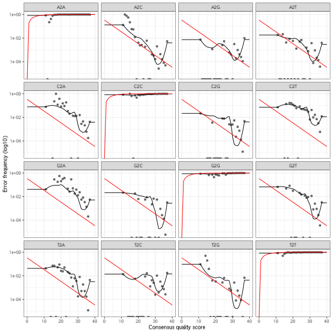
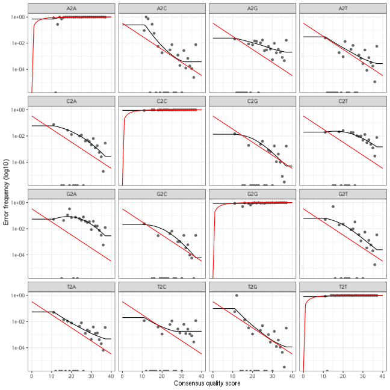
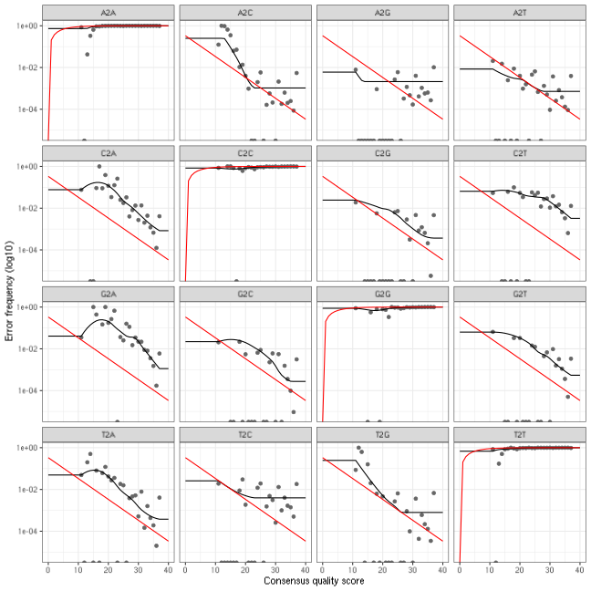
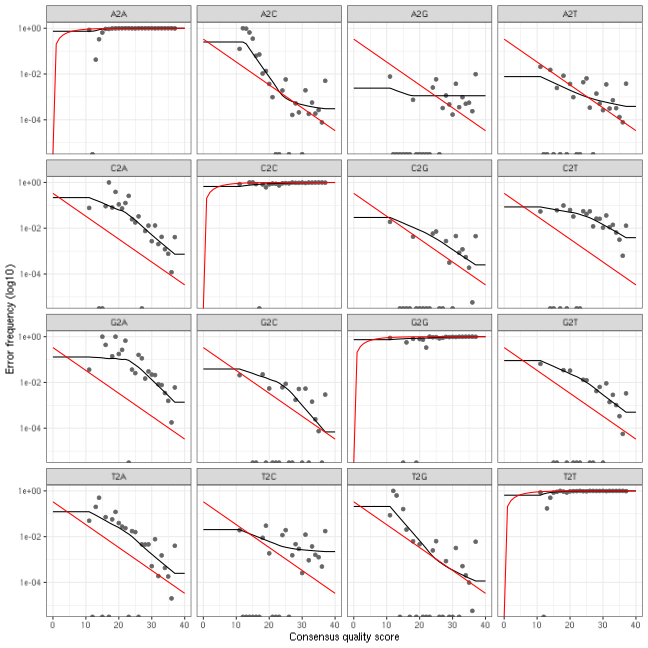
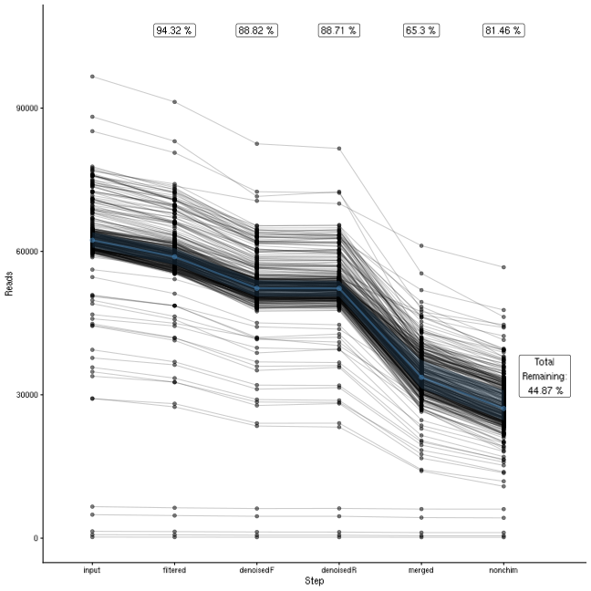

# dada2 tutorial with NovaSeq dataset for Ernakovich Lab

*This tutorial originally created by Angela Oliverio and Hannah
Holland-Moritz. It has been updated for the Ernakovich Lab. Other
contributors to this pipeline include: Corinne Walsh, Matt Gebert, and
Kunkun Fan*  
*Updated October 28, 2021*

This pipeline runs the dada2 workflow for Big Data (paired-end) with
modifications for NovaSeq sequencing base calls

We suggest opening the dada2 tutorial online to understand more about
each step. The original pipeline on which this tutorial is based can be
found here: <https://benjjneb.github.io/dada2/bigdata_paired.html>

| <span>                                                                                                                                                                                                                                                       |
|:-------------------------------------------------------------------------------------------------------------------------------------------------------------------------------------------------------------------------------------------------------------|
| **NOTE:** There is a slightly different pipeline for ITS and non-“Big data” workflows. The non-“Big data” pipeline, in particular, has very nice detailed explanations for each step and can be found here: <https://benjjneb.github.io/dada2/tutorial.html> |
| <span>                                                                                                                                                                                                                                                       |

## Preliminary Checklist (part 0) - Before You Begin

1.  Check to make sure you know what your target ‘AMPLICON’ length. This
    can vary between primer sets, as well as WITHIN primer sets. For
    example, ITS (internal transcribed spacer) amplicon can vary from
    \~100 bps to 300 bps

    For examples regarding commonly used primer sets (515f/806r, Fungal
    ITS2, 1391f/EukBr) see protocols on the Earth Microbiome Project
    website:
    <http://press.igsb.anl.gov/earthmicrobiome/protocols-and-standards/>

2.  Check to make sure you know how long your reads should be (i.e., how
    long should the reads be coming off the sequencer?) This is not the
    same as fragment length, as many times, especially with longer
    fragments, the entire fragment is not being sequenced in one
    direction. When long *amplicons* are not sequenced with a *read
    length* that allows for substantial overlap between the forward and
    reverse read, you can potentially insert biases into the data. If
    you intend to merge your paired end reads, ensure that your read
    length is appropriate. For example, with a MiSeq 2 x 150, 300 cycle
    kit, you will get bidirectional reads of 150 base pairs.

3.  Make note of which sequencing platform was used, as this can impact
    both read quality and downstream analysis. In particular, this
    pipeline is designed to process NovaSeq data which has very
    different quality scores than HiSeq or MiSeq data.

4.  Decide which database is best suited for your analysis needs. Note
    that DADA2 requires databases be in a custom format! If a custom
    database is required, further formatting will be needed to ensure
    that it can run correctly in dada2.

    See the following link for details regarding database formatting:
    <https://benjjneb.github.io/dada2/training.html#formatting-custom-databases>

5.  For additional tutorials and reporting issues, please see link
    below:  
    dada2 tutorial: <https://benjjneb.github.io/dada2/tutorial.html>  
    dada2 pipeline issues\*:
    <https://github.com/fiererlab/dada2_fiererlab/issues>

    \*Note by default, only ‘OPEN’ issues are shown. You can look at all
    issues by removing “is:open” in the search bar at the top.

## Set up (part 1) - Steps before starting pipeline

#### Downloading this tutorial from github

Once you have logged in, you can download a copy of the tutorial into
your directory on the server. To retrieve the folder with this tutorial
from github directly to the server, type the following into your
terminal and hit return after each line.

``` bash
wget https://github.com/ernakovichlab/dada2_ernakovichlab/archive/main.zip
unzip main.zip
```

If there are ever updates to the tutorial on github, you can update the
contents of this folder by downloading the new version from the same
link as above.

#### Setup and install software (you will only need to do this the first time, or if you want to update dada2)

1.  Install the conda environment (this will install all the necessary
    software to run dada2)
2.  First start by cleaning up modules, and then loading the anaconda
    module.

``` bash
module purge
module load anaconda/colsa
```

3.  Next create a conda local environment that you can use to run the
    software. This will install everything you need to run dada2.

``` bash
cd dada2_ernakovichlab
conda env create -f dada2_ernakovich.yml
conda activate dada2_ernakovich
```

| <span>                                                                                                               |
|:---------------------------------------------------------------------------------------------------------------------|
| **WARNING:** This installation may take a long time, so only run this code if you have a fairly large chunk of time! |
| <span>                                                                                                               |

| <span>                                                                                                                                                                                                                                                                                                                                                                                                                                                                                                                                                                                                                                                                                                                                                                                                                                                                                                                                                                                                               |
|:---------------------------------------------------------------------------------------------------------------------------------------------------------------------------------------------------------------------------------------------------------------------------------------------------------------------------------------------------------------------------------------------------------------------------------------------------------------------------------------------------------------------------------------------------------------------------------------------------------------------------------------------------------------------------------------------------------------------------------------------------------------------------------------------------------------------------------------------------------------------------------------------------------------------------------------------------------------------------------------------------------------------|
| **A note about running this on Premise:** To run this on Premise, you will need to submit R-scripts to the job scheduler (slurm). The R scripts in this tutorial can be found in the “R” folder and have been carefully designed so that each step can be run with on slurm with minimal changes. The R scripts are numbered according to their steps. When you are called on to modify a particular step, use a terminal text editor (such as `nano`) to open up the appropriate R script and edit the code accordingly. For your convenience, there is also a folder called “slurm” which contains ready-made slurm scripts that you can use to submit each R script. The slurm scripts are designed to be submitted from the “slurm” folder. You can submit them by using `cd slurm` to navigate into the slurm folder, and `sbatch xxx_dada2_tutorial_16S.slurm` to submit each script. Throughout this pipeline you will see **STOP** notices. These indicate how you should modify the R script at each stage. |
| <span>                                                                                                                                                                                                                                                                                                                                                                                                                                                                                                                                                                                                                                                                                                                                                                                                                                                                                                                                                                                                               |

If you are running it on your own computer (runs slower!):

1.  Download this tutorial from github. Go to [the
    homepage](https://github.com/fiererlab/dada2_fiererlab/dada2_fiererlab),
    and click the green “Clone or download” button. Then click “Download
    ZIP”, to save it to your computer. Unzip the file to access the
    R-script.

2.  Download the tutorial data from here
    <http://cme.colorado.edu/projects/bioinformatics-tutorials>

3.  Install cutadapt. If you are using conda, you may also use the .yml
    file to create an environment with cutadapt and all the necessary R
    packages pre-installed

    - cutadapt can be installed from here:
      <https://cutadapt.readthedocs.io/en/stable/installation.html>

4.  Download the dada2-formatted reference database of your choice. Link
    to download here: <https://benjjneb.github.io/dada2/training.html>

5.  Open the Rmarkdown script in Rstudio. The script is located in the
    tutorial folder you downloaded in the first step. You can navigate
    to the proper folder in Rstudio by clicking on the files tab and
    navigating to the location where you downloaded the github folder.
    Then click dada2_ernakovichlab and dada2_tutorial_16S_all.Rmd to
    open the script.

Now, install DADA2 & other necessary packages(if you haven’t opted for
the conda option). Depending on how you set up Rstudio, you might get a
prompt asking if you want to create your own library. Answer ‘yes’ twice
in the console to continue.

| <span>                                                                                                                  |
|:------------------------------------------------------------------------------------------------------------------------|
| **WARNING:** This installation may take a long time, so only run this code if these packages are not already installed! |
| <span>                                                                                                                  |

``` r
install.packages("BiocManager")
BiocManager::install("dada2", version = "3.8")

source("https://bioconductor.org/biocLite.R")
biocLite("ShortRead")
install.packages("dplyr")
install.packages("tidyr")
install.packages("Hmisc")
install.packages("ggplot2")
install.packages("plotly")
```

Once the packages are installed, you can check to make sure the
auxiliary software is working and set up some of the variables that you
will need along the way.

| <span>                                                                                                                                               |
|:-----------------------------------------------------------------------------------------------------------------------------------------------------|
| **NOTE:** If you are not working from premise, you will need to change the file paths for cutadapt to where they are stored on your computer/server. |
| <span>                                                                                                                                               |

For this tutorial we will be working with some samples that we obtained
16S amplicon data for, from a Illumina Miseq run. The data for these
samples can be found on the CME website.
<http://cme.colorado.edu/projects/bioinformatics-tutorials>

## Set up (part 2) - You are logged in to premise (or have Rstudio open on your computer)

First load and test the installed packages to make sure they’re working

``` r
R.version$version.string # prints R version
## [1] "R version 4.4.2 (2024-10-31)"

# create a new library in my home directory where new installed packages can be stored
new_library='/home/WUR/kreek001/.R_442_ext/'
dir.create(file.path(new_library), showWarnings = TRUE)
.libPaths(c(new_library, .libPaths()) )
.libPaths()
## [1] "/home/WUR/kreek001/.R_442_ext"                                              
## [2] "/shared/easybuild/software/noble/2024/zen3/R/4.4.2-gfbf-2024a/lib/R/library"

# Install BiocManager if not already installed
if (!requireNamespace("BiocManager", quietly = TRUE)) {
    install.packages("BiocManager", lib = new_library, repos = "https://cloud.r-project.org")
}

# Install DADA2 using BiocManager
if (!requireNamespace("dada2", quietly = TRUE)) {
    BiocManager::install("dada2", lib = new_library, ask = FALSE, update = TRUE)
}

# Install ShortRead using BiocManager
if (!requireNamespace("ShortRead", quietly = TRUE)) {
    BiocManager::install("ShortRead", lib = new_library, ask = FALSE, update = TRUE)
}

# Install dplyr if needed
if (!requireNamespace("dplyr", quietly = TRUE)) {
    install.packages("dplyr", repos = "http://cran.r-project.org", lib = new_library, dependencies = TRUE)
}

# Install tidyr if needed
if (!requireNamespace("tidyr", quietly = TRUE)) {
    install.packages("tidyr", repos = "http://cran.r-project.org", lib = new_library, dependencies = TRUE)
}

# Install Hmisc if needed
if (!requireNamespace("Hmisc", quietly = TRUE)) {
    install.packages("Hmisc", repos = "http://cran.r-project.org", lib = new_library, dependencies = TRUE)
}

# Install ggplot2 if needed
if (!requireNamespace("ggplot2", quietly = TRUE)) {
    install.packages("ggplot2", repos = "http://cran.r-project.org", lib = new_library, dependencies = TRUE)
}

# Install plotly if needed
if (!requireNamespace("plotly", quietly = TRUE)) {
    install.packages("plotly", repos = "http://cran.r-project.org", lib = new_library, dependencies = TRUE)
}


library(dada2); packageVersion("dada2") # the dada2 pipeline
## [1] '1.34.0'
library(ShortRead); packageVersion("ShortRead") # dada2 depends on this
## [1] '1.64.0'
library(dplyr); packageVersion("dplyr") # for manipulating data
## [1] '1.1.4'
library(tidyr); packageVersion("tidyr") # for creating the final graph at the end of the pipeline
## [1] '1.3.1'
library(Hmisc); packageVersion("Hmisc") # for creating the final graph at the end of the pipeline
## [1] '5.2.3'
library(ggplot2); packageVersion("ggplot2") # for creating the final graph at the end of the pipeline
## [1] '4.0.0'
library(plotly); packageVersion("plotly") # enables creation of interactive graphs, especially helpful for quality plots
## [1] '4.11.0'

# Set up pathway to cutadapt (primer trimming tool) and test
cutadapt <- "cutadapt" # CHANGE ME if not on premise; will probably look something like this: "/usr/local/Python27/bin/cutadapt"
system2(cutadapt, args = "--version") # Check by running shell command from R
```

We will now set up the directories for the script. We’ll tell the script
where our data is, and where we want to put the outputs of the script.
We highly recommend NOT putting outputs of this script directly into
your home directory, or into this tutorial directory. A better idea is
to create a new project directory to hold the output each project you
work on.

``` r
# Set path to shared data folder and contents
data.fp <- "/lustre/nobackup/INDIVIDUAL/kreek001/TwelveAccessionExp_RawReads_AllData"

# List all files in shared folder to check path
list.files(data.fp)
##   [1] "Blank2.raw_1.fastq.gz" "Blank2.raw_2.fastq.gz" "Blank3.raw_1.fastq.gz"
##   [4] "Blank3.raw_2.fastq.gz" "Blank4.raw_1.fastq.gz" "Blank4.raw_2.fastq.gz"
##   [7] "Blank5.raw_1.fastq.gz" "Blank5.raw_2.fastq.gz" "Blank6.raw_1.fastq.gz"
##  [10] "Blank6.raw_2.fastq.gz" "C005.raw_1.fastq.gz"   "C005.raw_2.fastq.gz"  
##  [13] "C006.raw_1.fastq.gz"   "C006.raw_2.fastq.gz"   "C007.raw_1.fastq.gz"  
##  [16] "C007.raw_2.fastq.gz"   "C009.raw_1.fastq.gz"   "C009.raw_2.fastq.gz"  
##  [19] "C010.raw_1.fastq.gz"   "C010.raw_2.fastq.gz"   "C015.raw_1.fastq.gz"  
##  [22] "C015.raw_2.fastq.gz"   "C016.raw_1.fastq.gz"   "C016.raw_2.fastq.gz"  
##  [25] "C017.raw_1.fastq.gz"   "C017.raw_2.fastq.gz"   "C018.raw_1.fastq.gz"  
##  [28] "C018.raw_2.fastq.gz"   "C019.raw_1.fastq.gz"   "C019.raw_2.fastq.gz"  
##  [31] "C020.raw_1.fastq.gz"   "C020.raw_2.fastq.gz"   "C025.raw_1.fastq.gz"  
##  [34] "C025.raw_2.fastq.gz"   "C026.raw_1.fastq.gz"   "C026.raw_2.fastq.gz"  
##  [37] "C027.raw_1.fastq.gz"   "C027.raw_2.fastq.gz"   "C028.raw_1.fastq.gz"  
##  [40] "C028.raw_2.fastq.gz"   "C029.raw_1.fastq.gz"   "C029.raw_2.fastq.gz"  
##  [43] "C030.raw_1.fastq.gz"   "C030.raw_2.fastq.gz"   "C035.raw_1.fastq.gz"  
##  [46] "C035.raw_2.fastq.gz"   "C036.raw_1.fastq.gz"   "C036.raw_2.fastq.gz"  
##  [49] "C037.raw_1.fastq.gz"   "C037.raw_2.fastq.gz"   "C038.raw_1.fastq.gz"  
##  [52] "C038.raw_2.fastq.gz"   "C039.raw_1.fastq.gz"   "C039.raw_2.fastq.gz"  
##  [55] "C040.raw_1.fastq.gz"   "C040.raw_2.fastq.gz"   "C043.raw_1.fastq.gz"  
##  [58] "C043.raw_2.fastq.gz"   "C045.raw_1.fastq.gz"   "C045.raw_2.fastq.gz"  
##  [61] "C047.raw_1.fastq.gz"   "C047.raw_2.fastq.gz"   "C048.raw_1.fastq.gz"  
##  [64] "C048.raw_2.fastq.gz"   "C050.raw_1.fastq.gz"   "C050.raw_2.fastq.gz"  
##  [67] "C055.raw_1.fastq.gz"   "C055.raw_2.fastq.gz"   "C056.raw_1.fastq.gz"  
##  [70] "C056.raw_2.fastq.gz"   "C057.raw_1.fastq.gz"   "C057.raw_2.fastq.gz"  
##  [73] "C058.raw_1.fastq.gz"   "C058.raw_2.fastq.gz"   "C059.raw_1.fastq.gz"  
##  [76] "C059.raw_2.fastq.gz"   "C060.raw_1.fastq.gz"   "C060.raw_2.fastq.gz"  
##  [79] "C064.raw_1.fastq.gz"   "C064.raw_2.fastq.gz"   "C065.raw_1.fastq.gz"  
##  [82] "C065.raw_2.fastq.gz"   "C066.raw_1.fastq.gz"   "C066.raw_2.fastq.gz"  
##  [85] "C067.raw_1.fastq.gz"   "C067.raw_2.fastq.gz"   "C068.raw_1.fastq.gz"  
##  [88] "C068.raw_2.fastq.gz"   "C069.raw_1.fastq.gz"   "C069.raw_2.fastq.gz"  
##  [91] "C075.raw_1.fastq.gz"   "C075.raw_2.fastq.gz"   "C076.raw_1.fastq.gz"  
##  [94] "C076.raw_2.fastq.gz"   "C077.raw_1.fastq.gz"   "C077.raw_2.fastq.gz"  
##  [97] "C078.raw_1.fastq.gz"   "C078.raw_2.fastq.gz"   "C079.raw_1.fastq.gz"  
## [100] "C079.raw_2.fastq.gz"   "C080.raw_1.fastq.gz"   "C080.raw_2.fastq.gz"  
## [103] "C085.raw_1.fastq.gz"   "C085.raw_2.fastq.gz"   "C086.raw_1.fastq.gz"  
## [106] "C086.raw_2.fastq.gz"   "C087.raw_1.fastq.gz"   "C087.raw_2.fastq.gz"  
## [109] "C088.raw_1.fastq.gz"   "C088.raw_2.fastq.gz"   "C089.raw_1.fastq.gz"  
## [112] "C089.raw_2.fastq.gz"   "C090.raw_1.fastq.gz"   "C090.raw_2.fastq.gz"  
## [115] "C094.raw_1.fastq.gz"   "C094.raw_2.fastq.gz"   "C095.raw_1.fastq.gz"  
## [118] "C095.raw_2.fastq.gz"   "C096.raw_1.fastq.gz"   "C096.raw_2.fastq.gz"  
## [121] "C097.raw_1.fastq.gz"   "C097.raw_2.fastq.gz"   "C099.raw_1.fastq.gz"  
## [124] "C099.raw_2.fastq.gz"   "C101.raw_1.fastq.gz"   "C101.raw_2.fastq.gz"  
## [127] "C104.raw_1.fastq.gz"   "C104.raw_2.fastq.gz"   "C105.raw_1.fastq.gz"  
## [130] "C105.raw_2.fastq.gz"   "C106.raw_1.fastq.gz"   "C106.raw_2.fastq.gz"  
## [133] "C110.raw_1.fastq.gz"   "C110.raw_2.fastq.gz"   "C113.raw_1.fastq.gz"  
## [136] "C113.raw_2.fastq.gz"   "C115.raw_1.fastq.gz"   "C115.raw_2.fastq.gz"  
## [139] "C116.raw_1.fastq.gz"   "C116.raw_2.fastq.gz"   "C117.raw_1.fastq.gz"  
## [142] "C117.raw_2.fastq.gz"   "C118.raw_1.fastq.gz"   "C118.raw_2.fastq.gz"  
## [145] "C120.raw_1.fastq.gz"   "C120.raw_2.fastq.gz"   "C126.raw_1.fastq.gz"  
## [148] "C126.raw_2.fastq.gz"   "C127.raw_1.fastq.gz"   "C127.raw_2.fastq.gz"  
## [151] "C128.raw_1.fastq.gz"   "C128.raw_2.fastq.gz"   "C129.raw_1.fastq.gz"  
## [154] "C129.raw_2.fastq.gz"   "C130.raw_1.fastq.gz"   "C130.raw_2.fastq.gz"  
## [157] "C135.raw_1.fastq.gz"   "C135.raw_2.fastq.gz"   "C136.raw_1.fastq.gz"  
## [160] "C136.raw_2.fastq.gz"   "C137.raw_1.fastq.gz"   "C137.raw_2.fastq.gz"  
## [163] "C138.raw_1.fastq.gz"   "C138.raw_2.fastq.gz"   "C139.raw_1.fastq.gz"  
## [166] "C139.raw_2.fastq.gz"   "C140.raw_1.fastq.gz"   "C140.raw_2.fastq.gz"  
## [169] "C145.raw_1.fastq.gz"   "C145.raw_2.fastq.gz"   "C146.raw_1.fastq.gz"  
## [172] "C146.raw_2.fastq.gz"   "C147.raw_1.fastq.gz"   "C147.raw_2.fastq.gz"  
## [175] "C148.raw_1.fastq.gz"   "C148.raw_2.fastq.gz"   "C149.raw_1.fastq.gz"  
## [178] "C149.raw_2.fastq.gz"   "C150.raw_1.fastq.gz"   "C150.raw_2.fastq.gz"  
## [181] "C155.raw_1.fastq.gz"   "C155.raw_2.fastq.gz"   "C156.raw_1.fastq.gz"  
## [184] "C156.raw_2.fastq.gz"   "C157.raw_1.fastq.gz"   "C157.raw_2.fastq.gz"  
## [187] "C158.raw_1.fastq.gz"   "C158.raw_2.fastq.gz"   "C159.raw_1.fastq.gz"  
## [190] "C159.raw_2.fastq.gz"   "C160.raw_1.fastq.gz"   "C160.raw_2.fastq.gz"  
## [193] "C165.raw_1.fastq.gz"   "C165.raw_2.fastq.gz"   "C166.raw_1.fastq.gz"  
## [196] "C166.raw_2.fastq.gz"   "C167.raw_1.fastq.gz"   "C167.raw_2.fastq.gz"  
## [199] "C168.raw_1.fastq.gz"   "C168.raw_2.fastq.gz"   "C169.raw_1.fastq.gz"  
## [202] "C169.raw_2.fastq.gz"   "C170.raw_1.fastq.gz"   "C170.raw_2.fastq.gz"  
## [205] "C175.raw_1.fastq.gz"   "C175.raw_2.fastq.gz"   "C176.raw_1.fastq.gz"  
## [208] "C176.raw_2.fastq.gz"   "C177.raw_1.fastq.gz"   "C177.raw_2.fastq.gz"  
## [211] "C178.raw_1.fastq.gz"   "C178.raw_2.fastq.gz"   "C179.raw_1.fastq.gz"  
## [214] "C179.raw_2.fastq.gz"   "C180.raw_1.fastq.gz"   "C180.raw_2.fastq.gz"  
## [217] "C185.raw_1.fastq.gz"   "C185.raw_2.fastq.gz"   "C186.raw_1.fastq.gz"  
## [220] "C186.raw_2.fastq.gz"   "C187.raw_1.fastq.gz"   "C187.raw_2.fastq.gz"  
## [223] "C188.raw_1.fastq.gz"   "C188.raw_2.fastq.gz"   "C189.raw_1.fastq.gz"  
## [226] "C189.raw_2.fastq.gz"   "C190.raw_1.fastq.gz"   "C190.raw_2.fastq.gz"  
## [229] "C195.raw_1.fastq.gz"   "C195.raw_2.fastq.gz"   "C196.raw_1.fastq.gz"  
## [232] "C196.raw_2.fastq.gz"   "C197.raw_1.fastq.gz"   "C197.raw_2.fastq.gz"  
## [235] "C198.raw_1.fastq.gz"   "C198.raw_2.fastq.gz"   "C199.raw_1.fastq.gz"  
## [238] "C199.raw_2.fastq.gz"   "C200.raw_1.fastq.gz"   "C200.raw_2.fastq.gz"  
## [241] "C205.raw_1.fastq.gz"   "C205.raw_2.fastq.gz"   "C206.raw_1.fastq.gz"  
## [244] "C206.raw_2.fastq.gz"   "C207.raw_1.fastq.gz"   "C207.raw_2.fastq.gz"  
## [247] "C208.raw_1.fastq.gz"   "C208.raw_2.fastq.gz"   "C209.raw_1.fastq.gz"  
## [250] "C209.raw_2.fastq.gz"   "C210.raw_1.fastq.gz"   "C210.raw_2.fastq.gz"  
## [253] "C215.raw_1.fastq.gz"   "C215.raw_2.fastq.gz"   "C216.raw_1.fastq.gz"  
## [256] "C216.raw_2.fastq.gz"   "C217.raw_1.fastq.gz"   "C217.raw_2.fastq.gz"  
## [259] "C218.raw_1.fastq.gz"   "C218.raw_2.fastq.gz"   "C219.raw_1.fastq.gz"  
## [262] "C219.raw_2.fastq.gz"   "C220.raw_1.fastq.gz"   "C220.raw_2.fastq.gz"  
## [265] "C225.raw_1.fastq.gz"   "C225.raw_2.fastq.gz"   "C226.raw_1.fastq.gz"  
## [268] "C226.raw_2.fastq.gz"   "C227.raw_1.fastq.gz"   "C227.raw_2.fastq.gz"  
## [271] "C228.raw_1.fastq.gz"   "C228.raw_2.fastq.gz"   "C229.raw_1.fastq.gz"  
## [274] "C229.raw_2.fastq.gz"   "C230.raw_1.fastq.gz"   "C230.raw_2.fastq.gz"  
## [277] "C235.raw_1.fastq.gz"   "C235.raw_2.fastq.gz"   "C236.raw_1.fastq.gz"  
## [280] "C236.raw_2.fastq.gz"   "C237.raw_1.fastq.gz"   "C237.raw_2.fastq.gz"  
## [283] "C238.raw_1.fastq.gz"   "C238.raw_2.fastq.gz"   "C239.raw_1.fastq.gz"  
## [286] "C239.raw_2.fastq.gz"   "C240.raw_1.fastq.gz"   "C240.raw_2.fastq.gz"  
## [289] "C245.raw_1.fastq.gz"   "C245.raw_2.fastq.gz"   "C246.raw_1.fastq.gz"  
## [292] "C246.raw_2.fastq.gz"   "C247.raw_1.fastq.gz"   "C247.raw_2.fastq.gz"  
## [295] "C248.raw_1.fastq.gz"   "C248.raw_2.fastq.gz"   "C249.raw_1.fastq.gz"  
## [298] "C249.raw_2.fastq.gz"   "C250.raw_1.fastq.gz"   "C250.raw_2.fastq.gz"  
## [301] "C255.raw_1.fastq.gz"   "C255.raw_2.fastq.gz"   "C256.raw_1.fastq.gz"  
## [304] "C256.raw_2.fastq.gz"   "C257.raw_1.fastq.gz"   "C257.raw_2.fastq.gz"  
## [307] "C258.raw_1.fastq.gz"   "C258.raw_2.fastq.gz"   "C259.raw_1.fastq.gz"  
## [310] "C259.raw_2.fastq.gz"   "C260.raw_1.fastq.gz"   "C260.raw_2.fastq.gz"  
## [313] "C265.raw_1.fastq.gz"   "C265.raw_2.fastq.gz"   "C266.raw_1.fastq.gz"  
## [316] "C266.raw_2.fastq.gz"   "C267.raw_1.fastq.gz"   "C267.raw_2.fastq.gz"  
## [319] "C268.raw_1.fastq.gz"   "C268.raw_2.fastq.gz"   "C269.raw_1.fastq.gz"  
## [322] "C269.raw_2.fastq.gz"   "C270.raw_1.fastq.gz"   "C270.raw_2.fastq.gz"  
## [325] "C275.raw_1.fastq.gz"   "C275.raw_2.fastq.gz"   "C276.raw_1.fastq.gz"  
## [328] "C276.raw_2.fastq.gz"   "C277.raw_1.fastq.gz"   "C277.raw_2.fastq.gz"  
## [331] "C278.raw_1.fastq.gz"   "C278.raw_2.fastq.gz"   "C279.raw_1.fastq.gz"  
## [334] "C279.raw_2.fastq.gz"   "C285.raw_1.fastq.gz"   "C285.raw_2.fastq.gz"  
## [337] "C286.raw_1.fastq.gz"   "C286.raw_2.fastq.gz"   "C287.raw_1.fastq.gz"  
## [340] "C287.raw_2.fastq.gz"   "C288.raw_1.fastq.gz"   "C288.raw_2.fastq.gz"  
## [343] "C289.raw_1.fastq.gz"   "C289.raw_2.fastq.gz"   "C290.raw_1.fastq.gz"  
## [346] "C290.raw_2.fastq.gz"   "C295.raw_1.fastq.gz"   "C295.raw_2.fastq.gz"  
## [349] "C296.raw_1.fastq.gz"   "C296.raw_2.fastq.gz"   "C297.raw_1.fastq.gz"  
## [352] "C297.raw_2.fastq.gz"   "C298.raw_1.fastq.gz"   "C298.raw_2.fastq.gz"  
## [355] "C299.raw_1.fastq.gz"   "C299.raw_2.fastq.gz"   "C300.raw_1.fastq.gz"  
## [358] "C300.raw_2.fastq.gz"   "C305.raw_1.fastq.gz"   "C305.raw_2.fastq.gz"  
## [361] "C306.raw_1.fastq.gz"   "C306.raw_2.fastq.gz"   "C307.raw_1.fastq.gz"  
## [364] "C307.raw_2.fastq.gz"   "C308.raw_1.fastq.gz"   "C308.raw_2.fastq.gz"  
## [367] "C309.raw_1.fastq.gz"   "C309.raw_2.fastq.gz"   "C310.raw_1.fastq.gz"  
## [370] "C310.raw_2.fastq.gz"   "C315.raw_1.fastq.gz"   "C315.raw_2.fastq.gz"  
## [373] "C316.raw_1.fastq.gz"   "C316.raw_2.fastq.gz"   "C317.raw_1.fastq.gz"  
## [376] "C317.raw_2.fastq.gz"   "C318.raw_1.fastq.gz"   "C318.raw_2.fastq.gz"  
## [379] "C319.raw_1.fastq.gz"   "C319.raw_2.fastq.gz"   "C320.raw_1.fastq.gz"  
## [382] "C320.raw_2.fastq.gz"   "C323.raw_1.fastq.gz"   "C323.raw_2.fastq.gz"  
## [385] "C326.raw_1.fastq.gz"   "C326.raw_2.fastq.gz"   "C327.raw_1.fastq.gz"  
## [388] "C327.raw_2.fastq.gz"   "C328.raw_1.fastq.gz"   "C328.raw_2.fastq.gz"  
## [391] "C329.raw_1.fastq.gz"   "C329.raw_2.fastq.gz"   "C330.raw_1.fastq.gz"  
## [394] "C330.raw_2.fastq.gz"   "C335.raw_1.fastq.gz"   "C335.raw_2.fastq.gz"  
## [397] "C336.raw_1.fastq.gz"   "C336.raw_2.fastq.gz"   "C337.raw_1.fastq.gz"  
## [400] "C337.raw_2.fastq.gz"   "C338.raw_1.fastq.gz"   "C338.raw_2.fastq.gz"  
## [403] "C339.raw_1.fastq.gz"   "C339.raw_2.fastq.gz"   "C340.raw_1.fastq.gz"  
## [406] "C340.raw_2.fastq.gz"   "C345.raw_1.fastq.gz"   "C345.raw_2.fastq.gz"  
## [409] "C346.raw_1.fastq.gz"   "C346.raw_2.fastq.gz"   "C347.raw_1.fastq.gz"  
## [412] "C347.raw_2.fastq.gz"   "C348.raw_1.fastq.gz"   "C348.raw_2.fastq.gz"  
## [415] "C349.raw_1.fastq.gz"   "C349.raw_2.fastq.gz"   "C350.raw_1.fastq.gz"  
## [418] "C350.raw_2.fastq.gz"   "C355.raw_1.fastq.gz"   "C355.raw_2.fastq.gz"  
## [421] "C356.raw_1.fastq.gz"   "C356.raw_2.fastq.gz"   "C357.raw_1.fastq.gz"  
## [424] "C357.raw_2.fastq.gz"   "C358.raw_1.fastq.gz"   "C358.raw_2.fastq.gz"  
## [427] "C359.raw_1.fastq.gz"   "C359.raw_2.fastq.gz"   "C360.raw_1.fastq.gz"  
## [430] "C360.raw_2.fastq.gz"   "C365.raw_1.fastq.gz"   "C365.raw_2.fastq.gz"  
## [433] "C366.raw_1.fastq.gz"   "C366.raw_2.fastq.gz"   "C367.raw_1.fastq.gz"  
## [436] "C367.raw_2.fastq.gz"   "C368.raw_1.fastq.gz"   "C368.raw_2.fastq.gz"  
## [439] "C369.raw_1.fastq.gz"   "C369.raw_2.fastq.gz"   "C370.raw_1.fastq.gz"  
## [442] "C370.raw_2.fastq.gz"   "C375.raw_1.fastq.gz"   "C375.raw_2.fastq.gz"  
## [445] "C376.raw_1.fastq.gz"   "C376.raw_2.fastq.gz"   "C377.raw_1.fastq.gz"  
## [448] "C377.raw_2.fastq.gz"   "C378.raw_1.fastq.gz"   "C378.raw_2.fastq.gz"  
## [451] "C379.raw_1.fastq.gz"   "C379.raw_2.fastq.gz"   "C380.raw_1.fastq.gz"  
## [454] "C380.raw_2.fastq.gz"   "C385.raw_1.fastq.gz"   "C385.raw_2.fastq.gz"  
## [457] "C386.raw_1.fastq.gz"   "C386.raw_2.fastq.gz"   "C387.raw_1.fastq.gz"  
## [460] "C387.raw_2.fastq.gz"   "C388.raw_1.fastq.gz"   "C388.raw_2.fastq.gz"  
## [463] "C389.raw_1.fastq.gz"   "C389.raw_2.fastq.gz"   "C390.raw_1.fastq.gz"  
## [466] "C390.raw_2.fastq.gz"   "C395.raw_1.fastq.gz"   "C395.raw_2.fastq.gz"  
## [469] "C396.raw_1.fastq.gz"   "C396.raw_2.fastq.gz"   "C397.raw_1.fastq.gz"  
## [472] "C397.raw_2.fastq.gz"   "C398.raw_1.fastq.gz"   "C398.raw_2.fastq.gz"  
## [475] "C399.raw_1.fastq.gz"   "C399.raw_2.fastq.gz"   "C400.raw_1.fastq.gz"  
## [478] "C400.raw_2.fastq.gz"   "C405.raw_1.fastq.gz"   "C405.raw_2.fastq.gz"  
## [481] "C406.raw_1.fastq.gz"   "C406.raw_2.fastq.gz"   "C407.raw_1.fastq.gz"  
## [484] "C407.raw_2.fastq.gz"   "C408.raw_1.fastq.gz"   "C408.raw_2.fastq.gz"  
## [487] "C409.raw_1.fastq.gz"   "C409.raw_2.fastq.gz"   "C410.raw_1.fastq.gz"  
## [490] "C410.raw_2.fastq.gz"   "C415.raw_1.fastq.gz"   "C415.raw_2.fastq.gz"  
## [493] "C416.raw_1.fastq.gz"   "C416.raw_2.fastq.gz"   "C417.raw_1.fastq.gz"  
## [496] "C417.raw_2.fastq.gz"   "C418.raw_1.fastq.gz"   "C418.raw_2.fastq.gz"  
## [499] "C419.raw_1.fastq.gz"   "C419.raw_2.fastq.gz"   "C420.raw_1.fastq.gz"  
## [502] "C420.raw_2.fastq.gz"   "C425.raw_1.fastq.gz"   "C425.raw_2.fastq.gz"  
## [505] "C426.raw_1.fastq.gz"   "C426.raw_2.fastq.gz"   "C427.raw_1.fastq.gz"  
## [508] "C427.raw_2.fastq.gz"   "C428.raw_1.fastq.gz"   "C428.raw_2.fastq.gz"  
## [511] "C429.raw_1.fastq.gz"   "C429.raw_2.fastq.gz"   "C430.raw_1.fastq.gz"  
## [514] "C430.raw_2.fastq.gz"   "C435.raw_1.fastq.gz"   "C435.raw_2.fastq.gz"  
## [517] "C436.raw_1.fastq.gz"   "C436.raw_2.fastq.gz"   "C437.raw_1.fastq.gz"  
## [520] "C437.raw_2.fastq.gz"   "C438.raw_1.fastq.gz"   "C438.raw_2.fastq.gz"  
## [523] "C439.raw_1.fastq.gz"   "C439.raw_2.fastq.gz"   "C440.raw_1.fastq.gz"  
## [526] "C440.raw_2.fastq.gz"   "C444.raw_1.fastq.gz"   "C444.raw_2.fastq.gz"  
## [529] "C445.raw_1.fastq.gz"   "C445.raw_2.fastq.gz"   "C447.raw_1.fastq.gz"  
## [532] "C447.raw_2.fastq.gz"   "C448.raw_1.fastq.gz"   "C448.raw_2.fastq.gz"  
## [535] "C449.raw_1.fastq.gz"   "C449.raw_2.fastq.gz"   "C450.raw_1.fastq.gz"  
## [538] "C450.raw_2.fastq.gz"   "C455.raw_1.fastq.gz"   "C455.raw_2.fastq.gz"  
## [541] "C456.raw_1.fastq.gz"   "C456.raw_2.fastq.gz"   "C457.raw_1.fastq.gz"  
## [544] "C457.raw_2.fastq.gz"   "C458.raw_1.fastq.gz"   "C458.raw_2.fastq.gz"  
## [547] "C459.raw_1.fastq.gz"   "C459.raw_2.fastq.gz"   "C460.raw_1.fastq.gz"  
## [550] "C460.raw_2.fastq.gz"   "C462.raw_1.fastq.gz"   "C462.raw_2.fastq.gz"  
## [553] "C465.raw_1.fastq.gz"   "C465.raw_2.fastq.gz"   "C466.raw_1.fastq.gz"  
## [556] "C466.raw_2.fastq.gz"   "C467.raw_1.fastq.gz"   "C467.raw_2.fastq.gz"  
## [559] "C468.raw_1.fastq.gz"   "C468.raw_2.fastq.gz"   "C470.raw_1.fastq.gz"  
## [562] "C470.raw_2.fastq.gz"   "C475.raw_1.fastq.gz"   "C475.raw_2.fastq.gz"  
## [565] "C476.raw_1.fastq.gz"   "C476.raw_2.fastq.gz"   "C477.raw_1.fastq.gz"  
## [568] "C477.raw_2.fastq.gz"   "C478.raw_1.fastq.gz"   "C478.raw_2.fastq.gz"  
## [571] "C479.raw_1.fastq.gz"   "C479.raw_2.fastq.gz"   "C480.raw_1.fastq.gz"  
## [574] "C480.raw_2.fastq.gz"   "CE33.raw_1.fastq.gz"   "CE33.raw_2.fastq.gz"  
## [577] "CTRL1.raw_1.fastq.gz"  "CTRL1.raw_2.fastq.gz"  "CTRL10.raw_1.fastq.gz"
## [580] "CTRL10.raw_2.fastq.gz" "CTRL2.raw_1.fastq.gz"  "CTRL2.raw_2.fastq.gz" 
## [583] "CTRL3.raw_1.fastq.gz"  "CTRL3.raw_2.fastq.gz"  "CTRL4.raw_1.fastq.gz" 
## [586] "CTRL4.raw_2.fastq.gz"  "CTRL5.raw_1.fastq.gz"  "CTRL5.raw_2.fastq.gz" 
## [589] "CTRL6.raw_1.fastq.gz"  "CTRL6.raw_2.fastq.gz"  "CTRL7.raw_1.fastq.gz" 
## [592] "CTRL7.raw_2.fastq.gz"  "CTRL8.raw_1.fastq.gz"  "CTRL8.raw_2.fastq.gz" 
## [595] "CTRL9.raw_1.fastq.gz"  "CTRL9.raw_2.fastq.gz"  "F005.raw_1.fastq.gz"  
## [598] "F005.raw_2.fastq.gz"   "F006.raw_1.fastq.gz"   "F006.raw_2.fastq.gz"  
## [601] "F007.raw_1.fastq.gz"   "F007.raw_2.fastq.gz"   "F008.raw_1.fastq.gz"  
## [604] "F008.raw_2.fastq.gz"   "F009.raw_1.fastq.gz"   "F009.raw_2.fastq.gz"  
## [607] "F010.raw_1.fastq.gz"   "F010.raw_2.fastq.gz"   "F015.raw_1.fastq.gz"  
## [610] "F015.raw_2.fastq.gz"   "F016.raw_1.fastq.gz"   "F016.raw_2.fastq.gz"  
## [613] "F017.raw_1.fastq.gz"   "F017.raw_2.fastq.gz"   "F018.raw_1.fastq.gz"  
## [616] "F018.raw_2.fastq.gz"   "F019.raw_1.fastq.gz"   "F019.raw_2.fastq.gz"  
## [619] "F020.raw_1.fastq.gz"   "F020.raw_2.fastq.gz"   "F025.raw_1.fastq.gz"  
## [622] "F025.raw_2.fastq.gz"   "F026.raw_1.fastq.gz"   "F026.raw_2.fastq.gz"  
## [625] "F027.raw_1.fastq.gz"   "F027.raw_2.fastq.gz"   "F029.raw_1.fastq.gz"  
## [628] "F029.raw_2.fastq.gz"   "F030.raw_1.fastq.gz"   "F030.raw_2.fastq.gz"  
## [631] "F035.raw_1.fastq.gz"   "F035.raw_2.fastq.gz"   "F036.raw_1.fastq.gz"  
## [634] "F036.raw_2.fastq.gz"   "F037.raw_1.fastq.gz"   "F037.raw_2.fastq.gz"  
## [637] "F038.raw_1.fastq.gz"   "F038.raw_2.fastq.gz"   "F039.raw_1.fastq.gz"  
## [640] "F039.raw_2.fastq.gz"   "F040.raw_1.fastq.gz"   "F040.raw_2.fastq.gz"  
## [643] "F085.raw_1.fastq.gz"   "F085.raw_2.fastq.gz"   "F086.raw_1.fastq.gz"  
## [646] "F086.raw_2.fastq.gz"   "F087.raw_1.fastq.gz"   "F087.raw_2.fastq.gz"  
## [649] "F088.raw_1.fastq.gz"   "F088.raw_2.fastq.gz"   "F089.raw_1.fastq.gz"  
## [652] "F089.raw_2.fastq.gz"   "F090.raw_1.fastq.gz"   "F090.raw_2.fastq.gz"  
## [655] "F095.raw_1.fastq.gz"   "F095.raw_2.fastq.gz"   "F096.raw_1.fastq.gz"  
## [658] "F096.raw_2.fastq.gz"   "F097.raw_1.fastq.gz"   "F097.raw_2.fastq.gz"  
## [661] "F098.raw_1.fastq.gz"   "F098.raw_2.fastq.gz"   "F099.raw_1.fastq.gz"  
## [664] "F099.raw_2.fastq.gz"   "F100.raw_1.fastq.gz"   "F100.raw_2.fastq.gz"  
## [667] "F105.raw_1.fastq.gz"   "F105.raw_2.fastq.gz"   "F106.raw_1.fastq.gz"  
## [670] "F106.raw_2.fastq.gz"   "F107.raw_1.fastq.gz"   "F107.raw_2.fastq.gz"  
## [673] "F108.raw_1.fastq.gz"   "F108.raw_2.fastq.gz"   "F109.raw_1.fastq.gz"  
## [676] "F109.raw_2.fastq.gz"   "F110.raw_1.fastq.gz"   "F110.raw_2.fastq.gz"  
## [679] "F115.raw_1.fastq.gz"   "F115.raw_2.fastq.gz"   "F116.raw_1.fastq.gz"  
## [682] "F116.raw_2.fastq.gz"   "F117.raw_1.fastq.gz"   "F117.raw_2.fastq.gz"  
## [685] "F118.raw_1.fastq.gz"   "F118.raw_2.fastq.gz"   "F119.raw_1.fastq.gz"  
## [688] "F119.raw_2.fastq.gz"   "F120.raw_1.fastq.gz"   "F120.raw_2.fastq.gz"  
## [691] "F175.raw_1.fastq.gz"   "F175.raw_2.fastq.gz"   "F176.raw_1.fastq.gz"  
## [694] "F176.raw_2.fastq.gz"   "F177.raw_1.fastq.gz"   "F177.raw_2.fastq.gz"  
## [697] "F178.raw_1.fastq.gz"   "F178.raw_2.fastq.gz"   "F179.raw_1.fastq.gz"  
## [700] "F179.raw_2.fastq.gz"   "F180.raw_1.fastq.gz"   "F180.raw_2.fastq.gz"  
## [703] "F193.raw_1.fastq.gz"   "F193.raw_2.fastq.gz"   "F194.raw_1.fastq.gz"  
## [706] "F194.raw_2.fastq.gz"   "F195.raw_1.fastq.gz"   "F195.raw_2.fastq.gz"  
## [709] "F197.raw_1.fastq.gz"   "F197.raw_2.fastq.gz"   "F199.raw_1.fastq.gz"  
## [712] "F199.raw_2.fastq.gz"   "F200.raw_1.fastq.gz"   "F200.raw_2.fastq.gz"  
## [715] "F371.raw_1.fastq.gz"   "F371.raw_2.fastq.gz"   "F372.raw_1.fastq.gz"  
## [718] "F372.raw_2.fastq.gz"   "F373.raw_1.fastq.gz"   "F373.raw_2.fastq.gz"  
## [721] "F374.raw_1.fastq.gz"   "F374.raw_2.fastq.gz"   "F375.raw_1.fastq.gz"  
## [724] "F375.raw_2.fastq.gz"   "F376.raw_1.fastq.gz"   "F376.raw_2.fastq.gz"  
## [727] "F377.raw_1.fastq.gz"   "F377.raw_2.fastq.gz"   "F378.raw_1.fastq.gz"  
## [730] "F378.raw_2.fastq.gz"   "F379.raw_1.fastq.gz"   "F379.raw_2.fastq.gz"  
## [733] "F380.raw_1.fastq.gz"   "F380.raw_2.fastq.gz"   "F391.raw_1.fastq.gz"  
## [736] "F391.raw_2.fastq.gz"   "F392.raw_1.fastq.gz"   "F392.raw_2.fastq.gz"  
## [739] "F393.raw_1.fastq.gz"   "F393.raw_2.fastq.gz"   "F394.raw_1.fastq.gz"  
## [742] "F394.raw_2.fastq.gz"   "F395.raw_1.fastq.gz"   "F395.raw_2.fastq.gz"  
## [745] "F396.raw_1.fastq.gz"   "F396.raw_2.fastq.gz"   "F397.raw_1.fastq.gz"  
## [748] "F397.raw_2.fastq.gz"   "F398.raw_1.fastq.gz"   "F398.raw_2.fastq.gz"  
## [751] "F399.raw_1.fastq.gz"   "F399.raw_2.fastq.gz"   "F400.raw_1.fastq.gz"  
## [754] "F400.raw_2.fastq.gz"   "F455.raw_1.fastq.gz"   "F455.raw_2.fastq.gz"  
## [757] "F456.raw_1.fastq.gz"   "F456.raw_2.fastq.gz"   "F457.raw_1.fastq.gz"  
## [760] "F457.raw_2.fastq.gz"   "F458.raw_1.fastq.gz"   "F458.raw_2.fastq.gz"  
## [763] "F459.raw_1.fastq.gz"   "F459.raw_2.fastq.gz"   "F460.raw_1.fastq.gz"  
## [766] "F460.raw_2.fastq.gz"   "F475.raw_1.fastq.gz"   "F475.raw_2.fastq.gz"  
## [769] "F476.raw_1.fastq.gz"   "F476.raw_2.fastq.gz"   "F477.raw_1.fastq.gz"  
## [772] "F477.raw_2.fastq.gz"   "F478.raw_1.fastq.gz"   "F478.raw_2.fastq.gz"  
## [775] "F479.raw_1.fastq.gz"   "F479.raw_2.fastq.gz"   "F522.raw_1.fastq.gz"  
## [778] "F522.raw_2.fastq.gz"   "F523.raw_1.fastq.gz"   "F523.raw_2.fastq.gz"  
## [781] "F524.raw_1.fastq.gz"   "F524.raw_2.fastq.gz"   "F525.raw_1.fastq.gz"  
## [784] "F525.raw_2.fastq.gz"   "F526.raw_1.fastq.gz"   "F526.raw_2.fastq.gz"  
## [787] "F527.raw_1.fastq.gz"   "F527.raw_2.fastq.gz"   "F528.raw_1.fastq.gz"  
## [790] "F528.raw_2.fastq.gz"   "F529.raw_1.fastq.gz"   "F529.raw_2.fastq.gz"  
## [793] "F530.raw_1.fastq.gz"   "F530.raw_2.fastq.gz"   "F532.raw_1.fastq.gz"  
## [796] "F532.raw_2.fastq.gz"   "F533.raw_1.fastq.gz"   "F533.raw_2.fastq.gz"  
## [799] "F534.raw_1.fastq.gz"   "F534.raw_2.fastq.gz"   "F536.raw_1.fastq.gz"  
## [802] "F536.raw_2.fastq.gz"   "F538.raw_1.fastq.gz"   "F538.raw_2.fastq.gz"  
## [805] "F539.raw_1.fastq.gz"   "F539.raw_2.fastq.gz"   "F540.raw_1.fastq.gz"  
## [808] "F540.raw_2.fastq.gz"   "FE104.raw_1.fastq.gz"  "FE104.raw_2.fastq.gz" 
## [811] "FE98.raw_1.fastq.gz"   "FE98.raw_2.fastq.gz"

# Set file paths for barcodes file, map file, and fastqs
# Barcodes need to have 'N' on the end of each 12bp sequence for compatability
# map.fp <- file.path(data.fp, "TwelveAccessinExp_CP.txt")
```

Set up file paths in YOUR directory where you want data; you do not need
to create the sub-directories but they are nice to have for
organizational purposes.

``` r
project.fp <- "/lustre/nobackup/INDIVIDUAL/kreek001/TwelveAccessionExp_AllData_output_slurm" # CHANGE ME to project directory; don't append with a "/"

dir.create(project.fp)

# Set up names of sub directories to stay organized
preprocess.fp <- file.path(project.fp, "01_preprocess")
filtN.fp <- file.path(preprocess.fp, "filtN")
trimmed.fp <- file.path(preprocess.fp, "trimmed")
filter.fp <- file.path(project.fp, "02_filter") 
table.fp <- file.path(project.fp, "03_tabletax") 
```

| <span>                                                                                                                                                                                                                         |
|:-------------------------------------------------------------------------------------------------------------------------------------------------------------------------------------------------------------------------------|
| **STOP - 00_setup_dada2_tutorial_16S.R:** If you are running this on Premise, open up the 00_setup_dada2_tutorial_16S.R script with nano (or your favorite terminal text editor) and adjust the filepaths above appropriately. |
| <span>                                                                                                                                                                                                                         |

## Pre-processing data for dada2 - remove sequences with Ns, cutadapt

``` r
# Get full paths for all files and save them for downstream analyses
# Forward and reverse fastq filenames have format: 
fnFs <- sort(list.files(data.fp, pattern="_1.fastq.gz", full.names = TRUE)) #Pattern changed by Kris
fnRs <- sort(list.files(data.fp, pattern="_2.fastq.gz", full.names = TRUE)) #Pattern changed by Kris

print("number of files fnFs")
## [1] "number of files fnFs"
length(fnFs)
## [1] 406

print("number of files fnRs")
## [1] "number of files fnRs"
length(fnRs)
## [1] 406
```

#### Pre-filter to remove sequence reads with Ns

Ambiguous bases will make it hard for cutadapt to find short primer
sequences in the reads. To solve this problem, we will remove sequences
with ambiguous bases (Ns)

``` r
# Name the N-filtered files to put them in filtN/ subdirectory
fnFs.filtN <- file.path(preprocess.fp, "filtN", basename(fnFs))
fnRs.filtN <- file.path(preprocess.fp, "filtN", basename(fnRs))

print("length of fnFs.filtN")
## [1] "length of fnFs.filtN"
length(fnFs.filtN)
## [1] 406
print("length of fnRs.filtN")
## [1] "length of fnRs.filtN"
length(fnRs.filtN)
## [1] 406

# Filter Ns from reads and put them into the filtN directory
filterAndTrim(fnFs, fnFs.filtN, fnRs, fnRs.filtN, maxN = 0, multithread = FALSE) 
# CHANGE multithread to FALSE on Windows (here and elsewhere in the program)
```

| <span>                                                                                                                                                                                       |
|:---------------------------------------------------------------------------------------------------------------------------------------------------------------------------------------------|
| **Note:** The `multithread = TRUE` setting can sometimes generate an error (names not equal). If this occurs, try rerunning the function. The error normally does not occur the second time. |
| <span>                                                                                                                                                                                       |

#### Prepare the primers sequences and custom functions for analyzing the results from cutadapt

Assign the primers you used to “FWD” and “REV” below. Note primers
should be not be reverse complemented ahead of time. Our tutorial data
uses 515f and 926r those are the primers below. Change if you sequenced
with other primers.

**For ITS data:** `CTTGGTCATTTAGAGGAAGTAA` is the ITS forward primer
sequence (ITS1F) and `GCTGCGTTCTTCATCGATGC` is ITS reverse primer
sequence (ITS2). Using cutadapt to remove these primers will allow us to
retain ITS sequences of variable biological length. See the dada2
creators’ ITS tutorial for more details.

``` r
# Set up the primer sequences to pass along to cutadapt
FWD <- "CCTAYGGGRBGCASCAG"  ## Novogene V3V4 FW primer
REV <- "GGACTACNNGGGTATCTAAT"  ## Novogene V3v4 RV primer

paste("FWD: ", FWD)
## [1] "FWD:  CCTAYGGGRBGCASCAG"
paste("REV: ", REV)
## [1] "REV:  GGACTACNNGGGTATCTAAT"

# Write a function that creates a list of all orientations of the primers
allOrients <- function(primer) {
  # Create all orientations of the input sequence
  require(Biostrings)
  dna <- DNAString(primer)  # The Biostrings works w/ DNAString objects rather than character vectors
  orients <- c(Forward = dna, Complement = complement(dna), Reverse = reverse(dna), 
               RevComp = reverseComplement(dna))
  return(sapply(orients, toString))  # Convert back to character vector
}

# Save the primer orientations to pass to cutadapt
FWD.orients <- allOrients(FWD)
REV.orients <- allOrients(REV)
print("FWD primer orientations")
## [1] "FWD primer orientations"
FWD.orients
##             Forward          Complement             Reverse             RevComp 
## "CCTAYGGGRBGCASCAG" "GGATRCCCYVCGTSGTC" "GACSACGBRGGGYATCC" "CTGSTGCVYCCCRTAGG"
print("REV primer orientations")
## [1] "REV primer orientations"
REV.orients
##                Forward             Complement                Reverse 
## "GGACTACNNGGGTATCTAAT" "CCTGATGNNCCCATAGATTA" "TAATCTATGGGNNCATCAGG" 
##                RevComp 
## "ATTAGATACCCNNGTAGTCC"

# Write a function that counts how many time primers appear in a sequence
primerHits <- function(primer, fn) {
  # Counts number of reads in which the primer is found
  nhits <- vcountPattern(primer, sread(readFastq(fn)), fixed = FALSE)
  return(sum(nhits > 0))
}
```

Before running cutadapt, we will look at primer detection for the first
sample, as a check. There may be some primers here, we will remove them
below using cutadapt.

``` r
rbind(FWD.ForwardReads = sapply(FWD.orients, primerHits, fn = fnFs.filtN[[1]]), 
      FWD.ReverseReads = sapply(FWD.orients, primerHits, fn = fnRs.filtN[[1]]), 
      REV.ForwardReads = sapply(REV.orients, primerHits, fn = fnFs.filtN[[1]]), 
      REV.ReverseReads = sapply(REV.orients, primerHits, fn = fnRs.filtN[[1]]))
##                  Forward Complement Reverse RevComp
## FWD.ForwardReads     225          0       0       0
## FWD.ReverseReads       0          0       0       0
## REV.ForwardReads       0          0       0       0
## REV.ReverseReads     229          0       0       0
```

#### Remove primers with cutadapt and assess the output

``` r
# Create directory to hold the output from cutadapt
if (!dir.exists(trimmed.fp)) dir.create(trimmed.fp)
fnFs.cut <- file.path(trimmed.fp, basename(fnFs))
fnRs.cut <- file.path(trimmed.fp, basename(fnRs))

# Save the reverse complements of the primers to variables
FWD.RC <- dada2:::rc(FWD)
REV.RC <- dada2:::rc(REV)

##  Create the cutadapt flags ##
# Trim FWD and the reverse-complement of REV off of R1 (forward reads)
R1.flags <- paste("-g", FWD, "-a", REV.RC, "--minimum-length 50") 

# Trim REV and the reverse-complement of FWD off of R2 (reverse reads)
R2.flags <- paste("-G", REV, "-A", FWD.RC, "--minimum-length 50") 

# Run Cutadapt                              ## Some additions of Pedro are used by Kris
for (i in seq_along(fnFs)) {
  system2(cutadapt, args = c("-j", 0, R1.flags, R2.flags, "-n", 2,  # -n 2 required to remove FWD and REV from reads
                 "--match-read-wildcards",          # PEDRO's addition, allow N within reads
                             "--discard-untrimmed",             # PEDRO's addition, remove reads without primers
                             "-e 0", "--overlap 8",             # PEDRO's addition, max error in primer sequence in zero, minumim overlap is 8
                             "-o", fnFs.cut[i], "-p", fnRs.cut[i],  # output files
                             fnFs.filtN[i], fnRs.filtN[i]))         # input files
}

# As a sanity check, we will check for primers in the first cutadapt-ed sample:
## should all be zero!
rbind(FWD.ForwardReads = sapply(FWD.orients, primerHits, fn = fnFs.cut[[1]]), 
      FWD.ReverseReads = sapply(FWD.orients, primerHits, fn = fnRs.cut[[1]]), 
      REV.ForwardReads = sapply(REV.orients, primerHits, fn = fnFs.cut[[1]]), 
      REV.ReverseReads = sapply(REV.orients, primerHits, fn = fnRs.cut[[1]]))
##                  Forward Complement Reverse RevComp
## FWD.ForwardReads       0          0       0       0
## FWD.ReverseReads       0          0       0       0
## REV.ForwardReads       0          0       0       0
## REV.ReverseReads       0          0       0       0
```

| <span>                                                                                                                                                                                                                                                                                                                                              |
|:----------------------------------------------------------------------------------------------------------------------------------------------------------------------------------------------------------------------------------------------------------------------------------------------------------------------------------------------------|
| **STOP - 01_pre-process_dada2_tutorial_16S.R:** If you are running this on Premise, open up the 01_pre-process_dada2_tutorial_16S.R script with `nano` (or your favorite terminal text editor) and adjust the primer sequences (if need be). After running it, check the slurm output to make sure that there are no primers still in your samples. |
| <span>                                                                                                                                                                                                                                                                                                                                              |

``` r
print("Finished")
## [1] "Finished"
```

# Now start DADA2 pipeline

``` r
# Put filtered reads into separate sub-directories for big data workflow
dir.create(filter.fp)
subF.fp <- file.path(filter.fp, "preprocessed_F") 
subR.fp <- file.path(filter.fp, "preprocessed_R") 
dir.create(subF.fp)
dir.create(subR.fp)

# Move R1 and R2 from trimmed to separate forward/reverse sub-directories
fnFs.Q <- file.path(subF.fp,  basename(fnFs)) 
fnRs.Q <- file.path(subR.fp,  basename(fnRs))
file.copy(from = fnFs.cut, to = fnFs.Q)
##   [1] FALSE FALSE FALSE FALSE FALSE FALSE FALSE FALSE FALSE FALSE FALSE FALSE
##  [13] FALSE FALSE FALSE FALSE FALSE FALSE FALSE FALSE FALSE FALSE FALSE FALSE
##  [25] FALSE FALSE FALSE FALSE FALSE FALSE FALSE FALSE FALSE FALSE FALSE FALSE
##  [37] FALSE FALSE FALSE FALSE FALSE FALSE FALSE FALSE FALSE FALSE FALSE FALSE
##  [49] FALSE FALSE FALSE FALSE FALSE FALSE FALSE FALSE FALSE FALSE FALSE FALSE
##  [61] FALSE FALSE FALSE FALSE FALSE FALSE FALSE FALSE FALSE FALSE FALSE FALSE
##  [73] FALSE FALSE FALSE FALSE FALSE FALSE FALSE FALSE FALSE FALSE FALSE FALSE
##  [85] FALSE FALSE FALSE FALSE FALSE FALSE FALSE FALSE FALSE FALSE FALSE FALSE
##  [97] FALSE FALSE FALSE FALSE FALSE FALSE FALSE FALSE FALSE FALSE FALSE FALSE
## [109] FALSE FALSE FALSE FALSE FALSE FALSE FALSE FALSE FALSE FALSE FALSE FALSE
## [121] FALSE FALSE FALSE FALSE FALSE FALSE FALSE FALSE FALSE FALSE FALSE FALSE
## [133] FALSE FALSE FALSE FALSE FALSE FALSE FALSE FALSE FALSE FALSE FALSE FALSE
## [145] FALSE FALSE FALSE FALSE FALSE FALSE FALSE FALSE FALSE FALSE FALSE FALSE
## [157] FALSE FALSE FALSE FALSE FALSE FALSE FALSE FALSE FALSE FALSE FALSE FALSE
## [169] FALSE FALSE FALSE FALSE FALSE FALSE FALSE FALSE FALSE FALSE FALSE FALSE
## [181] FALSE FALSE FALSE FALSE FALSE FALSE FALSE FALSE FALSE FALSE FALSE FALSE
## [193] FALSE FALSE FALSE FALSE FALSE FALSE FALSE FALSE FALSE FALSE FALSE FALSE
## [205] FALSE FALSE FALSE FALSE FALSE FALSE FALSE FALSE FALSE FALSE FALSE FALSE
## [217] FALSE FALSE FALSE FALSE FALSE FALSE FALSE FALSE FALSE FALSE FALSE FALSE
## [229] FALSE FALSE FALSE FALSE FALSE FALSE FALSE FALSE FALSE FALSE FALSE FALSE
## [241] FALSE FALSE FALSE FALSE FALSE FALSE FALSE FALSE FALSE FALSE FALSE FALSE
## [253] FALSE FALSE FALSE FALSE FALSE FALSE FALSE FALSE FALSE FALSE FALSE FALSE
## [265] FALSE FALSE FALSE FALSE FALSE FALSE FALSE FALSE FALSE FALSE FALSE FALSE
## [277] FALSE FALSE FALSE FALSE FALSE FALSE FALSE FALSE FALSE FALSE FALSE FALSE
## [289] FALSE FALSE FALSE FALSE FALSE FALSE FALSE FALSE FALSE FALSE FALSE FALSE
## [301] FALSE FALSE FALSE FALSE FALSE FALSE FALSE FALSE FALSE FALSE FALSE FALSE
## [313] FALSE FALSE FALSE FALSE FALSE FALSE FALSE FALSE FALSE FALSE FALSE FALSE
## [325] FALSE FALSE FALSE FALSE FALSE FALSE FALSE FALSE FALSE FALSE FALSE FALSE
## [337] FALSE FALSE FALSE FALSE FALSE FALSE FALSE FALSE FALSE FALSE FALSE FALSE
## [349] FALSE FALSE FALSE FALSE FALSE FALSE FALSE FALSE FALSE FALSE FALSE FALSE
## [361] FALSE FALSE FALSE FALSE FALSE FALSE FALSE FALSE FALSE FALSE FALSE FALSE
## [373] FALSE FALSE FALSE FALSE FALSE FALSE FALSE FALSE FALSE FALSE FALSE FALSE
## [385] FALSE FALSE FALSE FALSE FALSE FALSE FALSE FALSE FALSE FALSE FALSE FALSE
## [397] FALSE FALSE FALSE FALSE FALSE FALSE FALSE FALSE FALSE FALSE
file.copy(from = fnRs.cut, to = fnRs.Q)
##   [1] FALSE FALSE FALSE FALSE FALSE FALSE FALSE FALSE FALSE FALSE FALSE FALSE
##  [13] FALSE FALSE FALSE FALSE FALSE FALSE FALSE FALSE FALSE FALSE FALSE FALSE
##  [25] FALSE FALSE FALSE FALSE FALSE FALSE FALSE FALSE FALSE FALSE FALSE FALSE
##  [37] FALSE FALSE FALSE FALSE FALSE FALSE FALSE FALSE FALSE FALSE FALSE FALSE
##  [49] FALSE FALSE FALSE FALSE FALSE FALSE FALSE FALSE FALSE FALSE FALSE FALSE
##  [61] FALSE FALSE FALSE FALSE FALSE FALSE FALSE FALSE FALSE FALSE FALSE FALSE
##  [73] FALSE FALSE FALSE FALSE FALSE FALSE FALSE FALSE FALSE FALSE FALSE FALSE
##  [85] FALSE FALSE FALSE FALSE FALSE FALSE FALSE FALSE FALSE FALSE FALSE FALSE
##  [97] FALSE FALSE FALSE FALSE FALSE FALSE FALSE FALSE FALSE FALSE FALSE FALSE
## [109] FALSE FALSE FALSE FALSE FALSE FALSE FALSE FALSE FALSE FALSE FALSE FALSE
## [121] FALSE FALSE FALSE FALSE FALSE FALSE FALSE FALSE FALSE FALSE FALSE FALSE
## [133] FALSE FALSE FALSE FALSE FALSE FALSE FALSE FALSE FALSE FALSE FALSE FALSE
## [145] FALSE FALSE FALSE FALSE FALSE FALSE FALSE FALSE FALSE FALSE FALSE FALSE
## [157] FALSE FALSE FALSE FALSE FALSE FALSE FALSE FALSE FALSE FALSE FALSE FALSE
## [169] FALSE FALSE FALSE FALSE FALSE FALSE FALSE FALSE FALSE FALSE FALSE FALSE
## [181] FALSE FALSE FALSE FALSE FALSE FALSE FALSE FALSE FALSE FALSE FALSE FALSE
## [193] FALSE FALSE FALSE FALSE FALSE FALSE FALSE FALSE FALSE FALSE FALSE FALSE
## [205] FALSE FALSE FALSE FALSE FALSE FALSE FALSE FALSE FALSE FALSE FALSE FALSE
## [217] FALSE FALSE FALSE FALSE FALSE FALSE FALSE FALSE FALSE FALSE FALSE FALSE
## [229] FALSE FALSE FALSE FALSE FALSE FALSE FALSE FALSE FALSE FALSE FALSE FALSE
## [241] FALSE FALSE FALSE FALSE FALSE FALSE FALSE FALSE FALSE FALSE FALSE FALSE
## [253] FALSE FALSE FALSE FALSE FALSE FALSE FALSE FALSE FALSE FALSE FALSE FALSE
## [265] FALSE FALSE FALSE FALSE FALSE FALSE FALSE FALSE FALSE FALSE FALSE FALSE
## [277] FALSE FALSE FALSE FALSE FALSE FALSE FALSE FALSE FALSE FALSE FALSE FALSE
## [289] FALSE FALSE FALSE FALSE FALSE FALSE FALSE FALSE FALSE FALSE FALSE FALSE
## [301] FALSE FALSE FALSE FALSE FALSE FALSE FALSE FALSE FALSE FALSE FALSE FALSE
## [313] FALSE FALSE FALSE FALSE FALSE FALSE FALSE FALSE FALSE FALSE FALSE FALSE
## [325] FALSE FALSE FALSE FALSE FALSE FALSE FALSE FALSE FALSE FALSE FALSE FALSE
## [337] FALSE FALSE FALSE FALSE FALSE FALSE FALSE FALSE FALSE FALSE FALSE FALSE
## [349] FALSE FALSE FALSE FALSE FALSE FALSE FALSE FALSE FALSE FALSE FALSE FALSE
## [361] FALSE FALSE FALSE FALSE FALSE FALSE FALSE FALSE FALSE FALSE FALSE FALSE
## [373] FALSE FALSE FALSE FALSE FALSE FALSE FALSE FALSE FALSE FALSE FALSE FALSE
## [385] FALSE FALSE FALSE FALSE FALSE FALSE FALSE FALSE FALSE FALSE FALSE FALSE
## [397] FALSE FALSE FALSE FALSE FALSE FALSE FALSE FALSE FALSE FALSE

# File parsing; create file names and make sure that forward and reverse files match
filtpathF <- file.path(subF.fp, "filtered") # files go into preprocessed_F/filtered/
filtpathR <- file.path(subR.fp, "filtered") # ...
fastqFs <- sort(list.files(subF.fp, pattern="fastq.gz"))
fastqRs <- sort(list.files(subR.fp, pattern="fastq.gz"))
if(length(fastqFs) != length(fastqRs)) stop("Forward and reverse files do not match.")
```

### 1. FILTER AND TRIM FOR QUALITY

Before chosing sequence variants, we want to trim reads where their
quality scores begin to drop (the `truncLen` and `truncQ` values) and
remove any low-quality reads that are left over after we have finished
trimming (the `maxEE` value).

**You will want to change this depending on run chemistry and quality:**
For 2x250 bp runs you can try `truncLen=c(240,160)` (as per the [dada2
tutorial](https://benjjneb.github.io/dada2/tutorial.html#inspect-read-quality-profiles))
if your reverse reads drop off in quality. Or you may want to choose a
higher value, for example, `truncLen=c(240,200)`, if they do not. In
`truncLen=c(xxx,yyy)`, `xxx` refers to the forward read truncation
length, `yyy` refers to the reverse read truncation length.

**For ITS data:** Due to the expected variable read lengths in ITS data
you should run this command without the `trunclen` parameter. See here
for more information and appropriate parameters for ITS data:
<https://benjjneb.github.io/dada2/ITS_workflow.html>.

*From dada2 tutorial:* \>If there is only one part of any amplicon
bioinformatics workflow on which you spend time considering the
parameters, it should be filtering! The parameters … are not set in
stone, and should be changed if they don’t work for your data. If too
few reads are passing the filter, increase maxEE and/or reduce truncQ.
If quality drops sharply at the end of your reads, reduce truncLen. If
your reads are high quality and you want to reduce computation time in
the sample inference step, reduce maxEE.

#### Inspect read quality profiles

It’s important to get a feel for the quality of the data that we are
using. To do this, we will plot the quality of some of the samples.

*From the dada2 tutorial:* \>In gray-scale is a heat map of the
frequency of each quality score at each base position. The median
quality score at each position is shown by the green line, and the
quartiles of the quality score distribution by the orange lines. The red
line shows the scaled proportion of reads that extend to at least that
position (this is more useful for other sequencing technologies, as
Illumina reads are typically all the same length, hence the flat red
line).

``` r
# If the number of samples is 20 or less, plot them all, otherwise, just plot 20 randomly selected samples
if( length(fastqFs) <= 20) {
  fwd_qual_plots <- plotQualityProfile(paste0(subF.fp, "/", fastqFs))
  rev_qual_plots <- plotQualityProfile(paste0(subR.fp, "/", fastqRs))
} else {
  rand_samples <- sample(size = 20, 1:length(fastqFs)) # grab 20 random samples to plot
  fwd_qual_plots <- plotQualityProfile(paste0(subF.fp, "/", fastqFs[rand_samples]))
  rev_qual_plots <- plotQualityProfile(paste0(subR.fp, "/", fastqRs[rand_samples]))
}

fwd_qual_plots
```


``` r
rev_qual_plots
```


``` r
# Or, to make these quality plots interactive, just call the plots through plotly
#ggplotly(fwd_qual_plots)
#ggplotly(rev_qual_plots)
```

``` r
# write plots to disk
saveRDS(fwd_qual_plots, paste0(filter.fp, "/fwd_qual_plots.rds"))
saveRDS(rev_qual_plots, paste0(filter.fp, "/rev_qual_plots.rds"))

ggsave(plot = fwd_qual_plots, filename = paste0(filter.fp, "/fwd_qual_plots.png"), 
       width = 10, height = 10, dpi = "retina")
ggsave(plot = rev_qual_plots, filename = paste0(filter.fp, "/rev_qual_plots.png"), 
       width = 10, height = 10, dpi = "retina")
```

| <span>                                                                                                                                                                                                                                                                                                     |
|:-----------------------------------------------------------------------------------------------------------------------------------------------------------------------------------------------------------------------------------------------------------------------------------------------------------|
| **STOP - 02_check_quality_dada2_tutorial.R:** If you are running this on Premise, run this script and download the plots generated here (fwd_qual_plots.png and rev_qual_plots.png). These are the pre-filtering plots, you should use them to make decisions for your filtering choices in the next step. |
| <span>                                                                                                                                                                                                                                                                                                     |

#### Filter the data

| <span>                                                                                                                                                                                                                                                                                                                                                      |
|:------------------------------------------------------------------------------------------------------------------------------------------------------------------------------------------------------------------------------------------------------------------------------------------------------------------------------------------------------------|
| **WARNING:** THESE PARAMETERS ARE NOT OPTIMAL FOR ALL DATASETS. Make sure you determine the trim and filtering parameters for your data. The following settings may be generally appropriate for NovaSeq runs that are 2x250 bp. For more information you can check the recommended default parameters from the dada2 pipeline. See above for more details. |
| <span>                                                                                                                                                                                                                                                                                                                                                      |

``` r
# PEDRO's ajustment was to remove truncation (our reads are very shrot) and reduce max ee to 1 (we have good quality)

filt_out <- filterAndTrim(fwd=file.path(subF.fp, fastqFs), filt=file.path(filtpathF, fastqFs),
                          rev=file.path(subR.fp, fastqRs), filt.rev=file.path(filtpathR, fastqRs),
                          truncLen=c(0,0), maxEE=c(2,2), trimLeft=c(10,0), truncQ=2, maxN=0, rm.phix=TRUE, #Kris added trim left as fw sequences have a bad quality before 10bp; quality of end of sequences is good so I set trunctation at 0
                          compress=TRUE, verbose=TRUE, multithread=FALSE)

# look at how many reads were kept
head(filt_out)
##                       reads.in reads.out
## Blank2.raw_1.fastq.gz      223       214
## Blank3.raw_1.fastq.gz      725       693
## Blank4.raw_1.fastq.gz     6595      6351
## Blank5.raw_1.fastq.gz     1422      1366
## Blank6.raw_1.fastq.gz     4913      4726
## C005.raw_1.fastq.gz      59644     55981

# summary of samples in filt_out by percentage
filt_out %>% 
  data.frame() %>% 
  mutate(Samples = rownames(.),
         percent_kept = 100*(reads.out/reads.in)) %>%
  select(Samples, everything()) %>%
  summarise(min_remaining = paste0(round(min(percent_kept), 2), "%"), 
            median_remaining = paste0(round(median(percent_kept), 2), "%"),
            mean_remaining = paste0(round(mean(percent_kept), 2), "%"), 
            max_remaining = paste0(round(max(percent_kept), 2), "%"))
##   min_remaining median_remaining mean_remaining max_remaining
## 1         91.7%           93.59%         94.32%        96.88%
```

Plot the quality of the filtered fastq files.

``` r
# If the number of samples greater than 20 figure out which samples, if any, have been filtered out
# so we won't try to plot them, otherwise just plot all the samples that remain
if( length(fastqFs) <= 20) {
  remaining_samplesF <-  fastqFs[
    which(fastqFs %in% list.files(filtpathF))] # keep only samples that haven't been filtered out
  remaining_samplesR <-  fastqRs[
    which(fastqRs %in% list.files(filtpathR))] # keep only samples that haven't been filtered out

  fwd_qual_plots_filt <- plotQualityProfile(paste0(filtpathF, "/", remaining_samplesF))
  rev_qual_plots_filt <- plotQualityProfile(paste0(filtpathR, "/", remaining_samplesR))
} else {
  remaining_samplesF <-  fastqFs[rand_samples][
    which(fastqFs[rand_samples] %in% list.files(filtpathF))] # keep only samples that haven't been filtered out
  remaining_samplesR <-  fastqRs[rand_samples][
    which(fastqRs[rand_samples] %in% list.files(filtpathR))] # keep only samples that haven't been filtered out
  fwd_qual_plots_filt <- plotQualityProfile(paste0(filtpathF, "/", remaining_samplesF))
  rev_qual_plots_filt <- plotQualityProfile(paste0(filtpathR, "/", remaining_samplesR))
}

fwd_qual_plots_filt
```


``` r
rev_qual_plots_filt
```


``` r

# write plots to disk
saveRDS(fwd_qual_plots_filt, paste0(filter.fp, "/fwd_qual_plots_filt.rds"))
saveRDS(rev_qual_plots_filt, paste0(filter.fp, "/rev_qual_plots_filt.rds"))

ggsave(plot = fwd_qual_plots_filt, filename = paste0(filter.fp, "/fwd_qual_plots_filt.png"), 
       width = 10, height = 10, dpi = "retina")
ggsave(plot = rev_qual_plots_filt, filename = paste0(filter.fp, "/rev_qual_plots_filt.png"), 
       width = 10, height = 10, dpi = "retina")
```

| <span>                                                                                                                                                                                                                                                                                                                   |
|:-------------------------------------------------------------------------------------------------------------------------------------------------------------------------------------------------------------------------------------------------------------------------------------------------------------------------|
| **STOP - 03_filter_reads_dada2_tutorial_16S.R:** If you are running this on Premise, download the plots generated here (fwd_qual_plots_filt.png and rev_qual_plots_filt.png) and verify that your filtering is working the way you want it. If not, adjust the filterAndTrim() function and re-run this step with slurm. |
| <span>                                                                                                                                                                                                                                                                                                                   |

### 2. INFER sequence variants

In this part of the pipeline dada2 will learn to distinguish error from
biological differences using a subset of our data as a training set.
After it understands the error rates, we will reduce the size of the
dataset by combining all identical sequence reads into “unique
sequences”. Then, using the dereplicated data and error rates, dada2
will infer the sequence variants (OTUs) in our data. Finally, we will
merge the coresponding forward and reverse reads to create a list of the
fully denoised sequences and create a sequence table from the result.

#### Housekeeping step - set up and verify the file names for the output:

``` r
# File parsing
filtFs <- list.files(filtpathF, pattern="fastq.gz", full.names = TRUE)
filtRs <- list.files(filtpathR, pattern="fastq.gz", full.names = TRUE)

# Sample names in order
sample.names <- basename(filtFs) # doesn't drop fastq.gz
sample.names <- gsub(".raw_1.fastq.gz", "", sample.names)
sample.namesR <- basename(filtRs) # doesn't drop fastq.gz 
sample.namesR <- gsub(".raw_2.fastq.gz", "", sample.namesR)

# Double check
if(!identical(sample.names, sample.namesR)) stop("Forward and reverse files do not match.")
names(filtFs) <- sample.names
names(filtRs) <- sample.names
```

#### Learn the error rates

In this step we will learn the error rates for the sequencing run.
Typically dada2 expects you to have data that has HiSeq or MiSeq-style
quality scores - that is quality scores that range from 0-40. However,
NovaSeq uses a technique called “binned” quality scores. This means that
as quality scores are calculated from the sequencer, instead of
assigning them a number between 0 and 40, they are instead assigned to 4
different quality scores, typically 0-40 scores are converted as shown
below:

0-2 -\> 2  
3-14 -\> 11  
15-30 -\> 25  
31-40 -\> 37

This means that the `learnErrors` function has 1/10th of the information
that it usually uses to learn the appropriate error function, which
often leads to error plots with characteristic troughs in odd places.
Although a definitive solution to this has not been found yet, several
have been [proposed](https://github.com/benjjneb/dada2/issues/1307).
Typically UNH sequencing data will be NovaSeq data, but it’s good to
check. If you have data that doesn’t have binned error scores
(i.e. MiSeq or HiSeq data) you can proceed to learn error rates in the
typical way, and not worry about the modifications below. (Use `errF`
and `errR` for the sequence-variant identification in the next step.)
Otherwise, you should carefully inspect the error plots generated by
each method below and choose the one that looks the best. Error rate
plots that look good have black points that are very close to the black
line and are continuously decreasing (especially in the right side of
the plot).

``` r
set.seed(100) # set seed to ensure that randomized steps are replicatable
```

##### Traditional way of learning error rates

``` r
# Learn forward error rates (Notes: randomize default is FALSE)
errF <- learnErrors(filtFs, nbases = 1e8, multithread = TRUE, randomize = TRUE)
## 112064387 total bases in 512416 reads from 10 samples will be used for learning the error rates.

# Learn reverse error rates
errR <- learnErrors(filtRs, nbases = 1e8, multithread = TRUE, randomize = TRUE)
## 102305429 total bases in 459564 reads from 8 samples will be used for learning the error rates.

saveRDS(errF, paste0(filtpathF, "/errF.rds"))
saveRDS(errR, paste0(filtpathR, "/errR.rds"))
```

##### Four options for learning error rates with NovaSeq data

**Option 1** from JacobRPrice alter loess arguments (weights and span
and enforce monotonicity)  
<https://github.com/benjjneb/dada2/issues/1307>

``` r
loessErrfun_mod1 <- function(trans) {
  qq <- as.numeric(colnames(trans))
  est <- matrix(0, nrow=0, ncol=length(qq))
  for(nti in c("A","C","G","T")) {
    for(ntj in c("A","C","G","T")) {
      if(nti != ntj) {
        errs <- trans[paste0(nti,"2",ntj),]
        tot <- colSums(trans[paste0(nti,"2",c("A","C","G","T")),])
        rlogp <- log10((errs+1)/tot)  # 1 psuedocount for each err, but if tot=0 will give NA
        rlogp[is.infinite(rlogp)] <- NA
        df <- data.frame(q=qq, errs=errs, tot=tot, rlogp=rlogp)
        
        # original
        # ###! mod.lo <- loess(rlogp ~ q, df, weights=errs) ###!
        # mod.lo <- loess(rlogp ~ q, df, weights=tot) ###!
        # #        mod.lo <- loess(rlogp ~ q, df)
        
        # Gulliem Salazar's solution
        # https://github.com/benjjneb/dada2/issues/938
        mod.lo <- loess(rlogp ~ q, df, weights = log10(tot),span = 2)
        
        pred <- predict(mod.lo, qq)
        maxrli <- max(which(!is.na(pred)))
        minrli <- min(which(!is.na(pred)))
        pred[seq_along(pred)>maxrli] <- pred[[maxrli]]
        pred[seq_along(pred)<minrli] <- pred[[minrli]]
        est <- rbind(est, 10^pred)
      } # if(nti != ntj)
    } # for(ntj in c("A","C","G","T"))
  } # for(nti in c("A","C","G","T"))
  
  # HACKY
  MAX_ERROR_RATE <- 0.25
  MIN_ERROR_RATE <- 1e-7
  est[est>MAX_ERROR_RATE] <- MAX_ERROR_RATE
  est[est<MIN_ERROR_RATE] <- MIN_ERROR_RATE
  
  # enforce monotonicity
  # https://github.com/benjjneb/dada2/issues/791
  estorig <- est
  est <- est %>%
    data.frame() %>%
    mutate_all(funs(case_when(. < X40 ~ X40,
                              . >= X40 ~ .))) %>% as.matrix()
  rownames(est) <- rownames(estorig)
  colnames(est) <- colnames(estorig)
  
  # Expand the err matrix with the self-transition probs
  err <- rbind(1-colSums(est[1:3,]), est[1:3,],
               est[4,], 1-colSums(est[4:6,]), est[5:6,],
               est[7:8,], 1-colSums(est[7:9,]), est[9,],
               est[10:12,], 1-colSums(est[10:12,]))
  rownames(err) <- paste0(rep(c("A","C","G","T"), each=4), "2", c("A","C","G","T"))
  colnames(err) <- colnames(trans)
  # Return
  return(err)
}

# check what this looks like
errF_1 <- learnErrors(
  filtFs,
  multithread = TRUE,
  nbases = 1e8,
  errorEstimationFunction = loessErrfun_mod1,
  verbose = TRUE
)
## 104109225 total bases in 481597 reads from 13 samples will be used for learning the error rates.
## Initializing error rates to maximum possible estimate.
## selfConsist step 1 .............
##    selfConsist step 2
##    selfConsist step 3
##    selfConsist step 4
##    selfConsist step 5
##    selfConsist step 6
##    selfConsist step 7
##    selfConsist step 8
##    selfConsist step 9
##    selfConsist step 10
errR_1 <- learnErrors(
  filtRs,
  multithread = TRUE,
  nbases = 1e8,
  errorEstimationFunction = loessErrfun_mod1,
  verbose = TRUE
)
## 106513433 total bases in 481597 reads from 13 samples will be used for learning the error rates.
## Initializing error rates to maximum possible estimate.
## selfConsist step 1 .............
##    selfConsist step 2
##    selfConsist step 3
##    selfConsist step 4
##    selfConsist step 5
##    selfConsist step 6
##    selfConsist step 7
##    selfConsist step 8
##    selfConsist step 9
##    selfConsist step 10
```

**Option 2** enforce monotonicity only.  
Originally recommended in:
<https://github.com/benjjneb/dada2/issues/791>

``` r
loessErrfun_mod2 <- function(trans) {
  qq <- as.numeric(colnames(trans))
  est <- matrix(0, nrow=0, ncol=length(qq))
  for(nti in c("A","C","G","T")) {
    for(ntj in c("A","C","G","T")) {
      if(nti != ntj) {
        errs <- trans[paste0(nti,"2",ntj),]
        tot <- colSums(trans[paste0(nti,"2",c("A","C","G","T")),])
        rlogp <- log10((errs+1)/tot)  # 1 psuedocount for each err, but if tot=0 will give NA
        rlogp[is.infinite(rlogp)] <- NA
        df <- data.frame(q=qq, errs=errs, tot=tot, rlogp=rlogp)
        
        # original
        # ###! mod.lo <- loess(rlogp ~ q, df, weights=errs) ###!
        mod.lo <- loess(rlogp ~ q, df, weights=tot) ###!
        # #        mod.lo <- loess(rlogp ~ q, df)
        
        # Gulliem Salazar's solution
        # https://github.com/benjjneb/dada2/issues/938
        # mod.lo <- loess(rlogp ~ q, df, weights = log10(tot),span = 2)
        
        pred <- predict(mod.lo, qq)
        maxrli <- max(which(!is.na(pred)))
        minrli <- min(which(!is.na(pred)))
        pred[seq_along(pred)>maxrli] <- pred[[maxrli]]
        pred[seq_along(pred)<minrli] <- pred[[minrli]]
        est <- rbind(est, 10^pred)
      } # if(nti != ntj)
    } # for(ntj in c("A","C","G","T"))
  } # for(nti in c("A","C","G","T"))
  
  # HACKY
  MAX_ERROR_RATE <- 0.25
  MIN_ERROR_RATE <- 1e-7
  est[est>MAX_ERROR_RATE] <- MAX_ERROR_RATE
  est[est<MIN_ERROR_RATE] <- MIN_ERROR_RATE
  
  # enforce monotonicity
  # https://github.com/benjjneb/dada2/issues/791
  estorig <- est
  est <- est %>%
    data.frame() %>%
    mutate_all(funs(case_when(. < X40 ~ X40,
                              . >= X40 ~ .))) %>% as.matrix()
  rownames(est) <- rownames(estorig)
  colnames(est) <- colnames(estorig)
  
  # Expand the err matrix with the self-transition probs
  err <- rbind(1-colSums(est[1:3,]), est[1:3,],
               est[4,], 1-colSums(est[4:6,]), est[5:6,],
               est[7:8,], 1-colSums(est[7:9,]), est[9,],
               est[10:12,], 1-colSums(est[10:12,]))
  rownames(err) <- paste0(rep(c("A","C","G","T"), each=4), "2", c("A","C","G","T"))
  colnames(err) <- colnames(trans)
  # Return
  return(err)
}


# check what this looks like
errF_2 <- learnErrors(
  filtFs,
  multithread = TRUE,
  nbases = 1e8,
  errorEstimationFunction = loessErrfun_mod2,
  verbose = TRUE
)
## 104109225 total bases in 481597 reads from 13 samples will be used for learning the error rates.
## Initializing error rates to maximum possible estimate.
## selfConsist step 1 .............
##    selfConsist step 2
##    selfConsist step 3
##    selfConsist step 4
##    selfConsist step 5
##    selfConsist step 6
##    selfConsist step 7
##    selfConsist step 8
##    selfConsist step 9
##    selfConsist step 10

errR_2 <- learnErrors(
  filtRs,
  multithread = TRUE,
  nbases = 1e8,
  errorEstimationFunction = loessErrfun_mod2,
  verbose = TRUE
)
## 106513433 total bases in 481597 reads from 13 samples will be used for learning the error rates.
## Initializing error rates to maximum possible estimate.
## selfConsist step 1 .............
##    selfConsist step 2
##    selfConsist step 3
##    selfConsist step 4
##    selfConsist step 5
##    selfConsist step 6
## Convergence after  6  rounds.
```

**Option 3** alter loess function (weights only) and enforce
monotonicity  
From JacobRPrice <https://github.com/benjjneb/dada2/issues/1307>

``` r
loessErrfun_mod3 <- function(trans) {
  qq <- as.numeric(colnames(trans))
  est <- matrix(0, nrow=0, ncol=length(qq))
  for(nti in c("A","C","G","T")) {
    for(ntj in c("A","C","G","T")) {
      if(nti != ntj) {
        errs <- trans[paste0(nti,"2",ntj),]
        tot <- colSums(trans[paste0(nti,"2",c("A","C","G","T")),])
        rlogp <- log10((errs+1)/tot)  # 1 psuedocount for each err, but if tot=0 will give NA
        rlogp[is.infinite(rlogp)] <- NA
        df <- data.frame(q=qq, errs=errs, tot=tot, rlogp=rlogp)
        
        # original
        # ###! mod.lo <- loess(rlogp ~ q, df, weights=errs) ###!
        # mod.lo <- loess(rlogp ~ q, df, weights=tot) ###!
        # #        mod.lo <- loess(rlogp ~ q, df)
        
        # Gulliem Salazar's solution
        # https://github.com/benjjneb/dada2/issues/938
        # mod.lo <- loess(rlogp ~ q, df, weights = log10(tot),span = 2)
        
        # only change the weights
        mod.lo <- loess(rlogp ~ q, df, weights = log10(tot))
        
        pred <- predict(mod.lo, qq)
        maxrli <- max(which(!is.na(pred)))
        minrli <- min(which(!is.na(pred)))
        pred[seq_along(pred)>maxrli] <- pred[[maxrli]]
        pred[seq_along(pred)<minrli] <- pred[[minrli]]
        est <- rbind(est, 10^pred)
      } # if(nti != ntj)
    } # for(ntj in c("A","C","G","T"))
  } # for(nti in c("A","C","G","T"))
  
  # HACKY
  MAX_ERROR_RATE <- 0.25
  MIN_ERROR_RATE <- 1e-7
  est[est>MAX_ERROR_RATE] <- MAX_ERROR_RATE
  est[est<MIN_ERROR_RATE] <- MIN_ERROR_RATE
  
  # enforce monotonicity
  # https://github.com/benjjneb/dada2/issues/791
  estorig <- est
  est <- est %>%
    data.frame() %>%
    mutate_all(funs(case_when(. < X40 ~ X40,
                              . >= X40 ~ .))) %>% as.matrix()
  rownames(est) <- rownames(estorig)
  colnames(est) <- colnames(estorig)
  
  # Expand the err matrix with the self-transition probs
  err <- rbind(1-colSums(est[1:3,]), est[1:3,],
               est[4,], 1-colSums(est[4:6,]), est[5:6,],
               est[7:8,], 1-colSums(est[7:9,]), est[9,],
               est[10:12,], 1-colSums(est[10:12,]))
  rownames(err) <- paste0(rep(c("A","C","G","T"), each=4), "2", c("A","C","G","T"))
  colnames(err) <- colnames(trans)
  # Return
  return(err)
}

# check what this looks like
errF_3 <- learnErrors(
  filtFs,
  multithread = TRUE,
  nbases = 1e8,
  errorEstimationFunction = loessErrfun_mod3,
  verbose = TRUE
)
## 104109225 total bases in 481597 reads from 13 samples will be used for learning the error rates.
## Initializing error rates to maximum possible estimate.
## selfConsist step 1 .............
##    selfConsist step 2
##    selfConsist step 3
##    selfConsist step 4
##    selfConsist step 5
##    selfConsist step 6
##    selfConsist step 7
##    selfConsist step 8
##    selfConsist step 9
##    selfConsist step 10


# check what this looks like
errR_3 <- learnErrors(
  filtRs,
  multithread = TRUE,
  nbases = 1e8,
  errorEstimationFunction = loessErrfun_mod3,
  verbose = TRUE
)
## 106513433 total bases in 481597 reads from 13 samples will be used for learning the error rates.
## Initializing error rates to maximum possible estimate.
## selfConsist step 1 .............
##    selfConsist step 2
##    selfConsist step 3
##    selfConsist step 4
##    selfConsist step 5
##    selfConsist step 6
##    selfConsist step 7
##    selfConsist step 8
##    selfConsist step 9
##    selfConsist step 10
```

**Option 4** Alter loess function arguments (weights and span and
degree, also enforce monotonicity)  
From Jonalim’s comment in
<https://github.com/benjjneb/dada2/issues/1307>

``` r
loessErrfun_mod4 <- function(trans) {
  qq <- as.numeric(colnames(trans))
  est <- matrix(0, nrow=0, ncol=length(qq))
  for(nti in c("A","C","G","T")) {
    for(ntj in c("A","C","G","T")) {
      if(nti != ntj) {
        errs <- trans[paste0(nti,"2",ntj),]
        tot <- colSums(trans[paste0(nti,"2",c("A","C","G","T")),])
        rlogp <- log10((errs+1)/tot)  # 1 psuedocount for each err, but if tot=0 will give NA
        rlogp[is.infinite(rlogp)] <- NA
        df <- data.frame(q=qq, errs=errs, tot=tot, rlogp=rlogp)
        
        # original
        # ###! mod.lo <- loess(rlogp ~ q, df, weights=errs) ###!
        # mod.lo <- loess(rlogp ~ q, df, weights=tot) ###!
        # #        mod.lo <- loess(rlogp ~ q, df)
        
        # jonalim's solution
        # https://github.com/benjjneb/dada2/issues/938
        mod.lo <- loess(rlogp ~ q, df, weights = log10(tot),degree = 1, span = 0.95)
        
        pred <- predict(mod.lo, qq)
        maxrli <- max(which(!is.na(pred)))
        minrli <- min(which(!is.na(pred)))
        pred[seq_along(pred)>maxrli] <- pred[[maxrli]]
        pred[seq_along(pred)<minrli] <- pred[[minrli]]
        est <- rbind(est, 10^pred)
      } # if(nti != ntj)
    } # for(ntj in c("A","C","G","T"))
  } # for(nti in c("A","C","G","T"))
  
  # HACKY
  MAX_ERROR_RATE <- 0.25
  MIN_ERROR_RATE <- 1e-7
  est[est>MAX_ERROR_RATE] <- MAX_ERROR_RATE
  est[est<MIN_ERROR_RATE] <- MIN_ERROR_RATE
  
  # enforce monotonicity
  # https://github.com/benjjneb/dada2/issues/791
  estorig <- est
  est <- est %>%
    data.frame() %>%
    mutate_all(funs(case_when(. < X40 ~ X40,
                              . >= X40 ~ .))) %>% as.matrix()
  rownames(est) <- rownames(estorig)
  colnames(est) <- colnames(estorig)
  
  # Expand the err matrix with the self-transition probs
  err <- rbind(1-colSums(est[1:3,]), est[1:3,],
               est[4,], 1-colSums(est[4:6,]), est[5:6,],
               est[7:8,], 1-colSums(est[7:9,]), est[9,],
               est[10:12,], 1-colSums(est[10:12,]))
  rownames(err) <- paste0(rep(c("A","C","G","T"), each=4), "2", c("A","C","G","T"))
  colnames(err) <- colnames(trans)
  # Return
  return(err)
}

# check what this looks like
errF_4 <- learnErrors(
  filtFs,
  multithread = TRUE,
  nbases = 1e8,
  errorEstimationFunction = loessErrfun_mod4,
  verbose = TRUE
)
## 104109225 total bases in 481597 reads from 13 samples will be used for learning the error rates.
## Initializing error rates to maximum possible estimate.
## selfConsist step 1 .............
##    selfConsist step 2
##    selfConsist step 3
##    selfConsist step 4
##    selfConsist step 5
##    selfConsist step 6
##    selfConsist step 7
##    selfConsist step 8
##    selfConsist step 9
##    selfConsist step 10
errR_4 <- learnErrors(
  filtRs,
  multithread = TRUE,
  nbases = 1e8,
  errorEstimationFunction = loessErrfun_mod4,
  verbose = TRUE
)
## 106513433 total bases in 481597 reads from 13 samples will be used for learning the error rates.
## Initializing error rates to maximum possible estimate.
## selfConsist step 1 .............
##    selfConsist step 2
##    selfConsist step 3
##    selfConsist step 4
##    selfConsist step 5
##    selfConsist step 6
##    selfConsist step 7
##    selfConsist step 8
##    selfConsist step 9
##    selfConsist step 10
```

#### Plot Error Rates

We want to make sure that the machine learning algorithm is learning the
error rates properly. In the plots below, the red line represents what
we should expect the learned error rates to look like for each of the 16
possible base transitions (A-\>A, A-\>C, A-\>G, etc.) and the black line
and grey dots represent what the observed error rates are. If the black
line and the red lines are very far off from each other, it may be a
good idea to increase the `nbases` parameter. This allows the machine
learning algorthim to train on a larger portion of your data and may
help improve the fit.

If you have NovaSeq data, you will notice a characteristic dip in the
default error plots and you may have points that are far off of the
line. This is typical and you will likely want to use one of the other
options for error rate functions as simply increasing `nbases` will not
solve this problem. There are four options, none of which will yield
“ideal” error plots. Instead look for the solution where the black line
is continuously decreasing (i.e. as quality scores improve on the x-axis
the predicted error rate (y-axis) goes down) and for plots that have
points that mostly align with the black lines, although you will likely
have some points along 0 on the y-axis.

``` r
# Original default recommended way (not optimal for NovaSeq data!)
errF_plot <- plotErrors(errF, nominalQ = TRUE)
errR_plot <- plotErrors(errR, nominalQ = TRUE)

errF_plot
```



``` r
errR_plot
```


``` r

saveRDS(errF_plot, paste0(filtpathF, "/errF_plot.rds"))
saveRDS(errR_plot, paste0(filtpathR, "/errR_plot.rds"))

ggsave(plot = errF_plot, filename = paste0(filtpathF, "/errF_plot.png"), 
       width = 10, height = 10, dpi = "retina")
ggsave(plot = errR_plot, filename = paste0(filtpathR, "/errR_plot.png"), 
       width = 10, height = 10, dpi = "retina")

# Trial 1 (alter span and weight in loess, enforce montonicity)
errF_plot1 <- plotErrors(errF_1, nominalQ = TRUE)
errR_plot1 <-plotErrors(errR_1, nominalQ = TRUE)

errF_plot1
```


``` r
errR_plot1
```



``` r

saveRDS(errF_plot1, paste0(filtpathF, "/errF_plot1.rds"))
saveRDS(errR_plot1, paste0(filtpathR, "/errR_plot1.rds"))

ggsave(plot = errF_plot1, filename = paste0(filtpathF, "/errF_plot1.png"), 
       width = 10, height = 10, dpi = "retina")
ggsave(plot = errR_plot1, filename = paste0(filtpathR, "/errR_plot1.png"), 
       width = 10, height = 10, dpi = "retina")

# Trial 2 (only enforce monotonicity - don't change the loess function)
errF_plot2 <- plotErrors(errF_2, nominalQ = TRUE)
errR_plot2 <-plotErrors(errR_2, nominalQ = TRUE)

errF_plot2
```


``` r
errR_plot2
```


``` r

saveRDS(errF_plot2, paste0(filtpathF, "/errF_plot2.rds"))
saveRDS(errR_plot2, paste0(filtpathR, "/errR_plot2.rds"))

ggsave(plot = errF_plot2, filename = paste0(filtpathF, "/errF_plot2.png"), 
       width = 10, height = 10, dpi = "retina")
ggsave(plot = errR_plot2, filename = paste0(filtpathR, "/errR_plot2.png"), 
       width = 10, height = 10, dpi = "retina")

# Trial 3 (alter loess (weights only) and enforce monotonicity)
errF_plot3 <- plotErrors(errF_3, nominalQ = TRUE)
errR_plot3 <-plotErrors(errR_3, nominalQ = TRUE)

errF_plot3
```



``` r
errR_plot3
```


``` r

saveRDS(errF_plot3, paste0(filtpathF, "/errF_plot3.rds"))
saveRDS(errR_plot3, paste0(filtpathR, "/errR_plot3.rds"))

ggsave(plot = errF_plot3, filename = paste0(filtpathF, "/errF_plot3.png"), 
       width = 10, height = 10, dpi = "retina")
ggsave(plot = errR_plot3, filename = paste0(filtpathR, "/errR_plot3.png"), 
       width = 10, height = 10, dpi = "retina")

# Trial 4 (alter loess (span, weight, and degree) and enforce monotonicity)
errF_plot4 <- plotErrors(errF_4, nominalQ = TRUE)
errR_plot4 <-plotErrors(errR_4, nominalQ = TRUE)

errF_plot4
```



``` r
errR_plot4
```


``` r

saveRDS(errF_plot4, paste0(filtpathF, "/errF_plot4.rds"))
saveRDS(errR_plot4, paste0(filtpathR, "/errR_plot4.rds"))

ggsave(plot = errF_plot4, filename = paste0(filtpathF, "/errF_plot4.png"),
       width = 10, height = 10, dpi = "retina")
ggsave(plot = errR_plot4, filename = paste0(filtpathR, "/errR_plot4.png"),
       width = 10, height = 10, dpi = "retina")
```

| <span>                                                                                                                                                                                                                                                                                                                                                          |
|:----------------------------------------------------------------------------------------------------------------------------------------------------------------------------------------------------------------------------------------------------------------------------------------------------------------------------------------------------------------|
| **STOP - 04_learn_error_rates_dada2_tutorial_16S.R:** If you are running this on Premise, download the plots generated here (They will be found in the 02_filter/preprocessed_F/filter and 02_filter/preprocessed_R/filter folder) and verify that the error plots look appropriate. If not, adjust the learnErrors() function and re-run this step with slurm. |
| <span>                                                                                                                                                                                                                                                                                                                                                          |

#### Dereplication, sequence inference, and merging of paired-end reads

In this part of the pipeline, dada2 will make decisions about assigning
sequences to ASVs (called “sequence inference”). There is a major
parameter option in the core function dada() that changes how samples
are handled during sequence inference. The parameter `pool =` can be set
to: `pool = FALSE` (default), `pool = TRUE`, or `pool = psuedo`. For
details on parameter choice, please see below, and further information
on this blogpost
<http://fiererlab.org/2020/02/17/whats-in-a-number-estimating-microbial-richness-using-dada2/>,
and explanation on the dada2 tutorial
<https://benjjneb.github.io/dada2/pool.html>.

**Details**  
`pool = FALSE`: Sequence information is not shared between samples. Fast
processing time, less sensitivity to rare taxa.  
`pool = psuedo`: Sequence information is shared in a separate “prior”
step. Intermediate processing time, intermediate sensitivity to rare
taxa.  
`pool = TRUE`: Sequence information from all samples is pooled together.
Slow processing time, most sensitivity to rare taxa.

#### Default: SAMPLES NOT POOLED

For simple communities or when you do not need high sensitivity for rare
taxa

``` r
# make lists to hold the loop output
mergers <- vector("list", length(sample.names))
names(mergers) <- sample.names
ddF <- vector("list", length(sample.names))
names(ddF) <- sample.names
ddR <- vector("list", length(sample.names))
names(ddR) <- sample.names

# For each sample, get a list of merged and denoised sequences
for(sam in sample.names) {
  cat("Processing:", sam, "\n")
  # Dereplicate forward reads
  derepF <- derepFastq(filtFs[[sam]])
  # Infer sequences for forward reads
  dadaF <- dada(derepF, err = errF_4, multithread = TRUE)   #Kris: Error model 4 was best so kept it like this
  ddF[[sam]] <- dadaF
  # Dereplicate reverse reads
  derepR <- derepFastq(filtRs[[sam]])
  # Infer sequences for reverse reads
  dadaR <- dada(derepR, err = errR_4, multithread = TRUE)   #Kris: Error moddel 4 was best so kept ik like this
  ddR[[sam]] <- dadaR
  # Merge reads together
  merger <- mergePairs(ddF[[sam]], derepF, ddR[[sam]], derepR)
  mergers[[sam]] <- merger
}
## Processing: Blank2 
## Sample 1 - 214 reads in 83 unique sequences.
## Sample 1 - 214 reads in 73 unique sequences.
## Processing: Blank3 
## Sample 1 - 693 reads in 339 unique sequences.
## Sample 1 - 693 reads in 296 unique sequences.
## Processing: Blank4 
## Sample 1 - 6351 reads in 1131 unique sequences.
## Sample 1 - 6351 reads in 927 unique sequences.
## Processing: Blank5 
## Sample 1 - 1366 reads in 542 unique sequences.
## Sample 1 - 1366 reads in 474 unique sequences.
## Processing: Blank6 
## Sample 1 - 4726 reads in 1313 unique sequences.
## Sample 1 - 4726 reads in 1117 unique sequences.
## Processing: C005 
## Sample 1 - 55981 reads in 28396 unique sequences.
## Sample 1 - 55981 reads in 26195 unique sequences.
## Processing: C006 
## Sample 1 - 58536 reads in 31489 unique sequences.
## Sample 1 - 58536 reads in 27822 unique sequences.
## Processing: C007 
## Sample 1 - 58129 reads in 30827 unique sequences.
## Sample 1 - 58129 reads in 27521 unique sequences.
## Processing: C009 
## Sample 1 - 64894 reads in 33963 unique sequences.
## Sample 1 - 64894 reads in 30281 unique sequences.
## Processing: C010 
## Sample 1 - 59426 reads in 31977 unique sequences.
## Sample 1 - 59426 reads in 28391 unique sequences.
## Processing: C015 
## Sample 1 - 58945 reads in 32248 unique sequences.
## Sample 1 - 58945 reads in 28358 unique sequences.
## Processing: C016 
## Sample 1 - 56205 reads in 31059 unique sequences.
## Sample 1 - 56205 reads in 27728 unique sequences.
## Processing: C017 
## Sample 1 - 56131 reads in 30446 unique sequences.
## Sample 1 - 56131 reads in 26952 unique sequences.
## Processing: C018 
## Sample 1 - 57266 reads in 30881 unique sequences.
## Sample 1 - 57266 reads in 27394 unique sequences.
## Processing: C019 
## Sample 1 - 58700 reads in 32943 unique sequences.
## Sample 1 - 58700 reads in 29071 unique sequences.
## Processing: C020 
## Sample 1 - 56680 reads in 32025 unique sequences.
## Sample 1 - 56680 reads in 28615 unique sequences.
## Processing: C025 
## Sample 1 - 57378 reads in 30338 unique sequences.
## Sample 1 - 57378 reads in 27279 unique sequences.
## Processing: C026 
## Sample 1 - 57702 reads in 29814 unique sequences.
## Sample 1 - 57702 reads in 26704 unique sequences.
## Processing: C027 
## Sample 1 - 59300 reads in 30758 unique sequences.
## Sample 1 - 59300 reads in 28105 unique sequences.
## Processing: C028 
## Sample 1 - 58873 reads in 29446 unique sequences.
## Sample 1 - 58873 reads in 27790 unique sequences.
## Processing: C029 
## Sample 1 - 56593 reads in 27715 unique sequences.
## Sample 1 - 56593 reads in 26759 unique sequences.
## Processing: C030 
## Sample 1 - 59179 reads in 34985 unique sequences.
## Sample 1 - 59179 reads in 31145 unique sequences.
## Processing: C035 
## Sample 1 - 55945 reads in 28714 unique sequences.
## Sample 1 - 55945 reads in 25145 unique sequences.
## Processing: C036 
## Sample 1 - 56438 reads in 28934 unique sequences.
## Sample 1 - 56438 reads in 26854 unique sequences.
## Processing: C037 
## Sample 1 - 55358 reads in 29120 unique sequences.
## Sample 1 - 55358 reads in 26336 unique sequences.
## Processing: C038 
## Sample 1 - 57596 reads in 30860 unique sequences.
## Sample 1 - 57596 reads in 27745 unique sequences.
## Processing: C039 
## Sample 1 - 58246 reads in 31477 unique sequences.
## Sample 1 - 58246 reads in 29490 unique sequences.
## Processing: C040 
## Sample 1 - 60197 reads in 32020 unique sequences.
## Sample 1 - 60197 reads in 27993 unique sequences.
## Processing: C043 
## Sample 1 - 33476 reads in 17941 unique sequences.
## Sample 1 - 33476 reads in 16664 unique sequences.
## Processing: C045 
## Sample 1 - 60255 reads in 29653 unique sequences.
## Sample 1 - 60255 reads in 28449 unique sequences.
## Processing: C047 
## Sample 1 - 56810 reads in 29528 unique sequences.
## Sample 1 - 56810 reads in 26736 unique sequences.
## Processing: C048 
## Sample 1 - 57429 reads in 30215 unique sequences.
## Sample 1 - 57429 reads in 27878 unique sequences.
## Processing: C050 
## Sample 1 - 58161 reads in 33350 unique sequences.
## Sample 1 - 58161 reads in 29258 unique sequences.
## Processing: C055 
## Sample 1 - 55574 reads in 31327 unique sequences.
## Sample 1 - 55574 reads in 28947 unique sequences.
## Processing: C056 
## Sample 1 - 57213 reads in 30041 unique sequences.
## Sample 1 - 57213 reads in 28204 unique sequences.
## Processing: C057 
## Sample 1 - 60023 reads in 30999 unique sequences.
## Sample 1 - 60023 reads in 29355 unique sequences.
## Processing: C058 
## Sample 1 - 66207 reads in 33641 unique sequences.
## Sample 1 - 66207 reads in 30393 unique sequences.
## Processing: C059 
## Sample 1 - 56253 reads in 28905 unique sequences.
## Sample 1 - 56253 reads in 26440 unique sequences.
## Processing: C060 
## Sample 1 - 57476 reads in 31000 unique sequences.
## Sample 1 - 57476 reads in 28340 unique sequences.
## Processing: C064 
## Sample 1 - 55570 reads in 29280 unique sequences.
## Sample 1 - 55570 reads in 26591 unique sequences.
## Processing: C065 
## Sample 1 - 59567 reads in 31170 unique sequences.
## Sample 1 - 59567 reads in 28111 unique sequences.
## Processing: C066 
## Sample 1 - 58866 reads in 29808 unique sequences.
## Sample 1 - 58866 reads in 27081 unique sequences.
## Processing: C067 
## Sample 1 - 59615 reads in 30159 unique sequences.
## Sample 1 - 59615 reads in 27269 unique sequences.
## Processing: C068 
## Sample 1 - 59743 reads in 30769 unique sequences.
## Sample 1 - 59743 reads in 28028 unique sequences.
## Processing: C069 
## Sample 1 - 55584 reads in 31419 unique sequences.
## Sample 1 - 55584 reads in 27639 unique sequences.
## Processing: C075 
## Sample 1 - 56531 reads in 29953 unique sequences.
## Sample 1 - 56531 reads in 26686 unique sequences.
## Processing: C076 
## Sample 1 - 55498 reads in 30557 unique sequences.
## Sample 1 - 55498 reads in 27556 unique sequences.
## Processing: C077 
## Sample 1 - 59389 reads in 27643 unique sequences.
## Sample 1 - 59389 reads in 25406 unique sequences.
## Processing: C078 
## Sample 1 - 57085 reads in 29686 unique sequences.
## Sample 1 - 57085 reads in 26635 unique sequences.
## Processing: C079 
## Sample 1 - 70547 reads in 36512 unique sequences.
## Sample 1 - 70547 reads in 34232 unique sequences.
## Processing: C080 
## Sample 1 - 57389 reads in 30765 unique sequences.
## Sample 1 - 57389 reads in 28617 unique sequences.
## Processing: C085 
## Sample 1 - 69680 reads in 40153 unique sequences.
## Sample 1 - 69680 reads in 36272 unique sequences.
## Processing: C086 
## Sample 1 - 70852 reads in 37359 unique sequences.
## Sample 1 - 70852 reads in 34421 unique sequences.
## Processing: C087 
## Sample 1 - 57976 reads in 27426 unique sequences.
## Sample 1 - 57976 reads in 24639 unique sequences.
## Processing: C088 
## Sample 1 - 63537 reads in 28548 unique sequences.
## Sample 1 - 63537 reads in 25816 unique sequences.
## Processing: C089 
## Sample 1 - 65733 reads in 28963 unique sequences.
## Sample 1 - 65733 reads in 25847 unique sequences.
## Processing: C090 
## Sample 1 - 69549 reads in 32560 unique sequences.
## Sample 1 - 69549 reads in 28065 unique sequences.
## Processing: C094 
## Sample 1 - 59501 reads in 28796 unique sequences.
## Sample 1 - 59501 reads in 25886 unique sequences.
## Processing: C095 
## Sample 1 - 61699 reads in 31093 unique sequences.
## Sample 1 - 61699 reads in 26971 unique sequences.
## Processing: C096 
## Sample 1 - 61133 reads in 28581 unique sequences.
## Sample 1 - 61133 reads in 25933 unique sequences.
## Processing: C097 
## Sample 1 - 62757 reads in 29770 unique sequences.
## Sample 1 - 62757 reads in 26214 unique sequences.
## Processing: C099 
## Sample 1 - 59280 reads in 30346 unique sequences.
## Sample 1 - 59280 reads in 26819 unique sequences.
## Processing: C101 
## Sample 1 - 59327 reads in 29537 unique sequences.
## Sample 1 - 59327 reads in 25872 unique sequences.
## Processing: C104 
## Sample 1 - 60811 reads in 28102 unique sequences.
## Sample 1 - 60811 reads in 25666 unique sequences.
## Processing: C105 
## Sample 1 - 60646 reads in 28561 unique sequences.
## Sample 1 - 60646 reads in 25888 unique sequences.
## Processing: C106 
## Sample 1 - 57721 reads in 28597 unique sequences.
## Sample 1 - 57721 reads in 25361 unique sequences.
## Processing: C110 
## Sample 1 - 61994 reads in 30104 unique sequences.
## Sample 1 - 61994 reads in 26295 unique sequences.
## Processing: C113 
## Sample 1 - 58729 reads in 28620 unique sequences.
## Sample 1 - 58729 reads in 25613 unique sequences.
## Processing: C115 
## Sample 1 - 57922 reads in 26124 unique sequences.
## Sample 1 - 57922 reads in 24449 unique sequences.
## Processing: C116 
## Sample 1 - 57286 reads in 27000 unique sequences.
## Sample 1 - 57286 reads in 24542 unique sequences.
## Processing: C117 
## Sample 1 - 60793 reads in 29492 unique sequences.
## Sample 1 - 60793 reads in 27286 unique sequences.
## Processing: C118 
## Sample 1 - 58876 reads in 27660 unique sequences.
## Sample 1 - 58876 reads in 24610 unique sequences.
## Processing: C120 
## Sample 1 - 60600 reads in 28992 unique sequences.
## Sample 1 - 60600 reads in 25615 unique sequences.
## Processing: C126 
## Sample 1 - 60161 reads in 29467 unique sequences.
## Sample 1 - 60161 reads in 26654 unique sequences.
## Processing: C127 
## Sample 1 - 57835 reads in 28184 unique sequences.
## Sample 1 - 57835 reads in 25241 unique sequences.
## Processing: C128 
## Sample 1 - 70893 reads in 32028 unique sequences.
## Sample 1 - 70893 reads in 28613 unique sequences.
## Processing: C129 
## Sample 1 - 70928 reads in 33025 unique sequences.
## Sample 1 - 70928 reads in 29589 unique sequences.
## Processing: C130 
## Sample 1 - 61068 reads in 30262 unique sequences.
## Sample 1 - 61068 reads in 26522 unique sequences.
## Processing: C135 
## Sample 1 - 48637 reads in 19743 unique sequences.
## Sample 1 - 48637 reads in 18688 unique sequences.
## Processing: C136 
## Sample 1 - 58071 reads in 27287 unique sequences.
## Sample 1 - 58071 reads in 25037 unique sequences.
## Processing: C137 
## Sample 1 - 60392 reads in 28886 unique sequences.
## Sample 1 - 60392 reads in 25405 unique sequences.
## Processing: C138 
## Sample 1 - 60203 reads in 28362 unique sequences.
## Sample 1 - 60203 reads in 26777 unique sequences.
## Processing: C139 
## Sample 1 - 68678 reads in 32240 unique sequences.
## Sample 1 - 68678 reads in 29422 unique sequences.
## Processing: C140 
## Sample 1 - 57626 reads in 28108 unique sequences.
## Sample 1 - 57626 reads in 25222 unique sequences.
## Processing: C145 
## Sample 1 - 60561 reads in 28315 unique sequences.
## Sample 1 - 60561 reads in 25129 unique sequences.
## Processing: C146 
## Sample 1 - 59996 reads in 28456 unique sequences.
## Sample 1 - 59996 reads in 25164 unique sequences.
## Processing: C147 
## Sample 1 - 59210 reads in 28384 unique sequences.
## Sample 1 - 59210 reads in 25373 unique sequences.
## Processing: C148 
## Sample 1 - 66219 reads in 29611 unique sequences.
## Sample 1 - 66219 reads in 26851 unique sequences.
## Processing: C149 
## Sample 1 - 60611 reads in 28617 unique sequences.
## Sample 1 - 60611 reads in 25645 unique sequences.
## Processing: C150 
## Sample 1 - 59860 reads in 27426 unique sequences.
## Sample 1 - 59860 reads in 24602 unique sequences.
## Processing: C155 
## Sample 1 - 59737 reads in 28299 unique sequences.
## Sample 1 - 59737 reads in 25492 unique sequences.
## Processing: C156 
## Sample 1 - 59801 reads in 27134 unique sequences.
## Sample 1 - 59801 reads in 25734 unique sequences.
## Processing: C157 
## Sample 1 - 59101 reads in 27996 unique sequences.
## Sample 1 - 59101 reads in 24711 unique sequences.
## Processing: C158 
## Sample 1 - 58198 reads in 26277 unique sequences.
## Sample 1 - 58198 reads in 24708 unique sequences.
## Processing: C159 
## Sample 1 - 65949 reads in 30544 unique sequences.
## Sample 1 - 65949 reads in 28203 unique sequences.
## Processing: C160 
## Sample 1 - 57762 reads in 27291 unique sequences.
## Sample 1 - 57762 reads in 24008 unique sequences.
## Processing: C165 
## Sample 1 - 57690 reads in 26659 unique sequences.
## Sample 1 - 57690 reads in 24135 unique sequences.
## Processing: C166 
## Sample 1 - 61462 reads in 29815 unique sequences.
## Sample 1 - 61462 reads in 26685 unique sequences.
## Processing: C167 
## Sample 1 - 63217 reads in 25966 unique sequences.
## Sample 1 - 63217 reads in 21994 unique sequences.
## Processing: C168 
## Sample 1 - 61614 reads in 22658 unique sequences.
## Sample 1 - 61614 reads in 19214 unique sequences.
## Processing: C169 
## Sample 1 - 57467 reads in 20644 unique sequences.
## Sample 1 - 57467 reads in 17952 unique sequences.
## Processing: C170 
## Sample 1 - 64281 reads in 30470 unique sequences.
## Sample 1 - 64281 reads in 26142 unique sequences.
## Processing: C175 
## Sample 1 - 58611 reads in 27043 unique sequences.
## Sample 1 - 58611 reads in 23052 unique sequences.
## Processing: C176 
## Sample 1 - 58379 reads in 27984 unique sequences.
## Sample 1 - 58379 reads in 23691 unique sequences.
## Processing: C177 
## Sample 1 - 57741 reads in 28101 unique sequences.
## Sample 1 - 57741 reads in 24726 unique sequences.
## Processing: C178 
## Sample 1 - 56671 reads in 25944 unique sequences.
## Sample 1 - 56671 reads in 22107 unique sequences.
## Processing: C179 
## Sample 1 - 58306 reads in 26604 unique sequences.
## Sample 1 - 58306 reads in 23229 unique sequences.
## Processing: C180 
## Sample 1 - 58732 reads in 26574 unique sequences.
## Sample 1 - 58732 reads in 23129 unique sequences.
## Processing: C185 
## Sample 1 - 56159 reads in 25309 unique sequences.
## Sample 1 - 56159 reads in 22285 unique sequences.
## Processing: C186 
## Sample 1 - 56392 reads in 26308 unique sequences.
## Sample 1 - 56392 reads in 22886 unique sequences.
## Processing: C187 
## Sample 1 - 58227 reads in 27160 unique sequences.
## Sample 1 - 58227 reads in 23656 unique sequences.
## Processing: C188 
## Sample 1 - 58457 reads in 23907 unique sequences.
## Sample 1 - 58457 reads in 22081 unique sequences.
## Processing: C189 
## Sample 1 - 57830 reads in 25340 unique sequences.
## Sample 1 - 57830 reads in 23896 unique sequences.
## Processing: C190 
## Sample 1 - 57420 reads in 27201 unique sequences.
## Sample 1 - 57420 reads in 25440 unique sequences.
## Processing: C195 
## Sample 1 - 57061 reads in 25843 unique sequences.
## Sample 1 - 57061 reads in 23244 unique sequences.
## Processing: C196 
## Sample 1 - 55924 reads in 22908 unique sequences.
## Sample 1 - 55924 reads in 20487 unique sequences.
## Processing: C197 
## Sample 1 - 57896 reads in 26539 unique sequences.
## Sample 1 - 57896 reads in 24171 unique sequences.
## Processing: C198 
## Sample 1 - 55730 reads in 25642 unique sequences.
## Sample 1 - 55730 reads in 22974 unique sequences.
## Processing: C199 
## Sample 1 - 55961 reads in 29572 unique sequences.
## Sample 1 - 55961 reads in 25822 unique sequences.
## Processing: C200 
## Sample 1 - 56227 reads in 27704 unique sequences.
## Sample 1 - 56227 reads in 25455 unique sequences.
## Processing: C205 
## Sample 1 - 57985 reads in 29958 unique sequences.
## Sample 1 - 57985 reads in 25524 unique sequences.
## Processing: C206 
## Sample 1 - 56474 reads in 26311 unique sequences.
## Sample 1 - 56474 reads in 23927 unique sequences.
## Processing: C207 
## Sample 1 - 56313 reads in 27440 unique sequences.
## Sample 1 - 56313 reads in 24896 unique sequences.
## Processing: C208 
## Sample 1 - 62815 reads in 28105 unique sequences.
## Sample 1 - 62815 reads in 24417 unique sequences.
## Processing: C209 
## Sample 1 - 68802 reads in 25875 unique sequences.
## Sample 1 - 68802 reads in 23970 unique sequences.
## Processing: C210 
## Sample 1 - 59521 reads in 27118 unique sequences.
## Sample 1 - 59521 reads in 23891 unique sequences.
## Processing: C215 
## Sample 1 - 56072 reads in 26621 unique sequences.
## Sample 1 - 56072 reads in 24522 unique sequences.
## Processing: C216 
## Sample 1 - 59177 reads in 27953 unique sequences.
## Sample 1 - 59177 reads in 25637 unique sequences.
## Processing: C217 
## Sample 1 - 57889 reads in 25008 unique sequences.
## Sample 1 - 57889 reads in 23292 unique sequences.
## Processing: C218 
## Sample 1 - 58417 reads in 25576 unique sequences.
## Sample 1 - 58417 reads in 22694 unique sequences.
## Processing: C219 
## Sample 1 - 65942 reads in 29060 unique sequences.
## Sample 1 - 65942 reads in 25783 unique sequences.
## Processing: C220 
## Sample 1 - 59329 reads in 29834 unique sequences.
## Sample 1 - 59329 reads in 26850 unique sequences.
## Processing: C225 
## Sample 1 - 59951 reads in 30273 unique sequences.
## Sample 1 - 59951 reads in 26088 unique sequences.
## Processing: C226 
## Sample 1 - 58282 reads in 29622 unique sequences.
## Sample 1 - 58282 reads in 25596 unique sequences.
## Processing: C227 
## Sample 1 - 55586 reads in 25237 unique sequences.
## Sample 1 - 55586 reads in 21921 unique sequences.
## Processing: C228 
## Sample 1 - 58134 reads in 22949 unique sequences.
## Sample 1 - 58134 reads in 21224 unique sequences.
## Processing: C229 
## Sample 1 - 58465 reads in 27276 unique sequences.
## Sample 1 - 58465 reads in 23908 unique sequences.
## Processing: C230 
## Sample 1 - 71013 reads in 28735 unique sequences.
## Sample 1 - 71013 reads in 25368 unique sequences.
## Processing: C235 
## Sample 1 - 56503 reads in 25901 unique sequences.
## Sample 1 - 56503 reads in 22657 unique sequences.
## Processing: C236 
## Sample 1 - 63242 reads in 29664 unique sequences.
## Sample 1 - 63242 reads in 25998 unique sequences.
## Processing: C237 
## Sample 1 - 57691 reads in 18908 unique sequences.
## Sample 1 - 57691 reads in 17347 unique sequences.
## Processing: C238 
## Sample 1 - 58880 reads in 30249 unique sequences.
## Sample 1 - 58880 reads in 25918 unique sequences.
## Processing: C239 
## Sample 1 - 55904 reads in 28965 unique sequences.
## Sample 1 - 55904 reads in 26703 unique sequences.
## Processing: C240 
## Sample 1 - 58895 reads in 29074 unique sequences.
## Sample 1 - 58895 reads in 26914 unique sequences.
## Processing: C245 
## Sample 1 - 56355 reads in 28342 unique sequences.
## Sample 1 - 56355 reads in 25801 unique sequences.
## Processing: C246 
## Sample 1 - 62247 reads in 32179 unique sequences.
## Sample 1 - 62247 reads in 28882 unique sequences.
## Processing: C247 
## Sample 1 - 59592 reads in 26621 unique sequences.
## Sample 1 - 59592 reads in 23232 unique sequences.
## Processing: C248 
## Sample 1 - 55519 reads in 23197 unique sequences.
## Sample 1 - 55519 reads in 21217 unique sequences.
## Processing: C249 
## Sample 1 - 58900 reads in 26603 unique sequences.
## Sample 1 - 58900 reads in 23052 unique sequences.
## Processing: C250 
## Sample 1 - 58425 reads in 25642 unique sequences.
## Sample 1 - 58425 reads in 21808 unique sequences.
## Processing: C255 
## Sample 1 - 57278 reads in 28222 unique sequences.
## Sample 1 - 57278 reads in 24296 unique sequences.
## Processing: C256 
## Sample 1 - 58378 reads in 31374 unique sequences.
## Sample 1 - 58378 reads in 26772 unique sequences.
## Processing: C257 
## Sample 1 - 59056 reads in 28429 unique sequences.
## Sample 1 - 59056 reads in 24967 unique sequences.
## Processing: C258 
## Sample 1 - 59633 reads in 28194 unique sequences.
## Sample 1 - 59633 reads in 24231 unique sequences.
## Processing: C259 
## Sample 1 - 57124 reads in 25882 unique sequences.
## Sample 1 - 57124 reads in 22895 unique sequences.
## Processing: C260 
## Sample 1 - 56182 reads in 26843 unique sequences.
## Sample 1 - 56182 reads in 23430 unique sequences.
## Processing: C265 
## Sample 1 - 55818 reads in 26217 unique sequences.
## Sample 1 - 55818 reads in 24191 unique sequences.
## Processing: C266 
## Sample 1 - 59906 reads in 26259 unique sequences.
## Sample 1 - 59906 reads in 23586 unique sequences.
## Processing: C267 
## Sample 1 - 57637 reads in 26154 unique sequences.
## Sample 1 - 57637 reads in 23806 unique sequences.
## Processing: C268 
## Sample 1 - 57258 reads in 20410 unique sequences.
## Sample 1 - 57258 reads in 19393 unique sequences.
## Processing: C269 
## Sample 1 - 55825 reads in 24956 unique sequences.
## Sample 1 - 55825 reads in 22552 unique sequences.
## Processing: C270 
## Sample 1 - 58307 reads in 24241 unique sequences.
## Sample 1 - 58307 reads in 22288 unique sequences.
## Processing: C275 
## Sample 1 - 63939 reads in 29696 unique sequences.
## Sample 1 - 63939 reads in 26085 unique sequences.
## Processing: C276 
## Sample 1 - 56711 reads in 28509 unique sequences.
## Sample 1 - 56711 reads in 26251 unique sequences.
## Processing: C277 
## Sample 1 - 55998 reads in 26324 unique sequences.
## Sample 1 - 55998 reads in 23312 unique sequences.
## Processing: C278 
## Sample 1 - 69835 reads in 33179 unique sequences.
## Sample 1 - 69835 reads in 28122 unique sequences.
## Processing: C279 
## Sample 1 - 57187 reads in 24967 unique sequences.
## Sample 1 - 57187 reads in 23139 unique sequences.
## Processing: C285 
## Sample 1 - 63305 reads in 29706 unique sequences.
## Sample 1 - 63305 reads in 25891 unique sequences.
## Processing: C286 
## Sample 1 - 59793 reads in 22795 unique sequences.
## Sample 1 - 59793 reads in 21267 unique sequences.
## Processing: C287 
## Sample 1 - 56821 reads in 26301 unique sequences.
## Sample 1 - 56821 reads in 24296 unique sequences.
## Processing: C288 
## Sample 1 - 55240 reads in 27335 unique sequences.
## Sample 1 - 55240 reads in 23860 unique sequences.
## Processing: C289 
## Sample 1 - 70756 reads in 32055 unique sequences.
## Sample 1 - 70756 reads in 28379 unique sequences.
## Processing: C290 
## Sample 1 - 59540 reads in 24068 unique sequences.
## Sample 1 - 59540 reads in 22737 unique sequences.
## Processing: C295 
## Sample 1 - 69208 reads in 29701 unique sequences.
## Sample 1 - 69208 reads in 25506 unique sequences.
## Processing: C296 
## Sample 1 - 56898 reads in 22809 unique sequences.
## Sample 1 - 56898 reads in 22997 unique sequences.
## Processing: C297 
## Sample 1 - 58381 reads in 26562 unique sequences.
## Sample 1 - 58381 reads in 23728 unique sequences.
## Processing: C298 
## Sample 1 - 57487 reads in 24883 unique sequences.
## Sample 1 - 57487 reads in 22867 unique sequences.
## Processing: C299 
## Sample 1 - 67328 reads in 24436 unique sequences.
## Sample 1 - 67328 reads in 22863 unique sequences.
## Processing: C300 
## Sample 1 - 56771 reads in 25976 unique sequences.
## Sample 1 - 56771 reads in 23177 unique sequences.
## Processing: C305 
## Sample 1 - 59400 reads in 27803 unique sequences.
## Sample 1 - 59400 reads in 24953 unique sequences.
## Processing: C306 
## Sample 1 - 59435 reads in 28014 unique sequences.
## Sample 1 - 59435 reads in 25003 unique sequences.
## Processing: C307 
## Sample 1 - 57583 reads in 27721 unique sequences.
## Sample 1 - 57583 reads in 24152 unique sequences.
## Processing: C308 
## Sample 1 - 59677 reads in 26362 unique sequences.
## Sample 1 - 59677 reads in 23209 unique sequences.
## Processing: C309 
## Sample 1 - 55528 reads in 25270 unique sequences.
## Sample 1 - 55528 reads in 22424 unique sequences.
## Processing: C310 
## Sample 1 - 56361 reads in 21507 unique sequences.
## Sample 1 - 56361 reads in 20934 unique sequences.
## Processing: C315 
## Sample 1 - 59061 reads in 26141 unique sequences.
## Sample 1 - 59061 reads in 23300 unique sequences.
## Processing: C316 
## Sample 1 - 57616 reads in 28890 unique sequences.
## Sample 1 - 57616 reads in 26725 unique sequences.
## Processing: C317 
## Sample 1 - 59473 reads in 27875 unique sequences.
## Sample 1 - 59473 reads in 25553 unique sequences.
## Processing: C318 
## Sample 1 - 57383 reads in 18435 unique sequences.
## Sample 1 - 57383 reads in 16555 unique sequences.
## Processing: C319 
## Sample 1 - 57875 reads in 26601 unique sequences.
## Sample 1 - 57875 reads in 24561 unique sequences.
## Processing: C320 
## Sample 1 - 56497 reads in 24774 unique sequences.
## Sample 1 - 56497 reads in 22505 unique sequences.
## Processing: C323 
## Sample 1 - 57357 reads in 26402 unique sequences.
## Sample 1 - 57357 reads in 24306 unique sequences.
## Processing: C326 
## Sample 1 - 57803 reads in 33789 unique sequences.
## Sample 1 - 57803 reads in 29696 unique sequences.
## Processing: C327 
## Sample 1 - 59038 reads in 26987 unique sequences.
## Sample 1 - 59038 reads in 25936 unique sequences.
## Processing: C328 
## Sample 1 - 58830 reads in 28664 unique sequences.
## Sample 1 - 58830 reads in 26044 unique sequences.
## Processing: C329 
## Sample 1 - 62531 reads in 29449 unique sequences.
## Sample 1 - 62531 reads in 26717 unique sequences.
## Processing: C330 
## Sample 1 - 55873 reads in 26619 unique sequences.
## Sample 1 - 55873 reads in 24669 unique sequences.
## Processing: C335 
## Sample 1 - 58240 reads in 28841 unique sequences.
## Sample 1 - 58240 reads in 25096 unique sequences.
## Processing: C336 
## Sample 1 - 60213 reads in 28698 unique sequences.
## Sample 1 - 60213 reads in 25331 unique sequences.
## Processing: C337 
## Sample 1 - 60179 reads in 27915 unique sequences.
## Sample 1 - 60179 reads in 25383 unique sequences.
## Processing: C338 
## Sample 1 - 60207 reads in 28899 unique sequences.
## Sample 1 - 60207 reads in 25645 unique sequences.
## Processing: C339 
## Sample 1 - 71754 reads in 35505 unique sequences.
## Sample 1 - 71754 reads in 31459 unique sequences.
## Processing: C340 
## Sample 1 - 60941 reads in 28753 unique sequences.
## Sample 1 - 60941 reads in 25857 unique sequences.
## Processing: C345 
## Sample 1 - 66239 reads in 28258 unique sequences.
## Sample 1 - 66239 reads in 26898 unique sequences.
## Processing: C346 
## Sample 1 - 62215 reads in 26582 unique sequences.
## Sample 1 - 62215 reads in 25291 unique sequences.
## Processing: C347 
## Sample 1 - 59119 reads in 25382 unique sequences.
## Sample 1 - 59119 reads in 25435 unique sequences.
## Processing: C348 
## Sample 1 - 60841 reads in 23446 unique sequences.
## Sample 1 - 60841 reads in 24149 unique sequences.
## Processing: C349 
## Sample 1 - 59276 reads in 30171 unique sequences.
## Sample 1 - 59276 reads in 26852 unique sequences.
## Processing: C350 
## Sample 1 - 54190 reads in 24167 unique sequences.
## Sample 1 - 54190 reads in 22311 unique sequences.
## Processing: C355 
## Sample 1 - 44392 reads in 19670 unique sequences.
## Sample 1 - 44392 reads in 18836 unique sequences.
## Processing: C356 
## Sample 1 - 72296 reads in 35466 unique sequences.
## Sample 1 - 72296 reads in 31373 unique sequences.
## Processing: C357 
## Sample 1 - 59859 reads in 28306 unique sequences.
## Sample 1 - 59859 reads in 26042 unique sequences.
## Processing: C358 
## Sample 1 - 60741 reads in 27563 unique sequences.
## Sample 1 - 60741 reads in 26241 unique sequences.
## Processing: C359 
## Sample 1 - 61592 reads in 29266 unique sequences.
## Sample 1 - 61592 reads in 26192 unique sequences.
## Processing: C360 
## Sample 1 - 56766 reads in 26008 unique sequences.
## Sample 1 - 56766 reads in 23753 unique sequences.
## Processing: C365 
## Sample 1 - 62027 reads in 28131 unique sequences.
## Sample 1 - 62027 reads in 26699 unique sequences.
## Processing: C366 
## Sample 1 - 67967 reads in 31158 unique sequences.
## Sample 1 - 67967 reads in 28170 unique sequences.
## Processing: C367 
## Sample 1 - 60093 reads in 26631 unique sequences.
## Sample 1 - 60093 reads in 25207 unique sequences.
## Processing: C368 
## Sample 1 - 59869 reads in 26852 unique sequences.
## Sample 1 - 59869 reads in 24616 unique sequences.
## Processing: C369 
## Sample 1 - 59404 reads in 28369 unique sequences.
## Sample 1 - 59404 reads in 26639 unique sequences.
## Processing: C370 
## Sample 1 - 69780 reads in 29982 unique sequences.
## Sample 1 - 69780 reads in 29084 unique sequences.
## Processing: C375 
## Sample 1 - 44957 reads in 17228 unique sequences.
## Sample 1 - 44957 reads in 19504 unique sequences.
## Processing: C376 
## Sample 1 - 61218 reads in 27865 unique sequences.
## Sample 1 - 61218 reads in 25062 unique sequences.
## Processing: C377 
## Sample 1 - 58239 reads in 24046 unique sequences.
## Sample 1 - 58239 reads in 22785 unique sequences.
## Processing: C378 
## Sample 1 - 62364 reads in 28152 unique sequences.
## Sample 1 - 62364 reads in 26903 unique sequences.
## Processing: C379 
## Sample 1 - 60418 reads in 29893 unique sequences.
## Sample 1 - 60418 reads in 26896 unique sequences.
## Processing: C380 
## Sample 1 - 61824 reads in 30388 unique sequences.
## Sample 1 - 61824 reads in 27433 unique sequences.
## Processing: C385 
## Sample 1 - 59486 reads in 27797 unique sequences.
## Sample 1 - 59486 reads in 24773 unique sequences.
## Processing: C386 
## Sample 1 - 62007 reads in 25930 unique sequences.
## Sample 1 - 62007 reads in 24885 unique sequences.
## Processing: C387 
## Sample 1 - 59730 reads in 25866 unique sequences.
## Sample 1 - 59730 reads in 23877 unique sequences.
## Processing: C388 
## Sample 1 - 59447 reads in 25778 unique sequences.
## Sample 1 - 59447 reads in 23298 unique sequences.
## Processing: C389 
## Sample 1 - 59136 reads in 30622 unique sequences.
## Sample 1 - 59136 reads in 26560 unique sequences.
## Processing: C390 
## Sample 1 - 58010 reads in 28121 unique sequences.
## Sample 1 - 58010 reads in 25457 unique sequences.
## Processing: C395 
## Sample 1 - 57722 reads in 22328 unique sequences.
## Sample 1 - 57722 reads in 21091 unique sequences.
## Processing: C396 
## Sample 1 - 68022 reads in 29422 unique sequences.
## Sample 1 - 68022 reads in 27164 unique sequences.
## Processing: C397 
## Sample 1 - 69620 reads in 31118 unique sequences.
## Sample 1 - 69620 reads in 29829 unique sequences.
## Processing: C398 
## Sample 1 - 67085 reads in 31342 unique sequences.
## Sample 1 - 67085 reads in 29465 unique sequences.
## Processing: C399 
## Sample 1 - 60252 reads in 30081 unique sequences.
## Sample 1 - 60252 reads in 27769 unique sequences.
## Processing: C400 
## Sample 1 - 59995 reads in 30439 unique sequences.
## Sample 1 - 59995 reads in 27553 unique sequences.
## Processing: C405 
## Sample 1 - 68592 reads in 32725 unique sequences.
## Sample 1 - 68592 reads in 28505 unique sequences.
## Processing: C406 
## Sample 1 - 58561 reads in 24367 unique sequences.
## Sample 1 - 58561 reads in 23144 unique sequences.
## Processing: C407 
## Sample 1 - 59571 reads in 26665 unique sequences.
## Sample 1 - 59571 reads in 24384 unique sequences.
## Processing: C408 
## Sample 1 - 58630 reads in 26765 unique sequences.
## Sample 1 - 58630 reads in 24093 unique sequences.
## Processing: C409 
## Sample 1 - 63496 reads in 31314 unique sequences.
## Sample 1 - 63496 reads in 28459 unique sequences.
## Processing: C410 
## Sample 1 - 59188 reads in 26961 unique sequences.
## Sample 1 - 59188 reads in 24504 unique sequences.
## Processing: C415 
## Sample 1 - 59594 reads in 29848 unique sequences.
## Sample 1 - 59594 reads in 26440 unique sequences.
## Processing: C416 
## Sample 1 - 58006 reads in 27544 unique sequences.
## Sample 1 - 58006 reads in 24893 unique sequences.
## Processing: C417 
## Sample 1 - 59480 reads in 27063 unique sequences.
## Sample 1 - 59480 reads in 24975 unique sequences.
## Processing: C418 
## Sample 1 - 58157 reads in 28354 unique sequences.
## Sample 1 - 58157 reads in 25301 unique sequences.
## Processing: C419 
## Sample 1 - 58177 reads in 29322 unique sequences.
## Sample 1 - 58177 reads in 27151 unique sequences.
## Processing: C420 
## Sample 1 - 63908 reads in 31102 unique sequences.
## Sample 1 - 63908 reads in 28457 unique sequences.
## Processing: C425 
## Sample 1 - 58706 reads in 25027 unique sequences.
## Sample 1 - 58706 reads in 24632 unique sequences.
## Processing: C426 
## Sample 1 - 60634 reads in 21982 unique sequences.
## Sample 1 - 60634 reads in 21219 unique sequences.
## Processing: C427 
## Sample 1 - 57208 reads in 23114 unique sequences.
## Sample 1 - 57208 reads in 22129 unique sequences.
## Processing: C428 
## Sample 1 - 57972 reads in 24070 unique sequences.
## Sample 1 - 57972 reads in 23986 unique sequences.
## Processing: C429 
## Sample 1 - 36894 reads in 18745 unique sequences.
## Sample 1 - 36894 reads in 17123 unique sequences.
## Processing: C430 
## Sample 1 - 59464 reads in 27394 unique sequences.
## Sample 1 - 59464 reads in 26744 unique sequences.
## Processing: C435 
## Sample 1 - 69497 reads in 32723 unique sequences.
## Sample 1 - 69497 reads in 29899 unique sequences.
## Processing: C436 
## Sample 1 - 56793 reads in 26996 unique sequences.
## Sample 1 - 56793 reads in 24398 unique sequences.
## Processing: C437 
## Sample 1 - 61104 reads in 27804 unique sequences.
## Sample 1 - 61104 reads in 26930 unique sequences.
## Processing: C438 
## Sample 1 - 58175 reads in 27399 unique sequences.
## Sample 1 - 58175 reads in 25859 unique sequences.
## Processing: C439 
## Sample 1 - 91285 reads in 42353 unique sequences.
## Sample 1 - 91285 reads in 38892 unique sequences.
## Processing: C440 
## Sample 1 - 59909 reads in 27937 unique sequences.
## Sample 1 - 59909 reads in 26907 unique sequences.
## Processing: C444 
## Sample 1 - 46394 reads in 22197 unique sequences.
## Sample 1 - 46394 reads in 20709 unique sequences.
## Processing: C445 
## Sample 1 - 58453 reads in 27530 unique sequences.
## Sample 1 - 58453 reads in 25028 unique sequences.
## Processing: C447 
## Sample 1 - 56461 reads in 22986 unique sequences.
## Sample 1 - 56461 reads in 22637 unique sequences.
## Processing: C448 
## Sample 1 - 56187 reads in 24960 unique sequences.
## Sample 1 - 56187 reads in 23058 unique sequences.
## Processing: C449 
## Sample 1 - 59114 reads in 26062 unique sequences.
## Sample 1 - 59114 reads in 25854 unique sequences.
## Processing: C450 
## Sample 1 - 58730 reads in 26871 unique sequences.
## Sample 1 - 58730 reads in 25255 unique sequences.
## Processing: C455 
## Sample 1 - 57118 reads in 28761 unique sequences.
## Sample 1 - 57118 reads in 26163 unique sequences.
## Processing: C456 
## Sample 1 - 56938 reads in 25630 unique sequences.
## Sample 1 - 56938 reads in 24446 unique sequences.
## Processing: C457 
## Sample 1 - 57905 reads in 25850 unique sequences.
## Sample 1 - 57905 reads in 24361 unique sequences.
## Processing: C458 
## Sample 1 - 57476 reads in 27151 unique sequences.
## Sample 1 - 57476 reads in 25550 unique sequences.
## Processing: C459 
## Sample 1 - 59956 reads in 28836 unique sequences.
## Sample 1 - 59956 reads in 26430 unique sequences.
## Processing: C460 
## Sample 1 - 58958 reads in 29500 unique sequences.
## Sample 1 - 58958 reads in 26133 unique sequences.
## Processing: C462 
## Sample 1 - 65974 reads in 30925 unique sequences.
## Sample 1 - 65974 reads in 27944 unique sequences.
## Processing: C465 
## Sample 1 - 70676 reads in 30403 unique sequences.
## Sample 1 - 70676 reads in 28735 unique sequences.
## Processing: C466 
## Sample 1 - 57257 reads in 27635 unique sequences.
## Sample 1 - 57257 reads in 26795 unique sequences.
## Processing: C467 
## Sample 1 - 66331 reads in 27052 unique sequences.
## Sample 1 - 66331 reads in 26404 unique sequences.
## Processing: C468 
## Sample 1 - 55951 reads in 24722 unique sequences.
## Sample 1 - 55951 reads in 24286 unique sequences.
## Processing: C470 
## Sample 1 - 51162 reads in 25667 unique sequences.
## Sample 1 - 51162 reads in 24001 unique sequences.
## Processing: C475 
## Sample 1 - 58368 reads in 24836 unique sequences.
## Sample 1 - 58368 reads in 24061 unique sequences.
## Processing: C476 
## Sample 1 - 58467 reads in 26621 unique sequences.
## Sample 1 - 58467 reads in 25466 unique sequences.
## Processing: C477 
## Sample 1 - 57397 reads in 27493 unique sequences.
## Sample 1 - 57397 reads in 25662 unique sequences.
## Processing: C478 
## Sample 1 - 27458 reads in 15286 unique sequences.
## Sample 1 - 27458 reads in 13874 unique sequences.
## Processing: C479 
## Sample 1 - 59561 reads in 32227 unique sequences.
## Sample 1 - 59561 reads in 28380 unique sequences.
## Processing: C480 
## Sample 1 - 68599 reads in 35519 unique sequences.
## Sample 1 - 68599 reads in 31816 unique sequences.
## Processing: CE33 
## Sample 1 - 56365 reads in 30408 unique sequences.
## Sample 1 - 56365 reads in 27731 unique sequences.
## Processing: CTRL1 
## Sample 1 - 60208 reads in 32231 unique sequences.
## Sample 1 - 60208 reads in 28034 unique sequences.
## Processing: CTRL10 
## Sample 1 - 57003 reads in 29846 unique sequences.
## Sample 1 - 57003 reads in 25997 unique sequences.
## Processing: CTRL2 
## Sample 1 - 59795 reads in 31880 unique sequences.
## Sample 1 - 59795 reads in 27659 unique sequences.
## Processing: CTRL3 
## Sample 1 - 57582 reads in 30420 unique sequences.
## Sample 1 - 57582 reads in 26522 unique sequences.
## Processing: CTRL4 
## Sample 1 - 65823 reads in 33208 unique sequences.
## Sample 1 - 65823 reads in 29242 unique sequences.
## Processing: CTRL5 
## Sample 1 - 55727 reads in 28585 unique sequences.
## Sample 1 - 55727 reads in 25441 unique sequences.
## Processing: CTRL6 
## Sample 1 - 59101 reads in 32698 unique sequences.
## Sample 1 - 59101 reads in 28805 unique sequences.
## Processing: CTRL7 
## Sample 1 - 57308 reads in 30969 unique sequences.
## Sample 1 - 57308 reads in 27853 unique sequences.
## Processing: CTRL8 
## Sample 1 - 55938 reads in 31059 unique sequences.
## Sample 1 - 55938 reads in 28180 unique sequences.
## Processing: CTRL9 
## Sample 1 - 56721 reads in 29300 unique sequences.
## Sample 1 - 56721 reads in 26401 unique sequences.
## Processing: F005 
## Sample 1 - 83054 reads in 43208 unique sequences.
## Sample 1 - 83054 reads in 39861 unique sequences.
## Processing: F006 
## Sample 1 - 56679 reads in 27540 unique sequences.
## Sample 1 - 56679 reads in 26360 unique sequences.
## Processing: F007 
## Sample 1 - 62026 reads in 32311 unique sequences.
## Sample 1 - 62026 reads in 29115 unique sequences.
## Processing: F008 
## Sample 1 - 45747 reads in 24906 unique sequences.
## Sample 1 - 45747 reads in 21620 unique sequences.
## Processing: F009 
## Sample 1 - 70769 reads in 34841 unique sequences.
## Sample 1 - 70769 reads in 32162 unique sequences.
## Processing: F010 
## Sample 1 - 68580 reads in 34673 unique sequences.
## Sample 1 - 68580 reads in 31275 unique sequences.
## Processing: F015 
## Sample 1 - 60247 reads in 32189 unique sequences.
## Sample 1 - 60247 reads in 28802 unique sequences.
## Processing: F016 
## Sample 1 - 55707 reads in 28786 unique sequences.
## Sample 1 - 55707 reads in 27065 unique sequences.
## Processing: F017 
## Sample 1 - 56905 reads in 30227 unique sequences.
## Sample 1 - 56905 reads in 27090 unique sequences.
## Processing: F018 
## Sample 1 - 57870 reads in 30073 unique sequences.
## Sample 1 - 57870 reads in 27155 unique sequences.
## Processing: F019 
## Sample 1 - 41864 reads in 20596 unique sequences.
## Sample 1 - 41864 reads in 19561 unique sequences.
## Processing: F020 
## Sample 1 - 80651 reads in 38563 unique sequences.
## Sample 1 - 80651 reads in 33735 unique sequences.
## Processing: F025 
## Sample 1 - 56376 reads in 28729 unique sequences.
## Sample 1 - 56376 reads in 26121 unique sequences.
## Processing: F026 
## Sample 1 - 56999 reads in 28598 unique sequences.
## Sample 1 - 56999 reads in 25572 unique sequences.
## Processing: F027 
## Sample 1 - 57132 reads in 29836 unique sequences.
## Sample 1 - 57132 reads in 27599 unique sequences.
## Processing: F029 
## Sample 1 - 56590 reads in 28957 unique sequences.
## Sample 1 - 56590 reads in 26793 unique sequences.
## Processing: F030 
## Sample 1 - 55529 reads in 28259 unique sequences.
## Sample 1 - 55529 reads in 26696 unique sequences.
## Processing: F035 
## Sample 1 - 57276 reads in 28919 unique sequences.
## Sample 1 - 57276 reads in 26137 unique sequences.
## Processing: F036 
## Sample 1 - 57356 reads in 30099 unique sequences.
## Sample 1 - 57356 reads in 27641 unique sequences.
## Processing: F037 
## Sample 1 - 57779 reads in 31851 unique sequences.
## Sample 1 - 57779 reads in 29140 unique sequences.
## Processing: F038 
## Sample 1 - 72134 reads in 38360 unique sequences.
## Sample 1 - 72134 reads in 34364 unique sequences.
## Processing: F039 
## Sample 1 - 55615 reads in 29418 unique sequences.
## Sample 1 - 55615 reads in 26839 unique sequences.
## Processing: F040 
## Sample 1 - 72870 reads in 37790 unique sequences.
## Sample 1 - 72870 reads in 33285 unique sequences.
## Processing: F085 
## Sample 1 - 73331 reads in 37176 unique sequences.
## Sample 1 - 73331 reads in 32582 unique sequences.
## Processing: F086 
## Sample 1 - 41934 reads in 22134 unique sequences.
## Sample 1 - 41934 reads in 19953 unique sequences.
## Processing: F087 
## Sample 1 - 59043 reads in 27943 unique sequences.
## Sample 1 - 59043 reads in 25450 unique sequences.
## Processing: F088 
## Sample 1 - 41380 reads in 22542 unique sequences.
## Sample 1 - 41380 reads in 19830 unique sequences.
## Processing: F089 
## Sample 1 - 58863 reads in 30863 unique sequences.
## Sample 1 - 58863 reads in 27557 unique sequences.
## Processing: F090 
## Sample 1 - 32609 reads in 16224 unique sequences.
## Sample 1 - 32609 reads in 14973 unique sequences.
## Processing: F095 
## Sample 1 - 61629 reads in 31205 unique sequences.
## Sample 1 - 61629 reads in 27813 unique sequences.
## Processing: F096 
## Sample 1 - 55809 reads in 29515 unique sequences.
## Sample 1 - 55809 reads in 27551 unique sequences.
## Processing: F097 
## Sample 1 - 59450 reads in 31348 unique sequences.
## Sample 1 - 59450 reads in 29350 unique sequences.
## Processing: F098 
## Sample 1 - 57447 reads in 32104 unique sequences.
## Sample 1 - 57447 reads in 29614 unique sequences.
## Processing: F099 
## Sample 1 - 56978 reads in 30763 unique sequences.
## Sample 1 - 56978 reads in 28299 unique sequences.
## Processing: F100 
## Sample 1 - 57193 reads in 28013 unique sequences.
## Sample 1 - 57193 reads in 24578 unique sequences.
## Processing: F105 
## Sample 1 - 55792 reads in 25445 unique sequences.
## Sample 1 - 55792 reads in 23829 unique sequences.
## Processing: F106 
## Sample 1 - 56895 reads in 27045 unique sequences.
## Sample 1 - 56895 reads in 24528 unique sequences.
## Processing: F107 
## Sample 1 - 57547 reads in 29219 unique sequences.
## Sample 1 - 57547 reads in 25861 unique sequences.
## Processing: F108 
## Sample 1 - 56010 reads in 31034 unique sequences.
## Sample 1 - 56010 reads in 28008 unique sequences.
## Processing: F109 
## Sample 1 - 56399 reads in 29058 unique sequences.
## Sample 1 - 56399 reads in 25618 unique sequences.
## Processing: F110 
## Sample 1 - 57355 reads in 29297 unique sequences.
## Sample 1 - 57355 reads in 26591 unique sequences.
## Processing: F115 
## Sample 1 - 63599 reads in 32008 unique sequences.
## Sample 1 - 63599 reads in 28444 unique sequences.
## Processing: F116 
## Sample 1 - 58817 reads in 30427 unique sequences.
## Sample 1 - 58817 reads in 27202 unique sequences.
## Processing: F117 
## Sample 1 - 60474 reads in 30395 unique sequences.
## Sample 1 - 60474 reads in 26473 unique sequences.
## Processing: F118 
## Sample 1 - 65271 reads in 33627 unique sequences.
## Sample 1 - 65271 reads in 30945 unique sequences.
## Processing: F119 
## Sample 1 - 57954 reads in 30169 unique sequences.
## Sample 1 - 57954 reads in 27169 unique sequences.
## Processing: F120 
## Sample 1 - 59065 reads in 29454 unique sequences.
## Sample 1 - 59065 reads in 26606 unique sequences.
## Processing: F175 
## Sample 1 - 48637 reads in 24911 unique sequences.
## Sample 1 - 48637 reads in 21198 unique sequences.
## Processing: F176 
## Sample 1 - 58795 reads in 28640 unique sequences.
## Sample 1 - 58795 reads in 25946 unique sequences.
## Processing: F177 
## Sample 1 - 59074 reads in 28040 unique sequences.
## Sample 1 - 59074 reads in 25537 unique sequences.
## Processing: F178 
## Sample 1 - 32661 reads in 17855 unique sequences.
## Sample 1 - 32661 reads in 15955 unique sequences.
## Processing: F179 
## Sample 1 - 58962 reads in 29472 unique sequences.
## Sample 1 - 58962 reads in 27582 unique sequences.
## Processing: F180 
## Sample 1 - 60508 reads in 29010 unique sequences.
## Sample 1 - 60508 reads in 25675 unique sequences.
## Processing: F193 
## Sample 1 - 61993 reads in 31209 unique sequences.
## Sample 1 - 61993 reads in 27585 unique sequences.
## Processing: F194 
## Sample 1 - 61424 reads in 31838 unique sequences.
## Sample 1 - 61424 reads in 28546 unique sequences.
## Processing: F195 
## Sample 1 - 60952 reads in 32920 unique sequences.
## Sample 1 - 60952 reads in 28865 unique sequences.
## Processing: F197 
## Sample 1 - 59543 reads in 29307 unique sequences.
## Sample 1 - 59543 reads in 26372 unique sequences.
## Processing: F199 
## Sample 1 - 61055 reads in 33093 unique sequences.
## Sample 1 - 61055 reads in 29923 unique sequences.
## Processing: F200 
## Sample 1 - 48650 reads in 26385 unique sequences.
## Sample 1 - 48650 reads in 23690 unique sequences.
## Processing: F371 
## Sample 1 - 28136 reads in 15149 unique sequences.
## Sample 1 - 28136 reads in 13786 unique sequences.
## Processing: F372 
## Sample 1 - 58975 reads in 27903 unique sequences.
## Sample 1 - 58975 reads in 25541 unique sequences.
## Processing: F373 
## Sample 1 - 60971 reads in 30810 unique sequences.
## Sample 1 - 60971 reads in 26177 unique sequences.
## Processing: F374 
## Sample 1 - 59933 reads in 30695 unique sequences.
## Sample 1 - 59933 reads in 29141 unique sequences.
## Processing: F375 
## Sample 1 - 73052 reads in 35251 unique sequences.
## Sample 1 - 73052 reads in 31537 unique sequences.
## Processing: F376 
## Sample 1 - 60009 reads in 32454 unique sequences.
## Sample 1 - 60009 reads in 29138 unique sequences.
## Processing: F377 
## Sample 1 - 61252 reads in 31783 unique sequences.
## Sample 1 - 61252 reads in 28403 unique sequences.
## Processing: F378 
## Sample 1 - 59451 reads in 30674 unique sequences.
## Sample 1 - 59451 reads in 27716 unique sequences.
## Processing: F379 
## Sample 1 - 65895 reads in 34279 unique sequences.
## Sample 1 - 65895 reads in 30200 unique sequences.
## Processing: F380 
## Sample 1 - 59274 reads in 29870 unique sequences.
## Sample 1 - 59274 reads in 26556 unique sequences.
## Processing: F391 
## Sample 1 - 61643 reads in 32523 unique sequences.
## Sample 1 - 61643 reads in 28510 unique sequences.
## Processing: F392 
## Sample 1 - 36254 reads in 19089 unique sequences.
## Sample 1 - 36254 reads in 16968 unique sequences.
## Processing: F393 
## Sample 1 - 57941 reads in 29539 unique sequences.
## Sample 1 - 57941 reads in 26497 unique sequences.
## Processing: F394 
## Sample 1 - 71366 reads in 34145 unique sequences.
## Sample 1 - 71366 reads in 31631 unique sequences.
## Processing: F395 
## Sample 1 - 61800 reads in 31569 unique sequences.
## Sample 1 - 61800 reads in 27396 unique sequences.
## Processing: F396 
## Sample 1 - 60676 reads in 29445 unique sequences.
## Sample 1 - 60676 reads in 27871 unique sequences.
## Processing: F397 
## Sample 1 - 56864 reads in 28728 unique sequences.
## Sample 1 - 56864 reads in 26890 unique sequences.
## Processing: F398 
## Sample 1 - 74109 reads in 36824 unique sequences.
## Sample 1 - 74109 reads in 31952 unique sequences.
## Processing: F399 
## Sample 1 - 60537 reads in 30987 unique sequences.
## Sample 1 - 60537 reads in 27827 unique sequences.
## Processing: F400 
## Sample 1 - 57780 reads in 28723 unique sequences.
## Sample 1 - 57780 reads in 25305 unique sequences.
## Processing: F455 
## Sample 1 - 69366 reads in 33474 unique sequences.
## Sample 1 - 69366 reads in 28392 unique sequences.
## Processing: F456 
## Sample 1 - 57817 reads in 29809 unique sequences.
## Sample 1 - 57817 reads in 24517 unique sequences.
## Processing: F457 
## Sample 1 - 60049 reads in 29530 unique sequences.
## Sample 1 - 60049 reads in 25521 unique sequences.
## Processing: F458 
## Sample 1 - 60108 reads in 29648 unique sequences.
## Sample 1 - 60108 reads in 25292 unique sequences.
## Processing: F459 
## Sample 1 - 67047 reads in 33480 unique sequences.
## Sample 1 - 67047 reads in 27314 unique sequences.
## Processing: F460 
## Sample 1 - 61580 reads in 32633 unique sequences.
## Sample 1 - 61580 reads in 26663 unique sequences.
## Processing: F475 
## Sample 1 - 59104 reads in 29314 unique sequences.
## Sample 1 - 59104 reads in 24578 unique sequences.
## Processing: F476 
## Sample 1 - 67858 reads in 33007 unique sequences.
## Sample 1 - 67858 reads in 27047 unique sequences.
## Processing: F477 
## Sample 1 - 61098 reads in 30565 unique sequences.
## Sample 1 - 61098 reads in 25671 unique sequences.
## Processing: F478 
## Sample 1 - 59770 reads in 31009 unique sequences.
## Sample 1 - 59770 reads in 25778 unique sequences.
## Processing: F479 
## Sample 1 - 58709 reads in 28363 unique sequences.
## Sample 1 - 58709 reads in 24112 unique sequences.
## Processing: F522 
## Sample 1 - 58122 reads in 28811 unique sequences.
## Sample 1 - 58122 reads in 24156 unique sequences.
## Processing: F523 
## Sample 1 - 58372 reads in 30158 unique sequences.
## Sample 1 - 58372 reads in 25642 unique sequences.
## Processing: F524 
## Sample 1 - 58347 reads in 26899 unique sequences.
## Sample 1 - 58347 reads in 23234 unique sequences.
## Processing: F525 
## Sample 1 - 60391 reads in 27813 unique sequences.
## Sample 1 - 60391 reads in 25068 unique sequences.
## Processing: F526 
## Sample 1 - 72430 reads in 32776 unique sequences.
## Sample 1 - 72430 reads in 30757 unique sequences.
## Processing: F527 
## Sample 1 - 57450 reads in 29832 unique sequences.
## Sample 1 - 57450 reads in 24773 unique sequences.
## Processing: F528 
## Sample 1 - 58841 reads in 28879 unique sequences.
## Sample 1 - 58841 reads in 24193 unique sequences.
## Processing: F529 
## Sample 1 - 59763 reads in 28068 unique sequences.
## Sample 1 - 59763 reads in 24913 unique sequences.
## Processing: F530 
## Sample 1 - 59168 reads in 27456 unique sequences.
## Sample 1 - 59168 reads in 23011 unique sequences.
## Processing: F532 
## Sample 1 - 61084 reads in 29322 unique sequences.
## Sample 1 - 61084 reads in 25749 unique sequences.
## Processing: F533 
## Sample 1 - 61698 reads in 30927 unique sequences.
## Sample 1 - 61698 reads in 27871 unique sequences.
## Processing: F534 
## Sample 1 - 59598 reads in 30385 unique sequences.
## Sample 1 - 59598 reads in 25648 unique sequences.
## Processing: F536 
## Sample 1 - 62516 reads in 29129 unique sequences.
## Sample 1 - 62516 reads in 25854 unique sequences.
## Processing: F538 
## Sample 1 - 73701 reads in 23291 unique sequences.
## Sample 1 - 73701 reads in 23052 unique sequences.
## Processing: F539 
## Sample 1 - 72502 reads in 33714 unique sequences.
## Sample 1 - 72502 reads in 28155 unique sequences.
## Processing: F540 
## Sample 1 - 59314 reads in 25329 unique sequences.
## Sample 1 - 59314 reads in 22586 unique sequences.
## Processing: FE104 
## Sample 1 - 61620 reads in 30133 unique sequences.
## Sample 1 - 61620 reads in 26009 unique sequences.
## Processing: FE98 
## Sample 1 - 60106 reads in 27608 unique sequences.
## Sample 1 - 60106 reads in 23884 unique sequences.

rm(derepF); rm(derepR)
```

#### Alternative: SAMPLES POOLED

For complex communities when you want to preserve rare taxa alternative:
swap `pool = TRUE` with `pool = "pseudo"`

``` r
# same steps, not in loop

# Dereplicate forward reads
#derepF.p <- derepFastq(filtFs)
#names(derepF.p) <- sample.names
# Infer sequences for forward reads
#dadaF.p <- dada(derepF.p, err = errF, multithread = TRUE, pool = TRUE)
#names(dadaF.p) <- sample.names

# Dereplicate reverse reads
#derepR.p <- derepFastq(filtRs)
#names(derepR.p) <- sample.names
# Infer sequences for reverse reads
#dadaR.p <- dada(derepR.p, err = errR, multithread = TRUE, pool = TRUE)
#names(dadaR.p) <- sample.names

# Merge reads together
#mergers <- mergePairs(dadaF.p, derepF.p, dadaR.p, derepR.p)
```

#### Construct sequence table

You will always perform this step whether or not you have pooled or
unpooled ASV picking

``` r
seqtab <- makeSequenceTable(mergers)

# Save table as an r data object file
dir.create(table.fp)
saveRDS(seqtab, paste0(table.fp, "/seqtab.rds"))
```

| <span>                                                                                                                                                                                                                                                                                                                                                                                                                                                                                                            |
|:------------------------------------------------------------------------------------------------------------------------------------------------------------------------------------------------------------------------------------------------------------------------------------------------------------------------------------------------------------------------------------------------------------------------------------------------------------------------------------------------------------------|
| **STOP - 05_infer_ASVs_dada2_tutorial_16S.R:** If you are running this on Premise, decide if you want the pooled or not-pooled option delete the options you don’t want before running this step with slurm. Also make sure to change the error rate model being used if you are not using the default errR and errF. You can change it in the `dada()` function option `err`. Make sure that you change it for both the forward and reverse reads. (You will likely need to change it if you have NovaSeq data.) |
| <span>                                                                                                                                                                                                                                                                                                                                                                                                                                                                                                            |

### 3. REMOVE Chimeras and ASSIGN Taxonomy

Although dada2 has searched for indel errors and subsitutions, there may
still be chimeric sequences in our dataset (sequences that are derived
from forward and reverse sequences from two different organisms becoming
fused together during PCR and/or sequencing). To identify chimeras, we
will search for rare sequence variants that can be reconstructed by
combining left-hand and right-hand segments from two more abundant
“parent” sequences. After removing chimeras, we will use a taxonomy
database to train a classifer-algorithm to assign names to our sequence
variants.

For the tutorial 16S, we will assign taxonomy with Silva db v138, but
you might want to use other databases for your data. Below are paths to
some of the databases we use often. (If you are on your own computer you
can download the database you need from this link
<https://benjjneb.github.io/dada2/training.html>):

- 16S bacteria and archaea (SILVA db):
  `/mnt/home/ernakovich/shared/db_files/dada2/silva_nr99_v138.1_train_set.fa`

- ITS fungi (UNITE db):
  `/mnt/home/ernakovich/shared/db_files/dada2/UNITE_sh_general_release_10.05.2021/sh_general_release_dynamic_10.05.2021.fasta`

- 18S protists (PR2 db):
  `/mnt/home/ernakovich/shared/db_files/dada2/pr2_version_4.14.0_SSU_dada2.fasta`

``` r
# Read in RDS 
st.all <- readRDS(paste0(table.fp, "/seqtab.rds"))

# Remove chimeras
seqtab.nochim <- removeBimeraDenovo(st.all, method="consensus", multithread=TRUE)

# Print percentage of our seqences that were not chimeric.
100*sum(seqtab.nochim)/sum(seqtab)
## [1] 83.76272

# Write results to disk
saveRDS(seqtab.nochim, paste0(table.fp, "/seqtab_final_nofiltered.rds")) #save it so you see the difference in size 

# PEDRO'S ALTERATION: check number of columns (ASV) per rows (samples) of the original object and when reducing the number of ASVs by minimal abundance
# number of samplex X ASVs in full dataset, and then the same dataset by filtering more than 0, 1, 2, 3 occurences
dim(seqtab.nochim)
## [1]    406 389756
dim(seqtab.nochim[,colSums(seqtab.nochim)>0])
## [1]    406 389756
dim(seqtab.nochim[,colSums(seqtab.nochim)>1])
## [1]    406 362642
dim(seqtab.nochim[,colSums(seqtab.nochim)>2])
## [1]    406 226072
dim(seqtab.nochim[,colSums(seqtab.nochim)>3])
## [1]    406 111011

# PEDRO'S ALTERATION: overwrite the ASV table, removing ASVs that do not appear at least 3 times
# this is necessary because the original 'no_filtered' table might be too large to be processed by R in our local computers
# and anyhow you will need to make the same filtering of less than 3 occurrences per ASV after, so we better do it from now.

seqtab.nochim<-seqtab.nochim[,colSums(seqtab.nochim)>2]

# Write results to disk
saveRDS(seqtab.nochim, paste0(table.fp, "/seqtab_final.rds"))
```

### 4. Optional - FORMAT OUTPUT to obtain ASV IDs and repset, and input for mctoolsr

For convenience sake, we will now rename our ASVs with numbers, output
our results as a traditional taxa table, and create a matrix with the
representative sequences for each ASV.

``` r
# Flip table
seqtab.t <- as.data.frame(t(seqtab.nochim))

# Pull out ASV repset
rep_set_ASVs <- as.data.frame(rownames(seqtab.t))
rep_set_ASVs <- mutate(rep_set_ASVs, ASV_ID = 1:n())
rep_set_ASVs$ASV_ID <- sub("^", "ASV_", rep_set_ASVs$ASV_ID)
rep_set_ASVs$ASV <- rep_set_ASVs$`rownames(seqtab.t)` 
rep_set_ASVs$`rownames(seqtab.t)` <- NULL

# Add ASV numbers to table
rownames(seqtab.t) <- rep_set_ASVs$ASV_ID

# Write repset to fasta file
# create a function that writes fasta sequences
writeRepSetFasta<-function(data, filename){
  fastaLines = c()
  for (rowNum in 1:nrow(data)){
    fastaLines = c(fastaLines, as.character(paste(">", data[rowNum,"ASV_ID"], sep = "")))
    fastaLines = c(fastaLines,as.character(data[rowNum,"ASV"]))
  }
  fileConn<-file(filename)
  writeLines(fastaLines, fileConn)
  close(fileConn)
}

# write repset to fasta file
writeRepSetFasta(rep_set_ASVs, paste0(table.fp, "/repset.fasta"))

# Also export files as .txt
write.table(seqtab.t, file = paste0(table.fp, "/seqtab_final.txt"),
            sep = "\t", row.names = TRUE, col.names = NA)
```

### Summary of output files:

1.  seqtab_final.txt - A tab-delimited sequence-by-sample (i.e. OTU)
    table
2.  tax_final.txt - a tab-demlimited file showing the relationship
    between ASVs, ASV IDs, and their taxonomy
3.  seqtab_wTax_mctoolsr.txt - a tab-delimited file with ASVs as rows,
    samples as columns and the final column showing the taxonomy of the
    ASV ID
4.  repset.fasta - a fasta file with the representative sequence of each
    ASV. Fasta headers are the ASV ID and taxonomy string.

### 5. Summary of reads throughout pipeline

Here we track the reads throughout the pipeline to see if any step is
resulting in a greater-than-expected loss of reads. If a step is showing
a greater than expected loss of reads, it is a good idea to go back to
that step and troubleshoot why reads are dropping out. The dada2
tutorial has more details about what can be changed at each step.

``` r
getN <- function(x) sum(getUniques(x)) # function to grab sequence counts from output objects

# tracking reads by counts
filt_out_track <- filt_out %>%
  data.frame() %>%
  mutate(Sample = gsub(".raw_1.fastq.gz","",rownames(.))) %>% # Kris: pattern changed
  rename(input = reads.in, filtered = reads.out)
rownames(filt_out_track) <- filt_out_track$Sample

ddF_track <- data.frame(denoisedF = sapply(ddF[sample.names], getN)) %>%
  mutate(Sample = row.names(.))
ddR_track <- data.frame(denoisedR = sapply(ddR[sample.names], getN)) %>%
  mutate(Sample = row.names(.))
merge_track <- data.frame(merged = sapply(mergers, getN)) %>%
  mutate(Sample = row.names(.))
chim_track <- data.frame(nonchim = rowSums(seqtab.nochim)) %>%
  mutate(Sample = row.names(.))


track <- left_join(filt_out_track, ddF_track, by = "Sample") %>%
  left_join(ddR_track, by = "Sample") %>%
  left_join(merge_track, by = "Sample") %>%
  left_join(chim_track, by = "Sample") %>%
  replace(., is.na(.), 0) %>%
  select(Sample, everything())
row.names(track) <- track$Sample
head(track)
##        Sample input filtered denoisedF denoisedR merged nonchim
## Blank2 Blank2   223      214       199       202    189     189
## Blank3 Blank3   725      693       618       615    507     499
## Blank4 Blank4  6595     6351      6193      6221   6088    6074
## Blank5 Blank5  1422     1366      1291      1273   1156    1149
## Blank6 Blank6  4913     4726      4575      4581   4301    4245
## C005     C005 59644    55981     49841     48953  31585   23918

# tracking reads by percentage
track_pct <- track %>% 
  data.frame() %>%
  mutate(Sample = rownames(.),
         filtered_pct = ifelse(filtered == 0, 0, 100 * (filtered/input)),
         denoisedF_pct = ifelse(denoisedF == 0, 0, 100 * (denoisedF/filtered)),
         denoisedR_pct = ifelse(denoisedR == 0, 0, 100 * (denoisedR/filtered)),
         merged_pct = ifelse(merged == 0, 0, 100 * merged/((denoisedF + denoisedR)/2)),
         nonchim_pct = ifelse(nonchim == 0, 0, 100 * (nonchim/merged)),
         total_pct = ifelse(nonchim == 0, 0, 100 * nonchim/input)) %>%
  select(Sample, ends_with("_pct"))

# summary stats of tracked reads averaged across samples
track_pct_avg <- track_pct %>% summarize_at(vars(ends_with("_pct")), 
                                            list(avg = mean))
head(track_pct_avg)
##   filtered_pct_avg denoisedF_pct_avg denoisedR_pct_avg merged_pct_avg
## 1         94.32396          88.82443          88.70717       65.30045
##   nonchim_pct_avg total_pct_avg
## 1        81.46147      44.86509

track_pct_med <- track_pct %>% summarize_at(vars(ends_with("_pct")), 
                                            list(avg = stats::median))
head(track_pct_avg)
##   filtered_pct_avg denoisedF_pct_avg denoisedR_pct_avg merged_pct_avg
## 1         94.32396          88.82443          88.70717       65.30045
##   nonchim_pct_avg total_pct_avg
## 1        81.46147      44.86509
head(track_pct_med)
##   filtered_pct_avg denoisedF_pct_avg denoisedR_pct_avg merged_pct_avg
## 1         93.58847          88.53168           88.4428       63.76501
##   nonchim_pct_avg total_pct_avg
## 1         81.0026      42.68374

# Plotting each sample's reads through the pipeline
track_plot <- track %>% 
  data.frame() %>%
  mutate(Sample = rownames(.)) %>%
  gather(key = "Step", value = "Reads", -Sample) %>%
  mutate(Step = factor(Step, 
                       levels = c("input", "filtered", "denoisedF", "denoisedR", "merged", "nonchim"))) %>%
  ggplot(aes(x = Step, y = Reads)) +
  geom_line(aes(group = Sample), alpha = 0.2) +
  geom_point(alpha = 0.5, position = position_jitter(width = 0)) + 
  stat_summary(fun.y = median, geom = "line", group = 1, color = "steelblue", size = 1, alpha = 0.5) +
  stat_summary(fun.y = median, geom = "point", group = 1, color = "steelblue", size = 2, alpha = 0.5) +
  stat_summary(fun.data = median_hilow, fun.args = list(conf.int = 0.5), 
               geom = "ribbon", group = 1, fill = "steelblue", alpha = 0.2) +
  geom_label(data = t(track_pct_avg[1:5]) %>% data.frame() %>% 
               rename(Percent = 1) %>%
               mutate(Step = c("filtered", "denoisedF", "denoisedR", "merged", "nonchim"),
                      Percent = paste(round(Percent, 2), "%")),
             aes(label = Percent), y = 1.1 * max(track[,2])) +
  geom_label(data = track_pct_avg[6] %>% data.frame() %>%
               rename(total = 1),
             aes(label = paste("Total\nRemaining:\n", round(track_pct_avg[1,6], 2), "%")), 
             y = mean(track[,6]), x = 6.5) +
  expand_limits(y = 1.1 * max(track[,2]), x = 7) +
  theme_classic()

track_plot
```



``` r
# Write results to disk
saveRDS(track, paste0(project.fp, "/tracking_reads.rds"))
saveRDS(track_pct, paste0(project.fp, "/tracking_reads_percentage.rds"))
saveRDS(track_plot, paste0(project.fp, "/tracking_reads_summary_plot.rds"))
ggsave(plot = track_plot, filename = paste0(project.fp, "/tracking_reads_summary_plot.png"), width = 10, height = 10, dpi = "retina")
```

| <span>                                                                                                                                                                                             |
|:---------------------------------------------------------------------------------------------------------------------------------------------------------------------------------------------------|
| **STOP - 06_remove_chimeras_assign_taxonomy_dada2_tutorial_16S.R:** If you are running this on Premise, make sure that you are using the appropriate database before running this step with slurm. |
| <span>                                                                                                                                                                                             |

## Next Steps

You can now transfer over the output files onto your local computer. The
table and taxonomy can be read into R with ‘mctoolsr’ package or another
R package of your choosing.

### Post-pipeline considerations

After following this pipeline, you will need to think about the
following in downstream applications:

1.  Remove mitochondrial and chloroplast sequences
2.  Remove reads assigned as eukaryotes
3.  Remove reads that are unassigned at domain level (also consider
    removing those unassigned at phylum level)
4.  Normalize or rarefy your ASV table

Enjoy your data!
