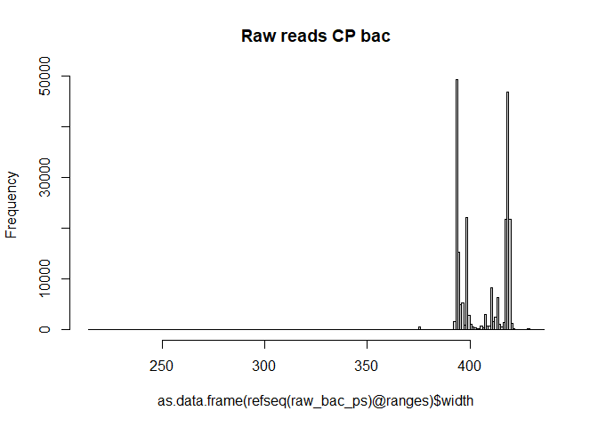
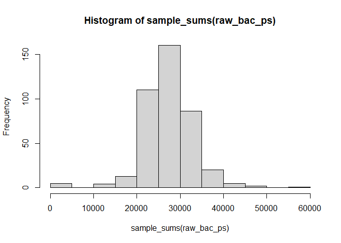
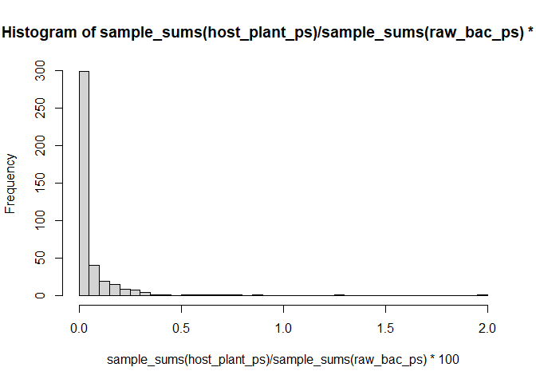
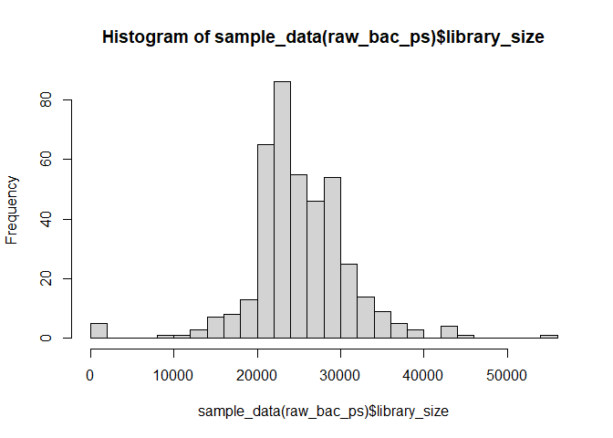
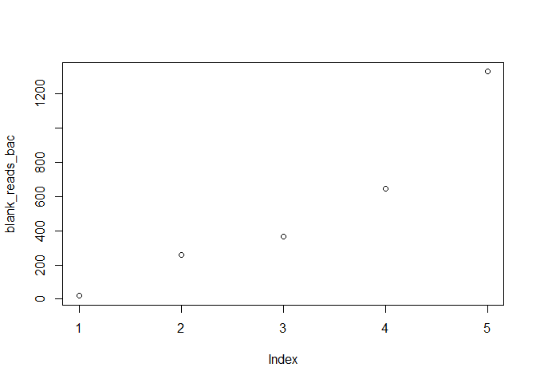
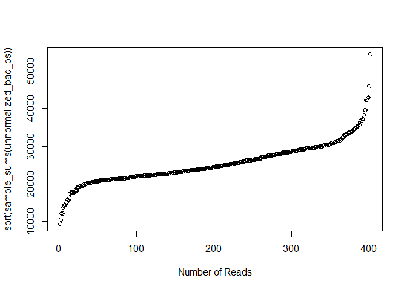
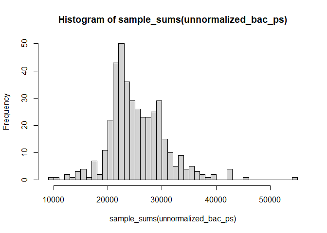
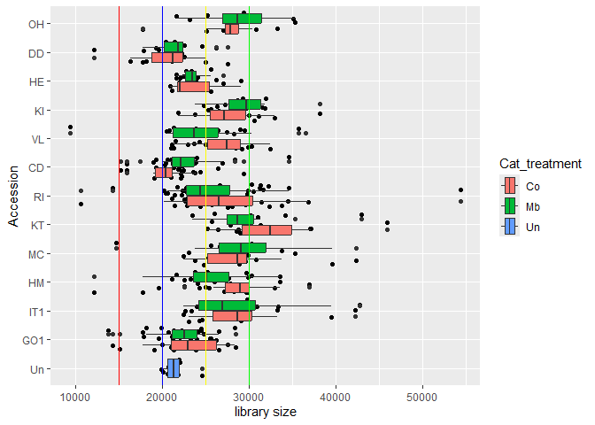
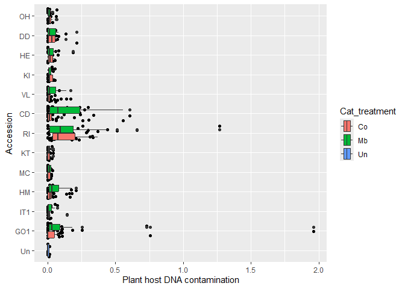
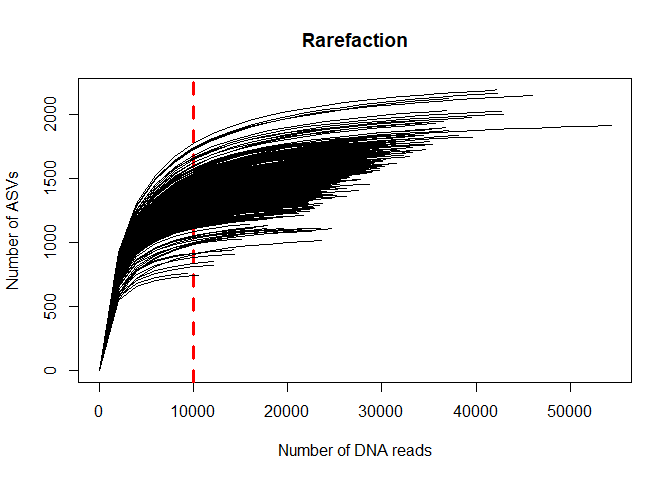

# 0.0 Introduction
This script is for loading and pre-processing microbiome data that is output form the DADA2 [Ernakovich pipeline](https://github.com/ErnakovichLab/dada2_ernakovichlab) as describes in our own [GitHub page](https://github.com/Marcelara/PSF_Anunna). In addition, the ASVs ware assigned to taxonomies with Qiime2 as this results in a higher resolution. Here, the data will be further processed to be able to analyse the data.  

A nice [tutorial](https://www.nicholas-ollberding.com/post/introduction-to-phyloseq/) to learn how to investigate data in a phyloseq object.

This and the next script are originally made by Pedro Beschoren da Costa for the [MeJA_Pilot](https://github.com/PedroBeschoren/MeJA_Pilot) and modified to fit my data.

# 1.0 load all libraries, custom functions, setup environemnt

``` r
# Set working directory
# setwd("")

# load libraries 
library(tidyr)
library(ggplot2)
library(phyloseq)
library(vegan)
library(metagenomeSeq)

# custom functions related to data loading and decontamination
source("C:/Users/kreek001/OneDrive - Wageningen University & Research/Chapters/Experimental Chapter 3/RScripts/GitHub/TwelveAccessionExperiment/MicrobiomeAnalysis/RScripts/Functions/functions_loading_and_decontamination.R")

# increases memory limit used by R
# memory.limit(size = 350000) #This function is no longer supported by Windows
```


# 1.1 load microbiome data
### Swap samples
Check whether this is needed.

## 1.1.1 - Loading 16S data 
All samples were sequenced well.

#### Load OTU table

``` r
# Loads the OTU table, immediately saving it as a phyloseq OTU table (lighter than a df) (from DADA2)
raw_bac_otutab <- otu_table(object = read.table(file = "C:/Users/kreek001/OneDrive - Wageningen University & Research/Chapters/Experimental Chapter 3/Data/Microbiome/seqtab_final.txt", 
                                                header = TRUE,
                                                row.names = 1, # first column has row names (ASV names)
                                                check.names = FALSE), # prevents "X" to be added to column names, such as X49_16S,
                             taxa_are_rows = TRUE)
head(raw_bac_otutab)
```

```
## OTU Table:          [6 taxa and 406 samples]
##                      taxa are rows
##       Blank2 Blank3 Blank4 Blank5 Blank6 C005 C006 C007 C009 C010 C015 C016
## ASV_1      0      0      0      0      0  442  476  489  492  467  520  305
## ASV_2      0      0      0      0     14  456  455  506  514  420  479  352
## ASV_3      0      0      0     11      0  279  300  265  289  256  291  168
## ASV_4      0      0     16      0      0  194  187  206  237  188  216  234
## ASV_5      0      0      0      0      0  160  220  235  206  192  195  177
## ASV_6    120      0   5268      0   2011  201  193  191  254  220  206  198
##       C017 C018 C019 C020 C025 C026 C027 C028 C029 C030 C035 C036 C037 C038
## ASV_1  377  305  366  308  530  580  556  401  508  238  452  412  384  477
## ASV_2  404  436  395  318  503  561  483  473  511  349  414  450  472  435
## ASV_3  237  216  234  229  272  307  311  211  282  161  251  220  217  317
## ASV_4  196  178  190  154  179  213  235  306  198   97  237  172  221  216
## ASV_5  145  140  146  158  201  252  269  211  237   95  183  203  190  233
## ASV_6  187  189  215  395  197  193  210  236  167  565  216  219  176  187
##       C039 C040 C043 C045 C047 C048 C050 C055 C056 C057 C058 C059 C060 C064
## ASV_1  387  427  274  504  388  466  439  431  431  332  562  478  464  440
## ASV_2  422  387  251  499  518  509  248  367  446  510  501  522  405  358
## ASV_3  240  245  132  263  216  250  310  223  262  188  300  327  264  277
## ASV_4  190  172  138  238  202  197  177  187  223  251  215  198  232  197
## ASV_5  152  156  125  254  194  194  185  170  206  118  263  226  162  201
## ASV_6  241  306  130  213  212  179  504  193  191  234  202  199  219  314
##       C065 C066 C067 C068 C069 C075 C076 C077 C078 C079 C080 C085 C086 C087
## ASV_1  299  401  552  533  504  425  272  557  434  553  416  504  462  441
## ASV_2  570  443  434  500  287  430  513  676  389  495  498  198  602  476
## ASV_3  196  234  251  272  318  241  158  307  258  305  292  276  271  240
## ASV_4  180  179  241  191  144  212  178  230  178  236  211  123  254  171
## ASV_5  120  244  210  179  253  169  123  262  169  226  183  152  232  180
## ASV_6  111  242  219  143   97  167  234  240  176  261  201  190  245  264
##       C088 C089 C090 C094 C095 C096 C097 C099 C101 C104 C105 C106 C110 C113
## ASV_1  534  674  535  473  477  429  384  377  382  525  393  445  372  481
## ASV_2  516  475  640  431  447  498  486  322  424  424  308  417  374  430
## ASV_3  273  325  287  289  208  262  222  194  193  225  192  206  181  286
## ASV_4  276  149  270  149  145  224  204  203  196  163  287  169  313  175
## ASV_5  201  246  180  168  200  186  149  139  171  220  195  225  127  215
## ASV_6  231  230  260  155  176  186  227  247  273  155  191  179  302  254
##       C115 C116 C117 C118 C120 C126 C127 C128 C129 C130 C135 C136 C137 C138
## ASV_1  375  375  343  545  472  501  478  503  561  501  551  424  470  473
## ASV_2  450  365  510  466  429  353  423  402  500  379  510  363  428  403
## ASV_3  232  243  226  258  263  275  250  352  321  275  299  237  257  258
## ASV_4  199  207  210  193  179  228  163  376  167  181  237  250  181  246
## ASV_5  150  170  171  217  206  221  210  234  238  277  193  119  165  160
## ASV_6  186  201  225  188  123  188  202  259  250  223  171  210  182  233
##       C139 C140 C145 C146 C147 C148 C149 C150 C155 C156 C157 C158 C159 C160
## ASV_1  429  401  545  663  492  683  665  482  518  418  448  446  414  469
## ASV_2  424  363  420  423  439  510  416  438  320  468  411  341  537  317
## ASV_3  270  202  348  354  346  377  364  284  239  275  258  196  254  321
## ASV_4  237  212  235  276  177  234  170  198  235  222  163  214  246  311
## ASV_5  172  144  242  181  216  289  281  206  141  156  200  144  196  168
## ASV_6  203  162  186  181  183  230  185  244  146  241  200  190  208  176
##       C165 C166 C167 C168 C169 C170 C175 C176 C177 C178 C179 C180 C185 C186
## ASV_1  519  442  723  807  737  406  592  459  199  529  429  539  641  589
## ASV_2  405  447  454  597  493  446  493  511  609  528  543  513  491  473
## ASV_3  282  306  374  323  340  254  337  239  147  324  270  305  297  343
## ASV_4  241  258  227  276  224  260  261  252  230  121  260  271  255  215
## ASV_5  227  214  342  371  435  185  220  260   82  224  198  252  212  315
## ASV_6  143  187  169  181  176  209  214  181  179  133  123  157  135  137
##       C187 C188 C189 C190 C195 C196 C197 C198 C199 C200 C205 C206 C207 C208
## ASV_1  710 1003  549  689  423  579  759  597  449  377  512  544  560  687
## ASV_2  522  743  545  421  544  735  501  476  373  502  362  423  353  488
## ASV_3  425  412  259  340  246  285  353  340  291  207  301  285  300  331
## ASV_4  179  310  288  206  232  252  226  299  164  205  177  223  213  241
## ASV_5  303  396  180  273  226  316  280  276  198  165  216  239  237  352
## ASV_6  170  167  176  120  184  130  174  121  169  111  152  139  141  172
##       C209 C210 C215 C216 C217 C218 C219 C220 C225 C226 C227 C228 C229 C230
## ASV_1  884  870  503  525   19  738  904  438  513  115  699  846  800 1154
## ASV_2  772  418  532  502  556  615  593  399  366  475  454  643  413  607
## ASV_3  444  442  304  250    0  396  448  259  346   66  331  449  456  525
## ASV_4  376  265  190  276  241  235  243  214  149  207  272  248  230  265
## ASV_5  370  366  206  218    8  285  412  161  285   64  266  442  364  461
## ASV_6  191  155  143  194  176  145  163  151  114   31  179  134  136  227
##       C235 C236 C237 C238 C239 C240 C245 C246 C247 C248 C249 C250 C255 C256
## ASV_1  571  686 1041  555  545  373  530  492  404  757  805  638  509  467
## ASV_2  442  540  942  410  393  454  378  488  583  573  449  456  412  321
## ASV_3  311  378  502  343  367  212  284  280  231  289  409  291  291  285
## ASV_4  222  212  305  196  219  186  193  237  254  213  207  352  155  234
## ASV_5  273  253  489  251  224  196  312  249  217  257  335  264  305  227
## ASV_6  146  135  188  204  138  126  102  146  217  154  194  179  116  368
##       C257 C258 C259 C260 C265 C266 C267 C268 C269 C270 C275 C276 C277 C278
## ASV_1  628  509  523  520  498  710  357 1099  957  376  603  245  644  624
## ASV_2  415  463  505  514  370  533  750  692  493  597  471  613  511  518
## ASV_3  452  262  290  258  322  320  198  435  451  189  387  177  368  382
## ASV_4  201  213  194  250  171  196  205  226  201  256  274  204  163  210
## ASV_5  242  262  246  186  241  282  133  538  382  171  293  152  294  273
## ASV_6  129  181  141  175  133  358  191  168  110  158  125  576  135  157
##       C279 C285 C286 C287 C288 C289 C290 C295 C296 C297 C298 C299 C300 C305
## ASV_1  577  608  923  274  626  726  639  637  622  540  505  798  652  585
## ASV_2  462  552  598  482  489  562  421  398  600  485  458  751  426  497
## ASV_3  297  281  479  148  266  330  302  307  318  275  294  359  358  347
## ASV_4  228  172  281  156  162  191  307  203  255  237  267  361  385  160
## ASV_5  245  285  415  123  231  349  225  251  250  234  198  377  279  282
## ASV_6  143   90  370  212  134  178  105  152  297  166  155  145  151  141
##       C306 C307 C308 C309 C310 C315 C316 C317 C318 C319 C320 C323 C326 C327
## ASV_1  596  879  708  616  799  718  327  487  872  561  507  530  411  734
## ASV_2  376  441  473  518  567  475  476  462  617  496  560  439  271  477
## ASV_3  363  412  349  260  375  347  187  265  414  288  286  297  217  387
## ASV_4  302  163  239  179  254  231  219  270  423  295  234  163  127  289
## ASV_5  288  393  276  238  327  281  157  211  356  210  242  316  150  251
## ASV_6  195  109  133  140  130  160  212  153  166  178   70  133  115  178
##       C328 C329 C330 C335 C336 C337 C338 C339 C340 C345 C346 C347 C348 C349
## ASV_1  395  658  731  481  549  479  686  531  547 1051  898  430  780  401
## ASV_2  497  422  458  570  483  524  478  513  522  634  646  545  669  379
## ASV_3  247  334  403  255  296  266  386  280  295  502  528  212  458  224
## ASV_4  259  243  258  207  156  218  180  266  260  266  250  274  268  281
## ASV_5  178  302  253  148  229  209  270  247  270  413  382  251  310  172
## ASV_6  126  129  111  130  121  115  125  141  143  157  162  142  159  131
##       C350 C355 C356 C357 C358 C359 C360 C365 C366 C367 C368 C369 C370 C375
## ASV_1  431  613  608  597  560  469 1186  785  687  640  706  608  799  368
## ASV_2  472  417  424  523  689  480  445  596  524  523  448  498  685   71
## ASV_3  254  375  325  351  264  306 1001  378  336  292  383  322  345  157
## ASV_4  187  158  223  210  242  200  151  226  229  181  320  270  279   32
## ASV_5  197  276  265  218  223  293  220  340  250  271  300  256  335  165
## ASV_6  125  100  152  139  168  132  119  133  172  144  163  136  119   45
##       C376 C377 C378 C379 C380 C385 C386 C387 C388 C389 C390 C395 C396 C397
## ASV_1  585  647  472  468  216  547  873  801  843  526  649  890  831  753
## ASV_2  559  642  562  405  500  488  475  513  549  363  472  588  535  587
## ASV_3  302  387  254  302  133  260  444  403  464  273  333  507  416  381
## ASV_4  294  254  234  249  205  172  296  167  244  195  201  276  308  308
## ASV_5  234  321  196  173  100  207  404  406  372  250  271  362  387  299
## ASV_6  170  138  125  131   45  117  120  136  169  131  102  153  172  149
##       C398 C399 C400 C405 C406 C407 C408 C409 C410 C415 C416 C417 C418 C419
## ASV_1  531  514  425  510  603  748  500  550  645  345  383  447  337  413
## ASV_2  582  472  515  488  475  484  524  408  482  333  379  565  511  325
## ASV_3  236  269  261  239  353  374  306  290  338  230  205  272  191  218
## ASV_4  155  165  214  231  291  177  277  207  150  163  229  249  216  162
## ASV_5  255  185  210  207  271  297  239  189  295  152  183  198  143  171
## ASV_6  128  121  125  149  135  148  113  129  102  120  121  162  137  135
##       C420 C425 C426 C427 C428 C429 C430 C435 C436 C437 C438 C439 C440 C444
## ASV_1  547  340 1442 1048  422  292  362  687  608  573  374  794  367  464
## ASV_2  471  488  625  610  595  204  536  588  379  499  443  751  574  335
## ASV_3  256  170  484  451  211  185  193  344  322  309  247  417  224  241
## ASV_4  259  205  286  258  241  190  209  233  200  219  266  425  232  198
## ASV_5  191  143  424  389  170   92  164  278  251  253  151  324  128  220
## ASV_6  132  149  207  170  140   91  143  160  121  179  153  226  174   93
##       C445 C447 C448 C449 C450 C455 C456 C457 C458 C459 C460 C462 C465 C466
## ASV_1  511  671  623  632  550  483  524  706  446  415  799  671  711  476
## ASV_2  412  538  395  462  441  310  424  354  377  350  364  421  568  339
## ASV_3  274  366  318  309  333  279  354  345  270  256  447  348  323  266
## ASV_4  154  222  182  242  222  179  260  447  276  346  187  242  343  205
## ASV_5  250  290  309  286  275  177  268  286  186  173  322  300  342  209
## ASV_6  181  142  121  149  100   64  103  111  127  133  107  205  156  127
##       C467 C468 C470 C475 C476 C477 C478 C479 C480 CE33 CTRL1 CTRL10 CTRL2
## ASV_1  760  548  423  693  559  365  202  430  440  476   416    387   491
## ASV_2  435  497  350  397  427  447  147  336  296  376   400    452   415
## ASV_3  428  259  255  383  304  210   99  270  327  259   201    253   274
## ASV_4  443  268  166  297  269  254  118  242  268  142   197    204   234
## ASV_5  376  200  187  247  214  172   90  143  118  217   188    159   169
## ASV_6  132  117   84  128  131  112   74  218  177  210   199    179   193
##       CTRL3 CTRL4 CTRL5 CTRL6 CTRL7 CTRL8 CTRL9 F005 F006 F007 F008 F009 F010
## ASV_1   339   527   413   415   332   457   450  510  453  408  272  518  442
## ASV_2   427   535   449   335   377   389   368  389  298  285  230  217  332
## ASV_3   185   282   186   275   258   305   299  276  273  250  188  312  279
## ASV_4   198   153   147   238   177   185   220  257  220  220  106  208  245
## ASV_5   126   188   161   128   152   166   196  170  163  151  102  240  166
## ASV_6   177   169   183   165   173   160   209  236  209  194  190  138  180
##       F015 F016 F017 F018 F019 F020 F025 F026 F027 F029 F030 F035 F036 F037
## ASV_1  779  294  425  348  317  351  323  347  308  328  272  124  247  239
## ASV_2  322  267  358  296  275  465  238  255  280  331  344  359  282  265
## ASV_3  458  219  225  270  185  166  267  241  263  213  178   62  139  146
## ASV_4  183  209  155  201  168  297  216  197  174  202  200  160  178  163
## ASV_5  182   74   79   60   79   71  131  150  113  147   81   51   96   66
## ASV_6  144  172  170  341  126  220  121  188  210  123  136  139  150  167
##       F038 F039 F040 F085 F086 F087 F088 F089 F090 F095 F096 F097 F098 F099
## ASV_1  289  104  267  553  330  466  273  436  281  463  355  373  408  317
## ASV_2  366  322  406  446  268  415  208  336  226  329  307  319  278  329
## ASV_3  171   57  141  329  224  252  192  274  159  241  230  258  206  167
## ASV_4  185  212  214  207  124  216  124  153  103  178  140  189  165  162
## ASV_5   95   59   75  205  148  176  136  162   84  117   93  108  115   94
## ASV_6  314   56  202  182  102  226  247  206  109  169  149  185  374  136
##       F100 F105 F106 F107 F108 F109 F110 F115 F116 F117 F118 F119 F120 F175
## ASV_1  309  246  293  250  130  186  247  419  330  249  367  264  381  328
## ASV_2  353  442  430  376  290  370  331  360  394  412  326  354  382  256
## ASV_3  195  126  183  125  100  102  153  259  250  184  200  197  188  197
## ASV_4  196  154  147  235  156  123  175  204  131  134  173  159  203  144
## ASV_5  108   78  116   89   98   74  120  122  106   89  115  104   74  128
## ASV_6  137  137  201  184  370  136  140  165  109  144  232  142  135  120
##       F176 F177 F178 F179 F180 F193 F194 F195 F197 F199 F200 F371 F372 F373
## ASV_1  657  309  233  385  488  223  324  285  297  270  197  171  375  480
## ASV_2  301  310  130  295  340  324  442  263  386  387  247  159  290  226
## ASV_3  400  206  194  239  273  189  189  141  153  166  126  105  246  242
## ASV_4  180  237  113  222  194  228  190  240  233  169  205   94  188  203
## ASV_5  150  115  120  123  124   90  102  121   89   80   72  145  247  302
## ASV_6  150  151  119  181  143  169  286  149  145  382  244   65  111  115
##       F374 F375 F376 F377 F378 F379 F380 F391 F392 F393 F394 F395 F396 F397
## ASV_1  284  292  287  333  356  402  335  786  283  381  748  631  364  389
## ASV_2  234  176  217  304  307  325  247  251  196  206  408  341  183  317
## ASV_3  175  213  182  173  227  267  182  470  182  234  423  391  209  256
## ASV_4  214  214  179  155  255  237  198  159  137  207  194  215  217  161
## ASV_5  170  223  168  233  197  196  190  229   99  155  338  189  140  148
## ASV_6  136  148  165  166  124  165  123   86  120  171  157  180  124  187
##       F398 F399 F400 F455 F456 F457 F458 F459 F460 F475 F476 F477 F478 F479
## ASV_1  767  503  447  581  449  496  381  636  451  350  831  580  451  348
## ASV_2  362  341  302  271  270  227  460  271  262  387  286  271  297  330
## ASV_3  450  352  264  305  328  278  253  396  292  204  527  355  265  199
## ASV_4  253  165  185  217  215  253  173  215  197  197  157  178  163  151
## ASV_5  238  187  148  142  123  130   80  173  170   92  196  141  115   87
## ASV_6  208  153  160  192  112  142  127  170  160  146  150  121  136  134
##       F522 F523 F524 F525 F526 F527 F528 F529 F530 F532 F533 F534 F536 F538
## ASV_1  180  435  424  229  469  220  250  390  323  409  444  393  499  894
## ASV_2  288  277  205  349  249  382  399  352  263  257  283  278  214  615
## ASV_3  100  298  251  133  321  161  154  190  167  275  302  260  247  489
## ASV_4  191  288  168  161  336  177  215  185  182  266  231  231  308  442
## ASV_5   80  112  110   83  181   84   65   76   56  119  104  117  128  207
## ASV_6  125  116  149  113  212  107  156   95  135  122  108   98  130  172
##       F539 F540 FE104 FE98
## ASV_1  573  332   394 1677
## ASV_2  360  300   224  170
## ASV_3  289  190   299  734
## ASV_4  285  171   262   85
## ASV_5  170  102   150  208
## ASV_6  133  110   168   67
```

#### Load Taxonomy table

``` r
# Updated taxonomy tale (from Qiime2)
sklearn_bac_taxtab <- read.table(file = "C:/Users/kreek001/OneDrive - Wageningen University & Research/Chapters/Experimental Chapter 3/Data/Microbiome/taxonomy.tsv", 
                                 header = TRUE,
                                 sep = "\t",
                                 row.names = 1, # first column has row names (ASV names)
                                 check.names = FALSE) # prevents "X" to be added to column names, such as X49_16S,

# adjusts number and name of columns
sklearn_bac_taxtab <- separate(data = sklearn_bac_taxtab,
                               col = Taxon,
                               into = c("Kingdom", 
                                       "Phylum", 
                                       "Class", 
                                       "Order", 
                                       "Family",
                                       "Genus", 
                                       "Species"),
                               sep = ";")
```

```
## Warning: Expected 7 pieces. Missing pieces filled with `NA` in 55523 rows [3, 4, 7, 16,
## 18, 28, 34, 42, 52, 70, 90, 92, 111, 115, 126, 135, 146, 147, 149, 165, ...].
```

``` r
head(sklearn_bac_taxtab) #Separated well and Feature ID is a row name
```

```
##           Kingdom            Phylum                  Class               Order
## ASV_1 d__Bacteria p__Actinomycetota      c__Actinobacteria    o__Micrococcales
## ASV_2 d__Bacteria      p__Bacillota             c__Bacilli       o__Bacillales
## ASV_3 d__Bacteria p__Actinomycetota      c__Actinobacteria    o__Micrococcales
## ASV_4 d__Bacteria p__Pseudomonadota c__Alphaproteobacteria o__Hyphomicrobiales
## ASV_5 d__Bacteria p__Actinomycetota      c__Actinobacteria    o__Micrococcales
## ASV_6 d__Bacteria  p__Rhodothermota        c__Rhodothermia   o__Rhodothermales
##                      Family                Genus Species Confidence
## ASV_1     f__Micrococcaceae g__Pseudarthrobacter     s__  0.7213987
## ASV_2        f__Bacillaceae           g__Niallia     s__  0.9965627
## ASV_3     f__Micrococcaceae                 <NA>    <NA>  0.9999977
## ASV_4  f__Xanthobacteraceae                 <NA>    <NA>  1.0000000
## ASV_5 f__Intrasporangiaceae       g__Terrabacter     s__  0.9872559
## ASV_6    f__Rhodothermaceae      g__Salinibacter     s__  0.9999999
```

``` r
#sklearn_bac_taxtab[c(13, 16, 71, 74, 75, 77, 78), ] #NAs are put in places where no classification was present. A subset of these samples is shown here.

# Change from d__Bacteria to k__bacteria, matching fungi data set
sklearn_bac_taxtab$Kingdom <- gsub("d__", "k__", sklearn_bac_taxtab$Kingdom)

head(sklearn_bac_taxtab["Kingdom"])
```

```
##           Kingdom
## ASV_1 k__Bacteria
## ASV_2 k__Bacteria
## ASV_3 k__Bacteria
## ASV_4 k__Bacteria
## ASV_5 k__Bacteria
## ASV_6 k__Bacteria
```

``` r
# Saves taxa as phyloseq object
sklearn_bac_taxtab <- tax_table(object = as.matrix(sklearn_bac_taxtab))

# Change name and remove old object
raw_bac_taxtab <- sklearn_bac_taxtab
rm(sklearn_bac_taxtab)
```

#### Load sequence table

``` r
# Loads the representative sequences table, immediately saving it as a phyloseq refseq table (lighter than a df) (from DADA2)
raw_bac_refseq <- refseq(physeq = Biostrings::readDNAStringSet(filepath = "C:/Users/kreek001/OneDrive - Wageningen University & Research/Chapters/Experimental Chapter 3/Data/Microbiome/repset.fasta", 
                                                               use.names = TRUE)) 
taxa_names(raw_bac_refseq) <- gsub(" .*", "", taxa_names(raw_bac_refseq)) # drops taxonomy from ASV names
```

#### Loading metadata

``` r
# Loads the mapping tile, immediately saving it as a phyloseq metadata table (lighter than a df)
raw_bac_metadata <- sample_data(object = read.table(file = "C:/Users/kreek001/OneDrive - Wageningen University & Research/Chapters/Experimental Chapter 3/Data/Metadata FP/Meta_Data_CPandFP.txt", 
                                                    header = TRUE,
                                                    sep = "\t",
                                                    row.names = 1, # first column has row names (ASV names)
                                                    check.names = FALSE)) # prevents "X" to be added to column names, such as X49_16S,
```

#### Build phyloseq object

``` r
# build the main 16S phyloseq object by putting all these phyloseq-class objects (OTU table, tax table, ref seq, metadata) into a single phyloseq object (ps).
raw_bac_ps <- merge_phyloseq(raw_bac_otutab,
                           raw_bac_taxtab,
                           raw_bac_refseq,
                           raw_bac_metadata)

# remove old objects to reduce memory use
rm(raw_bac_otutab, raw_bac_taxtab, raw_bac_refseq, raw_bac_metadata)

# change names from ASV to bASV (bacterial ASV), so they can be distinguished from fungal ASVs.
taxa_names(raw_bac_ps) <- paste("b", taxa_names(raw_bac_ps), sep = "")
tax_table(raw_bac_ps) <- gsub(" ", "", tax_table(raw_bac_ps)) # drops a space character from taxa names. I don't know how that character ended up in there [Kris: I do not see the space]

# let's check the imported objects. Often errors will arise from typos when filling up the data sheets 
otu_table(raw_bac_ps)[1:10,1:10]
```

```
## OTU Table:          [10 taxa and 10 samples]
##                      taxa are rows
##         Blank2 Blank3 Blank4 Blank5 Blank6 C005 C006 C007 C009 C010
## bASV_1       0      0      0      0      0  442  476  489  492  467
## bASV_2       0      0      0      0     14  456  455  506  514  420
## bASV_3       0      0      0     11      0  279  300  265  289  256
## bASV_4       0      0     16      0      0  194  187  206  237  188
## bASV_5       0      0      0      0      0  160  220  235  206  192
## bASV_6     120      0   5268      0   2011  201  193  191  254  220
## bASV_7       0      0      0      0      0    0    0    0    0    0
## bASV_8       0      0      9      0      0  116  131  163  155   92
## bASV_9       0      0      0      0      0  184  186  191  153  182
## bASV_10      0      0      0      0      0  140  158  164  218  168
```

``` r
sample_data(raw_bac_ps)[1:10,1:10]
```

```
##        Phase_PSF SampleNr Accession Domestication Cat_treatment
## Blank2        FP       B2        BS          <NA>             B
## Blank3        FP       B3        BB          <NA>             B
## Blank4        FP       B4        BS          <NA>             B
## Blank5        FP       B5        BB          <NA>             B
## Blank6        FP       B6        BS          <NA>             B
## C005          CP        5        CD    Cultivated            Co
## C006          CP        6        CD    Cultivated            Co
## C007          CP        7        CD    Cultivated            Co
## C009          CP        9        CD    Cultivated            Co
## C010          CP       10        CD    Cultivated            Co
##        Soil_conditioning TreatmentNr PlantNr Batch Table
## Blank2                 B          NA            NA    NA
## Blank3                 B          NA            NA    NA
## Blank4                 B          NA            NA    NA
## Blank5                 B          NA            NA    NA
## Blank6                 B          NA            NA    NA
## C005                               1       5     1     1
## C006                               1       6     1     2
## C007                               1       7     1     2
## C009                               1       9     1     2
## C010                               1      10     1     2
```

``` r
tax_table(raw_bac_ps)[1:10,1:6]
```

```
## Taxonomy Table:     [10 taxa by 6 taxonomic ranks]:
##         Kingdom       Phylum               Class                   
## bASV_1  "k__Bacteria" "p__Actinomycetota"  "c__Actinobacteria"     
## bASV_2  "k__Bacteria" "p__Bacillota"       "c__Bacilli"            
## bASV_3  "k__Bacteria" "p__Actinomycetota"  "c__Actinobacteria"     
## bASV_4  "k__Bacteria" "p__Pseudomonadota"  "c__Alphaproteobacteria"
## bASV_5  "k__Bacteria" "p__Actinomycetota"  "c__Actinobacteria"     
## bASV_6  "k__Bacteria" "p__Rhodothermota"   "c__Rhodothermia"       
## bASV_7  "k__Bacteria" "p__Actinomycetota"  "c__Actinobacteria"     
## bASV_8  "k__Bacteria" "p__Actinomycetota"  "c__Actinobacteria"     
## bASV_9  "k__Bacteria" "p__Gemmatimonadota" "c__Gemmatimonadia"     
## bASV_10 "k__Bacteria" "p__Bacillota"       "c__Bacilli"            
##         Order                    Family                  Genus                 
## bASV_1  "o__Micrococcales"       "f__Micrococcaceae"     "g__Pseudarthrobacter"
## bASV_2  "o__Bacillales"          "f__Bacillaceae"        "g__Niallia"          
## bASV_3  "o__Micrococcales"       "f__Micrococcaceae"     NA                    
## bASV_4  "o__Hyphomicrobiales"    "f__Xanthobacteraceae"  NA                    
## bASV_5  "o__Micrococcales"       "f__Intrasporangiaceae" "g__Terrabacter"      
## bASV_6  "o__Rhodothermales"      "f__Rhodothermaceae"    "g__Salinibacter"     
## bASV_7  "o__Streptosporangiales" NA                      NA                    
## bASV_8  "o__Kitasatosporales"    "f__Streptomycetaceae"  "g__Streptomyces"     
## bASV_9  "o__Gemmatimonadales"    "f__Gemmatimonadaceae"  "g__Incertae_Sedis"   
## bASV_10 "o__Bacillales"          "f__Bacillaceae"        "g__Niallia"
```

``` r
refseq(raw_bac_ps)
```

```
## DNAStringSet object of length 226072:
##          width seq                                          names               
##      [1]   399 TGCACAATGGGCGCAAGCCTG...AAGCATGGGGAGCGAACAGG bASV_1
##      [2]   419 TCCGCAATGGACGAAAGTCTG...AAGCGTGGGGAGCAAACAGG bASV_2
##      [3]   399 TGCACAATGGGCGAAAGCCTG...AAGCATGGGGAGCGAACAGG bASV_3
##      [4]   394 TGGACAATGGGCGCAAGCCTG...AAGCGTGGGGAGCAAACAGG bASV_4
##      [5]   399 TGCACAATGGGCGAAAGCCTG...AAGCATGGGGAGCGAACAGG bASV_5
##      ...   ... ...
## [226068]   419 TGCGCAATGGGCGAAAGCCTG...AAGCGTGGGGAGCAAACAGG bASV_226068
## [226069]   419 TGGACAATGGGCGCAAGCCTG...AAGCGTGGGGAGCAAACAGG bASV_226069
## [226070]   394 TGGACAATGGGGGCAACCCTG...AAGCATGGGGAGCGAACAGG bASV_226070
## [226071]   394 TCGGCAATGGGCGCAAGCCTG...AGGCCGGGGGAGCGAACGGG bASV_226071
## [226072]   394 TGGACAATGGGCGCAAGCCTG...AAGCGTGGGGAGCAAACAGG bASV_226072
```

``` r
# run garbage collection after creating large objects (shows a report of memory usages)
gc()
```

```
##            used  (Mb) gc trigger   (Mb)  max used   (Mb)
## Ncells  5727729 305.9    8663495  462.7   8663495  462.7
## Vcells 70945242 541.3  186501614 1422.9 186501554 1422.9
```

<!-- #### Split CP and FP -->
<!-- ```{r} -->
<!-- # subset phyloseq FP -->
<!-- FP_raw_bac_ps <- subset_samples(raw_bac_ps, Phase_PSF == "FP") -->
<!-- table(sample_data(FP_raw_bac_ps)[ , 1]) -->

<!-- # save phyloseq object FP -->
<!-- save(FP_raw_bac_ps, file = "C:/Users/kreek001/OneDrive - Wageningen University & Research/Chapters/Experimental Chapter 3/RScripts/GitHub/TwelveAccessionExperiment/MicrobiomeAnalysis/Data/Phyloseq_objects/FP_raw_bac_ps.RData") -->

<!-- # change phase of blank samples from FP to CP to add them to the CP phyloseq object as well -->
<!-- sample_data(raw_bac_ps)[sample_data(raw_bac_ps)$Soil_conditioning == "B", "Phase_PSF"] -->
<!-- sample_data(raw_bac_ps)[sample_data(raw_bac_ps)$Soil_conditioning == "B", "Phase_PSF"] <- rep("CP", 5) -->
<!-- sample_data(raw_bac_ps)[sample_data(raw_bac_ps)$Soil_conditioning == "B", "Phase_PSF"] -->

<!-- # subset phyloseq CP -->
<!-- CP_raw_bac_ps <- subset_samples(raw_bac_ps, Phase_PSF == "CP") -->
<!-- table(sample_data(CP_raw_bac_ps)[ , 1]) -->

<!-- # save phyloseq object FP -->
<!-- #save(CP_raw_bac_ps, file = "C:/Users/kreek001/OneDrive - Wageningen University & Research/Chapters/Experimental Chapter 3/RScripts/GitHub/TwelveAccessionExperiment/MicrobiomeAnalysis/Data/Phyloseq_objects/CP_raw_bac_ps.RData") -->

<!-- # remove original and FP phyloseq objects -->
<!-- rm(raw_bac_ps, FP_raw_bac_ps) -->
<!-- ``` -->


# 1.2 - Remove bad ASVs
Here we will remove sequences associated with the host, background prokatyotes, low abundance ASVs, poorly identified sequences, and other bad ASVs.

## 1.2.1 - Remove non-bacterial sequences & filter ASVs
Note that the input data has been pre-filtered in the DADA2 pipeline to remove any ASVs that occur less than 3 times in the data set. This was necessary because the dada2-associated taxonomy assignment tools could not assign taxonomies to the full data set with 1 GB ram on the HPC.

### Here we investigate the length of the sequences

``` r
hist(as.data.frame(refseq(raw_bac_ps)@ranges)$width, breaks = 300, main = "Raw reads CP bac")
```

<!-- -->

``` r
summary(as.data.frame(refseq(raw_bac_ps)@ranges)$width) #summary on length of the reeds
```

```
##    Min. 1st Qu.  Median    Mean 3rd Qu.    Max. 
##   214.0   395.0   411.0   407.1   419.0   436.0
```

``` r
ntaxa(raw_bac_ps) #shows total number of ASVs
```

```
## [1] 226072
```

``` r
summary(sample_sums(raw_bac_ps)) #shows number of reeds
```

```
##    Min. 1st Qu.  Median    Mean 3rd Qu.    Max. 
##     189   24634   27131   27672   30937   56687
```

### Here we get rid of sequences shorter than 380bp

``` r
sum(as.data.frame(refseq(raw_bac_ps)@ranges)$width < 380) # count number of reads smaller than 380bp
```

```
## [1] 1139
```

``` r
sum(as.data.frame(refseq(raw_bac_ps)@ranges)$width > 380)
```

```
## [1] 224925
```

``` r
raw_bac_ps <- prune_taxa(taxa = as.data.frame(refseq(raw_bac_ps)@ranges)$width > 380,
                       x = raw_bac_ps)
ntaxa(raw_bac_ps) #shows total number of ASVs
```

```
## [1] 224925
```

``` r
summary(sample_sums(raw_bac_ps)) #shows number of reeds
```

```
##    Min. 1st Qu.  Median    Mean 3rd Qu.    Max. 
##     189   24482   26917   27462   30709   56495
```

### Keeps only ASVs identified as bacterial

``` r
raw_bac_ps <- subset_taxa(raw_bac_ps, Kingdom == "k__Bacteria")
ntaxa(raw_bac_ps) #shows total number of ASVs
```

```
## [1] 224911
```

``` r
summary(sample_sums(raw_bac_ps)) #shows number of reeds
```

```
##    Min. 1st Qu.  Median    Mean 3rd Qu.    Max. 
##     189   24482   26917   27461   30709   56495
```

### Remove Salinibacter ASV(s)

``` r
raw_bac_ps #original data set
```

```
## phyloseq-class experiment-level object
## otu_table()   OTU Table:         [ 224911 taxa and 406 samples ]
## sample_data() Sample Data:       [ 406 samples by 85 sample variables ]
## tax_table()   Taxonomy Table:    [ 224911 taxa by 8 taxonomic ranks ]
## refseq()      DNAStringSet:      [ 224911 reference sequences ]
```

``` r
physeq_OnlySal <- subset_taxa(raw_bac_ps, Genus == "g__Salinibacter")
physeq_OnlySal
```

```
## phyloseq-class experiment-level object
## otu_table()   OTU Table:         [ 444 taxa and 406 samples ]
## sample_data() Sample Data:       [ 406 samples by 85 sample variables ]
## tax_table()   Taxonomy Table:    [ 444 taxa by 8 taxonomic ranks ]
## refseq()      DNAStringSet:      [ 444 reference sequences ]
```

``` r
raw_bac_ps <- subset_taxa(raw_bac_ps, Genus != "g__Salinibacter" | is.na(Genus)) # remove Salinibacter genus but keep undefined genesis (NAs)
raw_bac_ps #data set without salinibacter
```

```
## phyloseq-class experiment-level object
## otu_table()   OTU Table:         [ 224467 taxa and 406 samples ]
## sample_data() Sample Data:       [ 406 samples by 85 sample variables ]
## tax_table()   Taxonomy Table:    [ 224467 taxa by 8 taxonomic ranks ]
## refseq()      DNAStringSet:      [ 224467 reference sequences ]
```

``` r
rm(physeq_OnlySal)
```

### Define library sizes as metadata before filtering

``` r
raw_bac_ps@sam_data$library_sizes_prefiltering <- sample_sums(raw_bac_ps)
hist(sample_sums(raw_bac_ps), breaks = 20)
```

<!-- -->

### Removes taxa having less than 8 reads across all samples, as VSEARCH standard

``` r
otu_table(raw_bac_ps) <- otu_table(raw_bac_ps)[which (rowSums(otu_table(raw_bac_ps)) > 7),]
ntaxa(raw_bac_ps) #shows total number of ASVs
```

```
## [1] 30713
```

``` r
summary(sample_sums(raw_bac_ps)) #shows number of reeds
```

```
##    Min. 1st Qu.  Median    Mean 3rd Qu.    Max. 
##      58   22287   24930   25521   28967   55126
```

### Remove ASV occurring in less than three samples
We remove ASVs that occur in less than 3 samples.

``` r
filter <- phyloseq::genefilter_sample(raw_bac_ps, filterfun_sample(function(x) x > 0), A = 3) 
raw_bac_ps <- prune_taxa(filter, raw_bac_ps)
ntaxa(raw_bac_ps) #shows total number of ASVs
```

```
## [1] 19247
```

``` r
summary(sample_sums(raw_bac_ps)) #shows number of reeds
```

```
##    Min. 1st Qu.  Median    Mean 3rd Qu.    Max. 
##      19   21942   24509   25156   28581   54474
```

### Check and remove plant-host contamination

``` r
### define plastid, mitochondria and host plant contamination ps objects
Mitochondria_ps <- subset_taxa(raw_bac_ps, Family == "f__Mitochondria" | Family == "Mitochondria")
Plastid_ps <- subset_taxa(raw_bac_ps, Order == "o__Chloroplast" | Order == "Chloroplast") 
host_plant_ps <- merge_phyloseq(Mitochondria_ps, Plastid_ps)

### quick histogram showing plant DNA contamination
hist(sample_sums(host_plant_ps)/sample_sums(raw_bac_ps)*100, breaks = 50)
```

<!-- -->

``` r
summary(sample_sums(host_plant_ps)/sample_sums(raw_bac_ps)*100)
```

```
##    Min. 1st Qu.  Median    Mean 3rd Qu.    Max. 
## 0.00000 0.00000 0.01587 0.06430 0.05765 1.96178
```

``` r
summary(sample_sums(Mitochondria_ps)/sample_sums(raw_bac_ps)*100)
```

```
##     Min.  1st Qu.   Median     Mean  3rd Qu.     Max. 
## 0.000000 0.000000 0.000000 0.007465 0.006953 0.281573
```

``` r
summary(sample_sums(Plastid_ps)/sample_sums(raw_bac_ps)*100)
```

```
##    Min. 1st Qu.  Median    Mean 3rd Qu.    Max. 
## 0.00000 0.00000 0.01462 0.05684 0.04546 1.68021
```

Between 0 and 1% of the ASVs per sample is contaminated with mitochondrial or chloroplast DNA.


``` r
### define host plant 16S contamination as metadata (add the info the the metadata sheet)
raw_bac_ps@sam_data$Mitochondria_reads <- sample_sums(Mitochondria_ps)
raw_bac_ps@sam_data$Plastid_reads <- sample_sums(Plastid_ps)
raw_bac_ps@sam_data$Host_DNA_n_reads <- sample_sums(host_plant_ps)
raw_bac_ps@sam_data$Host_DNA_contamination_pct <- sample_sums(host_plant_ps)/sample_sums(raw_bac_ps)*100

### remove plant host sequences (plastid and mitochondrial DNA) 
raw_bac_ps <- remove_Chloroplast_Mitochondria(raw_bac_ps)
```

### Check library size

``` r
# add library sizes as part of metadata
sample_data(raw_bac_ps)$library_size <- sample_sums(raw_bac_ps)

#check library size distribution
hist(sample_data(raw_bac_ps)$library_size, breaks = 20)
```

<!-- -->

``` r
summary(sample_data(raw_bac_ps)$library_size) #shows the number of reeds
```

```
##    Min. 1st Qu.  Median    Mean 3rd Qu.    Max. 
##      19   21923   24492   25141   28580   54373
```

``` r
# remove samples with library size = 0  (non-informative; failed PCR/sequencing)
#raw_bac_ps<-subset_samples(raw_bac_ps, library_size >0) #not applicable

# remove ps objects
rm(Mitochondria_ps, Plastid_ps, host_plant_ps)

# run garbage collection after creating large objects
gc()
```

```
##            used  (Mb) gc trigger   (Mb)  max used   (Mb)
## Ncells  5212514 278.4    8663495  462.7   8663495  462.7
## Vcells 25192331 192.3  161354848 1231.1 252116948 1923.5
```


# 1.3 - Decontaminate phyloseq objects
The decontam package will use blank DNA samples to remove possible contaminants. Here we use a single custom function to run decontamination, generate plots, and return a clean phyloseq object

We will also check the number of reads in a blank sample (average +SD) so we can compare those blank samples with libraries with low number of reads. samples that cannot be distinguished from a blank (in terms of library size) 

### Decontaminate

``` r
unnormalized_bac_ps <- decontaminate_and_plot(raw_bac_ps)
```

```
## Loading required package: decontam
```

``` r
# phyloseq object without contamination
unnormalized_bac_ps[1]
```

```
## [[1]]
## phyloseq-class experiment-level object
## otu_table()   OTU Table:         [ 19177 taxa and 401 samples ]
## sample_data() Sample Data:       [ 401 samples by 92 sample variables ]
## tax_table()   Taxonomy Table:    [ 19177 taxa by 8 taxonomic ranks ]
## refseq()      DNAStringSet:      [ 19177 reference sequences ]
```

``` r
# Number of ASVs assigned as contamination
unnormalized_bac_ps[5]
```

```
## [[1]]
## 
## FALSE  TRUE 
## 19177    50
```

``` r
# ASVs assigned as contamination
unnormalized_bac_ps[4]
```

```
## [[1]]
##  [1] "bASV_2192"  "bASV_3462"  "bASV_3864"  "bASV_4179"  "bASV_4262" 
##  [6] "bASV_4342"  "bASV_4553"  "bASV_4685"  "bASV_4728"  "bASV_4825" 
## [11] "bASV_5018"  "bASV_5342"  "bASV_5553"  "bASV_5656"  "bASV_5741" 
## [16] "bASV_6206"  "bASV_6254"  "bASV_6298"  "bASV_6342"  "bASV_6522" 
## [21] "bASV_6623"  "bASV_6939"  "bASV_7505"  "bASV_7667"  "bASV_7668" 
## [26] "bASV_8229"  "bASV_8316"  "bASV_8708"  "bASV_8822"  "bASV_9213" 
## [31] "bASV_9215"  "bASV_9730"  "bASV_9877"  "bASV_10013" "bASV_10824"
## [36] "bASV_11035" "bASV_12184" "bASV_12185" "bASV_12726" "bASV_13025"
## [41] "bASV_13356" "bASV_14018" "bASV_14019" "bASV_14440" "bASV_15307"
## [46] "bASV_15308" "bASV_15853" "bASV_17012" "bASV_17013" "bASV_20485"
```

### Check blanks
Let's look into how many reads our blank had (average + sd) so we can compare those to libraries with very low number of reads.

``` r
blank_reads_bac <- sort(sample_sums(subset_samples(raw_bac_ps, Soil_conditioning == "B")))
plot(blank_reads_bac)
```

<!-- -->

``` r
#clean up environment to free memory
rm(raw_bac_ps)
```

### Check phyloseq object
After checking the decontamination plots and reports, we can remove them and focus on the phyloseq object.

``` r
unnormalized_bac_ps <- unlist(unnormalized_bac_ps[[1]])
```

#### Check library size Bacteria
Now let's check the lower end of our library sizes.

``` r
sort(sample_sums(unnormalized_bac_ps))
```

```
##   C478   F371   C043   F178   F090   F088   F392   C429   F086   C030   F008 
##   9382  10546  12093  12103  13760  14206  14317  14723  15094  15163  15851 
##   C020   C050   F019   C326   C085   F200   C069   C099   C055   C076   F108 
##  15904  16280  17393  17709  17717  17718  17734  17830  17881  18183  18184 
##   C017   C018   CE33   C064   C016   C019   C060   F175   F098  CTRL7   C106 
##  19008  19079  19081  19277  19293  19307  19548  19569  19590  19845  19906 
##   C101   F037  CTRL8   F522   C037   C007   C036   F527   C048   F478   C470 
##  20016  20059  20095  20181  20290  20364  20385  20396  20418  20454  20518 
##   C078  CTRL6   C025   F376  CTRL5   C113   F479   C126   C010   C087   C038 
##  20521  20565  20584  20601  20687  20717  20793  20873  20905  20958  20967 
##   C015   F460   F534   C140   C075   C199   C095   F025   F456   C039   F089 
##  21003  21039  21076  21088  21091  21101  21127  21141  21141  21173  21206 
##   C116   F099   C047   F096   F477   C120   C005   C094  CTRL1   F457   C444 
##  21229  21239  21241  21256  21269  21288  21297  21299  21316  21333  21378 
## CTRL10   C080   F523   F027   F529   F530   C056   C040   C479   C160   C127 
##  21383  21384  21394  21395  21407  21434  21449  21499  21542  21575  21578 
##   F199   C355   F397   F018   C256  CTRL9   C137   F030  CTRL2   C147   C117 
##  21626  21670  21765  21783  21835  21868  21886  21905  21907  21969  22009 
##   C136   C130  CTRL3   C027   C059   F026   F015   F017   F109   F035   F110 
##  22031  22048  22068  22070  22080  22102  22104  22109  22162  22168  22177 
##   F393   C067   C065   F029   F039   C068   C006   F475   F036   F380   C419 
##  22201  22217  22224  22244  22265  22270  22288  22293  22331  22362  22408 
##   C110   C238   C035   C157   F524   C057   C066   C166   C165   C118   C455 
##  22414  22420  22428  22453  22500  22505  22533  22533  22555  22577  22611 
##   C239   C138   C389   F528   C149   F400   F533   C105   C115   F374   F532 
##  22634  22638  22683  22709  22741  22769  22779  22786  22826  22840  22870 
##  FE104   C028   C096   F458   F016   F399   C205   C415   C097   C349   F097 
##  22880  22896  22939  22945  22998  23028  23086  23096  23100  23129  23137 
##   F116   F391   F195   F377   C220   C155   F525   C316   C145   C146   F095 
##  23203  23206  23213  23242  23322  23383  23390  23393  23430  23432  23497 
##   C375   F120   C029   FE98   C158   C480   C460   F007   F193   C026   C436 
##  23535  23555  23556  23629  23633  23661  23711  23712  23732  23742  23748 
##   C276   F006   C156   C466   C104   F119   C009   C200   C226   F194   C379 
##  23759  23816  23825  23827  23875  23949  23965  23982  24003  24014  24064 
##   C150   F378   F536   F107   F395   F179   F459   C225   F038   F396   F118 
##  24078  24101  24114  24143  24143  24252  24252  24260  24338  24366  24459 
##   F100   C058   C207  CTRL4   C240   F540   F455   F176   F373   C245   F106 
##  24511  24533  24565  24583  24623  24674  24690  24701  24711  24744  24765 
##   C416   F372   F197   F476   C045   C139   C335   C288   C360   F177   C255 
##  24830  24858  24968  24972  25014  25113  25115  25158  25163  25189  25282 
##   F180   C418   C477   C399   C190   F117   C409   C257   C159   C135   F115 
##  25284  25298  25301  25358  25400  25473  25578  25617  25627  25632  25635 
##   C400   C459   C307   F379   C086   C177   C246   C287   C197   C079   F105 
##  25662  25698  25728  25743  25825  25931  25952  25988  26007  26174  26178 
##   C129   C390   C215   C425   C277   C458   C445   F010   C306   C229   F087 
##  26191  26214  26237  26265  26266  26368  26392  26398  26421  26481  26487 
##   C380   C265   C088   C438   C385   C206   F009   C369   C148   C336   C260 
##  26502  26553  26556  26578  26612  26616  26966  26986  26997  27005  27009 
##   C198   C258   C323   C227   C476   C089   F375   C077   C359   C337   C176 
##  27074  27268  27276  27305  27476  27494  27506  27540  27571  27578  27614 
##   C186   C328   C440   C357   C187   C235   C319   C350   C317   C338   F539 
##  27640  27705  27725  27801  27802  27807  27823  27823  27876  27931  28022 
##   C330   C468   C179   C216   C178   C185   C090   F040   F085   C450   C339 
##  28209  28241  28283  28284  28291  28292  28366  28378  28402  28430  28463 
##   C456   C305   C417   C267   C376   C269   C309   C407   C437   C410   C448 
##  28530  28558  28569  28621  28636  28719  28743  28806  28821  28865  28922 
##   F526   C297   C217   C128   C449   C189   C249   C300   C259   F005   C430 
##  28955  28982  29049  29099  29142  29169  29189  29199  29292  29373  29392 
##   C356   C462   C320   C420   C365   C195   C170   C340   C275   C210   C236 
##  29398  29472  29474  29594  29611  29633  29647  29655  29673  29684  29768 
##   C387   F394   C167   F398   C457   C175   C405   C278   C358   C218   C315 
##  29788  29804  29823  29839  29842  29863  29891  29981  29984  30069  30205 
##   C435   C180   C368   C408   C475   C327   C329   C367   C247   C428   C347 
##  30207  30241  30272  30286  30318  30328  30381  30515  30600  30822  30850 
##   C208   C285   C279   C298   C366   C308   C386   C378   C266   C388   C270 
##  30882  30956  31095  31097  31210  31313  31313  31419  31560  31607  31837 
##   C248   C377   C398   C447   C250   C188   C219   C346   C228   C169   C196 
##  31908  32262  32315  32417  32928  32958  33251  33282  33306  33590  33601 
##   C406   C396   C289   C290   C296   C397   F020   C395   C345   C427   C310 
##  33689  33765  33863  33942  34210  34476  34512  34626  35101  35283  35291 
##   C348   C467   C465   C370   C168   C286   C295   C268   C230   C426   C209 
##  35337  35736  36564  36795  36892  37077  37101  38190  39468  39603  42207 
##   C439   C237   C318   C299   F538 
##  42293  42745  42905  45953  54349
```

``` r
plot(sort(sample_sums(unnormalized_bac_ps)), xlab = "Number of Reads")
```

<!-- -->

No samples have a smaller library size than 6000 so no samples will be removed.

#### Remove samples with a number of reads similar to blanks

``` r
unnormalized_bac_ps <- subset_samples(unnormalized_bac_ps, library_size > 6000)
```

### Set factors

``` r
# set Cat_treatment as factor, and then order it properly
unnormalized_bac_ps@sam_data$Cat_treatment <- factor(unnormalized_bac_ps@sam_data$Cat_treatment, levels = c("Co", "Mb", "Un"))

# set Soil_conditioning as factor, and then order it properly
unnormalized_bac_ps@sam_data$Soil_conditioning <- factor(unnormalized_bac_ps@sam_data$Soil_conditioning, levels = c("Co", "Mb", "Un"))

# set Accession as factor, and then order it properly
unnormalized_bac_ps@sam_data$Accession <- factor(unnormalized_bac_ps@sam_data$Accession, levels = c("OH", "DD", "HE", "KI", "VL", "CD", "RI", "KT", "MC", "HM", "IT1", "GO1", "Un"))

# set Domestication as factor, and then order it properly
unnormalized_bac_ps@sam_data$Domestication <- factor(unnormalized_bac_ps@sam_data$Domestication, levels = c("Wild", "Cultivated", "Un"))

# set Batch as factor
unnormalized_bac_ps@sam_data$Batch <- factor(unnormalized_bac_ps@sam_data$Batch)
```


# 1.4 - Plot library sizes per treatment and check NAs and uncultured ASVs
### Check number of reeds

``` r
# let's check the number of reads in a couple histograms
hist(sample_sums(unnormalized_bac_ps), breaks = 50)
```

<!-- -->

``` r
summary(sample_sums(unnormalized_bac_ps))
```

```
##    Min. 1st Qu.  Median    Mean 3rd Qu.    Max. 
##    9382   22048   24565   25443   28621   54349
```

### Check library size

``` r
# check plot for some minimum library sizes on all samples

ggplot(data = sample_data(unnormalized_bac_ps), 
           mapping = aes(x = library_size, y = Accession, fill = Cat_treatment)) +
      geom_jitter() +
      geom_boxplot() +
      scale_y_discrete(limits = rev) +
      geom_vline(xintercept = 30000, color="green") +
      geom_vline(xintercept = 25000, color="yellow") +
      geom_vline(xintercept = 20000, color="blue") +
      geom_vline(xintercept = 15000, color="red") +
      labs(x = "library size",
           y = "Accession") #+
```

<!-- -->

``` r
      #theme(axis.text.x = element_text(angle = 20, vjust = 0.5, hjust=1))

# # In case I want to do a subset of the data
# lapply(unnormalized_bac_ps, function(x)
#     ggplot(data = sample_data(subset_samples(x, Compartment == "Rhizosphere")), 
#            mapping = aes(x = library_size, y = Soil_Slurry_Treatment, color = Soil_Slurry_Treatment, fill = Phase)) +
#     geom_jitter() +
#     geom_boxplot() +
#     scale_y_discrete(limits = rev) +
#     geom_vline(xintercept = 30000, color="green") +
#     geom_vline(xintercept = 25000, color="yellow") +
#     geom_vline(xintercept = 20000, color="blue") +
#     geom_vline(xintercept = 15000, color="red") +
#     labs(x = "library size",
#          y = "Soil slurry treatment and phase") +
#     theme(axis.text.x = element_text(angle = 45, vjust = 0.5, hjust=1)))
```

### Check plant-host contamination

``` r
# check bacterial 16S plant host contamination
ggplot(data = sample_data(unnormalized_bac_ps), 
           mapping = aes(x = Host_DNA_contamination_pct, y = Accession, fill = Cat_treatment)) +
      geom_jitter() +
      geom_boxplot() +
      scale_y_discrete(limits = rev) +
      # geom_vline(xintercept = 30000, color="green") +
      # geom_vline(xintercept = 25000, color="yellow") +
      # geom_vline(xintercept = 20000, color="blue") +
      #geom_vline(xintercept = 15000, color="red") +
      labs(x = "Plant host DNA contamination",
           y = "Accession") #+
```

<!-- -->

``` r
      #theme(axis.text.x = element_text(angle = 45, vjust = 0.5, hjust=1))
```

### check percentage of NA in taxonomy

``` r
### check_n_taxa_NA_percentage(ps_object, ntaxa))
check_n_taxa_NA_percentage(unnormalized_bac_ps, 100) # top 100 taxa
```

```
##    Kingdom     Phylum      Class      Order     Family      Genus    Species 
##          0          0          0          0          1         12         12 
## Confidence 
##          0
```

``` r
check_n_taxa_NA_percentage(unnormalized_bac_ps, 1000)
```

```
##    Kingdom     Phylum      Class      Order     Family      Genus    Species 
##        0.0        0.1        0.1        0.2        1.1       11.2       11.2 
## Confidence 
##        0.0
```

``` r
check_n_taxa_NA_percentage(unnormalized_bac_ps, 10000) # top 10,000 taxa
```

```
##    Kingdom     Phylum      Class      Order     Family      Genus    Species 
##       0.00       0.24       0.27       0.46       1.28      10.85      10.85 
## Confidence 
##       0.00
```

``` r
#A higher the number of taxa does not make a difference
```

### Check uncultured and unassigned taxa
Out commanded lines mean that type is not present in the data set.

``` r
#subset_taxa(unnormalized_bac_ps, Kingdom == "Unassigned") #No hits as I sub-setted the data with only k__Bacteria before

# subset_taxa(unnormalized_bac_ps, Class == "c__uncultured" | Class == "c__unidentified")
# subset_taxa(unnormalized_bac_ps, Class == "c__uncultured")
# subset_taxa(unnormalized_bac_ps, Class == "c__unidentified") #not in data set

# subset_taxa(c__unidentified, Family == "f__uncultured" | Family == "f__unidentified")
# subset_taxa(unnormalized_bac_ps, Family == "f__uncultured")
# subset_taxa(unnormalized_bac_ps, Family == "f__unidentified") #not in data set

# subset_taxa(c__unidentified, Genus == "g__uncultured" | Genus == "g__unidentified")
# subset_taxa(unnormalized_bac_ps, Genus == "g__uncultured")
# subset_taxa(unnormalized_bac_ps, Genus == "g__unidentified") #not in data set
```

There are no uncultured or unidentified samples.


# 1.5 export filtered unnormalized ps object
### Save RData
let's save these normalized objects as RData so they can be loaded in other scripts.

``` r
save(unnormalized_bac_ps, file = "C:/Users/kreek001/OneDrive - Wageningen University & Research/Chapters/Experimental Chapter 3/RScripts/GitHub/TwelveAccessionExperiment/MicrobiomeAnalysis/Data/Phyloseq_objects/CP_FP_together/unnormalized_bac_ps.RData")
```


# 1.6 Data Normalization
A big challenge in microbiome data is the difference in library sizes: some samples are covered more in depth than others. This means sample1 may have 12.000 sequences, while samples2 may have 150.000 sequences. This is because of the sequencing machinery, and makes the data "compositional". You must normalize this data to avoid generating artefacts. There is *extensive* literature on this topic. Here we will use 2 methods: rarefaction, a classic approach necessary for some analysis models, and cumulative sum scaling with MetagenomeSeq. 

## 1.6a Rarefaction & rarefying
This method will cut your library sizes to the minimum library size of your sequencing effort, and then repopulate the OTU tables by picking OTUs/ASVs at random. This method effectively trows away a lot of data, so it's coming into disuse.

Still, we will use rarefied data for alpha diversity, neutral model fits, and core microbiome definition.

### 1.6a.1 select a cut-off point for rarefaction
Now your bacterial phyloseq object is rid of detectable contaminants and plant DNA. Note that for fungal ITS sequences you may have some plant or microfauna DNA in the middle of your fungal sequences!

Let's further explore some distribution on the ASVs to determine good cut-off points for rarefaction.

#### Rarefraction curve

``` r
# finally, a rarefaction curve
a <- rarecurve(t(as.data.frame(otu_table(unnormalized_bac_ps))), 
          label = FALSE, 
          step = 2000,
          main="Rarefaction", ylab = "Number of ASVs", xlab = "Number of DNA reads",
          abline(v = 10000, col="red", lwd=3, lty=2))
```

<!-- -->

``` r
rm(a)
```


## 1.6b Metagenomeseq
We use this package to be able to normalize library sizes without using rarefaction and also accounting for sparsity (high number of zeros in the data set). This is done by considering the counts up to a certain quantile (cumulative sum scaling, CSS). We will perform this with the metagenomseq package.

We will use CSS-normalized data for beta diversity analysis: ordinations, permanovas and beta dispersion.

### Remove sampels with low number of reads

``` r
unnormalized_bac_ps_cut <- subset_samples(unnormalized_bac_ps, sample_names(unnormalized_bac_ps) != "C478" & sample_names(unnormalized_bac_ps) != "C043" & sample_names(unnormalized_bac_ps) != "F371" & sample_names(unnormalized_bac_ps) != "F178")
```

### Metagenomeseq

``` r
# first, let's transform the phyloseq object into an MR experiment object
MRexp_objt <- phyloseq_to_metagenomeSeq(unnormalized_bac_ps_cut)

# normalizes the object by cumulative sum scaling, a widely used method
cumNorm(MRexp_objt)
```

```
## Default value being used.
```

```
## MRexperiment (storageMode: environment)
## assayData: 19177 features, 397 samples 
##   element names: counts 
## protocolData: none
## phenoData
##   sampleNames: C005 C006 ... FE98 (397 total)
##   varLabels: Phase_PSF SampleNr ... is.neg (92 total)
##   varMetadata: labelDescription
## featureData
##   featureNames: bASV_1 bASV_2 ... bASV_30805 (19177 total)
##   fvarLabels: OTUname Kingdom ... Confidence (9 total)
##   fvarMetadata: labelDescription
## experimentData: use 'experimentData(object)'
## Annotation:
```

``` r
# here you can access the abundance matrix normalized by cumulative sum scaling. You could overwrite the phyloseq object with this
CSS_matrix <- MRcounts(MRexp_objt, norm = TRUE, log = TRUE)
```

Using a log scale will in this last line of code will essentially reduce the impact of common species and increase the impact of rare species.


``` r
# make a new phyloseq object list...
CSS_bac_ps <- unnormalized_bac_ps_cut

# and now change it's taxa table
otu_table(CSS_bac_ps) <- otu_table(CSS_matrix, taxa_are_rows = TRUE)

# this is your final phyloseq object
CSS_bac_ps
```

```
## phyloseq-class experiment-level object
## otu_table()   OTU Table:         [ 19177 taxa and 397 samples ]
## sample_data() Sample Data:       [ 397 samples by 92 sample variables ]
## tax_table()   Taxonomy Table:    [ 19177 taxa by 8 taxonomic ranks ]
## refseq()      DNAStringSet:      [ 19177 reference sequences ]
```

### Check phyloseq object

``` r
# Check number of reads per sample
sort(sample_sums(CSS_bac_ps))[1:6]
```

```
##     F392     F088     F090     C429     F086     C030 
## 2241.838 2249.731 2260.694 2370.773 2375.859 2400.712
```

``` r
summary(sample_sums(CSS_bac_ps))
```

```
##    Min. 1st Qu.  Median    Mean 3rd Qu.    Max. 
##    2242    2828    2961    2974    3124    3790
```

``` r
# Add new library size to meta data
CSS_bac_ps@sam_data$library_sizes_CSS <- sample_sums(CSS_bac_ps)
```

### Save new phyloseq object

``` r
# let's save these unnormalized objects as RData so they can be loaded in other scripts
save(CSS_bac_ps, file = "C:/Users/kreek001/OneDrive - Wageningen University & Research/Chapters/Experimental Chapter 3/RScripts/GitHub/TwelveAccessionExperiment/MicrobiomeAnalysis/Data/Phyloseq_objects/CP_FP_together/CSS_bac_ps.RData")
```

``` r
# Clean environment
rm(list = ls())
```


## 1.6c Scaling around median
Code is taken from phyloseq tutorial on [Functions for Accessing and (Pre)Processing Data](https://joey711.github.io/phyloseq/preprocess.html).

### Loading unnormalised data

``` r
load(file = "C:/Users/kreek001/OneDrive - Wageningen University & Research/Chapters/Experimental Chapter 3/RScripts/GitHub/TwelveAccessionExperiment/MicrobiomeAnalysis/Data/Phyloseq_objects/CP_FP_together/unnormalized_bac_ps.RData")
```

### Remove sampels with low number of reads

``` r
unnormalized_bac_ps_cut <- subset_samples(unnormalized_bac_ps, sample_names(unnormalized_bac_ps) != "C478" & sample_names(unnormalized_bac_ps) != "C043" & sample_names(unnormalized_bac_ps) != "F371" & sample_names(unnormalized_bac_ps) != "F178")
```

### Saling data around median

``` r
total <- median(sample_sums(unnormalized_bac_ps_cut))
standf <- function(x, t = total) round(t * (x / sum(x)))
median_bac_ps <- transform_sample_counts(unnormalized_bac_ps_cut, standf)
```

### Check number of reads

``` r
sort(sample_sums(median_bac_ps))[1:6]
```

```
##  C226  F395  C150  F194  F107  F378 
## 24431 24437 24444 24446 24454 24456
```

``` r
summary(sample_sums(median_bac_ps))
```

```
##    Min. 1st Qu.  Median    Mean 3rd Qu.    Max. 
##   24431   24563   24618   24620   24679   24803
```

### Save phyloseq object

``` r
save(median_bac_ps, file = "C:/Users/kreek001/OneDrive - Wageningen University & Research/Chapters/Experimental Chapter 3/RScripts/GitHub/TwelveAccessionExperiment/MicrobiomeAnalysis/Data/Phyloseq_objects/CP_FP_together/median_bac_ps.RData")
```


# 1.7 Check library size outliers
## Original library size

``` r
load(file = "C:/Users/kreek001/OneDrive - Wageningen University & Research/Chapters/Experimental Chapter 3/RScripts/GitHub/TwelveAccessionExperiment/MicrobiomeAnalysis/Data/Phyloseq_objects/CP_FP_together/CSS_bac_ps.RData")

# Remove unplanted CTRL
CSS_bac_ps <- subset_samples(CSS_bac_ps, Accession != "Un")

# check library size
a <- sample_data(CSS_bac_ps)[ , c("library_size", "Accession")]
a$Sample <- rownames(a)
a <- a[order(a$library_size), ]
head(a, 20)
```

```
##      library_size Accession Sample
## F090        13760       GO1   F090
## F088        14239       GO1   F088
## F392        14317        RI   F392
## C429        14726        MC   C429
## F086        15094       GO1   F086
## C030        15167        CD   C030
## F008        15872        CD   F008
## C020        15904        CD   C020
## C050        16280        DD   C050
## F019        17393        CD   F019
## C326        17709        OH   C326
## C085        17717       GO1   C085
## F200        17718        HM   F200
## C069        17738        DD   C069
## C099        17830       GO1   C099
## C055        17881        DD   C055
## C076        18183        DD   C076
## F108        18187       GO1   F108
## C017        19013        CD   C017
## C018        19085        CD   C018
```

``` r
a[order(a$Accession), 1:2]
```

```
##       library_size Accession
## C326         17709        OH
## C355         21670        OH
## C349         23129        OH
## C335         25119        OH
## C360         25163        OH
## C336         27005        OH
## C323         27276        OH
## C359         27571        OH
## C337         27587        OH
## C328         27711        OH
## C357         27815        OH
## C350         27858        OH
## C338         27931        OH
## C330         28209        OH
## C339         28463        OH
## C356         29421        OH
## C340         29657        OH
## C358         29984        OH
## C327         30328        OH
## C329         30381        OH
## C347         30850        OH
## C346         33293        OH
## C345         35101        OH
## C348         35337        OH
## C050         16280        DD
## C069         17738        DD
## C055         17881        DD
## C076         18183        DD
## C064         19307        DD
## C060         19558        DD
## C048         20432        DD
## C078         20521        DD
## C075         21091        DD
## C047         21241        DD
## C080         21384        DD
## C056         21449        DD
## C059         22080        DD
## C067         22217        DD
## C065         22224        DD
## C068         22270        DD
## C057         22505        DD
## C066         22533        DD
## C058         24533        DD
## C045         25014        DD
## C079         26174        DD
## C077         27557        DD
## C126         20889        HE
## C140         21088        HE
## C160         21575        HE
## C127         21578        HE
## C137         21898        HE
## C147         21969        HE
## C136         22031        HE
## C130         22076        HE
## C157         22453        HE
## C138         22638        HE
## C149         22755        HE
## C155         23387        HE
## C145         23430        HE
## C146         23443        HE
## C158         23633        HE
## C156         23825        HE
## C150         24078        HE
## C139         25113        HE
## C159         25633        HE
## C135         25640        HE
## C129         26204        HE
## C148         27005        HE
## C128         29099        HE
## C256         21835        KI
## C276         23768        KI
## C245         24744        KI
## C255         25282        KI
## C257         25617        KI
## C246         25986        KI
## C277         26291        KI
## C265         26553        KI
## C260         27009        KI
## C258         27268        KI
## C267         28630        KI
## C269         28727        KI
## C249         29223        KI
## C259         29292        KI
## C275         29679        KI
## C278         29981        KI
## C247         30600        KI
## C279         31099        KI
## C266         31560        KI
## C270         31837        KI
## C248         31911        KI
## C250         32928        KI
## C268         38200        KI
## F478         20454        VL
## C470         20518        VL
## F479         20793        VL
## F460         21046        VL
## F456         21153        VL
## F477         21269        VL
## F457         21335        VL
## C444         21378        VL
## C479         21542        VL
## F475         22296        VL
## C455         22611        VL
## F458         22945        VL
## C480         23665        VL
## C460         23711        VL
## C466         23827        VL
## F459         24252        VL
## F455         24699        VL
## F476         24976        VL
## C477         25309        VL
## C459         25708        VL
## C445         26392        VL
## C458         26408        VL
## C476         27486        VL
## C468         28253        VL
## C450         28430        VL
## C456         28537        VL
## C448         28922        VL
## C449         29142        VL
## C462         29472        VL
## C457         29842        VL
## C475         30338        VL
## C447         32424        VL
## C467         35736        VL
## C465         36571        VL
## C030         15167        CD
## F008         15872        CD
## C020         15904        CD
## F019         17393        CD
## C017         19013        CD
## C018         19085        CD
## C016         19293        CD
## C019         19307        CD
## F037         20061        CD
## C037         20290        CD
## C007         20364        CD
## C036         20426        CD
## C025         20584        CD
## C010         20905        CD
## C038         20987        CD
## C015         21003        CD
## F025         21141        CD
## C039         21181        CD
## C005         21301        CD
## F027         21395        CD
## C040         21499        CD
## F018         21783        CD
## F030         21905        CD
## C027         22070        CD
## F015         22104        CD
## F026         22105        CD
## F017         22109        CD
## F035         22168        CD
## F029         22261        CD
## F039         22272        CD
## C006         22288        CD
## F036         22331        CD
## C035         22437        CD
## C028         22896        CD
## F016         23004        CD
## C029         23556        CD
## F007         23728        CD
## C026         23742        CD
## F006         23832        CD
## C009         23965        CD
## F038         24344        CD
## F010         26418        CD
## F009         26966        CD
## F040         28378        CD
## F005         29373        CD
## F020         34540        CD
## F392         14317        RI
## F522         20181        RI
## F527         20396        RI
## F376         20637        RI
## F534         21080        RI
## F523         21401        RI
## F529         21407        RI
## F530         21445        RI
## F397         21765        RI
## F393         22201        RI
## F380         22372        RI
## F524         22500        RI
## C389         22683        RI
## F528         22709        RI
## F400         22769        RI
## F533         22779        RI
## F374         22860        RI
## F532         22870        RI
## FE104        22880        RI
## F399         23028        RI
## F391         23206        RI
## F377         23250        RI
## F525         23398        RI
## C375         23546        RI
## FE98         23632        RI
## C379         24064        RI
## F378         24108        RI
## F536         24121        RI
## F395         24145        RI
## F396         24386        RI
## F540         24682        RI
## F373         24719        RI
## F372         24864        RI
## C399         25360        RI
## C400         25673        RI
## F379         25749        RI
## C390         26214        RI
## C380         26507        RI
## C385         26615        RI
## C369         26986        RI
## F375         27511        RI
## F539         28022        RI
## C376         28644        RI
## F526         28962        RI
## C365         29611        RI
## C387         29788        RI
## F394         29813        RI
## F398         29841        RI
## C368         30278        RI
## C367         30531        RI
## C366         31222        RI
## C386         31313        RI
## C378         31427        RI
## C388         31607        RI
## C377         32267        RI
## C398         32315        RI
## C396         33775        RI
## C397         34476        RI
## C395         34626        RI
## C370         36828        RI
## F538         54373        RI
## C316         23423        KT
## C288         25163        KT
## C307         25728        KT
## C287         25996        KT
## C306         26421        KT
## C319         27832        KT
## C317         27893        KT
## C305         28558        KT
## C309         28743        KT
## C297         29003        KT
## C300         29199        KT
## C320         29474        KT
## C315         30208        KT
## C285         30962        KT
## C298         31101        KT
## C308         31321        KT
## C289         33867        KT
## C290         33942        KT
## C296         34215        KT
## C310         35291        KT
## C286         37082        KT
## C295         37121        KT
## C318         42914        KT
## C299         45953        KT
## C429         14726        MC
## C419         22408        MC
## C415         23096        MC
## C436         23753        MC
## C416         24830        MC
## C418         25298        MC
## C409         25578        MC
## C425         26285        MC
## C438         26598        MC
## C440         27725        MC
## C417         28587        MC
## C437         28824        MC
## C407         28834        MC
## C410         28874        MC
## C430         29392        MC
## C420         29594        MC
## C405         29907        MC
## C435         30207        MC
## C408         30286        MC
## C428         30828        MC
## C406         33717        MC
## C427         35283        MC
## C426         39603        MC
## C439         42311        MC
## F200         17718        HM
## F175         19569        HM
## C199         21101        HM
## F199         21626        HM
## C166         22542        HM
## C165         22555        HM
## F195         23213        HM
## F193         23737        HM
## C200         23992        HM
## F194         24026        HM
## F179         24262        HM
## F176         24714        HM
## F197         24983        HM
## F177         25189        HM
## F180         25286        HM
## C190         25400        HM
## C177         25934        HM
## C197         26011        HM
## C198         27088        HM
## C176         27624        HM
## C186         27642        HM
## C187         27816        HM
## C179         28283        HM
## C178         28299        HM
## C185         28308        HM
## C189         29169        HM
## C195         29633        HM
## C170         29647        HM
## C167         29823        HM
## C175         29872        HM
## C180         30247        HM
## C188         32958        HM
## C169         33590        HM
## C196         33601        HM
## C168         36892        HM
## C238         22427       IT1
## C239         22634       IT1
## C205         23092       IT1
## C220         23322       IT1
## C226         24009       IT1
## C225         24262       IT1
## C207         24565       IT1
## C240         24627       IT1
## C215         26239       IT1
## C229         26481       IT1
## C206         26616       IT1
## C227         27305       IT1
## C235         27812       IT1
## C216         28284       IT1
## C217         29049       IT1
## C210         29684       IT1
## C236         29780       IT1
## C218         30076       IT1
## C208         30882       IT1
## C219         33251       IT1
## C228         33310       IT1
## C230         39468       IT1
## C209         42216       IT1
## C237         42745       IT1
## F090         13760       GO1
## F088         14239       GO1
## F086         15094       GO1
## C085         17717       GO1
## C099         17830       GO1
## F108         18187       GO1
## CE33         19097       GO1
## F098         19611       GO1
## C106         19906       GO1
## C101         20016       GO1
## C113         20717       GO1
## C087         20970       GO1
## C095         21134       GO1
## F089         21206       GO1
## C116         21233       GO1
## F099         21239       GO1
## F096         21264       GO1
## C120         21292       GO1
## C094         21303       GO1
## C117         22009       GO1
## F109         22173       GO1
## F110         22183       GO1
## C110         22424       GO1
## C118         22579       GO1
## C105         22789       GO1
## C115         22826       GO1
## C096         22939       GO1
## C097         23100       GO1
## F097         23137       GO1
## F116         23206       GO1
## F095         23505       GO1
## F120         23559       GO1
## C104         23875       GO1
## F119         23955       GO1
## F107         24143       GO1
## F118         24473       GO1
## F100         24511       GO1
## F106         24765       GO1
## F117         25483       GO1
## F115         25648       GO1
## C086         25825       GO1
## F105         26178       GO1
## F087         26496       GO1
## C088         26570       GO1
## C089         27494       GO1
## C090         28373       GO1
## F085         28416       GO1
```

``` r
summary(a)
```

```
##   library_size     Accession      Sample         
##  Min.   :13760   RI     : 61   Length:387        
##  1st Qu.:22192   GO1    : 47   Class :character  
##  Median :24744   CD     : 46   Mode  :character  
##  Mean   :25700   HM     : 35                     
##  3rd Qu.:28784   VL     : 34                     
##  Max.   :54373   OH     : 24                     
##                  (Other):140
```

``` r
table(a$Accession)
```

```
## 
##  OH  DD  HE  KI  VL  CD  RI  KT  MC  HM IT1 GO1 
##  24  22  23  23  34  46  61  24  24  35  24  47
```

``` r
aggregate(a$library_size, by = list(a$Accession), FUN = mean)
```

```
##    Group.1        x
## 1       OH 28107.00
## 2       DD 21462.36
## 3       HE 23540.87
## 4       KI 28609.57
## 5       VL 25630.59
## 6       CD 22016.22
## 7       RI 26307.13
## 8       KT 31308.75
## 9       MC 28606.00
## 10      HM 26638.57
## 11     IT1 28839.00
## 12     GO1 22307.43
```

``` r
# Outliers
b <- a[c("C085", "C105", "C110", "C217", "C256", "C326", "C375", "C379", "C425", "C429", "C438", "C480"), ]
b[order(b$library_size), ]
```

```
##      library_size Accession Sample
## C429        14726        MC   C429
## C326        17709        OH   C326
## C085        17717       GO1   C085
## C256        21835        KI   C256
## C110        22424       GO1   C110
## C105        22789       GO1   C105
## C375        23546        RI   C375
## C480        23665        VL   C480
## C379        24064        RI   C379
## C425        26285        MC   C425
## C438        26598        MC   C438
## C217        29049       IT1   C217
```

``` r
#Potential other outliers
a[c("C380", "C295", "C177", "C170", "C165"), ]
```

```
##      library_size Accession Sample
## C380        26507        RI   C380
## C295        37121        KT   C295
## C177        25934        HM   C177
## C170        29647        HM   C170
## C165        22555        HM   C165
```

### Test outliers with t distribution

``` r
# GO1
d <- a[a$Accession == "GO1", "library_size"]
m <- mean(d$library_size)
n <- nrow(a[a$Accession == "GO1", "library_size"])
s <- sd(d$library_size)

v <- a[a$Accession == "GO1" & a$Sample == "C085", ]
pt(q = (v$library_size-m)/s, df = n-1, lower.tail = TRUE)
```

```
## [1] 0.08627869
```

``` r
v <- a[a$Accession == "GO1" & a$Sample == "C105", ]
pt(q = (v$library_size-m)/s, df = n-1, lower.tail = TRUE)
```

```
## [1] 0.5574687
```

``` r
v <- a[a$Accession == "GO1" & a$Sample == "C110", ]
pt(q = (v$library_size-m)/s, df = n-1, lower.tail = TRUE)
```

```
## [1] 0.5139585
```

``` r
rm(d, m, n, v, s)

# IT1
d <- a[a$Accession == "IT1", "library_size"]
m <- mean(d$library_size)
n <- nrow(a[a$Accession == "IT1", "library_size"])
s <- sd(d$library_size)

v <- a[a$Accession == "IT1" & a$Sample == "C217", ]
pt(q = (v$library_size-m)/s, df = n-1, lower.tail = TRUE)
```

```
## [1] 0.51426
```

``` r
rm(d, m, n, v, s)

# KI
d <- a[a$Accession == "KI", "library_size"]
m <- mean(d$library_size)
n <- nrow(a[a$Accession == "KI", "library_size"])
s <- sd(d$library_size)

v <- a[a$Accession == "KI" & a$Sample == "C256", ]
pt(q = (v$library_size-m)/s, df = n-1, lower.tail = TRUE)
```

```
## [1] 0.03534506
```

``` r
rm(d, m, n, v, s)

# KT
d <- a[a$Accession == "KT", "library_size"]
m <- mean(d$library_size)
n <- nrow(a[a$Accession == "KT", "library_size"])
s <- sd(d$library_size)

v <- a[a$Accession == "KT" & a$Sample == "C295", ]
pt(q = (v$library_size-m)/s, df = n-1, lower.tail = TRUE)
```

```
## [1] 0.8502427
```

``` r
rm(d, m, n, v, s)

# OH
d <- a[a$Accession == "OH", "library_size"]
m <- mean(d$library_size)
n <- nrow(a[a$Accession == "OH", "library_size"])
s <- sd(d$library_size)

v <- a[a$Accession == "OH" & a$Sample == "C326", ]
pt(q = (v$library_size-m)/s, df = n-1, lower.tail = TRUE)
```

```
## [1] 0.006803511
```

``` r
rm(d, m, n, v, s)

# RI
d <- a[a$Accession == "RI", "library_size"]
m <- mean(d$library_size)
n <- nrow(a[a$Accession == "RI", "library_size"])
s <- sd(d$library_size)

v <- a[a$Accession == "RI" & a$Sample == "C375", ]
pt(q = (v$library_size-m)/s, df = n-1, lower.tail = TRUE)
```

```
## [1] 0.3149715
```

``` r
v <- a[a$Accession == "RI" & a$Sample == "C379", ]
pt(q = (v$library_size-m)/s, df = n-1, lower.tail = TRUE)
```

```
## [1] 0.3476963
```

``` r
v <- a[a$Accession == "RI" & a$Sample == "C380", ]
pt(q = (v$library_size-m)/s, df = n-1, lower.tail = TRUE)
```

```
## [1] 0.5139243
```

``` r
rm(d, m, n, v, s)

# MC
d <- a[a$Accession == "MC", "library_size"]
m <- mean(d$library_size)
n <- nrow(a[a$Accession == "MC", "library_size"])
s <- sd(d$library_size)

v <- a[a$Accession == "MC" & a$Sample == "C425", ]
pt(q = (v$library_size-m)/s, df = n-1, lower.tail = TRUE)
```

```
## [1] 0.3413438
```

``` r
v <- a[a$Accession == "MC" & a$Sample == "C429", ]
pt(q = (v$library_size-m)/s, df = n-1, lower.tail = TRUE)
```

```
## [1] 0.01054005
```

``` r
v <- a[a$Accession == "MC" & a$Sample == "C438", ]
pt(q = (v$library_size-m)/s, df = n-1, lower.tail = TRUE)
```

```
## [1] 0.3617317
```

``` r
rm(d, m, n, v, s)

# VL
d <- a[a$Accession == "VL", "library_size"]
m <- mean(d$library_size)
n <- nrow(a[a$Accession == "VL", "library_size"])
s <- sd(d$library_size)

v <- a[a$Accession == "VL" & a$Sample == "C480", ]
pt(q = (v$library_size-m)/s, df = n-1, lower.tail = TRUE)
```

```
## [1] 0.3245731
```

``` r
rm(d, m, n, v, s)
```
