# 3.0 Basic alpha diversity analysis for pilot data
Alpha diversity will show you the quantifiable diversity within a sample - this way you compare which treatment is more or less diverse or species-rich than the other. Like in all the other steps we are evaluating here, there are countless variations and methods you could use. This is just a convenient template for you to get started.

Alpha diversity requires counts from samples with equal samples sizes. This means we cannot use the CSS transformation from the metagenomeseq package. Also, heavy filtering of your data may skew some of the diversity metrics (due to the lack of rare species), so we should not over-filter the data before calculating alpha diversity.

As my data is not too diverse in reed size, I use CSS transformed data.


### Packages

``` r
R.version$version.string # prints R version
```

```
## [1] "R version 4.5.1 (2025-06-13 ucrt)"
```

``` r
library(tibble) #needed for function rownames_to_columns
packageVersion("tibble")
```

```
## [1] '3.3.0'
```

``` r
library(car)
packageVersion("car")
```

```
## [1] '3.1.3'
```

``` r
library(phyloseq)
packageVersion("phyloseq")
```

```
## [1] '1.52.0'
```

``` r
library(ggplot2)
packageVersion("ggplot2")
```

```
## [1] '4.0.0'
```

``` r
library(ggh4x) #for coloring strip facet wrap
packageVersion("ggh4x")
```

```
## [1] '0.3.1'
```

``` r
#library(agricolae) #for HSD.test()
#packageVersion("agricolae")

library(emmeans) #for post hoc emmeans
packageVersion("emmeans")
```

```
## [1] '1.11.2.8'
```

``` r
library(multcomp) #for cld function at post hoc analysis
packageVersion("multcomp")
```

```
## [1] '1.4.29'
```

``` r
library(multcompView) #for cld function at post hoc analysis
packageVersion("multcompView")
```

```
## [1] '0.1.10'
```

``` r
library(glmmTMB) #for doing glm with many different options
packageVersion("glmmTMB")
```

```
## [1] '1.1.13'
```

``` r
library(DHARMa) #for model assumptions
packageVersion("DHARMa")
```

```
## [1] '0.4.7'
```

### Import pre-made functions

``` r
source("C:/Users/kreek001/OneDrive - Wageningen University & Research/Chapters/Experimental Chapter 3/RScripts/GitHub/TwelveAccessionExperiment/MicrobiomeAnalysis/RScripts/Functions/Testing_model_assumptions.R") #Functions for model assumptions
```

### Import data

``` r
load("C:/Users/kreek001/OneDrive - Wageningen University & Research/Chapters/Experimental Chapter 3/RScripts/GitHub/TwelveAccessionExperiment/MicrobiomeAnalysis/Data/Phyloseq_objects/CP_FP_together/median_bac_ps.RData")

# load("C:/Users/kreek001/OneDrive - Wageningen University & Research/Chapters/Experimental Chapter 3/RScripts/GitHub/TwelveAccessionExperiment/MicrobiomeAnalysis/Data/Phyloseq_objects/rarefied_Bac_ps.RData")
# 
# rarefied_bac_ps <- rarefied_Bac_ps
# rm(rarefied_Bac_ps)
```

### Remove batch 2 FP and RI FP and unplanted CTRL

``` r
median_bac_ps <- subset_samples(median_bac_ps, Batch != 1 | Phase_PSF != "FP")
table(median_bac_ps@sam_data$Phase_PSF, median_bac_ps@sam_data$Batch)
```

```
##     
##        1   2
##   CP 145 146
##   FP   0  64
```

``` r
median_bac_ps <- subset_samples(median_bac_ps, Accession != "RI" | Phase_PSF != "FP")
table(median_bac_ps@sam_data$Phase_PSF, median_bac_ps@sam_data$Accession)
```

```
##     
##      OH DD HE KI VL CD RI KT MC HM IT1 GO1 Un
##   CP 24 22 23 23 23 23 24 24 24 24  24  23 10
##   FP  0  0  0  0 11 12  0  0  0 11   0  12  0
```

``` r
median_bac_ps <- subset_samples(median_bac_ps, Accession != "Un")
table(median_bac_ps@sam_data$Phase_PSF, median_bac_ps@sam_data$Accession)
```

```
##     
##      OH DD HE KI VL CD RI KT MC HM IT1 GO1
##   CP 24 22 23 23 23 23 24 24 24 24  24  23
##   FP  0  0  0  0 11 12  0  0  0 11   0  12
```


# 3.2.1 Alpha diversity testing effect of phase
Here we check both observed diversity and Shannon diversity indexes.

## Calculate richness
[Different types of alpha diversity](https://www.cd-genomics.com/microbioseq/the-use-and-types-of-alpha-diversity-metrics-in-microbial-ngs.html). 
[Nice explanation of alpha diversity](https://docs.onecodex.com/en/articles/4136553-alpha-diversity). 
[Concider looking at phylogenitic diversity](https://danielpfaith.wordpress.com/phylogenetic-diversity/) with this [R package](https://search.r-project.org/CRAN/refmans/abdiv/html/faith_pd.html).  


``` r
# extract row names to remove x in row name
total_diversity <- estimate_richness(median_bac_ps) %>%
  rownames_to_column(var = "Sample")

# remove x
total_diversity$Sample <- sub("X", "", total_diversity$Sample) 

# For some reason, the "-" are replaced by ".", here we replace "." by "-" to get the original name.
total_diversity$Sample <- gsub("\\.", "-", total_diversity$Sample) 

# put new names back as row name
total_diversity <- column_to_rownames(total_diversity, var = "Sample") 
```

## Add diversity metrics to mapping file of phyloseq objects
We do this so we can perform Anovas, access meta data, make nicer plots, etc.

``` r
# makes the diversity calculations sample_data for phyloseq object
merg_to_ps <- sample_data(total_diversity)

# merge the new phyloseq object with the old phyloseq object
sample_data(median_bac_ps) <- merge_phyloseq(median_bac_ps, merg_to_ps) 

# forces sample data of updated phyloseq object into a data frame
total_diversity <- as(sample_data(median_bac_ps),"data.frame")
```


## define factors

``` r
# total_diversity$Accession <- factor(total_diversity$Accession, levels = c("OH", "DD", "HE", "KI", "VL", "CD", "RI", "KT", "MC", "HM", "IT1", "GO1"))
# total_diversity$Cat_treatment <- as.factor(total_diversity$Cat_treatment)
# total_diversity$Domestication <- factor(total_diversity$Domestication, levels = c("Wild", "Cultivated"))
# total_diversity$Block_g <- as.factor(total_diversity$Block_g)
```

## Statistics Observed index
### Defining model

``` r
lm1 <- glmmTMB(data = total_diversity, formula = Observed ~ Phase_PSF + (1 | Block_g), family = gaussian(link = "identity"))
lm2 <- glmmTMB(data = total_diversity, formula = Observed ~ Phase_PSF, family = gaussian(link = "identity"))

lm3 <- glmmTMB(data = total_diversity, formula = log(Observed) ~ Phase_PSF + (1 | Block_g), family = gaussian(link = "identity"))
lm4 <- glmmTMB(data = total_diversity, formula = log(Observed) ~ Phase_PSF, family = gaussian(link = "identity"))

lm5 <- glmmTMB(data = total_diversity, formula = sqrt(Observed) ~ Phase_PSF + (1 | Block_g), family = gaussian(link = "identity"))
lm6 <- glmmTMB(data = total_diversity, formula = sqrt(Observed) ~ Phase_PSF, family = gaussian(link = "identity"))

glm1 <- glmmTMB(data = total_diversity, formula = Observed ~ Phase_PSF + (1 | Block_g), family = Gamma(link = "log"))
glm2 <- glmmTMB(data = total_diversity, formula = Observed ~ Phase_PSF, family = Gamma(link = "log"))

glm3 <- glmmTMB(data = total_diversity, formula = log(Observed + 1) ~ Phase_PSF + (1 | Block_g), family = Gamma(link = "log"))
glm4 <- glmmTMB(data = total_diversity, formula = log(Observed + 1) ~ Phase_PSF, family = Gamma(link = "log"))

glm5 <- glmmTMB(data = total_diversity, formula = sqrt(Observed) ~ Phase_PSF + (1 | Block_g), family = Gamma(link = "log"))
glm6 <- glmmTMB(data = total_diversity, formula = sqrt(Observed) ~ Phase_PSF, family = Gamma(link = "log"))
```

### Model assumptions

``` r
DHARMa.sum(Model = lm1)
```

```
## 1. Kolmogorov-Smirnov test indicates deviations of the residuals from uniform distribution. H0: The model fits the data well; Ha: The model does not fit the data well
```

```
## 
## 	Asymptotic one-sample Kolmogorov-Smirnov test
## 
## data:  simulationOutput$scaledResiduals
## D = 0.051003, p-value = 0.3627
## alternative hypothesis: two-sided
```

```
## 2. Test for over-dispersion. H0: No over-dispersion in the model; Ha: Over-dispersion in the model
```

```
## 
## 	DHARMa nonparametric dispersion test via sd of residuals fitted vs.
## 	simulated
## 
## data:  simulationOutput
## dispersion = 1.0012, p-value = 0.976
## alternative hypothesis: two.sided
## 
## 3. Test for outliers. H0: No ouliers in the model; Ha: Outliers in the model
```

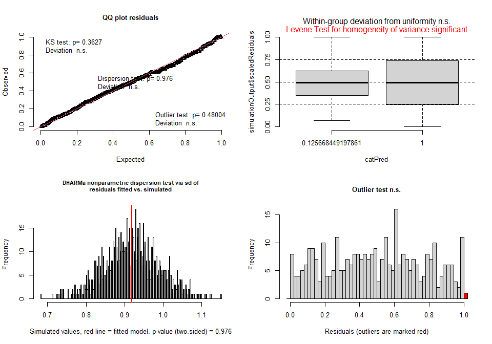<!-- -->

```
## 
## 	DHARMa outlier test based on exact binomial test with approximate
## 	expectations
## 
## data:  simulationOutput
## outliers at both margin(s) = 1, observations = 327, p-value = 0.48
## alternative hypothesis: true probability of success is not equal to 0.001998002
## 95 percent confidence interval:
##  7.742149e-05 1.692004e-02
## sample estimates:
## frequency of outliers (expected: 0.001998001998002 ) 
##                                          0.003058104
```

``` r
DHARMa.sum(Model = lm2)
```

```
## 1. Kolmogorov-Smirnov test indicates deviations of the residuals from uniform distribution. H0: The model fits the data well; Ha: The model does not fit the data well
```

```
## 
## 	Asymptotic one-sample Kolmogorov-Smirnov test
## 
## data:  simulationOutput$scaledResiduals
## D = 0.051538, p-value = 0.3501
## alternative hypothesis: two-sided
```

```
## 2. Test for over-dispersion. H0: No over-dispersion in the model; Ha: Over-dispersion in the model
```

```
## 
## 	DHARMa nonparametric dispersion test via sd of residuals fitted vs.
## 	simulated
## 
## data:  simulationOutput
## dispersion = 1.0002, p-value = 0.996
## alternative hypothesis: two.sided
## 
## 3. Test for outliers. H0: No ouliers in the model; Ha: Outliers in the model
```

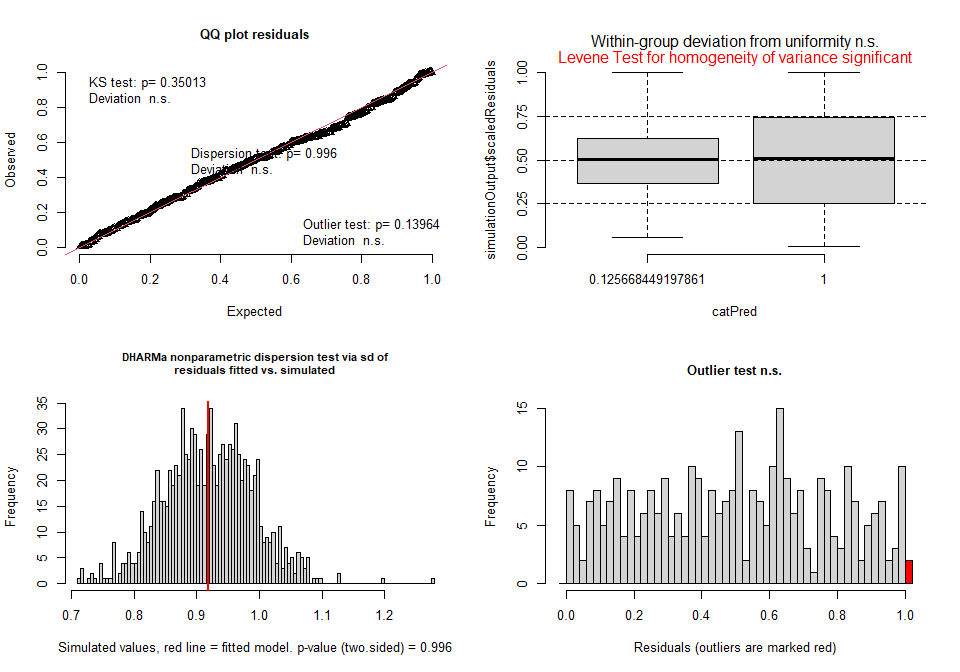<!-- -->

```
## 
## 	DHARMa outlier test based on exact binomial test with approximate
## 	expectations
## 
## data:  simulationOutput
## outliers at both margin(s) = 2, observations = 327, p-value = 0.1396
## alternative hypothesis: true probability of success is not equal to 0.001998002
## 95 percent confidence interval:
##  0.0007415613 0.0219180448
## sample estimates:
## frequency of outliers (expected: 0.001998001998002 ) 
##                                          0.006116208
```

``` r
DHARMa.sum(Model = lm3)
```

```
## 1. Kolmogorov-Smirnov test indicates deviations of the residuals from uniform distribution. H0: The model fits the data well; Ha: The model does not fit the data well
```

```
## 
## 	Asymptotic one-sample Kolmogorov-Smirnov test
## 
## data:  simulationOutput$scaledResiduals
## D = 0.039609, p-value = 0.684
## alternative hypothesis: two-sided
```

```
## 2. Test for over-dispersion. H0: No over-dispersion in the model; Ha: Over-dispersion in the model
```

```
## 
## 	DHARMa nonparametric dispersion test via sd of residuals fitted vs.
## 	simulated
## 
## data:  simulationOutput
## dispersion = 1.0011, p-value = 0.976
## alternative hypothesis: two.sided
## 
## 3. Test for outliers. H0: No ouliers in the model; Ha: Outliers in the model
```

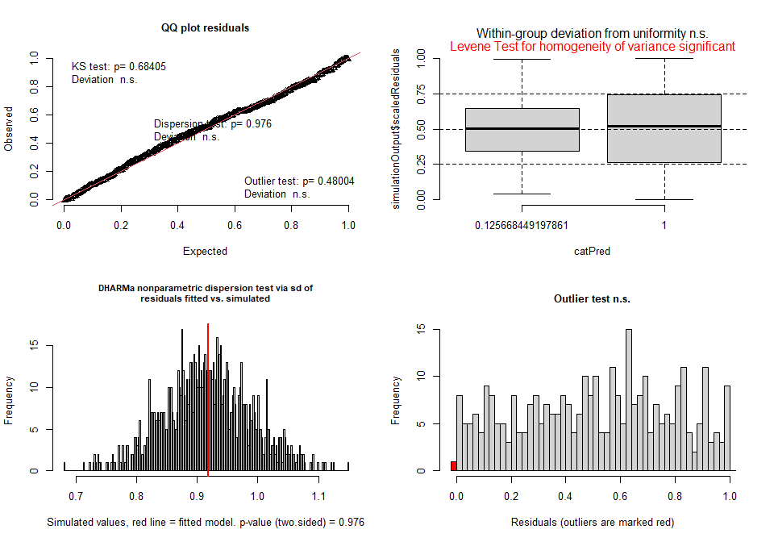<!-- -->

```
## 
## 	DHARMa outlier test based on exact binomial test with approximate
## 	expectations
## 
## data:  simulationOutput
## outliers at both margin(s) = 1, observations = 327, p-value = 0.48
## alternative hypothesis: true probability of success is not equal to 0.001998002
## 95 percent confidence interval:
##  7.742149e-05 1.692004e-02
## sample estimates:
## frequency of outliers (expected: 0.001998001998002 ) 
##                                          0.003058104
```

``` r
DHARMa.sum(Model = lm4)
```

```
## 1. Kolmogorov-Smirnov test indicates deviations of the residuals from uniform distribution. H0: The model fits the data well; Ha: The model does not fit the data well
```

```
## 
## 	Asymptotic one-sample Kolmogorov-Smirnov test
## 
## data:  simulationOutput$scaledResiduals
## D = 0.044098, p-value = 0.5483
## alternative hypothesis: two-sided
```

```
## 2. Test for over-dispersion. H0: No over-dispersion in the model; Ha: Over-dispersion in the model
```

```
## 
## 	DHARMa nonparametric dispersion test via sd of residuals fitted vs.
## 	simulated
## 
## data:  simulationOutput
## dispersion = 1.0002, p-value = 0.996
## alternative hypothesis: two.sided
## 
## 3. Test for outliers. H0: No ouliers in the model; Ha: Outliers in the model
```

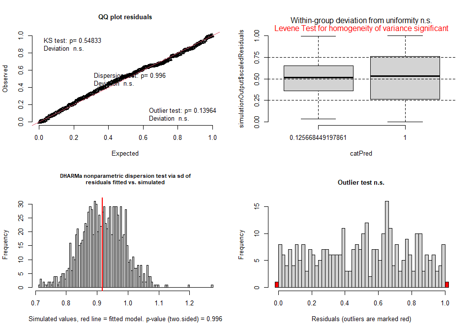<!-- -->

```
## 
## 	DHARMa outlier test based on exact binomial test with approximate
## 	expectations
## 
## data:  simulationOutput
## outliers at both margin(s) = 2, observations = 327, p-value = 0.1396
## alternative hypothesis: true probability of success is not equal to 0.001998002
## 95 percent confidence interval:
##  0.0007415613 0.0219180448
## sample estimates:
## frequency of outliers (expected: 0.001998001998002 ) 
##                                          0.006116208
```

``` r
DHARMa.sum(Model = lm5)
```

```
## 1. Kolmogorov-Smirnov test indicates deviations of the residuals from uniform distribution. H0: The model fits the data well; Ha: The model does not fit the data well
```

```
## 
## 	Asymptotic one-sample Kolmogorov-Smirnov test
## 
## data:  simulationOutput$scaledResiduals
## D = 0.039945, p-value = 0.6738
## alternative hypothesis: two-sided
```

```
## 2. Test for over-dispersion. H0: No over-dispersion in the model; Ha: Over-dispersion in the model
```

```
## 
## 	DHARMa nonparametric dispersion test via sd of residuals fitted vs.
## 	simulated
## 
## data:  simulationOutput
## dispersion = 1.0011, p-value = 0.976
## alternative hypothesis: two.sided
## 
## 3. Test for outliers. H0: No ouliers in the model; Ha: Outliers in the model
```

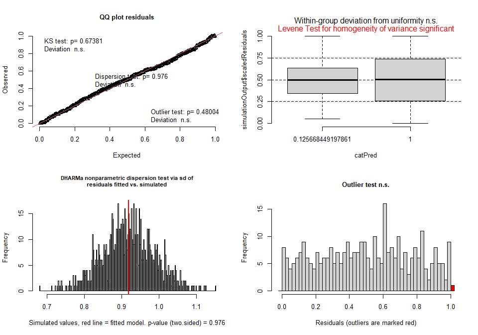<!-- -->

```
## 
## 	DHARMa outlier test based on exact binomial test with approximate
## 	expectations
## 
## data:  simulationOutput
## outliers at both margin(s) = 1, observations = 327, p-value = 0.48
## alternative hypothesis: true probability of success is not equal to 0.001998002
## 95 percent confidence interval:
##  7.742149e-05 1.692004e-02
## sample estimates:
## frequency of outliers (expected: 0.001998001998002 ) 
##                                          0.003058104
```

``` r
DHARMa.sum(Model = lm6)
```

```
## 1. Kolmogorov-Smirnov test indicates deviations of the residuals from uniform distribution. H0: The model fits the data well; Ha: The model does not fit the data well
```

```
## 
## 	Asymptotic one-sample Kolmogorov-Smirnov test
## 
## data:  simulationOutput$scaledResiduals
## D = 0.039538, p-value = 0.6862
## alternative hypothesis: two-sided
```

```
## 2. Test for over-dispersion. H0: No over-dispersion in the model; Ha: Over-dispersion in the model
```

```
## 
## 	DHARMa nonparametric dispersion test via sd of residuals fitted vs.
## 	simulated
## 
## data:  simulationOutput
## dispersion = 1.0002, p-value = 0.996
## alternative hypothesis: two.sided
## 
## 3. Test for outliers. H0: No ouliers in the model; Ha: Outliers in the model
```

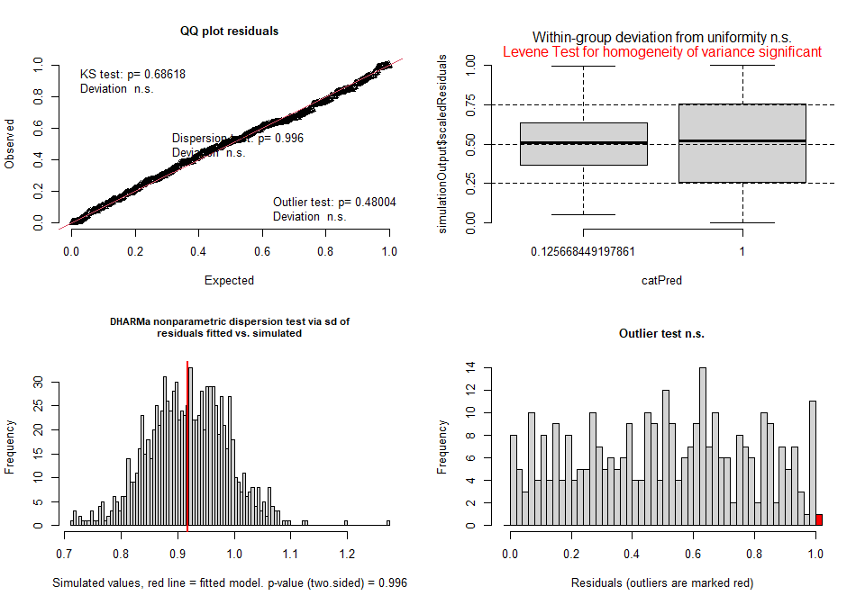<!-- -->

```
## 
## 	DHARMa outlier test based on exact binomial test with approximate
## 	expectations
## 
## data:  simulationOutput
## outliers at both margin(s) = 1, observations = 327, p-value = 0.48
## alternative hypothesis: true probability of success is not equal to 0.001998002
## 95 percent confidence interval:
##  7.742149e-05 1.692004e-02
## sample estimates:
## frequency of outliers (expected: 0.001998001998002 ) 
##                                          0.003058104
```

``` r
DHARMa.sum(Model = glm1)
```

```
## 1. Kolmogorov-Smirnov test indicates deviations of the residuals from uniform distribution. H0: The model fits the data well; Ha: The model does not fit the data well
```

```
## 
## 	Asymptotic one-sample Kolmogorov-Smirnov test
## 
## data:  simulationOutput$scaledResiduals
## D = 0.034618, p-value = 0.8281
## alternative hypothesis: two-sided
```

```
## 2. Test for over-dispersion. H0: No over-dispersion in the model; Ha: Over-dispersion in the model
```

```
## 
## 	DHARMa nonparametric dispersion test via sd of residuals fitted vs.
## 	simulated
## 
## data:  simulationOutput
## dispersion = 1.017, p-value = 0.788
## alternative hypothesis: two.sided
## 
## 3. Test for outliers. H0: No ouliers in the model; Ha: Outliers in the model
```

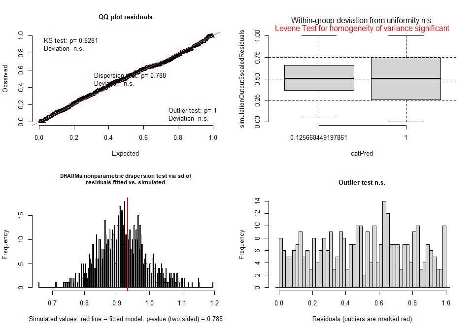<!-- -->

```
## 
## 	DHARMa outlier test based on exact binomial test with approximate
## 	expectations
## 
## data:  simulationOutput
## outliers at both margin(s) = 0, observations = 327, p-value = 1
## alternative hypothesis: true probability of success is not equal to 0.001998002
## 95 percent confidence interval:
##  0.00000000 0.01121759
## sample estimates:
## frequency of outliers (expected: 0.001998001998002 ) 
##                                                    0
```

``` r
DHARMa.sum(Model = glm2)
```

```
## 1. Kolmogorov-Smirnov test indicates deviations of the residuals from uniform distribution. H0: The model fits the data well; Ha: The model does not fit the data well
```

```
## 
## 	Asymptotic one-sample Kolmogorov-Smirnov test
## 
## data:  simulationOutput$scaledResiduals
## D = 0.03841, p-value = 0.7203
## alternative hypothesis: two-sided
```

```
## 2. Test for over-dispersion. H0: No over-dispersion in the model; Ha: Over-dispersion in the model
```

```
## 
## 	DHARMa nonparametric dispersion test via sd of residuals fitted vs.
## 	simulated
## 
## data:  simulationOutput
## dispersion = 1.0186, p-value = 0.768
## alternative hypothesis: two.sided
## 
## 3. Test for outliers. H0: No ouliers in the model; Ha: Outliers in the model
```

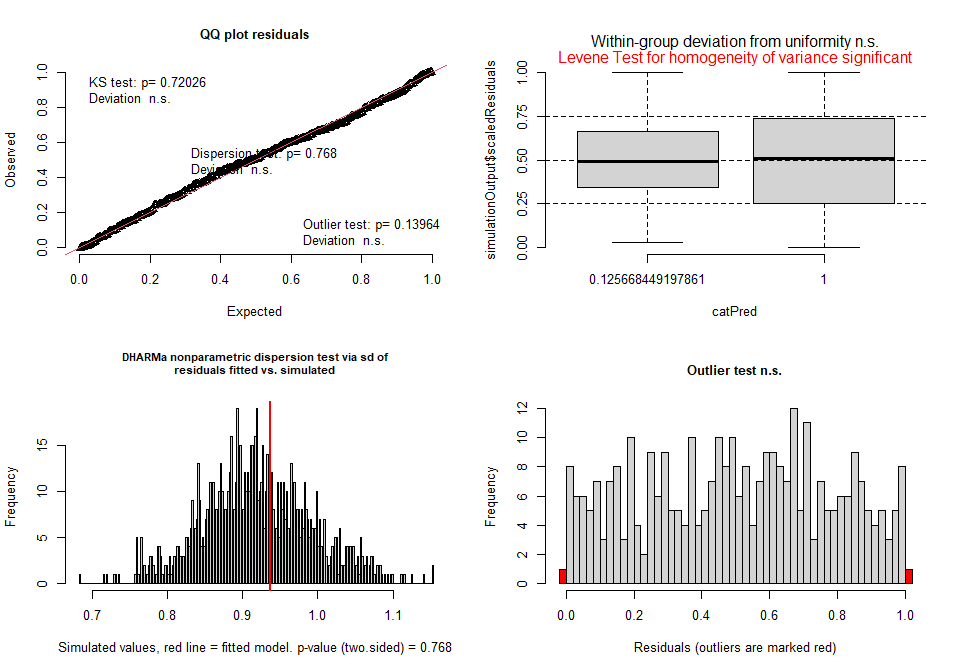<!-- -->

```
## 
## 	DHARMa outlier test based on exact binomial test with approximate
## 	expectations
## 
## data:  simulationOutput
## outliers at both margin(s) = 2, observations = 327, p-value = 0.1396
## alternative hypothesis: true probability of success is not equal to 0.001998002
## 95 percent confidence interval:
##  0.0007415613 0.0219180448
## sample estimates:
## frequency of outliers (expected: 0.001998001998002 ) 
##                                          0.006116208
```

``` r
DHARMa.sum(Model = glm3)
```

```
## 1. Kolmogorov-Smirnov test indicates deviations of the residuals from uniform distribution. H0: The model fits the data well; Ha: The model does not fit the data well
```

```
## 
## 	Asymptotic one-sample Kolmogorov-Smirnov test
## 
## data:  simulationOutput$scaledResiduals
## D = 0.042691, p-value = 0.5903
## alternative hypothesis: two-sided
```

```
## 2. Test for over-dispersion. H0: No over-dispersion in the model; Ha: Over-dispersion in the model
```

```
## 
## 	DHARMa nonparametric dispersion test via sd of residuals fitted vs.
## 	simulated
## 
## data:  simulationOutput
## dispersion = 1.0028, p-value = 0.948
## alternative hypothesis: two.sided
## 
## 3. Test for outliers. H0: No ouliers in the model; Ha: Outliers in the model
```

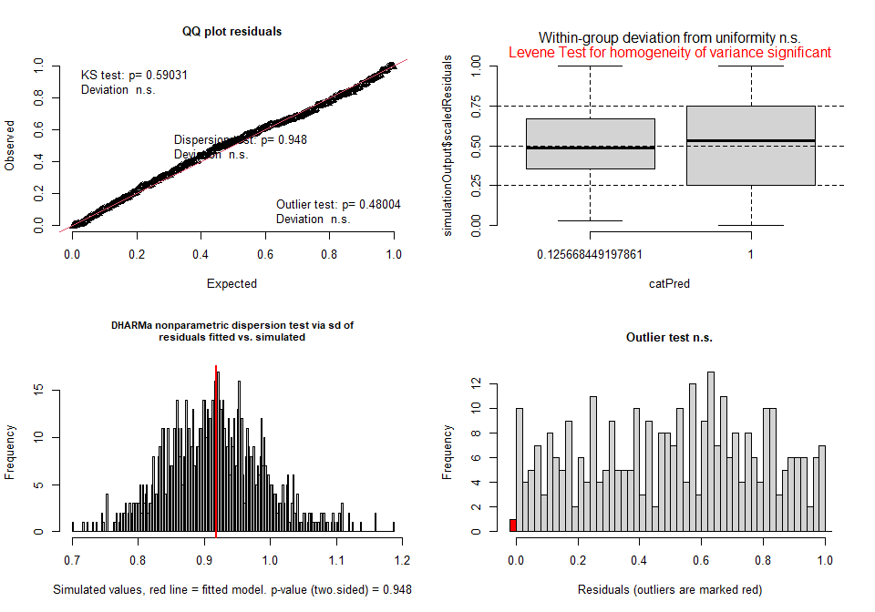<!-- -->

```
## 
## 	DHARMa outlier test based on exact binomial test with approximate
## 	expectations
## 
## data:  simulationOutput
## outliers at both margin(s) = 1, observations = 327, p-value = 0.48
## alternative hypothesis: true probability of success is not equal to 0.001998002
## 95 percent confidence interval:
##  7.742149e-05 1.692004e-02
## sample estimates:
## frequency of outliers (expected: 0.001998001998002 ) 
##                                          0.003058104
```

``` r
DHARMa.sum(Model = glm4)
```

```
## 1. Kolmogorov-Smirnov test indicates deviations of the residuals from uniform distribution. H0: The model fits the data well; Ha: The model does not fit the data well
```

```
## 
## 	Asymptotic one-sample Kolmogorov-Smirnov test
## 
## data:  simulationOutput$scaledResiduals
## D = 0.044318, p-value = 0.5419
## alternative hypothesis: two-sided
```

```
## 2. Test for over-dispersion. H0: No over-dispersion in the model; Ha: Over-dispersion in the model
```

```
## 
## 	DHARMa nonparametric dispersion test via sd of residuals fitted vs.
## 	simulated
## 
## data:  simulationOutput
## dispersion = 1.0034, p-value = 0.936
## alternative hypothesis: two.sided
## 
## 3. Test for outliers. H0: No ouliers in the model; Ha: Outliers in the model
```

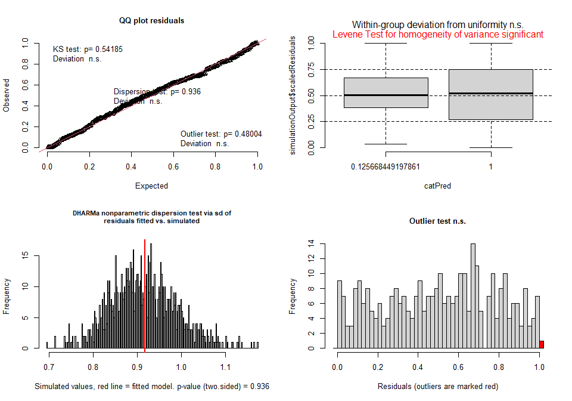<!-- -->

```
## 
## 	DHARMa outlier test based on exact binomial test with approximate
## 	expectations
## 
## data:  simulationOutput
## outliers at both margin(s) = 1, observations = 327, p-value = 0.48
## alternative hypothesis: true probability of success is not equal to 0.001998002
## 95 percent confidence interval:
##  7.742149e-05 1.692004e-02
## sample estimates:
## frequency of outliers (expected: 0.001998001998002 ) 
##                                          0.003058104
```

``` r
DHARMa.sum(Model = glm5)
```

```
## 1. Kolmogorov-Smirnov test indicates deviations of the residuals from uniform distribution. H0: The model fits the data well; Ha: The model does not fit the data well
```

```
## 
## 	Asymptotic one-sample Kolmogorov-Smirnov test
## 
## data:  simulationOutput$scaledResiduals
## D = 0.035945, p-value = 0.792
## alternative hypothesis: two-sided
```

```
## 2. Test for over-dispersion. H0: No over-dispersion in the model; Ha: Over-dispersion in the model
```

```
## 
## 	DHARMa nonparametric dispersion test via sd of residuals fitted vs.
## 	simulated
## 
## data:  simulationOutput
## dispersion = 1.006, p-value = 0.91
## alternative hypothesis: two.sided
## 
## 3. Test for outliers. H0: No ouliers in the model; Ha: Outliers in the model
```

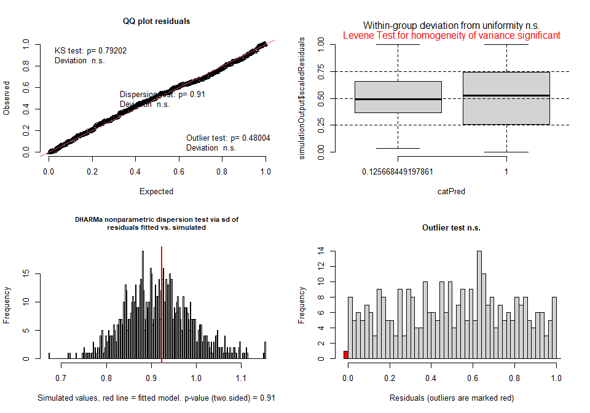<!-- -->

```
## 
## 	DHARMa outlier test based on exact binomial test with approximate
## 	expectations
## 
## data:  simulationOutput
## outliers at both margin(s) = 1, observations = 327, p-value = 0.48
## alternative hypothesis: true probability of success is not equal to 0.001998002
## 95 percent confidence interval:
##  7.742149e-05 1.692004e-02
## sample estimates:
## frequency of outliers (expected: 0.001998001998002 ) 
##                                          0.003058104
```

``` r
DHARMa.sum(Model = glm6)
```

```
## 1. Kolmogorov-Smirnov test indicates deviations of the residuals from uniform distribution. H0: The model fits the data well; Ha: The model does not fit the data well
```

```
## 
## 	Asymptotic one-sample Kolmogorov-Smirnov test
## 
## data:  simulationOutput$scaledResiduals
## D = 0.035003, p-value = 0.8179
## alternative hypothesis: two-sided
```

```
## 2. Test for over-dispersion. H0: No over-dispersion in the model; Ha: Over-dispersion in the model
```

```
## 
## 	DHARMa nonparametric dispersion test via sd of residuals fitted vs.
## 	simulated
## 
## data:  simulationOutput
## dispersion = 1.0068, p-value = 0.928
## alternative hypothesis: two.sided
## 
## 3. Test for outliers. H0: No ouliers in the model; Ha: Outliers in the model
```

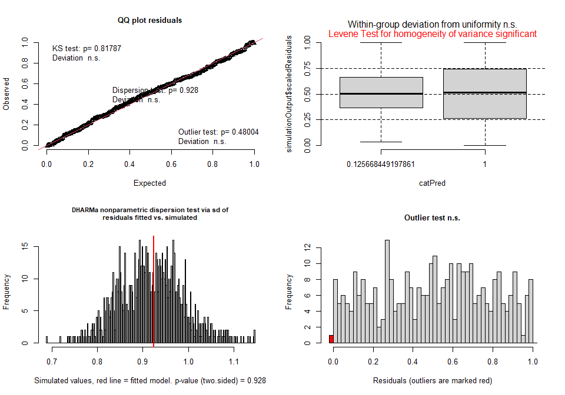<!-- -->

```
## 
## 	DHARMa outlier test based on exact binomial test with approximate
## 	expectations
## 
## data:  simulationOutput
## outliers at both margin(s) = 1, observations = 327, p-value = 0.48
## alternative hypothesis: true probability of success is not equal to 0.001998002
## 95 percent confidence interval:
##  7.742149e-05 1.692004e-02
## sample estimates:
## frequency of outliers (expected: 0.001998001998002 ) 
##                                          0.003058104
```

### Model output

``` r
# #summary(lm1)
# summary(lm2)
# #Anova(lm1)
# Anova(lm2)
# 
# summary(lm3)
# summary(lm4)
# Anova(lm3)
# Anova(lm4)

# summary(lm5)
summary(lm6)
```

```
##  Family: gaussian  ( identity )
## Formula:          sqrt(Observed) ~ Phase_PSF
## Data: total_diversity
## 
##       AIC       BIC    logLik -2*log(L)  df.resid 
##    1511.3    1522.7    -752.6    1505.3       324 
## 
## 
## Dispersion estimate for gaussian family (sigma^2): 5.84 
## 
## Conditional model:
##             Estimate Std. Error z value Pr(>|z|)    
## (Intercept)  39.3492     0.1442  272.85  < 2e-16 ***
## Phase_PSFFP  -2.0839     0.3845   -5.42 5.97e-08 ***
## ---
## Signif. codes:  0 '***' 0.001 '**' 0.01 '*' 0.05 '.' 0.1 ' ' 1
```

``` r
# Anova(lm5)
Anova(lm6)
```

```
## Analysis of Deviance Table (Type II Wald chisquare tests)
## 
## Response: sqrt(Observed)
##            Chisq Df Pr(>Chisq)    
## Phase_PSF 29.373  1   5.97e-08 ***
## ---
## Signif. codes:  0 '***' 0.001 '**' 0.01 '*' 0.05 '.' 0.1 ' ' 1
```

``` r
Alphadiv_obs_Acc_CP_FP <- as.data.frame(Anova(lm6))
write.csv(Alphadiv_obs_Acc_CP_FP, "C:/Users/kreek001/OneDrive - Wageningen University & Research/Chapters/Experimental Chapter 3/RScripts/GitHub/TwelveAccessionExperiment/MicrobiomeAnalysis/Data/Statistical_output/CP_FP/Alphadiv_obs_Acc_CP_FP.csv")

# summary(glm1)
# summary(glm2)
# Anova(glm1)
# Anova(glm2)
# 
# #summary(glm3)
# summary(glm4)
# #Anova(glm3)
# Anova(glm4)
# 
#summary(glm5)
# summary(glm6)
#Anova(glm5)
# Anova(glm6)
```

### Post hoc test

``` r
emmeans(lm6, pairwise ~ Phase_PSF)
```

```
## $emmeans
##  Phase_PSF emmean    SE  df lower.CL upper.CL
##  CP          39.3 0.144 324     39.1     39.6
##  FP          37.3 0.356 324     36.6     38.0
## 
## Results are given on the sqrt (not the response) scale. 
## Confidence level used: 0.95 
## 
## $contrasts
##  contrast estimate    SE  df t.ratio p.value
##  CP - FP      2.08 0.385 324   5.420  <.0001
## 
## Note: contrasts are still on the sqrt scale. Consider using
##       regrid() if you want contrasts of back-transformed estimates.
```

``` r
ph_obs <- cld(emmeans(lm6, pairwise ~ Phase_PSF), Letters = letters)
print(ph_obs)
```

```
##  Phase_PSF emmean    SE  df lower.CL upper.CL .group
##  FP          37.3 0.356 324     36.6     38.0  a    
##  CP          39.3 0.144 324     39.1     39.6   b   
## 
## Results are given on the sqrt (not the response) scale. 
## Confidence level used: 0.95 
## Note: contrasts are still on the sqrt scale. Consider using
##       regrid() if you want contrasts of back-transformed estimates. 
## significance level used: alpha = 0.05 
## NOTE: If two or more means share the same grouping symbol,
##       then we cannot show them to be different.
##       But we also did not show them to be the same.
```


``` r
rm(lm1, lm2, lm3, lm4, lm5, lm6, glm1, glm2, glm3, glm4, glm5, glm6)
```

## Statistics Shannon index
### Defining model

``` r
lm1 <- glmmTMB(data = total_diversity, formula = Shannon ~ Phase_PSF + (1 | Block_g), family = gaussian(link = "identity"))
lm2 <- glmmTMB(data = total_diversity, formula = Shannon ~ Phase_PSF, family = gaussian(link = "identity"))

lm3 <- glmmTMB(data = total_diversity, formula = log(Shannon) ~ Phase_PSF + (1 | Block_g), family = gaussian(link = "identity"))
lm4 <- glmmTMB(data = total_diversity, formula = log(Shannon) ~ Phase_PSF, family = gaussian(link = "identity"))

lm5 <- glmmTMB(data = total_diversity, formula = sqrt(Shannon) ~ Phase_PSF + (1 | Block_g), family = gaussian(link = "identity"))
lm6 <- glmmTMB(data = total_diversity, formula = sqrt(Shannon) ~ Phase_PSF, family = gaussian(link = "identity"))

glm1 <- glmmTMB(data = total_diversity, formula = Shannon ~ Phase_PSF + (1 | Block_g), family = Gamma(link = "log"))
glm2 <- glmmTMB(data = total_diversity, formula = Shannon ~ Phase_PSF, family = Gamma(link = "log"))

glm3 <- glmmTMB(data = total_diversity, formula = log(Shannon + 1) ~ Phase_PSF + (1 | Block_g), family = Gamma(link = "log"))
glm4 <- glmmTMB(data = total_diversity, formula = log(Shannon + 1) ~ Phase_PSF, family = Gamma(link = "log"))

glm5 <- glmmTMB(data = total_diversity, formula = sqrt(Shannon) ~ Phase_PSF + (1 | Block_g), family = Gamma(link = "log"))
glm6 <- glmmTMB(data = total_diversity, formula = sqrt(Shannon) ~ Phase_PSF, family = Gamma(link = "log"))
```

### Model assumptions

``` r
DHARMa.sum(Model = lm1)
```

```
## 1. Kolmogorov-Smirnov test indicates deviations of the residuals from uniform distribution. H0: The model fits the data well; Ha: The model does not fit the data well
```

```
## 
## 	Asymptotic one-sample Kolmogorov-Smirnov test
## 
## data:  simulationOutput$scaledResiduals
## D = 0.061168, p-value = 0.173
## alternative hypothesis: two-sided
```

```
## 2. Test for over-dispersion. H0: No over-dispersion in the model; Ha: Over-dispersion in the model
```

```
## 
## 	DHARMa nonparametric dispersion test via sd of residuals fitted vs.
## 	simulated
## 
## data:  simulationOutput
## dispersion = 1.0011, p-value = 0.976
## alternative hypothesis: two.sided
## 
## 3. Test for outliers. H0: No ouliers in the model; Ha: Outliers in the model
```

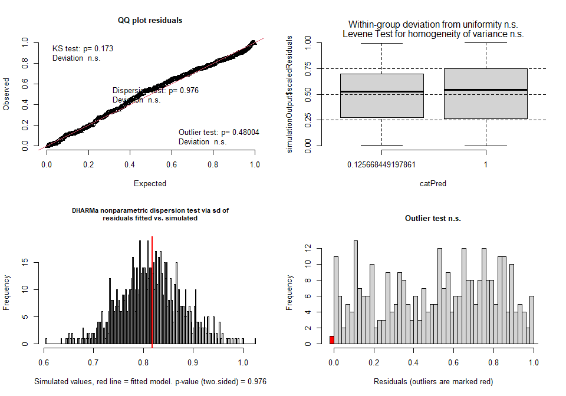<!-- -->

```
## 
## 	DHARMa outlier test based on exact binomial test with approximate
## 	expectations
## 
## data:  simulationOutput
## outliers at both margin(s) = 1, observations = 327, p-value = 0.48
## alternative hypothesis: true probability of success is not equal to 0.001998002
## 95 percent confidence interval:
##  7.742149e-05 1.692004e-02
## sample estimates:
## frequency of outliers (expected: 0.001998001998002 ) 
##                                          0.003058104
```

``` r
DHARMa.sum(Model = lm2)
```

```
## 1. Kolmogorov-Smirnov test indicates deviations of the residuals from uniform distribution. H0: The model fits the data well; Ha: The model does not fit the data well
```

```
## 
## 	Asymptotic one-sample Kolmogorov-Smirnov test
## 
## data:  simulationOutput$scaledResiduals
## D = 0.058645, p-value = 0.2107
## alternative hypothesis: two-sided
```

```
## 2. Test for over-dispersion. H0: No over-dispersion in the model; Ha: Over-dispersion in the model
```

```
## 
## 	DHARMa nonparametric dispersion test via sd of residuals fitted vs.
## 	simulated
## 
## data:  simulationOutput
## dispersion = 1.0002, p-value = 0.996
## alternative hypothesis: two.sided
## 
## 3. Test for outliers. H0: No ouliers in the model; Ha: Outliers in the model
```

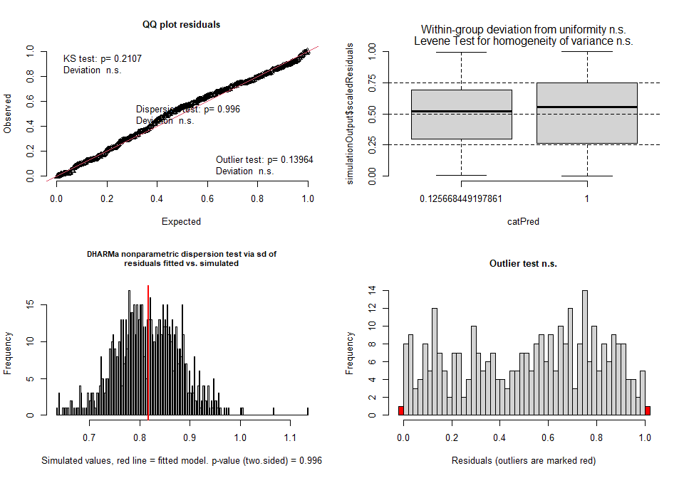<!-- -->

```
## 
## 	DHARMa outlier test based on exact binomial test with approximate
## 	expectations
## 
## data:  simulationOutput
## outliers at both margin(s) = 2, observations = 327, p-value = 0.1396
## alternative hypothesis: true probability of success is not equal to 0.001998002
## 95 percent confidence interval:
##  0.0007415613 0.0219180448
## sample estimates:
## frequency of outliers (expected: 0.001998001998002 ) 
##                                          0.006116208
```

``` r
DHARMa.sum(Model = lm3)
```

```
## 1. Kolmogorov-Smirnov test indicates deviations of the residuals from uniform distribution. H0: The model fits the data well; Ha: The model does not fit the data well
```

```
## 
## 	Asymptotic one-sample Kolmogorov-Smirnov test
## 
## data:  simulationOutput$scaledResiduals
## D = 0.064168, p-value = 0.1353
## alternative hypothesis: two-sided
```

```
## 2. Test for over-dispersion. H0: No over-dispersion in the model; Ha: Over-dispersion in the model
```

```
## 
## 	DHARMa nonparametric dispersion test via sd of residuals fitted vs.
## 	simulated
## 
## data:  simulationOutput
## dispersion = 1.0011, p-value = 0.976
## alternative hypothesis: two.sided
## 
## 3. Test for outliers. H0: No ouliers in the model; Ha: Outliers in the model
```

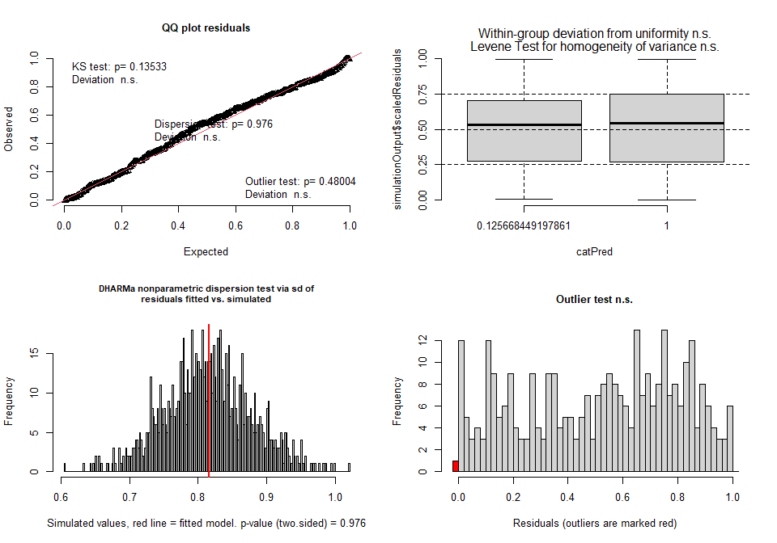<!-- -->

```
## 
## 	DHARMa outlier test based on exact binomial test with approximate
## 	expectations
## 
## data:  simulationOutput
## outliers at both margin(s) = 1, observations = 327, p-value = 0.48
## alternative hypothesis: true probability of success is not equal to 0.001998002
## 95 percent confidence interval:
##  7.742149e-05 1.692004e-02
## sample estimates:
## frequency of outliers (expected: 0.001998001998002 ) 
##                                          0.003058104
```

``` r
DHARMa.sum(Model = lm4)
```

```
## 1. Kolmogorov-Smirnov test indicates deviations of the residuals from uniform distribution. H0: The model fits the data well; Ha: The model does not fit the data well
```

```
## 
## 	Asymptotic one-sample Kolmogorov-Smirnov test
## 
## data:  simulationOutput$scaledResiduals
## D = 0.059703, p-value = 0.1942
## alternative hypothesis: two-sided
```

```
## 2. Test for over-dispersion. H0: No over-dispersion in the model; Ha: Over-dispersion in the model
```

```
## 
## 	DHARMa nonparametric dispersion test via sd of residuals fitted vs.
## 	simulated
## 
## data:  simulationOutput
## dispersion = 1.0002, p-value = 0.996
## alternative hypothesis: two.sided
## 
## 3. Test for outliers. H0: No ouliers in the model; Ha: Outliers in the model
```

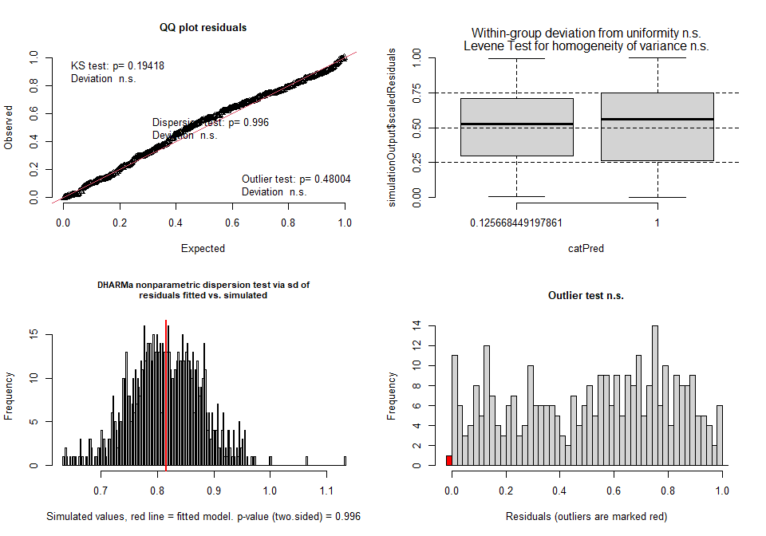<!-- -->

```
## 
## 	DHARMa outlier test based on exact binomial test with approximate
## 	expectations
## 
## data:  simulationOutput
## outliers at both margin(s) = 1, observations = 327, p-value = 0.48
## alternative hypothesis: true probability of success is not equal to 0.001998002
## 95 percent confidence interval:
##  7.742149e-05 1.692004e-02
## sample estimates:
## frequency of outliers (expected: 0.001998001998002 ) 
##                                          0.003058104
```

``` r
DHARMa.sum(Model = lm5)
```

```
## 1. Kolmogorov-Smirnov test indicates deviations of the residuals from uniform distribution. H0: The model fits the data well; Ha: The model does not fit the data well
```

```
## 
## 	Asymptotic one-sample Kolmogorov-Smirnov test
## 
## data:  simulationOutput$scaledResiduals
## D = 0.063168, p-value = 0.1471
## alternative hypothesis: two-sided
```

```
## 2. Test for over-dispersion. H0: No over-dispersion in the model; Ha: Over-dispersion in the model
```

```
## 
## 	DHARMa nonparametric dispersion test via sd of residuals fitted vs.
## 	simulated
## 
## data:  simulationOutput
## dispersion = 1.0011, p-value = 0.976
## alternative hypothesis: two.sided
## 
## 3. Test for outliers. H0: No ouliers in the model; Ha: Outliers in the model
```

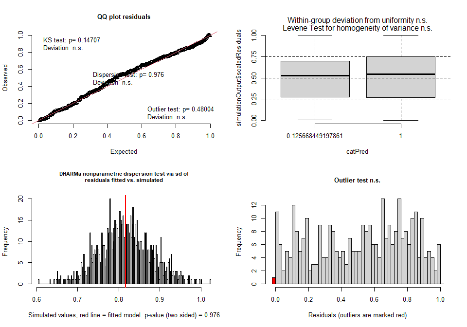<!-- -->

```
## 
## 	DHARMa outlier test based on exact binomial test with approximate
## 	expectations
## 
## data:  simulationOutput
## outliers at both margin(s) = 1, observations = 327, p-value = 0.48
## alternative hypothesis: true probability of success is not equal to 0.001998002
## 95 percent confidence interval:
##  7.742149e-05 1.692004e-02
## sample estimates:
## frequency of outliers (expected: 0.001998001998002 ) 
##                                          0.003058104
```

``` r
DHARMa.sum(Model = lm6)
```

```
## 1. Kolmogorov-Smirnov test indicates deviations of the residuals from uniform distribution. H0: The model fits the data well; Ha: The model does not fit the data well
```

```
## 
## 	Asymptotic one-sample Kolmogorov-Smirnov test
## 
## data:  simulationOutput$scaledResiduals
## D = 0.058645, p-value = 0.2107
## alternative hypothesis: two-sided
```

```
## 2. Test for over-dispersion. H0: No over-dispersion in the model; Ha: Over-dispersion in the model
```

```
## 
## 	DHARMa nonparametric dispersion test via sd of residuals fitted vs.
## 	simulated
## 
## data:  simulationOutput
## dispersion = 1.0002, p-value = 0.996
## alternative hypothesis: two.sided
## 
## 3. Test for outliers. H0: No ouliers in the model; Ha: Outliers in the model
```

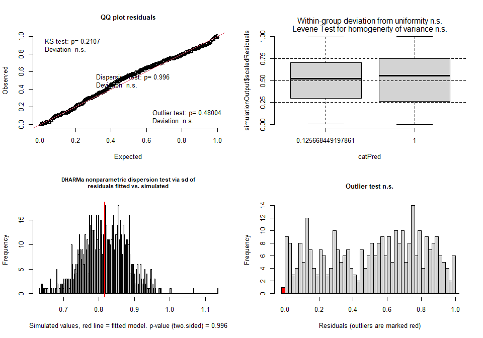<!-- -->

```
## 
## 	DHARMa outlier test based on exact binomial test with approximate
## 	expectations
## 
## data:  simulationOutput
## outliers at both margin(s) = 1, observations = 327, p-value = 0.48
## alternative hypothesis: true probability of success is not equal to 0.001998002
## 95 percent confidence interval:
##  7.742149e-05 1.692004e-02
## sample estimates:
## frequency of outliers (expected: 0.001998001998002 ) 
##                                          0.003058104
```

``` r
DHARMa.sum(Model = glm1)
```

```
## 1. Kolmogorov-Smirnov test indicates deviations of the residuals from uniform distribution. H0: The model fits the data well; Ha: The model does not fit the data well
```

```
## 
## 	Asymptotic one-sample Kolmogorov-Smirnov test
## 
## data:  simulationOutput$scaledResiduals
## D = 0.062168, p-value = 0.1596
## alternative hypothesis: two-sided
```

```
## 2. Test for over-dispersion. H0: No over-dispersion in the model; Ha: Over-dispersion in the model
```

```
## 
## 	DHARMa nonparametric dispersion test via sd of residuals fitted vs.
## 	simulated
## 
## data:  simulationOutput
## dispersion = 0.99833, p-value = 0.998
## alternative hypothesis: two.sided
## 
## 3. Test for outliers. H0: No ouliers in the model; Ha: Outliers in the model
```

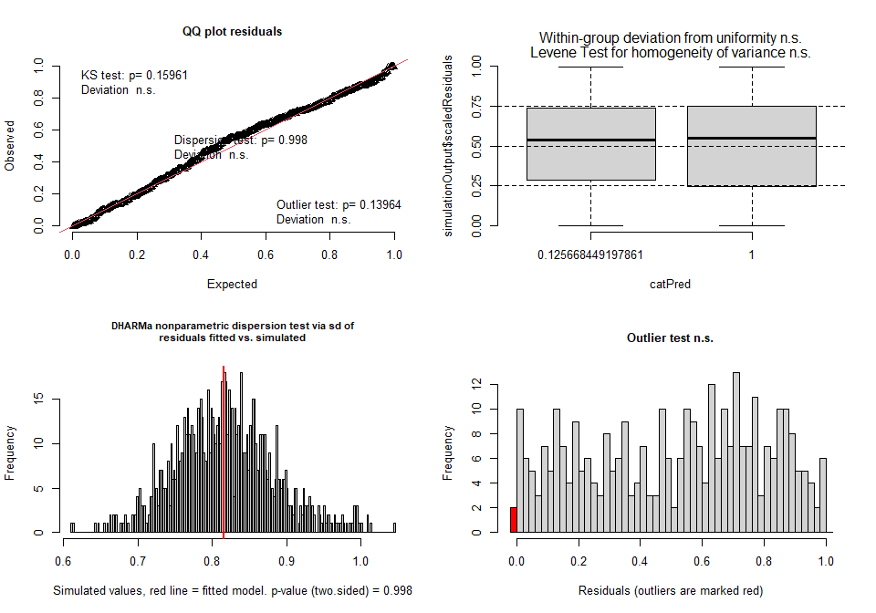<!-- -->

```
## 
## 	DHARMa outlier test based on exact binomial test with approximate
## 	expectations
## 
## data:  simulationOutput
## outliers at both margin(s) = 2, observations = 327, p-value = 0.1396
## alternative hypothesis: true probability of success is not equal to 0.001998002
## 95 percent confidence interval:
##  0.0007415613 0.0219180448
## sample estimates:
## frequency of outliers (expected: 0.001998001998002 ) 
##                                          0.006116208
```

``` r
DHARMa.sum(Model = glm2)
```

```
## 1. Kolmogorov-Smirnov test indicates deviations of the residuals from uniform distribution. H0: The model fits the data well; Ha: The model does not fit the data well
```

```
## 
## 	Asymptotic one-sample Kolmogorov-Smirnov test
## 
## data:  simulationOutput$scaledResiduals
## D = 0.058703, p-value = 0.2098
## alternative hypothesis: two-sided
```

```
## 2. Test for over-dispersion. H0: No over-dispersion in the model; Ha: Over-dispersion in the model
```

```
## 
## 	DHARMa nonparametric dispersion test via sd of residuals fitted vs.
## 	simulated
## 
## data:  simulationOutput
## dispersion = 0.9983, p-value = 0.962
## alternative hypothesis: two.sided
## 
## 3. Test for outliers. H0: No ouliers in the model; Ha: Outliers in the model
```

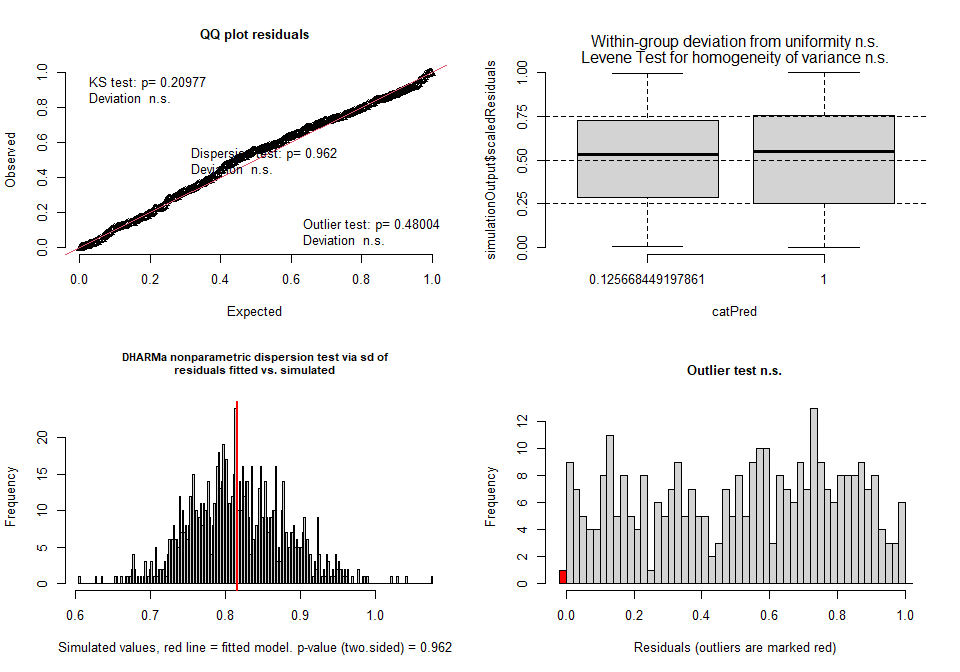<!-- -->

```
## 
## 	DHARMa outlier test based on exact binomial test with approximate
## 	expectations
## 
## data:  simulationOutput
## outliers at both margin(s) = 1, observations = 327, p-value = 0.48
## alternative hypothesis: true probability of success is not equal to 0.001998002
## 95 percent confidence interval:
##  7.742149e-05 1.692004e-02
## sample estimates:
## frequency of outliers (expected: 0.001998001998002 ) 
##                                          0.003058104
```

``` r
DHARMa.sum(Model = glm3)
```

```
## 1. Kolmogorov-Smirnov test indicates deviations of the residuals from uniform distribution. H0: The model fits the data well; Ha: The model does not fit the data well
```

```
## 
## 	Asymptotic one-sample Kolmogorov-Smirnov test
## 
## data:  simulationOutput$scaledResiduals
## D = 0.066633, p-value = 0.1096
## alternative hypothesis: two-sided
```

```
## 2. Test for over-dispersion. H0: No over-dispersion in the model; Ha: Over-dispersion in the model
```

```
## 
## 	DHARMa nonparametric dispersion test via sd of residuals fitted vs.
## 	simulated
## 
## data:  simulationOutput
## dispersion = 1.0006, p-value = 0.94
## alternative hypothesis: two.sided
## 
## 3. Test for outliers. H0: No ouliers in the model; Ha: Outliers in the model
```

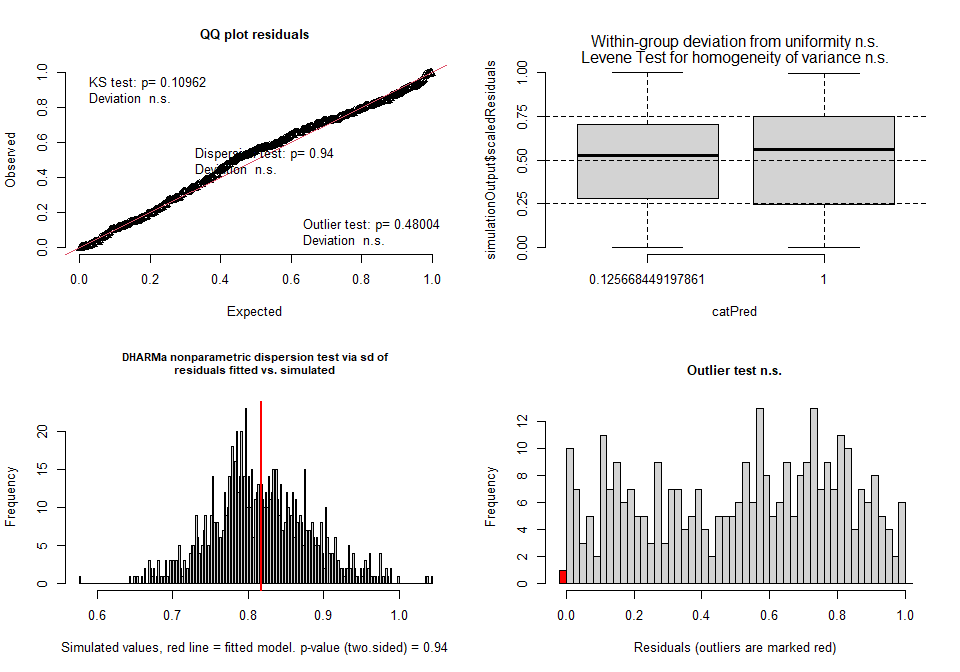<!-- -->

```
## 
## 	DHARMa outlier test based on exact binomial test with approximate
## 	expectations
## 
## data:  simulationOutput
## outliers at both margin(s) = 1, observations = 327, p-value = 0.48
## alternative hypothesis: true probability of success is not equal to 0.001998002
## 95 percent confidence interval:
##  7.742149e-05 1.692004e-02
## sample estimates:
## frequency of outliers (expected: 0.001998001998002 ) 
##                                          0.003058104
```

``` r
DHARMa.sum(Model = glm4)
```

```
## 1. Kolmogorov-Smirnov test indicates deviations of the residuals from uniform distribution. H0: The model fits the data well; Ha: The model does not fit the data well
```

```
## 
## 	Asymptotic one-sample Kolmogorov-Smirnov test
## 
## data:  simulationOutput$scaledResiduals
## D = 0.06204, p-value = 0.1613
## alternative hypothesis: two-sided
```

```
## 2. Test for over-dispersion. H0: No over-dispersion in the model; Ha: Over-dispersion in the model
```

```
## 
## 	DHARMa nonparametric dispersion test via sd of residuals fitted vs.
## 	simulated
## 
## data:  simulationOutput
## dispersion = 1.0013, p-value = 0.976
## alternative hypothesis: two.sided
## 
## 3. Test for outliers. H0: No ouliers in the model; Ha: Outliers in the model
```

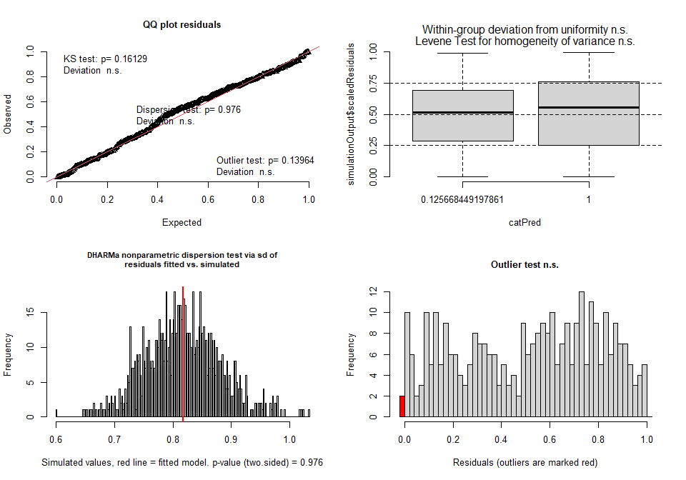<!-- -->

```
## 
## 	DHARMa outlier test based on exact binomial test with approximate
## 	expectations
## 
## data:  simulationOutput
## outliers at both margin(s) = 2, observations = 327, p-value = 0.1396
## alternative hypothesis: true probability of success is not equal to 0.001998002
## 95 percent confidence interval:
##  0.0007415613 0.0219180448
## sample estimates:
## frequency of outliers (expected: 0.001998001998002 ) 
##                                          0.006116208
```

``` r
DHARMa.sum(Model = glm5)
```

```
## 1. Kolmogorov-Smirnov test indicates deviations of the residuals from uniform distribution. H0: The model fits the data well; Ha: The model does not fit the data well
```

```
## 
## 	Asymptotic one-sample Kolmogorov-Smirnov test
## 
## data:  simulationOutput$scaledResiduals
## D = 0.060878, p-value = 0.177
## alternative hypothesis: two-sided
```

```
## 2. Test for over-dispersion. H0: No over-dispersion in the model; Ha: Over-dispersion in the model
```

```
## 
## 	DHARMa nonparametric dispersion test via sd of residuals fitted vs.
## 	simulated
## 
## data:  simulationOutput
## dispersion = 1.001, p-value = 0.962
## alternative hypothesis: two.sided
## 
## 3. Test for outliers. H0: No ouliers in the model; Ha: Outliers in the model
```

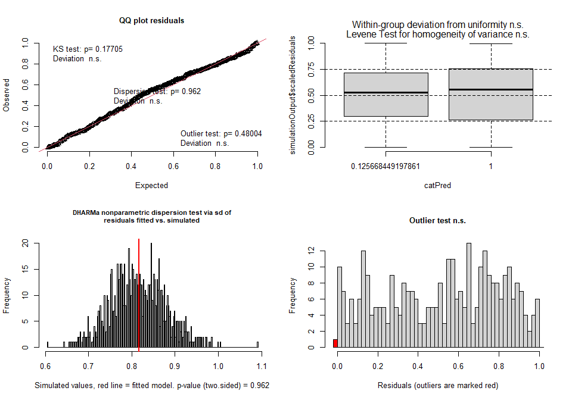<!-- -->

```
## 
## 	DHARMa outlier test based on exact binomial test with approximate
## 	expectations
## 
## data:  simulationOutput
## outliers at both margin(s) = 1, observations = 327, p-value = 0.48
## alternative hypothesis: true probability of success is not equal to 0.001998002
## 95 percent confidence interval:
##  7.742149e-05 1.692004e-02
## sample estimates:
## frequency of outliers (expected: 0.001998001998002 ) 
##                                          0.003058104
```

``` r
DHARMa.sum(Model = glm6)
```

```
## 1. Kolmogorov-Smirnov test indicates deviations of the residuals from uniform distribution. H0: The model fits the data well; Ha: The model does not fit the data well
```

```
## 
## 	Asymptotic one-sample Kolmogorov-Smirnov test
## 
## data:  simulationOutput$scaledResiduals
## D = 0.065691, p-value = 0.1189
## alternative hypothesis: two-sided
```

```
## 2. Test for over-dispersion. H0: No over-dispersion in the model; Ha: Over-dispersion in the model
```

```
## 
## 	DHARMa nonparametric dispersion test via sd of residuals fitted vs.
## 	simulated
## 
## data:  simulationOutput
## dispersion = 1.0011, p-value = 0.954
## alternative hypothesis: two.sided
## 
## 3. Test for outliers. H0: No ouliers in the model; Ha: Outliers in the model
```

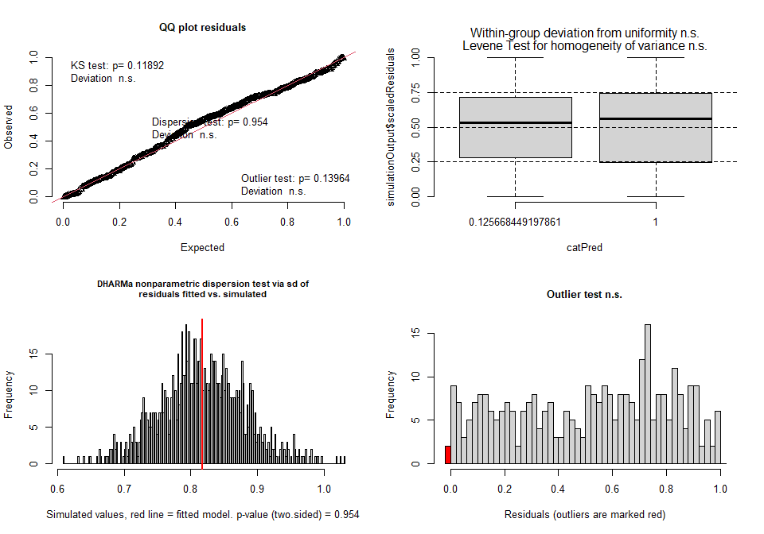<!-- -->

```
## 
## 	DHARMa outlier test based on exact binomial test with approximate
## 	expectations
## 
## data:  simulationOutput
## outliers at both margin(s) = 2, observations = 327, p-value = 0.1396
## alternative hypothesis: true probability of success is not equal to 0.001998002
## 95 percent confidence interval:
##  0.0007415613 0.0219180448
## sample estimates:
## frequency of outliers (expected: 0.001998001998002 ) 
##                                          0.006116208
```
lm1 best

### Model output

``` r
#summary(lm1)
summary(lm2)
```

```
##  Family: gaussian  ( identity )
## Formula:          Shannon ~ Phase_PSF
## Data: total_diversity
## 
##       AIC       BIC    logLik -2*log(L)  df.resid 
##    -433.3    -421.9     219.6    -439.3       324 
## 
## 
## Dispersion estimate for gaussian family (sigma^2): 0.0153 
## 
## Conditional model:
##              Estimate Std. Error z value Pr(>|z|)    
## (Intercept)  6.604358   0.007374   895.6   <2e-16 ***
## Phase_PSFFP -0.168215   0.019661    -8.6   <2e-16 ***
## ---
## Signif. codes:  0 '***' 0.001 '**' 0.01 '*' 0.05 '.' 0.1 ' ' 1
```

``` r
#Anova(lm1)
Anova(lm2)
```

```
## Analysis of Deviance Table (Type II Wald chisquare tests)
## 
## Response: Shannon
##            Chisq Df Pr(>Chisq)    
## Phase_PSF 73.203  1  < 2.2e-16 ***
## ---
## Signif. codes:  0 '***' 0.001 '**' 0.01 '*' 0.05 '.' 0.1 ' ' 1
```

``` r
Alphadiv_Shan_Acc_CP_FP <- as.data.frame(Anova(lm2))
write.csv(Alphadiv_Shan_Acc_CP_FP, "C:/Users/kreek001/OneDrive - Wageningen University & Research/Chapters/Experimental Chapter 3/RScripts/GitHub/TwelveAccessionExperiment/MicrobiomeAnalysis/Data/Statistical_output/CP_FP/Alphadiv_Shan_Acc_CP_FP.csv")

# 
# summary(lm3)
# summary(lm4)
# Anova(lm3)
# Anova(lm4)

# summary(lm5)
# summary(lm6)
# Anova(lm5)
# Anova(lm6)

# summary(glm1)
# summary(glm2
# Anova(glm1)
# Anova(glm2)
# 
# #summary(glm3)
# summary(glm4)
# #Anova(glm3)
# Anova(glm4)
# 
# summary(glm5)
# summary(glm6)
# Anova(glm5)
# Anova(glm6)
```

### Post hoc test

``` r
emmeans(lm2, pairwise ~ Phase_PSF)
```

```
## $emmeans
##  Phase_PSF emmean      SE  df lower.CL upper.CL
##  CP         6.604 0.00737 324     6.59    6.619
##  FP         6.436 0.01820 324     6.40    6.472
## 
## Confidence level used: 0.95 
## 
## $contrasts
##  contrast estimate     SE  df t.ratio p.value
##  CP - FP     0.168 0.0197 324   8.556  <.0001
```

``` r
ph_sh <- cld(emmeans(lm2, pairwise ~ Phase_PSF), Letters = letters)
print(ph_sh)
```

```
##  Phase_PSF emmean      SE  df lower.CL upper.CL .group
##  FP         6.436 0.01820 324     6.40    6.472  a    
##  CP         6.604 0.00737 324     6.59    6.619   b   
## 
## Confidence level used: 0.95 
## significance level used: alpha = 0.05 
## NOTE: If two or more means share the same grouping symbol,
##       then we cannot show them to be different.
##       But we also did not show them to be the same.
```

``` r
#emmeans(lm1, pairwise ~ Cat_treatment | Phase_PSF)
```

``` r
rm(lm1, lm2, lm3, lm4, lm5, lm6, glm1, glm2, glm3, glm4, glm5, glm6)
```


# 3.3.1 Box plot diversity indexes PSF phase
### Data preperation Observed index

``` r
DataSum <- data.frame(Phase_PSF = rep(unique(total_diversity$Phase_PSF), each = 1),
                      #Cat_treatment = rep(unique(total_diversity$Cat_treatment), times = 12),
                      Lab = c("a", "b"))
 
Stats <- paste0("GLMM: Phase: p < ", 0.001)
```

### Boxplot Observed index

``` r
ggplot(data = total_diversity,
       mapping = aes(y = Observed, x = Phase_PSF, fill = Phase_PSF)) + #Defines the data
  stat_boxplot(aes(y = Observed, x = Phase_PSF), #Shows the error bars (should be added before box plots to have bars behind box plots)
               geom = "errorbar",
               linetype = 1,
               width = 0.2) +
  geom_boxplot(outliers = FALSE) + #Defines that the graph will be a box plot and do not show outliers, this is shown by jitter
  geom_jitter(width = 0.25,
              height = 0,
              color = "black",
              alpha = 0.2) + # Transparency is regulated with the alpha argument
  stat_summary(fun = mean, 
               geom = "point", 
               size = 1.5, 
               color = "gray30", 
               fill = "white",
               shape = 23) + #Shows the mean as a white circle
  #geom_segment(aes(x = 0.8, y = 2180, xend = 2.2, yend = 2180)) +
  geom_text(data = DataSum,
            aes(label = Lab, y = 2300), # fill out the significant letters
            size = 4,
            hjust = 0.5,
            #position = position_dodge(0.5)
           ) +
  ggtitle(Stats) +
  # scale_y_continuous(expand = c(0, 0),        #start graph at y = min and x = min
  #                    #breaks = seq(0, 1, 0.25), #steps on the y-axis
  #                    limits = c(0, max(data3$Weight*1.1))) +   #y limits
  scale_fill_manual(values = c("#56B4E9", "#009E73")) + # Manually change the colors of the bars. You need to define fill in second line of the plot script to get it working; c("#009E73", "#56B4E9")
  ylab("Observed richness") +    #y-label with Mb in italic
  xlab("Phase") +
  theme(panel.background = element_rect(fill = "white"), #theme of the graph
        panel.border = element_blank(), #no border around the graph (for border, use: element_rect(color = "gray30", fill = NA))
        axis.line = element_line(), #show line for x and y axis
        plot.title = element_text(size = 9, hjust = 0),
        axis.text = element_text(size = 13, color = "black"),
        axis.title = element_text(size = 16),
        axis.title.x = element_text(vjust = -0.5),
        axis.title.y = element_text(vjust = 2.5), #, hjust = -0
        strip.text = element_text(size = 13),
        legend.position = "none")
```

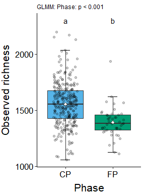<!-- -->

### Data preperation Shannon diversity

``` r
DataSum_sh <- data.frame(Phase_PSF = rep(unique(total_diversity$Phase_PSF), each = 1), 
                     # Cat_treatment = rep(unique(total_diversity$Cat_treatment), times = 12),
                      Lab = c("a", "b"))

Stats_sh <- paste0("LMM: Phase: p < ", 0.001)
```

### Boxplot Shannon diversity

``` r
ggplot(data = total_diversity,
       mapping = aes(y = Shannon, x = Phase_PSF, fill = Phase_PSF)) + #Defines the data
  stat_boxplot(aes(y = Shannon, x = Phase_PSF), #Shows the error bars (should be added before box plots to have bars behind box plots)
               geom = "errorbar",
               linetype = 1,
               width = 0.2) +
  geom_boxplot(outliers = FALSE) + #Defines that the graph will be a box plot and do not show outliers, this is shown by jitter
  geom_jitter(width = 0.25,
              height = 0,
              color = "black",
              alpha = 0.2) + # Transparency is regulated with the alpha argument
  stat_summary(fun = mean, 
               geom = "point", 
               size = 1.5, 
               color = "gray30", 
               fill = "white",
               shape = 23) + #Shows the mean as a white circle
  #geom_segment(aes(x = 0.8, y = 2180, xend = 2.2, yend = 2180)) +
  geom_text(data = DataSum_sh,
            aes(label = Lab, y = 7.1), # fill out the significant letters
            size = 4,
            hjust = 0.5,
            #position = position_dodge(0.5)
           ) +
  ggtitle(Stats_sh) +
  # scale_y_continuous(expand = c(0, 0),        #start graph at y = min and x = min
  #                    #breaks = seq(0, 1, 0.25), #steps on the y-axis
  #                    limits = c(0, max(data3$Weight*1.1))) +   #y limits
  scale_fill_manual(values = c("#56B4E9", "#009E73")) + # Manually change the colors of the bars. You need to define fill in second line of the plot script to get it working; c("#009E73", "#56B4E9")
  ylab("Shannon diversity") +    #y-label with Mb in italic
  xlab("Phase") +
  theme(panel.background = element_rect(fill = "white"), #theme of the graph
        panel.border = element_blank(), #no border around the graph (for border, use: element_rect(color = "gray30", fill = NA))
        axis.line = element_line(), #show line for x and y axis
        plot.title = element_text(size = 9, hjust = 0),
        axis.text = element_text(size = 13, color = "black"),
        axis.title = element_text(size = 16),
        axis.title.x = element_text(vjust = -0.5),
        axis.title.y = element_text(vjust = 2.5), #, hjust = -0
        strip.text = element_text(size = 13),
        legend.position = "none")
```

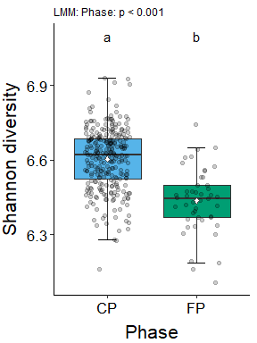<!-- -->
