This script is adapted from a script form Melissa Uribe Acosta. Extra input comes from a script of Pedro Beschore da Costa.   
   
   
Tutorials   
- [Heatmap for final plot](http://rstudio-pubs-static.s3.amazonaws.com/288398_185f2889a5f641c6b9aa7b14fa15b634.html)
   
   
# 4.0 load libraries, improve memory use and subset objects for the desired treatment comparisons
### Load libraries

``` r
R.version$version.string # prints R version
```

```
## [1] "R version 4.5.1 (2025-06-13 ucrt)"
```

``` r
library(phyloseq)
packageVersion("phyloseq")
```

```
## [1] '1.52.0'
```

``` r
library(UpSetR)
packageVersion("UpSetR")
```

```
## [1] '1.4.0'
```

``` r
library(ggVennDiagram)
packageVersion("ggVennDiagram")
```

```
## [1] '1.5.4'
```


# 4.1 Comparing CP and FP at ASV level
## One test
### Load data

``` r
# CP
## Acc ASVs detected by at least one test
load("C:/Users/kreek001/OneDrive - Wageningen University & Research/Chapters/Experimental Chapter 3/RScripts/GitHub/TwelveAccessionExperiment/MicrobiomeAnalysis/Data/Phyloseq_objects/CP_DA_SummaryFiles/SummaryFiles_ASVLevel/Acc_Bac_NoDup_DA_ASV.RData")
Acc_Bac_NoDup_DA_ASV_CP <- Acc_Bac_NoDup_DA_ASV
rm(Acc_Bac_NoDup_DA_ASV)

## Dom data ASVs detected by at least one test
load("C:/Users/kreek001/OneDrive - Wageningen University & Research/Chapters/Experimental Chapter 3/RScripts/GitHub/TwelveAccessionExperiment/MicrobiomeAnalysis/Data/Phyloseq_objects/CP_DA_SummaryFiles/SummaryFiles_ASVLevel/Dom_Bac_NoDup_DA_ASV.RData")
Dom_Bac_NoDup_DA_ASV_CP <- Dom_Bac_NoDup_DA_ASV
rm(Dom_Bac_NoDup_DA_ASV)

## All data ASVs detected by at least one test
load("C:/Users/kreek001/OneDrive - Wageningen University & Research/Chapters/Experimental Chapter 3/RScripts/GitHub/TwelveAccessionExperiment/MicrobiomeAnalysis/Data/Phyloseq_objects/CP_DA_SummaryFiles/SummaryFiles_ASVLevel/All_Bac_NoDup_DA_ASV.RData")
All_Bac_NoDup_DA_ASV_CP <- All_Bac_NoDup_DA_ASV
rm(All_Bac_NoDup_DA_ASV)

# FP
## Acc ASVs detected by at least one test
load("C:/Users/kreek001/OneDrive - Wageningen University & Research/Chapters/Experimental Chapter 3/RScripts/GitHub/TwelveAccessionExperiment/MicrobiomeAnalysis/Data/Phyloseq_objects/FP_DA_SummaryFiles/SummaryFiles_ASVLevel/Acc_Bac_NoDup_DA_ASV.RData")
Acc_Bac_NoDup_DA_ASV_FP <- Acc_Bac_NoDup_DA_ASV
rm(Acc_Bac_NoDup_DA_ASV)

## All data ASVs detected by at least one test
load("C:/Users/kreek001/OneDrive - Wageningen University & Research/Chapters/Experimental Chapter 3/RScripts/GitHub/TwelveAccessionExperiment/MicrobiomeAnalysis/Data/Phyloseq_objects/FP_DA_SummaryFiles/SummaryFiles_ASVLevel/All_Bac_NoDup_DA_ASV.RData")
All_Bac_NoDup_DA_ASV_FP <- All_Bac_NoDup_DA_ASV
rm(All_Bac_NoDup_DA_ASV)
```

### Upset plots
#### All accessions one test

``` r
Acc_CP_FP <- c(CP = Acc_Bac_NoDup_DA_ASV_CP, FP = Acc_Bac_NoDup_DA_ASV_FP)
upset(fromList(Acc_CP_FP), order.by = "freq", nsets = 20, nintersects = 100, set_size.show = TRUE)
```

```
## Warning: `aes_string()` was deprecated in ggplot2 3.0.0.
## ℹ Please use tidy evaluation idioms with `aes()`.
## ℹ See also `vignette("ggplot2-in-packages")` for more information.
## ℹ The deprecated feature was likely used in the UpSetR package.
##   Please report the issue to the authors.
## This warning is displayed once every 8 hours.
## Call `lifecycle::last_lifecycle_warnings()` to see where this warning was
## generated.
```

```
## Warning: Using `size` aesthetic for lines was deprecated in ggplot2 3.4.0.
## ℹ Please use `linewidth` instead.
## ℹ The deprecated feature was likely used in the UpSetR package.
##   Please report the issue to the authors.
## This warning is displayed once every 8 hours.
## Call `lifecycle::last_lifecycle_warnings()` to see where this warning was
## generated.
```

```
## Warning: The `size` argument of `element_line()` is deprecated as of ggplot2 3.4.0.
## ℹ Please use the `linewidth` argument instead.
## ℹ The deprecated feature was likely used in the UpSetR package.
##   Please report the issue to the authors.
## This warning is displayed once every 8 hours.
## Call `lifecycle::last_lifecycle_warnings()` to see where this warning was
## generated.
```

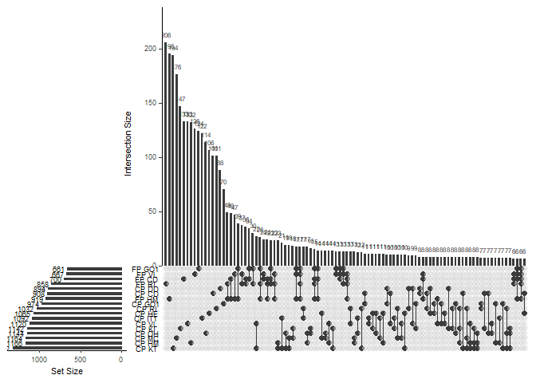<!-- -->

#### Per accession one test

``` r
VL_CP_FP <- list(CP_VL = Acc_Bac_NoDup_DA_ASV_CP$VL, FP_VL = Acc_Bac_NoDup_DA_ASV_FP$VL)
upset(fromList(VL_CP_FP), order.by = "freq", nsets = 20, nintersects = 100, set_size.show = TRUE)
```

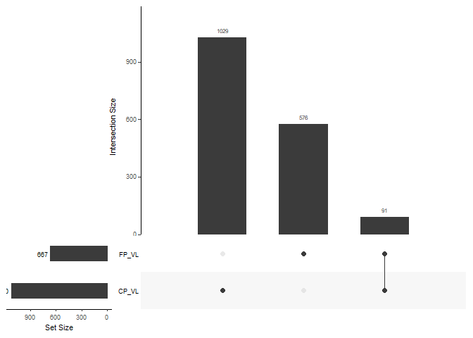<!-- -->

``` r
CD_CP_FP <- list(CP_CD = Acc_Bac_NoDup_DA_ASV_CP$CD, FP_CD = Acc_Bac_NoDup_DA_ASV_FP$CD)
upset(fromList(CD_CP_FP), order.by = "freq", nsets = 20, nintersects = 100, set_size.show = TRUE)
```

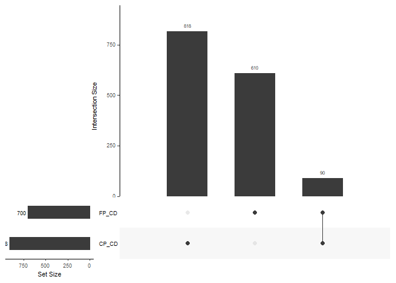<!-- -->

``` r
RI_CP_FP <- list(CP_RI = Acc_Bac_NoDup_DA_ASV_CP$RI, FP_RI = Acc_Bac_NoDup_DA_ASV_FP$RI)
upset(fromList(RI_CP_FP), order.by = "freq", nsets = 20, nintersects = 100, set_size.show = TRUE)
```

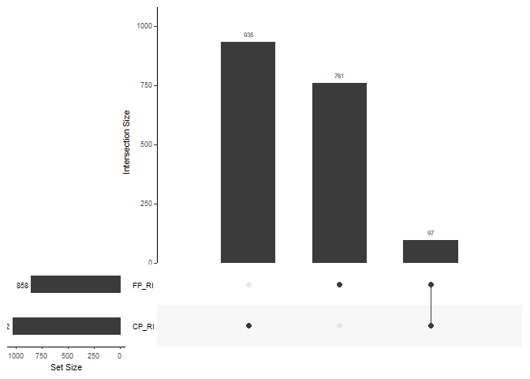<!-- -->

``` r
HM_CP_FP <- list(CP_HM = Acc_Bac_NoDup_DA_ASV_CP$HM, FP_HM = Acc_Bac_NoDup_DA_ASV_FP$HM)
upset(fromList(HM_CP_FP), order.by = "freq", nsets = 20, nintersects = 100, set_size.show = TRUE)
```

<!-- -->

``` r
GO1_CP_FP <- list(CP_GO1 = Acc_Bac_NoDup_DA_ASV_CP$GO1, FP_GO1 = Acc_Bac_NoDup_DA_ASV_FP$GO1)
upset(fromList(GO1_CP_FP), order.by = "freq", nsets = 20, nintersects = 100, set_size.show = TRUE)
```

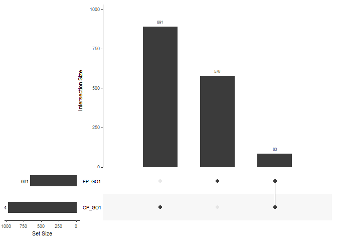<!-- -->

#### All data one test

``` r
All_CP_FP <- list(CP = All_Bac_NoDup_DA_ASV_CP, FP = All_Bac_NoDup_DA_ASV_FP)
upset(fromList(All_CP_FP), order.by = "freq", nsets = 20, nintersects = 100, set_size.show = TRUE)
```

<!-- -->

#### All and domestication data one test

``` r
All_Dom_CP_FP <- c(list(CP_All = All_Bac_NoDup_DA_ASV_CP, FP_All = All_Bac_NoDup_DA_ASV_FP), CP_dom = Dom_Bac_NoDup_DA_ASV_CP)
upset(fromList(All_Dom_CP_FP), order.by = "freq", nsets = 20, nintersects = 100, set_size.show = TRUE)
```

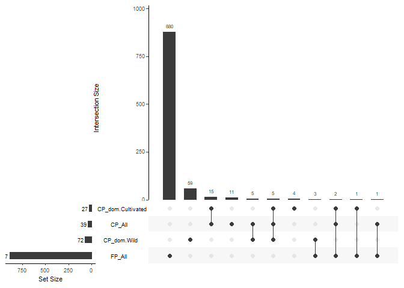<!-- -->

#### All DA ASVs together

``` r
Acc_Bac_NoDup_DA_ASV_CP <- unlist(unique(Acc_Bac_NoDup_DA_ASV_CP))
Acc_Bac_NoDup_DA_ASV_FP <- unlist(unique(Acc_Bac_NoDup_DA_ASV_FP))
Dom_Bac_NoDup_DA_ASV_CP <- unlist(unique(Dom_Bac_NoDup_DA_ASV_CP))
Acc_Dom_All_CP_FP <- list(Acc_CP = Acc_Bac_NoDup_DA_ASV_CP, Acc_FP = Acc_Bac_NoDup_DA_ASV_FP, All_CP = All_Bac_NoDup_DA_ASV_CP, All_FP = All_Bac_NoDup_DA_ASV_FP, Dom_CP = Dom_Bac_NoDup_DA_ASV_CP)
upset(fromList(Acc_Dom_All_CP_FP), order.by = "freq", nsets = 20, nintersects = 100, set_size.show = TRUE)
```

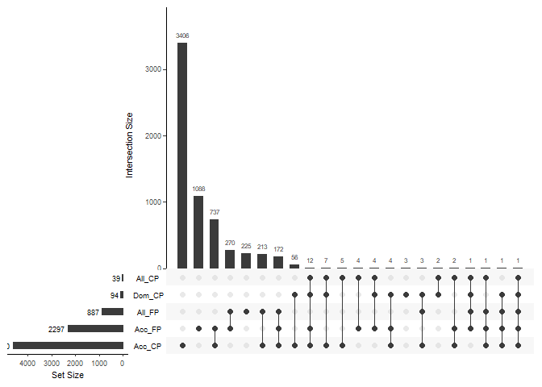<!-- -->

## Two tests
### Load data

``` r
# CP
## Acc ASVs detected by at least two tests
load("C:/Users/kreek001/OneDrive - Wageningen University & Research/Chapters/Experimental Chapter 3/RScripts/GitHub/TwelveAccessionExperiment/MicrobiomeAnalysis/Data/Phyloseq_objects/CP_DA_SummaryFiles/SummaryFiles_ASVLevel/Acc_Bac_TwoTimes_DA_ASV.RData")
Acc_Bac_TwoTimes_DA_ASV_CP <- Acc_Bac_TwoTimes_DA_ASV
rm(Acc_Bac_TwoTimes_DA_ASV)

## Dom data ASVs detected by at least two tests
load("C:/Users/kreek001/OneDrive - Wageningen University & Research/Chapters/Experimental Chapter 3/RScripts/GitHub/TwelveAccessionExperiment/MicrobiomeAnalysis/Data/Phyloseq_objects/CP_DA_SummaryFiles/SummaryFiles_ASVLevel/Dom_Bac_TwoTimes_DA_ASV.RData")
Dom_Bac_TwoTimes_DA_ASV_CP <- Dom_Bac_TwoTimes_DA_ASV
rm(Dom_Bac_TwoTimes_DA_ASV)

## All data ASVs detected by at least two tests
load("C:/Users/kreek001/OneDrive - Wageningen University & Research/Chapters/Experimental Chapter 3/RScripts/GitHub/TwelveAccessionExperiment/MicrobiomeAnalysis/Data/Phyloseq_objects/CP_DA_SummaryFiles/SummaryFiles_ASVLevel/All_Bac_TwoTimes_DA_ASV.RData")
All_Bac_TwoTimes_DA_ASV_CP <- All_Bac_TwoTimes_DA_ASV
rm(All_Bac_TwoTimes_DA_ASV)

# FP
## Acc ASVs detected by at least two tests
load("C:/Users/kreek001/OneDrive - Wageningen University & Research/Chapters/Experimental Chapter 3/RScripts/GitHub/TwelveAccessionExperiment/MicrobiomeAnalysis/Data/Phyloseq_objects/FP_DA_SummaryFiles/SummaryFiles_ASVLevel/Acc_Bac_TwoTimes_DA_ASV.RData")
Acc_Bac_TwoTimes_DA_ASV_FP <- Acc_Bac_TwoTimes_DA_ASV
rm(Acc_Bac_TwoTimes_DA_ASV)

## All data ASVs detected by at least two tests
load("C:/Users/kreek001/OneDrive - Wageningen University & Research/Chapters/Experimental Chapter 3/RScripts/GitHub/TwelveAccessionExperiment/MicrobiomeAnalysis/Data/Phyloseq_objects/FP_DA_SummaryFiles/SummaryFiles_ASVLevel/All_Bac_TwoTimes_DA_ASV.RData")
All_Bac_TwoTimes_DA_ASV_FP <- All_Bac_TwoTimes_DA_ASV
rm(All_Bac_TwoTimes_DA_ASV)
```

### Upset plots
#### All accessions two tests

``` r
Acc_CP_FP <- c(CP = Acc_Bac_TwoTimes_DA_ASV_CP, FP = Acc_Bac_TwoTimes_DA_ASV_FP)
upset(fromList(Acc_CP_FP), order.by = "freq", nsets = 20, nintersects = 100, set_size.show = TRUE)
```

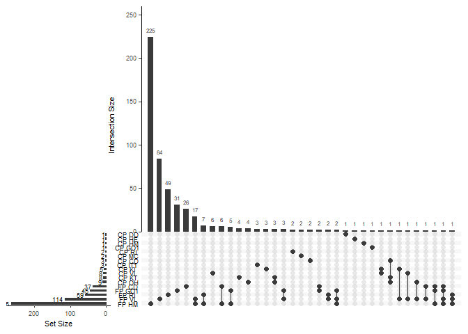<!-- -->

#### Per accession two tests

``` r
VL_CP_FP <- list(CP_VL = Acc_Bac_TwoTimes_DA_ASV_CP$VL, FP_VL = Acc_Bac_TwoTimes_DA_ASV_FP$VL)
upset(fromList(VL_CP_FP), order.by = "freq", nsets = 20, nintersects = 100, set_size.show = TRUE)
```

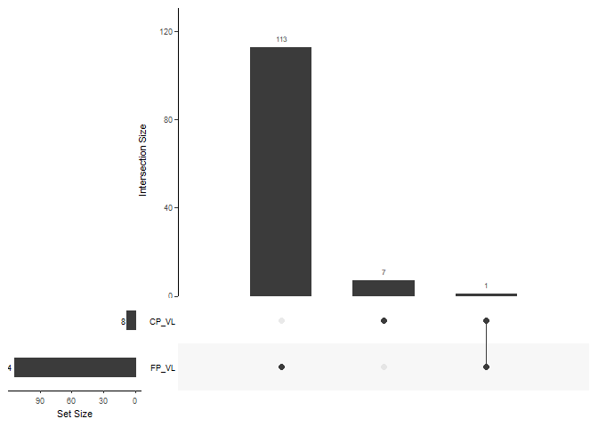<!-- -->

``` r
CD_CP_FP <- list(CP_CD = Acc_Bac_TwoTimes_DA_ASV_CP$CD, FP_CD = Acc_Bac_TwoTimes_DA_ASV_FP$CD)
upset(fromList(CD_CP_FP), order.by = "freq", nsets = 20, nintersects = 100, set_size.show = TRUE)
```

```
## `geom_line()`: Each group consists of only one observation.
## ℹ Do you need to adjust the group aesthetic?
```

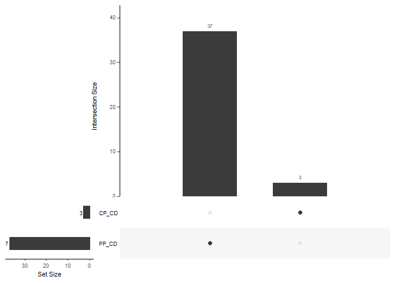<!-- -->

``` r
RI_CP_FP <- list(CP_RI = Acc_Bac_TwoTimes_DA_ASV_CP$RI, FP_RI = Acc_Bac_TwoTimes_DA_ASV_FP$RI)
upset(fromList(RI_CP_FP), order.by = "freq", nsets = 20, nintersects = 100, set_size.show = TRUE)
```

```
## `geom_line()`: Each group consists of only one observation.
## ℹ Do you need to adjust the group aesthetic?
```

<!-- -->

``` r
HM_CP_FP <- list(CP_HM = Acc_Bac_TwoTimes_DA_ASV_CP$HM, FP_HM = Acc_Bac_TwoTimes_DA_ASV_FP$HM)
upset(fromList(HM_CP_FP), order.by = "freq", nsets = 20, nintersects = 100, set_size.show = TRUE)
```

```
## `geom_line()`: Each group consists of only one observation.
## ℹ Do you need to adjust the group aesthetic?
```

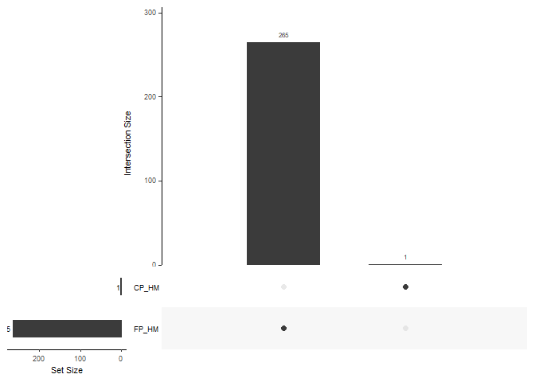<!-- -->

``` r
GO1_CP_FP <- list(CP_GO1 = Acc_Bac_TwoTimes_DA_ASV_CP$GO1, FP_GO1 = Acc_Bac_TwoTimes_DA_ASV_FP$GO1)
upset(fromList(GO1_CP_FP), order.by = "freq", nsets = 20, nintersects = 100, set_size.show = TRUE)
```

```
## `geom_line()`: Each group consists of only one observation.
## ℹ Do you need to adjust the group aesthetic?
```

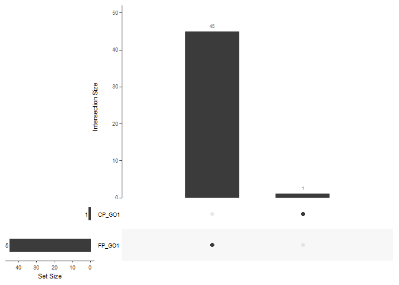<!-- -->

#### All data two tests

``` r
All_CP_FP <- list(CP = All_Bac_TwoTimes_DA_ASV_CP, FP = All_Bac_TwoTimes_DA_ASV_FP)
upset(fromList(All_CP_FP), order.by = "freq", nsets = 20, nintersects = 100, set_size.show = TRUE)
```

```
## `geom_line()`: Each group consists of only one observation.
## ℹ Do you need to adjust the group aesthetic?
```

<!-- -->

#### All and domestication data one test

``` r
All_Dom_CP_FP <- c(list(CP_All = All_Bac_TwoTimes_DA_ASV_CP, FP_All = All_Bac_TwoTimes_DA_ASV_FP), CP_dom = Dom_Bac_TwoTimes_DA_ASV_CP)
upset(fromList(All_Dom_CP_FP), order.by = "freq", nsets = 20, nintersects = 100, set_size.show = TRUE)
```

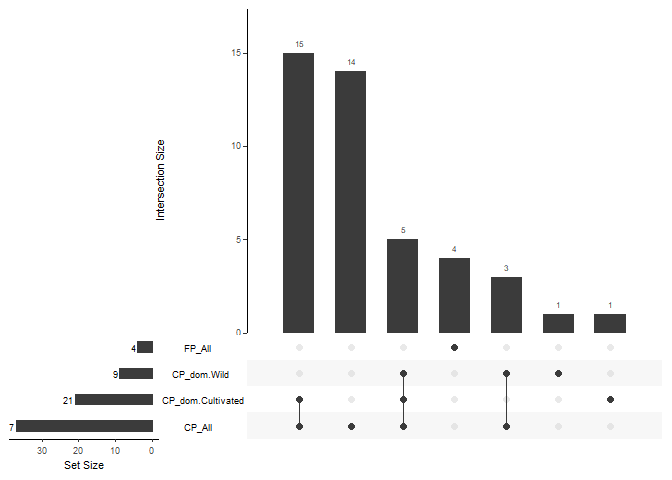<!-- -->

#### All DA ASVs together

``` r
Acc_Bac_TwoTimes_DA_ASV_CP <- unlist(unique(Acc_Bac_TwoTimes_DA_ASV_CP))
Acc_Bac_TwoTimes_DA_ASV_FP <- unlist(unique(Acc_Bac_TwoTimes_DA_ASV_FP))
Dom_Bac_TwoTimes_DA_ASV_CP <- unlist(unique(Dom_Bac_TwoTimes_DA_ASV_CP))
Acc_Dom_All_CP_FP <- list(Acc_CP = Acc_Bac_TwoTimes_DA_ASV_CP, Acc_FP = Acc_Bac_TwoTimes_DA_ASV_FP, All_CP = All_Bac_TwoTimes_DA_ASV_CP, All_FP = All_Bac_TwoTimes_DA_ASV_FP, Dom_CP = Dom_Bac_TwoTimes_DA_ASV_CP)
upset(fromList(Acc_Dom_All_CP_FP), order.by = "freq", nsets = 20, nintersects = 100, set_size.show = TRUE)
```

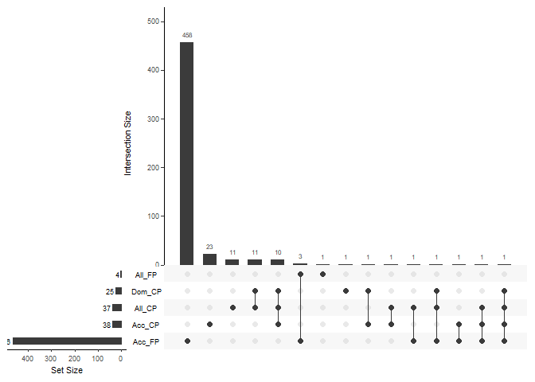<!-- -->

### Overlapping ASVs CP and FP
#### Overlap per accession

``` r
Acc_overlap_DA <- intersect(Acc_Bac_TwoTimes_DA_ASV_CP, Acc_Bac_TwoTimes_DA_ASV_FP)
Acc_overlap_DA
```

```
## [1] "bASV_1224" "bASV_656"  "bASV_315"
```

``` r
save(Acc_overlap_DA, file = "C:/Users/kreek001/OneDrive - Wageningen University & Research/Chapters/Experimental Chapter 3/RScripts/GitHub/TwelveAccessionExperiment/MicrobiomeAnalysis/Data/Phyloseq_objects/CP_FP_OverlapDA/Acc_overlap_DA.RData")
```

#### Overlap in all data sets together

``` r
Tot_overlap_DA <- intersect(unique(c(Acc_Bac_TwoTimes_DA_ASV_CP, Dom_Bac_TwoTimes_DA_ASV_CP, All_Bac_TwoTimes_DA_ASV_CP)), unique(c(Acc_Bac_TwoTimes_DA_ASV_FP, All_Bac_TwoTimes_DA_ASV_FP)))
Tot_overlap_DA
```

```
## [1] "bASV_1224" "bASV_656"  "bASV_315"  "bASV_1025" "bASV_2073"
```

``` r
save(Tot_overlap_DA, file = "C:/Users/kreek001/OneDrive - Wageningen University & Research/Chapters/Experimental Chapter 3/RScripts/GitHub/TwelveAccessionExperiment/MicrobiomeAnalysis/Data/Phyloseq_objects/CP_FP_OverlapDA/Tot_overlap_DA.RData")
```

``` r
# Clean environment
rm(list = ls())
```


# 4.2 Comparing CP and FP at Family level
## Two tests
### Load data

``` r
# CP
## Acc ASVs detected by at least two tests
load(file = "C:/Users/kreek001/OneDrive - Wageningen University & Research/Chapters/Experimental Chapter 3/RScripts/GitHub/TwelveAccessionExperiment/MicrobiomeAnalysis/Data/Phyloseq_objects/CP_DA_SummaryFiles/SummaryFiles_FamilyLevel/Acc_TwoTimes_DA_Family_lfctax.RData")
lfctax_CP <- Acc_TwoTimes_DA_Family_lfctax
rm(Acc_TwoTimes_DA_Family_lfctax)

# FP
## Acc ASVs detected by at least two tests
load(file = "C:/Users/kreek001/OneDrive - Wageningen University & Research/Chapters/Experimental Chapter 3/RScripts/GitHub/TwelveAccessionExperiment/MicrobiomeAnalysis/Data/Phyloseq_objects/FP_DA_SummaryFiles/SummaryFiles_FamilyLevel/Acc_TwoTimes_DA_Family_lfctax.RData")
lfctax_FP <- Acc_TwoTimes_DA_Family_lfctax
rm(Acc_TwoTimes_DA_Family_lfctax)
```

### Upset plots
#### All accessions two tests

``` r
Acc_CP_FP <- list(CP = lfctax_CP$taxon, FP = lfctax_FP$taxon)
upset(fromList(Acc_CP_FP), order.by = "freq", nsets = 20, nintersects = 100, set_size.show = TRUE)
```

```
## `geom_line()`: Each group consists of only one observation.
## ℹ Do you need to adjust the group aesthetic?
```

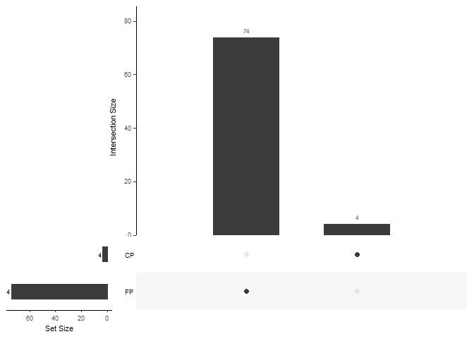<!-- -->

``` r
# Clean environment
rm(list = ls())
```


# 4.3 Comparing CP and FP at Order level
## Two tests
### Load data

``` r
# CP
## Acc ASVs detected by at least two tests
load(file = "C:/Users/kreek001/OneDrive - Wageningen University & Research/Chapters/Experimental Chapter 3/RScripts/GitHub/TwelveAccessionExperiment/MicrobiomeAnalysis/Data/Phyloseq_objects/CP_DA_SummaryFiles/SummaryFiles_OrderLevel/Acc_TwoTimes_DA_Order_lfctax.RData")
lfctax_CP <- Acc_TwoTimes_DA_Order_lfctax
rm(Acc_TwoTimes_DA_Order_lfctax)

# FP
## Acc ASVs detected by at least two tests
load(file = "C:/Users/kreek001/OneDrive - Wageningen University & Research/Chapters/Experimental Chapter 3/RScripts/GitHub/TwelveAccessionExperiment/MicrobiomeAnalysis/Data/Phyloseq_objects/FP_DA_SummaryFiles/SummaryFiles_OrderLevel/Acc_TwoTimes_DA_Order_lfctax.RData")
lfctax_FP <- Acc_TwoTimes_DA_Order_lfctax
rm(Acc_TwoTimes_DA_Order_lfctax)
```

### Upset plots
#### All accessions two tests

``` r
Acc_CP_FP <- list(CP = lfctax_CP$taxon, FP = lfctax_FP$taxon)
upset(fromList(Acc_CP_FP), order.by = "freq", nsets = 20, nintersects = 100, set_size.show = TRUE)
```

```
## `geom_line()`: Each group consists of only one observation.
## ℹ Do you need to adjust the group aesthetic?
```

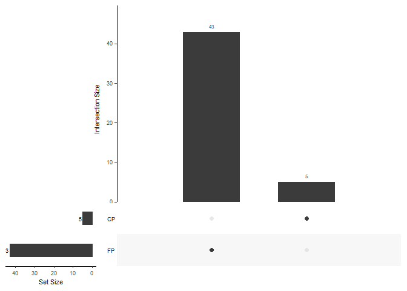<!-- -->

``` r
# Clean environment
rm(list = ls())
```


# 4.4 Comparing CP and FP at Class level
## Two tests
### Load data

``` r
# CP
## Acc ASVs detected by at least two tests
load(file = "C:/Users/kreek001/OneDrive - Wageningen University & Research/Chapters/Experimental Chapter 3/RScripts/GitHub/TwelveAccessionExperiment/MicrobiomeAnalysis/Data/Phyloseq_objects/CP_DA_SummaryFiles/SummaryFiles_ClassLevel/Acc_TwoTimes_DA_Class_lfctax.RData")
lfctax_CP <- Acc_TwoTimes_DA_Class_lfctax
rm(Acc_TwoTimes_DA_Class_lfctax)

# FP
## Acc ASVs detected by at least two tests
load(file = "C:/Users/kreek001/OneDrive - Wageningen University & Research/Chapters/Experimental Chapter 3/RScripts/GitHub/TwelveAccessionExperiment/MicrobiomeAnalysis/Data/Phyloseq_objects/FP_DA_SummaryFiles/SummaryFiles_ClassLevel/Acc_TwoTimes_DA_Class_lfctax.RData")
lfctax_FP <- Acc_TwoTimes_DA_Class_lfctax
rm(Acc_TwoTimes_DA_Class_lfctax)
```

### Upset plots
#### All accessions two tests

``` r
Acc_CP_FP <- list(CP = lfctax_CP$taxon, FP = lfctax_FP$taxon)
upset(fromList(Acc_CP_FP), order.by = "freq", nsets = 20, nintersects = 100, set_size.show = TRUE)
```

```
## `geom_line()`: Each group consists of only one observation.
## ℹ Do you need to adjust the group aesthetic?
```

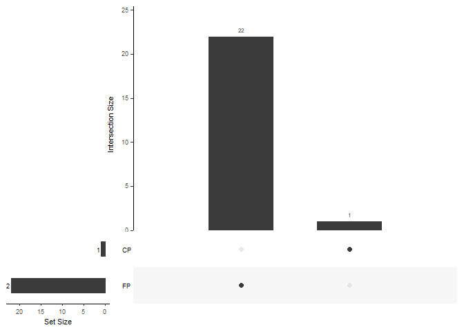<!-- -->

``` r
# Clean environment
rm(list = ls())
```


# 4.5 Comparing CP and FP at Phylum level
## Two tests
### Load data

``` r
# CP
## Acc ASVs detected by at least two tests
load(file = "C:/Users/kreek001/OneDrive - Wageningen University & Research/Chapters/Experimental Chapter 3/RScripts/GitHub/TwelveAccessionExperiment/MicrobiomeAnalysis/Data/Phyloseq_objects/CP_DA_SummaryFiles/SummaryFiles_PhylumLevel/Acc_TwoTimes_DA_Phylum_lfctax.RData")
lfctax_CP <- Acc_TwoTimes_DA_Phylum_lfctax
rm(Acc_TwoTimes_DA_Phylum_lfctax)

# FP
## Acc ASVs detected by at least two tests
load(file = "C:/Users/kreek001/OneDrive - Wageningen University & Research/Chapters/Experimental Chapter 3/RScripts/GitHub/TwelveAccessionExperiment/MicrobiomeAnalysis/Data/Phyloseq_objects/FP_DA_SummaryFiles/SummaryFiles_PhylumLevel/Acc_TwoTimes_DA_Phylum_lfctax.RData")
lfctax_FP <- Acc_TwoTimes_DA_Phylum_lfctax
rm(Acc_TwoTimes_DA_Phylum_lfctax)
```

### Upset plots
#### All accessions two tests

``` r
Acc_CP_FP <- list(CP = lfctax_CP$Phylum, FP = lfctax_FP$Phylum)
upset(fromList(Acc_CP_FP), order.by = "freq", nsets = 20, nintersects = 100, set_size.show = TRUE)
```

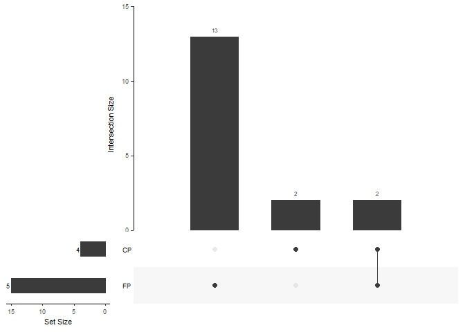<!-- -->

### Overlap

``` r
intersect(lfctax_CP$Phylum, lfctax_FP$Phylum)
```

```
## [1] "p__Armatimonadota"  "p__Elusimicrobiota"
```

``` r
# Clean environment
rm(list = ls())
```


# 4.6 Venn diagram DA
## Accession

``` r
load(file = "C:/Users/kreek001/OneDrive - Wageningen University & Research/Chapters/Experimental Chapter 3/RScripts/GitHub/TwelveAccessionExperiment/MicrobiomeAnalysis/Data/Phyloseq_objects/CP_DifferentialAbundance/SummaryFiles/Acc_Bac_conca_NoAn_nodup.RData")

simple_Venn <- ggVennDiagram(Acc_Bac_conca_NoAn_nodup)
```

```
## Warning in ggVennDiagram(Acc_Bac_conca_NoAn_nodup): Only support 2-7 dimension
## Venn diagram. Will give a plain upset plot instead.
```

``` r
print(simple_Venn)
```

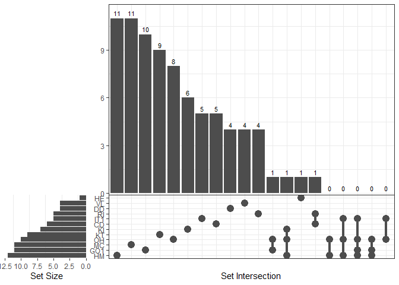<!-- -->

``` r
# ASVs in both VL adn HM
ASV_VL_HM <- unlist(Acc_Bac_conca_NoAn_nodup[c("HM", "VL")])
Duplicates_DA_VL_HM <- ASV_VL_HM[duplicated(ASV_VL_HM)]
print(Duplicates_DA_VL_HM)
```

```
## named character(0)
```

``` r
save(Duplicates_DA_VL_HM, file = "C:/Users/kreek001/OneDrive - Wageningen University & Research/Chapters/Experimental Chapter 3/RScripts/GitHub/TwelveAccessionExperiment/MicrobiomeAnalysis/Data/Phyloseq_objects/CP_DifferentialAbundance/SummaryFiles/Duplicates_DA_VL_HM.RData")
```
