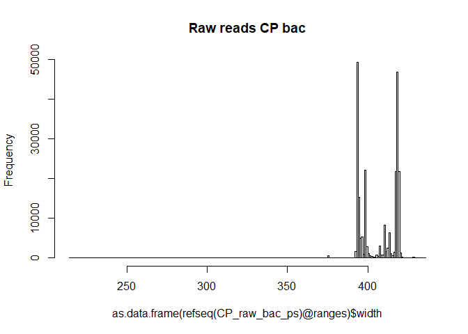
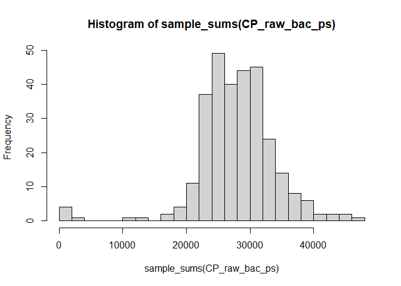
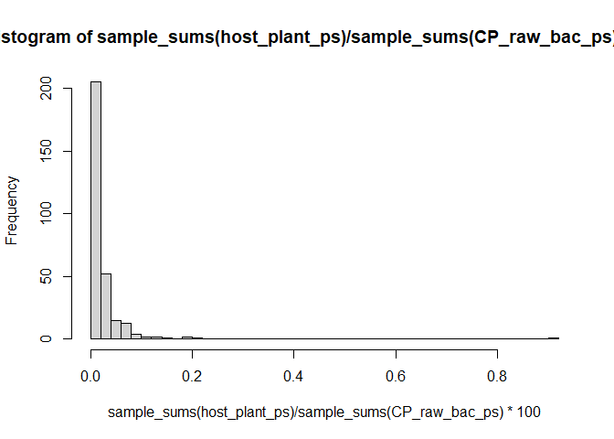
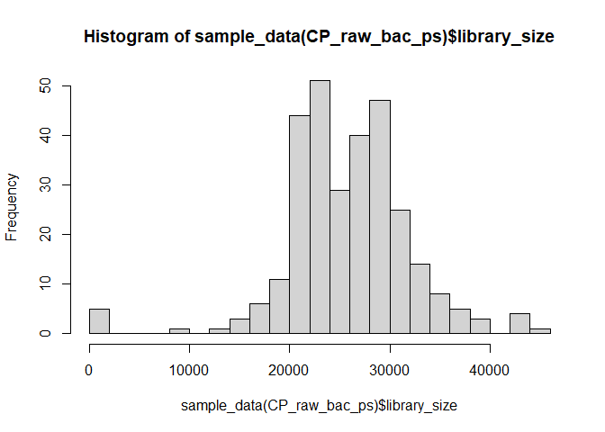
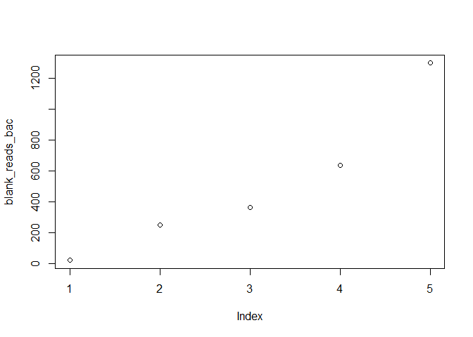
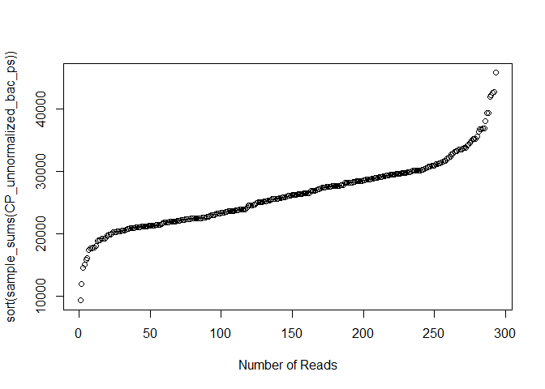
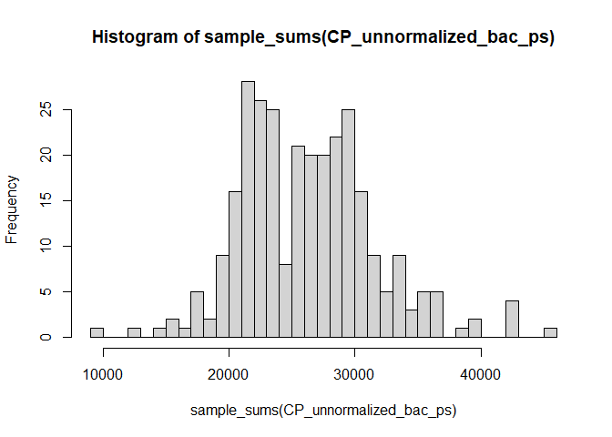
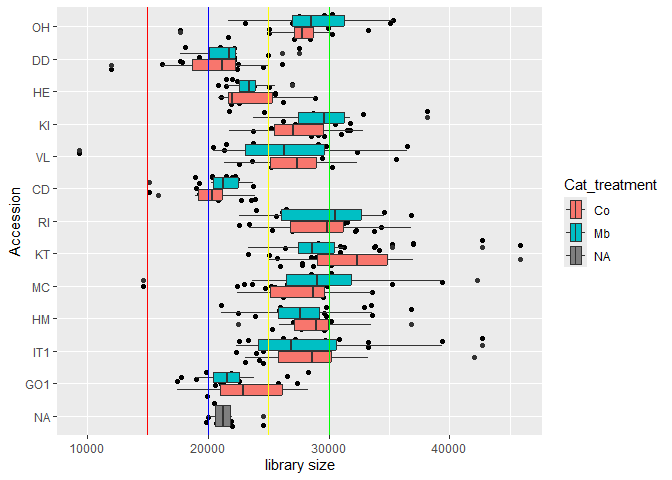
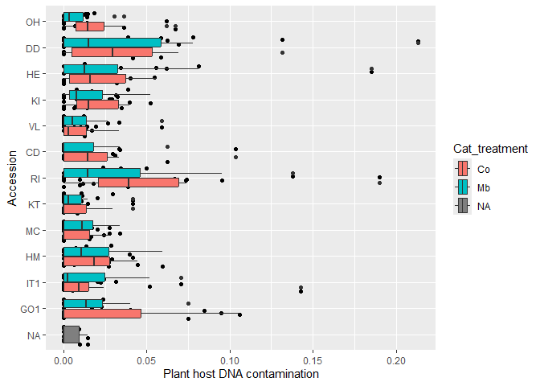
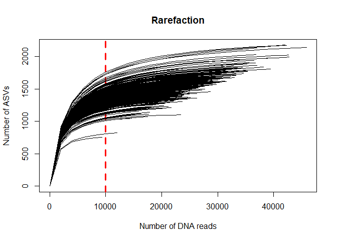

# 0.0 Introduction
This script is for loading and pre-processing microbiome data that is output form the DADA2 [Ernakovich pipeline](https://github.com/ErnakovichLab/dada2_ernakovichlab) as describes in our own [GitHub page](https://github.com/Marcelara/PSF_Anunna). In addition, the ASVs ware assigned to taxonomies with Qiime2 as this results in a higher resolution. Here, the data will be further processed to be able to analyse the data.  

A nice [tutorial](https://www.nicholas-ollberding.com/post/introduction-to-phyloseq/) to learn how to investigate data in a phyloseq object.

This and the next script are originally made by Pedro Beschoren da Costa for the [MeJA_Pilot](https://github.com/PedroBeschoren/MeJA_Pilot) and modified to fit my data.

# 1.0 load all libraries, custom functions, setup environemnt

``` r
# Set working directory
# setwd("")

# load libraries 
library(tidyr)
library(ggplot2)
library(phyloseq)
library(vegan)
library(metagenomeSeq)

# custom functions related to data loading and decontamination
source("C:/Users/kreek001/OneDrive - Wageningen University & Research/Chapters/Experimental Chapter 3/RScripts/GitHub/TwelveAccessionExperiment/MicrobiomeAnalysis/RScripts/Functions/functions_loading_and_decontamination.R")

# increases memory limit used by R
# memory.limit(size = 350000) #This function is no longer supported by Windows
```


# 1.1 load microbiome data
### Swap samples
Check whether this is needed.

## 1.1.1 - Loading 16S data 
All samples were sequenced well.

#### Load OTU table

``` r
# Loads the OTU table, immediately saving it as a phyloseq OTU table (lighter than a df) (from DADA2)
raw_bac_otutab <- otu_table(object = read.table(file = "C:/Users/kreek001/OneDrive - Wageningen University & Research/Chapters/Experimental Chapter 3/Data/Microbiome/seqtab_final.txt", 
                                                header = TRUE,
                                                row.names = 1, # first column has row names (ASV names)
                                                check.names = FALSE), # prevents "X" to be added to column names, such as X49_16S,
                             taxa_are_rows = TRUE)
head(raw_bac_otutab)
```

```
## OTU Table:          [6 taxa and 406 samples]
##                      taxa are rows
##       Blank2 Blank3 Blank4 Blank5 Blank6 C005 C006 C007 C009 C010 C015 C016
## ASV_1      0      0      0      0      0  442  476  489  492  467  520  305
## ASV_2      0      0      0      0     14  456  455  506  514  420  479  352
## ASV_3      0      0      0     11      0  279  300  265  289  256  291  168
## ASV_4      0      0     16      0      0  194  187  206  237  188  216  234
## ASV_5      0      0      0      0      0  160  220  235  206  192  195  177
## ASV_6    120      0   5268      0   2011  201  193  191  254  220  206  198
##       C017 C018 C019 C020 C025 C026 C027 C028 C029 C030 C035 C036 C037 C038
## ASV_1  377  305  366  308  530  580  556  401  508  238  452  412  384  477
## ASV_2  404  436  395  318  503  561  483  473  511  349  414  450  472  435
## ASV_3  237  216  234  229  272  307  311  211  282  161  251  220  217  317
## ASV_4  196  178  190  154  179  213  235  306  198   97  237  172  221  216
## ASV_5  145  140  146  158  201  252  269  211  237   95  183  203  190  233
## ASV_6  187  189  215  395  197  193  210  236  167  565  216  219  176  187
##       C039 C040 C043 C045 C047 C048 C050 C055 C056 C057 C058 C059 C060 C064
## ASV_1  387  427  274  504  388  466  439  431  431  332  562  478  464  440
## ASV_2  422  387  251  499  518  509  248  367  446  510  501  522  405  358
## ASV_3  240  245  132  263  216  250  310  223  262  188  300  327  264  277
## ASV_4  190  172  138  238  202  197  177  187  223  251  215  198  232  197
## ASV_5  152  156  125  254  194  194  185  170  206  118  263  226  162  201
## ASV_6  241  306  130  213  212  179  504  193  191  234  202  199  219  314
##       C065 C066 C067 C068 C069 C075 C076 C077 C078 C079 C080 C085 C086 C087
## ASV_1  299  401  552  533  504  425  272  557  434  553  416  504  462  441
## ASV_2  570  443  434  500  287  430  513  676  389  495  498  198  602  476
## ASV_3  196  234  251  272  318  241  158  307  258  305  292  276  271  240
## ASV_4  180  179  241  191  144  212  178  230  178  236  211  123  254  171
## ASV_5  120  244  210  179  253  169  123  262  169  226  183  152  232  180
## ASV_6  111  242  219  143   97  167  234  240  176  261  201  190  245  264
##       C088 C089 C090 C094 C095 C096 C097 C099 C101 C104 C105 C106 C110 C113
## ASV_1  534  674  535  473  477  429  384  377  382  525  393  445  372  481
## ASV_2  516  475  640  431  447  498  486  322  424  424  308  417  374  430
## ASV_3  273  325  287  289  208  262  222  194  193  225  192  206  181  286
## ASV_4  276  149  270  149  145  224  204  203  196  163  287  169  313  175
## ASV_5  201  246  180  168  200  186  149  139  171  220  195  225  127  215
## ASV_6  231  230  260  155  176  186  227  247  273  155  191  179  302  254
##       C115 C116 C117 C118 C120 C126 C127 C128 C129 C130 C135 C136 C137 C138
## ASV_1  375  375  343  545  472  501  478  503  561  501  551  424  470  473
## ASV_2  450  365  510  466  429  353  423  402  500  379  510  363  428  403
## ASV_3  232  243  226  258  263  275  250  352  321  275  299  237  257  258
## ASV_4  199  207  210  193  179  228  163  376  167  181  237  250  181  246
## ASV_5  150  170  171  217  206  221  210  234  238  277  193  119  165  160
## ASV_6  186  201  225  188  123  188  202  259  250  223  171  210  182  233
##       C139 C140 C145 C146 C147 C148 C149 C150 C155 C156 C157 C158 C159 C160
## ASV_1  429  401  545  663  492  683  665  482  518  418  448  446  414  469
## ASV_2  424  363  420  423  439  510  416  438  320  468  411  341  537  317
## ASV_3  270  202  348  354  346  377  364  284  239  275  258  196  254  321
## ASV_4  237  212  235  276  177  234  170  198  235  222  163  214  246  311
## ASV_5  172  144  242  181  216  289  281  206  141  156  200  144  196  168
## ASV_6  203  162  186  181  183  230  185  244  146  241  200  190  208  176
##       C165 C166 C167 C168 C169 C170 C175 C176 C177 C178 C179 C180 C185 C186
## ASV_1  519  442  723  807  737  406  592  459  199  529  429  539  641  589
## ASV_2  405  447  454  597  493  446  493  511  609  528  543  513  491  473
## ASV_3  282  306  374  323  340  254  337  239  147  324  270  305  297  343
## ASV_4  241  258  227  276  224  260  261  252  230  121  260  271  255  215
## ASV_5  227  214  342  371  435  185  220  260   82  224  198  252  212  315
## ASV_6  143  187  169  181  176  209  214  181  179  133  123  157  135  137
##       C187 C188 C189 C190 C195 C196 C197 C198 C199 C200 C205 C206 C207 C208
## ASV_1  710 1003  549  689  423  579  759  597  449  377  512  544  560  687
## ASV_2  522  743  545  421  544  735  501  476  373  502  362  423  353  488
## ASV_3  425  412  259  340  246  285  353  340  291  207  301  285  300  331
## ASV_4  179  310  288  206  232  252  226  299  164  205  177  223  213  241
## ASV_5  303  396  180  273  226  316  280  276  198  165  216  239  237  352
## ASV_6  170  167  176  120  184  130  174  121  169  111  152  139  141  172
##       C209 C210 C215 C216 C217 C218 C219 C220 C225 C226 C227 C228 C229 C230
## ASV_1  884  870  503  525   19  738  904  438  513  115  699  846  800 1154
## ASV_2  772  418  532  502  556  615  593  399  366  475  454  643  413  607
## ASV_3  444  442  304  250    0  396  448  259  346   66  331  449  456  525
## ASV_4  376  265  190  276  241  235  243  214  149  207  272  248  230  265
## ASV_5  370  366  206  218    8  285  412  161  285   64  266  442  364  461
## ASV_6  191  155  143  194  176  145  163  151  114   31  179  134  136  227
##       C235 C236 C237 C238 C239 C240 C245 C246 C247 C248 C249 C250 C255 C256
## ASV_1  571  686 1041  555  545  373  530  492  404  757  805  638  509  467
## ASV_2  442  540  942  410  393  454  378  488  583  573  449  456  412  321
## ASV_3  311  378  502  343  367  212  284  280  231  289  409  291  291  285
## ASV_4  222  212  305  196  219  186  193  237  254  213  207  352  155  234
## ASV_5  273  253  489  251  224  196  312  249  217  257  335  264  305  227
## ASV_6  146  135  188  204  138  126  102  146  217  154  194  179  116  368
##       C257 C258 C259 C260 C265 C266 C267 C268 C269 C270 C275 C276 C277 C278
## ASV_1  628  509  523  520  498  710  357 1099  957  376  603  245  644  624
## ASV_2  415  463  505  514  370  533  750  692  493  597  471  613  511  518
## ASV_3  452  262  290  258  322  320  198  435  451  189  387  177  368  382
## ASV_4  201  213  194  250  171  196  205  226  201  256  274  204  163  210
## ASV_5  242  262  246  186  241  282  133  538  382  171  293  152  294  273
## ASV_6  129  181  141  175  133  358  191  168  110  158  125  576  135  157
##       C279 C285 C286 C287 C288 C289 C290 C295 C296 C297 C298 C299 C300 C305
## ASV_1  577  608  923  274  626  726  639  637  622  540  505  798  652  585
## ASV_2  462  552  598  482  489  562  421  398  600  485  458  751  426  497
## ASV_3  297  281  479  148  266  330  302  307  318  275  294  359  358  347
## ASV_4  228  172  281  156  162  191  307  203  255  237  267  361  385  160
## ASV_5  245  285  415  123  231  349  225  251  250  234  198  377  279  282
## ASV_6  143   90  370  212  134  178  105  152  297  166  155  145  151  141
##       C306 C307 C308 C309 C310 C315 C316 C317 C318 C319 C320 C323 C326 C327
## ASV_1  596  879  708  616  799  718  327  487  872  561  507  530  411  734
## ASV_2  376  441  473  518  567  475  476  462  617  496  560  439  271  477
## ASV_3  363  412  349  260  375  347  187  265  414  288  286  297  217  387
## ASV_4  302  163  239  179  254  231  219  270  423  295  234  163  127  289
## ASV_5  288  393  276  238  327  281  157  211  356  210  242  316  150  251
## ASV_6  195  109  133  140  130  160  212  153  166  178   70  133  115  178
##       C328 C329 C330 C335 C336 C337 C338 C339 C340 C345 C346 C347 C348 C349
## ASV_1  395  658  731  481  549  479  686  531  547 1051  898  430  780  401
## ASV_2  497  422  458  570  483  524  478  513  522  634  646  545  669  379
## ASV_3  247  334  403  255  296  266  386  280  295  502  528  212  458  224
## ASV_4  259  243  258  207  156  218  180  266  260  266  250  274  268  281
## ASV_5  178  302  253  148  229  209  270  247  270  413  382  251  310  172
## ASV_6  126  129  111  130  121  115  125  141  143  157  162  142  159  131
##       C350 C355 C356 C357 C358 C359 C360 C365 C366 C367 C368 C369 C370 C375
## ASV_1  431  613  608  597  560  469 1186  785  687  640  706  608  799  368
## ASV_2  472  417  424  523  689  480  445  596  524  523  448  498  685   71
## ASV_3  254  375  325  351  264  306 1001  378  336  292  383  322  345  157
## ASV_4  187  158  223  210  242  200  151  226  229  181  320  270  279   32
## ASV_5  197  276  265  218  223  293  220  340  250  271  300  256  335  165
## ASV_6  125  100  152  139  168  132  119  133  172  144  163  136  119   45
##       C376 C377 C378 C379 C380 C385 C386 C387 C388 C389 C390 C395 C396 C397
## ASV_1  585  647  472  468  216  547  873  801  843  526  649  890  831  753
## ASV_2  559  642  562  405  500  488  475  513  549  363  472  588  535  587
## ASV_3  302  387  254  302  133  260  444  403  464  273  333  507  416  381
## ASV_4  294  254  234  249  205  172  296  167  244  195  201  276  308  308
## ASV_5  234  321  196  173  100  207  404  406  372  250  271  362  387  299
## ASV_6  170  138  125  131   45  117  120  136  169  131  102  153  172  149
##       C398 C399 C400 C405 C406 C407 C408 C409 C410 C415 C416 C417 C418 C419
## ASV_1  531  514  425  510  603  748  500  550  645  345  383  447  337  413
## ASV_2  582  472  515  488  475  484  524  408  482  333  379  565  511  325
## ASV_3  236  269  261  239  353  374  306  290  338  230  205  272  191  218
## ASV_4  155  165  214  231  291  177  277  207  150  163  229  249  216  162
## ASV_5  255  185  210  207  271  297  239  189  295  152  183  198  143  171
## ASV_6  128  121  125  149  135  148  113  129  102  120  121  162  137  135
##       C420 C425 C426 C427 C428 C429 C430 C435 C436 C437 C438 C439 C440 C444
## ASV_1  547  340 1442 1048  422  292  362  687  608  573  374  794  367  464
## ASV_2  471  488  625  610  595  204  536  588  379  499  443  751  574  335
## ASV_3  256  170  484  451  211  185  193  344  322  309  247  417  224  241
## ASV_4  259  205  286  258  241  190  209  233  200  219  266  425  232  198
## ASV_5  191  143  424  389  170   92  164  278  251  253  151  324  128  220
## ASV_6  132  149  207  170  140   91  143  160  121  179  153  226  174   93
##       C445 C447 C448 C449 C450 C455 C456 C457 C458 C459 C460 C462 C465 C466
## ASV_1  511  671  623  632  550  483  524  706  446  415  799  671  711  476
## ASV_2  412  538  395  462  441  310  424  354  377  350  364  421  568  339
## ASV_3  274  366  318  309  333  279  354  345  270  256  447  348  323  266
## ASV_4  154  222  182  242  222  179  260  447  276  346  187  242  343  205
## ASV_5  250  290  309  286  275  177  268  286  186  173  322  300  342  209
## ASV_6  181  142  121  149  100   64  103  111  127  133  107  205  156  127
##       C467 C468 C470 C475 C476 C477 C478 C479 C480 CE33 CTRL1 CTRL10 CTRL2
## ASV_1  760  548  423  693  559  365  202  430  440  476   416    387   491
## ASV_2  435  497  350  397  427  447  147  336  296  376   400    452   415
## ASV_3  428  259  255  383  304  210   99  270  327  259   201    253   274
## ASV_4  443  268  166  297  269  254  118  242  268  142   197    204   234
## ASV_5  376  200  187  247  214  172   90  143  118  217   188    159   169
## ASV_6  132  117   84  128  131  112   74  218  177  210   199    179   193
##       CTRL3 CTRL4 CTRL5 CTRL6 CTRL7 CTRL8 CTRL9 F005 F006 F007 F008 F009 F010
## ASV_1   339   527   413   415   332   457   450  510  453  408  272  518  442
## ASV_2   427   535   449   335   377   389   368  389  298  285  230  217  332
## ASV_3   185   282   186   275   258   305   299  276  273  250  188  312  279
## ASV_4   198   153   147   238   177   185   220  257  220  220  106  208  245
## ASV_5   126   188   161   128   152   166   196  170  163  151  102  240  166
## ASV_6   177   169   183   165   173   160   209  236  209  194  190  138  180
##       F015 F016 F017 F018 F019 F020 F025 F026 F027 F029 F030 F035 F036 F037
## ASV_1  779  294  425  348  317  351  323  347  308  328  272  124  247  239
## ASV_2  322  267  358  296  275  465  238  255  280  331  344  359  282  265
## ASV_3  458  219  225  270  185  166  267  241  263  213  178   62  139  146
## ASV_4  183  209  155  201  168  297  216  197  174  202  200  160  178  163
## ASV_5  182   74   79   60   79   71  131  150  113  147   81   51   96   66
## ASV_6  144  172  170  341  126  220  121  188  210  123  136  139  150  167
##       F038 F039 F040 F085 F086 F087 F088 F089 F090 F095 F096 F097 F098 F099
## ASV_1  289  104  267  553  330  466  273  436  281  463  355  373  408  317
## ASV_2  366  322  406  446  268  415  208  336  226  329  307  319  278  329
## ASV_3  171   57  141  329  224  252  192  274  159  241  230  258  206  167
## ASV_4  185  212  214  207  124  216  124  153  103  178  140  189  165  162
## ASV_5   95   59   75  205  148  176  136  162   84  117   93  108  115   94
## ASV_6  314   56  202  182  102  226  247  206  109  169  149  185  374  136
##       F100 F105 F106 F107 F108 F109 F110 F115 F116 F117 F118 F119 F120 F175
## ASV_1  309  246  293  250  130  186  247  419  330  249  367  264  381  328
## ASV_2  353  442  430  376  290  370  331  360  394  412  326  354  382  256
## ASV_3  195  126  183  125  100  102  153  259  250  184  200  197  188  197
## ASV_4  196  154  147  235  156  123  175  204  131  134  173  159  203  144
## ASV_5  108   78  116   89   98   74  120  122  106   89  115  104   74  128
## ASV_6  137  137  201  184  370  136  140  165  109  144  232  142  135  120
##       F176 F177 F178 F179 F180 F193 F194 F195 F197 F199 F200 F371 F372 F373
## ASV_1  657  309  233  385  488  223  324  285  297  270  197  171  375  480
## ASV_2  301  310  130  295  340  324  442  263  386  387  247  159  290  226
## ASV_3  400  206  194  239  273  189  189  141  153  166  126  105  246  242
## ASV_4  180  237  113  222  194  228  190  240  233  169  205   94  188  203
## ASV_5  150  115  120  123  124   90  102  121   89   80   72  145  247  302
## ASV_6  150  151  119  181  143  169  286  149  145  382  244   65  111  115
##       F374 F375 F376 F377 F378 F379 F380 F391 F392 F393 F394 F395 F396 F397
## ASV_1  284  292  287  333  356  402  335  786  283  381  748  631  364  389
## ASV_2  234  176  217  304  307  325  247  251  196  206  408  341  183  317
## ASV_3  175  213  182  173  227  267  182  470  182  234  423  391  209  256
## ASV_4  214  214  179  155  255  237  198  159  137  207  194  215  217  161
## ASV_5  170  223  168  233  197  196  190  229   99  155  338  189  140  148
## ASV_6  136  148  165  166  124  165  123   86  120  171  157  180  124  187
##       F398 F399 F400 F455 F456 F457 F458 F459 F460 F475 F476 F477 F478 F479
## ASV_1  767  503  447  581  449  496  381  636  451  350  831  580  451  348
## ASV_2  362  341  302  271  270  227  460  271  262  387  286  271  297  330
## ASV_3  450  352  264  305  328  278  253  396  292  204  527  355  265  199
## ASV_4  253  165  185  217  215  253  173  215  197  197  157  178  163  151
## ASV_5  238  187  148  142  123  130   80  173  170   92  196  141  115   87
## ASV_6  208  153  160  192  112  142  127  170  160  146  150  121  136  134
##       F522 F523 F524 F525 F526 F527 F528 F529 F530 F532 F533 F534 F536 F538
## ASV_1  180  435  424  229  469  220  250  390  323  409  444  393  499  894
## ASV_2  288  277  205  349  249  382  399  352  263  257  283  278  214  615
## ASV_3  100  298  251  133  321  161  154  190  167  275  302  260  247  489
## ASV_4  191  288  168  161  336  177  215  185  182  266  231  231  308  442
## ASV_5   80  112  110   83  181   84   65   76   56  119  104  117  128  207
## ASV_6  125  116  149  113  212  107  156   95  135  122  108   98  130  172
##       F539 F540 FE104 FE98
## ASV_1  573  332   394 1677
## ASV_2  360  300   224  170
## ASV_3  289  190   299  734
## ASV_4  285  171   262   85
## ASV_5  170  102   150  208
## ASV_6  133  110   168   67
```

#### Load Taxonomy table

``` r
# Updated taxonomy tale (from Qiime2)
sklearn_bac_taxtab <- read.table(file = "C:/Users/kreek001/OneDrive - Wageningen University & Research/Chapters/Experimental Chapter 3/Data/Microbiome/taxonomy.tsv", 
                                 header = TRUE,
                                 sep = "\t",
                                 row.names = 1, # first column has row names (ASV names)
                                 check.names = FALSE) # prevents "X" to be added to column names, such as X49_16S,

# adjusts number and name of columns
sklearn_bac_taxtab <- separate(data = sklearn_bac_taxtab,
                               col = Taxon,
                               into = c("Kingdom", 
                                       "Phylum", 
                                       "Class", 
                                       "Order", 
                                       "Family",
                                       "Genus", 
                                       "Species"),
                               sep = ";")
```

```
## Warning: Expected 7 pieces. Missing pieces filled with `NA` in 55523 rows [3, 4, 7, 16,
## 18, 28, 34, 42, 52, 70, 90, 92, 111, 115, 126, 135, 146, 147, 149, 165, ...].
```

``` r
head(sklearn_bac_taxtab) #Separated well and Feature ID is a row name
```

```
##           Kingdom            Phylum                  Class               Order
## ASV_1 d__Bacteria p__Actinomycetota      c__Actinobacteria    o__Micrococcales
## ASV_2 d__Bacteria      p__Bacillota             c__Bacilli       o__Bacillales
## ASV_3 d__Bacteria p__Actinomycetota      c__Actinobacteria    o__Micrococcales
## ASV_4 d__Bacteria p__Pseudomonadota c__Alphaproteobacteria o__Hyphomicrobiales
## ASV_5 d__Bacteria p__Actinomycetota      c__Actinobacteria    o__Micrococcales
## ASV_6 d__Bacteria  p__Rhodothermota        c__Rhodothermia   o__Rhodothermales
##                      Family                Genus Species Confidence
## ASV_1     f__Micrococcaceae g__Pseudarthrobacter     s__  0.7213987
## ASV_2        f__Bacillaceae           g__Niallia     s__  0.9965627
## ASV_3     f__Micrococcaceae                 <NA>    <NA>  0.9999977
## ASV_4  f__Xanthobacteraceae                 <NA>    <NA>  1.0000000
## ASV_5 f__Intrasporangiaceae       g__Terrabacter     s__  0.9872559
## ASV_6    f__Rhodothermaceae      g__Salinibacter     s__  0.9999999
```

``` r
#sklearn_bac_taxtab[c(13, 16, 71, 74, 75, 77, 78), ] #NAs are put in places where no classification was present. A subset of these samples is shown here.

# Change from d__Bacteria to k__bacteria, matching fungi data set
sklearn_bac_taxtab$Kingdom <- gsub("d__", "k__", sklearn_bac_taxtab$Kingdom)

head(sklearn_bac_taxtab["Kingdom"])
```

```
##           Kingdom
## ASV_1 k__Bacteria
## ASV_2 k__Bacteria
## ASV_3 k__Bacteria
## ASV_4 k__Bacteria
## ASV_5 k__Bacteria
## ASV_6 k__Bacteria
```

``` r
# Saves taxa as phyloseq object
sklearn_bac_taxtab <- tax_table(object = as.matrix(sklearn_bac_taxtab))

# Change name and remove old object
raw_bac_taxtab <- sklearn_bac_taxtab
rm(sklearn_bac_taxtab)
```

#### Load sequence table

``` r
# Loads the representative sequences table, immediately saving it as a phyloseq refseq table (lighter than a df) (from DADA2)
raw_bac_refseq <- refseq(physeq = Biostrings::readDNAStringSet(filepath = "C:/Users/kreek001/OneDrive - Wageningen University & Research/Chapters/Experimental Chapter 3/Data/Microbiome/repset.fasta", 
                                                               use.names = TRUE)) 
taxa_names(raw_bac_refseq) <- gsub(" .*", "", taxa_names(raw_bac_refseq)) # drops taxonomy from ASV names
```

#### Loading metadata

``` r
# Loads the mapping tile, immediately saving it as a phyloseq metadata table (lighter than a df)
raw_bac_metadata <- sample_data(object = read.table(file = "C:/Users/kreek001/OneDrive - Wageningen University & Research/Chapters/Experimental Chapter 3/Data/Metadata FP/Meta_Data_CPandFP.txt", 
                                                    header = TRUE,
                                                    sep = "\t",
                                                    row.names = 1, # first column has row names (ASV names)
                                                    check.names = FALSE)) # prevents "X" to be added to column names, such as X49_16S,
```

#### Build phyloseq object

``` r
# build the main 16S phyloseq object by putting all these phyloseq-class objects (OTU table, tax table, ref seq, metadata) into a single phyloseq object (ps).
raw_bac_ps <- merge_phyloseq(raw_bac_otutab,
                           raw_bac_taxtab,
                           raw_bac_refseq,
                           raw_bac_metadata)

# remove old objects to reduce memory use
rm(raw_bac_otutab, raw_bac_taxtab, raw_bac_refseq, raw_bac_metadata)

# change names from ASV to bASV (bacterial ASV), so they can be distinguished from fungal ASVs.
taxa_names(raw_bac_ps) <- paste("b", taxa_names(raw_bac_ps), sep = "")
tax_table(raw_bac_ps) <- gsub(" ", "", tax_table(raw_bac_ps)) # drops a space character from taxa names. I don't know how that character ended up in there [Kris: I do not see the space]

# let's check the imported objects. Often errors will arise from typos when filling up the data sheets 
otu_table(raw_bac_ps)[1:10,1:10]
```

```
## OTU Table:          [10 taxa and 10 samples]
##                      taxa are rows
##         Blank2 Blank3 Blank4 Blank5 Blank6 C005 C006 C007 C009 C010
## bASV_1       0      0      0      0      0  442  476  489  492  467
## bASV_2       0      0      0      0     14  456  455  506  514  420
## bASV_3       0      0      0     11      0  279  300  265  289  256
## bASV_4       0      0     16      0      0  194  187  206  237  188
## bASV_5       0      0      0      0      0  160  220  235  206  192
## bASV_6     120      0   5268      0   2011  201  193  191  254  220
## bASV_7       0      0      0      0      0    0    0    0    0    0
## bASV_8       0      0      9      0      0  116  131  163  155   92
## bASV_9       0      0      0      0      0  184  186  191  153  182
## bASV_10      0      0      0      0      0  140  158  164  218  168
```

``` r
sample_data(raw_bac_ps)[1:10,1:10]
```

```
##        Phase_PSF SampleNr Accession Domestication Cat_treatment
## Blank2        FP       B2        BS          <NA>             B
## Blank3        FP       B3        BB          <NA>             B
## Blank4        FP       B4        BS          <NA>             B
## Blank5        FP       B5        BB          <NA>             B
## Blank6        FP       B6        BS          <NA>             B
## C005          CP        5        CD    Cultivated            Co
## C006          CP        6        CD    Cultivated            Co
## C007          CP        7        CD    Cultivated            Co
## C009          CP        9        CD    Cultivated            Co
## C010          CP       10        CD    Cultivated            Co
##        Soil_conditioning TreatmentNr PlantNr Batch Table
## Blank2                 B          NA            NA    NA
## Blank3                 B          NA            NA    NA
## Blank4                 B          NA            NA    NA
## Blank5                 B          NA            NA    NA
## Blank6                 B          NA            NA    NA
## C005                               1       5     1     1
## C006                               1       6     1     2
## C007                               1       7     1     2
## C009                               1       9     1     2
## C010                               1      10     1     2
```

``` r
tax_table(raw_bac_ps)[1:10,1:6]
```

```
## Taxonomy Table:     [10 taxa by 6 taxonomic ranks]:
##         Kingdom       Phylum               Class                   
## bASV_1  "k__Bacteria" "p__Actinomycetota"  "c__Actinobacteria"     
## bASV_2  "k__Bacteria" "p__Bacillota"       "c__Bacilli"            
## bASV_3  "k__Bacteria" "p__Actinomycetota"  "c__Actinobacteria"     
## bASV_4  "k__Bacteria" "p__Pseudomonadota"  "c__Alphaproteobacteria"
## bASV_5  "k__Bacteria" "p__Actinomycetota"  "c__Actinobacteria"     
## bASV_6  "k__Bacteria" "p__Rhodothermota"   "c__Rhodothermia"       
## bASV_7  "k__Bacteria" "p__Actinomycetota"  "c__Actinobacteria"     
## bASV_8  "k__Bacteria" "p__Actinomycetota"  "c__Actinobacteria"     
## bASV_9  "k__Bacteria" "p__Gemmatimonadota" "c__Gemmatimonadia"     
## bASV_10 "k__Bacteria" "p__Bacillota"       "c__Bacilli"            
##         Order                    Family                  Genus                 
## bASV_1  "o__Micrococcales"       "f__Micrococcaceae"     "g__Pseudarthrobacter"
## bASV_2  "o__Bacillales"          "f__Bacillaceae"        "g__Niallia"          
## bASV_3  "o__Micrococcales"       "f__Micrococcaceae"     NA                    
## bASV_4  "o__Hyphomicrobiales"    "f__Xanthobacteraceae"  NA                    
## bASV_5  "o__Micrococcales"       "f__Intrasporangiaceae" "g__Terrabacter"      
## bASV_6  "o__Rhodothermales"      "f__Rhodothermaceae"    "g__Salinibacter"     
## bASV_7  "o__Streptosporangiales" NA                      NA                    
## bASV_8  "o__Kitasatosporales"    "f__Streptomycetaceae"  "g__Streptomyces"     
## bASV_9  "o__Gemmatimonadales"    "f__Gemmatimonadaceae"  "g__Incertae_Sedis"   
## bASV_10 "o__Bacillales"          "f__Bacillaceae"        "g__Niallia"
```

``` r
refseq(raw_bac_ps)
```

```
## DNAStringSet object of length 226072:
##          width seq                                          names               
##      [1]   399 TGCACAATGGGCGCAAGCCTG...AAGCATGGGGAGCGAACAGG bASV_1
##      [2]   419 TCCGCAATGGACGAAAGTCTG...AAGCGTGGGGAGCAAACAGG bASV_2
##      [3]   399 TGCACAATGGGCGAAAGCCTG...AAGCATGGGGAGCGAACAGG bASV_3
##      [4]   394 TGGACAATGGGCGCAAGCCTG...AAGCGTGGGGAGCAAACAGG bASV_4
##      [5]   399 TGCACAATGGGCGAAAGCCTG...AAGCATGGGGAGCGAACAGG bASV_5
##      ...   ... ...
## [226068]   419 TGCGCAATGGGCGAAAGCCTG...AAGCGTGGGGAGCAAACAGG bASV_226068
## [226069]   419 TGGACAATGGGCGCAAGCCTG...AAGCGTGGGGAGCAAACAGG bASV_226069
## [226070]   394 TGGACAATGGGGGCAACCCTG...AAGCATGGGGAGCGAACAGG bASV_226070
## [226071]   394 TCGGCAATGGGCGCAAGCCTG...AGGCCGGGGGAGCGAACGGG bASV_226071
## [226072]   394 TGGACAATGGGCGCAAGCCTG...AAGCGTGGGGAGCAAACAGG bASV_226072
```

``` r
# run garbage collection after creating large objects (shows a report of memory usages)
gc()
```

```
##            used  (Mb) gc trigger   (Mb)  max used   (Mb)
## Ncells  5727412 305.9    8531824  455.7   8531824  455.7
## Vcells 70942839 541.3  187706098 1432.1 187706084 1432.1
```

#### Split CP and FP

``` r
# subset phyloseq FP
FP_raw_bac_ps <- subset_samples(raw_bac_ps, Phase_PSF == "FP")
table(sample_data(FP_raw_bac_ps)[ , 1])
```

```
## Phase_PSF
##  FP 
## 113
```

``` r
# save phyloseq object FP
save(FP_raw_bac_ps, file = "C:/Users/kreek001/OneDrive - Wageningen University & Research/Chapters/Experimental Chapter 3/RScripts/GitHub/TwelveAccessionExperiment/MicrobiomeAnalysis/Data/Phyloseq_objects/FP_raw_bac_ps.RData")

# change phase of blank samples from FP to CP to add them to the CP phyloseq object as well
sample_data(raw_bac_ps)[sample_data(raw_bac_ps)$Soil_conditioning == "B", "Phase_PSF"]
```

```
##        Phase_PSF
## Blank2        FP
## Blank3        FP
## Blank4        FP
## Blank5        FP
## Blank6        FP
```

``` r
sample_data(raw_bac_ps)[sample_data(raw_bac_ps)$Soil_conditioning == "B", "Phase_PSF"] <- rep("CP", 5)
sample_data(raw_bac_ps)[sample_data(raw_bac_ps)$Soil_conditioning == "B", "Phase_PSF"]
```

```
##        Phase_PSF
## Blank2        CP
## Blank3        CP
## Blank4        CP
## Blank5        CP
## Blank6        CP
```

``` r
# subset phyloseq CP
CP_raw_bac_ps <- subset_samples(raw_bac_ps, Phase_PSF == "CP")
table(sample_data(CP_raw_bac_ps)[ , 1])
```

```
## Phase_PSF
##  CP 
## 298
```

``` r
# save phyloseq object FP
#save(CP_raw_bac_ps, file = "C:/Users/kreek001/OneDrive - Wageningen University & Research/Chapters/Experimental Chapter 3/RScripts/GitHub/TwelveAccessionExperiment/MicrobiomeAnalysis/Data/Phyloseq_objects/CP_raw_bac_ps.RData")

# remove original and FP phyloseq objects
rm(raw_bac_ps, FP_raw_bac_ps)
```


**Now we continue with first processing the CP**


# 1.2 - Remove bad ASVs
Here we will remove sequences associated with the host, background prokatyotes, low abundance ASVs, poorly identified sequences, and other bad ASVs.

## 1.2.1 - Remove non-bacterial sequences & filter ASVs
Note that the input data has been pre-filtered in the DADA2 pipeline to remove any ASVs that occur less than 3 times in the data set. This was necessary because the dada2-associated taxonomy assignment tools could not assign taxonomies to the full data set with 1 GB ram on the HPC.

### Here we investigate the length of the sequences

``` r
hist(as.data.frame(refseq(CP_raw_bac_ps)@ranges)$width, breaks = 300, main = "Raw reads CP bac")
```

<!-- -->

``` r
summary(as.data.frame(refseq(CP_raw_bac_ps)@ranges)$width) #summary on length of the reeds
```

```
##    Min. 1st Qu.  Median    Mean 3rd Qu.    Max. 
##   214.0   395.0   411.0   407.1   419.0   436.0
```

``` r
ntaxa(CP_raw_bac_ps) #shows total number of ASVs
```

```
## [1] 226072
```

``` r
summary(sample_sums(CP_raw_bac_ps)) #shows number of reeds
```

```
##    Min. 1st Qu.  Median    Mean 3rd Qu.    Max. 
##     189   25054   28353   28365   31851   47740
```

### Here we get rid of sequences shorter than 380bp

``` r
sum(as.data.frame(refseq(CP_raw_bac_ps)@ranges)$width < 380) # count number of reads smaller than 380bp
```

```
## [1] 1139
```

``` r
sum(as.data.frame(refseq(CP_raw_bac_ps)@ranges)$width > 380)
```

```
## [1] 224925
```

``` r
CP_raw_bac_ps <- prune_taxa(taxa = as.data.frame(refseq(CP_raw_bac_ps)@ranges)$width > 380,
                       x = CP_raw_bac_ps)
ntaxa(CP_raw_bac_ps) #shows total number of ASVs
```

```
## [1] 224925
```

``` r
summary(sample_sums(CP_raw_bac_ps)) #shows number of reeds
```

```
##    Min. 1st Qu.  Median    Mean 3rd Qu.    Max. 
##     189   24731   28072   28112   31558   47623
```

### Keeps only ASVs identified as bacterial

``` r
CP_raw_bac_ps <- subset_taxa(CP_raw_bac_ps, Kingdom == "k__Bacteria")
ntaxa(CP_raw_bac_ps) #shows total number of ASVs
```

```
## [1] 224911
```

``` r
summary(sample_sums(CP_raw_bac_ps)) #shows number of reeds
```

```
##    Min. 1st Qu.  Median    Mean 3rd Qu.    Max. 
##     189   24731   28072   28112   31558   47623
```

### Remove Salinibacter ASV(s)

``` r
CP_raw_bac_ps #original data set
```

```
## phyloseq-class experiment-level object
## otu_table()   OTU Table:         [ 224911 taxa and 298 samples ]
## sample_data() Sample Data:       [ 298 samples by 84 sample variables ]
## tax_table()   Taxonomy Table:    [ 224911 taxa by 8 taxonomic ranks ]
## refseq()      DNAStringSet:      [ 224911 reference sequences ]
```

``` r
physeq_OnlySal <- subset_taxa(CP_raw_bac_ps, Genus == "g__Salinibacter")
physeq_OnlySal
```

```
## phyloseq-class experiment-level object
## otu_table()   OTU Table:         [ 444 taxa and 298 samples ]
## sample_data() Sample Data:       [ 298 samples by 84 sample variables ]
## tax_table()   Taxonomy Table:    [ 444 taxa by 8 taxonomic ranks ]
## refseq()      DNAStringSet:      [ 444 reference sequences ]
```

``` r
CP_raw_bac_ps <- subset_taxa(CP_raw_bac_ps, Genus != "g__Salinibacter" | is.na(Genus)) # remove Salinibacter genus but keep undefined genesis (NAs)
CP_raw_bac_ps #data set without salinibacter
```

```
## phyloseq-class experiment-level object
## otu_table()   OTU Table:         [ 224467 taxa and 298 samples ]
## sample_data() Sample Data:       [ 298 samples by 84 sample variables ]
## tax_table()   Taxonomy Table:    [ 224467 taxa by 8 taxonomic ranks ]
## refseq()      DNAStringSet:      [ 224467 reference sequences ]
```

``` r
rm(physeq_OnlySal)
```

### Define library sizes as metadata before filtering

``` r
CP_raw_bac_ps@sam_data$library_sizes_prefiltering <- sample_sums(CP_raw_bac_ps)
hist(sample_sums(CP_raw_bac_ps), breaks = 20)
```

<!-- -->

### Removes taxa having less than 8 reads across all samples, as VSEARCH standard
Turned off to run Ancom properly

``` r
# otu_table(CP_raw_bac_ps) <- otu_table(CP_raw_bac_ps)[which (rowSums(otu_table(CP_raw_bac_ps)) > 7),]
# ntaxa(CP_raw_bac_ps) #shows total number of ASVs
# summary(sample_sums(CP_raw_bac_ps)) #shows number of reeds
```

### Remove ASV occurring in less than three samples
We remove ASVs that occur in less than 3 samples.

``` r
filter <- phyloseq::genefilter_sample(CP_raw_bac_ps, filterfun_sample(function(x) x > 0), A = 3) 
CP_raw_bac_ps <- prune_taxa(filter, CP_raw_bac_ps)
ntaxa(CP_raw_bac_ps) #shows total number of ASVs
```

```
## [1] 16915
```

``` r
summary(sample_sums(CP_raw_bac_ps)) #shows number of reeds
```

```
##    Min. 1st Qu.  Median    Mean 3rd Qu.    Max. 
##      19   22175   25975   25846   29507   45844
```

### Check and remove plant-host contamination

``` r
### define plastid, mitochondria and host plant contamination ps objects
Mitochondria_ps <- subset_taxa(CP_raw_bac_ps, Family == "f__Mitochondria" | Family == "Mitochondria")
Plastid_ps <- subset_taxa(CP_raw_bac_ps, Order == "o__Chloroplast" | Order == "Chloroplast") 
host_plant_ps <- merge_phyloseq(Mitochondria_ps, Plastid_ps)

### quick histogram showing plant DNA contamination
hist(sample_sums(host_plant_ps)/sample_sums(CP_raw_bac_ps)*100, breaks = 50)
```

<!-- -->

``` r
summary(sample_sums(host_plant_ps)/sample_sums(CP_raw_bac_ps)*100)
```

```
##    Min. 1st Qu.  Median    Mean 3rd Qu.    Max. 
## 0.00000 0.00000 0.00974 0.02224 0.02709 0.91603
```

``` r
summary(sample_sums(Mitochondria_ps)/sample_sums(CP_raw_bac_ps)*100)
```

```
##     Min.  1st Qu.   Median     Mean  3rd Qu.     Max. 
## 0.000000 0.000000 0.000000 0.002398 0.000000 0.062144
```

``` r
summary(sample_sums(Plastid_ps)/sample_sums(CP_raw_bac_ps)*100)
```

```
##     Min.  1st Qu.   Median     Mean  3rd Qu.     Max. 
## 0.000000 0.000000 0.009252 0.019841 0.023442 0.916031
```

Between 0 and 1% of the ASVs per sample is contaminated with mitochondrial or chloroplast DNA.


``` r
### define host plant 16S contamination as metadata (add the info the the metadata sheet)
CP_raw_bac_ps@sam_data$Mitochondria_reads <- sample_sums(Mitochondria_ps)
CP_raw_bac_ps@sam_data$Plastid_reads <- sample_sums(Plastid_ps)
CP_raw_bac_ps@sam_data$Host_DNA_n_reads <- sample_sums(host_plant_ps)
CP_raw_bac_ps@sam_data$Host_DNA_contamination_pct <- sample_sums(host_plant_ps)/sample_sums(CP_raw_bac_ps)*100

### remove plant host sequences (plastid and mitochondrial DNA) 
CP_raw_bac_ps <- remove_Chloroplast_Mitochondria(CP_raw_bac_ps)
```

### Check library size

``` r
# add library sizes as part of metadata
sample_data(CP_raw_bac_ps)$library_size <- sample_sums(CP_raw_bac_ps)

#check library size distribution
hist(sample_data(CP_raw_bac_ps)$library_size, breaks = 20)
```

<!-- -->

``` r
summary(sample_data(CP_raw_bac_ps)$library_size) #shows the number of reeds
```

```
##    Min. 1st Qu.  Median    Mean 3rd Qu.    Max. 
##      19   22168   25970   25841   29507   45839
```

``` r
# remove samples with library size = 0  (non-informative; failed PCR/sequencing)
#CP_raw_bac_ps<-subset_samples(CP_raw_bac_ps, library_size >0) #not applicable

# remove ps objects
rm(Mitochondria_ps, Plastid_ps, host_plant_ps)

# run garbage collection after creating large objects
gc()
```

```
##            used  (Mb) gc trigger   (Mb)  max used   (Mb)
## Ncells  5405688 288.7    8531825  455.7   8531825  455.7
## Vcells 24443218 186.5  314041397 2396.0 392551578 2995.0
```


# 1.3 - Decontaminate phyloseq objects
The decontam package will use blank DNA samples to remove possible contaminants. Here we use a single custom function to run decontamination, generate plots, and return a clean phyloseq object

We will also check the number of reads in a blank sample (average +SD) so we can compare those blank samples with libraries with low number of reads. samples that cannot be distinguished from a blank (in terms of library size) 

### Decontaminate

``` r
CP_unnormalized_bac_ps <- decontaminate_and_plot(CP_raw_bac_ps)
```

```
## Loading required package: decontam
```

``` r
# phyloseq object without contamination
CP_unnormalized_bac_ps[1]
```

```
## [[1]]
## phyloseq-class experiment-level object
## otu_table()   OTU Table:         [ 16855 taxa and 293 samples ]
## sample_data() Sample Data:       [ 293 samples by 91 sample variables ]
## tax_table()   Taxonomy Table:    [ 16855 taxa by 8 taxonomic ranks ]
## refseq()      DNAStringSet:      [ 16855 reference sequences ]
```

``` r
# Number of ASVs assigned as contamination
CP_unnormalized_bac_ps[5]
```

```
## [[1]]
## 
## FALSE  TRUE 
## 16855    46
```

``` r
# ASVs assigned as contamination
CP_unnormalized_bac_ps[4]
```

```
## [[1]]
##  [1] "bASV_2192"  "bASV_3462"  "bASV_3920"  "bASV_4179"  "bASV_4262" 
##  [6] "bASV_4342"  "bASV_4685"  "bASV_4728"  "bASV_5018"  "bASV_5342" 
## [11] "bASV_5553"  "bASV_5656"  "bASV_5741"  "bASV_6206"  "bASV_6254" 
## [16] "bASV_6298"  "bASV_6342"  "bASV_6522"  "bASV_6623"  "bASV_6939" 
## [21] "bASV_7505"  "bASV_7667"  "bASV_7668"  "bASV_8229"  "bASV_8316" 
## [26] "bASV_8708"  "bASV_8822"  "bASV_9213"  "bASV_9215"  "bASV_9730" 
## [31] "bASV_9877"  "bASV_10013" "bASV_10824" "bASV_11035" "bASV_12184"
## [36] "bASV_12185" "bASV_12726" "bASV_13025" "bASV_13356" "bASV_14018"
## [41] "bASV_14019" "bASV_15307" "bASV_15308" "bASV_15853" "bASV_17013"
## [46] "bASV_20485"
```

### Check blanks
Let's look into how many reads our blank had (average + sd) so we can compare those to libraries with very low number of reads.

``` r
blank_reads_bac <- sort(sample_sums(subset_samples(CP_raw_bac_ps, Soil_conditioning == "B")))
plot(blank_reads_bac)
```

<!-- -->

``` r
#clean up environment to free memory
rm(CP_raw_bac_ps)
```

### Check phyloseq object
After checking the decontamination plots and reports, we can remove them and focus on the phyloseq object.

``` r
CP_unnormalized_bac_ps <- unlist(CP_unnormalized_bac_ps[[1]])
```

#### Check library size Bacteria
Now let's check the lower end of our library sizes.

``` r
sort(sample_sums(CP_unnormalized_bac_ps))
```

```
##   C478   C043   C429   C030   C020   C050   C085   C069   C326   C099   C055 
##   9360  12013  14644  15155  15902  16211  17492  17684  17717  17789  17887 
##   C076   C017   CE33   C018   C064   C016   C019   C060  CTRL7   C106   C101 
##  18155  18947  19043  19064  19250  19281  19290  19467  19833  19868  19973 
##  CTRL8   C037   C007   C036   C048   C078   C470   C025  CTRL6   C113  CTRL5 
##  20050  20250  20340  20374  20404  20426  20466  20513  20531  20635  20673 
##   C126   C010   C087   C038   C015   C075   C095   C140   C199   C039   C116 
##  20860  20877  20942  20962  20996  21024  21070  21074  21077  21123  21168 
##   C047  CTRL1   C120   C094   C005   C080   C444 CTRL10   C056   C040   C479 
##  21222  21252  21255  21261  21307  21333  21357  21358  21410  21488  21496 
##   C127   C160   C355   C256   C137  CTRL9  CTRL2   C117   C147   C130   C136 
##  21507  21511  21663  21804  21811  21823  21903  21923  21946  21969  21990 
##  CTRL3   C027   C059   C067   C068   C065   C110   C006   C238   C419   C035 
##  22023  22050  22073  22162  22173  22207  22281  22292  22382  22393  22403 
##   C157   C066   C057   C165   C166   C118   C138   C455   C239   C105   C389 
##  22456  22459  22488  22509  22516  22556  22558  22569  22586  22631  22633 
##   C149   C028   C115   C096   C415   C205   C097   C349   C220   C316   C155 
##  22674  22745  22763  22900  23004  23049  23066  23121  23305  23342  23358 
##   C146   C375   C145   C029   C158   C460   C480   C436   C276   C026   C466 
##  23393  23401  23424  23547  23611  23630  23645  23703  23716  23729  23782 
##   C104   C156   C200   C009   C226   C150   C379   C225   C058   C240   C207 
##  23826  23843  23920  23921  23971  23992  23998  24238  24538  24548  24551 
##  CTRL4   C245   C416   C045   C335   C139   C288   C360   C255   C477   C418 
##  24570  24675  24765  24993  25078  25092  25106  25106  25236  25243  25267 
##   C399   C190   C135   C409   C257   C159   C400   C459   C307   C086   C177 
##  25329  25355  25555  25578  25579  25588  25646  25679  25714  25786  25912 
##   C246   C287   C197   C079   C129   C390   C215   C425   C277   C458   C306 
##  25940  25963  25987  26127  26187  26191  26226  26230  26237  26289  26366 
##   C445   C265   C229   C380   C088   C206   C385   C438   C148   C369   C260 
##  26373  26440  26474  26490  26544  26547  26566  26569  26941  26942  26964 
##   C336   C198   C323   C258   C227   C089   C476   C337   C077   C176   C359 
##  26986  27048  27176  27211  27265  27432  27458  27495  27535  27563  27576 
##   C186   C328   C350   C187   C440   C235   C357   C319   C317   C338   C330 
##  27628  27674  27681  27702  27717  27737  27750  27812  27818  27875  28191 
##   C468   C179   C185   C216   C178   C090   C450   C339   C456   C267   C417 
##  28217  28230  28244  28258  28287  28335  28348  28448  28510  28518  28530 
##   C305   C376   C269   C309   C437   C407   C410   C448   C128   C297   C217 
##  28532  28589  28683  28712  28764  28792  28800  28871  28917  28970  29013 
##   C189   C449   C249   C300   C259   C430   C356   C320   C462   C420   C210 
##  29076  29108  29109  29121  29244  29320  29366  29461  29469  29519  29596 
##   C275   C365   C170   C195   C340   C236   C387   C167   C457   C175   C405 
##  29597  29597  29616  29620  29632  29724  29731  29763  29788  29817  29860 
##   C358   C278   C218   C368   C315   C435   C408   C180   C475   C327   C329 
##  29942  29967  30031  30161  30192  30203  30212  30223  30241  30255  30319 
##   C367   C247   C347   C428   C208   C285   C298   C279   C366   C308   C386 
##  30459  30530  30663  30778  30835  30916  30974  31017  31176  31267  31289 
##   C378   C388   C266   C270   C248   C377   C398   C447   C250   C188   C346 
##  31377  31534  31554  31768  31772  32184  32302  32364  32837  32943  33232 
##   C219   C228   C169   C196   C406   C396   C289   C290   C296   C397   C395 
##  33249  33278  33522  33575  33611  33746  33800  33826  34160  34380  34586 
##   C345   C310   C427   C348   C467   C465   C370   C168   C286   C295   C268 
##  35047  35239  35270  35299  35611  36460  36764  36797  36972  36988  38126 
##   C230   C426   C209   C439   C237   C318   C299 
##  39417  39426  42017  42248  42662  42723  45839
```

``` r
plot(sort(sample_sums(CP_unnormalized_bac_ps)), xlab = "Number of Reads")
```

<!-- -->

No samples have a smaller library size than 6000 so no samples will be removed.

#### Remove samples with a number of reads similar to blanks

``` r
CP_unnormalized_bac_ps <- subset_samples(CP_unnormalized_bac_ps, library_size > 6000)
```

### Set factors

``` r
# set Cat_treatment as factor, and then order it properly
CP_unnormalized_bac_ps@sam_data$Cat_treatment <- factor(CP_unnormalized_bac_ps@sam_data$Cat_treatment, levels = c("Co", "Mb"))

# set Accession as factor, and then order it properly
CP_unnormalized_bac_ps@sam_data$Accession <- factor(CP_unnormalized_bac_ps@sam_data$Accession, levels = c("OH", "DD", "HE", "KI", "VL", "CD", "RI", "KT", "MC", "HM", "IT1", "GO1"))

# set Domestication as factor, and then order it properly
CP_unnormalized_bac_ps@sam_data$Domestication <- factor(CP_unnormalized_bac_ps@sam_data$Domestication, levels = c("Wild", "Cultivated"))

# set Batch as factor
CP_unnormalized_bac_ps@sam_data$Batch <- factor(CP_unnormalized_bac_ps@sam_data$Batch)
```


# 1.4 - Plot library sizes per treatment and check NAs and uncultured ASVs
### Check number of reeds

``` r
# let's check the number of reads in a couple histograms
hist(sample_sums(CP_unnormalized_bac_ps), breaks = 50)
```

<!-- -->

``` r
summary(sample_sums(CP_unnormalized_bac_ps))
```

```
##    Min. 1st Qu.  Median    Mean 3rd Qu.    Max. 
##    9360   22292   26127   26269   29596   45839
```

### Check library size

``` r
# check plot for some minimum library sizes on all samples

ggplot(data = sample_data(CP_unnormalized_bac_ps), 
           mapping = aes(x = library_size, y = Accession, fill = Cat_treatment)) +
      geom_jitter() +
      geom_boxplot() +
      scale_y_discrete(limits = rev) +
      geom_vline(xintercept = 30000, color="green") +
      geom_vline(xintercept = 25000, color="yellow") +
      geom_vline(xintercept = 20000, color="blue") +
      geom_vline(xintercept = 15000, color="red") +
      labs(x = "library size",
           y = "Accession") #+
```

<!-- -->

``` r
      #theme(axis.text.x = element_text(angle = 20, vjust = 0.5, hjust=1))
```

### Check plant-host contamination

``` r
# check bacterial 16S plant host contamination
ggplot(data = sample_data(CP_unnormalized_bac_ps), 
           mapping = aes(x = Host_DNA_contamination_pct, y = Accession, fill = Cat_treatment)) +
      geom_jitter() +
      geom_boxplot() +
      scale_y_discrete(limits = rev) +
      # geom_vline(xintercept = 30000, color="green") +
      # geom_vline(xintercept = 25000, color="yellow") +
      # geom_vline(xintercept = 20000, color="blue") +
      #geom_vline(xintercept = 15000, color="red") +
      labs(x = "Plant host DNA contamination",
           y = "Accession") #+
```

<!-- -->

``` r
      #theme(axis.text.x = element_text(angle = 45, vjust = 0.5, hjust=1))
```

### check percentage of NA in taxonomy

``` r
### check_n_taxa_NA_percentage(ps_object, ntaxa))
check_n_taxa_NA_percentage(CP_unnormalized_bac_ps, 100) # top 100 taxa
```

```
##    Kingdom     Phylum      Class      Order     Family      Genus    Species 
##          0          0          0          0          1         12         12 
## Confidence 
##          0
```

``` r
check_n_taxa_NA_percentage(CP_unnormalized_bac_ps, 1000)
```

```
##    Kingdom     Phylum      Class      Order     Family      Genus    Species 
##        0.0        0.1        0.1        0.2        0.8       10.8       10.8 
## Confidence 
##        0.0
```

``` r
check_n_taxa_NA_percentage(CP_unnormalized_bac_ps, 10000) # top 10,000 taxa
```

```
##    Kingdom     Phylum      Class      Order     Family      Genus    Species 
##       0.00       0.28       0.32       0.51       1.22      10.49      10.49 
## Confidence 
##       0.00
```

``` r
#A higher the number of taxa does not make a difference
```

### Check uncultured and unassigned taxa
Out commanded lines mean that type is not present in the data set.

``` r
#subset_taxa(CP_unnormalized_bac_ps, Kingdom == "Unassigned") #No hits as I sub-setted the data with only k__Bacteria before

# subset_taxa(CP_unnormalized_bac_ps, Class == "c__uncultured" | Class == "c__unidentified")
# subset_taxa(CP_unnormalized_bac_ps, Class == "c__uncultured")
# subset_taxa(CP_unnormalized_bac_ps, Class == "c__unidentified") #not in data set

# subset_taxa(c__unidentified, Family == "f__uncultured" | Family == "f__unidentified")
# subset_taxa(CP_unnormalized_bac_ps, Family == "f__uncultured")
# subset_taxa(CP_unnormalized_bac_ps, Family == "f__unidentified") #not in data set

# subset_taxa(c__unidentified, Genus == "g__uncultured" | Genus == "g__unidentified")
# subset_taxa(CP_unnormalized_bac_ps, Genus == "g__uncultured")
# subset_taxa(CP_unnormalized_bac_ps, Genus == "g__unidentified") #not in data set
```

There are no uncultured or unidentified samples.

# 1.5 Remove samples?
## Rarefraction curve

``` r
# finally, a rarefaction curve
a <- rarecurve(t(as.data.frame(otu_table(CP_unnormalized_bac_ps))), 
          label = FALSE, 
          step = 2000,
          main="Rarefaction", ylab = "Number of ASVs", xlab = "Number of DNA reads",
          abline(v = 10000, col="red", lwd=3, lty=2))
```

<!-- -->

``` r
rm(a)

table(sample_data(CP_unnormalized_bac_ps)$Accession,
      sample_data(CP_unnormalized_bac_ps)$Soil_conditioning,
      sample_data(CP_unnormalized_bac_ps)$Cat_treatment)
```

```
## , ,  = Co
## 
##      
##          Un
##   OH  12  0
##   DD  11  0
##   HE  11  0
##   KI  12  0
##   VL  12  0
##   CD  11  0
##   RI  12  0
##   KT  12  0
##   MC  12  0
##   HM  12  0
##   IT1 12  0
##   GO1 11  0
## 
## , ,  = Mb
## 
##      
##          Un
##   OH  12  0
##   DD  12  0
##   HE  12  0
##   KI  11  0
##   VL  12  0
##   CD  12  0
##   RI  12  0
##   KT  12  0
##   MC  12  0
##   HM  12  0
##   IT1 12  0
##   GO1 12  0
```

``` r
sort(sample_sums(CP_unnormalized_bac_ps))[1:6]
```

```
##  C478  C043  C429  C030  C020  C050 
##  9360 12013 14644 15155 15902 16211
```

``` r
sort(sample_sums(CP_unnormalized_bac_ps))[112:118]
```

```
##  C156  C200  C009  C226  C150  C379  C225 
## 23843 23920 23921 23971 23992 23998 24238
```

#### Remove sample
Outliers with low library size (check per accession) are removed here.   
Samples with low library size (lowest 10% in t-distr.) of that accession and removed: C085 (5%), C256 (4%), C326 (0.7%), C375 (7%), C379 (9%), C429 (1%)    
Not low and not removed: C105 (56%), C217 (51%), C425 (34%), C438 (36%), C480 (21%)    
Not removed as well: C110 (51%), C380 (22%)   
   

``` r
Outliers <- c("C085", "C256", "C326", "C375", "C379", "C429")
CP_unnormalized_bac_ps_ForDA <- subset_samples(CP_unnormalized_bac_ps, !sample_names(CP_unnormalized_bac_ps) %in% Outliers)
```
#### Remove CTRL samples


``` r
Outliers2 <- c("CTRL1", "CTRL2", "CTRL3", "CTRL4", "CTRL5", "CTRL6", "CTRL7", "CTRL8", "CTRL9", "CTRL10")
CP_unnormalized_bac_ps_ForDA <- subset_samples(CP_unnormalized_bac_ps, !sample_names(CP_unnormalized_bac_ps) %in% Outliers2)
```

#### Rename NAs tax table to Unclassfied

``` r
tax <- tax_table(CP_unnormalized_bac_ps_ForDA)
tax[is.na(tax[, "Genus"]), "Genus"] <- "g__Unclassified"
tax[is.na(tax[, "Family"]), "Family"] <- "f__Unclassified"
tax[is.na(tax[, "Order"]), "Order"] <- "o__Unclassified"
tax[is.na(tax[, "Class"]), "Class"] <- "c__Unclassified"
tax[is.na(tax[, "Phylum"]), "Phylum"] <- "p__Unclassified"
tax_table(CP_unnormalized_bac_ps_ForDA) <- tax
```

#### Split data on accessions and domestication

``` r
CP_unnormalized_bac_ps_ForDA_Acc <- metagMisc::phyloseq_sep_variable(CP_unnormalized_bac_ps_ForDA, variable = "Accession")
CP_unnormalized_bac_ps_ForDA_Dom <- metagMisc::phyloseq_sep_variable(CP_unnormalized_bac_ps_ForDA, variable = "Domestication")
```


# 1.6 export filtered unnormalized ps object
### Save RData
let's save these normalized objects as RData so they can be loaded in other scripts.

``` r
save(CP_unnormalized_bac_ps_ForDA, file = "C:/Users/kreek001/OneDrive - Wageningen University & Research/Chapters/Experimental Chapter 3/RScripts/GitHub/TwelveAccessionExperiment/MicrobiomeAnalysis/Data/Phyloseq_objects/CP_unnormalized_bac_ps_ForDA.RData")
save(CP_unnormalized_bac_ps_ForDA_Acc, file = "C:/Users/kreek001/OneDrive - Wageningen University & Research/Chapters/Experimental Chapter 3/RScripts/GitHub/TwelveAccessionExperiment/MicrobiomeAnalysis/Data/Phyloseq_objects/CP_unnormalized_bac_ps_ForDA_Acc.RData")
save(CP_unnormalized_bac_ps_ForDA_Dom, file = "C:/Users/kreek001/OneDrive - Wageningen University & Research/Chapters/Experimental Chapter 3/RScripts/GitHub/TwelveAccessionExperiment/MicrobiomeAnalysis/Data/Phyloseq_objects/CP_unnormalized_bac_ps_ForDA_Dom.RData")
```
