# 2.0 - Basic beta diversity analysis
This script should be run after script "01_loading_and_pre_processing.rmd" because it generates all the global environment objects and also loads the libraries

On this script we will evaluate beta diversity - the differences in the microbial community compositions across samples. We will make ordination plots and multivariate tests

This script is originally made by Pedro Beschoren da Costa for the [MeJA_Pilot](https://github.com/PedroBeschoren/MeJA_Pilot) and modified to fit my data.

### Load libraries

``` r
library(phyloseq)
packageVersion("phyloseq")
```

```
## [1] '1.52.0'
```

``` r
library(ggplot2)
packageVersion("ggplot2")
```

```
## [1] '4.0.0'
```

``` r
library(vegan)
packageVersion("vegan")
```

```
## [1] '2.7.2'
```

``` r
library(patchwork) # for wrap_plot
packageVersion("patchwork")
```

```
## [1] '1.3.2'
```

``` r
library(cowplot) # For extracting legend
packageVersion("cowplot")
```

```
## [1] '1.2.0'
```

``` r
library(ggh4x) #for coloring strip facet wrap
packageVersion("ggh4x")
```

```
## [1] '0.3.1'
```


# 2.1 - Beta Diversity plots
Beta diversity plots are the beating heart or microbiome analysis. Here you will be able to visually tell if communities differ according to treatment or not. It can be a very long topic but here I only use one option.

## 2.1.1 - Loading data

``` r
load("C:/Users/kreek001/OneDrive - Wageningen University & Research/Chapters/Experimental Chapter 3/RScripts/GitHub/TwelveAccessionExperiment/MicrobiomeAnalysis/Data/Phyloseq_objects/CP_CSS_bac_ps.RData")
```

### Remove outliers
Outliers with low library size (check per accession) are removed here.   
Samples with low library size (lowest 10% in t-distr.) of that accession: C085 (5%), C256 (4%), C326 (0.7%), C375 (7%), C379 (9%), C429 (1%)    
Not low: C105 (56%), C217 (51%), C425 (34%), C438 (36%), C480 (21%)    
Not removed: C110 (51%), C380 (22%)   

``` r
Outliers <- c("C085", "C256", "C326", "C375", "C379", "C429") # C105", "C217", "C380", "C425", "C438", "C480"
samples_to_keep <- setdiff(sample_names(CP_CSS_bac_ps), Outliers) # only keep samples that are not in both objects
CP_CSS_bac_ps <- prune_samples(samples_to_keep, CP_CSS_bac_ps) #only keep samples that are in samples_to_keep
```

### Phyloseq object per accession

``` r
CP_CSS_bac_ps2 <- CP_CSS_bac_ps

Acc <- c("OH", "DD", "HE", "KI", "VL", "CD", "RI", "KT", "MC", "HM", "IT1", "GO1")
filtered_ps <- list()

filtered_ps <- lapply(Acc, function(x) {
  samples_to_keep <- sample_names(CP_CSS_bac_ps2)[sample_data(CP_CSS_bac_ps2)$Accession == x]
  prune_samples(samples_to_keep, CP_CSS_bac_ps2)
})
names(filtered_ps) <- Acc  # Name each list element with the corresponding accession
```


## 2.1.2 PCoA plot
Here, the first two axis that explain most of the variance are plotted. This data may not fully reflect the values you see in the distance matrix because that takes into account all axis. In contrast, the NMDS plot tries by iterations to reflect better the distances of the distance matrix by iterations using a value stress.

### Preparing PCoA plots

``` r
# Calculate Bray-Curtis distance matrix
bray_dist <- distance(CP_CSS_bac_ps, method = "bray")

# Run classical MDS with cmdscale()
mds_result <- cmdscale(bray_dist, k = 2, eig = TRUE)

# Extract coordinates
mds_coords <- as.data.frame(mds_result$points)
colnames(mds_coords) <- c("MDS1", "MDS2")

# Add sample IDs as a column
mds_coords$SampleID <- rownames(mds_coords)

# Extract sample metadata
metadata_df <- data.frame(sample_data(CP_CSS_bac_ps))
metadata_df$SampleID <- rownames(metadata_df)

# Merge ordination coordinates with metadata
plot_df <- merge(mds_coords, metadata_df, by = "SampleID")

# Eigenvalues percentage explained variance
perc_expl1 <- 100 * (mds_result$eig / sum(mds_result$eig))
perc_expl1[1:4] # percentage explained first four axes
```

```
## [1] 2.573342 1.906990 1.547435 1.289372
```

``` r
barplot(perc_expl1[1:10], names = paste ('PCoA', 1:10), las = 3, ylab = 'eigenvalues %')
```

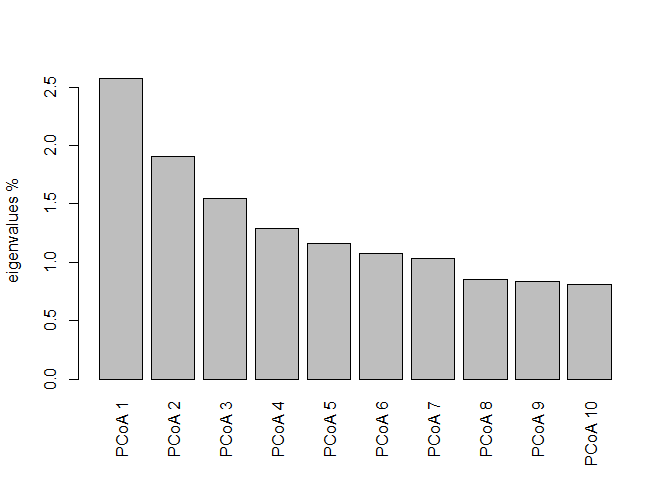<!-- -->

### Ordination plots
#### Accession

``` r
colors12 <- c("#999999", "#DDCC77", "#F0E442", "#E69F00", "#D55E00", "#CC79A7", 
              "#882255", "#332288", "#0072B2", "#56B4E9",  "#009E73", "#117733") # "#000000", "#44AA99", "#AA4499",

p <- ggplot(plot_df, aes(x = MDS1, y = MDS2, color = Accession)) +
  geom_point(size = 1.5, alpha = 1) +
  scale_color_manual(values = colors12) + 
  xlab(paste0("PCoA1 (", round(perc_expl1[1], 1), " %)")) +
  ylab(paste0("PCoA2 (", round(perc_expl1[2], 1), " %)")) +
  ggtitle("PERMANOVA Accession: p = 0.005") +
  theme(panel.background = element_rect(fill = "white"), #theme of the graph
        panel.border = element_blank(), 
        axis.line = element_line(), #show line for x and y axis
        plot.title = element_text(size = 12, hjust = 0),
        axis.text = element_text(size = 12, color = "black"),
        axis.title = element_text(size = 16),
        axis.title.x = element_text(vjust = -0.5),
        axis.title.y = element_text(vjust = 2.5), #, hjust = -0
        legend.title = element_text(size = 14),
        legend.text = element_text(size = 12),
        #strip.text = element_text(size = 13),
        plot.margin = margin(5.5, 12, 5.5, 5.5, "points"),
        legend.position = "none")
print(p)
```

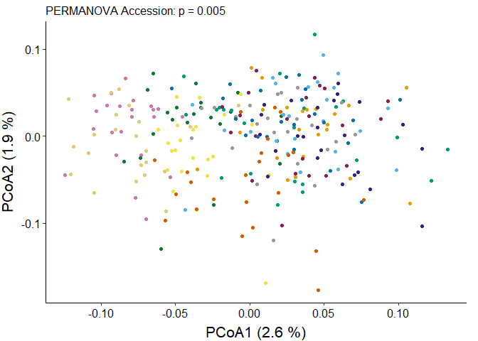<!-- -->

``` r
mapply(function(x)
  ggsave(plot = last_plot(), 
         filename = x,
         path = "C:/Users/kreek001/OneDrive - Wageningen University & Research/Chapters/Experimental Chapter 3/Result/Final graphs",
         scale = 2.2,
         width = 4,
         height = 4,
         units = "cm",
         dpi = 300),
  x = c("CP_BetaDiv_Acc.svg", "CP_BetaDiv_Acc.png"))
```

```
##                                                                                                                     CP_BetaDiv_Acc.svg 
## "C:/Users/kreek001/OneDrive - Wageningen University & Research/Chapters/Experimental Chapter 3/Result/Final graphs/CP_BetaDiv_Acc.svg" 
##                                                                                                                     CP_BetaDiv_Acc.png 
## "C:/Users/kreek001/OneDrive - Wageningen University & Research/Chapters/Experimental Chapter 3/Result/Final graphs/CP_BetaDiv_Acc.png"
```

``` r
# Legend
legend_acc <- get_legend(p + theme(legend.position = "right"))
ggdraw(legend_acc)
```

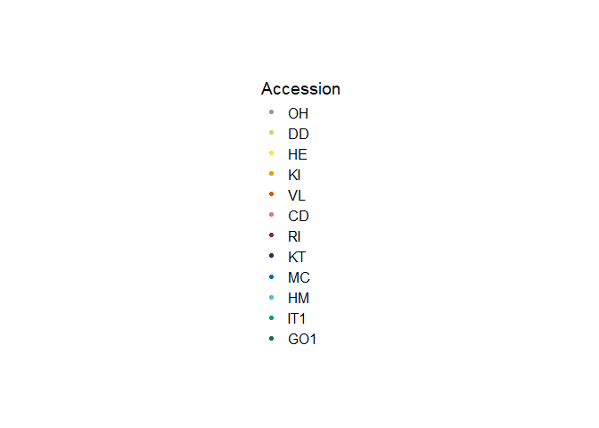<!-- -->

``` r
mapply(function(x)
  ggsave(plot = last_plot(), 
         filename = x,
         path = "C:/Users/kreek001/OneDrive - Wageningen University & Research/Chapters/Experimental Chapter 3/Result/Final graphs",
         scale = 2.2,
         width = 1.1,
         height = 4,
         units = "cm",
         dpi = 300),
  x = c("CP_BetaDiv_Acc_legend.svg", "CP_BetaDiv_Acc_legend.png"))
```

```
##                                                                                                                     CP_BetaDiv_Acc_legend.svg 
## "C:/Users/kreek001/OneDrive - Wageningen University & Research/Chapters/Experimental Chapter 3/Result/Final graphs/CP_BetaDiv_Acc_legend.svg" 
##                                                                                                                     CP_BetaDiv_Acc_legend.png 
## "C:/Users/kreek001/OneDrive - Wageningen University & Research/Chapters/Experimental Chapter 3/Result/Final graphs/CP_BetaDiv_Acc_legend.png"
```

``` r
#with legend
ggplot(plot_df, aes(x = MDS1, y = MDS2, color = Accession)) +
  geom_point(size = 1.5, alpha = 1) +
  xlab(paste0("PCoA1 (", round(perc_expl1[1], 1), " %)")) +
  ylab(paste0("PCoA2 (", round(perc_expl1[2], 1), " %)")) +
  ggtitle("PERMANOVA Accession: p = 0.001") +
  theme(panel.background = element_rect(fill = "white"), #theme of the graph
        panel.border = element_blank(), 
        axis.line = element_line(), #show line for x and y axis
        plot.title = element_text(size = 12, hjust = 0),
        axis.text = element_text(size = 12, color = "black"),
        axis.title = element_text(size = 16),
        axis.title.x = element_text(vjust = -0.5),
        axis.title.y = element_text(vjust = 2.5), #, hjust = -0
        legend.title = element_text(size = 14),
        legend.text = element_text(size = 12),
        #strip.text = element_text(size = 13),
        plot.margin = margin(5.5, 12, 5.5, 5.5, "points"),
        legend.position = "right")
```

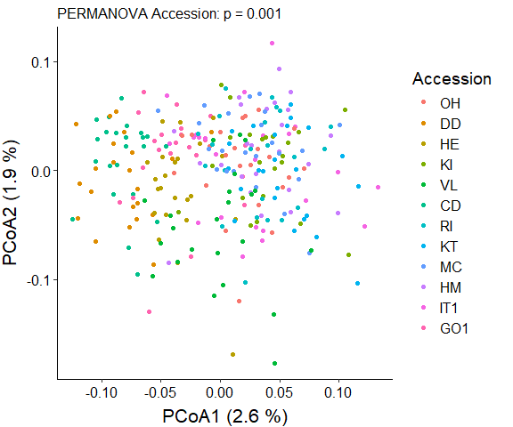<!-- -->

``` r
# Ellipses
ggplot(plot_df, aes(x = MDS1, y = MDS2, color = Accession)) +
  geom_point(size = 1.5, alpha = 1) +
  stat_ellipse() +
  xlab(paste0("PCoA1 (", round(perc_expl1[1], 1), " %)")) +
  ylab(paste0("PCoA2 (", round(perc_expl1[2], 1), " %)")) +
  ggtitle("PERMANOVA Accession: p = 0.001") +
  theme(panel.background = element_rect(fill = "white"), #theme of the graph
        panel.border = element_blank(), 
        axis.line = element_line(), #show line for x and y axis
        plot.title = element_text(size = 12, hjust = 0),
        axis.text = element_text(size = 12, color = "black"),
        axis.title = element_text(size = 16),
        axis.title.x = element_text(vjust = -0.5),
        axis.title.y = element_text(vjust = 2.5), #, hjust = -0
        legend.title = element_text(size = 14),
        legend.text = element_text(size = 12),
        #strip.text = element_text(size = 13),
        plot.margin = margin(5.5, 12, 5.5, 5.5, "points"),
        legend.position = "right")
```

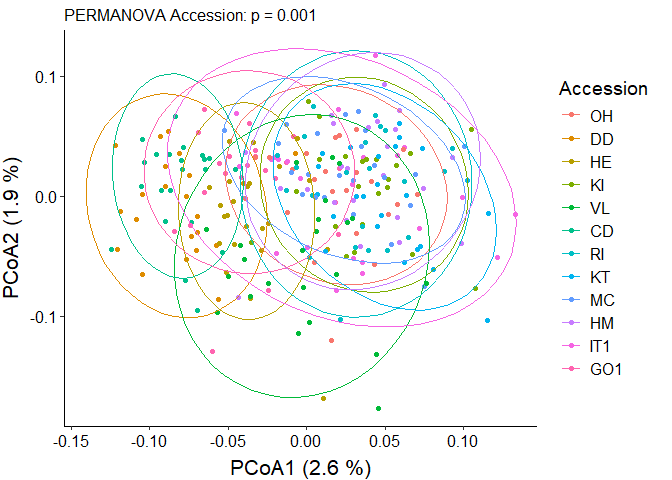<!-- -->

#### Domestication

``` r
colors_dom <- c("#0072B2", "#D55E00")

ggplot(plot_df, aes(x = MDS1, y = MDS2, color = Domestication)) +
  geom_point(size = 1.5, alpha = 1) +
  stat_ellipse() +
  scale_color_manual(values = colors_dom) +
  xlab(paste0("PCoA1 (", round(perc_expl1[1], 1), " %)")) +
  ylab(paste0("PCoA2 (", round(perc_expl1[2], 1), " %)")) +
  ggtitle("PERMANOVA Domestication: p = 0.001") +
  theme(panel.background = element_rect(fill = "white"), #theme of the graph
        panel.border = element_blank(), 
        axis.line = element_line(), #show line for x and y axis
        plot.title = element_text(size = 12, hjust = 0),
        axis.text = element_text(size = 12, color = "black"),
        axis.title = element_text(size = 16),
        axis.title.x = element_text(vjust = -0.5),
        axis.title.y = element_text(vjust = 2.5), #, hjust = -0
        legend.title = element_text(size = 14),
        legend.text = element_text(size = 12),
        #strip.text = element_text(size = 13),
        plot.margin = margin(5.5, 12, 5.5, 5.5, "points"),
        legend.position = "right")
```

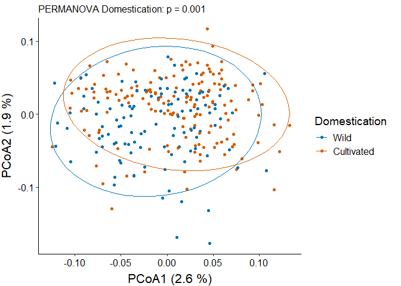<!-- -->

``` r
# Location labels
label_df <- data.frame(Domestication = c("Wild", "Cultivated"),
                       MDS1 = c(-0.11, 0.1),
                       MDS2 = c(-0.1, 0.1))

ggplot(plot_df, aes(x = MDS1, y = MDS2, color = Domestication)) +
  geom_point(size = 1.5, alpha = 1) +
  stat_ellipse() +
  scale_color_manual(values = colors_dom) +
  geom_text(data = label_df, aes(label = Domestication, color = Domestication),
            size = 5, fontface = "bold", show.legend = FALSE) +
  xlab(paste0("PCoA1 (", round(perc_expl1[1], 1), " %)")) +
  ylab(paste0("PCoA2 (", round(perc_expl1[2], 1), " %)")) +
  ggtitle("PERMANOVA Domestication: p = 0.001") +
  theme(panel.background = element_rect(fill = "white"), #theme of the graph
        panel.border = element_blank(), 
        axis.line = element_line(), #show line for x and y axis
        plot.title = element_text(size = 12, hjust = 0),
        axis.text = element_text(size = 12, color = "black"),
        axis.title = element_text(size = 16),
        axis.title.x = element_text(vjust = -0.5),
        axis.title.y = element_text(vjust = 2.5), #, hjust = -0
        legend.title = element_text(size = 14),
        legend.text = element_text(size = 12),
        #strip.text = element_text(size = 13),
        legend.position = "none")
```

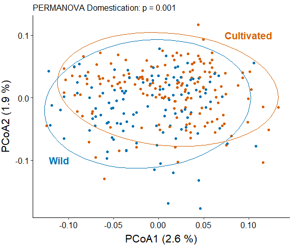<!-- -->

``` r
label_df <- data.frame(Domestication = c("Wild", "Cultivated"),
                       Cat_treatment = c("", ""),
                       MDS1 = c(-0.11, -0.08),
                       MDS2 = c(-0.11, 0.12))

ggplot(plot_df, aes(x = MDS1, y = MDS2, color = Domestication, shape = Cat_treatment)) +
  geom_point(size = 1.5, alpha = 1) +
  stat_ellipse(aes(group = Domestication), 
               #linewidth = 0.8, 
               show.legend = FALSE) +
  scale_color_manual(values = colors_dom) +
  geom_text(data = label_df, aes(label = Domestication, color = Domestication),
            size = 5, fontface = "bold", show.legend = FALSE) +
  xlab(paste0("PCoA1 (", round(perc_expl1[1], 1), " %)")) +
  ylab(paste0("PCoA2 (", round(perc_expl1[2], 1), " %)")) +
  ggtitle("PERMANOVA Domestication: p = 0.001") +
  theme(panel.background = element_rect(fill = "white"), #theme of the graph
       panel.border = element_blank(), 
        axis.line = element_line(), #show line for x and y axis
        plot.title = element_text(size = 12, hjust = 0),
        axis.text = element_text(size = 12, color = "black"),
        axis.title = element_text(size = 16),
        axis.title.x = element_text(vjust = -0.5),
        axis.title.y = element_text(vjust = 2.5), #, hjust = -0
        legend.title = element_text(size = 14),
        legend.text = element_text(size = 12),
        #strip.text = element_text(size = 13),
        plot.margin = margin(5.5, 12, 5.5, 5.5, "points"),
        legend.position = "none")
```

```
## Warning: The following aesthetics were dropped during statistical transformation: shape.
## ℹ This can happen when ggplot fails to infer the correct grouping structure in
##   the data.
## ℹ Did you forget to specify a `group` aesthetic or to convert a numerical
##   variable into a factor?
```

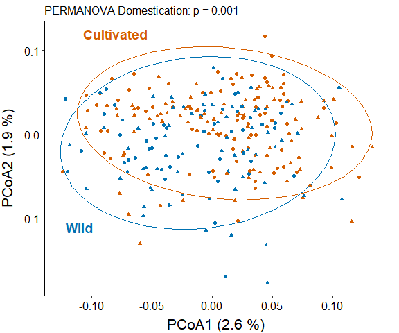<!-- -->

``` r
q <- ggplot(plot_df, aes(x = MDS1, y = MDS2, color = Domestication, shape = Cat_treatment)) +
  geom_point(size = 1.5, alpha = 1) +
  stat_ellipse(aes(group = Domestication), 
               #linewidth = 0.8, 
               show.legend = FALSE) +
  scale_color_manual(values = colors_dom) +
  scale_shape_manual(name = "Caterpillar treatment", 
                     values = c(Co = 16, Mb = 15),
                     labels = c(Co = "Control", Mb = expression(italic("M. brassicae")))) +
  #geom_text(data = label_df, aes(label = Domestication, color = Domestication),
   #         size = 5, fontface = "bold", show.legend = FALSE) +
  xlab(paste0("PCoA1 (", round(perc_expl1[1], 1), " %)")) +
  ylab(paste0("PCoA2 (", round(perc_expl1[2], 1), " %)")) +
  ggtitle("PERMANOVA Dom: p = 0.005; Cat: p = 0.005/nInteraction Dom:Cat: p = 0.690") +
  theme(panel.background = element_rect(fill = "white"), #theme of the graph
        panel.border = element_blank(), 
        axis.line = element_line(), #show line for x and y axis
        plot.title = element_text(size = 12, hjust = 0),
        axis.text = element_text(size = 12, color = "black"),
        axis.title = element_text(size = 16),
        axis.title.x = element_text(vjust = -0.5),
        axis.title.y = element_text(vjust = 2.5), #, hjust = -0
        legend.title = element_text(size = 14),
        legend.text = element_text(size = 12),
        #strip.text = element_text(size = 13),
        plot.margin = margin(5.5, 12, 5.5, 5.5, "points"),
        legend.position = "none")

print(q)
```

```
## Warning: The following aesthetics were dropped during statistical transformation: shape.
## ℹ This can happen when ggplot fails to infer the correct grouping structure in
##   the data.
## ℹ Did you forget to specify a `group` aesthetic or to convert a numerical
##   variable into a factor?
```

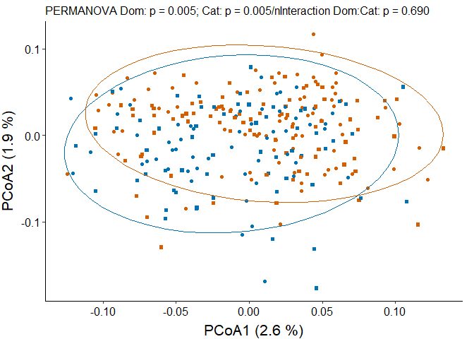<!-- -->

``` r
mapply(function(x)
  ggsave(plot = last_plot(), 
         filename = x,
         path = "C:/Users/kreek001/OneDrive - Wageningen University & Research/Chapters/Experimental Chapter 3/Result/Final graphs",
         scale = 2.2,
         width = 4,
         height = 4,
         units = "cm",
         dpi = 300),
  x = c("CP_BetaDiv_Dom_Cat.svg", "CP_BetaDiv_Dom_Cat.png"))
```

```
## Warning: The following aesthetics were dropped during statistical transformation: shape.
## ℹ This can happen when ggplot fails to infer the correct grouping structure in
##   the data.
## ℹ Did you forget to specify a `group` aesthetic or to convert a numerical
##   variable into a factor?
## The following aesthetics were dropped during statistical transformation: shape.
## ℹ This can happen when ggplot fails to infer the correct grouping structure in
##   the data.
## ℹ Did you forget to specify a `group` aesthetic or to convert a numerical
##   variable into a factor?
```

```
##                                                                                                                     CP_BetaDiv_Dom_Cat.svg 
## "C:/Users/kreek001/OneDrive - Wageningen University & Research/Chapters/Experimental Chapter 3/Result/Final graphs/CP_BetaDiv_Dom_Cat.svg" 
##                                                                                                                     CP_BetaDiv_Dom_Cat.png 
## "C:/Users/kreek001/OneDrive - Wageningen University & Research/Chapters/Experimental Chapter 3/Result/Final graphs/CP_BetaDiv_Dom_Cat.png"
```

``` r
# Legend
legend_dom <- get_legend(q + theme(legend.position = "right"))
```

```
## Warning: The following aesthetics were dropped during statistical transformation: shape.
## ℹ This can happen when ggplot fails to infer the correct grouping structure in
##   the data.
## ℹ Did you forget to specify a `group` aesthetic or to convert a numerical
##   variable into a factor?
```

``` r
ggdraw(legend_dom)
```

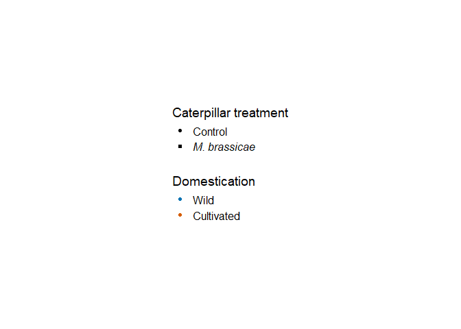<!-- -->

``` r
mapply(function(x)
  ggsave(plot = last_plot(), 
         filename = x,
         path = "C:/Users/kreek001/OneDrive - Wageningen University & Research/Chapters/Experimental Chapter 3/Result/Final graphs",
         scale = 2.2,
         width = 2.4,
         height = 4,
         units = "cm",
         dpi = 300),
  x = c("CP_BetaDiv_Dom_Cat_legend.svg", "CP_BetaDiv_Dom_Cat_legend.png"))
```

```
##                                                                                                                     CP_BetaDiv_Dom_Cat_legend.svg 
## "C:/Users/kreek001/OneDrive - Wageningen University & Research/Chapters/Experimental Chapter 3/Result/Final graphs/CP_BetaDiv_Dom_Cat_legend.svg" 
##                                                                                                                     CP_BetaDiv_Dom_Cat_legend.png 
## "C:/Users/kreek001/OneDrive - Wageningen University & Research/Chapters/Experimental Chapter 3/Result/Final graphs/CP_BetaDiv_Dom_Cat_legend.png"
```

``` r
ggplot(plot_df, aes(x = MDS1, y = MDS2, color = Domestication, shape = Cat_treatment)) +
  geom_point(size = 1.5, alpha = 1) +
  stat_ellipse(aes(group = Domestication), 
               #linewidth = 0.8, 
               show.legend = FALSE) +
  scale_color_manual(values = colors_dom) +
  geom_text(data = label_df, aes(label = Domestication, color = Domestication),
            size = 5, fontface = "bold", show.legend = FALSE) +
  xlab(paste0("PCoA1 (", round(perc_expl1[1], 1), " %)")) +
  ylab(paste0("PCoA2 (", round(perc_expl1[2], 1), " %)")) +
  ggtitle("PERMANOVA: Cat: p = 0.001; Dom: p = 0.001") +
  theme(panel.background = element_rect(fill = "white"), #theme of the graph
        panel.border = element_blank(), 
        axis.line = element_line(), #show line for x and y axis
        plot.title = element_text(size = 12, hjust = 0),
        axis.text = element_text(size = 12, color = "black"),
        axis.title = element_text(size = 16),
        axis.title.x = element_text(vjust = -0.5),
        axis.title.y = element_text(vjust = 2.5), #, hjust = -0
        legend.title = element_text(size = 14),
        legend.text = element_text(size = 12),
        #strip.text = element_text(size = 13),
        plot.margin = margin(5.5, 12, 5.5, 5.5, "points"),
        legend.position = "right")
```

```
## Warning: The following aesthetics were dropped during statistical transformation: shape.
## ℹ This can happen when ggplot fails to infer the correct grouping structure in
##   the data.
## ℹ Did you forget to specify a `group` aesthetic or to convert a numerical
##   variable into a factor?
```

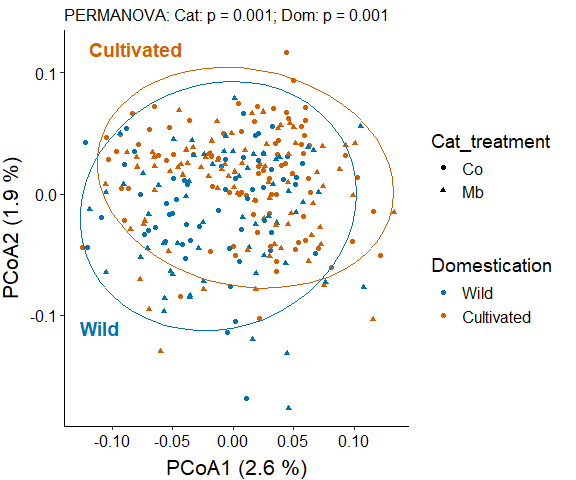<!-- -->

#### Caterpillar treatment

``` r
colors_cat <- c("#882255", "#009E73")

r <- ggplot(plot_df, aes(x = MDS1, y = MDS2, color = Cat_treatment, shape = Cat_treatment)) +
  geom_point(size = 1.5, alpha = 1) +
  stat_ellipse() +
  scale_color_manual(name = "Caterpillar treatment", 
                     values = colors_cat,
                     labels = c(Co = "Control", Mb = expression(italic("M. brassicae")))) +
  scale_shape_manual(name = "Caterpillar treatment", 
                     values = c(Co = 16, Mb = 15),
                     labels = c(Co = "Control", Mb = expression(italic("M. brassicae")))) +
  xlab(paste0("PCoA1 (", round(perc_expl1[1], 1), " %)")) +
  ylab(paste0("PCoA2 (", round(perc_expl1[2], 1), " %)")) +
  ggtitle("PERMANOVA Caterpillar treatment: p = 0.005") +
  theme(panel.background = element_rect(fill = "white"), #theme of the graph
        panel.border = element_blank(), 
        axis.line = element_line(), #show line for x and y axis
        plot.title = element_text(size = 12, hjust = 0),
        axis.text = element_text(size = 12, color = "black"),
        axis.title = element_text(size = 16),
        axis.title.x = element_text(vjust = -0.5),
        axis.title.y = element_text(vjust = 2.5), #, hjust = -0
        legend.title = element_text(size = 14),
        legend.text = element_text(size = 12),
        #strip.text = element_text(size = 13),
        plot.margin = margin(5.5, 12, 5.5, 5.5, "points"),
        legend.position = "none")
print(r)
```

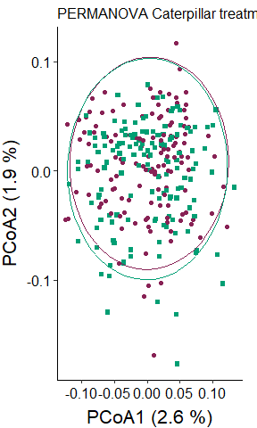<!-- -->

``` r
mapply(function(x)
  ggsave(plot = last_plot(), 
         filename = x,
         path = "C:/Users/kreek001/OneDrive - Wageningen University & Research/Chapters/Experimental Chapter 3/Result/Final graphs",
         scale = 2.2,
         width = 4,
         height = 4,
         units = "cm",
         dpi = 300),
  x = c("CP_BetaDiv_Cat.svg", "CP_BetaDiv_Cat.png"))
```

```
##                                                                                                                     CP_BetaDiv_Cat.svg 
## "C:/Users/kreek001/OneDrive - Wageningen University & Research/Chapters/Experimental Chapter 3/Result/Final graphs/CP_BetaDiv_Cat.svg" 
##                                                                                                                     CP_BetaDiv_Cat.png 
## "C:/Users/kreek001/OneDrive - Wageningen University & Research/Chapters/Experimental Chapter 3/Result/Final graphs/CP_BetaDiv_Cat.png"
```

``` r
# Legend
legend_cat <- get_legend(r + theme(legend.position = "right"))
ggdraw(legend_cat)
```

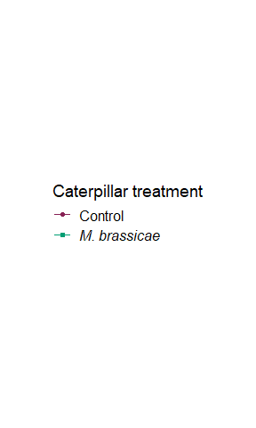<!-- -->

``` r
mapply(function(x)
  ggsave(plot = last_plot(), 
         filename = x,
         path = "C:/Users/kreek001/OneDrive - Wageningen University & Research/Chapters/Experimental Chapter 3/Result/Final graphs",
         scale = 2.2,
         width = 2.5,
         height = 1,
         units = "cm",
         dpi = 300),
  x = c("CP_BetaDiv_Cat_legend.svg", "CP_BetaDiv_Cat_legend.png"))
```

```
##                                                                                                                     CP_BetaDiv_Cat_legend.svg 
## "C:/Users/kreek001/OneDrive - Wageningen University & Research/Chapters/Experimental Chapter 3/Result/Final graphs/CP_BetaDiv_Cat_legend.svg" 
##                                                                                                                     CP_BetaDiv_Cat_legend.png 
## "C:/Users/kreek001/OneDrive - Wageningen University & Research/Chapters/Experimental Chapter 3/Result/Final graphs/CP_BetaDiv_Cat_legend.png"
```

``` r
colors_cat <- c("#882255", "#009E73", "#882255", "#009E73")

# Location labels
label_df <- data.frame(Cat_treatment = c("Control", "M. brassicae"),
                       MDS1 = c(0.08, -0.1),
                       MDS2 = c(0.1, -0.1))

ggplot(plot_df, aes(x = MDS1, y = MDS2, color = Cat_treatment)) +
  geom_point(size = 1.5, alpha = 1) +
  stat_ellipse() +
  scale_color_manual(values = colors_cat) + #"#56B4E9", "#009E73"
  geom_text(data = label_df, aes(label = Cat_treatment, color = Cat_treatment),
            size = 5, fontface = "bold", show.legend = FALSE) +
  xlab(paste0("PCoA1 (", round(perc_expl1[1], 1), " %)")) +
  ylab(paste0("PCoA2 (", round(perc_expl1[2], 1), " %)")) +
  ggtitle("PERMANOVA Caterpillar treatment: p = 0.001") +
  theme(panel.background = element_rect(fill = "white"), #theme of the graph
        panel.border = element_blank(), 
        axis.line = element_line(), #show line for x and y axis
        plot.title = element_text(size = 12, hjust = 0),
        axis.text = element_text(size = 12, color = "black"),
        axis.title = element_text(size = 16),
        axis.title.x = element_text(vjust = -0.5),
        axis.title.y = element_text(vjust = 2.5), #, hjust = -0
        legend.title = element_text(size = 14),
        legend.text = element_text(size = 12),
        #strip.text = element_text(size = 13),
        plot.margin = margin(5.5, 12, 5.5, 5.5, "points"),
        legend.position = "none")
```

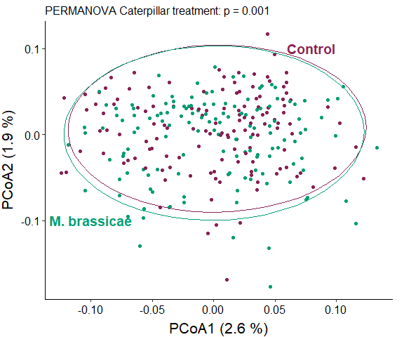<!-- -->

#### Labeling outliers

``` r
ggplot(plot_df, aes(x = MDS1, y = MDS2, color = Accession, shape = Cat_treatment)) +
  geom_point(size = 1.5, alpha = 1) +
  geom_text(label = plot_df$SampleID, hjust = 0, vjust = 0, size = 2.5) +
  xlab(paste(round(perc_expl1[1], 1), "%")) +
  ylab(paste(round(perc_expl1[2], 1), "%")) +
  theme_classic() +
  theme(plot.title = element_text(size = 10, face = "bold", hjust = 0.5),
        legend.position = "right")
```

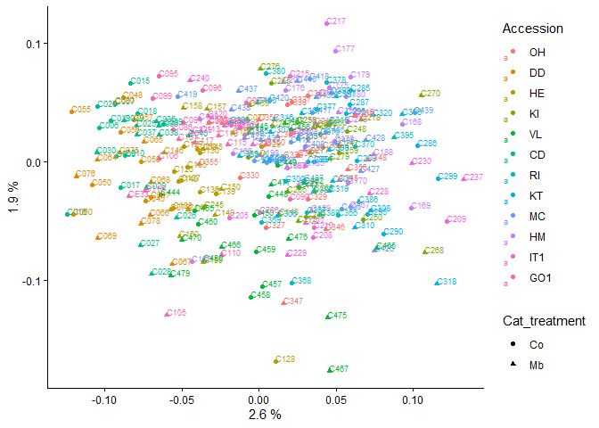<!-- -->

``` r
rm(bray_dist, mds_result, mds_coords, metadata_df, plot_df)
```


## 2.1.3 - PCoA per accession
### Define the function 

``` r
stats <- c("0.035", "0.225", "0.080", "0.665", "0.010", "0.015", "0.155", "0.015", "0.025", "0.015", "0.720", "0.300")
stats <- lapply(stats, function(x) {
  paste0("PERMANOVA Cat: p = ", x)
})

color_fw <- c(rep("#0072B2", 5), rep("#D55E00", 7))
tcolor_fw <- c(rep("white", 5), rep("black", 7))
tsize_fw <- rep(18, 12)

MDS_listing <- function(physeq_list) {
  plot_list <- lapply(physeq_list, function(x) {
    # Calculate Bray-Curtis distance matrix
    bray_dist <- distance(x, method = "bray")
    
    # Run classical MDS with cmdscale()
    mds_result <- cmdscale(bray_dist, k = 2, eig = TRUE)
    
    # Percentage explained variance per axis
    perc_expl1 <- 100 * (mds_result$eig / sum(mds_result$eig))
    
    # Extract coordinates
    mds_coords <- as.data.frame(mds_result$points)
    colnames(mds_coords) <- c("MDS1", "MDS2")
    
    # Add sample IDs as a column
    mds_coords$SampleID <- rownames(mds_coords)
    
    # Extract sample metadata
    metadata_df <- data.frame(sample_data(x))
    metadata_df$SampleID <- rownames(metadata_df)
    
    # Merge ordination coordinates with metadata
    plot_df <- merge(mds_coords, metadata_df, by = "SampleID")
    
    # Ordination plots
    p <- ggplot(plot_df, aes(x = MDS1, y = MDS2, color = Cat_treatment, shape = Cat_treatment)) +
      geom_point(size = 1.5, alpha = 1) +
      scale_color_manual(name = "Caterpillar treatment", 
                         values = colors_cat,
                         labels = c(Co = "Control", Mb = expression(italic("M. brassicae")))) +
      scale_shape_manual(name = "Caterpillar treatment", 
                         values = c(Co = 16, Mb = 15),
                         labels = c(Co = "Control", Mb = expression(italic("M. brassicae")))) +
      xlab(paste0("PCoA1 (", round(perc_expl1[1], 1), " %)")) +
      ylab(paste0("PCoA2 (", round(perc_expl1[2], 1), " %)")) +
      theme(panel.background = element_rect(fill = "white"), #theme of the graph
          panel.border = element_blank(), 
          axis.line = element_line(), #show line for x and y axis
          plot.title = element_text(size = 18, hjust = 0),
          plot.subtitle = element_text(size = 12),
          axis.text = element_text(size = 12, color = "black"),
          axis.title = element_text(size = 19),
          axis.title.x = element_text(vjust = -0.5),
          axis.title.y = element_text(vjust = 2.5), #, hjust = -0
          legend.title = element_text(size = 16),
          legend.text = element_text(size = 14),
          strip.text = element_text(size = 18),
          #plot.margin = margin(5.5, 12, 5.5, 5.5, "points"),
          plot.margin = margin(10, 20, 10, 20, "points"), # top . bottom .
          legend.position = "right")
    return(p)
  })
  
  ## Add titles using names of the original list
  titles <- names(plot_list)
  
   plot_list_titled <- mapply(function(p, title, subtitle) {
    p + labs(title = title,
             subtitle = subtitle)
  }, p = plot_list, title = titles, subtitle = stats, SIMPLIFY = FALSE)
  
  plot_list_titled_nolegend <- mapply(function(p) {
    p + theme(legend.position = "none")
  }, p = plot_list_titled, SIMPLIFY = FALSE)

    plot_list_titled_elips <- mapply(function(p) {
    p + stat_ellipse() + theme(legend.position = "none")
  }, p = plot_list_titled, SIMPLIFY = FALSE)
    
  # Facet wrap
  plot_list_facetwrap <- mapply(function(p, color_fw, tcolor_fw, tsize_fw) {
     strip0 <- strip_themed(background_x = elem_list_rect(fill = color_fw),
                            text_x = elem_list_text(colour = tcolor_fw, size = tsize_fw))
     p + facet_wrap2(~ Accession, #facet wrap2 needed to color strip
                    strip = strip0) +
       labs(title = NULL)
  }, p = plot_list_titled_elips, color_fw = color_fw, tcolor_fw = tcolor_fw, tsize_fw = tsize_fw, SIMPLIFY = FALSE)
 

  return(list(Plot_list = plot_list_titled, Plot_notitle = plot_list_titled_nolegend, Plot_elips = plot_list_titled_elips, plot_list_facetwrap = plot_list_facetwrap))
}
```

### Run function

``` r
# let's run our custom function
set.seed(5235)
MDS_Accessions_split <- MDS_listing(filtered_ps)
```

### Plot with elipse, subtitle and facte wrap
#### Plot with four columns

``` r
wrap_plots(MDS_Accessions_split$plot_list_facetwrap, ncol = 4) &
  theme(panel.spacing = unit(8, "lines")) #Allow larger margins ggplot
```

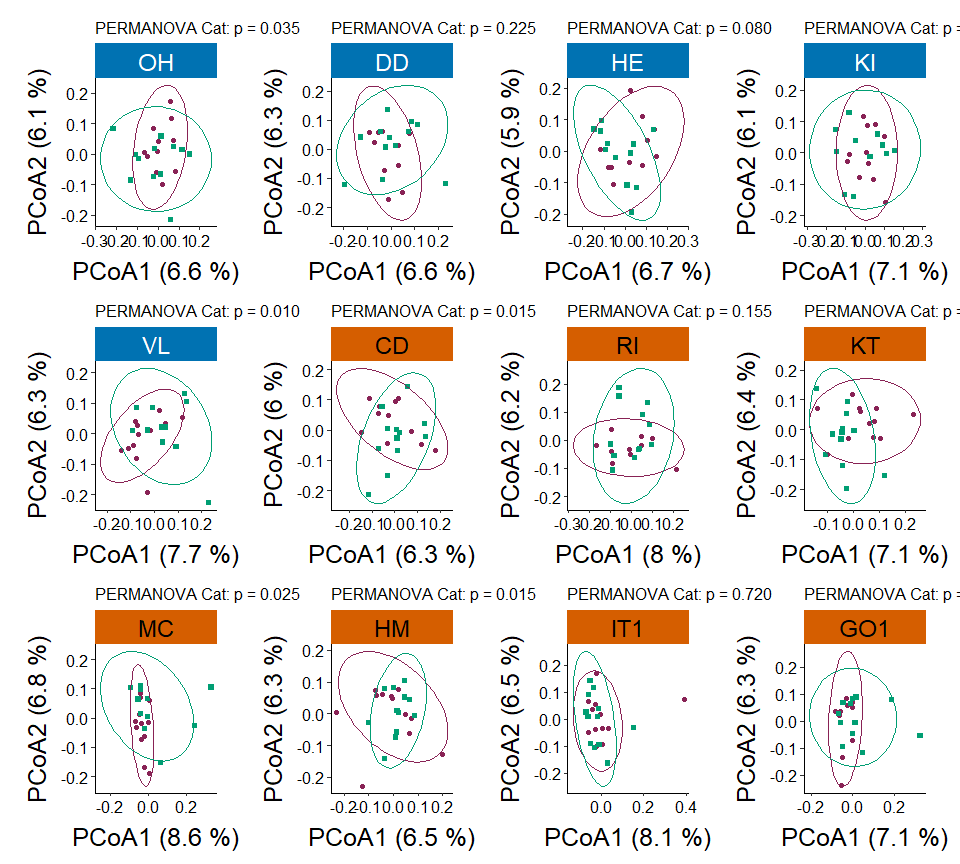<!-- -->

``` r
mapply(function(x)
  ggsave(plot = last_plot(), 
         filename = x,
         path = "C:/Users/kreek001/OneDrive - Wageningen University & Research/Chapters/Experimental Chapter 3/Result/Final graphs",
         scale = 2.2,
         width = 15,
         height = 11.7,
         units = "cm",
         dpi = 300),
  x = c("CP_BetaDiv_AccSep_Cat4_fw.svg", "CP_BetaDiv_AccSep_Cat4_fw.png"))
```

```
##                                                                                                                     CP_BetaDiv_AccSep_Cat4_fw.svg 
## "C:/Users/kreek001/OneDrive - Wageningen University & Research/Chapters/Experimental Chapter 3/Result/Final graphs/CP_BetaDiv_AccSep_Cat4_fw.svg" 
##                                                                                                                     CP_BetaDiv_AccSep_Cat4_fw.png 
## "C:/Users/kreek001/OneDrive - Wageningen University & Research/Chapters/Experimental Chapter 3/Result/Final graphs/CP_BetaDiv_AccSep_Cat4_fw.png"
```

#### Plot with three columns

``` r
wrap_plots(MDS_Accessions_split$plot_list_facetwrap, ncol = 3) &
  theme(panel.spacing = unit(8, "lines")) #Allow larger margins ggplot
```

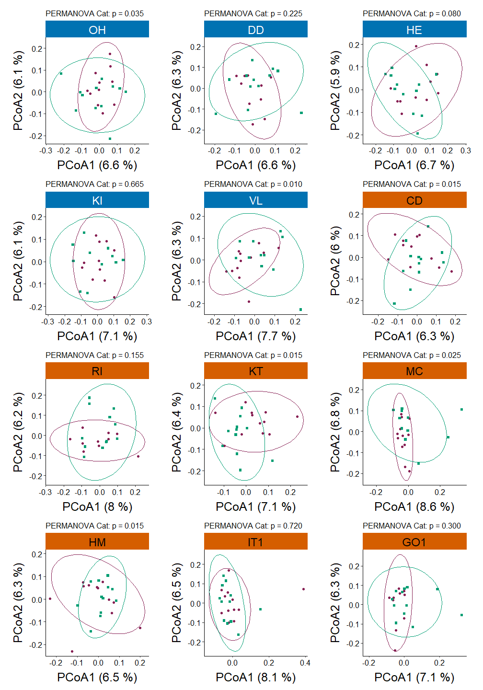<!-- -->

``` r
mapply(function(x)
  ggsave(plot = last_plot(), 
         filename = x,
         path = "C:/Users/kreek001/OneDrive - Wageningen University & Research/Chapters/Experimental Chapter 3/Result/Final graphs",
         scale = 2.2,
         width = 12.2,
         height = 17,
         units = "cm",
         dpi = 300),
  x = c("CP_BetaDiv_AccSep_Cat3_fw.svg", "CP_BetaDiv_AccSep_Cat3_fw.png"))
```

```
##                                                                                                                     CP_BetaDiv_AccSep_Cat3_fw.svg 
## "C:/Users/kreek001/OneDrive - Wageningen University & Research/Chapters/Experimental Chapter 3/Result/Final graphs/CP_BetaDiv_AccSep_Cat3_fw.svg" 
##                                                                                                                     CP_BetaDiv_AccSep_Cat3_fw.png 
## "C:/Users/kreek001/OneDrive - Wageningen University & Research/Chapters/Experimental Chapter 3/Result/Final graphs/CP_BetaDiv_AccSep_Cat3_fw.png"
```

#### Plot with half three and half two columns

``` r
wrap_plots(MDS_Accessions_split$plot_list_facetwrap[1:6], ncol = 3) &
  theme(panel.spacing = unit(8, "lines")) #Allow larger margins ggplot
```

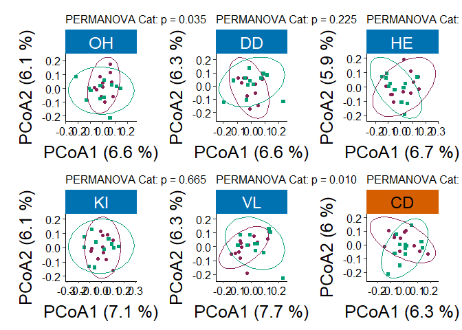<!-- -->

``` r
mapply(function(x)
  ggsave(plot = last_plot(), 
         filename = x,
         path = "C:/Users/kreek001/OneDrive - Wageningen University & Research/Chapters/Experimental Chapter 3/Result/Final graphs",
         scale = 2.2,
         width = 12.2,
         height = 8.7,
         units = "cm",
         dpi = 300),
  x = c("CP_BetaDiv_AccSep_Cat3_fw_first6.svg", "CP_BetaDiv_AccSep_Cat3_fw_first6.png"))
```

```
##                                                                                                                     CP_BetaDiv_AccSep_Cat3_fw_first6.svg 
## "C:/Users/kreek001/OneDrive - Wageningen University & Research/Chapters/Experimental Chapter 3/Result/Final graphs/CP_BetaDiv_AccSep_Cat3_fw_first6.svg" 
##                                                                                                                     CP_BetaDiv_AccSep_Cat3_fw_first6.png 
## "C:/Users/kreek001/OneDrive - Wageningen University & Research/Chapters/Experimental Chapter 3/Result/Final graphs/CP_BetaDiv_AccSep_Cat3_fw_first6.png"
```

``` r
wrap_plots(MDS_Accessions_split$plot_list_facetwrap[7:12], ncol = 2) &
  theme(panel.spacing = unit(8, "lines")) #Allow larger margins ggplot
```

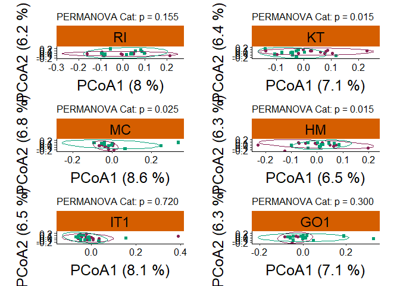<!-- -->

``` r
mapply(function(x)
  ggsave(plot = last_plot(), 
         filename = x,
         path = "C:/Users/kreek001/OneDrive - Wageningen University & Research/Chapters/Experimental Chapter 3/Result/Final graphs",
         scale = 2.2,
         width = 7.5,
         height = 11.7,
         units = "cm",
         dpi = 300),
  x = c("CP_BetaDiv_AccSep_Cat2_fw_last6.svg", "CP_BetaDiv_AccSep_Cat2_fw_last6.png"))
```

```
##                                                                                                                     CP_BetaDiv_AccSep_Cat2_fw_last6.svg 
## "C:/Users/kreek001/OneDrive - Wageningen University & Research/Chapters/Experimental Chapter 3/Result/Final graphs/CP_BetaDiv_AccSep_Cat2_fw_last6.svg" 
##                                                                                                                     CP_BetaDiv_AccSep_Cat2_fw_last6.png 
## "C:/Users/kreek001/OneDrive - Wageningen University & Research/Chapters/Experimental Chapter 3/Result/Final graphs/CP_BetaDiv_AccSep_Cat2_fw_last6.png"
```

#### Insert blank plots

``` r
blank_plot <- ggplot() + theme_void()

plot_list_facetwrap <- c(MDS_Accessions_split$plot_list_facetwrap[1:6], 
                          list(blank_plot),
                          MDS_Accessions_split$plot_list_facetwrap[7:8], 
                          list(blank_plot),
                          MDS_Accessions_split$plot_list_facetwrap[9:10],
                          list(blank_plot),
                          MDS_Accessions_split$plot_list_facetwrap[11:12])

wrap_plots(plot_list_facetwrap, ncol = 3) &
  theme(panel.spacing = unit(8, "lines")) #Allow larger margins ggplot
```

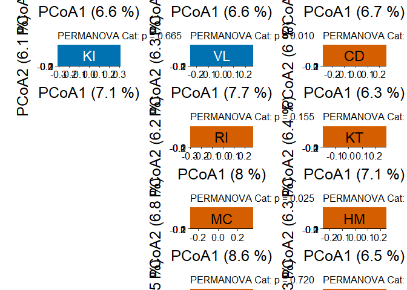<!-- -->

``` r
mapply(function(x)
  ggsave(plot = last_plot(), 
         filename = x,
         path = "C:/Users/kreek001/OneDrive - Wageningen University & Research/Chapters/Experimental Chapter 3/Result/Final graphs",
         scale = 2.2,
         width = 12.2,
         height = 21,
         units = "cm",
         dpi = 300),
  x = c("CP_BetaDiv_AccSep_Cat3_fw_blanks.svg", "CP_BetaDiv_AccSep_Cat3_fw_blanks.png"))
```

```
##                                                                                                                     CP_BetaDiv_AccSep_Cat3_fw_blanks.svg 
## "C:/Users/kreek001/OneDrive - Wageningen University & Research/Chapters/Experimental Chapter 3/Result/Final graphs/CP_BetaDiv_AccSep_Cat3_fw_blanks.svg" 
##                                                                                                                     CP_BetaDiv_AccSep_Cat3_fw_blanks.png 
## "C:/Users/kreek001/OneDrive - Wageningen University & Research/Chapters/Experimental Chapter 3/Result/Final graphs/CP_BetaDiv_AccSep_Cat3_fw_blanks.png"
```

``` r
rm(CP_CSS_bac_ps2, MDS_Accessions_split, plot_list_facetwrap)
```


# 2.3 - P values for beta diversity
A permutation anova will tell if the differences in the microbial community structure are significant or not. They will essentially help you separate the data clouds of your ordination with confidence levels. It will compare centroids and spread of the different groups. It is based on the distance matrix and does not assume normality of the data (non-parametric). Be careful when beta dispersion is different for different groups. It may give misleading low p-values when centroids are apart. [More info](https://archetypalecology.wordpress.com/2018/02/21/permutational-multivariate-analysis-of-variance-permanova-in-r-preliminary/).

## 2.3.1 - Run PERMANOVA at ASV level by terms
You will need to run, test and check several different models and data slices to have final insight into the data set you are evaluating. get used with testing multiple models!


``` r
# Running the permanova with vegan::adonis2() on a single phyloseq object is very simple
metadata_Bac <- as(sample_data(CP_CSS_bac_ps),"data.frame")
```

### Including batch effect

``` r
set.seed(5235)
dist <- phyloseq::distance(t(otu_table(CP_CSS_bac_ps)), method = "bray")

set.seed(5235)
Acc_per <- adonis2(dist ~ Accession*Cat_treatment, data = metadata_Bac, method = "bray", by = "terms", permutations = how(blocks = metadata_Bac$Batch))
Acc_per
```

```
## Permutation test for adonis under reduced model
## Terms added sequentially (first to last)
## Blocks:  metadata_Bac$Batch 
## Permutation: free
## Number of permutations: 199
## 
## adonis2(formula = dist ~ Accession * Cat_treatment, data = metadata_Bac, permutations = how(blocks = metadata_Bac$Batch), method = "bray", by = "terms")
##                          Df SumOfSqs      R2      F Pr(>F)   
## Accession                11    1.956 0.06159 1.5739  0.005 **
## Cat_treatment             1    0.186 0.00584 1.6424  0.005 **
## Accession:Cat_treatment  11    1.262 0.03974 1.0156  0.100 . 
## Residual                251   28.352 0.89283                 
## Total                   274   31.755 1.00000                 
## ---
## Signif. codes:  0 '***' 0.001 '**' 0.01 '*' 0.05 '.' 0.1 ' ' 1
```

``` r
Permanova_Acc_CP <- as.data.frame(Acc_per)[1:3, ]
write.csv(Permanova_Acc_CP, "C:/Users/kreek001/OneDrive - Wageningen University & Research/Chapters/Experimental Chapter 3/RScripts/GitHub/TwelveAccessionExperiment/MicrobiomeAnalysis/Data/Statistical_output/CP/Permanova_Acc_CP.csv" )
```

### Effect of Domestication
#### Nested design

``` r
set.seed(5235)
Dom_per <- adonis2(dist ~ Domestication/Accession * Cat_treatment, data = metadata_Bac, method = "bray", by = "terms", permutations = how(blocks = metadata_Bac$Batch))

Permanova_Dom_CP <- as.data.frame(Dom_per)[1:5, ]
write.csv(Permanova_Dom_CP, "C:/Users/kreek001/OneDrive - Wageningen University & Research/Chapters/Experimental Chapter 3/RScripts/GitHub/TwelveAccessionExperiment/MicrobiomeAnalysis/Data/Statistical_output/CP/Permanova_Dom_CP.csv" )
```

#### Calculate centroids per accession
This to prevent nested structures

``` r
# Group factor
group <- interaction(metadata_Bac$Accession, metadata_Bac$Cat_treatment, metadata_Bac$Batch, drop = TRUE)

# Get ASV table
comm <- as(otu_table(CP_CSS_bac_ps), "matrix")
comm <- t(comm)

# Calculate centriods
comm_centroids <- aggregate(comm, by = list(group = group), FUN = mean)

# New meta data
centroid_meta <- metadata_Bac[!duplicated(group), c("Accession", "Domestication", "Cat_treatment", "Batch")]

# Add group column for alignment
centroid_meta$group <- unique(group)

# distance matrix
library(vegan)
dist_centroids <- vegdist(comm_centroids[,-1], method = "bray")
```

#### PERMANOVA Domestication

``` r
set.seed(5235)
Dom_per <- adonis2(dist_centroids ~ Domestication*Cat_treatment, data = centroid_meta, method = "bray", by = "terms", permutations = how(blocks = centroid_meta$Batch))
Dom_per
```

```
## Permutation test for adonis under reduced model
## Terms added sequentially (first to last)
## Blocks:  centroid_meta$Batch 
## Permutation: free
## Number of permutations: 199
## 
## adonis2(formula = dist_centroids ~ Domestication * Cat_treatment, data = centroid_meta, permutations = how(blocks = centroid_meta$Batch), method = "bray", by = "terms")
##                             Df SumOfSqs      R2      F Pr(>F)  
## Domestication                1  0.04794 0.02110 0.9922  0.450  
## Cat_treatment                1  0.05390 0.02372 1.1155  0.065 .
## Domestication:Cat_treatment  1  0.04452 0.01959 0.9214  0.835  
## Residual                    44  2.12595 0.93559                
## Total                       47  2.27231 1.00000                
## ---
## Signif. codes:  0 '***' 0.001 '**' 0.01 '*' 0.05 '.' 0.1 ' ' 1
```

### PERMANOVA per accession

``` r
Perm_per_acc <- lapply(filtered_ps, function(x) {
  metadata_Bac <- as(sample_data(x),"data.frame")
  
  set.seed(5235)
  dist <- phyloseq::distance(t(otu_table(x)), method = "bray")
  
  set.seed(5235)
  perm_batch <- adonis2(dist ~ Cat_treatment, data = metadata_Bac, method = "bray", by = "terms", permutations = how(blocks = metadata_Bac$Batch))

  return(perm_batch)
})

names(Perm_per_acc) <- names(filtered_ps)
#Perm_per_acc
```

``` r
df_acc <- lapply(names(Perm_per_acc), function(x){
  df <- as.data.frame(Perm_per_acc[[x]])[1, ]
  df$Accession <- rep(x, 1)
  df$Treatment <- rownames(Perm_per_acc[[x]])[1]
  return(df)
})
names(df_acc) <- names(Perm_per_acc)
Permanova_perAcc_CP <- do.call(rbind, df_acc)[c(6,7,1:5)]
Permanova_perAcc_CP
```

```
##     Accession     Treatment Df  SumOfSqs         R2         F Pr(>F)
## OH         OH Cat_treatment  1 0.1202716 0.05004776 1.1063745  0.035
## DD         DD Cat_treatment  1 0.1234299 0.04925453 1.0361245  0.225
## HE         HE Cat_treatment  1 0.1292953 0.04770527 1.0519964  0.080
## KI         KI Cat_treatment  1 0.1043368 0.04616686 0.9680280  0.665
## VL         VL Cat_treatment  1 0.1310157 0.05166629 1.1441037  0.010
## CD         CD Cat_treatment  1 0.1305005 0.05015267 1.1088161  0.015
## RI         RI Cat_treatment  1 0.1072640 0.04945440 1.0405477  0.155
## KT         KT Cat_treatment  1 0.1276901 0.05058235 1.1720992  0.015
## MC         MC Cat_treatment  1 0.1269102 0.05078837 1.1236228  0.025
## HM         HM Cat_treatment  1 0.1168755 0.04724911 1.0910308  0.015
## IT1       IT1 Cat_treatment  1 0.1070813 0.04154563 0.9536226  0.720
## GO1       GO1 Cat_treatment  1 0.1227862 0.04836603 1.0164839  0.300
```

``` r
write.csv(Permanova_perAcc_CP, "C:/Users/kreek001/OneDrive - Wageningen University & Research/Chapters/Experimental Chapter 3/RScripts/GitHub/TwelveAccessionExperiment/MicrobiomeAnalysis/Data/Statistical_output/CP/Permanova_perAcc_CP.csv")
```


``` r
df_acc_p <- lapply(names(Perm_per_acc), function(x){
  df <- as.data.frame(Perm_per_acc[[x]])[1, ]
  df$Accession <- rep(x, 1)
  df$Treatment <- rownames(Perm_per_acc[[x]])[1]
  df <- df[, c(6, 7, 5)]
  return(df)
})
names(df_acc_p) <- names(Perm_per_acc)
Permanova_perAcc_CP_p <- do.call(rbind, df_acc_p)
Permanova_perAcc_CP_p$`Pr(>F)`
```

```
##  [1] 0.035 0.225 0.080 0.665 0.010 0.015 0.155 0.015 0.025 0.015 0.720 0.300
```

