# 3.0 Basic alpha diversity analysis for pilot data
Alpha diversity will show you the quantifiable diversity within a sample - this way you compare which treatment is more or less diverse or species-rich than the other. Like in all the other steps we are evaluating here, there are countless variations and methods you could use. This is just a convenient template for you to get started.

Alpha diversity requires counts from samples with equal samples sizes. This means we cannot use the CSS transformation from the metagenomeseq package. Also, heavy filtering of your data may skew some of the diversity metrics (due to the lack of rare species), so we should not over-filter the data before calculating alpha diversity.

As my data is not too diverse in reed size, I use CSS transformed data.


### Packages

``` r
R.version$version.string # prints R version
```

```
## [1] "R version 4.5.1 (2025-06-13 ucrt)"
```

``` r
library(tibble) #needed for function rownames_to_columns
packageVersion("tibble")
```

```
## [1] '3.3.0'
```

``` r
library(car)
packageVersion("car")
```

```
## [1] '3.1.3'
```

``` r
library(phyloseq)
packageVersion("phyloseq")
```

```
## [1] '1.52.0'
```

``` r
library(ggplot2)
packageVersion("ggplot2")
```

```
## [1] '4.0.0'
```

``` r
library(ggh4x) #for coloring strip facet wrap
packageVersion("ggh4x")
```

```
## [1] '0.3.1'
```

``` r
#library(agricolae) #for HSD.test()
#packageVersion("agricolae")

library(emmeans) #for post hoc emmeans
packageVersion("emmeans")
```

```
## [1] '1.11.2.8'
```

``` r
library(multcomp) #for cld function at post hoc analysis
packageVersion("multcomp")
```

```
## [1] '1.4.29'
```

``` r
library(multcompView) #for cld function at post hoc analysis
packageVersion("multcompView")
```

```
## [1] '0.1.10'
```

``` r
library(glmmTMB) #for doing glm with many different options
packageVersion("glmmTMB")
```

```
## [1] '1.1.13'
```

``` r
library(DHARMa) #for model assumptions
packageVersion("DHARMa")
```

```
## [1] '0.4.7'
```

``` r
library(plyr) #for summary table
packageVersion("plyr")
```

```
## [1] '1.8.9'
```

### Import pre-made functions

``` r
source("C:/Users/kreek001/OneDrive - Wageningen University & Research/Chapters/Experimental Chapter 3/RScripts/GitHub/TwelveAccessionExperiment/MicrobiomeAnalysis/RScripts/Functions/Testing_model_assumptions.R") #Functions for model assumptions
```

### Import data

``` r
load("C:/Users/kreek001/OneDrive - Wageningen University & Research/Chapters/Experimental Chapter 3/RScripts/GitHub/TwelveAccessionExperiment/MicrobiomeAnalysis/Data/Phyloseq_objects/CP_median_bac_ps.RData")

# load("C:/Users/kreek001/OneDrive - Wageningen University & Research/Chapters/Experimental Chapter 3/RScripts/GitHub/TwelveAccessionExperiment/MicrobiomeAnalysis/Data/Phyloseq_objects/CP_rarefied_Bac_ps.RData")
# 
# CP_rarefied_bac_ps <- rarefied_Bac_ps
# rm(rarefied_Bac_ps)
```

### Remove unplanted CTRL

``` r
CP_median_bac_ps <- subset_samples(CP_median_bac_ps, !is.na(Accession))
```


# 3.2.1 Alpha diversity testing Accessions
Here we check both observed diversity and Shannon diversity indexes.

## Calculate richness
[Different types of alpha diversity](https://www.cd-genomics.com/microbioseq/the-use-and-types-of-alpha-diversity-metrics-in-microbial-ngs.html). 
[Nice explanation of alpha diversity](https://docs.onecodex.com/en/articles/4136553-alpha-diversity). 
[Concider looking at phylogenitic diversity](https://danielpfaith.wordpress.com/phylogenetic-diversity/) with this [R package](https://search.r-project.org/CRAN/refmans/abdiv/html/faith_pd.html).  


``` r
# extract row names to remove x in row name
total_diversity <- estimate_richness(CP_median_bac_ps) %>%
  rownames_to_column(var = "Sample")

# remove x
total_diversity$Sample <- sub("X", "", total_diversity$Sample) 

# For some reason, the "-" are replaced by ".", here we replace "." by "-" to get the original name.
total_diversity$Sample <- gsub("\\.", "-", total_diversity$Sample) 

# put new names back as row name
total_diversity <- column_to_rownames(total_diversity, var = "Sample") 
```

## Add diversity metrics to mapping file of phyloseq objects
We do this so we can perform Anovas, access meta data, make nicer plots, etc.

``` r
# makes the diversity calculations sample_data for phyloseq object
merg_to_ps <- sample_data(total_diversity)

# merge the new phyloseq object with the old phyloseq object
sample_data(CP_median_bac_ps) <- merge_phyloseq(CP_median_bac_ps, merg_to_ps) 

# forces sample data of updated phyloseq object into a data frame
total_diversity <- as(sample_data(CP_median_bac_ps),"data.frame")
```

## define factors

``` r
total_diversity$Accession <- factor(total_diversity$Accession, levels = c("OH", "DD", "HE", "KI", "VL", "CD", "RI", "KT", "MC", "HM", "IT1", "GO1"))
total_diversity$Cat_treatment <- as.factor(total_diversity$Cat_treatment)
total_diversity$Domestication <- factor(total_diversity$Domestication, levels = c("Wild", "Cultivated"))
total_diversity$Batch <- as.factor(total_diversity$Batch)
```

## Summary table
### Observed

``` r
ddply(total_diversity, c("Accession", "Cat_treatment"), summarise,
      N = sum(!is.na(Observed)), #number of samples
      Mis = sum(is.na(Observed)), #number of missing values
      Mean = round(mean(Observed, na.rm=T),3), #mean
      Median = round(median(Observed, na.rm=T),3), #median
      SD = round(sd(Observed, na.rm=T),3), #standard deviation
      SE = round(sd(Observed, na.rm=T) / sqrt(N),5), #standard error
      LCI = round(Mean - (2*SE),3), #lower confidence interval
      HCI = round(Mean + (2*SE),3)) # upper confidence interval
```

```
##    Accession Cat_treatment  N Mis     Mean Median      SD       SE      LCI
## 1         OH            Co 12   0 1551.000 1596.0 142.127 41.02845 1468.943
## 2         OH            Mb 12   0 1567.750 1577.0 174.818 50.46558 1466.819
## 3         DD            Co 10   0 1314.600 1324.0 127.669 40.37249 1233.855
## 4         DD            Mb 12   0 1341.583 1326.0 134.772 38.90537 1263.772
## 5         HE            Co 11   0 1509.909 1494.0  97.050 29.26166 1451.386
## 6         HE            Mb 12   0 1445.583 1422.5  87.570 25.27919 1395.025
## 7         KI            Co 12   0 1593.333 1595.5 124.085 35.82033 1521.692
## 8         KI            Mb 11   0 1652.000 1718.0 135.375 40.81711 1570.366
## 9         VL            Co 12   0 1538.333 1586.5 134.166 38.73029 1460.872
## 10        VL            Mb 11   0 1596.545 1540.0 177.571 53.53968 1489.466
## 11        CD            Co 11   0 1305.818 1345.0  76.773 23.14807 1259.522
## 12        CD            Mb 12   0 1290.000 1294.0  93.870 27.09803 1235.804
## 13        RI            Co 12   0 1624.667 1673.0 204.337 58.98707 1506.693
## 14        RI            Mb 12   0 1611.000 1579.5 125.866 36.33431 1538.331
## 15        KT            Co 12   0 1800.333 1797.0 195.954 56.56711 1687.199
## 16        KT            Mb 12   0 1654.500 1623.0 153.317 44.25879 1565.982
## 17        MC            Co 12   0 1608.917 1596.5  87.506 25.26090 1558.395
## 18        MC            Mb 12   0 1580.000 1583.0 272.769 78.74171 1422.517
## 19        HM            Co 12   0 1661.917 1650.5 163.084 47.07835 1567.760
## 20        HM            Mb 12   0 1537.583 1523.5 128.949 37.22423 1463.135
## 21       IT1            Co 12   0 1610.583 1566.5 206.492 59.60914 1491.365
## 22       IT1            Mb 12   0 1588.083 1573.5 224.617 64.84135 1458.400
## 23       GO1            Co 11   0 1456.364 1436.0 189.044 56.99893 1342.366
## 24       GO1            Mb 12   0 1394.500 1384.0  94.177 27.18664 1340.127
##         HCI
## 1  1633.057
## 2  1668.681
## 3  1395.345
## 4  1419.394
## 5  1568.432
## 6  1496.141
## 7  1664.974
## 8  1733.634
## 9  1615.794
## 10 1703.624
## 11 1352.114
## 12 1344.196
## 13 1742.641
## 14 1683.669
## 15 1913.467
## 16 1743.018
## 17 1659.439
## 18 1737.483
## 19 1756.074
## 20 1612.031
## 21 1729.801
## 22 1717.766
## 23 1570.362
## 24 1448.873
```

``` r
ddply(total_diversity, c("Domestication", "Cat_treatment"), summarise,
      N = sum(!is.na(Observed)), #number of samples
      Mis = sum(is.na(Observed)), #number of missing values
      Mean = round(mean(Observed, na.rm=T),3), #mean
      Median = round(median(Observed, na.rm=T),3), #median
      SD = round(sd(Observed, na.rm=T),3), #standard deviation
      SE = round(sd(Observed, na.rm=T) / sqrt(N),5), #standard error
      LCI = round(Mean - (2*SE),3), #lower confidence interval
      HCI = round(Mean + (2*SE),3)) # upper confidence interval
```

```
##   Domestication Cat_treatment  N Mis     Mean Median      SD       SE      LCI
## 1          Wild            Co 57   0 1507.842 1529.0 153.828 20.37508 1467.092
## 2          Wild            Mb 58   0 1517.121 1520.5 180.173 23.65783 1469.805
## 3    Cultivated            Co 82   0 1586.110 1592.0 217.849 24.05739 1537.995
## 4    Cultivated            Mb 84   0 1522.238 1517.5 203.168 22.16745 1477.903
##        HCI
## 1 1548.592
## 2 1564.437
## 3 1634.225
## 4 1566.573
```

``` r
ddply(total_diversity, c("Accession"), summarise,
      N = sum(!is.na(Observed)), #number of samples
      Mis = sum(is.na(Observed)), #number of missing values
      Mean = round(mean(Observed, na.rm=T),3), #mean
      Median = round(median(Observed, na.rm=T),3), #median
      SD = round(sd(Observed, na.rm=T),3), #standard deviation
      SE = round(sd(Observed, na.rm=T) / sqrt(N),5), #standard error
      LCI = round(Mean - (2*SE),3), #lower confidence interval
      HCI = round(Mean + (2*SE),3)) # upper confidence interval
```

```
##    Accession  N Mis     Mean Median      SD       SE      LCI      HCI
## 1         OH 24   0 1559.375 1589.5 156.046 31.85274 1495.670 1623.080
## 2         DD 22   0 1329.318 1326.0 129.185 27.54236 1274.233 1384.403
## 3         HE 23   0 1476.348 1456.0  95.890 19.99443 1436.359 1516.337
## 4         KI 23   0 1621.391 1615.0 130.102 27.12821 1567.135 1675.647
## 5         VL 23   0 1566.174 1570.0 155.617 32.44842 1501.277 1631.071
## 6         CD 23   0 1297.565 1311.0  84.559 17.63181 1262.301 1332.829
## 7         RI 24   0 1617.833 1617.0 166.116 33.90832 1550.016 1685.650
## 8         KT 24   0 1727.417 1695.0 187.495 38.27224 1650.873 1803.961
## 9         MC 24   0 1594.458 1591.5 198.657 40.55060 1513.357 1675.559
## 10        HM 24   0 1599.750 1581.0 157.179 32.08397 1535.582 1663.918
## 11       IT1 24   0 1599.333 1572.5 211.315 43.13459 1513.064 1685.602
## 12       GO1 23   0 1424.087 1411.0 147.233 30.70013 1362.687 1485.487
```

``` r
ddply(total_diversity, c("Domestication"), summarise,
      N = sum(!is.na(Observed)), #number of samples
      Mis = sum(is.na(Observed)), #number of missing values
      Mean = round(mean(Observed, na.rm=T),3), #mean
      Median = round(median(Observed, na.rm=T),3), #median
      SD = round(sd(Observed, na.rm=T),3), #standard deviation
      SE = round(sd(Observed, na.rm=T) / sqrt(N),5), #standard error
      LCI = round(Mean - (2*SE),3), #lower confidence interval
      HCI = round(Mean + (2*SE),3)) # upper confidence interval
```

```
##   Domestication   N Mis     Mean Median      SD       SE      LCI      HCI
## 1          Wild 115   0 1512.522   1525 166.964 15.56943 1481.383 1543.661
## 2    Cultivated 166   0 1553.789   1555 212.338 16.48060 1520.828 1586.750
```

``` r
ddply(total_diversity, c("Cat_treatment"), summarise,
      N = sum(!is.na(Observed)), #number of samples
      Mis = sum(is.na(Observed)), #number of missing values
      Mean = round(mean(Observed, na.rm=T),3), #mean
      Median = round(median(Observed, na.rm=T),3), #median
      SD = round(sd(Observed, na.rm=T),3), #standard deviation
      SE = round(sd(Observed, na.rm=T) / sqrt(N),5), #standard error
      LCI = round(Mean - (2*SE),3), #lower confidence interval
      HCI = round(Mean + (2*SE),3)) # upper confidence interval
```

```
##   Cat_treatment   N Mis     Mean Median      SD       SE      LCI      HCI
## 1            Co 139   0 1554.014   1568 197.360 16.73986 1520.534 1587.494
## 2            Mb 142   0 1520.148   1518 193.461 16.23493 1487.678 1552.618
```

### Shannon

``` r
ddply(total_diversity, c("Accession", "Cat_treatment"), summarise,
      N = sum(!is.na(Shannon)), #number of samples
      Mis = sum(is.na(Shannon)), #number of missing values
      Mean = round(mean(Shannon, na.rm=T),3), #mean
      Median = round(median(Shannon, na.rm=T),3), #median
      SD = round(sd(Shannon, na.rm=T),3), #standard deviation
      SE = round(sd(Shannon, na.rm=T) / sqrt(N),5), #standard error
      LCI = round(Mean - (2*SE),3), #lower confidence interval
      HCI = round(Mean + (2*SE),3)) # upper confidence interval
```

```
##    Accession Cat_treatment  N Mis  Mean Median    SD      SE   LCI   HCI
## 1         OH            Co 12   0 6.617  6.652 0.086 0.02483 6.567 6.667
## 2         OH            Mb 12   0 6.597  6.639 0.134 0.03871 6.520 6.674
## 3         DD            Co 10   0 6.444  6.442 0.092 0.02905 6.386 6.502
## 4         DD            Mb 12   0 6.461  6.466 0.102 0.02956 6.402 6.520
## 5         HE            Co 11   0 6.601  6.587 0.065 0.01970 6.562 6.640
## 6         HE            Mb 12   0 6.539  6.521 0.074 0.02127 6.496 6.582
## 7         KI            Co 12   0 6.642  6.638 0.092 0.02655 6.589 6.695
## 8         KI            Mb 11   0 6.665  6.676 0.093 0.02793 6.609 6.721
## 9         VL            Co 12   0 6.621  6.657 0.107 0.03091 6.559 6.683
## 10        VL            Mb 11   0 6.664  6.671 0.082 0.02467 6.615 6.713
## 11        CD            Co 11   0 6.443  6.454 0.055 0.01666 6.410 6.476
## 12        CD            Mb 12   0 6.441  6.435 0.060 0.01720 6.407 6.475
## 13        RI            Co 12   0 6.652  6.663 0.108 0.03106 6.590 6.714
## 14        RI            Mb 12   0 6.622  6.594 0.079 0.02269 6.577 6.667
## 15        KT            Co 12   0 6.765  6.776 0.103 0.02986 6.705 6.825
## 16        KT            Mb 12   0 6.653  6.662 0.079 0.02283 6.607 6.699
## 17        MC            Co 12   0 6.676  6.683 0.048 0.01386 6.648 6.704
## 18        MC            Mb 12   0 6.639  6.663 0.129 0.03710 6.565 6.713
## 19        HM            Co 12   0 6.679  6.693 0.087 0.02516 6.629 6.729
## 20        HM            Mb 12   0 6.592  6.576 0.077 0.02233 6.547 6.637
## 21       IT1            Co 12   0 6.619  6.600 0.105 0.03044 6.558 6.680
## 22       IT1            Mb 12   0 6.579  6.635 0.142 0.04086 6.497 6.661
## 23       GO1            Co 11   0 6.536  6.544 0.157 0.04746 6.441 6.631
## 24       GO1            Mb 12   0 6.524  6.514 0.070 0.02025 6.484 6.564
```

``` r
ddply(total_diversity, c("Domestication", "Cat_treatment"), summarise,
      N = sum(!is.na(Shannon)), #number of samples
      Mis = sum(is.na(Shannon)), #number of missing values
      Mean = round(mean(Shannon, na.rm=T),3), #mean
      Median = round(median(Shannon, na.rm=T),3), #median
      SD = round(sd(Shannon, na.rm=T),3), #standard deviation
      SE = round(sd(Shannon, na.rm=T) / sqrt(N),5), #standard error
      LCI = round(Mean - (2*SE),3), #lower confidence interval
      HCI = round(Mean + (2*SE),3)) # upper confidence interval
```

```
##   Domestication Cat_treatment  N Mis  Mean Median    SD      SE   LCI   HCI
## 1          Wild            Co 57   0 6.590  6.613 0.111 0.01466 6.561 6.619
## 2          Wild            Mb 58   0 6.582  6.594 0.124 0.01628 6.549 6.615
## 3    Cultivated            Co 82   0 6.628  6.637 0.137 0.01511 6.598 6.658
## 4    Cultivated            Mb 84   0 6.579  6.589 0.115 0.01253 6.554 6.604
```

``` r
ddply(total_diversity, c("Accession"), summarise,
      N = sum(!is.na(Shannon)), #number of samples
      Mis = sum(is.na(Shannon)), #number of missing values
      Mean = round(mean(Shannon, na.rm=T),3), #mean
      Median = round(median(Shannon, na.rm=T),3), #median
      SD = round(sd(Shannon, na.rm=T),3), #standard deviation
      SE = round(sd(Shannon, na.rm=T) / sqrt(N),5), #standard error
      LCI = round(Mean - (2*SE),3), #lower confidence interval
      HCI = round(Mean + (2*SE),3)) # upper confidence interval
```

```
##    Accession  N Mis  Mean Median    SD      SE   LCI   HCI
## 1         OH 24   0 6.607  6.651 0.111 0.02258 6.562 6.652
## 2         DD 22   0 6.453  6.458 0.096 0.02043 6.412 6.494
## 3         HE 23   0 6.569  6.559 0.075 0.01566 6.538 6.600
## 4         KI 23   0 6.653  6.674 0.091 0.01895 6.615 6.691
## 5         VL 23   0 6.641  6.668 0.096 0.02007 6.601 6.681
## 6         CD 23   0 6.442  6.444 0.056 0.01173 6.419 6.465
## 7         RI 24   0 6.637  6.632 0.093 0.01907 6.599 6.675
## 8         KT 24   0 6.709  6.694 0.107 0.02179 6.665 6.753
## 9         MC 24   0 6.658  6.673 0.097 0.01976 6.618 6.698
## 10        HM 24   0 6.635  6.639 0.092 0.01879 6.597 6.673
## 11       IT1 24   0 6.599  6.620 0.124 0.02525 6.548 6.650
## 12       GO1 23   0 6.529  6.525 0.117 0.02446 6.480 6.578
```

``` r
ddply(total_diversity, c("Domestication"), summarise,
      N = sum(!is.na(Shannon)), #number of samples
      Mis = sum(is.na(Shannon)), #number of missing values
      Mean = round(mean(Shannon, na.rm=T),3), #mean
      Median = round(median(Shannon, na.rm=T),3), #median
      SD = round(sd(Shannon, na.rm=T),3), #standard deviation
      SE = round(sd(Shannon, na.rm=T) / sqrt(N),5), #standard error
      LCI = round(Mean - (2*SE),3), #lower confidence interval
      HCI = round(Mean + (2*SE),3)) # upper confidence interval
```

```
##   Domestication   N Mis  Mean Median    SD      SE   LCI   HCI
## 1          Wild 115   0 6.586  6.607 0.117 0.01092 6.564 6.608
## 2    Cultivated 166   0 6.603  6.618 0.128 0.00995 6.583 6.623
```

``` r
ddply(total_diversity, c("Cat_treatment"), summarise,
      N = sum(!is.na(Shannon)), #number of samples
      Mis = sum(is.na(Shannon)), #number of missing values
      Mean = round(mean(Shannon, na.rm=T),3), #mean
      Median = round(median(Shannon, na.rm=T),3), #median
      SD = round(sd(Shannon, na.rm=T),3), #standard deviation
      SE = round(sd(Shannon, na.rm=T) / sqrt(N),5), #standard error
      LCI = round(Mean - (2*SE),3), #lower confidence interval
      HCI = round(Mean + (2*SE),3)) # upper confidence interval
```

```
##   Cat_treatment   N Mis  Mean Median    SD      SE  LCI   HCI
## 1            Co 139   0 6.612  6.629 0.128 0.01083 6.59 6.634
## 2            Mb 142   0 6.580  6.591 0.118 0.00992 6.56 6.600
```


## Statistics Observed index
### Defining model

``` r
#lm1 <- glmmTMB(data = total_diversity, formula = Observed ~ Cat_treatment * Accession + (1 | Batch), family = gaussian(link = "identity"))
lm2 <- glmmTMB(data = total_diversity, formula = Observed ~ Cat_treatment * Accession, family = gaussian(link = "identity"))

lm3 <- glmmTMB(data = total_diversity, formula = log(Observed) ~ Cat_treatment * Accession + (1 | Batch), family = gaussian(link = "identity"))
lm4 <- glmmTMB(data = total_diversity, formula = log(Observed) ~ Cat_treatment * Accession, family = gaussian(link = "identity"))

lm5 <- glmmTMB(data = total_diversity, formula = sqrt(Observed) ~ Cat_treatment * Accession + (1 | Batch), family = gaussian(link = "identity"))
lm6 <- glmmTMB(data = total_diversity, formula = sqrt(Observed) ~ Cat_treatment * Accession, family = gaussian(link = "identity"))

glm1 <- glmmTMB(data = total_diversity, formula = Observed ~ Cat_treatment * Accession + (1 | Batch), family = Gamma(link = "log"))
glm2 <- glmmTMB(data = total_diversity, formula = Observed ~ Cat_treatment * Accession, family = Gamma(link = "log"))

#glm3 <- glmmTMB(data = total_diversity, formula = log(Observed + 1) ~ Cat_treatment * Accession + (1 | Batch), family = Gamma(link = "log"))
glm4 <- glmmTMB(data = total_diversity, formula = log(Observed + 1) ~ Cat_treatment * Accession, family = Gamma(link = "log"))

glm5 <- glmmTMB(data = total_diversity, formula = sqrt(Observed) ~ Cat_treatment * Accession + (1 | Batch), family = Gamma(link = "log"))
glm6 <- glmmTMB(data = total_diversity, formula = sqrt(Observed) ~ Cat_treatment * Accession, family = Gamma(link = "log"))
```

### Model assumptions

``` r
#DHARMa.sum(Model = lm1)
DHARMa.sum(Model = lm2)
```

```
## 1. Kolmogorov-Smirnov test indicates deviations of the residuals from uniform distribution. H0: The model fits the data well; Ha: The model does not fit the data well
```

```
## 
## 	Asymptotic one-sample Kolmogorov-Smirnov test
## 
## data:  simulationOutput$scaledResiduals
## D = 0.043594, p-value = 0.6596
## alternative hypothesis: two-sided
```

```
## 2. Test for over-dispersion. H0: No over-dispersion in the model; Ha: Over-dispersion in the model
```

```
## 
## 	DHARMa nonparametric dispersion test via sd of residuals fitted vs.
## 	simulated
## 
## data:  simulationOutput
## dispersion = 1.0072, p-value = 0.93
## alternative hypothesis: two.sided
## 
## 3. Test for outliers. H0: No ouliers in the model; Ha: Outliers in the model
```

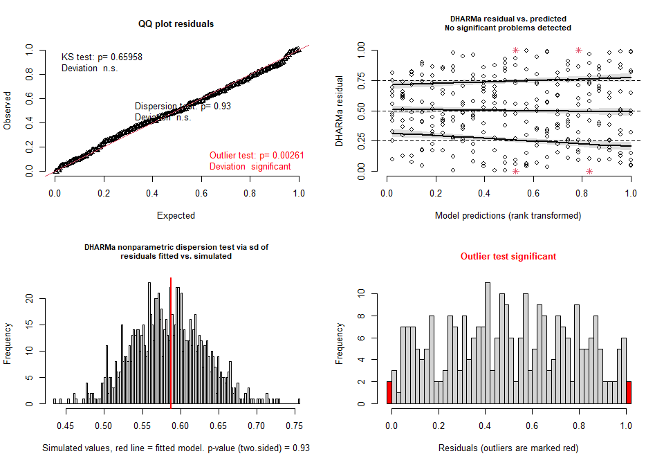<!-- -->

```
## 
## 	DHARMa outlier test based on exact binomial test with approximate
## 	expectations
## 
## data:  simulationOutput
## outliers at both margin(s) = 4, observations = 281, p-value = 0.002613
## alternative hypothesis: true probability of success is not equal to 0.001998002
## 95 percent confidence interval:
##  0.003891785 0.036043857
## sample estimates:
## frequency of outliers (expected: 0.001998001998002 ) 
##                                           0.01423488
```

``` r
DHARMa.sum(Model = lm3)
```

```
## 1. Kolmogorov-Smirnov test indicates deviations of the residuals from uniform distribution. H0: The model fits the data well; Ha: The model does not fit the data well
```

```
## 
## 	Asymptotic one-sample Kolmogorov-Smirnov test
## 
## data:  simulationOutput$scaledResiduals
## D = 0.05542, p-value = 0.354
## alternative hypothesis: two-sided
```

```
## 2. Test for over-dispersion. H0: No over-dispersion in the model; Ha: Over-dispersion in the model
```

```
## 
## 	DHARMa nonparametric dispersion test via sd of residuals fitted vs.
## 	simulated
## 
## data:  simulationOutput
## dispersion = 1.0064, p-value = 0.916
## alternative hypothesis: two.sided
## 
## 3. Test for outliers. H0: No ouliers in the model; Ha: Outliers in the model
```

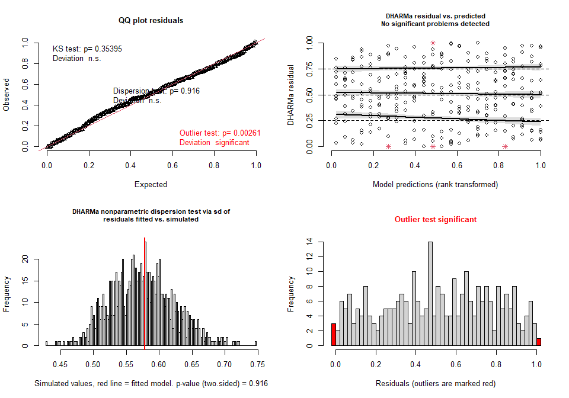<!-- -->

```
## 
## 	DHARMa outlier test based on exact binomial test with approximate
## 	expectations
## 
## data:  simulationOutput
## outliers at both margin(s) = 4, observations = 281, p-value = 0.002613
## alternative hypothesis: true probability of success is not equal to 0.001998002
## 95 percent confidence interval:
##  0.003891785 0.036043857
## sample estimates:
## frequency of outliers (expected: 0.001998001998002 ) 
##                                           0.01423488
```

``` r
DHARMa.sum(Model = lm4)
```

```
## 1. Kolmogorov-Smirnov test indicates deviations of the residuals from uniform distribution. H0: The model fits the data well; Ha: The model does not fit the data well
```

```
## 
## 	Asymptotic one-sample Kolmogorov-Smirnov test
## 
## data:  simulationOutput$scaledResiduals
## D = 0.051391, p-value = 0.4481
## alternative hypothesis: two-sided
```

```
## 2. Test for over-dispersion. H0: No over-dispersion in the model; Ha: Over-dispersion in the model
```

```
## 
## 	DHARMa nonparametric dispersion test via sd of residuals fitted vs.
## 	simulated
## 
## data:  simulationOutput
## dispersion = 1.0072, p-value = 0.93
## alternative hypothesis: two.sided
## 
## 3. Test for outliers. H0: No ouliers in the model; Ha: Outliers in the model
```

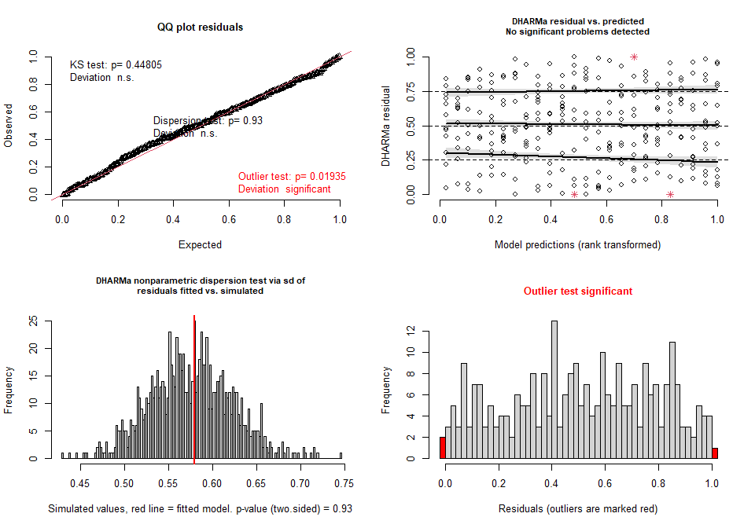<!-- -->

```
## 
## 	DHARMa outlier test based on exact binomial test with approximate
## 	expectations
## 
## data:  simulationOutput
## outliers at both margin(s) = 3, observations = 281, p-value = 0.01935
## alternative hypothesis: true probability of success is not equal to 0.001998002
## 95 percent confidence interval:
##  0.002207115 0.030881510
## sample estimates:
## frequency of outliers (expected: 0.001998001998002 ) 
##                                           0.01067616
```

``` r
DHARMa.sum(Model = lm5)
```

```
## 1. Kolmogorov-Smirnov test indicates deviations of the residuals from uniform distribution. H0: The model fits the data well; Ha: The model does not fit the data well
```

```
## 
## 	Asymptotic one-sample Kolmogorov-Smirnov test
## 
## data:  simulationOutput$scaledResiduals
## D = 0.051566, p-value = 0.4437
## alternative hypothesis: two-sided
```

```
## 2. Test for over-dispersion. H0: No over-dispersion in the model; Ha: Over-dispersion in the model
```

```
## 
## 	DHARMa nonparametric dispersion test via sd of residuals fitted vs.
## 	simulated
## 
## data:  simulationOutput
## dispersion = 1.0064, p-value = 0.916
## alternative hypothesis: two.sided
## 
## 3. Test for outliers. H0: No ouliers in the model; Ha: Outliers in the model
```

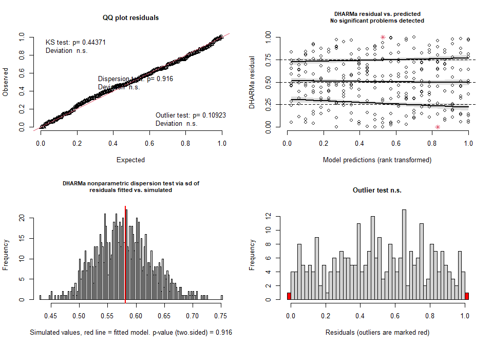<!-- -->

```
## 
## 	DHARMa outlier test based on exact binomial test with approximate
## 	expectations
## 
## data:  simulationOutput
## outliers at both margin(s) = 2, observations = 281, p-value = 0.1092
## alternative hypothesis: true probability of success is not equal to 0.001998002
## 95 percent confidence interval:
##  0.00086312 0.02547272
## sample estimates:
## frequency of outliers (expected: 0.001998001998002 ) 
##                                          0.007117438
```

``` r
DHARMa.sum(Model = lm6)
```

```
## 1. Kolmogorov-Smirnov test indicates deviations of the residuals from uniform distribution. H0: The model fits the data well; Ha: The model does not fit the data well
```

```
## 
## 	Asymptotic one-sample Kolmogorov-Smirnov test
## 
## data:  simulationOutput$scaledResiduals
## D = 0.048036, p-value = 0.5357
## alternative hypothesis: two-sided
```

```
## 2. Test for over-dispersion. H0: No over-dispersion in the model; Ha: Over-dispersion in the model
```

```
## 
## 	DHARMa nonparametric dispersion test via sd of residuals fitted vs.
## 	simulated
## 
## data:  simulationOutput
## dispersion = 1.0072, p-value = 0.93
## alternative hypothesis: two.sided
## 
## 3. Test for outliers. H0: No ouliers in the model; Ha: Outliers in the model
```

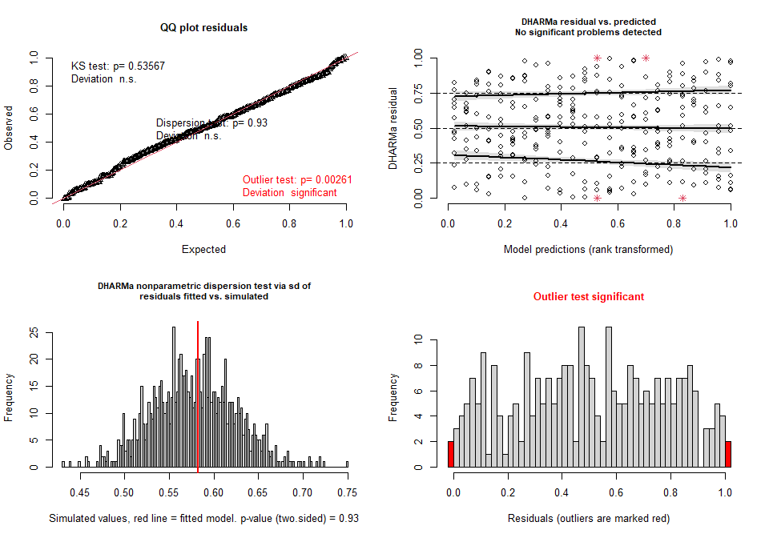<!-- -->

```
## 
## 	DHARMa outlier test based on exact binomial test with approximate
## 	expectations
## 
## data:  simulationOutput
## outliers at both margin(s) = 4, observations = 281, p-value = 0.002613
## alternative hypothesis: true probability of success is not equal to 0.001998002
## 95 percent confidence interval:
##  0.003891785 0.036043857
## sample estimates:
## frequency of outliers (expected: 0.001998001998002 ) 
##                                           0.01423488
```

``` r
DHARMa.sum(Model = glm1)
```

```
## 1. Kolmogorov-Smirnov test indicates deviations of the residuals from uniform distribution. H0: The model fits the data well; Ha: The model does not fit the data well
```

```
## 
## 	Asymptotic one-sample Kolmogorov-Smirnov test
## 
## data:  simulationOutput$scaledResiduals
## D = 0.054861, p-value = 0.3662
## alternative hypothesis: two-sided
```

```
## 2. Test for over-dispersion. H0: No over-dispersion in the model; Ha: Over-dispersion in the model
```

```
## 
## 	DHARMa nonparametric dispersion test via sd of residuals fitted vs.
## 	simulated
## 
## data:  simulationOutput
## dispersion = 1.0124, p-value = 0.804
## alternative hypothesis: two.sided
## 
## 3. Test for outliers. H0: No ouliers in the model; Ha: Outliers in the model
```

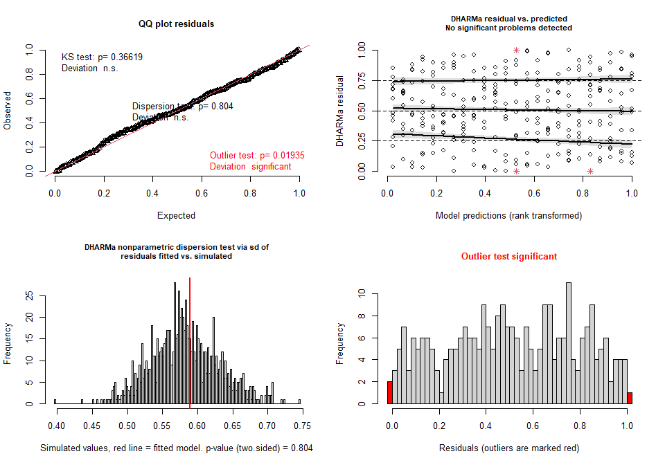<!-- -->

```
## 
## 	DHARMa outlier test based on exact binomial test with approximate
## 	expectations
## 
## data:  simulationOutput
## outliers at both margin(s) = 3, observations = 281, p-value = 0.01935
## alternative hypothesis: true probability of success is not equal to 0.001998002
## 95 percent confidence interval:
##  0.002207115 0.030881510
## sample estimates:
## frequency of outliers (expected: 0.001998001998002 ) 
##                                           0.01067616
```

``` r
DHARMa.sum(Model = glm2)
```

```
## 1. Kolmogorov-Smirnov test indicates deviations of the residuals from uniform distribution. H0: The model fits the data well; Ha: The model does not fit the data well
```

```
## 
## 	Asymptotic one-sample Kolmogorov-Smirnov test
## 
## data:  simulationOutput$scaledResiduals
## D = 0.058153, p-value = 0.298
## alternative hypothesis: two-sided
```

```
## 2. Test for over-dispersion. H0: No over-dispersion in the model; Ha: Over-dispersion in the model
```

```
## 
## 	DHARMa nonparametric dispersion test via sd of residuals fitted vs.
## 	simulated
## 
## data:  simulationOutput
## dispersion = 1.0109, p-value = 0.87
## alternative hypothesis: two.sided
## 
## 3. Test for outliers. H0: No ouliers in the model; Ha: Outliers in the model
```

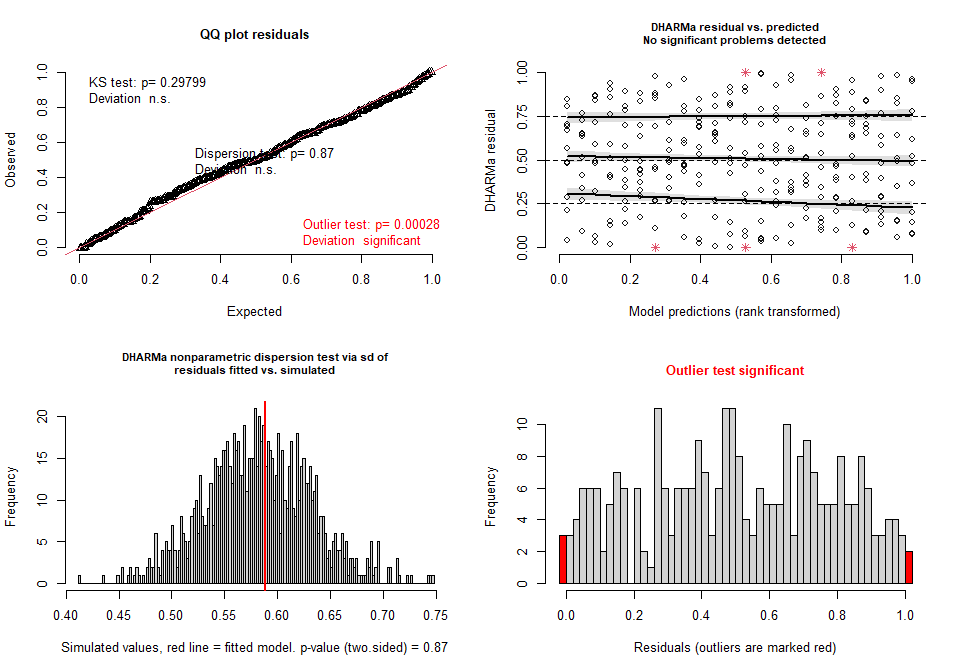<!-- -->

```
## 
## 	DHARMa outlier test based on exact binomial test with approximate
## 	expectations
## 
## data:  simulationOutput
## outliers at both margin(s) = 5, observations = 281, p-value = 0.0002841
## alternative hypothesis: true probability of success is not equal to 0.001998002
## 95 percent confidence interval:
##  0.005802145 0.041033526
## sample estimates:
## frequency of outliers (expected: 0.001998001998002 ) 
##                                           0.01779359
```

``` r
#DHARMa.sum(Model = glm3)
DHARMa.sum(Model = glm4)
```

```
## 1. Kolmogorov-Smirnov test indicates deviations of the residuals from uniform distribution. H0: The model fits the data well; Ha: The model does not fit the data well
```

```
## 
## 	Asymptotic one-sample Kolmogorov-Smirnov test
## 
## data:  simulationOutput$scaledResiduals
## D = 0.06289, p-value = 0.2163
## alternative hypothesis: two-sided
```

```
## 2. Test for over-dispersion. H0: No over-dispersion in the model; Ha: Over-dispersion in the model
```

```
## 
## 	DHARMa nonparametric dispersion test via sd of residuals fitted vs.
## 	simulated
## 
## data:  simulationOutput
## dispersion = 1.0018, p-value = 0.938
## alternative hypothesis: two.sided
## 
## 3. Test for outliers. H0: No ouliers in the model; Ha: Outliers in the model
```

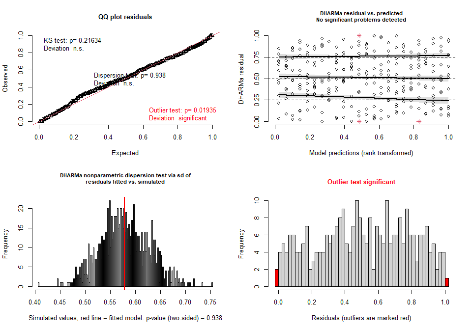<!-- -->

```
## 
## 	DHARMa outlier test based on exact binomial test with approximate
## 	expectations
## 
## data:  simulationOutput
## outliers at both margin(s) = 3, observations = 281, p-value = 0.01935
## alternative hypothesis: true probability of success is not equal to 0.001998002
## 95 percent confidence interval:
##  0.002207115 0.030881510
## sample estimates:
## frequency of outliers (expected: 0.001998001998002 ) 
##                                           0.01067616
```

``` r
DHARMa.sum(Model = glm5)
```

```
## 1. Kolmogorov-Smirnov test indicates deviations of the residuals from uniform distribution. H0: The model fits the data well; Ha: The model does not fit the data well
```

```
## 
## 	Asymptotic one-sample Kolmogorov-Smirnov test
## 
## data:  simulationOutput$scaledResiduals
## D = 0.058861, p-value = 0.2846
## alternative hypothesis: two-sided
```

```
## 2. Test for over-dispersion. H0: No over-dispersion in the model; Ha: Over-dispersion in the model
```

```
## 
## 	DHARMa nonparametric dispersion test via sd of residuals fitted vs.
## 	simulated
## 
## data:  simulationOutput
## dispersion = 1.0034, p-value = 0.934
## alternative hypothesis: two.sided
## 
## 3. Test for outliers. H0: No ouliers in the model; Ha: Outliers in the model
```

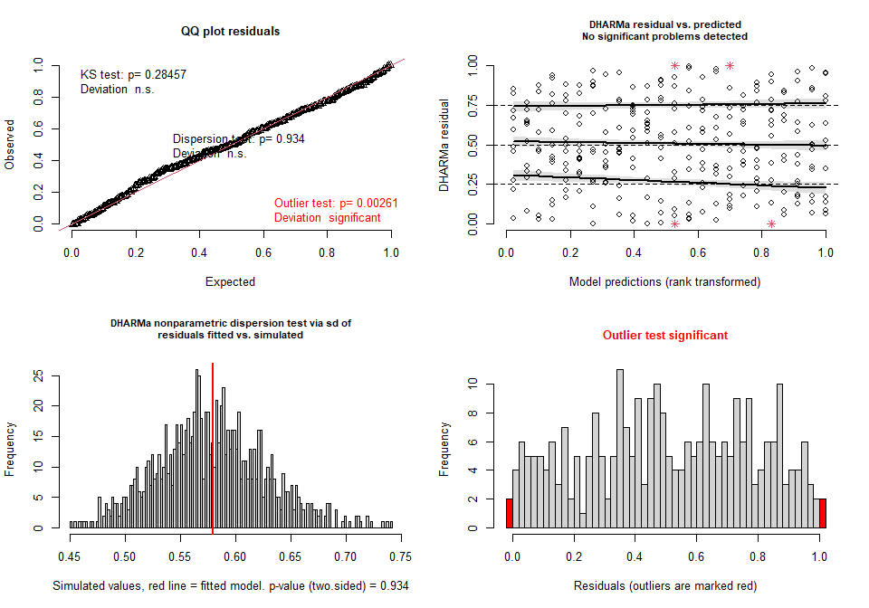<!-- -->

```
## 
## 	DHARMa outlier test based on exact binomial test with approximate
## 	expectations
## 
## data:  simulationOutput
## outliers at both margin(s) = 4, observations = 281, p-value = 0.002613
## alternative hypothesis: true probability of success is not equal to 0.001998002
## 95 percent confidence interval:
##  0.003891785 0.036043857
## sample estimates:
## frequency of outliers (expected: 0.001998001998002 ) 
##                                           0.01423488
```

``` r
DHARMa.sum(Model = glm6)
```

```
## 1. Kolmogorov-Smirnov test indicates deviations of the residuals from uniform distribution. H0: The model fits the data well; Ha: The model does not fit the data well
```

```
## 
## 	Asymptotic one-sample Kolmogorov-Smirnov test
## 
## data:  simulationOutput$scaledResiduals
## D = 0.051918, p-value = 0.435
## alternative hypothesis: two-sided
```

```
## 2. Test for over-dispersion. H0: No over-dispersion in the model; Ha: Over-dispersion in the model
```

```
## 
## 	DHARMa nonparametric dispersion test via sd of residuals fitted vs.
## 	simulated
## 
## data:  simulationOutput
## dispersion = 1.0041, p-value = 0.964
## alternative hypothesis: two.sided
## 
## 3. Test for outliers. H0: No ouliers in the model; Ha: Outliers in the model
```

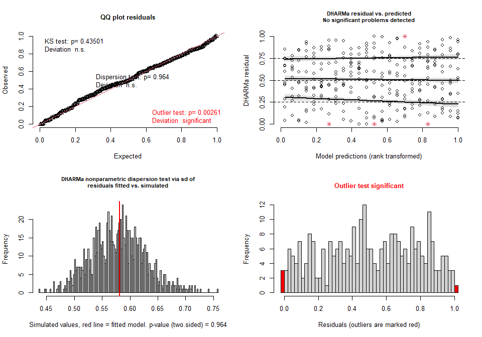<!-- -->

```
## 
## 	DHARMa outlier test based on exact binomial test with approximate
## 	expectations
## 
## data:  simulationOutput
## outliers at both margin(s) = 4, observations = 281, p-value = 0.002613
## alternative hypothesis: true probability of success is not equal to 0.001998002
## 95 percent confidence interval:
##  0.003891785 0.036043857
## sample estimates:
## frequency of outliers (expected: 0.001998001998002 ) 
##                                           0.01423488
```
lm1 or lm5 is best. But lm1 produces some errors so let's use lm5

### Model output

``` r
# #summary(lm1)
# summary(lm2)
# #Anova(lm1)
# Anova(lm2)
# 
# summary(lm3)
# summary(lm4)
# Anova(lm3)
# Anova(lm4)

summary(lm5)
```

```
##  Family: gaussian  ( identity )
## Formula:          sqrt(Observed) ~ Cat_treatment * Accession + (1 | Batch)
## Data: total_diversity
## 
##       AIC       BIC    logLik -2*log(L)  df.resid 
##    1209.6    1304.2    -578.8    1157.6       255 
## 
## Random effects:
## 
## Conditional model:
##  Groups   Name        Variance  Std.Dev. 
##  Batch    (Intercept) 3.281e-09 5.728e-05
##  Residual             3.603e+00 1.898e+00
## Number of obs: 281, groups:  Batch, 2
## 
## Dispersion estimate for gaussian family (sigma^2):  3.6 
## 
## Conditional model:
##                              Estimate Std. Error z value Pr(>|z|)    
## (Intercept)                   39.3418     0.5479   71.80  < 2e-16 ***
## Cat_treatmentMb                0.1939     0.7749    0.25 0.802429    
## AccessionDD                   -3.1241     0.8127   -3.84 0.000121 ***
## AccessionHE                   -0.5018     0.7923   -0.63 0.526555    
## AccessionKI                    0.5469     0.7749    0.71 0.480312    
## AccessionVL                   -0.1561     0.7749   -0.20 0.840348    
## AccessionCD                   -3.2203     0.7923   -4.06 4.82e-05 ***
## AccessionRI                    0.8841     0.7749    1.14 0.253925    
## AccessionKT                    3.0314     0.7749    3.91 9.15e-05 ***
## AccessionMC                    0.7559     0.7749    0.98 0.329345    
## AccessionHM                    1.3809     0.7749    1.78 0.074748 .  
## AccessionIT1                   0.7205     0.7749    0.93 0.352487    
## AccessionGO1                  -1.2564     0.7923   -1.59 0.112814    
## Cat_treatmentMb:AccessionDD    0.1733     1.1229    0.15 0.877359    
## Cat_treatmentMb:AccessionHE   -1.0288     1.1083   -0.93 0.353246    
## Cat_treatmentMb:AccessionKI    0.5305     1.1083    0.48 0.632145    
## Cat_treatmentMb:AccessionVL    0.5222     1.1083    0.47 0.637481    
## Cat_treatmentMb:AccessionCD   -0.4213     1.1083   -0.38 0.703844    
## Cat_treatmentMb:AccessionRI   -0.3103     1.0959   -0.28 0.777079    
## Cat_treatmentMb:AccessionKT   -1.9304     1.0959   -1.76 0.078146 .  
## Cat_treatmentMb:AccessionMC   -0.6814     1.0959   -0.62 0.534091    
## Cat_treatmentMb:AccessionHM   -1.7360     1.0959   -1.58 0.113171    
## Cat_treatmentMb:AccessionIT1  -0.4944     1.0959   -0.45 0.651890    
## Cat_treatmentMb:AccessionGO1  -0.9557     1.1083   -0.86 0.388512    
## ---
## Signif. codes:  0 '***' 0.001 '**' 0.01 '*' 0.05 '.' 0.1 ' ' 1
```

``` r
# summary(lm6)
Anova(lm5)
```

```
## Analysis of Deviance Table (Type II Wald chisquare tests)
## 
## Response: sqrt(Observed)
##                            Chisq Df Pr(>Chisq)    
## Cat_treatment             2.3045  1     0.1290    
## Accession               188.9157 11     <2e-16 ***
## Cat_treatment:Accession  11.2834 11     0.4198    
## ---
## Signif. codes:  0 '***' 0.001 '**' 0.01 '*' 0.05 '.' 0.1 ' ' 1
```

``` r
# Anova(lm6)

Alphadiv_obs_Acc_CP <- as.data.frame(Anova(lm5))
write.csv(Alphadiv_obs_Acc_CP, "C:/Users/kreek001/OneDrive - Wageningen University & Research/Chapters/Experimental Chapter 3/RScripts/GitHub/TwelveAccessionExperiment/MicrobiomeAnalysis/Data/Statistical_output/CP/Alphadiv_obs_Acc_CP.csv" )

# summary(glm1)
# summary(glm2)
# Anova(glm1)
# Anova(glm2)
# 
# #summary(glm3)
# summary(glm4)
# #Anova(glm3)
# Anova(glm4)
# 
# summary(glm5)
# summary(glm6)
# Anova(glm5)
# Anova(glm6)
```

### Post hoc test

``` r
emmeans(lm5, pairwise ~ Accession)
```

```
## NOTE: Results may be misleading due to involvement in interactions
```

```
## $emmeans
##  Accession emmean    SE  df asymp.LCL asymp.UCL
##  OH          39.4 0.387 Inf      38.7      40.2
##  DD          36.4 0.406 Inf      35.6      37.2
##  HE          38.4 0.396 Inf      37.6      39.2
##  KI          40.3 0.396 Inf      39.5      41.0
##  VL          39.5 0.396 Inf      38.8      40.3
##  CD          36.0 0.396 Inf      35.2      36.8
##  RI          40.2 0.387 Inf      39.4      40.9
##  KT          41.5 0.387 Inf      40.7      42.3
##  MC          39.9 0.387 Inf      39.1      40.6
##  HM          40.0 0.387 Inf      39.2      40.7
##  IT1         39.9 0.387 Inf      39.2      40.7
##  GO1         37.7 0.396 Inf      36.9      38.5
## 
## Results are averaged over the levels of: Cat_treatment 
## Results are given on the sqrt (not the response) scale. 
## Confidence level used: 0.95 
## 
## $contrasts
##  contrast  estimate    SE  df z.ratio p.value
##  OH - DD     3.0375 0.561 Inf   5.410  <.0001
##  OH - HE     1.0162 0.554 Inf   1.834  0.7995
##  OH - KI    -0.8122 0.554 Inf  -1.466  0.9498
##  OH - VL    -0.1050 0.554 Inf  -0.190  1.0000
##  OH - CD     3.4309 0.554 Inf   6.192  <.0001
##  OH - RI    -0.7289 0.548 Inf  -1.330  0.9753
##  OH - KT    -2.0662 0.548 Inf  -3.771  0.0089
##  OH - MC    -0.4152 0.548 Inf  -0.758  0.9998
##  OH - HM    -0.5129 0.548 Inf  -0.936  0.9988
##  OH - IT1   -0.4733 0.548 Inf  -0.864  0.9994
##  OH - GO1    1.7342 0.554 Inf   3.130  0.0756
##  DD - HE    -2.0213 0.568 Inf  -3.562  0.0190
##  DD - KI    -3.8497 0.568 Inf  -6.783  <.0001
##  DD - VL    -3.1425 0.568 Inf  -5.537  <.0001
##  DD - CD     0.3934 0.568 Inf   0.693  0.9999
##  DD - RI    -3.7664 0.561 Inf  -6.708  <.0001
##  DD - KT    -5.1037 0.561 Inf  -9.090  <.0001
##  DD - MC    -3.4527 0.561 Inf  -6.149  <.0001
##  DD - HM    -3.5504 0.561 Inf  -6.323  <.0001
##  DD - IT1   -3.5108 0.561 Inf  -6.253  <.0001
##  DD - GO1   -1.3033 0.568 Inf  -2.296  0.4790
##  HE - KI    -1.8284 0.560 Inf  -3.263  0.0507
##  HE - VL    -1.1212 0.560 Inf  -2.001  0.6928
##  HE - CD     2.4148 0.560 Inf   4.310  0.0010
##  HE - RI    -1.7451 0.554 Inf  -3.149  0.0714
##  HE - KT    -3.0824 0.554 Inf  -5.562  <.0001
##  HE - MC    -1.4313 0.554 Inf  -2.583  0.2892
##  HE - HM    -1.5291 0.554 Inf  -2.759  0.1977
##  HE - IT1   -1.4895 0.554 Inf  -2.688  0.2321
##  HE - GO1    0.7180 0.560 Inf   1.282  0.9815
##  KI - VL     0.7072 0.560 Inf   1.262  0.9836
##  KI - CD     4.2431 0.560 Inf   7.574  <.0001
##  KI - RI     0.0833 0.554 Inf   0.150  1.0000
##  KI - KT    -1.2540 0.554 Inf  -2.263  0.5034
##  KI - MC     0.3970 0.554 Inf   0.716  0.9999
##  KI - HM     0.2993 0.554 Inf   0.540  1.0000
##  KI - IT1    0.3389 0.554 Inf   0.612  1.0000
##  KI - GO1    2.5464 0.560 Inf   4.545  0.0003
##  VL - CD     3.5359 0.560 Inf   6.311  <.0001
##  VL - RI    -0.6239 0.554 Inf  -1.126  0.9936
##  VL - KT    -1.9612 0.554 Inf  -3.539  0.0206
##  VL - MC    -0.3102 0.554 Inf  -0.560  1.0000
##  VL - HM    -0.4079 0.554 Inf  -0.736  0.9999
##  VL - IT1   -0.3683 0.554 Inf  -0.665  1.0000
##  VL - GO1    1.8392 0.560 Inf   3.283  0.0478
##  CD - RI    -4.1598 0.554 Inf  -7.507  <.0001
##  CD - KT    -5.4971 0.554 Inf  -9.920  <.0001
##  CD - MC    -3.8461 0.554 Inf  -6.941  <.0001
##  CD - HM    -3.9438 0.554 Inf  -7.117  <.0001
##  CD - IT1   -3.9042 0.554 Inf  -7.046  <.0001
##  CD - GO1   -1.6967 0.560 Inf  -3.028  0.1003
##  RI - KT    -1.3373 0.548 Inf  -2.441  0.3784
##  RI - MC     0.3138 0.548 Inf   0.573  1.0000
##  RI - HM     0.2160 0.548 Inf   0.394  1.0000
##  RI - IT1    0.2556 0.548 Inf   0.467  1.0000
##  RI - GO1    2.4631 0.554 Inf   4.445  0.0005
##  KT - MC     1.6510 0.548 Inf   3.013  0.1046
##  KT - HM     1.5533 0.548 Inf   2.835  0.1654
##  KT - IT1    1.5929 0.548 Inf   2.907  0.1382
##  KT - GO1    3.8004 0.554 Inf   6.858  <.0001
##  MC - HM    -0.0977 0.548 Inf  -0.178  1.0000
##  MC - IT1   -0.0581 0.548 Inf  -0.106  1.0000
##  MC - GO1    2.1494 0.554 Inf   3.879  0.0059
##  HM - IT1    0.0396 0.548 Inf   0.072  1.0000
##  HM - GO1    2.2471 0.554 Inf   4.055  0.0029
##  IT1 - GO1   2.2075 0.554 Inf   3.984  0.0039
## 
## Results are averaged over the levels of: Cat_treatment 
## Note: contrasts are still on the sqrt scale. Consider using
##       regrid() if you want contrasts of back-transformed estimates. 
## P value adjustment: tukey method for comparing a family of 12 estimates
```

``` r
ph_obs <- cld(emmeans(lm5, pairwise ~ Accession), Letters = letters)
```

```
## NOTE: Results may be misleading due to involvement in interactions
```

``` r
print(ph_obs)
```

```
##  Accession emmean    SE  df asymp.LCL asymp.UCL .group
##  CD          36.0 0.396 Inf      35.2      36.8  a    
##  DD          36.4 0.406 Inf      35.6      37.2  a    
##  GO1         37.7 0.396 Inf      36.9      38.5  ab   
##  HE          38.4 0.396 Inf      37.6      39.2   bc  
##  OH          39.4 0.387 Inf      38.7      40.2   bc  
##  VL          39.5 0.396 Inf      38.8      40.3    c  
##  MC          39.9 0.387 Inf      39.1      40.6    cd 
##  IT1         39.9 0.387 Inf      39.2      40.7    cd 
##  HM          40.0 0.387 Inf      39.2      40.7    cd 
##  RI          40.2 0.387 Inf      39.4      40.9    cd 
##  KI          40.3 0.396 Inf      39.5      41.0    cd 
##  KT          41.5 0.387 Inf      40.7      42.3     d 
## 
## Results are averaged over the levels of: Cat_treatment 
## Results are given on the sqrt (not the response) scale. 
## Confidence level used: 0.95 
## Note: contrasts are still on the sqrt scale. Consider using
##       regrid() if you want contrasts of back-transformed estimates. 
## P value adjustment: tukey method for comparing a family of 12 estimates 
## significance level used: alpha = 0.05 
## NOTE: If two or more means share the same grouping symbol,
##       then we cannot show them to be different.
##       But we also did not show them to be the same.
```


``` r
rm(lm1, lm2, lm3, lm4, lm5, lm6, glm1, glm2, glm3, glm4, glm5, glm6)
```

```
## Warning in rm(lm1, lm2, lm3, lm4, lm5, lm6, glm1, glm2, glm3, glm4, glm5, :
## object 'lm1' not found
```

```
## Warning in rm(lm1, lm2, lm3, lm4, lm5, lm6, glm1, glm2, glm3, glm4, glm5, :
## object 'glm3' not found
```

## Statistics Shannon index
### Defining model

``` r
lm1 <- glmmTMB(data = total_diversity, formula = Shannon ~ Cat_treatment * Accession + (1 | Batch), family = gaussian(link = "identity"))
lm2 <- glmmTMB(data = total_diversity, formula = Shannon ~ Cat_treatment * Accession, family = gaussian(link = "identity"))

lm3 <- glmmTMB(data = total_diversity, formula = log(Shannon) ~ Cat_treatment + Accession + (1 | Batch), family = gaussian(link = "identity"))
lm4 <- glmmTMB(data = total_diversity, formula = log(Shannon) ~ Cat_treatment + Accession, family = gaussian(link = "identity"))
  # * changed to +

lm5 <- glmmTMB(data = total_diversity, formula = sqrt(Shannon) ~ Cat_treatment + Accession + (1 | Batch), family = gaussian(link = "identity"))
lm6 <- glmmTMB(data = total_diversity, formula = sqrt(Shannon) ~ Cat_treatment * Accession, family = gaussian(link = "identity"))
  # * changed to +

glm1 <- glmmTMB(data = total_diversity, formula = Shannon ~ Cat_treatment + Accession + (1 | Batch), family = Gamma(link = "log"))
glm2 <- glmmTMB(data = total_diversity, formula = Shannon + 2 ~ Cat_treatment * Accession, family = Gamma(link = "log"))
```

```
## Warning in finalizeTMB(TMBStruc, obj, fit, h, data.tmb.old): Model convergence
## problem; function evaluation limit reached without convergence (9). See
## vignette('troubleshooting'), help('diagnose')
```

``` r
  # * changed to +

glm3 <- glmmTMB(data = total_diversity, formula = log(Shannon + 2) ~ Cat_treatment + Accession + (1 | Batch), family = Gamma(link = "log"))
glm4 <- glmmTMB(data = total_diversity, formula = log(Shannon) ~ Cat_treatment + Accession, family = Gamma(link = "log"))
  # * changed to +

glm5 <- glmmTMB(data = total_diversity, formula = sqrt(Shannon) ~ Cat_treatment + Accession + (1 | Batch), family = Gamma(link = "log"))
glm6 <- glmmTMB(data = total_diversity, formula = sqrt(Shannon) ~ Cat_treatment + Accession, family = Gamma(link = "log"))
  # * changed to +
```

### Model assumptions

``` r
DHARMa.sum(Model = lm1)
```

```
## 1. Kolmogorov-Smirnov test indicates deviations of the residuals from uniform distribution. H0: The model fits the data well; Ha: The model does not fit the data well
```

```
## 
## 	Asymptotic one-sample Kolmogorov-Smirnov test
## 
## data:  simulationOutput$scaledResiduals
## D = 0.05463, p-value = 0.3713
## alternative hypothesis: two-sided
```

```
## 2. Test for over-dispersion. H0: No over-dispersion in the model; Ha: Over-dispersion in the model
```

```
## 
## 	DHARMa nonparametric dispersion test via sd of residuals fitted vs.
## 	simulated
## 
## data:  simulationOutput
## dispersion = 1.0064, p-value = 0.916
## alternative hypothesis: two.sided
## 
## 3. Test for outliers. H0: No ouliers in the model; Ha: Outliers in the model
```

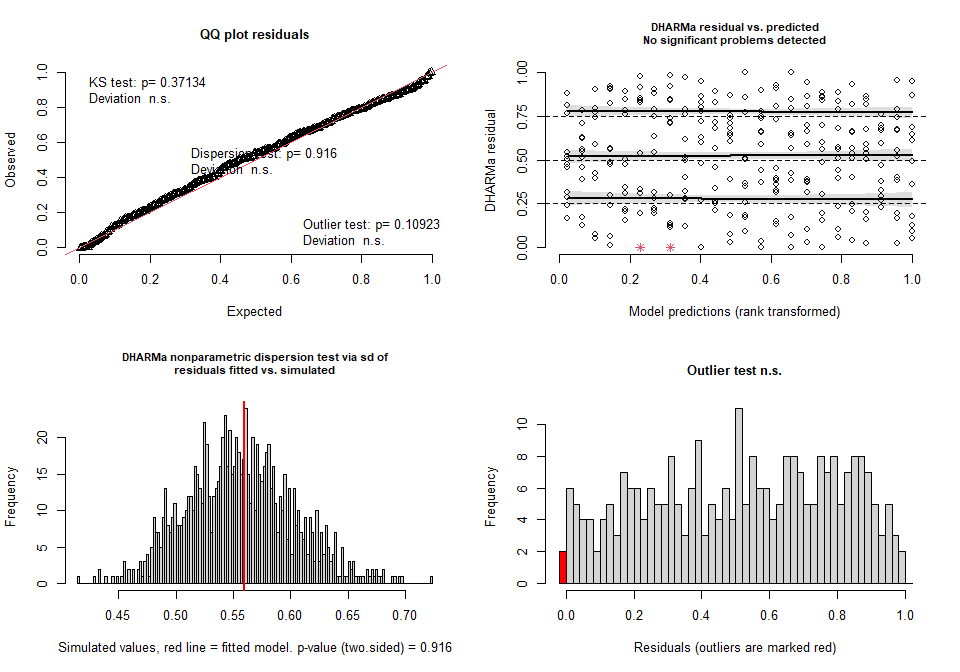<!-- -->

```
## 
## 	DHARMa outlier test based on exact binomial test with approximate
## 	expectations
## 
## data:  simulationOutput
## outliers at both margin(s) = 2, observations = 281, p-value = 0.1092
## alternative hypothesis: true probability of success is not equal to 0.001998002
## 95 percent confidence interval:
##  0.00086312 0.02547272
## sample estimates:
## frequency of outliers (expected: 0.001998001998002 ) 
##                                          0.007117438
```

``` r
DHARMa.sum(Model = lm2)
```

```
## 1. Kolmogorov-Smirnov test indicates deviations of the residuals from uniform distribution. H0: The model fits the data well; Ha: The model does not fit the data well
```

```
## 
## 	Asymptotic one-sample Kolmogorov-Smirnov test
## 
## data:  simulationOutput$scaledResiduals
## D = 0.050278, p-value = 0.4763
## alternative hypothesis: two-sided
```

```
## 2. Test for over-dispersion. H0: No over-dispersion in the model; Ha: Over-dispersion in the model
```

```
## 
## 	DHARMa nonparametric dispersion test via sd of residuals fitted vs.
## 	simulated
## 
## data:  simulationOutput
## dispersion = 1.0072, p-value = 0.93
## alternative hypothesis: two.sided
## 
## 3. Test for outliers. H0: No ouliers in the model; Ha: Outliers in the model
```

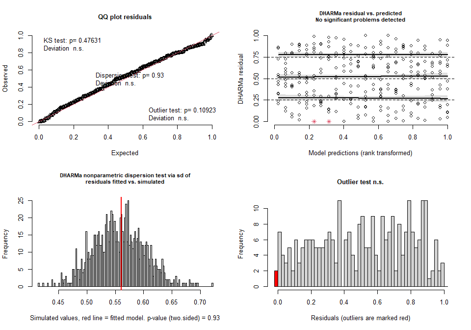<!-- -->

```
## 
## 	DHARMa outlier test based on exact binomial test with approximate
## 	expectations
## 
## data:  simulationOutput
## outliers at both margin(s) = 2, observations = 281, p-value = 0.1092
## alternative hypothesis: true probability of success is not equal to 0.001998002
## 95 percent confidence interval:
##  0.00086312 0.02547272
## sample estimates:
## frequency of outliers (expected: 0.001998001998002 ) 
##                                          0.007117438
```

``` r
DHARMa.sum(Model = lm3)
```

```
## 1. Kolmogorov-Smirnov test indicates deviations of the residuals from uniform distribution. H0: The model fits the data well; Ha: The model does not fit the data well
```

```
## 
## 	Asymptotic one-sample Kolmogorov-Smirnov test
## 
## data:  simulationOutput$scaledResiduals
## D = 0.060395, p-value = 0.2569
## alternative hypothesis: two-sided
```

```
## 2. Test for over-dispersion. H0: No over-dispersion in the model; Ha: Over-dispersion in the model
```

```
## 
## 	DHARMa nonparametric dispersion test via sd of residuals fitted vs.
## 	simulated
## 
## data:  simulationOutput
## dispersion = 1.0064, p-value = 0.916
## alternative hypothesis: two.sided
## 
## 3. Test for outliers. H0: No ouliers in the model; Ha: Outliers in the model
```

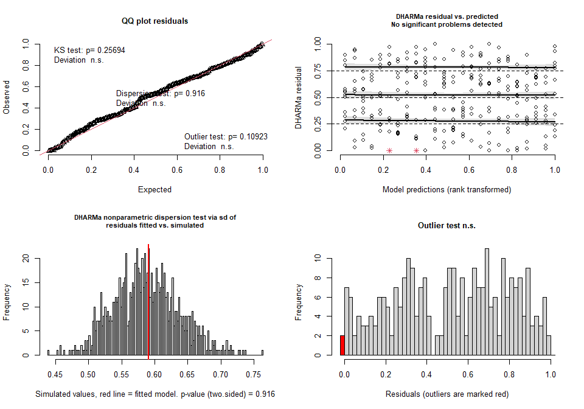<!-- -->

```
## 
## 	DHARMa outlier test based on exact binomial test with approximate
## 	expectations
## 
## data:  simulationOutput
## outliers at both margin(s) = 2, observations = 281, p-value = 0.1092
## alternative hypothesis: true probability of success is not equal to 0.001998002
## 95 percent confidence interval:
##  0.00086312 0.02547272
## sample estimates:
## frequency of outliers (expected: 0.001998001998002 ) 
##                                          0.007117438
```

``` r
DHARMa.sum(Model = lm4)
```

```
## 1. Kolmogorov-Smirnov test indicates deviations of the residuals from uniform distribution. H0: The model fits the data well; Ha: The model does not fit the data well
```

```
## 
## 	Asymptotic one-sample Kolmogorov-Smirnov test
## 
## data:  simulationOutput$scaledResiduals
## D = 0.055594, p-value = 0.3502
## alternative hypothesis: two-sided
```

```
## 2. Test for over-dispersion. H0: No over-dispersion in the model; Ha: Over-dispersion in the model
```

```
## 
## 	DHARMa nonparametric dispersion test via sd of residuals fitted vs.
## 	simulated
## 
## data:  simulationOutput
## dispersion = 1.0072, p-value = 0.93
## alternative hypothesis: two.sided
## 
## 3. Test for outliers. H0: No ouliers in the model; Ha: Outliers in the model
```

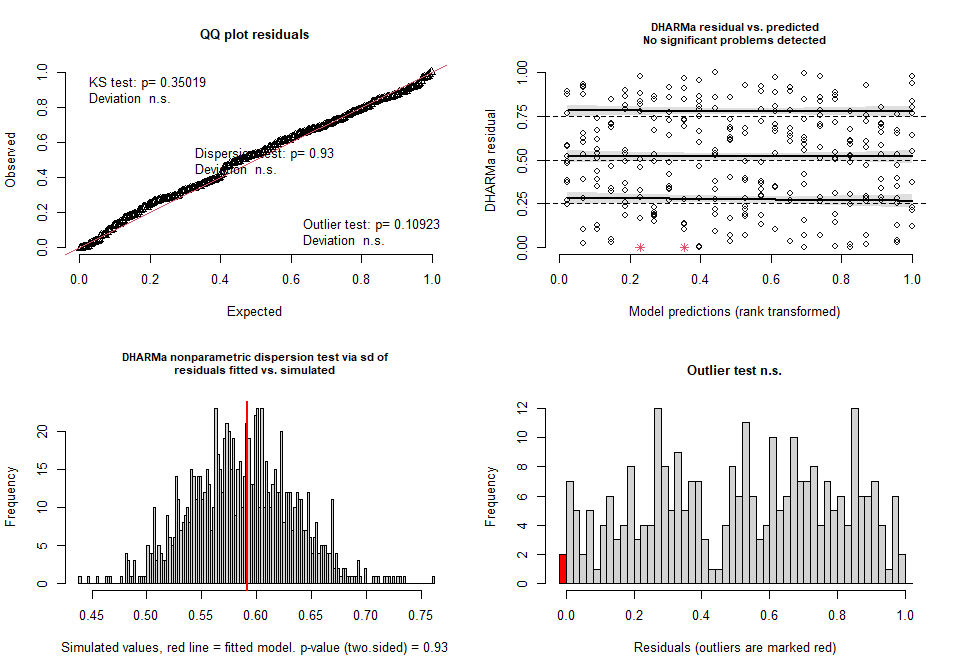<!-- -->

```
## 
## 	DHARMa outlier test based on exact binomial test with approximate
## 	expectations
## 
## data:  simulationOutput
## outliers at both margin(s) = 2, observations = 281, p-value = 0.1092
## alternative hypothesis: true probability of success is not equal to 0.001998002
## 95 percent confidence interval:
##  0.00086312 0.02547272
## sample estimates:
## frequency of outliers (expected: 0.001998001998002 ) 
##                                          0.007117438
```

``` r
DHARMa.sum(Model = lm5)
```

```
## 1. Kolmogorov-Smirnov test indicates deviations of the residuals from uniform distribution. H0: The model fits the data well; Ha: The model does not fit the data well
```

```
## 
## 	Asymptotic one-sample Kolmogorov-Smirnov test
## 
## data:  simulationOutput$scaledResiduals
## D = 0.060395, p-value = 0.2569
## alternative hypothesis: two-sided
```

```
## 2. Test for over-dispersion. H0: No over-dispersion in the model; Ha: Over-dispersion in the model
```

```
## 
## 	DHARMa nonparametric dispersion test via sd of residuals fitted vs.
## 	simulated
## 
## data:  simulationOutput
## dispersion = 1.0064, p-value = 0.916
## alternative hypothesis: two.sided
## 
## 3. Test for outliers. H0: No ouliers in the model; Ha: Outliers in the model
```

<!-- -->

```
## 
## 	DHARMa outlier test based on exact binomial test with approximate
## 	expectations
## 
## data:  simulationOutput
## outliers at both margin(s) = 2, observations = 281, p-value = 0.1092
## alternative hypothesis: true probability of success is not equal to 0.001998002
## 95 percent confidence interval:
##  0.00086312 0.02547272
## sample estimates:
## frequency of outliers (expected: 0.001998001998002 ) 
##                                          0.007117438
```

``` r
DHARMa.sum(Model = lm6)
```

```
## 1. Kolmogorov-Smirnov test indicates deviations of the residuals from uniform distribution. H0: The model fits the data well; Ha: The model does not fit the data well
```

```
## 
## 	Asymptotic one-sample Kolmogorov-Smirnov test
## 
## data:  simulationOutput$scaledResiduals
## D = 0.051836, p-value = 0.437
## alternative hypothesis: two-sided
```

```
## 2. Test for over-dispersion. H0: No over-dispersion in the model; Ha: Over-dispersion in the model
```

```
## 
## 	DHARMa nonparametric dispersion test via sd of residuals fitted vs.
## 	simulated
## 
## data:  simulationOutput
## dispersion = 1.0072, p-value = 0.93
## alternative hypothesis: two.sided
## 
## 3. Test for outliers. H0: No ouliers in the model; Ha: Outliers in the model
```

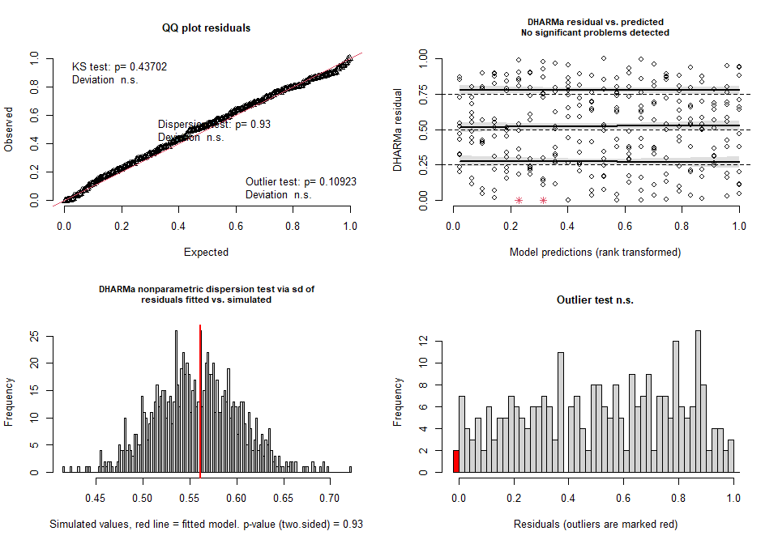<!-- -->

```
## 
## 	DHARMa outlier test based on exact binomial test with approximate
## 	expectations
## 
## data:  simulationOutput
## outliers at both margin(s) = 2, observations = 281, p-value = 0.1092
## alternative hypothesis: true probability of success is not equal to 0.001998002
## 95 percent confidence interval:
##  0.00086312 0.02547272
## sample estimates:
## frequency of outliers (expected: 0.001998001998002 ) 
##                                          0.007117438
```

``` r
DHARMa.sum(Model = glm1)
```

```
## 1. Kolmogorov-Smirnov test indicates deviations of the residuals from uniform distribution. H0: The model fits the data well; Ha: The model does not fit the data well
```

```
## 
## 	Asymptotic one-sample Kolmogorov-Smirnov test
## 
## data:  simulationOutput$scaledResiduals
## D = 0.053594, p-value = 0.3949
## alternative hypothesis: two-sided
```

```
## 2. Test for over-dispersion. H0: No over-dispersion in the model; Ha: Over-dispersion in the model
```

```
## 
## 	DHARMa nonparametric dispersion test via sd of residuals fitted vs.
## 	simulated
## 
## data:  simulationOutput
## dispersion = 0.99834, p-value = 0.994
## alternative hypothesis: two.sided
## 
## 3. Test for outliers. H0: No ouliers in the model; Ha: Outliers in the model
```

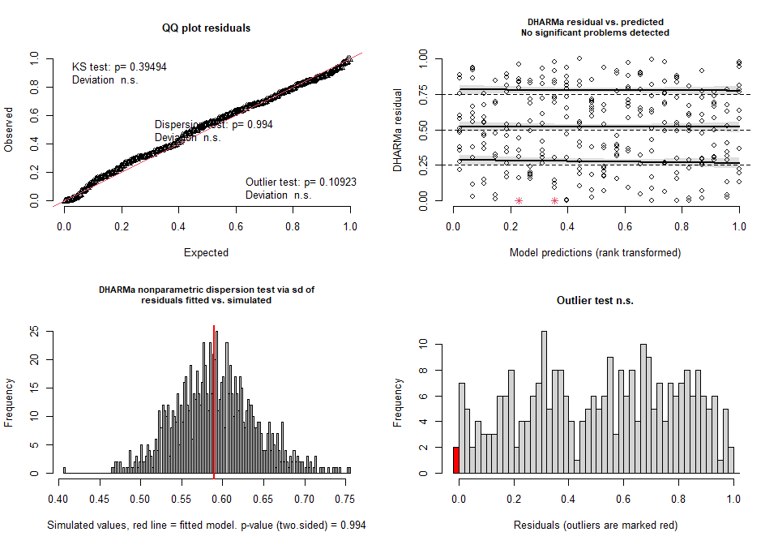<!-- -->

```
## 
## 	DHARMa outlier test based on exact binomial test with approximate
## 	expectations
## 
## data:  simulationOutput
## outliers at both margin(s) = 2, observations = 281, p-value = 0.1092
## alternative hypothesis: true probability of success is not equal to 0.001998002
## 95 percent confidence interval:
##  0.00086312 0.02547272
## sample estimates:
## frequency of outliers (expected: 0.001998001998002 ) 
##                                          0.007117438
```

``` r
DHARMa.sum(Model = glm2)
```

```
## 1. Kolmogorov-Smirnov test indicates deviations of the residuals from uniform distribution. H0: The model fits the data well; Ha: The model does not fit the data well
```

```
## 
## 	Asymptotic one-sample Kolmogorov-Smirnov test
## 
## data:  simulationOutput$scaledResiduals
## D = 0.050278, p-value = 0.4763
## alternative hypothesis: two-sided
```

```
## 2. Test for over-dispersion. H0: No over-dispersion in the model; Ha: Over-dispersion in the model
```

```
## 
## 	DHARMa nonparametric dispersion test via sd of residuals fitted vs.
## 	simulated
## 
## data:  simulationOutput
## dispersion = 0.99878, p-value = 0.992
## alternative hypothesis: two.sided
## 
## 3. Test for outliers. H0: No ouliers in the model; Ha: Outliers in the model
```

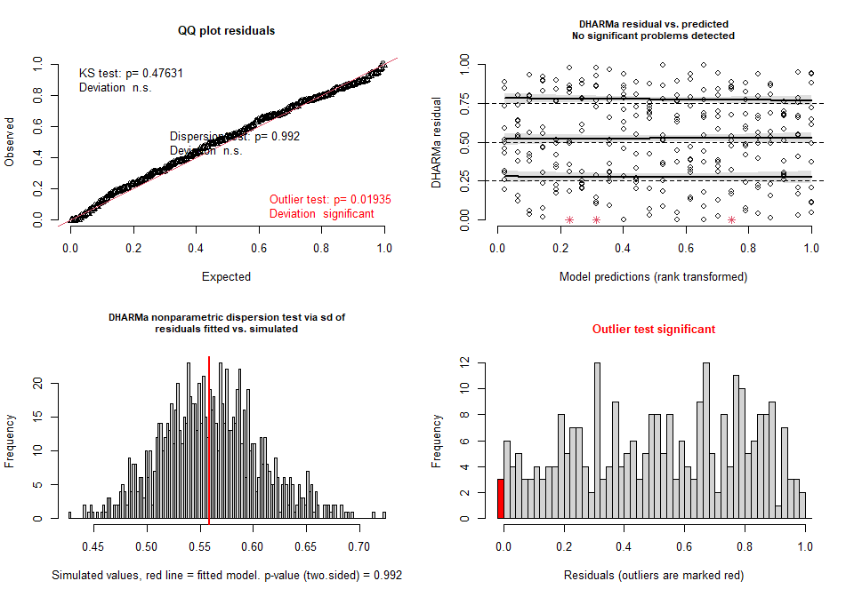<!-- -->

```
## 
## 	DHARMa outlier test based on exact binomial test with approximate
## 	expectations
## 
## data:  simulationOutput
## outliers at both margin(s) = 3, observations = 281, p-value = 0.01935
## alternative hypothesis: true probability of success is not equal to 0.001998002
## 95 percent confidence interval:
##  0.002207115 0.030881510
## sample estimates:
## frequency of outliers (expected: 0.001998001998002 ) 
##                                           0.01067616
```

``` r
DHARMa.sum(Model = glm3)
```

```
## 1. Kolmogorov-Smirnov test indicates deviations of the residuals from uniform distribution. H0: The model fits the data well; Ha: The model does not fit the data well
```

```
## 
## 	Asymptotic one-sample Kolmogorov-Smirnov test
## 
## data:  simulationOutput$scaledResiduals
## D = 0.061395, p-value = 0.24
## alternative hypothesis: two-sided
```

```
## 2. Test for over-dispersion. H0: No over-dispersion in the model; Ha: Over-dispersion in the model
```

```
## 
## 	DHARMa nonparametric dispersion test via sd of residuals fitted vs.
## 	simulated
## 
## data:  simulationOutput
## dispersion = 1.0011, p-value = 0.974
## alternative hypothesis: two.sided
## 
## 3. Test for outliers. H0: No ouliers in the model; Ha: Outliers in the model
```

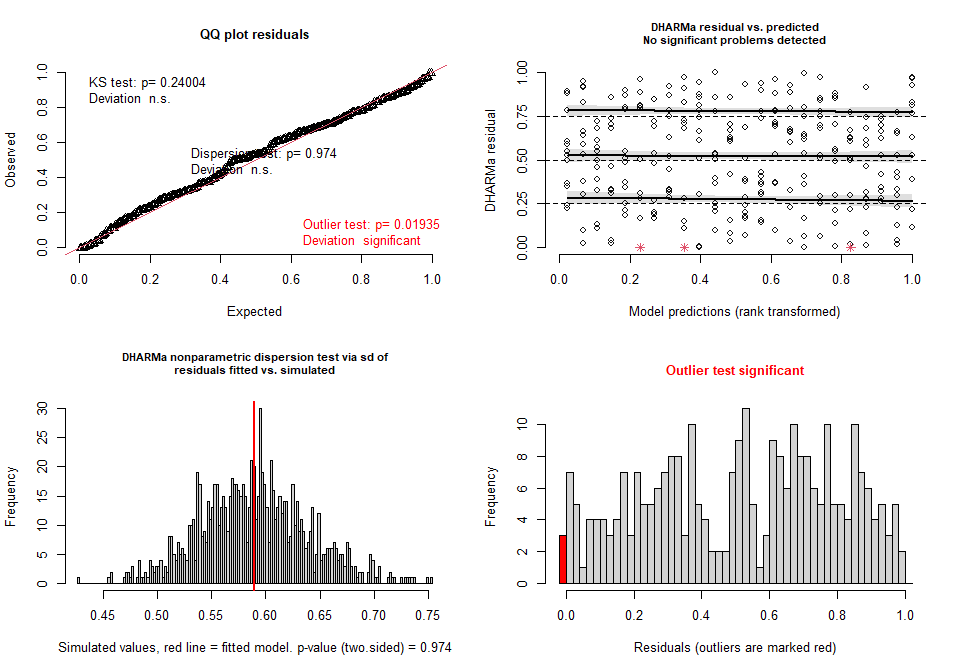<!-- -->

```
## 
## 	DHARMa outlier test based on exact binomial test with approximate
## 	expectations
## 
## data:  simulationOutput
## outliers at both margin(s) = 3, observations = 281, p-value = 0.01935
## alternative hypothesis: true probability of success is not equal to 0.001998002
## 95 percent confidence interval:
##  0.002207115 0.030881510
## sample estimates:
## frequency of outliers (expected: 0.001998001998002 ) 
##                                           0.01067616
```

``` r
DHARMa.sum(Model = glm4)
```

```
## 1. Kolmogorov-Smirnov test indicates deviations of the residuals from uniform distribution. H0: The model fits the data well; Ha: The model does not fit the data well
```

```
## 
## 	Asymptotic one-sample Kolmogorov-Smirnov test
## 
## data:  simulationOutput$scaledResiduals
## D = 0.05827, p-value = 0.2957
## alternative hypothesis: two-sided
```

```
## 2. Test for over-dispersion. H0: No over-dispersion in the model; Ha: Over-dispersion in the model
```

```
## 
## 	DHARMa nonparametric dispersion test via sd of residuals fitted vs.
## 	simulated
## 
## data:  simulationOutput
## dispersion = 1, p-value = 1
## alternative hypothesis: two.sided
## 
## 3. Test for outliers. H0: No ouliers in the model; Ha: Outliers in the model
```

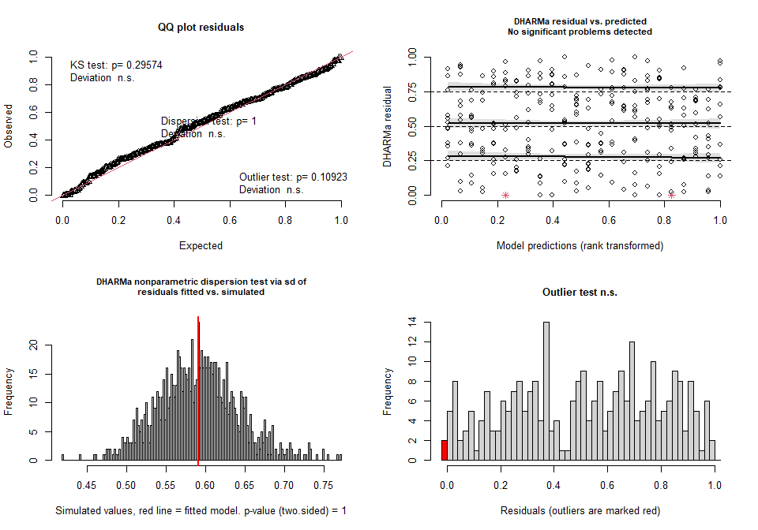<!-- -->

```
## 
## 	DHARMa outlier test based on exact binomial test with approximate
## 	expectations
## 
## data:  simulationOutput
## outliers at both margin(s) = 2, observations = 281, p-value = 0.1092
## alternative hypothesis: true probability of success is not equal to 0.001998002
## 95 percent confidence interval:
##  0.00086312 0.02547272
## sample estimates:
## frequency of outliers (expected: 0.001998001998002 ) 
##                                          0.007117438
```

``` r
DHARMa.sum(Model = glm5)
```

```
## 1. Kolmogorov-Smirnov test indicates deviations of the residuals from uniform distribution. H0: The model fits the data well; Ha: The model does not fit the data well
```

```
## 
## 	Asymptotic one-sample Kolmogorov-Smirnov test
## 
## data:  simulationOutput$scaledResiduals
## D = 0.060395, p-value = 0.2569
## alternative hypothesis: two-sided
```

```
## 2. Test for over-dispersion. H0: No over-dispersion in the model; Ha: Over-dispersion in the model
```

```
## 
## 	DHARMa nonparametric dispersion test via sd of residuals fitted vs.
## 	simulated
## 
## data:  simulationOutput
## dispersion = 1.0003, p-value = 0.994
## alternative hypothesis: two.sided
## 
## 3. Test for outliers. H0: No ouliers in the model; Ha: Outliers in the model
```

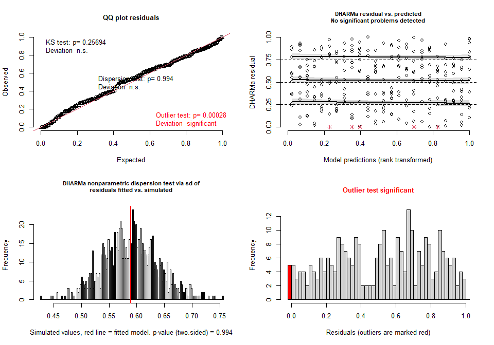<!-- -->

```
## 
## 	DHARMa outlier test based on exact binomial test with approximate
## 	expectations
## 
## data:  simulationOutput
## outliers at both margin(s) = 5, observations = 281, p-value = 0.0002841
## alternative hypothesis: true probability of success is not equal to 0.001998002
## 95 percent confidence interval:
##  0.005802145 0.041033526
## sample estimates:
## frequency of outliers (expected: 0.001998001998002 ) 
##                                           0.01779359
```

``` r
DHARMa.sum(Model = glm6)
```

```
## 1. Kolmogorov-Smirnov test indicates deviations of the residuals from uniform distribution. H0: The model fits the data well; Ha: The model does not fit the data well
```

```
## 
## 	Asymptotic one-sample Kolmogorov-Smirnov test
## 
## data:  simulationOutput$scaledResiduals
## D = 0.055712, p-value = 0.3477
## alternative hypothesis: two-sided
```

```
## 2. Test for over-dispersion. H0: No over-dispersion in the model; Ha: Over-dispersion in the model
```

```
## 
## 	DHARMa nonparametric dispersion test via sd of residuals fitted vs.
## 	simulated
## 
## data:  simulationOutput
## dispersion = 1.0005, p-value = 0.974
## alternative hypothesis: two.sided
## 
## 3. Test for outliers. H0: No ouliers in the model; Ha: Outliers in the model
```

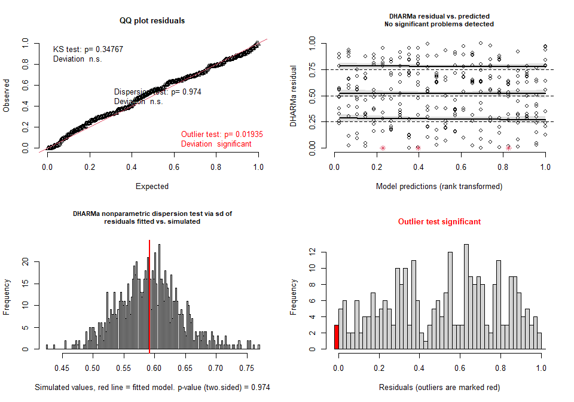<!-- -->

```
## 
## 	DHARMa outlier test based on exact binomial test with approximate
## 	expectations
## 
## data:  simulationOutput
## outliers at both margin(s) = 3, observations = 281, p-value = 0.01935
## alternative hypothesis: true probability of success is not equal to 0.001998002
## 95 percent confidence interval:
##  0.002207115 0.030881510
## sample estimates:
## frequency of outliers (expected: 0.001998001998002 ) 
##                                           0.01067616
```
lm1 or glm1 (or glm4) is best.

### Model output

``` r
summary(lm1)
```

```
##  Family: gaussian  ( identity )
## Formula:          Shannon ~ Cat_treatment * Accession + (1 | Batch)
## Data: total_diversity
## 
##       AIC       BIC    logLik -2*log(L)  df.resid 
##    -489.2    -394.7     270.6    -541.2       255 
## 
## Random effects:
## 
## Conditional model:
##  Groups   Name        Variance  Std.Dev. 
##  Batch    (Intercept) 2.406e-12 1.551e-06
##  Residual             8.531e-03 9.236e-02
## Number of obs: 281, groups:  Batch, 2
## 
## Dispersion estimate for gaussian family (sigma^2): 0.00853 
## 
## Conditional model:
##                               Estimate Std. Error z value Pr(>|z|)    
## (Intercept)                   6.616809   0.026663  248.16  < 2e-16 ***
## Cat_treatmentMb              -0.019519   0.037708   -0.52   0.6047    
## AccessionDD                  -0.172715   0.039548   -4.37 1.26e-05 ***
## AccessionHE                  -0.016126   0.038555   -0.42   0.6757    
## AccessionKI                   0.025263   0.037708    0.67   0.5029    
## AccessionVL                   0.003940   0.037708    0.10   0.9168    
## AccessionCD                  -0.173436   0.038555   -4.50 6.85e-06 ***
## AccessionRI                   0.035460   0.037708    0.94   0.3470    
## AccessionKT                   0.148554   0.037708    3.94 8.16e-05 ***
## AccessionMC                   0.059664   0.037708    1.58   0.1136    
## AccessionHM                   0.061925   0.037708    1.64   0.1005    
## AccessionIT1                  0.001832   0.037708    0.05   0.9613    
## AccessionGO1                 -0.081246   0.038555   -2.11   0.0351 *  
## Cat_treatmentMb:AccessionDD   0.036015   0.054644    0.66   0.5098    
## Cat_treatmentMb:AccessionHE  -0.042048   0.053929   -0.78   0.4356    
## Cat_treatmentMb:AccessionKI   0.042092   0.053929    0.78   0.4351    
## Cat_treatmentMb:AccessionVL   0.062526   0.053929    1.16   0.2463    
## Cat_treatmentMb:AccessionCD   0.017387   0.053929    0.32   0.7471    
## Cat_treatmentMb:AccessionRI  -0.010324   0.053327   -0.19   0.8465    
## Cat_treatmentMb:AccessionKT  -0.092819   0.053327   -1.74   0.0818 .  
## Cat_treatmentMb:AccessionMC  -0.018003   0.053327   -0.34   0.7357    
## Cat_treatmentMb:AccessionHM  -0.067632   0.053327   -1.27   0.2047    
## Cat_treatmentMb:AccessionIT1 -0.019779   0.053327   -0.37   0.7107    
## Cat_treatmentMb:AccessionGO1  0.007890   0.053929    0.15   0.8837    
## ---
## Signif. codes:  0 '***' 0.001 '**' 0.01 '*' 0.05 '.' 0.1 ' ' 1
```

``` r
# summary(lm2)
Anova(lm1)
```

```
## Analysis of Deviance Table (Type II Wald chisquare tests)
## 
## Response: Shannon
##                            Chisq Df Pr(>Chisq)    
## Cat_treatment             6.1598  1    0.01307 *  
## Accession               198.6497 11    < 2e-16 ***
## Cat_treatment:Accession  15.4332 11    0.16351    
## ---
## Signif. codes:  0 '***' 0.001 '**' 0.01 '*' 0.05 '.' 0.1 ' ' 1
```

``` r
# Anova(lm2)

Alphadiv_Shan_Acc_CP <- as.data.frame(Anova(lm1))
write.csv(Alphadiv_Shan_Acc_CP, "C:/Users/kreek001/OneDrive - Wageningen University & Research/Chapters/Experimental Chapter 3/RScripts/GitHub/TwelveAccessionExperiment/MicrobiomeAnalysis/Data/Statistical_output/CP/Alphadiv_Shan_Acc_CP.csv" )

# summary(lm3)
# summary(lm4)
# Anova(lm3)
# Anova(lm4)

# summary(lm5)
# summary(lm6)
# Anova(lm5)
# Anova(lm6)

# summary(glm1)
# summary(glm2
# Anova(glm1)
# Anova(glm2)
# 
# #summary(glm3)
# summary(glm4)
# #Anova(glm3)
# Anova(glm4)
# 
# summary(glm5)
# summary(glm6)
# Anova(glm5)
# Anova(glm6)
```

### Post hoc test

``` r
emmeans(lm1, pairwise ~ Accession)
```

```
## NOTE: Results may be misleading due to involvement in interactions
```

```
## $emmeans
##  Accession emmean     SE  df asymp.LCL asymp.UCL
##  OH          6.61 0.0189 Inf      6.57      6.64
##  DD          6.45 0.0198 Inf      6.41      6.49
##  HE          6.57 0.0193 Inf      6.53      6.61
##  KI          6.65 0.0193 Inf      6.62      6.69
##  VL          6.64 0.0193 Inf      6.60      6.68
##  CD          6.44 0.0193 Inf      6.40      6.48
##  RI          6.64 0.0189 Inf      6.60      6.67
##  KT          6.71 0.0189 Inf      6.67      6.75
##  MC          6.66 0.0189 Inf      6.62      6.69
##  HM          6.64 0.0189 Inf      6.60      6.67
##  IT1         6.60 0.0189 Inf      6.56      6.64
##  GO1         6.53 0.0193 Inf      6.49      6.57
## 
## Results are averaged over the levels of: Cat_treatment 
## Confidence level used: 0.95 
## 
## $contrasts
##  contrast  estimate     SE  df z.ratio p.value
##  OH - DD    0.15471 0.0273 Inf   5.662  <.0001
##  OH - HE    0.03715 0.0270 Inf   1.378  0.9679
##  OH - KI   -0.04631 0.0270 Inf  -1.717  0.8607
##  OH - VL   -0.03520 0.0270 Inf  -1.306  0.9786
##  OH - CD    0.16474 0.0270 Inf   6.110  <.0001
##  OH - RI   -0.03030 0.0267 Inf  -1.136  0.9931
##  OH - KT   -0.10214 0.0267 Inf  -3.831  0.0071
##  OH - MC   -0.05066 0.0267 Inf  -1.900  0.7595
##  OH - HM   -0.02811 0.0267 Inf  -1.054  0.9964
##  OH - IT1   0.00806 0.0267 Inf   0.302  1.0000
##  OH - GO1   0.07730 0.0270 Inf   2.867  0.1529
##  DD - HE   -0.11756 0.0276 Inf  -4.257  0.0013
##  DD - KI   -0.20102 0.0276 Inf  -7.279  <.0001
##  DD - VL   -0.18991 0.0276 Inf  -6.877  <.0001
##  DD - CD    0.01003 0.0276 Inf   0.363  1.0000
##  DD - RI   -0.18501 0.0273 Inf  -6.771  <.0001
##  DD - KT   -0.25685 0.0273 Inf  -9.401  <.0001
##  DD - MC   -0.20537 0.0273 Inf  -7.517  <.0001
##  DD - HM   -0.18282 0.0273 Inf  -6.691  <.0001
##  DD - IT1  -0.14665 0.0273 Inf  -5.367  <.0001
##  DD - GO1  -0.07741 0.0276 Inf  -2.803  0.1785
##  HE - KI   -0.08346 0.0273 Inf  -3.061  0.0917
##  HE - VL   -0.07235 0.0273 Inf  -2.654  0.2497
##  HE - CD    0.12759 0.0273 Inf   4.680  0.0002
##  HE - RI   -0.06745 0.0270 Inf  -2.501  0.3388
##  HE - KT   -0.13929 0.0270 Inf  -5.166  <.0001
##  HE - MC   -0.08781 0.0270 Inf  -3.257  0.0518
##  HE - HM   -0.06526 0.0270 Inf  -2.420  0.3921
##  HE - IT1  -0.02909 0.0270 Inf  -1.079  0.9956
##  HE - GO1   0.04015 0.0273 Inf   1.473  0.9481
##  KI - VL    0.01111 0.0273 Inf   0.407  1.0000
##  KI - CD    0.21105 0.0273 Inf   7.741  <.0001
##  KI - RI    0.01601 0.0270 Inf   0.594  1.0000
##  KI - KT   -0.05584 0.0270 Inf  -2.071  0.6439
##  KI - MC   -0.00435 0.0270 Inf  -0.161  1.0000
##  KI - HM    0.01820 0.0270 Inf   0.675  0.9999
##  KI - IT1   0.05437 0.0270 Inf   2.016  0.6824
##  KI - GO1   0.12361 0.0273 Inf   4.534  0.0004
##  VL - CD    0.19994 0.0273 Inf   7.334  <.0001
##  VL - RI    0.00491 0.0270 Inf   0.182  1.0000
##  VL - KT   -0.06694 0.0270 Inf  -2.483  0.3508
##  VL - MC   -0.01546 0.0270 Inf  -0.573  1.0000
##  VL - HM    0.00709 0.0270 Inf   0.263  1.0000
##  VL - IT1   0.04326 0.0270 Inf   1.604  0.9080
##  VL - GO1   0.11250 0.0273 Inf   4.127  0.0022
##  CD - RI   -0.19504 0.0270 Inf  -7.233  <.0001
##  CD - KT   -0.26689 0.0270 Inf  -9.898  <.0001
##  CD - MC   -0.21540 0.0270 Inf  -7.988  <.0001
##  CD - HM   -0.19285 0.0270 Inf  -7.152  <.0001
##  CD - IT1  -0.15668 0.0270 Inf  -5.811  <.0001
##  CD - GO1  -0.08744 0.0273 Inf  -3.207  0.0601
##  RI - KT   -0.07185 0.0267 Inf  -2.695  0.2287
##  RI - MC   -0.02036 0.0267 Inf  -0.764  0.9998
##  RI - HM    0.00219 0.0267 Inf   0.082  1.0000
##  RI - IT1   0.03836 0.0267 Inf   1.439  0.9560
##  RI - GO1   0.10760 0.0270 Inf   3.990  0.0038
##  KT - MC    0.05148 0.0267 Inf   1.931  0.7399
##  KT - HM    0.07404 0.0267 Inf   2.777  0.1899
##  KT - IT1   0.11020 0.0267 Inf   4.133  0.0021
##  KT - GO1   0.17945 0.0270 Inf   6.655  <.0001
##  MC - HM    0.02255 0.0267 Inf   0.846  0.9995
##  MC - IT1   0.05872 0.0267 Inf   2.202  0.5479
##  MC - GO1   0.12796 0.0270 Inf   4.746  0.0001
##  HM - IT1   0.03617 0.0267 Inf   1.356  0.9714
##  HM - GO1   0.10541 0.0270 Inf   3.909  0.0053
##  IT1 - GO1  0.06924 0.0270 Inf   2.568  0.2980
## 
## Results are averaged over the levels of: Cat_treatment 
## P value adjustment: tukey method for comparing a family of 12 estimates
```

``` r
ph_sh <- cld(emmeans(lm1, pairwise ~ Accession), Letters = letters)
```

```
## NOTE: Results may be misleading due to involvement in interactions
```

``` r
print(ph_sh)
```

```
##  Accession emmean     SE  df asymp.LCL asymp.UCL .group
##  CD          6.44 0.0193 Inf      6.40      6.48  a    
##  DD          6.45 0.0198 Inf      6.41      6.49  a    
##  GO1         6.53 0.0193 Inf      6.49      6.57  ab   
##  HE          6.57 0.0193 Inf      6.53      6.61   bc  
##  IT1         6.60 0.0189 Inf      6.56      6.64   bc  
##  OH          6.61 0.0189 Inf      6.57      6.64   bc  
##  HM          6.64 0.0189 Inf      6.60      6.67    cd 
##  RI          6.64 0.0189 Inf      6.60      6.67    cd 
##  VL          6.64 0.0193 Inf      6.60      6.68    cd 
##  KI          6.65 0.0193 Inf      6.62      6.69    cd 
##  MC          6.66 0.0189 Inf      6.62      6.69    cd 
##  KT          6.71 0.0189 Inf      6.67      6.75     d 
## 
## Results are averaged over the levels of: Cat_treatment 
## Confidence level used: 0.95 
## P value adjustment: tukey method for comparing a family of 12 estimates 
## significance level used: alpha = 0.05 
## NOTE: If two or more means share the same grouping symbol,
##       then we cannot show them to be different.
##       But we also did not show them to be the same.
```

``` r
emmeans(lm1, pairwise ~ Cat_treatment | Accession)
```

```
## $emmeans
## Accession = OH:
##  Cat_treatment emmean     SE  df asymp.LCL asymp.UCL
##  Co              6.62 0.0267 Inf      6.56      6.67
##  Mb              6.60 0.0267 Inf      6.55      6.65
## 
## Accession = DD:
##  Cat_treatment emmean     SE  df asymp.LCL asymp.UCL
##  Co              6.44 0.0292 Inf      6.39      6.50
##  Mb              6.46 0.0267 Inf      6.41      6.51
## 
## Accession = HE:
##  Cat_treatment emmean     SE  df asymp.LCL asymp.UCL
##  Co              6.60 0.0278 Inf      6.55      6.66
##  Mb              6.54 0.0267 Inf      6.49      6.59
## 
## Accession = KI:
##  Cat_treatment emmean     SE  df asymp.LCL asymp.UCL
##  Co              6.64 0.0267 Inf      6.59      6.69
##  Mb              6.66 0.0278 Inf      6.61      6.72
## 
## Accession = VL:
##  Cat_treatment emmean     SE  df asymp.LCL asymp.UCL
##  Co              6.62 0.0267 Inf      6.57      6.67
##  Mb              6.66 0.0278 Inf      6.61      6.72
## 
## Accession = CD:
##  Cat_treatment emmean     SE  df asymp.LCL asymp.UCL
##  Co              6.44 0.0278 Inf      6.39      6.50
##  Mb              6.44 0.0267 Inf      6.39      6.49
## 
## Accession = RI:
##  Cat_treatment emmean     SE  df asymp.LCL asymp.UCL
##  Co              6.65 0.0267 Inf      6.60      6.70
##  Mb              6.62 0.0267 Inf      6.57      6.67
## 
## Accession = KT:
##  Cat_treatment emmean     SE  df asymp.LCL asymp.UCL
##  Co              6.77 0.0267 Inf      6.71      6.82
##  Mb              6.65 0.0267 Inf      6.60      6.71
## 
## Accession = MC:
##  Cat_treatment emmean     SE  df asymp.LCL asymp.UCL
##  Co              6.68 0.0267 Inf      6.62      6.73
##  Mb              6.64 0.0267 Inf      6.59      6.69
## 
## Accession = HM:
##  Cat_treatment emmean     SE  df asymp.LCL asymp.UCL
##  Co              6.68 0.0267 Inf      6.63      6.73
##  Mb              6.59 0.0267 Inf      6.54      6.64
## 
## Accession = IT1:
##  Cat_treatment emmean     SE  df asymp.LCL asymp.UCL
##  Co              6.62 0.0267 Inf      6.57      6.67
##  Mb              6.58 0.0267 Inf      6.53      6.63
## 
## Accession = GO1:
##  Cat_treatment emmean     SE  df asymp.LCL asymp.UCL
##  Co              6.54 0.0278 Inf      6.48      6.59
##  Mb              6.52 0.0267 Inf      6.47      6.58
## 
## Confidence level used: 0.95 
## 
## $contrasts
## Accession = OH:
##  contrast estimate     SE  df z.ratio p.value
##  Co - Mb   0.01952 0.0377 Inf   0.518  0.6047
## 
## Accession = DD:
##  contrast estimate     SE  df z.ratio p.value
##  Co - Mb  -0.01650 0.0395 Inf  -0.417  0.6766
## 
## Accession = HE:
##  contrast estimate     SE  df z.ratio p.value
##  Co - Mb   0.06157 0.0386 Inf   1.597  0.1103
## 
## Accession = KI:
##  contrast estimate     SE  df z.ratio p.value
##  Co - Mb  -0.02257 0.0386 Inf  -0.585  0.5582
## 
## Accession = VL:
##  contrast estimate     SE  df z.ratio p.value
##  Co - Mb  -0.04301 0.0386 Inf  -1.115  0.2647
## 
## Accession = CD:
##  contrast estimate     SE  df z.ratio p.value
##  Co - Mb   0.00213 0.0386 Inf   0.055  0.9559
## 
## Accession = RI:
##  contrast estimate     SE  df z.ratio p.value
##  Co - Mb   0.02984 0.0377 Inf   0.791  0.4287
## 
## Accession = KT:
##  contrast estimate     SE  df z.ratio p.value
##  Co - Mb   0.11234 0.0377 Inf   2.979  0.0029
## 
## Accession = MC:
##  contrast estimate     SE  df z.ratio p.value
##  Co - Mb   0.03752 0.0377 Inf   0.995  0.3197
## 
## Accession = HM:
##  contrast estimate     SE  df z.ratio p.value
##  Co - Mb   0.08715 0.0377 Inf   2.311  0.0208
## 
## Accession = IT1:
##  contrast estimate     SE  df z.ratio p.value
##  Co - Mb   0.03930 0.0377 Inf   1.042  0.2973
## 
## Accession = GO1:
##  contrast estimate     SE  df z.ratio p.value
##  Co - Mb   0.01163 0.0386 Inf   0.302  0.7629
```


``` r
rm(lm1, lm2, lm3, lm4, lm5, lm6, glm1, glm2, glm3, glm4, glm5, glm6)
```

# 3.2.2 Alpha diversity testing Domestication
## Statistics Observed index Domestication
### Defining model

``` r
lm1b <- glmmTMB(data = total_diversity, formula = Observed ~ Cat_treatment * Domestication + (1 | Accession) + (1 | Batch), family = gaussian(link = "identity"))
lm1 <- glmmTMB(data = total_diversity, formula = Observed ~ Cat_treatment * Domestication + (1 | Accession), family = gaussian(link = "identity"))
lm2 <- glmmTMB(data = total_diversity, formula = Observed ~ Cat_treatment * Domestication, family = gaussian(link = "identity"))

lm3b <- glmmTMB(data = total_diversity, formula = log(Observed) ~ Cat_treatment * Domestication + (1 | Accession) + (1 | Batch), family = gaussian(link = "identity"))
lm3 <- glmmTMB(data = total_diversity, formula = log(Observed) ~ Cat_treatment * Domestication + (1 | Accession), family = gaussian(link = "identity"))
lm4 <- glmmTMB(data = total_diversity, formula = log(Observed) ~ Cat_treatment * Domestication, family = gaussian(link = "identity"))

lm5b <- glmmTMB(data = total_diversity, formula = sqrt(Observed) ~ Cat_treatment * Domestication + (1 | Accession) + (1 | Batch), family = gaussian(link = "identity"))
lm5 <- glmmTMB(data = total_diversity, formula = sqrt(Observed) ~ Cat_treatment * Domestication + (1 | Accession), family = gaussian(link = "identity"))
lm6 <- glmmTMB(data = total_diversity, formula = sqrt(Observed) ~ Cat_treatment * Domestication, family = gaussian(link = "identity"))

glm1b <- glmmTMB(data = total_diversity, formula = Observed ~ Cat_treatment * Domestication + (1 | Accession) + (1 | Batch), family = Gamma(link = "log"))
glm1 <- glmmTMB(data = total_diversity, formula = Observed ~ Cat_treatment * Domestication + (1 | Accession), family = Gamma(link = "log"))
glm2 <- glmmTMB(data = total_diversity, formula = Observed ~ Cat_treatment * Domestication, family = Gamma(link = "log"))

glm3b <- glmmTMB(data = total_diversity, formula = log(Observed + 1) ~ Cat_treatment * Domestication + (1 | Accession) + (1 | Batch), family = Gamma(link = "log"))
glm3 <- glmmTMB(data = total_diversity, formula = log(Observed + 1) ~ Cat_treatment * Domestication + (1 | Accession), family = Gamma(link = "log"))
glm4 <- glmmTMB(data = total_diversity, formula = log(Observed + 1) ~ Cat_treatment * Domestication, family = Gamma(link = "log"))

glm5b <- glmmTMB(data = total_diversity, formula = sqrt(Observed) ~ Cat_treatment * Domestication + (1 | Accession) + (1 | Batch), family = Gamma(link = "log"))
glm5 <- glmmTMB(data = total_diversity, formula = sqrt(Observed) ~ Cat_treatment * Domestication + (1 | Accession), family = Gamma(link = "log"))
glm6 <- glmmTMB(data = total_diversity, formula = sqrt(Observed) ~ Cat_treatment * Domestication, family = Gamma(link = "log"))
```

### Model assumptions

``` r
DHARMa.sum(Model = lm1b)
```

```
## 1. Kolmogorov-Smirnov test indicates deviations of the residuals from uniform distribution. H0: The model fits the data well; Ha: The model does not fit the data well
```

```
## 
## 	Asymptotic one-sample Kolmogorov-Smirnov test
## 
## data:  simulationOutput$scaledResiduals
## D = 0.039541, p-value = 0.7719
## alternative hypothesis: two-sided
```

```
## 2. Test for over-dispersion. H0: No over-dispersion in the model; Ha: Over-dispersion in the model
```

```
## 
## 	DHARMa nonparametric dispersion test via sd of residuals fitted vs.
## 	simulated
## 
## data:  simulationOutput
## dispersion = 1.0301, p-value = 0.742
## alternative hypothesis: two.sided
## 
## 3. Test for outliers. H0: No ouliers in the model; Ha: Outliers in the model
```

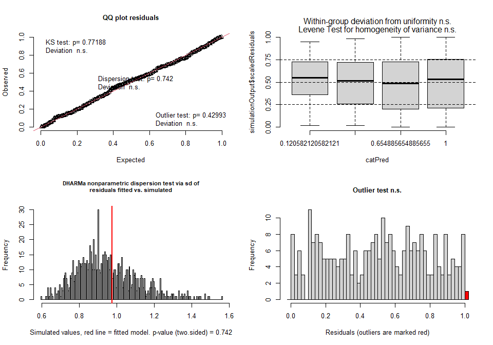<!-- -->

```
## 
## 	DHARMa outlier test based on exact binomial test with approximate
## 	expectations
## 
## data:  simulationOutput
## outliers at both margin(s) = 1, observations = 281, p-value = 0.4299
## alternative hypothesis: true probability of success is not equal to 0.001998002
## 95 percent confidence interval:
##  0.0000900949 0.0196673699
## sample estimates:
## frequency of outliers (expected: 0.001998001998002 ) 
##                                          0.003558719
```

``` r
DHARMa.sum(Model = lm1)
```

```
## 1. Kolmogorov-Smirnov test indicates deviations of the residuals from uniform distribution. H0: The model fits the data well; Ha: The model does not fit the data well
```

```
## 
## 	Asymptotic one-sample Kolmogorov-Smirnov test
## 
## data:  simulationOutput$scaledResiduals
## D = 0.031306, p-value = 0.9458
## alternative hypothesis: two-sided
```

```
## 2. Test for over-dispersion. H0: No over-dispersion in the model; Ha: Over-dispersion in the model
```

```
## 
## 	DHARMa nonparametric dispersion test via sd of residuals fitted vs.
## 	simulated
## 
## data:  simulationOutput
## dispersion = 1.0383, p-value = 0.75
## alternative hypothesis: two.sided
## 
## 3. Test for outliers. H0: No ouliers in the model; Ha: Outliers in the model
```

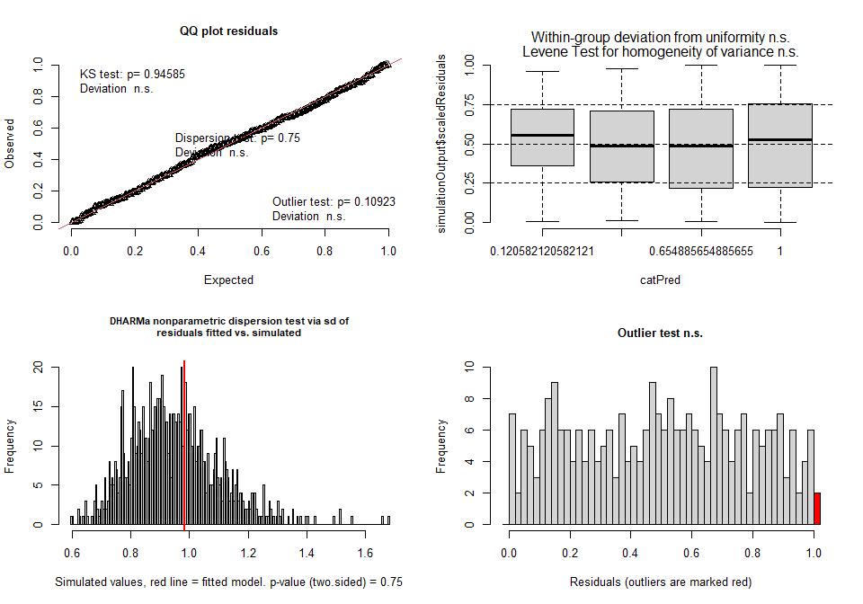<!-- -->

```
## 
## 	DHARMa outlier test based on exact binomial test with approximate
## 	expectations
## 
## data:  simulationOutput
## outliers at both margin(s) = 2, observations = 281, p-value = 0.1092
## alternative hypothesis: true probability of success is not equal to 0.001998002
## 95 percent confidence interval:
##  0.00086312 0.02547272
## sample estimates:
## frequency of outliers (expected: 0.001998001998002 ) 
##                                          0.007117438
```

``` r
DHARMa.sum(Model = lm2)
```

```
## 1. Kolmogorov-Smirnov test indicates deviations of the residuals from uniform distribution. H0: The model fits the data well; Ha: The model does not fit the data well
```

```
## 
## 	Asymptotic one-sample Kolmogorov-Smirnov test
## 
## data:  simulationOutput$scaledResiduals
## D = 0.038331, p-value = 0.8035
## alternative hypothesis: two-sided
```

```
## 2. Test for over-dispersion. H0: No over-dispersion in the model; Ha: Over-dispersion in the model
```

```
## 
## 	DHARMa nonparametric dispersion test via sd of residuals fitted vs.
## 	simulated
## 
## data:  simulationOutput
## dispersion = 1.0072, p-value = 0.93
## alternative hypothesis: two.sided
## 
## 3. Test for outliers. H0: No ouliers in the model; Ha: Outliers in the model
```

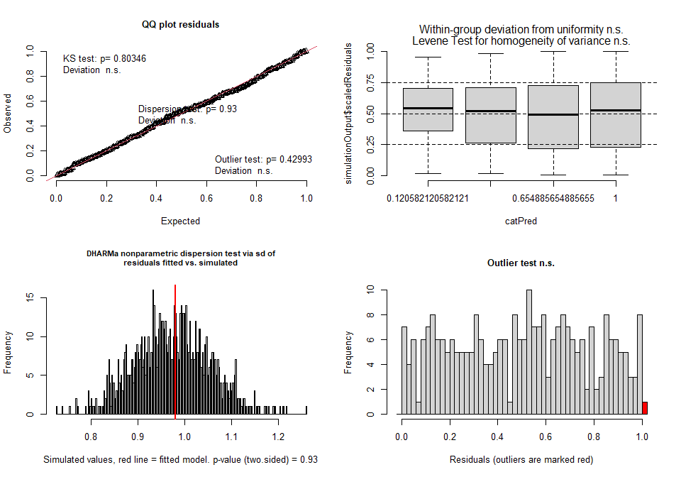<!-- -->

```
## 
## 	DHARMa outlier test based on exact binomial test with approximate
## 	expectations
## 
## data:  simulationOutput
## outliers at both margin(s) = 1, observations = 281, p-value = 0.4299
## alternative hypothesis: true probability of success is not equal to 0.001998002
## 95 percent confidence interval:
##  0.0000900949 0.0196673699
## sample estimates:
## frequency of outliers (expected: 0.001998001998002 ) 
##                                          0.003558719
```

``` r
DHARMa.sum(Model = lm3b)
```

```
## 1. Kolmogorov-Smirnov test indicates deviations of the residuals from uniform distribution. H0: The model fits the data well; Ha: The model does not fit the data well
```

```
## 
## 	Asymptotic one-sample Kolmogorov-Smirnov test
## 
## data:  simulationOutput$scaledResiduals
## D = 0.062982, p-value = 0.2149
## alternative hypothesis: two-sided
```

```
## 2. Test for over-dispersion. H0: No over-dispersion in the model; Ha: Over-dispersion in the model
```

```
## 
## 	DHARMa nonparametric dispersion test via sd of residuals fitted vs.
## 	simulated
## 
## data:  simulationOutput
## dispersion = 1.0308, p-value = 0.744
## alternative hypothesis: two.sided
## 
## 3. Test for outliers. H0: No ouliers in the model; Ha: Outliers in the model
```

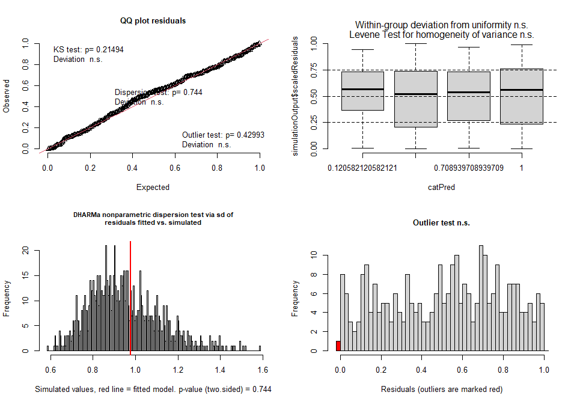<!-- -->

```
## 
## 	DHARMa outlier test based on exact binomial test with approximate
## 	expectations
## 
## data:  simulationOutput
## outliers at both margin(s) = 1, observations = 281, p-value = 0.4299
## alternative hypothesis: true probability of success is not equal to 0.001998002
## 95 percent confidence interval:
##  0.0000900949 0.0196673699
## sample estimates:
## frequency of outliers (expected: 0.001998001998002 ) 
##                                          0.003558719
```

``` r
DHARMa.sum(Model = lm3)
```

```
## 1. Kolmogorov-Smirnov test indicates deviations of the residuals from uniform distribution. H0: The model fits the data well; Ha: The model does not fit the data well
```

```
## 
## 	Asymptotic one-sample Kolmogorov-Smirnov test
## 
## data:  simulationOutput$scaledResiduals
## D = 0.061395, p-value = 0.24
## alternative hypothesis: two-sided
```

```
## 2. Test for over-dispersion. H0: No over-dispersion in the model; Ha: Over-dispersion in the model
```

```
## 
## 	DHARMa nonparametric dispersion test via sd of residuals fitted vs.
## 	simulated
## 
## data:  simulationOutput
## dispersion = 1.039, p-value = 0.75
## alternative hypothesis: two.sided
## 
## 3. Test for outliers. H0: No ouliers in the model; Ha: Outliers in the model
```

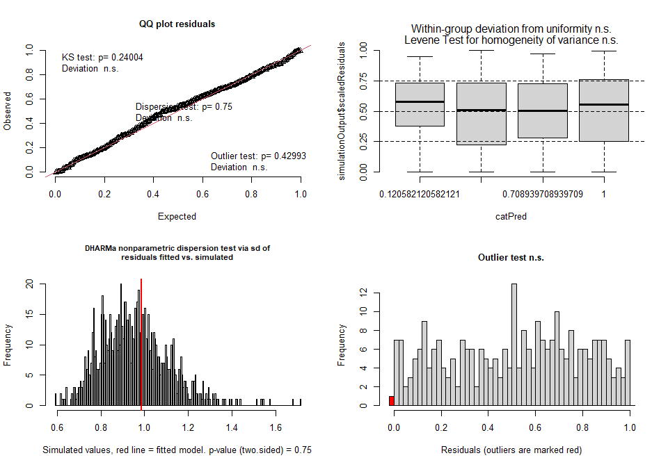<!-- -->

```
## 
## 	DHARMa outlier test based on exact binomial test with approximate
## 	expectations
## 
## data:  simulationOutput
## outliers at both margin(s) = 1, observations = 281, p-value = 0.4299
## alternative hypothesis: true probability of success is not equal to 0.001998002
## 95 percent confidence interval:
##  0.0000900949 0.0196673699
## sample estimates:
## frequency of outliers (expected: 0.001998001998002 ) 
##                                          0.003558719
```

``` r
DHARMa.sum(Model = lm4)
```

```
## 1. Kolmogorov-Smirnov test indicates deviations of the residuals from uniform distribution. H0: The model fits the data well; Ha: The model does not fit the data well
```

```
## 
## 	Asymptotic one-sample Kolmogorov-Smirnov test
## 
## data:  simulationOutput$scaledResiduals
## D = 0.059719, p-value = 0.2689
## alternative hypothesis: two-sided
```

```
## 2. Test for over-dispersion. H0: No over-dispersion in the model; Ha: Over-dispersion in the model
```

```
## 
## 	DHARMa nonparametric dispersion test via sd of residuals fitted vs.
## 	simulated
## 
## data:  simulationOutput
## dispersion = 1.0072, p-value = 0.93
## alternative hypothesis: two.sided
## 
## 3. Test for outliers. H0: No ouliers in the model; Ha: Outliers in the model
```

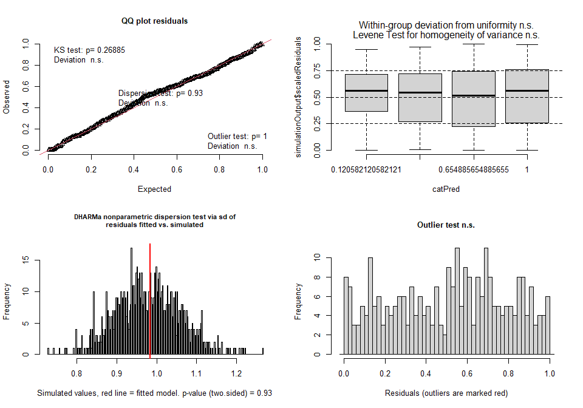<!-- -->

```
## 
## 	DHARMa outlier test based on exact binomial test with approximate
## 	expectations
## 
## data:  simulationOutput
## outliers at both margin(s) = 0, observations = 281, p-value = 1
## alternative hypothesis: true probability of success is not equal to 0.001998002
## 95 percent confidence interval:
##  0.00000000 0.01304189
## sample estimates:
## frequency of outliers (expected: 0.001998001998002 ) 
##                                                    0
```

``` r
DHARMa.sum(Model = lm5b)
```

```
## 1. Kolmogorov-Smirnov test indicates deviations of the residuals from uniform distribution. H0: The model fits the data well; Ha: The model does not fit the data well
```

```
## 
## 	Asymptotic one-sample Kolmogorov-Smirnov test
## 
## data:  simulationOutput$scaledResiduals
## D = 0.051071, p-value = 0.4561
## alternative hypothesis: two-sided
```

```
## 2. Test for over-dispersion. H0: No over-dispersion in the model; Ha: Over-dispersion in the model
```

```
## 
## 	DHARMa nonparametric dispersion test via sd of residuals fitted vs.
## 	simulated
## 
## data:  simulationOutput
## dispersion = 1.0305, p-value = 0.744
## alternative hypothesis: two.sided
## 
## 3. Test for outliers. H0: No ouliers in the model; Ha: Outliers in the model
```

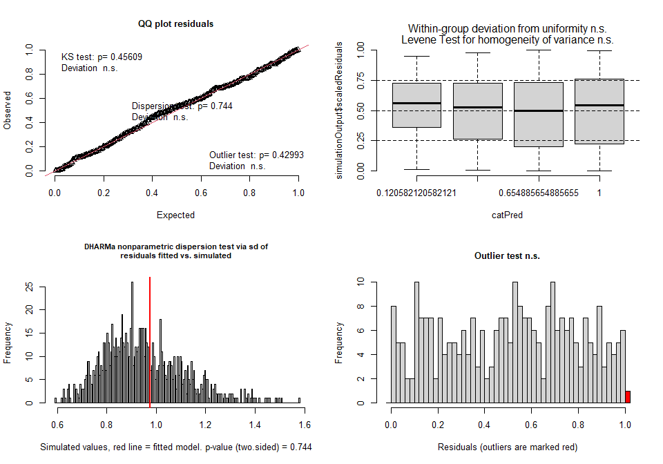<!-- -->

```
## 
## 	DHARMa outlier test based on exact binomial test with approximate
## 	expectations
## 
## data:  simulationOutput
## outliers at both margin(s) = 1, observations = 281, p-value = 0.4299
## alternative hypothesis: true probability of success is not equal to 0.001998002
## 95 percent confidence interval:
##  0.0000900949 0.0196673699
## sample estimates:
## frequency of outliers (expected: 0.001998001998002 ) 
##                                          0.003558719
```

``` r
DHARMa.sum(Model = lm5)
```

```
## 1. Kolmogorov-Smirnov test indicates deviations of the residuals from uniform distribution. H0: The model fits the data well; Ha: The model does not fit the data well
```

```
## 
## 	Asymptotic one-sample Kolmogorov-Smirnov test
## 
## data:  simulationOutput$scaledResiduals
## D = 0.045395, p-value = 0.6088
## alternative hypothesis: two-sided
```

```
## 2. Test for over-dispersion. H0: No over-dispersion in the model; Ha: Over-dispersion in the model
```

```
## 
## 	DHARMa nonparametric dispersion test via sd of residuals fitted vs.
## 	simulated
## 
## data:  simulationOutput
## dispersion = 1.0387, p-value = 0.748
## alternative hypothesis: two.sided
## 
## 3. Test for outliers. H0: No ouliers in the model; Ha: Outliers in the model
```

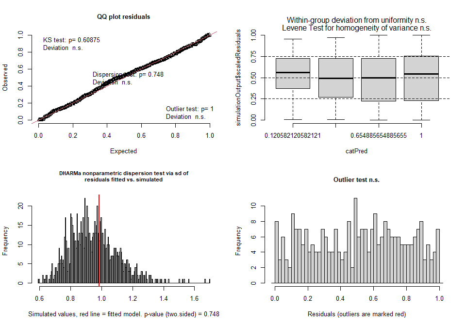<!-- -->

```
## 
## 	DHARMa outlier test based on exact binomial test with approximate
## 	expectations
## 
## data:  simulationOutput
## outliers at both margin(s) = 0, observations = 281, p-value = 1
## alternative hypothesis: true probability of success is not equal to 0.001998002
## 95 percent confidence interval:
##  0.00000000 0.01304189
## sample estimates:
## frequency of outliers (expected: 0.001998001998002 ) 
##                                                    0
```

``` r
DHARMa.sum(Model = lm6)
```

```
## 1. Kolmogorov-Smirnov test indicates deviations of the residuals from uniform distribution. H0: The model fits the data well; Ha: The model does not fit the data well
```

```
## 
## 	Asymptotic one-sample Kolmogorov-Smirnov test
## 
## data:  simulationOutput$scaledResiduals
## D = 0.045836, p-value = 0.5964
## alternative hypothesis: two-sided
```

```
## 2. Test for over-dispersion. H0: No over-dispersion in the model; Ha: Over-dispersion in the model
```

```
## 
## 	DHARMa nonparametric dispersion test via sd of residuals fitted vs.
## 	simulated
## 
## data:  simulationOutput
## dispersion = 1.0072, p-value = 0.93
## alternative hypothesis: two.sided
## 
## 3. Test for outliers. H0: No ouliers in the model; Ha: Outliers in the model
```

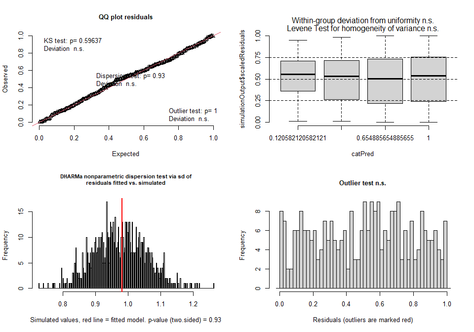<!-- -->

```
## 
## 	DHARMa outlier test based on exact binomial test with approximate
## 	expectations
## 
## data:  simulationOutput
## outliers at both margin(s) = 0, observations = 281, p-value = 1
## alternative hypothesis: true probability of success is not equal to 0.001998002
## 95 percent confidence interval:
##  0.00000000 0.01304189
## sample estimates:
## frequency of outliers (expected: 0.001998001998002 ) 
##                                                    0
```

``` r
DHARMa.sum(Model = glm1b)
```

```
## 1. Kolmogorov-Smirnov test indicates deviations of the residuals from uniform distribution. H0: The model fits the data well; Ha: The model does not fit the data well
```

```
## 
## 	Asymptotic one-sample Kolmogorov-Smirnov test
## 
## data:  simulationOutput$scaledResiduals
## D = 0.056512, p-value = 0.3308
## alternative hypothesis: two-sided
```

```
## 2. Test for over-dispersion. H0: No over-dispersion in the model; Ha: Over-dispersion in the model
```

```
## 
## 	DHARMa nonparametric dispersion test via sd of residuals fitted vs.
## 	simulated
## 
## data:  simulationOutput
## dispersion = 1.0107, p-value = 0.87
## alternative hypothesis: two.sided
## 
## 3. Test for outliers. H0: No ouliers in the model; Ha: Outliers in the model
```

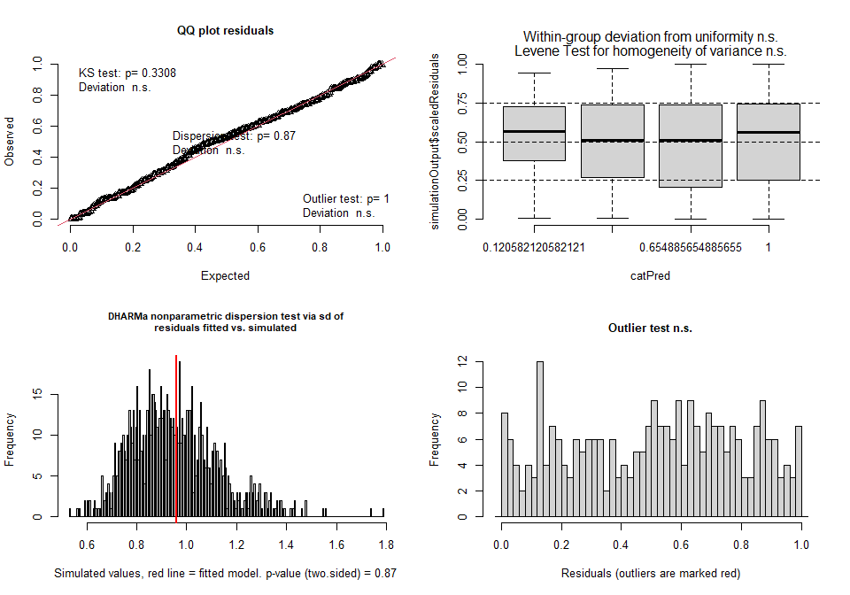<!-- -->

```
## 
## 	DHARMa outlier test based on exact binomial test with approximate
## 	expectations
## 
## data:  simulationOutput
## outliers at both margin(s) = 0, observations = 281, p-value = 1
## alternative hypothesis: true probability of success is not equal to 0.001998002
## 95 percent confidence interval:
##  0.00000000 0.01304189
## sample estimates:
## frequency of outliers (expected: 0.001998001998002 ) 
##                                                    0
```

``` r
DHARMa.sum(Model = glm1)
```

```
## 1. Kolmogorov-Smirnov test indicates deviations of the residuals from uniform distribution. H0: The model fits the data well; Ha: The model does not fit the data well
```

```
## 
## 	Asymptotic one-sample Kolmogorov-Smirnov test
## 
## data:  simulationOutput$scaledResiduals
## D = 0.055217, p-value = 0.3584
## alternative hypothesis: two-sided
```

```
## 2. Test for over-dispersion. H0: No over-dispersion in the model; Ha: Over-dispersion in the model
```

```
## 
## 	DHARMa nonparametric dispersion test via sd of residuals fitted vs.
## 	simulated
## 
## data:  simulationOutput
## dispersion = 1.0175, p-value = 0.84
## alternative hypothesis: two.sided
## 
## 3. Test for outliers. H0: No ouliers in the model; Ha: Outliers in the model
```

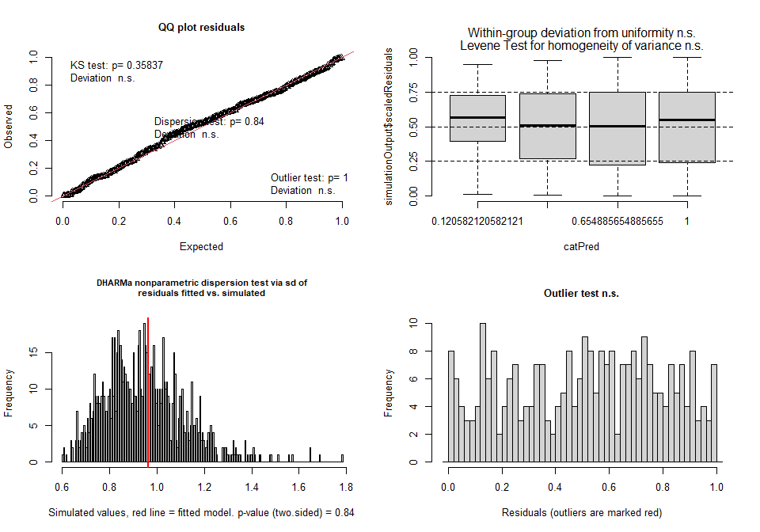<!-- -->

```
## 
## 	DHARMa outlier test based on exact binomial test with approximate
## 	expectations
## 
## data:  simulationOutput
## outliers at both margin(s) = 0, observations = 281, p-value = 1
## alternative hypothesis: true probability of success is not equal to 0.001998002
## 95 percent confidence interval:
##  0.00000000 0.01304189
## sample estimates:
## frequency of outliers (expected: 0.001998001998002 ) 
##                                                    0
```

``` r
DHARMa.sum(Model = glm2)
```

```
## 1. Kolmogorov-Smirnov test indicates deviations of the residuals from uniform distribution. H0: The model fits the data well; Ha: The model does not fit the data well
```

```
## 
## 	Asymptotic one-sample Kolmogorov-Smirnov test
## 
## data:  simulationOutput$scaledResiduals
## D = 0.051423, p-value = 0.4473
## alternative hypothesis: two-sided
```

```
## 2. Test for over-dispersion. H0: No over-dispersion in the model; Ha: Over-dispersion in the model
```

```
## 
## 	DHARMa nonparametric dispersion test via sd of residuals fitted vs.
## 	simulated
## 
## data:  simulationOutput
## dispersion = 0.99893, p-value = 0.972
## alternative hypothesis: two.sided
## 
## 3. Test for outliers. H0: No ouliers in the model; Ha: Outliers in the model
```

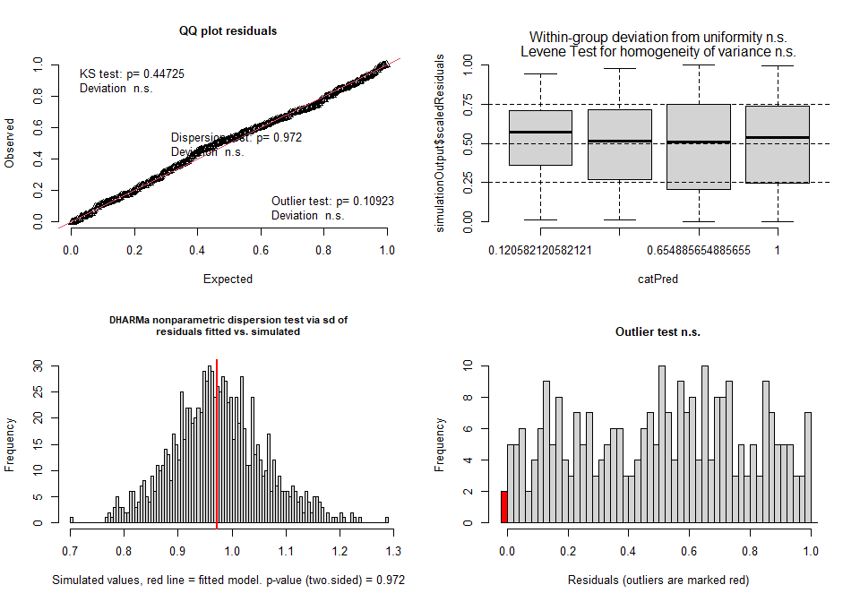<!-- -->

```
## 
## 	DHARMa outlier test based on exact binomial test with approximate
## 	expectations
## 
## data:  simulationOutput
## outliers at both margin(s) = 2, observations = 281, p-value = 0.1092
## alternative hypothesis: true probability of success is not equal to 0.001998002
## 95 percent confidence interval:
##  0.00086312 0.02547272
## sample estimates:
## frequency of outliers (expected: 0.001998001998002 ) 
##                                          0.007117438
```

``` r
DHARMa.sum(Model = glm3b)
```

```
## 1. Kolmogorov-Smirnov test indicates deviations of the residuals from uniform distribution. H0: The model fits the data well; Ha: The model does not fit the data well
```

```
## 
## 	Asymptotic one-sample Kolmogorov-Smirnov test
## 
## data:  simulationOutput$scaledResiduals
## D = 0.056569, p-value = 0.3296
## alternative hypothesis: two-sided
```

```
## 2. Test for over-dispersion. H0: No over-dispersion in the model; Ha: Over-dispersion in the model
```

```
## 
## 	DHARMa nonparametric dispersion test via sd of residuals fitted vs.
## 	simulated
## 
## data:  simulationOutput
## dispersion = 1.0216, p-value = 0.826
## alternative hypothesis: two.sided
## 
## 3. Test for outliers. H0: No ouliers in the model; Ha: Outliers in the model
```

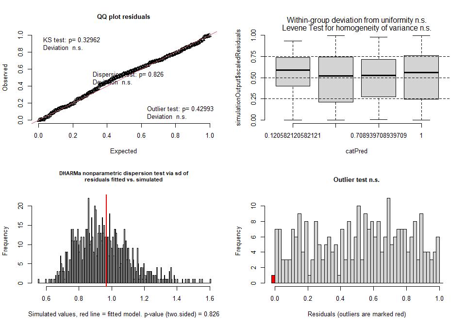<!-- -->

```
## 
## 	DHARMa outlier test based on exact binomial test with approximate
## 	expectations
## 
## data:  simulationOutput
## outliers at both margin(s) = 1, observations = 281, p-value = 0.4299
## alternative hypothesis: true probability of success is not equal to 0.001998002
## 95 percent confidence interval:
##  0.0000900949 0.0196673699
## sample estimates:
## frequency of outliers (expected: 0.001998001998002 ) 
##                                          0.003558719
```

``` r
DHARMa.sum(Model = glm3)
```

```
## 1. Kolmogorov-Smirnov test indicates deviations of the residuals from uniform distribution. H0: The model fits the data well; Ha: The model does not fit the data well
```

```
## 
## 	Asymptotic one-sample Kolmogorov-Smirnov test
## 
## data:  simulationOutput$scaledResiduals
## D = 0.0631, p-value = 0.2132
## alternative hypothesis: two-sided
```

```
## 2. Test for over-dispersion. H0: No over-dispersion in the model; Ha: Over-dispersion in the model
```

```
## 
## 	DHARMa nonparametric dispersion test via sd of residuals fitted vs.
## 	simulated
## 
## data:  simulationOutput
## dispersion = 1.0196, p-value = 0.802
## alternative hypothesis: two.sided
## 
## 3. Test for outliers. H0: No ouliers in the model; Ha: Outliers in the model
```

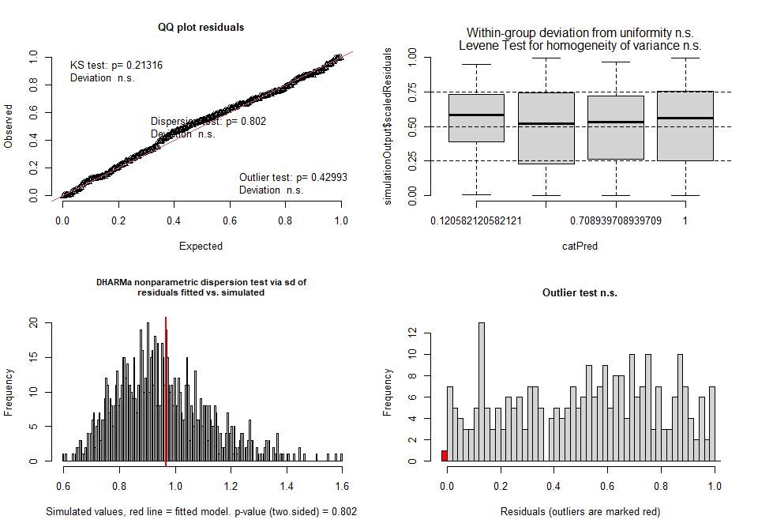<!-- -->

```
## 
## 	DHARMa outlier test based on exact binomial test with approximate
## 	expectations
## 
## data:  simulationOutput
## outliers at both margin(s) = 1, observations = 281, p-value = 0.4299
## alternative hypothesis: true probability of success is not equal to 0.001998002
## 95 percent confidence interval:
##  0.0000900949 0.0196673699
## sample estimates:
## frequency of outliers (expected: 0.001998001998002 ) 
##                                          0.003558719
```

``` r
DHARMa.sum(Model = glm4)
```

```
## 1. Kolmogorov-Smirnov test indicates deviations of the residuals from uniform distribution. H0: The model fits the data well; Ha: The model does not fit the data well
```

```
## 
## 	Asymptotic one-sample Kolmogorov-Smirnov test
## 
## data:  simulationOutput$scaledResiduals
## D = 0.054719, p-value = 0.3694
## alternative hypothesis: two-sided
```

```
## 2. Test for over-dispersion. H0: No over-dispersion in the model; Ha: Over-dispersion in the model
```

```
## 
## 	DHARMa nonparametric dispersion test via sd of residuals fitted vs.
## 	simulated
## 
## data:  simulationOutput
## dispersion = 1.0002, p-value = 0.944
## alternative hypothesis: two.sided
## 
## 3. Test for outliers. H0: No ouliers in the model; Ha: Outliers in the model
```

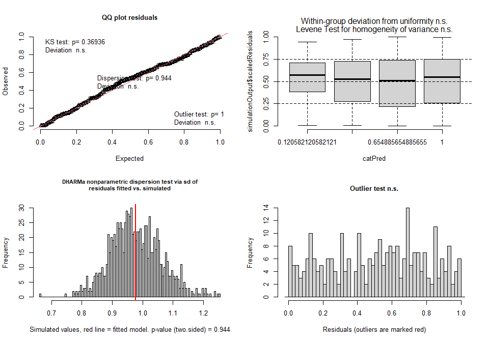<!-- -->

```
## 
## 	DHARMa outlier test based on exact binomial test with approximate
## 	expectations
## 
## data:  simulationOutput
## outliers at both margin(s) = 0, observations = 281, p-value = 1
## alternative hypothesis: true probability of success is not equal to 0.001998002
## 95 percent confidence interval:
##  0.00000000 0.01304189
## sample estimates:
## frequency of outliers (expected: 0.001998001998002 ) 
##                                                    0
```

``` r
DHARMa.sum(Model = glm5b)
```

```
## 1. Kolmogorov-Smirnov test indicates deviations of the residuals from uniform distribution. H0: The model fits the data well; Ha: The model does not fit the data well
```

```
## 
## 	Asymptotic one-sample Kolmogorov-Smirnov test
## 
## data:  simulationOutput$scaledResiduals
## D = 0.063836, p-value = 0.2023
## alternative hypothesis: two-sided
```

```
## 2. Test for over-dispersion. H0: No over-dispersion in the model; Ha: Over-dispersion in the model
```

```
## 
## 	DHARMa nonparametric dispersion test via sd of residuals fitted vs.
## 	simulated
## 
## data:  simulationOutput
## dispersion = 1.01, p-value = 0.864
## alternative hypothesis: two.sided
## 
## 3. Test for outliers. H0: No ouliers in the model; Ha: Outliers in the model
```

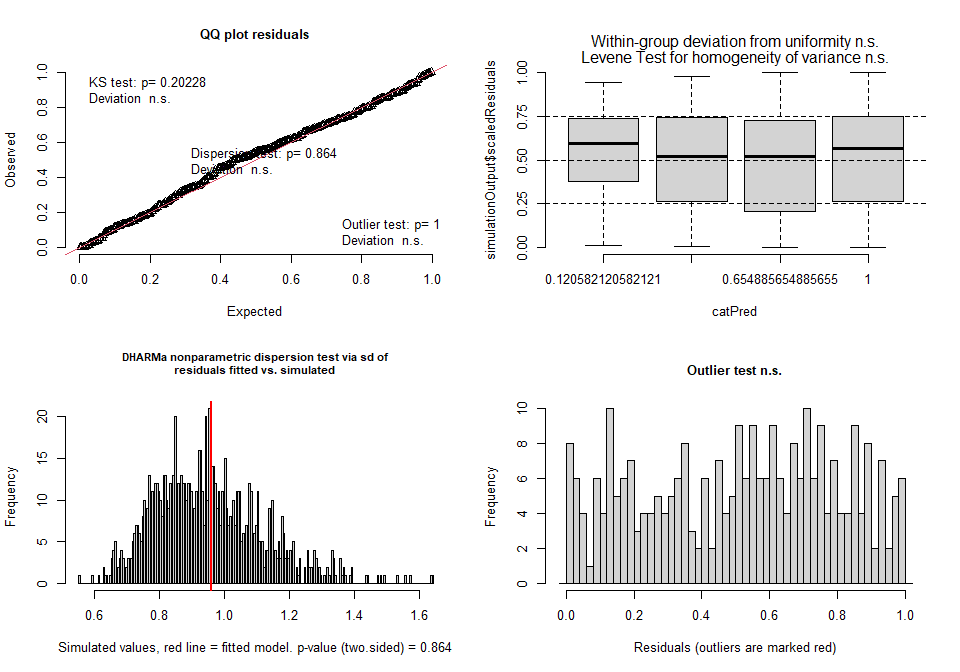<!-- -->

```
## 
## 	DHARMa outlier test based on exact binomial test with approximate
## 	expectations
## 
## data:  simulationOutput
## outliers at both margin(s) = 0, observations = 281, p-value = 1
## alternative hypothesis: true probability of success is not equal to 0.001998002
## 95 percent confidence interval:
##  0.00000000 0.01304189
## sample estimates:
## frequency of outliers (expected: 0.001998001998002 ) 
##                                                    0
```

``` r
DHARMa.sum(Model = glm5)
```

```
## 1. Kolmogorov-Smirnov test indicates deviations of the residuals from uniform distribution. H0: The model fits the data well; Ha: The model does not fit the data well
```

```
## 
## 	Asymptotic one-sample Kolmogorov-Smirnov test
## 
## data:  simulationOutput$scaledResiduals
## D = 0.063512, p-value = 0.207
## alternative hypothesis: two-sided
```

```
## 2. Test for over-dispersion. H0: No over-dispersion in the model; Ha: Over-dispersion in the model
```

```
## 
## 	DHARMa nonparametric dispersion test via sd of residuals fitted vs.
## 	simulated
## 
## data:  simulationOutput
## dispersion = 1.0176, p-value = 0.834
## alternative hypothesis: two.sided
## 
## 3. Test for outliers. H0: No ouliers in the model; Ha: Outliers in the model
```

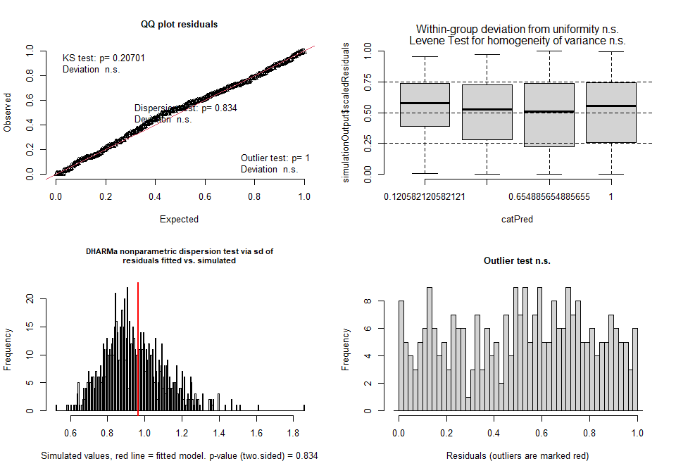<!-- -->

```
## 
## 	DHARMa outlier test based on exact binomial test with approximate
## 	expectations
## 
## data:  simulationOutput
## outliers at both margin(s) = 0, observations = 281, p-value = 1
## alternative hypothesis: true probability of success is not equal to 0.001998002
## 95 percent confidence interval:
##  0.00000000 0.01304189
## sample estimates:
## frequency of outliers (expected: 0.001998001998002 ) 
##                                                    0
```

``` r
DHARMa.sum(Model = glm6)
```

```
## 1. Kolmogorov-Smirnov test indicates deviations of the residuals from uniform distribution. H0: The model fits the data well; Ha: The model does not fit the data well
```

```
## 
## 	Asymptotic one-sample Kolmogorov-Smirnov test
## 
## data:  simulationOutput$scaledResiduals
## D = 0.057306, p-value = 0.3146
## alternative hypothesis: two-sided
```

```
## 2. Test for over-dispersion. H0: No over-dispersion in the model; Ha: Over-dispersion in the model
```

```
## 
## 	DHARMa nonparametric dispersion test via sd of residuals fitted vs.
## 	simulated
## 
## data:  simulationOutput
## dispersion = 0.99709, p-value = 0.998
## alternative hypothesis: two.sided
## 
## 3. Test for outliers. H0: No ouliers in the model; Ha: Outliers in the model
```

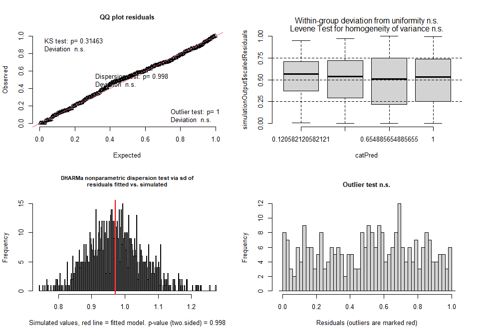<!-- -->

```
## 
## 	DHARMa outlier test based on exact binomial test with approximate
## 	expectations
## 
## data:  simulationOutput
## outliers at both margin(s) = 0, observations = 281, p-value = 1
## alternative hypothesis: true probability of success is not equal to 0.001998002
## 95 percent confidence interval:
##  0.00000000 0.01304189
## sample estimates:
## frequency of outliers (expected: 0.001998001998002 ) 
##                                                    0
```

### Model output

``` r
summary(lm1b)
```

```
##  Family: gaussian  ( identity )
## Formula:          Observed ~ Cat_treatment * Domestication + (1 | Accession) +  
##     (1 | Batch)
## Data: total_diversity
## 
##       AIC       BIC    logLik -2*log(L)  df.resid 
##    3676.7    3702.2   -1831.4    3662.7       274 
## 
## Random effects:
## 
## Conditional model:
##  Groups    Name        Variance Std.Dev.
##  Accession (Intercept) 13437.34 115.920 
##  Batch     (Intercept)    41.84   6.469 
##  Residual              23925.68 154.679 
## Number of obs: 281, groups:  Accession, 12; Batch, 2
## 
## Dispersion estimate for gaussian family (sigma^2): 2.39e+04 
## 
## Conditional model:
##                                         Estimate Std. Error z value Pr(>|z|)
## (Intercept)                              1501.48      55.94  26.840   <2e-16
## Cat_treatmentMb                            18.23      28.91   0.631   0.5282
## DomesticationCultivated                    80.33      72.94   1.101   0.2708
## Cat_treatmentMb:DomesticationCultivated   -77.81      37.58  -2.070   0.0384
##                                            
## (Intercept)                             ***
## Cat_treatmentMb                            
## DomesticationCultivated                    
## Cat_treatmentMb:DomesticationCultivated *  
## ---
## Signif. codes:  0 '***' 0.001 '**' 0.01 '*' 0.05 '.' 0.1 ' ' 1
```

``` r
# summary(lm2)
Anova(lm1b)
```

```
## Analysis of Deviance Table (Type II Wald chisquare tests)
## 
## Response: Observed
##                              Chisq Df Pr(>Chisq)  
## Cat_treatment               2.2642  1    0.13240  
## Domestication               0.3390  1    0.56042  
## Cat_treatment:Domestication 4.2864  1    0.03842 *
## ---
## Signif. codes:  0 '***' 0.001 '**' 0.01 '*' 0.05 '.' 0.1 ' ' 1
```

``` r
# Anova(lm2)

Alphadiv_obs_Dom_CP <- as.data.frame(Anova(lm1b))
write.csv(Alphadiv_obs_Dom_CP, "C:/Users/kreek001/OneDrive - Wageningen University & Research/Chapters/Experimental Chapter 3/RScripts/GitHub/TwelveAccessionExperiment/MicrobiomeAnalysis/Data/Statistical_output/CP/Alphadiv_obs_Dom_CP.csv")

# summary(lm3)
# summary(lm4)
# Anova(lm3)
# Anova(lm4)

# summary(lm5)
# summary(lm6)
# Anova(lm5)
# Anova(lm6)

# summary(glm1)
# summary(glm2)
# Anova(glm1)
# Anova(glm2)
# 
# #summary(glm3)
# summary(glm4)
# #Anova(glm3)
# Anova(glm4)
# 
# summary(glm5)
# summary(glm6)
# Anova(glm5)
# Anova(glm6)
```

### Post hoc test

``` r
emmeans(lm1b, pairwise ~ Cat_treatment*Domestication)
```

```
## $emmeans
##  Cat_treatment Domestication emmean   SE  df asymp.LCL asymp.UCL
##  Co            Wild            1501 55.9 Inf      1392      1611
##  Mb            Wild            1520 55.9 Inf      1410      1629
##  Co            Cultivated      1582 47.2 Inf      1489      1674
##  Mb            Cultivated      1522 47.2 Inf      1430      1615
## 
## Confidence level used: 0.95 
## 
## $contrasts
##  contrast                      estimate   SE  df z.ratio p.value
##  Co Wild - Mb Wild               -18.23 28.9 Inf  -0.631  0.9222
##  Co Wild - Co Cultivated         -80.33 72.9 Inf  -1.101  0.6888
##  Co Wild - Mb Cultivated         -20.75 72.9 Inf  -0.285  0.9920
##  Mb Wild - Co Cultivated         -62.09 72.9 Inf  -0.852  0.8295
##  Mb Wild - Mb Cultivated          -2.52 72.8 Inf  -0.035  1.0000
##  Co Cultivated - Mb Cultivated    59.57 24.0 Inf   2.480  0.0630
## 
## P value adjustment: tukey method for comparing a family of 4 estimates
```

``` r
ph_ob_dom <- cld(emmeans(lm1b, pairwise ~ Cat_treatment*Domestication), Letters = letters)
print(ph_ob_dom)
```

```
##  Cat_treatment Domestication emmean   SE  df asymp.LCL asymp.UCL .group
##  Co            Wild            1501 55.9 Inf      1392      1611  a    
##  Mb            Wild            1520 55.9 Inf      1410      1629  a    
##  Mb            Cultivated      1522 47.2 Inf      1430      1615  a    
##  Co            Cultivated      1582 47.2 Inf      1489      1674  a    
## 
## Confidence level used: 0.95 
## P value adjustment: tukey method for comparing a family of 4 estimates 
## significance level used: alpha = 0.05 
## NOTE: If two or more means share the same grouping symbol,
##       then we cannot show them to be different.
##       But we also did not show them to be the same.
```

``` r
emmeans(lm1b, pairwise ~ Cat_treatment | Domestication)
```

```
## $emmeans
## Domestication = Wild:
##  Cat_treatment emmean   SE  df asymp.LCL asymp.UCL
##  Co              1501 55.9 Inf      1392      1611
##  Mb              1520 55.9 Inf      1410      1629
## 
## Domestication = Cultivated:
##  Cat_treatment emmean   SE  df asymp.LCL asymp.UCL
##  Co              1582 47.2 Inf      1489      1674
##  Mb              1522 47.2 Inf      1430      1615
## 
## Confidence level used: 0.95 
## 
## $contrasts
## Domestication = Wild:
##  contrast estimate   SE  df z.ratio p.value
##  Co - Mb     -18.2 28.9 Inf  -0.631  0.5282
## 
## Domestication = Cultivated:
##  contrast estimate   SE  df z.ratio p.value
##  Co - Mb      59.6 24.0 Inf   2.480  0.0131
```


``` r
rm(lm1, lm2, lm3, lm4, lm5, lm6, glm1, glm2, glm3, glm4, glm5, glm6, lm1b, lm3b, lm5b, glm1b, glm3b, glm5b)
```

## Statistics Shannon index domestication
### Defining model

``` r
lm1b <- glmmTMB(data = total_diversity, formula = Shannon ~ Cat_treatment * Domestication + (1 | Accession) + (1 | Batch), family = gaussian(link = "identity"))
lm1 <- glmmTMB(data = total_diversity, formula = Shannon ~ Cat_treatment * Domestication + (1 | Accession), family = gaussian(link = "identity"))
lm2 <- glmmTMB(data = total_diversity, formula = Shannon ~ Cat_treatment * Domestication, family = gaussian(link = "identity"))

lm3b <- glmmTMB(data = total_diversity, formula = log(Shannon) ~ Cat_treatment * Domestication + (1 | Accession) + (1 | Batch), family = gaussian(link = "identity"))
lm3 <- glmmTMB(data = total_diversity, formula = log(Shannon) ~ Cat_treatment * Domestication + (1 | Accession), family = gaussian(link = "identity"))
lm4 <- glmmTMB(data = total_diversity, formula = log(Shannon) ~ Cat_treatment * Domestication, family = gaussian(link = "identity"))

lm5b <- glmmTMB(data = total_diversity, formula = sqrt(Shannon) ~ Cat_treatment * Domestication + (1 | Accession) + (1 | Batch), family = gaussian(link = "identity"))
lm5 <- glmmTMB(data = total_diversity, formula = sqrt(Shannon) ~ Cat_treatment * Domestication + (1 | Accession), family = gaussian(link = "identity"))
lm6 <- glmmTMB(data = total_diversity, formula = sqrt(Shannon) ~ Cat_treatment * Domestication, family = gaussian(link = "identity"))

glm1b <- glmmTMB(data = total_diversity, formula = Shannon ~ Cat_treatment * Domestication + (1 | Accession) + (1 | Batch), family = Gamma(link = "log"))
glm1 <- glmmTMB(data = total_diversity, formula = Shannon ~ Cat_treatment * Domestication + (1 | Accession), family = Gamma(link = "log"))
glm2 <- glmmTMB(data = total_diversity, formula = Shannon ~ Cat_treatment * Domestication, family = Gamma(link = "log"))

glm3b <- glmmTMB(data = total_diversity, formula = log(Shannon + 1) ~ Cat_treatment * Domestication + (1 | Accession) + (1 | Batch), family = Gamma(link = "log"))
glm3 <- glmmTMB(data = total_diversity, formula = log(Shannon + 1) ~ Cat_treatment * Domestication + (1 | Accession), family = Gamma(link = "log"))
glm4 <- glmmTMB(data = total_diversity, formula = log(Shannon + 1) ~ Cat_treatment * Domestication, family = Gamma(link = "log"))

glm5b <- glmmTMB(data = total_diversity, formula = sqrt(Shannon) ~ Cat_treatment * Domestication + (1 | Accession) + (1 | Batch), family = Gamma(link = "log"))
glm5 <- glmmTMB(data = total_diversity, formula = sqrt(Shannon) ~ Cat_treatment * Domestication + (1 | Accession), family = Gamma(link = "log"))
glm6 <- glmmTMB(data = total_diversity, formula = sqrt(Shannon) ~ Cat_treatment * Domestication, family = Gamma(link = "log"))
```

### Model assumptions

``` r
DHARMa.sum(Model = lm1b)
```

```
## 1. Kolmogorov-Smirnov test indicates deviations of the residuals from uniform distribution. H0: The model fits the data well; Ha: The model does not fit the data well
```

```
## 
## 	Asymptotic one-sample Kolmogorov-Smirnov test
## 
## data:  simulationOutput$scaledResiduals
## D = 0.073719, p-value = 0.09431
## alternative hypothesis: two-sided
```

```
## 2. Test for over-dispersion. H0: No over-dispersion in the model; Ha: Over-dispersion in the model
```

```
## 
## 	DHARMa nonparametric dispersion test via sd of residuals fitted vs.
## 	simulated
## 
## data:  simulationOutput
## dispersion = 1.0308, p-value = 0.75
## alternative hypothesis: two.sided
## 
## 3. Test for outliers. H0: No ouliers in the model; Ha: Outliers in the model
```

<!-- -->

```
## 
## 	DHARMa outlier test based on exact binomial test with approximate
## 	expectations
## 
## data:  simulationOutput
## outliers at both margin(s) = 1, observations = 281, p-value = 0.4299
## alternative hypothesis: true probability of success is not equal to 0.001998002
## 95 percent confidence interval:
##  0.0000900949 0.0196673699
## sample estimates:
## frequency of outliers (expected: 0.001998001998002 ) 
##                                          0.003558719
```

``` r
DHARMa.sum(Model = lm1)
```

```
## 1. Kolmogorov-Smirnov test indicates deviations of the residuals from uniform distribution. H0: The model fits the data well; Ha: The model does not fit the data well
```

```
## 
## 	Asymptotic one-sample Kolmogorov-Smirnov test
## 
## data:  simulationOutput$scaledResiduals
## D = 0.068189, p-value = 0.1466
## alternative hypothesis: two-sided
```

```
## 2. Test for over-dispersion. H0: No over-dispersion in the model; Ha: Over-dispersion in the model
```

```
## 
## 	DHARMa nonparametric dispersion test via sd of residuals fitted vs.
## 	simulated
## 
## data:  simulationOutput
## dispersion = 1.0391, p-value = 0.748
## alternative hypothesis: two.sided
## 
## 3. Test for outliers. H0: No ouliers in the model; Ha: Outliers in the model
```

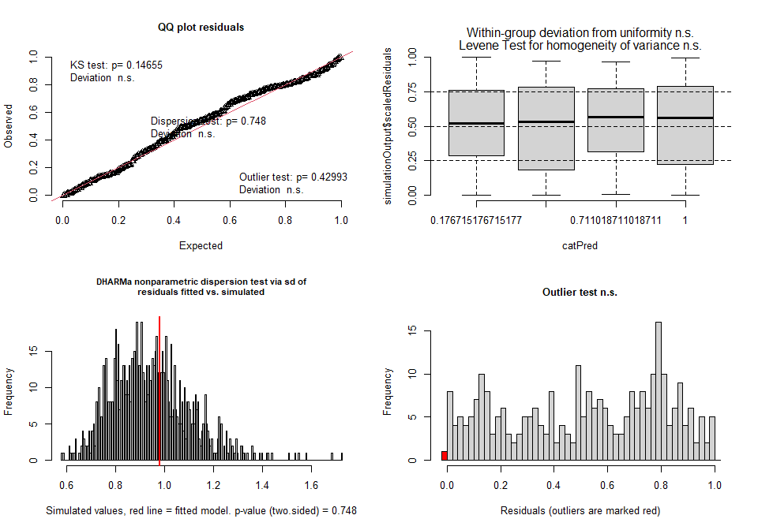<!-- -->

```
## 
## 	DHARMa outlier test based on exact binomial test with approximate
## 	expectations
## 
## data:  simulationOutput
## outliers at both margin(s) = 1, observations = 281, p-value = 0.4299
## alternative hypothesis: true probability of success is not equal to 0.001998002
## 95 percent confidence interval:
##  0.0000900949 0.0196673699
## sample estimates:
## frequency of outliers (expected: 0.001998001998002 ) 
##                                          0.003558719
```

``` r
DHARMa.sum(Model = lm2)
```

```
## 1. Kolmogorov-Smirnov test indicates deviations of the residuals from uniform distribution. H0: The model fits the data well; Ha: The model does not fit the data well
```

```
## 
## 	Asymptotic one-sample Kolmogorov-Smirnov test
## 
## data:  simulationOutput$scaledResiduals
## D = 0.064135, p-value = 0.198
## alternative hypothesis: two-sided
```

```
## 2. Test for over-dispersion. H0: No over-dispersion in the model; Ha: Over-dispersion in the model
```

```
## 
## 	DHARMa nonparametric dispersion test via sd of residuals fitted vs.
## 	simulated
## 
## data:  simulationOutput
## dispersion = 1.0072, p-value = 0.93
## alternative hypothesis: two.sided
## 
## 3. Test for outliers. H0: No ouliers in the model; Ha: Outliers in the model
```

<!-- -->

```
## 
## 	DHARMa outlier test based on exact binomial test with approximate
## 	expectations
## 
## data:  simulationOutput
## outliers at both margin(s) = 1, observations = 281, p-value = 0.4299
## alternative hypothesis: true probability of success is not equal to 0.001998002
## 95 percent confidence interval:
##  0.0000900949 0.0196673699
## sample estimates:
## frequency of outliers (expected: 0.001998001998002 ) 
##                                          0.003558719
```

``` r
DHARMa.sum(Model = lm3b)
```

```
## 1. Kolmogorov-Smirnov test indicates deviations of the residuals from uniform distribution. H0: The model fits the data well; Ha: The model does not fit the data well
```

```
## 
## 	Asymptotic one-sample Kolmogorov-Smirnov test
## 
## data:  simulationOutput$scaledResiduals
## D = 0.077278, p-value = 0.06973
## alternative hypothesis: two-sided
```

```
## 2. Test for over-dispersion. H0: No over-dispersion in the model; Ha: Over-dispersion in the model
```

```
## 
## 	DHARMa nonparametric dispersion test via sd of residuals fitted vs.
## 	simulated
## 
## data:  simulationOutput
## dispersion = 1.0307, p-value = 0.75
## alternative hypothesis: two.sided
## 
## 3. Test for outliers. H0: No ouliers in the model; Ha: Outliers in the model
```

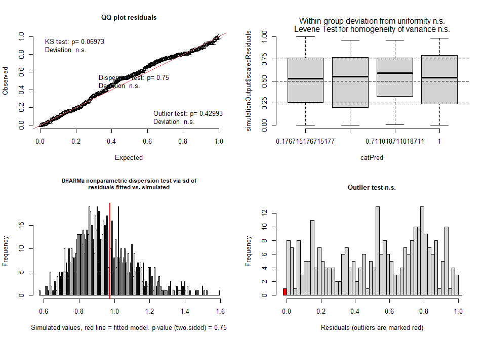<!-- -->

```
## 
## 	DHARMa outlier test based on exact binomial test with approximate
## 	expectations
## 
## data:  simulationOutput
## outliers at both margin(s) = 1, observations = 281, p-value = 0.4299
## alternative hypothesis: true probability of success is not equal to 0.001998002
## 95 percent confidence interval:
##  0.0000900949 0.0196673699
## sample estimates:
## frequency of outliers (expected: 0.001998001998002 ) 
##                                          0.003558719
```

``` r
DHARMa.sum(Model = lm3)
```

```
## 1. Kolmogorov-Smirnov test indicates deviations of the residuals from uniform distribution. H0: The model fits the data well; Ha: The model does not fit the data well
```

```
## 
## 	Asymptotic one-sample Kolmogorov-Smirnov test
## 
## data:  simulationOutput$scaledResiduals
## D = 0.07063, p-value = 0.1212
## alternative hypothesis: two-sided
```

```
## 2. Test for over-dispersion. H0: No over-dispersion in the model; Ha: Over-dispersion in the model
```

```
## 
## 	DHARMa nonparametric dispersion test via sd of residuals fitted vs.
## 	simulated
## 
## data:  simulationOutput
## dispersion = 1.039, p-value = 0.748
## alternative hypothesis: two.sided
## 
## 3. Test for outliers. H0: No ouliers in the model; Ha: Outliers in the model
```

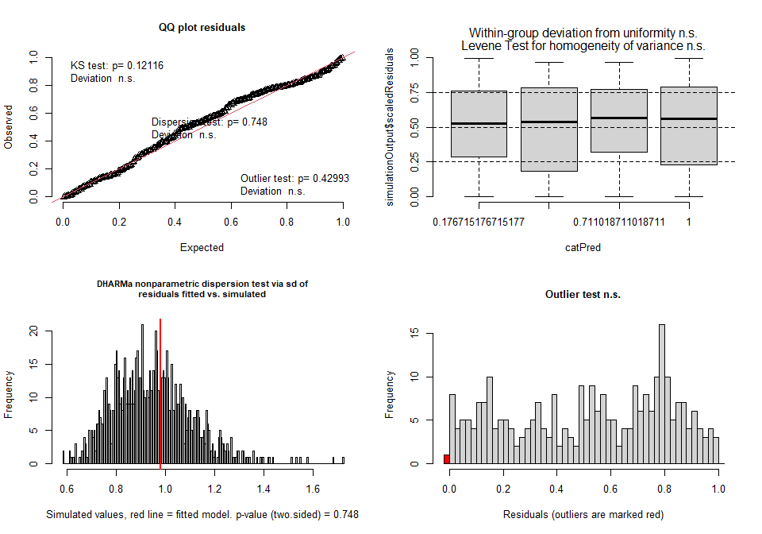<!-- -->

```
## 
## 	DHARMa outlier test based on exact binomial test with approximate
## 	expectations
## 
## data:  simulationOutput
## outliers at both margin(s) = 1, observations = 281, p-value = 0.4299
## alternative hypothesis: true probability of success is not equal to 0.001998002
## 95 percent confidence interval:
##  0.0000900949 0.0196673699
## sample estimates:
## frequency of outliers (expected: 0.001998001998002 ) 
##                                          0.003558719
```

``` r
DHARMa.sum(Model = lm4)
```

```
## 1. Kolmogorov-Smirnov test indicates deviations of the residuals from uniform distribution. H0: The model fits the data well; Ha: The model does not fit the data well
```

```
## 
## 	Asymptotic one-sample Kolmogorov-Smirnov test
## 
## data:  simulationOutput$scaledResiduals
## D = 0.065135, p-value = 0.1842
## alternative hypothesis: two-sided
```

```
## 2. Test for over-dispersion. H0: No over-dispersion in the model; Ha: Over-dispersion in the model
```

```
## 
## 	DHARMa nonparametric dispersion test via sd of residuals fitted vs.
## 	simulated
## 
## data:  simulationOutput
## dispersion = 1.0072, p-value = 0.93
## alternative hypothesis: two.sided
## 
## 3. Test for outliers. H0: No ouliers in the model; Ha: Outliers in the model
```

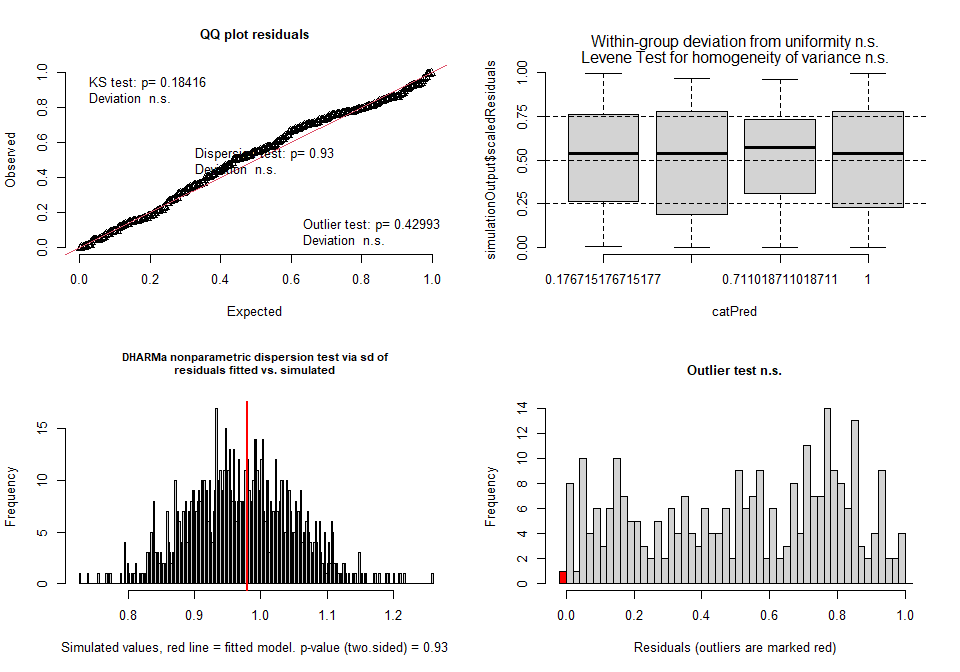<!-- -->

```
## 
## 	DHARMa outlier test based on exact binomial test with approximate
## 	expectations
## 
## data:  simulationOutput
## outliers at both margin(s) = 1, observations = 281, p-value = 0.4299
## alternative hypothesis: true probability of success is not equal to 0.001998002
## 95 percent confidence interval:
##  0.0000900949 0.0196673699
## sample estimates:
## frequency of outliers (expected: 0.001998001998002 ) 
##                                          0.003558719
```

``` r
DHARMa.sum(Model = lm5b)
```

```
## 1. Kolmogorov-Smirnov test indicates deviations of the residuals from uniform distribution. H0: The model fits the data well; Ha: The model does not fit the data well
```

```
## 
## 	Asymptotic one-sample Kolmogorov-Smirnov test
## 
## data:  simulationOutput$scaledResiduals
## D = 0.075278, p-value = 0.08278
## alternative hypothesis: two-sided
```

```
## 2. Test for over-dispersion. H0: No over-dispersion in the model; Ha: Over-dispersion in the model
```

```
## 
## 	DHARMa nonparametric dispersion test via sd of residuals fitted vs.
## 	simulated
## 
## data:  simulationOutput
## dispersion = 1.0308, p-value = 0.75
## alternative hypothesis: two.sided
## 
## 3. Test for outliers. H0: No ouliers in the model; Ha: Outliers in the model
```

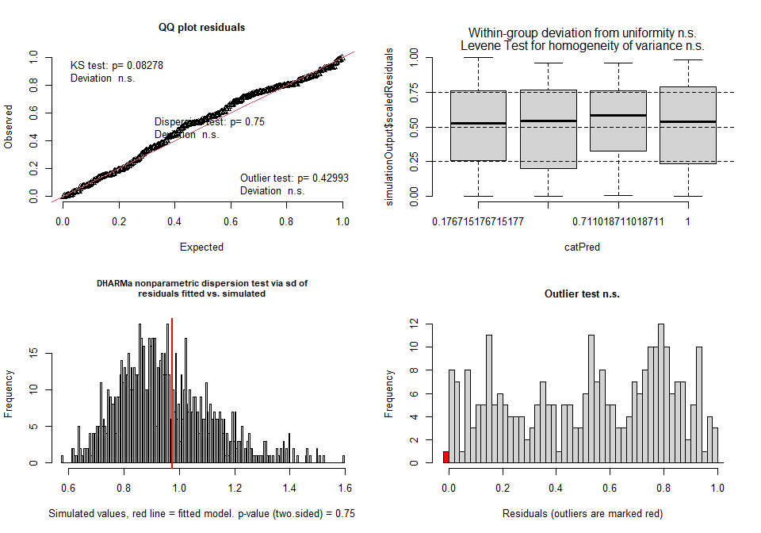<!-- -->

```
## 
## 	DHARMa outlier test based on exact binomial test with approximate
## 	expectations
## 
## data:  simulationOutput
## outliers at both margin(s) = 1, observations = 281, p-value = 0.4299
## alternative hypothesis: true probability of success is not equal to 0.001998002
## 95 percent confidence interval:
##  0.0000900949 0.0196673699
## sample estimates:
## frequency of outliers (expected: 0.001998001998002 ) 
##                                          0.003558719
```

``` r
DHARMa.sum(Model = lm5)
```

```
## 1. Kolmogorov-Smirnov test indicates deviations of the residuals from uniform distribution. H0: The model fits the data well; Ha: The model does not fit the data well
```

```
## 
## 	Asymptotic one-sample Kolmogorov-Smirnov test
## 
## data:  simulationOutput$scaledResiduals
## D = 0.069189, p-value = 0.1357
## alternative hypothesis: two-sided
```

```
## 2. Test for over-dispersion. H0: No over-dispersion in the model; Ha: Over-dispersion in the model
```

```
## 
## 	DHARMa nonparametric dispersion test via sd of residuals fitted vs.
## 	simulated
## 
## data:  simulationOutput
## dispersion = 1.039, p-value = 0.748
## alternative hypothesis: two.sided
## 
## 3. Test for outliers. H0: No ouliers in the model; Ha: Outliers in the model
```

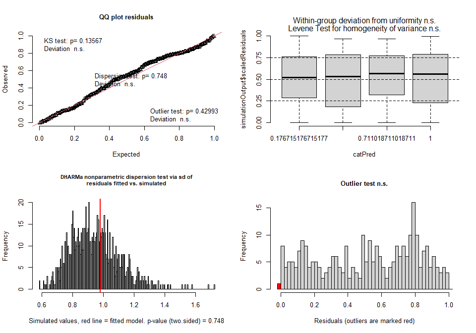<!-- -->

```
## 
## 	DHARMa outlier test based on exact binomial test with approximate
## 	expectations
## 
## data:  simulationOutput
## outliers at both margin(s) = 1, observations = 281, p-value = 0.4299
## alternative hypothesis: true probability of success is not equal to 0.001998002
## 95 percent confidence interval:
##  0.0000900949 0.0196673699
## sample estimates:
## frequency of outliers (expected: 0.001998001998002 ) 
##                                          0.003558719
```

``` r
DHARMa.sum(Model = lm6)
```

```
## 1. Kolmogorov-Smirnov test indicates deviations of the residuals from uniform distribution. H0: The model fits the data well; Ha: The model does not fit the data well
```

```
## 
## 	Asymptotic one-sample Kolmogorov-Smirnov test
## 
## data:  simulationOutput$scaledResiduals
## D = 0.065135, p-value = 0.1842
## alternative hypothesis: two-sided
```

```
## 2. Test for over-dispersion. H0: No over-dispersion in the model; Ha: Over-dispersion in the model
```

```
## 
## 	DHARMa nonparametric dispersion test via sd of residuals fitted vs.
## 	simulated
## 
## data:  simulationOutput
## dispersion = 1.0072, p-value = 0.93
## alternative hypothesis: two.sided
## 
## 3. Test for outliers. H0: No ouliers in the model; Ha: Outliers in the model
```

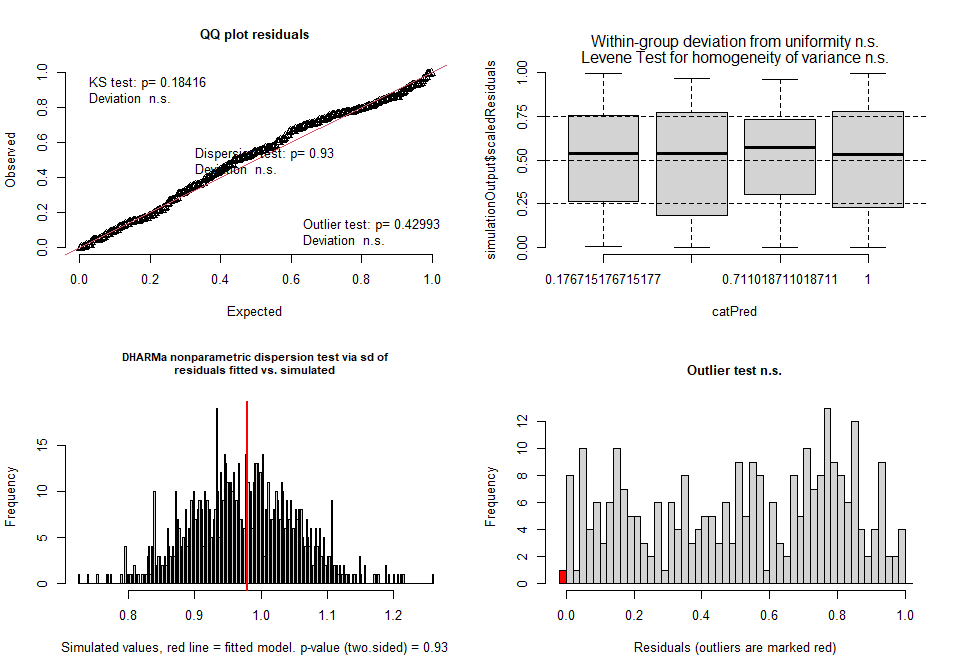<!-- -->

```
## 
## 	DHARMa outlier test based on exact binomial test with approximate
## 	expectations
## 
## data:  simulationOutput
## outliers at both margin(s) = 1, observations = 281, p-value = 0.4299
## alternative hypothesis: true probability of success is not equal to 0.001998002
## 95 percent confidence interval:
##  0.0000900949 0.0196673699
## sample estimates:
## frequency of outliers (expected: 0.001998001998002 ) 
##                                          0.003558719
```

``` r
DHARMa.sum(Model = glm1b)
```

```
## 1. Kolmogorov-Smirnov test indicates deviations of the residuals from uniform distribution. H0: The model fits the data well; Ha: The model does not fit the data well
```

```
## 
## 	Asymptotic one-sample Kolmogorov-Smirnov test
## 
## data:  simulationOutput$scaledResiduals
## D = 0.079865, p-value = 0.05549
## alternative hypothesis: two-sided
```

```
## 2. Test for over-dispersion. H0: No over-dispersion in the model; Ha: Over-dispersion in the model
```

```
## 
## 	DHARMa nonparametric dispersion test via sd of residuals fitted vs.
## 	simulated
## 
## data:  simulationOutput
## dispersion = 1.0223, p-value = 0.804
## alternative hypothesis: two.sided
## 
## 3. Test for outliers. H0: No ouliers in the model; Ha: Outliers in the model
```

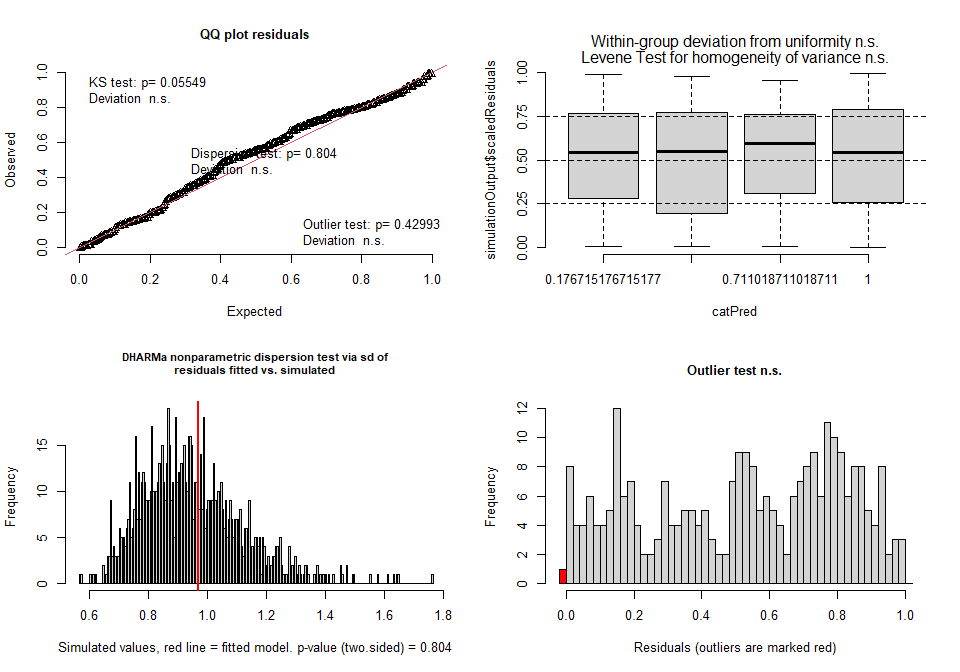<!-- -->

```
## 
## 	DHARMa outlier test based on exact binomial test with approximate
## 	expectations
## 
## data:  simulationOutput
## outliers at both margin(s) = 1, observations = 281, p-value = 0.4299
## alternative hypothesis: true probability of success is not equal to 0.001998002
## 95 percent confidence interval:
##  0.0000900949 0.0196673699
## sample estimates:
## frequency of outliers (expected: 0.001998001998002 ) 
##                                          0.003558719
```

``` r
DHARMa.sum(Model = glm1)
```

```
## 1. Kolmogorov-Smirnov test indicates deviations of the residuals from uniform distribution. H0: The model fits the data well; Ha: The model does not fit the data well
```

```
## 
## 	Asymptotic one-sample Kolmogorov-Smirnov test
## 
## data:  simulationOutput$scaledResiduals
## D = 0.072342, p-value = 0.1056
## alternative hypothesis: two-sided
```

```
## 2. Test for over-dispersion. H0: No over-dispersion in the model; Ha: Over-dispersion in the model
```

```
## 
## 	DHARMa nonparametric dispersion test via sd of residuals fitted vs.
## 	simulated
## 
## data:  simulationOutput
## dispersion = 1.0229, p-value = 0.802
## alternative hypothesis: two.sided
## 
## 3. Test for outliers. H0: No ouliers in the model; Ha: Outliers in the model
```

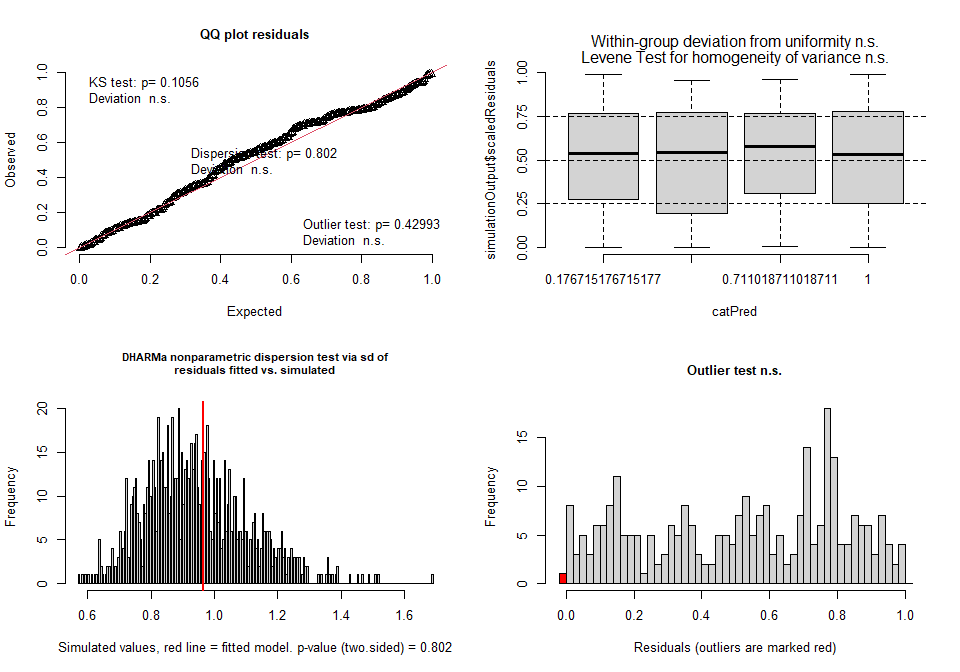<!-- -->

```
## 
## 	DHARMa outlier test based on exact binomial test with approximate
## 	expectations
## 
## data:  simulationOutput
## outliers at both margin(s) = 1, observations = 281, p-value = 0.4299
## alternative hypothesis: true probability of success is not equal to 0.001998002
## 95 percent confidence interval:
##  0.0000900949 0.0196673699
## sample estimates:
## frequency of outliers (expected: 0.001998001998002 ) 
##                                          0.003558719
```

``` r
DHARMa.sum(Model = glm2)
```

```
## 1. Kolmogorov-Smirnov test indicates deviations of the residuals from uniform distribution. H0: The model fits the data well; Ha: The model does not fit the data well
```

```
## 
## 	Asymptotic one-sample Kolmogorov-Smirnov test
## 
## data:  simulationOutput$scaledResiduals
## D = 0.068306, p-value = 0.1452
## alternative hypothesis: two-sided
```

```
## 2. Test for over-dispersion. H0: No over-dispersion in the model; Ha: Over-dispersion in the model
```

```
## 
## 	DHARMa nonparametric dispersion test via sd of residuals fitted vs.
## 	simulated
## 
## data:  simulationOutput
## dispersion = 0.99776, p-value = 0.966
## alternative hypothesis: two.sided
## 
## 3. Test for outliers. H0: No ouliers in the model; Ha: Outliers in the model
```

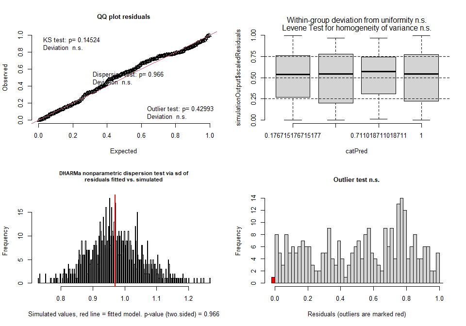<!-- -->

```
## 
## 	DHARMa outlier test based on exact binomial test with approximate
## 	expectations
## 
## data:  simulationOutput
## outliers at both margin(s) = 1, observations = 281, p-value = 0.4299
## alternative hypothesis: true probability of success is not equal to 0.001998002
## 95 percent confidence interval:
##  0.0000900949 0.0196673699
## sample estimates:
## frequency of outliers (expected: 0.001998001998002 ) 
##                                          0.003558719
```

``` r
DHARMa.sum(Model = glm3b)
```

```
## 1. Kolmogorov-Smirnov test indicates deviations of the residuals from uniform distribution. H0: The model fits the data well; Ha: The model does not fit the data well
```

```
## 
## 	Asymptotic one-sample Kolmogorov-Smirnov test
## 
## data:  simulationOutput$scaledResiduals
## D = 0.072043, p-value = 0.1082
## alternative hypothesis: two-sided
```

```
## 2. Test for over-dispersion. H0: No over-dispersion in the model; Ha: Over-dispersion in the model
```

```
## 
## 	DHARMa nonparametric dispersion test via sd of residuals fitted vs.
## 	simulated
## 
## data:  simulationOutput
## dispersion = 1.0404, p-value = 0.742
## alternative hypothesis: two.sided
## 
## 3. Test for outliers. H0: No ouliers in the model; Ha: Outliers in the model
```

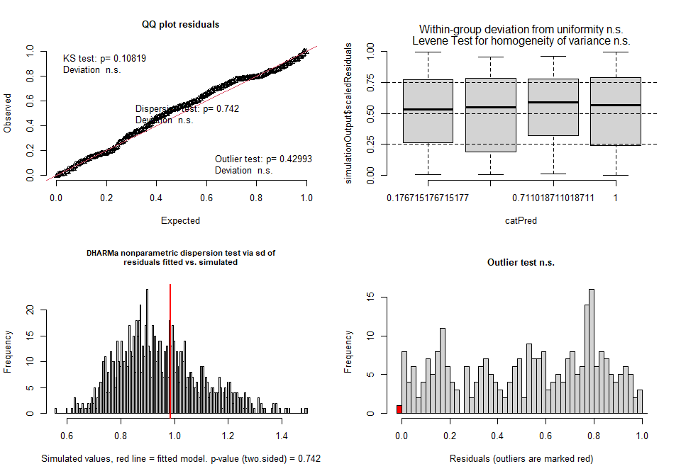<!-- -->

```
## 
## 	DHARMa outlier test based on exact binomial test with approximate
## 	expectations
## 
## data:  simulationOutput
## outliers at both margin(s) = 1, observations = 281, p-value = 0.4299
## alternative hypothesis: true probability of success is not equal to 0.001998002
## 95 percent confidence interval:
##  0.0000900949 0.0196673699
## sample estimates:
## frequency of outliers (expected: 0.001998001998002 ) 
##                                          0.003558719
```

``` r
DHARMa.sum(Model = glm3)
```

```
## 1. Kolmogorov-Smirnov test indicates deviations of the residuals from uniform distribution. H0: The model fits the data well; Ha: The model does not fit the data well
```

```
## 
## 	Asymptotic one-sample Kolmogorov-Smirnov test
## 
## data:  simulationOutput$scaledResiduals
## D = 0.073224, p-value = 0.09824
## alternative hypothesis: two-sided
```

```
## 2. Test for over-dispersion. H0: No over-dispersion in the model; Ha: Over-dispersion in the model
```

```
## 
## 	DHARMa nonparametric dispersion test via sd of residuals fitted vs.
## 	simulated
## 
## data:  simulationOutput
## dispersion = 1.0236, p-value = 0.804
## alternative hypothesis: two.sided
## 
## 3. Test for outliers. H0: No ouliers in the model; Ha: Outliers in the model
```

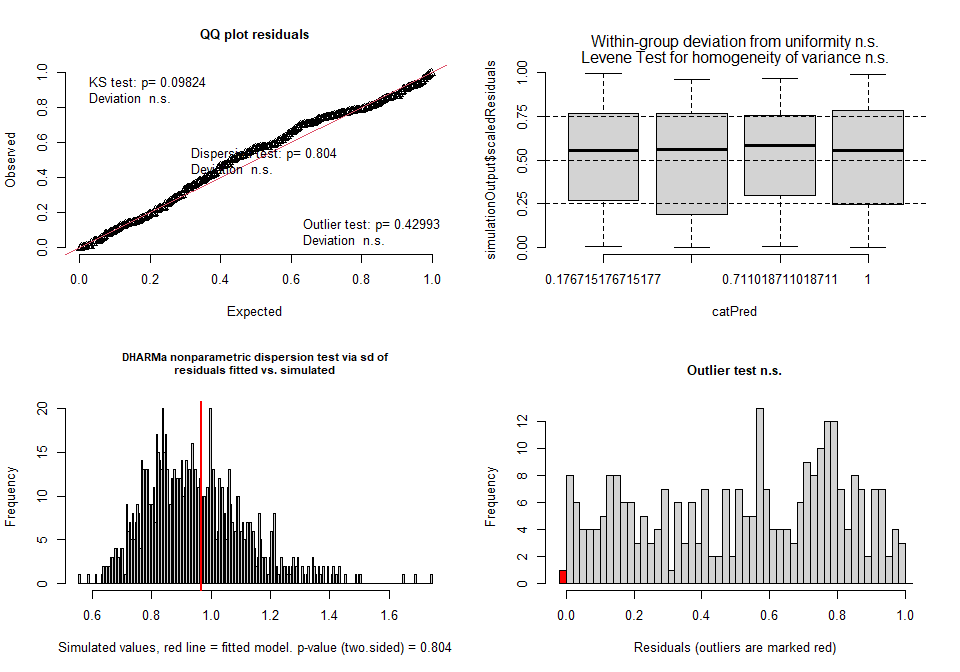<!-- -->

```
## 
## 	DHARMa outlier test based on exact binomial test with approximate
## 	expectations
## 
## data:  simulationOutput
## outliers at both margin(s) = 1, observations = 281, p-value = 0.4299
## alternative hypothesis: true probability of success is not equal to 0.001998002
## 95 percent confidence interval:
##  0.0000900949 0.0196673699
## sample estimates:
## frequency of outliers (expected: 0.001998001998002 ) 
##                                          0.003558719
```

``` r
DHARMa.sum(Model = glm4)
```

```
## 1. Kolmogorov-Smirnov test indicates deviations of the residuals from uniform distribution. H0: The model fits the data well; Ha: The model does not fit the data well
```

```
## 
## 	Asymptotic one-sample Kolmogorov-Smirnov test
## 
## data:  simulationOutput$scaledResiduals
## D = 0.064872, p-value = 0.1877
## alternative hypothesis: two-sided
```

```
## 2. Test for over-dispersion. H0: No over-dispersion in the model; Ha: Over-dispersion in the model
```

```
## 
## 	DHARMa nonparametric dispersion test via sd of residuals fitted vs.
## 	simulated
## 
## data:  simulationOutput
## dispersion = 1.0007, p-value = 0.992
## alternative hypothesis: two.sided
## 
## 3. Test for outliers. H0: No ouliers in the model; Ha: Outliers in the model
```

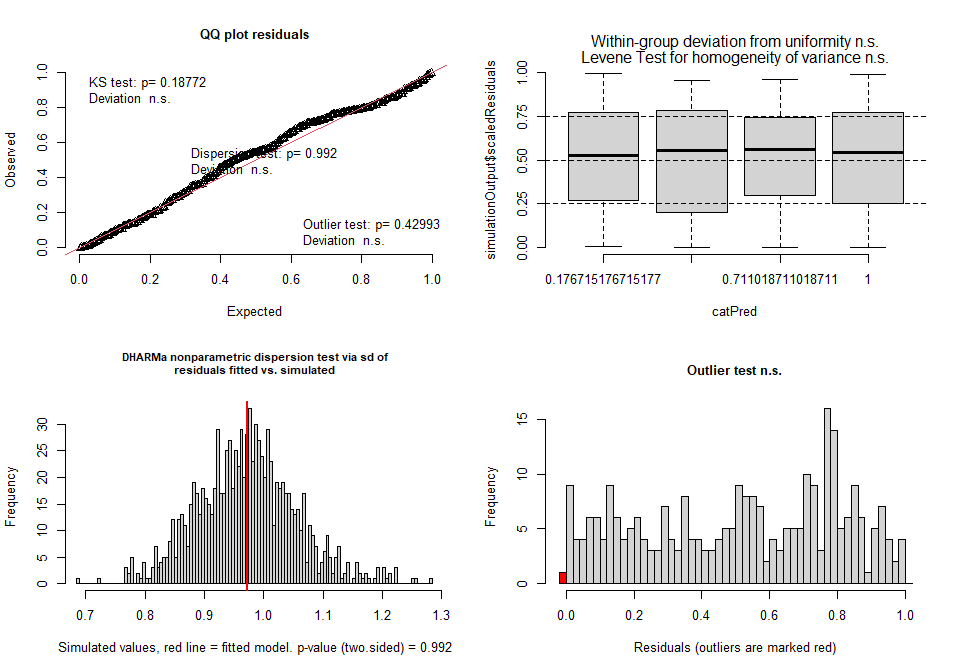<!-- -->

```
## 
## 	DHARMa outlier test based on exact binomial test with approximate
## 	expectations
## 
## data:  simulationOutput
## outliers at both margin(s) = 1, observations = 281, p-value = 0.4299
## alternative hypothesis: true probability of success is not equal to 0.001998002
## 95 percent confidence interval:
##  0.0000900949 0.0196673699
## sample estimates:
## frequency of outliers (expected: 0.001998001998002 ) 
##                                          0.003558719
```

``` r
DHARMa.sum(Model = glm5b)
```

```
## 1. Kolmogorov-Smirnov test indicates deviations of the residuals from uniform distribution. H0: The model fits the data well; Ha: The model does not fit the data well
```

```
## 
## 	Asymptotic one-sample Kolmogorov-Smirnov test
## 
## data:  simulationOutput$scaledResiduals
## D = 0.072367, p-value = 0.1054
## alternative hypothesis: two-sided
```

```
## 2. Test for over-dispersion. H0: No over-dispersion in the model; Ha: Over-dispersion in the model
```

```
## 
## 	DHARMa nonparametric dispersion test via sd of residuals fitted vs.
## 	simulated
## 
## data:  simulationOutput
## dispersion = 1.0313, p-value = 0.796
## alternative hypothesis: two.sided
## 
## 3. Test for outliers. H0: No ouliers in the model; Ha: Outliers in the model
```

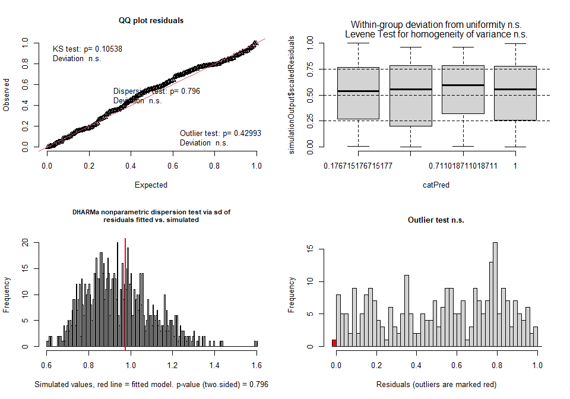<!-- -->

```
## 
## 	DHARMa outlier test based on exact binomial test with approximate
## 	expectations
## 
## data:  simulationOutput
## outliers at both margin(s) = 1, observations = 281, p-value = 0.4299
## alternative hypothesis: true probability of success is not equal to 0.001998002
## 95 percent confidence interval:
##  0.0000900949 0.0196673699
## sample estimates:
## frequency of outliers (expected: 0.001998001998002 ) 
##                                          0.003558719
```

``` r
DHARMa.sum(Model = glm5)
```

```
## 1. Kolmogorov-Smirnov test indicates deviations of the residuals from uniform distribution. H0: The model fits the data well; Ha: The model does not fit the data well
```

```
## 
## 	Asymptotic one-sample Kolmogorov-Smirnov test
## 
## data:  simulationOutput$scaledResiduals
## D = 0.076189, p-value = 0.0766
## alternative hypothesis: two-sided
```

```
## 2. Test for over-dispersion. H0: No over-dispersion in the model; Ha: Over-dispersion in the model
```

```
## 
## 	DHARMa nonparametric dispersion test via sd of residuals fitted vs.
## 	simulated
## 
## data:  simulationOutput
## dispersion = 1.0245, p-value = 0.804
## alternative hypothesis: two.sided
## 
## 3. Test for outliers. H0: No ouliers in the model; Ha: Outliers in the model
```

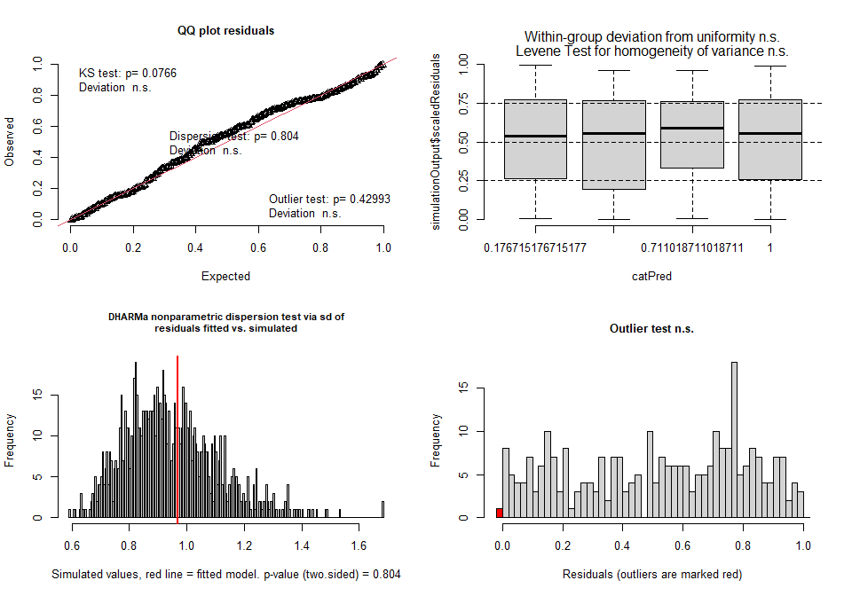<!-- -->

```
## 
## 	DHARMa outlier test based on exact binomial test with approximate
## 	expectations
## 
## data:  simulationOutput
## outliers at both margin(s) = 1, observations = 281, p-value = 0.4299
## alternative hypothesis: true probability of success is not equal to 0.001998002
## 95 percent confidence interval:
##  0.0000900949 0.0196673699
## sample estimates:
## frequency of outliers (expected: 0.001998001998002 ) 
##                                          0.003558719
```

``` r
DHARMa.sum(Model = glm6)
```

```
## 1. Kolmogorov-Smirnov test indicates deviations of the residuals from uniform distribution. H0: The model fits the data well; Ha: The model does not fit the data well
```

```
## 
## 	Asymptotic one-sample Kolmogorov-Smirnov test
## 
## data:  simulationOutput$scaledResiduals
## D = 0.063018, p-value = 0.2144
## alternative hypothesis: two-sided
```

```
## 2. Test for over-dispersion. H0: No over-dispersion in the model; Ha: Over-dispersion in the model
```

```
## 
## 	DHARMa nonparametric dispersion test via sd of residuals fitted vs.
## 	simulated
## 
## data:  simulationOutput
## dispersion = 1.0004, p-value = 0.998
## alternative hypothesis: two.sided
## 
## 3. Test for outliers. H0: No ouliers in the model; Ha: Outliers in the model
```

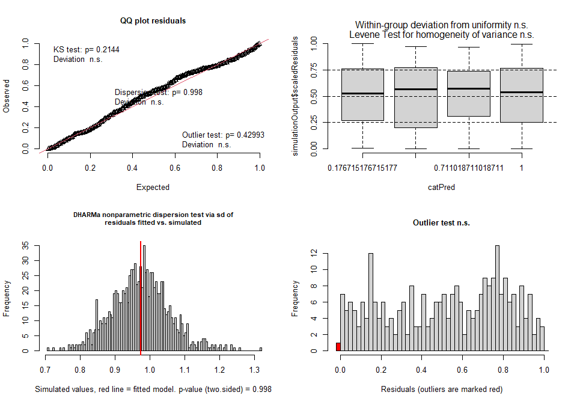<!-- -->

```
## 
## 	DHARMa outlier test based on exact binomial test with approximate
## 	expectations
## 
## data:  simulationOutput
## outliers at both margin(s) = 1, observations = 281, p-value = 0.4299
## alternative hypothesis: true probability of success is not equal to 0.001998002
## 95 percent confidence interval:
##  0.0000900949 0.0196673699
## sample estimates:
## frequency of outliers (expected: 0.001998001998002 ) 
##                                          0.003558719
```
All equally good, let's take lm1b.

### Model output

``` r
summary(lm1b)
```

```
##  Family: gaussian  ( identity )
## Formula:          
## Shannon ~ Cat_treatment * Domestication + (1 | Accession) + (1 |      Batch)
## Data: total_diversity
## 
##       AIC       BIC    logLik -2*log(L)  df.resid 
##    -471.2    -445.7     242.6    -485.2       274 
## 
## Random effects:
## 
## Conditional model:
##  Groups    Name        Variance  Std.Dev. 
##  Accession (Intercept) 5.688e-03 7.542e-02
##  Batch     (Intercept) 5.132e-12 2.265e-06
##  Residual              9.268e-03 9.627e-02
## Number of obs: 281, groups:  Accession, 12; Batch, 2
## 
## Dispersion estimate for gaussian family (sigma^2): 0.00927 
## 
## Conditional model:
##                                           Estimate Std. Error z value Pr(>|z|)
## (Intercept)                              6.5849829  0.0360638  182.59   <2e-16
## Cat_treatmentMb                         -0.0006224  0.0179786   -0.03   0.9724
## DomesticationCultivated                  0.0400339  0.0471832    0.85   0.3962
## Cat_treatmentMb:DomesticationCultivated -0.0457513  0.0233804   -1.96   0.0504
##                                            
## (Intercept)                             ***
## Cat_treatmentMb                            
## DomesticationCultivated                    
## Cat_treatmentMb:DomesticationCultivated .  
## ---
## Signif. codes:  0 '***' 0.001 '**' 0.01 '*' 0.05 '.' 0.1 ' ' 1
```

``` r
# summary(lm2)
Anova(lm1b)
```

```
## Analysis of Deviance Table (Type II Wald chisquare tests)
## 
## Response: Shannon
##                              Chisq Df Pr(>Chisq)  
## Cat_treatment               5.7964  1    0.01606 *
## Domestication               0.1371  1    0.71117  
## Cat_treatment:Domestication 3.8292  1    0.05037 .
## ---
## Signif. codes:  0 '***' 0.001 '**' 0.01 '*' 0.05 '.' 0.1 ' ' 1
```

``` r
# Anova(lm2)

Alphadiv_Shan_Dom_CP <- as.data.frame(Anova(lm1))
write.csv(Alphadiv_Shan_Dom_CP, "C:/Users/kreek001/OneDrive - Wageningen University & Research/Chapters/Experimental Chapter 3/RScripts/GitHub/TwelveAccessionExperiment/MicrobiomeAnalysis/Data/Statistical_output/CP/Alphadiv_Shan_Dom_CP.csv")

# summary(lm3)
# summary(lm4)
# Anova(lm3)
# Anova(lm4)

# summary(lm5)
# summary(lm6)
# Anova(lm5)
# Anova(lm6)

# summary(glm1)
# summary(glm2
# Anova(glm1)
# Anova(glm2)
# 
# #summary(glm3)
# summary(glm4)
# #Anova(glm3)
# Anova(glm4)
# 
# summary(glm5)
# summary(glm6)
# Anova(glm5)
# Anova(glm6)
```

### Post hoc test

``` r
emmeans(lm1b, pairwise ~ Cat_treatment*Domestication)
```

```
## $emmeans
##  Cat_treatment Domestication emmean     SE  df asymp.LCL asymp.UCL
##  Co            Wild            6.58 0.0361 Inf      6.51      6.66
##  Mb            Wild            6.58 0.0360 Inf      6.51      6.65
##  Co            Cultivated      6.63 0.0304 Inf      6.57      6.68
##  Mb            Cultivated      6.58 0.0304 Inf      6.52      6.64
## 
## Confidence level used: 0.95 
## 
## $contrasts
##  contrast                       estimate     SE  df z.ratio p.value
##  Co Wild - Mb Wild              0.000622 0.0180 Inf   0.035  1.0000
##  Co Wild - Co Cultivated       -0.040034 0.0472 Inf  -0.848  0.8312
##  Co Wild - Mb Cultivated        0.006340 0.0472 Inf   0.134  0.9991
##  Mb Wild - Co Cultivated       -0.040656 0.0472 Inf  -0.862  0.8243
##  Mb Wild - Mb Cultivated        0.005717 0.0471 Inf   0.121  0.9994
##  Co Cultivated - Mb Cultivated  0.046374 0.0149 Inf   3.102  0.0104
## 
## P value adjustment: tukey method for comparing a family of 4 estimates
```

``` r
ph_sh_dom <- cld(emmeans(lm1b, pairwise ~ Cat_treatment*Domestication), Letters = letters)
print(ph_sh_dom)
```

```
##  Cat_treatment Domestication emmean     SE  df asymp.LCL asymp.UCL .group
##  Mb            Cultivated      6.58 0.0304 Inf      6.52      6.64  a    
##  Mb            Wild            6.58 0.0360 Inf      6.51      6.65  ab   
##  Co            Wild            6.58 0.0361 Inf      6.51      6.66  ab   
##  Co            Cultivated      6.63 0.0304 Inf      6.57      6.68   b   
## 
## Confidence level used: 0.95 
## P value adjustment: tukey method for comparing a family of 4 estimates 
## significance level used: alpha = 0.05 
## NOTE: If two or more means share the same grouping symbol,
##       then we cannot show them to be different.
##       But we also did not show them to be the same.
```

``` r
emmeans(lm1b, pairwise ~ Cat_treatment | Domestication)
```

```
## $emmeans
## Domestication = Wild:
##  Cat_treatment emmean     SE  df asymp.LCL asymp.UCL
##  Co              6.58 0.0361 Inf      6.51      6.66
##  Mb              6.58 0.0360 Inf      6.51      6.65
## 
## Domestication = Cultivated:
##  Cat_treatment emmean     SE  df asymp.LCL asymp.UCL
##  Co              6.63 0.0304 Inf      6.57      6.68
##  Mb              6.58 0.0304 Inf      6.52      6.64
## 
## Confidence level used: 0.95 
## 
## $contrasts
## Domestication = Wild:
##  contrast estimate     SE  df z.ratio p.value
##  Co - Mb  0.000622 0.0180 Inf   0.035  0.9724
## 
## Domestication = Cultivated:
##  contrast estimate     SE  df z.ratio p.value
##  Co - Mb  0.046374 0.0149 Inf   3.102  0.0019
```


# 3.3.1 Box plot diversity indexes Accession
### Data preperation Observed index

``` r
# Alter color facet wrap label
strip0 <- strip_themed(background_x = elem_list_rect(fill = c(rep("#0072B2", 5), rep("#D55E00", 7))),
                        text_x = elem_list_text(colour = c(rep("white", 5), rep("black", 7)),
                          size = rep(13, 12)))
ph_obs$Lab <- gsub(pattern = " ", replacement = "", x = ph_obs$.group)
ph_obs$Accession <- factor(ph_obs$Accession, levels = c("OH", "DD", "HE", "KI", "VL", "CD", "RI", "KT", "MC", "HM", "IT1", "GO1"))
ph_obs <- ph_obs[order(ph_obs$Accession), ]

Label <- c()

for (i in 1:length(ph_obs$Lab)) {
  Label[length(Label) + 1] <- ph_obs$Lab[i]
  Label[length(Label) + 1] <- ""
}

DataSum <- data.frame(Accession = rep(c("OH", "DD", "HE", "KI", "VL", "CD", "RI", "KT", "MC", "HM", "IT1", "GO1"), each = 2), 
                      Cat_treatment = rep(unique(total_diversity$Cat_treatment), times = 12),
                      Lab = Label)
DataSum$Accession <- factor(DataSum$Accession, levels = c("OH", "DD", "HE", "KI", "VL", "CD", "RI", "KT", "MC", "HM", "IT1", "GO1"))

Stats <- paste0("\nLMM: Accession: p < ", 0.001, "; Caterpillar treatment: p = ", 0.129, "; Interaction: p = 0.420")
```

### Boxplot Observed index

``` r
ggplot(data = total_diversity,
       mapping = aes(y = Observed, x = Cat_treatment, fill = Cat_treatment)) + #Defines the data
  stat_boxplot(aes(y = Observed, x = Cat_treatment), #Shows the error bars (should be added before box plots to have bars behind box plots)
               geom = "errorbar",
               linetype = 1,
               width = 0.2) +
  facet_wrap2(~ Accession, #facet wrap2 needed to color strip
             nrow = 1,
             strip = strip0
             #labeller = labeller(CaterpillarNr = c("4" = "4 Cat", "8" = "8 Cat"))
             ) + # Split data into three graphs, a graph for each caterpillar number
  geom_boxplot(outliers = FALSE) + #Defines that the graph will be a box plot and do not show outliers, this is shown by jitter
  geom_jitter(width = 0.25,
              height = 0,
              color = "black",
              alpha = 0.2) + # Transparency is regulated with the alpha argument
  stat_summary(fun = mean, 
               geom = "point", 
               size = 1.5, 
               color = "gray30", 
               fill = "white",
               shape = 23) + #Shows the mean as a white circle
  geom_segment(aes(x = 0.8, y = 2180, xend = 2.2, yend = 2180)) +
  geom_text(data = DataSum,
            aes(label = Label, y = 2230, x = 1.5), # fill out the significant letters
            size = 4,
            hjust = 0.5,
            #position = position_dodge(0.5)
           ) +
  ggtitle(Stats) +
  # scale_y_continuous(expand = c(0, 0),        #start graph at y = min and x = min
  #                    #breaks = seq(0, 1, 0.25), #steps on the y-axis
  #                    limits = c(0, max(data3$Weight*1.1))) +   #y limits
  scale_fill_manual(values = c("#882255", "#009E73")) + # Manually change the colors of the bars. You need to define fill in second line of the plot script to get it working; c("#009E73", "#56B4E9")
  ylab("Observed richness") +    #y-label with Mb in italic
  xlab("Caterpillar treatment") +
  theme(panel.background = element_rect(fill = "white"), #theme of the graph
        panel.border = element_blank(),
        axis.line = element_line(), #show line for x and y axis
        plot.title = element_text(size = 10, hjust = 0),
        axis.text = element_text(size = 13, color = "black"),
        axis.title = element_text(size = 16),
        axis.title.x = element_text(vjust = -0.5),
        axis.title.y = element_text(vjust = 2.5), #, hjust = -0
        #strip.text = element_text(size = 13),
        plot.margin = margin(5.5, 12, 5.5, 5.5, "points"),
        legend.position = "none")
```

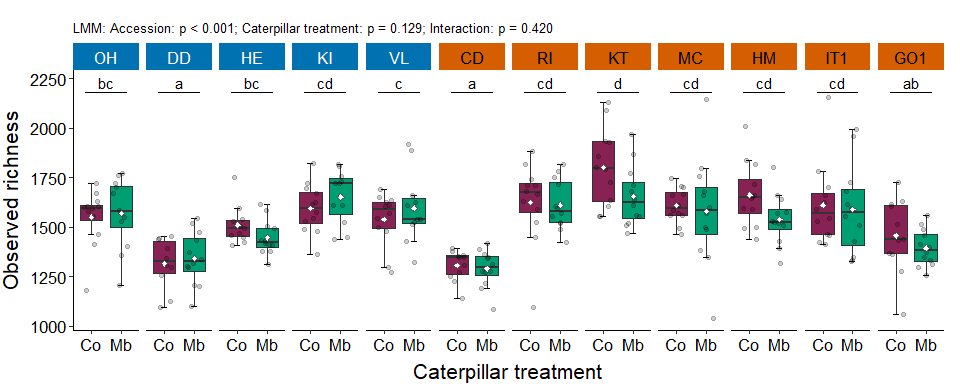<!-- -->

``` r
mapply(function(x)
  ggsave(plot = last_plot(), 
         filename = x,
         path = "C:/Users/kreek001/OneDrive - Wageningen University & Research/Chapters/Experimental Chapter 3/Result/Final graphs",
         scale = 2.2,
         width = 10,
         height = 4,
         units = "cm",
         dpi = 300),
  x = c("CP_AlphaDiv_obs_acc.svg", "CP_AlphaDiv_obs_acc.png"))
```

```
##                                                                                                                     CP_AlphaDiv_obs_acc.svg 
## "C:/Users/kreek001/OneDrive - Wageningen University & Research/Chapters/Experimental Chapter 3/Result/Final graphs/CP_AlphaDiv_obs_acc.svg" 
##                                                                                                                     CP_AlphaDiv_obs_acc.png 
## "C:/Users/kreek001/OneDrive - Wageningen University & Research/Chapters/Experimental Chapter 3/Result/Final graphs/CP_AlphaDiv_obs_acc.png"
```

<!-- ##### Different type of graph -->
<!-- ```{r, fig.width=10, fig.height=4} -->
<!-- ggplot(data = total_diversity, -->
<!--        mapping = aes(y = Observed, x = Accession, fill = Cat_treatment)) + #Defines the data -->
<!--   stat_boxplot(aes(y = Observed, x = Accession), #Shows the error bars (should be added before box plots to have bars behind box plots) -->
<!--                geom = "errorbar", -->
<!--                linetype = 1, -->
<!--                width = 0.2, -->
<!--                position = position_dodge(0.75)) + -->
<!--   # facet_wrap2(~ Accession, #facet wrap2 needed to color strip -->
<!--   #            nrow = 1, -->
<!--   #            strip = strip0 -->
<!--   #            #labeller = labeller(CaterpillarNr = c("4" = "4 Cat", "8" = "8 Cat")) -->
<!--   #            ) + # Split data into three graphs, a graph for each caterpillar number -->
<!--   geom_boxplot(outliers = FALSE) + #Defines that the graph will be a box plot and do not show outliers, this is shown by jitter -->
<!--   geom_jitter(width = 0.25, -->
<!--               height = 0, -->
<!--               color = "black", -->
<!--               alpha = 0.2) + # Transparency is regulated with the alpha argument -->
<!--   stat_summary(fun = mean, #mapping = aes(x = Cat_treatment, y = Observed), -->
<!--                geom = "point",  -->
<!--                size = 1.5,  -->
<!--                color = "gray30",  -->
<!--                fill = "white", -->
<!--                shape = 23) + #Shows the mean as a white circle -->
<!--   # geom_segment(aes(x = 0.8, y = 86, xend = 2.2, yend = 86)) + -->
<!--   # geom_text(data = DataSum, -->
<!--   #           aes(label = lab, y = 90), # fill out the significant letters -->
<!--   #           size = 4, -->
<!--   #           hjust = 0.5, -->
<!--   #           #position = position_dodge(0.5) -->
<!--   #          ) + -->
<!--   # scale_y_continuous(expand = c(0, 0),        #start graph at y = min and x = min -->
<!--   #                    #breaks = seq(0, 1, 0.25), #steps on the y-axis -->
<!--   #                    limits = c(0, max(data3$Weight*1.1))) +   #y limits -->
<!--   scale_fill_manual(values = c("#56B4E9", "#009E73")) + # Manually change the colors of the bars. You need to define fill in second line of the plot script to get it working; c("#009E73", "#56B4E9") -->
<!--   ylab("Observed") +    #y-label with Mb in italic -->
<!--   xlab("Caterpillar treatment") + -->
<!--   theme(panel.background = element_rect(fill = "white"), #theme of the graph -->
<!--         panel.border = element_blank(), #no border around the graph (for border, use: element_rect(color = "gray30", fill = NA)) -->
<!--         axis.line = element_line(), #show line for x and y axis -->
<!--         plot.title = element_text(size = 9, hjust = 0), -->
<!--         axis.text = element_text(size = 13, color = "black"), -->
<!--         axis.title = element_text(size = 16), -->
<!--         axis.title.x = element_text(vjust = -0.5), -->
<!--         axis.title.y = element_text(vjust = 2.5), #, hjust = -0 -->
<!--         strip.text = element_text(size = 13), -->
<!--         legend.position = "none") -->
<!-- ``` -->

### Data preperation Shannon diversity

``` r
# Alter color facet wrap label
strip0 <- strip_themed(background_x = elem_list_rect(fill = c(rep("#0072B2", 5), rep("#D55E00", 7))),
                       text_x = elem_list_text(colour = c(rep("white", 5), rep("black", 7)),
                          size = rep(13, 12)))
ph_sh$Lab <- gsub(pattern = " ", replacement = "", x = ph_sh$.group)
ph_sh$Accession <- factor(ph_sh$Accession, levels = c("OH", "DD", "HE", "KI", "VL", "CD", "RI", "KT", "MC", "HM", "IT1", "GO1"))
ph_sh <- ph_sh[order(ph_sh$Accession), ]

Label <- c()

for (i in 1:length(ph_sh$Lab)) {
  Label[length(Label) + 1] <- ph_sh$Lab[i]
  Label[length(Label) + 1] <- ""
}

DataSum_sh <- data.frame(Accession = rep(c("OH", "DD", "HE", "KI", "VL", "CD", "RI", "KT", "MC", "HM", "IT1", "GO1"), each = 2), 
                         Cat_treatment = rep(unique(total_diversity$Cat_treatment), times = 12),
                         Lab = Label
                         #Lab2 = c(rep("", 14), "*", rep("", 3), "*", rep("", 5))
                         )

DataSum_sh$Accession <- factor(DataSum_sh$Accession, levels = c("OH", "DD", "HE", "KI", "VL", "CD", "RI", "KT", "MC", "HM", "IT1", "GO1"))

Stats_sh <- paste0("\nLMM: Accession: p < ", 0.001, "; Caterpillar treatment: p = ", 0.013, "; Interaction: p = ", 0.164)
```

### Boxplot Shannon diversity

``` r
ggplot(data = total_diversity,
       mapping = aes(y = Shannon, x = Cat_treatment, fill = Cat_treatment)) + #Defines the data
  stat_boxplot(aes(y = Shannon, x = Cat_treatment), #Shows the error bars (should be added before box plots to have bars behind box plots)
               geom = "errorbar",
               linetype = 1,
               width = 0.2) +
  facet_wrap2(~ Accession, #facet wrap2 needed to color strip
             nrow = 1,
             strip = strip0
             #labeller = labeller(CaterpillarNr = c("4" = "4 Cat", "8" = "8 Cat"))
             ) + # Split data into three graphs, a graph for each caterpillar number
  geom_boxplot(outliers = FALSE) + #Defines that the graph will be a box plot and do not show outliers, this is shown by jitter
  geom_jitter(width = 0.25,
              height = 0,
              color = "black",
              alpha = 0.2) + # Transparency is regulated with the alpha argument
  stat_summary(fun = mean, 
               geom = "point", 
               size = 1.5, 
               color = "gray30", 
               fill = "white",
               shape = 23) + #Shows the mean as a white circle
  geom_segment(aes(x = 0.8, y = 7, xend = 2.2, yend = 7)) +
  geom_text(data = DataSum_sh,
            aes(label = Lab, y = 7.05, x = 1.5), # fill out the significant letters
            size = 4,
            hjust = 0.5,
            #position = position_dodge(0.5)
           ) +
  # geom_text(data = DataSum_sh,
  #           aes(label = Lab2, y = 6.92, x = 1.5), # fill out the significant letters
  #           size = 8,
  #           hjust = 0.5,
  #           #position = position_dodge(0.5)
  #          ) +
  ggtitle(Stats_sh) +
  # scale_y_continuous(expand = c(0, 0),        #start graph at y = min and x = min
  #                    #breaks = seq(0, 1, 0.25), #steps on the y-axis
  #                    limits = c(0, max(data3$Weight*1.1))) +   #y limits
  scale_fill_manual(values = c("#882255", "#009E73")) + # Manually change the colors of the bars. You need to define fill in second line of the plot script to get it working; c("#009E73", "#56B4E9")
  ylab("Shannon diversity") +    #y-label with Mb in italic
  xlab("Caterpillar treatment") +
  theme(panel.background = element_rect(fill = "white"), #theme of the graph
        panel.border = element_blank(),
        axis.line = element_line(), #show line for x and y axis
        plot.title = element_text(size = 10, hjust = 0),
        axis.text = element_text(size = 13, color = "black"),
        axis.title = element_text(size = 16),
        axis.title.x = element_text(vjust = -0.5),
        axis.title.y = element_text(vjust = 2.5), #, hjust = -0
        #strip.text = element_text(size = 13),
        plot.margin = margin(5.5, 12, 5.5, 5.5, "points"),
        legend.position = "none")
```

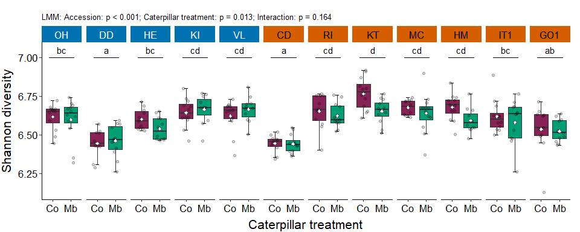<!-- -->

``` r
mapply(function(x)
  ggsave(plot = last_plot(), 
         filename = x,
         path = "C:/Users/kreek001/OneDrive - Wageningen University & Research/Chapters/Experimental Chapter 3/Result/Final graphs",
         scale = 2.2,
         width = 10,
         height = 4,
         units = "cm",
         dpi = 300),
  x = c("CP_AlphaDiv_shan_acc.svg", "CP_AlphaDiv_shan_acc.png"))
```

```
##                                                                                                                     CP_AlphaDiv_shan_acc.svg 
## "C:/Users/kreek001/OneDrive - Wageningen University & Research/Chapters/Experimental Chapter 3/Result/Final graphs/CP_AlphaDiv_shan_acc.svg" 
##                                                                                                                     CP_AlphaDiv_shan_acc.png 
## "C:/Users/kreek001/OneDrive - Wageningen University & Research/Chapters/Experimental Chapter 3/Result/Final graphs/CP_AlphaDiv_shan_acc.png"
```

# 3.3.2 Box plot diversity indexes Domestication
### Data preperation Observed index

``` r
# Alter color facet wrap label
strip0 <- strip_themed(background_x = elem_list_rect(fill = c(rep("#0072B2", 1), rep("#D55E00", 1))),
                       text_x = elem_list_text(colour = c(rep("white", 1), rep("black", 1)),
                          size = rep(13, 2)))

# Make a data frame to add significant letters to boxplot
DataSum_obs_dom <- data.frame(Domestication = rep(c("Wild", "Cultivated"), each = 2),
                             Cat_treatment = rep(unique(total_diversity$Cat_treatment), times = 2),
                             Label = c("", "", "*", ""))
DataSum_obs_dom$Domestication <- factor(DataSum_obs_dom$Domestication, levels = c("Wild", "Cultivated"))

# Statistical information above plot
Stats_obs_dom <- paste0("LMM: Dom: p = 0.132", "; Cat: p = 0.560", ";\nInteraction: p = ", 0.038)
```

### Boxplot Observed index

``` r
ggplot(data = total_diversity,
       mapping = aes(y = Observed, x = Cat_treatment, fill = Cat_treatment)) + #Defines the data
  stat_boxplot(aes(y = Observed, x = Cat_treatment), #Shows the error bars (should be added before box plots to have bars behind box plots)
               geom = "errorbar",
               linetype = 1,
               width = 0.2) +
  facet_wrap2(~ Domestication, #facet wrap2 needed to color strip
             nrow = 1,
             strip = strip0
             #labeller = labeller(CaterpillarNr = c("4" = "4 Cat", "8" = "8 Cat"))
             ) + # Split data into three graphs, a graph for each caterpillar number
  geom_boxplot(outliers = FALSE) + #Defines that the graph will be a box plot and do not show outliers, this is shown by jitter
  geom_jitter(width = 0.25,
              height = 0,
              color = "black",
              alpha = 0.2) + # Transparency is regulated with the alpha argument
  stat_summary(fun = mean, 
               geom = "point", 
               size = 1.5, 
               color = "gray30", 
               fill = "white",
               shape = 23) + #Shows the mean as a white circle
  # geom_segment(aes(x = 0.8, y = 2180, xend = 2.2, yend = 2180)) +
  geom_text(data = DataSum_obs_dom,
            aes(label = Label, y = 2200, x = 1.5), # fill out the significant letters
            size = 8,
            hjust = 0.5,
            #position = position_dodge(0.5)
           ) +
  ggtitle(Stats_obs_dom) +
  # scale_y_continuous(expand = c(0, 0),        #start graph at y = min and x = min
  #                    #breaks = seq(0, 1, 0.25), #steps on the y-axis
  #                    limits = c(0, max(data3$Weight*1.1))) +   #y limits
  scale_fill_manual(values = c("#882255", "#009E73")) + # Manually change the colors of the bars. You need to define fill in second line of the plot script to get it working; c("#009E73", "#56B4E9")
  scale_y_continuous(#breaks = seq(0, 1, 0.25), #steps on the y-axis
                     limits = c(1000, 2260)) +   #y limits
  ylab("Observed diversity") +    #y-label with Mb in italic
  xlab("Caterpillar treatment") +
  theme(panel.background = element_rect(fill = "white"), #theme of the graph
        panel.border = element_blank(), #no border around the graph (for border, use: element_rect(color = "gray30", fill = NA))
        axis.line = element_line(), #show line for x and y axis
        plot.title = element_text(size = 10, hjust = 0),
        axis.text = element_text(size = 13, color = "black"),
        axis.title = element_text(size = 16),
        axis.title.x = element_text(vjust = -0.5),
        axis.title.y = element_text(vjust = 2.5), #, hjust = -0
        strip.text = element_text(size = 13),
        plot.margin = margin(5.5, 12, 5.5, 5.5, "points"),
        legend.position = "none")
```

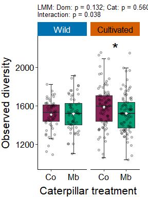<!-- -->

``` r
mapply(function(x)
  ggsave(plot = last_plot(), 
         filename = x,
         path = "C:/Users/kreek001/OneDrive - Wageningen University & Research/Chapters/Experimental Chapter 3/Result/Final graphs",
         scale = 2.2,
         width = 3.2,
         height = 4,
         units = "cm",
         dpi = 300),
  x = c("CP_AlphaDiv_obs_dom.svg", "CP_AlphaDiv_obs_dom.png"))
```

```
##                                                                                                                     CP_AlphaDiv_obs_dom.svg 
## "C:/Users/kreek001/OneDrive - Wageningen University & Research/Chapters/Experimental Chapter 3/Result/Final graphs/CP_AlphaDiv_obs_dom.svg" 
##                                                                                                                     CP_AlphaDiv_obs_dom.png 
## "C:/Users/kreek001/OneDrive - Wageningen University & Research/Chapters/Experimental Chapter 3/Result/Final graphs/CP_AlphaDiv_obs_dom.png"
```

### Data preperation Shannon diversity

``` r
# Alter color facet wrap label
strip0 <- strip_themed(background_x = elem_list_rect(fill = c(rep("#0072B2", 1), rep("#D55E00", 1))),
                       text_x = elem_list_text(colour = c(rep("white", 1), rep("black", 1)),
                          size = rep(13, 2)))

#Make a data frame to add significant letters to boxplot
DataSum_sh_dom <- data.frame(Domestication = rep(c("Wild", "Cultivated"), each = 2),
                             Cat_treatment = rep(unique(total_diversity$Cat_treatment), times = 2),
                             Label = c("", "", "**", ""))
DataSum_sh_dom$Domestication <- factor(DataSum_sh_dom$Domestication, levels = c("Wild", "Cultivated"))

# Statistical information above plot
Stats_sh_dom <- paste0("LMM: Dom: p = ", 0.711, "; Cat: p = ", 0.016, ";\nInteraction: p = ", "0.050")
```

### Boxplot Shannon diversity

``` r
ggplot(data = total_diversity,
       mapping = aes(y = Shannon, x = Cat_treatment, fill = Cat_treatment)) + #Defines the data
  stat_boxplot(aes(y = Shannon, x = Cat_treatment), #Shows the error bars (should be added before box plots to have bars behind box plots)
               geom = "errorbar",
               linetype = 1,
               width = 0.2) +
  facet_wrap2(~ Domestication, #facet wrap2 needed to color strip
             nrow = 1,
             strip = strip0
             #labeller = labeller(CaterpillarNr = c("4" = "4 Cat", "8" = "8 Cat"))
             ) + # Split data into three graphs, a graph for each caterpillar number
  geom_boxplot(outliers = FALSE) + #Defines that the graph will be a box plot and do not show outliers, this is shown by jitter
  geom_jitter(width = 0.25,
              height = 0,
              color = "black",
              alpha = 0.2) + # Transparency is regulated with the alpha argument
  stat_summary(fun = mean, 
               geom = "point", 
               size = 1.5, 
               color = "gray30", 
               fill = "white",
               shape = 23) + #Shows the mean as a white circle
  # geom_segment(aes(x = 0.8, y = 6.97, xend = 2.2, yend = 6.97)) +
  geom_text(data = DataSum_sh_dom,
            aes(label = Label, y = 6.95, x = 1.5), # fill out the significant letters
            size = 8,
            hjust = 0.5,
            #position = position_dodge(0.5)
           ) +
  ggtitle(Stats_sh_dom) +
  # scale_y_continuous(expand = c(0, 0),        #start graph at y = min and x = min
  #                    #breaks = seq(0, 1, 0.25), #steps on the y-axis
  #                    limits = c(0, max(data3$Weight*1.1))) +   #y limits
  scale_fill_manual(values = c("#882255", "#009E73")) + # Manually change the colors of the bars. You need to define fill in second line of the plot script to get it working; c("#009E73", "#56B4E9")
  scale_y_continuous(#breaks = seq(0, 1, 0.25), #steps on the y-axis
                     limits = c(6.1, 7)) +   #y limits
  ylab("Shannon diversity") +    #y-label with Mb in italic
  xlab("Caterpillar treatment") +
  theme(panel.background = element_rect(fill = "white"), #theme of the graph
        panel.border = element_blank(),
        axis.line = element_line(), #show line for x and y axis
        plot.title = element_text(size = 10, hjust = 0),
        axis.text = element_text(size = 13, color = "black"),
        axis.title = element_text(size = 16),
        axis.title.x = element_text(vjust = -0.5),
        axis.title.y = element_text(vjust = 2.5), #, hjust = -0
        strip.text = element_text(size = 13),
        plot.margin = margin(5.5, 12, 5.5, 5.5, "points"),
        legend.position = "none")
```

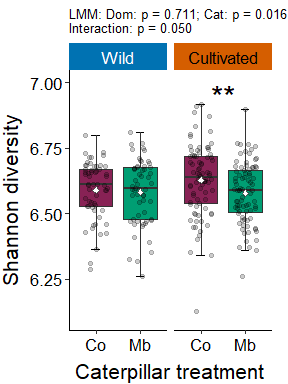<!-- -->

``` r
mapply(function(x)
  ggsave(plot = last_plot(), 
         filename = x,
         path = "C:/Users/kreek001/OneDrive - Wageningen University & Research/Chapters/Experimental Chapter 3/Result/Final graphs",
         scale = 2.2,
         width = 3.2,
         height = 4,
         units = "cm",
         dpi = 300),
  x = c("CP_AlphaDiv_shan_dom.svg", "CP_AlphaDiv_shan_dom.png"))
```

```
##                                                                                                                     CP_AlphaDiv_shan_dom.svg 
## "C:/Users/kreek001/OneDrive - Wageningen University & Research/Chapters/Experimental Chapter 3/Result/Final graphs/CP_AlphaDiv_shan_dom.svg" 
##                                                                                                                     CP_AlphaDiv_shan_dom.png 
## "C:/Users/kreek001/OneDrive - Wageningen University & Research/Chapters/Experimental Chapter 3/Result/Final graphs/CP_AlphaDiv_shan_dom.png"
```
