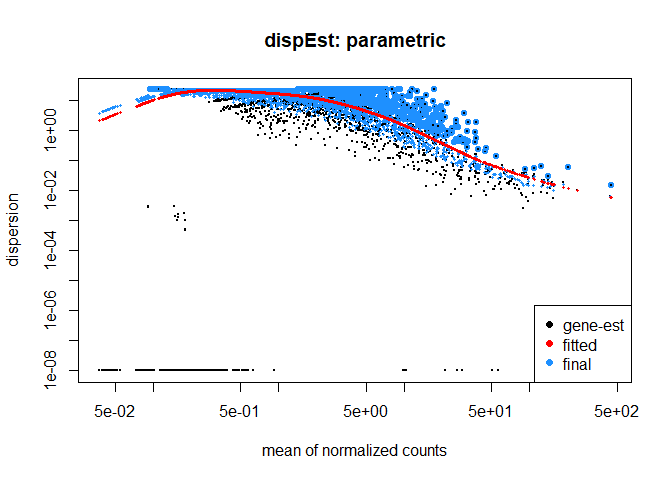
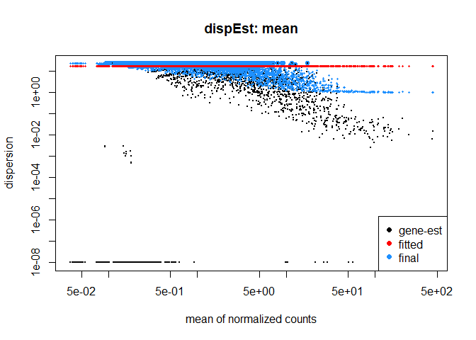
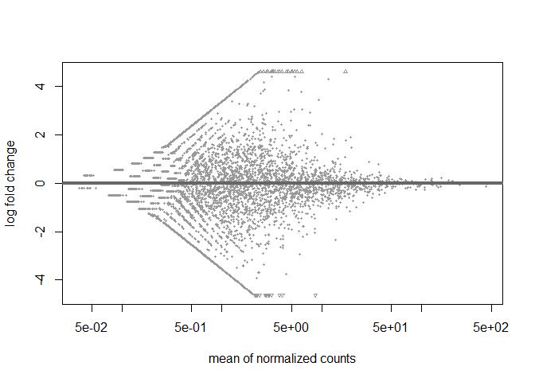
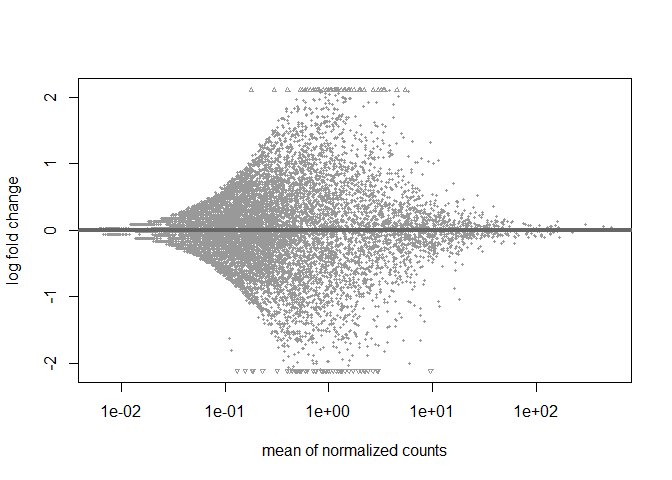
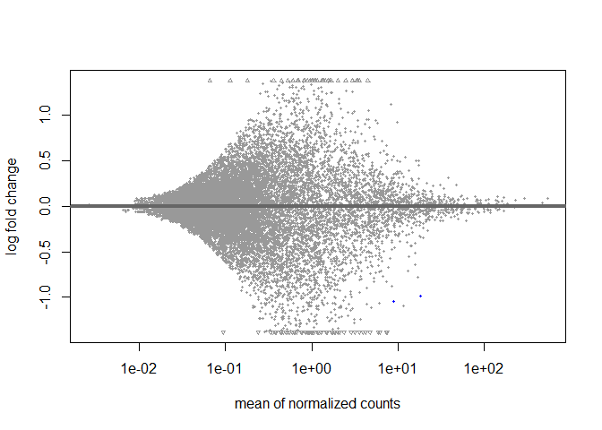

This script is adapted from a script form Melissa Uribe Acosta. Extra input comes from a script of Pedro Beschore da Costa.   
   
   
Tutorials   
- [Base tutorial on DESeq2](https://joey711.github.io/phyloseq-extensions/DESeq2.html)   
- [Elaborate tutorial on DESeq2](https://bioconductor.org/packages/devel/bioc/vignettes/DESeq2/inst/doc/DESeq2.html)   
- [Setting contrasts in DESeq2](https://www.atakanekiz.com/technical/a-guide-to-designs-and-contrasts-in-DESeq2/)   
- [More information on contrast](https://www.biostars.org/p/9597417/)   
- [Heatmap for final plot](http://rstudio-pubs-static.s3.amazonaws.com/288398_185f2889a5f641c6b9aa7b14fa15b634.html)   
   
   
# 4.0 load libraries, improve memory use and subset objects for the desired treatment comparisons
### Load libraries

``` r
R.version$version.string # prints R version
```

```
## [1] "R version 4.5.1 (2025-06-13 ucrt)"
```

``` r
library(phyloseq)
packageVersion("phyloseq")
```

```
## [1] '1.52.0'
```

``` r
library(metamisc) #for phyloseq_sep_variable (and more?)
packageVersion("metamisc")
```

```
## [1] '0.4.0'
```

``` r
library(DESeq2)
packageVersion("DESeq2")
```

```
## [1] '1.48.2'
```

``` r
library(zinbwave)
packageVersion("zinbwave")
```

```
## [1] '1.30.0'
```

### Load data without unplanted CTRL and Co caterpillar treatment

``` r
load(file = "C:/Users/kreek001/OneDrive - Wageningen University & Research/Chapters/Experimental Chapter 3/RScripts/GitHub/TwelveAccessionExperiment/MicrobiomeAnalysis/Data/Phyloseq_objects/CP_unnormalized_bac_ps_ForDA_Acc.RData")
load(file = "C:/Users/kreek001/OneDrive - Wageningen University & Research/Chapters/Experimental Chapter 3/RScripts/GitHub/TwelveAccessionExperiment/MicrobiomeAnalysis/Data/Phyloseq_objects/CP_unnormalized_bac_ps_ForDA_Dom.RData")
load("C:/Users/kreek001/OneDrive - Wageningen University & Research/Chapters/Experimental Chapter 3/RScripts/GitHub/TwelveAccessionExperiment/MicrobiomeAnalysis/Data/Phyloseq_objects/CP_unnormalized_bac_ps_ForDA.RData")
```

### For ZINBWAve, remove taxa with a total sum of 0
#### Seperate to each accession

``` r
lapply(CP_unnormalized_bac_ps_ForDA_Acc, function(x) summary(taxa_sums(x)))
```

```
## $OH
##     Min.  1st Qu.   Median     Mean  3rd Qu.     Max. 
##     1.00     4.00     9.00    70.77    29.00 14345.00 
## 
## $DD
##     Min.  1st Qu.   Median     Mean  3rd Qu.     Max. 
##     1.00     3.00     8.00    58.74    24.00 10369.00 
## 
## $HE
##     Min.  1st Qu.   Median     Mean  3rd Qu.     Max. 
##     1.00     3.00     8.00    58.94    25.00 11535.00 
## 
## $KI
##     Min.  1st Qu.   Median     Mean  3rd Qu.     Max. 
##     1.00     4.00     9.00    69.46    30.00 13005.00 
## 
## $VL
##     Min.  1st Qu.   Median     Mean  3rd Qu.     Max. 
##     1.00     4.00     9.00    68.97    29.00 13102.00 
## 
## $CD
##     Min.  1st Qu.   Median     Mean  3rd Qu.     Max. 
##     1.00     3.00     8.00    58.85    24.00 10195.00 
## 
## $RI
##     Min.  1st Qu.   Median     Mean  3rd Qu.     Max. 
##     1.00     4.00     9.00    72.31    30.00 14328.00 
## 
## $KT
##     Min.  1st Qu.   Median     Mean  3rd Qu.     Max. 
##     1.00     4.00    10.00    75.03    32.00 15205.00 
## 
## $MC
##     Min.  1st Qu.   Median     Mean  3rd Qu.     Max. 
##     1.00     4.00    10.00    71.56    32.00 13045.00 
## 
## $HM
##     Min.  1st Qu.   Median     Mean  3rd Qu.     Max. 
##     1.00     4.00     9.00    72.06    30.00 13746.00 
## 
## $IT1
##     Min.  1st Qu.   Median     Mean  3rd Qu.     Max. 
##     1.00     4.00     9.00    72.96    30.00 15082.00 
## 
## $GO1
##    Min. 1st Qu.  Median    Mean 3rd Qu.    Max. 
##     1.0     3.0     8.0    56.4    25.0  9970.0
```

``` r
Acc_unnorm_bac_ps_l_filtered <- lapply(CP_unnormalized_bac_ps_ForDA_Acc, function(x)
         prune_taxa(taxa_sums(x)>0, x))

save(Acc_unnorm_bac_ps_l_filtered, file = "C:/Users/kreek001/OneDrive - Wageningen University & Research/Chapters/Experimental Chapter 3/RScripts/GitHub/TwelveAccessionExperiment/MicrobiomeAnalysis/Data/Phyloseq_objects/CP_DA_DESeq_ASVLevel/Acc_unnorm_bac_ps_l_filtered.RData")
```

#### Seperate to domestication levels

``` r
lapply(CP_unnormalized_bac_ps_ForDA_Dom, function(x) summary(taxa_sums(x)))
```

```
## $Wild
##    Min. 1st Qu.  Median    Mean 3rd Qu.    Max. 
##     1.0     6.0    15.0   191.6    53.0 62142.0 
## 
## $Cultivated
##    Min. 1st Qu.  Median    Mean 3rd Qu.    Max. 
##     1.0     8.0    20.0   271.5    73.0 91275.0
```

``` r
Dom_unnorm_bac_ps_l_filtered <- lapply(CP_unnormalized_bac_ps_ForDA_Dom, function(x)
         prune_taxa(taxa_sums(x)>0, x))

save(Dom_unnorm_bac_ps_l_filtered, file = "C:/Users/kreek001/OneDrive - Wageningen University & Research/Chapters/Experimental Chapter 3/RScripts/GitHub/TwelveAccessionExperiment/MicrobiomeAnalysis/Data/Phyloseq_objects/CP_DA_DESeq_ASVLevel/Dom_unnorm_bac_ps_l_filtered.RData")
```

#### All data together

``` r
summary(taxa_sums(CP_unnormalized_bac_ps_ForDA))
```

```
##     Min.  1st Qu.   Median     Mean  3rd Qu.     Max. 
##      1.0     14.0     33.5    444.1    115.0 153417.0
```

``` r
All_unnorm_bac_ps_filtered <- prune_taxa(taxa_sums(CP_unnormalized_bac_ps_ForDA)>0, CP_unnormalized_bac_ps_ForDA)

save(All_unnorm_bac_ps_filtered, file = "C:/Users/kreek001/OneDrive - Wageningen University & Research/Chapters/Experimental Chapter 3/RScripts/GitHub/TwelveAccessionExperiment/MicrobiomeAnalysis/Data/Phyloseq_objects/CP_DA_DESeq_ASVLevel/All_unnorm_bac_ps_filtered.RData")
```

``` r
# Clean environment
rm(list = ls())
```


# 4.1 DeSeq and ZINBDeSeq
## 4.1.1 Convert phyloseq object to DeSeq object with lists

``` r
# Accession unfiltered
load(file = "C:/Users/kreek001/OneDrive - Wageningen University & Research/Chapters/Experimental Chapter 3/RScripts/GitHub/TwelveAccessionExperiment/MicrobiomeAnalysis/Data/Phyloseq_objects/CP_unnormalized_bac_ps_ForDA_Acc.RData")
dds_Acc_unnorm_bac_ps_l_unfilt <- lapply(CP_unnormalized_bac_ps_ForDA_Acc, function(x) phyloseq_to_deseq2(x, ~ Cat_treatment))
```

```
## converting counts to integer mode
## converting counts to integer mode
## converting counts to integer mode
## converting counts to integer mode
## converting counts to integer mode
## converting counts to integer mode
## converting counts to integer mode
## converting counts to integer mode
## converting counts to integer mode
## converting counts to integer mode
## converting counts to integer mode
## converting counts to integer mode
```

``` r
save(dds_Acc_unnorm_bac_ps_l_unfilt, file = "C:/Users/kreek001/OneDrive - Wageningen University & Research/Chapters/Experimental Chapter 3/RScripts/GitHub/TwelveAccessionExperiment/MicrobiomeAnalysis/Data/Phyloseq_objects/CP_DA_DESeq_ASVLevel/dds_Acc_unnorm_bac_ps_l_unfilt.RData")
rm(CP_unnormalized_bac_ps_ForDA_Acc, dds_Acc_unnorm_bac_ps_l_unfilt)

# Accession filtered
load(file = "C:/Users/kreek001/OneDrive - Wageningen University & Research/Chapters/Experimental Chapter 3/RScripts/GitHub/TwelveAccessionExperiment/MicrobiomeAnalysis/Data/Phyloseq_objects/CP_DA_DESeq_ASVLevel/Acc_unnorm_bac_ps_l_filtered.RData")
dds_Acc_unnorm_bac_ps_l_filtered <- lapply(Acc_unnorm_bac_ps_l_filtered, function(x) phyloseq_to_deseq2(x, ~ Cat_treatment))
```

```
## converting counts to integer mode
## converting counts to integer mode
## converting counts to integer mode
## converting counts to integer mode
## converting counts to integer mode
## converting counts to integer mode
## converting counts to integer mode
## converting counts to integer mode
## converting counts to integer mode
## converting counts to integer mode
## converting counts to integer mode
## converting counts to integer mode
```

``` r
save(dds_Acc_unnorm_bac_ps_l_filtered, file = "C:/Users/kreek001/OneDrive - Wageningen University & Research/Chapters/Experimental Chapter 3/RScripts/GitHub/TwelveAccessionExperiment/MicrobiomeAnalysis/Data/Phyloseq_objects/CP_DA_DESeq_ASVLevel/dds_Acc_unnorm_bac_ps_l_filtered.RData")
rm(Acc_unnorm_bac_ps_l_filtered, dds_Acc_unnorm_bac_ps_l_filtered)

# Domestication filtered
load(file = "C:/Users/kreek001/OneDrive - Wageningen University & Research/Chapters/Experimental Chapter 3/RScripts/GitHub/TwelveAccessionExperiment/MicrobiomeAnalysis/Data/Phyloseq_objects/CP_unnormalized_bac_ps_ForDA_Dom.RData")
dds_Dom_unnorm_bac_ps_l_unfilt <- lapply(CP_unnormalized_bac_ps_ForDA_Dom, function(x) phyloseq_to_deseq2(x, ~ Accession + Cat_treatment))
```

```
## converting counts to integer mode
## converting counts to integer mode
```

``` r
save(dds_Dom_unnorm_bac_ps_l_unfilt, file = "C:/Users/kreek001/OneDrive - Wageningen University & Research/Chapters/Experimental Chapter 3/RScripts/GitHub/TwelveAccessionExperiment/MicrobiomeAnalysis/Data/Phyloseq_objects/CP_DA_DESeq_ASVLevel/dds_Dom_unnorm_bac_ps_l_unfilt.RData")
rm(CP_unnormalized_bac_ps_ForDA_Dom, dds_Dom_unnorm_bac_ps_l_unfilt)

# Domestication filtered
load(file = "C:/Users/kreek001/OneDrive - Wageningen University & Research/Chapters/Experimental Chapter 3/RScripts/GitHub/TwelveAccessionExperiment/MicrobiomeAnalysis/Data/Phyloseq_objects/CP_DA_DESeq_ASVLevel/Dom_unnorm_bac_ps_l_filtered.RData")
dds_Dom_unnorm_bac_ps_l_filtered <- lapply(Dom_unnorm_bac_ps_l_filtered, function(x) phyloseq_to_deseq2(x, ~ Accession + Cat_treatment))
```

```
## converting counts to integer mode
## converting counts to integer mode
```

``` r
save(dds_Dom_unnorm_bac_ps_l_filtered, file = "C:/Users/kreek001/OneDrive - Wageningen University & Research/Chapters/Experimental Chapter 3/RScripts/GitHub/TwelveAccessionExperiment/MicrobiomeAnalysis/Data/Phyloseq_objects/CP_DA_DESeq_ASVLevel/dds_Dom_unnorm_bac_ps_l_filtered.RData")
rm(Acc_unnorm_bac_ps_l_filtered, dds_Dom_unnorm_bac_ps_l_filtered)
```

```
## Warning in rm(Acc_unnorm_bac_ps_l_filtered, dds_Dom_unnorm_bac_ps_l_filtered):
## object 'Acc_unnorm_bac_ps_l_filtered' not found
```

``` r
# All data unfiltered
load("C:/Users/kreek001/OneDrive - Wageningen University & Research/Chapters/Experimental Chapter 3/RScripts/GitHub/TwelveAccessionExperiment/MicrobiomeAnalysis/Data/Phyloseq_objects/CP_unnormalized_bac_ps_ForDA.RData")
dds_All_unnorm_bac_ps_unfilt <- phyloseq_to_deseq2(CP_unnormalized_bac_ps_ForDA, ~ Accession + Cat_treatment)
```

```
## converting counts to integer mode
```

``` r
save(dds_All_unnorm_bac_ps_unfilt, file = "C:/Users/kreek001/OneDrive - Wageningen University & Research/Chapters/Experimental Chapter 3/RScripts/GitHub/TwelveAccessionExperiment/MicrobiomeAnalysis/Data/Phyloseq_objects/CP_DA_DESeq_ASVLevel/dds_All_unnorm_bac_ps_unfilt.RData")
rm(CP_unnormalized_bac_ps_ForDA, dds_All_unnorm_bac_ps_unfilt)

# All data filtered
load(file = "C:/Users/kreek001/OneDrive - Wageningen University & Research/Chapters/Experimental Chapter 3/RScripts/GitHub/TwelveAccessionExperiment/MicrobiomeAnalysis/Data/Phyloseq_objects/CP_DA_DESeq_ASVLevel/All_unnorm_bac_ps_filtered.RData")
dds_All_unnorm_bac_ps_filtered <- phyloseq_to_deseq2(All_unnorm_bac_ps_filtered, ~ Accession + Cat_treatment)
```

```
## converting counts to integer mode
```

``` r
save(dds_All_unnorm_bac_ps_filtered, file = "C:/Users/kreek001/OneDrive - Wageningen University & Research/Chapters/Experimental Chapter 3/RScripts/GitHub/TwelveAccessionExperiment/MicrobiomeAnalysis/Data/Phyloseq_objects/CP_DA_DESeq_ASVLevel/dds_All_unnorm_bac_ps_filtered.RData")
rm(All_unnorm_bac_ps_filtered, dds_All_unnorm_bac_ps_filtered)
```

### Checking which fitType fits best
Testing with one accession

``` r
load(file = "C:/Users/kreek001/OneDrive - Wageningen University & Research/Chapters/Experimental Chapter 3/RScripts/GitHub/TwelveAccessionExperiment/MicrobiomeAnalysis/Data/Phyloseq_objects/CP_DA_DESeq_ASVLevel/dds_Acc_unnorm_bac_ps_l_unfilt.RData")

DDS <- estimateSizeFactors(dds_Acc_unnorm_bac_ps_l_unfilt$GO1)
par <- estimateDispersions(DDS, fitType = "parametric")
```

```
## gene-wise dispersion estimates
```

```
## mean-dispersion relationship
```

```
## -- note: fitType='parametric', but the dispersion trend was not well captured by the
##    function: y = a/x + b, and a local regression fit was automatically substituted.
##    specify fitType='local' or 'mean' to avoid this message next time.
```

```
## final dispersion estimates
```

``` r
loc <- estimateDispersions(DDS, fitType = "local")
```

```
## gene-wise dispersion estimates
```

```
## mean-dispersion relationship
```

```
## final dispersion estimates
```

``` r
mea <- estimateDispersions(DDS, fitType = "mean")
```

```
## gene-wise dispersion estimates
```

```
## mean-dispersion relationship
```

```
## final dispersion estimates
```

``` r
plotDispEsts(par, main = "dispEst: parametric")
```

<!-- -->

``` r
plotDispEsts(loc, main = "dispEst: local")
```

<!-- -->

``` r
plotDispEsts(mea, main = "dispEst: mean")
```

<!-- -->

``` r
# residual <- mcols(DDS)$dispGeneEst - mcols(DDS)$dispFit
# plotMA(residual)

rm(DDS, par, loc, mea)
```
The plot of local looks best.

## 4.1.2 DESeq with Wald test
### Per Accession
#### Run DESeq object

``` r
# Standard DESeq
stddds2_Wald_Acc_Bac <- lapply(dds_Acc_unnorm_bac_ps_l_unfilt, function(x) 
                  DESeq(x, 
                  test = "Wald",  
                  minReplicatesForReplace = Inf, # not replacing outliers
                  fitType = "local")) 
```

```
## estimating size factors
```

```
## estimating dispersions
```

```
## gene-wise dispersion estimates
```

```
## mean-dispersion relationship
```

```
## final dispersion estimates
```

```
## fitting model and testing
```

```
## estimating size factors
```

```
## estimating dispersions
```

```
## gene-wise dispersion estimates
```

```
## mean-dispersion relationship
```

```
## final dispersion estimates
```

```
## fitting model and testing
```

```
## estimating size factors
```

```
## estimating dispersions
```

```
## gene-wise dispersion estimates
```

```
## mean-dispersion relationship
```

```
## final dispersion estimates
```

```
## fitting model and testing
```

```
## estimating size factors
```

```
## estimating dispersions
```

```
## gene-wise dispersion estimates
```

```
## mean-dispersion relationship
```

```
## final dispersion estimates
```

```
## fitting model and testing
```

```
## estimating size factors
```

```
## estimating dispersions
```

```
## gene-wise dispersion estimates
```

```
## mean-dispersion relationship
```

```
## final dispersion estimates
```

```
## fitting model and testing
```

```
## estimating size factors
```

```
## estimating dispersions
```

```
## gene-wise dispersion estimates
```

```
## mean-dispersion relationship
```

```
## final dispersion estimates
```

```
## fitting model and testing
```

```
## estimating size factors
```

```
## estimating dispersions
```

```
## gene-wise dispersion estimates
```

```
## mean-dispersion relationship
```

```
## final dispersion estimates
```

```
## fitting model and testing
```

```
## estimating size factors
```

```
## estimating dispersions
```

```
## gene-wise dispersion estimates
```

```
## mean-dispersion relationship
```

```
## final dispersion estimates
```

```
## fitting model and testing
```

```
## estimating size factors
```

```
## estimating dispersions
```

```
## gene-wise dispersion estimates
```

```
## mean-dispersion relationship
```

```
## final dispersion estimates
```

```
## fitting model and testing
```

```
## estimating size factors
```

```
## estimating dispersions
```

```
## gene-wise dispersion estimates
```

```
## mean-dispersion relationship
```

```
## final dispersion estimates
```

```
## fitting model and testing
```

```
## estimating size factors
```

```
## estimating dispersions
```

```
## gene-wise dispersion estimates
```

```
## mean-dispersion relationship
```

```
## final dispersion estimates
```

```
## fitting model and testing
```

```
## estimating size factors
```

```
## estimating dispersions
```

```
## gene-wise dispersion estimates
```

```
## mean-dispersion relationship
```

```
## final dispersion estimates
```

```
## fitting model and testing
```

``` r
# Print results for GO1
res <- results(stddds2_Wald_Acc_Bac$GO1, alpha = 0.1)
res
```

```
## log2 fold change (MLE): Cat treatment Mb vs Co 
## Wald test p-value: Cat treatment Mb vs Co 
## DataFrame with 8738 rows and 6 columns
##              baseMean log2FoldChange     lfcSE      stat    pvalue      padj
##             <numeric>      <numeric> <numeric> <numeric> <numeric> <numeric>
## bASV_1        446.338     -0.0492366 0.0807819 -0.609500 0.5421930   0.99943
## bASV_2        439.951     -0.1403202 0.0565035 -2.483390 0.0130138   0.99943
## bASV_3        238.925     -0.0598675 0.0731836 -0.818045 0.4133316   0.99943
## bASV_4        202.230      0.0986486 0.1544461  0.638725 0.5230018   0.99943
## bASV_5        187.051      0.1178565 0.0898751  1.311337 0.1897441   0.99943
## ...               ...            ...       ...       ...       ...       ...
## bASV_119157 0.0371821      -0.197686   1.47642 -0.133896  0.893485   0.99943
## bASV_127477 0.0373111      -0.197686   1.47930 -0.133635  0.893691   0.99943
## bASV_128887 0.0475829      -0.197687   1.69849 -0.116390  0.907344   0.99943
## bASV_129335 0.0415926      -0.197686   1.57304 -0.125672  0.899992   0.99943
## bASV_129836 0.0449916      -0.197687   1.64496 -0.120177  0.904343   0.99943
```

``` r
summary(res)
```

```
## 
## out of 8738 with nonzero total read count
## adjusted p-value < 0.1
## LFC > 0 (up)       : 0, 0%
## LFC < 0 (down)     : 0, 0%
## outliers [1]       : 602, 6.9%
## low counts [2]     : 0, 0%
## (mean count < 0)
## [1] see 'cooksCutoff' argument of ?results
## [2] see 'independentFiltering' argument of ?results
```

``` r
# Number of p-values smaller than 0.1
sum(res$padj < 0.1, na.rm = TRUE)
```

```
## [1] 0
```

``` r
# Plot output: blue dots have p-values below 0.1
plotMA(res)
```

<!-- -->

``` r
# Save DESeq object
save(stddds2_Wald_Acc_Bac, file = "C:/Users/kreek001/OneDrive - Wageningen University & Research/Chapters/Experimental Chapter 3/RScripts/GitHub/TwelveAccessionExperiment/MicrobiomeAnalysis/Data/Phyloseq_objects/CP_DA_DESeq_ASVLevel/stddds2_Wald_Acc_Bac.RData")
```

#### Creat data frame and shrink data

``` r
# Data frame generation
# "Adds shrunken log2 fold changes (LFC) and SE to a results table from DESeq run without LFC shrinkage"
lfcres_stddds2_Wald_Acc_Bac <- lapply(stddds2_Wald_Acc_Bac, function(x) lfcShrink(x, coef = "Cat_treatment_Mb_vs_Co", type = "normal")) #type is type of shrinkage estimator
```

```
## using 'normal' for LFC shrinkage, the Normal prior from Love et al (2014).
## 
## Note that type='apeglm' and type='ashr' have shown to have less bias than type='normal'.
## See ?lfcShrink for more details on shrinkage type, and the DESeq2 vignette.
## Reference: https://doi.org/10.1093/bioinformatics/bty895
## using 'normal' for LFC shrinkage, the Normal prior from Love et al (2014).
## 
## Note that type='apeglm' and type='ashr' have shown to have less bias than type='normal'.
## See ?lfcShrink for more details on shrinkage type, and the DESeq2 vignette.
## Reference: https://doi.org/10.1093/bioinformatics/bty895
## using 'normal' for LFC shrinkage, the Normal prior from Love et al (2014).
## 
## Note that type='apeglm' and type='ashr' have shown to have less bias than type='normal'.
## See ?lfcShrink for more details on shrinkage type, and the DESeq2 vignette.
## Reference: https://doi.org/10.1093/bioinformatics/bty895
## using 'normal' for LFC shrinkage, the Normal prior from Love et al (2014).
## 
## Note that type='apeglm' and type='ashr' have shown to have less bias than type='normal'.
## See ?lfcShrink for more details on shrinkage type, and the DESeq2 vignette.
## Reference: https://doi.org/10.1093/bioinformatics/bty895
## using 'normal' for LFC shrinkage, the Normal prior from Love et al (2014).
## 
## Note that type='apeglm' and type='ashr' have shown to have less bias than type='normal'.
## See ?lfcShrink for more details on shrinkage type, and the DESeq2 vignette.
## Reference: https://doi.org/10.1093/bioinformatics/bty895
## using 'normal' for LFC shrinkage, the Normal prior from Love et al (2014).
## 
## Note that type='apeglm' and type='ashr' have shown to have less bias than type='normal'.
## See ?lfcShrink for more details on shrinkage type, and the DESeq2 vignette.
## Reference: https://doi.org/10.1093/bioinformatics/bty895
## using 'normal' for LFC shrinkage, the Normal prior from Love et al (2014).
## 
## Note that type='apeglm' and type='ashr' have shown to have less bias than type='normal'.
## See ?lfcShrink for more details on shrinkage type, and the DESeq2 vignette.
## Reference: https://doi.org/10.1093/bioinformatics/bty895
## using 'normal' for LFC shrinkage, the Normal prior from Love et al (2014).
## 
## Note that type='apeglm' and type='ashr' have shown to have less bias than type='normal'.
## See ?lfcShrink for more details on shrinkage type, and the DESeq2 vignette.
## Reference: https://doi.org/10.1093/bioinformatics/bty895
## using 'normal' for LFC shrinkage, the Normal prior from Love et al (2014).
## 
## Note that type='apeglm' and type='ashr' have shown to have less bias than type='normal'.
## See ?lfcShrink for more details on shrinkage type, and the DESeq2 vignette.
## Reference: https://doi.org/10.1093/bioinformatics/bty895
## using 'normal' for LFC shrinkage, the Normal prior from Love et al (2014).
## 
## Note that type='apeglm' and type='ashr' have shown to have less bias than type='normal'.
## See ?lfcShrink for more details on shrinkage type, and the DESeq2 vignette.
## Reference: https://doi.org/10.1093/bioinformatics/bty895
## using 'normal' for LFC shrinkage, the Normal prior from Love et al (2014).
## 
## Note that type='apeglm' and type='ashr' have shown to have less bias than type='normal'.
## See ?lfcShrink for more details on shrinkage type, and the DESeq2 vignette.
## Reference: https://doi.org/10.1093/bioinformatics/bty895
## using 'normal' for LFC shrinkage, the Normal prior from Love et al (2014).
## 
## Note that type='apeglm' and type='ashr' have shown to have less bias than type='normal'.
## See ?lfcShrink for more details on shrinkage type, and the DESeq2 vignette.
## Reference: https://doi.org/10.1093/bioinformatics/bty895
```

``` r
# Save file
save(lfcres_stddds2_Wald_Acc_Bac, file = "C:/Users/kreek001/OneDrive - Wageningen University & Research/Chapters/Experimental Chapter 3/RScripts/GitHub/TwelveAccessionExperiment/MicrobiomeAnalysis/Data/Phyloseq_objects/CP_DA_DESeq_ASVLevel/lfcres_stddds2_Wald_Acc_Bac.RData")
```

#### Filter p-values

``` r
#Filter to only p adjusted under alpha
alpha = 0.05
sigtab_stddds2_Wald_Acc_Bac <- lapply(lfcres_stddds2_Wald_Acc_Bac, function(x) x[which(x$padj < alpha), ])
sigtab_stddds2_Wald_Acc_Bac
```

```
## $OH
## log2 fold change (MAP): Cat treatment Mb vs Co 
## Wald test p-value: Cat treatment Mb vs Co 
## DataFrame with 2 rows and 6 columns
##           baseMean log2FoldChange     lfcSE      stat      pvalue        padj
##          <numeric>      <numeric> <numeric> <numeric>   <numeric>   <numeric>
## bASV_724   7.49378       -1.41405  0.336132  -5.57650 2.45401e-08 0.000208713
## bASV_911   6.41854       -1.03852  0.314220  -4.70849 2.49561e-06 0.010612571
## 
## $DD
## log2 fold change (MAP): Cat treatment Mb vs Co 
## Wald test p-value: Cat treatment Mb vs Co 
## DataFrame with 0 rows and 6 columns
## 
## $HE
## log2 fold change (MAP): Cat treatment Mb vs Co 
## Wald test p-value: Cat treatment Mb vs Co 
## DataFrame with 0 rows and 6 columns
## 
## $KI
## log2 fold change (MAP): Cat treatment Mb vs Co 
## Wald test p-value: Cat treatment Mb vs Co 
## DataFrame with 0 rows and 6 columns
## 
## $VL
## log2 fold change (MAP): Cat treatment Mb vs Co 
## Wald test p-value: Cat treatment Mb vs Co 
## DataFrame with 0 rows and 6 columns
## 
## $CD
## log2 fold change (MAP): Cat treatment Mb vs Co 
## Wald test p-value: Cat treatment Mb vs Co 
## DataFrame with 0 rows and 6 columns
## 
## $RI
## log2 fold change (MAP): Cat treatment Mb vs Co 
## Wald test p-value: Cat treatment Mb vs Co 
## DataFrame with 1 row and 6 columns
##            baseMean log2FoldChange     lfcSE      stat      pvalue       padj
##           <numeric>      <numeric> <numeric> <numeric>   <numeric>  <numeric>
## bASV_1310   7.23161       0.980976  0.300427   4.98721 6.12568e-07 0.00514925
## 
## $KT
## log2 fold change (MAP): Cat treatment Mb vs Co 
## Wald test p-value: Cat treatment Mb vs Co 
## DataFrame with 0 rows and 6 columns
## 
## $MC
## log2 fold change (MAP): Cat treatment Mb vs Co 
## Wald test p-value: Cat treatment Mb vs Co 
## DataFrame with 0 rows and 6 columns
## 
## $HM
## log2 fold change (MAP): Cat treatment Mb vs Co 
## Wald test p-value: Cat treatment Mb vs Co 
## DataFrame with 0 rows and 6 columns
## 
## $IT1
## log2 fold change (MAP): Cat treatment Mb vs Co 
## Wald test p-value: Cat treatment Mb vs Co 
## DataFrame with 0 rows and 6 columns
## 
## $GO1
## log2 fold change (MAP): Cat treatment Mb vs Co 
## Wald test p-value: Cat treatment Mb vs Co 
## DataFrame with 0 rows and 6 columns
```

``` r
# Safe file
save(sigtab_stddds2_Wald_Acc_Bac, file = "C:/Users/kreek001/OneDrive - Wageningen University & Research/Chapters/Experimental Chapter 3/RScripts/GitHub/TwelveAccessionExperiment/MicrobiomeAnalysis/Data/Phyloseq_objects/CP_DA_DESeq_ASVLevel/sigtab_stddds2_Wald_Acc_Bac.RData")

# Clean environment
rm(list = ls())
```

### Domestication
#### Run DESeq object

``` r
load(file = "C:/Users/kreek001/OneDrive - Wageningen University & Research/Chapters/Experimental Chapter 3/RScripts/GitHub/TwelveAccessionExperiment/MicrobiomeAnalysis/Data/Phyloseq_objects/CP_DA_DESeq_ASVLevel/dds_Dom_unnorm_bac_ps_l_unfilt.RData")

# Standard DESeq
stddds2_Wald_Dom_Bac <- lapply(dds_Dom_unnorm_bac_ps_l_unfilt, function(x) 
                  DESeq(x, 
                  test = "Wald",  
                  minReplicatesForReplace = Inf, # not replacing outliers
                  fitType = "local")) 
```

```
## estimating size factors
```

```
## estimating dispersions
```

```
## gene-wise dispersion estimates
```

```
## mean-dispersion relationship
```

```
## final dispersion estimates
```

```
## fitting model and testing
```

```
## estimating size factors
```

```
## estimating dispersions
```

```
## gene-wise dispersion estimates
```

```
## mean-dispersion relationship
```

```
## final dispersion estimates
```

```
## fitting model and testing
```

``` r
# Print results for Wild
res <- results(stddds2_Wald_Dom_Bac$Wild, alpha = 0.1)
res
```

```
## log2 fold change (MLE): Cat treatment Mb vs Co 
## Wald test p-value: Cat treatment Mb vs Co 
## DataFrame with 15383 rows and 6 columns
##               baseMean log2FoldChange     lfcSE        stat    pvalue      padj
##              <numeric>      <numeric> <numeric>   <numeric> <numeric> <numeric>
## bASV_1         525.814      0.0364703 0.0591677    0.616389  0.537638   0.99996
## bASV_2         444.681      0.0537202 0.0346293    1.551292  0.120832   0.99996
## bASV_3         297.005      0.0821271 0.0684027    1.200641  0.229890   0.99996
## bASV_4         221.271     -0.0311169 0.0514258   -0.605084  0.545123   0.99996
## bASV_5         222.290     -0.0241529 0.0581096   -0.415644  0.677671   0.99996
## ...                ...            ...       ...         ...       ...       ...
## bASV_159090 0.01559621     -0.0170399   2.91199 -0.00585161  0.995331   0.99996
## bASV_160100 0.00831407     -0.0672770   2.91199 -0.02310341  0.981568   0.99996
## bASV_164155 0.01493409     -0.1196977   2.91199 -0.04110509  0.967212   0.99996
## bASV_167502 0.00919605      0.0331973   2.91199  0.01140020  0.990904   0.99996
## bASV_167884 0.01869252      0.0834344   2.91199  0.02865200  0.977142   0.99996
```

``` r
summary(res)
```

```
## 
## out of 15383 with nonzero total read count
## adjusted p-value < 0.1
## LFC > 0 (up)       : 0, 0%
## LFC < 0 (down)     : 0, 0%
## outliers [1]       : 779, 5.1%
## low counts [2]     : 0, 0%
## (mean count < 0)
## [1] see 'cooksCutoff' argument of ?results
## [2] see 'independentFiltering' argument of ?results
```

``` r
# Number of p-values smaller than 0.1
sum(res$padj < 0.1, na.rm = TRUE)
```

```
## [1] 0
```

``` r
# Plot output: blue dots have p-values below 0.1
plotMA(res)
```

<!-- -->

``` r
# Save DESeq object
save(stddds2_Wald_Dom_Bac, file = "C:/Users/kreek001/OneDrive - Wageningen University & Research/Chapters/Experimental Chapter 3/RScripts/GitHub/TwelveAccessionExperiment/MicrobiomeAnalysis/Data/Phyloseq_objects/CP_DA_DESeq_ASVLevel/stddds2_Wald_Dom_Bac.RData")
```

#### Creat data frame and shrink data

``` r
# Data frame generation
# "Adds shrunken log2 fold changes (LFC) and SE to a results table from DESeq run without LFC shrinkage"
lfcres_stddds2_Wald_Dom_Bac <- lapply(stddds2_Wald_Dom_Bac, function(x) lfcShrink(x, coef = "Cat_treatment_Mb_vs_Co", type = "normal")) #type is type of shrinkage estimator
```

```
## using 'normal' for LFC shrinkage, the Normal prior from Love et al (2014).
## 
## Note that type='apeglm' and type='ashr' have shown to have less bias than type='normal'.
## See ?lfcShrink for more details on shrinkage type, and the DESeq2 vignette.
## Reference: https://doi.org/10.1093/bioinformatics/bty895
## using 'normal' for LFC shrinkage, the Normal prior from Love et al (2014).
## 
## Note that type='apeglm' and type='ashr' have shown to have less bias than type='normal'.
## See ?lfcShrink for more details on shrinkage type, and the DESeq2 vignette.
## Reference: https://doi.org/10.1093/bioinformatics/bty895
```

``` r
# Save file
save(lfcres_stddds2_Wald_Dom_Bac, file = "C:/Users/kreek001/OneDrive - Wageningen University & Research/Chapters/Experimental Chapter 3/RScripts/GitHub/TwelveAccessionExperiment/MicrobiomeAnalysis/Data/Phyloseq_objects/CP_DA_DESeq_ASVLevel/lfcres_stddds2_Wald_Dom_Bac.RData")
```

#### Filter p-values

``` r
#Filter to only p adjusted under alpha
alpha = 0.05
sigtab_stddds2_Wald_Dom_Bac <- lapply(lfcres_stddds2_Wald_Dom_Bac, function(x) x[which(x$padj < alpha), ])
sigtab_stddds2_Wald_Dom_Bac
```

```
## $Wild
## log2 fold change (MAP): Cat treatment Mb vs Co 
## Wald test p-value: Cat treatment Mb vs Co 
## DataFrame with 0 rows and 6 columns
## 
## $Cultivated
## log2 fold change (MAP): Cat treatment Mb vs Co 
## Wald test p-value: Cat treatment Mb vs Co 
## DataFrame with 0 rows and 6 columns
```

``` r
# Safe file
save(sigtab_stddds2_Wald_Dom_Bac, file = "C:/Users/kreek001/OneDrive - Wageningen University & Research/Chapters/Experimental Chapter 3/RScripts/GitHub/TwelveAccessionExperiment/MicrobiomeAnalysis/Data/Phyloseq_objects/CP_DA_DESeq_ASVLevel/sigtab_stddds2_Wald_Dom_Bac.RData")

# Clean environment
rm(list = ls())
```

### All data
#### Run DESeq object

``` r
load(file = "C:/Users/kreek001/OneDrive - Wageningen University & Research/Chapters/Experimental Chapter 3/RScripts/GitHub/TwelveAccessionExperiment/MicrobiomeAnalysis/Data/Phyloseq_objects/CP_DA_DESeq_ASVLevel/dds_All_unnorm_bac_ps_unfilt.RData")

# Standard DESeq
stddds2_Wald_All_Bac <- DESeq(dds_All_unnorm_bac_ps_unfilt, 
                              test = "Wald",
                              minReplicatesForReplace = Inf, # not replacing outliers
                              fitType = "local")
```

```
## estimating size factors
```

```
## estimating dispersions
```

```
## gene-wise dispersion estimates
```

```
## mean-dispersion relationship
```

```
## final dispersion estimates
```

```
## fitting model and testing
```

``` r
# stddds2_Wald_All_Bac_S <- DESeq(dds_All_unnorm_bac_ps_unfilt_S,
#                               test = "Wald",
#                               minReplicatesForReplace = Inf, # not replacing outliers
#                               fitType = "local")

# Print results
resultsNames(stddds2_Wald_All_Bac) # Show different contrasts, last one is default in result output
```

```
##  [1] "Intercept"              "Accession_DD_vs_OH"     "Accession_HE_vs_OH"    
##  [4] "Accession_KI_vs_OH"     "Accession_VL_vs_OH"     "Accession_CD_vs_OH"    
##  [7] "Accession_RI_vs_OH"     "Accession_KT_vs_OH"     "Accession_MC_vs_OH"    
## [10] "Accession_HM_vs_OH"     "Accession_IT1_vs_OH"    "Accession_GO1_vs_OH"   
## [13] "Cat_treatment_Mb_vs_Co"
```

``` r
res <- results(stddds2_Wald_All_Bac, alpha = 0.1)
#res <- results(stddds2_Wald_All_Bac, alpha = 0.1, contrast = c("Cat_treatment", "Co", "Mb")) # specifically setting a contrast
#res <- results(stddds2_Wald_All_Bac, alpha = 0.1, contrast = list("Cat_treatment_Mb_vs_Co")) # alternative to specifically set a contrast
# I can compare CD and RI for instance by setting contrast like: contrast = list("Accession_CD_vs_VL", "Accession_RI_vs_VL")
res
```

```
## log2 fold change (MLE): Cat treatment Mb vs Co 
## Wald test p-value: Cat treatment Mb vs Co 
## DataFrame with 16574 rows and 6 columns
##               baseMean log2FoldChange     lfcSE        stat    pvalue      padj
##              <numeric>      <numeric> <numeric>   <numeric> <numeric> <numeric>
## bASV_1         539.717     0.09135544 0.0487757    1.872970 0.0610725  0.999991
## bASV_2         467.020     0.03514413 0.0181941    1.931618 0.0534067  0.999991
## bASV_3         294.673     0.09188124 0.0489567    1.876787 0.0605473  0.999991
## bASV_4         223.375    -0.00850543 0.0338488   -0.251277 0.8015998  0.999991
## bASV_5         230.516     0.07255913 0.0480678    1.509517 0.1311667  0.999991
## ...                ...            ...       ...         ...       ...       ...
## bASV_160100 0.00929164     -0.0208423    2.8988 -0.00718997  0.994263  0.999991
## bASV_160580 0.00869694     -0.0171298    2.8988 -0.00590927  0.995285  0.999991
## bASV_164155 0.00992626     -0.0606972    2.8988 -0.02093874  0.983295  0.999991
## bASV_167502 0.01164554      0.0246243    2.8988  0.00849466  0.993222  0.999991
## bASV_167884 0.01194937      0.0626646    2.8988  0.02161743  0.982753  0.999991
```

``` r
summary(res)
```

```
## 
## out of 16574 with nonzero total read count
## adjusted p-value < 0.1
## LFC > 0 (up)       : 0, 0%
## LFC < 0 (down)     : 2, 0.012%
## outliers [1]       : 355, 2.1%
## low counts [2]     : 0, 0%
## (mean count < 0)
## [1] see 'cooksCutoff' argument of ?results
## [2] see 'independentFiltering' argument of ?results
```

``` r
# resultsNames(stddds2_Wald_All_Bac_S) # Show different contrasts, last one is default in result output
# res_S <- results(stddds2_Wald_All_Bac_S, alpha = 0.1)
# res_S
# summary(res_S)

# Number of p-values smaller than 0.1
sum(res$padj < 0.1, na.rm = TRUE)
```

```
## [1] 2
```

``` r
# sum(res_S$padj < 0.1, na.rm = TRUE)

# Plot output: blue dots have p-values below 0.1
plotMA(res)
```

<!-- -->

``` r
# Save DESeq object
save(stddds2_Wald_All_Bac, file = "C:/Users/kreek001/OneDrive - Wageningen University & Research/Chapters/Experimental Chapter 3/RScripts/GitHub/TwelveAccessionExperiment/MicrobiomeAnalysis/Data/Phyloseq_objects/CP_DA_DESeq_ASVLevel/stddds2_Wald_All_Bac.RData")
```

#### Shrink data

``` r
# Data frame generation
# "Adds shrunken log2 fold changes (LFC) and SE to a results table from DESeq run without LFC shrinkage"
lfcres_stddds2_Wald_All_Bac <- lfcShrink(stddds2_Wald_All_Bac, coef = "Cat_treatment_Mb_vs_Co", type = "normal") #type is type of shrinkage estimator
```

```
## using 'normal' for LFC shrinkage, the Normal prior from Love et al (2014).
## 
## Note that type='apeglm' and type='ashr' have shown to have less bias than type='normal'.
## See ?lfcShrink for more details on shrinkage type, and the DESeq2 vignette.
## Reference: https://doi.org/10.1093/bioinformatics/bty895
```

``` r
# Save file
save(lfcres_stddds2_Wald_All_Bac, file = "C:/Users/kreek001/OneDrive - Wageningen University & Research/Chapters/Experimental Chapter 3/RScripts/GitHub/TwelveAccessionExperiment/MicrobiomeAnalysis/Data/Phyloseq_objects/CP_DA_DESeq_ASVLevel/lfcres_stddds2_Wald_All_Bac.RData")
```

#### Filter p-values

``` r
#Filter to only p adjusted under alpha
alpha = 0.05
sigtab_stddds2_Wald_All_Bac <- lfcres_stddds2_Wald_All_Bac[which(lfcres_stddds2_Wald_All_Bac$padj < alpha), ]
sigtab_stddds2_Wald_All_Bac
```

```
## log2 fold change (MAP): Cat treatment Mb vs Co 
## Wald test p-value: Cat treatment Mb vs Co 
## DataFrame with 2 rows and 6 columns
##           baseMean log2FoldChange     lfcSE      stat      pvalue      padj
##          <numeric>      <numeric> <numeric> <numeric>   <numeric> <numeric>
## bASV_269  18.16138      -0.426752 0.0953478  -4.53925 5.64537e-06 0.0457812
## bASV_601   8.86376      -0.445105 0.0953457  -4.78016 1.75152e-06 0.0284079
```

``` r
# Safe file
save(sigtab_stddds2_Wald_All_Bac, file = "C:/Users/kreek001/OneDrive - Wageningen University & Research/Chapters/Experimental Chapter 3/RScripts/GitHub/TwelveAccessionExperiment/MicrobiomeAnalysis/Data/Phyloseq_objects/CP_DA_DESeq_ASVLevel/sigtab_stddds2_Wald_All_Bac.RData")

# Clean environment
rm(list = ls())
```

## 4.1.3 DESeq with LRT test
### Per Accession
#### Run DESeq object

``` r
load(file = "C:/Users/kreek001/OneDrive - Wageningen University & Research/Chapters/Experimental Chapter 3/RScripts/GitHub/TwelveAccessionExperiment/MicrobiomeAnalysis/Data/Phyloseq_objects/CP_DA_DESeq_ASVLevel/dds_Acc_unnorm_bac_ps_l_unfilt.RData")

# Standard DESeq
stddds2_LRT_Acc_Bac <- lapply(dds_Acc_unnorm_bac_ps_l_unfilt, function(x) 
                  DESeq(x, 
                  test = "LRT",
                  reduced = ~1,
                  minReplicatesForReplace = Inf, # not replacing outliers
                  fitType = "local")) 
```

```
## estimating size factors
```

```
## estimating dispersions
```

```
## gene-wise dispersion estimates
```

```
## mean-dispersion relationship
```

```
## final dispersion estimates
```

```
## fitting model and testing
```

```
## estimating size factors
```

```
## estimating dispersions
```

```
## gene-wise dispersion estimates
```

```
## mean-dispersion relationship
```

```
## final dispersion estimates
```

```
## fitting model and testing
```

```
## estimating size factors
```

```
## estimating dispersions
```

```
## gene-wise dispersion estimates
```

```
## mean-dispersion relationship
```

```
## final dispersion estimates
```

```
## fitting model and testing
```

```
## estimating size factors
```

```
## estimating dispersions
```

```
## gene-wise dispersion estimates
```

```
## mean-dispersion relationship
```

```
## final dispersion estimates
```

```
## fitting model and testing
```

```
## estimating size factors
```

```
## estimating dispersions
```

```
## gene-wise dispersion estimates
```

```
## mean-dispersion relationship
```

```
## final dispersion estimates
```

```
## fitting model and testing
```

```
## estimating size factors
```

```
## estimating dispersions
```

```
## gene-wise dispersion estimates
```

```
## mean-dispersion relationship
```

```
## final dispersion estimates
```

```
## fitting model and testing
```

```
## estimating size factors
```

```
## estimating dispersions
```

```
## gene-wise dispersion estimates
```

```
## mean-dispersion relationship
```

```
## final dispersion estimates
```

```
## fitting model and testing
```

```
## estimating size factors
```

```
## estimating dispersions
```

```
## gene-wise dispersion estimates
```

```
## mean-dispersion relationship
```

```
## final dispersion estimates
```

```
## fitting model and testing
```

```
## estimating size factors
```

```
## estimating dispersions
```

```
## gene-wise dispersion estimates
```

```
## mean-dispersion relationship
```

```
## final dispersion estimates
```

```
## fitting model and testing
```

```
## estimating size factors
```

```
## estimating dispersions
```

```
## gene-wise dispersion estimates
```

```
## mean-dispersion relationship
```

```
## final dispersion estimates
```

```
## fitting model and testing
```

```
## estimating size factors
```

```
## estimating dispersions
```

```
## gene-wise dispersion estimates
```

```
## mean-dispersion relationship
```

```
## final dispersion estimates
```

```
## fitting model and testing
```

```
## estimating size factors
```

```
## estimating dispersions
```

```
## gene-wise dispersion estimates
```

```
## mean-dispersion relationship
```

```
## final dispersion estimates
```

```
## fitting model and testing
```

``` r
# Print results for GO1
res <- results(stddds2_LRT_Acc_Bac$GO1, alpha = 0.1)
res
```

```
## log2 fold change (MLE): Cat treatment Mb vs Co 
## LRT p-value: '~ Cat_treatment' vs '~ 1' 
## DataFrame with 8738 rows and 6 columns
##              baseMean log2FoldChange     lfcSE      stat    pvalue      padj
##             <numeric>      <numeric> <numeric> <numeric> <numeric> <numeric>
## bASV_1        446.338     -0.0492366 0.0807819  0.371761  0.542046         1
## bASV_2        439.951     -0.1403202 0.0565035  6.183870  0.012892         1
## bASV_3        238.925     -0.0598675 0.0731836  0.669520  0.413219         1
## bASV_4        202.230      0.0986486 0.1544461  0.407170  0.523410         1
## bASV_5        187.051      0.1178565 0.0898751  1.717408  0.190027         1
## ...               ...            ...       ...       ...       ...       ...
## bASV_119157 0.0371821      -0.197686   1.47642  -2.63301         1         1
## bASV_127477 0.0373111      -0.197686   1.47930  -2.62683         1         1
## bASV_128887 0.0475829      -0.197687   1.69849  -2.14139         1         1
## bASV_129335 0.0415926      -0.197686   1.57304  -2.42135         1         1
## bASV_129836 0.0449916      -0.197687   1.64496  -2.26079         1         1
```

``` r
summary(res)
```

```
## 
## out of 8738 with nonzero total read count
## adjusted p-value < 0.1
## LFC > 0 (up)       : 0, 0%
## LFC < 0 (down)     : 0, 0%
## outliers [1]       : 602, 6.9%
## low counts [2]     : 0, 0%
## (mean count < 0)
## [1] see 'cooksCutoff' argument of ?results
## [2] see 'independentFiltering' argument of ?results
```

``` r
# Number of p-values smaller than 0.1
sum(res$padj < 0.1, na.rm = TRUE)
```

```
## [1] 0
```

``` r
# Plot output: blue dots have p-values below 0.1
plotMA(res)
```

<!-- -->

``` r
# Save DESeq object
save(stddds2_LRT_Acc_Bac, file = "C:/Users/kreek001/OneDrive - Wageningen University & Research/Chapters/Experimental Chapter 3/RScripts/GitHub/TwelveAccessionExperiment/MicrobiomeAnalysis/Data/Phyloseq_objects/CP_DA_DESeq_ASVLevel/stddds2_LRT_Acc_Bac.RData")
```

#### Creat data frame and shrink data

``` r
# Data frame generation
# "Adds shrunken log2 fold changes (LFC) and SE to a results table from DESeq run without LFC shrinkage"
lfcres_stddds2_LRT_Acc_Bac <- lapply(stddds2_LRT_Acc_Bac, function(x) lfcShrink(x,  coef = "Cat_treatment_Mb_vs_Co", type = "normal")) #type is type of shrinkage estimator
```

```
## using 'normal' for LFC shrinkage, the Normal prior from Love et al (2014).
## 
## Note that type='apeglm' and type='ashr' have shown to have less bias than type='normal'.
## See ?lfcShrink for more details on shrinkage type, and the DESeq2 vignette.
## Reference: https://doi.org/10.1093/bioinformatics/bty895
## using 'normal' for LFC shrinkage, the Normal prior from Love et al (2014).
## 
## Note that type='apeglm' and type='ashr' have shown to have less bias than type='normal'.
## See ?lfcShrink for more details on shrinkage type, and the DESeq2 vignette.
## Reference: https://doi.org/10.1093/bioinformatics/bty895
## using 'normal' for LFC shrinkage, the Normal prior from Love et al (2014).
## 
## Note that type='apeglm' and type='ashr' have shown to have less bias than type='normal'.
## See ?lfcShrink for more details on shrinkage type, and the DESeq2 vignette.
## Reference: https://doi.org/10.1093/bioinformatics/bty895
## using 'normal' for LFC shrinkage, the Normal prior from Love et al (2014).
## 
## Note that type='apeglm' and type='ashr' have shown to have less bias than type='normal'.
## See ?lfcShrink for more details on shrinkage type, and the DESeq2 vignette.
## Reference: https://doi.org/10.1093/bioinformatics/bty895
## using 'normal' for LFC shrinkage, the Normal prior from Love et al (2014).
## 
## Note that type='apeglm' and type='ashr' have shown to have less bias than type='normal'.
## See ?lfcShrink for more details on shrinkage type, and the DESeq2 vignette.
## Reference: https://doi.org/10.1093/bioinformatics/bty895
## using 'normal' for LFC shrinkage, the Normal prior from Love et al (2014).
## 
## Note that type='apeglm' and type='ashr' have shown to have less bias than type='normal'.
## See ?lfcShrink for more details on shrinkage type, and the DESeq2 vignette.
## Reference: https://doi.org/10.1093/bioinformatics/bty895
## using 'normal' for LFC shrinkage, the Normal prior from Love et al (2014).
## 
## Note that type='apeglm' and type='ashr' have shown to have less bias than type='normal'.
## See ?lfcShrink for more details on shrinkage type, and the DESeq2 vignette.
## Reference: https://doi.org/10.1093/bioinformatics/bty895
## using 'normal' for LFC shrinkage, the Normal prior from Love et al (2014).
## 
## Note that type='apeglm' and type='ashr' have shown to have less bias than type='normal'.
## See ?lfcShrink for more details on shrinkage type, and the DESeq2 vignette.
## Reference: https://doi.org/10.1093/bioinformatics/bty895
## using 'normal' for LFC shrinkage, the Normal prior from Love et al (2014).
## 
## Note that type='apeglm' and type='ashr' have shown to have less bias than type='normal'.
## See ?lfcShrink for more details on shrinkage type, and the DESeq2 vignette.
## Reference: https://doi.org/10.1093/bioinformatics/bty895
## using 'normal' for LFC shrinkage, the Normal prior from Love et al (2014).
## 
## Note that type='apeglm' and type='ashr' have shown to have less bias than type='normal'.
## See ?lfcShrink for more details on shrinkage type, and the DESeq2 vignette.
## Reference: https://doi.org/10.1093/bioinformatics/bty895
## using 'normal' for LFC shrinkage, the Normal prior from Love et al (2014).
## 
## Note that type='apeglm' and type='ashr' have shown to have less bias than type='normal'.
## See ?lfcShrink for more details on shrinkage type, and the DESeq2 vignette.
## Reference: https://doi.org/10.1093/bioinformatics/bty895
## using 'normal' for LFC shrinkage, the Normal prior from Love et al (2014).
## 
## Note that type='apeglm' and type='ashr' have shown to have less bias than type='normal'.
## See ?lfcShrink for more details on shrinkage type, and the DESeq2 vignette.
## Reference: https://doi.org/10.1093/bioinformatics/bty895
```

``` r
# Save file
save(lfcres_stddds2_LRT_Acc_Bac, file = "C:/Users/kreek001/OneDrive - Wageningen University & Research/Chapters/Experimental Chapter 3/RScripts/GitHub/TwelveAccessionExperiment/MicrobiomeAnalysis/Data/Phyloseq_objects/CP_DA_DESeq_ASVLevel/lfcres_stddds2_LRT_Acc_Bac.RData")
```

#### Filter p-values

``` r
#Filter to only p adjusted under alpha
alpha = 0.05
sigtab_stddds2_LRT_Acc_Bac <- lapply(lfcres_stddds2_LRT_Acc_Bac, function(x) x[which(x$padj < alpha), ])
sigtab_stddds2_LRT_Acc_Bac
```

```
## $OH
## log2 fold change (MAP): Cat treatment Mb vs Co 
## LRT p-value: '~ Cat_treatment' vs '~ 1' 
## DataFrame with 1 row and 6 columns
##           baseMean log2FoldChange     lfcSE      stat      pvalue       padj
##          <numeric>      <numeric> <numeric> <numeric>   <numeric>  <numeric>
## bASV_724   7.49378       -1.41405  0.336132   26.6141 2.48421e-07 0.00211282
## 
## $DD
## log2 fold change (MAP): Cat treatment Mb vs Co 
## LRT p-value: '~ Cat_treatment' vs '~ 1' 
## DataFrame with 0 rows and 6 columns
## 
## $HE
## log2 fold change (MAP): Cat treatment Mb vs Co 
## LRT p-value: '~ Cat_treatment' vs '~ 1' 
## DataFrame with 0 rows and 6 columns
## 
## $KI
## log2 fold change (MAP): Cat treatment Mb vs Co 
## LRT p-value: '~ Cat_treatment' vs '~ 1' 
## DataFrame with 0 rows and 6 columns
## 
## $VL
## log2 fold change (MAP): Cat treatment Mb vs Co 
## LRT p-value: '~ Cat_treatment' vs '~ 1' 
## DataFrame with 0 rows and 6 columns
## 
## $CD
## log2 fold change (MAP): Cat treatment Mb vs Co 
## LRT p-value: '~ Cat_treatment' vs '~ 1' 
## DataFrame with 0 rows and 6 columns
## 
## $RI
## log2 fold change (MAP): Cat treatment Mb vs Co 
## LRT p-value: '~ Cat_treatment' vs '~ 1' 
## DataFrame with 0 rows and 6 columns
## 
## $KT
## log2 fold change (MAP): Cat treatment Mb vs Co 
## LRT p-value: '~ Cat_treatment' vs '~ 1' 
## DataFrame with 0 rows and 6 columns
## 
## $MC
## log2 fold change (MAP): Cat treatment Mb vs Co 
## LRT p-value: '~ Cat_treatment' vs '~ 1' 
## DataFrame with 0 rows and 6 columns
## 
## $HM
## log2 fold change (MAP): Cat treatment Mb vs Co 
## LRT p-value: '~ Cat_treatment' vs '~ 1' 
## DataFrame with 0 rows and 6 columns
## 
## $IT1
## log2 fold change (MAP): Cat treatment Mb vs Co 
## LRT p-value: '~ Cat_treatment' vs '~ 1' 
## DataFrame with 0 rows and 6 columns
## 
## $GO1
## log2 fold change (MAP): Cat treatment Mb vs Co 
## LRT p-value: '~ Cat_treatment' vs '~ 1' 
## DataFrame with 0 rows and 6 columns
```

``` r
# Safe file
save(sigtab_stddds2_LRT_Acc_Bac, file = "C:/Users/kreek001/OneDrive - Wageningen University & Research/Chapters/Experimental Chapter 3/RScripts/GitHub/TwelveAccessionExperiment/MicrobiomeAnalysis/Data/Phyloseq_objects/CP_DA_DESeq_ASVLevel/sigtab_stddds2_LRT_Acc_Bac.RData")

# Clean environment
rm(list = ls())
```

### Domestication
#### Run DESeq object

``` r
load(file = "C:/Users/kreek001/OneDrive - Wageningen University & Research/Chapters/Experimental Chapter 3/RScripts/GitHub/TwelveAccessionExperiment/MicrobiomeAnalysis/Data/Phyloseq_objects/CP_DA_DESeq_ASVLevel/dds_Dom_unnorm_bac_ps_l_unfilt.RData")

# Standard DESeq
stddds2_LRT_Dom_Bac <- lapply(dds_Dom_unnorm_bac_ps_l_unfilt, function(x) 
                  DESeq(x, 
                  test = "LRT",
                  reduced = ~1,
                  minReplicatesForReplace = Inf, # not replacing outliers
                  fitType = "local")) 
```

```
## estimating size factors
```

```
## estimating dispersions
```

```
## gene-wise dispersion estimates
```

```
## mean-dispersion relationship
```

```
## final dispersion estimates
```

```
## fitting model and testing
```

```
## estimating size factors
```

```
## estimating dispersions
```

```
## gene-wise dispersion estimates
```

```
## mean-dispersion relationship
```

```
## final dispersion estimates
```

```
## fitting model and testing
```

``` r
# Print results for Wild
res <- results(stddds2_LRT_Dom_Bac$Wild, alpha = 0.1)
res
```

```
## log2 fold change (MLE): Cat treatment Mb vs Co 
## LRT p-value: '~ Accession + Cat_treatment' vs '~ 1' 
## DataFrame with 15383 rows and 6 columns
##               baseMean log2FoldChange     lfcSE      stat      pvalue
##              <numeric>      <numeric> <numeric> <numeric>   <numeric>
## bASV_1         525.814      0.0364703 0.0591677   3.41727 6.35942e-01
## bASV_2         444.681      0.0537202 0.0346293  60.40798 1.00097e-11
## bASV_3         297.005      0.0821271 0.0684027   6.02173 3.04110e-01
## bASV_4         221.271     -0.0311169 0.0514258  27.36481 4.84291e-05
## bASV_5         222.290     -0.0241529 0.0581096   4.13761 5.29779e-01
## ...                ...            ...       ...       ...         ...
## bASV_159090 0.01559621     -0.0170399   2.91199  -2.73769           1
## bASV_160100 0.00831407     -0.0672770   2.91199  -3.57356           1
## bASV_164155 0.01493409     -0.1196977   2.91199  -2.76680           1
## bASV_167502 0.00919605      0.0331973   2.91199  -3.48239           1
## bASV_167884 0.01869252      0.0834344   2.91199  -2.51578           1
##                    padj
##               <numeric>
## bASV_1      9.99927e-01
## bASV_2      7.69742e-09
## bASV_3      9.82607e-01
## bASV_4      3.38564e-03
## bASV_5      9.99927e-01
## ...                 ...
## bASV_159090          NA
## bASV_160100          NA
## bASV_164155          NA
## bASV_167502          NA
## bASV_167884          NA
```

``` r
summary(res)
```

```
## 
## out of 15383 with nonzero total read count
## adjusted p-value < 0.1
## LFC > 0 (up)       : 23, 0.15%
## LFC < 0 (down)     : 24, 0.16%
## outliers [1]       : 779, 5.1%
## low counts [2]     : 13835, 90%
## (mean count < 6)
## [1] see 'cooksCutoff' argument of ?results
## [2] see 'independentFiltering' argument of ?results
```

``` r
# Number of p-values smaller than 0.1
sum(res$padj < 0.1, na.rm = TRUE)
```

```
## [1] 47
```

``` r
# Plot output: blue dots have p-values below 0.1
plotMA(res)
```

<!-- -->

``` r
# Save DESeq object
save(stddds2_LRT_Dom_Bac, file = "C:/Users/kreek001/OneDrive - Wageningen University & Research/Chapters/Experimental Chapter 3/RScripts/GitHub/TwelveAccessionExperiment/MicrobiomeAnalysis/Data/Phyloseq_objects/CP_DA_DESeq_ASVLevel/stddds2_LRT_Dom_Bac.RData")
```

#### Creat data frame and shrink data

``` r
# Data frame generation
# "Adds shrunken log2 fold changes (LFC) and SE to a results table from DESeq run without LFC shrinkage"
lfcres_stddds2_LRT_Dom_Bac <- lapply(stddds2_LRT_Dom_Bac, function(x) lfcShrink(x,  coef = "Cat_treatment_Mb_vs_Co", type = "normal")) #type is type of shrinkage estimator
```

```
## using 'normal' for LFC shrinkage, the Normal prior from Love et al (2014).
## 
## Note that type='apeglm' and type='ashr' have shown to have less bias than type='normal'.
## See ?lfcShrink for more details on shrinkage type, and the DESeq2 vignette.
## Reference: https://doi.org/10.1093/bioinformatics/bty895
## using 'normal' for LFC shrinkage, the Normal prior from Love et al (2014).
## 
## Note that type='apeglm' and type='ashr' have shown to have less bias than type='normal'.
## See ?lfcShrink for more details on shrinkage type, and the DESeq2 vignette.
## Reference: https://doi.org/10.1093/bioinformatics/bty895
```

``` r
# Save file
save(lfcres_stddds2_LRT_Dom_Bac, file = "C:/Users/kreek001/OneDrive - Wageningen University & Research/Chapters/Experimental Chapter 3/RScripts/GitHub/TwelveAccessionExperiment/MicrobiomeAnalysis/Data/Phyloseq_objects/CP_DA_DESeq_ASVLevel/lfcres_stddds2_LRT_Dom_Bac.RData")
```

#### Filter p-values

``` r
#Filter to only p adjusted under alpha
alpha = 0.05
sigtab_stddds2_LRT_Dom_Bac <- lapply(lfcres_stddds2_LRT_Dom_Bac, function(x) x[which(x$padj < alpha), ])
sigtab_stddds2_LRT_Dom_Bac
```

```
## $Wild
## log2 fold change (MAP): Cat treatment Mb vs Co 
## LRT p-value: '~ Accession + Cat_treatment' vs '~ 1' 
## DataFrame with 37 rows and 6 columns
##           baseMean log2FoldChange     lfcSE      stat      pvalue        padj
##          <numeric>      <numeric> <numeric> <numeric>   <numeric>   <numeric>
## bASV_2     444.681      0.0528971 0.0340679   60.4080 1.00097e-11 7.69742e-09
## bASV_4     221.271     -0.0299901 0.0496231   27.3648 4.84291e-05 3.38564e-03
## bASV_10    164.383      0.0385543 0.0401313   40.4000 1.24016e-07 2.39680e-05
## bASV_12    159.643      0.1365955 0.0482855   32.9852 3.78907e-06 4.16256e-04
## bASV_16    138.113     -0.0532436 0.0437653   19.1514 1.80119e-03 4.32849e-02
## ...            ...            ...       ...       ...         ...         ...
## bASV_166  28.77020    -0.00496069 0.0832764   18.9595 0.001955840  0.04557700
## bASV_222  23.96609    -0.02971588 0.0772122   20.7239 0.000913358  0.02701431
## bASV_273  23.31348     0.09551462 0.1026388   19.1541 0.001799130  0.04328485
## bASV_534   9.88945    -0.08551699 0.1097473   23.6149 0.000257407  0.00989732
## bASV_548   9.93242     0.06489568 0.1347433   18.6799 0.002204567  0.04747867
## 
## $Cultivated
## log2 fold change (MAP): Cat treatment Mb vs Co 
## LRT p-value: '~ Accession + Cat_treatment' vs '~ 1' 
## DataFrame with 44 rows and 6 columns
##            baseMean log2FoldChange     lfcSE      stat      pvalue        padj
##           <numeric>      <numeric> <numeric> <numeric>   <numeric>   <numeric>
## bASV_2      483.430     0.01819045 0.0223786   37.6054 3.60105e-06 3.00442e-04
## bASV_11     140.395     0.02197656 0.0344858   26.6626 3.83227e-04 1.29179e-02
## bASV_13     146.976     0.11275868 0.0817704   24.8311 8.12935e-04 2.12150e-02
## bASV_15     167.344    -0.00770512 0.0456916   23.5516 1.36555e-03 2.90717e-02
## bASV_18     152.058    -0.03030177 0.0364301   45.0420 1.34219e-07 2.71459e-05
## ...             ...            ...       ...       ...         ...         ...
## bASV_619   11.04662     -0.0167765  0.118007   36.5972 5.59076e-06 4.11175e-04
## bASV_682    8.85186     -0.1612589  0.111183   22.9078 1.76880e-03 3.51300e-02
## bASV_709    6.55846     -0.1348246  0.116122   25.1575 7.11531e-04 2.00962e-02
## bASV_971    5.98758      0.0469221  0.125518   41.5034 6.47973e-07 8.73683e-05
## bASV_1027   6.05535     -0.1848615  0.124086   47.9093 3.70904e-08 1.00020e-05
```

``` r
# Safe file
save(sigtab_stddds2_LRT_Dom_Bac, file = "C:/Users/kreek001/OneDrive - Wageningen University & Research/Chapters/Experimental Chapter 3/RScripts/GitHub/TwelveAccessionExperiment/MicrobiomeAnalysis/Data/Phyloseq_objects/CP_DA_DESeq_ASVLevel/sigtab_stddds2_LRT_Dom_Bac.RData")

# Clean environment
rm(list = ls())
```

### All data
#### Run DESeq object

``` r
load(file = "C:/Users/kreek001/OneDrive - Wageningen University & Research/Chapters/Experimental Chapter 3/RScripts/GitHub/TwelveAccessionExperiment/MicrobiomeAnalysis/Data/Phyloseq_objects/CP_DA_DESeq_ASVLevel/dds_All_unnorm_bac_ps_unfilt.RData")

# Standard DESeq
stddds2_LRT_All_Bac <- DESeq(dds_All_unnorm_bac_ps_unfilt, 
                             test = "LRT",
                             reduced = ~Accession,
                             minReplicatesForReplace = Inf, # not replacing outliers
                             fitType = "local")
```

```
## estimating size factors
```

```
## estimating dispersions
```

```
## gene-wise dispersion estimates
```

```
## mean-dispersion relationship
```

```
## final dispersion estimates
```

```
## fitting model and testing
```

``` r
# Print results
resultsNames(stddds2_LRT_All_Bac)
```

```
##  [1] "Intercept"              "Accession_DD_vs_OH"     "Accession_HE_vs_OH"    
##  [4] "Accession_KI_vs_OH"     "Accession_VL_vs_OH"     "Accession_CD_vs_OH"    
##  [7] "Accession_RI_vs_OH"     "Accession_KT_vs_OH"     "Accession_MC_vs_OH"    
## [10] "Accession_HM_vs_OH"     "Accession_IT1_vs_OH"    "Accession_GO1_vs_OH"   
## [13] "Cat_treatment_Mb_vs_Co"
```

``` r
res <- results(stddds2_LRT_All_Bac, alpha = 0.1)
res
```

```
## log2 fold change (MLE): Cat treatment Mb vs Co 
## LRT p-value: '~ Accession + Cat_treatment' vs '~ Accession' 
## DataFrame with 16574 rows and 6 columns
##               baseMean log2FoldChange     lfcSE        stat    pvalue      padj
##              <numeric>      <numeric> <numeric>   <numeric> <numeric> <numeric>
## bASV_1         539.717     0.09135544 0.0487757   3.5021621 0.0612888         1
## bASV_2         467.020     0.03514413 0.0181941   3.7349804 0.0532843         1
## bASV_3         294.673     0.09188124 0.0489567   3.5109857 0.0609632         1
## bASV_4         223.375    -0.00850543 0.0338488   0.0631096 0.8016469         1
## bASV_5         230.516     0.07255913 0.0480678   2.2714800 0.1317740         1
## ...                ...            ...       ...         ...       ...       ...
## bASV_160100 0.00929164     -0.0208423    2.8988 0.000319806  0.985732         1
## bASV_160580 0.00869694     -0.0171298    2.8988 0.000229064  0.987925         1
## bASV_164155 0.00992626     -0.0606972    2.8988 0.002106373  0.963394         1
## bASV_167502 0.01164554      0.0246243    2.8988 0.000378312  0.984482         1
## bASV_167884 0.01194937      0.0626646    2.8988 0.002525753  0.959918         1
```

``` r
summary(res)
```

```
## 
## out of 16574 with nonzero total read count
## adjusted p-value < 0.1
## LFC > 0 (up)       : 0, 0%
## LFC < 0 (down)     : 2, 0.012%
## outliers [1]       : 355, 2.1%
## low counts [2]     : 0, 0%
## (mean count < 0)
## [1] see 'cooksCutoff' argument of ?results
## [2] see 'independentFiltering' argument of ?results
```

``` r
# Number of p-values smaller than 0.1
sum(res$padj < 0.1, na.rm = TRUE)
```

```
## [1] 2
```

``` r
# Plot output: blue dots have p-values below 0.1
plotMA(res)
```

<!-- -->

``` r
# Save DESeq object
save(stddds2_LRT_All_Bac, file = "C:/Users/kreek001/OneDrive - Wageningen University & Research/Chapters/Experimental Chapter 3/RScripts/GitHub/TwelveAccessionExperiment/MicrobiomeAnalysis/Data/Phyloseq_objects/CP_DA_DESeq_ASVLevel/stddds2_LRT_All_Bac.RData")
```

#### Shrink data

``` r
# Data frame generation
# "Adds shrunken log2 fold changes (LFC) and SE to a results table from DESeq run without LFC shrinkage"
lfcres_stddds2_LRT_All_Bac <- lfcShrink(stddds2_LRT_All_Bac, coef = "Cat_treatment_Mb_vs_Co", type = "normal") #type is type of shrinkage estimator
```

```
## using 'normal' for LFC shrinkage, the Normal prior from Love et al (2014).
## 
## Note that type='apeglm' and type='ashr' have shown to have less bias than type='normal'.
## See ?lfcShrink for more details on shrinkage type, and the DESeq2 vignette.
## Reference: https://doi.org/10.1093/bioinformatics/bty895
```

``` r
# Save file
save(lfcres_stddds2_LRT_All_Bac, file = "C:/Users/kreek001/OneDrive - Wageningen University & Research/Chapters/Experimental Chapter 3/RScripts/GitHub/TwelveAccessionExperiment/MicrobiomeAnalysis/Data/Phyloseq_objects/CP_DA_DESeq_ASVLevel/lfcres_stddds2_LRT_All_Bac.RData")
```

#### Filter p-values

``` r
#Filter to only p adjusted under alpha
alpha = 0.05
sigtab_stddds2_LRT_All_Bac <- lfcres_stddds2_LRT_All_Bac[which(lfcres_stddds2_LRT_All_Bac$padj < alpha), ]
sigtab_stddds2_LRT_All_Bac
```

```
## log2 fold change (MAP): Cat treatment Mb vs Co 
## LRT p-value: '~ Accession + Cat_treatment' vs '~ Accession' 
## DataFrame with 1 row and 6 columns
##           baseMean log2FoldChange     lfcSE      stat     pvalue      padj
##          <numeric>      <numeric> <numeric> <numeric>  <numeric> <numeric>
## bASV_601   8.86376      -0.445105 0.0953457   22.1548 2.5152e-06  0.040794
```

``` r
# Safe file
save(sigtab_stddds2_LRT_All_Bac, file = "C:/Users/kreek001/OneDrive - Wageningen University & Research/Chapters/Experimental Chapter 3/RScripts/GitHub/TwelveAccessionExperiment/MicrobiomeAnalysis/Data/Phyloseq_objects/CP_DA_DESeq_ASVLevel/sigtab_stddds2_LRT_All_Bac.RData")

# Clean environment
rm(list = ls())
```

## 4.1.4 ZINBDESeq
### 4.1.4.1 Calculate weights
#### Per accession

``` r
# library("scran") DESeq can compute the size factors already from the weights output of zinbwave

load("C:/Users/kreek001/OneDrive - Wageningen University & Research/Chapters/Experimental Chapter 3/RScripts/GitHub/TwelveAccessionExperiment/MicrobiomeAnalysis/Data/Phyloseq_objects/CP_DA_DESeq_ASVLevel/dds_Acc_unnorm_bac_ps_l_filtered.RData")

# Calculate observational weights with ZINBwave
zw_Acc_Bac <- lapply(dds_Acc_unnorm_bac_ps_l_filtered, function(x)
                                zinbwave(x,
                               epsilon = 1e10,
                               verbose = TRUE,
                               K = 0,
                               observationalWeights = TRUE,
                               BPPARAM = BiocParallel::SerialParam()))
```

```
## Create model:
```

```
## ok
```

```
## Initialize parameters:
```

```
## ok
```

```
## Optimize parameters:
```

```
## Iteration 1
```

```
## penalized log-likelihood = -182956.490261923
```

```
## After dispersion optimization = -173765.87893688
```

```
##    user  system elapsed 
##   17.76    0.12   27.19
```

```
## After right optimization = -170469.769555687
```

```
## After orthogonalization = -170469.769555687
```

```
##    user  system elapsed 
##    3.92    0.80    7.02
```

```
## After left optimization = -170251.357484686
```

```
## After orthogonalization = -170251.357484686
```

```
## Iteration 2
```

```
## penalized log-likelihood = -170251.357484686
```

```
## After dispersion optimization = -170251.357484686
```

```
##    user  system elapsed 
##   13.13    0.06   22.00
```

```
## After right optimization = -170232.414044089
```

```
## After orthogonalization = -170232.414044089
```

```
##    user  system elapsed 
##    3.48    0.44    6.26
```

```
## After left optimization = -170230.69411671
```

```
## After orthogonalization = -170230.69411671
```

```
## Iteration 3
```

```
## penalized log-likelihood = -170230.69411671
```

```
## After dispersion optimization = -170230.69411671
```

```
##    user  system elapsed 
##   10.12    0.10   19.73
```

```
## After right optimization = -170230.532455761
```

```
## After orthogonalization = -170230.532455761
```

```
##    user  system elapsed 
##    2.10    0.37    3.48
```

```
## After left optimization = -170230.518591757
```

```
## After orthogonalization = -170230.518591757
```

```
## Iteration 4
```

```
## penalized log-likelihood = -170230.518591757
```

```
## ok
```

```
## Create model:
```

```
## ok
```

```
## Initialize parameters:
```

```
## ok
```

```
## Optimize parameters:
```

```
## Iteration 1
```

```
## penalized log-likelihood = -151250.775421845
```

```
## After dispersion optimization = -141679.816676352
```

```
##    user  system elapsed 
##   13.80    0.15   18.63
```

```
## After right optimization = -138853.838235004
```

```
## After orthogonalization = -138853.838235004
```

```
##    user  system elapsed 
##    2.60    0.47    4.33
```

```
## After left optimization = -138429.061174733
```

```
## After orthogonalization = -138429.061174733
```

```
## Iteration 2
```

```
## penalized log-likelihood = -138429.061174733
```

```
## After dispersion optimization = -138429.061174733
```

```
##    user  system elapsed 
##   11.98    0.10   18.75
```

```
## After right optimization = -138392.05302667
```

```
## After orthogonalization = -138392.05302667
```

```
##    user  system elapsed 
##    2.83    0.38    6.56
```

```
## After left optimization = -138388.786892108
```

```
## After orthogonalization = -138388.786892108
```

```
## Iteration 3
```

```
## penalized log-likelihood = -138388.786892108
```

```
## After dispersion optimization = -138388.786892108
```

```
##    user  system elapsed 
##   10.36    0.12   18.31
```

```
## After right optimization = -138388.485270415
```

```
## After orthogonalization = -138388.485270415
```

```
##    user  system elapsed 
##    2.26    0.44    3.87
```

```
## After left optimization = -138388.456915622
```

```
## After orthogonalization = -138388.456915622
```

```
## Iteration 4
```

```
## penalized log-likelihood = -138388.456915622
```

```
## ok
```

```
## Create model:
```

```
## ok
```

```
## Initialize parameters:
```

```
## ok
```

```
## Optimize parameters:
```

```
## Iteration 1
```

```
## penalized log-likelihood = -171191.386487267
```

```
## After dispersion optimization = -163048.611429393
```

```
##    user  system elapsed 
##   15.11    0.10   21.39
```

```
## After right optimization = -159717.812622034
```

```
## After orthogonalization = -159717.812622034
```

```
##    user  system elapsed 
##    3.28    0.64    5.59
```

```
## After left optimization = -159420.255501466
```

```
## After orthogonalization = -159420.255501466
```

```
## Iteration 2
```

```
## penalized log-likelihood = -159420.255501466
```

```
## After dispersion optimization = -159420.255501466
```

```
##    user  system elapsed 
##   13.09    0.19   25.00
```

```
## After right optimization = -159390.755550715
```

```
## After orthogonalization = -159390.755550715
```

```
##    user  system elapsed 
##    2.90    0.46    6.83
```

```
## After left optimization = -159387.730141945
```

```
## After orthogonalization = -159387.730141945
```

```
## Iteration 3
```

```
## penalized log-likelihood = -159387.730141945
```

```
## After dispersion optimization = -159387.730141945
```

```
##    user  system elapsed 
##   11.71    0.15   21.73
```

```
## After right optimization = -159387.411736579
```

```
## After orthogonalization = -159387.411736579
```

```
##    user  system elapsed 
##    2.68    0.52    4.65
```

```
## After left optimization = -159387.377436411
```

```
## After orthogonalization = -159387.377436411
```

```
## Iteration 4
```

```
## penalized log-likelihood = -159387.377436411
```

```
## ok
```

```
## Create model:
```

```
## ok
```

```
## Initialize parameters:
```

```
## ok
```

```
## Optimize parameters:
```

```
## Iteration 1
```

```
## penalized log-likelihood = -179101.546889108
```

```
## After dispersion optimization = -170231.986047038
```

```
##    user  system elapsed 
##   16.27    0.16   29.13
```

```
## After right optimization = -166888.368926136
```

```
## After orthogonalization = -166888.368926136
```

```
##    user  system elapsed 
##    3.64    0.61    6.37
```

```
## After left optimization = -166575.397039713
```

```
## After orthogonalization = -166575.397039713
```

```
## Iteration 2
```

```
## penalized log-likelihood = -166575.397039713
```

```
## After dispersion optimization = -166575.397039713
```

```
##    user  system elapsed 
##   13.56    0.15   21.89
```

```
## After right optimization = -166547.69210911
```

```
## After orthogonalization = -166547.69210911
```

```
##    user  system elapsed 
##    3.08    0.61    5.45
```

```
## After left optimization = -166545.14531833
```

```
## After orthogonalization = -166545.14531833
```

```
## Iteration 3
```

```
## penalized log-likelihood = -166545.14531833
```

```
## After dispersion optimization = -166545.14531833
```

```
##    user  system elapsed 
##    9.56    0.06   13.38
```

```
## After right optimization = -166544.907866683
```

```
## After orthogonalization = -166544.907866683
```

```
##    user  system elapsed 
##    1.77    0.30    2.78
```

```
## After left optimization = -166544.886979581
```

```
## After orthogonalization = -166544.886979581
```

```
## Iteration 4
```

```
## penalized log-likelihood = -166544.886979581
```

```
## ok
```

```
## Create model:
```

```
## ok
```

```
## Initialize parameters:
```

```
## ok
```

```
## Optimize parameters:
```

```
## Iteration 1
```

```
## penalized log-likelihood = -186148.968822483
```

```
## After dispersion optimization = -178098.537235049
```

```
##    user  system elapsed 
##   14.36    0.10   19.42
```

```
## After right optimization = -174566.011868772
```

```
## After orthogonalization = -174566.011868772
```

```
##    user  system elapsed 
##    3.02    0.61    4.72
```

```
## After left optimization = -173431.14203878
```

```
## After orthogonalization = -173431.14203878
```

```
## Iteration 2
```

```
## penalized log-likelihood = -173431.14203878
```

```
## After dispersion optimization = -173431.14203878
```

```
##    user  system elapsed 
##   13.28    0.15   17.56
```

```
## After right optimization = -173334.699233709
```

```
## After orthogonalization = -173334.699233709
```

```
##    user  system elapsed 
##    3.53    0.89    6.08
```

```
## After left optimization = -173326.253867861
```

```
## After orthogonalization = -173326.253867861
```

```
## Iteration 3
```

```
## penalized log-likelihood = -173326.253867861
```

```
## After dispersion optimization = -173326.253867861
```

```
##    user  system elapsed 
##   11.26    0.08   14.48
```

```
## After right optimization = -173325.455632884
```

```
## After orthogonalization = -173325.455632884
```

```
##    user  system elapsed 
##    2.67    0.49    4.45
```

```
## After left optimization = -173325.377421227
```

```
## After orthogonalization = -173325.377421227
```

```
## Iteration 4
```

```
## penalized log-likelihood = -173325.377421227
```

```
## ok
```

```
## Create model:
```

```
## ok
```

```
## Initialize parameters:
```

```
## ok
```

```
## Optimize parameters:
```

```
## Iteration 1
```

```
## penalized log-likelihood = -149653.428584533
```

```
## After dispersion optimization = -138528.888469644
```

```
##    user  system elapsed 
##   12.82    0.14   17.53
```

```
## After right optimization = -136005.084261717
```

```
## After orthogonalization = -136005.084261717
```

```
##    user  system elapsed 
##    2.27    0.67    4.44
```

```
## After left optimization = -135756.050279323
```

```
## After orthogonalization = -135756.050279323
```

```
## Iteration 2
```

```
## penalized log-likelihood = -135756.050279323
```

```
## After dispersion optimization = -135756.050279323
```

```
##    user  system elapsed 
##   10.69    0.13   14.41
```

```
## After right optimization = -135733.395584994
```

```
## After orthogonalization = -135733.395584994
```

```
##    user  system elapsed 
##    2.47    0.47    3.79
```

```
## After left optimization = -135731.285637915
```

```
## After orthogonalization = -135731.285637915
```

```
## Iteration 3
```

```
## penalized log-likelihood = -135731.285637915
```

```
## After dispersion optimization = -135731.285637915
```

```
##    user  system elapsed 
##    9.11    0.12   11.83
```

```
## After right optimization = -135731.080546215
```

```
## After orthogonalization = -135731.080546215
```

```
##    user  system elapsed 
##    1.92    0.39    3.28
```

```
## After left optimization = -135731.059618588
```

```
## After orthogonalization = -135731.059618588
```

```
## Iteration 4
```

```
## penalized log-likelihood = -135731.059618588
```

```
## ok
```

```
## Create model:
```

```
## ok
```

```
## Initialize parameters:
```

```
## ok
```

```
## Optimize parameters:
```

```
## Iteration 1
```

```
## penalized log-likelihood = -180552.476497141
```

```
## After dispersion optimization = -169252.369730428
```

```
##    user  system elapsed 
##   14.72    0.17   20.64
```

```
## After right optimization = -166142.328748272
```

```
## After orthogonalization = -166142.328748272
```

```
##    user  system elapsed 
##    3.69    1.01    6.39
```

```
## After left optimization = -165835.668787105
```

```
## After orthogonalization = -165835.668787105
```

```
## Iteration 2
```

```
## penalized log-likelihood = -165835.668787105
```

```
## After dispersion optimization = -165835.668787105
```

```
##    user  system elapsed 
##   14.25    0.22   18.07
```

```
## After right optimization = -165812.456448656
```

```
## After orthogonalization = -165812.456448656
```

```
##    user  system elapsed 
##    3.66    0.58    6.39
```

```
## After left optimization = -165810.658748792
```

```
## After orthogonalization = -165810.658748792
```

```
## Iteration 3
```

```
## penalized log-likelihood = -165810.658748792
```

```
## After dispersion optimization = -165810.658748792
```

```
##    user  system elapsed 
##    9.91    0.13   17.80
```

```
## After right optimization = -165810.514137334
```

```
## After orthogonalization = -165810.514137334
```

```
##    user  system elapsed 
##    2.02    0.42    3.87
```

```
## After left optimization = -165810.503005211
```

```
## After orthogonalization = -165810.503005211
```

```
## Iteration 4
```

```
## penalized log-likelihood = -165810.503005211
```

```
## ok
```

```
## Create model:
```

```
## ok
```

```
## Initialize parameters:
```

```
## ok
```

```
## Optimize parameters:
```

```
## Iteration 1
```

```
## penalized log-likelihood = -208832.967735907
```

```
## After dispersion optimization = -189469.724718991
```

```
##    user  system elapsed 
##   16.28    0.04   26.57
```

```
## After right optimization = -186773.491837737
```

```
## After orthogonalization = -186773.491837737
```

```
##    user  system elapsed 
##    3.65    0.50    5.55
```

```
## After left optimization = -186695.592783057
```

```
## After orthogonalization = -186695.592783057
```

```
## Iteration 2
```

```
## penalized log-likelihood = -186695.592783057
```

```
## After dispersion optimization = -186652.045955345
```

```
##    user  system elapsed 
##   14.55    0.09   20.50
```

```
## After right optimization = -186639.643197293
```

```
## After orthogonalization = -186639.643197293
```

```
##    user  system elapsed 
##    3.67    0.59    6.11
```

```
## After left optimization = -186636.96927952
```

```
## After orthogonalization = -186636.96927952
```

```
## Iteration 3
```

```
## penalized log-likelihood = -186636.96927952
```

```
## After dispersion optimization = -186636.954819245
```

```
##    user  system elapsed 
##   11.73    0.16   18.42
```

```
## After right optimization = -186636.519392972
```

```
## After orthogonalization = -186636.519392972
```

```
##    user  system elapsed 
##    2.85    0.63    5.61
```

```
## After left optimization = -186636.445952473
```

```
## After orthogonalization = -186636.445952473
```

```
## Iteration 4
```

```
## penalized log-likelihood = -186636.445952473
```

```
## ok
```

```
## Create model:
```

```
## ok
```

```
## Initialize parameters:
```

```
## ok
```

```
## Optimize parameters:
```

```
## Iteration 1
```

```
## penalized log-likelihood = -188435.633561858
```

```
## After dispersion optimization = -171497.838145881
```

```
##    user  system elapsed 
##   16.28    0.22   24.29
```

```
## After right optimization = -168791.264532781
```

```
## After orthogonalization = -168791.264532781
```

```
##    user  system elapsed 
##    2.35    0.50    4.93
```

```
## After left optimization = -168747.943134878
```

```
## After orthogonalization = -168747.943134878
```

```
## Iteration 2
```

```
## penalized log-likelihood = -168747.943134878
```

```
## After dispersion optimization = -180467.985503881
```

```
##    user  system elapsed 
##   14.19    0.05   21.44
```

```
## After right optimization = -180432.212404175
```

```
## After orthogonalization = -180432.212404175
```

```
##    user  system elapsed 
##    3.30    0.58    6.02
```

```
## After left optimization = -180180.954106969
```

```
## After orthogonalization = -180180.954106969
```

```
## Iteration 3
```

```
## penalized log-likelihood = -180180.954106969
```

```
## After dispersion optimization = -180180.954106969
```

```
##    user  system elapsed 
##   13.75    0.13   23.11
```

```
## After right optimization = -180153.748381901
```

```
## After orthogonalization = -180153.748381901
```

```
##    user  system elapsed 
##    3.64    0.73    7.80
```

```
## After left optimization = -180150.682434624
```

```
## After orthogonalization = -180150.682434624
```

```
## Iteration 4
```

```
## penalized log-likelihood = -180150.682434624
```

```
## After dispersion optimization = -180150.682434624
```

```
##    user  system elapsed 
##   13.55    0.11   21.89
```

```
## After right optimization = -180150.321022586
```

```
## After orthogonalization = -180150.321022586
```

```
##    user  system elapsed 
##    1.98    0.34    5.08
```

```
## After left optimization = -180150.278403212
```

```
## After orthogonalization = -180150.278403212
```

```
## Iteration 5
```

```
## penalized log-likelihood = -180150.278403212
```

```
## ok
```

```
## Create model:
```

```
## ok
```

```
## Initialize parameters:
```

```
## ok
```

```
## Optimize parameters:
```

```
## Iteration 1
```

```
## penalized log-likelihood = -192547.551880587
```

```
## After dispersion optimization = -181832.785565789
```

```
##    user  system elapsed 
##   14.81    0.15   27.24
```

```
## After right optimization = -178203.422525593
```

```
## After orthogonalization = -178203.422525593
```

```
##    user  system elapsed 
##    2.74    0.39    7.41
```

```
## After left optimization = -177698.882929996
```

```
## After orthogonalization = -177698.882929996
```

```
## Iteration 2
```

```
## penalized log-likelihood = -177698.882929996
```

```
## After dispersion optimization = -177698.882929996
```

```
##    user  system elapsed 
##   13.27    0.07   20.61
```

```
## After right optimization = -177656.062999698
```

```
## After orthogonalization = -177656.062999698
```

```
##    user  system elapsed 
##    3.80    0.63    6.13
```

```
## After left optimization = -177652.260215215
```

```
## After orthogonalization = -177652.260215215
```

```
## Iteration 3
```

```
## penalized log-likelihood = -177652.260215215
```

```
## After dispersion optimization = -177652.260215215
```

```
##    user  system elapsed 
##   10.27    0.03   15.95
```

```
## After right optimization = -177651.913483055
```

```
## After orthogonalization = -177651.913483055
```

```
##    user  system elapsed 
##    2.39    0.43    4.44
```

```
## After left optimization = -177651.882881087
```

```
## After orthogonalization = -177651.882881087
```

```
## Iteration 4
```

```
## penalized log-likelihood = -177651.882881087
```

```
## ok
```

```
## Create model:
```

```
## ok
```

```
## Initialize parameters:
```

```
## ok
```

```
## Optimize parameters:
```

```
## Iteration 1
```

```
## penalized log-likelihood = -193470.289355154
```

```
## After dispersion optimization = -176727.401438745
```

```
##    user  system elapsed 
##   14.12    0.07   22.94
```

```
## After right optimization = -173393.721237316
```

```
## After orthogonalization = -173393.721237316
```

```
##    user  system elapsed 
##    2.80    0.49    5.91
```

```
## After left optimization = -173315.220513959
```

```
## After orthogonalization = -173315.220513959
```

```
## Iteration 2
```

```
## penalized log-likelihood = -173315.220513959
```

```
## After dispersion optimization = -173150.815832272
```

```
##    user  system elapsed 
##   12.81    0.13   22.79
```

```
## After right optimization = -173136.929421028
```

```
## After orthogonalization = -173136.929421028
```

```
##    user  system elapsed 
##    3.61    0.61    8.91
```

```
## After left optimization = -173132.681369661
```

```
## After orthogonalization = -173132.681369661
```

```
## Iteration 3
```

```
## penalized log-likelihood = -173132.681369661
```

```
## After dispersion optimization = -173132.643892561
```

```
##    user  system elapsed 
##   12.30    0.14   28.55
```

```
## After right optimization = -173131.920619316
```

```
## After orthogonalization = -173131.920619316
```

```
##    user  system elapsed 
##    3.66    0.57    7.91
```

```
## After left optimization = -173131.789713229
```

```
## After orthogonalization = -173131.789713229
```

```
## Iteration 4
```

```
## penalized log-likelihood = -173131.789713229
```

```
## ok
```

```
## Create model:
```

```
## ok
```

```
## Initialize parameters:
```

```
## ok
```

```
## Optimize parameters:
```

```
## Iteration 1
```

```
## penalized log-likelihood = -158253.413927097
```

```
## After dispersion optimization = -149672.832882743
```

```
##    user  system elapsed 
##   13.83    0.11   21.84
```

```
## After right optimization = -146481.815370472
```

```
## After orthogonalization = -146481.815370472
```

```
##    user  system elapsed 
##    4.02    0.78    8.14
```

```
## After left optimization = -146230.726418918
```

```
## After orthogonalization = -146230.726418918
```

```
## Iteration 2
```

```
## penalized log-likelihood = -146230.726418918
```

```
## After dispersion optimization = -146230.726418918
```

```
##    user  system elapsed 
##   12.11    0.23   21.26
```

```
## After right optimization = -146205.774207801
```

```
## After orthogonalization = -146205.774207801
```

```
##    user  system elapsed 
##    2.20    0.62    4.32
```

```
## After left optimization = -146203.190727401
```

```
## After orthogonalization = -146203.190727401
```

```
## Iteration 3
```

```
## penalized log-likelihood = -146203.190727401
```

```
## After dispersion optimization = -146203.190727401
```

```
##    user  system elapsed 
##    9.60    0.08   16.43
```

```
## After right optimization = -146202.913889997
```

```
## After orthogonalization = -146202.913889997
```

```
##    user  system elapsed 
##    1.58    0.36    4.10
```

```
## After left optimization = -146202.88286779
```

```
## After orthogonalization = -146202.88286779
```

```
## Iteration 4
```

```
## penalized log-likelihood = -146202.88286779
```

```
## ok
```

``` r
save(zw_Acc_Bac, file = "C:/Users/kreek001/OneDrive - Wageningen University & Research/Chapters/Experimental Chapter 3/RScripts/GitHub/TwelveAccessionExperiment/MicrobiomeAnalysis/Data/Phyloseq_objects/CP_DA_DESeq_ASVLevel/zw_Acc_Bac.RData")

# Check that weights have been calculated for each assay in each sample
assay(zw_Acc_Bac$GO1, "weights")[1:20, 1:20]
```

```
##         C086 C087 C088 C089 C090 C094 C095 C096 C097 C099 C101 C104 C105 C106
## bASV_1     1    1    1    1    1    1    1    1    1    1    1    1    1    1
## bASV_2     1    1    1    1    1    1    1    1    1    1    1    1    1    1
## bASV_3     1    1    1    1    1    1    1    1    1    1    1    1    1    1
## bASV_4     1    1    1    1    1    1    1    1    1    1    1    1    1    1
## bASV_5     1    1    1    1    1    1    1    1    1    1    1    1    1    1
## bASV_8     1    1    1    1    1    1    1    1    1    1    1    1    1    1
## bASV_9     1    1    1    1    1    1    1    1    1    1    1    1    1    1
## bASV_10    1    1    1    1    1    1    1    1    1    1    1    1    1    1
## bASV_11    1    1    1    1    1    1    1    1    1    1    1    1    1    1
## bASV_12    1    1    1    1    1    1    1    1    1    1    1    1    1    1
## bASV_13    1    1    1    1    1    1    1    1    1    1    1    1    1    1
## bASV_14    1    1    1    1    1    1    1    1    1    1    1    1    1    1
## bASV_15    1    1    1    1    1    1    1    1    1    1    1    1    1    1
## bASV_16    1    1    1    1    1    1    1    1    1    1    1    1    1    1
## bASV_17    1    1    1    1    1    1    1    1    1    1    1    1    1    1
## bASV_18    1    1    1    1    1    1    1    1    1    1    1    1    1    1
## bASV_19    1    1    1    1    1    1    1    1    1    1    1    1    1    1
## bASV_20    1    1    1    1    1    1    1    1    1    1    1    1    1    1
## bASV_21    1    1    1    1    1    1    1    1    1    1    1    1    1    1
## bASV_22    1    1    1    1    1    1    1    1    1    1    1    1    1    1
##         C110 C113 C115 C116 C117 C118
## bASV_1     1    1    1    1    1    1
## bASV_2     1    1    1    1    1    1
## bASV_3     1    1    1    1    1    1
## bASV_4     1    1    1    1    1    1
## bASV_5     1    1    1    1    1    1
## bASV_8     1    1    1    1    1    1
## bASV_9     1    1    1    1    1    1
## bASV_10    1    1    1    1    1    1
## bASV_11    1    1    1    1    1    1
## bASV_12    1    1    1    1    1    1
## bASV_13    1    1    1    1    1    1
## bASV_14    1    1    1    1    1    1
## bASV_15    1    1    1    1    1    1
## bASV_16    1    1    1    1    1    1
## bASV_17    1    1    1    1    1    1
## bASV_18    1    1    1    1    1    1
## bASV_19    1    1    1    1    1    1
## bASV_20    1    1    1    1    1    1
## bASV_21    1    1    1    1    1    1
## bASV_22    1    1    1    1    1    1
```

``` r
# Clean environment
rm(list = ls())
```

#### Domestication

``` r
# library("scran") DESeq can compute the size factors already from the weights output of zinbwave

load("C:/Users/kreek001/OneDrive - Wageningen University & Research/Chapters/Experimental Chapter 3/RScripts/GitHub/TwelveAccessionExperiment/MicrobiomeAnalysis/Data/Phyloseq_objects/CP_DA_DESeq_ASVLevel/dds_Dom_unnorm_bac_ps_l_filtered.RData")

# Calculate observational weights with ZINBwave
zw_Dom_Bac <- lapply(dds_Dom_unnorm_bac_ps_l_filtered, function(x)
                                zinbwave(x,
                               epsilon = 1e10,
                               verbose = TRUE,
                               K = 0,
                               observationalWeights = TRUE,
                               BPPARAM = BiocParallel::SerialParam()))
```

```
## Create model:
```

```
## ok
```

```
## Initialize parameters:
```

```
## ok
```

```
## Optimize parameters:
```

```
## Iteration 1
```

```
## penalized log-likelihood = -909688.301962818
```

```
## After dispersion optimization = -898987.140734112
```

```
##    user  system elapsed 
##   48.20    5.82   78.24
```

```
## After right optimization = -883465.658078773
```

```
## After orthogonalization = -883465.658078773
```

```
##    user  system elapsed 
##   26.28    4.52   51.18
```

```
## After left optimization = -880084.182539835
```

```
## After orthogonalization = -880084.182539835
```

```
## Iteration 2
```

```
## penalized log-likelihood = -880084.182539835
```

```
## After dispersion optimization = -880084.182539835
```

```
##    user  system elapsed 
##   42.64    5.58   80.50
```

```
## After right optimization = -879959.529162191
```

```
## After orthogonalization = -879959.529162191
```

```
##    user  system elapsed 
##   35.02    5.73   75.71
```

```
## After left optimization = -879954.681172626
```

```
## After orthogonalization = -879954.681172626
```

```
## Iteration 3
```

```
## penalized log-likelihood = -879954.681172626
```

```
## After dispersion optimization = -879954.681172626
```

```
##    user  system elapsed 
##   28.48    3.26   53.12
```

```
## After right optimization = -879954.479960306
```

```
## After orthogonalization = -879954.479960306
```

```
##    user  system elapsed 
##    7.92    1.04   26.47
```

```
## After left optimization = -879954.47044976
```

```
## After orthogonalization = -879954.47044976
```

```
## Iteration 4
```

```
## penalized log-likelihood = -879954.47044976
```

```
## ok
```

```
## Create model:
```

```
## ok
```

```
## Initialize parameters:
```

```
## ok
```

```
## Optimize parameters:
```

```
## Iteration 1
```

```
## penalized log-likelihood = -1331097.9341755
```

```
## After dispersion optimization = -1236296.3913092
```

```
##    user  system elapsed 
##   57.28    6.41  115.92
```

```
## After right optimization = -1222540.43874458
```

```
## After orthogonalization = -1222540.43874458
```

```
##    user  system elapsed 
##   37.54    5.66   71.44
```

```
## After left optimization = -1222146.41999451
```

```
## After orthogonalization = -1222146.41999451
```

```
## Iteration 2
```

```
## penalized log-likelihood = -1222146.41999451
```

```
## After dispersion optimization = -1221739.05096384
```

```
##    user  system elapsed 
##   50.45    5.77   85.19
```

```
## After right optimization = -1221712.14502148
```

```
## After orthogonalization = -1221712.14502148
```

```
##    user  system elapsed 
##   38.44    5.69   61.94
```

```
## After left optimization = -1221707.22850482
```

```
## After orthogonalization = -1221707.22850482
```

```
## Iteration 3
```

```
## penalized log-likelihood = -1221707.22850482
```

```
## After dispersion optimization = -1221707.16751561
```

```
##    user  system elapsed 
##   33.52    3.51   50.66
```

```
## After right optimization = -1221706.86879675
```

```
## After orthogonalization = -1221706.86879675
```

```
##    user  system elapsed 
##   13.85    1.86   21.80
```

```
## After left optimization = -1221706.84933785
```

```
## After orthogonalization = -1221706.84933785
```

```
## Iteration 4
```

```
## penalized log-likelihood = -1221706.84933785
```

```
## ok
```

``` r
save(zw_Dom_Bac, file = "C:/Users/kreek001/OneDrive - Wageningen University & Research/Chapters/Experimental Chapter 3/RScripts/GitHub/TwelveAccessionExperiment/MicrobiomeAnalysis/Data/Phyloseq_objects/CP_DA_DESeq_ASVLevel/zw_Dom_Bac.RData")

# Check that weights have been calculated for each assay in each sample
assay(zw_Dom_Bac$Wild, "weights")[1:20, 1:20]
```

```
##                 C043         C045        C047         C048         C050
## bASV_1  1.0000000000 1.0000000000 1.000000000 1.0000000000 1.0000000000
## bASV_2  1.0000000000 1.0000000000 1.000000000 1.0000000000 1.0000000000
## bASV_3  1.0000000000 1.0000000000 1.000000000 1.0000000000 1.0000000000
## bASV_4  1.0000000000 1.0000000000 1.000000000 1.0000000000 1.0000000000
## bASV_5  1.0000000000 1.0000000000 1.000000000 1.0000000000 1.0000000000
## bASV_7  0.0006385376 0.0007423102 0.001082247 0.0007963232 0.0008738002
## bASV_8  1.0000000000 1.0000000000 1.000000000 1.0000000000 1.0000000000
## bASV_9  1.0000000000 1.0000000000 1.000000000 1.0000000000 1.0000000000
## bASV_10 1.0000000000 1.0000000000 1.000000000 1.0000000000 1.0000000000
## bASV_11 1.0000000000 1.0000000000 1.000000000 1.0000000000 1.0000000000
## bASV_12 1.0000000000 1.0000000000 1.000000000 1.0000000000 1.0000000000
## bASV_13 1.0000000000 1.0000000000 1.000000000 1.0000000000 1.0000000000
## bASV_14 1.0000000000 1.0000000000 1.000000000 1.0000000000 1.0000000000
## bASV_15 1.0000000000 1.0000000000 1.000000000 1.0000000000 1.0000000000
## bASV_16 1.0000000000 1.0000000000 1.000000000 1.0000000000 1.0000000000
## bASV_17 1.0000000000 1.0000000000 1.000000000 1.0000000000 1.0000000000
## bASV_18 1.0000000000 1.0000000000 1.000000000 1.0000000000 1.0000000000
## bASV_19 1.0000000000 1.0000000000 1.000000000 1.0000000000 1.0000000000
## bASV_20 1.0000000000 1.0000000000 1.000000000 1.0000000000 1.0000000000
## bASV_21 1.0000000000 1.0000000000 1.000000000 1.0000000000 1.0000000000
##                C055         C056         C057         C058        C059
## bASV_1  1.000000000 1.0000000000 1.0000000000 1.0000000000 1.000000000
## bASV_2  1.000000000 1.0000000000 1.0000000000 1.0000000000 1.000000000
## bASV_3  1.000000000 1.0000000000 1.0000000000 1.0000000000 1.000000000
## bASV_4  1.000000000 1.0000000000 1.0000000000 1.0000000000 1.000000000
## bASV_5  1.000000000 1.0000000000 1.0000000000 1.0000000000 1.000000000
## bASV_7  0.000771387 0.0008279351 0.0008196696 0.0007619163 0.000705017
## bASV_8  1.000000000 1.0000000000 1.0000000000 1.0000000000 1.000000000
## bASV_9  1.000000000 1.0000000000 1.0000000000 1.0000000000 1.000000000
## bASV_10 1.000000000 1.0000000000 1.0000000000 1.0000000000 1.000000000
## bASV_11 1.000000000 1.0000000000 1.0000000000 1.0000000000 1.000000000
## bASV_12 1.000000000 1.0000000000 1.0000000000 1.0000000000 1.000000000
## bASV_13 1.000000000 1.0000000000 1.0000000000 1.0000000000 1.000000000
## bASV_14 1.000000000 1.0000000000 1.0000000000 1.0000000000 1.000000000
## bASV_15 1.000000000 1.0000000000 1.0000000000 1.0000000000 1.000000000
## bASV_16 1.000000000 1.0000000000 1.0000000000 1.0000000000 1.000000000
## bASV_17 1.000000000 1.0000000000 1.0000000000 1.0000000000 1.000000000
## bASV_18 1.000000000 1.0000000000 1.0000000000 1.0000000000 1.000000000
## bASV_19 1.000000000 1.0000000000 1.0000000000 1.0000000000 1.000000000
## bASV_20 1.000000000 1.0000000000 1.0000000000 1.0000000000 1.000000000
## bASV_21 1.000000000 1.0000000000 1.0000000000 1.0000000000 1.000000000
##                C060         C064        C065         C066        C067
## bASV_1  1.000000000 1.0000000000 1.000000000 1.0000000000 1.000000000
## bASV_2  1.000000000 1.0000000000 1.000000000 1.0000000000 1.000000000
## bASV_3  1.000000000 1.0000000000 1.000000000 1.0000000000 1.000000000
## bASV_4  1.000000000 1.0000000000 1.000000000 1.0000000000 1.000000000
## bASV_5  1.000000000 1.0000000000 1.000000000 1.0000000000 1.000000000
## bASV_7  0.000938162 0.0007849728 0.000977148 0.0009085704 0.000858746
## bASV_8  1.000000000 1.0000000000 1.000000000 1.0000000000 1.000000000
## bASV_9  1.000000000 1.0000000000 1.000000000 1.0000000000 1.000000000
## bASV_10 1.000000000 1.0000000000 1.000000000 1.0000000000 1.000000000
## bASV_11 1.000000000 1.0000000000 1.000000000 1.0000000000 1.000000000
## bASV_12 1.000000000 1.0000000000 1.000000000 1.0000000000 1.000000000
## bASV_13 1.000000000 1.0000000000 1.000000000 1.0000000000 1.000000000
## bASV_14 1.000000000 1.0000000000 1.000000000 1.0000000000 1.000000000
## bASV_15 1.000000000 1.0000000000 1.000000000 1.0000000000 1.000000000
## bASV_16 1.000000000 1.0000000000 1.000000000 1.0000000000 1.000000000
## bASV_17 1.000000000 1.0000000000 1.000000000 1.0000000000 1.000000000
## bASV_18 1.000000000 1.0000000000 1.000000000 1.0000000000 1.000000000
## bASV_19 1.000000000 1.0000000000 1.000000000 1.0000000000 1.000000000
## bASV_20 1.000000000 1.0000000000 1.000000000 1.0000000000 1.000000000
## bASV_21 1.000000000 1.0000000000 1.000000000 1.0000000000 1.000000000
##                 C068         C069         C075         C076         C077
## bASV_1  1.0000000000 1.0000000000 1.0000000000 1.0000000000 1.0000000000
## bASV_2  1.0000000000 1.0000000000 1.0000000000 1.0000000000 1.0000000000
## bASV_3  1.0000000000 1.0000000000 1.0000000000 1.0000000000 1.0000000000
## bASV_4  1.0000000000 1.0000000000 1.0000000000 1.0000000000 1.0000000000
## bASV_5  1.0000000000 1.0000000000 1.0000000000 1.0000000000 1.0000000000
## bASV_7  0.0007500419 0.0007270865 0.0008814382 0.0008745554 0.0006810799
## bASV_8  1.0000000000 1.0000000000 1.0000000000 1.0000000000 1.0000000000
## bASV_9  1.0000000000 1.0000000000 1.0000000000 1.0000000000 1.0000000000
## bASV_10 1.0000000000 1.0000000000 1.0000000000 1.0000000000 1.0000000000
## bASV_11 1.0000000000 1.0000000000 1.0000000000 1.0000000000 1.0000000000
## bASV_12 1.0000000000 1.0000000000 1.0000000000 1.0000000000 1.0000000000
## bASV_13 1.0000000000 1.0000000000 1.0000000000 1.0000000000 1.0000000000
## bASV_14 1.0000000000 1.0000000000 1.0000000000 1.0000000000 1.0000000000
## bASV_15 1.0000000000 1.0000000000 1.0000000000 1.0000000000 1.0000000000
## bASV_16 1.0000000000 1.0000000000 1.0000000000 1.0000000000 1.0000000000
## bASV_17 1.0000000000 1.0000000000 1.0000000000 1.0000000000 1.0000000000
## bASV_18 1.0000000000 1.0000000000 1.0000000000 1.0000000000 1.0000000000
## bASV_19 1.0000000000 1.0000000000 1.0000000000 1.0000000000 1.0000000000
## bASV_20 1.0000000000 1.0000000000 1.0000000000 1.0000000000 1.0000000000
## bASV_21 1.0000000000 1.0000000000 1.0000000000 1.0000000000 1.0000000000
```

``` r
# Clean environment
rm(list = ls())
```

#### All data

``` r
load("C:/Users/kreek001/OneDrive - Wageningen University & Research/Chapters/Experimental Chapter 3/RScripts/GitHub/TwelveAccessionExperiment/MicrobiomeAnalysis/Data/Phyloseq_objects/CP_DA_DESeq_ASVLevel/dds_All_unnorm_bac_ps_filtered.RData")

# Calculate observational weights with ZINBwave
zw_All_Bac <- zinbwave(dds_All_unnorm_bac_ps_filtered,
                       epsilon = 1e10,
                       verbose = TRUE,
                       K = 0,
                       observationalWeights = TRUE,
                       BPPARAM = BiocParallel::SerialParam())
```

```
## Create model:
```

```
## ok
```

```
## Initialize parameters:
```

```
## ok
```

```
## Optimize parameters:
```

```
## Iteration 1
```

```
## penalized log-likelihood = -2252983.68072762
```

```
## After dispersion optimization = -2272895.37604679
```

```
##    user  system elapsed 
##   75.93   12.67  148.86
```

```
## After right optimization = -2231544.25464709
```

```
## After orthogonalization = -2231544.25464709
```

```
##    user  system elapsed 
##   61.96   10.19  108.16
```

```
## After left optimization = -2221660.25789129
```

```
## After orthogonalization = -2221660.25789129
```

```
## Iteration 2
```

```
## penalized log-likelihood = -2221660.25789129
```

```
## After dispersion optimization = -2221660.25789129
```

```
##    user  system elapsed 
##   73.35   11.95  116.34
```

```
## After right optimization = -2221425.24629203
```

```
## After orthogonalization = -2221425.24629203
```

```
##    user  system elapsed 
##  110.38   18.26  165.97
```

```
## After left optimization = -2221419.16901267
```

```
## After orthogonalization = -2221419.16901267
```

```
## Iteration 3
```

```
## penalized log-likelihood = -2221419.16901267
```

```
## After dispersion optimization = -2221419.16901267
```

```
##    user  system elapsed 
##   50.36    8.56   67.05
```

```
## After right optimization = -2221419.00073983
```

```
## After orthogonalization = -2221419.00073983
```

```
##    user  system elapsed 
##   23.43    3.33   31.18
```

```
## After left optimization = -2221418.98098938
```

```
## After orthogonalization = -2221418.98098938
```

```
## Iteration 4
```

```
## penalized log-likelihood = -2221418.98098938
```

```
## ok
```

``` r
save(zw_All_Bac, file = "C:/Users/kreek001/OneDrive - Wageningen University & Research/Chapters/Experimental Chapter 3/RScripts/GitHub/TwelveAccessionExperiment/MicrobiomeAnalysis/Data/Phyloseq_objects/CP_DA_DESeq_ASVLevel/zw_All_Bac.RData")

# Check that weights have been calculated for each assay in each sample
assay(zw_All_Bac, "weights")[1:20, 1:20]
```

```
##                C005        C006        C007         C009        C010       C015
## bASV_1  1.000000000 1.000000000 1.000000000 1.0000000000 1.000000000 1.00000000
## bASV_2  1.000000000 1.000000000 1.000000000 1.0000000000 1.000000000 1.00000000
## bASV_3  1.000000000 1.000000000 1.000000000 1.0000000000 1.000000000 1.00000000
## bASV_4  1.000000000 1.000000000 1.000000000 1.0000000000 1.000000000 1.00000000
## bASV_5  1.000000000 1.000000000 1.000000000 1.0000000000 1.000000000 1.00000000
## bASV_7  0.001165094 0.001089096 0.001006276 0.0009576555 0.001250314 0.00115489
## bASV_8  1.000000000 1.000000000 1.000000000 1.0000000000 1.000000000 1.00000000
## bASV_9  1.000000000 1.000000000 1.000000000 1.0000000000 1.000000000 1.00000000
## bASV_10 1.000000000 1.000000000 1.000000000 1.0000000000 1.000000000 1.00000000
## bASV_11 1.000000000 1.000000000 1.000000000 1.0000000000 1.000000000 1.00000000
## bASV_12 1.000000000 1.000000000 1.000000000 1.0000000000 1.000000000 1.00000000
## bASV_13 1.000000000 1.000000000 1.000000000 1.0000000000 1.000000000 1.00000000
## bASV_14 1.000000000 1.000000000 1.000000000 1.0000000000 1.000000000 1.00000000
## bASV_15 1.000000000 1.000000000 1.000000000 1.0000000000 1.000000000 1.00000000
## bASV_16 1.000000000 1.000000000 1.000000000 1.0000000000 1.000000000 1.00000000
## bASV_17 1.000000000 1.000000000 1.000000000 1.0000000000 1.000000000 1.00000000
## bASV_18 1.000000000 1.000000000 1.000000000 1.0000000000 1.000000000 1.00000000
## bASV_19 1.000000000 1.000000000 1.000000000 1.0000000000 1.000000000 1.00000000
## bASV_20 1.000000000 1.000000000 1.000000000 1.0000000000 1.000000000 1.00000000
## bASV_21 1.000000000 1.000000000 1.000000000 1.0000000000 1.000000000 1.00000000
##                C016        C017        C018        C019        C020        C025
## bASV_1  1.000000000 1.000000000 1.000000000 1.000000000 1.000000000 1.000000000
## bASV_2  1.000000000 1.000000000 1.000000000 1.000000000 1.000000000 1.000000000
## bASV_3  1.000000000 1.000000000 1.000000000 1.000000000 1.000000000 1.000000000
## bASV_4  1.000000000 1.000000000 1.000000000 1.000000000 1.000000000 1.000000000
## bASV_5  1.000000000 1.000000000 1.000000000 1.000000000 1.000000000 1.000000000
## bASV_7  0.001237517 0.001311625 0.001414434 0.001506682 0.001502616 0.001204148
## bASV_8  1.000000000 1.000000000 1.000000000 1.000000000 1.000000000 1.000000000
## bASV_9  1.000000000 1.000000000 1.000000000 1.000000000 1.000000000 1.000000000
## bASV_10 1.000000000 1.000000000 1.000000000 1.000000000 1.000000000 1.000000000
## bASV_11 1.000000000 1.000000000 1.000000000 1.000000000 1.000000000 1.000000000
## bASV_12 1.000000000 1.000000000 1.000000000 1.000000000 1.000000000 1.000000000
## bASV_13 1.000000000 1.000000000 1.000000000 1.000000000 1.000000000 1.000000000
## bASV_14 1.000000000 1.000000000 1.000000000 1.000000000 1.000000000 1.000000000
## bASV_15 1.000000000 1.000000000 1.000000000 1.000000000 1.000000000 1.000000000
## bASV_16 1.000000000 1.000000000 1.000000000 1.000000000 1.000000000 1.000000000
## bASV_17 1.000000000 1.000000000 1.000000000 1.000000000 1.000000000 1.000000000
## bASV_18 1.000000000 1.000000000 1.000000000 1.000000000 1.000000000 1.000000000
## bASV_19 1.000000000 1.000000000 1.000000000 1.000000000 1.000000000 1.000000000
## bASV_20 1.000000000 1.000000000 1.000000000 1.000000000 1.000000000 1.000000000
## bASV_21 1.000000000 1.000000000 1.000000000 1.000000000 1.000000000 1.000000000
##                 C026         C027        C028         C029        C030
## bASV_1  1.0000000000 1.0000000000 1.000000000 1.0000000000 1.000000000
## bASV_2  1.0000000000 1.0000000000 1.000000000 1.0000000000 1.000000000
## bASV_3  1.0000000000 1.0000000000 1.000000000 1.0000000000 1.000000000
## bASV_4  1.0000000000 1.0000000000 1.000000000 1.0000000000 1.000000000
## bASV_5  1.0000000000 1.0000000000 1.000000000 1.0000000000 1.000000000
## bASV_7  0.0009491637 0.0009692231 0.001111751 0.0009362077 0.001435586
## bASV_8  1.0000000000 1.0000000000 1.000000000 1.0000000000 1.000000000
## bASV_9  1.0000000000 1.0000000000 1.000000000 1.0000000000 1.000000000
## bASV_10 1.0000000000 1.0000000000 1.000000000 1.0000000000 1.000000000
## bASV_11 1.0000000000 1.0000000000 1.000000000 1.0000000000 1.000000000
## bASV_12 1.0000000000 1.0000000000 1.000000000 1.0000000000 1.000000000
## bASV_13 1.0000000000 1.0000000000 1.000000000 1.0000000000 1.000000000
## bASV_14 1.0000000000 1.0000000000 1.000000000 1.0000000000 1.000000000
## bASV_15 1.0000000000 1.0000000000 1.000000000 1.0000000000 1.000000000
## bASV_16 1.0000000000 1.0000000000 1.000000000 1.0000000000 1.000000000
## bASV_17 1.0000000000 1.0000000000 1.000000000 1.0000000000 1.000000000
## bASV_18 1.0000000000 1.0000000000 1.000000000 1.0000000000 1.000000000
## bASV_19 1.0000000000 1.0000000000 1.000000000 1.0000000000 1.000000000
## bASV_20 1.0000000000 1.0000000000 1.000000000 1.0000000000 1.000000000
## bASV_21 1.0000000000 1.0000000000 1.000000000 1.0000000000 1.000000000
##                C035       C036         C037
## bASV_1  1.000000000 1.00000000 1.0000000000
## bASV_2  1.000000000 1.00000000 1.0000000000
## bASV_3  1.000000000 1.00000000 1.0000000000
## bASV_4  1.000000000 1.00000000 1.0000000000
## bASV_5  1.000000000 1.00000000 1.0000000000
## bASV_7  0.001201307 0.00115599 0.0009535847
## bASV_8  1.000000000 1.00000000 1.0000000000
## bASV_9  1.000000000 1.00000000 1.0000000000
## bASV_10 1.000000000 1.00000000 1.0000000000
## bASV_11 1.000000000 1.00000000 1.0000000000
## bASV_12 1.000000000 1.00000000 1.0000000000
## bASV_13 1.000000000 1.00000000 1.0000000000
## bASV_14 1.000000000 1.00000000 1.0000000000
## bASV_15 1.000000000 1.00000000 1.0000000000
## bASV_16 1.000000000 1.00000000 1.0000000000
## bASV_17 1.000000000 1.00000000 1.0000000000
## bASV_18 1.000000000 1.00000000 1.0000000000
## bASV_19 1.000000000 1.00000000 1.0000000000
## bASV_20 1.000000000 1.00000000 1.0000000000
## bASV_21 1.000000000 1.00000000 1.0000000000
```

``` r
# Clean environment
rm(list = ls())
```

### 4.1.4.2 Estimate size factors and run DeSeq
#### Accession

``` r
load("C:/Users/kreek001/OneDrive - Wageningen University & Research/Chapters/Experimental Chapter 3/RScripts/GitHub/TwelveAccessionExperiment/MicrobiomeAnalysis/Data/Phyloseq_objects/CP_DA_DESeq_ASVLevel/zw_Acc_Bac.RData")

# Compute size factors with DeSeq
dds2_zw_Acc_Bac <- lapply(zw_Acc_Bac, 
                          function(x) DESeqDataSet(x, design = ~ Cat_treatment))
dds2_zw_Acc_Bac <- lapply(dds2_zw_Acc_Bac, 
                            function(x) estimateSizeFactors(x, type = "poscounts"))

# Save data
save(dds2_zw_Acc_Bac, file = "C:/Users/kreek001/OneDrive - Wageningen University & Research/Chapters/Experimental Chapter 3/RScripts/GitHub/TwelveAccessionExperiment/MicrobiomeAnalysis/Data/Phyloseq_objects/CP_DA_DESeq_ASVLevel/dds2_zw_Acc_Bac.RData")

# DeSeq with LRT test
dds2_LRT_zinb_Acc_Bac <- lapply(dds2_zw_Acc_Bac, function(x) 
                  DESeq(x, 
                  test = "LRT", 
                  reduced = ~1,
                  sfType = "poscounts", 
                  minmu = 1e-6, 
                  minReplicatesForReplace = Inf,
                  fitType = "local"))
```

```
## using pre-existing size factors
```

```
## estimating dispersions
```

```
## gene-wise dispersion estimates
```

```
## Warning in getAndCheckWeights(object, modelMatrix, weightThreshold = weightThreshold): for 1900 row(s), the weights as supplied won't allow parameter estimation, producing a
##   degenerate design matrix. These rows have been flagged in mcols(dds)$weightsFail
##   and treated as if the row contained all zeros (mcols(dds)$allZero set to TRUE).
##   If you are blocking for donors/organisms, consider design = ~0+donor+condition.
```

```
## mean-dispersion relationship
```

```
## final dispersion estimates
```

```
## fitting model and testing
```

```
## using pre-existing size factors
```

```
## estimating dispersions
```

```
## gene-wise dispersion estimates
```

```
## Warning in getAndCheckWeights(object, modelMatrix, weightThreshold = weightThreshold): for 1756 row(s), the weights as supplied won't allow parameter estimation, producing a
##   degenerate design matrix. These rows have been flagged in mcols(dds)$weightsFail
##   and treated as if the row contained all zeros (mcols(dds)$allZero set to TRUE).
##   If you are blocking for donors/organisms, consider design = ~0+donor+condition.
```

```
## mean-dispersion relationship
```

```
## final dispersion estimates
```

```
## fitting model and testing
```

```
## using pre-existing size factors
```

```
## estimating dispersions
```

```
## gene-wise dispersion estimates
```

```
## Warning in getAndCheckWeights(object, modelMatrix, weightThreshold = weightThreshold): for 1722 row(s), the weights as supplied won't allow parameter estimation, producing a
##   degenerate design matrix. These rows have been flagged in mcols(dds)$weightsFail
##   and treated as if the row contained all zeros (mcols(dds)$allZero set to TRUE).
##   If you are blocking for donors/organisms, consider design = ~0+donor+condition.
```

```
## mean-dispersion relationship
```

```
## final dispersion estimates
```

```
## fitting model and testing
```

```
## using pre-existing size factors
```

```
## estimating dispersions
```

```
## gene-wise dispersion estimates
```

```
## Warning in getAndCheckWeights(object, modelMatrix, weightThreshold = weightThreshold): for 1773 row(s), the weights as supplied won't allow parameter estimation, producing a
##   degenerate design matrix. These rows have been flagged in mcols(dds)$weightsFail
##   and treated as if the row contained all zeros (mcols(dds)$allZero set to TRUE).
##   If you are blocking for donors/organisms, consider design = ~0+donor+condition.
```

```
## mean-dispersion relationship
```

```
## final dispersion estimates
```

```
## fitting model and testing
```

```
## using pre-existing size factors
```

```
## estimating dispersions
```

```
## gene-wise dispersion estimates
```

```
## Warning in getAndCheckWeights(object, modelMatrix, weightThreshold = weightThreshold): for 1823 row(s), the weights as supplied won't allow parameter estimation, producing a
##   degenerate design matrix. These rows have been flagged in mcols(dds)$weightsFail
##   and treated as if the row contained all zeros (mcols(dds)$allZero set to TRUE).
##   If you are blocking for donors/organisms, consider design = ~0+donor+condition.
```

```
## mean-dispersion relationship
```

```
## final dispersion estimates
```

```
## fitting model and testing
```

```
## using pre-existing size factors
```

```
## estimating dispersions
```

```
## gene-wise dispersion estimates
```

```
## Warning in getAndCheckWeights(object, modelMatrix, weightThreshold = weightThreshold): for 1669 row(s), the weights as supplied won't allow parameter estimation, producing a
##   degenerate design matrix. These rows have been flagged in mcols(dds)$weightsFail
##   and treated as if the row contained all zeros (mcols(dds)$allZero set to TRUE).
##   If you are blocking for donors/organisms, consider design = ~0+donor+condition.
```

```
## mean-dispersion relationship
```

```
## final dispersion estimates
```

```
## fitting model and testing
```

```
## using pre-existing size factors
```

```
## estimating dispersions
```

```
## gene-wise dispersion estimates
```

```
## Warning in getAndCheckWeights(object, modelMatrix, weightThreshold = weightThreshold): for 1802 row(s), the weights as supplied won't allow parameter estimation, producing a
##   degenerate design matrix. These rows have been flagged in mcols(dds)$weightsFail
##   and treated as if the row contained all zeros (mcols(dds)$allZero set to TRUE).
##   If you are blocking for donors/organisms, consider design = ~0+donor+condition.
```

```
## mean-dispersion relationship
```

```
## final dispersion estimates
```

```
## fitting model and testing
```

```
## using pre-existing size factors
```

```
## estimating dispersions
```

```
## gene-wise dispersion estimates
```

```
## Warning in getAndCheckWeights(object, modelMatrix, weightThreshold = weightThreshold): for 1653 row(s), the weights as supplied won't allow parameter estimation, producing a
##   degenerate design matrix. These rows have been flagged in mcols(dds)$weightsFail
##   and treated as if the row contained all zeros (mcols(dds)$allZero set to TRUE).
##   If you are blocking for donors/organisms, consider design = ~0+donor+condition.
```

```
## mean-dispersion relationship
```

```
## final dispersion estimates
```

```
## fitting model and testing
```

```
## using pre-existing size factors
```

```
## estimating dispersions
```

```
## gene-wise dispersion estimates
```

```
## Warning in getAndCheckWeights(object, modelMatrix, weightThreshold = weightThreshold): for 1762 row(s), the weights as supplied won't allow parameter estimation, producing a
##   degenerate design matrix. These rows have been flagged in mcols(dds)$weightsFail
##   and treated as if the row contained all zeros (mcols(dds)$allZero set to TRUE).
##   If you are blocking for donors/organisms, consider design = ~0+donor+condition.
```

```
## mean-dispersion relationship
```

```
## final dispersion estimates
```

```
## fitting model and testing
```

```
## using pre-existing size factors
```

```
## estimating dispersions
```

```
## gene-wise dispersion estimates
```

```
## Warning in getAndCheckWeights(object, modelMatrix, weightThreshold = weightThreshold): for 1501 row(s), the weights as supplied won't allow parameter estimation, producing a
##   degenerate design matrix. These rows have been flagged in mcols(dds)$weightsFail
##   and treated as if the row contained all zeros (mcols(dds)$allZero set to TRUE).
##   If you are blocking for donors/organisms, consider design = ~0+donor+condition.
```

```
## mean-dispersion relationship
```

```
## final dispersion estimates
```

```
## fitting model and testing
```

```
## using pre-existing size factors
```

```
## estimating dispersions
```

```
## gene-wise dispersion estimates
```

```
## Warning in getAndCheckWeights(object, modelMatrix, weightThreshold = weightThreshold): for 1689 row(s), the weights as supplied won't allow parameter estimation, producing a
##   degenerate design matrix. These rows have been flagged in mcols(dds)$weightsFail
##   and treated as if the row contained all zeros (mcols(dds)$allZero set to TRUE).
##   If you are blocking for donors/organisms, consider design = ~0+donor+condition.
```

```
## mean-dispersion relationship
```

```
## final dispersion estimates
```

```
## fitting model and testing
```

```
## using pre-existing size factors
```

```
## estimating dispersions
```

```
## gene-wise dispersion estimates
```

```
## Warning in getAndCheckWeights(object, modelMatrix, weightThreshold = weightThreshold): for 1747 row(s), the weights as supplied won't allow parameter estimation, producing a
##   degenerate design matrix. These rows have been flagged in mcols(dds)$weightsFail
##   and treated as if the row contained all zeros (mcols(dds)$allZero set to TRUE).
##   If you are blocking for donors/organisms, consider design = ~0+donor+condition.
```

```
## mean-dispersion relationship
```

```
## final dispersion estimates
```

```
## fitting model and testing
```

``` r
# Save output
save(dds2_LRT_zinb_Acc_Bac, file = "C:/Users/kreek001/OneDrive - Wageningen University & Research/Chapters/Experimental Chapter 3/RScripts/GitHub/TwelveAccessionExperiment/MicrobiomeAnalysis/Data/Phyloseq_objects/CP_DA_DESeq_ASVLevel/dds2_LRT_zinb_Acc_Bac.RData")

# DeSeq with Wald test test
dds2_Wald_zinb_Acc_Bac <- lapply(dds2_zw_Acc_Bac, function(x) 
                  DESeq(x, 
                  test = "Wald",
                  sfType = "poscounts",
                  useT = TRUE,
                  minmu = 1e-6, 
                  minReplicatesForReplace = Inf,
                  fitType = "local")) 
```

```
## using pre-existing size factors
```

```
## estimating dispersions
```

```
## gene-wise dispersion estimates
```

```
## Warning in getAndCheckWeights(object, modelMatrix, weightThreshold = weightThreshold): for 1900 row(s), the weights as supplied won't allow parameter estimation, producing a
##   degenerate design matrix. These rows have been flagged in mcols(dds)$weightsFail
##   and treated as if the row contained all zeros (mcols(dds)$allZero set to TRUE).
##   If you are blocking for donors/organisms, consider design = ~0+donor+condition.
```

```
## mean-dispersion relationship
```

```
## final dispersion estimates
```

```
## fitting model and testing
```

```
## using pre-existing size factors
```

```
## estimating dispersions
```

```
## gene-wise dispersion estimates
```

```
## Warning in getAndCheckWeights(object, modelMatrix, weightThreshold = weightThreshold): for 1756 row(s), the weights as supplied won't allow parameter estimation, producing a
##   degenerate design matrix. These rows have been flagged in mcols(dds)$weightsFail
##   and treated as if the row contained all zeros (mcols(dds)$allZero set to TRUE).
##   If you are blocking for donors/organisms, consider design = ~0+donor+condition.
```

```
## mean-dispersion relationship
```

```
## final dispersion estimates
```

```
## fitting model and testing
```

```
## using pre-existing size factors
```

```
## estimating dispersions
```

```
## gene-wise dispersion estimates
```

```
## Warning in getAndCheckWeights(object, modelMatrix, weightThreshold = weightThreshold): for 1722 row(s), the weights as supplied won't allow parameter estimation, producing a
##   degenerate design matrix. These rows have been flagged in mcols(dds)$weightsFail
##   and treated as if the row contained all zeros (mcols(dds)$allZero set to TRUE).
##   If you are blocking for donors/organisms, consider design = ~0+donor+condition.
```

```
## mean-dispersion relationship
```

```
## final dispersion estimates
```

```
## fitting model and testing
```

```
## using pre-existing size factors
```

```
## estimating dispersions
```

```
## gene-wise dispersion estimates
```

```
## Warning in getAndCheckWeights(object, modelMatrix, weightThreshold = weightThreshold): for 1773 row(s), the weights as supplied won't allow parameter estimation, producing a
##   degenerate design matrix. These rows have been flagged in mcols(dds)$weightsFail
##   and treated as if the row contained all zeros (mcols(dds)$allZero set to TRUE).
##   If you are blocking for donors/organisms, consider design = ~0+donor+condition.
```

```
## mean-dispersion relationship
```

```
## final dispersion estimates
```

```
## fitting model and testing
```

```
## using pre-existing size factors
```

```
## estimating dispersions
```

```
## gene-wise dispersion estimates
```

```
## Warning in getAndCheckWeights(object, modelMatrix, weightThreshold = weightThreshold): for 1823 row(s), the weights as supplied won't allow parameter estimation, producing a
##   degenerate design matrix. These rows have been flagged in mcols(dds)$weightsFail
##   and treated as if the row contained all zeros (mcols(dds)$allZero set to TRUE).
##   If you are blocking for donors/organisms, consider design = ~0+donor+condition.
```

```
## mean-dispersion relationship
```

```
## final dispersion estimates
```

```
## fitting model and testing
```

```
## using pre-existing size factors
```

```
## estimating dispersions
```

```
## gene-wise dispersion estimates
```

```
## Warning in getAndCheckWeights(object, modelMatrix, weightThreshold = weightThreshold): for 1669 row(s), the weights as supplied won't allow parameter estimation, producing a
##   degenerate design matrix. These rows have been flagged in mcols(dds)$weightsFail
##   and treated as if the row contained all zeros (mcols(dds)$allZero set to TRUE).
##   If you are blocking for donors/organisms, consider design = ~0+donor+condition.
```

```
## mean-dispersion relationship
```

```
## final dispersion estimates
```

```
## fitting model and testing
```

```
## using pre-existing size factors
```

```
## estimating dispersions
```

```
## gene-wise dispersion estimates
```

```
## Warning in getAndCheckWeights(object, modelMatrix, weightThreshold = weightThreshold): for 1802 row(s), the weights as supplied won't allow parameter estimation, producing a
##   degenerate design matrix. These rows have been flagged in mcols(dds)$weightsFail
##   and treated as if the row contained all zeros (mcols(dds)$allZero set to TRUE).
##   If you are blocking for donors/organisms, consider design = ~0+donor+condition.
```

```
## mean-dispersion relationship
```

```
## final dispersion estimates
```

```
## fitting model and testing
```

```
## using pre-existing size factors
```

```
## estimating dispersions
```

```
## gene-wise dispersion estimates
```

```
## Warning in getAndCheckWeights(object, modelMatrix, weightThreshold = weightThreshold): for 1653 row(s), the weights as supplied won't allow parameter estimation, producing a
##   degenerate design matrix. These rows have been flagged in mcols(dds)$weightsFail
##   and treated as if the row contained all zeros (mcols(dds)$allZero set to TRUE).
##   If you are blocking for donors/organisms, consider design = ~0+donor+condition.
```

```
## mean-dispersion relationship
```

```
## final dispersion estimates
```

```
## fitting model and testing
```

```
## using pre-existing size factors
```

```
## estimating dispersions
```

```
## gene-wise dispersion estimates
```

```
## Warning in getAndCheckWeights(object, modelMatrix, weightThreshold = weightThreshold): for 1762 row(s), the weights as supplied won't allow parameter estimation, producing a
##   degenerate design matrix. These rows have been flagged in mcols(dds)$weightsFail
##   and treated as if the row contained all zeros (mcols(dds)$allZero set to TRUE).
##   If you are blocking for donors/organisms, consider design = ~0+donor+condition.
```

```
## mean-dispersion relationship
```

```
## final dispersion estimates
```

```
## fitting model and testing
```

```
## using pre-existing size factors
```

```
## estimating dispersions
```

```
## gene-wise dispersion estimates
```

```
## Warning in getAndCheckWeights(object, modelMatrix, weightThreshold = weightThreshold): for 1501 row(s), the weights as supplied won't allow parameter estimation, producing a
##   degenerate design matrix. These rows have been flagged in mcols(dds)$weightsFail
##   and treated as if the row contained all zeros (mcols(dds)$allZero set to TRUE).
##   If you are blocking for donors/organisms, consider design = ~0+donor+condition.
```

```
## mean-dispersion relationship
```

```
## final dispersion estimates
```

```
## fitting model and testing
```

```
## using pre-existing size factors
```

```
## estimating dispersions
```

```
## gene-wise dispersion estimates
```

```
## Warning in getAndCheckWeights(object, modelMatrix, weightThreshold = weightThreshold): for 1689 row(s), the weights as supplied won't allow parameter estimation, producing a
##   degenerate design matrix. These rows have been flagged in mcols(dds)$weightsFail
##   and treated as if the row contained all zeros (mcols(dds)$allZero set to TRUE).
##   If you are blocking for donors/organisms, consider design = ~0+donor+condition.
```

```
## mean-dispersion relationship
```

```
## final dispersion estimates
```

```
## fitting model and testing
```

```
## using pre-existing size factors
```

```
## estimating dispersions
```

```
## gene-wise dispersion estimates
```

```
## Warning in getAndCheckWeights(object, modelMatrix, weightThreshold = weightThreshold): for 1747 row(s), the weights as supplied won't allow parameter estimation, producing a
##   degenerate design matrix. These rows have been flagged in mcols(dds)$weightsFail
##   and treated as if the row contained all zeros (mcols(dds)$allZero set to TRUE).
##   If you are blocking for donors/organisms, consider design = ~0+donor+condition.
```

```
## mean-dispersion relationship
```

```
## final dispersion estimates
```

```
## fitting model and testing
```

``` r
save(dds2_Wald_zinb_Acc_Bac, file = "C:/Users/kreek001/OneDrive - Wageningen University & Research/Chapters/Experimental Chapter 3/RScripts/GitHub/TwelveAccessionExperiment/MicrobiomeAnalysis/Data/Phyloseq_objects/CP_DA_DESeq_ASVLevel/dds2_Wald_zinb_Acc_Bac.RData")

# Clean environment
rm(list = ls())
```

#### Domestication

``` r
load("C:/Users/kreek001/OneDrive - Wageningen University & Research/Chapters/Experimental Chapter 3/RScripts/GitHub/TwelveAccessionExperiment/MicrobiomeAnalysis/Data/Phyloseq_objects/CP_DA_DESeq_ASVLevel/zw_Dom_Bac.RData")

# Compute size factors with DeSeq
dds2_zw_Dom_Bac <- lapply(zw_Dom_Bac, 
                          function(x) DESeqDataSet(x, design = ~ Accession + Cat_treatment))
dds2_zw_Dom_Bac <- lapply(dds2_zw_Dom_Bac, 
                          function(x) estimateSizeFactors(x, type = "poscounts"))

# Save data
save(dds2_zw_Dom_Bac, file = "C:/Users/kreek001/OneDrive - Wageningen University & Research/Chapters/Experimental Chapter 3/RScripts/GitHub/TwelveAccessionExperiment/MicrobiomeAnalysis/Data/Phyloseq_objects/CP_DA_DESeq_ASVLevel/dds2_zw_Dom_Bac.RData")

# DeSeq with LRT test
dds2_LRT_zinb_Dom_Bac <- lapply(dds2_zw_Dom_Bac, function(x) 
                  DESeq(x, 
                  test = "LRT", 
                  reduced = ~1,
                  sfType = "poscounts", 
                  minmu = 1e-6, 
                  minReplicatesForReplace = Inf,
                  fitType = "local"))
```

```
## using pre-existing size factors
```

```
## estimating dispersions
```

```
## gene-wise dispersion estimates
```

```
## Warning in getAndCheckWeights(object, modelMatrix, weightThreshold = weightThreshold): for 6938 row(s), the weights as supplied won't allow parameter estimation, producing a
##   degenerate design matrix. These rows have been flagged in mcols(dds)$weightsFail
##   and treated as if the row contained all zeros (mcols(dds)$allZero set to TRUE).
##   If you are blocking for donors/organisms, consider design = ~0+donor+condition.
```

```
## mean-dispersion relationship
```

```
## final dispersion estimates
```

```
## fitting model and testing
```

```
## using pre-existing size factors
```

```
## estimating dispersions
```

```
## gene-wise dispersion estimates
```

```
## Warning in getAndCheckWeights(object, modelMatrix, weightThreshold = weightThreshold): for 8310 row(s), the weights as supplied won't allow parameter estimation, producing a
##   degenerate design matrix. These rows have been flagged in mcols(dds)$weightsFail
##   and treated as if the row contained all zeros (mcols(dds)$allZero set to TRUE).
##   If you are blocking for donors/organisms, consider design = ~0+donor+condition.
```

```
## mean-dispersion relationship
```

```
## final dispersion estimates
```

```
## fitting model and testing
```

``` r
# Save output
save(dds2_LRT_zinb_Dom_Bac, file = "C:/Users/kreek001/OneDrive - Wageningen University & Research/Chapters/Experimental Chapter 3/RScripts/GitHub/TwelveAccessionExperiment/MicrobiomeAnalysis/Data/Phyloseq_objects/CP_DA_DESeq_ASVLevel/dds2_LRT_zinb_Dom_Bac.RData")

# DeSeq with Wald test test
dds2_Wald_zinb_Dom_Bac <- lapply(dds2_zw_Dom_Bac, function(x) 
                  DESeq(x, 
                  test = "Wald",
                  sfType = "poscounts",
                  useT = TRUE,
                  minmu = 1e-6, 
                  minReplicatesForReplace = Inf,
                  fitType = "local")) 
```

```
## using pre-existing size factors
```

```
## estimating dispersions
```

```
## gene-wise dispersion estimates
```

```
## Warning in getAndCheckWeights(object, modelMatrix, weightThreshold = weightThreshold): for 6938 row(s), the weights as supplied won't allow parameter estimation, producing a
##   degenerate design matrix. These rows have been flagged in mcols(dds)$weightsFail
##   and treated as if the row contained all zeros (mcols(dds)$allZero set to TRUE).
##   If you are blocking for donors/organisms, consider design = ~0+donor+condition.
```

```
## mean-dispersion relationship
```

```
## final dispersion estimates
```

```
## fitting model and testing
```

```
## using pre-existing size factors
```

```
## estimating dispersions
```

```
## gene-wise dispersion estimates
```

```
## Warning in getAndCheckWeights(object, modelMatrix, weightThreshold = weightThreshold): for 8310 row(s), the weights as supplied won't allow parameter estimation, producing a
##   degenerate design matrix. These rows have been flagged in mcols(dds)$weightsFail
##   and treated as if the row contained all zeros (mcols(dds)$allZero set to TRUE).
##   If you are blocking for donors/organisms, consider design = ~0+donor+condition.
```

```
## mean-dispersion relationship
```

```
## final dispersion estimates
```

```
## fitting model and testing
```

``` r
save(dds2_Wald_zinb_Dom_Bac, file = "C:/Users/kreek001/OneDrive - Wageningen University & Research/Chapters/Experimental Chapter 3/RScripts/GitHub/TwelveAccessionExperiment/MicrobiomeAnalysis/Data/Phyloseq_objects/CP_DA_DESeq_ASVLevel/dds2_Wald_zinb_Dom_Bac.RData")

# Clean environment
rm(list = ls())
```

#### All accession

``` r
load("C:/Users/kreek001/OneDrive - Wageningen University & Research/Chapters/Experimental Chapter 3/RScripts/GitHub/TwelveAccessionExperiment/MicrobiomeAnalysis/Data/Phyloseq_objects/CP_DA_DESeq_ASVLevel/zw_All_Bac.RData")

# Compute size factors with DeSeq
dds2_zw_All_Bac <- DESeqDataSet(zw_All_Bac, design = ~ Accession + Cat_treatment)
dds2_zw_All_Bac <- estimateSizeFactors(dds2_zw_All_Bac, type = "poscounts")

# Save data
save(dds2_zw_All_Bac, file = "C:/Users/kreek001/OneDrive - Wageningen University & Research/Chapters/Experimental Chapter 3/RScripts/GitHub/TwelveAccessionExperiment/MicrobiomeAnalysis/Data/Phyloseq_objects/CP_DA_DESeq_ASVLevel/dds2_zw_All_Bac.RData")

# DeSeq with LRT test
dds2_LRT_zinb_All_Bac <-  DESeq(dds2_zw_All_Bac, 
                                  test = "LRT", 
                                  reduced = ~ Accession,
                                  sfType = "poscounts", 
                                  minmu = 1e-6, 
                                  minReplicatesForReplace = Inf,
                                  fitType = "local")
```

```
## using pre-existing size factors
```

```
## estimating dispersions
```

```
## gene-wise dispersion estimates
```

```
## Warning in getAndCheckWeights(object, modelMatrix, weightThreshold = weightThreshold): for 7855 row(s), the weights as supplied won't allow parameter estimation, producing a
##   degenerate design matrix. These rows have been flagged in mcols(dds)$weightsFail
##   and treated as if the row contained all zeros (mcols(dds)$allZero set to TRUE).
##   If you are blocking for donors/organisms, consider design = ~0+donor+condition.
```

```
## mean-dispersion relationship
```

```
## final dispersion estimates
```

```
## fitting model and testing
```

```
## 55 rows did not converge in beta, labelled in mcols(object)$fullBetaConv. Use larger maxit argument with nbinomLRT
```

``` r
# Save output
save(dds2_LRT_zinb_All_Bac, file = "C:/Users/kreek001/OneDrive - Wageningen University & Research/Chapters/Experimental Chapter 3/RScripts/GitHub/TwelveAccessionExperiment/MicrobiomeAnalysis/Data/Phyloseq_objects/CP_DA_DESeq_ASVLevel/dds2_LRT_zinb_All_Bac.RData")

# DeSeq with Wald test test
dds2_Wald_zinb_All_Bac <- DESeq(dds2_zw_All_Bac, 
                                test = "Wald",
                                sfType = "poscounts",
                                useT = TRUE,
                                minmu = 1e-6, 
                                minReplicatesForReplace = Inf,
                                fitType = "local")
```

```
## using pre-existing size factors
```

```
## estimating dispersions
```

```
## gene-wise dispersion estimates
```

```
## Warning in getAndCheckWeights(object, modelMatrix, weightThreshold = weightThreshold): for 7855 row(s), the weights as supplied won't allow parameter estimation, producing a
##   degenerate design matrix. These rows have been flagged in mcols(dds)$weightsFail
##   and treated as if the row contained all zeros (mcols(dds)$allZero set to TRUE).
##   If you are blocking for donors/organisms, consider design = ~0+donor+condition.
```

```
## mean-dispersion relationship
```

```
## final dispersion estimates
```

```
## fitting model and testing
```

```
## 55 rows did not converge in beta, labelled in mcols(object)$betaConv. Use larger maxit argument with nbinomWaldTest
```

``` r
save(dds2_Wald_zinb_All_Bac, file = "C:/Users/kreek001/OneDrive - Wageningen University & Research/Chapters/Experimental Chapter 3/RScripts/GitHub/TwelveAccessionExperiment/MicrobiomeAnalysis/Data/Phyloseq_objects/CP_DA_DESeq_ASVLevel/dds2_Wald_zinb_All_Bac.RData")

# Clean environment
rm(list = ls())
```

### 4.1.4.3 Dataframe generation

``` r
alpha <- 0.05
```

#### Accession

``` r
# LRT
load(file = "C:/Users/kreek001/OneDrive - Wageningen University & Research/Chapters/Experimental Chapter 3/RScripts/GitHub/TwelveAccessionExperiment/MicrobiomeAnalysis/Data/Phyloseq_objects/CP_DA_DESeq_ASVLevel/dds2_LRT_zinb_Acc_Bac.RData")
res_zinbLRT_Acc_Bac <- lapply(dds2_LRT_zinb_Acc_Bac, function(x) results(x, contrast = c("Cat_treatment", "Mb", "Co")))
save(res_zinbLRT_Acc_Bac, file = "C:/Users/kreek001/OneDrive - Wageningen University & Research/Chapters/Experimental Chapter 3/RScripts/GitHub/TwelveAccessionExperiment/MicrobiomeAnalysis/Data/Phyloseq_objects/CP_DA_DESeq_ASVLevel/res_zinbLRT_Acc_Bac.RData")

## Filter to only p adjusted under alpha
sigtab_zinbLRT_Acc_Bac <- lapply(res_zinbLRT_Acc_Bac, function(x) x[which(x$padj < alpha), ])
save(sigtab_zinbLRT_Acc_Bac, file = "C:/Users/kreek001/OneDrive - Wageningen University & Research/Chapters/Experimental Chapter 3/RScripts/GitHub/TwelveAccessionExperiment/MicrobiomeAnalysis/Data/Phyloseq_objects/CP_DA_DESeq_ASVLevel/sigtab_zinbLRT_Acc_Bac.RData")
sigtab_zinbLRT_Acc_Bac
```

```
## $OH
## log2 fold change (MLE): Cat_treatment Mb vs Co 
## LRT p-value: '~ Cat_treatment' vs '~ 1' 
## DataFrame with 10 rows and 6 columns
##            baseMean log2FoldChange     lfcSE      stat      pvalue        padj
##           <numeric>      <numeric> <numeric> <numeric>   <numeric>   <numeric>
## bASV_165  15.161009       -3.47675  0.928155   16.8999 3.94037e-05 2.29330e-02
## bASV_733  10.036088       -3.23623  0.431251   62.5302 2.62385e-15 1.06896e-11
## bASV_1324  5.102203        1.94782  0.447488   20.0711 7.46162e-06 7.59966e-03
## bASV_1576  1.599904        2.89984  0.684230   22.4483 2.15876e-06 2.93160e-03
## bASV_2556  1.601868        3.09900  0.872808   16.2966 5.41598e-05 2.75809e-02
## bASV_2735  2.376845        2.80423  0.751803   15.0862 1.02713e-04 4.64947e-02
## bASV_3048  0.920241        3.27532  1.092005   14.8012 1.19462e-04 4.86687e-02
## bASV_4286  0.714457        3.82509  1.124175   17.9925 2.21776e-05 1.80703e-02
## bASV_7101  2.374417        3.78165  0.707000   36.8063 1.30469e-09 2.65766e-06
## bASV_9852  1.378745        3.28823  0.948163   17.4778 2.90685e-05 1.97375e-02
## 
## $DD
## log2 fold change (MLE): Cat_treatment Mb vs Co 
## LRT p-value: '~ Cat_treatment' vs '~ 1' 
## DataFrame with 4 rows and 6 columns
##            baseMean log2FoldChange     lfcSE      stat      pvalue      padj
##           <numeric>      <numeric> <numeric> <numeric>   <numeric> <numeric>
## bASV_867    4.48078        1.58068  0.385332   18.0178 2.18849e-05 0.0353058
## bASV_922    3.87505       -1.88465  0.439245   19.8201 8.50833e-06 0.0274521
## bASV_2365   2.13836        3.56633  0.901940   19.8432 8.40618e-06 0.0274521
## bASV_5566   1.19792       -3.76368  1.127964   18.0207 2.18513e-05 0.0353058
## 
## $HE
## log2 fold change (MLE): Cat_treatment Mb vs Co 
## LRT p-value: '~ Cat_treatment' vs '~ 1' 
## DataFrame with 1 row and 6 columns
##            baseMean log2FoldChange     lfcSE      stat      pvalue      padj
##           <numeric>      <numeric> <numeric> <numeric>   <numeric> <numeric>
## bASV_1325   2.93197       -3.18549  0.676412   24.9812 5.78934e-07 0.0042928
## 
## $KI
## log2 fold change (MLE): Cat_treatment Mb vs Co 
## LRT p-value: '~ Cat_treatment' vs '~ 1' 
## DataFrame with 7 rows and 6 columns
##            baseMean log2FoldChange     lfcSE      stat      pvalue        padj
##           <numeric>      <numeric> <numeric> <numeric>   <numeric>   <numeric>
## bASV_1314 20.898410       -4.61555  0.563187   70.7308 4.09458e-17 1.68533e-13
## bASV_1324 11.303826       -1.71923  0.359412   24.2222 8.58384e-07 1.17770e-03
## bASV_1376  2.001336        2.25940  0.559296   17.1796 3.40074e-05 1.99964e-02
## bASV_1465  4.748916       -2.78596  0.663180   19.1692 1.19626e-05 9.84764e-03
## bASV_2289 12.616229        3.56087  0.589392   34.3101 4.69940e-09 9.67137e-06
## bASV_3051  0.933752       -4.28723  1.509229   17.3377 3.12910e-05 1.99964e-02
## bASV_3904  1.912539       -4.47477  1.506347   19.8964 8.17535e-06 8.41243e-03
## 
## $VL
## log2 fold change (MLE): Cat_treatment Mb vs Co 
## LRT p-value: '~ Cat_treatment' vs '~ 1' 
## DataFrame with 4 rows and 6 columns
##            baseMean log2FoldChange     lfcSE      stat      pvalue        padj
##           <numeric>      <numeric> <numeric> <numeric>   <numeric>   <numeric>
## bASV_72    63.67197      -0.712024  0.141701   25.2474 5.04270e-07 1.84235e-03
## bASV_1370   2.30985       3.712228  0.900577   21.7138 3.16509e-06 7.70909e-03
## bASV_3020   5.40102      -4.734876  0.840149   38.4318 5.67002e-10 4.14308e-06
## bASV_3119   1.15447       2.860051  0.673095   18.0990 2.09710e-05 3.83087e-02
## 
## $CD
## log2 fold change (MLE): Cat_treatment Mb vs Co 
## LRT p-value: '~ Cat_treatment' vs '~ 1' 
## DataFrame with 6 rows and 6 columns
##            baseMean log2FoldChange     lfcSE      stat      pvalue        padj
##           <numeric>      <numeric> <numeric> <numeric>   <numeric>   <numeric>
## bASV_352   13.66988      -0.807385  0.207881   15.4008 8.69492e-05 4.53005e-02
## bASV_1485   2.79181       1.870442  0.488528   16.5634 4.70494e-05 2.94153e-02
## bASV_2407  14.23137       3.796338  0.573718   42.0800 8.76132e-11 2.73879e-07
## bASV_2656   3.94320       4.297917  0.907664   28.6690 8.58661e-08 1.34209e-04
## bASV_3090   1.34538      -2.864357  0.802215   18.2083 1.98018e-05 2.00137e-02
## bASV_3195   3.78742      -2.926470  0.712662   17.7187 2.56093e-05 2.00137e-02
## 
## $RI
## log2 fold change (MLE): Cat_treatment Mb vs Co 
## LRT p-value: '~ Cat_treatment' vs '~ 1' 
## DataFrame with 0 rows and 6 columns
## 
## $KT
## log2 fold change (MLE): Cat_treatment Mb vs Co 
## LRT p-value: '~ Cat_treatment' vs '~ 1' 
## DataFrame with 9 rows and 6 columns
##            baseMean log2FoldChange     lfcSE      stat      pvalue        padj
##           <numeric>      <numeric> <numeric> <numeric>   <numeric>   <numeric>
## bASV_242  29.412420       0.778534  0.203310   14.8397 1.17047e-04 4.30864e-02
## bASV_1049  6.458246       2.066500  0.529353   15.0290 1.05874e-04 4.30864e-02
## bASV_1099 10.269044       1.144397  0.272888   17.9021 2.32570e-05 1.54101e-02
## bASV_1413  3.240831       3.933712  1.123622   19.5402 9.85040e-06 1.08781e-02
## bASV_1512  2.602836       2.845316  0.686996   18.8320 1.42750e-05 1.18233e-02
## bASV_1775  9.457848       5.636727  0.785122   59.0930 1.50394e-14 4.98254e-11
## bASV_2121  3.228202      -2.463296  0.566751   21.4665 3.60071e-06 5.96457e-03
## bASV_2416  0.920173       3.351804  0.860821   16.7719 4.21531e-05 2.32755e-02
## bASV_4661  0.967844       4.227213  1.525750   15.6297 7.70361e-05 3.64601e-02
## 
## $MC
## log2 fold change (MLE): Cat_treatment Mb vs Co 
## LRT p-value: '~ Cat_treatment' vs '~ 1' 
## DataFrame with 12 rows and 6 columns
##            baseMean log2FoldChange     lfcSE      stat      pvalue        padj
##           <numeric>      <numeric> <numeric> <numeric>   <numeric>   <numeric>
## bASV_502    8.37480        2.53396  0.459337   37.6583 8.42893e-10 1.82486e-06
## bASV_936    4.97662        1.26538  0.310531   17.6206 2.69659e-05 2.24450e-02
## bASV_1124   3.71094       -2.09295  0.564018   14.5663 1.35314e-04 4.88260e-02
## bASV_2184   4.59614        3.58836  0.569767   46.4430 9.43214e-12 4.08412e-08
## bASV_2431   2.59404        3.88256  0.907151   23.2585 1.41624e-06 2.04411e-03
## ...             ...            ...       ...       ...         ...         ...
## bASV_4049  0.767593       -4.24132  1.516508   16.2194 5.64133e-05   0.0295000
## bASV_4172  1.251923       -2.81310  0.806507   17.0713 3.60020e-05   0.0224450
## bASV_6303  1.380326       -4.00484  1.496634   15.6980 7.43037e-05   0.0321735
## bASV_6409  0.848584       -3.16264  0.858030   17.0564 3.62851e-05   0.0224450
## bASV_7319  1.958942       -3.34026  0.837041   19.2775 1.13033e-05   0.0122358
## 
## $HM
## log2 fold change (MLE): Cat_treatment Mb vs Co 
## LRT p-value: '~ Cat_treatment' vs '~ 1' 
## DataFrame with 10 rows and 6 columns
##            baseMean log2FoldChange     lfcSE      stat      pvalue        padj
##           <numeric>      <numeric> <numeric> <numeric>   <numeric>   <numeric>
## bASV_553   3.927693       -2.74234  0.679264   16.6313 4.53962e-05 3.75630e-02
## bASV_1324  3.185611        2.21978  0.458907   27.0755 1.95665e-07 4.88642e-04
## bASV_1349  3.649451        1.82021  0.365404   25.9669 3.47319e-07 6.50528e-04
## bASV_1679  2.243045       -4.59211  1.514685   20.2011 6.97135e-06 7.46133e-03
## bASV_1864  3.771616        3.65759  0.575051   48.9111 2.67836e-12 2.00663e-08
## bASV_2202  0.848631        2.85936  0.777753   16.4429 5.01375e-05 3.75630e-02
## bASV_2978  3.364163       -2.43337  0.482859   28.3809 9.96430e-08 3.73263e-04
## bASV_3343  1.581306        3.22058  0.879506   17.3024 3.18782e-05 2.98540e-02
## bASV_3975  1.059734        4.68481  1.510615   22.0668 2.63323e-06 3.94563e-03
## bASV_4122  0.807887        4.57032  1.510295   20.5267 5.88050e-06 7.34279e-03
## 
## $IT1
## log2 fold change (MLE): Cat_treatment Mb vs Co 
## LRT p-value: '~ Cat_treatment' vs '~ 1' 
## DataFrame with 6 rows and 6 columns
##            baseMean log2FoldChange     lfcSE      stat      pvalue        padj
##           <numeric>      <numeric> <numeric> <numeric>   <numeric>   <numeric>
## bASV_1516   1.57932        4.18156  1.493469   17.9891 2.22179e-05 0.016281273
## bASV_1717   5.61236       -1.40258  0.350184   16.4093 5.10343e-05 0.031164935
## bASV_2045   2.74185       -3.63035  1.069117   22.3910 2.22417e-06 0.002716458
## bASV_3764   1.48496        2.55237  0.597645   18.9743 1.32491e-05 0.012136204
## bASV_4273   1.01434       -4.31660  1.122359   25.2770 4.96597e-07 0.000909765
## bASV_4790   3.94934        2.90672  0.597530   26.1888 3.09618e-07 0.000909765
## 
## $GO1
## log2 fold change (MLE): Cat_treatment Mb vs Co 
## LRT p-value: '~ Cat_treatment' vs '~ 1' 
## DataFrame with 8 rows and 6 columns
##            baseMean log2FoldChange     lfcSE      stat      pvalue       padj
##           <numeric>      <numeric> <numeric> <numeric>   <numeric>  <numeric>
## bASV_733   9.533164        2.44689  0.603830   16.6861 4.41039e-05 0.02012902
## bASV_918   5.531624        2.40193  0.628226   15.0021 1.07393e-04 0.03501020
## bASV_1103  3.470417        1.72635  0.440783   15.9815 6.39653e-05 0.02432815
## bASV_1369  2.525903        2.76480  0.630842   21.3228 3.88096e-06 0.00885635
## bASV_2622  1.804188        3.39093  0.904386   17.6661 2.63278e-05 0.02002667
## bASV_3545  4.150166       -3.38679  0.783482   19.6797 9.15679e-06 0.01044790
## bASV_6363  0.968701        2.94330  0.785385   17.0751 3.59301e-05 0.02012902
## bASV_7550  2.320908        2.16986  0.596683   14.1328 1.70346e-04 0.04859123
```

``` r
rm(dds2_LRT_zinb_Acc_Bac, sigtab_zinbLRT_Acc_Bac, res_zinbLRT_Acc_Bac)

# Wald
load(file = "C:/Users/kreek001/OneDrive - Wageningen University & Research/Chapters/Experimental Chapter 3/RScripts/GitHub/TwelveAccessionExperiment/MicrobiomeAnalysis/Data/Phyloseq_objects/CP_DA_DESeq_ASVLevel/dds2_Wald_zinb_Acc_Bac.RData")
res_zinbWald_Acc_Bac <- lapply(dds2_Wald_zinb_Acc_Bac, function(x) results(x, contrast = c("Cat_treatment", "Mb", "Co")))
save(res_zinbWald_Acc_Bac, file = "C:/Users/kreek001/OneDrive - Wageningen University & Research/Chapters/Experimental Chapter 3/RScripts/GitHub/TwelveAccessionExperiment/MicrobiomeAnalysis/Data/Phyloseq_objects/CP_DA_DESeq_ASVLevel/res_zinbWald_Acc_Bac.RData")

## Filter to only p adjusted under alpha
sigtab_zinbWald_Acc_Bac <- lapply(res_zinbWald_Acc_Bac, function(x) x[which(x$padj < alpha), ])
save(sigtab_zinbWald_Acc_Bac, file = "C:/Users/kreek001/OneDrive - Wageningen University & Research/Chapters/Experimental Chapter 3/RScripts/GitHub/TwelveAccessionExperiment/MicrobiomeAnalysis/Data/Phyloseq_objects/CP_DA_DESeq_ASVLevel/sigtab_zinbWald_Acc_Bac.RData")
sigtab_zinbWald_Acc_Bac
```

```
## $OH
## log2 fold change (MLE): Cat_treatment Mb vs Co 
## Wald test p-value: Cat treatment Mb vs Co 
## DataFrame with 0 rows and 6 columns
## 
## $DD
## log2 fold change (MLE): Cat_treatment Mb vs Co 
## Wald test p-value: Cat treatment Mb vs Co 
## DataFrame with 0 rows and 6 columns
## 
## $HE
## log2 fold change (MLE): Cat_treatment Mb vs Co 
## Wald test p-value: Cat treatment Mb vs Co 
## DataFrame with 0 rows and 6 columns
## 
## $KI
## log2 fold change (MLE): Cat_treatment Mb vs Co 
## Wald test p-value: Cat treatment Mb vs Co 
## DataFrame with 0 rows and 6 columns
## 
## $VL
## log2 fold change (MLE): Cat_treatment Mb vs Co 
## Wald test p-value: Cat treatment Mb vs Co 
## DataFrame with 0 rows and 6 columns
## 
## $CD
## log2 fold change (MLE): Cat_treatment Mb vs Co 
## Wald test p-value: Cat treatment Mb vs Co 
## DataFrame with 0 rows and 6 columns
## 
## $RI
## log2 fold change (MLE): Cat_treatment Mb vs Co 
## Wald test p-value: Cat treatment Mb vs Co 
## DataFrame with 0 rows and 6 columns
## 
## $KT
## log2 fold change (MLE): Cat_treatment Mb vs Co 
## Wald test p-value: Cat treatment Mb vs Co 
## DataFrame with 0 rows and 6 columns
## 
## $MC
## log2 fold change (MLE): Cat_treatment Mb vs Co 
## Wald test p-value: Cat treatment Mb vs Co 
## DataFrame with 0 rows and 6 columns
## 
## $HM
## log2 fold change (MLE): Cat_treatment Mb vs Co 
## Wald test p-value: Cat treatment Mb vs Co 
## DataFrame with 0 rows and 6 columns
## 
## $IT1
## log2 fold change (MLE): Cat_treatment Mb vs Co 
## Wald test p-value: Cat treatment Mb vs Co 
## DataFrame with 0 rows and 6 columns
## 
## $GO1
## log2 fold change (MLE): Cat_treatment Mb vs Co 
## Wald test p-value: Cat treatment Mb vs Co 
## DataFrame with 0 rows and 6 columns
```

``` r
rm(dds2_Wald_zinb_Acc_Bac, res_zinbWald_Acc_Bac, sigtab_zinbWald_Acc_Bac)
```

#### Domestication

``` r
# LRT
load(file = "C:/Users/kreek001/OneDrive - Wageningen University & Research/Chapters/Experimental Chapter 3/RScripts/GitHub/TwelveAccessionExperiment/MicrobiomeAnalysis/Data/Phyloseq_objects/CP_DA_DESeq_ASVLevel/dds2_LRT_zinb_Dom_Bac.RData")
res_zinbLRT_Dom_Bac <- lapply(dds2_LRT_zinb_Dom_Bac, function(x) results(x, contrast = c("Cat_treatment", "Mb", "Co")))
save(res_zinbLRT_Dom_Bac, file = "C:/Users/kreek001/OneDrive - Wageningen University & Research/Chapters/Experimental Chapter 3/RScripts/GitHub/TwelveAccessionExperiment/MicrobiomeAnalysis/Data/Phyloseq_objects/CP_DA_DESeq_ASVLevel/res_zinbLRT_Dom_Bac.RData")

## Filter to only p adjusted under alpha
sigtab_zinbLRT_Dom_Bac <- lapply(res_zinbLRT_Dom_Bac, function(x) x[which(x$padj < alpha), ])
save(sigtab_zinbLRT_Dom_Bac, file = "C:/Users/kreek001/OneDrive - Wageningen University & Research/Chapters/Experimental Chapter 3/RScripts/GitHub/TwelveAccessionExperiment/MicrobiomeAnalysis/Data/Phyloseq_objects/CP_DA_DESeq_ASVLevel/sigtab_zinbLRT_Dom_Bac.RData")
sigtab_zinbLRT_Dom_Bac
```

```
## $Wild
## log2 fold change (MLE): Cat_treatment Mb vs Co 
## LRT p-value: '~ Accession + Cat_treatment' vs '~ 1' 
## DataFrame with 224 rows and 6 columns
##            baseMean log2FoldChange     lfcSE      stat      pvalue        padj
##           <numeric>      <numeric> <numeric> <numeric>   <numeric>   <numeric>
## bASV_2      452.839      0.0556647 0.0423367   70.0361 1.00722e-13 1.10693e-10
## bASV_10     167.398      0.0408538 0.0464843   54.9957 1.30801e-10 8.62499e-08
## bASV_12     162.953      0.1401886 0.0578096   41.1743 8.65214e-08 1.50137e-05
## bASV_16     139.899     -0.0518603 0.0461202   20.9447 8.29794e-04 2.01813e-02
## bASV_18     147.362     -0.0273719 0.0448484   37.6266 4.48424e-07 5.89028e-05
## ...             ...            ...       ...       ...         ...         ...
## bASV_4911  0.575478       0.647058  0.507525   26.2610 7.94125e-05 4.15592e-03
## bASV_5099  0.632678      -1.441877  0.623544   26.3981 7.46907e-05 4.03131e-03
## bASV_5233  0.596214       1.097718  0.635326   19.0650 1.86927e-03 3.50169e-02
## bASV_5444  0.602371       1.144526  0.471293   21.0351 7.97793e-04 2.01813e-02
## bASV_7101  0.527724       3.719224  0.644578   57.6735 3.67300e-11 3.02747e-08
## 
## $Cultivated
## log2 fold change (MLE): Cat_treatment Mb vs Co 
## LRT p-value: '~ Accession + Cat_treatment' vs '~ 1' 
## DataFrame with 198 rows and 6 columns
##            baseMean log2FoldChange     lfcSE      stat      pvalue        padj
##           <numeric>      <numeric> <numeric> <numeric>   <numeric>   <numeric>
## bASV_2      489.587     0.03234682 0.0281883   40.4110 1.05012e-06 0.000137998
## bASV_10     176.268    -0.01731135 0.0333960   27.3861 2.83935e-04 0.010029738
## bASV_13     148.688     0.13595135 0.0831751   38.2392 2.72886e-06 0.000266939
## bASV_15     169.272     0.00811066 0.0495512   24.1739 1.06185e-03 0.027187727
## bASV_16     139.031     0.09581664 0.0401212   22.2465 2.30330e-03 0.045294190
## ...             ...            ...       ...       ...         ...         ...
## bASV_5828  0.497115      -0.265734  0.427700   22.4005 0.002166323  0.04349749
## bASV_5830  0.434641      -0.901110  0.458468   22.9141 0.001764350  0.03824429
## bASV_6168  0.392371       0.729298  0.619331   24.2405 0.001033565  0.02664223
## bASV_6642  0.336020      -0.362207  0.934285   24.7539 0.000838902  0.02238050
## bASV_9103  0.326365      -2.880971  1.660818   27.7003 0.000249156  0.00905267
```

``` r
rm(dds2_LRT_zinb_Dom_Bac, sigtab_zinbLRT_Dom_Bac, res_zinbLRT_Dom_Bac)

# Wald
load(file = "C:/Users/kreek001/OneDrive - Wageningen University & Research/Chapters/Experimental Chapter 3/RScripts/GitHub/TwelveAccessionExperiment/MicrobiomeAnalysis/Data/Phyloseq_objects/CP_DA_DESeq_ASVLevel/dds2_Wald_zinb_Dom_Bac.RData")
res_zinbWald_Dom_Bac <- lapply(dds2_Wald_zinb_Dom_Bac, function(x) results(x, contrast = c("Cat_treatment", "Mb", "Co")))
save(res_zinbWald_Dom_Bac, file = "C:/Users/kreek001/OneDrive - Wageningen University & Research/Chapters/Experimental Chapter 3/RScripts/GitHub/TwelveAccessionExperiment/MicrobiomeAnalysis/Data/Phyloseq_objects/CP_DA_DESeq_ASVLevel/res_zinbWald_Dom_Bac.RData")

## Filter to only p adjusted under alpha
sigtab_zinbWald_Dom_Bac <- lapply(res_zinbWald_Dom_Bac, function(x) x[which(x$padj < alpha), ])
save(sigtab_zinbWald_Dom_Bac, file = "C:/Users/kreek001/OneDrive - Wageningen University & Research/Chapters/Experimental Chapter 3/RScripts/GitHub/TwelveAccessionExperiment/MicrobiomeAnalysis/Data/Phyloseq_objects/CP_DA_DESeq_ASVLevel/sigtab_zinbWald_Dom_Bac.RData")
sigtab_zinbWald_Dom_Bac
```

```
## $Wild
## log2 fold change (MLE): Cat_treatment Mb vs Co 
## Wald test p-value: Cat treatment Mb vs Co 
## DataFrame with 0 rows and 6 columns
## 
## $Cultivated
## log2 fold change (MLE): Cat_treatment Mb vs Co 
## Wald test p-value: Cat treatment Mb vs Co 
## DataFrame with 0 rows and 6 columns
```

``` r
rm(dds2_Wald_zinb_Dom_Bac, res_zinbWald_Dom_Bac, sigtab_zinbWald_Dom_Bac)
```

#### All data

``` r
# LRT
load(file = "C:/Users/kreek001/OneDrive - Wageningen University & Research/Chapters/Experimental Chapter 3/RScripts/GitHub/TwelveAccessionExperiment/MicrobiomeAnalysis/Data/Phyloseq_objects/CP_DA_DESeq_ASVLevel/dds2_LRT_zinb_All_Bac.RData")
res_zinbLRT_All_Bac <- results(dds2_LRT_zinb_All_Bac, contrast = c("Cat_treatment", "Mb", "Co"))
save(res_zinbLRT_All_Bac, file = "C:/Users/kreek001/OneDrive - Wageningen University & Research/Chapters/Experimental Chapter 3/RScripts/GitHub/TwelveAccessionExperiment/MicrobiomeAnalysis/Data/Phyloseq_objects/CP_DA_DESeq_ASVLevel/res_zinbLRT_All_Bac.RData")

## Filter to only p adjusted under alpha
sigtab_zinbLRT_All_Bac <- res_zinbLRT_All_Bac[which(res_zinbLRT_All_Bac$padj < alpha), ]
save(sigtab_zinbLRT_All_Bac, file = "C:/Users/kreek001/OneDrive - Wageningen University & Research/Chapters/Experimental Chapter 3/RScripts/GitHub/TwelveAccessionExperiment/MicrobiomeAnalysis/Data/Phyloseq_objects/CP_DA_DESeq_ASVLevel/sigtab_zinbLRT_All_Bac.RData")
sigtab_zinbLRT_All_Bac
```

```
## log2 fold change (MLE): Cat_treatment Mb vs Co 
## LRT p-value: '~ Accession + Cat_treatment' vs '~ Accession' 
## DataFrame with 2 rows and 6 columns
##            baseMean log2FoldChange     lfcSE      stat      pvalue        padj
##           <numeric>      <numeric> <numeric> <numeric>   <numeric>   <numeric>
## bASV_2431  0.236258        3.89307  0.904506   23.6194 1.17396e-06 4.86841e-03
## bASV_4790  0.476855        2.81193  0.431183   50.4681 1.21118e-12 1.00455e-08
```

``` r
rm(dds2_LRT_zinb_All_Bac, res_zinbLRT_All_Bac, sigtab_zinbLRT_All_Bac)

# Wald
load(file = "C:/Users/kreek001/OneDrive - Wageningen University & Research/Chapters/Experimental Chapter 3/RScripts/GitHub/TwelveAccessionExperiment/MicrobiomeAnalysis/Data/Phyloseq_objects/CP_DA_DESeq_ASVLevel/dds2_Wald_zinb_All_Bac.RData")
res_zinbWald_All_Bac <- results(dds2_Wald_zinb_All_Bac, contrast = c("Cat_treatment", "Mb", "Co"))
save(res_zinbWald_All_Bac,file = "C:/Users/kreek001/OneDrive - Wageningen University & Research/Chapters/Experimental Chapter 3/RScripts/GitHub/TwelveAccessionExperiment/MicrobiomeAnalysis/Data/Phyloseq_objects/CP_DA_DESeq_ASVLevel/res_zinbWald_All_Bac.RData")

## Filter to only p adjusted under alpha
sigtab_zinbWald_All_Bac <- res_zinbWald_All_Bac[which(res_zinbWald_All_Bac$padj < alpha), ]
save(sigtab_zinbWald_All_Bac, file = "C:/Users/kreek001/OneDrive - Wageningen University & Research/Chapters/Experimental Chapter 3/RScripts/GitHub/TwelveAccessionExperiment/MicrobiomeAnalysis/Data/Phyloseq_objects/CP_DA_DESeq_ASVLevel/sigtab_zinbWald_All_Bac.RData")
sigtab_zinbWald_All_Bac
```

```
## log2 fold change (MLE): Cat_treatment Mb vs Co 
## Wald test p-value: Cat treatment Mb vs Co 
## DataFrame with 0 rows and 6 columns
```

``` r
rm(dds2_Wald_zinb_All_Bac, res_zinbWald_All_Bac, sigtab_zinbWald_All_Bac)
```
