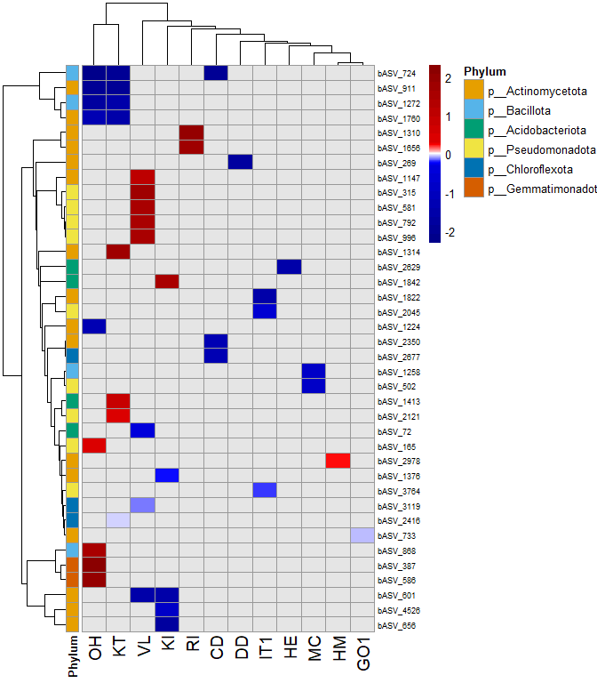
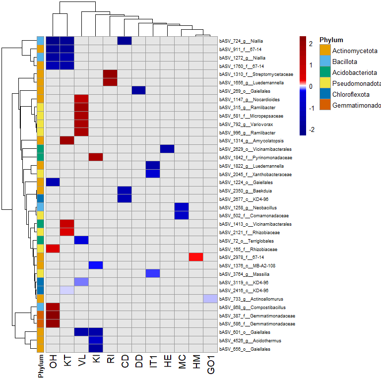
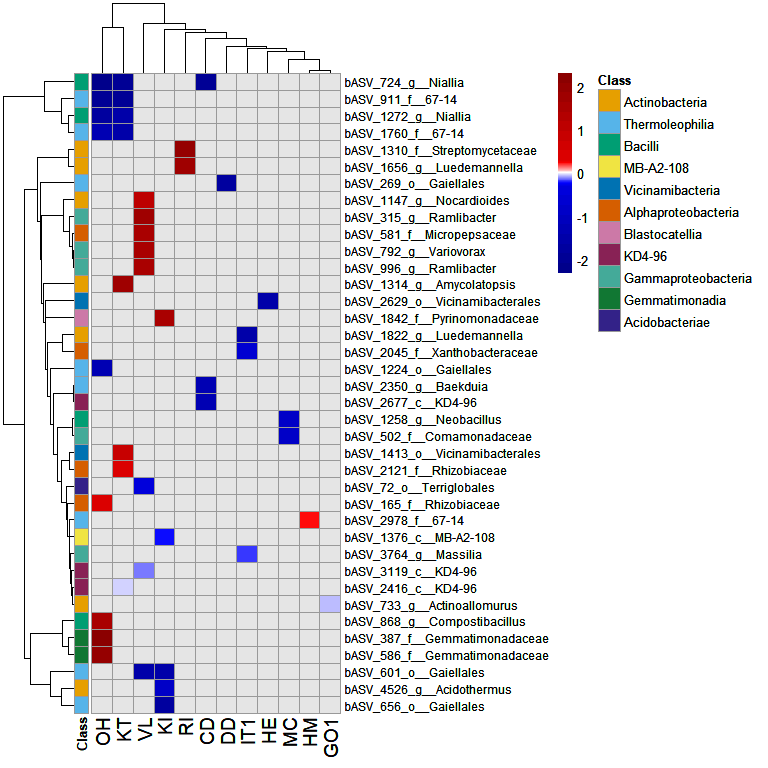
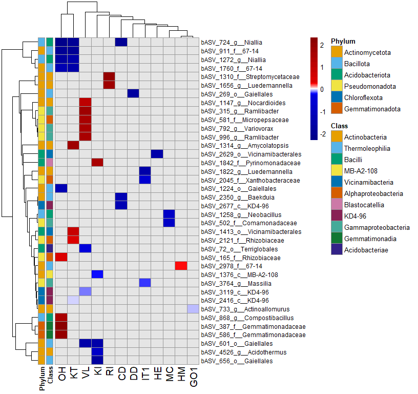

This script is adapted from a script form Melissa Uribe Acosta. Extra input comes from a script of Pedro Beschore da Costa.   
   
   
Tutorials   
- [Heatmap for final plot](http://rstudio-pubs-static.s3.amazonaws.com/288398_185f2889a5f641c6b9aa7b14fa15b634.html)
- [Excamples of pheatmap package](https://davetang.github.io/muse/pheatmap.html)   
   
   
# 4.0 load libraries, improve memory use and subset objects for the desired treatment comparisons
### Load libraries

``` r
R.version$version.string # prints R version
```

```
## [1] "R version 4.5.1 (2025-06-13 ucrt)"
```

``` r
library(phyloseq)
packageVersion("phyloseq")
```

```
## [1] '1.52.0'
```

``` r
library(pheatmap)
packageVersion("pheatmap")
```

```
## [1] '1.0.13'
```

``` r
library(dplyr)
packageVersion("dplyr")
```

```
## [1] '1.1.4'
```

``` r
library(stringr)
packageVersion("stringr")
```

```
## [1] '1.5.2'
```


# 4.10 Heatmap log2fold change
## 4.10.1 Accessions seperate

### Heatmap At ASV level DA ASVs occuring twice
#### Load data

``` r
# load phyloseq object
load("C:/Users/kreek001/OneDrive - Wageningen University & Research/Chapters/Experimental Chapter 3/RScripts/GitHub/TwelveAccessionExperiment/MicrobiomeAnalysis/Data/Phyloseq_objects/CP_unnormalized_bac_ps_ForDA.RData")

# load DA ASVs
load("C:/Users/kreek001/OneDrive - Wageningen University & Research/Chapters/Experimental Chapter 3/RScripts/GitHub/TwelveAccessionExperiment/MicrobiomeAnalysis/Data/Phyloseq_objects/CP_DA_SummaryFiles/SummaryFiles_ASVLevel/Acc_Bac_TwoTimes_DA_ASV.RData")

# load log2fold change values
load(file = "C:/Users/kreek001/OneDrive - Wageningen University & Research/Chapters/Experimental Chapter 3/RScripts/GitHub/TwelveAccessionExperiment/MicrobiomeAnalysis/Data/Phyloseq_objects/CP_DA_Ancom_ASVLevel/ancomWZ_Bac_Acc.RData")
```

#### Combine DA ASVs per accession

``` r
# Numer of DA ASVs
lapply(Acc_Bac_TwoTimes_DA_ASV, function(x) length(x))
```

```
## $OH
## [1] 9
## 
## $DD
## [1] 1
## 
## $HE
## [1] 1
## 
## $KI
## [1] 5
## 
## $VL
## [1] 8
## 
## $CD
## [1] 3
## 
## $RI
## [1] 2
## 
## $KT
## [1] 8
## 
## $MC
## [1] 2
## 
## $HM
## [1] 1
## 
## $IT1
## [1] 3
## 
## $GO1
## [1] 1
```

``` r
length(unique(unlist(Acc_Bac_TwoTimes_DA_ASV)))
```

```
## [1] 38
```

``` r
# Filter log2fold change for DA ASVs per accession
lfc_DA_specific <- lapply(names(Acc_Bac_TwoTimes_DA_ASV), function(name) {
  da_asvs <- Acc_Bac_TwoTimes_DA_ASV[[name]]
  lfc_table <- ancomWZ_Bac_Acc[[name]]$res$lfc
  rownames(lfc_table) <- lfc_table$taxon
  lfc_table <- lfc_table[lfc_table$taxon %in% da_asvs, "Cat_treatmentMb", drop = FALSE]
  lfc_table$ASV <- rownames(lfc_table)
  colnames(lfc_table)[1] <- paste0(name)
  lfc_table
})

names(lfc_DA_specific) <- names(Acc_Bac_TwoTimes_DA_ASV)

# merge all accessions together
AllAcc_lfc <- Reduce(function(x, y) merge(x, y, by = "ASV", all = TRUE), lfc_DA_specific)
rownames(AllAcc_lfc) <- AllAcc_lfc$ASV
nrow(AllAcc_lfc)
```

```
## [1] 38
```

``` r
AllAcc_lfc$ASV <- NULL
```

#### Prepare taxonomy column class and phylum

``` r
# Put all unique DA ASVs in one vector
Acc_Bac_TwoTimes_DA_ASV <- unique(unlist(Acc_Bac_TwoTimes_DA_ASV, use.names = FALSE))

# Only keep DA in ps object
CP_unnormalized_bac_ps_ForDA <- prune_taxa(Acc_Bac_TwoTimes_DA_ASV, CP_unnormalized_bac_ps_ForDA)

# Phyloseq object to data frame with relative abundance, meta data and taxonomy. Each row is a ASV-sample combination
df <- psmelt(CP_unnormalized_bac_ps_ForDA)
head(df[, c(1:9, 95:101)], 12)
```

```
##            OTU Sample Abundance Phase_PSF SampleNr Accession Domestication
## 1525 bASV_1314   C257       367        CP      257        KI          Wild
## 9523  bASV_733   C459       256        CP      459        VL          Wild
## 9406  bASV_733   C257       253        CP      257        KI          Wild
## 2355  bASV_165   C335       234        CP      335        OH          Wild
## 9505  bASV_733   C480       233        CP      480        VL          Wild
## 9035   bASV_72   C295       190        CP      295        KT    Cultivated
## 9383  bASV_733   C337       182        CP      337        OH          Wild
## 1808 bASV_1376   C425       173        CP      425        MC    Cultivated
## 9567  bASV_733   C240       160        CP      240       IT1    Cultivated
## 7455  bASV_502   C085       158        CP       85       GO1    Cultivated
## 8945   bASV_72   C168       150        CP      168        HM    Cultivated
## 8833   bASV_72   C217       144        CP      217       IT1    Cultivated
##      Cat_treatment Soil_conditioning     Kingdom             Phylum
## 1525            Co                   k__Bacteria  p__Actinomycetota
## 9523            Co                   k__Bacteria  p__Actinomycetota
## 9406            Co                   k__Bacteria  p__Actinomycetota
## 2355            Co                   k__Bacteria  p__Pseudomonadota
## 9505            Mb                   k__Bacteria  p__Actinomycetota
## 9035            Co                   k__Bacteria p__Acidobacteriota
## 9383            Co                   k__Bacteria  p__Actinomycetota
## 1808            Mb                   k__Bacteria  p__Actinomycetota
## 9567            Mb                   k__Bacteria  p__Actinomycetota
## 7455            Co                   k__Bacteria  p__Pseudomonadota
## 8945            Co                   k__Bacteria p__Acidobacteriota
## 8833            Co                   k__Bacteria p__Acidobacteriota
##                       Class                  Order                 Family
## 1525      c__Actinobacteria   o__Pseudonocardiales  f__Pseudonocardiaceae
## 9523      c__Actinobacteria o__Streptosporangiales f__Thermomonosporaceae
## 9406      c__Actinobacteria o__Streptosporangiales f__Thermomonosporaceae
## 2355 c__Alphaproteobacteria    o__Hyphomicrobiales        f__Rhizobiaceae
## 9505      c__Actinobacteria o__Streptosporangiales f__Thermomonosporaceae
## 9035      c__Acidobacteriae       o__Terriglobales      f__Incertae_Sedis
## 9383      c__Actinobacteria o__Streptosporangiales f__Thermomonosporaceae
## 1808           c__MB-A2-108      o__Incertae_Sedis      f__Incertae_Sedis
## 9567      c__Actinobacteria o__Streptosporangiales f__Thermomonosporaceae
## 7455 c__Gammaproteobacteria     o__Burkholderiales      f__Comamonadaceae
## 8945      c__Acidobacteriae       o__Terriglobales      f__Incertae_Sedis
## 8833      c__Acidobacteriae       o__Terriglobales      f__Incertae_Sedis
##                   Genus Species
## 1525   g__Amycolatopsis     s__
## 9523 g__Actinoallomurus     s__
## 9406 g__Actinoallomurus     s__
## 2355    g__Unclassified    <NA>
## 9505 g__Actinoallomurus     s__
## 9035  g__Incertae_Sedis     s__
## 9383 g__Actinoallomurus     s__
## 1808  g__Incertae_Sedis     s__
## 9567 g__Actinoallomurus     s__
## 7455    g__Unclassified    <NA>
## 8945  g__Incertae_Sedis     s__
## 8833  g__Incertae_Sedis     s__
```

``` r
# Extract unique ASV–Class-Phylum mapping
tax <- df[!duplicated(df$OTU), c("OTU", "Genus", "Family", "Order", "Class", "Phylum")]

# Keep only those genera present in your heat map matrix
tax <- tax[match(rownames(AllAcc_lfc), tax$OTU), ]

# Row names must match heat map rows
rownames(tax) <- tax$OTU
tax$OTU <- NULL
head(tax)
```

```
##                       Genus                Family                  Order
## bASV_1147   g__Nocardioides    f__Nocardioidaceae o__Propionibacteriales
## bASV_1224 g__Incertae_Sedis     f__Incertae_Sedis          o__Gaiellales
## bASV_1258    g__Neobacillus        f__Bacillaceae          o__Bacillales
## bASV_1272        g__Niallia        f__Bacillaceae          o__Bacillales
## bASV_1310   g__Unclassified  f__Streptomycetaceae    o__Kitasatosporales
## bASV_1314  g__Amycolatopsis f__Pseudonocardiaceae   o__Pseudonocardiales
##                        Class            Phylum
## bASV_1147  c__Actinobacteria p__Actinomycetota
## bASV_1224 c__Thermoleophilia p__Actinomycetota
## bASV_1258         c__Bacilli      p__Bacillota
## bASV_1272         c__Bacilli      p__Bacillota
## bASV_1310  c__Actinobacteria p__Actinomycetota
## bASV_1314  c__Actinobacteria p__Actinomycetota
```

``` r
# Add genus to matrix
AllAcc_lfc2 <- AllAcc_lfc
AllAcc_lfc2$ASV <- rownames(AllAcc_lfc2)
tax$ASV <- rownames(tax)
AllAcc_lfc2 <- merge(tax, AllAcc_lfc2, ID = "ASV")

taxon <- AllAcc_lfc2$Genus
taxon[is.na(taxon)] <- AllAcc_lfc2$Genus[is.na(taxon)]

taxon[taxon == "g__Incertae_Sedis"] <- AllAcc_lfc2$Family[taxon == "g__Incertae_Sedis"]
taxon[taxon == "f__Incertae_Sedis"] <- AllAcc_lfc2$Order[taxon == "f__Incertae_Sedis"]
taxon[taxon == "o__Incertae_Sedis"] <- AllAcc_lfc2$Class[taxon == "o__Incertae_Sedis"]
taxon[taxon == "c__Incertae_Sedis"] <- AllAcc_lfc2$Phylum[taxon == "c__Incertae_Sedis"]

taxon[taxon == "g__Unclassified"] <- AllAcc_lfc2$Family[taxon == "g__Unclassified"]
taxon[taxon == "f__Unclassified"] <- AllAcc_lfc2$Order[taxon == "f__Unclassified"]
taxon[taxon == "o__Unclassified"] <- AllAcc_lfc2$Class[taxon == "o__Unclassified"]
taxon[taxon == "c__Unclassified"] <- AllAcc_lfc2$Phylum[taxon == "c__Unclassified"]

rownames(AllAcc_lfc2) <- paste(AllAcc_lfc2$ASV, taxon, sep = "_")
#AllAcc_lfc2$taxon <- make.unique(paste(taxon, sep = "_"))

AllAcc_lfc2$Phylum <- sub("p__", "", AllAcc_lfc2$Phylum)
AllAcc_lfc2$Class <- sub("c__", "", AllAcc_lfc2$Class)

tax2 <- AllAcc_lfc2[1:6]
AllAcc_lfc2 <- AllAcc_lfc2[7:18]
head(AllAcc_lfc2)
```

```
##                                       OH DD HE KI       VL CD       RI
## bASV_1147_g__Nocardioides             NA NA NA NA 1.024662 NA       NA
## bASV_1224_o__Gaiellales        -1.254837 NA NA NA       NA NA       NA
## bASV_1258_g__Neobacillus              NA NA NA NA       NA NA       NA
## bASV_1272_g__Niallia           -1.649971 NA NA NA       NA NA       NA
## bASV_1310_f__Streptomycetaceae        NA NA NA NA       NA NA 2.040812
## bASV_1314_g__Amycolatopsis            NA NA NA NA       NA NA       NA
##                                       KT         MC HM IT1 GO1
## bASV_1147_g__Nocardioides             NA         NA NA  NA  NA
## bASV_1224_o__Gaiellales               NA         NA NA  NA  NA
## bASV_1258_g__Neobacillus              NA -0.8710051 NA  NA  NA
## bASV_1272_g__Niallia           -1.537450         NA NA  NA  NA
## bASV_1310_f__Streptomycetaceae        NA         NA NA  NA  NA
## bASV_1314_g__Amycolatopsis      1.727357         NA NA  NA  NA
```

``` r
# Make color pallet for class
colors15 <- c("#E69F00", "#56B4E9", "#009E73", "#F0E442", "#0072B2", "#D55E00", "#CC79A7",
              "#882255", "#44AA99", "#117733", "#332288", "#AA4499", "#DDCC77") # "#000000", "#999999", 

classes <- unique(tax$Class)
class_colors <- setNames(colors15[1:length(classes)], classes)
class_colors <- list(Class = class_colors)

classes2 <- unique(tax2$Class)
class_colors2 <- setNames(colors15[1:length(classes2)], classes2)
class_colors2 <- list(Class = class_colors2)

phylums <- unique(tax$Phylum)
phylums_colors <- setNames(colors15[1:length(phylums)], phylums)
phylums_colors <- list(Phylum = phylums_colors)

# Make color pallet for Phylum for genus in plot
phylums2 <- unique(tax2$Phylum)
phylums_colors2 <- setNames(colors15[1:length(phylums2)], phylums2)
phylums_colors2 <- list(Phylum = phylums_colors2)

phylum_class_colors <- c(phylums_colors2, class_colors2)

# counting number of ASVs per accession
ASV_numb <- colSums(!is.na(AllAcc_lfc))
ASV_numb
```

```
##  OH  DD  HE  KI  VL  CD  RI  KT  MC  HM IT1 GO1 
##   9   1   1   5   8   3   2   8   2   1   3   1
```

``` r
# Turn data frame into a matrix
AllAcc_lfc <- as.matrix(AllAcc_lfc)
AllAcc_lfc2 <- as.matrix(AllAcc_lfc2)

# replace NAs by 0s for clustering
AllAcc_lfc_clu <- AllAcc_lfc
AllAcc_lfc2_clu <- AllAcc_lfc2
AllAcc_lfc_clu[is.na(AllAcc_lfc_clu)] <- 0
AllAcc_lfc2_clu[is.na(AllAcc_lfc2_clu)] <- 0

# breaks in heatmap
max_abs <- max(abs(AllAcc_lfc), na.rm = TRUE)
breaks <- unique(c(seq(-max_abs, -0.3, length.out = 10), 
                   seq(-0.3, 0.3, length.out = 30), # More breaks in this range for sensitivity
                   seq(0.3, max_abs, length.out = 10)))
```

#### Heatmap 

``` r
pheatmap(AllAcc_lfc,
          clustering_distance_rows = dist(AllAcc_lfc_clu),
          clustering_distance_cols = dist(t(AllAcc_lfc_clu)),
          color = colorRampPalette(c("darkblue", "blue", "white", "red", "darkred"))(length(breaks) - 1),
          breaks = breaks,
          fontsize_row = 7,
          fontsize_col = 14,
          na_col = "grey90",
          angle_col = 90, 
          annotation_row = tax["Phylum"],
          annotation_colors = phylums_colors)
```

<!-- -->

``` r
pheatmap(AllAcc_lfc2,
          clustering_distance_rows = dist(AllAcc_lfc2_clu),
          clustering_distance_cols = dist(t(AllAcc_lfc2_clu)),
          color = colorRampPalette(c("darkblue", "blue", "white", "red", "darkred"))(length(breaks) - 1),
          breaks = breaks,
          fontsize_row = 7,
          fontsize_col = 14,
          na_col = "grey90",
          angle_col = 90, 
          annotation_row = tax2["Phylum"],
          annotation_colors = phylums_colors2)
```

<!-- -->

``` r
p <- pheatmap(AllAcc_lfc2,
          clustering_distance_rows = dist(AllAcc_lfc2_clu),
          clustering_distance_cols = dist(t(AllAcc_lfc2_clu)),
          color = colorRampPalette(c("darkblue", "blue", "white", "red", "darkred"))(length(breaks) - 1),
          breaks = breaks,
          fontsize_row = 9,
          fontsize_col = 14,
          na_col = "grey90",
          angle_col = 90, 
          annotation_row = tax2["Class"],
          annotation_colors = class_colors2)
p 
```

<!-- -->

``` r
files <- c("CP_DAHeatmap_ASV.svg", "CP_DAHeatmap_ASV.png")

mapply(function(x){
  file_path <- file.path("C:/Users/kreek001/OneDrive - Wageningen University & Research/Chapters/Experimental Chapter 3/Result/Final graphs", x)

  if (grepl("svg$", x)) {
    svg(file_path, width = 22/2.54, height = 18/2.54)
  } else {
    png(file_path, width = 22, height = 18, units = "cm", res = 300)
  }
  grid::grid.draw(p$gtable)
  dev.off()
}, files)
```

```
## CP_DAHeatmap_ASV.svg.png CP_DAHeatmap_ASV.png.png 
##                        2                        2
```

``` r
pheatmap(AllAcc_lfc2,
         clustering_distance_rows = dist(AllAcc_lfc2_clu),
          clustering_distance_cols = dist(t(AllAcc_lfc2_clu)),
          color = colorRampPalette(c("darkblue", "blue", "white", "red", "darkred"))(length(breaks) - 1),
          breaks = breaks,
          fontsize_row = 9,
          fontsize_col = 14,
          na_col = "grey90",
          angle_col = 90, 
          annotation_row = tax2[5:6],
          annotation_colors = phylum_class_colors)
```

<!-- -->

``` r
# Clean environment
rm(list = ls())
```

