This script is adapted from a script form Melissa Uribe Acosta. Extra input comes from a script of Pedro Beschore da Costa.   
   
   
Tutorials   
- [Heatmap for final plot](http://rstudio-pubs-static.s3.amazonaws.com/288398_185f2889a5f641c6b9aa7b14fa15b634.html)
- [Excamples of pheatmap package](https://davetang.github.io/muse/pheatmap.html)   
   
   
# 4.0 Preperation
### Load libraries

``` r
R.version$version.string # prints R version
```

```
## [1] "R version 4.5.1 (2025-06-13 ucrt)"
```

``` r
library(phyloseq)
packageVersion("phyloseq")
```

```
## [1] '1.52.0'
```

``` r
library(DESeq2)
packageVersion("DESeq2")
```

```
## [1] '1.48.2'
```

``` r
library(pheatmap)
packageVersion("pheatmap")
```

```
## [1] '1.0.13'
```

``` r
library(tidyr)
packageVersion("tidyr")
```

```
## [1] '1.3.1'
```

``` r
library(gridExtra)
packageVersion("gridExtra")
```

```
## [1] '2.3'
```

``` r
library(grid)
packageVersion("grid")
```

```
## [1] '4.5.1'
```

``` r
# library(metamisc) #for phyloseq_sep_variable (and more?)
# packageVersion("metamisc")
# library(zinbwave)
# packageVersion("zinbwave")
# library(UpSetR)
# packageVersion("UpSetR")
# library(tuple)
# packageVersion("tuple")
# library(ggpubr)
# packageVersion("ggpubr")
# library(stringr)
# packageVersion("stringr")
# library(ggVennDiagram)
# packageVersion("ggVennDiagram")
```


# 4.10 Heatmap relative abundance per sample
## 4.10.1 Accessions seperate
### Heatmap At ASV level DA ASVs occuring twice
#### Load data

``` r
# load phyloseq object
load("C:/Users/kreek001/OneDrive - Wageningen University & Research/Chapters/Experimental Chapter 3/RScripts/GitHub/TwelveAccessionExperiment/MicrobiomeAnalysis/Data/Phyloseq_objects/CP_unnormalized_bac_ps_ForDA.RData")

# load DA ASVs
load("C:/Users/kreek001/OneDrive - Wageningen University & Research/Chapters/Experimental Chapter 3/RScripts/GitHub/TwelveAccessionExperiment/MicrobiomeAnalysis/Data/Phyloseq_objects/CP_DA_SummaryFiles/SummaryFiles_ASVLevel/Acc_Bac_TwoTimes_DA_ASV.RData")
```

#### Prepare data

``` r
# Put all unique DA ASVs in one vector
Acc_Bac_TwoTimes_DA_ASV_comb <- unique(unlist(Acc_Bac_TwoTimes_DA_ASV, use.names = FALSE))

# Calculate relative abundance
CP_ps <- transform_sample_counts(CP_unnormalized_bac_ps_ForDA, function(x) x / sum(x))

# Only keep DA in ps object
CP_ps <- prune_taxa(Acc_Bac_TwoTimes_DA_ASV_comb, CP_ps)

# Phyloseq object to data frame with relative abundance, meta data and taxonomy. Each row is a ASV-sample combination
df <- psmelt(CP_ps)
head(df[, c(1:8)], 12)
```

```
##            OTU Sample   Abundance Phase_PSF SampleNr Accession Domestication
## 1525 bASV_1314   C257 0.014347707        CP      257        KI          Wild
## 9523  bASV_733   C459 0.009969236        CP      459        VL          Wild
## 9406  bASV_733   C257 0.009890926        CP      257        KI          Wild
## 9505  bASV_733   C480 0.009854092        CP      480        VL          Wild
## 2355  bASV_165   C335 0.009330888        CP      335        OH          Wild
## 7455  bASV_502   C085 0.009032701        CP       85       GO1    Cultivated
## 9383  bASV_733   C337 0.006619385        CP      337        OH          Wild
## 1808 bASV_1376   C425 0.006595501        CP      425        MC    Cultivated
## 9567  bASV_733   C240 0.006517843        CP      240       IT1    Cultivated
## 2402  bASV_165   C105 0.005965269        CP      105       GO1    Cultivated
## 9619  bASV_733   C375 0.005726251        CP      375        RI    Cultivated
## 8953   bASV_72   C137 0.005455963        CP      137        HE          Wild
##      Cat_treatment
## 1525            Co
## 9523            Co
## 9406            Co
## 9505            Mb
## 2355            Co
## 7455            Co
## 9383            Co
## 1808            Mb
## 9567            Mb
## 2402            Mb
## 9619            Co
## 8953            Co
```

``` r
# unique accessions
Acc <- names(Acc_Bac_TwoTimes_DA_ASV)
```

#### Matrix per accession

``` r
# Subset data per accession and DA ASVs
Rel_Ab_l <- list()
for (i in seq_along(Acc)) {
  Acc_sub <- Acc[i]
  sub_df <- df[df$Accession == Acc_sub & df$OTU %in% Acc_Bac_TwoTimes_DA_ASV[[Acc_sub]], c(1:3, 8)]
  sub_df <- sub_df[order(sub_df$Cat_treatment, sub_df$Sample), ]
  sub_df$Sample <- paste(sub_df$Sample, sub_df$Cat_treatment, sep = "_")
    #colnames(sub_df)[3] <- Acc_sub 
  Rel_Ab_l[[i]] <- sub_df
}

names(Rel_Ab_l) <- Acc

# Number of Co Samples
Numb_Co <- lapply(Rel_Ab_l, function(x) length(x[x$Cat_treatment == "Co", "Cat_treatment"])/length(unique(x$OTU)))

# Put each sample in separate column
Rel_Ab_l_wide <- lapply(Rel_Ab_l, function(df) {
  df$Cat_treatment <- NULL
  pivot_wider(df, names_from  = Sample, values_from = Abundance, values_fill = 0)
})

# Make ASVs rownames
Rel_Ab_l_wide <- lapply(Rel_Ab_l_wide, function(df) {
  df <- as.data.frame(df)
  rownames(df) <- df$OTU
  colnames(df)[1] <- "ASV"
  return(df)
})


tax <- lapply(Acc_Bac_TwoTimes_DA_ASV, function(x) {
  sub <- df[df$OTU %in% x, c("OTU", "Genus", "Family", "Order", "Class", "Phylum")]
  sub <- sub[!duplicated(sub$OTU), ]
  rownames(sub) <- sub$OTU
  colnames(sub)[1] <- "ASV"
  return(sub)
})

# Add genus to matrix
AllAcc_lfc2 <- Map(function(x, y) {
  merge(x, y, by = "ASV", all.y = TRUE)
}, tax, Rel_Ab_l_wide)

Rel_Ab_l_wide_df <- lapply(AllAcc_lfc2, function(x) {
  taxon <- x$Genus
  taxon[is.na(taxon)] <- x$Genus[is.na(taxon)]
  
  taxon[taxon == "g__Incertae_Sedis"] <- x$Family[taxon == "g__Incertae_Sedis"]
  taxon[taxon == "f__Incertae_Sedis"] <- x$Order[taxon == "f__Incertae_Sedis"]
  taxon[taxon == "o__Incertae_Sedis"] <- x$Class[taxon == "o__Incertae_Sedis"]
  taxon[taxon == "c__Incertae_Sedis"] <- x$Phylum[taxon == "c__Incertae_Sedis"]
  
  taxon[taxon == "g__Unclassified"] <- x$Family[taxon == "g__Unclassified"]
  taxon[taxon == "f__Unclassified"] <- x$Order[taxon == "f__Unclassified"]
  taxon[taxon == "o__Unclassified"] <- x$Class[taxon == "o__Unclassified"]
  taxon[taxon == "c__Unclassified"] <- x$Phylum[taxon == "c__Unclassified"]
  
  rownames(x) <- paste(x$ASV, taxon, sep = "_")
  return(x)
})

# Split matrix and taxonomyn and turn into matrix
tax <- lapply(Rel_Ab_l_wide_df, function(x) {
  x[1:6]
})

Rel_Ab_l_wide_m <- lapply(Rel_Ab_l_wide_df, function(x) {
  x <- x[7:ncol(x)]
  as.matrix(x)
})

Rel_Ab_l_wide_m$OH[, 1:6]
```

```
##                                    C323_Co      C326_Co      C327_Co
## bASV_1224_o__Gaiellales       3.679717e-05 0.000000e+00 0.0001652619
## bASV_1272_g__Niallia          3.679717e-04 5.644296e-05 0.0000000000
## bASV_165_f__Rhizobiaceae      0.000000e+00 0.000000e+00 0.0000000000
## bASV_1760_f__67-14            0.000000e+00 3.951008e-04 0.0000000000
## bASV_387_f__Gemmatimonadaceae 0.000000e+00 0.000000e+00 0.0008263097
## bASV_586_f__Gemmatimonadaceae 0.000000e+00 0.000000e+00 0.0005288382
## bASV_724_g__Niallia           4.783633e-04 9.595304e-04 0.0000000000
## bASV_868_g__Compostibacillus  2.207830e-04 0.000000e+00 0.0000000000
## bASV_911_f__67-14             1.030321e-03 4.515437e-04 0.0000000000
##                                   C328_Co      C329_Co      C330_Co
## bASV_1224_o__Gaiellales       0.000252945 0.0003298262 0.0002128339
## bASV_1272_g__Niallia          0.000289080 0.0005277219 0.0003192508
## bASV_165_f__Rhizobiaceae      0.000000000 0.0000000000 0.0000000000
## bASV_1760_f__67-14            0.000216810 0.0002638609 0.0003547231
## bASV_387_f__Gemmatimonadaceae 0.000000000 0.0000000000 0.0000000000
## bASV_586_f__Gemmatimonadaceae 0.000000000 0.0000000000 0.0000000000
## bASV_724_g__Niallia           0.000758835 0.0007256176 0.0008513355
## bASV_868_g__Compostibacillus  0.000289080 0.0000000000 0.0000000000
## bASV_911_f__67-14             0.001047915 0.0006596524 0.0006739740
```

#### Headmap 

``` r
plot_Rel_Ab <- list()
for (i in seq_along(Rel_Ab_l_wide_m)) {
  x <- Rel_Ab_l_wide_m[[i]]
  
  # make 0s gray
  x[x == 0] <- NA
  
  # breaks in headmap
  max_abs <- max(abs(x), na.rm = TRUE)
  breaks <- unique(c(#seq(0, 0.2*max_abs, length.out = 30), # More breaks in this range for sensitivity
                     seq(0*max_abs, max_abs, length.out = 60)))

  # Headmap
  plot_Rel_Ab[[i]] <- pheatmap(x,
            cluster_rows = FALSE,
            cluster_cols = FALSE,
            color = colorRampPalette(c("gold", "orange", "red", "darkred", "black"))(length(breaks) - 1),
            breaks = breaks,
            main = names(Rel_Ab_l_wide_m[i]),
            fontsize_row = 10,
            fontsize_col = 14,
            gaps_col = c(Numb_Co[[i]]),
            na_col = "grey90",
            angle_col = 90)
}
```

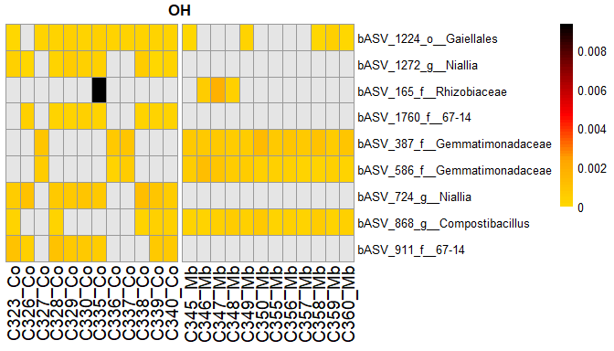<!-- -->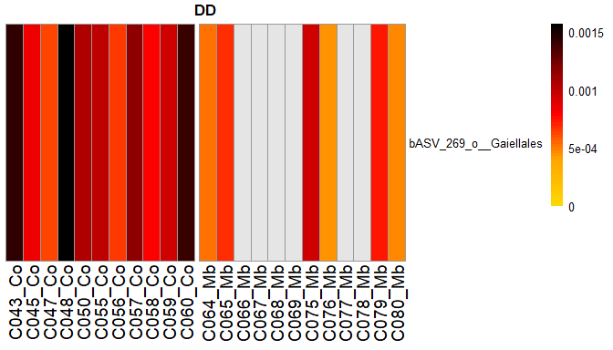<!-- -->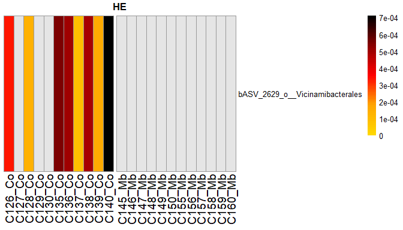<!-- -->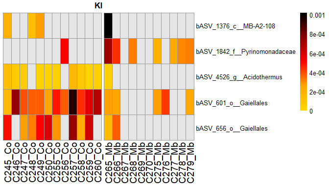<!-- -->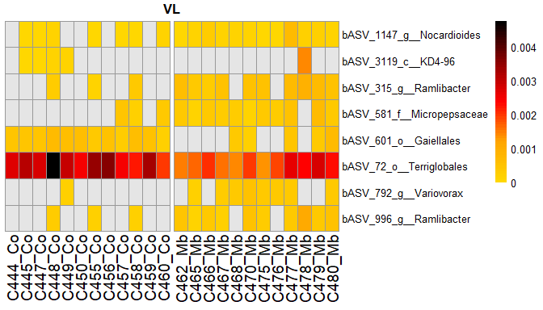<!-- -->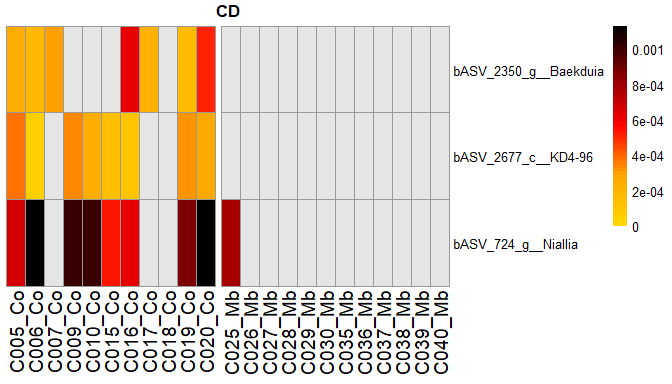<!-- -->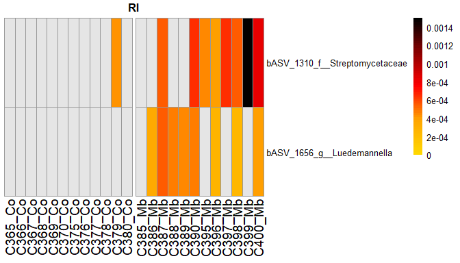<!-- -->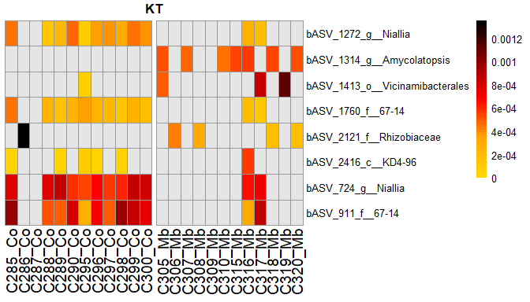<!-- -->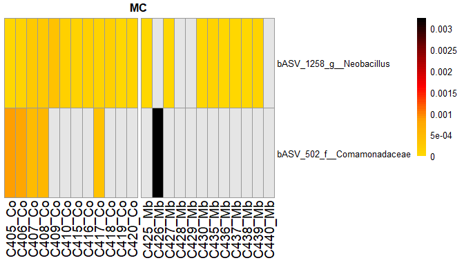<!-- -->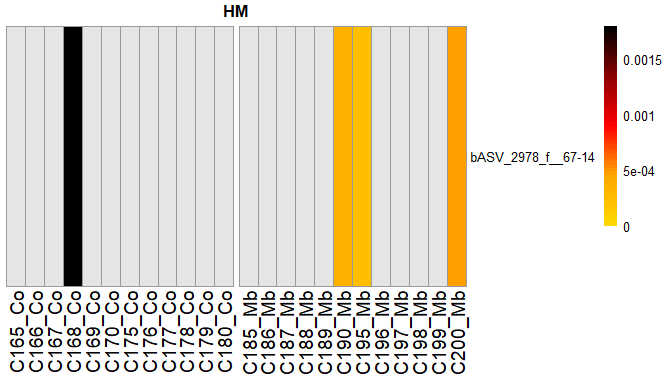<!-- -->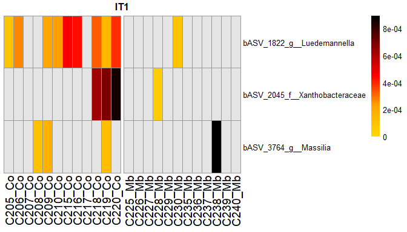<!-- -->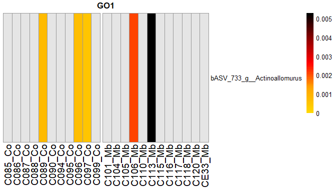<!-- -->

#### Print plots

``` r
#1
plot_Rel_Ab[c(2)]
```

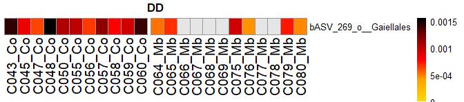<!-- -->

```
## [[1]]
```

``` r
plot_Rel_Ab[c(3)]
```

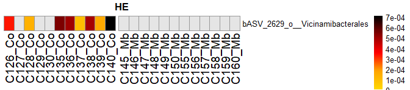<!-- -->

```
## [[1]]
```

``` r
plot_Rel_Ab[c(10)]
```

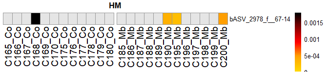<!-- -->

```
## [[1]]
```

``` r
plot_Rel_Ab[c(12)]
```

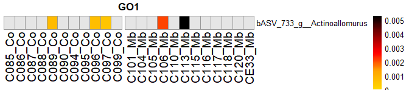<!-- -->

```
## [[1]]
```

``` r
#2
plot_Rel_Ab[c(7)]
```

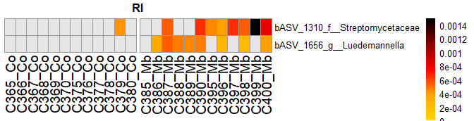<!-- -->

```
## [[1]]
```

``` r
plot_Rel_Ab[c(9)]
```

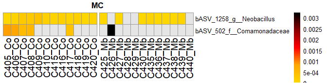<!-- -->

```
## [[1]]
```

``` r
#3
plot_Rel_Ab[c(6)]
```

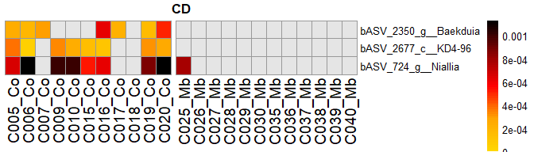<!-- -->

```
## [[1]]
```

``` r
plot_Rel_Ab[c(11)]
```

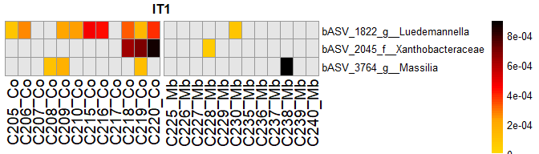<!-- -->

```
## [[1]]
```

``` r
#5
plot_Rel_Ab[4]
```

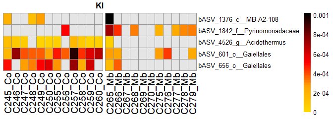<!-- -->

```
## [[1]]
```

``` r
#8
plot_Rel_Ab[c(5)]
```

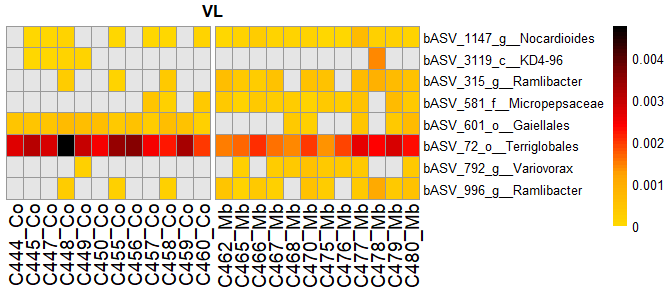<!-- -->

```
## [[1]]
```

``` r
plot_Rel_Ab[c(8)]
```

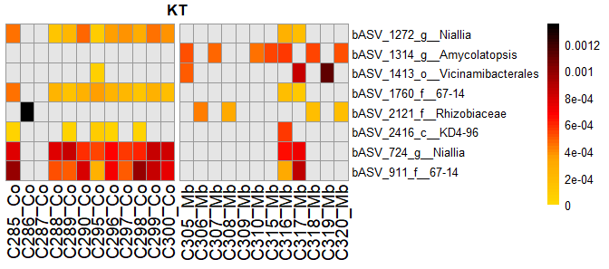<!-- -->

```
## [[1]]
```

``` r
#9
plot_Rel_Ab[1]
```

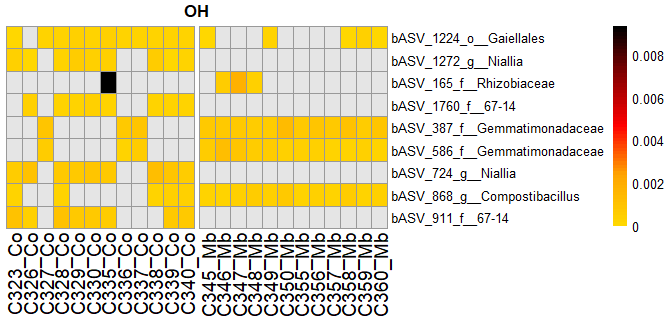<!-- -->

```
## [[1]]
```


#### All Plots on same scall

``` r
# breaks in head map
max_abs <- lapply(Rel_Ab_l_wide_m, function(x) max(abs(x), na.rm = TRUE))
max_abs <- max(unlist(max_abs))
breaks <- unique(c(seq(0, 0.2*max_abs, length.out = 80),
                   seq(0.2*max_abs, 0.5*max_abs, length.out = 40), # More breaks in this range for sensitivity
                   seq(0.5*max_abs, max_abs, length.out = 5)))

plot_Rel_Ab <- list()
for (i in seq_along(Rel_Ab_l_wide_m)) {
  x <- Rel_Ab_l_wide_m[[i]]
  
  # make 0s gray
  x[x == 0] <- NA
  
  # Head map
  plot_Rel_Ab[[i]] <- pheatmap(x,
            cluster_rows = FALSE,
            cluster_cols = FALSE,
            color = colorRampPalette(c("gold", "orange", "red", "darkred", "black"))(length(breaks) - 1),
            breaks = breaks,
            main = names(Rel_Ab_l_wide_m[i]),
            fontsize_row = 10,
            fontsize_col = 14,
            na_col = "grey90",
            gaps_col = c(Numb_Co[[i]]),
            angle_col = 90)
}
```

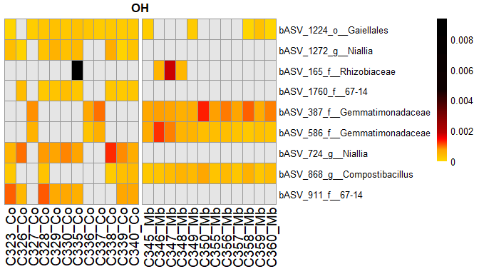<!-- -->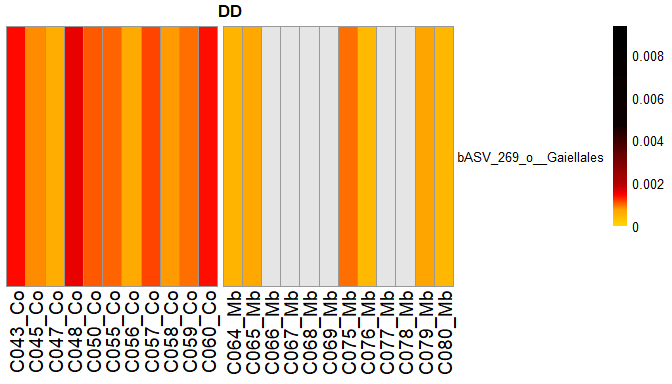<!-- -->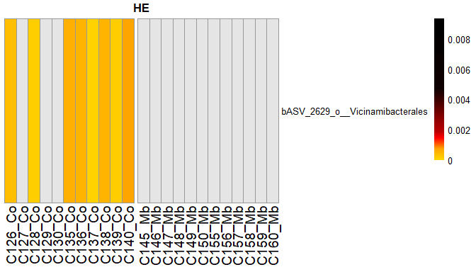<!-- -->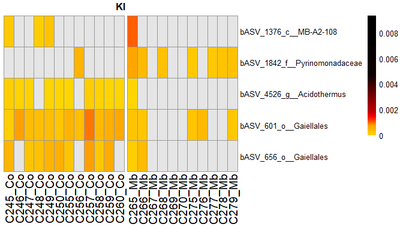<!-- -->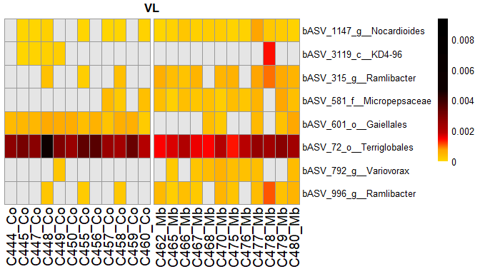<!-- -->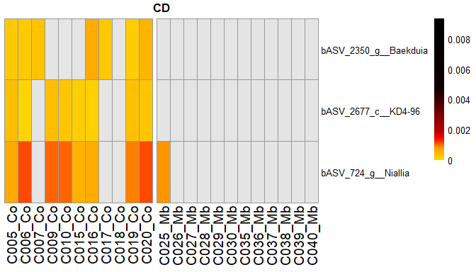<!-- -->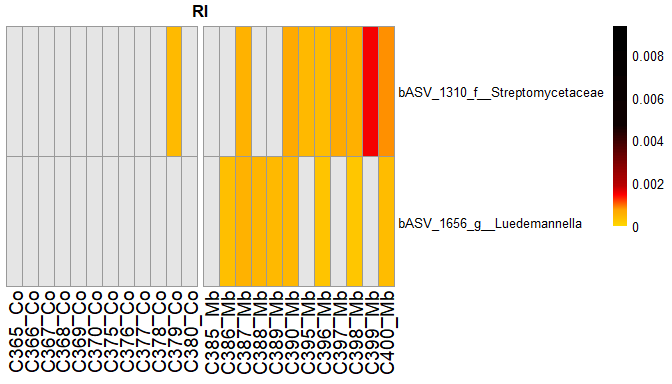<!-- -->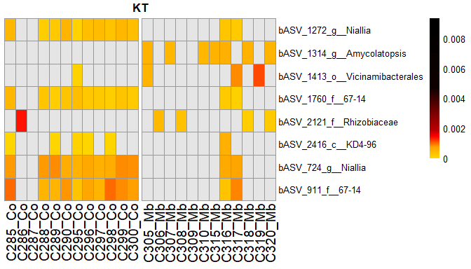<!-- -->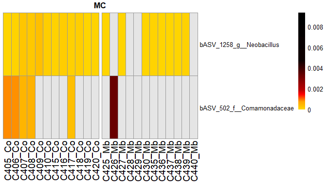<!-- -->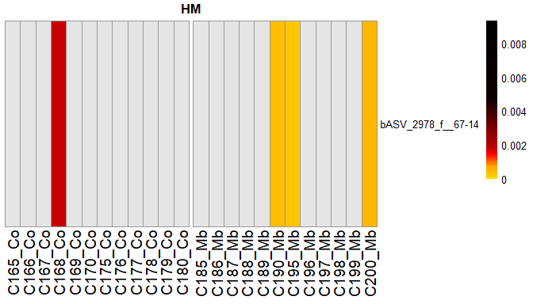<!-- -->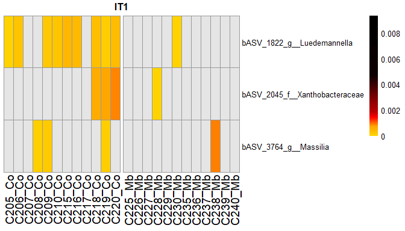<!-- -->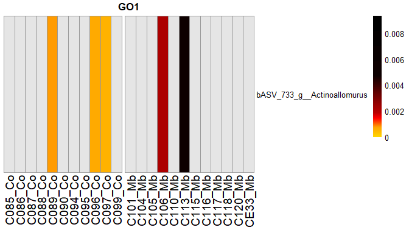<!-- -->

#### Print plots

``` r
#1
plot_Rel_Ab[c(2)]
```

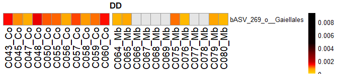<!-- -->

```
## [[1]]
```

``` r
plot_Rel_Ab[c(3)]
```

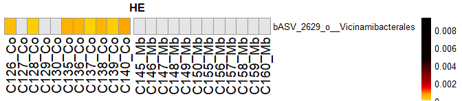<!-- -->

```
## [[1]]
```

``` r
plot_Rel_Ab[c(10)]
```

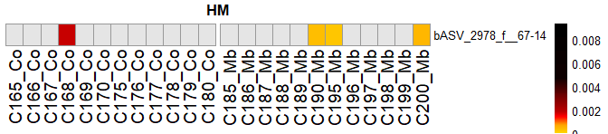<!-- -->

```
## [[1]]
```

``` r
plot_Rel_Ab[c(12)]
```

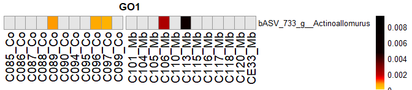<!-- -->

```
## [[1]]
```

``` r
#2
plot_Rel_Ab[c(7)]
```

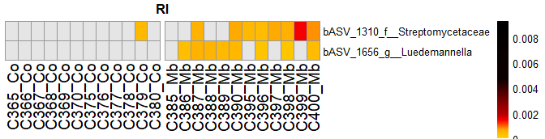<!-- -->

```
## [[1]]
```

``` r
plot_Rel_Ab[c(9)]
```

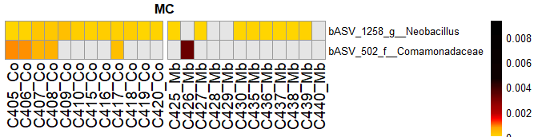<!-- -->

```
## [[1]]
```

``` r
#3
plot_Rel_Ab[c(6)]
```

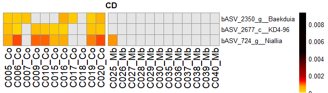<!-- -->

```
## [[1]]
```

``` r
plot_Rel_Ab[c(11)]
```

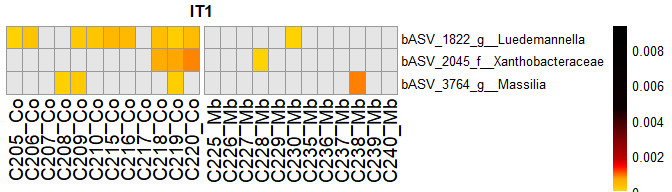<!-- -->

```
## [[1]]
```

``` r
#5
plot_Rel_Ab[4]
```

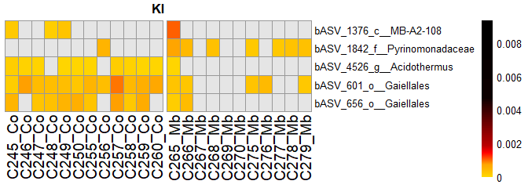<!-- -->

```
## [[1]]
```

``` r
#8
plot_Rel_Ab[c(5)]
```

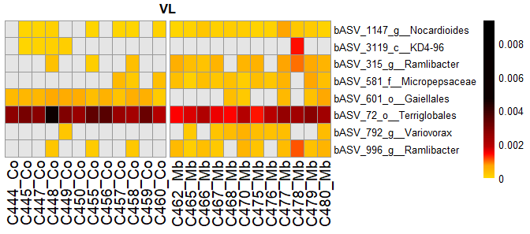<!-- -->

```
## [[1]]
```

``` r
plot_Rel_Ab[c(8)]
```

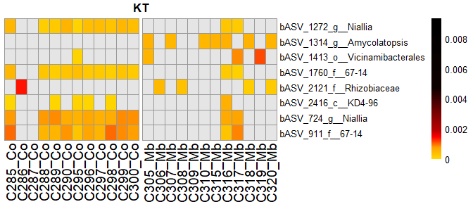<!-- -->

```
## [[1]]
```

``` r
#9
plot_Rel_Ab[1]
```

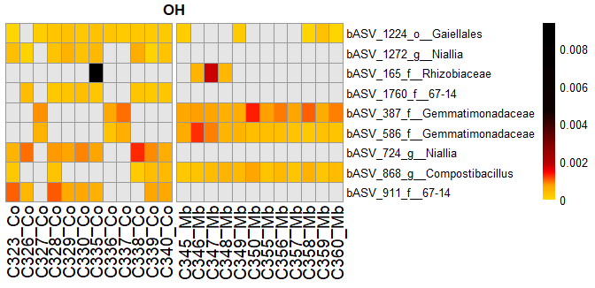<!-- -->

```
## [[1]]
```

#### All Plots on same scall without legend

``` r
max_abs <- lapply(Rel_Ab_l_wide_m, function(x) max(abs(x), na.rm = TRUE))
max_abs <- max(unlist(max_abs))
breaks <- unique(c(seq(0, 0.2*max_abs, length.out = 80),
                   seq(0.2*max_abs, 0.5*max_abs, length.out = 40), # More breaks in this range for sensitivity
                   seq(0.5*max_abs, max_abs, length.out = 5)))

plot_Rel_Ab <- list()
for (i in seq_along(Rel_Ab_l_wide_m)) {
  x <- Rel_Ab_l_wide_m[[i]]
  
  # make 0s gray
  x[x == 0] <- NA
  
  # Head map
  plot_Rel_Ab[[i]] <- pheatmap(x,
            cluster_rows = FALSE,
            cluster_cols = FALSE,
            color = colorRampPalette(c("gold", "orange", "red", "darkred", "black"))(length(breaks) - 1),
            breaks = breaks,
            main = names(Rel_Ab_l_wide_m[i]),
            fontsize_row = 10,
            fontsize_col = 14,
            na_col = "grey90",
            angle_col = 90,
            gaps_col = c(Numb_Co[[i]]),
            legend = FALSE)
}
```

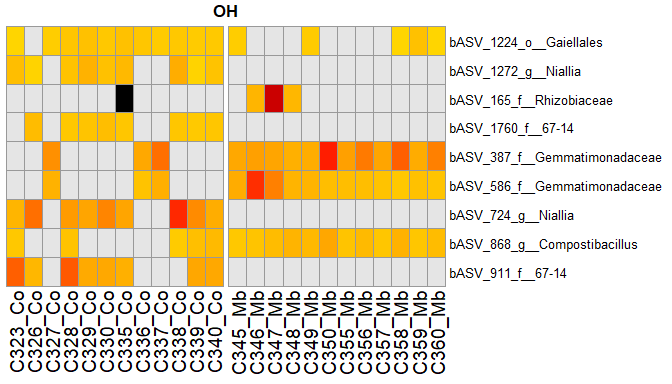<!-- -->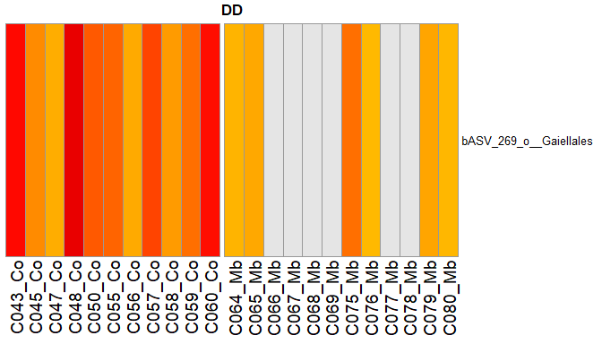<!-- --><!-- --><!-- --><!-- --><!-- --><!-- --><!-- --><!-- --><!-- --><!-- --><!-- -->

#### Print plots

``` r
#1
plot_Rel_Ab[c(2)]
```

<!-- -->

```
## [[1]]
```

``` r
plot_Rel_Ab[c(3)]
```

<!-- -->

```
## [[1]]
```

``` r
plot_Rel_Ab[c(10)]
```

<!-- -->

```
## [[1]]
```

``` r
plot_Rel_Ab[c(12)]
```

<!-- -->

```
## [[1]]
```

``` r
#2
plot_Rel_Ab[c(7)]
```

<!-- -->

```
## [[1]]
```

``` r
plot_Rel_Ab[c(9)]
```

<!-- -->

```
## [[1]]
```

``` r
#3
plot_Rel_Ab[c(6)]
```

<!-- -->

```
## [[1]]
```

``` r
plot_Rel_Ab[c(11)]
```

<!-- -->

```
## [[1]]
```

``` r
#5
plot_Rel_Ab[4]
```

<!-- -->

```
## [[1]]
```

``` r
#8
plot_Rel_Ab[c(5)]
```

<!-- -->

```
## [[1]]
```

``` r
plot_Rel_Ab[c(8)]
```

<!-- -->

```
## [[1]]
```

``` r
#9
plot_Rel_Ab[1]
```

<!-- -->

```
## [[1]]
```

#### All Plots on same scall without legend and x labels

``` r
max_abs <- lapply(Rel_Ab_l_wide_m, function(x) max(abs(x), na.rm = TRUE))
max_abs <- max(unlist(max_abs))
breaks <- unique(c(seq(0, 0.2*max_abs, length.out = 80),
                   seq(0.2*max_abs, 0.5*max_abs, length.out = 40), # More breaks in this range for sensitivity
                   seq(0.5*max_abs, max_abs, length.out = 5)))

plot_Rel_Ab <- list()
for (i in seq_along(Rel_Ab_l_wide_m)) {
  x <- Rel_Ab_l_wide_m[[i]]
  
  # make 0s gray
  x[x == 0] <- NA

  # Head map
  plot_Rel_Ab[[i]] <- pheatmap(x,
            cluster_rows = FALSE,
            cluster_cols = FALSE,
            color = colorRampPalette(c("gold", "orange", "red", "darkred", "black"))(length(breaks) - 1),
            breaks = breaks,
            #main = names(Rel_Ab_l_wide_m[i]),
            show_colnames = FALSE,
            show_rownames = TRUE,
            fontsize_row = 14,
            fontsize_col = 14,
            na_col = "grey90",
            angle_col = 90,
            gaps_col = c(Numb_Co[[i]]),
            cellwidth = 20,
            cellheight = 20,
            legend = FALSE)
}
```

<!-- --><!-- --><!-- --><!-- --><!-- --><!-- --><!-- --><!-- --><!-- --><!-- --><!-- --><!-- -->

``` r
# Create a single legend
legend <- pheatmap(Rel_Ab_l_wide_m[[1]],
                   cluster_rows = FALSE,
                   cluster_cols = FALSE,
                   color = colorRampPalette(c("gold", "orange", "red", "darkred", "black"))(length(breaks) - 1),
                   breaks = breaks,
                   legend = TRUE,
                   show_rownames = FALSE,
                   show_colnames = FALSE)$gtable
```

<!-- -->

``` r
# The legend is usually in the last grob of the gtable
legend_grob <- legend$grobs[[2]]
```


#### Print plots

``` r
#1
plot_Rel_Ab[c(2)]
```

<!-- -->

```
## [[1]]
```

``` r
plot_Rel_Ab[c(3)]
```

<!-- -->

```
## [[1]]
```

``` r
plot_Rel_Ab[c(10)]
```

<!-- -->

```
## [[1]]
```

``` r
plot_Rel_Ab[c(12)]
```

<!-- -->

```
## [[1]]
```

``` r
#2
plot_Rel_Ab[c(7)]
```

<!-- -->

```
## [[1]]
```

``` r
plot_Rel_Ab[c(9)]
```

<!-- -->

```
## [[1]]
```

``` r
#3
plot_Rel_Ab[c(6)]
```

<!-- -->

```
## [[1]]
```

``` r
plot_Rel_Ab[c(11)]
```

<!-- -->

```
## [[1]]
```

``` r
#5
plot_Rel_Ab[4]
```

<!-- -->

```
## [[1]]
```

``` r
#8
plot_Rel_Ab[c(5)]
```

<!-- -->

```
## [[1]]
```

``` r
plot_Rel_Ab[c(8)]
```

<!-- -->

```
## [[1]]
```

``` r
#9
plot_Rel_Ab[1]
```

<!-- -->

```
## [[1]]
```


``` r
grid.newpage()
p <- grid.arrange(grobs = lapply(plot_Rel_Ab, function(x) x$gtable), ncol = 2)
```

<!-- -->

#### Save plots

``` r
# save all heatmaps
files <- c("CP_DAHeatmap_ASV_persample.svg", "CP_DAHeatmap_ASV_persample.png")

mapply(function(x){
  file_path <- file.path("C:/Users/kreek001/OneDrive - Wageningen University & Research/Chapters/Experimental Chapter 3/Result/Final graphs", x)

  if (grepl("svg$", x)) {
    svg(file_path, width = 54/2.54, height = 40/2.54)
  } else {
    png(file_path, width = 54, height = 40, units = "cm", res = 300)
  }
  grid::grid.draw(p)
  dev.off()
}, files)
```

```
## CP_DAHeatmap_ASV_persample.svg.png CP_DAHeatmap_ASV_persample.png.png 
##                                  2                                  2
```

``` r
# save legend
files <- c("CP_DAHeatmap_ASV_persample_legend.svg", "CP_DAHeatmap_ASV_persample_legend.png")

mapply(function(x){
  file_path <- file.path("C:/Users/kreek001/OneDrive - Wageningen University & Research/Chapters/Experimental Chapter 3/Result/Final graphs", x)

  if (grepl("svg$", x)) {
    svg(file_path, width = 2/2.54, height = 5.5/2.54)
  } else {
    png(file_path, width = 2, height = 5.5, units = "cm", res = 300)
  }
  grid::grid.draw(legend_grob)
  dev.off()
}, files)
```

```
## CP_DAHeatmap_ASV_persample_legend.svg.png 
##                                         2 
## CP_DAHeatmap_ASV_persample_legend.png.png 
##                                         2
```


``` r
# library(gridExtra)
# library(grid)
# 
# heatmaps <- lapply(plot_Rel_Ab, function(x) x$gtable)
# 
# # Combine heatmaps in a single grid
# grid.newpage()
# grid.arrange(
#   grobs = c(heatmaps, list(legend_grob)),
#   ncol = 2,
#   widths = c(6,8)
# )
```
