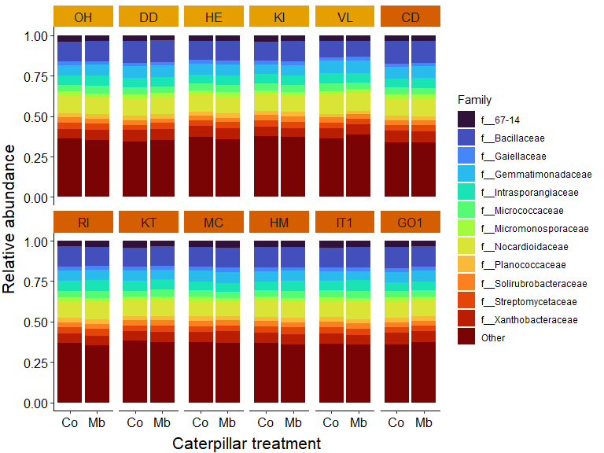
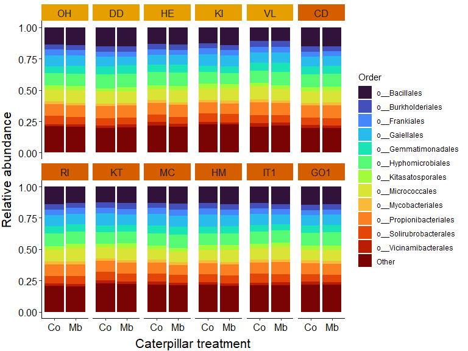
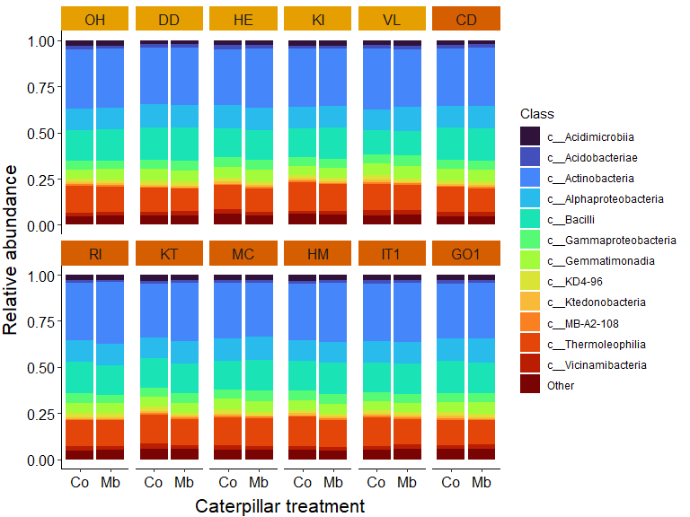
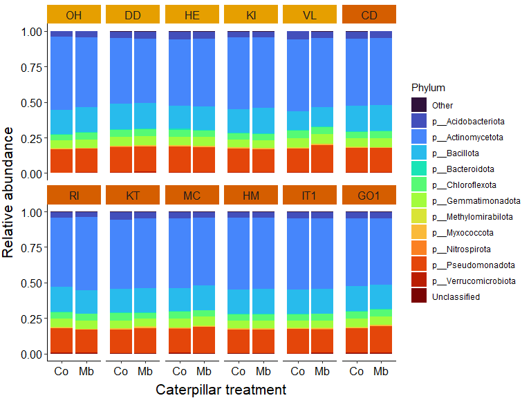

This script is adapted from a script form Melissa Uribe Acosta. Extra input comes from a script of Pedro Beschore da Costa.   
   
   
Tutorials   
- [Heatmap for final plot](http://rstudio-pubs-static.s3.amazonaws.com/288398_185f2889a5f641c6b9aa7b14fa15b634.1html)
   
   
# 8.0 load libraries
### Load libraries

``` r
R.version$version.string # prints R version
```

```
## [1] "R version 4.5.1 (2025-06-13 ucrt)"
```

``` r
library(phyloseq)
packageVersion("phyloseq")
```

```
## [1] '1.52.0'
```

``` r
library(ggplot2)
packageVersion("ggplot2")
```

```
## [1] '4.0.0'
```

``` r
library(ggh4x) #for coloring strip facet wrap
packageVersion("ggh4x")
```

```
## [1] '0.3.1'
```

# 8.1 Stack plot seperate accessions at family level
## Load data

``` r
## Load Phyloseq object
load("C:/Users/kreek001/OneDrive - Wageningen University & Research/Chapters/Experimental Chapter 3/RScripts/GitHub/TwelveAccessionExperiment/MicrobiomeAnalysis/Data/Phyloseq_objects/CP_unnormalized_bac_ps_ForDA.RData")
```

## Merge data on Family level

``` r
# Turn NAs into "unclassified"
tax <- tax_table(CP_unnormalized_bac_ps_ForDA)
tax[is.na(tax[, "Family"]), "Family"] <- "Unclassified"
tax_table(CP_unnormalized_bac_ps_ForDA) <- tax

# Merge same Family by summing counts
CP_unnormalized_bac_ps_ForDA <- tax_glom(CP_unnormalized_bac_ps_ForDA, taxrank = "Family", NArm = TRUE)
```

## Extract data

``` r
# Calculate relative abundance
CP_unnormalized_bac_ps_ForDA <- transform_sample_counts(CP_unnormalized_bac_ps_ForDA, function(y) y / sum(y))

# Melt ps object
ps_df <- psmelt(CP_unnormalized_bac_ps_ForDA)
```

## Aggregating samples per treatment group

``` r
# Mean abundance per Accession / Treatment / Family
ps_df_sum <- aggregate(Abundance ~ Accession + Cat_treatment + Family, data = ps_df, FUN = mean)

# Renormalize within each Accession × Cat_treatment
split_idx <- interaction(ps_df_sum$Accession, ps_df_sum$Cat_treatment)
ps_df_sum$Abundance <- ave(ps_df_sum$Abundance, split_idx, FUN = function(x) x / sum(x))
```

## Find most abundant Family

``` r
# Top 12 Family
fam_means <- aggregate(Abundance ~ Family, data = ps_df_sum, FUN = mean)
fam_means <- fam_means[order(fam_means$Abundance, decreasing = TRUE), ]
top12_fam <- fam_means$Family[1:12]

# pooling other Family
ps_df_sum$Family_plot <- ps_df_sum$Family
ps_df_sum$Family_plot[!ps_df_sum$Family %in% top12_fam] <- "Other"

# merging all Family together
ps_df_sum <- aggregate(Abundance ~ Accession + Cat_treatment + Family_plot, data = ps_df_sum, FUN = sum)
```

## Make stack plot

``` r
strip0 <- strip_themed(background_x = elem_list_rect(fill = c(rep("#E69F00", 5), rep("#D55E00", 7))))

ggplot(ps_df_sum, aes(x = Cat_treatment, y = Abundance, fill = Family_plot)) +
 geom_bar(stat = "identity", width = 0.9) +
 facet_wrap2(~ Accession, 
             nrow = 2,
             strip = strip0) +
 #scale_fill_viridis_d(option = "viridis") +
 scale_fill_viridis_d(option = "turbo") +
 labs(x = "Caterpillar treatment",
    y = "Relative abundance",
    fill = "Family") +
 theme(panel.background = element_rect(fill = "white"), #theme of the graph
        panel.border = element_blank(), #no border around the graph (for border, use: element_rect(color = "gray30", fill = NA))
        axis.line = element_line(), #show line for x and y axis
        plot.title = element_text(size = 9, hjust = 0),
        axis.text = element_text(size = 12, color = "black"),
        axis.title = element_text(size = 16),
        axis.title.x = element_text(vjust = -0.5),
        axis.title.y = element_text(vjust = 2.5), #, hjust = -0
        strip.text = element_text(size = 12),
        legend.position = "right")
```

<!-- -->

``` r
# Clean environment
rm(list = ls())
```

# 8.2 Stack plot seperate accessions at Order level
## Load data

``` r
## Load Phyloseq object
load("C:/Users/kreek001/OneDrive - Wageningen University & Research/Chapters/Experimental Chapter 3/RScripts/GitHub/TwelveAccessionExperiment/MicrobiomeAnalysis/Data/Phyloseq_objects/CP_unnormalized_bac_ps_ForDA.RData")
```

## Merge data on Order level

``` r
# Turn NAs into "unclassified"
tax <- tax_table(CP_unnormalized_bac_ps_ForDA)
tax[is.na(tax[, "Order"]), "Order"] <- "Unclassified"
tax_table(CP_unnormalized_bac_ps_ForDA) <- tax

# Merge same Order by summing counts
CP_unnormalized_bac_ps_ForDA <- tax_glom(CP_unnormalized_bac_ps_ForDA, taxrank = "Order", NArm = TRUE)
```

## Extract data

``` r
# Calculate relative abundance
CP_unnormalized_bac_ps_ForDA <- transform_sample_counts(CP_unnormalized_bac_ps_ForDA, function(y) y / sum(y))

# Melt ps object
ps_df <- psmelt(CP_unnormalized_bac_ps_ForDA)
```

## Aggregating samples per treatment group

``` r
# Mean abundance per Accession / Treatment / Order
ps_df_sum <- aggregate(Abundance ~ Accession + Cat_treatment + Order, data = ps_df, FUN = mean)

# Renormalize within each Accession × Cat_treatment
split_idx <- interaction(ps_df_sum$Accession, ps_df_sum$Cat_treatment)
ps_df_sum$Abundance <- ave(ps_df_sum$Abundance, split_idx, FUN = function(x) x / sum(x))
```

## Find most abundant Order

``` r
# Top 12 Order
fam_means <- aggregate(Abundance ~ Order, data = ps_df_sum, FUN = mean)
fam_means <- fam_means[order(fam_means$Abundance, decreasing = TRUE), ]
top12_fam <- fam_means$Order[1:12]

# pooling other Order
ps_df_sum$Order_plot <- ps_df_sum$Order
ps_df_sum$Order_plot[!ps_df_sum$Order %in% top12_fam] <- "Other"

# merging all Order together
ps_df_sum <- aggregate(Abundance ~ Accession + Cat_treatment + Order_plot, data = ps_df_sum, FUN = sum)
```

## Make stack plot

``` r
strip0 <- strip_themed(background_x = elem_list_rect(fill = c(rep("#E69F00", 5), rep("#D55E00", 7))))

ggplot(ps_df_sum, aes(x = Cat_treatment, y = Abundance, fill = Order_plot)) +
 geom_bar(stat = "identity", width = 0.9) +
 facet_wrap2(~ Accession, 
             nrow = 2,
             strip = strip0) +
 #scale_fill_viridis_d(option = "viridis") +
 scale_fill_viridis_d(option = "turbo") +
 labs(x = "Caterpillar treatment",
    y = "Relative abundance",
    fill = "Order") +
 theme(panel.background = element_rect(fill = "white"), #theme of the graph
        panel.border = element_blank(), #no border around the graph (for border, use: element_rect(color = "gray30", fill = NA))
        axis.line = element_line(), #show line for x and y axis
        plot.title = element_text(size = 9, hjust = 0),
        axis.text = element_text(size = 12, color = "black"),
        axis.title = element_text(size = 16),
        axis.title.x = element_text(vjust = -0.5),
        axis.title.y = element_text(vjust = 2.5), #, hjust = -0
        strip.text = element_text(size = 12),
        legend.position = "right")
```

<!-- -->

``` r
# Clean environment
rm(list = ls())
```

# 8.3 Stack plot seperate accessions at Class level
## Load data

``` r
## Load Phyloseq object
load("C:/Users/kreek001/OneDrive - Wageningen University & Research/Chapters/Experimental Chapter 3/RScripts/GitHub/TwelveAccessionExperiment/MicrobiomeAnalysis/Data/Phyloseq_objects/CP_unnormalized_bac_ps_ForDA.RData")
```

## Merge data on Class level

``` r
# Turn NAs into "unclassified"
tax <- tax_table(CP_unnormalized_bac_ps_ForDA)
tax[is.na(tax[, "Class"]), "Class"] <- "Unclassified"
tax_table(CP_unnormalized_bac_ps_ForDA) <- tax

# Merge same Class by summing counts
CP_unnormalized_bac_ps_ForDA <- tax_glom(CP_unnormalized_bac_ps_ForDA, taxrank = "Class", NArm = TRUE)
```

## Extract data

``` r
# Calculate relative abundance
CP_unnormalized_bac_ps_ForDA <- transform_sample_counts(CP_unnormalized_bac_ps_ForDA, function(y) y / sum(y))

# Melt ps object
ps_df <- psmelt(CP_unnormalized_bac_ps_ForDA)
```

## Aggregating samples per treatment group

``` r
# Mean abundance per Accession / Treatment / Class
ps_df_sum <- aggregate(Abundance ~ Accession + Cat_treatment + Class, data = ps_df, FUN = mean)

# Renormalize within each Accession × Cat_treatment
split_idx <- interaction(ps_df_sum$Accession, ps_df_sum$Cat_treatment)
ps_df_sum$Abundance <- ave(ps_df_sum$Abundance, split_idx, FUN = function(x) x / sum(x))
```

## Find most abundant Class

``` r
# Top 12 Class
fam_means <- aggregate(Abundance ~ Class, data = ps_df_sum, FUN = mean)
fam_means <- fam_means[order(fam_means$Abundance, decreasing = TRUE), ]
top12_fam <- fam_means$Class[1:12]

# pooling other Class
ps_df_sum$Class_plot <- ps_df_sum$Class
ps_df_sum$Class_plot[!ps_df_sum$Class %in% top12_fam] <- "Other"

# merging all Class together
ps_df_sum <- aggregate(Abundance ~ Accession + Cat_treatment + Class_plot, data = ps_df_sum, FUN = sum)
```

## Make stack plot

``` r
strip0 <- strip_themed(background_x = elem_list_rect(fill = c(rep("#E69F00", 5), rep("#D55E00", 7))))

ggplot(ps_df_sum, aes(x = Cat_treatment, y = Abundance, fill = Class_plot)) +
 geom_bar(stat = "identity", width = 0.9) +
 facet_wrap2(~ Accession, 
             nrow = 2,
             strip = strip0) +
 #scale_fill_viridis_d(option = "viridis") +
 scale_fill_viridis_d(option = "turbo") +
 labs(x = "Caterpillar treatment",
    y = "Relative abundance",
    fill = "Class") +
 theme(panel.background = element_rect(fill = "white"), #theme of the graph
        panel.border = element_blank(), #no border around the graph (for border, use: element_rect(color = "gray30", fill = NA))
        axis.line = element_line(), #show line for x and y axis
        plot.title = element_text(size = 9, hjust = 0),
        axis.text = element_text(size = 12, color = "black"),
        axis.title = element_text(size = 16),
        axis.title.x = element_text(vjust = -0.5),
        axis.title.y = element_text(vjust = 2.5), #, hjust = -0
        strip.text = element_text(size = 12),
        legend.position = "right")
```

<!-- -->

``` r
# Clean environment
rm(list = ls())
```

# 8.4 Stack plot seperate accessions at Phylum level
## Load data

``` r
## Load Phyloseq object
load("C:/Users/kreek001/OneDrive - Wageningen University & Research/Chapters/Experimental Chapter 3/RScripts/GitHub/TwelveAccessionExperiment/MicrobiomeAnalysis/Data/Phyloseq_objects/CP_unnormalized_bac_ps_ForDA.RData")
```

## Merge data on Phylum level

``` r
# Turn NAs into "unclassified"
tax <- tax_table(CP_unnormalized_bac_ps_ForDA)
tax[is.na(tax[, "Phylum"]), "Phylum"] <- "Unclassified"
tax_table(CP_unnormalized_bac_ps_ForDA) <- tax

# Merge same Phylum by summing counts
CP_unnormalized_bac_ps_ForDA <- tax_glom(CP_unnormalized_bac_ps_ForDA, taxrank = "Phylum", NArm = TRUE)
```

## Extract data

``` r
# Calculate relative abundance
CP_unnormalized_bac_ps_ForDA <- transform_sample_counts(CP_unnormalized_bac_ps_ForDA, function(y) y / sum(y))

# Melt ps object
ps_df <- psmelt(CP_unnormalized_bac_ps_ForDA)
```

## Aggregating samples per treatment group

``` r
# Mean abundance per Accession / Treatment / Phylum
ps_df_sum <- aggregate(Abundance ~ Accession + Cat_treatment + Phylum, data = ps_df, FUN = mean)

# Renormalize within each Accession × Cat_treatment
split_idx <- interaction(ps_df_sum$Accession, ps_df_sum$Cat_treatment)
ps_df_sum$Abundance <- ave(ps_df_sum$Abundance, split_idx, FUN = function(x) x / sum(x))
```

## Find most abundant Phylum

``` r
# Top 12 Phylum
fam_means <- aggregate(Abundance ~ Phylum, data = ps_df_sum, FUN = mean)
fam_means <- fam_means[order(fam_means$Abundance, decreasing = TRUE), ]
top12_fam <- fam_means$Phylum[1:12]

# pooling other Phylum
ps_df_sum$Phylum_plot <- ps_df_sum$Phylum
ps_df_sum$Phylum_plot[!ps_df_sum$Phylum %in% top12_fam] <- "Other"

# merging all Phylum together
ps_df_sum <- aggregate(Abundance ~ Accession + Cat_treatment + Phylum_plot, data = ps_df_sum, FUN = sum)
```

## Make stack plot

``` r
strip0 <- strip_themed(background_x = elem_list_rect(fill = c(rep("#E69F00", 5), rep("#D55E00", 7))))

ggplot(ps_df_sum, aes(x = Cat_treatment, y = Abundance, fill = Phylum_plot)) +
 geom_bar(stat = "identity", width = 0.9) +
 facet_wrap2(~ Accession, 
             nrow = 2,
             strip = strip0) +
 #scale_fill_viridis_d(option = "viridis") +
 scale_fill_viridis_d(option = "turbo") +
 labs(x = "Caterpillar treatment",
    y = "Relative abundance",
    fill = "Phylum") +
 theme(panel.background = element_rect(fill = "white"), #theme of the graph
        panel.border = element_blank(), #no border around the graph (for border, use: element_rect(color = "gray30", fill = NA))
        axis.line = element_line(), #show line for x and y axis
        plot.title = element_text(size = 9, hjust = 0),
        axis.text = element_text(size = 12, color = "black"),
        axis.title = element_text(size = 16),
        axis.title.x = element_text(vjust = -0.5),
        axis.title.y = element_text(vjust = 2.5), #, hjust = -0
        strip.text = element_text(size = 12),
        legend.position = "right")
```

<!-- -->

``` r
# Clean environment
rm(list = ls())
```
