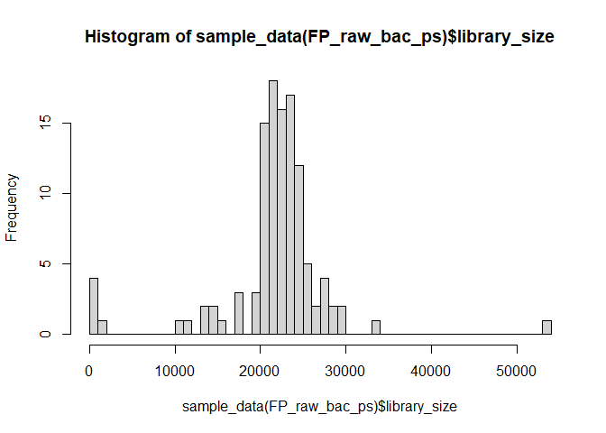
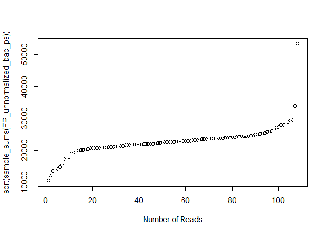
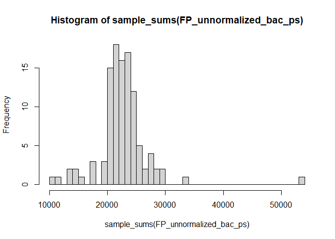
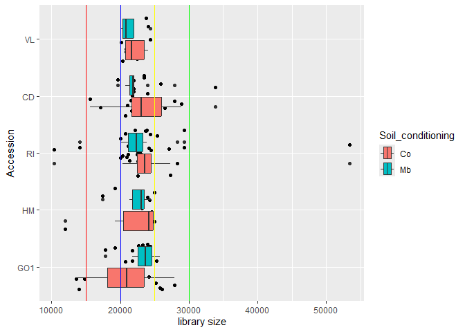
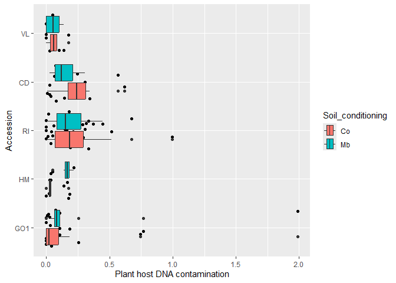
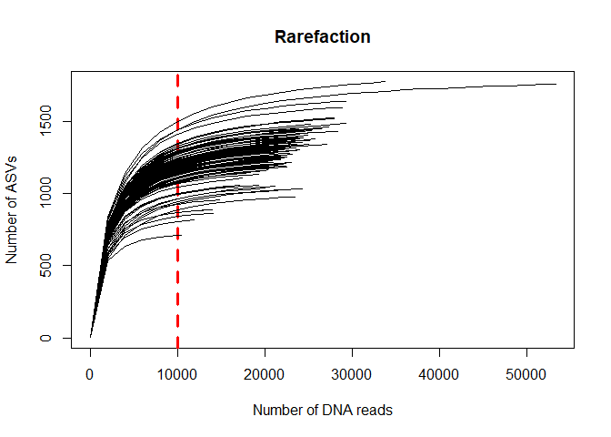

# 0.0 Introduction
This script is for loading and pre-processing microbiome data that is output form the DADA2 [Ernakovich pipeline](https://github.com/ErnakovichLab/dada2_ernakovichlab) as describes in our own [GitHub page](https://github.com/Marcelara/PSF_Anunna). In addition, the ASVs ware assigned to taxonomies with Qiime2 as this results in a higher resolution. Here, the data will be further processed to be able to analyse the data.  

A nice [tutorial](https://www.nicholas-ollberding.com/post/introduction-to-phyloseq/) to learn how to investigate data in a phyloseq object.

This and the next script are originally made by Pedro Beschoren da Costa for the [MeJA_Pilot](https://github.com/PedroBeschoren/MeJA_Pilot) and modified to fit my data.

# 1.0 load all libraries, custom functions, setup environemnt

``` r
# Set working directory
# setwd("")

# load libraries 
library(tidyr)
library(ggplot2)
library(phyloseq)
library(vegan)
library(metagenomeSeq)

# custom functions related to data loading and decontamination
source("C:/Users/kreek001/OneDrive - Wageningen University & Research/Chapters/Experimental Chapter 3/RScripts/GitHub/TwelveAccessionExperiment/MicrobiomeAnalysis/RScripts/Functions/functions_loading_and_decontamination.R")

# increases memory limit used by R
# memory.limit(size = 350000) #This function is no longer supported by Windows
```


# 1.1 load microbiome data
See script of CP. Here we load the phyloseq object of the FP that is created in that script.


``` r
load(file = "C:/Users/kreek001/OneDrive - Wageningen University & Research/Chapters/Experimental Chapter 3/RScripts/GitHub/TwelveAccessionExperiment/MicrobiomeAnalysis/Data/Phyloseq_objects/FP_raw_bac_ps.RData")
```


# 1.2 - Remove bad ASVs
Here we will remove sequences associated with the host, background prokatyotes, low abundance ASVs, poorly identified sequences, and other bad ASVs.

## 1.2.1 - Remove non-bacterial sequences & filter ASVs
Note that the input data has been pre-filtered in the DADA2 pipeline to remove any ASVs that occur less than 3 times in the data set. This was necessary because the dada2-associated taxonomy assignment tools could not assign taxonomies to the full data set with 1 GB ram on the HPC.

### Here we investigate the length of the sequences

``` r
hist(as.data.frame(refseq(FP_raw_bac_ps)@ranges)$width, breaks = 300, main = "Raw reads CP bac")
```

<!-- -->

``` r
summary(as.data.frame(refseq(FP_raw_bac_ps)@ranges)$width) #summary on length of the reeds
```

```
##    Min. 1st Qu.  Median    Mean 3rd Qu.    Max. 
##   214.0   395.0   411.0   407.1   419.0   436.0
```

``` r
ntaxa(FP_raw_bac_ps) #shows total number of ASVs
```

```
## [1] 226072
```

``` r
summary(sample_sums(FP_raw_bac_ps)) #shows number of reeds
```

```
##    Min. 1st Qu.  Median    Mean 3rd Qu.    Max. 
##     189   24178   25296   24729   27037   56687
```

### Here we get rid of sequences shorter than 380bp

``` r
sum(as.data.frame(refseq(FP_raw_bac_ps)@ranges)$width < 380) # count number of reads smaller than 380bp
```

```
## [1] 1139
```

``` r
sum(as.data.frame(refseq(FP_raw_bac_ps)@ranges)$width > 380)
```

```
## [1] 224925
```

``` r
FP_raw_bac_ps <- prune_taxa(taxa = as.data.frame(refseq(FP_raw_bac_ps)@ranges)$width > 380,
                       x = FP_raw_bac_ps)
ntaxa(FP_raw_bac_ps) #shows total number of ASVs
```

```
## [1] 224925
```

``` r
summary(sample_sums(FP_raw_bac_ps)) #shows number of reeds
```

```
##    Min. 1st Qu.  Median    Mean 3rd Qu.    Max. 
##     189   24123   25254   24638   26906   56495
```

### Keeps only ASVs identified as bacterial

``` r
FP_raw_bac_ps <- subset_taxa(FP_raw_bac_ps, Kingdom == "k__Bacteria")
ntaxa(FP_raw_bac_ps) #shows total number of ASVs
```

```
## [1] 224911
```

``` r
summary(sample_sums(FP_raw_bac_ps)) #shows number of reeds
```

```
##    Min. 1st Qu.  Median    Mean 3rd Qu.    Max. 
##     189   24123   25254   24638   26906   56495
```

### Remove Salinibacter ASV(s)

``` r
FP_raw_bac_ps #original data set
```

```
## phyloseq-class experiment-level object
## otu_table()   OTU Table:         [ 224911 taxa and 113 samples ]
## sample_data() Sample Data:       [ 113 samples by 85 sample variables ]
## tax_table()   Taxonomy Table:    [ 224911 taxa by 8 taxonomic ranks ]
## refseq()      DNAStringSet:      [ 224911 reference sequences ]
```

``` r
physeq_OnlySal <- subset_taxa(FP_raw_bac_ps, Genus == "g__Salinibacter")
physeq_OnlySal
```

```
## phyloseq-class experiment-level object
## otu_table()   OTU Table:         [ 444 taxa and 113 samples ]
## sample_data() Sample Data:       [ 113 samples by 85 sample variables ]
## tax_table()   Taxonomy Table:    [ 444 taxa by 8 taxonomic ranks ]
## refseq()      DNAStringSet:      [ 444 reference sequences ]
```

``` r
FP_raw_bac_ps <- subset_taxa(FP_raw_bac_ps, Genus != "g__Salinibacter" | is.na(Genus)) # remove Salinibacter genus but keep undefined genesis (NAs)
FP_raw_bac_ps #data set without salinibacter
```

```
## phyloseq-class experiment-level object
## otu_table()   OTU Table:         [ 224467 taxa and 113 samples ]
## sample_data() Sample Data:       [ 113 samples by 85 sample variables ]
## tax_table()   Taxonomy Table:    [ 224467 taxa by 8 taxonomic ranks ]
## refseq()      DNAStringSet:      [ 224467 reference sequences ]
```

``` r
rm(physeq_OnlySal)
```

### Define library sizes as metadata before filtering

``` r
FP_raw_bac_ps@sam_data$library_sizes_prefiltering <- sample_sums(FP_raw_bac_ps)
hist(sample_sums(FP_raw_bac_ps), breaks = 50)
```

<!-- -->

### Removes taxa having less than 8 reads across all samples, as VSEARCH standard

``` r
otu_table(FP_raw_bac_ps) <- otu_table(FP_raw_bac_ps)[which (rowSums(otu_table(FP_raw_bac_ps)) > 7),]
ntaxa(FP_raw_bac_ps) #shows total number of ASVs
```

```
## [1] 12120
```

``` r
summary(sample_sums(FP_raw_bac_ps)) #shows number of reeds
```

```
##    Min. 1st Qu.  Median    Mean 3rd Qu.    Max. 
##      58   21366   23051   22270   24649   54783
```

### Remove ASV occurring in less than three samples
We remove ASVs that occur in less than 3 samples.

``` r
filter <- phyloseq::genefilter_sample(FP_raw_bac_ps, filterfun_sample(function(x) x > 0), A = 3) 
FP_raw_bac_ps <- prune_taxa(filter, FP_raw_bac_ps)
ntaxa(FP_raw_bac_ps) #shows total number of ASVs
```

```
## [1] 7637
```

``` r
summary(sample_sums(FP_raw_bac_ps)) #shows number of reeds
```

```
##    Min. 1st Qu.  Median    Mean 3rd Qu.    Max. 
##      19   20860   22554   21754   24033   53457
```

### Check and remove plant-host contamination

``` r
### define plastid, mitochondria and host plant contamination ps objects
Mitochondria_ps <- subset_taxa(FP_raw_bac_ps, Family == "f__Mitochondria" | Family == "Mitochondria")
Plastid_ps <- subset_taxa(FP_raw_bac_ps, Order == "o__Chloroplast" | Order == "Chloroplast") 
host_plant_ps <- merge_phyloseq(Mitochondria_ps, Plastid_ps)

### quick histogram showing plant DNA contamination
hist(sample_sums(host_plant_ps)/sample_sums(FP_raw_bac_ps)*100, breaks = 50)
```

<!-- -->

``` r
summary(sample_sums(host_plant_ps)/sample_sums(FP_raw_bac_ps)*100)
```

```
##    Min. 1st Qu.  Median    Mean 3rd Qu.    Max. 
## 0.00000 0.03105 0.10615 0.17882 0.21806 1.98691
```

``` r
summary(sample_sums(Mitochondria_ps)/sample_sums(FP_raw_bac_ps)*100)
```

```
##    Min. 1st Qu.  Median    Mean 3rd Qu.    Max. 
## 0.00000 0.00000 0.00845 0.02022 0.02525 0.28518
```

``` r
summary(sample_sums(Plastid_ps)/sample_sums(FP_raw_bac_ps)*100)
```

```
##    Min. 1st Qu.  Median    Mean 3rd Qu.    Max. 
## 0.00000 0.02504 0.09348 0.15860 0.18024 1.70173
```

Between 0 and 2% of the ASVs per sample is contaminated with mitochondrial or chloroplast DNA.


``` r
### define host plant 16S contamination as metadata (add the info the the metadata sheet)
FP_raw_bac_ps@sam_data$Mitochondria_reads <- sample_sums(Mitochondria_ps)
FP_raw_bac_ps@sam_data$Plastid_reads <- sample_sums(Plastid_ps)
FP_raw_bac_ps@sam_data$Host_DNA_n_reads <- sample_sums(host_plant_ps)
FP_raw_bac_ps@sam_data$Host_DNA_contamination_pct <- sample_sums(host_plant_ps)/sample_sums(FP_raw_bac_ps)*100

### remove plant host sequences (plastid and mitochondrial DNA) 
FP_raw_bac_ps <- remove_Chloroplast_Mitochondria(FP_raw_bac_ps)
```

### Check library size

``` r
# add library sizes as part of metadata
sample_data(FP_raw_bac_ps)$library_size <- sample_sums(FP_raw_bac_ps)

#check library size distribution
hist(sample_data(FP_raw_bac_ps)$library_size, breaks = 50)
```

<!-- -->

``` r
summary(sample_data(FP_raw_bac_ps)$library_size) #shows the number of reeds
```

```
##    Min. 1st Qu.  Median    Mean 3rd Qu.    Max. 
##      19   20845   22513   21715   24015   53356
```

``` r
# remove samples with library size = 0  (non-informative; failed PCR/sequencing)
#FP_raw_bac_ps<-subset_samples(FP_raw_bac_ps, library_size >0) #not applicable

# remove ps objects
rm(Mitochondria_ps, Plastid_ps, host_plant_ps)

# run garbage collection after creating large objects
gc()
```

```
##            used  (Mb) gc trigger  (Mb) max used  (Mb)
## Ncells  5140151 274.6    8531837 455.7  8531837 455.7
## Vcells 21102835 161.1   72512951 553.3 90641188 691.6
```


# 1.3 - Decontaminate phyloseq objects
The decontam package will use blank DNA samples to remove possible contaminants. Here we use a single custom function to run decontamination, generate plots, and return a clean phyloseq object

We will also check the number of reads in a blank sample (average +SD) so we can compare those blank samples with libraries with low number of reads. samples that cannot be distinguished from a blank (in terms of library size) 

### Decontaminate

``` r
FP_unnormalized_bac_ps <- decontaminate_and_plot(FP_raw_bac_ps)
```

```
## Loading required package: decontam
```

``` r
# phyloseq object without contamination
FP_unnormalized_bac_ps[1]
```

```
## [[1]]
## phyloseq-class experiment-level object
## otu_table()   OTU Table:         [ 7601 taxa and 108 samples ]
## sample_data() Sample Data:       [ 108 samples by 92 sample variables ]
## tax_table()   Taxonomy Table:    [ 7601 taxa by 8 taxonomic ranks ]
## refseq()      DNAStringSet:      [ 7601 reference sequences ]
```

``` r
# Number of ASVs assigned as contamination
FP_unnormalized_bac_ps[5]
```

```
## [[1]]
## 
## FALSE  TRUE 
##  7601    29
```

``` r
# ASVs assigned as contamination
FP_unnormalized_bac_ps[4]
```

```
## [[1]]
##  [1] "bASV_1635"  "bASV_2192"  "bASV_2311"  "bASV_2369"  "bASV_2745" 
##  [6] "bASV_3462"  "bASV_4179"  "bASV_4203"  "bASV_4262"  "bASV_4342" 
## [11] "bASV_4728"  "bASV_5018"  "bASV_5342"  "bASV_5741"  "bASV_6206" 
## [16] "bASV_6254"  "bASV_6298"  "bASV_6342"  "bASV_7667"  "bASV_8229" 
## [21] "bASV_8708"  "bASV_9730"  "bASV_10013" "bASV_10824" "bASV_11035"
## [26] "bASV_12184" "bASV_13356" "bASV_14018" "bASV_14440"
```

### Check blanks
Let's look into how many reads our blank had (average + sd) so we can compare those to libraries with very low number of reads.

``` r
blank_reads_bac <- sort(sample_sums(subset_samples(FP_raw_bac_ps, Soil_conditioning == "B")))
plot(blank_reads_bac)
```

<!-- -->

``` r
#clean up environment to free memory
rm(FP_raw_bac_ps)
```

### Check phyloseq object
After checking the decontamination plots and reports, we can remove them and focus on the phyloseq object.

``` r
FP_unnormalized_bac_ps <- unlist(FP_unnormalized_bac_ps[[1]])
```

#### Check library size Bacteria
Now let's check the lower end of our library sizes.

``` r
sort(sample_sums(FP_unnormalized_bac_ps))
```

```
##  F371  F178  F090  F088  F392  F086  F008  F019  F200  F108  F098  F175  F037 
## 10408 11958 13577 13992 14087 14788 15574 17146 17396 17873 19263 19278 19596 
##  F522  F527  F478  F376  F479  F460  F025  F534  F456  F096  F457  F089  F477 
## 20004 20047 20116 20307 20388 20631 20710 20752 20754 20759 20837 20847 20865 
##  F099  F523  F027  F529  F530  F199  F397  F018  F030  F015  F110  F026  F109 
## 20965 20989 21049 21128 21199 21364 21375 21569 21587 21624 21706 21791 21793 
##  F035  F017  F039  F393  F036  F475  F029  F528  F380  F524  F533  F458  F374 
## 21820 21839 21916 21934 21956 21963 21972 22134 22164 22207 22427 22494 22513 
##  F400 FE104  F532  F097  F016  F399  F116  F195  F391  F377  F525  F193  F095 
## 22535 22537 22538 22647 22693 22755 22848 22858 22897 22907 23091 23189 23204 
##  F120  F006  F007  FE98  F194  F536  F119  F395  F459  F378  F107  F396  F179 
## 23244 23448 23462 23485 23563 23611 23633 23633 23730 23738 23743 23861 23943 
##  F118  F038  F455  F100  F373  F176  F476  F540  F106  F372  F197  F177  F180 
## 23987 24009 24088 24174 24183 24313 24334 24338 24376 24464 24592 24934 24987 
##  F117  F115  F379  F105  F010  F087  F009  F375  F539  F040  F085  F526  F005 
## 25135 25238 25380 25753 25882 26052 26470 27083 27292 27933 27945 28335 28862 
##  F398  F394  F020  F538 
## 29283 29341 33821 53343
```

``` r
plot(sort(sample_sums(FP_unnormalized_bac_ps)), xlab = "Number of Reads")
```

<!-- -->

<!-- #### Remove samples with a number of reads similar to blanks -->
<!-- ```{r} -->
<!-- FP_unnormalized_bac_ps <- subset_samples(FP_unnormalized_bac_ps, library_size > 6000) -->
<!-- ``` -->

### Set factors

``` r
# set Soil_conditioning as factor, and then order it properly
FP_unnormalized_bac_ps@sam_data$Soil_conditioning <- factor(FP_unnormalized_bac_ps@sam_data$Soil_conditioning, levels = c("Co", "Mb", "S"))

# set Cat_treatment as factor, and then order it properly
FP_unnormalized_bac_ps@sam_data$Cat_treatment <- factor(FP_unnormalized_bac_ps@sam_data$Cat_treatment, levels = c("Co", "Mb"))

# set Accession as factor, and then order it properly
FP_unnormalized_bac_ps@sam_data$Accession <- factor(FP_unnormalized_bac_ps@sam_data$Accession, levels = c("VL", "CD", "RI", "HM", "GO1", "Un"))

# Remove unplanted CTRL because it belongs to CP
FP_unnormalized_bac_ps <- subset_samples(FP_unnormalized_bac_ps, Accession != "Un")

# set Batch as factor
FP_unnormalized_bac_ps@sam_data$Batch <- factor(FP_unnormalized_bac_ps@sam_data$Batch)
```


# 1.4 - Plot library sizes per treatment and check NAs and uncultured ASVs
### Check number of reeds

``` r
# let's check the number of reads in a couple histograms
hist(sample_sums(FP_unnormalized_bac_ps), breaks = 50)
```

<!-- -->

``` r
summary(sample_sums(FP_unnormalized_bac_ps))
```

```
##    Min. 1st Qu.  Median    Mean 3rd Qu.    Max. 
##   10408   20983   22538   22696   24110   53343
```

### Check library size

``` r
# check plot for some minimum library sizes on all samples

ggplot(data = sample_data(FP_unnormalized_bac_ps), 
           mapping = aes(x = library_size, y = Accession, fill = Soil_conditioning)) +
      geom_jitter() +
      geom_boxplot() +
      scale_y_discrete(limits = rev) +
      geom_vline(xintercept = 30000, color="green") +
      geom_vline(xintercept = 25000, color="yellow") +
      geom_vline(xintercept = 20000, color="blue") +
      geom_vline(xintercept = 15000, color="red") +
      labs(x = "library size",
           y = "Accession") #+
```

<!-- -->

``` r
      #theme(axis.text.x = element_text(angle = 20, vjust = 0.5, hjust=1))

# # In case I want to do a subset of the data
# lapply(FP_unnormalized_bac_ps, function(x)
#     ggplot(data = sample_data(subset_samples(x, Compartment == "Rhizosphere")), 
#            mapping = aes(x = library_size, y = Soil_Slurry_Treatment, color = Soil_Slurry_Treatment, fill = Phase)) +
#     geom_jitter() +
#     geom_boxplot() +
#     scale_y_discrete(limits = rev) +
#     geom_vline(xintercept = 30000, color="green") +
#     geom_vline(xintercept = 25000, color="yellow") +
#     geom_vline(xintercept = 20000, color="blue") +
#     geom_vline(xintercept = 15000, color="red") +
#     labs(x = "library size",
#          y = "Soil slurry treatment and phase") +
#     theme(axis.text.x = element_text(angle = 45, vjust = 0.5, hjust=1)))
```

### Check plant-host contamination

``` r
# check bacterial 16S plant host contamination
ggplot(data = sample_data(FP_unnormalized_bac_ps), 
           mapping = aes(x = Host_DNA_contamination_pct, y = Accession, fill = Soil_conditioning)) +
      geom_jitter() +
      geom_boxplot() +
      scale_y_discrete(limits = rev) +
      # geom_vline(xintercept = 30000, color="green") +
      # geom_vline(xintercept = 25000, color="yellow") +
      # geom_vline(xintercept = 20000, color="blue") +
      #geom_vline(xintercept = 15000, color="red") +
      labs(x = "Plant host DNA contamination",
           y = "Accession") #+
```

<!-- -->

``` r
      #theme(axis.text.x = element_text(angle = 45, vjust = 0.5, hjust=1))
```

### check percentage of NA in taxonomy

``` r
### check_n_taxa_NA_percentage(ps_object, ntaxa))
check_n_taxa_NA_percentage(FP_unnormalized_bac_ps, 100) # top 100 taxa
```

```
##    Kingdom     Phylum      Class      Order     Family      Genus    Species 
##          0          0          0          0          1         12         12 
## Confidence 
##          0
```

``` r
check_n_taxa_NA_percentage(FP_unnormalized_bac_ps, 1000)
```

```
##    Kingdom     Phylum      Class      Order     Family      Genus    Species 
##        0.0        0.1        0.1        0.2        1.1       11.0       11.0 
## Confidence 
##        0.0
```

``` r
check_n_taxa_NA_percentage(FP_unnormalized_bac_ps, 10000) # top 10,000 taxa
```

```
##    Kingdom     Phylum      Class      Order     Family      Genus    Species 
##  0.0000000  0.1841863  0.2368109  0.4078411  1.4077095 11.6037364 11.6037364 
## Confidence 
##  0.0000000
```

``` r
#A higher the number of taxa does not make a difference
```

### Check uncultured and unassigned taxa
Out commanded lines mean that type is not present in the data set.

``` r
#subset_taxa(FP_unnormalized_bac_ps, Kingdom == "Unassigned") #No hits as I sub-setted the data with only k__Bacteria before

# subset_taxa(FP_unnormalized_bac_ps, Class == "c__uncultured" | Class == "c__unidentified")
# subset_taxa(FP_unnormalized_bac_ps, Class == "c__uncultured")
# subset_taxa(FP_unnormalized_bac_ps, Class == "c__unidentified") #not in data set

# subset_taxa(c__unidentified, Family == "f__uncultured" | Family == "f__unidentified")
# subset_taxa(FP_unnormalized_bac_ps, Family == "f__uncultured")
# subset_taxa(FP_unnormalized_bac_ps, Family == "f__unidentified") #not in data set

# subset_taxa(c__unidentified, Genus == "g__uncultured" | Genus == "g__unidentified")
# subset_taxa(FP_unnormalized_bac_ps, Genus == "g__uncultured")
# subset_taxa(FP_unnormalized_bac_ps, Genus == "g__unidentified") #not in data set
```

There are no uncultured or unidentified samples.


# 1.5 export filtered unnormalized ps object
### Save RData
let's save these normalized objects as RData so they can be loaded in other scripts.

``` r
#save(FP_unnormalized_bac_ps, file = "C:/Users/kreek001/OneDrive - Wageningen University & Research/Chapters/Experimental Chapter 3/RScripts/GitHub/TwelveAccessionExperiment/MicrobiomeAnalysis/Data/Phyloseq_objects/FP_unnormalized_bac_ps.RData")
```

<!-- ### Splitting data -->
<!-- ```{r} -->
<!-- # # let's prepare 2 different versions: one without only with rhizoplane and other only with top/bulksoils  -->
<!-- # FP_unnormalized_Bac_rhizoplane_ps_l <- lapply(FP_unnormalized_bac_ps, function (x) -->
<!-- #    subset_samples(x,  -->
<!-- #                   sample_type == "rhizoplane" &  -->
<!-- #                   Stress != "Soil" )) -->
<!-- #  -->
<!-- # FP_unnormalized_Bac_bulkSoil_ps_l <- lapply(FP_unnormalized_bac_ps, function (x) -->
<!-- #    subset_samples(x,  -->
<!-- #                   sample_type != "rhizoplane" |  -->
<!-- #                   Stress == "Soil" )) -->
<!-- #  -->
<!-- # # remove non-informative rows -->
<!-- # FP_unnormalized_Bac_rhizoplane_ps_l <- lapply(FP_unnormalized_Bac_rhizoplane_ps_l, function (x) -->
<!-- #   prune_taxa(taxa_sums(otu_table(x)) > 0, x))  -->
<!-- #  -->
<!-- # FP_unnormalized_Bac_bulkSoil_ps_l <- lapply(FP_unnormalized_Bac_bulkSoil_ps_l, function (x) -->
<!-- #   prune_taxa(taxa_sums(otu_table(x)) > 0, x))  -->
<!-- #  -->
<!-- #  -->
<!-- # # now we save the different versions -->
<!-- # save(FP_unnormalized_Bac_rhizoplane_ps_l,  -->
<!-- #      file = "../Data/phyloseq_objects/FP_unnormalized_Bac_rhizoplane_ps_l.RData") -->
<!-- # save(FP_unnormalized_Bac_bulkSoil_ps_l, -->
<!-- #      file = "../Data/phyloseq_objects/FP_unnormalized_Bac_bulkSoil_ps_l.RData") -->
<!-- ``` -->


# 1.6 Data Normalization
A big challenge in microbiome data is the difference in library sizes: some samples are covered more in depth than others. This means sample1 may have 12.000 sequences, while samples2 may have 150.000 sequences. This is because of the sequencing machinery, and makes the data "compositional". You must normalize this data to avoid generating artefacts. There is *extensive* literature on this topic. Here we will use 2 methods: rarefaction, a classic approach necessary for some analysis models, and cumulative sum scaling with MetagenomeSeq. 

## 1.6a Rarefaction & rarefying
This method will cut your library sizes to the minimum library size of your sequencing effort, and then repopulate the OTU tables by picking OTUs/ASVs at random. This method effectively trows away a lot of data, so it's coming into disuse.

Still, we will use rarefied data for alpha diversity, neutral model fits, and core microbiome definition.

### 1.6a.1 select a cut-off point for rarefaction
Now your bacterial phyloseq object is rid of detectable contaminants and plant DNA. Note that for fungal ITS sequences you may have some plant or microfauna DNA in the middle of your fungal sequences!

Let's further explore some distribution on the ASVs to determine good cut-off points for rarefaction.

#### Rarefraction curve

``` r
# finally, a rarefaction curve
a <- rarecurve(t(as.data.frame(otu_table(FP_unnormalized_bac_ps))), 
          label = FALSE, 
          step = 2000,
          main="Rarefaction", ylab = "Number of ASVs", xlab = "Number of DNA reads",
          abline(v = 10000, col="red", lwd=3, lty=2))
```

<!-- -->

``` r
rm(a)

table(sample_data(FP_unnormalized_bac_ps)$Accession,
      sample_data(FP_unnormalized_bac_ps)$Soil_conditioning,
      sample_data(FP_unnormalized_bac_ps)$Cat_treatment)
```

```
## , ,  = Co
## 
##      
##       Co Mb
##   VL   0  0
##   CD   0  0
##   RI   4  7
##   HM   0  0
##   GO1  0  0
## 
## , ,  = Mb
## 
##      
##       Co Mb
##   VL   6  5
##   CD  12 11
##   RI  14 13
##   HM   6  6
##   GO1 12 12
```

``` r
sort(sample_sums(FP_unnormalized_bac_ps))[1:6]
```

```
##  F371  F178  F090  F088  F392  F086 
## 10408 11958 13577 13992 14087 14788
```

``` r
sort(sample_sums(FP_unnormalized_bac_ps))[112:118]
```

```
## <NA> <NA> <NA> <NA> <NA> <NA> <NA> 
##   NA   NA   NA   NA   NA   NA   NA
```

One lines are a bit low, one sample has a lot more reads than the others. This is sample F371 (RI; soil Co; cat Mb). The next lowest sample is F178 (HM), this sample is less off in the rarefaction curve so I will keep this one. I can set a threshold at 11,000 reads. By far the sample with the highest number of reads is F538 (RI; soil CO; cat Co). Should I remove this sample as well?

#### Remove sample

``` r
FP_unnormalized_bac_ps_cut <- subset_samples(FP_unnormalized_bac_ps, sample_names(FP_unnormalized_bac_ps) != "F371")
```


<!-- ### 1.6a.2 rarefy rhizosphere data -->
<!-- Sometimes you might want to lose/remove one or more samples that have a very low library size. You would have to balance the number of samples with the minimum number of sequences. -->

<!-- #### Check library size -->
<!-- ```{r} -->
<!-- min(sample_sums(FP_unnormalized_bac_ps)) #minimum library size -->
<!-- sort.default(colSums(otu_table(FP_unnormalized_bac_ps))) -->
<!-- ``` -->

<!-- I may want to remove C478 (and C043).  -->

<!-- #### Rarefy data -->
<!-- ```{r} -->
<!-- set.seed(100) # set a random seed so that whenever you re-run this code you draw the same set of OTUs -->
<!-- rarefied_Bac_ps <- rarefy_even_depth(FP_unnormalized_bac_ps,  -->
<!--                                      sample.size = min(sample_sums(FP_unnormalized_bac_ps)), #Cutoff at lowest library size -->
<!--                                      rngseed = FALSE, -->
<!--                                      replace = TRUE,  -->
<!--                                      trimOTUs = TRUE,  -->
<!--                                      verbose = TRUE) -->
<!-- ``` -->

<!-- #### check fraction lost of samples, ASVs, and total sequences -->
<!-- ```{r} -->
<!-- # Fraction removed samples -->
<!-- 1 - nsamples(rarefied_Bac_ps) / nsamples(FP_unnormalized_bac_ps)  -->

<!-- # Fraction removed taxa -->
<!-- 1 - ntaxa(rarefied_Bac_ps) / ntaxa(FP_unnormalized_bac_ps) -->

<!-- # Fraction removed reads -->
<!-- 1 - sum(sample_sums(rarefied_Bac_ps)) / sum(sample_sums(FP_unnormalized_bac_ps)) -->

<!-- # Number of reads left -->
<!-- sample_sums(rarefied_Bac_ps)[1:5] -->

<!-- ## check completeness of sample representation -->
<!-- table(sample_data(rarefied_Bac_ps)$Accession, -->
<!--       sample_data(rarefied_Bac_ps)$Cat_treatment) -->
<!-- ``` -->

<!-- #### Remove samples C478 -->
<!-- ```{r} -->
<!-- FP_unnormalized_bac_ps_cut <- subset_samples(FP_unnormalized_bac_ps, sample_names(FP_unnormalized_bac_ps) != "C478") -->
<!-- ``` -->

<!-- #### Rarefy data -->
<!-- ```{r} -->
<!-- set.seed(100) # set a random seed so that whenever you re-run this code you draw the same set of OTUs -->
<!-- rarefied_Bac_ps <- rarefy_even_depth(FP_unnormalized_bac_ps_cut,  -->
<!--                                      sample.size = min(sample_sums(FP_unnormalized_bac_ps_cut)), #Cutoff at lowest library size -->
<!--                                      rngseed = FALSE, -->
<!--                                      replace = TRUE,  -->
<!--                                      trimOTUs = TRUE,  -->
<!--                                      verbose = TRUE) -->
<!-- ``` -->

<!-- #### check fraction lost of samples, ASVs, and total sequences -->
<!-- ```{r} -->
<!-- # Fraction removed samples -->
<!-- 1 - nsamples(rarefied_Bac_ps) / nsamples(FP_unnormalized_bac_ps_cut)  -->

<!-- # Fraction removed taxa -->
<!-- 1 - ntaxa(rarefied_Bac_ps) / ntaxa(FP_unnormalized_bac_ps_cut) -->

<!-- # Fraction removed reads -->
<!-- 1 - sum(sample_sums(rarefied_Bac_ps)) / sum(sample_sums(FP_unnormalized_bac_ps_cut)) -->

<!-- # Number of reads left -->
<!-- sample_sums(rarefied_Bac_ps)[1:5] -->

<!-- ## check completeness of sample representation -->
<!-- table(sample_data(rarefied_Bac_ps)$Accession, -->
<!--       sample_data(rarefied_Bac_ps)$Cat_treatment) -->
<!-- ``` -->

<!-- #### Remove samples C478 and C043 -->
<!-- ```{r} -->
<!-- FP_unnormalized_bac_ps_cut <- subset_samples(FP_unnormalized_bac_ps, sample_names(FP_unnormalized_bac_ps) != "C478" & sample_names(FP_unnormalized_bac_ps) != "C043") -->
<!-- ``` -->

<!-- #### Rarefy data -->
<!-- ```{r} -->
<!-- set.seed(100) # set a random seed so that whenever you re-run this code you draw the same set of OTUs -->
<!-- rarefied_Bac_ps <- rarefy_even_depth(FP_unnormalized_bac_ps_cut,  -->
<!--                                      sample.size = min(sample_sums(FP_unnormalized_bac_ps_cut)), #Cutoff at lowest library size -->
<!--                                      rngseed = FALSE, -->
<!--                                      replace = TRUE,  -->
<!--                                      trimOTUs = TRUE,  -->
<!--                                      verbose = TRUE) -->
<!-- ``` -->

<!-- #### check fraction lost of samples, ASVs, and total sequences -->
<!-- ```{r} -->
<!-- # Fraction removed samples -->
<!-- 1 - nsamples(rarefied_Bac_ps) / nsamples(FP_unnormalized_bac_ps_cut)  -->

<!-- # Fraction removed taxa -->
<!-- 1 - ntaxa(rarefied_Bac_ps) / ntaxa(FP_unnormalized_bac_ps_cut) -->

<!-- # Fraction removed reads -->
<!-- 1 - sum(sample_sums(rarefied_Bac_ps)) / sum(sample_sums(FP_unnormalized_bac_ps_cut)) -->

<!-- # Number of reads left -->
<!-- sample_sums(rarefied_Bac_ps)[1:5] -->

<!-- ## check completeness of sample representation -->
<!-- table(sample_data(rarefied_Bac_ps)$Accession, -->
<!--       sample_data(rarefied_Bac_ps)$Cat_treatment) -->
<!-- ``` -->

<!-- Removing two samples increase the number of reads quite a bit. What is best to do? -->

<!-- #### Save rarefied data -->
<!-- let's save this rarefied objects externally as RData so they can be loaded in other scripts -->
<!-- ```{r} -->
<!-- save(rarefied_Bac_ps, file = "C:/Users/kreek001/OneDrive - Wageningen University & Research/Chapters/Experimental Chapter 3/RScripts/GitHub/TwelveAccessionExperiment/MicrobiomeAnalysis/Data/Phyloseq_objects/FP_rarefied_Bac_ps.RData") -->
<!-- rm(rarefied_Bac_ps) -->
<!-- ``` -->


## 1.6b Metagenomeseq
We use this package to be able to normalize library sizes without using rarefaction and also accounting for sparsity (high number of zeros in the data set). This is done by considering the counts up to a certain quantile (cumulative sum scaling, CSS). We will perform this with the metagenomseq package.

We will use CSS-normalized data for beta diversity analysis: ordinations, permanovas and beta dispersion.

### Metagenomeseq

``` r
# first, let's transform the phyloseq object into an MR experiment object
MRexp_objt <- phyloseq_to_metagenomeSeq(FP_unnormalized_bac_ps_cut)

# normalizes the object by cumulative sum scaling, a widely used method
cumNorm(MRexp_objt)
```

```
## Default value being used.
```

```
## MRexperiment (storageMode: environment)
## assayData: 7601 features, 107 samples 
##   element names: counts 
## protocolData: none
## phenoData
##   sampleNames: F005 F006 ... FE98 (107 total)
##   varLabels: Phase_PSF SampleNr ... is.neg (92 total)
##   varMetadata: labelDescription
## featureData
##   featureNames: bASV_1 bASV_2 ... bASV_30805 (7601 total)
##   fvarLabels: OTUname Kingdom ... Confidence (9 total)
##   fvarMetadata: labelDescription
## experimentData: use 'experimentData(object)'
## Annotation:
```

``` r
# here you can access the abundance matrix normalized by cumulative sum scaling. You could overwrite the phyloseq object with this
CSS_matrix <- MRcounts(MRexp_objt, norm = TRUE, log = TRUE)
```

Using a log scale will in this last line of code will essentially reduce the impact of common species and increase the impact of rare species.


``` r
# make a new phyloseq object list...
FP_CSS_bac_ps <- FP_unnormalized_bac_ps_cut

# and now change it's taxa table
otu_table(FP_CSS_bac_ps) <- otu_table(CSS_matrix, taxa_are_rows = TRUE)

# this is your final phyloseq object
FP_CSS_bac_ps
```

```
## phyloseq-class experiment-level object
## otu_table()   OTU Table:         [ 7601 taxa and 107 samples ]
## sample_data() Sample Data:       [ 107 samples by 92 sample variables ]
## tax_table()   Taxonomy Table:    [ 7601 taxa by 8 taxonomic ranks ]
## refseq()      DNAStringSet:      [ 7601 reference sequences ]
```

### Check number of reads

``` r
# Check number of reads per sample
sort(sample_sums(FP_CSS_bac_ps))[1:6]
```

```
##     F178     F090     F086     F392     F088     F524 
## 2029.619 2101.218 2178.831 2245.051 2246.611 2323.459
```

``` r
sort(sample_sums(FP_CSS_bac_ps))[112:117]
```

```
## <NA> <NA> <NA> <NA> <NA> <NA> 
##   NA   NA   NA   NA   NA   NA
```

``` r
summary(sample_sums(FP_CSS_bac_ps))
```

```
##    Min. 1st Qu.  Median    Mean 3rd Qu.    Max. 
##    2030    2624    2749    2722    2832    3383
```

### Save phyloseq object

``` r
# let's save these unnormalized objects as RData so they can be loaded in other scripts
save(FP_CSS_bac_ps, file = "C:/Users/kreek001/OneDrive - Wageningen University & Research/Chapters/Experimental Chapter 3/RScripts/GitHub/TwelveAccessionExperiment/MicrobiomeAnalysis/Data/Phyloseq_objects/FP_CSS_bac_ps.RData")
```


<!-- ### Extra version with split data -->
<!-- ```{r} -->
<!-- # #let's prepare 2 different versions: one without only with rhizoplane and other only with top/bulk soils -->
<!-- # CSS_BacFun_rhizoplane_ps_l<-lapply(CSS_BacFun_ps_l, function (x) -->
<!-- #    subset_samples(x, -->
<!-- #                   sample_type == "rhizoplane" & -->
<!-- #                   Stress != "Soil" )) -->
<!-- # -->
<!-- # CSS_BacFun_bulkSoil_ps_l<-lapply(CSS_BacFun_ps_l, function (x) -->
<!-- #    subset_samples(x, -->
<!-- #                   sample_type != "rhizoplane" | -->
<!-- #                   Stress == "Soil" )) -->
<!-- # -->
<!-- # -->
<!-- # # now we save the different versions -->
<!-- # save(CSS_BacFun_rhizoplane_ps_l, -->
<!-- #      file = "../Data/phyloseq_objects/CSS_BacFun_rhizoplane_ps_l.RData") -->
<!-- # save(CSS_BacFun_bulkSoil_ps_l, -->
<!-- #      file = "../Data/phyloseq_objects/CSS_BacFun_bulkSoil_ps_l.RData") -->
<!-- # -->
<!-- # # we can remove this cleaner version to reduce the enviroment size -->
<!-- # rm(CSS_BacFun_rhizoplane_ps_l, CSS_BacFun_bulkSoil_ps_l) -->
<!-- ``` -->

## 1.6c Scaling around median
Code is taken from phyloseq tutorial on [Functions for Accessing and (Pre)Processing Data](https://joey711.github.io/phyloseq/preprocess.html).

### Loading unnormalised data

``` r
#load("C:/Users/kreek001/OneDrive - Wageningen University & Research/Chapters/Experimental Chapter 3/RScripts/GitHub/TwelveAccessionExperiment/MicrobiomeAnalysis/Data/Phyloseq_objects/FP_unnormalized_bac_ps.RData")
```

### Saling data around median

``` r
total <- median(sample_sums(FP_unnormalized_bac_ps_cut))
standf <- function(x, t = total) round(t * (x / sum(x)))
FP_median_bac_ps <- transform_sample_counts(FP_unnormalized_bac_ps_cut, standf)
```

### Check number of reads

``` r
sort(sample_sums(FP_median_bac_ps))[1:6]
```

```
##  F393  F036  F029  F110  F528  F035 
## 22381 22394 22395 22404 22406 22410
```

``` r
summary(sample_sums(FP_median_bac_ps))
```

```
##    Min. 1st Qu.  Median    Mean 3rd Qu.    Max. 
##   22381   22483   22548   22546   22614   22687
```

### Save phyloseq object

``` r
save(FP_median_bac_ps, file = "C:/Users/kreek001/OneDrive - Wageningen University & Research/Chapters/Experimental Chapter 3/RScripts/GitHub/TwelveAccessionExperiment/MicrobiomeAnalysis/Data/Phyloseq_objects/FP_median_bac_ps.RData")
```

# Data ready for analysis!
