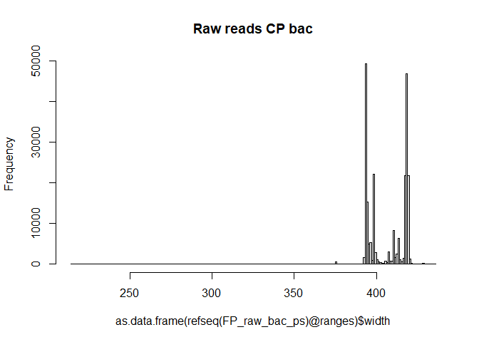
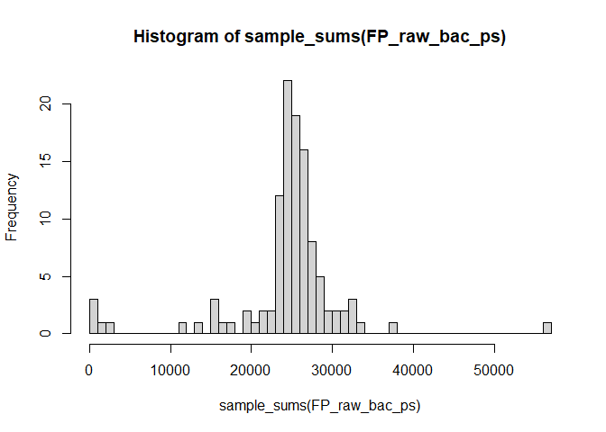
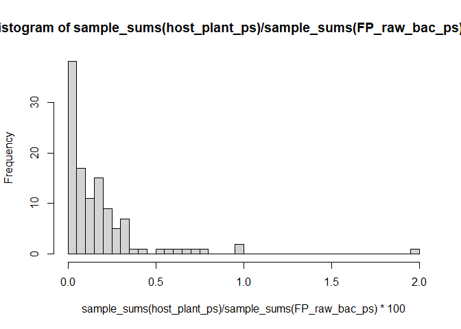
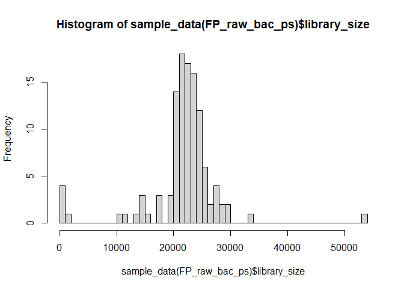
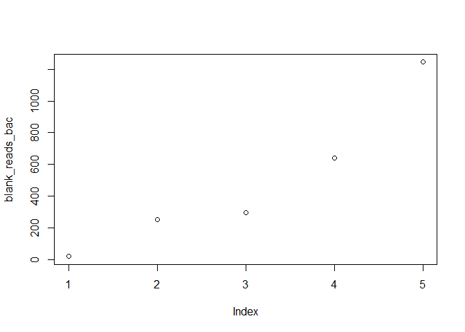
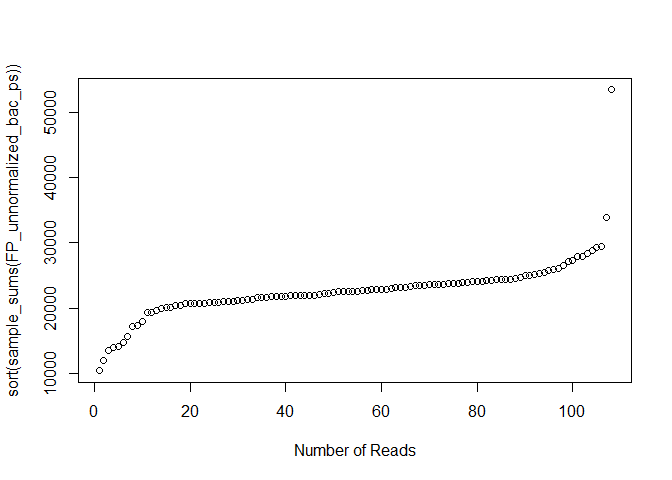
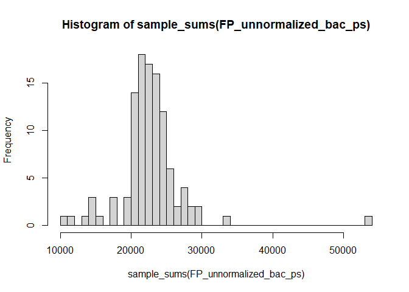
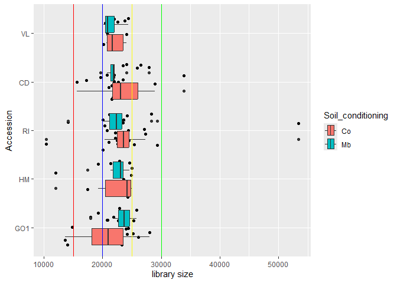
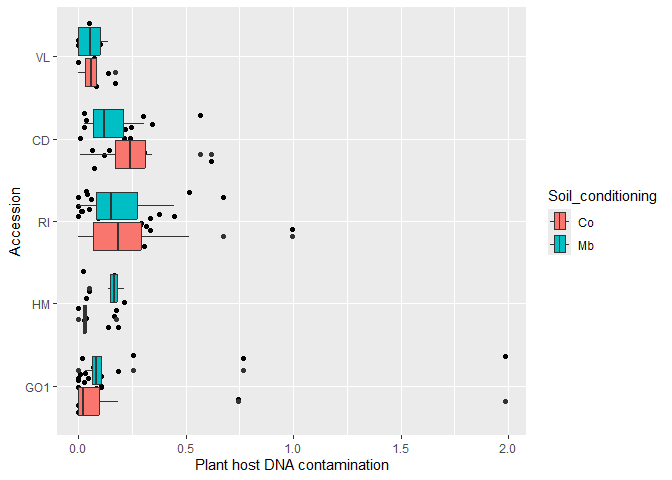
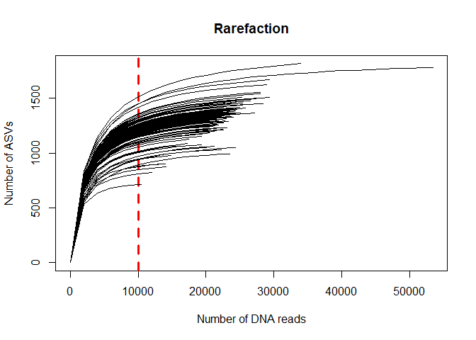

# 0.0 Introduction
This script is for loading and pre-processing microbiome data that is output form the DADA2 [Ernakovich pipeline](https://github.com/ErnakovichLab/dada2_ernakovichlab) as describes in our own [GitHub page](https://github.com/Marcelara/PSF_Anunna). In addition, the ASVs ware assigned to taxonomies with Qiime2 as this results in a higher resolution. Here, the data will be further processed to be able to analyse the data.  

A nice [tutorial](https://www.nicholas-ollberding.com/post/introduction-to-phyloseq/) to learn how to investigate data in a phyloseq object.

This and the next script are originally made by Pedro Beschoren da Costa for the [MeJA_Pilot](https://github.com/PedroBeschoren/MeJA_Pilot) and modified to fit my data.

# 1.0 load all libraries, custom functions, setup environemnt

``` r
R.version$version.string # prints R version
```

```
## [1] "R version 4.5.1 (2025-06-13 ucrt)"
```

``` r
# load libraries 
library(tidyr)
packageVersion("tidyr")
```

```
## [1] '1.3.1'
```

``` r
library(ggplot2)
packageVersion("ggplot2")
```

```
## [1] '4.0.0'
```

``` r
library(phyloseq)
packageVersion("phyloseq")
```

```
## [1] '1.52.0'
```

``` r
library(vegan)
packageVersion("vegan")
```

```
## [1] '2.7.2'
```

``` r
library(metagenomeSeq)
packageVersion("metagenomeSeq")
```

```
## [1] '1.50.0'
```

``` r
packageVersion("metagMisc")
```

```
## [1] '0.6.0.9000'
```

``` r
# custom functions related to data loading and decontamination
source("C:/Users/kreek001/OneDrive - Wageningen University & Research/Chapters/Experimental Chapter 3/RScripts/GitHub/TwelveAccessionExperiment/MicrobiomeAnalysis/RScripts/Functions/functions_loading_and_decontamination.R")

# increases memory limit used by R
# memory.limit(size = 350000) #This function is no longer supported by Windows
```


# 1.1 load microbiome data
See script of CP. Here we load the phyloseq object of the FP that is created in that script.


``` r
load(file = "C:/Users/kreek001/OneDrive - Wageningen University & Research/Chapters/Experimental Chapter 3/RScripts/GitHub/TwelveAccessionExperiment/MicrobiomeAnalysis/Data/Phyloseq_objects/FP_raw_bac_ps.RData")
```


# 1.2 - Remove bad ASVs
Here we will remove sequences associated with the host, background prokatyotes, low abundance ASVs, poorly identified sequences, and other bad ASVs.

## 1.2.1 - Remove non-bacterial sequences & filter ASVs
Note that the input data has been pre-filtered in the DADA2 pipeline to remove any ASVs that occur less than 3 times in the data set. This was necessary because the dada2-associated taxonomy assignment tools could not assign taxonomies to the full data set with 1 GB ram on the HPC.

### Here we investigate the length of the sequences

``` r
hist(as.data.frame(refseq(FP_raw_bac_ps)@ranges)$width, breaks = 300, main = "Raw reads CP bac")
```

<!-- -->

``` r
summary(as.data.frame(refseq(FP_raw_bac_ps)@ranges)$width) #summary on length of the reeds
```

```
##    Min. 1st Qu.  Median    Mean 3rd Qu.    Max. 
##   214.0   395.0   411.0   407.1   419.0   436.0
```

``` r
ntaxa(FP_raw_bac_ps) #shows total number of ASVs
```

```
## [1] 226072
```

``` r
summary(sample_sums(FP_raw_bac_ps)) #shows number of reeds
```

```
##    Min. 1st Qu.  Median    Mean 3rd Qu.    Max. 
##     189   24178   25296   24729   27037   56687
```

### Here we get rid of sequences shorter than 380bp

``` r
sum(as.data.frame(refseq(FP_raw_bac_ps)@ranges)$width < 380) # count number of reads smaller than 380bp
```

```
## [1] 1139
```

``` r
sum(as.data.frame(refseq(FP_raw_bac_ps)@ranges)$width > 380)
```

```
## [1] 224925
```

``` r
FP_raw_bac_ps <- prune_taxa(taxa = as.data.frame(refseq(FP_raw_bac_ps)@ranges)$width > 380,
                       x = FP_raw_bac_ps)
ntaxa(FP_raw_bac_ps) #shows total number of ASVs
```

```
## [1] 224925
```

``` r
summary(sample_sums(FP_raw_bac_ps)) #shows number of reeds
```

```
##    Min. 1st Qu.  Median    Mean 3rd Qu.    Max. 
##     189   24123   25254   24638   26906   56495
```

### Keeps only ASVs identified as bacterial

``` r
FP_raw_bac_ps <- subset_taxa(FP_raw_bac_ps, Kingdom == "k__Bacteria")
ntaxa(FP_raw_bac_ps) #shows total number of ASVs
```

```
## [1] 224911
```

``` r
summary(sample_sums(FP_raw_bac_ps)) #shows number of reeds
```

```
##    Min. 1st Qu.  Median    Mean 3rd Qu.    Max. 
##     189   24123   25254   24638   26906   56495
```

### Remove Salinibacter ASV(s)

``` r
FP_raw_bac_ps #original data set
```

```
## phyloseq-class experiment-level object
## otu_table()   OTU Table:         [ 224911 taxa and 113 samples ]
## sample_data() Sample Data:       [ 113 samples by 84 sample variables ]
## tax_table()   Taxonomy Table:    [ 224911 taxa by 8 taxonomic ranks ]
## refseq()      DNAStringSet:      [ 224911 reference sequences ]
```

``` r
physeq_OnlySal <- subset_taxa(FP_raw_bac_ps, Genus == "g__Salinibacter")
physeq_OnlySal
```

```
## phyloseq-class experiment-level object
## otu_table()   OTU Table:         [ 444 taxa and 113 samples ]
## sample_data() Sample Data:       [ 113 samples by 84 sample variables ]
## tax_table()   Taxonomy Table:    [ 444 taxa by 8 taxonomic ranks ]
## refseq()      DNAStringSet:      [ 444 reference sequences ]
```

``` r
FP_raw_bac_ps <- subset_taxa(FP_raw_bac_ps, Genus != "g__Salinibacter" | is.na(Genus)) # remove Salinibacter genus but keep undefined genesis (NAs)
FP_raw_bac_ps #data set without salinibacter
```

```
## phyloseq-class experiment-level object
## otu_table()   OTU Table:         [ 224467 taxa and 113 samples ]
## sample_data() Sample Data:       [ 113 samples by 84 sample variables ]
## tax_table()   Taxonomy Table:    [ 224467 taxa by 8 taxonomic ranks ]
## refseq()      DNAStringSet:      [ 224467 reference sequences ]
```

``` r
rm(physeq_OnlySal)
```

### Define library sizes as metadata before filtering

``` r
FP_raw_bac_ps@sam_data$library_sizes_prefiltering <- sample_sums(FP_raw_bac_ps)
hist(sample_sums(FP_raw_bac_ps), breaks = 50)
```

<!-- -->

### Removes taxa having less than 8 reads across all samples, as VSEARCH standard
<!-- ```{r} -->
<!-- otu_table(FP_raw_bac_ps) <- otu_table(FP_raw_bac_ps)[which (rowSums(otu_table(FP_raw_bac_ps)) > 7),] -->
<!-- ntaxa(FP_raw_bac_ps) #shows total number of ASVs -->
<!-- summary(sample_sums(FP_raw_bac_ps)) #shows number of reeds -->
<!-- ``` -->

### Remove ASV occurring in less than three samples
We remove ASVs that occur in less than 3 samples.

``` r
filter <- phyloseq::genefilter_sample(FP_raw_bac_ps, filterfun_sample(function(x) x > 0), A = 3)
FP_raw_bac_ps <- prune_taxa(filter, FP_raw_bac_ps)
ntaxa(FP_raw_bac_ps) #shows total number of ASVs
```

```
## [1] 8365
```

``` r
summary(sample_sums(FP_raw_bac_ps)) #shows number of reeds
```

```
##    Min. 1st Qu.  Median    Mean 3rd Qu.    Max. 
##      19   20889   22581   21789   24089   53503
```

### Check and remove plant-host contamination

``` r
### define plastid, mitochondria and host plant contamination ps objects
Mitochondria_ps <- subset_taxa(FP_raw_bac_ps, Family == "f__Mitochondria" | Family == "Mitochondria")
Plastid_ps <- subset_taxa(FP_raw_bac_ps, Order == "o__Chloroplast" | Order == "Chloroplast") 
host_plant_ps <- merge_phyloseq(Mitochondria_ps, Plastid_ps)

### quick histogram showing plant DNA contamination
hist(sample_sums(host_plant_ps)/sample_sums(FP_raw_bac_ps)*100, breaks = 50)
```

<!-- -->

``` r
summary(sample_sums(host_plant_ps)/sample_sums(FP_raw_bac_ps)*100)
```

```
##    Min. 1st Qu.  Median    Mean 3rd Qu.    Max. 
##  0.0000  0.0310  0.1059  0.1786  0.2177  1.9848
```

``` r
summary(sample_sums(Mitochondria_ps)/sample_sums(FP_raw_bac_ps)*100)
```

```
##     Min.  1st Qu.   Median     Mean  3rd Qu.     Max. 
## 0.000000 0.000000 0.008435 0.020189 0.025218 0.284874
```

``` r
summary(sample_sums(Plastid_ps)/sample_sums(FP_raw_bac_ps)*100)
```

```
##    Min. 1st Qu.  Median    Mean 3rd Qu.    Max. 
## 0.00000 0.02500 0.09335 0.15836 0.18004 1.69990
```

Between 0 and 2% of the ASVs per sample is contaminated with mitochondrial or chloroplast DNA.


``` r
### define host plant 16S contamination as metadata (add the info the the metadata sheet)
FP_raw_bac_ps@sam_data$Mitochondria_reads <- sample_sums(Mitochondria_ps)
FP_raw_bac_ps@sam_data$Plastid_reads <- sample_sums(Plastid_ps)
FP_raw_bac_ps@sam_data$Host_DNA_n_reads <- sample_sums(host_plant_ps)
FP_raw_bac_ps@sam_data$Host_DNA_contamination_pct <- sample_sums(host_plant_ps)/sample_sums(FP_raw_bac_ps)*100

### remove plant host sequences (plastid and mitochondrial DNA) 
FP_raw_bac_ps <- remove_Chloroplast_Mitochondria(FP_raw_bac_ps)
```

### Check library size

``` r
# add library sizes as part of metadata
sample_data(FP_raw_bac_ps)$library_size <- sample_sums(FP_raw_bac_ps)

#check library size distribution
hist(sample_data(FP_raw_bac_ps)$library_size, breaks = 50)
```

<!-- -->

``` r
summary(sample_data(FP_raw_bac_ps)$library_size) #shows the number of reeds
```

```
##    Min. 1st Qu.  Median    Mean 3rd Qu.    Max. 
##      19   20874   22540   21750   24071   53402
```

``` r
# remove samples with library size = 0  (non-informative; failed PCR/sequencing)
#FP_raw_bac_ps<-subset_samples(FP_raw_bac_ps, library_size >0) #not applicable

# remove ps objects
rm(Mitochondria_ps, Plastid_ps, host_plant_ps)

# run garbage collection after creating large objects
gc()
```

```
##            used  (Mb) gc trigger   (Mb)  max used   (Mb)
## Ncells  5352799 285.9    8482174  453.0   8482174  453.0
## Vcells 21895012 167.1  134282388 1024.5 167852985 1280.7
```


# 1.3 - Decontaminate phyloseq objects
The decontam package will use blank DNA samples to remove possible contaminants. Here we use a single custom function to run decontamination, generate plots, and return a clean phyloseq object

We will also check the number of reads in a blank sample (average +SD) so we can compare those blank samples with libraries with low number of reads. samples that cannot be distinguished from a blank (in terms of library size) 

### Decontaminate

``` r
FP_unnormalized_bac_ps <- decontaminate_and_plot(FP_raw_bac_ps)
```

```
## Loading required package: decontam
```

``` r
# phyloseq object without contamination
FP_unnormalized_bac_ps[1]
```

```
## [[1]]
## phyloseq-class experiment-level object
## otu_table()   OTU Table:         [ 8329 taxa and 108 samples ]
## sample_data() Sample Data:       [ 108 samples by 91 sample variables ]
## tax_table()   Taxonomy Table:    [ 8329 taxa by 8 taxonomic ranks ]
## refseq()      DNAStringSet:      [ 8329 reference sequences ]
```

``` r
# Number of ASVs assigned as contamination
FP_unnormalized_bac_ps[5]
```

```
## [[1]]
## 
## FALSE  TRUE 
##  8329    29
```

``` r
# ASVs assigned as contamination
FP_unnormalized_bac_ps[4]
```

```
## [[1]]
##  [1] "bASV_1635"  "bASV_2192"  "bASV_2311"  "bASV_2369"  "bASV_2745" 
##  [6] "bASV_3462"  "bASV_4179"  "bASV_4203"  "bASV_4262"  "bASV_4342" 
## [11] "bASV_4728"  "bASV_5018"  "bASV_5342"  "bASV_5741"  "bASV_6206" 
## [16] "bASV_6254"  "bASV_6298"  "bASV_6342"  "bASV_7667"  "bASV_8229" 
## [21] "bASV_8708"  "bASV_9730"  "bASV_10013" "bASV_10824" "bASV_11035"
## [26] "bASV_12184" "bASV_13356" "bASV_14018" "bASV_14440"
```

### Check blanks
Let's look into how many reads our blank had (average + sd) so we can compare those to libraries with very low number of reads.

``` r
blank_reads_bac <- sort(sample_sums(subset_samples(FP_raw_bac_ps, Soil_conditioning == "B")))
plot(blank_reads_bac)
```

<!-- -->

``` r
#clean up environment to free memory
rm(FP_raw_bac_ps)
```

### Check phyloseq object
After checking the decontamination plots and reports, we can remove them and focus on the phyloseq object.

``` r
FP_unnormalized_bac_ps <- unlist(FP_unnormalized_bac_ps[[1]])
```

#### Check library size Bacteria
Now let's check the lower end of our library sizes.

``` r
sort(sample_sums(FP_unnormalized_bac_ps))
```

```
##  F371  F178  F090  F088  F392  F086  F008  F019  F200  F108  F098  F175  F037 
## 10420 11973 13596 14009 14106 14826 15606 17195 17426 17910 19288 19301 19659 
##  F522  F527  F478  F376  F479  F460  F025  F534  F096  F456  F457  F089  F477 
## 20023 20085 20159 20342 20422 20668 20747 20784 20794 20795 20866 20897 20904 
##  F099  F523  F027  F529  F530  F199  F397  F018  F030  F015  F110  F026  F035 
## 20988 21032 21088 21159 21215 21398 21404 21619 21623 21658 21749 21824 21846 
##  F109  F017  F393  F039  F029  F036  F475  F528  F380  F524  F533  F458  F374 
## 21848 21879 21954 21964 21993 21994 22014 22172 22186 22219 22461 22535 22540 
##  F400  F532 FE104  F097  F016  F399  F195  F116  F391  F377  F525  F193  F095 
## 22561 22579 22587 22697 22719 22789 22891 22899 22940 22948 23120 23224 23234 
##  F120  F006  F007  FE98  F194  F536  F395  F119  F378  F459  F107  F396  F179 
## 23273 23481 23501 23508 23607 23637 23674 23687 23771 23771 23776 23899 23985 
##  F118  F038  F455  F373  F100  F176  F540  F476  F106  F372  F197  F177  F180 
## 24027 24065 24132 24216 24218 24342 24368 24380 24400 24517 24630 24950 25027 
##  F117  F115  F379  F105  F010  F087  F009  F375  F539  F040  F085  F526  F005 
## 25192 25286 25419 25797 25907 26083 26512 27122 27353 27970 27986 28368 28899 
##  F398  F394  F020  F538 
## 29323 29379 33882 53389
```

``` r
plot(sort(sample_sums(FP_unnormalized_bac_ps)), xlab = "Number of Reads")
```

<!-- -->

<!-- #### Remove samples with a number of reads similar to blanks -->
<!-- ```{r} -->
<!-- FP_unnormalized_bac_ps <- subset_samples(FP_unnormalized_bac_ps, library_size > 6000) -->
<!-- ``` -->

### Set factors

``` r
# set Soil_conditioning as factor, and then order it properly
FP_unnormalized_bac_ps@sam_data$Soil_conditioning <- factor(FP_unnormalized_bac_ps@sam_data$Soil_conditioning, levels = c("Co", "Mb", "S"))

# set Cat_treatment as factor, and then order it properly
FP_unnormalized_bac_ps@sam_data$Cat_treatment <- factor(FP_unnormalized_bac_ps@sam_data$Cat_treatment, levels = c("Co", "Mb"))

# set Accession as factor, and then order it properly
FP_unnormalized_bac_ps@sam_data$Accession <- factor(FP_unnormalized_bac_ps@sam_data$Accession, levels = c("VL", "CD", "RI", "HM", "GO1", "Un"))

# set Batch as factor
FP_unnormalized_bac_ps@sam_data$Batch <- factor(FP_unnormalized_bac_ps@sam_data$Batch)
```


# 1.4 - Plot library sizes per treatment and check NAs and uncultured ASVs
### Check number of reeds

``` r
# let's check the number of reads in a couple histograms
hist(sample_sums(FP_unnormalized_bac_ps), breaks = 50)
```

<!-- -->

``` r
summary(sample_sums(FP_unnormalized_bac_ps))
```

```
##    Min. 1st Qu.  Median    Mean 3rd Qu.    Max. 
##   10420   21021   22583   22732   24153   53389
```

### Check library size

``` r
# check plot for some minimum library sizes on all samples

ggplot(data = sample_data(FP_unnormalized_bac_ps), 
           mapping = aes(x = library_size, y = Accession, fill = Soil_conditioning)) +
      geom_jitter() +
      geom_boxplot() +
      scale_y_discrete(limits = rev) +
      geom_vline(xintercept = 30000, color="green") +
      geom_vline(xintercept = 25000, color="yellow") +
      geom_vline(xintercept = 20000, color="blue") +
      geom_vline(xintercept = 15000, color="red") +
      labs(x = "library size",
           y = "Accession") #+
```

<!-- -->

``` r
      #theme(axis.text.x = element_text(angle = 20, vjust = 0.5, hjust=1))

# # In case I want to do a subset of the data
# lapply(FP_unnormalized_bac_ps, function(x)
#     ggplot(data = sample_data(subset_samples(x, Compartment == "Rhizosphere")), 
#            mapping = aes(x = library_size, y = Soil_Slurry_Treatment, color = Soil_Slurry_Treatment, fill = Phase)) +
#     geom_jitter() +
#     geom_boxplot() +
#     scale_y_discrete(limits = rev) +
#     geom_vline(xintercept = 30000, color="green") +
#     geom_vline(xintercept = 25000, color="yellow") +
#     geom_vline(xintercept = 20000, color="blue") +
#     geom_vline(xintercept = 15000, color="red") +
#     labs(x = "library size",
#          y = "Soil slurry treatment and phase") +
#     theme(axis.text.x = element_text(angle = 45, vjust = 0.5, hjust=1)))
```

### Check plant-host contamination

``` r
# check bacterial 16S plant host contamination
ggplot(data = sample_data(FP_unnormalized_bac_ps), 
           mapping = aes(x = Host_DNA_contamination_pct, y = Accession, fill = Soil_conditioning)) +
      geom_jitter() +
      geom_boxplot() +
      scale_y_discrete(limits = rev) +
      # geom_vline(xintercept = 30000, color="green") +
      # geom_vline(xintercept = 25000, color="yellow") +
      # geom_vline(xintercept = 20000, color="blue") +
      #geom_vline(xintercept = 15000, color="red") +
      labs(x = "Plant host DNA contamination",
           y = "Accession") #+
```

<!-- -->

``` r
      #theme(axis.text.x = element_text(angle = 45, vjust = 0.5, hjust=1))
```

### check percentage of NA in taxonomy

``` r
### check_n_taxa_NA_percentage(ps_object, ntaxa))
check_n_taxa_NA_percentage(FP_unnormalized_bac_ps, 100) # top 100 taxa
```

```
##    Kingdom     Phylum      Class      Order     Family      Genus    Species 
##          0          0          0          0          1         12         12 
## Confidence 
##          0
```

``` r
check_n_taxa_NA_percentage(FP_unnormalized_bac_ps, 1000)
```

```
##    Kingdom     Phylum      Class      Order     Family      Genus    Species 
##        0.0        0.1        0.1        0.2        1.1       11.0       11.0 
## Confidence 
##        0.0
```

``` r
check_n_taxa_NA_percentage(FP_unnormalized_bac_ps, 10000) # top 10,000 taxa
```

```
##    Kingdom     Phylum      Class      Order     Family      Genus    Species 
##  0.0000000  0.1680874  0.2161124  0.5042622  1.7288990 12.6545804 12.6545804 
## Confidence 
##  0.0000000
```

``` r
#A higher the number of taxa does not make a difference
```

### Check uncultured and unassigned taxa
Out commanded lines mean that type is not present in the data set.

``` r
#subset_taxa(FP_unnormalized_bac_ps, Kingdom == "Unassigned") #No hits as I sub-setted the data with only k__Bacteria before

# subset_taxa(FP_unnormalized_bac_ps, Class == "c__uncultured" | Class == "c__unidentified")
# subset_taxa(FP_unnormalized_bac_ps, Class == "c__uncultured")
# subset_taxa(FP_unnormalized_bac_ps, Class == "c__unidentified") #not in data set

# subset_taxa(c__unidentified, Family == "f__uncultured" | Family == "f__unidentified")
# subset_taxa(FP_unnormalized_bac_ps, Family == "f__uncultured")
# subset_taxa(FP_unnormalized_bac_ps, Family == "f__unidentified") #not in data set

# subset_taxa(c__unidentified, Genus == "g__uncultured" | Genus == "g__unidentified")
# subset_taxa(FP_unnormalized_bac_ps, Genus == "g__uncultured")
# subset_taxa(FP_unnormalized_bac_ps, Genus == "g__unidentified") #not in data set
```

There are no uncultured or unidentified samples.

# 1.5 Remove samples?
## Rarefraction curve

``` r
# finally, a rarefaction curve
a <- rarecurve(t(as.data.frame(otu_table(FP_unnormalized_bac_ps))), 
          label = FALSE, 
          step = 2000,
          main="Rarefaction", ylab = "Number of ASVs", xlab = "Number of DNA reads",
          abline(v = 10000, col="red", lwd=3, lty=2))
```

<!-- -->

``` r
rm(a)

table(sample_data(FP_unnormalized_bac_ps)$Accession,
      sample_data(FP_unnormalized_bac_ps)$Soil_conditioning,
      sample_data(FP_unnormalized_bac_ps)$Cat_treatment)
```

```
## , ,  = Co
## 
##      
##       Co Mb  S
##   VL   0  0  0
##   CD   0  0  0
##   RI   4  7  0
##   HM   0  0  0
##   GO1  0  0  0
##   Un   0  0  0
## 
## , ,  = Mb
## 
##      
##       Co Mb  S
##   VL   6  5  0
##   CD  12 11  0
##   RI  14 13  0
##   HM   6  6  0
##   GO1 12 12  0
##   Un   0  0  0
```

``` r
sort(sample_sums(FP_unnormalized_bac_ps))[1:6]
```

```
##  F371  F178  F090  F088  F392  F086 
## 10420 11973 13596 14009 14106 14826
```

``` r
sort(sample_sums(FP_unnormalized_bac_ps))[112:118]
```

```
## <NA> <NA> <NA> <NA> <NA> <NA> <NA> 
##   NA   NA   NA   NA   NA   NA   NA
```

#### Remove sample

``` r
FP_unnormalized_bac_ps_cut <- subset_samples(FP_unnormalized_bac_ps, sample_names(FP_unnormalized_bac_ps) != "F371")
FP_unnormalized_bac_ps_ForDA <- subset_samples(FP_unnormalized_bac_ps, sample_names(FP_unnormalized_bac_ps) != "F178")
```

#### Remove Unplanted CTRL and Co caterpillar treatment

``` r
FP_unnormalized_bac_ps_ForDA_clean <- subset_samples(FP_unnormalized_bac_ps_ForDA, Accession != "Un")
FP_unnormalized_bac_ps_ForDA_clean <- subset_samples(FP_unnormalized_bac_ps_ForDA_clean, Cat_treatment != "Co")
```

#### Rename NAs tax table to Unclassfied

``` r
tax <- tax_table(FP_unnormalized_bac_ps_ForDA_clean)
tax[is.na(tax[, "Genus"]), "Genus"] <- "g__Unclassified"
tax[is.na(tax[, "Family"]), "Family"] <- "f__Unclassified"
tax[is.na(tax[, "Order"]), "Order"] <- "o__Unclassified"
tax[is.na(tax[, "Class"]), "Class"] <- "c__Unclassified"
tax[is.na(tax[, "Phylum"]), "Phylum"] <- "p__Unclassified"
tax_table(FP_unnormalized_bac_ps_ForDA_clean) <- tax
```

#### Split data on accessions

``` r
FP_unnormalized_bac_ps_ForDA_clean_Acc <- metagMisc::phyloseq_sep_variable(FP_unnormalized_bac_ps_ForDA_clean, variable = "Accession")
```

#### Remove Batch 1

``` r
FP_unnormalized_bac_ps_ForDA_clean_Acc_b2 <- lapply(FP_unnormalized_bac_ps_ForDA_clean_Acc, function(x) subset_samples(x, Batch != 1))
FP_unnormalized_bac_ps_ForDA_clean_b2 <- subset_samples(FP_unnormalized_bac_ps_ForDA_clean, Batch != 1)
```

# 1.6 export filtered unnormalized ps object
### Save RData
let's save these normalized objects as RData so they can be loaded in other scripts.

``` r
save(FP_unnormalized_bac_ps_ForDA, file = "C:/Users/kreek001/OneDrive - Wageningen University & Research/Chapters/Experimental Chapter 3/RScripts/GitHub/TwelveAccessionExperiment/MicrobiomeAnalysis/Data/Phyloseq_objects/FP_unnormalized_bac_ps_ForDA.RData")
save(FP_unnormalized_bac_ps_ForDA_clean, file = "C:/Users/kreek001/OneDrive - Wageningen University & Research/Chapters/Experimental Chapter 3/RScripts/GitHub/TwelveAccessionExperiment/MicrobiomeAnalysis/Data/Phyloseq_objects/FP_unnormalized_bac_ps_ForDA_clean.RData")
save(FP_unnormalized_bac_ps_ForDA_clean_Acc, file = "C:/Users/kreek001/OneDrive - Wageningen University & Research/Chapters/Experimental Chapter 3/RScripts/GitHub/TwelveAccessionExperiment/MicrobiomeAnalysis/Data/Phyloseq_objects/FP_unnormalized_bac_ps_ForDA_clean_Acc.RData")
save(FP_unnormalized_bac_ps_ForDA_clean_b2, file = "C:/Users/kreek001/OneDrive - Wageningen University & Research/Chapters/Experimental Chapter 3/RScripts/GitHub/TwelveAccessionExperiment/MicrobiomeAnalysis/Data/Phyloseq_objects/FP_unnormalized_bac_ps_ForDA_clean_b2.RData")
save(FP_unnormalized_bac_ps_ForDA_clean_Acc_b2, file = "C:/Users/kreek001/OneDrive - Wageningen University & Research/Chapters/Experimental Chapter 3/RScripts/GitHub/TwelveAccessionExperiment/MicrobiomeAnalysis/Data/Phyloseq_objects/FP_unnormalized_bac_ps_ForDA_clean_Acc_b2.RData")
```

# Data ready for analysis!
