# 3.0 Basic alpha diversity analysis for pilot data
Alpha diversity will show you the quantifiable diversity within a sample - this way you compare which treatment is more or less diverse or species-rich than the other. Like in all the other steps we are evaluating here, there are countless variations and methods you could use. This is just a convenient template for you to get started.

Alpha diversity requires counts from samples with equal samples sizes. This means we cannot use the CSS transformation from the metagenomeseq package. Also, heavy filtering of your data may skew some of the diversity metrics (due to the lack of rare species), so we should not over-filter the data before calculating alpha diversity.

As my data is not too diverse in reed size, I use CSS transformed data.


### Packages

``` r
R.version$version.string # prints R version
```

```
## [1] "R version 4.5.1 (2025-06-13 ucrt)"
```

``` r
library(tibble) #needed for function rownames_to_columns
packageVersion("tibble")
```

```
## [1] '3.3.0'
```

``` r
library(car)
packageVersion("car")
```

```
## [1] '3.1.3'
```

``` r
library(phyloseq)
packageVersion("phyloseq")
```

```
## [1] '1.52.0'
```

``` r
library(ggplot2)
packageVersion("ggplot2")
```

```
## [1] '4.0.0'
```

``` r
library(ggh4x) #for coloring strip facet wrap
packageVersion("ggh4x")
```

```
## [1] '0.3.1'
```

``` r
library(plyr) #for summary table
packageVersion("plyr")
```

```
## [1] '1.8.9'
```

``` r
library(emmeans) #for post hoc emmeans
packageVersion("emmeans")
```

```
## [1] '1.11.2.8'
```

``` r
library(multcomp) #for cld function at post hoc analysis
packageVersion("multcomp")
```

```
## [1] '1.4.29'
```

``` r
library(multcompView) #for cld function at post hoc analysis
packageVersion("multcompView")
```

```
## [1] '0.1.10'
```

``` r
library(glmmTMB) #for doing glm with many different options
packageVersion("glmmTMB")
```

```
## [1] '1.1.13'
```

``` r
library(DHARMa) #for model assumptions
packageVersion("DHARMa")
```

```
## [1] '0.4.7'
```


# 3.1 Only batch 2
### Import pre-made functions

``` r
source("C:/Users/kreek001/OneDrive - Wageningen University & Research/Chapters/Experimental Chapter 3/RScripts/GitHub/TwelveAccessionExperiment/MicrobiomeAnalysis/RScripts/Functions/Testing_model_assumptions.R") #Functions for model assumptions
```

### Import data

``` r
load("C:/Users/kreek001/OneDrive - Wageningen University & Research/Chapters/Experimental Chapter 3/RScripts/GitHub/TwelveAccessionExperiment/MicrobiomeAnalysis/Data/Phyloseq_objects/FP_median_bac_ps.RData")
```


# 3.1.1 Alpha diversity testing Accessions
Here we check both observed diversity and Shannon diversity indexes.

## Remove unplanted CTRL

``` r
FP_median_bac_ps <- subset_samples(FP_median_bac_ps, Accession != "Un")
```

## Remove Cat treatment Co

``` r
FP_median_bac_ps <- subset_samples(FP_median_bac_ps, Cat_treatment != "Co")
```

## Remove RI

``` r
FP_median_bac_ps <- subset_samples(FP_median_bac_ps, Accession != "RI")
```

## Remove Batch 1

``` r
FP_median_bac_ps <- subset_samples(FP_median_bac_ps, Batch != 1)
table(FP_median_bac_ps@sam_data$Batch, FP_median_bac_ps@sam_data$Accession)
```

```
##    
##     VL CD HM GO1
##   2 11 12 12  12
```

## Calculate richness
[Different types of alpha diversity](https://www.cd-genomics.com/microbioseq/the-use-and-types-of-alpha-diversity-metrics-in-microbial-ngs.html). 
[Nice explanation of alpha diversity](https://docs.onecodex.com/en/articles/4136553-alpha-diversity). 
[Concider looking at phylogenitic diversity](https://danielpfaith.wordpress.com/phylogenetic-diversity/) with this [R package](https://search.r-project.org/CRAN/refmans/abdiv/html/faith_pd.html).  


``` r
# extract row names to remove x in row name
total_diversity <- estimate_richness(FP_median_bac_ps) %>%
  rownames_to_column(var = "Sample")

# remove x
total_diversity$Sample <- sub("X", "", total_diversity$Sample) 

# For some reason, the "-" are replaced by ".", here we replace "." by "-" to get the original name.
total_diversity$Sample <- gsub("\\.", "-", total_diversity$Sample) 

# put new names back as row name
total_diversity <- column_to_rownames(total_diversity, var = "Sample") 
```

## Add diversity metrics to mapping file of phyloseq objects
We do this so we can perform Anovas, access meta data, make nicer plots, etc.

``` r
# makes the diversity calculations sample_data for phyloseq object
merg_to_ps <- sample_data(total_diversity)

# merge the new phyloseq object with the old phyloseq object
sample_data(FP_median_bac_ps) <- merge_phyloseq(FP_median_bac_ps, merg_to_ps) 

# forces sample data of updated phyloseq object into a data frame
total_diversity <- as(sample_data(FP_median_bac_ps),"data.frame")
```

## define factors

``` r
total_diversity$Accession <- factor(total_diversity$Accession, levels = c("VL", "CD", "HM", "GO1"))
total_diversity$Soil_conditioning <- factor(total_diversity$Soil_conditioning, levels = c("Mb", "Co"))
total_diversity$Domestication <- factor(total_diversity$Domestication, levels = c("Wild", "Cultivated"))
#total_diversity$Block_g <- as.factor(total_diversity$Block_g)
```

## Sumamry tables
### Observed

``` r
ddply(total_diversity, c("Accession", "Soil_conditioning"), summarise,
      N = sum(!is.na(Observed)), #number of samples
      Mis = sum(is.na(Observed)), #number of missing values
      Mean = round(mean(Observed, na.rm=T),3), #mean
      Median = round(median(Observed, na.rm=T),3), #median
      SD = round(sd(Observed, na.rm=T),3), #standard deviation
      SE = round(sd(Observed, na.rm=T) / sqrt(N),5), #standard error
      LCI = round(Mean - (2*SE),3), #lower confidence interval
      HCI = round(Mean + (2*SE),3)) # upper confidence interval
```

```
##   Accession Soil_conditioning N Mis     Mean Median      SD       SE      LCI
## 1        VL                Mb 5   0 1227.600 1203.0  75.735 33.86975 1159.860
## 2        VL                Co 6   0 1267.833 1255.5  58.697 23.96305 1219.907
## 3        CD                Mb 6   0 1338.833 1299.5 105.821 43.20140 1252.430
## 4        CD                Co 6   0 1316.000 1266.5 240.215 98.06732 1119.865
## 5        HM                Mb 6   0 1337.000 1348.5 129.038 52.67953 1231.641
## 6        HM                Co 6   0 1209.000 1319.0 227.321 92.80338 1023.393
## 7       GO1                Mb 6   0 1368.833 1360.5  61.291 25.02188 1318.789
## 8       GO1                Co 6   0 1257.667 1253.5  79.230 32.34570 1192.976
##        HCI
## 1 1295.339
## 2 1315.759
## 3 1425.236
## 4 1512.135
## 5 1442.359
## 6 1394.607
## 7 1418.877
## 8 1322.358
```

``` r
ddply(total_diversity, c("Accession"), summarise,
      N = sum(!is.na(Observed)), #number of samples
      Mis = sum(is.na(Observed)), #number of missing values
      Mean = round(mean(Observed, na.rm=T),3), #mean
      Median = round(median(Observed, na.rm=T),3), #median
      SD = round(sd(Observed, na.rm=T),3), #standard deviation
      SE = round(sd(Observed, na.rm=T) / sqrt(N),5), #standard error
      LCI = round(Mean - (2*SE),3), #lower confidence interval
      HCI = round(Mean + (2*SE),3)) # upper confidence interval
```

```
##   Accession  N Mis     Mean Median      SD       SE      LCI      HCI
## 1        VL 11   0 1249.545   1227  66.772 20.13245 1209.280 1289.810
## 2        CD 12   0 1327.417   1286 177.372 51.20302 1225.011 1429.823
## 3        HM 12   0 1273.000   1330 188.482 54.41006 1164.180 1381.820
## 4       GO1 12   0 1313.250   1322  89.058 25.70878 1261.832 1364.668
```

``` r
ddply(total_diversity, c("Soil_conditioning"), summarise,
      N = sum(!is.na(Observed)), #number of samples
      Mis = sum(is.na(Observed)), #number of missing values
      Mean = round(mean(Observed, na.rm=T),3), #mean
      Median = round(median(Observed, na.rm=T),3), #median
      SD = round(sd(Observed, na.rm=T),3), #standard deviation
      SE = round(sd(Observed, na.rm=T) / sqrt(N),5), #standard error
      LCI = round(Mean - (2*SE),3), #lower confidence interval
      HCI = round(Mean + (2*SE),3)) # upper confidence interval
```

```
##   Soil_conditioning  N Mis     Mean Median      SD       SE      LCI      HCI
## 1                Mb 23   0 1322.000 1323.0 104.824 21.85733 1278.285 1365.715
## 2                Co 24   0 1262.625 1264.5 165.524 33.78753 1195.050 1330.200
```

### Shannon

``` r
ddply(total_diversity, c("Accession", "Soil_conditioning"), summarise,
      N = sum(!is.na(Shannon)), #number of samples
      Mis = sum(is.na(Shannon)), #number of missing values
      Mean = round(mean(Shannon, na.rm=T),3), #mean
      Median = round(median(Shannon, na.rm=T),3), #median
      SD = round(sd(Shannon, na.rm=T),3), #standard deviation
      SE = round(sd(Shannon, na.rm=T) / sqrt(N),5), #standard error
      LCI = round(Mean - (2*SE),3), #lower confidence interval
      HCI = round(Mean + (2*SE),3)) # upper confidence interval
```

```
##   Accession Soil_conditioning N Mis  Mean Median    SD      SE   LCI   HCI
## 1        VL                Mb 5   0 6.177  6.138 0.069 0.03075 6.116 6.238
## 2        VL                Co 6   0 6.360  6.365 0.055 0.02245 6.315 6.405
## 3        CD                Mb 6   0 6.496  6.534 0.081 0.03301 6.430 6.562
## 4        CD                Co 6   0 6.413  6.381 0.148 0.06032 6.292 6.534
## 5        HM                Mb 6   0 6.520  6.516 0.083 0.03383 6.452 6.588
## 6        HM                Co 6   0 6.250  6.316 0.192 0.07856 6.093 6.407
## 7       GO1                Mb 6   0 6.432  6.415 0.052 0.02115 6.390 6.474
## 8       GO1                Co 6   0 6.393  6.392 0.055 0.02231 6.348 6.438
```

``` r
ddply(total_diversity, c("Accession"), summarise,
      N = sum(!is.na(Shannon)), #number of samples
      Mis = sum(is.na(Shannon)), #number of missing values
      Mean = round(mean(Shannon, na.rm=T),3), #mean
      Median = round(median(Shannon, na.rm=T),3), #median
      SD = round(sd(Shannon, na.rm=T),3), #standard deviation
      SE = round(sd(Shannon, na.rm=T) / sqrt(N),5), #standard error
      LCI = round(Mean - (2*SE),3), #lower confidence interval
      HCI = round(Mean + (2*SE),3)) # upper confidence interval
```

```
##   Accession  N Mis  Mean Median    SD      SE   LCI   HCI
## 1        VL 11   0 6.277  6.294 0.112 0.03380 6.209 6.345
## 2        CD 12   0 6.454  6.425 0.121 0.03505 6.384 6.524
## 3        HM 12   0 6.385  6.428 0.200 0.05764 6.270 6.500
## 4       GO1 12   0 6.412  6.396 0.055 0.01582 6.380 6.444
```

``` r
ddply(total_diversity, c("Soil_conditioning"), summarise,
      N = sum(!is.na(Shannon)), #number of samples
      Mis = sum(is.na(Shannon)), #number of missing values
      Mean = round(mean(Shannon, na.rm=T),3), #mean
      Median = round(median(Shannon, na.rm=T),3), #median
      SD = round(sd(Shannon, na.rm=T),3), #standard deviation
      SE = round(sd(Shannon, na.rm=T) / sqrt(N),5), #standard error
      LCI = round(Mean - (2*SE),3), #lower confidence interval
      HCI = round(Mean + (2*SE),3)) # upper confidence interval
```

```
##   Soil_conditioning  N Mis  Mean Median    SD      SE   LCI   HCI
## 1                Mb 23   0 6.416  6.436 0.149 0.03111 6.354 6.478
## 2                Co 24   0 6.354  6.356 0.135 0.02756 6.299 6.409
```


## Statistics Observed index
### Defining model

``` r
lm1 <- glmmTMB(data = total_diversity, formula = Observed ~ Soil_conditioning * Accession + (1 | Block_g), family = gaussian(link = "identity"))
lm2 <- glmmTMB(data = total_diversity, formula = Observed ~ Soil_conditioning * Accession, family = gaussian(link = "identity"))

lm3 <- glmmTMB(data = total_diversity, formula = log(Observed) ~ Soil_conditioning * Accession + (1 | Block_g), family = gaussian(link = "identity"))
lm4 <- glmmTMB(data = total_diversity, formula = log(Observed) ~ Soil_conditioning * Accession, family = gaussian(link = "identity"))

lm5 <- glmmTMB(data = total_diversity, formula = sqrt(Observed) ~ Soil_conditioning * Accession + (1 | Block_g), family = gaussian(link = "identity"))
lm6 <- glmmTMB(data = total_diversity, formula = sqrt(Observed) ~ Soil_conditioning * Accession, family = gaussian(link = "identity"))

glm1 <- glmmTMB(data = total_diversity, formula = Observed ~ Soil_conditioning * Accession + (1 | Block_g), family = Gamma(link = "log"))
glm2 <- glmmTMB(data = total_diversity, formula = Observed ~ Soil_conditioning * Accession, family = Gamma(link = "log"))

glm3 <- glmmTMB(data = total_diversity, formula = log(Observed + 1) ~ Soil_conditioning * Accession + (1 | Block_g), family = Gamma(link = "log"))
glm4 <- glmmTMB(data = total_diversity, formula = log(Observed + 1) ~ Soil_conditioning * Accession, family = Gamma(link = "log"))

glm5 <- glmmTMB(data = total_diversity, formula = sqrt(Observed) ~ Soil_conditioning * Accession + (1 | Block_g), family = Gamma(link = "log"))
glm6 <- glmmTMB(data = total_diversity, formula = sqrt(Observed) ~ Soil_conditioning * Accession, family = Gamma(link = "log"))
```

### Model assumptions

``` r
DHARMa.sum(Model = lm1)
```

```
## 1. Kolmogorov-Smirnov test indicates deviations of the residuals from uniform distribution. H0: The model fits the data well; Ha: The model does not fit the data well
```

```
## 
## 	Exact one-sample Kolmogorov-Smirnov test
## 
## data:  simulationOutput$scaledResiduals
## D = 0.13206, p-value = 0.354
## alternative hypothesis: two-sided
```

```
## 2. Test for over-dispersion. H0: No over-dispersion in the model; Ha: Over-dispersion in the model
```

```
## 
## 	DHARMa nonparametric dispersion test via sd of residuals fitted vs.
## 	simulated
## 
## data:  simulationOutput
## dispersion = 1.0365, p-value = 0.798
## alternative hypothesis: two.sided
## 
## 3. Test for outliers. H0: No ouliers in the model; Ha: Outliers in the model
```

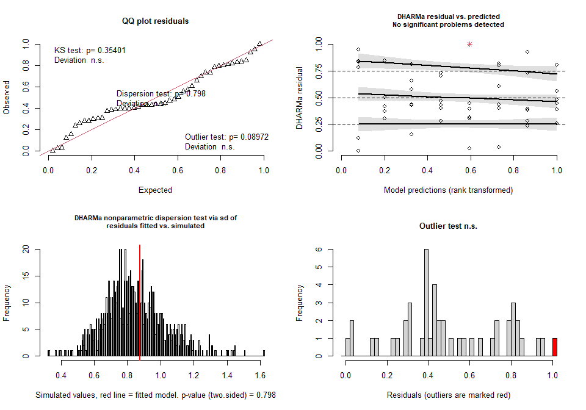<!-- -->

```
## 
## 	DHARMa outlier test based on exact binomial test with approximate
## 	expectations
## 
## data:  simulationOutput
## outliers at both margin(s) = 1, observations = 47, p-value = 0.08972
## alternative hypothesis: true probability of success is not equal to 0.001998002
## 95 percent confidence interval:
##  0.0005385317 0.1129377171
## sample estimates:
## frequency of outliers (expected: 0.001998001998002 ) 
##                                            0.0212766
```

``` r
DHARMa.sum(Model = lm2)
```

```
## 1. Kolmogorov-Smirnov test indicates deviations of the residuals from uniform distribution. H0: The model fits the data well; Ha: The model does not fit the data well
```

```
## 
## 	Asymptotic one-sample Kolmogorov-Smirnov test
## 
## data:  simulationOutput$scaledResiduals
## D = 0.13934, p-value = 0.3211
## alternative hypothesis: two-sided
```

```
## 2. Test for over-dispersion. H0: No over-dispersion in the model; Ha: Over-dispersion in the model
```

```
## 
## 	DHARMa nonparametric dispersion test via sd of residuals fitted vs.
## 	simulated
## 
## data:  simulationOutput
## dispersion = 1.044, p-value = 0.766
## alternative hypothesis: two.sided
## 
## 3. Test for outliers. H0: No ouliers in the model; Ha: Outliers in the model
```

<!-- -->

```
## 
## 	DHARMa outlier test based on exact binomial test with approximate
## 	expectations
## 
## data:  simulationOutput
## outliers at both margin(s) = 0, observations = 47, p-value = 1
## alternative hypothesis: true probability of success is not equal to 0.001998002
## 95 percent confidence interval:
##  0.00000000 0.07548573
## sample estimates:
## frequency of outliers (expected: 0.001998001998002 ) 
##                                                    0
```

``` r
DHARMa.sum(Model = lm3)
```

```
## 1. Kolmogorov-Smirnov test indicates deviations of the residuals from uniform distribution. H0: The model fits the data well; Ha: The model does not fit the data well
```

```
## 
## 	Asymptotic one-sample Kolmogorov-Smirnov test
## 
## data:  simulationOutput$scaledResiduals
## D = 0.14634, p-value = 0.2665
## alternative hypothesis: two-sided
```

```
## 2. Test for over-dispersion. H0: No over-dispersion in the model; Ha: Over-dispersion in the model
```

```
## 
## 	DHARMa nonparametric dispersion test via sd of residuals fitted vs.
## 	simulated
## 
## data:  simulationOutput
## dispersion = 1.0375, p-value = 0.794
## alternative hypothesis: two.sided
## 
## 3. Test for outliers. H0: No ouliers in the model; Ha: Outliers in the model
```

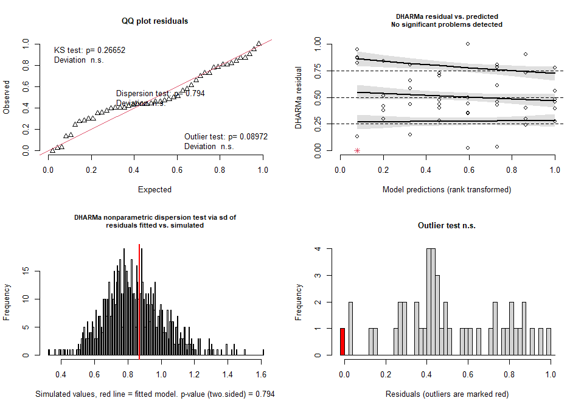<!-- -->

```
## 
## 	DHARMa outlier test based on exact binomial test with approximate
## 	expectations
## 
## data:  simulationOutput
## outliers at both margin(s) = 1, observations = 47, p-value = 0.08972
## alternative hypothesis: true probability of success is not equal to 0.001998002
## 95 percent confidence interval:
##  0.0005385317 0.1129377171
## sample estimates:
## frequency of outliers (expected: 0.001998001998002 ) 
##                                            0.0212766
```

``` r
DHARMa.sum(Model = lm4)
```

```
## 1. Kolmogorov-Smirnov test indicates deviations of the residuals from uniform distribution. H0: The model fits the data well; Ha: The model does not fit the data well
```

```
## 
## 	Asymptotic one-sample Kolmogorov-Smirnov test
## 
## data:  simulationOutput$scaledResiduals
## D = 0.15134, p-value = 0.2319
## alternative hypothesis: two-sided
```

```
## 2. Test for over-dispersion. H0: No over-dispersion in the model; Ha: Over-dispersion in the model
```

```
## 
## 	DHARMa nonparametric dispersion test via sd of residuals fitted vs.
## 	simulated
## 
## data:  simulationOutput
## dispersion = 1.044, p-value = 0.766
## alternative hypothesis: two.sided
## 
## 3. Test for outliers. H0: No ouliers in the model; Ha: Outliers in the model
```

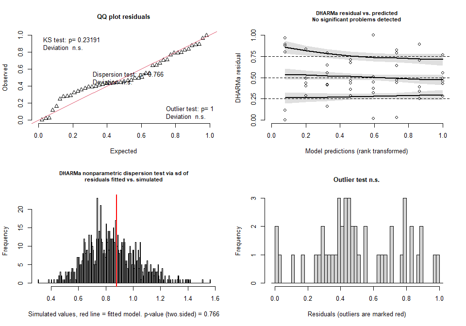<!-- -->

```
## 
## 	DHARMa outlier test based on exact binomial test with approximate
## 	expectations
## 
## data:  simulationOutput
## outliers at both margin(s) = 0, observations = 47, p-value = 1
## alternative hypothesis: true probability of success is not equal to 0.001998002
## 95 percent confidence interval:
##  0.00000000 0.07548573
## sample estimates:
## frequency of outliers (expected: 0.001998001998002 ) 
##                                                    0
```

``` r
DHARMa.sum(Model = lm5)
```

```
## 1. Kolmogorov-Smirnov test indicates deviations of the residuals from uniform distribution. H0: The model fits the data well; Ha: The model does not fit the data well
```

```
## 
## 	Exact one-sample Kolmogorov-Smirnov test
## 
## data:  simulationOutput$scaledResiduals
## D = 0.13734, p-value = 0.309
## alternative hypothesis: two-sided
```

```
## 2. Test for over-dispersion. H0: No over-dispersion in the model; Ha: Over-dispersion in the model
```

```
## 
## 	DHARMa nonparametric dispersion test via sd of residuals fitted vs.
## 	simulated
## 
## data:  simulationOutput
## dispersion = 1.0375, p-value = 0.794
## alternative hypothesis: two.sided
## 
## 3. Test for outliers. H0: No ouliers in the model; Ha: Outliers in the model
```

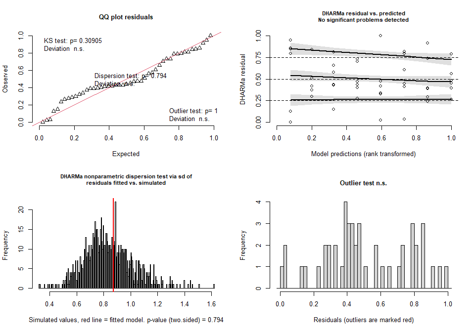<!-- -->

```
## 
## 	DHARMa outlier test based on exact binomial test with approximate
## 	expectations
## 
## data:  simulationOutput
## outliers at both margin(s) = 0, observations = 47, p-value = 1
## alternative hypothesis: true probability of success is not equal to 0.001998002
## 95 percent confidence interval:
##  0.00000000 0.07548573
## sample estimates:
## frequency of outliers (expected: 0.001998001998002 ) 
##                                                    0
```

``` r
DHARMa.sum(Model = lm6)
```

```
## 1. Kolmogorov-Smirnov test indicates deviations of the residuals from uniform distribution. H0: The model fits the data well; Ha: The model does not fit the data well
```

```
## 
## 	Asymptotic one-sample Kolmogorov-Smirnov test
## 
## data:  simulationOutput$scaledResiduals
## D = 0.14734, p-value = 0.2593
## alternative hypothesis: two-sided
```

```
## 2. Test for over-dispersion. H0: No over-dispersion in the model; Ha: Over-dispersion in the model
```

```
## 
## 	DHARMa nonparametric dispersion test via sd of residuals fitted vs.
## 	simulated
## 
## data:  simulationOutput
## dispersion = 1.044, p-value = 0.766
## alternative hypothesis: two.sided
## 
## 3. Test for outliers. H0: No ouliers in the model; Ha: Outliers in the model
```

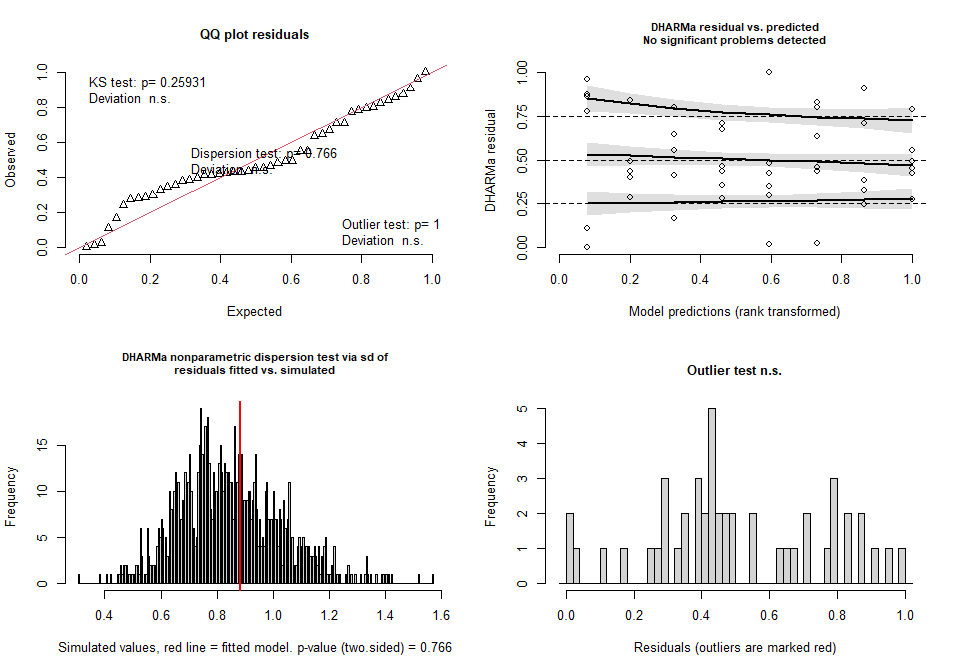<!-- -->

```
## 
## 	DHARMa outlier test based on exact binomial test with approximate
## 	expectations
## 
## data:  simulationOutput
## outliers at both margin(s) = 0, observations = 47, p-value = 1
## alternative hypothesis: true probability of success is not equal to 0.001998002
## 95 percent confidence interval:
##  0.00000000 0.07548573
## sample estimates:
## frequency of outliers (expected: 0.001998001998002 ) 
##                                                    0
```

``` r
DHARMa.sum(Model = glm1)
```

```
## 1. Kolmogorov-Smirnov test indicates deviations of the residuals from uniform distribution. H0: The model fits the data well; Ha: The model does not fit the data well
```

```
## 
## 	Exact one-sample Kolmogorov-Smirnov test
## 
## data:  simulationOutput$scaledResiduals
## D = 0.14806, p-value = 0.2303
## alternative hypothesis: two-sided
```

```
## 2. Test for over-dispersion. H0: No over-dispersion in the model; Ha: Over-dispersion in the model
```

```
## 
## 	DHARMa nonparametric dispersion test via sd of residuals fitted vs.
## 	simulated
## 
## data:  simulationOutput
## dispersion = 0.97392, p-value = 0.972
## alternative hypothesis: two.sided
## 
## 3. Test for outliers. H0: No ouliers in the model; Ha: Outliers in the model
```

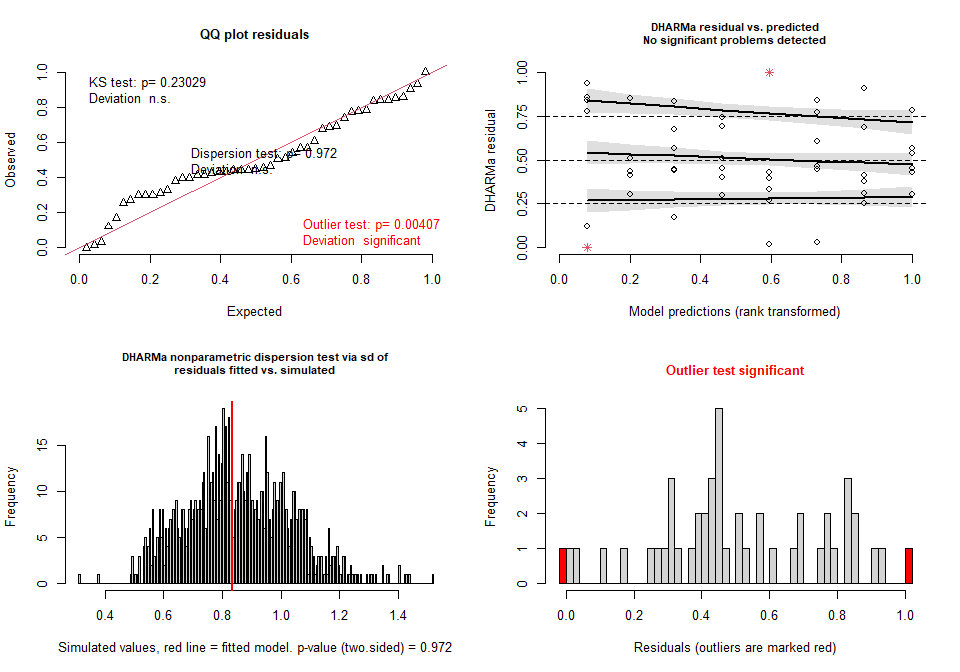<!-- -->

```
## 
## 	DHARMa outlier test based on exact binomial test with approximate
## 	expectations
## 
## data:  simulationOutput
## outliers at both margin(s) = 2, observations = 47, p-value = 0.004065
## alternative hypothesis: true probability of success is not equal to 0.001998002
## 95 percent confidence interval:
##  0.005195583 0.145405245
## sample estimates:
## frequency of outliers (expected: 0.001998001998002 ) 
##                                           0.04255319
```

``` r
DHARMa.sum(Model = glm2)
```

```
## 1. Kolmogorov-Smirnov test indicates deviations of the residuals from uniform distribution. H0: The model fits the data well; Ha: The model does not fit the data well
```

```
## 
## 	Asymptotic one-sample Kolmogorov-Smirnov test
## 
## data:  simulationOutput$scaledResiduals
## D = 0.14179, p-value = 0.3012
## alternative hypothesis: two-sided
```

```
## 2. Test for over-dispersion. H0: No over-dispersion in the model; Ha: Over-dispersion in the model
```

```
## 
## 	DHARMa nonparametric dispersion test via sd of residuals fitted vs.
## 	simulated
## 
## data:  simulationOutput
## dispersion = 0.9729, p-value = 0.94
## alternative hypothesis: two.sided
## 
## 3. Test for outliers. H0: No ouliers in the model; Ha: Outliers in the model
```

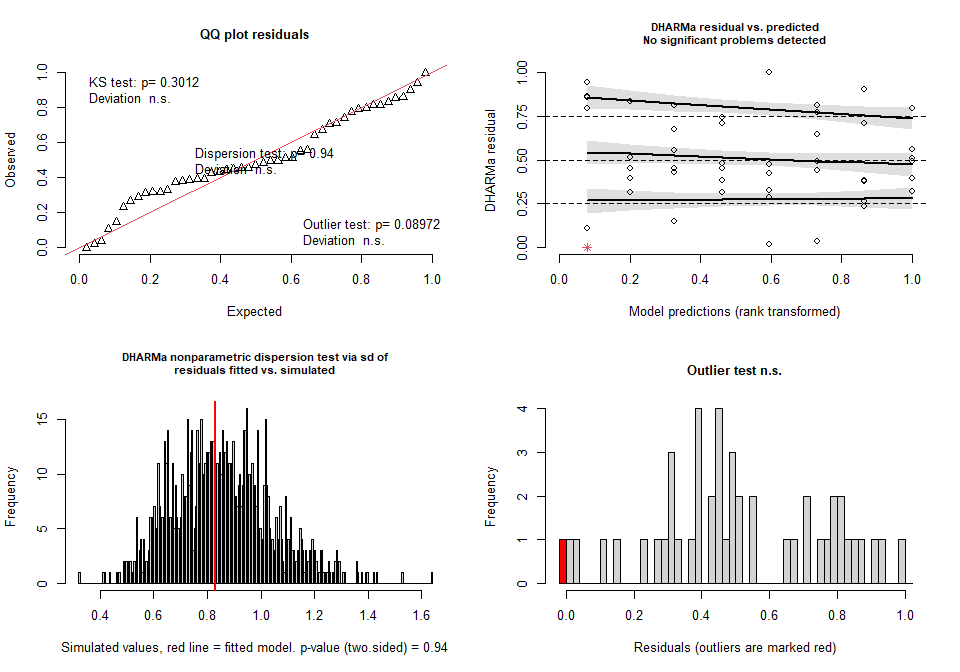<!-- -->

```
## 
## 	DHARMa outlier test based on exact binomial test with approximate
## 	expectations
## 
## data:  simulationOutput
## outliers at both margin(s) = 1, observations = 47, p-value = 0.08972
## alternative hypothesis: true probability of success is not equal to 0.001998002
## 95 percent confidence interval:
##  0.0005385317 0.1129377171
## sample estimates:
## frequency of outliers (expected: 0.001998001998002 ) 
##                                            0.0212766
```

``` r
DHARMa.sum(Model = glm3)
```

```
## 1. Kolmogorov-Smirnov test indicates deviations of the residuals from uniform distribution. H0: The model fits the data well; Ha: The model does not fit the data well
```

```
## 
## 	Exact one-sample Kolmogorov-Smirnov test
## 
## data:  simulationOutput$scaledResiduals
## D = 0.16534, p-value = 0.1365
## alternative hypothesis: two-sided
```

```
## 2. Test for over-dispersion. H0: No over-dispersion in the model; Ha: Over-dispersion in the model
```

```
## 
## 	DHARMa nonparametric dispersion test via sd of residuals fitted vs.
## 	simulated
## 
## data:  simulationOutput
## dispersion = 1.01, p-value = 0.918
## alternative hypothesis: two.sided
## 
## 3. Test for outliers. H0: No ouliers in the model; Ha: Outliers in the model
```

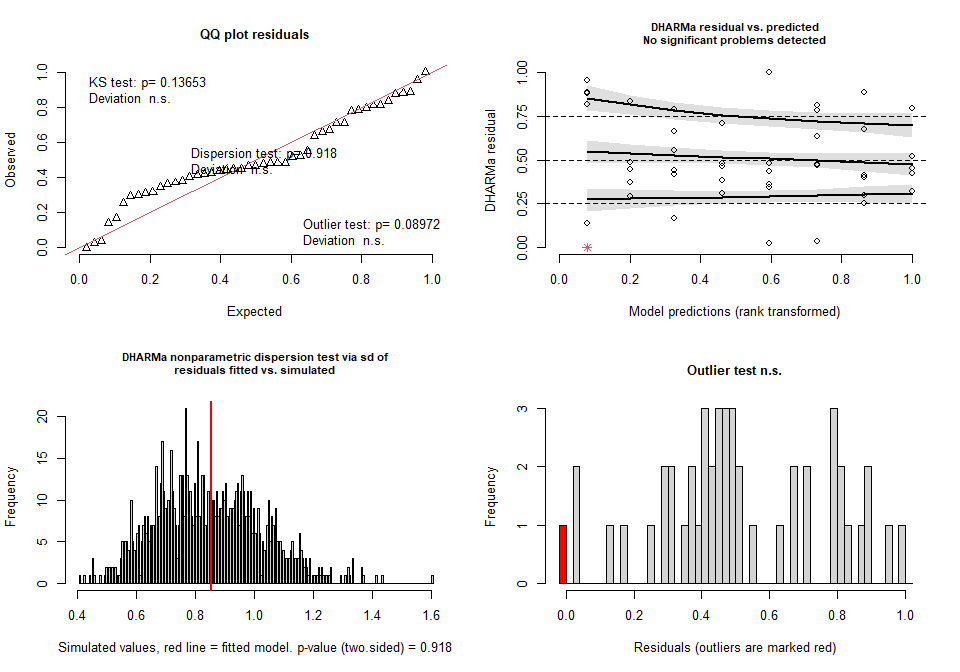<!-- -->

```
## 
## 	DHARMa outlier test based on exact binomial test with approximate
## 	expectations
## 
## data:  simulationOutput
## outliers at both margin(s) = 1, observations = 47, p-value = 0.08972
## alternative hypothesis: true probability of success is not equal to 0.001998002
## 95 percent confidence interval:
##  0.0005385317 0.1129377171
## sample estimates:
## frequency of outliers (expected: 0.001998001998002 ) 
##                                            0.0212766
```

``` r
DHARMa.sum(Model = glm4)
```

```
## 1. Kolmogorov-Smirnov test indicates deviations of the residuals from uniform distribution. H0: The model fits the data well; Ha: The model does not fit the data well
```

```
## 
## 	Asymptotic one-sample Kolmogorov-Smirnov test
## 
## data:  simulationOutput$scaledResiduals
## D = 0.13706, p-value = 0.3404
## alternative hypothesis: two-sided
```

```
## 2. Test for over-dispersion. H0: No over-dispersion in the model; Ha: Over-dispersion in the model
```

```
## 
## 	DHARMa nonparametric dispersion test via sd of residuals fitted vs.
## 	simulated
## 
## data:  simulationOutput
## dispersion = 1.0119, p-value = 0.902
## alternative hypothesis: two.sided
## 
## 3. Test for outliers. H0: No ouliers in the model; Ha: Outliers in the model
```

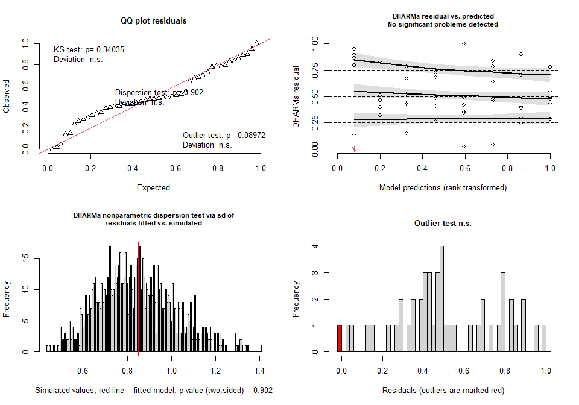<!-- -->

```
## 
## 	DHARMa outlier test based on exact binomial test with approximate
## 	expectations
## 
## data:  simulationOutput
## outliers at both margin(s) = 1, observations = 47, p-value = 0.08972
## alternative hypothesis: true probability of success is not equal to 0.001998002
## 95 percent confidence interval:
##  0.0005385317 0.1129377171
## sample estimates:
## frequency of outliers (expected: 0.001998001998002 ) 
##                                            0.0212766
```

``` r
DHARMa.sum(Model = glm5)
```

```
## 1. Kolmogorov-Smirnov test indicates deviations of the residuals from uniform distribution. H0: The model fits the data well; Ha: The model does not fit the data well
```

```
## 
## 	Asymptotic one-sample Kolmogorov-Smirnov test
## 
## data:  simulationOutput$scaledResiduals
## D = 0.17334, p-value = 0.1187
## alternative hypothesis: two-sided
```

```
## 2. Test for over-dispersion. H0: No over-dispersion in the model; Ha: Over-dispersion in the model
```

```
## 
## 	DHARMa nonparametric dispersion test via sd of residuals fitted vs.
## 	simulated
## 
## data:  simulationOutput
## dispersion = 0.98484, p-value = 0.992
## alternative hypothesis: two.sided
## 
## 3. Test for outliers. H0: No ouliers in the model; Ha: Outliers in the model
```

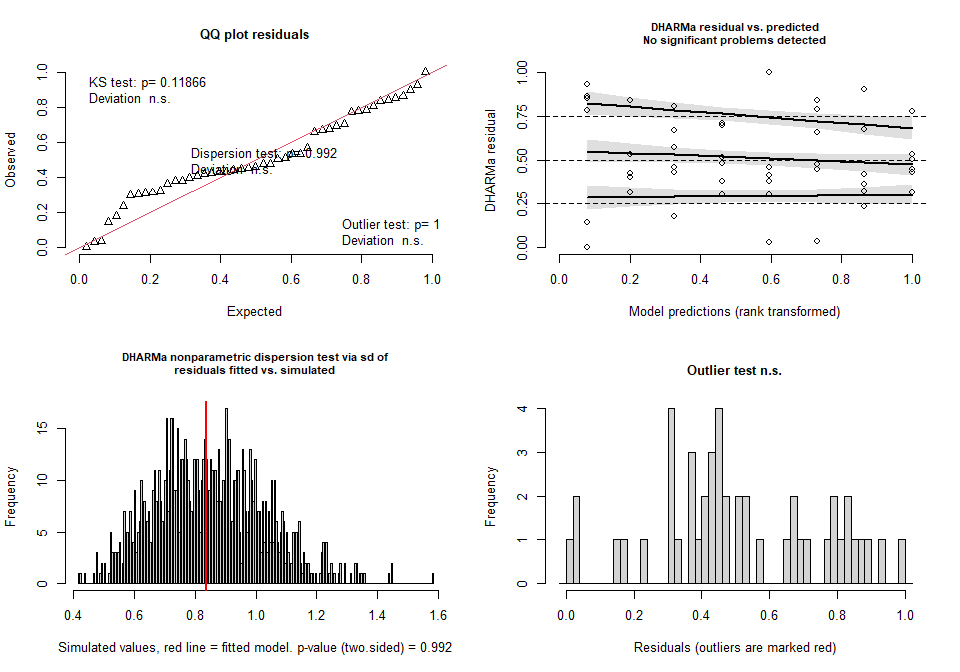<!-- -->

```
## 
## 	DHARMa outlier test based on exact binomial test with approximate
## 	expectations
## 
## data:  simulationOutput
## outliers at both margin(s) = 0, observations = 47, p-value = 1
## alternative hypothesis: true probability of success is not equal to 0.001998002
## 95 percent confidence interval:
##  0.00000000 0.07548573
## sample estimates:
## frequency of outliers (expected: 0.001998001998002 ) 
##                                                    0
```

``` r
DHARMa.sum(Model = glm6)
```

```
## 1. Kolmogorov-Smirnov test indicates deviations of the residuals from uniform distribution. H0: The model fits the data well; Ha: The model does not fit the data well
```

```
## 
## 	Asymptotic one-sample Kolmogorov-Smirnov test
## 
## data:  simulationOutput$scaledResiduals
## D = 0.15234, p-value = 0.2254
## alternative hypothesis: two-sided
```

```
## 2. Test for over-dispersion. H0: No over-dispersion in the model; Ha: Over-dispersion in the model
```

```
## 
## 	DHARMa nonparametric dispersion test via sd of residuals fitted vs.
## 	simulated
## 
## data:  simulationOutput
## dispersion = 0.98531, p-value = 0.966
## alternative hypothesis: two.sided
## 
## 3. Test for outliers. H0: No ouliers in the model; Ha: Outliers in the model
```

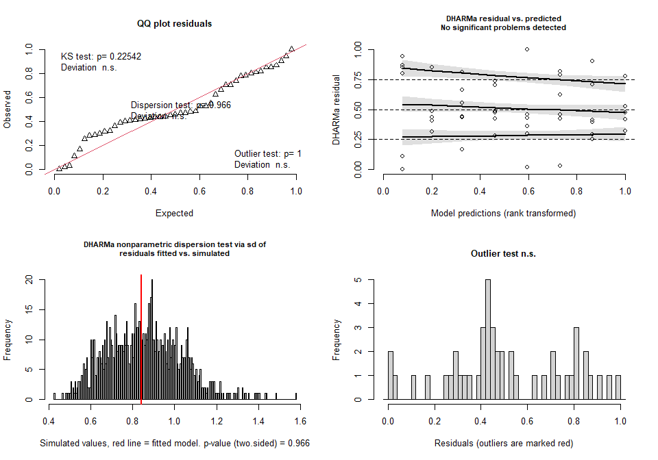<!-- -->

```
## 
## 	DHARMa outlier test based on exact binomial test with approximate
## 	expectations
## 
## data:  simulationOutput
## outliers at both margin(s) = 0, observations = 47, p-value = 1
## alternative hypothesis: true probability of success is not equal to 0.001998002
## 95 percent confidence interval:
##  0.00000000 0.07548573
## sample estimates:
## frequency of outliers (expected: 0.001998001998002 ) 
##                                                    0
```

### Model output

``` r
# #summary(lm1)
# summary(lm2)
# #Anova(lm1)
# Anova(lm2)

# summary(lm3)
# summary(lm4)
# Anova(lm3)
# Anova(lm4)

summary(lm5)
```

```
##  Family: gaussian  ( identity )
## Formula:          
## sqrt(Observed) ~ Soil_conditioning * Accession + (1 | Block_g)
## Data: total_diversity
## 
##       AIC       BIC    logLik -2*log(L)  df.resid 
##     209.1     227.6     -94.6     189.1        37 
## 
## Random effects:
## 
## Conditional model:
##  Groups   Name        Variance  Std.Dev. 
##  Block_g  (Intercept) 1.753e-09 4.187e-05
##  Residual             3.273e+00 1.809e+00
## Number of obs: 47, groups:  Block_g, 4
## 
## Dispersion estimate for gaussian family (sigma^2): 3.27 
## 
## Conditional model:
##                                  Estimate Std. Error z value Pr(>|z|)    
## (Intercept)                       35.0242     0.8091   43.29   <2e-16 ***
## Soil_conditioningCo                0.5745     1.0955    0.52   0.6000    
## AccessionCD                        1.5428     1.0955    1.41   0.1590    
## AccessionHM                        1.5036     1.0955    1.37   0.1699    
## AccessionGO1                       1.9660     1.0955    1.79   0.0727 .  
## Soil_conditioningCo:AccessionCD   -0.9810     1.5136   -0.65   0.5169    
## Soil_conditioningCo:AccessionHM   -2.4740     1.5136   -1.63   0.1022    
## Soil_conditioningCo:AccessionGO1  -2.1159     1.5136   -1.40   0.1621    
## ---
## Signif. codes:  0 '***' 0.001 '**' 0.01 '*' 0.05 '.' 0.1 ' ' 1
```

``` r
# summary(lm6)
Anova(lm5)
```

```
## Analysis of Deviance Table (Type II Wald chisquare tests)
## 
## Response: sqrt(Observed)
##                              Chisq Df Pr(>Chisq)
## Soil_conditioning           2.5922  1     0.1074
## Accession                   2.4626  3     0.4821
## Soil_conditioning:Accession 3.3190  3     0.3450
```

``` r
# Anova(lm6)

Alphadiv_obs_Acc_FP <- as.data.frame(Anova(lm5))
write.csv(Alphadiv_obs_Acc_FP, "C:/Users/kreek001/OneDrive - Wageningen University & Research/Chapters/Experimental Chapter 3/RScripts/GitHub/TwelveAccessionExperiment/MicrobiomeAnalysis/Data/Statistical_output/FP/Alphadiv_obs_Acc_FP.csv")

# summary(glm1)
# summary(glm2)
# Anova(glm1)
# Anova(glm2)
# 
# #summary(glm3)
# summary(glm4)
# #Anova(glm3)
# Anova(glm4)
# 
# summary(glm5)
# summary(glm6)
# Anova(glm5)
# Anova(glm6)
```

### Post hoc test

``` r
# emmeans(lm2, pairwise ~ Accession)
# ph_obs <- cld(emmeans(lm2, pairwise ~ Accession), Letters = letters)
# print(ph_obs)
```


``` r
rm(lm1, lm2, lm3, lm4, lm5, lm6, glm1, glm2, glm3, glm4, glm5, glm6)
```

## Statistics Shannon index
### Defining model

``` r
lm1 <- glmmTMB(data = total_diversity, formula = Shannon ~ Soil_conditioning * Accession + (1 | Block_g), family = gaussian(link = "identity"))
lm2 <- glmmTMB(data = total_diversity, formula = Shannon ~ Soil_conditioning * Accession, family = gaussian(link = "identity"))

lm3 <- glmmTMB(data = total_diversity, formula = log(Shannon) ~ Soil_conditioning * Accession + (1 | Block_g), family = gaussian(link = "identity"))
lm4 <- glmmTMB(data = total_diversity, formula = log(Shannon) ~ Soil_conditioning * Accession, family = gaussian(link = "identity"))

lm5 <- glmmTMB(data = total_diversity, formula = sqrt(Shannon) ~ Soil_conditioning * Accession + (1 | Block_g), family = gaussian(link = "identity"))
lm6 <- glmmTMB(data = total_diversity, formula = sqrt(Shannon) ~ Soil_conditioning * Accession, family = gaussian(link = "identity"))

glm1 <- glmmTMB(data = total_diversity, formula = Shannon ~ Soil_conditioning * Accession + (1 | Block_g), family = Gamma(link = "log"))
glm2 <- glmmTMB(data = total_diversity, formula = Shannon + 2 ~ Soil_conditioning * Accession, family = Gamma(link = "log"))

glm3 <- glmmTMB(data = total_diversity, formula = log(Shannon + 2) ~ Soil_conditioning * Accession + (1 | Block_g), family = Gamma(link = "log"))
glm4 <- glmmTMB(data = total_diversity, formula = log(Shannon) ~ Soil_conditioning * Accession, family = Gamma(link = "log"))

glm5 <- glmmTMB(data = total_diversity, formula = sqrt(Shannon) ~ Soil_conditioning * Accession + (1 | Block_g), family = Gamma(link = "log"))
glm6 <- glmmTMB(data = total_diversity, formula = sqrt(Shannon) ~ Soil_conditioning * Accession, family = Gamma(link = "log"))
```

### Model assumptions

``` r
DHARMa.sum(Model = lm1)
```

```
## 1. Kolmogorov-Smirnov test indicates deviations of the residuals from uniform distribution. H0: The model fits the data well; Ha: The model does not fit the data well
```

```
## 
## 	Exact one-sample Kolmogorov-Smirnov test
## 
## data:  simulationOutput$scaledResiduals
## D = 0.09134, p-value = 0.7943
## alternative hypothesis: two-sided
```

```
## 2. Test for over-dispersion. H0: No over-dispersion in the model; Ha: Over-dispersion in the model
```

```
## 
## 	DHARMa nonparametric dispersion test via sd of residuals fitted vs.
## 	simulated
## 
## data:  simulationOutput
## dispersion = 1.0375, p-value = 0.794
## alternative hypothesis: two.sided
## 
## 3. Test for outliers. H0: No ouliers in the model; Ha: Outliers in the model
```

<!-- -->

```
## 
## 	DHARMa outlier test based on exact binomial test with approximate
## 	expectations
## 
## data:  simulationOutput
## outliers at both margin(s) = 0, observations = 47, p-value = 1
## alternative hypothesis: true probability of success is not equal to 0.001998002
## 95 percent confidence interval:
##  0.00000000 0.07548573
## sample estimates:
## frequency of outliers (expected: 0.001998001998002 ) 
##                                                    0
```

``` r
DHARMa.sum(Model = lm2)
```

```
## 1. Kolmogorov-Smirnov test indicates deviations of the residuals from uniform distribution. H0: The model fits the data well; Ha: The model does not fit the data well
```

```
## 
## 	Exact one-sample Kolmogorov-Smirnov test
## 
## data:  simulationOutput$scaledResiduals
## D = 0.09634, p-value = 0.7394
## alternative hypothesis: two-sided
```

```
## 2. Test for over-dispersion. H0: No over-dispersion in the model; Ha: Over-dispersion in the model
```

```
## 
## 	DHARMa nonparametric dispersion test via sd of residuals fitted vs.
## 	simulated
## 
## data:  simulationOutput
## dispersion = 1.044, p-value = 0.766
## alternative hypothesis: two.sided
## 
## 3. Test for outliers. H0: No ouliers in the model; Ha: Outliers in the model
```

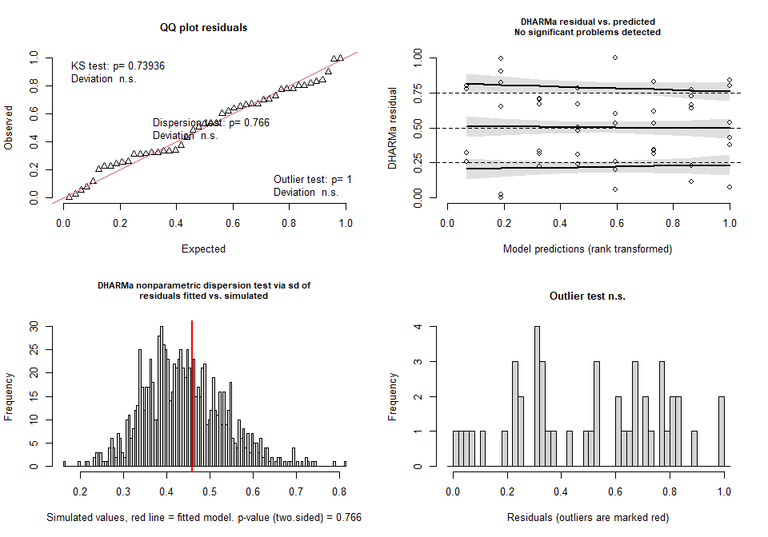<!-- -->

```
## 
## 	DHARMa outlier test based on exact binomial test with approximate
## 	expectations
## 
## data:  simulationOutput
## outliers at both margin(s) = 0, observations = 47, p-value = 1
## alternative hypothesis: true probability of success is not equal to 0.001998002
## 95 percent confidence interval:
##  0.00000000 0.07548573
## sample estimates:
## frequency of outliers (expected: 0.001998001998002 ) 
##                                                    0
```

``` r
DHARMa.sum(Model = lm3)
```

```
## 1. Kolmogorov-Smirnov test indicates deviations of the residuals from uniform distribution. H0: The model fits the data well; Ha: The model does not fit the data well
```

```
## 
## 	Asymptotic one-sample Kolmogorov-Smirnov test
## 
## data:  simulationOutput$scaledResiduals
## D = 0.09134, p-value = 0.8278
## alternative hypothesis: two-sided
```

```
## 2. Test for over-dispersion. H0: No over-dispersion in the model; Ha: Over-dispersion in the model
```

```
## 
## 	DHARMa nonparametric dispersion test via sd of residuals fitted vs.
## 	simulated
## 
## data:  simulationOutput
## dispersion = 1.0375, p-value = 0.794
## alternative hypothesis: two.sided
## 
## 3. Test for outliers. H0: No ouliers in the model; Ha: Outliers in the model
```

<!-- -->

```
## 
## 	DHARMa outlier test based on exact binomial test with approximate
## 	expectations
## 
## data:  simulationOutput
## outliers at both margin(s) = 0, observations = 47, p-value = 1
## alternative hypothesis: true probability of success is not equal to 0.001998002
## 95 percent confidence interval:
##  0.00000000 0.07548573
## sample estimates:
## frequency of outliers (expected: 0.001998001998002 ) 
##                                                    0
```

``` r
DHARMa.sum(Model = lm4)
```

```
## 1. Kolmogorov-Smirnov test indicates deviations of the residuals from uniform distribution. H0: The model fits the data well; Ha: The model does not fit the data well
```

```
## 
## 	Asymptotic one-sample Kolmogorov-Smirnov test
## 
## data:  simulationOutput$scaledResiduals
## D = 0.10017, p-value = 0.7332
## alternative hypothesis: two-sided
```

```
## 2. Test for over-dispersion. H0: No over-dispersion in the model; Ha: Over-dispersion in the model
```

```
## 
## 	DHARMa nonparametric dispersion test via sd of residuals fitted vs.
## 	simulated
## 
## data:  simulationOutput
## dispersion = 1.044, p-value = 0.766
## alternative hypothesis: two.sided
## 
## 3. Test for outliers. H0: No ouliers in the model; Ha: Outliers in the model
```

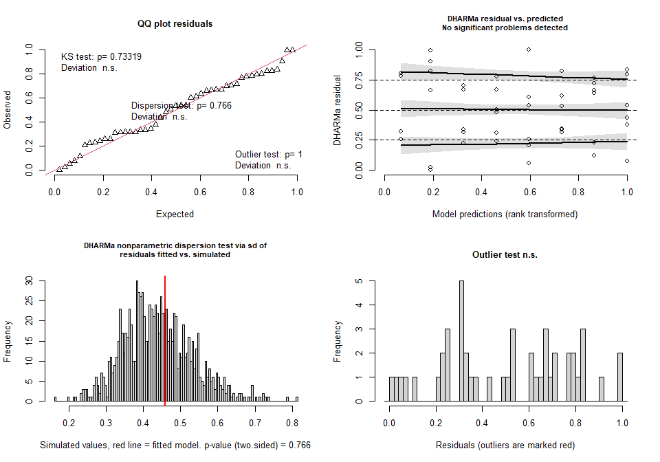<!-- -->

```
## 
## 	DHARMa outlier test based on exact binomial test with approximate
## 	expectations
## 
## data:  simulationOutput
## outliers at both margin(s) = 0, observations = 47, p-value = 1
## alternative hypothesis: true probability of success is not equal to 0.001998002
## 95 percent confidence interval:
##  0.00000000 0.07548573
## sample estimates:
## frequency of outliers (expected: 0.001998001998002 ) 
##                                                    0
```

``` r
DHARMa.sum(Model = lm5)
```

```
## 1. Kolmogorov-Smirnov test indicates deviations of the residuals from uniform distribution. H0: The model fits the data well; Ha: The model does not fit the data well
```

```
## 
## 	Asymptotic one-sample Kolmogorov-Smirnov test
## 
## data:  simulationOutput$scaledResiduals
## D = 0.09134, p-value = 0.8278
## alternative hypothesis: two-sided
```

```
## 2. Test for over-dispersion. H0: No over-dispersion in the model; Ha: Over-dispersion in the model
```

```
## 
## 	DHARMa nonparametric dispersion test via sd of residuals fitted vs.
## 	simulated
## 
## data:  simulationOutput
## dispersion = 1.0375, p-value = 0.794
## alternative hypothesis: two.sided
## 
## 3. Test for outliers. H0: No ouliers in the model; Ha: Outliers in the model
```

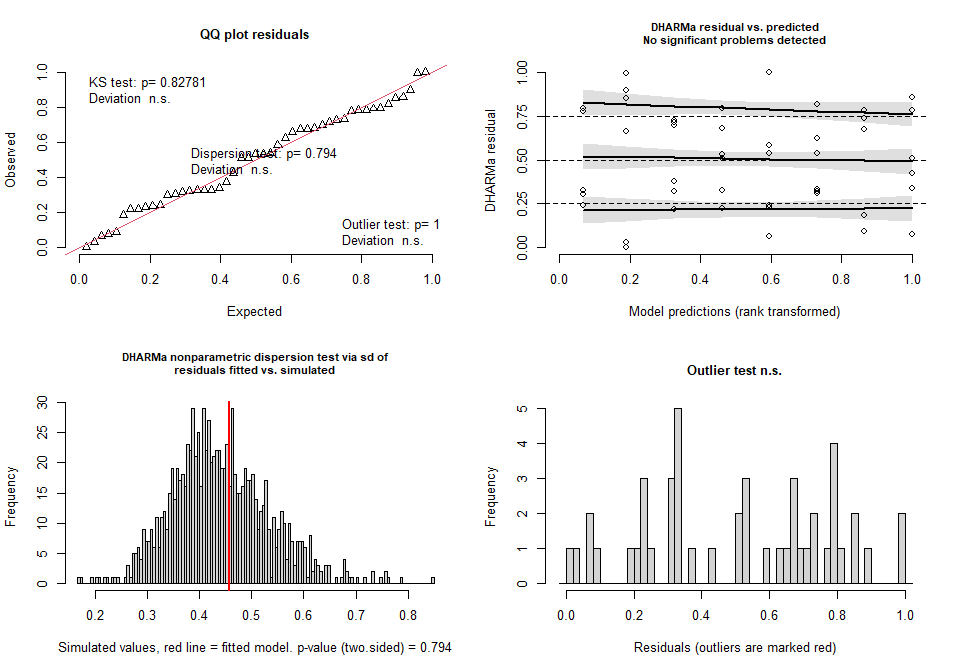<!-- -->

```
## 
## 	DHARMa outlier test based on exact binomial test with approximate
## 	expectations
## 
## data:  simulationOutput
## outliers at both margin(s) = 0, observations = 47, p-value = 1
## alternative hypothesis: true probability of success is not equal to 0.001998002
## 95 percent confidence interval:
##  0.00000000 0.07548573
## sample estimates:
## frequency of outliers (expected: 0.001998001998002 ) 
##                                                    0
```

``` r
DHARMa.sum(Model = lm6)
```

```
## 1. Kolmogorov-Smirnov test indicates deviations of the residuals from uniform distribution. H0: The model fits the data well; Ha: The model does not fit the data well
```

```
## 
## 	Asymptotic one-sample Kolmogorov-Smirnov test
## 
## data:  simulationOutput$scaledResiduals
## D = 0.09817, p-value = 0.7555
## alternative hypothesis: two-sided
```

```
## 2. Test for over-dispersion. H0: No over-dispersion in the model; Ha: Over-dispersion in the model
```

```
## 
## 	DHARMa nonparametric dispersion test via sd of residuals fitted vs.
## 	simulated
## 
## data:  simulationOutput
## dispersion = 1.044, p-value = 0.766
## alternative hypothesis: two.sided
## 
## 3. Test for outliers. H0: No ouliers in the model; Ha: Outliers in the model
```

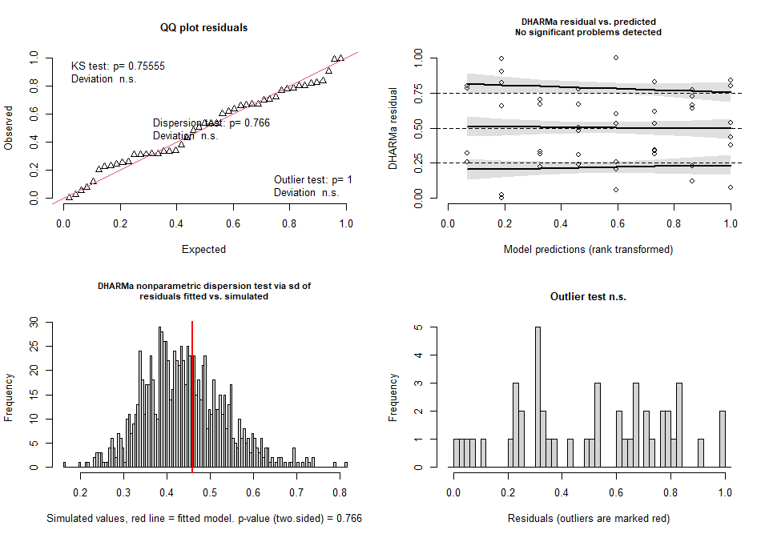<!-- -->

```
## 
## 	DHARMa outlier test based on exact binomial test with approximate
## 	expectations
## 
## data:  simulationOutput
## outliers at both margin(s) = 0, observations = 47, p-value = 1
## alternative hypothesis: true probability of success is not equal to 0.001998002
## 95 percent confidence interval:
##  0.00000000 0.07548573
## sample estimates:
## frequency of outliers (expected: 0.001998001998002 ) 
##                                                    0
```

``` r
DHARMa.sum(Model = glm1)
```

```
## 1. Kolmogorov-Smirnov test indicates deviations of the residuals from uniform distribution. H0: The model fits the data well; Ha: The model does not fit the data well
```

```
## 
## 	Asymptotic one-sample Kolmogorov-Smirnov test
## 
## data:  simulationOutput$scaledResiduals
## D = 0.10562, p-value = 0.6709
## alternative hypothesis: two-sided
```

```
## 2. Test for over-dispersion. H0: No over-dispersion in the model; Ha: Over-dispersion in the model
```

```
## 
## 	DHARMa nonparametric dispersion test via sd of residuals fitted vs.
## 	simulated
## 
## data:  simulationOutput
## dispersion = 1.0085, p-value = 0.926
## alternative hypothesis: two.sided
## 
## 3. Test for outliers. H0: No ouliers in the model; Ha: Outliers in the model
```

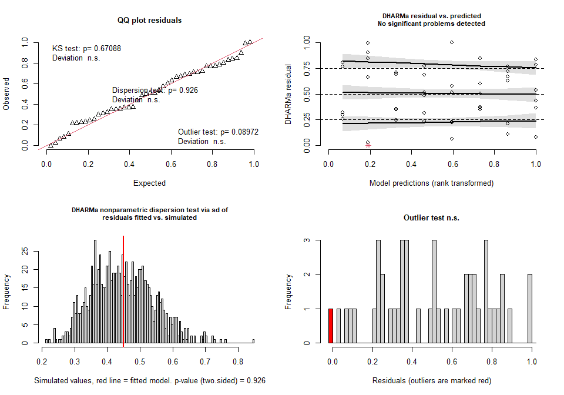<!-- -->

```
## 
## 	DHARMa outlier test based on exact binomial test with approximate
## 	expectations
## 
## data:  simulationOutput
## outliers at both margin(s) = 1, observations = 47, p-value = 0.08972
## alternative hypothesis: true probability of success is not equal to 0.001998002
## 95 percent confidence interval:
##  0.0005385317 0.1129377171
## sample estimates:
## frequency of outliers (expected: 0.001998001998002 ) 
##                                            0.0212766
```

``` r
DHARMa.sum(Model = glm2)
```

```
## 1. Kolmogorov-Smirnov test indicates deviations of the residuals from uniform distribution. H0: The model fits the data well; Ha: The model does not fit the data well
```

```
## 
## 	Exact one-sample Kolmogorov-Smirnov test
## 
## data:  simulationOutput$scaledResiduals
## D = 0.098617, p-value = 0.7135
## alternative hypothesis: two-sided
```

```
## 2. Test for over-dispersion. H0: No over-dispersion in the model; Ha: Over-dispersion in the model
```

```
## 
## 	DHARMa nonparametric dispersion test via sd of residuals fitted vs.
## 	simulated
## 
## data:  simulationOutput
## dispersion = 1.0145, p-value = 0.9
## alternative hypothesis: two.sided
## 
## 3. Test for outliers. H0: No ouliers in the model; Ha: Outliers in the model
```

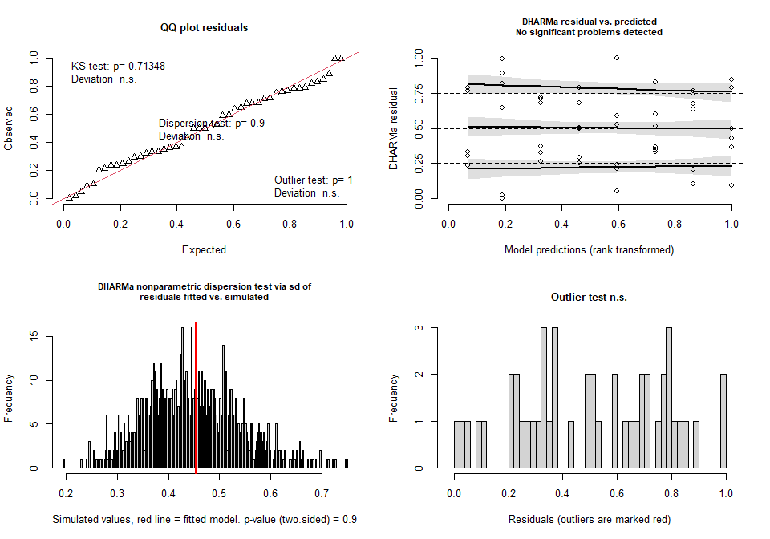<!-- -->

```
## 
## 	DHARMa outlier test based on exact binomial test with approximate
## 	expectations
## 
## data:  simulationOutput
## outliers at both margin(s) = 0, observations = 47, p-value = 1
## alternative hypothesis: true probability of success is not equal to 0.001998002
## 95 percent confidence interval:
##  0.00000000 0.07548573
## sample estimates:
## frequency of outliers (expected: 0.001998001998002 ) 
##                                                    0
```

``` r
DHARMa.sum(Model = glm3)
```

```
## 1. Kolmogorov-Smirnov test indicates deviations of the residuals from uniform distribution. H0: The model fits the data well; Ha: The model does not fit the data well
```

```
## 
## 	Asymptotic one-sample Kolmogorov-Smirnov test
## 
## data:  simulationOutput$scaledResiduals
## D = 0.093617, p-value = 0.8046
## alternative hypothesis: two-sided
```

```
## 2. Test for over-dispersion. H0: No over-dispersion in the model; Ha: Over-dispersion in the model
```

```
## 
## 	DHARMa nonparametric dispersion test via sd of residuals fitted vs.
## 	simulated
## 
## data:  simulationOutput
## dispersion = 1.0181, p-value = 0.886
## alternative hypothesis: two.sided
## 
## 3. Test for outliers. H0: No ouliers in the model; Ha: Outliers in the model
```

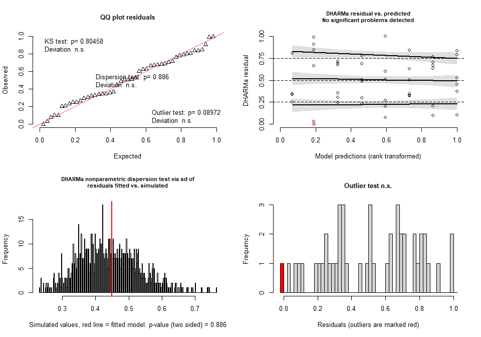<!-- -->

```
## 
## 	DHARMa outlier test based on exact binomial test with approximate
## 	expectations
## 
## data:  simulationOutput
## outliers at both margin(s) = 1, observations = 47, p-value = 0.08972
## alternative hypothesis: true probability of success is not equal to 0.001998002
## 95 percent confidence interval:
##  0.0005385317 0.1129377171
## sample estimates:
## frequency of outliers (expected: 0.001998001998002 ) 
##                                            0.0212766
```

``` r
DHARMa.sum(Model = glm4)
```

```
## 1. Kolmogorov-Smirnov test indicates deviations of the residuals from uniform distribution. H0: The model fits the data well; Ha: The model does not fit the data well
```

```
## 
## 	Exact one-sample Kolmogorov-Smirnov test
## 
## data:  simulationOutput$scaledResiduals
## D = 0.089617, p-value = 0.8123
## alternative hypothesis: two-sided
```

```
## 2. Test for over-dispersion. H0: No over-dispersion in the model; Ha: Over-dispersion in the model
```

```
## 
## 	DHARMa nonparametric dispersion test via sd of residuals fitted vs.
## 	simulated
## 
## data:  simulationOutput
## dispersion = 1.0167, p-value = 0.908
## alternative hypothesis: two.sided
## 
## 3. Test for outliers. H0: No ouliers in the model; Ha: Outliers in the model
```

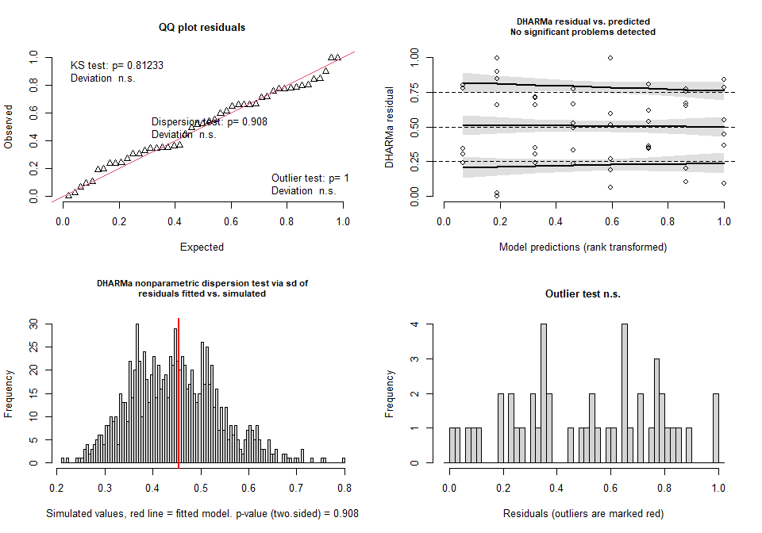<!-- -->

```
## 
## 	DHARMa outlier test based on exact binomial test with approximate
## 	expectations
## 
## data:  simulationOutput
## outliers at both margin(s) = 0, observations = 47, p-value = 1
## alternative hypothesis: true probability of success is not equal to 0.001998002
## 95 percent confidence interval:
##  0.00000000 0.07548573
## sample estimates:
## frequency of outliers (expected: 0.001998001998002 ) 
##                                                    0
```

``` r
DHARMa.sum(Model = glm5)
```

```
## 1. Kolmogorov-Smirnov test indicates deviations of the residuals from uniform distribution. H0: The model fits the data well; Ha: The model does not fit the data well
```

```
## 
## 	Asymptotic one-sample Kolmogorov-Smirnov test
## 
## data:  simulationOutput$scaledResiduals
## D = 0.09117, p-value = 0.8295
## alternative hypothesis: two-sided
```

```
## 2. Test for over-dispersion. H0: No over-dispersion in the model; Ha: Over-dispersion in the model
```

```
## 
## 	DHARMa nonparametric dispersion test via sd of residuals fitted vs.
## 	simulated
## 
## data:  simulationOutput
## dispersion = 1.0162, p-value = 0.896
## alternative hypothesis: two.sided
## 
## 3. Test for outliers. H0: No ouliers in the model; Ha: Outliers in the model
```

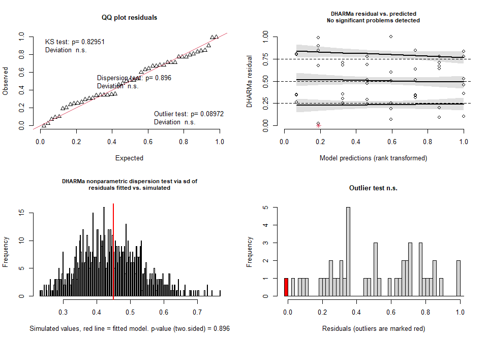<!-- -->

```
## 
## 	DHARMa outlier test based on exact binomial test with approximate
## 	expectations
## 
## data:  simulationOutput
## outliers at both margin(s) = 1, observations = 47, p-value = 0.08972
## alternative hypothesis: true probability of success is not equal to 0.001998002
## 95 percent confidence interval:
##  0.0005385317 0.1129377171
## sample estimates:
## frequency of outliers (expected: 0.001998001998002 ) 
##                                            0.0212766
```

``` r
DHARMa.sum(Model = glm6)
```

```
## 1. Kolmogorov-Smirnov test indicates deviations of the residuals from uniform distribution. H0: The model fits the data well; Ha: The model does not fit the data well
```

```
## 
## 	Asymptotic one-sample Kolmogorov-Smirnov test
## 
## data:  simulationOutput$scaledResiduals
## D = 0.094064, p-value = 0.7999
## alternative hypothesis: two-sided
```

```
## 2. Test for over-dispersion. H0: No over-dispersion in the model; Ha: Over-dispersion in the model
```

```
## 
## 	DHARMa nonparametric dispersion test via sd of residuals fitted vs.
## 	simulated
## 
## data:  simulationOutput
## dispersion = 1.0179, p-value = 0.906
## alternative hypothesis: two.sided
## 
## 3. Test for outliers. H0: No ouliers in the model; Ha: Outliers in the model
```

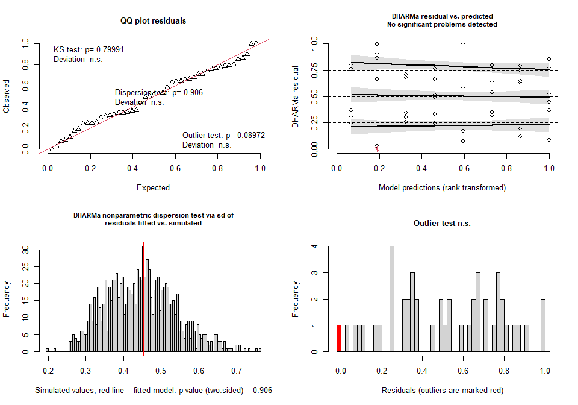<!-- -->

```
## 
## 	DHARMa outlier test based on exact binomial test with approximate
## 	expectations
## 
## data:  simulationOutput
## outliers at both margin(s) = 1, observations = 47, p-value = 0.08972
## alternative hypothesis: true probability of success is not equal to 0.001998002
## 95 percent confidence interval:
##  0.0005385317 0.1129377171
## sample estimates:
## frequency of outliers (expected: 0.001998001998002 ) 
##                                            0.0212766
```

### Model output

``` r
# summary(lm1)
# summary(lm2)
# Anova(lm1)
# Anova(lm2)
# 
# summary(lm3)
# summary(lm4)
# Anova(lm3)
# Anova(lm4)

# summary(lm5)
# summary(lm6)
# Anova(lm5)
# Anova(lm6)

# summary(glm1)
# summary(glm2
# Anova(glm1)
# Anova(glm2)
# 
# #summary(glm3)
# summary(glm4)
# #Anova(glm3)
# Anova(glm4)
# 
summary(glm5)
```

```
##  Family: Gamma  ( log )
## Formula:          sqrt(Shannon) ~ Soil_conditioning * Accession + (1 | Block_g)
## Data: total_diversity
## 
##       AIC       BIC    logLik -2*log(L)  df.resid 
##    -219.5    -201.0     119.8    -239.5        37 
## 
## Random effects:
## 
## Conditional model:
##  Groups  Name        Variance  Std.Dev. 
##  Block_g (Intercept) 5.355e-14 2.314e-07
## Number of obs: 47, groups:  Block_g, 4
## 
## Dispersion estimate for Gamma family (sigma^2): 5.61e-05 
## 
## Conditional model:
##                                   Estimate Std. Error z value Pr(>|z|)    
## (Intercept)                       0.910411   0.003351  271.72  < 2e-16 ***
## Soil_conditioningCo               0.014624   0.004537    3.22 0.001266 ** 
## AccessionCD                       0.025133   0.004537    5.54 3.02e-08 ***
## AccessionHM                       0.027043   0.004537    5.96 2.51e-09 ***
## AccessionGO1                      0.020248   0.004537    4.46 8.08e-06 ***
## Soil_conditioningCo:AccessionCD  -0.021030   0.006268   -3.36 0.000793 ***
## Soil_conditioningCo:AccessionHM  -0.035869   0.006268   -5.72 1.05e-08 ***
## Soil_conditioningCo:AccessionGO1 -0.017715   0.006268   -2.83 0.004711 ** 
## ---
## Signif. codes:  0 '***' 0.001 '**' 0.01 '*' 0.05 '.' 0.1 ' ' 1
```

``` r
# summary(glm6)
Anova(glm5)
```

```
## Analysis of Deviance Table (Type II Wald chisquare tests)
## 
## Response: sqrt(Shannon)
##                               Chisq Df Pr(>Chisq)    
## Soil_conditioning            4.1627  1  0.0413242 *  
## Accession                   20.8816  3  0.0001114 ***
## Soil_conditioning:Accession 33.0560  3  3.134e-07 ***
## ---
## Signif. codes:  0 '***' 0.001 '**' 0.01 '*' 0.05 '.' 0.1 ' ' 1
```

``` r
# Anova(glm6)

Alphadiv_Shan_Acc_FP <- as.data.frame(Anova(glm5))
write.csv(Alphadiv_Shan_Acc_FP, "C:/Users/kreek001/OneDrive - Wageningen University & Research/Chapters/Experimental Chapter 3/RScripts/GitHub/TwelveAccessionExperiment/MicrobiomeAnalysis/Data/Statistical_output/FP/Alphadiv_Shan_Acc_FP.csv")
```

### Post hoc test

``` r
emmeans(glm5, pairwise ~ Soil_conditioning | Accession)
```

```
## $emmeans
## Accession = VL:
##  Soil_conditioning emmean      SE  df asymp.LCL asymp.UCL
##  Mb                 0.910 0.00335 Inf     0.904     0.917
##  Co                 0.925 0.00306 Inf     0.919     0.931
## 
## Accession = CD:
##  Soil_conditioning emmean      SE  df asymp.LCL asymp.UCL
##  Mb                 0.936 0.00306 Inf     0.930     0.942
##  Co                 0.929 0.00306 Inf     0.923     0.935
## 
## Accession = HM:
##  Soil_conditioning emmean      SE  df asymp.LCL asymp.UCL
##  Mb                 0.937 0.00306 Inf     0.931     0.943
##  Co                 0.916 0.00306 Inf     0.910     0.922
## 
## Accession = GO1:
##  Soil_conditioning emmean      SE  df asymp.LCL asymp.UCL
##  Mb                 0.931 0.00306 Inf     0.925     0.937
##  Co                 0.928 0.00306 Inf     0.922     0.934
## 
## Results are given on the log (not the response) scale. 
## Confidence level used: 0.95 
## 
## $contrasts
## Accession = VL:
##  contrast estimate      SE  df z.ratio p.value
##  Mb - Co  -0.01462 0.00454 Inf  -3.223  0.0013
## 
## Accession = CD:
##  contrast estimate      SE  df z.ratio p.value
##  Mb - Co   0.00641 0.00433 Inf   1.481  0.1386
## 
## Accession = HM:
##  contrast estimate      SE  df z.ratio p.value
##  Mb - Co   0.02124 0.00433 Inf   4.912  <.0001
## 
## Accession = GO1:
##  contrast estimate      SE  df z.ratio p.value
##  Mb - Co   0.00309 0.00433 Inf   0.715  0.4748
## 
## Results are given on the log (not the response) scale.
```

``` r
ph_sh <- cld(emmeans(glm5, pairwise ~ Soil_conditioning | Accession), Letters = letters)
print(ph_sh)
```

```
## Accession = VL:
##  Soil_conditioning emmean      SE  df asymp.LCL asymp.UCL .group
##  Mb                 0.910 0.00335 Inf     0.904     0.917  a    
##  Co                 0.925 0.00306 Inf     0.919     0.931   b   
## 
## Accession = CD:
##  Soil_conditioning emmean      SE  df asymp.LCL asymp.UCL .group
##  Co                 0.929 0.00306 Inf     0.923     0.935  a    
##  Mb                 0.936 0.00306 Inf     0.930     0.942  a    
## 
## Accession = HM:
##  Soil_conditioning emmean      SE  df asymp.LCL asymp.UCL .group
##  Co                 0.916 0.00306 Inf     0.910     0.922  a    
##  Mb                 0.937 0.00306 Inf     0.931     0.943   b   
## 
## Accession = GO1:
##  Soil_conditioning emmean      SE  df asymp.LCL asymp.UCL .group
##  Co                 0.928 0.00306 Inf     0.922     0.934  a    
##  Mb                 0.931 0.00306 Inf     0.925     0.937  a    
## 
## Results are given on the log (not the response) scale. 
## Confidence level used: 0.95 
## significance level used: alpha = 0.05 
## NOTE: If two or more means share the same grouping symbol,
##       then we cannot show them to be different.
##       But we also did not show them to be the same.
```

``` r
emmeans(glm5, pairwise ~ Soil_conditioning * Accession)
```

```
## $emmeans
##  Soil_conditioning Accession emmean      SE  df asymp.LCL asymp.UCL
##  Mb                VL         0.910 0.00335 Inf     0.904     0.917
##  Co                VL         0.925 0.00306 Inf     0.919     0.931
##  Mb                CD         0.936 0.00306 Inf     0.930     0.942
##  Co                CD         0.929 0.00306 Inf     0.923     0.935
##  Mb                HM         0.937 0.00306 Inf     0.931     0.943
##  Co                HM         0.916 0.00306 Inf     0.910     0.922
##  Mb                GO1        0.931 0.00306 Inf     0.925     0.937
##  Co                GO1        0.928 0.00306 Inf     0.922     0.934
## 
## Results are given on the log (not the response) scale. 
## Confidence level used: 0.95 
## 
## $contrasts
##  contrast        estimate      SE  df z.ratio p.value
##  Mb VL - Co VL   -0.01462 0.00454 Inf  -3.223  0.0278
##  Mb VL - Mb CD   -0.02513 0.00454 Inf  -5.540  <.0001
##  Mb VL - Co CD   -0.01873 0.00454 Inf  -4.128  0.0010
##  Mb VL - Mb HM   -0.02704 0.00454 Inf  -5.961  <.0001
##  Mb VL - Co HM   -0.00580 0.00454 Inf  -1.278  0.9072
##  Mb VL - Mb GO1  -0.02025 0.00454 Inf  -4.463  0.0002
##  Mb VL - Co GO1  -0.01716 0.00454 Inf  -3.782  0.0039
##  Co VL - Mb CD   -0.01051 0.00433 Inf  -2.430  0.2269
##  Co VL - Co CD   -0.00410 0.00433 Inf  -0.948  0.9812
##  Co VL - Mb HM   -0.01242 0.00433 Inf  -2.871  0.0785
##  Co VL - Co HM    0.00883 0.00433 Inf   2.040  0.4544
##  Co VL - Mb GO1  -0.00562 0.00433 Inf  -1.300  0.8991
##  Co VL - Co GO1  -0.00253 0.00433 Inf  -0.586  0.9991
##  Mb CD - Co CD    0.00641 0.00433 Inf   1.481  0.8178
##  Mb CD - Mb HM   -0.00191 0.00433 Inf  -0.442  0.9999
##  Mb CD - Co HM    0.01933 0.00433 Inf   4.470  0.0002
##  Mb CD - Mb GO1   0.00489 0.00433 Inf   1.129  0.9505
##  Mb CD - Co GO1   0.00798 0.00433 Inf   1.844  0.5897
##  Co CD - Mb HM   -0.00832 0.00433 Inf  -1.923  0.5350
##  Co CD - Co HM    0.01293 0.00433 Inf   2.989  0.0565
##  Co CD - Mb GO1  -0.00152 0.00433 Inf  -0.352  1.0000
##  Co CD - Co GO1   0.00157 0.00433 Inf   0.363  1.0000
##  Mb HM - Co HM    0.02124 0.00433 Inf   4.912  <.0001
##  Mb HM - Mb GO1   0.00680 0.00433 Inf   1.571  0.7678
##  Mb HM - Co GO1   0.00989 0.00433 Inf   2.286  0.3014
##  Co HM - Mb GO1  -0.01445 0.00433 Inf  -3.341  0.0190
##  Co HM - Co GO1  -0.01136 0.00433 Inf  -2.626  0.1465
##  Mb GO1 - Co GO1  0.00309 0.00433 Inf   0.715  0.9966
## 
## Results are given on the log (not the response) scale. 
## P value adjustment: tukey method for comparing a family of 8 estimates
```

``` r
ph_sh2 <- cld(emmeans(glm5, pairwise ~ Soil_conditioning * Accession), Letters = letters)
print(ph_sh2)
```

```
##  Soil_conditioning Accession emmean      SE  df asymp.LCL asymp.UCL .group
##  Mb                VL         0.910 0.00335 Inf     0.904     0.917  a    
##  Co                HM         0.916 0.00306 Inf     0.910     0.922  ab   
##  Co                VL         0.925 0.00306 Inf     0.919     0.931   bc  
##  Co                GO1        0.928 0.00306 Inf     0.922     0.934   bc  
##  Co                CD         0.929 0.00306 Inf     0.923     0.935   bc  
##  Mb                GO1        0.931 0.00306 Inf     0.925     0.937    c  
##  Mb                CD         0.936 0.00306 Inf     0.930     0.942    c  
##  Mb                HM         0.937 0.00306 Inf     0.931     0.943    c  
## 
## Results are given on the log (not the response) scale. 
## Confidence level used: 0.95 
## P value adjustment: tukey method for comparing a family of 8 estimates 
## significance level used: alpha = 0.05 
## NOTE: If two or more means share the same grouping symbol,
##       then we cannot show them to be different.
##       But we also did not show them to be the same.
```

``` r
#rm(lm1, lm2, lm3, lm4, lm5, lm6, glm1, glm2, glm3, glm4, glm5, glm6)
```

### Kruskal-Wallis test

``` r
kruskal.test(data = total_diversity, Shannon ~ Accession)
```

```
## 
## 	Kruskal-Wallis rank sum test
## 
## data:  Shannon by Accession
## Kruskal-Wallis chi-squared = 10.392, df = 3, p-value = 0.01551
```

``` r
pairwise.wilcox.test(total_diversity$Shannon, total_diversity$Accession, p.adjust.method = "fdr")
```

```
## 
## 	Pairwise comparisons using Wilcoxon rank sum exact test 
## 
## data:  total_diversity$Shannon and total_diversity$Accession 
## 
##     VL     CD     HM    
## CD  0.0078 -      -     
## HM  0.1585 0.6165 -     
## GO1 0.0169 0.6165 0.9774
## 
## P value adjustment method: fdr
```

``` r
kruskal.test(data = total_diversity, Shannon ~ Soil_conditioning)
```

```
## 
## 	Kruskal-Wallis rank sum test
## 
## data:  Shannon by Soil_conditioning
## Kruskal-Wallis chi-squared = 3.6685, df = 1, p-value = 0.05545
```

### Extracting ratios on log scale gamma distribution

``` r
# Define function to extract ratios on log scale
EMM_mod <- emmeans(glm1, pairwise ~ Soil_conditioning | Accession, adjust = "tukey", type = "link")
EMM_mod_df <- as.data.frame(summary(EMM_mod$contrasts, infer = TRUE))

# Define factors
EMM_mod_df$Accession <- factor(EMM_mod_df$Accession, levels = c("VL", "CD", "HM", "GO1"))
EMM_mod_df
```

```
## Accession = VL:
##  contrast    estimate          SE  df   asymp.LCL   asymp.UCL z.ratio p.value
##  Mb - Co  -0.02923812 0.009071499 Inf -0.04701793 -0.01145831  -3.223  0.0013
## 
## Accession = CD:
##  contrast    estimate          SE  df   asymp.LCL   asymp.UCL z.ratio p.value
##  Mb - Co   0.01273649 0.008649335 Inf -0.00421589  0.02968888   1.473  0.1409
## 
## Accession = HM:
##  contrast    estimate          SE  df   asymp.LCL   asymp.UCL z.ratio p.value
##  Mb - Co   0.04232444 0.008649335 Inf  0.02537205  0.05927682   4.893  <.0001
## 
## Accession = GO1:
##  contrast    estimate          SE  df   asymp.LCL   asymp.UCL z.ratio p.value
##  Mb - Co   0.00618063 0.008649335 Inf -0.01077175  0.02313302   0.715  0.4749
## 
## Results are given on the log (not the response) scale. 
## Confidence level used: 0.95
```

# 3.1.2 Box plot diversity indexes Accession
### Data preperation Observed index

``` r
# Alter color facet wrap label
strip0 <- strip_themed(background_x = elem_list_rect(fill = c(rep("#0072B2", 1), rep("#D55E00", 3))),
                        text_x = elem_list_text(colour = c(rep("white", 1), rep("black", 3))))

# Statistical information
Stats <- paste0("LM: Accession: p = ", 0.482, "; Soil: p = ", 0.107, ";\nInteraction: p = ", 0.345)

# Turn around factor levels
total_diversity$Soil_conditioning <- factor(total_diversity$Soil_conditioning, levels = c("Co", "Mb"))
```

### Boxplot Observed index

``` r
ggplot(data = total_diversity,
       mapping = aes(y = Observed, x = Soil_conditioning, fill = Soil_conditioning)) + #Defines the data
  stat_boxplot(aes(y = Observed, x = Soil_conditioning), #Shows the error bars (should be added before box plots to have bars behind box plots)
               geom = "errorbar",
               linetype = 1,
               width = 0.2) +
  facet_wrap2(~ Accession, #facet wrap2 needed to color strip
             nrow = 1,
             strip = strip0
             #labeller = labeller(CaterpillarNr = c("4" = "4 Cat", "8" = "8 Cat"))
             ) + # Split data into three graphs, a graph for each caterpillar number
  geom_boxplot(outliers = FALSE) + #Defines that the graph will be a box plot and do not show outliers, this is shown by jitter
  geom_jitter(width = 0.25,
              height = 0,
              color = "black",
              alpha = 0.2) + # Transparency is regulated with the alpha argument
  stat_summary(fun = mean, 
               geom = "point", 
               size = 1.5, 
               color = "gray30", 
               fill = "white",
               shape = 23) + #Shows the mean as a white circle
  # geom_segment(aes(x = 0.8, y = 2180, xend = 2.2, yend = 2180)) +
  # geom_text(data = DataSum,
  #           aes(label = Label, y = 2230, x = 1.5), # fill out the significant letters
  #           size = 4,
  #           hjust = 0.5,
  #           #position = position_dodge(0.5)
  #          ) +
  ggtitle(Stats) +
  # scale_y_continuous(expand = c(0, 0),        #start graph at y = min and x = min
  #                    #breaks = seq(0, 1, 0.25), #steps on the y-axis
  #                    limits = c(0, max(total_diversity$Observed)*1.05)) +   #y limits
  scale_fill_manual(values = c("#882255", "#009E73")) + # Manually change the colors of the bars. You need to define fill in second line of the plot script to get it working; c("#009E73", "#56B4E9")
  ylab("Observed richness") +    #y-label with Mb in italic
  xlab("Soil treatment") +
  theme(panel.background = element_rect(fill = "white"), #theme of the graph
        panel.border = element_blank(), #no border around the graph (for border, use: element_rect(color = "gray30", fill = NA))
        axis.line = element_line(), #show line for x and y axis
        plot.title = element_text(size = 10, hjust = 0),
        axis.text = element_text(size = 13, color = "black"),
        axis.title = element_text(size = 16),
        axis.title.x = element_text(vjust = -0.5),
        axis.title.y = element_text(vjust = 2.5), #, hjust = -0
        strip.text = element_text(size = 13),
        plot.margin = margin(5.5, 12, 5.5, 5.5, "points"),
        legend.position = "none")
```

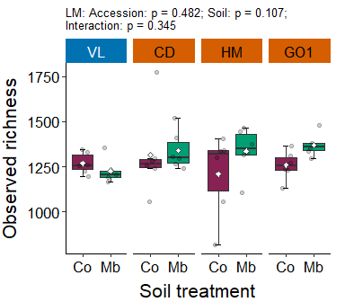<!-- -->

``` r
mapply(function(x)
  ggsave(plot = last_plot(), 
         filename = x,
         path = "C:/Users/kreek001/OneDrive - Wageningen University & Research/Chapters/Experimental Chapter 3/Result/Final graphs",
         scale = 2.2,
         width = 4.05,
         height = 3.9,
         units = "cm",
         dpi = 300),
  x = c("FP_AlphaDiv_obs_acc.svg", "FP_AlphaDiv_obs_acc.png"))
```

```
##                                                                                                                     FP_AlphaDiv_obs_acc.svg 
## "C:/Users/kreek001/OneDrive - Wageningen University & Research/Chapters/Experimental Chapter 3/Result/Final graphs/FP_AlphaDiv_obs_acc.svg" 
##                                                                                                                     FP_AlphaDiv_obs_acc.png 
## "C:/Users/kreek001/OneDrive - Wageningen University & Research/Chapters/Experimental Chapter 3/Result/Final graphs/FP_AlphaDiv_obs_acc.png"
```

### Data preperation Shannon diversity post hoc per accession

``` r
strip0 <- strip_themed(background_x = elem_list_rect(fill = c(rep("#0072B2", 1), rep("#D55E00", 3))),
                       text_x = elem_list_text(colour = c(rep("white", 1), rep("black", 3))))

# Add statistical info
ph_sh$Lab <- gsub(pattern = " ", replacement = "", x = ph_sh$.group)
ph_sh$Accession <- factor(ph_sh$Accession, levels = c("VL", "CD", "HM", "GO1"))
ph_sh <- ph_sh[order(ph_sh$Accession), ]

Stats_sh <- paste0("GLMM: Accession: p < ", 0.001, "; Soil: p = ", 0.041, ";\nInteraction: p < ", 0.001)
```

### Boxplot Shannon diversity

``` r
ggplot(data = total_diversity,
       mapping = aes(y = Shannon, x = Soil_conditioning, fill = Soil_conditioning)) + #Defines the data
  stat_boxplot(aes(y = Shannon, x = Soil_conditioning), #Shows the error bars (should be added before box plots to have bars behind box plots)
               geom = "errorbar",
               linetype = 1,
               width = 0.2) +
  facet_wrap2(~ Accession, #facet wrap2 needed to color strip
             nrow = 1,
             strip = strip0
             #labeller = labeller(CaterpillarNr = c("4" = "4 Cat", "8" = "8 Cat"))
             ) + # Split data into three graphs, a graph for each caterpillar number
  geom_boxplot(outliers = FALSE) + #Defines that the graph will be a box plot and do not show outliers, this is shown by jitter
  geom_jitter(width = 0.25,
              height = 0,
              color = "black",
              alpha = 0.2) + # Transparency is regulated with the alpha argument
  stat_summary(fun = mean, 
               geom = "point", 
               size = 1.5, 
               color = "gray30", 
               fill = "white",
               shape = 23) + #Shows the mean as a white circle
  #geom_segment(aes(x = 0.8, y = 6.7, xend = 2.2, yend = 6.7)) +
  geom_text(data = ph_sh,
            aes(label = Lab, y = 6.75, x = 1.5), # fill out the significant letters
            size = 4,
            #hjust = 0.5,
            position = position_dodge(2)) +
  ggtitle(Stats_sh) +
  # scale_y_continuous(expand = c(0, 0),        #start graph at y = min and x = min
  #                    #breaks = seq(0, 1, 0.25), #steps on the y-axis
  #                    limits = c(0, max(total_diversity$Shannon*1.1))) +   #y limits
  scale_fill_manual(values = c("#882255", "#009E73")) + # Manually change the colors of the bars. You need to define fill in second line of the plot script to get it working; c("#009E73", "#56B4E9")
  ylab("Shannon diversity") +    #y-label with Mb in italic
  xlab("Soil treatment") +
  theme(panel.background = element_rect(fill = "white"), #theme of the graph
        panel.border = element_blank(),
        axis.line = element_line(), #show line for x and y axis
        plot.title = element_text(size = 10, hjust = 0),
        axis.text = element_text(size = 13, color = "black"),
        axis.title = element_text(size = 16),
        axis.title.x = element_text(vjust = -0.5),
        axis.title.y = element_text(vjust = 2.5), #, hjust = -0
        strip.text = element_text(size = 13),
        plot.margin = margin(5.5, 12, 5.5, 5.5, "points"),
        legend.position = "none")
```

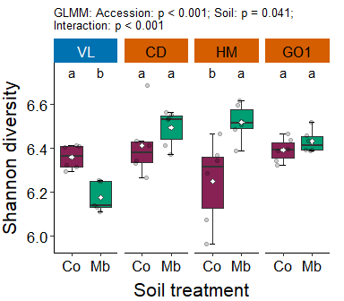<!-- -->

### Data preperation Shannon diversity post hoc per all accessions together

``` r
# Add statistical info
ph_sh2$Lab <- gsub(pattern = " ", replacement = "", x = ph_sh2$.group)
ph_sh2$Accession <- factor(ph_sh2$Accession, levels = c("VL", "CD", "HM", "GO1"))
ph_sh2 <- ph_sh2[order(ph_sh2$Accession), ]
```

### Boxplot Shannon diversity

``` r
ggplot(data = total_diversity,
       mapping = aes(y = Shannon, x = Soil_conditioning, fill = Soil_conditioning)) + #Defines the data
  stat_boxplot(aes(y = Shannon, x = Soil_conditioning), #Shows the error bars (should be added before box plots to have bars behind box plots)
               geom = "errorbar",
               linetype = 1,
               width = 0.2) +
  facet_wrap2(~ Accession, #facet wrap2 needed to color strip
             nrow = 1,
             strip = strip0
             #labeller = labeller(CaterpillarNr = c("4" = "4 Cat", "8" = "8 Cat"))
             ) + # Split data into three graphs, a graph for each caterpillar number
  geom_boxplot(outliers = FALSE) + #Defines that the graph will be a box plot and do not show outliers, this is shown by jitter
  geom_jitter(width = 0.25,
              height = 0,
              color = "black",
              alpha = 0.2) + # Transparency is regulated with the alpha argument
  stat_summary(fun = mean, 
               geom = "point", 
               size = 1.5, 
               color = "gray30", 
               fill = "white",
               shape = 23) + #Shows the mean as a white circle
  #geom_segment(aes(x = 0.8, y = 6.8, xend = 2.2, yend = 6.8)) +
  geom_text(data = ph_sh2,
            aes(label = Lab, y = 6.75, x = 1.5), # fill out the significant letters
            size = 4,
            #hjust = 0.5,
            position = position_dodge(2)) +
  ggtitle(Stats_sh) +
  # scale_y_continuous(expand = c(0, 0),        #start graph at y = min and x = min
  #                    #breaks = seq(0, 1, 0.25), #steps on the y-axis
  #                    limits = c(0, max(total_diversity$Shannon*1.1))) +   #y limits
  scale_fill_manual(values = c("#882255", "#009E73")) + # Manually change the colors of the bars. You need to define fill in second line of the plot script to get it working; c("#009E73", "#56B4E9")
  ylab("Shannon diversity") +    #y-label with Mb in italic
  xlab("Soil treatment") +
  theme(panel.background = element_rect(fill = "white"), #theme of the graph
        panel.border = element_blank(), #no border around the graph (for border, use: element_rect(color = "gray30", fill = NA))
        axis.line = element_line(), #show line for x and y axis
        plot.title = element_text(size = 10, hjust = 0),
        axis.text = element_text(size = 13, color = "black"),
        axis.title = element_text(size = 16),
        axis.title.x = element_text(vjust = -0.5),
        axis.title.y = element_text(vjust = 2.5), #, hjust = -0
        strip.text = element_text(size = 13),
        plot.margin = margin(5.5, 12, 5.5, 5.5, "points"),
        legend.position = "none")
```

<!-- -->

``` r
mapply(function(x)
  ggsave(plot = last_plot(), 
         filename = x,
         path = "C:/Users/kreek001/OneDrive - Wageningen University & Research/Chapters/Experimental Chapter 3/Result/Final graphs",
         scale = 2.2,
          width = 4.05,
         height = 3.9,
         units = "cm",
         dpi = 300),
  x = c("FP_AlphaDiv_shan_acc.svg", "FP_AlphaDiv_shan_acc.png"))
```

```
##                                                                                                                     FP_AlphaDiv_shan_acc.svg 
## "C:/Users/kreek001/OneDrive - Wageningen University & Research/Chapters/Experimental Chapter 3/Result/Final graphs/FP_AlphaDiv_shan_acc.svg" 
##                                                                                                                     FP_AlphaDiv_shan_acc.png 
## "C:/Users/kreek001/OneDrive - Wageningen University & Research/Chapters/Experimental Chapter 3/Result/Final graphs/FP_AlphaDiv_shan_acc.png"
```

### Figure PSF effect

``` r
stats_PSF <- data.frame(Stats = c("*", "", "*", ""),
                        Accession = c("VL", "CD", "HM", "GO1"))  
```


``` r
ggplot(data = EMM_mod_df,
       mapping = aes(y = estimate, x = Accession)) + #Defines the data
  geom_hline(yintercept = 0, 
             colour = "gray30") +
  geom_errorbar(aes(ymin = asymp.LCL, ymax = asymp.UCL), 
                color = c(rep("#0072B2", 1), rep("#D55E00", 3)),
                linewidth = 1,
                width = 0.3) +
  geom_point(aes(y = estimate, x = Accession),
             size = 2) +
  geom_text(data = stats_PSF,
            aes(label = Stats, y = 0.065, x = Accession), # fill out the significant letters
            size = 8,
            #hjust = 0.5,
            #position = position_dodge(2)
            ) +
  scale_y_continuous(breaks = seq(-0.03, 0.06, 0.03),
                     limits = c(-0.05, 0.07)) + #steps on the y-axis
  ggtitle(Stats_sh) +
  ylab("PSF ratio") +    #y-label with Mb in italic
  xlab("Accession") +
  theme(panel.background = element_rect(fill = "white"), #theme of the graph
        panel.border = element_blank(),
        axis.line = element_line(), #show line for x and y axis
        plot.title = element_text(size = 10, hjust = 0),
        axis.text = element_text(size = 13, color = "black"),
        axis.title = element_text(size = 16),
        axis.title.x = element_text(vjust = -0.5),
        axis.title.y = element_text(vjust = 2.5), #, hjust = -0
        strip.text = element_text(size = 13),
        plot.margin = margin(5.5, 12, 5.5, 5.5, "points"),
        legend.position = "none")
```

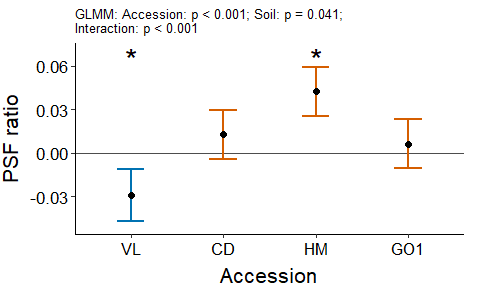<!-- -->

``` r
mapply(function(x)
  ggsave(plot = last_plot(), 
         filename = x,
         path = "C:/Users/kreek001/OneDrive - Wageningen University & Research/Chapters/Experimental Chapter 3/Result/Final graphs",
         scale = 2.2,
         width = 3,
         height = 3,
         units = "cm",
         dpi = 300),
  x = c("PF_PSF_ratio_shan_Acc.svg", "PF_PSF_ratio_Shan_Acc.png"))
```

```
##                                                                                                                     PF_PSF_ratio_shan_Acc.svg 
## "C:/Users/kreek001/OneDrive - Wageningen University & Research/Chapters/Experimental Chapter 3/Result/Final graphs/PF_PSF_ratio_shan_Acc.svg" 
##                                                                                                                     PF_PSF_ratio_Shan_Acc.png 
## "C:/Users/kreek001/OneDrive - Wageningen University & Research/Chapters/Experimental Chapter 3/Result/Final graphs/PF_PSF_ratio_Shan_Acc.png"
```
