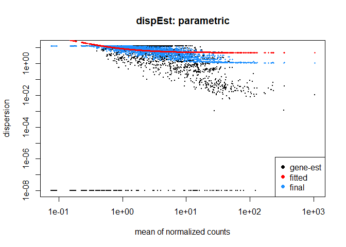
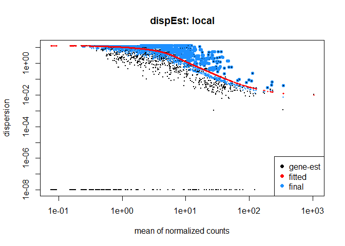
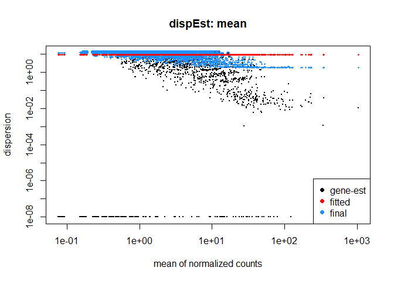
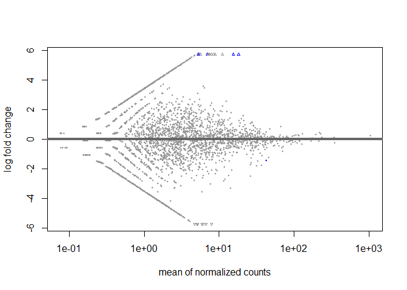
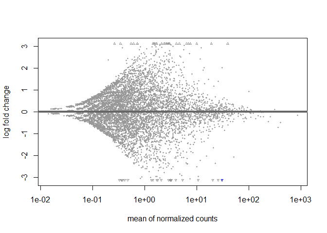
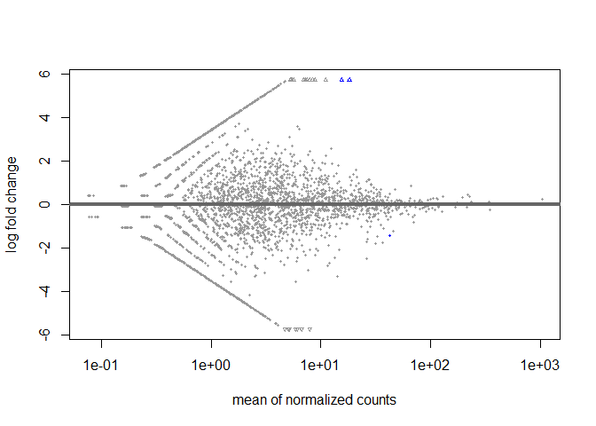
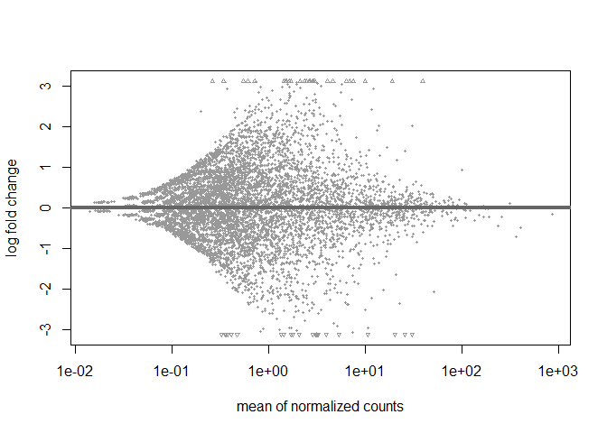

This script is adapted from a script form Melissa Uribe Acosta. Extra input comes from a script of Pedro Beschore da Costa.   
   
   
Tutorials   
- [Base tutorial on DESeq2](https://joey711.github.io/phyloseq-extensions/DESeq2.html)   
- [Elaborate tutorial on DESeq2](https://bioconductor.org/packages/devel/bioc/vignettes/DESeq2/inst/doc/DESeq2.html)   
- [Setting contrasts in DESeq2](https://www.atakanekiz.com/technical/a-guide-to-designs-and-contrasts-in-DESeq2/)   
- [More information on contrast](https://www.biostars.org/p/9597417/)   
- [Heatmap for final plot](http://rstudio-pubs-static.s3.amazonaws.com/288398_185f2889a5f641c6b9aa7b14fa15b635.html)   
   
   
# 5.0 load libraries, improve memory use and subset objects for the desired treatment comparisons
### Load libraries

``` r
R.version$version.string # prints R version
```

```
## [1] "R version 4.5.1 (2025-06-13 ucrt)"
```

``` r
library(phyloseq)
packageVersion("phyloseq")
```

```
## [1] '1.52.0'
```

``` r
library(metamisc) #for phyloseq_sep_variable (and more?)
packageVersion("metamisc")
```

```
## [1] '0.4.0'
```

``` r
library(DESeq2)
packageVersion("DESeq2")
```

```
## [1] '1.48.2'
```

``` r
library(zinbwave)
packageVersion("zinbwave")
```

```
## [1] '1.30.0'
```

### Load data without unplanted CTRL and Co caterpillar treatment

``` r
load(file = "C:/Users/kreek001/OneDrive - Wageningen University & Research/Chapters/Experimental Chapter 3/RScripts/GitHub/TwelveAccessionExperiment/MicrobiomeAnalysis/Data/Phyloseq_objects/FP_unnormalized_bac_ps_ForDA_clean_Acc.RData")
load("C:/Users/kreek001/OneDrive - Wageningen University & Research/Chapters/Experimental Chapter 3/RScripts/GitHub/TwelveAccessionExperiment/MicrobiomeAnalysis/Data/Phyloseq_objects/FP_unnormalized_bac_ps_ForDA_clean.RData")
```

#### Remove Batch 1

``` r
FP_unnormalized_bac_ps_ForDA_clean_Acc <- lapply(FP_unnormalized_bac_ps_ForDA_clean_Acc, function(x) subset_samples(x, Batch != 1))
FP_unnormalized_bac_ps_ForDA_clean <- subset_samples(FP_unnormalized_bac_ps_ForDA_clean, Batch != 1)
```


### For ZINBWAve, remove taxa with a total sum of 0
#### Seperate to each accession

``` r
lapply(FP_unnormalized_bac_ps_ForDA_clean_Acc, function(x) summary(taxa_sums(x)))
```

```
## $VL
##     Min.  1st Qu.   Median     Mean  3rd Qu.     Max. 
##     1.00     4.00    10.00    51.74    29.00 12290.00 
## 
## $CD
##    Min. 1st Qu.  Median    Mean 3rd Qu.    Max. 
##    0.00    1.00    6.00   41.98   21.00 8415.00 
## 
## $RI
##     Min.  1st Qu.   Median     Mean  3rd Qu.     Max. 
##     0.00     0.00     1.00    24.03    10.00 15378.00 
## 
## $HM
##    Min. 1st Qu.  Median    Mean 3rd Qu.    Max. 
##    1.00    4.00   10.00   51.69   31.00 9042.00 
## 
## $GO1
##     Min.  1st Qu.   Median     Mean  3rd Qu.     Max. 
##     0.00     1.00     6.00    43.69    22.00 12655.00
```

``` r
Acc_unnorm_bac_ps_l_filtered <- lapply(FP_unnormalized_bac_ps_ForDA_clean_Acc, function(x)
         prune_taxa(taxa_sums(x)>0, x))

save(Acc_unnorm_bac_ps_l_filtered, file = "C:/Users/kreek001/OneDrive - Wageningen University & Research/Chapters/Experimental Chapter 3/RScripts/GitHub/TwelveAccessionExperiment/MicrobiomeAnalysis/Data/Phyloseq_objects/FP_DA_DESeq_ASVLevel/Acc_unnorm_bac_ps_l_filtered.RData")
```
At this moment, filtered and unfiltered object are the same.

#### All data together

``` r
summary(taxa_sums(FP_unnormalized_bac_ps_ForDA_clean))
```

```
##    Min. 1st Qu.  Median    Mean 3rd Qu.    Max. 
##     0.0     6.0    18.0   144.7    58.0 46286.0
```

``` r
All_unnorm_bac_ps_filtered <- prune_taxa(taxa_sums(FP_unnormalized_bac_ps_ForDA_clean)>0, FP_unnormalized_bac_ps_ForDA_clean)

save(All_unnorm_bac_ps_filtered, file = "C:/Users/kreek001/OneDrive - Wageningen University & Research/Chapters/Experimental Chapter 3/RScripts/GitHub/TwelveAccessionExperiment/MicrobiomeAnalysis/Data/Phyloseq_objects/FP_DA_DESeq_ASVLevel/All_unnorm_bac_ps_filtered.RData")
```

``` r
# Clean environment
rm(list = ls())
```


# 5.1 DeSeq and ZINBDeSeq
## 5.1.1 Convert phyloseq object to DeSeq object with lists

``` r
# Accession unfiltered
load(file = "C:/Users/kreek001/OneDrive - Wageningen University & Research/Chapters/Experimental Chapter 3/RScripts/GitHub/TwelveAccessionExperiment/MicrobiomeAnalysis/Data/Phyloseq_objects/FP_unnormalized_bac_ps_ForDA_clean_Acc.RData")

FP_unnormalized_bac_ps_ForDA_clean_Acc <- lapply(FP_unnormalized_bac_ps_ForDA_clean_Acc, function(x) subset_samples(x, Batch != 1))
dds_Acc_unnorm_bac_ps_l_unfilt <- lapply(FP_unnormalized_bac_ps_ForDA_clean_Acc, function(x) phyloseq_to_deseq2(x, ~ Soil_conditioning))
```

```
## converting counts to integer mode
## converting counts to integer mode
## converting counts to integer mode
## converting counts to integer mode
## converting counts to integer mode
```

``` r
save(dds_Acc_unnorm_bac_ps_l_unfilt, file = "C:/Users/kreek001/OneDrive - Wageningen University & Research/Chapters/Experimental Chapter 3/RScripts/GitHub/TwelveAccessionExperiment/MicrobiomeAnalysis/Data/Phyloseq_objects/FP_DA_DESeq_ASVLevel/dds_Acc_unnorm_bac_ps_l_unfilt.RData")
rm(FP_unnormalized_bac_ps_ForDA_clean_Acc, dds_Acc_unnorm_bac_ps_l_unfilt)

# Accession filtered
load(file = "C:/Users/kreek001/OneDrive - Wageningen University & Research/Chapters/Experimental Chapter 3/RScripts/GitHub/TwelveAccessionExperiment/MicrobiomeAnalysis/Data/Phyloseq_objects/FP_DA_DESeq_ASVLevel/Acc_unnorm_bac_ps_l_filtered.RData")
dds_Acc_unnorm_bac_ps_l_filtered <- lapply(Acc_unnorm_bac_ps_l_filtered, function(x) phyloseq_to_deseq2(x, ~ Soil_conditioning))
```

```
## converting counts to integer mode
## converting counts to integer mode
## converting counts to integer mode
## converting counts to integer mode
## converting counts to integer mode
```

``` r
save(dds_Acc_unnorm_bac_ps_l_filtered, file = "C:/Users/kreek001/OneDrive - Wageningen University & Research/Chapters/Experimental Chapter 3/RScripts/GitHub/TwelveAccessionExperiment/MicrobiomeAnalysis/Data/Phyloseq_objects/FP_DA_DESeq_ASVLevel/dds_Acc_unnorm_bac_ps_l_filtered.RData")
rm(Acc_unnorm_bac_ps_l_filtered, dds_Acc_unnorm_bac_ps_l_filtered)

# All data unfiltered
load("C:/Users/kreek001/OneDrive - Wageningen University & Research/Chapters/Experimental Chapter 3/RScripts/GitHub/TwelveAccessionExperiment/MicrobiomeAnalysis/Data/Phyloseq_objects/FP_unnormalized_bac_ps_ForDA_clean.RData")

FP_unnormalized_bac_ps_ForDA_clean <- subset_samples(FP_unnormalized_bac_ps_ForDA_clean, Batch != 1)
dds_All_unnorm_bac_ps_unfilt <- phyloseq_to_deseq2(FP_unnormalized_bac_ps_ForDA_clean, ~ Accession + Soil_conditioning)
```

```
## converting counts to integer mode
```

``` r
save(dds_All_unnorm_bac_ps_unfilt, file = "C:/Users/kreek001/OneDrive - Wageningen University & Research/Chapters/Experimental Chapter 3/RScripts/GitHub/TwelveAccessionExperiment/MicrobiomeAnalysis/Data/Phyloseq_objects/FP_DA_DESeq_ASVLevel/dds_All_unnorm_bac_ps_unfilt.RData")
rm(FP_unnormalized_bac_ps_ForDA_clean, dds_All_unnorm_bac_ps_unfilt)

# All data filtered
load(file = "C:/Users/kreek001/OneDrive - Wageningen University & Research/Chapters/Experimental Chapter 3/RScripts/GitHub/TwelveAccessionExperiment/MicrobiomeAnalysis/Data/Phyloseq_objects/FP_DA_DESeq_ASVLevel/All_unnorm_bac_ps_filtered.RData")
dds_All_unnorm_bac_ps_filtered <- phyloseq_to_deseq2(All_unnorm_bac_ps_filtered, ~ Accession + Soil_conditioning)
```

```
## converting counts to integer mode
```

``` r
save(dds_All_unnorm_bac_ps_filtered, file = "C:/Users/kreek001/OneDrive - Wageningen University & Research/Chapters/Experimental Chapter 3/RScripts/GitHub/TwelveAccessionExperiment/MicrobiomeAnalysis/Data/Phyloseq_objects/FP_DA_DESeq_ASVLevel/dds_All_unnorm_bac_ps_filtered.RData")
rm(All_unnorm_bac_ps_filtered, dds_All_unnorm_bac_ps_filtered)
```

### Checking which fitType fits best
Testing with one accession

``` r
load(file = "C:/Users/kreek001/OneDrive - Wageningen University & Research/Chapters/Experimental Chapter 3/RScripts/GitHub/TwelveAccessionExperiment/MicrobiomeAnalysis/Data/Phyloseq_objects/FP_DA_DESeq_ASVLevel/dds_Acc_unnorm_bac_ps_l_unfilt.RData")

DDS <- estimateSizeFactors(dds_Acc_unnorm_bac_ps_l_unfilt$GO1)
par <- estimateDispersions(DDS, fitType = "parametric")
```

```
## gene-wise dispersion estimates
```

```
## mean-dispersion relationship
```

```
## final dispersion estimates
```

``` r
loc <- estimateDispersions(DDS, fitType = "local")
```

```
## gene-wise dispersion estimates
```

```
## mean-dispersion relationship
```

```
## final dispersion estimates
```

``` r
mea <- estimateDispersions(DDS, fitType = "mean")
```

```
## gene-wise dispersion estimates
```

```
## mean-dispersion relationship
```

```
## final dispersion estimates
```

``` r
plotDispEsts(par, main = "dispEst: parametric")
```

<!-- -->

``` r
plotDispEsts(loc, main = "dispEst: local")
```

<!-- -->

``` r
plotDispEsts(mea, main = "dispEst: mean")
```

<!-- -->

``` r
# residual <- mcols(DDS)$dispGeneEst - mcols(DDS)$dispFit
# plotMA(residual)

rm(DDS, par, loc, mea)
```
The plot of local looks best.

## 5.1.2 DESeq with Wald test
### Per Accession
#### Run DESeq object

``` r
# Standard DESeq
stddds2_Wald_Acc_Bac <- lapply(dds_Acc_unnorm_bac_ps_l_unfilt, function(x) 
                  DESeq(x, 
                  test = "Wald",  
                  minReplicatesForReplace = Inf, # not replacing outliers
                  fitType = "local")) 
```

```
## estimating size factors
```

```
## estimating dispersions
```

```
## gene-wise dispersion estimates
```

```
## mean-dispersion relationship
```

```
## final dispersion estimates
```

```
## fitting model and testing
```

```
## estimating size factors
```

```
## estimating dispersions
```

```
## gene-wise dispersion estimates
```

```
## mean-dispersion relationship
```

```
## final dispersion estimates
```

```
## fitting model and testing
```

```
## estimating size factors
```

```
## estimating dispersions
```

```
## gene-wise dispersion estimates
```

```
## mean-dispersion relationship
```

```
## final dispersion estimates
```

```
## fitting model and testing
```

```
## estimating size factors
```

```
## estimating dispersions
```

```
## gene-wise dispersion estimates
```

```
## mean-dispersion relationship
```

```
## final dispersion estimates
```

```
## fitting model and testing
```

```
## estimating size factors
```

```
## estimating dispersions
```

```
## gene-wise dispersion estimates
```

```
## mean-dispersion relationship
```

```
## final dispersion estimates
```

```
## fitting model and testing
```

``` r
# Print results for GO1
res <- results(stddds2_Wald_Acc_Bac$GO1, alpha = 0.1)
res
```

```
## log2 fold change (MLE): Soil conditioning Mb vs Co 
## Wald test p-value: Soil conditioning Mb vs Co 
## DataFrame with 6307 rows and 6 columns
##              baseMean log2FoldChange     lfcSE      stat    pvalue      padj
##             <numeric>      <numeric> <numeric> <numeric> <numeric> <numeric>
## bASV_1        350.292      -0.240791 0.1677879 -1.435092  0.151261  0.990956
## bASV_2        339.769       0.127062 0.0833207  1.524976  0.127265  0.990956
## bASV_3        212.310      -0.111454 0.1276618 -0.873040  0.382641  0.990956
## bASV_4        167.073      -0.126330 0.1261319 -1.001571  0.316551  0.990956
## bASV_5        102.757      -0.147668 0.1528952 -0.965812  0.334138  0.990956
## ...               ...            ...       ...       ...       ...       ...
## bASV_100929 0.1537989       0.868315   3.11654  0.278615  0.780540  0.990956
## bASV_197604 0.0809575      -0.574363   3.11654 -0.184295  0.853782  0.990956
## bASV_199795 0.0000000             NA        NA        NA        NA        NA
## bASV_203575 0.0771227       0.387422   3.11654  0.124312  0.901069  0.990956
## bASV_204649 0.0784821       0.387422   3.11654  0.124312  0.901069  0.990956
```

``` r
summary(res)
```

```
## 
## out of 4830 with nonzero total read count
## adjusted p-value < 0.1
## LFC > 0 (up)       : 4, 0.083%
## LFC < 0 (down)     : 1, 0.021%
## outliers [1]       : 147, 3%
## low counts [2]     : 0, 0%
## (mean count < 0)
## [1] see 'cooksCutoff' argument of ?results
## [2] see 'independentFiltering' argument of ?results
```

``` r
# Number of p-values smaller than 0.1
sum(res$padj < 0.1, na.rm = TRUE)
```

```
## [1] 5
```

``` r
# Plot output: blue dots have p-values below 0.1
plotMA(res)
```

<!-- -->

``` r
# Save DESeq object
save(stddds2_Wald_Acc_Bac, file = "C:/Users/kreek001/OneDrive - Wageningen University & Research/Chapters/Experimental Chapter 3/RScripts/GitHub/TwelveAccessionExperiment/MicrobiomeAnalysis/Data/Phyloseq_objects/FP_DA_DESeq_ASVLevel/stddds2_Wald_Acc_Bac.RData")
```

#### Creat data frame and shrink data

``` r
# Data frame generation
# "Adds shrunken log2 fold changes (LFC) and SE to a results table from DESeq run without LFC shrinkage"
lfcres_stddds2_Wald_Acc_Bac <- lapply(stddds2_Wald_Acc_Bac, function(x) lfcShrink(x, coef = "Soil_conditioning_Mb_vs_Co", type = "normal")) #type is type of shrinkage estimator
```

```
## using 'normal' for LFC shrinkage, the Normal prior from Love et al (2014).
## 
## Note that type='apeglm' and type='ashr' have shown to have less bias than type='normal'.
## See ?lfcShrink for more details on shrinkage type, and the DESeq2 vignette.
## Reference: https://doi.org/10.1093/bioinformatics/bty895
## using 'normal' for LFC shrinkage, the Normal prior from Love et al (2014).
## 
## Note that type='apeglm' and type='ashr' have shown to have less bias than type='normal'.
## See ?lfcShrink for more details on shrinkage type, and the DESeq2 vignette.
## Reference: https://doi.org/10.1093/bioinformatics/bty895
## using 'normal' for LFC shrinkage, the Normal prior from Love et al (2014).
## 
## Note that type='apeglm' and type='ashr' have shown to have less bias than type='normal'.
## See ?lfcShrink for more details on shrinkage type, and the DESeq2 vignette.
## Reference: https://doi.org/10.1093/bioinformatics/bty895
## using 'normal' for LFC shrinkage, the Normal prior from Love et al (2014).
## 
## Note that type='apeglm' and type='ashr' have shown to have less bias than type='normal'.
## See ?lfcShrink for more details on shrinkage type, and the DESeq2 vignette.
## Reference: https://doi.org/10.1093/bioinformatics/bty895
## using 'normal' for LFC shrinkage, the Normal prior from Love et al (2014).
## 
## Note that type='apeglm' and type='ashr' have shown to have less bias than type='normal'.
## See ?lfcShrink for more details on shrinkage type, and the DESeq2 vignette.
## Reference: https://doi.org/10.1093/bioinformatics/bty895
```

``` r
# Save file
save(lfcres_stddds2_Wald_Acc_Bac, file = "C:/Users/kreek001/OneDrive - Wageningen University & Research/Chapters/Experimental Chapter 3/RScripts/GitHub/TwelveAccessionExperiment/MicrobiomeAnalysis/Data/Phyloseq_objects/FP_DA_DESeq_ASVLevel/lfcres_stddds2_Wald_Acc_Bac.RData")
```

#### Filter p-values

``` r
#Filter to only p adjusted under alpha
alpha = 0.05
sigtab_stddds2_Wald_Acc_Bac <- lapply(lfcres_stddds2_Wald_Acc_Bac, function(x) x[which(x$padj < alpha), ])
sigtab_stddds2_Wald_Acc_Bac
```

```
## $VL
## log2 fold change (MAP): Soil conditioning Mb vs Co 
## Wald test p-value: Soil conditioning Mb vs Co 
## DataFrame with 17 rows and 6 columns
##            baseMean log2FoldChange     lfcSE      stat      pvalue        padj
##           <numeric>      <numeric> <numeric> <numeric>   <numeric>   <numeric>
## bASV_7    1096.2949        1.16295  0.142007   8.18925 2.62854e-16 3.07014e-13
## bASV_27    122.0061        0.69245  0.165010   4.19629 2.71319e-05 2.26357e-03
## bASV_126   185.3166        1.18749  0.147428   8.05380 8.02655e-16 4.68751e-13
## bASV_178   124.4162        1.05161  0.198488   5.29748 1.17409e-07 1.71417e-05
## bASV_329    51.8148       -1.38757  0.296997  -4.66568 3.07602e-06 3.26617e-04
## ...             ...            ...       ...       ...         ...         ...
## bASV_1345  11.87238        4.56137  0.720106   6.17457 6.63440e-10 1.29150e-07
## bASV_1539  10.69071       -4.25044  0.711395  -5.78823 7.11316e-09 1.18688e-06
## bASV_1962   7.23952       -3.30483  0.753121  -4.47194 7.75121e-06 6.96417e-04
## bASV_2120  11.33947       -2.71961  0.680260  -3.87838 1.05156e-04 8.18816e-03
## bASV_2578   8.84054       -3.30865  0.755552  -4.53831 5.67078e-06 5.51956e-04
## 
## $CD
## log2 fold change (MAP): Soil conditioning Mb vs Co 
## Wald test p-value: Soil conditioning Mb vs Co 
## DataFrame with 12 rows and 6 columns
##            baseMean log2FoldChange     lfcSE      stat      pvalue        padj
##           <numeric>      <numeric> <numeric> <numeric>   <numeric>   <numeric>
## bASV_61     95.7358       0.806719  0.239552   3.36713 7.59552e-04 4.56364e-02
## bASV_141    27.4485      -3.730301  0.765423  -5.49192 3.97581e-08 9.55520e-06
## bASV_214    86.8479      -0.939413  0.247872  -3.78915 1.51166e-04 1.55701e-02
## bASV_288    15.6411      -1.614715  0.745691  -3.37067 7.49849e-04 4.56364e-02
## bASV_302    32.9639       1.356354  0.374302   3.61854 2.96267e-04 2.37342e-02
## ...             ...            ...       ...       ...         ...         ...
## bASV_444    42.6174        1.15638  0.324419   3.56145 3.68809e-04 2.65912e-02
## bASV_729     9.6581       -2.80756  0.749560  -3.68174 2.31646e-04 2.08771e-02
## bASV_900    25.4348        5.99905  0.642156   8.70089 3.29291e-18 2.37419e-15
## bASV_1055   16.1870        3.83156  0.758957   5.30074 1.15333e-07 2.07887e-05
## bASV_1652   11.1014       -4.40346  0.724565  -5.95938 2.53196e-09 9.12770e-07
## 
## $RI
## log2 fold change (MAP): Soil conditioning Mb vs Co 
## Wald test p-value: Soil conditioning Mb vs Co 
## DataFrame with 5 rows and 6 columns
##            baseMean log2FoldChange     lfcSE      stat      pvalue        padj
##           <numeric>      <numeric> <numeric> <numeric>   <numeric>   <numeric>
## bASV_90     21.1802       -5.50880  0.997514  -5.32531 1.00778e-07 1.22950e-04
## bASV_136    12.8661       -4.47471  1.075987  -4.10494 4.04424e-05 2.96038e-02
## bASV_980    48.3687        7.50171  0.910166   7.99492 1.29660e-15 4.74555e-12
## bASV_1525   18.8661        5.97672  1.014801   5.79072 7.00853e-09 1.28256e-05
## bASV_1956   13.2283       -4.52544  1.072555  -4.15923 3.19328e-05 2.92185e-02
## 
## $HM
## log2 fold change (MAP): Soil conditioning Mb vs Co 
## Wald test p-value: Soil conditioning Mb vs Co 
## DataFrame with 55 rows and 6 columns
##            baseMean log2FoldChange     lfcSE      stat      pvalue        padj
##           <numeric>      <numeric> <numeric> <numeric>   <numeric>   <numeric>
## bASV_1     334.0122      -0.741834  0.189051  -3.92394 8.71116e-05 3.57448e-03
## bASV_3     202.6404      -0.740260  0.174914  -4.23207 2.31545e-05 1.14013e-03
## bASV_7     811.5836      -1.959713  0.127607 -15.35662 3.19825e-53 3.93704e-50
## bASV_42    268.1805      -0.724431  0.151308  -4.78776 1.68652e-06 1.09268e-04
## bASV_62     72.0315      -0.795806  0.242929  -3.27579 1.05367e-03 3.01099e-02
## ...             ...            ...       ...       ...         ...         ...
## bASV_3920   5.26044        3.11474  0.976365   3.25171 1.14714e-03 3.11979e-02
## bASV_3962   6.16391        2.99899  0.981039   3.21759 1.29271e-03 3.18266e-02
## bASV_4395  15.16251        2.14339  0.983121   3.10744 1.88713e-03 4.38313e-02
## bASV_5795   8.82593        4.50903  0.901927   4.95104 7.38177e-07 5.72164e-05
## bASV_6504   6.69965        3.57668  0.959956   3.75375 1.74212e-04 6.30750e-03
## 
## $GO1
## log2 fold change (MAP): Soil conditioning Mb vs Co 
## Wald test p-value: Soil conditioning Mb vs Co 
## DataFrame with 4 rows and 6 columns
##            baseMean log2FoldChange     lfcSE      stat      pvalue        padj
##           <numeric>      <numeric> <numeric> <numeric>   <numeric>   <numeric>
## bASV_426   42.20389       -1.31992  0.290130  -4.54104 5.59787e-06 0.008738275
## bASV_477   15.57720        2.18212  0.525357   5.23234 1.67381e-07 0.000391922
## bASV_1003  18.20142        2.10661  0.523824   5.27828 1.30403e-07 0.000391922
## bASV_1060   7.00413        1.77754  0.517395   4.18770 2.81792e-05 0.032990770
```

``` r
# Safe file
save(sigtab_stddds2_Wald_Acc_Bac, file = "C:/Users/kreek001/OneDrive - Wageningen University & Research/Chapters/Experimental Chapter 3/RScripts/GitHub/TwelveAccessionExperiment/MicrobiomeAnalysis/Data/Phyloseq_objects/FP_DA_DESeq_ASVLevel/sigtab_stddds2_Wald_Acc_Bac.RData")

# Clean environment
rm(list = ls())
```

### All data
#### Run DESeq object

``` r
load(file = "C:/Users/kreek001/OneDrive - Wageningen University & Research/Chapters/Experimental Chapter 3/RScripts/GitHub/TwelveAccessionExperiment/MicrobiomeAnalysis/Data/Phyloseq_objects/FP_DA_DESeq_ASVLevel/dds_All_unnorm_bac_ps_unfilt.RData")

# Standard DESeq
stddds2_Wald_All_Bac <- DESeq(dds_All_unnorm_bac_ps_unfilt, 
                              test = "Wald",
                              minReplicatesForReplace = Inf, # not replacing outliers
                              fitType = "local")
```

```
## estimating size factors
```

```
## estimating dispersions
```

```
## gene-wise dispersion estimates
```

```
## mean-dispersion relationship
```

```
## final dispersion estimates
```

```
## fitting model and testing
```

``` r
# stddds2_Wald_All_Bac_S <- DESeq(dds_All_unnorm_bac_ps_unfilt_S,
#                               test = "Wald",
#                               minReplicatesForReplace = Inf, # not replacing outliers
#                               fitType = "local")

# Print results
resultsNames(stddds2_Wald_All_Bac) # Show different contrasts, last one is default in result output
```

```
## [1] "Intercept"                  "Accession_CD_vs_VL"        
## [3] "Accession_RI_vs_VL"         "Accession_HM_vs_VL"        
## [5] "Accession_GO1_vs_VL"        "Soil_conditioning_Mb_vs_Co"
```

``` r
res <- results(stddds2_Wald_All_Bac, alpha = 0.1)
#res <- results(stddds2_Wald_All_Bac, alpha = 0.1, contrast = c("Soil_conditioning", "Co", "Mb")) # specifically setting a contrast
#res <- results(stddds2_Wald_All_Bac, alpha = 0.1, contrast = list("Soil_conditioning_Mb_vs_Co")) # alternative to specifically set a contrast
# I can compare CD and RI for instance by setting contrast like: contrast = list("Accession_CD_vs_VL", "Accession_RI_vs_VL")
res
```

```
## log2 fold change (MLE): Soil conditioning Mb vs Co 
## Wald test p-value: Soil conditioning Mb vs Co 
## DataFrame with 8329 rows and 6 columns
##              baseMean log2FoldChange     lfcSE        stat      pvalue
##             <numeric>      <numeric> <numeric>   <numeric>   <numeric>
## bASV_1        402.225     -0.4985041 0.1399668   -3.561587 0.000368619
## bASV_2        310.327      0.1103639 0.0681644    1.619084 0.105429230
## bASV_3        237.678     -0.4564428 0.1369883   -3.331983 0.000862296
## bASV_4        187.276     -0.0332096 0.0774108   -0.429005 0.667919659
## bASV_5        108.006     -0.2491917 0.1110553   -2.243851 0.024841977
## ...               ...            ...       ...         ...         ...
## bASV_197324 0.0570136     -0.0811741   2.94834 -0.02753214    0.978035
## bASV_197604 0.0348798      0.0283777   2.94834  0.00962496    0.992321
## bASV_199795 0.0345548     -0.1907268   2.94834 -0.06468955    0.948421
## bASV_203575 0.0554333      0.1578502   2.94834  0.05353866    0.957303
## bASV_204649 0.0384547      0.0383376   2.94834  0.01300310    0.989625
##                  padj
##             <numeric>
## bASV_1       0.823224
## bASV_2       0.999996
## bASV_3       0.998308
## bASV_4       0.999996
## bASV_5       0.999996
## ...               ...
## bASV_197324  0.999996
## bASV_197604  0.999996
## bASV_199795  0.999996
## bASV_203575  0.999996
## bASV_204649  0.999996
```

``` r
summary(res)
```

```
## 
## out of 7877 with nonzero total read count
## adjusted p-value < 0.1
## LFC > 0 (up)       : 0, 0%
## LFC < 0 (down)     : 1, 0.013%
## outliers [1]       : 217, 2.8%
## low counts [2]     : 0, 0%
## (mean count < 0)
## [1] see 'cooksCutoff' argument of ?results
## [2] see 'independentFiltering' argument of ?results
```

``` r
# resultsNames(stddds2_Wald_All_Bac_S) # Show different contrasts, last one is default in result output
# res_S <- results(stddds2_Wald_All_Bac_S, alpha = 0.1)
# res_S
# summary(res_S)

# Number of p-values smaller than 0.1
sum(res$padj < 0.1, na.rm = TRUE)
```

```
## [1] 1
```

``` r
# sum(res_S$padj < 0.1, na.rm = TRUE)

# Plot output: blue dots have p-values below 0.1
plotMA(res)
```

<!-- -->

``` r
# Save DESeq object
save(stddds2_Wald_All_Bac, file = "C:/Users/kreek001/OneDrive - Wageningen University & Research/Chapters/Experimental Chapter 3/RScripts/GitHub/TwelveAccessionExperiment/MicrobiomeAnalysis/Data/Phyloseq_objects/FP_DA_DESeq_ASVLevel/stddds2_Wald_All_Bac.RData")
```

#### Shrink data

``` r
# Data frame generation
# "Adds shrunken log2 fold changes (LFC) and SE to a results table from DESeq run without LFC shrinkage"
lfcres_stddds2_Wald_All_Bac <- lfcShrink(stddds2_Wald_All_Bac, coef = "Soil_conditioning_Mb_vs_Co", type = "normal") #type is type of shrinkage estimator
```

```
## using 'normal' for LFC shrinkage, the Normal prior from Love et al (2014).
## 
## Note that type='apeglm' and type='ashr' have shown to have less bias than type='normal'.
## See ?lfcShrink for more details on shrinkage type, and the DESeq2 vignette.
## Reference: https://doi.org/10.1093/bioinformatics/bty895
```

``` r
# Save file
save(lfcres_stddds2_Wald_All_Bac, file = "C:/Users/kreek001/OneDrive - Wageningen University & Research/Chapters/Experimental Chapter 3/RScripts/GitHub/TwelveAccessionExperiment/MicrobiomeAnalysis/Data/Phyloseq_objects/FP_DA_DESeq_ASVLevel/lfcres_stddds2_Wald_All_Bac.RData")
```

#### Filter p-values

``` r
#Filter to only p adjusted under alpha
alpha = 0.05
sigtab_stddds2_Wald_All_Bac <- lfcres_stddds2_Wald_All_Bac[which(lfcres_stddds2_Wald_All_Bac$padj < alpha), ]
sigtab_stddds2_Wald_All_Bac
```

```
## log2 fold change (MAP): Soil conditioning Mb vs Co 
## Wald test p-value: Soil conditioning Mb vs Co 
## DataFrame with 1 row and 6 columns
##           baseMean log2FoldChange     lfcSE      stat      pvalue        padj
##          <numeric>      <numeric> <numeric> <numeric>   <numeric>   <numeric>
## bASV_288   30.4092      -0.656496  0.373797  -5.37178 7.79641e-08 0.000597205
```

``` r
# Safe file
save(sigtab_stddds2_Wald_All_Bac, file = "C:/Users/kreek001/OneDrive - Wageningen University & Research/Chapters/Experimental Chapter 3/RScripts/GitHub/TwelveAccessionExperiment/MicrobiomeAnalysis/Data/Phyloseq_objects/FP_DA_DESeq_ASVLevel/sigtab_stddds2_Wald_All_Bac.RData")

# Clean environment
rm(list = ls())
```

## 5.1.3 DESeq with LRT test
### Per Accession
#### Run DESeq object

``` r
load(file = "C:/Users/kreek001/OneDrive - Wageningen University & Research/Chapters/Experimental Chapter 3/RScripts/GitHub/TwelveAccessionExperiment/MicrobiomeAnalysis/Data/Phyloseq_objects/FP_DA_DESeq_ASVLevel/dds_Acc_unnorm_bac_ps_l_unfilt.RData")

# Standard DESeq
stddds2_LRT_Acc_Bac <- lapply(dds_Acc_unnorm_bac_ps_l_unfilt, function(x) 
                  DESeq(x, 
                  test = "LRT",
                  reduced = ~1,
                  minReplicatesForReplace = Inf, # not replacing outliers
                  fitType = "local")) 
```

```
## estimating size factors
```

```
## estimating dispersions
```

```
## gene-wise dispersion estimates
```

```
## mean-dispersion relationship
```

```
## final dispersion estimates
```

```
## fitting model and testing
```

```
## estimating size factors
```

```
## estimating dispersions
```

```
## gene-wise dispersion estimates
```

```
## mean-dispersion relationship
```

```
## final dispersion estimates
```

```
## fitting model and testing
```

```
## estimating size factors
```

```
## estimating dispersions
```

```
## gene-wise dispersion estimates
```

```
## mean-dispersion relationship
```

```
## final dispersion estimates
```

```
## fitting model and testing
```

```
## estimating size factors
```

```
## estimating dispersions
```

```
## gene-wise dispersion estimates
```

```
## mean-dispersion relationship
```

```
## final dispersion estimates
```

```
## fitting model and testing
```

```
## estimating size factors
```

```
## estimating dispersions
```

```
## gene-wise dispersion estimates
```

```
## mean-dispersion relationship
```

```
## final dispersion estimates
```

```
## fitting model and testing
```

``` r
# Print results for GO1
res <- results(stddds2_LRT_Acc_Bac$GO1, alpha = 0.1)
res
```

```
## log2 fold change (MLE): Soil conditioning Mb vs Co 
## LRT p-value: '~ Soil_conditioning' vs '~ 1' 
## DataFrame with 6307 rows and 6 columns
##              baseMean log2FoldChange     lfcSE       stat    pvalue      padj
##             <numeric>      <numeric> <numeric>  <numeric> <numeric> <numeric>
## bASV_1        350.292      -0.240791 0.1677879   2.057028  0.151505         1
## bASV_2        339.769       0.127062 0.0833207   2.325512  0.127268         1
## bASV_3        212.310      -0.111454 0.1276618   0.762120  0.382666         1
## bASV_4        167.073      -0.126330 0.1261319   1.003172  0.316544         1
## bASV_5        102.757      -0.147668 0.1528952   0.932854  0.334123         1
## ...               ...            ...       ...        ...       ...       ...
## bASV_100929 0.1537989       0.868315   3.11654  0.0870599  0.767949         1
## bASV_197604 0.0809575      -0.574363   3.11654 -0.3535025  1.000000         1
## bASV_199795 0.0000000             NA        NA         NA        NA        NA
## bASV_203575 0.0771227       0.387422   3.11654 -0.4088282  1.000000         1
## bASV_204649 0.0784821       0.387422   3.11654 -0.4002560  1.000000         1
```

``` r
summary(res)
```

```
## 
## out of 4830 with nonzero total read count
## adjusted p-value < 0.1
## LFC > 0 (up)       : 2, 0.041%
## LFC < 0 (down)     : 1, 0.021%
## outliers [1]       : 147, 3%
## low counts [2]     : 0, 0%
## (mean count < 0)
## [1] see 'cooksCutoff' argument of ?results
## [2] see 'independentFiltering' argument of ?results
```

``` r
# Number of p-values smaller than 0.1
sum(res$padj < 0.1, na.rm = TRUE)
```

```
## [1] 3
```

``` r
# Plot output: blue dots have p-values below 0.1
plotMA(res)
```

<!-- -->

``` r
# Save DESeq object
save(stddds2_LRT_Acc_Bac, file = "C:/Users/kreek001/OneDrive - Wageningen University & Research/Chapters/Experimental Chapter 3/RScripts/GitHub/TwelveAccessionExperiment/MicrobiomeAnalysis/Data/Phyloseq_objects/FP_DA_DESeq_ASVLevel/stddds2_LRT_Acc_Bac.RData")
```

#### Creat data frame and shrink data

``` r
# Data frame generation
# "Adds shrunken log2 fold changes (LFC) and SE to a results table from DESeq run without LFC shrinkage"
lfcres_stddds2_LRT_Acc_Bac <- lapply(stddds2_LRT_Acc_Bac, function(x) lfcShrink(x,  coef = "Soil_conditioning_Mb_vs_Co", type = "normal")) #type is type of shrinkage estimator
```

```
## using 'normal' for LFC shrinkage, the Normal prior from Love et al (2014).
## 
## Note that type='apeglm' and type='ashr' have shown to have less bias than type='normal'.
## See ?lfcShrink for more details on shrinkage type, and the DESeq2 vignette.
## Reference: https://doi.org/10.1093/bioinformatics/bty895
## using 'normal' for LFC shrinkage, the Normal prior from Love et al (2014).
## 
## Note that type='apeglm' and type='ashr' have shown to have less bias than type='normal'.
## See ?lfcShrink for more details on shrinkage type, and the DESeq2 vignette.
## Reference: https://doi.org/10.1093/bioinformatics/bty895
## using 'normal' for LFC shrinkage, the Normal prior from Love et al (2014).
## 
## Note that type='apeglm' and type='ashr' have shown to have less bias than type='normal'.
## See ?lfcShrink for more details on shrinkage type, and the DESeq2 vignette.
## Reference: https://doi.org/10.1093/bioinformatics/bty895
## using 'normal' for LFC shrinkage, the Normal prior from Love et al (2014).
## 
## Note that type='apeglm' and type='ashr' have shown to have less bias than type='normal'.
## See ?lfcShrink for more details on shrinkage type, and the DESeq2 vignette.
## Reference: https://doi.org/10.1093/bioinformatics/bty895
## using 'normal' for LFC shrinkage, the Normal prior from Love et al (2014).
## 
## Note that type='apeglm' and type='ashr' have shown to have less bias than type='normal'.
## See ?lfcShrink for more details on shrinkage type, and the DESeq2 vignette.
## Reference: https://doi.org/10.1093/bioinformatics/bty895
```

``` r
# Save file
save(lfcres_stddds2_LRT_Acc_Bac, file = "C:/Users/kreek001/OneDrive - Wageningen University & Research/Chapters/Experimental Chapter 3/RScripts/GitHub/TwelveAccessionExperiment/MicrobiomeAnalysis/Data/Phyloseq_objects/FP_DA_DESeq_ASVLevel/lfcres_stddds2_LRT_Acc_Bac.RData")
```

#### Filter p-values

``` r
#Filter to only p adjusted under alpha
alpha = 0.05
sigtab_stddds2_LRT_Acc_Bac <- lapply(lfcres_stddds2_LRT_Acc_Bac, function(x) x[which(x$padj < alpha), ])
sigtab_stddds2_LRT_Acc_Bac
```

```
## $VL
## log2 fold change (MAP): Soil conditioning Mb vs Co 
## LRT p-value: '~ Soil_conditioning' vs '~ 1' 
## DataFrame with 15 rows and 6 columns
##            baseMean log2FoldChange     lfcSE      stat      pvalue        padj
##           <numeric>      <numeric> <numeric> <numeric>   <numeric>   <numeric>
## bASV_7    1096.2949        1.16295  0.142007   66.9707 2.75566e-16 2.60777e-13
## bASV_27    122.0061        0.69245  0.165010   17.6992 2.58742e-05 5.91835e-03
## bASV_126   185.3166        1.18749  0.147428   65.1700 6.87068e-16 4.87646e-13
## bASV_178   124.4162        1.05161  0.198488   28.1747 1.10845e-07 3.93362e-05
## bASV_329    51.8148       -1.38757  0.296997   21.0784 4.40880e-06 1.25166e-03
## ...             ...            ...       ...       ...         ...         ...
## bASV_1345  11.87238        4.56137  0.720106   36.7710 1.32851e-09 6.28608e-07
## bASV_1539  10.69071       -4.25044  0.711395   33.5117 7.08362e-09 2.87291e-06
## bASV_1962   7.23952       -3.30483  0.753121   17.6091 2.71286e-05 5.91835e-03
## bASV_2120  11.33947       -2.71961  0.680260   13.7888 2.04550e-04 3.87144e-02
## bASV_2578   8.84054       -3.30865  0.755552   17.4702 2.91852e-05 5.91835e-03
## 
## $CD
## log2 fold change (MAP): Soil conditioning Mb vs Co 
## LRT p-value: '~ Soil_conditioning' vs '~ 1' 
## DataFrame with 10 rows and 6 columns
##            baseMean log2FoldChange     lfcSE      stat      pvalue        padj
##           <numeric>      <numeric> <numeric> <numeric>   <numeric>   <numeric>
## bASV_61     95.7358       0.806719  0.239552   11.2498 7.96327e-04 3.40828e-02
## bASV_141    27.4485      -3.730301  0.765423   21.9762 2.76051e-06 2.36300e-04
## bASV_214    86.8479      -0.939413  0.247872   14.2014 1.64244e-04 1.00423e-02
## bASV_302    32.9639       1.356354  0.374302   12.8689 3.34091e-04 1.78739e-02
## bASV_340    66.8588       1.151825  0.281833   16.4485 4.99890e-05 3.56588e-03
## bASV_426    42.3704       1.698241  0.328207   26.1245 3.20093e-07 4.56666e-05
## bASV_444    42.6174       1.156382  0.324419   12.5504 3.96128e-04 1.88381e-02
## bASV_900    25.4348       5.999053  0.642156  106.3448 6.19585e-25 2.65182e-22
## bASV_1055   16.1870       3.831557  0.758957   22.2710 2.36760e-06 2.36300e-04
## bASV_1652   11.1014      -4.403457  0.724565   33.0185 9.12867e-09 1.95353e-06
## 
## $RI
## log2 fold change (MAP): Soil conditioning Mb vs Co 
## LRT p-value: '~ Soil_conditioning' vs '~ 1' 
## DataFrame with 3 rows and 6 columns
##            baseMean log2FoldChange     lfcSE      stat      pvalue        padj
##           <numeric>      <numeric> <numeric> <numeric>   <numeric>   <numeric>
## bASV_90     21.1802       -5.50880  0.997514   30.2087 3.87966e-08 4.73318e-05
## bASV_980    48.3687        7.50171  0.910166   89.3579 3.29470e-21 1.20586e-17
## bASV_1525   18.8661        5.97672  1.014801   33.4599 7.27493e-09 1.33131e-05
## 
## $HM
## log2 fold change (MAP): Soil conditioning Mb vs Co 
## LRT p-value: '~ Soil_conditioning' vs '~ 1' 
## DataFrame with 42 rows and 6 columns
##            baseMean log2FoldChange     lfcSE      stat      pvalue        padj
##           <numeric>      <numeric> <numeric> <numeric>   <numeric>   <numeric>
## bASV_1     334.0122      -0.741834  0.189051   15.4735 8.36709e-05 4.58330e-03
## bASV_3     202.6404      -0.740260  0.174914   18.0009 2.20803e-05 1.36070e-03
## bASV_7     811.5836      -1.959713  0.127607  230.4676 4.71373e-52 6.97161e-49
## bASV_42    268.1805      -0.724431  0.151308   23.0211 1.60232e-06 1.48115e-04
## bASV_62     72.0315      -0.795806  0.242929   10.7704 1.03134e-03 3.81339e-02
## ...             ...            ...       ...       ...         ...         ...
## bASV_2290   8.53841       -4.78384  0.904311   25.0950 5.45728e-07 6.72610e-05
## bASV_2655   5.45476        3.49480  0.960236   11.3499 7.54522e-04 3.04592e-02
## bASV_3348  15.81673        5.54354  0.835498   45.6985 1.37927e-11 2.26661e-09
## bASV_5795   8.82593        4.50903  0.901927   21.9644 2.77754e-06 2.41646e-04
## bASV_6504   6.69965        3.57668  0.959956   11.7791 5.98998e-04 2.60564e-02
## 
## $GO1
## log2 fold change (MAP): Soil conditioning Mb vs Co 
## LRT p-value: '~ Soil_conditioning' vs '~ 1' 
## DataFrame with 3 rows and 6 columns
##            baseMean log2FoldChange     lfcSE      stat      pvalue       padj
##           <numeric>      <numeric> <numeric> <numeric>   <numeric>  <numeric>
## bASV_426    42.2039       -1.31992  0.290130   20.3023 6.61207e-06 0.01032144
## bASV_477    15.5772        2.18212  0.525357   21.9457 2.80469e-06 0.00726991
## bASV_1003   18.2014        2.10661  0.523824   21.7507 3.10481e-06 0.00726991
```

``` r
# Safe file
save(sigtab_stddds2_LRT_Acc_Bac, file = "C:/Users/kreek001/OneDrive - Wageningen University & Research/Chapters/Experimental Chapter 3/RScripts/GitHub/TwelveAccessionExperiment/MicrobiomeAnalysis/Data/Phyloseq_objects/FP_DA_DESeq_ASVLevel/sigtab_stddds2_LRT_Acc_Bac.RData")

# Clean environment
rm(list = ls())
```

### All data
#### Run DESeq object

``` r
load(file = "C:/Users/kreek001/OneDrive - Wageningen University & Research/Chapters/Experimental Chapter 3/RScripts/GitHub/TwelveAccessionExperiment/MicrobiomeAnalysis/Data/Phyloseq_objects/FP_DA_DESeq_ASVLevel/dds_All_unnorm_bac_ps_unfilt.RData")

# Standard DESeq
stddds2_LRT_All_Bac <- DESeq(dds_All_unnorm_bac_ps_unfilt, 
                             test = "LRT",
                             reduced = ~Accession,
                             minReplicatesForReplace = Inf, # not replacing outliers
                             fitType = "local")
```

```
## estimating size factors
```

```
## estimating dispersions
```

```
## gene-wise dispersion estimates
```

```
## mean-dispersion relationship
```

```
## final dispersion estimates
```

```
## fitting model and testing
```

``` r
# Print results
resultsNames(stddds2_LRT_All_Bac)
```

```
## [1] "Intercept"                  "Accession_CD_vs_VL"        
## [3] "Accession_RI_vs_VL"         "Accession_HM_vs_VL"        
## [5] "Accession_GO1_vs_VL"        "Soil_conditioning_Mb_vs_Co"
```

``` r
res <- results(stddds2_LRT_All_Bac, alpha = 0.1)
res
```

```
## log2 fold change (MLE): Soil conditioning Mb vs Co 
## LRT p-value: '~ Accession + Soil_conditioning' vs '~ Accession' 
## DataFrame with 8329 rows and 6 columns
##              baseMean log2FoldChange     lfcSE        stat      pvalue
##             <numeric>      <numeric> <numeric>   <numeric>   <numeric>
## bASV_1        402.225     -0.4985041 0.1399668   12.467555 0.000414082
## bASV_2        310.327      0.1103639 0.0681644    2.616759 0.105740188
## bASV_3        237.678     -0.4564428 0.1369883   10.933358 0.000944482
## bASV_4        187.276     -0.0332096 0.0774108    0.183519 0.668366122
## bASV_5        108.006     -0.2491917 0.1110553    5.035893 0.024827289
## ...               ...            ...       ...         ...         ...
## bASV_197324 0.0570136     -0.0811741   2.94834 4.89894e-03    0.944200
## bASV_197604 0.0348798      0.0283777   2.94834 2.02125e-05    0.996413
## bASV_199795 0.0345548     -0.1907268   2.94834 1.84478e-02    0.891961
## bASV_203575 0.0554333      0.1578502   2.94834 8.43120e-03    0.926840
## bASV_204649 0.0384547      0.0383376   2.94834 7.65732e-05    0.993018
##                  padj
##             <numeric>
## bASV_1              1
## bASV_2              1
## bASV_3              1
## bASV_4              1
## bASV_5              1
## ...               ...
## bASV_197324         1
## bASV_197604         1
## bASV_199795         1
## bASV_203575         1
## bASV_204649         1
```

``` r
summary(res)
```

```
## 
## out of 7877 with nonzero total read count
## adjusted p-value < 0.1
## LFC > 0 (up)       : 0, 0%
## LFC < 0 (down)     : 0, 0%
## outliers [1]       : 217, 2.8%
## low counts [2]     : 0, 0%
## (mean count < 0)
## [1] see 'cooksCutoff' argument of ?results
## [2] see 'independentFiltering' argument of ?results
```

``` r
# Number of p-values smaller than 0.1
sum(res$padj < 0.1, na.rm = TRUE)
```

```
## [1] 0
```

``` r
# Plot output: blue dots have p-values below 0.1
plotMA(res)
```

<!-- -->

``` r
# Save DESeq object
save(stddds2_LRT_All_Bac, file = "C:/Users/kreek001/OneDrive - Wageningen University & Research/Chapters/Experimental Chapter 3/RScripts/GitHub/TwelveAccessionExperiment/MicrobiomeAnalysis/Data/Phyloseq_objects/FP_DA_DESeq_ASVLevel/stddds2_LRT_All_Bac.RData")
```

#### Shrink data

``` r
# Data frame generation
# "Adds shrunken log2 fold changes (LFC) and SE to a results table from DESeq run without LFC shrinkage"
lfcres_stddds2_LRT_All_Bac <- lfcShrink(stddds2_LRT_All_Bac, coef = "Soil_conditioning_Mb_vs_Co", type = "normal") #type is type of shrinkage estimator
```

```
## using 'normal' for LFC shrinkage, the Normal prior from Love et al (2014).
## 
## Note that type='apeglm' and type='ashr' have shown to have less bias than type='normal'.
## See ?lfcShrink for more details on shrinkage type, and the DESeq2 vignette.
## Reference: https://doi.org/10.1093/bioinformatics/bty895
```

``` r
# Save file
save(lfcres_stddds2_LRT_All_Bac, file = "C:/Users/kreek001/OneDrive - Wageningen University & Research/Chapters/Experimental Chapter 3/RScripts/GitHub/TwelveAccessionExperiment/MicrobiomeAnalysis/Data/Phyloseq_objects/FP_DA_DESeq_ASVLevel/lfcres_stddds2_LRT_All_Bac.RData")
```

#### Filter p-values

``` r
#Filter to only p adjusted under alpha
alpha = 0.05
sigtab_stddds2_LRT_All_Bac <- lfcres_stddds2_LRT_All_Bac[which(lfcres_stddds2_LRT_All_Bac$padj < alpha), ]
sigtab_stddds2_LRT_All_Bac
```

```
## log2 fold change (MAP): Soil conditioning Mb vs Co 
## LRT p-value: '~ Accession + Soil_conditioning' vs '~ Accession' 
## DataFrame with 0 rows and 6 columns
```

``` r
# Safe file
save(sigtab_stddds2_LRT_All_Bac, file = "C:/Users/kreek001/OneDrive - Wageningen University & Research/Chapters/Experimental Chapter 3/RScripts/GitHub/TwelveAccessionExperiment/MicrobiomeAnalysis/Data/Phyloseq_objects/FP_DA_DESeq_ASVLevel/sigtab_stddds2_LRT_All_Bac.RData")

# Clean environment
rm(list = ls())
```

## 5.1.4 ZINBDESeq
### 5.1.4.1 Calculate weights
#### Per accession

``` r
# library("scran") DESeq can compute the size factors already from the weights output of zinbwave

load("C:/Users/kreek001/OneDrive - Wageningen University & Research/Chapters/Experimental Chapter 3/RScripts/GitHub/TwelveAccessionExperiment/MicrobiomeAnalysis/Data/Phyloseq_objects/FP_DA_DESeq_ASVLevel/dds_Acc_unnorm_bac_ps_l_filtered.RData")

# Calculate observational weights with ZINBwave
zw_Acc_Bac <- lapply(dds_Acc_unnorm_bac_ps_l_filtered, function(x)
                                zinbwave(x,
                               epsilon = 1e10,
                               verbose = TRUE,
                               K = 0,
                               observationalWeights = TRUE,
                               BPPARAM = BiocParallel::SerialParam()))
```

```
## Create model:
```

```
## ok
```

```
## Initialize parameters:
```

```
## ok
```

```
## Optimize parameters:
```

```
## Iteration 1
```

```
## penalized log-likelihood = -65582.5411647509
```

```
## After dispersion optimization = -59113.4013233402
```

```
##    user  system elapsed 
##    8.48    0.04   12.30
```

```
## After right optimization = -58289.1389229222
```

```
## After orthogonalization = -58289.1389229222
```

```
##    user  system elapsed 
##    0.92    0.11    1.29
```

```
## After left optimization = -58280.0090887146
```

```
## After orthogonalization = -58280.0090887146
```

```
## Iteration 2
```

```
## penalized log-likelihood = -58280.0090887146
```

```
## After dispersion optimization = -58270.0334695549
```

```
##    user  system elapsed 
##    6.34    0.08    7.99
```

```
## After right optimization = -58268.34023939
```

```
## After orthogonalization = -58268.34023939
```

```
##    user  system elapsed 
##    1.09    0.09    1.42
```

```
## After left optimization = -58267.9435604767
```

```
## After orthogonalization = -58267.9435604767
```

```
## Iteration 3
```

```
## penalized log-likelihood = -58267.9435604767
```

```
## After dispersion optimization = -58267.9423916521
```

```
##    user  system elapsed 
##    5.46    0.03    6.44
```

```
## After right optimization = -58267.8630237259
```

```
## After orthogonalization = -58267.8630237259
```

```
##    user  system elapsed 
##    0.86    0.19    1.23
```

```
## After left optimization = -58267.8475059369
```

```
## After orthogonalization = -58267.8475059369
```

```
## Iteration 4
```

```
## penalized log-likelihood = -58267.8475059369
```

```
## ok
```

```
## Create model:
```

```
## ok
```

```
## Initialize parameters:
```

```
## ok
```

```
## Optimize parameters:
```

```
## Iteration 1
```

```
## penalized log-likelihood = -76776.0147265154
```

```
## After dispersion optimization = -69422.8812028359
```

```
##    user  system elapsed 
##    8.97    0.03   10.80
```

```
## After right optimization = -68391.9831927521
```

```
## After orthogonalization = -68391.9831927521
```

```
##    user  system elapsed 
##    1.24    0.08    1.51
```

```
## After left optimization = -68348.2900380338
```

```
## After orthogonalization = -68348.2900380338
```

```
## Iteration 2
```

```
## penalized log-likelihood = -68348.2900380338
```

```
## After dispersion optimization = -68331.2318996853
```

```
##    user  system elapsed 
##    7.39    0.00    9.55
```

```
## After right optimization = -68322.469036535
```

```
## After orthogonalization = -68322.469036535
```

```
##    user  system elapsed 
##    1.10    0.04    1.52
```

```
## After left optimization = -68320.0377122042
```

```
## After orthogonalization = -68320.0377122042
```

```
## Iteration 3
```

```
## penalized log-likelihood = -68320.0377122042
```

```
## After dispersion optimization = -68320.0177157952
```

```
##    user  system elapsed 
##    7.28    0.03    8.97
```

```
## After right optimization = -68319.4812115175
```

```
## After orthogonalization = -68319.4812115175
```

```
##    user  system elapsed 
##    0.96    0.12    1.45
```

```
## After left optimization = -68319.3558519201
```

```
## After orthogonalization = -68319.3558519201
```

```
## Iteration 4
```

```
## penalized log-likelihood = -68319.3558519201
```

```
## ok
```

```
## Create model:
```

```
## ok
```

```
## Initialize parameters:
```

```
## ok
```

```
## Optimize parameters:
```

```
## Iteration 1
```

```
## penalized log-likelihood = -38075.9909938408
```

```
## After dispersion optimization = -34896.6914603303
```

```
##    user  system elapsed 
##    5.45    0.03    6.66
```

```
## After right optimization = -34169.6482660314
```

```
## After orthogonalization = -34169.6482660314
```

```
##    user  system elapsed 
##    0.48    0.01    0.57
```

```
## After left optimization = -34142.1009235159
```

```
## After orthogonalization = -34142.1009235159
```

```
## Iteration 2
```

```
## penalized log-likelihood = -34142.1009235159
```

```
## After dispersion optimization = -34111.7239613288
```

```
##    user  system elapsed 
##    5.16    0.00    6.16
```

```
## After right optimization = -34102.4610783817
```

```
## After orthogonalization = -34102.4610783817
```

```
##    user  system elapsed 
##    0.47    0.06    0.61
```

```
## After left optimization = -34098.9854782431
```

```
## After orthogonalization = -34098.9854782431
```

```
## Iteration 3
```

```
## penalized log-likelihood = -34098.9854782431
```

```
## After dispersion optimization = -34098.9589739349
```

```
##    user  system elapsed 
##    4.49    0.01    5.47
```

```
## After right optimization = -34097.791334956
```

```
## After orthogonalization = -34097.791334956
```

```
##    user  system elapsed 
##    0.49    0.07    0.70
```

```
## After left optimization = -34097.3911725237
```

```
## After orthogonalization = -34097.3911725237
```

```
## Iteration 4
```

```
## penalized log-likelihood = -34097.3911725237
```

```
## ok
```

```
## Create model:
```

```
## ok
```

```
## Initialize parameters:
```

```
## ok
```

```
## Optimize parameters:
```

```
## Iteration 1
```

```
## penalized log-likelihood = -69344.1897378134
```

```
## After dispersion optimization = -62975.1232524364
```

```
##    user  system elapsed 
##    7.54    0.03    9.68
```

```
## After right optimization = -61964.1906917699
```

```
## After orthogonalization = -61964.1906917699
```

```
##    user  system elapsed 
##    0.95    0.08    1.27
```

```
## After left optimization = -61954.3987617756
```

```
## After orthogonalization = -61954.3987617756
```

```
## Iteration 2
```

```
## penalized log-likelihood = -61954.3987617756
```

```
## After dispersion optimization = -61936.2901883551
```

```
##    user  system elapsed 
##    6.33    0.00    8.02
```

```
## After right optimization = -61934.6288601969
```

```
## After orthogonalization = -61934.6288601969
```

```
##    user  system elapsed 
##    0.89    0.06    1.22
```

```
## After left optimization = -61934.2216959613
```

```
## After orthogonalization = -61934.2216959613
```

```
## Iteration 3
```

```
## penalized log-likelihood = -61934.2216959613
```

```
## After dispersion optimization = -61934.2200445744
```

```
##    user  system elapsed 
##    5.91    0.01    7.00
```

```
## After right optimization = -61934.1435976334
```

```
## After orthogonalization = -61934.1435976334
```

```
##    user  system elapsed 
##    0.67    0.06    0.86
```

```
## After left optimization = -61934.1288509195
```

```
## After orthogonalization = -61934.1288509195
```

```
## Iteration 4
```

```
## penalized log-likelihood = -61934.1288509195
```

```
## ok
```

```
## Create model:
```

```
## ok
```

```
## Initialize parameters:
```

```
## ok
```

```
## Optimize parameters:
```

```
## Iteration 1
```

```
## penalized log-likelihood = -74627.6053835974
```

```
## After dispersion optimization = -68770.89090026
```

```
##    user  system elapsed 
##    7.45    0.00    9.25
```

```
## After right optimization = -67518.4342515713
```

```
## After orthogonalization = -67518.4342515713
```

```
##    user  system elapsed 
##    1.04    0.16    1.34
```

```
## After left optimization = -67371.4854506608
```

```
## After orthogonalization = -67371.4854506608
```

```
## Iteration 2
```

```
## penalized log-likelihood = -67371.4854506608
```

```
## After dispersion optimization = -67371.4854506608
```

```
##    user  system elapsed 
##    6.87    0.01    8.25
```

```
## After right optimization = -67357.2539597206
```

```
## After orthogonalization = -67357.2539597206
```

```
##    user  system elapsed 
##    1.08    0.19    1.58
```

```
## After left optimization = -67355.8615254807
```

```
## After orthogonalization = -67355.8615254807
```

```
## Iteration 3
```

```
## penalized log-likelihood = -67355.8615254807
```

```
## After dispersion optimization = -67355.8615254807
```

```
##    user  system elapsed 
##    5.86    0.01    7.33
```

```
## After right optimization = -67355.721093396
```

```
## After orthogonalization = -67355.721093396
```

```
##    user  system elapsed 
##    0.85    0.01    0.95
```

```
## After left optimization = -67355.7065983539
```

```
## After orthogonalization = -67355.7065983539
```

```
## Iteration 4
```

```
## penalized log-likelihood = -67355.7065983539
```

```
## ok
```

``` r
save(zw_Acc_Bac, file = "C:/Users/kreek001/OneDrive - Wageningen University & Research/Chapters/Experimental Chapter 3/RScripts/GitHub/TwelveAccessionExperiment/MicrobiomeAnalysis/Data/Phyloseq_objects/FP_DA_DESeq_ASVLevel/zw_Acc_Bac.RData")

# Check that weights have been calculated for each assay in each sample
assay(zw_Acc_Bac$GO1, "weights")[1:20, 1:10]
```

```
##         F095 F096 F097 F098 F099 F100 F115 F116 F117 F118
## bASV_1     1    1    1    1    1    1    1    1    1    1
## bASV_2     1    1    1    1    1    1    1    1    1    1
## bASV_3     1    1    1    1    1    1    1    1    1    1
## bASV_4     1    1    1    1    1    1    1    1    1    1
## bASV_5     1    1    1    1    1    1    1    1    1    1
## bASV_7     1    1    1    1    1    1    1    1    1    1
## bASV_8     1    1    1    1    1    1    1    1    1    1
## bASV_9     1    1    1    1    1    1    1    1    1    1
## bASV_10    1    1    1    1    1    1    1    1    1    1
## bASV_11    1    1    1    1    1    1    1    1    1    1
## bASV_12    1    1    1    1    1    1    1    1    1    1
## bASV_13    1    1    1    1    1    1    1    1    1    1
## bASV_14    1    1    1    1    1    1    1    1    1    1
## bASV_15    1    1    1    1    1    1    1    1    1    1
## bASV_16    1    1    1    1    1    1    1    1    1    1
## bASV_17    1    1    1    1    1    1    1    1    1    1
## bASV_18    1    1    1    1    1    1    1    1    1    1
## bASV_19    1    1    1    1    1    1    1    1    1    1
## bASV_20    1    1    1    1    1    1    1    1    1    1
## bASV_21    1    1    1    1    1    1    1    1    1    1
```

``` r
# Clean environment
rm(list = ls())
```
 
#### All data

``` r
load("C:/Users/kreek001/OneDrive - Wageningen University & Research/Chapters/Experimental Chapter 3/RScripts/GitHub/TwelveAccessionExperiment/MicrobiomeAnalysis/Data/Phyloseq_objects/FP_DA_DESeq_ASVLevel/dds_All_unnorm_bac_ps_filtered.RData")

# Calculate observational weights with ZINBwave
zw_All_Bac <- zinbwave(dds_All_unnorm_bac_ps_filtered,
                       epsilon = 1e10,
                       verbose = TRUE,
                       K = 0,
                       observationalWeights = TRUE,
                       BPPARAM = BiocParallel::SerialParam())
```

```
## Create model:
```

```
## ok
```

```
## Initialize parameters:
```

```
## ok
```

```
## Optimize parameters:
```

```
## Iteration 1
```

```
## penalized log-likelihood = -347364.353329954
```

```
## After dispersion optimization = -325558.975242383
```

```
##    user  system elapsed 
##   18.60    1.28   25.24
```

```
## After right optimization = -321376.423353166
```

```
## After orthogonalization = -321376.423353166
```

```
##    user  system elapsed 
##    6.17    0.92    8.22
```

```
## After left optimization = -321309.213205305
```

```
## After orthogonalization = -321309.213205305
```

```
## Iteration 2
```

```
## penalized log-likelihood = -321309.213205305
```

```
## After dispersion optimization = -321131.11240829
```

```
##    user  system elapsed 
##   16.78    0.81   20.45
```

```
## After right optimization = -321122.998430631
```

```
## After orthogonalization = -321122.998430631
```

```
##    user  system elapsed 
##    9.30    1.14   12.59
```

```
## After left optimization = -321121.721310532
```

```
## After orthogonalization = -321121.721310532
```

```
## Iteration 3
```

```
## penalized log-likelihood = -321121.721310532
```

```
## After dispersion optimization = -321121.697942615
```

```
##    user  system elapsed 
##   12.02    0.65   15.51
```

```
## After right optimization = -321121.57108288
```

```
## After orthogonalization = -321121.57108288
```

```
##    user  system elapsed 
##    2.65    0.35    3.72
```

```
## After left optimization = -321121.558476447
```

```
## After orthogonalization = -321121.558476447
```

```
## Iteration 4
```

```
## penalized log-likelihood = -321121.558476447
```

```
## ok
```

``` r
save(zw_All_Bac, file = "C:/Users/kreek001/OneDrive - Wageningen University & Research/Chapters/Experimental Chapter 3/RScripts/GitHub/TwelveAccessionExperiment/MicrobiomeAnalysis/Data/Phyloseq_objects/FP_DA_DESeq_ASVLevel/zw_All_Bac.RData")

# Check that weights have been calculated for each assay in each sample
assay(zw_All_Bac, "weights")[1:20, 1:10]
```

```
##         F015 F016 F017 F018 F019 F020 F035 F036 F037 F038
## bASV_1     1    1    1    1    1    1    1    1    1    1
## bASV_2     1    1    1    1    1    1    1    1    1    1
## bASV_3     1    1    1    1    1    1    1    1    1    1
## bASV_4     1    1    1    1    1    1    1    1    1    1
## bASV_5     1    1    1    1    1    1    1    1    1    1
## bASV_7     1    1    1    1    1    1    1    1    1    1
## bASV_8     1    1    1    1    1    1    1    1    1    1
## bASV_9     1    1    1    1    1    1    1    1    1    1
## bASV_10    1    1    1    1    1    1    1    1    1    1
## bASV_11    1    1    1    1    1    1    1    1    1    1
## bASV_12    1    1    1    1    1    1    1    1    1    1
## bASV_13    1    1    1    1    1    1    1    1    1    1
## bASV_14    1    1    1    1    1    1    1    1    1    1
## bASV_15    1    1    1    1    1    1    1    1    1    1
## bASV_16    1    1    1    1    1    1    1    1    1    1
## bASV_17    1    1    1    1    1    1    1    1    1    1
## bASV_18    1    1    1    1    1    1    1    1    1    1
## bASV_19    1    1    1    1    1    1    1    1    1    1
## bASV_20    1    1    1    1    1    1    1    1    1    1
## bASV_21    1    1    1    1    1    1    1    1    1    1
```

``` r
# Clean environment
rm(list = ls())
```

### 5.1.4.2 Estimate size factors and run DeSeq
#### Accession

``` r
load("C:/Users/kreek001/OneDrive - Wageningen University & Research/Chapters/Experimental Chapter 3/RScripts/GitHub/TwelveAccessionExperiment/MicrobiomeAnalysis/Data/Phyloseq_objects/FP_DA_DESeq_ASVLevel/zw_Acc_Bac.RData")

# Compute size factors with DeSeq
dds2_zw_Acc_Bac <- lapply(zw_Acc_Bac, 
                          function(x) DESeqDataSet(x, design = ~ Soil_conditioning))
dds2_zw_Acc_Bac <- lapply(dds2_zw_Acc_Bac, 
                            function(x) estimateSizeFactors(x, type = "poscounts"))

# Save data
save(dds2_zw_Acc_Bac, file = "C:/Users/kreek001/OneDrive - Wageningen University & Research/Chapters/Experimental Chapter 3/RScripts/GitHub/TwelveAccessionExperiment/MicrobiomeAnalysis/Data/Phyloseq_objects/FP_DA_DESeq_ASVLevel/dds2_zw_Acc_Bac.RData")

# DeSeq with LRT test
dds2_LRT_zinb_Acc_Bac <- lapply(dds2_zw_Acc_Bac, function(x) 
                  DESeq(x, 
                  test = "LRT", 
                  reduced = ~1,
                  sfType = "poscounts", 
                  minmu = 1e-6, 
                  minReplicatesForReplace = Inf,
                  fitType = "local"))
```

```
## using pre-existing size factors
```

```
## estimating dispersions
```

```
## gene-wise dispersion estimates
```

```
## Warning in getAndCheckWeights(object, modelMatrix, weightThreshold = weightThreshold): for 810 row(s), the weights as supplied won't allow parameter estimation, producing a
##   degenerate design matrix. These rows have been flagged in mcols(dds)$weightsFail
##   and treated as if the row contained all zeros (mcols(dds)$allZero set to TRUE).
##   If you are blocking for donors/organisms, consider design = ~0+donor+condition.
```

```
## mean-dispersion relationship
```

```
## final dispersion estimates
```

```
## fitting model and testing
```

```
## using pre-existing size factors
```

```
## estimating dispersions
```

```
## gene-wise dispersion estimates
```

```
## Warning in getAndCheckWeights(object, modelMatrix, weightThreshold = weightThreshold): for 963 row(s), the weights as supplied won't allow parameter estimation, producing a
##   degenerate design matrix. These rows have been flagged in mcols(dds)$weightsFail
##   and treated as if the row contained all zeros (mcols(dds)$allZero set to TRUE).
##   If you are blocking for donors/organisms, consider design = ~0+donor+condition.
```

```
## mean-dispersion relationship
```

```
## final dispersion estimates
```

```
## fitting model and testing
```

```
## using pre-existing size factors
```

```
## estimating dispersions
```

```
## gene-wise dispersion estimates
```

```
## Warning in getAndCheckWeights(object, modelMatrix, weightThreshold = weightThreshold): for 468 row(s), the weights as supplied won't allow parameter estimation, producing a
##   degenerate design matrix. These rows have been flagged in mcols(dds)$weightsFail
##   and treated as if the row contained all zeros (mcols(dds)$allZero set to TRUE).
##   If you are blocking for donors/organisms, consider design = ~0+donor+condition.
```

```
## mean-dispersion relationship
```

```
## final dispersion estimates
```

```
## fitting model and testing
```

```
## using pre-existing size factors
```

```
## estimating dispersions
```

```
## gene-wise dispersion estimates
```

```
## Warning in getAndCheckWeights(object, modelMatrix, weightThreshold = weightThreshold): for 1120 row(s), the weights as supplied won't allow parameter estimation, producing a
##   degenerate design matrix. These rows have been flagged in mcols(dds)$weightsFail
##   and treated as if the row contained all zeros (mcols(dds)$allZero set to TRUE).
##   If you are blocking for donors/organisms, consider design = ~0+donor+condition.
```

```
## mean-dispersion relationship
```

```
## final dispersion estimates
```

```
## fitting model and testing
```

```
## using pre-existing size factors
```

```
## estimating dispersions
```

```
## gene-wise dispersion estimates
```

```
## Warning in getAndCheckWeights(object, modelMatrix, weightThreshold = weightThreshold): for 978 row(s), the weights as supplied won't allow parameter estimation, producing a
##   degenerate design matrix. These rows have been flagged in mcols(dds)$weightsFail
##   and treated as if the row contained all zeros (mcols(dds)$allZero set to TRUE).
##   If you are blocking for donors/organisms, consider design = ~0+donor+condition.
```

```
## mean-dispersion relationship
```

```
## final dispersion estimates
```

```
## fitting model and testing
```

``` r
# Save output
save(dds2_LRT_zinb_Acc_Bac, file = "C:/Users/kreek001/OneDrive - Wageningen University & Research/Chapters/Experimental Chapter 3/RScripts/GitHub/TwelveAccessionExperiment/MicrobiomeAnalysis/Data/Phyloseq_objects/FP_DA_DESeq_ASVLevel/dds2_LRT_zinb_Acc_Bac.RData")

# DeSeq with Wald test test
dds2_Wald_zinb_Acc_Bac <- lapply(dds2_zw_Acc_Bac, function(x) 
                  DESeq(x, 
                  test = "Wald",
                  sfType = "poscounts",
                  useT = TRUE,
                  minmu = 1e-6, 
                  minReplicatesForReplace = Inf,
                  fitType = "local")) 
```

```
## using pre-existing size factors
```

```
## estimating dispersions
```

```
## gene-wise dispersion estimates
```

```
## Warning in getAndCheckWeights(object, modelMatrix, weightThreshold = weightThreshold): for 810 row(s), the weights as supplied won't allow parameter estimation, producing a
##   degenerate design matrix. These rows have been flagged in mcols(dds)$weightsFail
##   and treated as if the row contained all zeros (mcols(dds)$allZero set to TRUE).
##   If you are blocking for donors/organisms, consider design = ~0+donor+condition.
```

```
## mean-dispersion relationship
```

```
## final dispersion estimates
```

```
## fitting model and testing
```

```
## using pre-existing size factors
```

```
## estimating dispersions
```

```
## gene-wise dispersion estimates
```

```
## Warning in getAndCheckWeights(object, modelMatrix, weightThreshold = weightThreshold): for 963 row(s), the weights as supplied won't allow parameter estimation, producing a
##   degenerate design matrix. These rows have been flagged in mcols(dds)$weightsFail
##   and treated as if the row contained all zeros (mcols(dds)$allZero set to TRUE).
##   If you are blocking for donors/organisms, consider design = ~0+donor+condition.
```

```
## mean-dispersion relationship
```

```
## final dispersion estimates
```

```
## fitting model and testing
```

```
## using pre-existing size factors
```

```
## estimating dispersions
```

```
## gene-wise dispersion estimates
```

```
## Warning in getAndCheckWeights(object, modelMatrix, weightThreshold = weightThreshold): for 468 row(s), the weights as supplied won't allow parameter estimation, producing a
##   degenerate design matrix. These rows have been flagged in mcols(dds)$weightsFail
##   and treated as if the row contained all zeros (mcols(dds)$allZero set to TRUE).
##   If you are blocking for donors/organisms, consider design = ~0+donor+condition.
```

```
## mean-dispersion relationship
```

```
## final dispersion estimates
```

```
## fitting model and testing
```

```
## using pre-existing size factors
```

```
## estimating dispersions
```

```
## gene-wise dispersion estimates
```

```
## Warning in getAndCheckWeights(object, modelMatrix, weightThreshold = weightThreshold): for 1120 row(s), the weights as supplied won't allow parameter estimation, producing a
##   degenerate design matrix. These rows have been flagged in mcols(dds)$weightsFail
##   and treated as if the row contained all zeros (mcols(dds)$allZero set to TRUE).
##   If you are blocking for donors/organisms, consider design = ~0+donor+condition.
```

```
## mean-dispersion relationship
```

```
## final dispersion estimates
```

```
## fitting model and testing
```

```
## using pre-existing size factors
```

```
## estimating dispersions
```

```
## gene-wise dispersion estimates
```

```
## Warning in getAndCheckWeights(object, modelMatrix, weightThreshold = weightThreshold): for 978 row(s), the weights as supplied won't allow parameter estimation, producing a
##   degenerate design matrix. These rows have been flagged in mcols(dds)$weightsFail
##   and treated as if the row contained all zeros (mcols(dds)$allZero set to TRUE).
##   If you are blocking for donors/organisms, consider design = ~0+donor+condition.
```

```
## mean-dispersion relationship
```

```
## final dispersion estimates
```

```
## fitting model and testing
```

``` r
save(dds2_Wald_zinb_Acc_Bac, file = "C:/Users/kreek001/OneDrive - Wageningen University & Research/Chapters/Experimental Chapter 3/RScripts/GitHub/TwelveAccessionExperiment/MicrobiomeAnalysis/Data/Phyloseq_objects/FP_DA_DESeq_ASVLevel/dds2_Wald_zinb_Acc_Bac.RData")

# Clean environment
rm(list = ls())
```

#### All accession

``` r
load("C:/Users/kreek001/OneDrive - Wageningen University & Research/Chapters/Experimental Chapter 3/RScripts/GitHub/TwelveAccessionExperiment/MicrobiomeAnalysis/Data/Phyloseq_objects/FP_DA_DESeq_ASVLevel/zw_All_Bac.RData")

# Compute size factors with DeSeq
dds2_zw_All_Bac <- DESeqDataSet(zw_All_Bac, design = ~ Accession + Soil_conditioning)
dds2_zw_All_Bac <- estimateSizeFactors(dds2_zw_All_Bac, type = "poscounts")

# Save data
save(dds2_zw_All_Bac, file = "C:/Users/kreek001/OneDrive - Wageningen University & Research/Chapters/Experimental Chapter 3/RScripts/GitHub/TwelveAccessionExperiment/MicrobiomeAnalysis/Data/Phyloseq_objects/FP_DA_DESeq_ASVLevel/dds2_zw_All_Bac.RData")

# DeSeq with LRT test
dds2_LRT_zinb_All_Bac <-  DESeq(dds2_zw_All_Bac, 
                                  test = "LRT", 
                                  reduced = ~ Accession,
                                  sfType = "poscounts", 
                                  minmu = 1e-6, 
                                  minReplicatesForReplace = Inf,
                                  fitType = "local")
```

```
## using pre-existing size factors
```

```
## estimating dispersions
```

```
## gene-wise dispersion estimates
```

```
## Warning in getAndCheckWeights(object, modelMatrix, weightThreshold = weightThreshold): for 3242 row(s), the weights as supplied won't allow parameter estimation, producing a
##   degenerate design matrix. These rows have been flagged in mcols(dds)$weightsFail
##   and treated as if the row contained all zeros (mcols(dds)$allZero set to TRUE).
##   If you are blocking for donors/organisms, consider design = ~0+donor+condition.
```

```
## mean-dispersion relationship
```

```
## final dispersion estimates
```

```
## fitting model and testing
```

``` r
# Save output
save(dds2_LRT_zinb_All_Bac, file = "C:/Users/kreek001/OneDrive - Wageningen University & Research/Chapters/Experimental Chapter 3/RScripts/GitHub/TwelveAccessionExperiment/MicrobiomeAnalysis/Data/Phyloseq_objects/FP_DA_DESeq_ASVLevel/dds2_LRT_zinb_All_Bac.RData")

# DeSeq with Wald test test
dds2_Wald_zinb_All_Bac <- DESeq(dds2_zw_All_Bac, 
                                test = "Wald",
                                sfType = "poscounts",
                                useT = TRUE,
                                minmu = 1e-6, 
                                minReplicatesForReplace = Inf,
                                fitType = "local")
```

```
## using pre-existing size factors
```

```
## estimating dispersions
```

```
## gene-wise dispersion estimates
```

```
## Warning in getAndCheckWeights(object, modelMatrix, weightThreshold = weightThreshold): for 3242 row(s), the weights as supplied won't allow parameter estimation, producing a
##   degenerate design matrix. These rows have been flagged in mcols(dds)$weightsFail
##   and treated as if the row contained all zeros (mcols(dds)$allZero set to TRUE).
##   If you are blocking for donors/organisms, consider design = ~0+donor+condition.
```

```
## mean-dispersion relationship
```

```
## final dispersion estimates
```

```
## fitting model and testing
```

``` r
save(dds2_Wald_zinb_All_Bac, file = "C:/Users/kreek001/OneDrive - Wageningen University & Research/Chapters/Experimental Chapter 3/RScripts/GitHub/TwelveAccessionExperiment/MicrobiomeAnalysis/Data/Phyloseq_objects/FP_DA_DESeq_ASVLevel/dds2_Wald_zinb_All_Bac.RData")

# Clean environment
rm(list = ls())
```

### 5.1.4.3 Dataframe generation

``` r
alpha <- 0.05
```

#### Accession

``` r
# LRT
load(file = "C:/Users/kreek001/OneDrive - Wageningen University & Research/Chapters/Experimental Chapter 3/RScripts/GitHub/TwelveAccessionExperiment/MicrobiomeAnalysis/Data/Phyloseq_objects/FP_DA_DESeq_ASVLevel/dds2_LRT_zinb_Acc_Bac.RData")
res_zinbLRT_Acc_Bac <- lapply(dds2_LRT_zinb_Acc_Bac, function(x) results(x, contrast = c("Soil_conditioning", "Mb", "Co")))
save(res_zinbLRT_Acc_Bac, file = "C:/Users/kreek001/OneDrive - Wageningen University & Research/Chapters/Experimental Chapter 3/RScripts/GitHub/TwelveAccessionExperiment/MicrobiomeAnalysis/Data/Phyloseq_objects/FP_DA_DESeq_ASVLevel/res_zinbLRT_Acc_Bac.RData")

## Filter to only p adjusted under alpha
sigtab_zinbLRT_Acc_Bac <- lapply(res_zinbLRT_Acc_Bac, function(x) x[which(x$padj < alpha), ])
save(sigtab_zinbLRT_Acc_Bac, file = "C:/Users/kreek001/OneDrive - Wageningen University & Research/Chapters/Experimental Chapter 3/RScripts/GitHub/TwelveAccessionExperiment/MicrobiomeAnalysis/Data/Phyloseq_objects/FP_DA_DESeq_ASVLevel/sigtab_zinbLRT_Acc_Bac.RData")
sigtab_zinbLRT_Acc_Bac
```

```
## $VL
## log2 fold change (MLE): Soil_conditioning Mb vs Co 
## LRT p-value: '~ Soil_conditioning' vs '~ 1' 
## DataFrame with 15 rows and 6 columns
##           baseMean log2FoldChange     lfcSE      stat      pvalue        padj
##          <numeric>      <numeric> <numeric> <numeric>   <numeric>   <numeric>
## bASV_7    1127.532       1.179804  0.163243   52.1310 5.19199e-13 6.04867e-11
## bASV_13    131.673      -0.999193  0.306309   10.3088 1.32396e-03 2.57069e-02
## bASV_16    117.737      -0.426790  0.101115   17.9733 2.24029e-05 6.87259e-04
## bASV_27    125.026       0.710514  0.122537   33.8142 6.06353e-09 4.70934e-07
## bASV_126   190.164       1.206728  0.125462   93.2580 4.59019e-22 1.06951e-19
## ...            ...            ...       ...       ...         ...         ...
## bASV_303   23.9980       0.940865  0.237716  15.88544 6.72945e-05 1.74218e-03
## bASV_329   52.8387      -1.446254  0.270420  28.05747 1.17766e-07 6.85986e-06
## bASV_394   28.8729      -1.097326  0.362340   9.01565 2.67678e-03 4.45493e-02
## bASV_499   20.7359      -1.154006  0.388937   8.71350 3.15862e-03 4.90639e-02
## bASV_732   43.5658      -0.950982  0.212266  20.24581 6.81024e-06 2.64464e-04
## 
## $CD
## log2 fold change (MLE): Soil_conditioning Mb vs Co 
## LRT p-value: '~ Soil_conditioning' vs '~ 1' 
## DataFrame with 14 rows and 6 columns
##            baseMean log2FoldChange     lfcSE      stat      pvalue       padj
##           <numeric>      <numeric> <numeric> <numeric>   <numeric>  <numeric>
## bASV_1     316.9144      -1.080288  0.299715   12.7236 3.61078e-04 0.04319053
## bASV_3     188.8615      -1.194225  0.325836   13.1093 2.93830e-04 0.03929394
## bASV_214    90.8024      -1.060824  0.281192   14.0156 1.81298e-04 0.03523979
## bASV_302    33.7307       1.368143  0.354339   14.7539 1.22494e-04 0.02721113
## bASV_345    33.9200      -0.881806  0.193220   21.1417 4.26536e-06 0.00272196
## ...             ...            ...       ...       ...         ...        ...
## bASV_1003  33.26679       -1.76910  0.376657   20.7434 5.25136e-06 0.00272196
## bASV_1247  10.77068       -1.30256  0.329448   16.7340 4.30035e-05 0.01337410
## bASV_2073   3.70203       -2.12082  0.621431   12.4721 4.13067e-04 0.04587990
## bASV_2179   8.33035       -2.69290  0.699363   14.8439 1.16786e-04 0.02721113
## bASV_2970   2.12771       -3.84316  1.509241   13.2074 2.78845e-04 0.03929394
## 
## $RI
## log2 fold change (MLE): Soil_conditioning Mb vs Co 
## LRT p-value: '~ Soil_conditioning' vs '~ 1' 
## DataFrame with 13 rows and 6 columns
##            baseMean log2FoldChange     lfcSE      stat      pvalue       padj
##           <numeric>      <numeric> <numeric> <numeric>   <numeric>  <numeric>
## bASV_450  262.81730        2.69865  0.603651   15.3832 8.77649e-05  0.0114015
## bASV_2190  20.00010        1.80825  0.395960   21.9044 2.86583e-06  0.0016642
## bASV_2322   5.90674        2.23600  0.599603   14.7718 1.21340e-04  0.0144495
## bASV_2742   6.46375        3.07820  0.827880   16.7245 4.32188e-05  0.0101523
## bASV_3029   7.39631        2.81635  0.735797   16.1283 5.91932e-05  0.0105734
## ...             ...            ...       ...       ...         ...        ...
## bASV_4495  10.55204        2.91966  0.740885   16.4583 4.97313e-05 0.01015230
## bASV_4570   7.37991        4.08526  0.987645   24.2343 8.52978e-07 0.00121891
## bASV_5740   4.94220       -3.23702  0.963356   15.8100 7.00323e-05 0.01111958
## bASV_7213   9.05424        3.18841  0.806921   17.8559 2.38274e-05 0.00851236
## bASV_7803   4.58543        3.12611  0.743541   21.5243 3.49378e-06 0.00166420
## 
## $HM
## log2 fold change (MLE): Soil_conditioning Mb vs Co 
## LRT p-value: '~ Soil_conditioning' vs '~ 1' 
## DataFrame with 76 rows and 6 columns
##            baseMean log2FoldChange     lfcSE      stat      pvalue        padj
##           <numeric>      <numeric> <numeric> <numeric>   <numeric>   <numeric>
## bASV_1     339.6492      -0.699017  0.188268   13.8579 1.97161e-04 7.93314e-03
## bASV_3     206.0025      -0.700653  0.179664   15.2896 9.22238e-05 4.14736e-03
## bASV_5     108.3246      -0.473535  0.125123   14.3715 1.50059e-04 6.20109e-03
## bASV_7     820.5423      -1.921327  0.120183  250.5773 1.94351e-56 2.97162e-53
## bASV_25     35.7077       0.579360  0.173417   11.3677 7.47338e-04 2.11607e-02
## ...             ...            ...       ...       ...         ...         ...
## bASV_2574   4.61301       -2.44125  0.673362  15.13781 9.99417e-05 0.004366024
## bASV_2770   3.18606        1.76407  0.579021   9.33952 2.24264e-03 0.045720041
## bASV_3148   3.80800       -2.36354  0.811982   9.44419 2.11819e-03 0.044365886
## bASV_3566   2.91016        4.99996  1.534128  23.23023 1.43720e-06 0.000104642
## bASV_3632   4.65753       -2.20147  0.722394   9.72711 1.81570e-03 0.039660010
## 
## $GO1
## log2 fold change (MLE): Soil_conditioning Mb vs Co 
## LRT p-value: '~ Soil_conditioning' vs '~ 1' 
## DataFrame with 10 rows and 6 columns
##            baseMean log2FoldChange     lfcSE      stat      pvalue        padj
##           <numeric>      <numeric> <numeric> <numeric>   <numeric>   <numeric>
## bASV_46    43.17613      -0.537066  0.143971   14.0571 1.77340e-04 2.85518e-02
## bASV_334    8.22631      -3.138645  0.711640   20.4002 6.28222e-06 2.02287e-03
## bASV_385   21.37162       1.606738  0.376203   18.2216 1.96636e-05 4.22111e-03
## bASV_390    9.74484       1.430317  0.404413   13.1162 2.92748e-04 4.18955e-02
## bASV_394   30.45285       0.781163  0.220940   12.6211 3.81421e-04 4.91270e-02
## bASV_426   42.83917      -1.420506  0.334328   17.7267 2.55027e-05 4.69249e-03
## bASV_444   37.77320      -1.387614  0.285824   23.7819 1.07893e-06 4.63220e-04
## bASV_549    3.09884      -3.718825  0.802761   33.4497 7.31300e-09 4.70957e-06
## bASV_1319   6.14023      -2.680495  0.688733   19.5814 9.64022e-06 2.48332e-03
## bASV_2612  14.59805      -1.752841  0.311606   35.5040 2.54530e-09 3.27834e-06
```

``` r
rm(dds2_LRT_zinb_Acc_Bac, sigtab_zinbLRT_Acc_Bac, res_zinbLRT_Acc_Bac)

# Wald
load(file = "C:/Users/kreek001/OneDrive - Wageningen University & Research/Chapters/Experimental Chapter 3/RScripts/GitHub/TwelveAccessionExperiment/MicrobiomeAnalysis/Data/Phyloseq_objects/FP_DA_DESeq_ASVLevel/dds2_Wald_zinb_Acc_Bac.RData")
res_zinbWald_Acc_Bac <- lapply(dds2_Wald_zinb_Acc_Bac, function(x) results(x, contrast = c("Soil_conditioning", "Mb", "Co")))
save(res_zinbWald_Acc_Bac, file = "C:/Users/kreek001/OneDrive - Wageningen University & Research/Chapters/Experimental Chapter 3/RScripts/GitHub/TwelveAccessionExperiment/MicrobiomeAnalysis/Data/Phyloseq_objects/FP_DA_DESeq_ASVLevel/res_zinbWald_Acc_Bac.RData")

## Filter to only p adjusted under alpha
sigtab_zinbWald_Acc_Bac <- lapply(res_zinbWald_Acc_Bac, function(x) x[which(x$padj < alpha), ])
save(sigtab_zinbWald_Acc_Bac, file = "C:/Users/kreek001/OneDrive - Wageningen University & Research/Chapters/Experimental Chapter 3/RScripts/GitHub/TwelveAccessionExperiment/MicrobiomeAnalysis/Data/Phyloseq_objects/FP_DA_DESeq_ASVLevel/sigtab_zinbWald_Acc_Bac.RData")
sigtab_zinbWald_Acc_Bac
```

```
## $VL
## log2 fold change (MLE): Soil_conditioning Mb vs Co 
## Wald test p-value: Soil conditioning Mb vs Co 
## DataFrame with 1 row and 6 columns
##           baseMean log2FoldChange     lfcSE      stat      pvalue      padj
##          <numeric>      <numeric> <numeric> <numeric>   <numeric> <numeric>
## bASV_126   190.164        1.20673  0.125462    9.6183 4.94234e-06 0.0138237
## 
## $CD
## log2 fold change (MLE): Soil_conditioning Mb vs Co 
## Wald test p-value: Soil conditioning Mb vs Co 
## DataFrame with 0 rows and 6 columns
## 
## $RI
## log2 fold change (MLE): Soil_conditioning Mb vs Co 
## Wald test p-value: Soil conditioning Mb vs Co 
## DataFrame with 0 rows and 6 columns
## 
## $HM
## log2 fold change (MLE): Soil_conditioning Mb vs Co 
## Wald test p-value: Soil conditioning Mb vs Co 
## DataFrame with 26 rows and 6 columns
##           baseMean log2FoldChange     lfcSE      stat      pvalue        padj
##          <numeric>      <numeric> <numeric> <numeric>   <numeric>   <numeric>
## bASV_7    820.5423      -1.921327  0.120183 -15.98663 6.47968e-08 3.33056e-05
## bASV_42   272.5130      -0.682314  0.141702  -4.81515 9.53396e-04 2.72248e-02
## bASV_45    45.8726       0.850636  0.181588   4.68444 1.14501e-03 3.09755e-02
## bASV_109  163.2622      -1.905652  0.320837  -5.93963 2.18112e-04 1.24566e-02
## bASV_126  142.8601      -1.724138  0.220988  -7.80194 2.70279e-05 2.77847e-03
## ...            ...            ...       ...       ...         ...         ...
## bASV_566   38.5460       -1.28456  0.230303  -5.57769 3.43969e-04  0.01575359
## bASV_753   17.3108       -1.30574  0.262669  -4.97103 7.68817e-04  0.02324540
## bASV_831   20.4374       -1.58692  0.312407  -5.07965 6.63147e-04  0.02130360
## bASV_928   24.1685       -1.88215  0.234288  -8.03350 4.23735e-05  0.00311143
## bASV_995   14.8520        1.86508  0.410761   4.54054 1.89763e-03  0.04196092
## 
## $GO1
## log2 fold change (MLE): Soil_conditioning Mb vs Co 
## Wald test p-value: Soil conditioning Mb vs Co 
## DataFrame with 0 rows and 6 columns
```

``` r
rm(dds2_Wald_zinb_Acc_Bac, res_zinbWald_Acc_Bac, sigtab_zinbWald_Acc_Bac)
```

#### All data

``` r
# LRT
load(file = "C:/Users/kreek001/OneDrive - Wageningen University & Research/Chapters/Experimental Chapter 3/RScripts/GitHub/TwelveAccessionExperiment/MicrobiomeAnalysis/Data/Phyloseq_objects/FP_DA_DESeq_ASVLevel/dds2_LRT_zinb_All_Bac.RData")
res_zinbLRT_All_Bac <- results(dds2_LRT_zinb_All_Bac, contrast = c("Soil_conditioning", "Mb", "Co"))
save(res_zinbLRT_All_Bac, file = "C:/Users/kreek001/OneDrive - Wageningen University & Research/Chapters/Experimental Chapter 3/RScripts/GitHub/TwelveAccessionExperiment/MicrobiomeAnalysis/Data/Phyloseq_objects/FP_DA_DESeq_ASVLevel/res_zinbLRT_All_Bac.RData")

## Filter to only p adjusted under alpha
sigtab_zinbLRT_All_Bac <- res_zinbLRT_All_Bac[which(res_zinbLRT_All_Bac$padj < alpha), ]
save(sigtab_zinbLRT_All_Bac, file = "C:/Users/kreek001/OneDrive - Wageningen University & Research/Chapters/Experimental Chapter 3/RScripts/GitHub/TwelveAccessionExperiment/MicrobiomeAnalysis/Data/Phyloseq_objects/FP_DA_DESeq_ASVLevel/sigtab_zinbLRT_All_Bac.RData")
sigtab_zinbLRT_All_Bac
```

```
## log2 fold change (MLE): Soil_conditioning Mb vs Co 
## LRT p-value: '~ Accession + Soil_conditioning' vs '~ Accession' 
## DataFrame with 8 rows and 6 columns
##            baseMean log2FoldChange     lfcSE      stat      pvalue       padj
##           <numeric>      <numeric> <numeric> <numeric>   <numeric>  <numeric>
## bASV_1    407.33584      -0.549487  0.138735   15.3464 8.94896e-05 0.03026096
## bASV_3    240.69038      -0.510193  0.135400   13.9175 1.91007e-04 0.03026096
## bASV_458    3.80782       1.673396  0.398582   19.9513 7.94387e-06 0.00880975
## bASV_818   10.82370       0.746235  0.200752   13.9701 1.85739e-04 0.03026096
## bASV_1058  13.46550      -0.523628  0.144555   13.1753 2.83669e-04 0.03932360
## bASV_1355   4.08621      -0.846796  0.224050   15.0358 1.05491e-04 0.03026096
## bASV_1554   8.27255       1.027728  0.265536   14.4432 1.44447e-04 0.03026096
## bASV_1661   6.70734      -0.928272  0.241768   14.9282 1.11678e-04 0.03026096
```

``` r
rm(dds2_LRT_zinb_All_Bac, res_zinbLRT_All_Bac, sigtab_zinbLRT_All_Bac)

# Wald
load(file = "C:/Users/kreek001/OneDrive - Wageningen University & Research/Chapters/Experimental Chapter 3/RScripts/GitHub/TwelveAccessionExperiment/MicrobiomeAnalysis/Data/Phyloseq_objects/FP_DA_DESeq_ASVLevel/dds2_Wald_zinb_All_Bac.RData")
res_zinbWald_All_Bac <- results(dds2_Wald_zinb_All_Bac, contrast = c("Soil_conditioning", "Mb", "Co"))
save(res_zinbWald_All_Bac,file = "C:/Users/kreek001/OneDrive - Wageningen University & Research/Chapters/Experimental Chapter 3/RScripts/GitHub/TwelveAccessionExperiment/MicrobiomeAnalysis/Data/Phyloseq_objects/FP_DA_DESeq_ASVLevel/res_zinbWald_All_Bac.RData")

## Filter to only p adjusted under alpha
sigtab_zinbWald_All_Bac <- res_zinbWald_All_Bac[which(res_zinbWald_All_Bac$padj < alpha), ]
save(sigtab_zinbWald_All_Bac, file = "C:/Users/kreek001/OneDrive - Wageningen University & Research/Chapters/Experimental Chapter 3/RScripts/GitHub/TwelveAccessionExperiment/MicrobiomeAnalysis/Data/Phyloseq_objects/FP_DA_DESeq_ASVLevel/sigtab_zinbWald_All_Bac.RData")
sigtab_zinbWald_All_Bac
```

```
## log2 fold change (MLE): Soil_conditioning Mb vs Co 
## Wald test p-value: Soil conditioning Mb vs Co 
## DataFrame with 0 rows and 6 columns
```

``` r
rm(dds2_Wald_zinb_All_Bac, res_zinbWald_All_Bac, sigtab_zinbWald_All_Bac)
```
