This script is adapted from a script form Melissa Uribe Acosta. Extra input comes from a script of Pedro Beschore da Costa.   
   
   
Tutorials   
- [Heatmap for final plot](http://rstudio-pubs-static.s3.amazonaws.com/288398_185f2889a5f641c6b9aa7b14fa15b635.html)
- [Excamples of pheatmap package](https://davetang.github.io/muse/pheatmap.html)   
   
   
# 5.0 load libraries, improve memory use and subset objects for the desired treatment comparisons
### Load libraries

``` r
R.version$version.string # prints R version
```

```
## [1] "R version 4.5.1 (2025-06-13 ucrt)"
```

``` r
library(phyloseq)
packageVersion("phyloseq")
```

```
## [1] '1.52.0'
```

``` r
library(pheatmap)
packageVersion("pheatmap")
```

```
## [1] '1.0.13'
```

``` r
library(dplyr)
packageVersion("dplyr")
```

```
## [1] '1.1.4'
```

``` r
library(stringr)
packageVersion("stringr")
```

```
## [1] '1.5.2'
```

# 5.7 Heatmap log2fold change
## 5.7.1 Accessions seperate at ASV level
### Heatmap At ASV level DA ASVs occuring twice
#### Load data

``` r
# load phyloseq object
load("C:/Users/kreek001/OneDrive - Wageningen University & Research/Chapters/Experimental Chapter 3/RScripts/GitHub/TwelveAccessionExperiment/MicrobiomeAnalysis/Data/Phyloseq_objects/FP_unnormalized_bac_ps_ForDA_clean.RData")

# load DA ASVs
load("C:/Users/kreek001/OneDrive - Wageningen University & Research/Chapters/Experimental Chapter 3/RScripts/GitHub/TwelveAccessionExperiment/MicrobiomeAnalysis/Data/Phyloseq_objects/FP_DA_SummaryFiles/SummaryFiles_ASVLevel/Acc_Bac_TwoTimes_DA_ASV.RData")

# load log2fold change values
load(file = "C:/Users/kreek001/OneDrive - Wageningen University & Research/Chapters/Experimental Chapter 3/RScripts/GitHub/TwelveAccessionExperiment/MicrobiomeAnalysis/Data/Phyloseq_objects/FP_DA_Ancom_ASVLevel/ancomWZ_Bac_Acc.RData")
```

#### Remove RI

``` r
Acc_Bac_TwoTimes_DA_ASV <- Acc_Bac_TwoTimes_DA_ASV[names(Acc_Bac_TwoTimes_DA_ASV) != "RI"]
```

#### Combine DA ASVs per accession

``` r
# Number of DA ASVs
lapply(Acc_Bac_TwoTimes_DA_ASV, function(x) length(x))
```

```
## $VL
## [1] 114
## 
## $CD
## [1] 37
## 
## $HM
## [1] 265
## 
## $GO1
## [1] 45
```

``` r
length(unique(unlist(Acc_Bac_TwoTimes_DA_ASV)))
```

```
## [1] 417
```

``` r
# Filter log2fold change for DA ASVs per accession
lfc_DA_specific <- lapply(names(Acc_Bac_TwoTimes_DA_ASV), function(name) {
  da_asvs <- Acc_Bac_TwoTimes_DA_ASV[[name]]
  lfc_table <- ancomWZ_Bac_Acc[[name]]$res$lfc
  rownames(lfc_table) <- lfc_table$taxon
  lfc_table <- lfc_table[lfc_table$taxon %in% da_asvs, "Soil_conditioningMb", drop = FALSE]
  lfc_table$ASV <- rownames(lfc_table)
  colnames(lfc_table)[1] <- paste0(name)
  lfc_table
})

names(lfc_DA_specific) <- names(Acc_Bac_TwoTimes_DA_ASV)

# merge all accessions together
AllAcc_lfc <- Reduce(function(x, y) merge(x, y, by = "ASV", all = TRUE), lfc_DA_specific)
rownames(AllAcc_lfc) <- AllAcc_lfc$ASV
nrow(AllAcc_lfc)
```

```
## [1] 417
```

``` r
AllAcc_lfc$ASV <- NULL
```

#### Prepare taxonomy column class and phylum

``` r
# Put all unique DA ASVs in one vector
Acc_Bac_TwoTimes_DA_ASV <- unique(unlist(Acc_Bac_TwoTimes_DA_ASV, use.names = FALSE))

# Only keep DA in ps object
FP_unnormalized_bac_ps_ForDA_clean <- prune_taxa(Acc_Bac_TwoTimes_DA_ASV, FP_unnormalized_bac_ps_ForDA_clean)

# Phyloseq object to data frame with relative abundance, meta data and taxonomy. Each row is a ASV-sample combination
df_clean <- psmelt(FP_unnormalized_bac_ps_ForDA_clean)
head(df_clean[, c(1:9, 95:101)], 12)
```

```
##          OTU Sample Abundance Phase_PSF SampleNr Accession Domestication
## 35309 bASV_7   F475      1951        FP      475        VL          Wild
## 35310 bASV_7   F176      1773        FP      176        HM    Cultivated
## 10    bASV_1   FE98      1677        FP      E98        RI    Cultivated
## 35256 bASV_7   F476      1613        FP      476        VL          Wild
## 35292 bASV_7   F478      1605        FP      478        VL          Wild
## 35316 bASV_7   F479      1496        FP      479        VL          Wild
## 35242 bASV_7   F175      1338        FP      175        HM    Cultivated
## 35302 bASV_7   F117      1320        FP      117       GO1    Cultivated
## 35319 bASV_7   F177      1320        FP      177        HM    Cultivated
## 35264 bASV_7   F179      1251        FP      179        HM    Cultivated
## 35296 bASV_7   F477      1251        FP      477        VL          Wild
## 35279 bASV_7   F116      1238        FP      116       GO1    Cultivated
##       Cat_treatment Soil_conditioning     Kingdom            Phylum
## 35309            Mb                Mb k__Bacteria p__Actinomycetota
## 35310            Mb                Co k__Bacteria p__Actinomycetota
## 10               Mb                Co k__Bacteria p__Actinomycetota
## 35256            Mb                Mb k__Bacteria p__Actinomycetota
## 35292            Mb                Mb k__Bacteria p__Actinomycetota
## 35316            Mb                Mb k__Bacteria p__Actinomycetota
## 35242            Mb                Co k__Bacteria p__Actinomycetota
## 35302            Mb                Mb k__Bacteria p__Actinomycetota
## 35319            Mb                Co k__Bacteria p__Actinomycetota
## 35264            Mb                Co k__Bacteria p__Actinomycetota
## 35296            Mb                Mb k__Bacteria p__Actinomycetota
## 35279            Mb                Mb k__Bacteria p__Actinomycetota
##                   Class                  Order            Family
## 35309 c__Actinobacteria o__Streptosporangiales   f__Unclassified
## 35310 c__Actinobacteria o__Streptosporangiales   f__Unclassified
## 10    c__Actinobacteria       o__Micrococcales f__Micrococcaceae
## 35256 c__Actinobacteria o__Streptosporangiales   f__Unclassified
## 35292 c__Actinobacteria o__Streptosporangiales   f__Unclassified
## 35316 c__Actinobacteria o__Streptosporangiales   f__Unclassified
## 35242 c__Actinobacteria o__Streptosporangiales   f__Unclassified
## 35302 c__Actinobacteria o__Streptosporangiales   f__Unclassified
## 35319 c__Actinobacteria o__Streptosporangiales   f__Unclassified
## 35264 c__Actinobacteria o__Streptosporangiales   f__Unclassified
## 35296 c__Actinobacteria o__Streptosporangiales   f__Unclassified
## 35279 c__Actinobacteria o__Streptosporangiales   f__Unclassified
##                      Genus Species
## 35309      g__Unclassified    <NA>
## 35310      g__Unclassified    <NA>
## 10    g__Pseudarthrobacter     s__
## 35256      g__Unclassified    <NA>
## 35292      g__Unclassified    <NA>
## 35316      g__Unclassified    <NA>
## 35242      g__Unclassified    <NA>
## 35302      g__Unclassified    <NA>
## 35319      g__Unclassified    <NA>
## 35264      g__Unclassified    <NA>
## 35296      g__Unclassified    <NA>
## 35279      g__Unclassified    <NA>
```

``` r
# Extract unique ASV–Class-Phylum mapping
tax <- df_clean[!duplicated(df_clean$OTU), c("OTU", "Genus", "Family", "Order", "Class", "Phylum")]

# Keep only those genera present in your heat map matrix
tax <- tax[match(rownames(AllAcc_lfc), tax$OTU), ]

# Row names must match heat map rows
rownames(tax) <- tax$OTU
tax$OTU <- NULL
head(tax)
```

```
##                           Genus               Family               Order
## bASV_1     g__Pseudarthrobacter    f__Micrococcaceae    o__Micrococcales
## bASV_10              g__Niallia       f__Bacillaceae       o__Bacillales
## bASV_1002       g__Unclassified    f__Comamonadaceae  o__Burkholderiales
## bASV_1003       g__Streptomyces f__Streptomycetaceae o__Kitasatosporales
## bASV_10085      g__Unclassified    f__Comamonadaceae  o__Burkholderiales
## bASV_1025     g__Incertae_Sedis    f__Incertae_Sedis       o__Gaiellales
##                             Class            Phylum
## bASV_1          c__Actinobacteria p__Actinomycetota
## bASV_10                c__Bacilli      p__Bacillota
## bASV_1002  c__Gammaproteobacteria p__Pseudomonadota
## bASV_1003       c__Actinobacteria p__Actinomycetota
## bASV_10085 c__Gammaproteobacteria p__Pseudomonadota
## bASV_1025      c__Thermoleophilia p__Actinomycetota
```

``` r
# Add genus to matrix
AllAcc_lfc2 <- AllAcc_lfc
AllAcc_lfc2$ASV <- rownames(AllAcc_lfc2)
tax$ASV <- rownames(tax)
AllAcc_lfc2 <- merge(tax, AllAcc_lfc2, ID = "ASV")
rownames(AllAcc_lfc2) <- paste(AllAcc_lfc2$ASV, AllAcc_lfc2$Genus, sep = "_")
AllAcc_lfc2$Phylum <- sub("p__", "", AllAcc_lfc2$Phylum)
AllAcc_lfc2$Class <- sub("c__", "", AllAcc_lfc2$Class)

AllAcc_lfc3_df <- AllAcc_lfc2
tax2 <- AllAcc_lfc2[1:6]
AllAcc_lfc2 <- AllAcc_lfc2[7:10]
head(AllAcc_lfc2)
```

```
##                                     VL        CD         HM      GO1
## bASV_1_g__Pseudarthrobacter         NA        NA -0.6515534       NA
## bASV_10_g__Niallia           0.3892605        NA         NA       NA
## bASV_1002_g__Unclassified           NA        NA  2.1633641       NA
## bASV_1003_g__Streptomyces   -2.5051032 -2.431535 -3.2067409 2.976802
## bASV_10085_g__Unclassified   1.0362153        NA         NA       NA
## bASV_1025_g__Incertae_Sedis  1.9372566        NA         NA       NA
```

``` r
# Make color pallet for class
colors35 <- c("#E69F00", "#56B4E9", "#009E73", "#F0E442", "#332288", "#CC79A7", 
              "#D55E00", "#999999", "#88CCEE", "#44AA99", "#0072B2", "#000000", 
              "#117733", "#999933", "#DDCC77", "#CC6677", "#882255", "#AA4499",
              "#661100", "#6699CC", "#AA4466", "#4477AA", "#EE6677", "#BBBBBB", 
              "#2E3440", "#8FBCBB", "#BF616A", "#A3BE8C", "#EBCB8B", "#B48EAD", 
              "#5E81AC", "#D08770", "#3B4252", "#7B9E87")

classes <- unique(tax$Class)
class_colors <- setNames(colors35[1:length(classes)], classes)
class_colors <- list(Class = class_colors)

classes2 <- unique(tax2$Class)
class_colors2 <- setNames(colors35[1:length(classes2)], classes2)
class_colors2 <- list(Class = class_colors2)

phylums <- unique(tax$Phylum)
phylums_colors <- setNames(colors35[1:length(phylums)], phylums)
phylums_colors <- list(Phylum = phylums_colors)

# Make color pallet for Phylum for genus in plot
phylums2 <- unique(tax2$Phylum)
phylums_colors2 <- setNames(colors35[1:length(phylums2)], phylums2)
phylums_colors2 <- list(Phylum = phylums_colors2)

phylum_class_colors <- c(phylums_colors2, class_colors2)

# Turn data frame into a matrix
AllAcc_lfc <- as.matrix(AllAcc_lfc)
AllAcc_lfc2 <- as.matrix(AllAcc_lfc2)

# replace NAs by 0s
AllAcc_lfc_clu <- AllAcc_lfc
AllAcc_lfc2_clu <- AllAcc_lfc2
AllAcc_lfc_clu[is.na(AllAcc_lfc_clu)] <- 0
AllAcc_lfc2_clu[is.na(AllAcc_lfc2_clu)] <- 0

# counting number of ASVs per accession
ASV_numb <- lapply(lfc_DA_specific, function(x) nrow(x))
ASV_numb_df <- data.frame(Accession = names(ASV_numb), `Number of ASVs` = unlist(ASV_numb))
ASV_numb_df$Accession <- NULL
colnames(ASV_numb_df) <- "Number of ASVs"
ASV_numb_df
```

```
##     Number of ASVs
## VL             114
## CD              37
## HM             265
## GO1             45
```

``` r
# counting number of enriched and depleted ASVs per accession
ASV_numb_pn <- lapply(lfc_DA_specific, function(x) {
  lfc <- x[, 1]
  lfc_pos <- lfc[lfc > 0]
  lfc_neg <- lfc[lfc < 0]
  output <- c(Pos = length(lfc_pos), Neg = length(lfc_neg))
})
ASV_numb_pn
```

```
## $VL
## Pos Neg 
##  94  20 
## 
## $CD
## Pos Neg 
##  18  19 
## 
## $HM
## Pos Neg 
##  65 200 
## 
## $GO1
## Pos Neg 
##   7  38
```

``` r
# breaks in heatmap
max_abs <- max(abs(AllAcc_lfc), na.rm = TRUE)
breaks <- unique(c(seq(-max_abs, -1, length.out = 10), 
                   seq(-1, 1, length.out = 20), # More breaks in this range for sensitivity
                   seq(1, max_abs, length.out = 10)))
```

#### Heatmap 

``` r
pheatmap(AllAcc_lfc,
          clustering_distance_rows = dist(AllAcc_lfc_clu),
          clustering_distance_cols = dist(t(AllAcc_lfc_clu)),
          color = colorRampPalette(c("darkblue", "blue", "white", "red", "darkred"))(length(breaks) - 1),
          breaks = breaks,
          fontsize_col = 14,
          na_col = "grey85",
          angle_col = 90,
          show_rownames = FALSE,
          annotation_row = tax["Phylum"],
          annotation_colors = phylums_colors,
          annotation_col = ASV_numb_df)
```

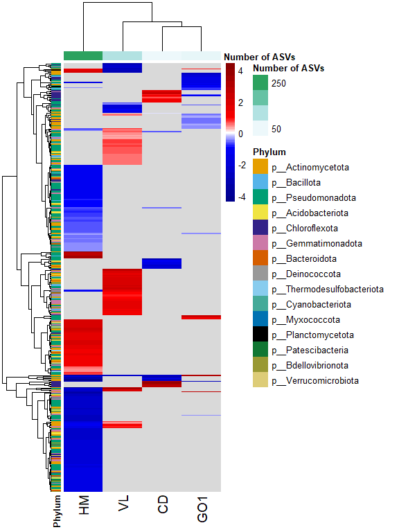<!-- -->

``` r
pheatmap(AllAcc_lfc2,
          clustering_distance_rows = dist(AllAcc_lfc2_clu),
          clustering_distance_cols = dist(t(AllAcc_lfc2_clu)),
          color = colorRampPalette(c("darkblue", "blue", "white", "red", "darkred"))(length(breaks) - 1),
          breaks = breaks,
          fontsize_row = 6,
          fontsize_col = 14,
          na_col = "grey85",
          angle_col = 90, 
          annotation_row = tax2[5:6],
          annotation_colors = phylum_class_colors,
          annotation_col = ASV_numb_df)
```

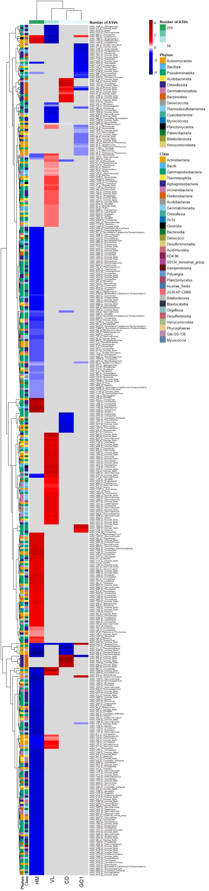<!-- -->

``` r
pheatmap(AllAcc_lfc,
          clustering_distance_rows = dist(AllAcc_lfc_clu),
          clustering_distance_cols = dist(t(AllAcc_lfc_clu)),
          color = colorRampPalette(c("darkblue", "blue", "white", "red", "darkred"))(length(breaks) - 1),
          breaks = breaks,
          show_rownames = FALSE,
          fontsize_row = 3,
          fontsize_col = 14,
          na_col = "grey85",
          angle_col = 90, 
          annotation_row = tax["Class"],
          annotation_colors = class_colors,
          annotation_col = ASV_numb_df)
```

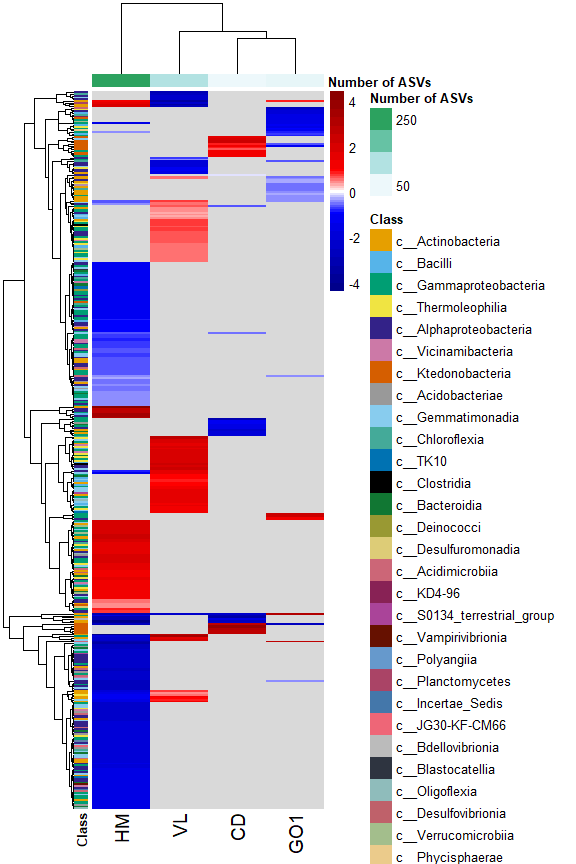<!-- -->

#### Most occuring taxa

``` r
# Order by phylum
tab_phyl <- as.data.frame(table(AllAcc_lfc3_df$Phylum))
tab_phyl <- tab_phyl[order(tab_phyl$Freq, decreasing = TRUE), ]

# select top 7 phyla
top7_phyla <- as.character(tab_phyl$Var1[1:7])

# Order by Class
tab_cla <- as.data.frame(table(AllAcc_lfc3_df$Class))
tab_cla <- tab_cla[order(tab_cla$Freq, decreasing = TRUE), ]

# select top 7 classes
top7_cla <- as.character(tab_cla$Var1[1:7])

# replace other classes and phyla with "Other"
AllAcc_lfc3 <- AllAcc_lfc3_df
AllAcc_lfc3$Phylum <- ifelse(AllAcc_lfc3$Phylum %in% top7_phyla,
                             AllAcc_lfc3$Phylum,
                             "Other")
AllAcc_lfc3$Class <- ifelse(AllAcc_lfc3$Class %in% top7_cla,
                             AllAcc_lfc3$Class,
                             "Other")

# put other last for plotting
AllAcc_lfc3$Phylum <- factor(AllAcc_lfc3$Phylum,
                             levels = c(top7_phyla, "Other"))
AllAcc_lfc3$Class <- factor(AllAcc_lfc3$Class,
                             levels = c(top7_cla, "Other"))

# Subset data frames
tax3 <- AllAcc_lfc3[1:6]
AllAcc_lfc3 <- AllAcc_lfc3[7:10]

# Turn data frame into a matrix
AllAcc_lfc3 <- as.matrix(AllAcc_lfc3)

# Define colors annotation
phylums3 <- levels(tax3$Phylum)
phylums_colors3 <- setNames(colors35[1:(length(phylums3)-1)], phylums3[-length(phylums3)])
phylums_colors3 <- c(phylums_colors3, Other = "#BBBBBB")
phylums_colors3 <- list(Phylum = phylums_colors3)

classes3 <- levels(tax3$Class)
classes_colors3 <- setNames(colors35[1:(length(classes3)-1)], classes3[-length(classes3)])
classes_colors3 <- c(classes_colors3, Other = "#BBBBBB")
classes_colors3 <- list(Class = classes_colors3)

phylum_class_colors3 <- c(phylums_colors3, classes_colors3)

# replace NAs by 0s
AllAcc_lfc3_clu <- AllAcc_lfc3
AllAcc_lfc3_clu[is.na(AllAcc_lfc3_clu)] <- 0
```


##### Heatmap 

``` r
pheatmap(AllAcc_lfc3,
          clustering_distance_rows = dist(AllAcc_lfc3_clu),
          clustering_distance_cols = dist(t(AllAcc_lfc3_clu)),
          color = colorRampPalette(c("darkblue", "blue", "white", "red", "darkred"))(length(breaks) - 1),
          breaks = breaks,
          fontsize_col = 14,
          na_col = "grey85",
          angle_col = 90,
          show_rownames = FALSE,
          annotation_row = tax3["Phylum"],
          annotation_colors = phylums_colors3,
          annotation_col = ASV_numb_df)
```

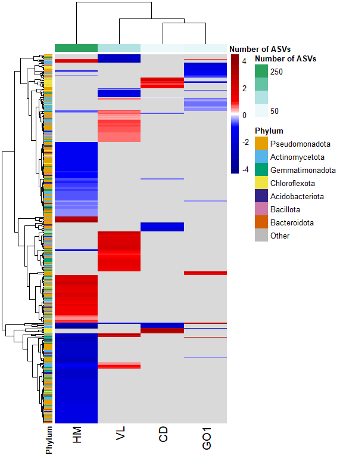<!-- -->

``` r
p <- pheatmap(AllAcc_lfc3,
          clustering_distance_rows = dist(AllAcc_lfc3_clu),
          clustering_distance_cols = dist(t(AllAcc_lfc3_clu)),
          color = colorRampPalette(c("darkblue", "blue", "white", "red", "darkred"))(length(breaks) - 1),
          breaks = breaks,
          fontsize_col = 14,
          na_col = "grey85",
          angle_col = 90,
          show_rownames = FALSE,
          annotation_row = tax3["Class"],
          annotation_colors = classes_colors3,
          annotation_col = ASV_numb_df)
p 
```

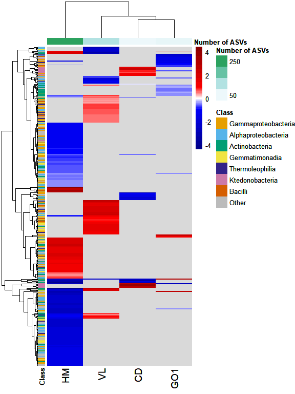<!-- -->

``` r
files <- c("FP_DAHeatmap_ASV.svg", "FP_DAHeatmap_ASV.png")

mapply(function(x){
  file_path <- file.path("C:/Users/kreek001/OneDrive - Wageningen University & Research/Chapters/Experimental Chapter 3/Result/Final graphs", x)

  if (grepl("svg$", x)) {
    svg(file_path, width = 12/2.54, height = 18/2.54)
  } else {
    png(file_path, width = 12, height = 18, units = "cm", res = 300)
  }
  grid::grid.draw(p$gtable)
  dev.off()
}, files)
```

```
## FP_DAHeatmap_ASV.svg.png FP_DAHeatmap_ASV.png.png 
##                        2                        2
```

``` r
# Higher plot
files <- c("FP_DAHeatmap_ASV_high.svg", "FP_DAHeatmap_ASV_high.png")

mapply(function(x){
  file_path <- file.path("C:/Users/kreek001/OneDrive - Wageningen University & Research/Chapters/Experimental Chapter 3/Result/Final graphs", x)

  if (grepl("svg$", x)) {
    svg(file_path, width = 12/2.54, height = 21/2.54)
  } else {
    png(file_path, width = 12, height = 21, units = "cm", res = 300)
  }
  grid::grid.draw(p$gtable)
  dev.off()
}, files)
```

```
## FP_DAHeatmap_ASV_high.svg.png FP_DAHeatmap_ASV_high.png.png 
##                             2                             2
```

``` r
pheatmap(AllAcc_lfc3,
          clustering_distance_rows = dist(AllAcc_lfc3_clu),
          clustering_distance_cols = dist(t(AllAcc_lfc3_clu)),
          color = colorRampPalette(c("darkblue", "blue", "white", "red", "darkred"))(length(breaks) - 1),
          breaks = breaks,
          fontsize_col = 14,
          na_col = "grey85",
          angle_col = 90,
          show_rownames = FALSE,
          annotation_row = tax3[5:6],
          annotation_colors = phylum_class_colors3,
          annotation_col = ASV_numb_df)
```

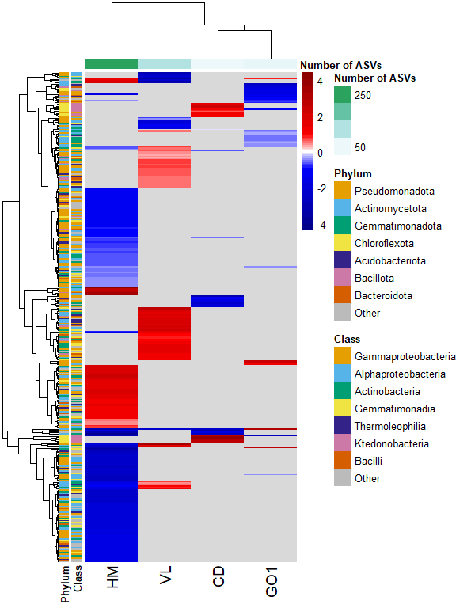<!-- -->

##### Heatmap ordered by phylum

``` r
# Create ordering index
ord <- order(tax3$Phylum, tax3$Class, tax3$Order, tax3$Family)

# Reorder matrix
AllAcc_lfc3 <- AllAcc_lfc3[ord, ]

# Reorder annotation accordingly
tax3 <- tax3[ord, , drop = FALSE]
```


``` r
pheatmap(AllAcc_lfc3,
          #clustering_distance_rows = dist(AllAcc_lfc3_clu),
          cluster_rows = FALSE,
          clustering_distance_cols = dist(t(AllAcc_lfc3_clu)),
          color = colorRampPalette(c("darkblue", "blue", "white", "red", "darkred"))(length(breaks) - 1),
          breaks = breaks,
          fontsize_col = 14,
          na_col = "grey85",
          angle_col = 90,
          show_rownames = FALSE,
          annotation_row = tax3["Phylum"],
          annotation_colors = phylums_colors3,
          annotation_col = ASV_numb_df)
```

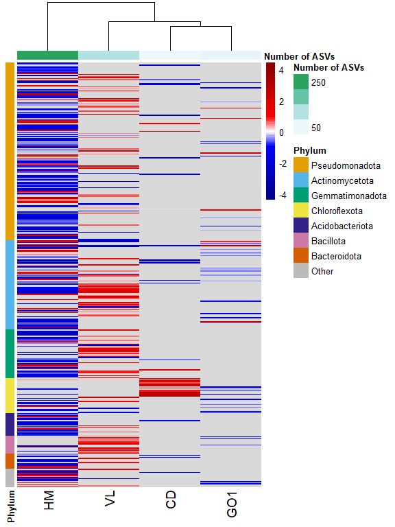<!-- -->

``` r
pheatmap(AllAcc_lfc3,
          #clustering_distance_rows = dist(AllAcc_lfc3_clu),
          cluster_rows = FALSE,
          clustering_distance_cols = dist(t(AllAcc_lfc3_clu)),
          color = colorRampPalette(c("darkblue", "blue", "white", "red", "darkred"))(length(breaks) - 1),
          breaks = breaks,
          fontsize_col = 14,
          na_col = "grey85",
          angle_col = 90,
          show_rownames = FALSE,
          annotation_row = tax3["Class"],
          annotation_colors = classes_colors3,
          annotation_col = ASV_numb_df)
```

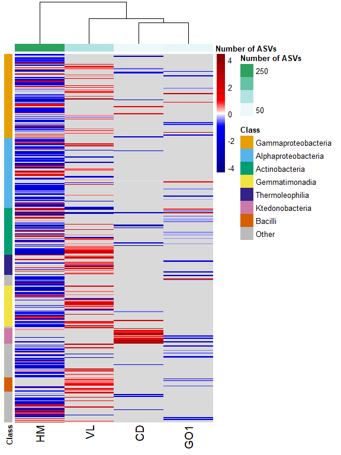<!-- -->

#### Heatmap orderded by different taxonomic levels
##### Phylum

``` r
# Create ordering index
ord <- order(tax$Phylum, tax$Class, tax$Order, tax$Family)

# Reorder matrix
AllAcc_lfc <- AllAcc_lfc[ord, ]

# Reorder annotation accordingly
tax <- tax[ord, , drop = FALSE]

# Heatmap
pheatmap(AllAcc_lfc,
         cluster_rows = FALSE,
          #clustering_distance_rows = dist(AllAcc_lfc_clu),
          clustering_distance_cols = dist(t(AllAcc_lfc_clu)),
          color = colorRampPalette(c("darkblue", "blue", "white", "red", "darkred"))(length(breaks) - 1),
          breaks = breaks,
          show_rownames = FALSE,
          fontsize_row = 3,
          fontsize_col = 14,
          na_col = "grey85",
          angle_col = 90, 
          annotation_row = tax["Phylum"],
          annotation_colors = class_colors,
          annotation_col = ASV_numb_df)
```

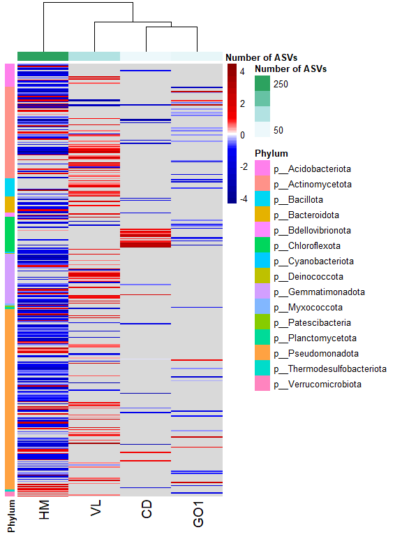<!-- -->

##### Class

``` r
# Make sure legend is in same direction
tax$Class <- factor(tax$Class, levels = unique(tax$Class))

# Heatmap
pheatmap(AllAcc_lfc,
         cluster_rows = FALSE,
          #clustering_distance_rows = dist(AllAcc_lfc_clu),
          clustering_distance_cols = dist(t(AllAcc_lfc_clu)),
          color = colorRampPalette(c("darkblue", "blue", "white", "red", "darkred"))(length(breaks) - 1),
          breaks = breaks,
          show_rownames = FALSE,
          fontsize_row = 3,
          fontsize_col = 14,
          na_col = "grey85",
          angle_col = 90, 
          annotation_row = tax["Class"],
          annotation_colors = phylums_colors, # if using class_colors, reorder color vector as well
          annotation_col = ASV_numb_df)
```

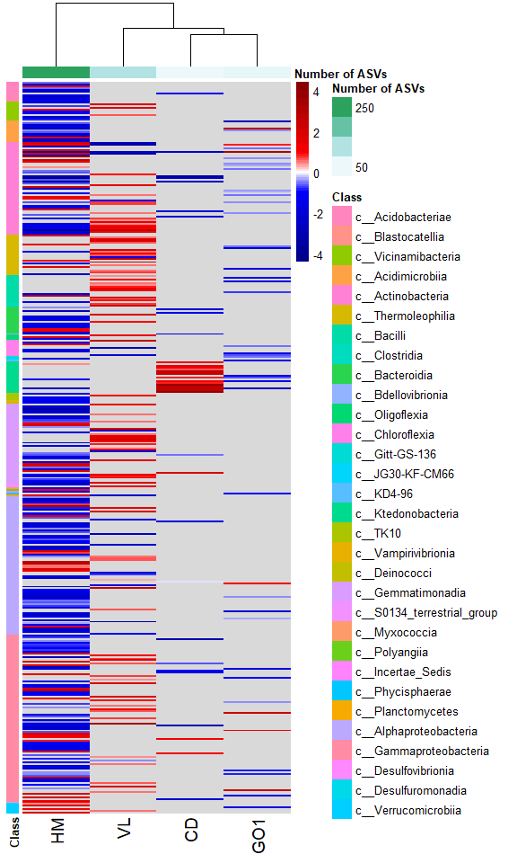<!-- -->

##### Order

``` r
# Make sure legend is in same direction
tax$Order <- factor(tax$Order, levels = unique(tax$Order))

# Heatmap
pheatmap(AllAcc_lfc,
         cluster_rows = FALSE,
          #clustering_distance_rows = dist(AllAcc_lfc_clu),
          clustering_distance_cols = dist(t(AllAcc_lfc_clu)),
          color = colorRampPalette(c("darkblue", "blue", "white", "red", "darkred"))(length(breaks) - 1),
          breaks = breaks,
          show_rownames = FALSE,
          fontsize_row = 3,
          fontsize_col = 14,
          na_col = "grey85",
          angle_col = 90, 
          annotation_row = tax["Order"],
          annotation_colors = class_colors,
          #annotation_col = ASV_numb_df
         )
```

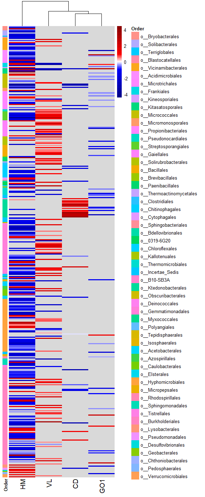<!-- -->

##### Family

``` r
# Make sure legend is in same direction
tax$Family <- factor(tax$Family, levels = unique(tax$Family))

# Heatmap
pheatmap(AllAcc_lfc,
         cluster_rows = FALSE,
          #clustering_distance_rows = dist(AllAcc_lfc_clu),
          clustering_distance_cols = dist(t(AllAcc_lfc_clu)),
          color = colorRampPalette(c("darkblue", "blue", "white", "red", "darkred"))(length(breaks) - 1),
          breaks = breaks,
          show_rownames = FALSE,
          fontsize_row = 3,
          fontsize_col = 14,
          na_col = "grey85",
          angle_col = 90, 
          annotation_row = tax["Family"],
          annotation_colors = class_colors,
          #annotation_col = ASV_numb_df
         )
```

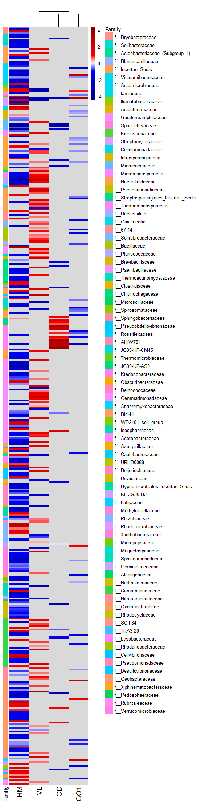<!-- -->

##### All together

``` r
# Reorder color class vector
class_colors <- class_colors[levels(tax$Family)]

# Heatmap
pheatmap(AllAcc_lfc,
         cluster_rows = FALSE,
          #clustering_distance_rows = dist(AllAcc_lfc_clu),
          clustering_distance_cols = dist(t(AllAcc_lfc_clu)),
          color = colorRampPalette(c("darkblue", "blue", "white", "red", "darkred"))(length(breaks) - 1),
          breaks = breaks,
          show_rownames = FALSE,
          fontsize_row = 3,
          fontsize_col = 14,
          na_col = "grey85",
          angle_col = 90, 
          annotation_row = tax[2:5],
          annotation_colors = class_colors,
          #annotation_col = ASV_numb_df
         )
```

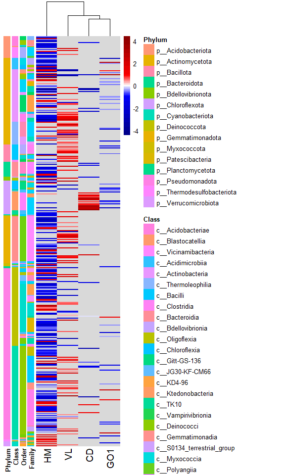<!-- -->

``` r
# Heatmap
pheatmap(AllAcc_lfc,
         cluster_rows = FALSE,
          #clustering_distance_rows = dist(AllAcc_lfc_clu),
          clustering_distance_cols = dist(t(AllAcc_lfc_clu)),
          color = colorRampPalette(c("darkblue", "blue", "white", "red", "darkred"))(length(breaks) - 1),
          breaks = breaks,
          show_rownames = FALSE,
          fontsize_row = 3,
          fontsize_col = 14,
          na_col = "grey85",
          angle_col = 90, 
          annotation_row = tax[2:5],
          annotation_colors = class_colors,
          #annotation_col = ASV_numb_df
         )
```

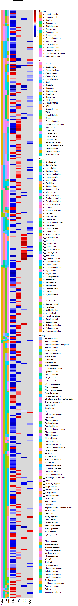<!-- -->

``` r
# Clean environment
rm(list = ls())
```


## 5.7.6 DA overlap HM and VL
### ASV level
#### Loading data

``` r
# load phyloseq object
load("C:/Users/kreek001/OneDrive - Wageningen University & Research/Chapters/Experimental Chapter 3/RScripts/GitHub/TwelveAccessionExperiment/MicrobiomeAnalysis/Data/Phyloseq_objects/FP_unnormalized_bac_ps_ForDA_clean.RData")

# load DA ASVs
load("C:/Users/kreek001/OneDrive - Wageningen University & Research/Chapters/Experimental Chapter 3/RScripts/GitHub/TwelveAccessionExperiment/MicrobiomeAnalysis/Data/Phyloseq_objects/FP_DA_SummaryFiles/SummaryFiles_ASVLevel/Acc_Bac_TwoTimes_DA_ASV.RData")

# load log2fold change values
load(file = "C:/Users/kreek001/OneDrive - Wageningen University & Research/Chapters/Experimental Chapter 3/RScripts/GitHub/TwelveAccessionExperiment/MicrobiomeAnalysis/Data/Phyloseq_objects/FP_DA_Ancom_ASVLevel/ancomWZ_Bac_Acc.RData")

# Extracting overlapping ASVs HM and VL
Acc_Bac_HM_VL_DA_ASV <- c(Acc_Bac_TwoTimes_DA_ASV$VL, Acc_Bac_TwoTimes_DA_ASV$HM)
Acc_Bac_NumbOcc_DA_ASV <- table(Acc_Bac_HM_VL_DA_ASV)
Acc_Bac_HMVLoverlap_DA_ASV <- names(Acc_Bac_NumbOcc_DA_ASV[Acc_Bac_NumbOcc_DA_ASV == 2])
Acc_Bac_HMVLoverlap_DA_ASV
```

```
##  [1] "bASV_1003" "bASV_109"  "bASV_1153" "bASV_126"  "bASV_1345" "bASV_1539"
##  [7] "bASV_178"  "bASV_187"  "bASV_1962" "bASV_27"   "bASV_2770" "bASV_3526"
## [13] "bASV_385"  "bASV_430"  "bASV_474"  "bASV_515"  "bASV_541"  "bASV_5682"
## [19] "bASV_664"  "bASV_7"    "bASV_910"
```

``` r
# Select overlap of GO1 and CD with ASV list of HM and VL
ASVs_GO1 <- intersect(Acc_Bac_HMVLoverlap_DA_ASV, Acc_Bac_TwoTimes_DA_ASV$GO1)
ASVs_CD <- intersect(Acc_Bac_HMVLoverlap_DA_ASV, Acc_Bac_TwoTimes_DA_ASV$CD)
ASV_list <- list(HM = Acc_Bac_HMVLoverlap_DA_ASV, VL = Acc_Bac_HMVLoverlap_DA_ASV, GO1 = ASVs_GO1, CD = ASVs_CD)

# Filter log2fold change for DA ASVs per accession
lfc_DA_specific <- lapply(names(ASV_list), function(name) {
  da_asvs <- ASV_list[[name]]
  lfc_table <- ancomWZ_Bac_Acc[[name]]$res$lfc
  rownames(lfc_table) <- lfc_table$taxon
  lfc_table <- lfc_table[lfc_table$taxon %in% da_asvs, "Soil_conditioningMb", drop = FALSE]
  lfc_table$ASV <- rownames(lfc_table)
  colnames(lfc_table)[1] <- paste0(name)
  lfc_table
})

names(lfc_DA_specific) <- names(ASV_list)

# merge all accessions together
lfc_table <- Reduce(function(x, y) merge(x, y, by = "ASV", all = TRUE), lfc_DA_specific)
rownames(lfc_table) <- lfc_table$ASV
nrow(lfc_table)
```

```
## [1] 21
```

``` r
lfc_table$ASV <- NULL

# Change order accessions
lfc_table <- lfc_table[c(3, 1, 2, 4)]

# check table
head(lfc_table)
```

```
##                GO1        HM         VL        CD
## bASV_1003 2.976802 -3.206741 -2.5051032 -2.431535
## bASV_109        NA -1.435542  0.4340034        NA
## bASV_1153       NA  1.861611 -3.3167139        NA
## bASV_126        NA -1.377645  1.0477663        NA
## bASV_1345       NA -1.870530  3.3425608        NA
## bASV_1539       NA  2.001394 -2.7863404        NA
```

#### Prepare taxonomy column class and phylum

``` r
# Only keep DA in ps object
FP_unnormalized_bac_ps_ForDA_clean <- prune_taxa(Acc_Bac_HMVLoverlap_DA_ASV, FP_unnormalized_bac_ps_ForDA_clean)

# Phyloseq object to data frame with relative abundance, meta data and taxonomy. Each row is a ASV-sample combination
df_clean <- psmelt(FP_unnormalized_bac_ps_ForDA_clean)
head(df_clean[, c(1:9, 95:101)], 12)
```

```
##         OTU Sample Abundance Phase_PSF SampleNr Accession Domestication
## 1892 bASV_7   F475      1951        FP      475        VL          Wild
## 1863 bASV_7   F176      1773        FP      176        HM    Cultivated
## 1909 bASV_7   F476      1613        FP      476        VL          Wild
## 1833 bASV_7   F478      1605        FP      478        VL          Wild
## 1854 bASV_7   F479      1496        FP      479        VL          Wild
## 1842 bASV_7   F175      1338        FP      175        HM    Cultivated
## 1879 bASV_7   F117      1320        FP      117       GO1    Cultivated
## 1884 bASV_7   F177      1320        FP      177        HM    Cultivated
## 1905 bASV_7   F179      1251        FP      179        HM    Cultivated
## 1913 bASV_7   F477      1251        FP      477        VL          Wild
## 1858 bASV_7   F116      1238        FP      116       GO1    Cultivated
## 1828 bASV_7   F095      1224        FP       95       GO1    Cultivated
##      Cat_treatment Soil_conditioning     Kingdom            Phylum
## 1892            Mb                Mb k__Bacteria p__Actinomycetota
## 1863            Mb                Co k__Bacteria p__Actinomycetota
## 1909            Mb                Mb k__Bacteria p__Actinomycetota
## 1833            Mb                Mb k__Bacteria p__Actinomycetota
## 1854            Mb                Mb k__Bacteria p__Actinomycetota
## 1842            Mb                Co k__Bacteria p__Actinomycetota
## 1879            Mb                Mb k__Bacteria p__Actinomycetota
## 1884            Mb                Co k__Bacteria p__Actinomycetota
## 1905            Mb                Co k__Bacteria p__Actinomycetota
## 1913            Mb                Mb k__Bacteria p__Actinomycetota
## 1858            Mb                Mb k__Bacteria p__Actinomycetota
## 1828            Mb                Co k__Bacteria p__Actinomycetota
##                  Class                  Order          Family           Genus
## 1892 c__Actinobacteria o__Streptosporangiales f__Unclassified g__Unclassified
## 1863 c__Actinobacteria o__Streptosporangiales f__Unclassified g__Unclassified
## 1909 c__Actinobacteria o__Streptosporangiales f__Unclassified g__Unclassified
## 1833 c__Actinobacteria o__Streptosporangiales f__Unclassified g__Unclassified
## 1854 c__Actinobacteria o__Streptosporangiales f__Unclassified g__Unclassified
## 1842 c__Actinobacteria o__Streptosporangiales f__Unclassified g__Unclassified
## 1879 c__Actinobacteria o__Streptosporangiales f__Unclassified g__Unclassified
## 1884 c__Actinobacteria o__Streptosporangiales f__Unclassified g__Unclassified
## 1905 c__Actinobacteria o__Streptosporangiales f__Unclassified g__Unclassified
## 1913 c__Actinobacteria o__Streptosporangiales f__Unclassified g__Unclassified
## 1858 c__Actinobacteria o__Streptosporangiales f__Unclassified g__Unclassified
## 1828 c__Actinobacteria o__Streptosporangiales f__Unclassified g__Unclassified
##      Species
## 1892    <NA>
## 1863    <NA>
## 1909    <NA>
## 1833    <NA>
## 1854    <NA>
## 1842    <NA>
## 1879    <NA>
## 1884    <NA>
## 1905    <NA>
## 1913    <NA>
## 1858    <NA>
## 1828    <NA>
```

``` r
# Extract unique ASV–Class-Phylum mapping
tax <- df_clean[!duplicated(df_clean$OTU), c("OTU", "Genus", "Family", "Order", "Class", "Phylum")]

# Keep only those genera present in your heat map matrix
tax <- tax[match(rownames(lfc_table), tax$OTU), ]

# Row names must match heat map rows
rownames(tax) <- tax$OTU
tax$OTU <- NULL
head(tax)
```

```
##                       Genus                 Family                  Order
## bASV_1003   g__Streptomyces   f__Streptomycetaceae    o__Kitasatosporales
## bASV_109    g__Actinomadura f__Thermomonosporaceae o__Streptosporangiales
## bASV_1153 g__Peterkaempfera   f__Streptomycetaceae    o__Kitasatosporales
## bASV_126    g__Unclassified        f__Unclassified o__Streptosporangiales
## bASV_1345 g__Incertae_Sedis    f__Oxalobacteraceae     o__Burkholderiales
## bASV_1539   g__Acidothermus     f__Acidothermaceae          o__Frankiales
##                            Class            Phylum
## bASV_1003      c__Actinobacteria p__Actinomycetota
## bASV_109       c__Actinobacteria p__Actinomycetota
## bASV_1153      c__Actinobacteria p__Actinomycetota
## bASV_126       c__Actinobacteria p__Actinomycetota
## bASV_1345 c__Gammaproteobacteria p__Pseudomonadota
## bASV_1539      c__Actinobacteria p__Actinomycetota
```

``` r
# Add genus in row names to new data frame
lfc_table$ASV <- rownames(lfc_table)
tax$ASV <- rownames(tax)
lfc_table <- merge(tax, lfc_table, ID = "ASV")

# Add higher taxonomic level if genus is NA or Incertae Sedis
taxon <- lfc_table$Genus
taxon[is.na(taxon)] <- lfc_table$Family[is.na(taxon)]
taxon[is.na(taxon)] <- lfc_table$Order[is.na(taxon)]

taxon[taxon == "g__Incertae_Sedis"] <- lfc_table$Family[taxon == "g__Incertae_Sedis"]
taxon[taxon == "f__Incertae_Sedis"] <- lfc_table$Order[taxon == "f__Incertae_Sedis"]
taxon[taxon == "o__Incertae_Sedis"] <- lfc_table$Class[taxon == "o__Incertae_Sedis"]

taxon[taxon == "g__Unclassified"] <- lfc_table$Family[taxon == "g__Unclassified"]
taxon[taxon == "f__Unclassified"] <- lfc_table$Order[taxon == "f__Unclassified"]
taxon[taxon == "o__Unclassified"] <- lfc_table$Class[taxon == "o__Unclassified"]

rownames(lfc_table) <- paste(lfc_table$ASV, taxon, sep = "_")

lfc_table$Phylum <- sub("p__", "", lfc_table$Phylum)
lfc_table$Class <- sub("c__", "", lfc_table$Class)

# make new dfs
tax <- lfc_table[1:6]
lfc_table <- lfc_table[7:10]
head(lfc_table)
```

```
##                                      GO1        HM         VL        CD
## bASV_1003_g__Streptomyces       2.976802 -3.206741 -2.5051032 -2.431535
## bASV_109_g__Actinomadura              NA -1.435542  0.4340034        NA
## bASV_1153_g__Peterkaempfera           NA  1.861611 -3.3167139        NA
## bASV_126_o__Streptosporangiales       NA -1.377645  1.0477663        NA
## bASV_1345_f__Oxalobacteraceae         NA -1.870530  3.3425608        NA
## bASV_1539_g__Acidothermus             NA  2.001394 -2.7863404        NA
```

``` r
head(tax)
```

```
##                                       ASV             Genus
## bASV_1003_g__Streptomyces       bASV_1003   g__Streptomyces
## bASV_109_g__Actinomadura         bASV_109   g__Actinomadura
## bASV_1153_g__Peterkaempfera     bASV_1153 g__Peterkaempfera
## bASV_126_o__Streptosporangiales  bASV_126   g__Unclassified
## bASV_1345_f__Oxalobacteraceae   bASV_1345 g__Incertae_Sedis
## bASV_1539_g__Acidothermus       bASV_1539   g__Acidothermus
##                                                 Family                  Order
## bASV_1003_g__Streptomyces         f__Streptomycetaceae    o__Kitasatosporales
## bASV_109_g__Actinomadura        f__Thermomonosporaceae o__Streptosporangiales
## bASV_1153_g__Peterkaempfera       f__Streptomycetaceae    o__Kitasatosporales
## bASV_126_o__Streptosporangiales        f__Unclassified o__Streptosporangiales
## bASV_1345_f__Oxalobacteraceae      f__Oxalobacteraceae     o__Burkholderiales
## bASV_1539_g__Acidothermus           f__Acidothermaceae          o__Frankiales
##                                               Class         Phylum
## bASV_1003_g__Streptomyces            Actinobacteria Actinomycetota
## bASV_109_g__Actinomadura             Actinobacteria Actinomycetota
## bASV_1153_g__Peterkaempfera          Actinobacteria Actinomycetota
## bASV_126_o__Streptosporangiales      Actinobacteria Actinomycetota
## bASV_1345_f__Oxalobacteraceae   Gammaproteobacteria Pseudomonadota
## bASV_1539_g__Acidothermus            Actinobacteria Actinomycetota
```

``` r
# Make color pallet for class
colors35 <- c("#E69F00", "#56B4E9", "#009E73", "#F0E442", "#332288", "#CC79A7", 
              "#D55E00", "#999999", "#88CCEE", "#44AA99", "#0072B2", "#000000", 
              "#117733", "#999933", "#DDCC77", "#CC6677", "#882255", "#AA4499",
              "#661100", "#6699CC", "#AA4466", "#4477AA", "#EE6677", "#BBBBBB", 
              "#2E3440", "#8FBCBB", "#BF616A", "#A3BE8C", "#EBCB8B", "#B48EAD", 
              "#5E81AC", "#D08770", "#3B4252", "#7B9E87")

classes <- unique(tax$Class)
class_colors <- setNames(colors35[1:length(classes)], classes)
class_colors <- list(Class = class_colors)

phylums <- unique(tax$Phylum)
phylums_colors <- setNames(colors35[1:length(phylums)], phylums)
phylums_colors <- list(Phylum = phylums_colors)

phylum_class_colors <- c(phylums_colors, class_colors)

# Turn data frame into a matrix
lfc_table <- as.matrix(lfc_table)

# Adjusting color scheme
# max_abs <- max(abs(AllAcc_lfc), na.rm = TRUE)
# breaks <- unique(c(seq(-max_abs, -1, length.out = 10), 
#                    seq(-1, 1, length.out = 20), # More breaks in this range for sensitivity
#                    seq(1, max_abs, length.out = 10)))
```

#### Heatmap HM and VL

``` r
max_abs <- max(abs(lfc_table), na.rm = TRUE)

pheatmap(lfc_table[, 1:2],
          cluster_rows = TRUE,
          cluster_cols = FALSE,
          color = colorRampPalette(c("darkblue", "blue", "white", "red", "darkred"))(50),
          #breaks = breaks,
          breaks = seq(-max_abs, max_abs, length.out = 51),
          #main = "Differentially abundant taxa (log2FC by Family)",
          fontsize_row = 10,
          fontsize_col = 14,
          na_col = "grey90",
          angle_col = 90, 
          annotation_row = tax["Phylum"],
          annotation_colors = phylums_colors)
```

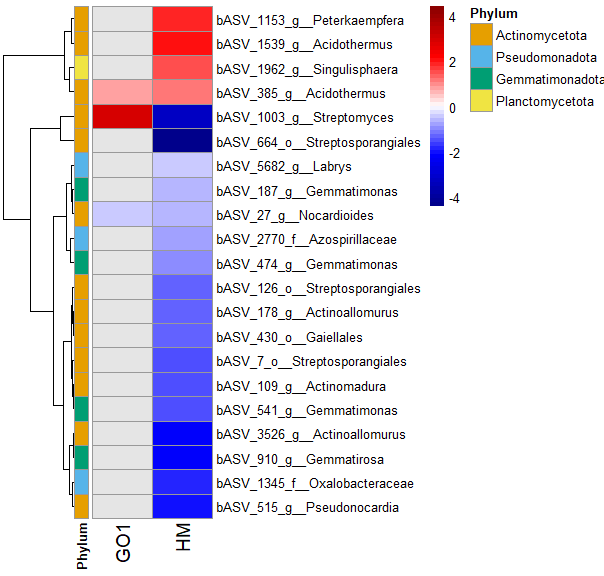<!-- -->

``` r
pheatmap(lfc_table[, 1:2],
          cluster_rows = TRUE,
          cluster_cols = FALSE,
          color = colorRampPalette(c("darkblue", "blue", "white", "red", "darkred"))(50),
          breaks = seq(-max_abs, max_abs, length.out = 51),
          #main = "Differentially abundant taxa (log2FC by Family)",
          fontsize_row = 10,
          fontsize_col = 14,
          na_col = "grey90",
          angle_col = 90, 
          annotation_row = tax["Class"],
          annotation_colors = class_colors)
```

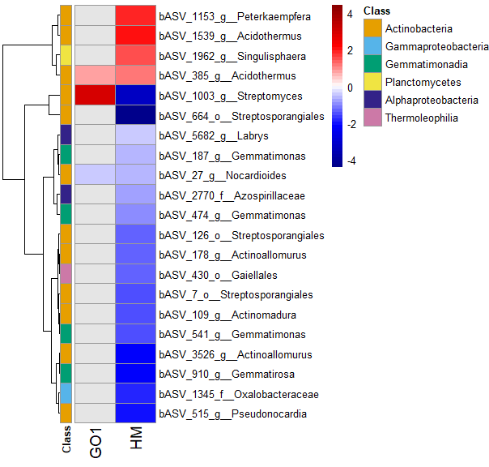<!-- -->

``` r
pheatmap(lfc_table[, 1:2],
          cluster_rows = TRUE,
          cluster_cols = FALSE,
         color = colorRampPalette(c("darkblue", "blue", "white", "red", "darkred"))(50),
          breaks = seq(-max_abs, max_abs, length.out = 51),
          #main = "Differentially abundant taxa (log2FC by Family)",
          fontsize_row = 10,
          fontsize_col = 14,
          na_col = "grey90",
          angle_col = 90,
          annotation_row = tax[5:6],
          annotation_colors = phylum_class_colors)
```

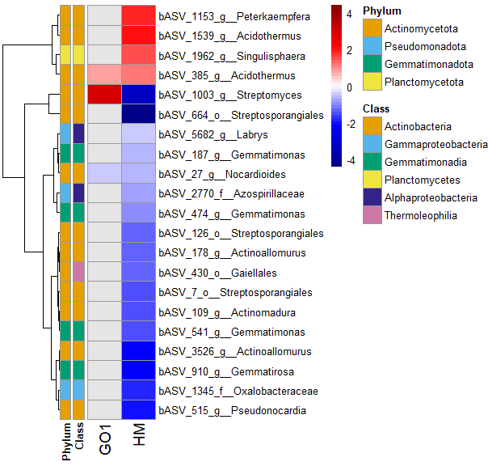<!-- -->

#### Heatmap four accessions

``` r
max_abs <- max(abs(lfc_table), na.rm = TRUE)

pheatmap(lfc_table,
          cluster_rows = TRUE,
          cluster_cols = FALSE,
          color = colorRampPalette(c("darkblue", "blue", "white", "red", "darkred"))(50),
          #breaks = breaks,
          breaks = seq(-max_abs, max_abs, length.out = 51),
          #main = "Differentially abundant taxa (log2FC by Family)",
          fontsize_row = 10,
          fontsize_col = 14,
          na_col = "grey90",
          angle_col = 90, 
          annotation_row = tax["Phylum"],
          annotation_colors = phylums_colors)
```

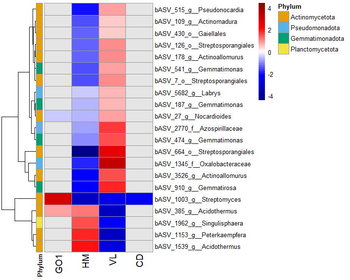<!-- -->

``` r
p <- pheatmap(lfc_table,
          cluster_rows = TRUE,
          cluster_cols = FALSE,
          color = colorRampPalette(c("darkblue", "blue", "white", "red", "darkred"))(50),
          breaks = seq(-max_abs, max_abs, length.out = 51),
          #main = "Differentially abundant taxa (log2FC by Family)",
          fontsize_row = 10,
          fontsize_col = 14,
          na_col = "grey90",
          angle_col = 90, 
          annotation_row = tax["Class"],
          annotation_colors = class_colors)
p 
```

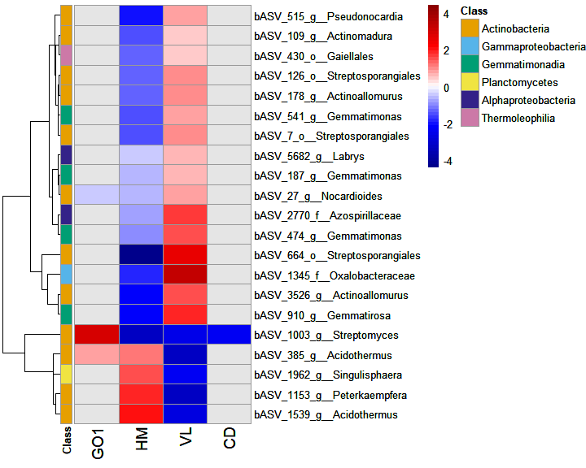<!-- -->

``` r
files <- c("FP_DAHeatmap_ASV_overlap_HMVL.svg", "FP_DAHeatmap_ASV_overlap_HMVL.png")

mapply(function(x){
  file_path <- file.path("C:/Users/kreek001/OneDrive - Wageningen University & Research/Chapters/Experimental Chapter 3/Result/Final graphs", x)

  if (grepl("svg$", x)) {
    svg(file_path, width = 18/2.54, height = 12/2.54)
  } else {
    png(file_path, width = 18, height = 12, units = "cm", res = 300)
  }
  grid::grid.draw(p$gtable)
  dev.off()
}, files)
```

```
## FP_DAHeatmap_ASV_overlap_HMVL.svg.png FP_DAHeatmap_ASV_overlap_HMVL.png.png 
##                                     2                                     2
```

``` r
pheatmap(lfc_table,
          cluster_rows = TRUE,
          cluster_cols = FALSE,
         color = colorRampPalette(c("darkblue", "blue", "white", "red", "darkred"))(50),
          breaks = seq(-max_abs, max_abs, length.out = 51),
          #main = "Differentially abundant taxa (log2FC by Family)",
          fontsize_row = 10,
          fontsize_col = 14,
          na_col = "grey90",
          angle_col = 90,
          annotation_row = tax[5:6],
          annotation_colors = phylum_class_colors)
```

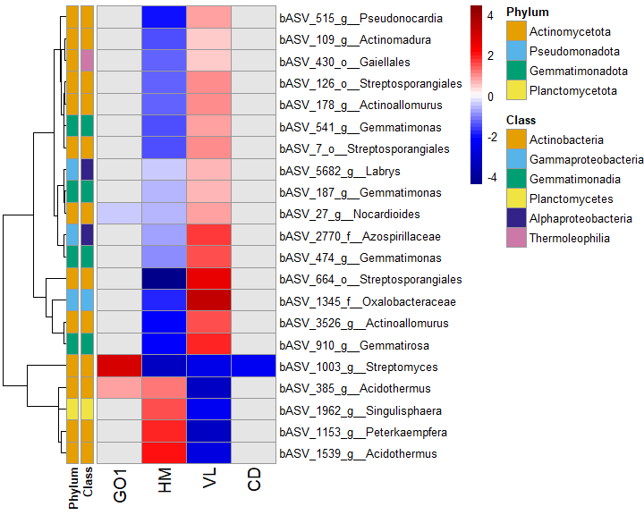<!-- -->

``` r
# Create ordering index
ord <- order(tax$Phylum, tax$Class, tax$Order, tax$Family, tax$Genus)

# Reorder matrix
lfc_table <- lfc_table[ord, ]

# Reorder annotation accordingly
tax <- tax[ord, , drop = FALSE]

# Reorder color class vector
phylums_colors <- phylums_colors[levels(tax$Phylum)]

# Make sure legend is in same direction
tax$Phylum <- factor(tax$Phylum, levels = unique(tax$Phylum))
tax$Class <- factor(tax$Class, levels = unique(tax$Class))
tax$Order <- factor(tax$Order, levels = unique(tax$Order))
tax$Family <- factor(tax$Family, levels = unique(tax$Family))
tax$Genus <- factor(tax$Genus, levels = unique(tax$Genus))

# Heatmap
pheatmap(lfc_table,
          cluster_rows = FALSE,
          cluster_cols = FALSE,
         color = colorRampPalette(c("darkblue", "blue", "white", "red", "darkred"))(50),
          breaks = seq(-max_abs, max_abs, length.out = 51),
          #main = "Differentially abundant taxa (log2FC by Family)",
          fontsize_row = 10,
          fontsize_col = 14,
          na_col = "grey90",
          angle_col = 90,
          annotation_row = tax[3:6],
          annotation_colors = phylums_colors)
```

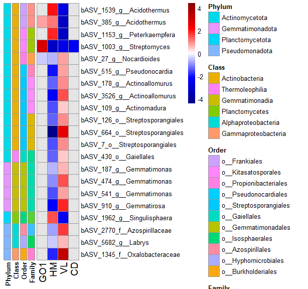<!-- -->

``` r
# Clean environment
rm(list = ls())
```


# 5.7.8 Check specific taxonomic groups
### Bacilli
Heatmap At ASV level DA ASVs occuring twice.   

#### Load data

``` r
# load phyloseq object
load("C:/Users/kreek001/OneDrive - Wageningen University & Research/Chapters/Experimental Chapter 3/RScripts/GitHub/TwelveAccessionExperiment/MicrobiomeAnalysis/Data/Phyloseq_objects/FP_unnormalized_bac_ps_ForDA_clean.RData")

# load DA ASVs
load("C:/Users/kreek001/OneDrive - Wageningen University & Research/Chapters/Experimental Chapter 3/RScripts/GitHub/TwelveAccessionExperiment/MicrobiomeAnalysis/Data/Phyloseq_objects/FP_DA_SummaryFiles/SummaryFiles_ASVLevel/Acc_Bac_TwoTimes_DA_ASV.RData")

# load log2fold change values
load(file = "C:/Users/kreek001/OneDrive - Wageningen University & Research/Chapters/Experimental Chapter 3/RScripts/GitHub/TwelveAccessionExperiment/MicrobiomeAnalysis/Data/Phyloseq_objects/FP_DA_Ancom_ASVLevel/ancomWZ_Bac_Acc.RData")
```

#### Remove RI

``` r
Acc_Bac_TwoTimes_DA_ASV <- Acc_Bac_TwoTimes_DA_ASV[names(Acc_Bac_TwoTimes_DA_ASV) != "RI"]
```

#### Combine DA ASVs per accession

``` r
# Number of DA ASVs
lapply(Acc_Bac_TwoTimes_DA_ASV, function(x) length(x))
```

```
## $VL
## [1] 114
## 
## $CD
## [1] 37
## 
## $HM
## [1] 265
## 
## $GO1
## [1] 45
```

``` r
length(unique(unlist(Acc_Bac_TwoTimes_DA_ASV)))
```

```
## [1] 417
```

``` r
# Filter log2fold change for DA ASVs per accession
lfc_DA_specific <- lapply(names(Acc_Bac_TwoTimes_DA_ASV), function(name) {
  da_asvs <- Acc_Bac_TwoTimes_DA_ASV[[name]]
  lfc_table <- ancomWZ_Bac_Acc[[name]]$res$lfc
  rownames(lfc_table) <- lfc_table$taxon
  lfc_table <- lfc_table[lfc_table$taxon %in% da_asvs, "Soil_conditioningMb", drop = FALSE]
  lfc_table$ASV <- rownames(lfc_table)
  colnames(lfc_table)[1] <- paste0(name)
  lfc_table
})

names(lfc_DA_specific) <- names(Acc_Bac_TwoTimes_DA_ASV)

# merge all accessions together
AllAcc_lfc <- Reduce(function(x, y) merge(x, y, by = "ASV", all = TRUE), lfc_DA_specific)
rownames(AllAcc_lfc) <- AllAcc_lfc$ASV
nrow(AllAcc_lfc)
```

```
## [1] 417
```

``` r
#AllAcc_lfc$ASV <- NULL

# Change order accessions
AllAcc_lfc <- AllAcc_lfc[c(1,4,2,3,5)]
```

#### Prepare taxonomy column class and phylum

``` r
# Put all unique DA ASVs in one vector
Acc_Bac_TwoTimes_DA_ASV <- unique(unlist(Acc_Bac_TwoTimes_DA_ASV, use.names = FALSE))

# Only keep DA in ps object
FP_unnormalized_bac_ps_ForDA_clean <- prune_taxa(Acc_Bac_TwoTimes_DA_ASV, FP_unnormalized_bac_ps_ForDA_clean)

# Phyloseq object to data frame with relative abundance, meta data and taxonomy. Each row is a ASV-sample combination
df_clean <- psmelt(FP_unnormalized_bac_ps_ForDA_clean)
head(df_clean[, c(1:9, 95:101)], 12)
```

```
##          OTU Sample Abundance Phase_PSF SampleNr Accession Domestication
## 35309 bASV_7   F475      1951        FP      475        VL          Wild
## 35310 bASV_7   F176      1773        FP      176        HM    Cultivated
## 10    bASV_1   FE98      1677        FP      E98        RI    Cultivated
## 35256 bASV_7   F476      1613        FP      476        VL          Wild
## 35292 bASV_7   F478      1605        FP      478        VL          Wild
## 35316 bASV_7   F479      1496        FP      479        VL          Wild
## 35242 bASV_7   F175      1338        FP      175        HM    Cultivated
## 35302 bASV_7   F117      1320        FP      117       GO1    Cultivated
## 35319 bASV_7   F177      1320        FP      177        HM    Cultivated
## 35264 bASV_7   F179      1251        FP      179        HM    Cultivated
## 35296 bASV_7   F477      1251        FP      477        VL          Wild
## 35279 bASV_7   F116      1238        FP      116       GO1    Cultivated
##       Cat_treatment Soil_conditioning     Kingdom            Phylum
## 35309            Mb                Mb k__Bacteria p__Actinomycetota
## 35310            Mb                Co k__Bacteria p__Actinomycetota
## 10               Mb                Co k__Bacteria p__Actinomycetota
## 35256            Mb                Mb k__Bacteria p__Actinomycetota
## 35292            Mb                Mb k__Bacteria p__Actinomycetota
## 35316            Mb                Mb k__Bacteria p__Actinomycetota
## 35242            Mb                Co k__Bacteria p__Actinomycetota
## 35302            Mb                Mb k__Bacteria p__Actinomycetota
## 35319            Mb                Co k__Bacteria p__Actinomycetota
## 35264            Mb                Co k__Bacteria p__Actinomycetota
## 35296            Mb                Mb k__Bacteria p__Actinomycetota
## 35279            Mb                Mb k__Bacteria p__Actinomycetota
##                   Class                  Order            Family
## 35309 c__Actinobacteria o__Streptosporangiales   f__Unclassified
## 35310 c__Actinobacteria o__Streptosporangiales   f__Unclassified
## 10    c__Actinobacteria       o__Micrococcales f__Micrococcaceae
## 35256 c__Actinobacteria o__Streptosporangiales   f__Unclassified
## 35292 c__Actinobacteria o__Streptosporangiales   f__Unclassified
## 35316 c__Actinobacteria o__Streptosporangiales   f__Unclassified
## 35242 c__Actinobacteria o__Streptosporangiales   f__Unclassified
## 35302 c__Actinobacteria o__Streptosporangiales   f__Unclassified
## 35319 c__Actinobacteria o__Streptosporangiales   f__Unclassified
## 35264 c__Actinobacteria o__Streptosporangiales   f__Unclassified
## 35296 c__Actinobacteria o__Streptosporangiales   f__Unclassified
## 35279 c__Actinobacteria o__Streptosporangiales   f__Unclassified
##                      Genus Species
## 35309      g__Unclassified    <NA>
## 35310      g__Unclassified    <NA>
## 10    g__Pseudarthrobacter     s__
## 35256      g__Unclassified    <NA>
## 35292      g__Unclassified    <NA>
## 35316      g__Unclassified    <NA>
## 35242      g__Unclassified    <NA>
## 35302      g__Unclassified    <NA>
## 35319      g__Unclassified    <NA>
## 35264      g__Unclassified    <NA>
## 35296      g__Unclassified    <NA>
## 35279      g__Unclassified    <NA>
```

``` r
# Extract unique ASV–Class-Phylum mapping
tax <- df_clean[!duplicated(df_clean$OTU), c("OTU", "Genus", "Family", "Order", "Class", "Phylum")]

# Keep only those genera present in your heat map matrix
tax <- tax[match(rownames(AllAcc_lfc), tax$OTU), ]

# Row names must match heat map rows
rownames(tax) <- tax$OTU
tax$OTU <- NULL
head(tax)
```

```
##                           Genus               Family               Order
## bASV_1     g__Pseudarthrobacter    f__Micrococcaceae    o__Micrococcales
## bASV_10              g__Niallia       f__Bacillaceae       o__Bacillales
## bASV_1002       g__Unclassified    f__Comamonadaceae  o__Burkholderiales
## bASV_1003       g__Streptomyces f__Streptomycetaceae o__Kitasatosporales
## bASV_10085      g__Unclassified    f__Comamonadaceae  o__Burkholderiales
## bASV_1025     g__Incertae_Sedis    f__Incertae_Sedis       o__Gaiellales
##                             Class            Phylum
## bASV_1          c__Actinobacteria p__Actinomycetota
## bASV_10                c__Bacilli      p__Bacillota
## bASV_1002  c__Gammaproteobacteria p__Pseudomonadota
## bASV_1003       c__Actinobacteria p__Actinomycetota
## bASV_10085 c__Gammaproteobacteria p__Pseudomonadota
## bASV_1025      c__Thermoleophilia p__Actinomycetota
```

#### Subset Bacilli

``` r
# Subset taxonomy table
tax_bas <- tax[tax$Class == "c__Bacilli", ]
tax_bas
```

```
##                         Genus                    Family
## bASV_10            g__Niallia            f__Bacillaceae
## bASV_1164    g__Paenibacillus       f__Paenibacillaceae
## bASV_1196      g__Lederbergia            f__Bacillaceae
## bASV_1401          g__Niallia            f__Bacillaceae
## bASV_2152  g__Parageobacillus            f__Bacillaceae
## bASV_256  g__Rummeliibacillus         f__Planococcaceae
## bASV_3873    g__Paenibacillus       f__Paenibacillaceae
## bASV_39            g__Niallia            f__Bacillaceae
## bASV_4655   g__Kroppenstedtia f__Thermoactinomycetaceae
## bASV_47           g__Bacillus            f__Bacillaceae
## bASV_534           g__Niallia            f__Bacillaceae
## bASV_549      g__Sporosarcina         f__Planococcaceae
## bASV_5893    g__Brevibacillus       f__Brevibacillaceae
## bASV_8506    g__Paenibacillus       f__Paenibacillaceae
## bASV_8895    g__Paenibacillus       f__Paenibacillaceae
## bASV_899       g__Lederbergia            f__Bacillaceae
##                              Order      Class       Phylum
## bASV_10              o__Bacillales c__Bacilli p__Bacillota
## bASV_1164       o__Paenibacillales c__Bacilli p__Bacillota
## bASV_1196            o__Bacillales c__Bacilli p__Bacillota
## bASV_1401            o__Bacillales c__Bacilli p__Bacillota
## bASV_2152            o__Bacillales c__Bacilli p__Bacillota
## bASV_256             o__Bacillales c__Bacilli p__Bacillota
## bASV_3873       o__Paenibacillales c__Bacilli p__Bacillota
## bASV_39              o__Bacillales c__Bacilli p__Bacillota
## bASV_4655 o__Thermoactinomycetales c__Bacilli p__Bacillota
## bASV_47              o__Bacillales c__Bacilli p__Bacillota
## bASV_534             o__Bacillales c__Bacilli p__Bacillota
## bASV_549             o__Bacillales c__Bacilli p__Bacillota
## bASV_5893       o__Brevibacillales c__Bacilli p__Bacillota
## bASV_8506       o__Paenibacillales c__Bacilli p__Bacillota
## bASV_8895       o__Paenibacillales c__Bacilli p__Bacillota
## bASV_899             o__Bacillales c__Bacilli p__Bacillota
```

``` r
# Extract ASV numbers Bacilli ASVs
ASVs_bas <- rownames(tax_bas)

# Subset lfc matrix with Bacilli
AllAcc_lfc_bas <- AllAcc_lfc[AllAcc_lfc$ASV %in% ASVs_bas, ]
AllAcc_lfc_bas
```

```
##                 ASV         HM        VL CD        GO1
## bASV_10     bASV_10         NA 0.3892605 NA         NA
## bASV_1164 bASV_1164  3.5016781        NA NA         NA
## bASV_1196 bASV_1196         NA        NA NA -1.3751857
## bASV_1401 bASV_1401         NA 0.9782271 NA         NA
## bASV_2152 bASV_2152         NA        NA NA -1.9848587
## bASV_256   bASV_256         NA 1.3538811 NA         NA
## bASV_3873 bASV_3873         NA 1.9670073 NA         NA
## bASV_39     bASV_39         NA 0.5186245 NA         NA
## bASV_4655 bASV_4655 -0.9074073        NA NA         NA
## bASV_47     bASV_47         NA 0.3707463 NA         NA
## bASV_534   bASV_534         NA 0.8600598 NA         NA
## bASV_549   bASV_549         NA        NA NA -0.7274979
## bASV_5893 bASV_5893 -1.1563663        NA NA         NA
## bASV_8506 bASV_8506         NA 0.5392339 NA         NA
## bASV_8895 bASV_8895         NA 0.8975858 NA         NA
## bASV_899   bASV_899         NA 1.7464352 NA         NA
```

#### Preparing heatmap

``` r
# Add genus to matrix
AllAcc_lfc_bas$ASV <- rownames(AllAcc_lfc_bas)
tax_bas$ASV <- rownames(tax_bas)
AllAcc_lfc_bas <- merge(tax_bas, AllAcc_lfc_bas, ID = "ASV")

# Add higher taxon_basomic level if genus is NA or Incertae Sedis
taxon_bas <- AllAcc_lfc_bas$Genus
taxon_bas[is.na(taxon_bas)] <- AllAcc_lfc_bas$Family[is.na(taxon_bas)]
taxon_bas[is.na(taxon_bas)] <- AllAcc_lfc_bas$Order[is.na(taxon_bas)]

taxon_bas[taxon_bas == "g__Incertae_Sedis"] <- AllAcc_lfc_bas$Family[taxon_bas == "g__Incertae_Sedis"]
taxon_bas[taxon_bas == "f__Incertae_Sedis"] <- AllAcc_lfc_bas$Order[taxon_bas == "f__Incertae_Sedis"]
taxon_bas[taxon_bas == "o__Incertae_Sedis"] <- AllAcc_lfc_bas$Class[taxon_bas == "o__Incertae_Sedis"]

taxon_bas[taxon_bas == "g__Unclassified"] <- AllAcc_lfc_bas$Family[taxon_bas == "g__Unclassified"]
taxon_bas[taxon_bas == "f__Unclassified"] <- AllAcc_lfc_bas$Order[taxon_bas == "f__Unclassified"]
taxon_bas[taxon_bas == "o__Unclassified"] <- AllAcc_lfc_bas$Class[taxon_bas == "o__Unclassified"]

rownames(AllAcc_lfc_bas) <- paste(AllAcc_lfc_bas$ASV, taxon_bas, sep = "_")

AllAcc_lfc_bas$Phylum <- sub("p__", "", AllAcc_lfc_bas$Phylum)
AllAcc_lfc_bas$Class <- sub("c__", "", AllAcc_lfc_bas$Class)
AllAcc_lfc_bas$Order <- sub("o__", "", AllAcc_lfc_bas$Order)
AllAcc_lfc_bas$Family <- sub("f__", "", AllAcc_lfc_bas$Family)

AllAcc_lfc_bas3_df <- AllAcc_lfc_bas
tax_bas2 <- AllAcc_lfc_bas[1:6]
AllAcc_lfc_bas <- AllAcc_lfc_bas[7:10]
head(AllAcc_lfc_bas)
```

```
##                                    HM        VL CD       GO1
## bASV_10_g__Niallia                 NA 0.3892605 NA        NA
## bASV_1164_g__Paenibacillus   3.501678        NA NA        NA
## bASV_1196_g__Lederbergia           NA        NA NA -1.375186
## bASV_1401_g__Niallia               NA 0.9782271 NA        NA
## bASV_2152_g__Parageobacillus       NA        NA NA -1.984859
## bASV_256_g__Rummeliibacillus       NA 1.3538811 NA        NA
```

``` r
# Make color pallet for class
colors35 <- c("#E69F00", "#56B4E9", "#009E73", "#F0E442", "#332288", "#CC79A7",
              "#D55E00", "#999999", "#88CCEE", "#44AA99", "#0072B2", "#000000",
              "#117733", "#999933", "#DDCC77", "#CC6677", "#882255", "#AA4499",
              "#661100", "#6699CC", "#AA4466", "#4477AA", "#EE6677", "#BBBBBB",
              "#2E3440", "#8FBCBB", "#BF616A", "#A3BE8C", "#EBCB8B", "#B48EAD",
              "#5E81AC", "#D08770", "#3B4252", "#7B9E87")

Family2 <- unique(tax_bas2$Family)
Family_colors2_bas2 <- setNames(colors35[1:length(Family2)], Family2)
Family_colors2_bas2 <- list(Family = Family_colors2_bas2)

# Make color pallet for Order for genus in plot
Order2 <- unique(tax_bas2$Order)
Order_colors2_bas2 <- setNames(colors35[1:length(Order2)], Order2)
Order_colors2_bas2 <- list(Order = Order_colors2_bas2)

Order_Family_colors2_bas <- c(Order_colors2_bas2, Family_colors2_bas2)

# Turn data frame into a matrix
AllAcc_lfc_bas <- as.matrix(AllAcc_lfc_bas)

# replace NAs by 0s
AllAcc_lfc_bas_clu <- AllAcc_lfc_bas
AllAcc_lfc_bas_clu[is.na(AllAcc_lfc_bas_clu)] <- 0

# breaks in heatmap
max_abs <- max(abs(AllAcc_lfc_bas), na.rm = TRUE)
breaks <- unique(c(seq(-max_abs, -1, length.out = 10), 
                   seq(-1, 1, length.out = 20), # More breaks in this range for sensitivity
                   seq(1, max_abs, length.out = 10)))
```

#### Heatmap 

``` r
pheatmap(AllAcc_lfc_bas,
          clustering_distance_rows = dist(AllAcc_lfc_bas_clu),
          clustering_distance_cols = dist(t(AllAcc_lfc_bas_clu)),
          color = colorRampPalette(c("darkblue", "blue", "white", "red", "darkred"))(length(breaks) - 1),
          breaks = breaks,
          fontsize_col = 14,
          na_col = "grey85",
          angle_col = 90,
          show_rownames = TRUE,
          annotation_row = tax_bas2[3:4],
          annotation_colors = Order_Family_colors2_bas)
```

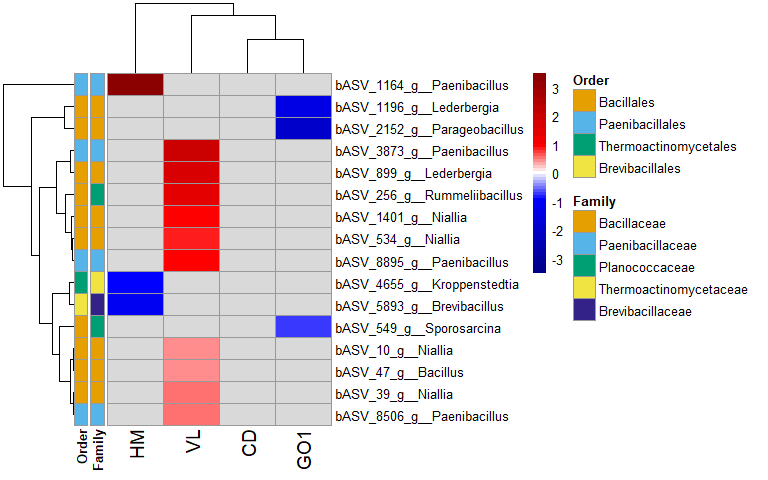<!-- -->

#### Heatmap order by taxonomy

``` r
# Create ordering index
ord <- order(tax_bas2$Phylum, tax_bas2$Class, tax_bas2$Order, tax_bas2$Family, tax_bas2$Genus)

# Reorder matrix
AllAcc_lfc_bas <- AllAcc_lfc_bas[ord, ]

# Reorder annotation accordingly
tax_bas2 <- tax_bas2[ord, , drop = FALSE]

# Make sure legend is in same direction
tax_bas2$Phylum <- factor(tax_bas2$Phylum, levels = unique(tax_bas2$Phylum))
tax_bas2$Class <- factor(tax_bas2$Class, levels = unique(tax_bas2$Class))
tax_bas2$Order <- factor(tax_bas2$Order, levels = unique(tax_bas2$Order))
tax_bas2$Family <- factor(tax_bas2$Family, levels = unique(tax_bas2$Family))
tax_bas2$Genus <- factor(tax_bas2$Genus, levels = unique(tax_bas2$Genus))

# Reorder color class vector
Order_Family_colors2_bas$Order <- Order_Family_colors2_bas$Order[levels(tax_bas2$Order)]
Order_Family_colors2_bas$Family <- Order_Family_colors2_bas$Family[levels(tax_bas2$Family)]
```


``` r
# Heatmap
p <- pheatmap(AllAcc_lfc_bas,
          cluster_rows = FALSE,
          cluster_cols = FALSE,
          color = colorRampPalette(c("darkblue", "blue", "white", "red", "darkred"))(50),
          breaks = seq(-max_abs, max_abs, length.out = 51),
          #main = "Differentially abundant tax_bas2a (log2FC by Family)",
          cellwidth = 25,
          cellheight = 9.5,
          fontsize_row = 9,
          fontsize_col = 14,
          na_col = "grey90",
          angle_col = 90,
          annotation_row = tax_bas2[3:4],
          annotation_colors = Order_Family_colors2_bas)
p 
```

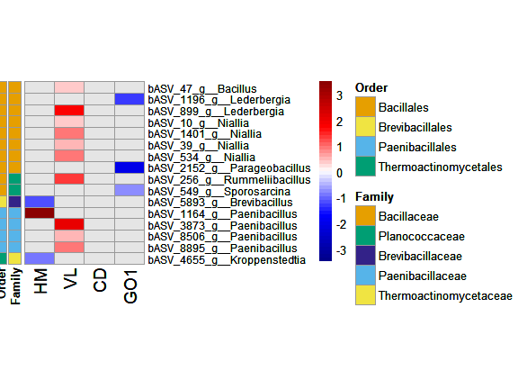<!-- -->

``` r
files <- c("FP_DAHeatmap_ASV_Bacilli.svg", "FP_DAHeatmap_ASV_Bacili.png")

mapply(function(x){
  file_path <- file.path("C:/Users/kreek001/OneDrive - Wageningen University & Research/Chapters/Experimental Chapter 3/Result/Final graphs", x)

  if (grepl("svg$", x)) {
    svg(file_path, width = 20/2.54, height = 7/2.54)
  } else {
    png(file_path, width = 20, height = 7, units = "cm", res = 300)
  }
  grid::grid.draw(p$gtable)
  dev.off()
}, files)
```

```
## FP_DAHeatmap_ASV_Bacilli.svg.png  FP_DAHeatmap_ASV_Bacili.png.png 
##                                2                                2
```

``` r
rm(p)
```

## Gammaproteobacteria
#### Subset Gammaproteobacteria

``` r
# Subset taxonomy table
tax_gam <- tax[tax$Class == "c__Gammaproteobacteria", ]
tax_gam
```

```
##                                                    Genus                Family
## bASV_1002                                g__Unclassified     f__Comamonadaceae
## bASV_10085                               g__Unclassified     f__Comamonadaceae
## bASV_1060                                    g__Massilia   f__Oxalobacteraceae
## bASV_1071                                  g__Lysobacter    f__Lysobacteraceae
## bASV_1077                           g__Lacisediminimonas   f__Oxalobacteraceae
## bASV_10830                               g__Unclassified   f__Oxalobacteraceae
## bASV_1108                                g__Unclassified     f__Comamonadaceae
## bASV_11225                               g__Unclassified   f__Oxalobacteraceae
## bASV_1130                                 g__Ramlibacter     f__Comamonadaceae
## bASV_1146                                  g__Dokdonella f__Rhodanobacteraceae
## bASV_1157                                   g__Ellin6067  f__Nitrosomonadaceae
## bASV_11668 g__Burkholderia-Caballeronia-Paraburkholderia   f__Burkholderiaceae
## bASV_11729                                  g__Ellin6067  f__Nitrosomonadaceae
## bASV_1231                                g__Unclassified   f__Oxalobacteraceae
## bASV_13076                             g__Incertae_Sedis            f__TRA3-20
## bASV_13121                         g__Noviherbaspirillum   f__Oxalobacteraceae
## bASV_1345                              g__Incertae_Sedis   f__Oxalobacteraceae
## bASV_1371                             g__Pseudoduganella   f__Oxalobacteraceae
## bASV_1385                              g__Incertae_Sedis            f__SC-I-84
## bASV_1463                          g__Noviherbaspirillum   f__Oxalobacteraceae
## bASV_1575                                   g__Duganella   f__Oxalobacteraceae
## bASV_1652                                 g__Cupriavidus   f__Burkholderiaceae
## bASV_1762                                 g__Pseudomonas   f__Pseudomonadaceae
## bASV_1798                                    g__Massilia   f__Oxalobacteraceae
## bASV_1899                              g__Incertae_Sedis            f__SC-I-84
## bASV_199                               g__Incertae_Sedis            f__SC-I-84
## bASV_2027                                g__Unclassified     f__Comamonadaceae
## bASV_2062                               g__Azohydromonas     f__Comamonadaceae
## bASV_214                                  g__Ramlibacter     f__Comamonadaceae
## bASV_2188                                  g__Bordetella     f__Alcaligenaceae
## bASV_2277                                 g__Rhizobacter     f__Comamonadaceae
## bASV_22948 g__Burkholderia-Caballeronia-Paraburkholderia   f__Burkholderiaceae
## bASV_2352  g__Burkholderia-Caballeronia-Paraburkholderia   f__Burkholderiaceae
## bASV_2368                                   g__Ellin6067  f__Nitrosomonadaceae
## bASV_2393                                  g__Caenimonas     f__Comamonadaceae
## bASV_2425                                    g__Massilia   f__Oxalobacteraceae
## bASV_24934                               g__Unclassified       f__Unclassified
## bASV_2540                                 g__Ramlibacter     f__Comamonadaceae
## bASV_2655                               g__Herminiimonas   f__Oxalobacteraceae
## bASV_2747                                g__Unclassified     f__Comamonadaceae
## bASV_2777                                  g__Caenimonas     f__Comamonadaceae
## bASV_2867                                 g__Rhizobacter     f__Comamonadaceae
## bASV_290                                   g__Caenimonas     f__Comamonadaceae
## bASV_2979                                g__Unclassified     f__Comamonadaceae
## bASV_3012                                    g__Massilia   f__Oxalobacteraceae
## bASV_315                                  g__Ramlibacter     f__Comamonadaceae
## bASV_3158                                    g__Massilia   f__Oxalobacteraceae
## bASV_3190                              g__Incertae_Sedis   f__Oxalobacteraceae
## bASV_3207                                   g__Ellin6067  f__Nitrosomonadaceae
## bASV_3249                              g__Incertae_Sedis            f__TRA3-20
## bASV_326                                     g__Massilia   f__Oxalobacteraceae
## bASV_330   g__Burkholderia-Caballeronia-Paraburkholderia   f__Burkholderiaceae
## bASV_3348                                    g__Azospira     f__Rhodocyclaceae
## bASV_3393                                  g__Caenimonas     f__Comamonadaceae
## bASV_3469                                g__Unclassified   f__Oxalobacteraceae
## bASV_3547                                 g__Cupriavidus   f__Burkholderiaceae
## bASV_356                                    g__Ellin6067  f__Nitrosomonadaceae
## bASV_363                                   g__Tahibacter f__Rhodanobacteraceae
## bASV_3726                              g__Incertae_Sedis            f__SC-I-84
## bASV_3753                                 g__Ramlibacter     f__Comamonadaceae
## bASV_3862                          g__Noviherbaspirillum   f__Oxalobacteraceae
## bASV_4029                                        g__MND1  f__Nitrosomonadaceae
## bASV_4079                           g__Lacisediminimonas   f__Oxalobacteraceae
## bASV_4314                                 g__Ramlibacter     f__Comamonadaceae
## bASV_4664                          g__Noviherbaspirillum   f__Oxalobacteraceae
## bASV_4871                                  g__Caenimonas     f__Comamonadaceae
## bASV_4872                          g__Noviherbaspirillum   f__Oxalobacteraceae
## bASV_491                           g__Noviherbaspirillum   f__Oxalobacteraceae
## bASV_5157                                    g__Massilia   f__Oxalobacteraceae
## bASV_5339                          g__Noviherbaspirillum   f__Oxalobacteraceae
## bASV_557                                 g__Unclassified     f__Comamonadaceae
## bASV_559                               g__Incertae_Sedis            f__SC-I-84
## bASV_5762  g__Burkholderia-Caballeronia-Paraburkholderia   f__Burkholderiaceae
## bASV_5795                                g__Unclassified     f__Comamonadaceae
## bASV_63                                      g__Massilia   f__Oxalobacteraceae
## bASV_6380                                g__Unclassified   f__Oxalobacteraceae
## bASV_6708                                   g__Ellin6067  f__Nitrosomonadaceae
## bASV_7274                                g__Unclassified     f__Comamonadaceae
## bASV_732                              g__Pseudoduganella   f__Oxalobacteraceae
## bASV_7439                                   g__Duganella   f__Oxalobacteraceae
## bASV_8134                                  g__Caenimonas     f__Comamonadaceae
## bASV_8223  g__Burkholderia-Caballeronia-Paraburkholderia   f__Burkholderiaceae
## bASV_831   g__Burkholderia-Caballeronia-Paraburkholderia   f__Burkholderiaceae
## bASV_8335                                   g__Duganella   f__Oxalobacteraceae
## bASV_8409                                  g__Caenimonas     f__Comamonadaceae
## bASV_855                           g__Noviherbaspirillum   f__Oxalobacteraceae
## bASV_8819                                g__Unclassified   f__Oxalobacteraceae
## bASV_917                                   g__Cellvibrio   f__Cellvibrionaceae
## bASV_930                                     g__Massilia   f__Oxalobacteraceae
## bASV_939                                   g__Caenimonas     f__Comamonadaceae
## bASV_9540                           g__Lacisediminimonas   f__Oxalobacteraceae
## bASV_9605                                    g__Massilia   f__Oxalobacteraceae
## bASV_9867                                g__Unclassified   f__Oxalobacteraceae
## bASV_9884                          g__Noviherbaspirillum   f__Oxalobacteraceae
## bASV_995                                   g__Acidovorax     f__Comamonadaceae
##                         Order                  Class            Phylum
## bASV_1002  o__Burkholderiales c__Gammaproteobacteria p__Pseudomonadota
## bASV_10085 o__Burkholderiales c__Gammaproteobacteria p__Pseudomonadota
## bASV_1060  o__Burkholderiales c__Gammaproteobacteria p__Pseudomonadota
## bASV_1071   o__Lysobacterales c__Gammaproteobacteria p__Pseudomonadota
## bASV_1077  o__Burkholderiales c__Gammaproteobacteria p__Pseudomonadota
## bASV_10830 o__Burkholderiales c__Gammaproteobacteria p__Pseudomonadota
## bASV_1108  o__Burkholderiales c__Gammaproteobacteria p__Pseudomonadota
## bASV_11225 o__Burkholderiales c__Gammaproteobacteria p__Pseudomonadota
## bASV_1130  o__Burkholderiales c__Gammaproteobacteria p__Pseudomonadota
## bASV_1146   o__Lysobacterales c__Gammaproteobacteria p__Pseudomonadota
## bASV_1157  o__Burkholderiales c__Gammaproteobacteria p__Pseudomonadota
## bASV_11668 o__Burkholderiales c__Gammaproteobacteria p__Pseudomonadota
## bASV_11729 o__Burkholderiales c__Gammaproteobacteria p__Pseudomonadota
## bASV_1231  o__Burkholderiales c__Gammaproteobacteria p__Pseudomonadota
## bASV_13076 o__Burkholderiales c__Gammaproteobacteria p__Pseudomonadota
## bASV_13121 o__Burkholderiales c__Gammaproteobacteria p__Pseudomonadota
## bASV_1345  o__Burkholderiales c__Gammaproteobacteria p__Pseudomonadota
## bASV_1371  o__Burkholderiales c__Gammaproteobacteria p__Pseudomonadota
## bASV_1385  o__Burkholderiales c__Gammaproteobacteria p__Pseudomonadota
## bASV_1463  o__Burkholderiales c__Gammaproteobacteria p__Pseudomonadota
## bASV_1575  o__Burkholderiales c__Gammaproteobacteria p__Pseudomonadota
## bASV_1652  o__Burkholderiales c__Gammaproteobacteria p__Pseudomonadota
## bASV_1762  o__Pseudomonadales c__Gammaproteobacteria p__Pseudomonadota
## bASV_1798  o__Burkholderiales c__Gammaproteobacteria p__Pseudomonadota
## bASV_1899  o__Burkholderiales c__Gammaproteobacteria p__Pseudomonadota
## bASV_199   o__Burkholderiales c__Gammaproteobacteria p__Pseudomonadota
## bASV_2027  o__Burkholderiales c__Gammaproteobacteria p__Pseudomonadota
## bASV_2062  o__Burkholderiales c__Gammaproteobacteria p__Pseudomonadota
## bASV_214   o__Burkholderiales c__Gammaproteobacteria p__Pseudomonadota
## bASV_2188  o__Burkholderiales c__Gammaproteobacteria p__Pseudomonadota
## bASV_2277  o__Burkholderiales c__Gammaproteobacteria p__Pseudomonadota
## bASV_22948 o__Burkholderiales c__Gammaproteobacteria p__Pseudomonadota
## bASV_2352  o__Burkholderiales c__Gammaproteobacteria p__Pseudomonadota
## bASV_2368  o__Burkholderiales c__Gammaproteobacteria p__Pseudomonadota
## bASV_2393  o__Burkholderiales c__Gammaproteobacteria p__Pseudomonadota
## bASV_2425  o__Burkholderiales c__Gammaproteobacteria p__Pseudomonadota
## bASV_24934 o__Burkholderiales c__Gammaproteobacteria p__Pseudomonadota
## bASV_2540  o__Burkholderiales c__Gammaproteobacteria p__Pseudomonadota
## bASV_2655  o__Burkholderiales c__Gammaproteobacteria p__Pseudomonadota
## bASV_2747  o__Burkholderiales c__Gammaproteobacteria p__Pseudomonadota
## bASV_2777  o__Burkholderiales c__Gammaproteobacteria p__Pseudomonadota
## bASV_2867  o__Burkholderiales c__Gammaproteobacteria p__Pseudomonadota
## bASV_290   o__Burkholderiales c__Gammaproteobacteria p__Pseudomonadota
## bASV_2979  o__Burkholderiales c__Gammaproteobacteria p__Pseudomonadota
## bASV_3012  o__Burkholderiales c__Gammaproteobacteria p__Pseudomonadota
## bASV_315   o__Burkholderiales c__Gammaproteobacteria p__Pseudomonadota
## bASV_3158  o__Burkholderiales c__Gammaproteobacteria p__Pseudomonadota
## bASV_3190  o__Burkholderiales c__Gammaproteobacteria p__Pseudomonadota
## bASV_3207  o__Burkholderiales c__Gammaproteobacteria p__Pseudomonadota
## bASV_3249  o__Burkholderiales c__Gammaproteobacteria p__Pseudomonadota
## bASV_326   o__Burkholderiales c__Gammaproteobacteria p__Pseudomonadota
## bASV_330   o__Burkholderiales c__Gammaproteobacteria p__Pseudomonadota
## bASV_3348  o__Burkholderiales c__Gammaproteobacteria p__Pseudomonadota
## bASV_3393  o__Burkholderiales c__Gammaproteobacteria p__Pseudomonadota
## bASV_3469  o__Burkholderiales c__Gammaproteobacteria p__Pseudomonadota
## bASV_3547  o__Burkholderiales c__Gammaproteobacteria p__Pseudomonadota
## bASV_356   o__Burkholderiales c__Gammaproteobacteria p__Pseudomonadota
## bASV_363    o__Lysobacterales c__Gammaproteobacteria p__Pseudomonadota
## bASV_3726  o__Burkholderiales c__Gammaproteobacteria p__Pseudomonadota
## bASV_3753  o__Burkholderiales c__Gammaproteobacteria p__Pseudomonadota
## bASV_3862  o__Burkholderiales c__Gammaproteobacteria p__Pseudomonadota
## bASV_4029  o__Burkholderiales c__Gammaproteobacteria p__Pseudomonadota
## bASV_4079  o__Burkholderiales c__Gammaproteobacteria p__Pseudomonadota
## bASV_4314  o__Burkholderiales c__Gammaproteobacteria p__Pseudomonadota
## bASV_4664  o__Burkholderiales c__Gammaproteobacteria p__Pseudomonadota
## bASV_4871  o__Burkholderiales c__Gammaproteobacteria p__Pseudomonadota
## bASV_4872  o__Burkholderiales c__Gammaproteobacteria p__Pseudomonadota
## bASV_491   o__Burkholderiales c__Gammaproteobacteria p__Pseudomonadota
## bASV_5157  o__Burkholderiales c__Gammaproteobacteria p__Pseudomonadota
## bASV_5339  o__Burkholderiales c__Gammaproteobacteria p__Pseudomonadota
## bASV_557   o__Burkholderiales c__Gammaproteobacteria p__Pseudomonadota
## bASV_559   o__Burkholderiales c__Gammaproteobacteria p__Pseudomonadota
## bASV_5762  o__Burkholderiales c__Gammaproteobacteria p__Pseudomonadota
## bASV_5795  o__Burkholderiales c__Gammaproteobacteria p__Pseudomonadota
## bASV_63    o__Burkholderiales c__Gammaproteobacteria p__Pseudomonadota
## bASV_6380  o__Burkholderiales c__Gammaproteobacteria p__Pseudomonadota
## bASV_6708  o__Burkholderiales c__Gammaproteobacteria p__Pseudomonadota
## bASV_7274  o__Burkholderiales c__Gammaproteobacteria p__Pseudomonadota
## bASV_732   o__Burkholderiales c__Gammaproteobacteria p__Pseudomonadota
## bASV_7439  o__Burkholderiales c__Gammaproteobacteria p__Pseudomonadota
## bASV_8134  o__Burkholderiales c__Gammaproteobacteria p__Pseudomonadota
## bASV_8223  o__Burkholderiales c__Gammaproteobacteria p__Pseudomonadota
## bASV_831   o__Burkholderiales c__Gammaproteobacteria p__Pseudomonadota
## bASV_8335  o__Burkholderiales c__Gammaproteobacteria p__Pseudomonadota
## bASV_8409  o__Burkholderiales c__Gammaproteobacteria p__Pseudomonadota
## bASV_855   o__Burkholderiales c__Gammaproteobacteria p__Pseudomonadota
## bASV_8819  o__Burkholderiales c__Gammaproteobacteria p__Pseudomonadota
## bASV_917   o__Pseudomonadales c__Gammaproteobacteria p__Pseudomonadota
## bASV_930   o__Burkholderiales c__Gammaproteobacteria p__Pseudomonadota
## bASV_939   o__Burkholderiales c__Gammaproteobacteria p__Pseudomonadota
## bASV_9540  o__Burkholderiales c__Gammaproteobacteria p__Pseudomonadota
## bASV_9605  o__Burkholderiales c__Gammaproteobacteria p__Pseudomonadota
## bASV_9867  o__Burkholderiales c__Gammaproteobacteria p__Pseudomonadota
## bASV_9884  o__Burkholderiales c__Gammaproteobacteria p__Pseudomonadota
## bASV_995   o__Burkholderiales c__Gammaproteobacteria p__Pseudomonadota
```

``` r
# Extract ASV numbers Bacilli ASVs
ASVs_gam <- rownames(tax_gam)

# Subset lfc matrix with Bacilli
AllAcc_lfc_gam <- AllAcc_lfc[AllAcc_lfc$ASV %in% ASVs_gam, ]
AllAcc_lfc_gam
```

```
##                   ASV         HM         VL         CD        GO1
## bASV_1002   bASV_1002  2.1633641         NA         NA         NA
## bASV_10085 bASV_10085         NA  1.0362153         NA         NA
## bASV_1060   bASV_1060         NA         NA         NA  2.1968539
## bASV_1071   bASV_1071  1.7974984         NA         NA         NA
## bASV_1077   bASV_1077 -1.6782934         NA         NA         NA
## bASV_10830 bASV_10830 -0.6065918         NA         NA         NA
## bASV_1108   bASV_1108 -2.7341727         NA         NA         NA
## bASV_11225 bASV_11225         NA  0.7589564         NA         NA
## bASV_1130   bASV_1130         NA  0.6882884         NA         NA
## bASV_1146   bASV_1146         NA         NA         NA -1.7133187
## bASV_1157   bASV_1157         NA  0.8976821         NA         NA
## bASV_11668 bASV_11668 -0.6876849         NA         NA         NA
## bASV_11729 bASV_11729         NA         NA         NA -0.4306166
## bASV_1231   bASV_1231 -2.2926609         NA         NA         NA
## bASV_13076 bASV_13076 -0.4679624         NA         NA         NA
## bASV_13121 bASV_13121 -0.4679624         NA         NA         NA
## bASV_1345   bASV_1345 -1.8705296  3.3425608         NA         NA
## bASV_1371   bASV_1371 -1.7149201         NA -2.9032783         NA
## bASV_1385   bASV_1385 -1.7836167         NA         NA         NA
## bASV_1463   bASV_1463 -2.5960784         NA         NA         NA
## bASV_1575   bASV_1575 -1.8665654         NA         NA         NA
## bASV_1652   bASV_1652         NA         NA -3.0446516         NA
## bASV_1762   bASV_1762  1.6198460         NA         NA         NA
## bASV_1798   bASV_1798         NA         NA         NA  1.0017425
## bASV_1899   bASV_1899 -1.4587754         NA         NA         NA
## bASV_199     bASV_199         NA  0.6252217         NA         NA
## bASV_2027   bASV_2027         NA  1.5215003         NA         NA
## bASV_2062   bASV_2062  1.9325871         NA         NA         NA
## bASV_214     bASV_214         NA  0.6097763 -0.6292862         NA
## bASV_2188   bASV_2188 -1.8877275         NA         NA         NA
## bASV_2277   bASV_2277  2.1067090         NA         NA         NA
## bASV_22948 bASV_22948 -0.4679624         NA         NA         NA
## bASV_2352   bASV_2352 -1.5566021         NA         NA         NA
## bASV_2368   bASV_2368 -0.7818417         NA         NA         NA
## bASV_2393   bASV_2393 -2.3562528         NA         NA         NA
## bASV_2425   bASV_2425 -0.6790074         NA         NA         NA
## bASV_24934 bASV_24934         NA  0.5392339         NA         NA
## bASV_2540   bASV_2540 -1.6016351         NA         NA -1.6872628
## bASV_2655   bASV_2655  2.0828227         NA         NA         NA
## bASV_2747   bASV_2747         NA         NA -1.2389626         NA
## bASV_2777   bASV_2777         NA         NA -1.6130696         NA
## bASV_2867   bASV_2867  1.6633499         NA         NA         NA
## bASV_290     bASV_290         NA  0.7119827         NA         NA
## bASV_2979   bASV_2979         NA         NA         NA -0.9974828
## bASV_3012   bASV_3012  1.1929661         NA         NA         NA
## bASV_315     bASV_315         NA  0.4535477         NA         NA
## bASV_3158   bASV_3158  1.2871766         NA         NA         NA
## bASV_3190   bASV_3190         NA         NA  1.2791819         NA
## bASV_3207   bASV_3207         NA  0.5392339         NA         NA
## bASV_3249   bASV_3249         NA         NA         NA  2.2549522
## bASV_326     bASV_326  0.8856569         NA         NA         NA
## bASV_330     bASV_330 -0.7848175         NA         NA         NA
## bASV_3348   bASV_3348  3.1164098         NA         NA         NA
## bASV_3393   bASV_3393 -1.2623014         NA         NA         NA
## bASV_3469   bASV_3469 -1.1117376         NA         NA         NA
## bASV_3547   bASV_3547 -0.8709430         NA         NA         NA
## bASV_356     bASV_356 -0.4626280         NA         NA         NA
## bASV_363     bASV_363  1.7803907         NA         NA         NA
## bASV_3726   bASV_3726 -0.9520360         NA         NA         NA
## bASV_3753   bASV_3753         NA  1.9799150         NA         NA
## bASV_3862   bASV_3862 -1.1592539         NA         NA         NA
## bASV_4029   bASV_4029         NA  1.2559377         NA         NA
## bASV_4079   bASV_4079 -1.5511825         NA         NA         NA
## bASV_4314   bASV_4314 -1.5665747         NA         NA         NA
## bASV_4664   bASV_4664 -1.5360927         NA         NA         NA
## bASV_4871   bASV_4871 -1.0460368         NA         NA         NA
## bASV_4872   bASV_4872 -1.2868313         NA         NA         NA
## bASV_491     bASV_491  1.9927230         NA         NA         NA
## bASV_5157   bASV_5157         NA         NA  1.0366340         NA
## bASV_5339   bASV_5339 -0.6065918         NA         NA         NA
## bASV_557     bASV_557  1.8182156         NA         NA         NA
## bASV_559     bASV_559         NA  1.8153519         NA         NA
## bASV_5762   bASV_5762 -1.0557823         NA         NA         NA
## bASV_5795   bASV_5795  2.5685645         NA         NA         NA
## bASV_63       bASV_63         NA  0.4434501         NA         NA
## bASV_6380   bASV_6380 -0.7898500         NA         NA         NA
## bASV_6708   bASV_6708         NA  0.6203269         NA         NA
## bASV_7274   bASV_7274 -1.2694291         NA         NA         NA
## bASV_732     bASV_732         NA -0.4283267         NA         NA
## bASV_7439   bASV_7439 -1.0672650         NA         NA         NA
## bASV_8134   bASV_8134 -1.1928306         NA         NA         NA
## bASV_8223   bASV_8223 -0.7452213         NA         NA         NA
## bASV_831     bASV_831 -1.3237199         NA         NA         NA
## bASV_8335   bASV_8335         NA  0.5392339         NA         NA
## bASV_8409   bASV_8409 -1.2868313         NA         NA         NA
## bASV_855     bASV_855 -2.4042244         NA         NA         NA
## bASV_8819   bASV_8819 -1.0460368         NA         NA         NA
## bASV_917     bASV_917         NA         NA -1.9902573         NA
## bASV_930     bASV_930 -2.4259447         NA         NA         NA
## bASV_939     bASV_939         NA  1.7915720         NA         NA
## bASV_9540   bASV_9540         NA         NA         NA -0.8447677
## bASV_9605   bASV_9605 -0.4679624         NA         NA         NA
## bASV_9867   bASV_9867 -0.4679624         NA         NA -0.8447677
## bASV_9884   bASV_9884 -0.6065918         NA         NA         NA
## bASV_995     bASV_995  1.3631686         NA         NA         NA
```

#### Preparing heatmap

``` r
# Add genus to matrix
AllAcc_lfc_gam$ASV <- rownames(AllAcc_lfc_gam)
tax_gam$ASV <- rownames(tax_gam)
AllAcc_lfc_gam <- merge(tax_gam, AllAcc_lfc_gam, ID = "ASV")

# Add higher taxon_gamomic level if genus is NA or Incertae Sedis
taxon_gam <- AllAcc_lfc_gam$Genus
taxon_gam[is.na(taxon_gam)] <- AllAcc_lfc_gam$Family[is.na(taxon_gam)]
taxon_gam[is.na(taxon_gam)] <- AllAcc_lfc_gam$Order[is.na(taxon_gam)]

taxon_gam[taxon_gam == "g__Incertae_Sedis"] <- AllAcc_lfc_gam$Family[taxon_gam == "g__Incertae_Sedis"]
taxon_gam[taxon_gam == "f__Incertae_Sedis"] <- AllAcc_lfc_gam$Order[taxon_gam == "f__Incertae_Sedis"]
taxon_gam[taxon_gam == "o__Incertae_Sedis"] <- AllAcc_lfc_gam$Class[taxon_gam == "o__Incertae_Sedis"]

taxon_gam[taxon_gam == "g__Unclassified"] <- AllAcc_lfc_gam$Family[taxon_gam == "g__Unclassified"]
taxon_gam[taxon_gam == "f__Unclassified"] <- AllAcc_lfc_gam$Order[taxon_gam == "f__Unclassified"]
taxon_gam[taxon_gam == "o__Unclassified"] <- AllAcc_lfc_gam$Class[taxon_gam == "o__Unclassified"]

rownames(AllAcc_lfc_gam) <- paste(AllAcc_lfc_gam$ASV, taxon_gam, sep = "_")

AllAcc_lfc_gam$Phylum <- sub("p__", "", AllAcc_lfc_gam$Phylum)
AllAcc_lfc_gam$Class <- sub("c__", "", AllAcc_lfc_gam$Class)
AllAcc_lfc_gam$Order <- sub("o__", "", AllAcc_lfc_gam$Order)
AllAcc_lfc_gam$Family <- sub("f__", "", AllAcc_lfc_gam$Family)

AllAcc_lfc_gam3_df <- AllAcc_lfc_gam
tax_gam2 <- AllAcc_lfc_gam[1:6]
AllAcc_lfc_gam <- AllAcc_lfc_gam[7:10]
head(AllAcc_lfc_gam)
```

```
##                                        HM       VL CD      GO1
## bASV_1002_f__Comamonadaceae     2.1633641       NA NA       NA
## bASV_10085_f__Comamonadaceae           NA 1.036215 NA       NA
## bASV_1060_g__Massilia                  NA       NA NA 2.196854
## bASV_1071_g__Lysobacter         1.7974984       NA NA       NA
## bASV_1077_g__Lacisediminimonas -1.6782934       NA NA       NA
## bASV_10830_f__Oxalobacteraceae -0.6065918       NA NA       NA
```

``` r
# Make color pallet for class
colors35 <- c("#E69F00", "#56B4E9", "#009E73", "#F0E442", "#332288", "#CC79A7",
              "#D55E00", "#999999", "#88CCEE", "#44AA99", "#0072B2", "#000000",
              "#117733", "#999933", "#DDCC77", "#CC6677", "#882255", "#AA4499",
              "#661100", "#6699CC", "#AA4466", "#4477AA", "#EE6677", "#BBBBBB",
              "#2E3440", "#8FBCBB", "#BF616A", "#A3BE8C", "#EBCB8B", "#B48EAD",
              "#5E81AC", "#D08770", "#3B4252", "#7B9E87")

Family2 <- unique(tax_gam2$Family)
Family_colors2_gam2 <- setNames(colors35[1:length(Family2)], Family2)
Family_colors2_gam2 <- list(Family = Family_colors2_gam2)

# Make color pallet for Order for genus in plot
Order2 <- unique(tax_gam2$Order)
Order_colors2_gam2 <- setNames(colors35[1:length(Order2)], Order2)
Order_colors2_gam2 <- list(Order = Order_colors2_gam2)

Order_Family_colors2_gam <- c(Order_colors2_gam2, Family_colors2_gam2)

# Turn data frame into a matrix
AllAcc_lfc_gam <- as.matrix(AllAcc_lfc_gam)

# replace NAs by 0s
AllAcc_lfc_gam_clu <- AllAcc_lfc_gam
AllAcc_lfc_gam_clu[is.na(AllAcc_lfc_gam_clu)] <- 0

# breaks in heatmap
max_abs <- max(abs(AllAcc_lfc_gam), na.rm = TRUE)
breaks <- unique(c(seq(-max_abs, -1, length.out = 10), 
                   seq(-1, 1, length.out = 20), # More breaks in this range for sensitivity
                   seq(1, max_abs, length.out = 10)))
```

#### Heatmap 

``` r
pheatmap(AllAcc_lfc_gam,
          clustering_distance_rows = dist(AllAcc_lfc_gam_clu),
          clustering_distance_cols = dist(t(AllAcc_lfc_gam_clu)),
          color = colorRampPalette(c("darkblue", "blue", "white", "red", "darkred"))(length(breaks) - 1),
          breaks = breaks,
          fontsize_col = 14,
          fontsize_row = 7,
          na_col = "grey85",
          angle_col = 90,
          show_rownames = TRUE,
          annotation_row = tax_gam2[3:4],
          annotation_colors = Order_Family_colors2_gam)
```

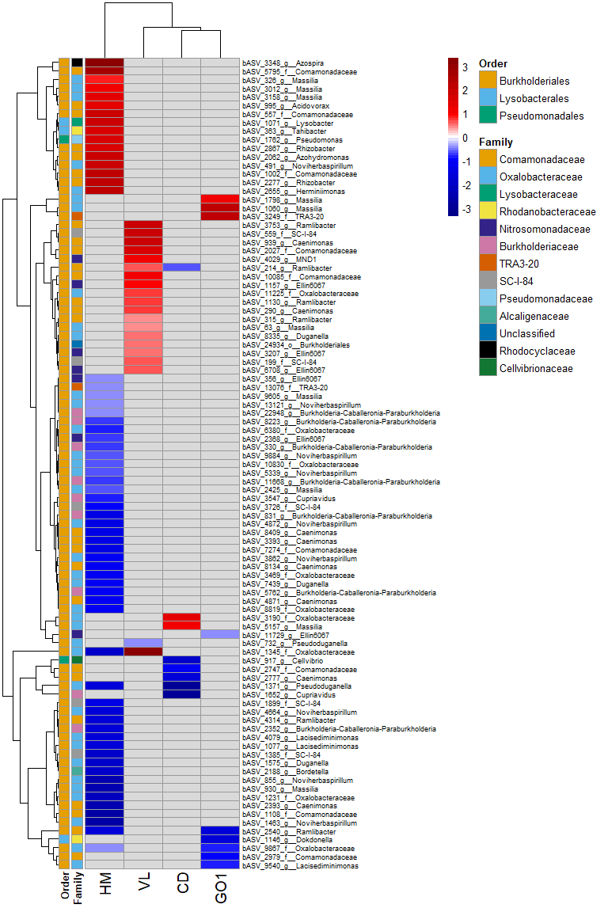<!-- -->

#### Heatmap order by taxonomy

``` r
# Create ordering index
ord <- order(tax_gam2$Phylum, tax_gam2$Class, tax_gam2$Order, tax_gam2$Family, tax_gam2$Genus)

# Reorder matrix
AllAcc_lfc_gam <- AllAcc_lfc_gam[ord, ]

# Reorder annotation accordingly
tax_gam2 <- tax_gam2[ord, , drop = FALSE]

# Make sure legend is in same direction
tax_gam2$Phylum <- factor(tax_gam2$Phylum, levels = unique(tax_gam2$Phylum))
tax_gam2$Class <- factor(tax_gam2$Class, levels = unique(tax_gam2$Class))
tax_gam2$Order <- factor(tax_gam2$Order, levels = unique(tax_gam2$Order))
tax_gam2$Family <- factor(tax_gam2$Family, levels = unique(tax_gam2$Family))
tax_gam2$Genus <- factor(tax_gam2$Genus, levels = unique(tax_gam2$Genus))

# Reorder color class vector
Order_Family_colors2_gam$Order <- Order_Family_colors2_gam$Order[levels(tax_gam2$Order)]
Order_Family_colors2_gam$Family <- Order_Family_colors2_gam$Family[levels(tax_gam2$Family)]
```


``` r
# Heatmap
p <- pheatmap(AllAcc_lfc_gam,
          cluster_rows = FALSE,
          cluster_cols = FALSE,
          color = colorRampPalette(c("darkblue", "blue", "white", "red", "darkred"))(50),
          breaks = seq(-max_abs, max_abs, length.out = 51),
          #main = "Differentially abundant tax_gam2a (log2FC by Family)",
          cellwidth = 25,
          cellheight = 9.5,
          fontsize_row = 9,
          fontsize_col = 14,
          na_col = "grey90",
          angle_col = 90,
          annotation_row = tax_gam2[3:4],
          annotation_colors = Order_Family_colors2_gam)
p 
```

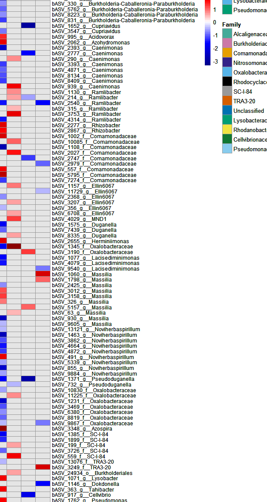<!-- -->

``` r
files <- c("FP_DAHeatmap_ASV_Gammaproteobacteria.svg", "FP_DAHeatmap_ASV_Gammaproteobacteria.png")

mapply(function(x){
  file_path <- file.path("C:/Users/kreek001/OneDrive - Wageningen University & Research/Chapters/Experimental Chapter 3/Result/Final graphs", x)

  if (grepl("svg$", x)) {
    svg(file_path, width = 20/2.54, height = 34/2.54)
  } else {
    png(file_path, width = 20, height = 34, units = "cm", res = 300)
  }
  grid::grid.draw(p$gtable)
  dev.off()
}, files)
```

```
## FP_DAHeatmap_ASV_Gammaproteobacteria.svg.png 
##                                            2 
## FP_DAHeatmap_ASV_Gammaproteobacteria.png.png 
##                                            2
```

``` r
rm(p)
```

## Alphaproteobacteria
#### Subset Alphaproteobacteria

``` r
# Subset taxonomy table
tax_alp <- tax[tax$Class == "c__Alphaproteobacteria", ]
tax_alp
```

```
##                                  Genus                             Family
## bASV_1028              g__Sphingomonas               f__Sphingomonadaceae
## bASV_103             g__Incertae_Sedis              f__Methyloligellaceae
## bASV_1092                   g__Bauldia f__Hyphomicrobiales_Incertae_Sedis
## bASV_11148           g__Incertae_Sedis                f__Acetobacteraceae
## bASV_1177            g__Incertae_Sedis                f__Beijerinckiaceae
## bASV_1203            g__Incertae_Sedis                  f__Incertae_Sedis
## bASV_1285            g__Incertae_Sedis               f__Xanthobacteraceae
## bASV_1293               g__Rhodoplanes               f__Xanthobacteraceae
## bASV_1315            g__Incertae_Sedis                f__Caulobacteraceae
## bASV_1325              g__Unclassified                    f__Rhizobiaceae
## bASV_1354                 g__Dankookia                f__Acetobacteraceae
## bASV_1355            g__Hypericibacter                  f__Incertae_Sedis
## bASV_1405          g__Methylobacterium                f__Beijerinckiaceae
## bASV_1446              g__Unclassified                    f__Rhizobiaceae
## bASV_1456            g__Incertae_Sedis                  f__Incertae_Sedis
## bASV_149               g__Unclassified                f__Beijerinckiaceae
## bASV_154             g__Incertae_Sedis               f__Xanthobacteraceae
## bASV_1564            g__Incertae_Sedis               f__Xanthobacteraceae
## bASV_1584               g__Rhodoplanes               f__Xanthobacteraceae
## bASV_1593               g__Rhodovastum                f__Acetobacteraceae
## bASV_1603              g__Pseudolabrys               f__Xanthobacteraceae
## bASV_1618                g__Microvirga                f__Beijerinckiaceae
## bASV_166             g__Incertae_Sedis              f__Methyloligellaceae
## bASV_1665            g__Incertae_Sedis                      f__KF-JG30-B3
## bASV_1730               g__Rhodoplanes               f__Xanthobacteraceae
## bASV_176             g__Incertae_Sedis               f__Xanthobacteraceae
## bASV_182               g__Azospirillum                 f__Azospirillaceae
## bASV_183               g__Unclassified                    f__Rhizobiaceae
## bASV_2073            g__Rhodomicrobium               f__Rhodomicrobiaceae
## bASV_2105            g__Incertae_Sedis               f__Xanthobacteraceae
## bASV_2132            g__Incertae_Sedis                  f__Incertae_Sedis
## bASV_2195              g__Azospirillum                 f__Azospirillaceae
## bASV_2258                   g__Bauldia f__Hyphomicrobiales_Incertae_Sedis
## bASV_227               g__Sphingomonas               f__Sphingomonadaceae
## bASV_228           g__Methylobacterium                f__Beijerinckiaceae
## bASV_234               g__Unclassified                    f__Rhizobiaceae
## bASV_2378              g__Unclassified                    f__Rhizobiaceae
## bASV_2502              g__Unclassified                    f__Rhizobiaceae
## bASV_2528              g__Unclassified                    f__Rhizobiaceae
## bASV_2577            g__Incertae_Sedis f__Hyphomicrobiales_Incertae_Sedis
## bASV_2578                     g__Bosea                f__Beijerinckiaceae
## bASV_268           g__Methylobacterium                f__Beijerinckiaceae
## bASV_2709            g__Incertae_Sedis                f__Caulobacteraceae
## bASV_2717            g__Incertae_Sedis                f__Magnetospiraceae
## bASV_2727                g__Microvirga                f__Beijerinckiaceae
## bASV_2737            g__Incertae_Sedis                        f__URHD0088
## bASV_2770            g__Incertae_Sedis                 f__Azospirillaceae
## bASV_2949          g__Phenylobacterium                f__Caulobacteraceae
## bASV_2955  g__Candidatus_Alysiosphaera                 f__Geminicoccaceae
## bASV_3075            g__Incertae_Sedis                  f__Incertae_Sedis
## bASV_329                  g__Rhizobium                    f__Rhizobiaceae
## bASV_335           g__Phenylobacterium                f__Caulobacteraceae
## bASV_3408              g__Rhizorhabdus               f__Sphingomonadaceae
## bASV_3660            g__Incertae_Sedis                f__Caulobacteraceae
## bASV_3744              g__Unclassified                    f__Unclassified
## bASV_411                    g__Bauldia f__Hyphomicrobiales_Incertae_Sedis
## bASV_412                g__Rhodoplanes               f__Xanthobacteraceae
## bASV_42                g__Unclassified                f__Beijerinckiaceae
## bASV_464           g__Rhodopseudomonas               f__Xanthobacteraceae
## bASV_483                  g__Rhizobium                    f__Rhizobiaceae
## bASV_4912          g__Lichenibacterium                f__Beijerinckiaceae
## bASV_499               g__Sphingomonas               f__Sphingomonadaceae
## bASV_511             g__Incertae_Sedis                f__Caulobacteraceae
## bASV_542                  g__Ellin6055               f__Sphingomonadaceae
## bASV_5497            g__Incertae_Sedis f__Hyphomicrobiales_Incertae_Sedis
## bASV_561               g__Pseudolabrys               f__Xanthobacteraceae
## bASV_566              g__Methylorosula                f__Beijerinckiaceae
## bASV_5682                    g__Labrys                       f__Labraceae
## bASV_617               g__Unclassified                    f__Rhizobiaceae
## bASV_6343                g__Roseomonas                f__Acetobacteraceae
## bASV_673                  g__Ellin6055               f__Sphingomonadaceae
## bASV_697                g__Rhodoplanes               f__Xanthobacteraceae
## bASV_812             g__Incertae_Sedis                  f__Micropepsaceae
## bASV_8136            g__Incertae_Sedis               f__Xanthobacteraceae
## bASV_827                g__Rhodoplanes               f__Xanthobacteraceae
## bASV_840             g__Incertae_Sedis                  f__Micropepsaceae
## bASV_85               g__Mesorhizobium                    f__Rhizobiaceae
## bASV_888               g__Unclassified                     f__Devosiaceae
## bASV_969   g__Candidatus_Alysiosphaera                 f__Geminicoccaceae
##                          Order                  Class            Phylum
## bASV_1028  o__Sphingomonadales c__Alphaproteobacteria p__Pseudomonadota
## bASV_103   o__Hyphomicrobiales c__Alphaproteobacteria p__Pseudomonadota
## bASV_1092  o__Hyphomicrobiales c__Alphaproteobacteria p__Pseudomonadota
## bASV_11148  o__Acetobacterales c__Alphaproteobacteria p__Pseudomonadota
## bASV_1177  o__Hyphomicrobiales c__Alphaproteobacteria p__Pseudomonadota
## bASV_1203  o__Rhodospirillales c__Alphaproteobacteria p__Pseudomonadota
## bASV_1285  o__Hyphomicrobiales c__Alphaproteobacteria p__Pseudomonadota
## bASV_1293  o__Hyphomicrobiales c__Alphaproteobacteria p__Pseudomonadota
## bASV_1315   o__Caulobacterales c__Alphaproteobacteria p__Pseudomonadota
## bASV_1325  o__Hyphomicrobiales c__Alphaproteobacteria p__Pseudomonadota
## bASV_1354   o__Acetobacterales c__Alphaproteobacteria p__Pseudomonadota
## bASV_1355    o__Incertae_Sedis c__Alphaproteobacteria p__Pseudomonadota
## bASV_1405  o__Hyphomicrobiales c__Alphaproteobacteria p__Pseudomonadota
## bASV_1446  o__Hyphomicrobiales c__Alphaproteobacteria p__Pseudomonadota
## bASV_1456        o__Elsterales c__Alphaproteobacteria p__Pseudomonadota
## bASV_149   o__Hyphomicrobiales c__Alphaproteobacteria p__Pseudomonadota
## bASV_154   o__Hyphomicrobiales c__Alphaproteobacteria p__Pseudomonadota
## bASV_1564  o__Hyphomicrobiales c__Alphaproteobacteria p__Pseudomonadota
## bASV_1584  o__Hyphomicrobiales c__Alphaproteobacteria p__Pseudomonadota
## bASV_1593   o__Acetobacterales c__Alphaproteobacteria p__Pseudomonadota
## bASV_1603  o__Hyphomicrobiales c__Alphaproteobacteria p__Pseudomonadota
## bASV_1618  o__Hyphomicrobiales c__Alphaproteobacteria p__Pseudomonadota
## bASV_166   o__Hyphomicrobiales c__Alphaproteobacteria p__Pseudomonadota
## bASV_1665  o__Hyphomicrobiales c__Alphaproteobacteria p__Pseudomonadota
## bASV_1730  o__Hyphomicrobiales c__Alphaproteobacteria p__Pseudomonadota
## bASV_176   o__Hyphomicrobiales c__Alphaproteobacteria p__Pseudomonadota
## bASV_182     o__Azospirillales c__Alphaproteobacteria p__Pseudomonadota
## bASV_183   o__Hyphomicrobiales c__Alphaproteobacteria p__Pseudomonadota
## bASV_2073  o__Hyphomicrobiales c__Alphaproteobacteria p__Pseudomonadota
## bASV_2105  o__Hyphomicrobiales c__Alphaproteobacteria p__Pseudomonadota
## bASV_2132    o__Incertae_Sedis c__Alphaproteobacteria p__Pseudomonadota
## bASV_2195    o__Azospirillales c__Alphaproteobacteria p__Pseudomonadota
## bASV_2258  o__Hyphomicrobiales c__Alphaproteobacteria p__Pseudomonadota
## bASV_227   o__Sphingomonadales c__Alphaproteobacteria p__Pseudomonadota
## bASV_228   o__Hyphomicrobiales c__Alphaproteobacteria p__Pseudomonadota
## bASV_234   o__Hyphomicrobiales c__Alphaproteobacteria p__Pseudomonadota
## bASV_2378  o__Hyphomicrobiales c__Alphaproteobacteria p__Pseudomonadota
## bASV_2502  o__Hyphomicrobiales c__Alphaproteobacteria p__Pseudomonadota
## bASV_2528  o__Hyphomicrobiales c__Alphaproteobacteria p__Pseudomonadota
## bASV_2577  o__Hyphomicrobiales c__Alphaproteobacteria p__Pseudomonadota
## bASV_2578  o__Hyphomicrobiales c__Alphaproteobacteria p__Pseudomonadota
## bASV_268   o__Hyphomicrobiales c__Alphaproteobacteria p__Pseudomonadota
## bASV_2709   o__Caulobacterales c__Alphaproteobacteria p__Pseudomonadota
## bASV_2717  o__Rhodospirillales c__Alphaproteobacteria p__Pseudomonadota
## bASV_2727  o__Hyphomicrobiales c__Alphaproteobacteria p__Pseudomonadota
## bASV_2737        o__Elsterales c__Alphaproteobacteria p__Pseudomonadota
## bASV_2770    o__Azospirillales c__Alphaproteobacteria p__Pseudomonadota
## bASV_2949   o__Caulobacterales c__Alphaproteobacteria p__Pseudomonadota
## bASV_2955      o__Tistrellales c__Alphaproteobacteria p__Pseudomonadota
## bASV_3075        o__Elsterales c__Alphaproteobacteria p__Pseudomonadota
## bASV_329   o__Hyphomicrobiales c__Alphaproteobacteria p__Pseudomonadota
## bASV_335    o__Caulobacterales c__Alphaproteobacteria p__Pseudomonadota
## bASV_3408  o__Sphingomonadales c__Alphaproteobacteria p__Pseudomonadota
## bASV_3660   o__Caulobacterales c__Alphaproteobacteria p__Pseudomonadota
## bASV_3744  o__Hyphomicrobiales c__Alphaproteobacteria p__Pseudomonadota
## bASV_411   o__Hyphomicrobiales c__Alphaproteobacteria p__Pseudomonadota
## bASV_412   o__Hyphomicrobiales c__Alphaproteobacteria p__Pseudomonadota
## bASV_42    o__Hyphomicrobiales c__Alphaproteobacteria p__Pseudomonadota
## bASV_464   o__Hyphomicrobiales c__Alphaproteobacteria p__Pseudomonadota
## bASV_483   o__Hyphomicrobiales c__Alphaproteobacteria p__Pseudomonadota
## bASV_4912  o__Hyphomicrobiales c__Alphaproteobacteria p__Pseudomonadota
## bASV_499   o__Sphingomonadales c__Alphaproteobacteria p__Pseudomonadota
## bASV_511    o__Caulobacterales c__Alphaproteobacteria p__Pseudomonadota
## bASV_542   o__Sphingomonadales c__Alphaproteobacteria p__Pseudomonadota
## bASV_5497  o__Hyphomicrobiales c__Alphaproteobacteria p__Pseudomonadota
## bASV_561   o__Hyphomicrobiales c__Alphaproteobacteria p__Pseudomonadota
## bASV_566   o__Hyphomicrobiales c__Alphaproteobacteria p__Pseudomonadota
## bASV_5682  o__Hyphomicrobiales c__Alphaproteobacteria p__Pseudomonadota
## bASV_617   o__Hyphomicrobiales c__Alphaproteobacteria p__Pseudomonadota
## bASV_6343   o__Acetobacterales c__Alphaproteobacteria p__Pseudomonadota
## bASV_673   o__Sphingomonadales c__Alphaproteobacteria p__Pseudomonadota
## bASV_697   o__Hyphomicrobiales c__Alphaproteobacteria p__Pseudomonadota
## bASV_812      o__Micropepsales c__Alphaproteobacteria p__Pseudomonadota
## bASV_8136  o__Hyphomicrobiales c__Alphaproteobacteria p__Pseudomonadota
## bASV_827   o__Hyphomicrobiales c__Alphaproteobacteria p__Pseudomonadota
## bASV_840      o__Micropepsales c__Alphaproteobacteria p__Pseudomonadota
## bASV_85    o__Hyphomicrobiales c__Alphaproteobacteria p__Pseudomonadota
## bASV_888   o__Hyphomicrobiales c__Alphaproteobacteria p__Pseudomonadota
## bASV_969       o__Tistrellales c__Alphaproteobacteria p__Pseudomonadota
```

``` r
# Extract ASV numbers Bacilli ASVs
ASVs_alp <- rownames(tax_alp)

# Subset lfc matrix with Bacilli
AllAcc_lfc_alp <- AllAcc_lfc[AllAcc_lfc$ASV %in% ASVs_alp, ]
AllAcc_lfc_alp
```

```
##                   ASV         HM         VL         CD        GO1
## bASV_1028   bASV_1028         NA -3.2060014         NA         NA
## bASV_103     bASV_103         NA  0.5979954         NA         NA
## bASV_1092   bASV_1092 -2.7105433         NA         NA         NA
## bASV_11148 bASV_11148 -0.4679624         NA         NA         NA
## bASV_1177   bASV_1177 -2.1246865         NA         NA         NA
## bASV_1203   bASV_1203         NA         NA         NA -0.2682151
## bASV_1285   bASV_1285         NA -1.8243191         NA         NA
## bASV_1293   bASV_1293 -1.6611918         NA         NA         NA
## bASV_1315   bASV_1315 -1.9572447         NA         NA         NA
## bASV_1325   bASV_1325  2.6100373         NA         NA         NA
## bASV_1354   bASV_1354 -2.7472430         NA         NA         NA
## bASV_1355   bASV_1355         NA         NA         NA -1.9003735
## bASV_1405   bASV_1405 -2.0200638         NA         NA         NA
## bASV_1446   bASV_1446  2.5501515         NA         NA         NA
## bASV_1456   bASV_1456         NA -1.4229052         NA         NA
## bASV_149     bASV_149 -0.4591333         NA         NA         NA
## bASV_154     bASV_154         NA  2.1463738         NA         NA
## bASV_1564   bASV_1564 -0.9962256         NA         NA         NA
## bASV_1584   bASV_1584 -1.6139824         NA         NA         NA
## bASV_1593   bASV_1593 -1.7658582         NA         NA         NA
## bASV_1603   bASV_1603 -1.7262762         NA         NA         NA
## bASV_1618   bASV_1618 -2.3676369         NA         NA         NA
## bASV_166     bASV_166         NA  0.6347825         NA         NA
## bASV_1665   bASV_1665 -2.3480884         NA         NA         NA
## bASV_1730   bASV_1730 -2.1652796         NA         NA         NA
## bASV_176     bASV_176 -2.7326333         NA         NA -0.4375480
## bASV_182     bASV_182  0.7591103         NA         NA         NA
## bASV_183     bASV_183  0.5128882         NA         NA         NA
## bASV_2073   bASV_2073         NA         NA -0.1082883         NA
## bASV_2105   bASV_2105 -1.6724016         NA         NA         NA
## bASV_2132   bASV_2132 -1.9224421         NA         NA         NA
## bASV_2195   bASV_2195  3.2835192         NA         NA         NA
## bASV_2258   bASV_2258 -2.3419860         NA         NA         NA
## bASV_227     bASV_227 -0.2999508         NA         NA         NA
## bASV_228     bASV_228 -0.6738126         NA         NA         NA
## bASV_234     bASV_234  0.5036933         NA         NA         NA
## bASV_2378   bASV_2378  1.8193746         NA         NA         NA
## bASV_2502   bASV_2502  1.2480500         NA         NA         NA
## bASV_2528   bASV_2528         NA -1.8018381         NA         NA
## bASV_2577   bASV_2577 -2.2276534         NA         NA         NA
## bASV_2578   bASV_2578         NA -2.2645342         NA         NA
## bASV_268     bASV_268 -0.9628484         NA         NA         NA
## bASV_2709   bASV_2709         NA  2.0857684         NA         NA
## bASV_2717   bASV_2717 -2.1044649         NA         NA         NA
## bASV_2727   bASV_2727 -2.0042201         NA         NA         NA
## bASV_2737   bASV_2737 -2.3870111         NA         NA         NA
## bASV_2770   bASV_2770 -0.8183727  1.5997522         NA         NA
## bASV_2949   bASV_2949 -1.3202895         NA         NA         NA
## bASV_2955   bASV_2955 -1.3776824         NA         NA         NA
## bASV_3075   bASV_3075         NA         NA -1.5544068         NA
## bASV_329     bASV_329         NA -0.7477135         NA         NA
## bASV_335     bASV_335 -1.2592724         NA         NA         NA
## bASV_3408   bASV_3408 -0.9880486         NA         NA         NA
## bASV_3660   bASV_3660  1.5773903         NA         NA         NA
## bASV_3744   bASV_3744         NA         NA         NA  1.1348271
## bASV_411     bASV_411  2.1076889         NA         NA         NA
## bASV_412     bASV_412 -0.5520495         NA         NA         NA
## bASV_42       bASV_42 -0.6587580         NA         NA         NA
## bASV_464     bASV_464 -0.6435737         NA         NA         NA
## bASV_483     bASV_483 -1.1041535         NA         NA         NA
## bASV_4912   bASV_4912 -1.2657592         NA         NA         NA
## bASV_499     bASV_499  1.4158941         NA         NA         NA
## bASV_511     bASV_511 -0.6253374         NA         NA         NA
## bASV_542     bASV_542 -2.5155825         NA         NA         NA
## bASV_5497   bASV_5497  0.7706833         NA         NA         NA
## bASV_561     bASV_561 -0.4228823         NA         NA         NA
## bASV_566     bASV_566 -1.0601094         NA         NA         NA
## bASV_5682   bASV_5682 -0.4679624  0.5392339         NA         NA
## bASV_617     bASV_617 -2.8801571         NA         NA         NA
## bASV_6343   bASV_6343 -1.1790320         NA         NA         NA
## bASV_673     bASV_673 -2.3573223         NA         NA         NA
## bASV_697     bASV_697 -0.7503917         NA         NA         NA
## bASV_812     bASV_812 -2.3909467         NA         NA         NA
## bASV_8136   bASV_8136 -1.5991608         NA         NA         NA
## bASV_827     bASV_827         NA  0.6403958         NA         NA
## bASV_840     bASV_840 -1.6257580         NA         NA         NA
## bASV_85       bASV_85         NA  0.3373708         NA         NA
## bASV_888     bASV_888         NA -2.3566480         NA         NA
## bASV_969     bASV_969         NA -1.3264796         NA         NA
```

#### Preparing heatmap

``` r
# Add genus to matrix
AllAcc_lfc_alp$ASV <- rownames(AllAcc_lfc_alp)
tax_alp$ASV <- rownames(tax_alp)
AllAcc_lfc_alp <- merge(tax_alp, AllAcc_lfc_alp, ID = "ASV")

# Add higher taxon_alpomic level if genus is NA or Incertae Sedis
taxon_alp <- AllAcc_lfc_alp$Genus
taxon_alp[is.na(taxon_alp)] <- AllAcc_lfc_alp$Family[is.na(taxon_alp)]
taxon_alp[is.na(taxon_alp)] <- AllAcc_lfc_alp$Order[is.na(taxon_alp)]

taxon_alp[taxon_alp == "g__Incertae_Sedis"] <- AllAcc_lfc_alp$Family[taxon_alp == "g__Incertae_Sedis"]
taxon_alp[taxon_alp == "f__Incertae_Sedis"] <- AllAcc_lfc_alp$Order[taxon_alp == "f__Incertae_Sedis"]
taxon_alp[taxon_alp == "o__Incertae_Sedis"] <- AllAcc_lfc_alp$Class[taxon_alp == "o__Incertae_Sedis"]

taxon_alp[taxon_alp == "g__Unclassified"] <- AllAcc_lfc_alp$Family[taxon_alp == "g__Unclassified"]
taxon_alp[taxon_alp == "f__Unclassified"] <- AllAcc_lfc_alp$Order[taxon_alp == "f__Unclassified"]
taxon_alp[taxon_alp == "o__Unclassified"] <- AllAcc_lfc_alp$Class[taxon_alp == "o__Unclassified"]

rownames(AllAcc_lfc_alp) <- paste(AllAcc_lfc_alp$ASV, taxon_alp, sep = "_")

AllAcc_lfc_alp$Phylum <- sub("p__", "", AllAcc_lfc_alp$Phylum)
AllAcc_lfc_alp$Class <- sub("c__", "", AllAcc_lfc_alp$Class)
AllAcc_lfc_alp$Order <- sub("o__", "", AllAcc_lfc_alp$Order)
AllAcc_lfc_alp$Family <- sub("f__", "", AllAcc_lfc_alp$Family)

AllAcc_lfc_alp3_df <- AllAcc_lfc_alp
tax_alp2 <- AllAcc_lfc_alp[1:6]
AllAcc_lfc_alp <- AllAcc_lfc_alp[7:10]
head(AllAcc_lfc_alp)
```

```
##                                        HM         VL CD        GO1
## bASV_1028_g__Sphingomonas              NA -3.2060014 NA         NA
## bASV_103_f__Methyloligellaceae         NA  0.5979954 NA         NA
## bASV_1092_g__Bauldia           -2.7105433         NA NA         NA
## bASV_11148_f__Acetobacteraceae -0.4679624         NA NA         NA
## bASV_1177_f__Beijerinckiaceae  -2.1246865         NA NA         NA
## bASV_1203_o__Rhodospirillales          NA         NA NA -0.2682151
```

``` r
# Make color pallet for class
colors35 <- c("#E69F00", "#56B4E9", "#009E73", "#F0E442", "#332288", "#CC79A7",
              "#D55E00", "#999999", "#88CCEE", "#44AA99", "#0072B2", "#000000",
              "#117733", "#999933", "#DDCC77", "#CC6677", "#882255", "#AA4499",
              "#661100", "#6699CC", "#AA4466", "#4477AA", "#EE6677", "#BBBBBB",
              "#2E3440", "#8FBCBB", "#BF616A", "#A3BE8C", "#EBCB8B", "#B48EAD",
              "#5E81AC", "#D08770", "#3B4252", "#7B9E87")

Family2 <- unique(tax_alp2$Family)
Family_colors2_alp2 <- setNames(colors35[1:length(Family2)], Family2)
Family_colors2_alp2 <- list(Family = Family_colors2_alp2)

# Make color pallet for Order for genus in plot
Order2 <- unique(tax_alp2$Order)
Order_colors2_alp2 <- setNames(colors35[1:length(Order2)], Order2)
Order_colors2_alp2 <- list(Order = Order_colors2_alp2)

Order_Family_colors2_alp <- c(Order_colors2_alp2, Family_colors2_alp2)

# Turn data frame into a matrix
AllAcc_lfc_alp <- as.matrix(AllAcc_lfc_alp)

# replace NAs by 0s
AllAcc_lfc_alp_clu <- AllAcc_lfc_alp
AllAcc_lfc_alp_clu[is.na(AllAcc_lfc_alp_clu)] <- 0

# breaks in heatmap
max_abs <- max(abs(AllAcc_lfc_alp), na.rm = TRUE)
breaks <- unique(c(seq(-max_abs, -1, length.out = 10), 
                   seq(-1, 1, length.out = 20), # More breaks in this range for sensitivity
                   seq(1, max_abs, length.out = 10)))
```

#### Heatmap 

``` r
pheatmap(AllAcc_lfc_alp,
          clustering_distance_rows = dist(AllAcc_lfc_alp_clu),
          clustering_distance_cols = dist(t(AllAcc_lfc_alp_clu)),
          color = colorRampPalette(c("darkblue", "blue", "white", "red", "darkred"))(length(breaks) - 1),
          breaks = breaks,
          cellwidth = 25,
          cellheight = 9.5,
          fontsize_row = 9,
          fontsize_col = 14,
          na_col = "grey85",
          angle_col = 90,
          show_rownames = TRUE,
          annotation_row = tax_alp2[3:4],
          annotation_colors = Order_Family_colors2_alp)
```

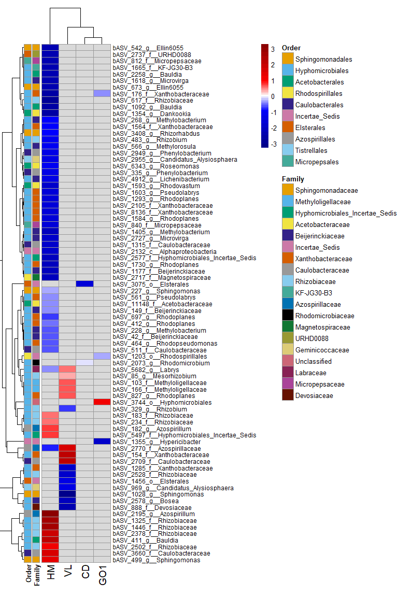<!-- -->

#### Heatmap order by taxonomy

``` r
# Create ordering index
ord <- order(tax_alp2$Phylum, tax_alp2$Class, tax_alp2$Order, tax_alp2$Family, tax_alp2$Genus)

# Reorder matrix
AllAcc_lfc_alp <- AllAcc_lfc_alp[ord, ]

# Reorder annotation accordingly
tax_alp2 <- tax_alp2[ord, , drop = FALSE]

# Make sure legend is in same direction
tax_alp2$Phylum <- factor(tax_alp2$Phylum, levels = unique(tax_alp2$Phylum))
tax_alp2$Class <- factor(tax_alp2$Class, levels = unique(tax_alp2$Class))
tax_alp2$Order <- factor(tax_alp2$Order, levels = unique(tax_alp2$Order))
tax_alp2$Family <- factor(tax_alp2$Family, levels = unique(tax_alp2$Family))
tax_alp2$Genus <- factor(tax_alp2$Genus, levels = unique(tax_alp2$Genus))

# Reorder color class vector
Order_Family_colors2_alp$Order <- Order_Family_colors2_alp$Order[levels(tax_alp2$Order)]
Order_Family_colors2_alp$Family <- Order_Family_colors2_alp$Family[levels(tax_alp2$Family)]
```


``` r
# Heatmap
p <- pheatmap(AllAcc_lfc_alp,
          cluster_rows = FALSE,
          cluster_cols = FALSE,
          color = colorRampPalette(c("darkblue", "blue", "white", "red", "darkred"))(50),
          breaks = seq(-max_abs, max_abs, length.out = 51),
          #main = "Differentially abundant tax_alp2a (log2FC by Family)",
          cellwidth = 25,
          cellheight = 9.5,
          fontsize_row = 9,
          fontsize_col = 14,
          na_col = "grey90",
          angle_col = 90,
          annotation_row = tax_alp2[3:4],
          annotation_colors = Order_Family_colors2_alp)
p 
```

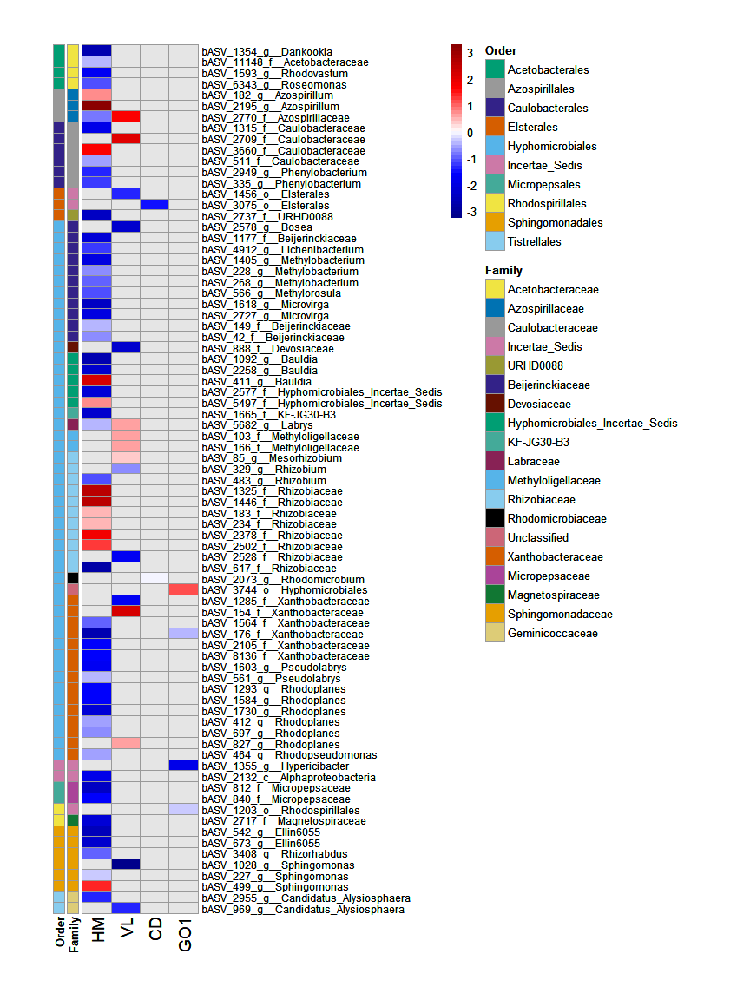<!-- -->

``` r
files <- c("FP_DAHeatmap_ASV_Alphaproteobacteria.svg", "FP_DAHeatmap_ASV_Alphaproteobacteria.png")

mapply(function(x){
  file_path <- file.path("C:/Users/kreek001/OneDrive - Wageningen University & Research/Chapters/Experimental Chapter 3/Result/Final graphs", x)

  if (grepl("svg$", x)) {
    svg(file_path, width = 20/2.54, height = 28/2.54)
  } else {
    png(file_path, width = 20, height = 28, units = "cm", res = 300)
  }
  grid::grid.draw(p$gtable)
  dev.off()
}, files)
```

```
## FP_DAHeatmap_ASV_Alphaproteobacteria.svg.png 
##                                            2 
## FP_DAHeatmap_ASV_Alphaproteobacteria.png.png 
##                                            2
```

``` r
rm(p)
```

## Actinobacteria
#### Subset Actinobacteria

``` r
# Subset taxonomy table
tax_act <- tax[tax$Class == "c__Actinobacteria", ]
tax_act
```

```
##                                Genus                                Family
## bASV_1          g__Pseudarthrobacter                     f__Micrococcaceae
## bASV_1003            g__Streptomyces                  f__Streptomycetaceae
## bASV_107                g__Kribbella                    f__Nocardioidaceae
## bASV_109             g__Actinomadura                f__Thermomonosporaceae
## bASV_1153          g__Peterkaempfera                  f__Streptomycetaceae
## bASV_1155            g__Motilibacter f__Streptosporangiales_Incertae_Sedis
## bASV_12161           g__Arthrobacter                     f__Micrococcaceae
## bASV_1259            g__Actinoplanes                 f__Micromonosporaceae
## bASV_126             g__Unclassified                       f__Unclassified
## bASV_1331           g__Luedemannella                 f__Micromonosporaceae
## bASV_14               g__Marmoricola                    f__Nocardioidaceae
## bASV_141        g__Pseudarthrobacter                     f__Micrococcaceae
## bASV_15              g__Nocardioides                    f__Nocardioidaceae
## bASV_1515            g__Nocardioides                    f__Nocardioidaceae
## bASV_1539            g__Acidothermus                    f__Acidothermaceae
## bASV_17              g__Nocardioides                    f__Nocardioidaceae
## bASV_178          g__Actinoallomurus                f__Thermomonosporaceae
## bASV_1801            g__Streptomyces                  f__Streptomycetaceae
## bASV_1988            g__Nocardioides                    f__Nocardioidaceae
## bASV_2163            g__Nocardioides                    f__Nocardioidaceae
## bASV_2296            g__Nocardioides                    f__Nocardioidaceae
## bASV_243             g__Unclassified                  f__Streptomycetaceae
## bASV_25              g__Streptomyces                  f__Streptomycetaceae
## bASV_254            g__Angustibacter                    f__Kineosporiaceae
## bASV_26    g__Pedococcus-Phycicoccus                 f__Intrasporangiaceae
## bASV_27              g__Nocardioides                    f__Nocardioidaceae
## bASV_2724            g__Nocardioides                    f__Nocardioidaceae
## bASV_2767            g__Nocardioides                    f__Nocardioidaceae
## bASV_288        g__Pseudarthrobacter                     f__Micrococcaceae
## bASV_3               g__Unclassified                     f__Micrococcaceae
## bASV_3526         g__Actinoallomurus                f__Thermomonosporaceae
## bASV_3533            g__Nocardioides                    f__Nocardioidaceae
## bASV_376             g__Unclassified                 f__Micromonosporaceae
## bASV_385             g__Acidothermus                    f__Acidothermaceae
## bASV_41    g__Pedococcus-Phycicoccus                 f__Intrasporangiaceae
## bASV_410            g__Aeromicrobium                    f__Nocardioidaceae
## bASV_4395            g__Unclassified                  f__Cellulomonadaceae
## bASV_45    g__Pedococcus-Phycicoccus                 f__Intrasporangiaceae
## bASV_46    g__Pedococcus-Phycicoccus                 f__Intrasporangiaceae
## bASV_496        g__Pseudarthrobacter                     f__Micrococcaceae
## bASV_5                g__Terrabacter                 f__Intrasporangiaceae
## bASV_515           g__Pseudonocardia                 f__Pseudonocardiaceae
## bASV_528             g__Nocardioides                    f__Nocardioidaceae
## bASV_60              g__Nocardioides                    f__Nocardioidaceae
## bASV_664             g__Unclassified                       f__Unclassified
## bASV_69              g__Nocardioides                    f__Nocardioidaceae
## bASV_7               g__Unclassified                       f__Unclassified
## bASV_729              g__Marmoricola                    f__Nocardioidaceae
## bASV_79            g__Incertae_Sedis                    f__Sporichthyaceae
## bASV_88              g__Blastococcus                f__Geodermatophilaceae
## bASV_91            g__Pseudonocardia                 f__Pseudonocardiaceae
## bASV_928             g__Unclassified                       f__Unclassified
## bASV_9493            g__Unclassified                  f__Cellulomonadaceae
##                             Order             Class            Phylum
## bASV_1           o__Micrococcales c__Actinobacteria p__Actinomycetota
## bASV_1003     o__Kitasatosporales c__Actinobacteria p__Actinomycetota
## bASV_107   o__Propionibacteriales c__Actinobacteria p__Actinomycetota
## bASV_109   o__Streptosporangiales c__Actinobacteria p__Actinomycetota
## bASV_1153     o__Kitasatosporales c__Actinobacteria p__Actinomycetota
## bASV_1155  o__Streptosporangiales c__Actinobacteria p__Actinomycetota
## bASV_12161       o__Micrococcales c__Actinobacteria p__Actinomycetota
## bASV_1259    o__Micromonosporales c__Actinobacteria p__Actinomycetota
## bASV_126   o__Streptosporangiales c__Actinobacteria p__Actinomycetota
## bASV_1331    o__Micromonosporales c__Actinobacteria p__Actinomycetota
## bASV_14    o__Propionibacteriales c__Actinobacteria p__Actinomycetota
## bASV_141         o__Micrococcales c__Actinobacteria p__Actinomycetota
## bASV_15    o__Propionibacteriales c__Actinobacteria p__Actinomycetota
## bASV_1515  o__Propionibacteriales c__Actinobacteria p__Actinomycetota
## bASV_1539           o__Frankiales c__Actinobacteria p__Actinomycetota
## bASV_17    o__Propionibacteriales c__Actinobacteria p__Actinomycetota
## bASV_178   o__Streptosporangiales c__Actinobacteria p__Actinomycetota
## bASV_1801     o__Kitasatosporales c__Actinobacteria p__Actinomycetota
## bASV_1988  o__Propionibacteriales c__Actinobacteria p__Actinomycetota
## bASV_2163  o__Propionibacteriales c__Actinobacteria p__Actinomycetota
## bASV_2296  o__Propionibacteriales c__Actinobacteria p__Actinomycetota
## bASV_243      o__Kitasatosporales c__Actinobacteria p__Actinomycetota
## bASV_25       o__Kitasatosporales c__Actinobacteria p__Actinomycetota
## bASV_254        o__Kineosporiales c__Actinobacteria p__Actinomycetota
## bASV_26          o__Micrococcales c__Actinobacteria p__Actinomycetota
## bASV_27    o__Propionibacteriales c__Actinobacteria p__Actinomycetota
## bASV_2724  o__Propionibacteriales c__Actinobacteria p__Actinomycetota
## bASV_2767  o__Propionibacteriales c__Actinobacteria p__Actinomycetota
## bASV_288         o__Micrococcales c__Actinobacteria p__Actinomycetota
## bASV_3           o__Micrococcales c__Actinobacteria p__Actinomycetota
## bASV_3526  o__Streptosporangiales c__Actinobacteria p__Actinomycetota
## bASV_3533  o__Propionibacteriales c__Actinobacteria p__Actinomycetota
## bASV_376     o__Micromonosporales c__Actinobacteria p__Actinomycetota
## bASV_385            o__Frankiales c__Actinobacteria p__Actinomycetota
## bASV_41          o__Micrococcales c__Actinobacteria p__Actinomycetota
## bASV_410   o__Propionibacteriales c__Actinobacteria p__Actinomycetota
## bASV_4395        o__Micrococcales c__Actinobacteria p__Actinomycetota
## bASV_45          o__Micrococcales c__Actinobacteria p__Actinomycetota
## bASV_46          o__Micrococcales c__Actinobacteria p__Actinomycetota
## bASV_496         o__Micrococcales c__Actinobacteria p__Actinomycetota
## bASV_5           o__Micrococcales c__Actinobacteria p__Actinomycetota
## bASV_515     o__Pseudonocardiales c__Actinobacteria p__Actinomycetota
## bASV_528   o__Propionibacteriales c__Actinobacteria p__Actinomycetota
## bASV_60    o__Propionibacteriales c__Actinobacteria p__Actinomycetota
## bASV_664   o__Streptosporangiales c__Actinobacteria p__Actinomycetota
## bASV_69    o__Propionibacteriales c__Actinobacteria p__Actinomycetota
## bASV_7     o__Streptosporangiales c__Actinobacteria p__Actinomycetota
## bASV_729   o__Propionibacteriales c__Actinobacteria p__Actinomycetota
## bASV_79             o__Frankiales c__Actinobacteria p__Actinomycetota
## bASV_88             o__Frankiales c__Actinobacteria p__Actinomycetota
## bASV_91      o__Pseudonocardiales c__Actinobacteria p__Actinomycetota
## bASV_928   o__Streptosporangiales c__Actinobacteria p__Actinomycetota
## bASV_9493        o__Micrococcales c__Actinobacteria p__Actinomycetota
```

``` r
# Extract ASV numbers Bacilli ASVs
ASVs_act <- rownames(tax_act)

# Subset lfc matrix with Bacilli
AllAcc_lfc_act <- AllAcc_lfc[AllAcc_lfc$ASV %in% ASVs_act, ]
AllAcc_lfc_act
```

```
##                   ASV         HM         VL        CD        GO1
## bASV_1         bASV_1 -0.6515534         NA        NA         NA
## bASV_1003   bASV_1003 -3.2067409 -2.5051032 -2.431535  2.9768020
## bASV_107     bASV_107 -2.1926324         NA        NA         NA
## bASV_109     bASV_109 -1.4355424  0.4340034        NA         NA
## bASV_1153   bASV_1153  1.8616108 -3.3167139        NA         NA
## bASV_1155   bASV_1155         NA  1.7051917        NA         NA
## bASV_12161 bASV_12161         NA  0.9997509        NA         NA
## bASV_1259   bASV_1259 -0.5944156         NA        NA         NA
## bASV_126     bASV_126 -1.3776449  1.0477663        NA         NA
## bASV_1331   bASV_1331         NA  1.5202889        NA         NA
## bASV_14       bASV_14         NA         NA        NA -0.4512912
## bASV_141     bASV_141 -3.0465135         NA -3.495058         NA
## bASV_15       bASV_15         NA         NA        NA -0.2984458
## bASV_1515   bASV_1515 -1.5604888         NA        NA         NA
## bASV_1539   bASV_1539  2.0013939 -2.7863404        NA         NA
## bASV_17       bASV_17         NA  0.4797463        NA -0.5314222
## bASV_178     bASV_178 -1.3206861  0.9888516        NA         NA
## bASV_1801   bASV_1801 -1.6327854         NA        NA         NA
## bASV_1988   bASV_1988  1.0868321         NA        NA         NA
## bASV_2163   bASV_2163  1.3199894         NA        NA         NA
## bASV_2296   bASV_2296         NA -1.4858283        NA         NA
## bASV_243     bASV_243  4.2966249         NA        NA         NA
## bASV_25       bASV_25         NA         NA        NA -0.3753287
## bASV_254     bASV_254  1.9640465         NA        NA         NA
## bASV_26       bASV_26         NA         NA        NA -0.4646013
## bASV_27       bASV_27 -0.5930344  0.7074373        NA -0.3771567
## bASV_2724   bASV_2724         NA  0.7589564        NA         NA
## bASV_2767   bASV_2767 -0.9382375         NA        NA         NA
## bASV_288     bASV_288 -4.2118984         NA -2.578170         NA
## bASV_3         bASV_3 -0.6576116         NA        NA         NA
## bASV_3526   bASV_3526 -2.2352130  1.5317841        NA         NA
## bASV_3533   bASV_3533 -1.8438336         NA        NA         NA
## bASV_376     bASV_376  2.1387346         NA        NA         NA
## bASV_385     bASV_385  1.1643225 -3.3313772        NA  0.8561683
## bASV_41       bASV_41         NA         NA        NA -0.3600931
## bASV_410     bASV_410  1.5591702         NA        NA         NA
## bASV_4395   bASV_4395  2.1716524         NA        NA         NA
## bASV_45       bASV_45  0.4079824         NA        NA         NA
## bASV_46       bASV_46         NA         NA        NA -0.5148557
## bASV_496     bASV_496 -3.8453247         NA -2.413753         NA
## bASV_5         bASV_5 -0.5241711         NA        NA         NA
## bASV_515     bASV_515 -1.9859328  0.7270947        NA         NA
## bASV_528     bASV_528         NA         NA -1.919283         NA
## bASV_60       bASV_60         NA  0.4952265        NA -0.4140942
## bASV_664     bASV_664 -4.4062586  2.5537284        NA         NA
## bASV_69       bASV_69 -0.6556887         NA        NA         NA
## bASV_7         bASV_7 -1.5176908  1.0426517        NA         NA
## bASV_729     bASV_729         NA         NA -2.343664         NA
## bASV_79       bASV_79         NA         NA        NA -0.5445696
## bASV_88       bASV_88 -2.4870152         NA        NA         NA
## bASV_91       bASV_91         NA  0.4208043        NA         NA
## bASV_928     bASV_928 -1.8419467         NA        NA         NA
## bASV_9493   bASV_9493  1.1450191         NA        NA         NA
```

#### Preparing heatmap

``` r
# Add genus to matrix
AllAcc_lfc_act$ASV <- rownames(AllAcc_lfc_act)
tax_act$ASV <- rownames(tax_act)
AllAcc_lfc_act <- merge(tax_act, AllAcc_lfc_act, ID = "ASV")

# Add higher taxon_actomic level if genus is NA or Incertae Sedis
taxon_act <- AllAcc_lfc_act$Genus
taxon_act[is.na(taxon_act)] <- AllAcc_lfc_act$Family[is.na(taxon_act)]
taxon_act[is.na(taxon_act)] <- AllAcc_lfc_act$Order[is.na(taxon_act)]

taxon_act[taxon_act == "g__Incertae_Sedis"] <- AllAcc_lfc_act$Family[taxon_act == "g__Incertae_Sedis"]
taxon_act[taxon_act == "f__Incertae_Sedis"] <- AllAcc_lfc_act$Order[taxon_act == "f__Incertae_Sedis"]
taxon_act[taxon_act == "o__Incertae_Sedis"] <- AllAcc_lfc_act$Class[taxon_act == "o__Incertae_Sedis"]

taxon_act[taxon_act == "g__Unclassified"] <- AllAcc_lfc_act$Family[taxon_act == "g__Unclassified"]
taxon_act[taxon_act == "f__Unclassified"] <- AllAcc_lfc_act$Order[taxon_act == "f__Unclassified"]
taxon_act[taxon_act == "o__Unclassified"] <- AllAcc_lfc_act$Class[taxon_act == "o__Unclassified"]

rownames(AllAcc_lfc_act) <- paste(AllAcc_lfc_act$ASV, taxon_act, sep = "_")

AllAcc_lfc_act$Phylum <- sub("p__", "", AllAcc_lfc_act$Phylum)
AllAcc_lfc_act$Class <- sub("c__", "", AllAcc_lfc_act$Class)
AllAcc_lfc_act$Order <- sub("o__", "", AllAcc_lfc_act$Order)
AllAcc_lfc_act$Family <- sub("f__", "", AllAcc_lfc_act$Family)

AllAcc_lfc_act3_df <- AllAcc_lfc_act
tax_act2 <- AllAcc_lfc_act[1:6]
AllAcc_lfc_act <- AllAcc_lfc_act[7:10]
head(AllAcc_lfc_act)
```

```
##                                     HM         VL        CD      GO1
## bASV_1_g__Pseudarthrobacter -0.6515534         NA        NA       NA
## bASV_1003_g__Streptomyces   -3.2067409 -2.5051032 -2.431535 2.976802
## bASV_107_g__Kribbella       -2.1926324         NA        NA       NA
## bASV_109_g__Actinomadura    -1.4355424  0.4340034        NA       NA
## bASV_1153_g__Peterkaempfera  1.8616108 -3.3167139        NA       NA
## bASV_1155_g__Motilibacter           NA  1.7051917        NA       NA
```

``` r
# Make color pallet for class
colors35 <- c("#E69F00", "#56B4E9", "#009E73", "#F0E442", "#332288", "#CC79A7",
              "#D55E00", "#999999", "#88CCEE", "#44AA99", "#0072B2", "#000000",
              "#117733", "#999933", "#DDCC77", "#CC6677", "#882255", "#AA4499",
              "#661100", "#6699CC", "#AA4466", "#4477AA", "#EE6677", "#BBBBBB",
              "#2E3440", "#8FBCBB", "#BF616A", "#A3BE8C", "#EBCB8B", "#B48EAD",
              "#5E81AC", "#D08770", "#3B4252", "#7B9E87")

Family2 <- unique(tax_act2$Family)
Family_colors2_act2 <- setNames(colors35[1:length(Family2)], Family2)
Family_colors2_act2 <- list(Family = Family_colors2_act2)

# Make color pallet for Order for genus in plot
Order2 <- unique(tax_act2$Order)
Order_colors2_act2 <- setNames(colors35[1:length(Order2)], Order2)
Order_colors2_act2 <- list(Order = Order_colors2_act2)

Order_Family_colors2_act <- c(Order_colors2_act2, Family_colors2_act2)

# Turn data frame into a matrix
AllAcc_lfc_act <- as.matrix(AllAcc_lfc_act)

# replace NAs by 0s
AllAcc_lfc_act_clu <- AllAcc_lfc_act
AllAcc_lfc_act_clu[is.na(AllAcc_lfc_act_clu)] <- 0

# breaks in heatmap
max_abs <- max(abs(AllAcc_lfc_act), na.rm = TRUE)
breaks <- unique(c(seq(-max_abs, -1, length.out = 10), 
                   seq(-1, 1, length.out = 20), # More breaks in this range for sensitivity
                   seq(1, max_abs, length.out = 10)))
```

#### Heatmap 

``` r
pheatmap(AllAcc_lfc_act,
          clustering_distance_rows = dist(AllAcc_lfc_act_clu),
          clustering_distance_cols = dist(t(AllAcc_lfc_act_clu)),
          color = colorRampPalette(c("darkblue", "blue", "white", "red", "darkred"))(length(breaks) - 1),
          breaks = breaks,
          fontsize_col = 14,
          fontsize_row = 7,
          na_col = "grey85",
          angle_col = 90,
          show_rownames = TRUE,
          annotation_row = tax_act2[3:4],
          annotation_colors = Order_Family_colors2_act)
```

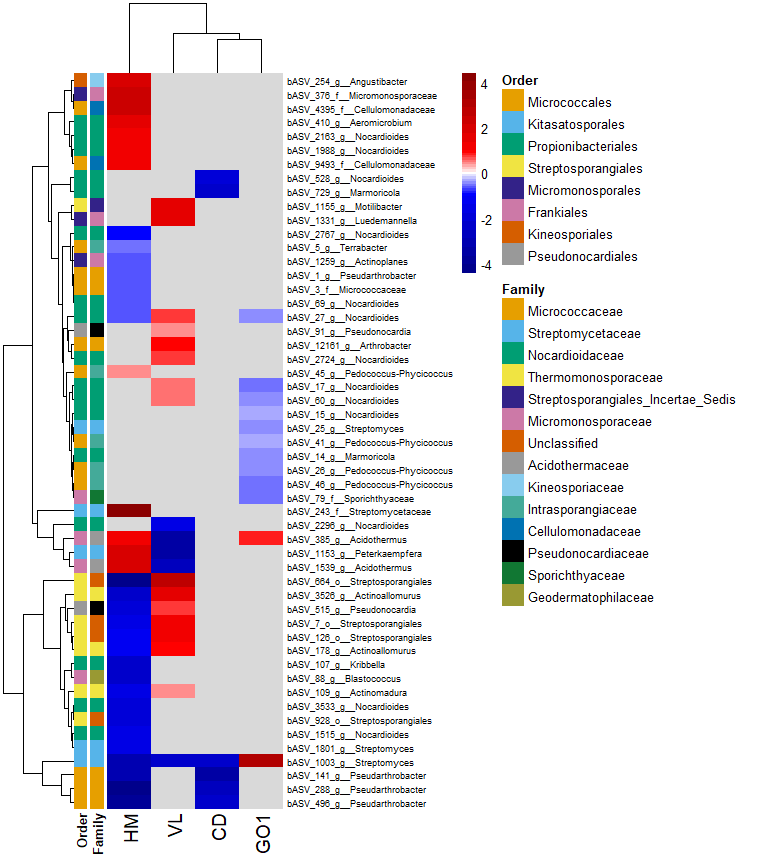<!-- -->

#### Heatmap order by taxonomy

``` r
# Create ordering index
ord <- order(tax_act2$Phylum, tax_act2$Class, tax_act2$Order, tax_act2$Family, tax_act2$Genus)

# Reorder matrix
AllAcc_lfc_act <- AllAcc_lfc_act[ord, ]

# Reorder annotation accordingly
tax_act2 <- tax_act2[ord, , drop = FALSE]

# Make sure legend is in same direction
tax_act2$Phylum <- factor(tax_act2$Phylum, levels = unique(tax_act2$Phylum))
tax_act2$Class <- factor(tax_act2$Class, levels = unique(tax_act2$Class))
tax_act2$Order <- factor(tax_act2$Order, levels = unique(tax_act2$Order))
tax_act2$Family <- factor(tax_act2$Family, levels = unique(tax_act2$Family))
tax_act2$Genus <- factor(tax_act2$Genus, levels = unique(tax_act2$Genus))

# Reorder color class vector
Order_Family_colors2_act$Order <- Order_Family_colors2_act$Order[levels(tax_act2$Order)]
Order_Family_colors2_act$Family <- Order_Family_colors2_act$Family[levels(tax_act2$Family)]
```


``` r
# Heatmap
p <- pheatmap(AllAcc_lfc_act,
          cluster_rows = FALSE,
          cluster_cols = FALSE,
          color = colorRampPalette(c("darkblue", "blue", "white", "red", "darkred"))(50),
          breaks = seq(-max_abs, max_abs, length.out = 51),
          #main = "Differentially abundant tax_act2a (log2FC by Family)",
          cellwidth = 25,
          cellheight = 9.5,
          fontsize_row = 9,
          fontsize_col = 14,
          na_col = "grey90",
          angle_col = 90,
          annotation_row = tax_act2[3:4],
          annotation_colors = Order_Family_colors2_act)
p 
```

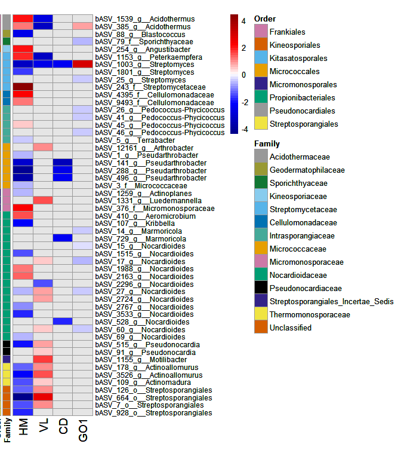<!-- -->

``` r
files <- c("FP_DAHeatmap_ASV_Actinobacteria.svg", "FP_DAHeatmap_ASV_Actinobacteria.png")

mapply(function(x){
  file_path <- file.path("C:/Users/kreek001/OneDrive - Wageningen University & Research/Chapters/Experimental Chapter 3/Result/Final graphs", x)

  if (grepl("svg$", x)) {
    svg(file_path, width = 20/2.54, height = 20/2.54)
  } else {
    png(file_path, width = 20, height = 20, units = "cm", res = 300)
  }
  grid::grid.draw(p$gtable)
  dev.off()
}, files)
```

```
## FP_DAHeatmap_ASV_Actinobacteria.svg.png FP_DAHeatmap_ASV_Actinobacteria.png.png 
##                                       2                                       2
```

``` r
rm(p)
```

## Gemmatimonadia
#### Subset Gemmatimonadia

``` r
# Subset taxonomy table
tax_gem <- tax[tax$Class == "c__Gemmatimonadia", ]
tax_gem
```

```
##                         Genus               Family               Order
## bASV_1080     g__Gemmatimonas f__Gemmatimonadaceae o__Gemmatimonadales
## bASV_1107     g__Gemmatimonas f__Gemmatimonadaceae o__Gemmatimonadales
## bASV_1139     g__Gemmatimonas f__Gemmatimonadaceae o__Gemmatimonadales
## bASV_1163     g__Gemmatimonas f__Gemmatimonadaceae o__Gemmatimonadales
## bASV_1289   g__Incertae_Sedis f__Gemmatimonadaceae o__Gemmatimonadales
## bASV_1366     g__Gemmatimonas f__Gemmatimonadaceae o__Gemmatimonadales
## bASV_14493  g__Incertae_Sedis f__Gemmatimonadaceae o__Gemmatimonadales
## bASV_1522     g__Gemmatimonas f__Gemmatimonadaceae o__Gemmatimonadales
## bASV_1602     g__Gemmatimonas f__Gemmatimonadaceae o__Gemmatimonadales
## bASV_179      g__Gemmatimonas f__Gemmatimonadaceae o__Gemmatimonadales
## bASV_187      g__Gemmatimonas f__Gemmatimonadaceae o__Gemmatimonadales
## bASV_190      g__Gemmatimonas f__Gemmatimonadaceae o__Gemmatimonadales
## bASV_1908     g__Gemmatimonas f__Gemmatimonadaceae o__Gemmatimonadales
## bASV_19120    g__Gemmatimonas f__Gemmatimonadaceae o__Gemmatimonadales
## bASV_2012     g__Gemmatimonas f__Gemmatimonadaceae o__Gemmatimonadales
## bASV_2120     g__Gemmatimonas f__Gemmatimonadaceae o__Gemmatimonadales
## bASV_2145  g__Roseisolibacter f__Gemmatimonadaceae o__Gemmatimonadales
## bASV_2391     g__Gemmatimonas f__Gemmatimonadaceae o__Gemmatimonadales
## bASV_2399     g__Gemmatimonas f__Gemmatimonadaceae o__Gemmatimonadales
## bASV_2473     g__Gemmatimonas f__Gemmatimonadaceae o__Gemmatimonadales
## bASV_2487     g__Gemmatimonas f__Gemmatimonadaceae o__Gemmatimonadales
## bASV_2701   g__Incertae_Sedis f__Gemmatimonadaceae o__Gemmatimonadales
## bASV_292    g__Incertae_Sedis f__Gemmatimonadaceae o__Gemmatimonadales
## bASV_303      g__Gemmatimonas f__Gemmatimonadaceae o__Gemmatimonadales
## bASV_3046     g__Gemmatimonas f__Gemmatimonadaceae o__Gemmatimonadales
## bASV_319      g__Gemmatimonas f__Gemmatimonadaceae o__Gemmatimonadales
## bASV_3208     g__Gemmatimonas f__Gemmatimonadaceae o__Gemmatimonadales
## bASV_3276     g__Gemmatimonas f__Gemmatimonadaceae o__Gemmatimonadales
## bASV_339      g__Gemmatimonas f__Gemmatimonadaceae o__Gemmatimonadales
## bASV_345      g__Gemmatimonas f__Gemmatimonadaceae o__Gemmatimonadales
## bASV_3537     g__Gemmatimonas f__Gemmatimonadaceae o__Gemmatimonadales
## bASV_3546     g__Gemmatimonas f__Gemmatimonadaceae o__Gemmatimonadales
## bASV_3806     g__Gemmatimonas f__Gemmatimonadaceae o__Gemmatimonadales
## bASV_3823     g__Gemmatimonas f__Gemmatimonadaceae o__Gemmatimonadales
## bASV_394      g__Gemmatimonas f__Gemmatimonadaceae o__Gemmatimonadales
## bASV_3962     g__Gemmatimonas f__Gemmatimonadaceae o__Gemmatimonadales
## bASV_397   g__Roseisolibacter f__Gemmatimonadaceae o__Gemmatimonadales
## bASV_416    g__Incertae_Sedis f__Gemmatimonadaceae o__Gemmatimonadales
## bASV_423      g__Gemmatimonas f__Gemmatimonadaceae o__Gemmatimonadales
## bASV_446    g__Incertae_Sedis f__Gemmatimonadaceae o__Gemmatimonadales
## bASV_474      g__Gemmatimonas f__Gemmatimonadaceae o__Gemmatimonadales
## bASV_541      g__Gemmatimonas f__Gemmatimonadaceae o__Gemmatimonadales
## bASV_5565   g__Incertae_Sedis f__Gemmatimonadaceae o__Gemmatimonadales
## bASV_62     g__Incertae_Sedis f__Gemmatimonadaceae o__Gemmatimonadales
## bASV_753       g__Gemmatirosa f__Gemmatimonadaceae o__Gemmatimonadales
## bASV_910       g__Gemmatirosa f__Gemmatimonadaceae o__Gemmatimonadales
##                        Class             Phylum
## bASV_1080  c__Gemmatimonadia p__Gemmatimonadota
## bASV_1107  c__Gemmatimonadia p__Gemmatimonadota
## bASV_1139  c__Gemmatimonadia p__Gemmatimonadota
## bASV_1163  c__Gemmatimonadia p__Gemmatimonadota
## bASV_1289  c__Gemmatimonadia p__Gemmatimonadota
## bASV_1366  c__Gemmatimonadia p__Gemmatimonadota
## bASV_14493 c__Gemmatimonadia p__Gemmatimonadota
## bASV_1522  c__Gemmatimonadia p__Gemmatimonadota
## bASV_1602  c__Gemmatimonadia p__Gemmatimonadota
## bASV_179   c__Gemmatimonadia p__Gemmatimonadota
## bASV_187   c__Gemmatimonadia p__Gemmatimonadota
## bASV_190   c__Gemmatimonadia p__Gemmatimonadota
## bASV_1908  c__Gemmatimonadia p__Gemmatimonadota
## bASV_19120 c__Gemmatimonadia p__Gemmatimonadota
## bASV_2012  c__Gemmatimonadia p__Gemmatimonadota
## bASV_2120  c__Gemmatimonadia p__Gemmatimonadota
## bASV_2145  c__Gemmatimonadia p__Gemmatimonadota
## bASV_2391  c__Gemmatimonadia p__Gemmatimonadota
## bASV_2399  c__Gemmatimonadia p__Gemmatimonadota
## bASV_2473  c__Gemmatimonadia p__Gemmatimonadota
## bASV_2487  c__Gemmatimonadia p__Gemmatimonadota
## bASV_2701  c__Gemmatimonadia p__Gemmatimonadota
## bASV_292   c__Gemmatimonadia p__Gemmatimonadota
## bASV_303   c__Gemmatimonadia p__Gemmatimonadota
## bASV_3046  c__Gemmatimonadia p__Gemmatimonadota
## bASV_319   c__Gemmatimonadia p__Gemmatimonadota
## bASV_3208  c__Gemmatimonadia p__Gemmatimonadota
## bASV_3276  c__Gemmatimonadia p__Gemmatimonadota
## bASV_339   c__Gemmatimonadia p__Gemmatimonadota
## bASV_345   c__Gemmatimonadia p__Gemmatimonadota
## bASV_3537  c__Gemmatimonadia p__Gemmatimonadota
## bASV_3546  c__Gemmatimonadia p__Gemmatimonadota
## bASV_3806  c__Gemmatimonadia p__Gemmatimonadota
## bASV_3823  c__Gemmatimonadia p__Gemmatimonadota
## bASV_394   c__Gemmatimonadia p__Gemmatimonadota
## bASV_3962  c__Gemmatimonadia p__Gemmatimonadota
## bASV_397   c__Gemmatimonadia p__Gemmatimonadota
## bASV_416   c__Gemmatimonadia p__Gemmatimonadota
## bASV_423   c__Gemmatimonadia p__Gemmatimonadota
## bASV_446   c__Gemmatimonadia p__Gemmatimonadota
## bASV_474   c__Gemmatimonadia p__Gemmatimonadota
## bASV_541   c__Gemmatimonadia p__Gemmatimonadota
## bASV_5565  c__Gemmatimonadia p__Gemmatimonadota
## bASV_62    c__Gemmatimonadia p__Gemmatimonadota
## bASV_753   c__Gemmatimonadia p__Gemmatimonadota
## bASV_910   c__Gemmatimonadia p__Gemmatimonadota
```

``` r
# Extrgem ASV numbers Bacilli ASVs
ASVs_gem <- rownames(tax_gem)

# Subset lfc matrix with Bacilli
AllAcc_lfc_gem <- AllAcc_lfc[AllAcc_lfc$ASV %in% ASVs_gem, ]
AllAcc_lfc_gem
```

```
##                   ASV         HM         VL        CD GO1
## bASV_1080   bASV_1080         NA  1.5677686        NA  NA
## bASV_1107   bASV_1107 -2.8014027         NA        NA  NA
## bASV_1139   bASV_1139 -2.2018899         NA        NA  NA
## bASV_1163   bASV_1163 -3.5110566         NA        NA  NA
## bASV_1289   bASV_1289 -2.2722159         NA        NA  NA
## bASV_1366   bASV_1366 -2.4441188         NA        NA  NA
## bASV_14493 bASV_14493         NA  0.5392339        NA  NA
## bASV_1522   bASV_1522 -2.3983224         NA        NA  NA
## bASV_1602   bASV_1602 -1.9007574         NA        NA  NA
## bASV_179     bASV_179 -0.7139398         NA        NA  NA
## bASV_187     bASV_187 -0.6419441  0.5634087        NA  NA
## bASV_190     bASV_190  1.2029872         NA        NA  NA
## bASV_1908   bASV_1908  1.9577054         NA        NA  NA
## bASV_19120 bASV_19120 -0.4679624         NA        NA  NA
## bASV_2012   bASV_2012         NA  1.8508675        NA  NA
## bASV_2120   bASV_2120         NA -2.3725148        NA  NA
## bASV_2145   bASV_2145 -1.4700895         NA        NA  NA
## bASV_2391   bASV_2391         NA  0.5392339        NA  NA
## bASV_2399   bASV_2399         NA  1.4627525        NA  NA
## bASV_2473   bASV_2473         NA  1.5778253        NA  NA
## bASV_2487   bASV_2487         NA  2.1688074        NA  NA
## bASV_2701   bASV_2701         NA  1.2083029        NA  NA
## bASV_292     bASV_292 -1.9322993         NA        NA  NA
## bASV_303     bASV_303         NA  0.8574351        NA  NA
## bASV_3046   bASV_3046 -1.6709498         NA        NA  NA
## bASV_319     bASV_319         NA  0.3623770        NA  NA
## bASV_3208   bASV_3208         NA  1.4829337        NA  NA
## bASV_3276   bASV_3276         NA -1.8404804        NA  NA
## bASV_339     bASV_339 -0.4887707         NA        NA  NA
## bASV_345     bASV_345 -0.6659140         NA -0.567947  NA
## bASV_3537   bASV_3537 -1.8095792         NA        NA  NA
## bASV_3546   bASV_3546 -1.3505221         NA        NA  NA
## bASV_3806   bASV_3806         NA  1.3889330        NA  NA
## bASV_3823   bASV_3823 -1.8008442         NA        NA  NA
## bASV_394     bASV_394  1.9140256         NA        NA  NA
## bASV_3962   bASV_3962  1.7256526         NA        NA  NA
## bASV_397     bASV_397 -0.4806003         NA        NA  NA
## bASV_416     bASV_416 -2.2778089         NA        NA  NA
## bASV_423     bASV_423  1.6217584         NA        NA  NA
## bASV_446     bASV_446         NA         NA  1.856062  NA
## bASV_474     bASV_474 -1.0513418  1.5207961        NA  NA
## bASV_541     bASV_541 -1.4647979  0.8786887        NA  NA
## bASV_5565   bASV_5565         NA  1.0670454        NA  NA
## bASV_62       bASV_62 -0.6979348         NA        NA  NA
## bASV_753     bASV_753 -1.0426662         NA        NA  NA
## bASV_910     bASV_910 -2.2593126  1.7726382        NA  NA
```

#### Preparing heatmap

``` r
# Add genus to matrix
AllAcc_lfc_gem$ASV <- rownames(AllAcc_lfc_gem)
tax_gem$ASV <- rownames(tax_gem)
AllAcc_lfc_gem <- merge(tax_gem, AllAcc_lfc_gem, ID = "ASV")

# Add higher taxon_gemomic level if genus is NA or Incertae Sedis
taxon_gem <- AllAcc_lfc_gem$Genus
taxon_gem[is.na(taxon_gem)] <- AllAcc_lfc_gem$Family[is.na(taxon_gem)]
taxon_gem[is.na(taxon_gem)] <- AllAcc_lfc_gem$Order[is.na(taxon_gem)]

taxon_gem[taxon_gem == "g__Incertae_Sedis"] <- AllAcc_lfc_gem$Family[taxon_gem == "g__Incertae_Sedis"]
taxon_gem[taxon_gem == "f__Incertae_Sedis"] <- AllAcc_lfc_gem$Order[taxon_gem == "f__Incertae_Sedis"]
taxon_gem[taxon_gem == "o__Incertae_Sedis"] <- AllAcc_lfc_gem$Class[taxon_gem == "o__Incertae_Sedis"]

taxon_gem[taxon_gem == "g__Unclassified"] <- AllAcc_lfc_gem$Family[taxon_gem == "g__Unclassified"]
taxon_gem[taxon_gem == "f__Unclassified"] <- AllAcc_lfc_gem$Order[taxon_gem == "f__Unclassified"]
taxon_gem[taxon_gem == "o__Unclassified"] <- AllAcc_lfc_gem$Class[taxon_gem == "o__Unclassified"]

rownames(AllAcc_lfc_gem) <- paste(AllAcc_lfc_gem$ASV, taxon_gem, sep = "_")

AllAcc_lfc_gem$Phylum <- sub("p__", "", AllAcc_lfc_gem$Phylum)
AllAcc_lfc_gem$Class <- sub("c__", "", AllAcc_lfc_gem$Class)
AllAcc_lfc_gem$Order <- sub("o__", "", AllAcc_lfc_gem$Order)
AllAcc_lfc_gem$Family <- sub("f__", "", AllAcc_lfc_gem$Family)

AllAcc_lfc_gem3_df <- AllAcc_lfc_gem
tax_gem2 <- AllAcc_lfc_gem[1:6]
AllAcc_lfc_gem <- AllAcc_lfc_gem[7:10]
head(AllAcc_lfc_gem)
```

```
##                                       HM       VL CD GO1
## bASV_1080_g__Gemmatimonas             NA 1.567769 NA  NA
## bASV_1107_g__Gemmatimonas      -2.801403       NA NA  NA
## bASV_1139_g__Gemmatimonas      -2.201890       NA NA  NA
## bASV_1163_g__Gemmatimonas      -3.511057       NA NA  NA
## bASV_1289_f__Gemmatimonadaceae -2.272216       NA NA  NA
## bASV_1366_g__Gemmatimonas      -2.444119       NA NA  NA
```

``` r
# Make color pallet for class
colors35 <- c("#E69F00", "#56B4E9", "#009E73", "#F0E442", "#332288", "#CC79A7",
              "#D55E00", "#999999", "#88CCEE", "#44AA99", "#0072B2", "#000000",
              "#117733", "#999933", "#DDCC77", "#CC6677", "#882255", "#AA4499",
              "#661100", "#6699CC", "#AA4466", "#4477AA", "#EE6677", "#BBBBBB",
              "#2E3440", "#8FBCBB", "#BF616A", "#A3BE8C", "#EBCB8B", "#B48EAD",
              "#5E81AC", "#D08770", "#3B4252", "#7B9E87")

Family2 <- unique(tax_gem2$Family)
Family_colors2_gem2 <- setNames(colors35[1:length(Family2)], Family2)
Family_colors2_gem2 <- list(Family = Family_colors2_gem2)

# Make color pallet for Order for genus in plot
Order2 <- unique(tax_gem2$Order)
Order_colors2_gem2 <- setNames(colors35[1:length(Order2)], Order2)
Order_colors2_gem2 <- list(Order = Order_colors2_gem2)

Order_Family_colors2_gem <- c(Order_colors2_gem2, Family_colors2_gem2)

# Turn data frame into a matrix
AllAcc_lfc_gem <- as.matrix(AllAcc_lfc_gem)

# replace NAs by 0s
AllAcc_lfc_gem_clu <- AllAcc_lfc_gem
AllAcc_lfc_gem_clu[is.na(AllAcc_lfc_gem_clu)] <- 0

# breaks in heatmap
max_abs <- max(abs(AllAcc_lfc_gem), na.rm = TRUE)
breaks <- unique(c(seq(-max_abs, -1, length.out = 10), 
                   seq(-1, 1, length.out = 20), # More breaks in this range for sensitivity
                   seq(1, max_abs, length.out = 10)))
```

#### Heatmap 

``` r
pheatmap(AllAcc_lfc_gem,
          clustering_distance_rows = dist(AllAcc_lfc_gem_clu),
          clustering_distance_cols = dist(t(AllAcc_lfc_gem_clu)),
          color = colorRampPalette(c("darkblue", "blue", "white", "red", "darkred"))(length(breaks) - 1),
          breaks = breaks,
          fontsize_col = 14,
          fontsize_row = 7,
          na_col = "grey85",
          angle_col = 90,
          show_rownames = TRUE,
          annotation_row = tax_gem2[3:4],
          annotation_colors = Order_Family_colors2_gem)
```

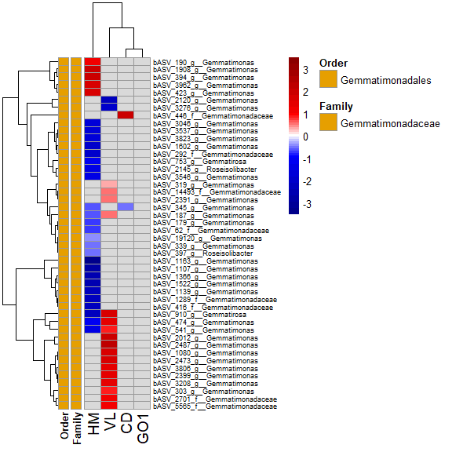<!-- -->

#### Heatmap order by taxonomy

``` r
# Create ordering index
ord <- order(tax_gem2$Phylum, tax_gem2$Class, tax_gem2$Order, tax_gem2$Family, tax_gem2$Genus)

# Reorder matrix
AllAcc_lfc_gem <- AllAcc_lfc_gem[ord, ]

# Reorder annotation accordingly
tax_gem2 <- tax_gem2[ord, , drop = FALSE]

# Make sure legend is in same direction
tax_gem2$Phylum <- factor(tax_gem2$Phylum, levels = unique(tax_gem2$Phylum))
tax_gem2$Class <- factor(tax_gem2$Class, levels = unique(tax_gem2$Class))
tax_gem2$Order <- factor(tax_gem2$Order, levels = unique(tax_gem2$Order))
tax_gem2$Family <- factor(tax_gem2$Family, levels = unique(tax_gem2$Family))
tax_gem2$Genus <- factor(tax_gem2$Genus, levels = unique(tax_gem2$Genus))

# Reorder color class vector
Order_Family_colors2_gem$Order <- Order_Family_colors2_gem$Order[levels(tax_gem2$Order)]
Order_Family_colors2_gem$Family <- Order_Family_colors2_gem$Family[levels(tax_gem2$Family)]
```


``` r
# Heatmap
p <- pheatmap(AllAcc_lfc_gem,
          cluster_rows = FALSE,
          cluster_cols = FALSE,
          color = colorRampPalette(c("darkblue", "blue", "white", "red", "darkred"))(50),
          breaks = seq(-max_abs, max_abs, length.out = 51),
          #main = "Differentially abundant tax_gem2a (log2FC by Family)",
          cellwidth = 25,
          cellheight = 9.5,
          fontsize_row = 9,
          fontsize_col = 14,
          na_col = "grey90",
          angle_col = 90,
          annotation_row = tax_gem2[3:4],
          annotation_colors = Order_Family_colors2_gem)
p 
```

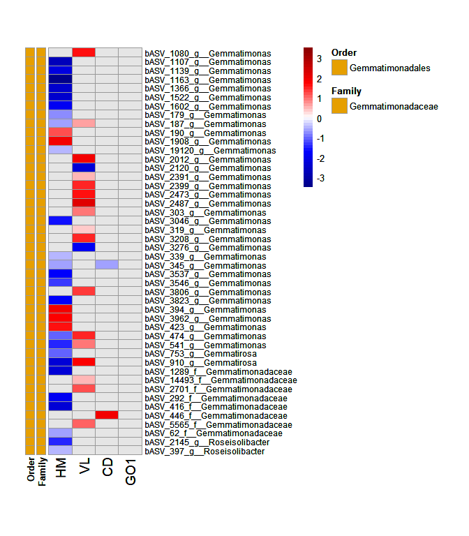<!-- -->

``` r
files <- c("FP_DAHeatmap_ASV_Gemmatimonadia.svg", "FP_DAHeatmap_ASV_Gemmatimonadia.png")

mapply(function(x){
  file_path <- file.path("C:/Users/kreek001/OneDrive - Wageningen University & Research/Chapters/Experimental Chapter 3/Result/Final graphs", x)

  if (grepl("svg$", x)) {
    svg(file_path, width = 20/2.54, height = 17/2.54)
  } else {
    png(file_path, width = 20, height = 17, units = "cm", res = 300)
  }
  grid::grid.draw(p$gtable)
  dev.off()
}, files)
```

```
## FP_DAHeatmap_ASV_Gemmatimonadia.svg.png FP_DAHeatmap_ASV_Gemmatimonadia.png.png 
##                                       2                                       2
```

``` r
rm(p)
```

## Thermoleophilia
#### Subset Thermoleophilia

``` r
# Subset taxonomy table
tax_the <- tax[tax$Class == "c__Thermoleophilia", ]
tax_the
```

```
##                        Genus                  Family                  Order
## bASV_1025  g__Incertae_Sedis       f__Incertae_Sedis          o__Gaiellales
## bASV_11178       g__Baekduia f__Solirubrobacteraceae o__Solirubrobacterales
## bASV_1224  g__Incertae_Sedis       f__Incertae_Sedis          o__Gaiellales
## bASV_124   g__Incertae_Sedis       f__Incertae_Sedis          o__Gaiellales
## bASV_1329  g__Incertae_Sedis                f__67-14 o__Solirubrobacterales
## bASV_1538  g__Incertae_Sedis       f__Incertae_Sedis          o__Gaiellales
## bASV_16090       g__Baekduia f__Solirubrobacteraceae o__Solirubrobacterales
## bASV_177   g__Incertae_Sedis       f__Incertae_Sedis          o__Gaiellales
## bASV_203   g__Incertae_Sedis                f__67-14 o__Solirubrobacterales
## bASV_22    g__Incertae_Sedis                f__67-14 o__Solirubrobacterales
## bASV_271   g__Incertae_Sedis       f__Incertae_Sedis          o__Gaiellales
## bASV_2861  g__Incertae_Sedis                f__67-14 o__Solirubrobacterales
## bASV_2902  g__Incertae_Sedis       f__Incertae_Sedis          o__Gaiellales
## bASV_430   g__Incertae_Sedis       f__Incertae_Sedis          o__Gaiellales
## bASV_4782  g__Incertae_Sedis       f__Incertae_Sedis          o__Gaiellales
## bASV_510          g__Gaiella          f__Gaiellaceae          o__Gaiellales
## bASV_57    g__Incertae_Sedis       f__Incertae_Sedis          o__Gaiellales
## bASV_5805         g__Gaiella          f__Gaiellaceae          o__Gaiellales
## bASV_656   g__Incertae_Sedis       f__Incertae_Sedis          o__Gaiellales
## bASV_794   g__Incertae_Sedis                f__67-14 o__Solirubrobacterales
## bASV_961         g__Baekduia f__Solirubrobacteraceae o__Solirubrobacterales
## bASV_968   g__Incertae_Sedis       f__Incertae_Sedis          o__Gaiellales
## bASV_991   g__Incertae_Sedis       f__Incertae_Sedis          o__Gaiellales
##                         Class            Phylum
## bASV_1025  c__Thermoleophilia p__Actinomycetota
## bASV_11178 c__Thermoleophilia p__Actinomycetota
## bASV_1224  c__Thermoleophilia p__Actinomycetota
## bASV_124   c__Thermoleophilia p__Actinomycetota
## bASV_1329  c__Thermoleophilia p__Actinomycetota
## bASV_1538  c__Thermoleophilia p__Actinomycetota
## bASV_16090 c__Thermoleophilia p__Actinomycetota
## bASV_177   c__Thermoleophilia p__Actinomycetota
## bASV_203   c__Thermoleophilia p__Actinomycetota
## bASV_22    c__Thermoleophilia p__Actinomycetota
## bASV_271   c__Thermoleophilia p__Actinomycetota
## bASV_2861  c__Thermoleophilia p__Actinomycetota
## bASV_2902  c__Thermoleophilia p__Actinomycetota
## bASV_430   c__Thermoleophilia p__Actinomycetota
## bASV_4782  c__Thermoleophilia p__Actinomycetota
## bASV_510   c__Thermoleophilia p__Actinomycetota
## bASV_57    c__Thermoleophilia p__Actinomycetota
## bASV_5805  c__Thermoleophilia p__Actinomycetota
## bASV_656   c__Thermoleophilia p__Actinomycetota
## bASV_794   c__Thermoleophilia p__Actinomycetota
## bASV_961   c__Thermoleophilia p__Actinomycetota
## bASV_968   c__Thermoleophilia p__Actinomycetota
## bASV_991   c__Thermoleophilia p__Actinomycetota
```

``` r
# Extrthe ASV numbers Bacilli ASVs
ASVs_the <- rownames(tax_the)

# Subset lfc matrix with Bacilli
AllAcc_lfc_the <- AllAcc_lfc[AllAcc_lfc$ASV %in% ASVs_the, ]
AllAcc_lfc_the
```

```
##                   ASV        HM         VL CD        GO1
## bASV_1025   bASV_1025        NA  1.9372566 NA         NA
## bASV_11178 bASV_11178        NA  0.5392339 NA         NA
## bASV_1224   bASV_1224        NA  1.9549544 NA         NA
## bASV_124     bASV_124        NA  0.6195031 NA         NA
## bASV_1329   bASV_1329        NA  1.7771820 NA         NA
## bASV_1538   bASV_1538  1.406510         NA NA         NA
## bASV_16090 bASV_16090        NA  0.7589564 NA         NA
## bASV_177     bASV_177        NA         NA NA -0.4794838
## bASV_203     bASV_203 -1.986131         NA NA         NA
## bASV_22       bASV_22        NA  0.4960659 NA         NA
## bASV_271     bASV_271        NA         NA NA -2.3932007
## bASV_2861   bASV_2861  1.717893         NA NA         NA
## bASV_2902   bASV_2902        NA  1.7610834 NA         NA
## bASV_430     bASV_430 -1.347202  0.4956514 NA         NA
## bASV_4782   bASV_4782        NA  1.2323811 NA         NA
## bASV_510     bASV_510  1.519891         NA NA         NA
## bASV_57       bASV_57        NA  0.6638165 NA         NA
## bASV_5805   bASV_5805        NA  0.5392339 NA         NA
## bASV_656     bASV_656        NA -1.3437874 NA         NA
## bASV_794     bASV_794        NA         NA NA -1.3812470
## bASV_961     bASV_961 -2.241210         NA NA         NA
## bASV_968     bASV_968        NA  2.7345903 NA         NA
## bASV_991     bASV_991  1.281911         NA NA         NA
```

#### Preparing heatmap

``` r
# Add genus to matrix
AllAcc_lfc_the$ASV <- rownames(AllAcc_lfc_the)
tax_the$ASV <- rownames(tax_the)
AllAcc_lfc_the <- merge(tax_the, AllAcc_lfc_the, ID = "ASV")

# Add higher taxon_theomic level if genus is NA or Incertae Sedis
taxon_the <- AllAcc_lfc_the$Genus
taxon_the[is.na(taxon_the)] <- AllAcc_lfc_the$Family[is.na(taxon_the)]
taxon_the[is.na(taxon_the)] <- AllAcc_lfc_the$Order[is.na(taxon_the)]

taxon_the[taxon_the == "g__Incertae_Sedis"] <- AllAcc_lfc_the$Family[taxon_the == "g__Incertae_Sedis"]
taxon_the[taxon_the == "f__Incertae_Sedis"] <- AllAcc_lfc_the$Order[taxon_the == "f__Incertae_Sedis"]
taxon_the[taxon_the == "o__Incertae_Sedis"] <- AllAcc_lfc_the$Class[taxon_the == "o__Incertae_Sedis"]

taxon_the[taxon_the == "g__Unclassified"] <- AllAcc_lfc_the$Family[taxon_the == "g__Unclassified"]
taxon_the[taxon_the == "f__Unclassified"] <- AllAcc_lfc_the$Order[taxon_the == "f__Unclassified"]
taxon_the[taxon_the == "o__Unclassified"] <- AllAcc_lfc_the$Class[taxon_the == "o__Unclassified"]

rownames(AllAcc_lfc_the) <- paste(AllAcc_lfc_the$ASV, taxon_the, sep = "_")

AllAcc_lfc_the$Phylum <- sub("p__", "", AllAcc_lfc_the$Phylum)
AllAcc_lfc_the$Class <- sub("c__", "", AllAcc_lfc_the$Class)
AllAcc_lfc_the$Order <- sub("o__", "", AllAcc_lfc_the$Order)
AllAcc_lfc_the$Family <- sub("f__", "", AllAcc_lfc_the$Family)

AllAcc_lfc_the3_df <- AllAcc_lfc_the
tax_the2 <- AllAcc_lfc_the[1:6]
AllAcc_lfc_the <- AllAcc_lfc_the[7:10]
head(AllAcc_lfc_the)
```

```
##                              HM        VL CD GO1
## bASV_1025_o__Gaiellales      NA 1.9372566 NA  NA
## bASV_11178_g__Baekduia       NA 0.5392339 NA  NA
## bASV_1224_o__Gaiellales      NA 1.9549544 NA  NA
## bASV_124_o__Gaiellales       NA 0.6195031 NA  NA
## bASV_1329_f__67-14           NA 1.7771820 NA  NA
## bASV_1538_o__Gaiellales 1.40651        NA NA  NA
```

``` r
# Make color pallet for class
colors35 <- c("#E69F00", "#56B4E9", "#009E73", "#F0E442", "#332288", "#CC79A7",
              "#D55E00", "#999999", "#88CCEE", "#44AA99", "#0072B2", "#000000",
              "#117733", "#999933", "#DDCC77", "#CC6677", "#882255", "#AA4499",
              "#661100", "#6699CC", "#AA4466", "#4477AA", "#EE6677", "#BBBBBB",
              "#2E3440", "#8FBCBB", "#BF616A", "#A3BE8C", "#EBCB8B", "#B48EAD",
              "#5E81AC", "#D08770", "#3B4252", "#7B9E87")

Family2 <- unique(tax_the2$Family)
Family_colors2_the2 <- setNames(colors35[1:length(Family2)], Family2)
Family_colors2_the2 <- list(Family = Family_colors2_the2)

# Make color pallet for Order for genus in plot
Order2 <- unique(tax_the2$Order)
Order_colors2_the2 <- setNames(colors35[1:length(Order2)], Order2)
Order_colors2_the2 <- list(Order = Order_colors2_the2)

Order_Family_colors2_the <- c(Order_colors2_the2, Family_colors2_the2)

# Turn data frame into a matrix
AllAcc_lfc_the <- as.matrix(AllAcc_lfc_the)

# replace NAs by 0s
AllAcc_lfc_the_clu <- AllAcc_lfc_the
AllAcc_lfc_the_clu[is.na(AllAcc_lfc_the_clu)] <- 0

# breaks in heatmap
max_abs <- max(abs(AllAcc_lfc_the), na.rm = TRUE)
breaks <- unique(c(seq(-max_abs, -1, length.out = 10), 
                   seq(-1, 1, length.out = 20), # More breaks in this range for sensitivity
                   seq(1, max_abs, length.out = 10)))
```

#### Heatmap 

``` r
pheatmap(AllAcc_lfc_the,
          clustering_distance_rows = dist(AllAcc_lfc_the_clu),
          clustering_distance_cols = dist(t(AllAcc_lfc_the_clu)),
          color = colorRampPalette(c("darkblue", "blue", "white", "red", "darkred"))(length(breaks) - 1),
          breaks = breaks,
          fontsize_col = 14,
          fontsize_row = 7,
          na_col = "grey85",
          angle_col = 90,
          show_rownames = TRUE,
          annotation_row = tax_the2[3:4],
          annotation_colors = Order_Family_colors2_the)
```

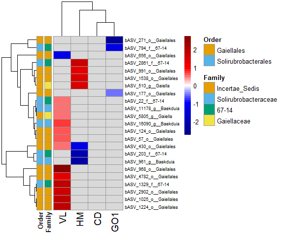<!-- -->

#### Heatmap order by taxonomy

``` r
# Create ordering index
ord <- order(tax_the2$Phylum, tax_the2$Class, tax_the2$Order, tax_the2$Family, tax_the2$Genus)

# Reorder matrix
AllAcc_lfc_the <- AllAcc_lfc_the[ord, ]

# Reorder annotation accordingly
tax_the2 <- tax_the2[ord, , drop = FALSE]

# Make sure legend is in same direction
tax_the2$Phylum <- factor(tax_the2$Phylum, levels = unique(tax_the2$Phylum))
tax_the2$Class <- factor(tax_the2$Class, levels = unique(tax_the2$Class))
tax_the2$Order <- factor(tax_the2$Order, levels = unique(tax_the2$Order))
tax_the2$Family <- factor(tax_the2$Family, levels = unique(tax_the2$Family))
tax_the2$Genus <- factor(tax_the2$Genus, levels = unique(tax_the2$Genus))

# Reorder color class vector
Order_Family_colors2_the$Order <- Order_Family_colors2_the$Order[levels(tax_the2$Order)]
Order_Family_colors2_the$Family <- Order_Family_colors2_the$Family[levels(tax_the2$Family)]
```


``` r
# Heatmap
p <- pheatmap(AllAcc_lfc_the,
          cluster_rows = FALSE,
          cluster_cols = FALSE,
          color = colorRampPalette(c("darkblue", "blue", "white", "red", "darkred"))(50),
          breaks = seq(-max_abs, max_abs, length.out = 51),
          #main = "Differentially abundant tax_the2a (log2FC by Family)",
          cellwidth = 25,
          cellheight = 9.5,
          fontsize_row = 9,
          fontsize_col = 14,
          na_col = "grey90",
          angle_col = 90,
          annotation_row = tax_the2[3:4],
          annotation_colors = Order_Family_colors2_the)
p 
```

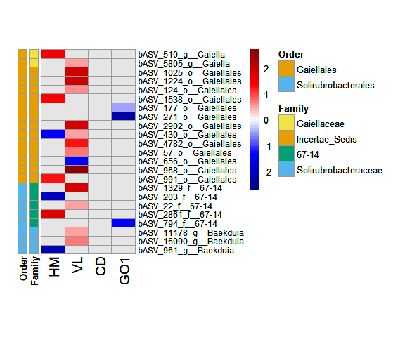<!-- -->

``` r
files <- c("FP_DAHeatmap_ASV_Thermoleophilia.svg", "FP_DAHeatmap_ASV_Thermoleophilia.png")

mapply(function(x){
  file_path <- file.path("C:/Users/kreek001/OneDrive - Wageningen University & Research/Chapters/Experimental Chapter 3/Result/Final graphs", x)

  if (grepl("svg$", x)) {
    svg(file_path, width = 20/2.54, height = 9/2.54)
  } else {
    png(file_path, width = 20, height = 9, units = "cm", res = 300)
  }
  grid::grid.draw(p$gtable)
  dev.off()
}, files)
```

```
## FP_DAHeatmap_ASV_Thermoleophilia.svg.png 
##                                        2 
## FP_DAHeatmap_ASV_Thermoleophilia.png.png 
##                                        2
```

``` r
rm(p)
```

## Ktedonobacteria
#### Subset Ktedonobacteria

``` r
# Subset taxonomy table
tax_kte <- tax[tax$Class == "c__Ktedonobacteria", ]
tax_kte
```

```
##                       Genus                Family                Order
## bASV_1055 g__Incertae_Sedis f__Ktedonobacteraceae o__Ktedonobacterales
## bASV_1321   g__Dictyobacter f__Ktedonobacteraceae o__Ktedonobacterales
## bASV_148  g__Incertae_Sedis        f__JG30-KF-AS9 o__Ktedonobacterales
## bASV_1519 g__Incertae_Sedis f__Ktedonobacteraceae o__Ktedonobacterales
## bASV_2146 g__Incertae_Sedis        f__JG30-KF-AS9 o__Ktedonobacterales
## bASV_2445 g__Incertae_Sedis     f__Incertae_Sedis          o__B10-SB3A
## bASV_2612 g__Incertae_Sedis f__Ktedonobacteraceae o__Ktedonobacterales
## bASV_302  g__Incertae_Sedis        f__JG30-KF-AS9 o__Ktedonobacterales
## bASV_340  g__Incertae_Sedis f__Ktedonobacteraceae o__Ktedonobacterales
## bASV_4036 g__Incertae_Sedis f__Ktedonobacteraceae o__Ktedonobacterales
## bASV_426  g__Incertae_Sedis f__Ktedonobacteraceae o__Ktedonobacterales
## bASV_444  g__Incertae_Sedis f__Ktedonobacteraceae o__Ktedonobacterales
## bASV_578  g__Incertae_Sedis f__Ktedonobacteraceae o__Ktedonobacterales
## bASV_594  g__Incertae_Sedis f__Ktedonobacteraceae o__Ktedonobacterales
## bASV_61   g__Incertae_Sedis        f__JG30-KF-AS9 o__Ktedonobacterales
## bASV_650  g__Incertae_Sedis f__Ktedonobacteraceae o__Ktedonobacterales
## bASV_660  g__Incertae_Sedis f__Ktedonobacteraceae o__Ktedonobacterales
## bASV_900  g__Incertae_Sedis f__Ktedonobacteraceae o__Ktedonobacterales
##                        Class           Phylum
## bASV_1055 c__Ktedonobacteria p__Chloroflexota
## bASV_1321 c__Ktedonobacteria p__Chloroflexota
## bASV_148  c__Ktedonobacteria p__Chloroflexota
## bASV_1519 c__Ktedonobacteria p__Chloroflexota
## bASV_2146 c__Ktedonobacteria p__Chloroflexota
## bASV_2445 c__Ktedonobacteria p__Chloroflexota
## bASV_2612 c__Ktedonobacteria p__Chloroflexota
## bASV_302  c__Ktedonobacteria p__Chloroflexota
## bASV_340  c__Ktedonobacteria p__Chloroflexota
## bASV_4036 c__Ktedonobacteria p__Chloroflexota
## bASV_426  c__Ktedonobacteria p__Chloroflexota
## bASV_444  c__Ktedonobacteria p__Chloroflexota
## bASV_578  c__Ktedonobacteria p__Chloroflexota
## bASV_594  c__Ktedonobacteria p__Chloroflexota
## bASV_61   c__Ktedonobacteria p__Chloroflexota
## bASV_650  c__Ktedonobacteria p__Chloroflexota
## bASV_660  c__Ktedonobacteria p__Chloroflexota
## bASV_900  c__Ktedonobacteria p__Chloroflexota
```

``` r
# Extrkte ASV numbers Bacilli ASVs
ASVs_kte <- rownames(tax_kte)

# Subset lfc matrix with Bacilli
AllAcc_lfc_kte <- AllAcc_lfc[AllAcc_lfc$ASV %in% ASVs_kte, ]
AllAcc_lfc_kte
```

```
##                 ASV         HM VL        CD        GO1
## bASV_1055 bASV_1055         NA NA 3.0622300         NA
## bASV_1321 bASV_1321         NA NA 2.2146756         NA
## bASV_148   bASV_148  0.4491447 NA        NA         NA
## bASV_1519 bASV_1519         NA NA 2.4860333         NA
## bASV_2146 bASV_2146         NA NA 1.7203528         NA
## bASV_2445 bASV_2445         NA NA 1.1054416         NA
## bASV_2612 bASV_2612         NA NA        NA -1.6888046
## bASV_302   bASV_302         NA NA 1.0524989         NA
## bASV_340   bASV_340         NA NA 0.8180373 -0.6696521
## bASV_4036 bASV_4036 -1.0906655 NA        NA         NA
## bASV_426   bASV_426         NA NA 1.2799136 -1.1471947
## bASV_444   bASV_444         NA NA 0.8247785         NA
## bASV_578   bASV_578         NA NA 3.6504624         NA
## bASV_594   bASV_594         NA NA 2.7273523         NA
## bASV_61     bASV_61         NA NA 0.6027193         NA
## bASV_650   bASV_650 -2.6010079 NA 2.7478834 -2.8855637
## bASV_660   bASV_660         NA NA 2.8726377         NA
## bASV_900   bASV_900         NA NA 3.9333390         NA
```

#### Preparing heatmap

``` r
# Add genus to matrix
AllAcc_lfc_kte$ASV <- rownames(AllAcc_lfc_kte)
tax_kte$ASV <- rownames(tax_kte)
AllAcc_lfc_kte <- merge(tax_kte, AllAcc_lfc_kte, ID = "ASV")

# Add higher taxon_kteomic level if genus is NA or Incertae Sedis
taxon_kte <- AllAcc_lfc_kte$Genus
taxon_kte[is.na(taxon_kte)] <- AllAcc_lfc_kte$Family[is.na(taxon_kte)]
taxon_kte[is.na(taxon_kte)] <- AllAcc_lfc_kte$Order[is.na(taxon_kte)]

taxon_kte[taxon_kte == "g__Incertae_Sedis"] <- AllAcc_lfc_kte$Family[taxon_kte == "g__Incertae_Sedis"]
taxon_kte[taxon_kte == "f__Incertae_Sedis"] <- AllAcc_lfc_kte$Order[taxon_kte == "f__Incertae_Sedis"]
taxon_kte[taxon_kte == "o__Incertae_Sedis"] <- AllAcc_lfc_kte$Class[taxon_kte == "o__Incertae_Sedis"]

taxon_kte[taxon_kte == "g__Unclassified"] <- AllAcc_lfc_kte$Family[taxon_kte == "g__Unclassified"]
taxon_kte[taxon_kte == "f__Unclassified"] <- AllAcc_lfc_kte$Order[taxon_kte == "f__Unclassified"]
taxon_kte[taxon_kte == "o__Unclassified"] <- AllAcc_lfc_kte$Class[taxon_kte == "o__Unclassified"]

rownames(AllAcc_lfc_kte) <- paste(AllAcc_lfc_kte$ASV, taxon_kte, sep = "_")

AllAcc_lfc_kte$Phylum <- sub("p__", "", AllAcc_lfc_kte$Phylum)
AllAcc_lfc_kte$Class <- sub("c__", "", AllAcc_lfc_kte$Class)
AllAcc_lfc_kte$Order <- sub("o__", "", AllAcc_lfc_kte$Order)
AllAcc_lfc_kte$Family <- sub("f__", "", AllAcc_lfc_kte$Family)

AllAcc_lfc_kte3_df <- AllAcc_lfc_kte
tax_kte2 <- AllAcc_lfc_kte[1:6]
AllAcc_lfc_kte <- AllAcc_lfc_kte[7:10]
head(AllAcc_lfc_kte)
```

```
##                                        HM VL       CD GO1
## bASV_1055_f__Ktedonobacteraceae        NA NA 3.062230  NA
## bASV_1321_g__Dictyobacter              NA NA 2.214676  NA
## bASV_148_f__JG30-KF-AS9         0.4491447 NA       NA  NA
## bASV_1519_f__Ktedonobacteraceae        NA NA 2.486033  NA
## bASV_2146_f__JG30-KF-AS9               NA NA 1.720353  NA
## bASV_2445_o__B10-SB3A                  NA NA 1.105442  NA
```

``` r
# Make color pallet for class
colors35 <- c("#E69F00", "#56B4E9", "#009E73", "#F0E442", "#332288", "#CC79A7",
              "#D55E00", "#999999", "#88CCEE", "#44AA99", "#0072B2", "#000000",
              "#117733", "#999933", "#DDCC77", "#CC6677", "#882255", "#AA4499",
              "#661100", "#6699CC", "#AA4466", "#4477AA", "#EE6677", "#BBBBBB",
              "#2E3440", "#8FBCBB", "#BF616A", "#A3BE8C", "#EBCB8B", "#B48EAD",
              "#5E81AC", "#D08770", "#3B4252", "#7B9E87")

Family2 <- unique(tax_kte2$Family)
Family_colors2_kte2 <- setNames(colors35[1:length(Family2)], Family2)
Family_colors2_kte2 <- list(Family = Family_colors2_kte2)

# Make color pallet for Order for genus in plot
Order2 <- unique(tax_kte2$Order)
Order_colors2_kte2 <- setNames(colors35[1:length(Order2)], Order2)
Order_colors2_kte2 <- list(Order = Order_colors2_kte2)

Order_Family_colors2_kte <- c(Order_colors2_kte2, Family_colors2_kte2)

# Turn data frame into a matrix
AllAcc_lfc_kte <- as.matrix(AllAcc_lfc_kte)

# replace NAs by 0s
AllAcc_lfc_kte_clu <- AllAcc_lfc_kte
AllAcc_lfc_kte_clu[is.na(AllAcc_lfc_kte_clu)] <- 0

# breaks in heatmap
max_abs <- max(abs(AllAcc_lfc_kte), na.rm = TRUE)
breaks <- unique(c(seq(-max_abs, -1, length.out = 10), 
                   seq(-1, 1, length.out = 20), # More breaks in this range for sensitivity
                   seq(1, max_abs, length.out = 10)))
```

#### Heatmap 

``` r
pheatmap(AllAcc_lfc_kte,
          clustering_distance_rows = dist(AllAcc_lfc_kte_clu),
          clustering_distance_cols = dist(t(AllAcc_lfc_kte_clu)),
          color = colorRampPalette(c("darkblue", "blue", "white", "red", "darkred"))(length(breaks) - 1),
          breaks = breaks,
          cellwidth = 25,
          cellheight = 9.5,
          fontsize_row = 9,
          fontsize_col = 14,
          na_col = "grey85",
          angle_col = 90,
          show_rownames = TRUE,
          annotation_row = tax_kte2[3:4],
          annotation_colors = Order_Family_colors2_kte)
```

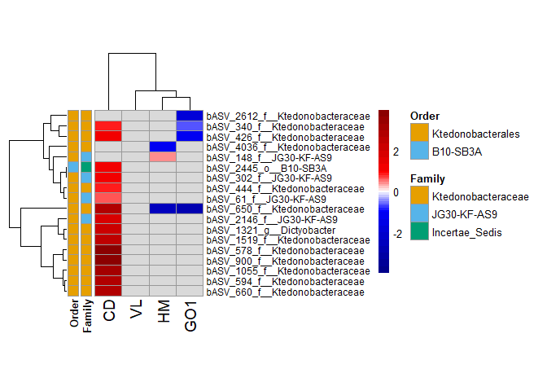<!-- -->

#### Heatmap order by taxonomy

``` r
# Create ordering index
ord <- order(tax_kte2$Phylum, tax_kte2$Class, tax_kte2$Order, tax_kte2$Family, tax_kte2$Genus)

# Reorder matrix
AllAcc_lfc_kte <- AllAcc_lfc_kte[ord, ]

# Reorder annotation accordingly
tax_kte2 <- tax_kte2[ord, , drop = FALSE]

# Make sure legend is in same direction
tax_kte2$Phylum <- factor(tax_kte2$Phylum, levels = unique(tax_kte2$Phylum))
tax_kte2$Class <- factor(tax_kte2$Class, levels = unique(tax_kte2$Class))
tax_kte2$Order <- factor(tax_kte2$Order, levels = unique(tax_kte2$Order))
tax_kte2$Family <- factor(tax_kte2$Family, levels = unique(tax_kte2$Family))
tax_kte2$Genus <- factor(tax_kte2$Genus, levels = unique(tax_kte2$Genus))

# Reorder color class vector
Order_Family_colors2_kte$Order <- Order_Family_colors2_kte$Order[levels(tax_kte2$Order)]
Order_Family_colors2_kte$Family <- Order_Family_colors2_kte$Family[levels(tax_kte2$Family)]
```


``` r
# Heatmap
p <- pheatmap(AllAcc_lfc_kte,
          cluster_rows = FALSE,
          cluster_cols = FALSE,
          color = colorRampPalette(c("darkblue", "blue", "white", "red", "darkred"))(50),
          breaks = seq(-max_abs, max_abs, length.out = 51),
          #main = "Differentially abundant tax_kte2a (log2FC by Family)",
          cellwidth = 25,
          cellheight = 9.5,
          fontsize_row = 9,
          fontsize_col = 14,
          na_col = "grey90",
          angle_col = 90,
          annotation_row = tax_kte2[3:4],
          annotation_colors = Order_Family_colors2_kte)
p 
```

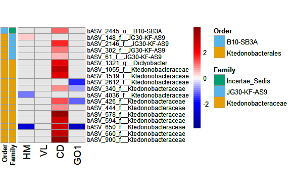<!-- -->

``` r
files <- c("FP_DAHeatmap_ASV_Ktedonobacteria.svg", "FP_DAHeatmap_ASV_Ktedonobacteria.png")

mapply(function(x){
  file_path <- file.path("C:/Users/kreek001/OneDrive - Wageningen University & Research/Chapters/Experimental Chapter 3/Result/Final graphs", x)

  if (grepl("svg$", x)) {
    svg(file_path, width = 20/2.54, height = 7.5/2.54)
  } else {
    png(file_path, width = 20, height = 7.5, units = "cm", res = 300)
  }
  grid::grid.draw(p$gtable)
  dev.off()
}, files)
```

```
## FP_DAHeatmap_ASV_Ktedonobacteria.svg.png 
##                                        2 
## FP_DAHeatmap_ASV_Ktedonobacteria.png.png 
##                                        2
```

``` r
rm(p)
```

## Other Classes
#### Subset Other

``` r
# Most abundant classes
Ab_class <- c("c__Gammaproteobacteria", "c__Alphaproteobacteria", "c__Actinobacteria", "c__Gemmatimonadia", "c__Thermoleophilia", "c__Ktedonobacteria", "c__Bacilli")

# Subset taxonomy table
tax_Other <- tax[!(tax$Class %in% Ab_class), ]
tax_Other
```

```
##                                      Genus                            Family
## bASV_1034                g__Incertae_Sedis                 f__Incertae_Sedis
## bASV_1062         g__Candidatus_Solibacter                f__Solibacteraceae
## bASV_1067                g__Incertae_Sedis                 f__Incertae_Sedis
## bASV_1114                g__Incertae_Sedis                   f__JG30-KF-CM45
## bASV_1202                g__Incertae_Sedis                 f__Incertae_Sedis
## bASV_12339                  g__Clostridium                 f__Clostridiaceae
## bASV_12754               g__Incertae_Sedis                 f__Incertae_Sedis
## bASV_129                     g__Bryobacter                f__Bryobacteraceae
## bASV_1352                g__Incertae_Sedis                 f__Incertae_Sedis
## bASV_1428                g__Incertae_Sedis                 f__Incertae_Sedis
## bASV_1499                    g__Bryobacter                f__Bryobacteraceae
## bASV_15018                         g__Puia               f__Chitinophagaceae
## bASV_1520                   g__Deinococcus                 f__Deinococcaceae
## bASV_1544                      g__Geomonas                 f__Geobacteraceae
## bASV_1591               g__Flavisolibacter               f__Chitinophagaceae
## bASV_160            g__Acidiferrimicrobium              f__Acidimicrobiaceae
## bASV_1621                g__Incertae_Sedis                 f__Incertae_Sedis
## bASV_1728                   g__Clostridium                 f__Clostridiaceae
## bASV_1742                g__Incertae_Sedis                        f__AKIW781
## bASV_1780                g__Incertae_Sedis                 f__Incertae_Sedis
## bASV_1853                g__Incertae_Sedis             f__Obscuribacteraceae
## bASV_192                 g__Incertae_Sedis                   f__JG30-KF-CM45
## bASV_1933                g__Incertae_Sedis                        f__BIrii41
## bASV_1934                    g__Flavitalea               f__Chitinophagaceae
## bASV_1940                    g__Bryobacter                f__Bryobacteraceae
## bASV_1962                g__Singulisphaera                 f__Isosphaeraceae
## bASV_1963                g__Incertae_Sedis                 f__Incertae_Sedis
## bASV_1969                g__Incertae_Sedis                 f__Incertae_Sedis
## bASV_1994               g__Flavisolibacter               f__Chitinophagaceae
## bASV_202            g__Acidiferrimicrobium              f__Acidimicrobiaceae
## bASV_2218              g__Mucilaginibacter            f__Sphingobacteriaceae
## bASV_2290                g__Incertae_Sedis       f__Pseudobdellovibrionaceae
## bASV_2299                  g__Aquihabitans                      f__Iamiaceae
## bASV_2358               g__Terracidiphilus f__Acidobacteriaceae_(Subgroup_1)
## bASV_2377                   g__Nitrolancea             f__Thermomicrobiaceae
## bASV_2387                g__Incertae_Sedis              f__Blastocatellaceae
## bASV_2459                g__Incertae_Sedis                 f__Incertae_Sedis
## bASV_2565                  g__Aquihabitans                      f__Iamiaceae
## bASV_2650                  g__Chryseolinea                f__Microscillaceae
## bASV_279                     g__Bryobacter                f__Bryobacteraceae
## bASV_2973                g__Incertae_Sedis                 f__Incertae_Sedis
## bASV_309                 g__Incertae_Sedis             f__Ilumatobacteraceae
## bASV_3138                  g__Unclassified            f__Desulfovibrionaceae
## bASV_3204                     g__Ilyomonas               f__Chitinophagaceae
## bASV_3403                  g__Segetibacter               f__Chitinophagaceae
## bASV_3504             g__Sediminibacterium               f__Chitinophagaceae
## bASV_3768                g__Incertae_Sedis            f__Vicinamibacteraceae
## bASV_378            g__Acidiferrimicrobium              f__Acidimicrobiaceae
## bASV_382          g__Candidatus_Solibacter                f__Solibacteraceae
## bASV_386                    g__Nitrolancea             f__Thermomicrobiaceae
## bASV_3920                g__Incertae_Sedis            f__Verrucomicrobiaceae
## bASV_4116           g__Acidiferrimicrobium              f__Acidimicrobiaceae
## bASV_4149               g__Flavisolibacter               f__Chitinophagaceae
## bASV_417                 g__Incertae_Sedis                   f__JG30-KF-CM45
## bASV_4207                g__Incertae_Sedis                 f__Incertae_Sedis
## bASV_4392                 g__Dinghuibacter               f__Chitinophagaceae
## bASV_4415                g__Incertae_Sedis                   f__JG30-KF-CM45
## bASV_4528                  g__Unclassified               f__Chitinophagaceae
## bASV_4569                g__Incertae_Sedis                 f__Incertae_Sedis
## bASV_4762                   g__Dyadobacter                f__Spirosomataceae
## bASV_477            g__Acidiferrimicrobium              f__Acidimicrobiaceae
## bASV_4802                  g__Unclassified               f__Chitinophagaceae
## bASV_5015                g__Incertae_Sedis                 f__Incertae_Sedis
## bASV_5040                g__Incertae_Sedis                 f__Incertae_Sedis
## bASV_5196                g__Incertae_Sedis              f__WD2101_soil_group
## bASV_5307                 g__Luteolibacter                 f__Rubritaleaceae
## bASV_5456                g__Incertae_Sedis                 f__Incertae_Sedis
## bASV_5529                   g__Nemorincola               f__Chitinophagaceae
## bASV_560                 g__Incertae_Sedis                 f__Roseiflexaceae
## bASV_564                 g__Incertae_Sedis                   f__JG30-KF-CM45
## bASV_5707         g__Candidatus_Solibacter                f__Solibacteraceae
## bASV_5791                g__Incertae_Sedis                 f__Incertae_Sedis
## bASV_5864         g__Candidatus_Solibacter                f__Solibacteraceae
## bASV_5974                g__Incertae_Sedis                 f__Incertae_Sedis
## bASV_6205                g__Incertae_Sedis                f__Pedosphaeraceae
## bASV_65             g__Acidiferrimicrobium              f__Acidimicrobiaceae
## bASV_6504  g__Candidatus_Xiphinematobacter         f__Xiphinematobacteraceae
## bASV_66                  g__Incertae_Sedis                 f__Incertae_Sedis
## bASV_670                 g__Incertae_Sedis            f__Vicinamibacteraceae
## bASV_713                 g__Incertae_Sedis                 f__Incertae_Sedis
## bASV_73             g__Acidiferrimicrobium              f__Acidimicrobiaceae
## bASV_8148              g__Anaeromyxobacter          f__Anaeromyxobacteraceae
## bASV_824          g__CL500-29_marine_group             f__Ilumatobacteraceae
## bASV_8917                 g__Luteolibacter                 f__Rubritaleaceae
## bASV_916          g__Candidatus_Solibacter                f__Solibacteraceae
## bASV_9579                g__Incertae_Sedis                 f__Incertae_Sedis
## bASV_974                   g__Aquihabitans                      f__Iamiaceae
##                            Order                      Class
## bASV_1034  o__Vicinamibacterales        c__Vicinamibacteria
## bASV_1062      o__Solibacterales          c__Acidobacteriae
## bASV_1067  o__Vicinamibacterales        c__Vicinamibacteria
## bASV_1114   o__Thermomicrobiales            c__Chloroflexia
## bASV_1202      o__Incertae_Sedis                    c__TK10
## bASV_12339      o__Clostridiales              c__Clostridia
## bASV_12754 o__Vicinamibacterales        c__Vicinamibacteria
## bASV_129       o__Bryobacterales          c__Acidobacteriae
## bASV_1352  o__Vicinamibacterales        c__Vicinamibacteria
## bASV_1428  o__Vicinamibacterales        c__Vicinamibacteria
## bASV_1499      o__Bryobacterales          c__Acidobacteriae
## bASV_15018    o__Chitinophagales             c__Bacteroidia
## bASV_1520       o__Deinococcales              c__Deinococci
## bASV_1544       o__Geobacterales        c__Desulfuromonadia
## bASV_1591     o__Chitinophagales             c__Bacteroidia
## bASV_160     o__Acidimicrobiales          c__Acidimicrobiia
## bASV_1621      o__Incertae_Sedis                  c__KD4-96
## bASV_1728       o__Clostridiales              c__Clostridia
## bASV_1742       o__Kallotenuales            c__Chloroflexia
## bASV_1780      o__Incertae_Sedis c__S0134_terrestrial_group
## bASV_1853   o__Obscuribacterales        c__Vampirivibrionia
## bASV_192    o__Thermomicrobiales            c__Chloroflexia
## bASV_1933        o__Polyangiales              c__Polyangiia
## bASV_1934     o__Chitinophagales             c__Bacteroidia
## bASV_1940      o__Bryobacterales          c__Acidobacteriae
## bASV_1962       o__Isosphaerales          c__Planctomycetes
## bASV_1963      o__Incertae_Sedis          c__Incertae_Sedis
## bASV_1969      o__Incertae_Sedis            c__JG30-KF-CM66
## bASV_1994     o__Chitinophagales             c__Bacteroidia
## bASV_202     o__Acidimicrobiales          c__Acidimicrobiia
## bASV_2218  o__Sphingobacteriales             c__Bacteroidia
## bASV_2290   o__Bdellovibrionales         c__Bdellovibrionia
## bASV_2299      o__Microtrichales          c__Acidimicrobiia
## bASV_2358       o__Terriglobales          c__Acidobacteriae
## bASV_2377   o__Thermomicrobiales            c__Chloroflexia
## bASV_2387    o__Blastocatellales          c__Blastocatellia
## bASV_2459           o__0319-6G20             c__Oligoflexia
## bASV_2565      o__Microtrichales          c__Acidimicrobiia
## bASV_2650        o__Cytophagales             c__Bacteroidia
## bASV_279       o__Bryobacterales          c__Acidobacteriae
## bASV_2973  o__Vicinamibacterales        c__Vicinamibacteria
## bASV_309       o__Microtrichales          c__Acidimicrobiia
## bASV_3138  o__Desulfovibrionales        c__Desulfovibrionia
## bASV_3204     o__Chitinophagales             c__Bacteroidia
## bASV_3403     o__Chitinophagales             c__Bacteroidia
## bASV_3504     o__Chitinophagales             c__Bacteroidia
## bASV_3768  o__Vicinamibacterales        c__Vicinamibacteria
## bASV_378     o__Acidimicrobiales          c__Acidimicrobiia
## bASV_382       o__Solibacterales          c__Acidobacteriae
## bASV_386    o__Thermomicrobiales            c__Chloroflexia
## bASV_3920  o__Verrucomicrobiales        c__Verrucomicrobiia
## bASV_4116    o__Acidimicrobiales          c__Acidimicrobiia
## bASV_4149     o__Chitinophagales             c__Bacteroidia
## bASV_417    o__Thermomicrobiales            c__Chloroflexia
## bASV_4207      o__Incertae_Sedis                    c__TK10
## bASV_4392     o__Chitinophagales             c__Bacteroidia
## bASV_4415   o__Thermomicrobiales            c__Chloroflexia
## bASV_4528     o__Chitinophagales             c__Bacteroidia
## bASV_4569           o__0319-6G20             c__Oligoflexia
## bASV_4762        o__Cytophagales             c__Bacteroidia
## bASV_477     o__Acidimicrobiales          c__Acidimicrobiia
## bASV_4802     o__Chitinophagales             c__Bacteroidia
## bASV_5015           o__0319-6G20             c__Oligoflexia
## bASV_5040      o__Incertae_Sedis                    c__TK10
## bASV_5196    o__Tepidisphaerales           c__Phycisphaerae
## bASV_5307  o__Verrucomicrobiales        c__Verrucomicrobiia
## bASV_5456  o__Vicinamibacterales        c__Vicinamibacteria
## bASV_5529     o__Chitinophagales             c__Bacteroidia
## bASV_560       o__Chloroflexales            c__Chloroflexia
## bASV_564    o__Thermomicrobiales            c__Chloroflexia
## bASV_5707      o__Solibacterales          c__Acidobacteriae
## bASV_5791      o__Incertae_Sedis                    c__TK10
## bASV_5864      o__Solibacterales          c__Acidobacteriae
## bASV_5974  o__Vicinamibacterales        c__Vicinamibacteria
## bASV_6205      o__Pedosphaerales        c__Verrucomicrobiia
## bASV_65      o__Acidimicrobiales          c__Acidimicrobiia
## bASV_6504  o__Chthoniobacterales        c__Verrucomicrobiia
## bASV_66        o__Incertae_Sedis             c__Gitt-GS-136
## bASV_670   o__Vicinamibacterales        c__Vicinamibacteria
## bASV_713   o__Vicinamibacterales        c__Vicinamibacteria
## bASV_73      o__Acidimicrobiales          c__Acidimicrobiia
## bASV_8148        o__Myxococcales              c__Myxococcia
## bASV_824       o__Microtrichales          c__Acidimicrobiia
## bASV_8917  o__Verrucomicrobiales        c__Verrucomicrobiia
## bASV_916       o__Solibacterales          c__Acidobacteriae
## bASV_9579      o__Incertae_Sedis c__S0134_terrestrial_group
## bASV_974       o__Microtrichales          c__Acidimicrobiia
##                                Phylum
## bASV_1034          p__Acidobacteriota
## bASV_1062          p__Acidobacteriota
## bASV_1067          p__Acidobacteriota
## bASV_1114            p__Chloroflexota
## bASV_1202            p__Chloroflexota
## bASV_12339               p__Bacillota
## bASV_12754         p__Acidobacteriota
## bASV_129           p__Acidobacteriota
## bASV_1352          p__Acidobacteriota
## bASV_1428          p__Acidobacteriota
## bASV_1499          p__Acidobacteriota
## bASV_15018            p__Bacteroidota
## bASV_1520             p__Deinococcota
## bASV_1544  p__Thermodesulfobacteriota
## bASV_1591             p__Bacteroidota
## bASV_160            p__Actinomycetota
## bASV_1621            p__Chloroflexota
## bASV_1728                p__Bacillota
## bASV_1742            p__Chloroflexota
## bASV_1780          p__Gemmatimonadota
## bASV_1853          p__Cyanobacteriota
## bASV_192             p__Chloroflexota
## bASV_1933              p__Myxococcota
## bASV_1934             p__Bacteroidota
## bASV_1940          p__Acidobacteriota
## bASV_1962          p__Planctomycetota
## bASV_1963          p__Patescibacteria
## bASV_1969            p__Chloroflexota
## bASV_1994             p__Bacteroidota
## bASV_202            p__Actinomycetota
## bASV_2218             p__Bacteroidota
## bASV_2290         p__Bdellovibrionota
## bASV_2299           p__Actinomycetota
## bASV_2358          p__Acidobacteriota
## bASV_2377            p__Chloroflexota
## bASV_2387          p__Acidobacteriota
## bASV_2459         p__Bdellovibrionota
## bASV_2565           p__Actinomycetota
## bASV_2650             p__Bacteroidota
## bASV_279           p__Acidobacteriota
## bASV_2973          p__Acidobacteriota
## bASV_309            p__Actinomycetota
## bASV_3138  p__Thermodesulfobacteriota
## bASV_3204             p__Bacteroidota
## bASV_3403             p__Bacteroidota
## bASV_3504             p__Bacteroidota
## bASV_3768          p__Acidobacteriota
## bASV_378            p__Actinomycetota
## bASV_382           p__Acidobacteriota
## bASV_386             p__Chloroflexota
## bASV_3920        p__Verrucomicrobiota
## bASV_4116           p__Actinomycetota
## bASV_4149             p__Bacteroidota
## bASV_417             p__Chloroflexota
## bASV_4207            p__Chloroflexota
## bASV_4392             p__Bacteroidota
## bASV_4415            p__Chloroflexota
## bASV_4528             p__Bacteroidota
## bASV_4569         p__Bdellovibrionota
## bASV_4762             p__Bacteroidota
## bASV_477            p__Actinomycetota
## bASV_4802             p__Bacteroidota
## bASV_5015         p__Bdellovibrionota
## bASV_5040            p__Chloroflexota
## bASV_5196          p__Planctomycetota
## bASV_5307        p__Verrucomicrobiota
## bASV_5456          p__Acidobacteriota
## bASV_5529             p__Bacteroidota
## bASV_560             p__Chloroflexota
## bASV_564             p__Chloroflexota
## bASV_5707          p__Acidobacteriota
## bASV_5791            p__Chloroflexota
## bASV_5864          p__Acidobacteriota
## bASV_5974          p__Acidobacteriota
## bASV_6205        p__Verrucomicrobiota
## bASV_65             p__Actinomycetota
## bASV_6504        p__Verrucomicrobiota
## bASV_66              p__Chloroflexota
## bASV_670           p__Acidobacteriota
## bASV_713           p__Acidobacteriota
## bASV_73             p__Actinomycetota
## bASV_8148              p__Myxococcota
## bASV_824            p__Actinomycetota
## bASV_8917        p__Verrucomicrobiota
## bASV_916           p__Acidobacteriota
## bASV_9579          p__Gemmatimonadota
## bASV_974            p__Actinomycetota
```

``` r
# ExtrOther ASV numbers Bacilli ASVs
ASVs_Other <- rownames(tax_Other)

# Subset lfc matrix with Bacilli
AllAcc_lfc_Other <- AllAcc_lfc[AllAcc_lfc$ASV %in% ASVs_Other, ]
AllAcc_lfc_Other
```

```
##                   ASV         HM         VL        CD        GO1
## bASV_1034   bASV_1034 -2.4490267         NA        NA         NA
## bASV_1062   bASV_1062 -1.9874402         NA        NA         NA
## bASV_1067   bASV_1067         NA  1.7708415        NA         NA
## bASV_1114   bASV_1114  1.5206819         NA        NA         NA
## bASV_1202   bASV_1202 -1.2353780         NA        NA         NA
## bASV_12339 bASV_12339         NA  0.7589564        NA         NA
## bASV_12754 bASV_12754 -0.7687779         NA        NA         NA
## bASV_129     bASV_129 -0.4865612         NA        NA         NA
## bASV_1352   bASV_1352         NA  1.6875304        NA         NA
## bASV_1428   bASV_1428  1.3557853         NA        NA         NA
## bASV_1499   bASV_1499 -2.5615003         NA        NA         NA
## bASV_15018 bASV_15018 -0.4679624         NA        NA         NA
## bASV_1520   bASV_1520 -1.2836691         NA        NA         NA
## bASV_1544   bASV_1544  0.4318384         NA        NA         NA
## bASV_1591   bASV_1591         NA         NA -2.114903         NA
## bASV_160     bASV_160         NA         NA        NA -2.6528326
## bASV_1621   bASV_1621         NA         NA        NA -1.7535123
## bASV_1728   bASV_1728         NA  2.2313585        NA         NA
## bASV_1742   bASV_1742 -1.1993023         NA        NA         NA
## bASV_1780   bASV_1780 -2.3829591         NA        NA         NA
## bASV_1853   bASV_1853 -1.6008667         NA        NA         NA
## bASV_192     bASV_192         NA         NA        NA -0.5178698
## bASV_1933   bASV_1933  1.3503764         NA        NA         NA
## bASV_1934   bASV_1934 -2.5437514         NA        NA         NA
## bASV_1940   bASV_1940  1.8140467         NA        NA         NA
## bASV_1962   bASV_1962  1.5468189 -2.3894206        NA         NA
## bASV_1963   bASV_1963 -1.4916994         NA        NA         NA
## bASV_1969   bASV_1969 -1.9283008         NA        NA         NA
## bASV_1994   bASV_1994         NA         NA -1.465316         NA
## bASV_202     bASV_202 -0.6833506         NA        NA         NA
## bASV_2218   bASV_2218 -1.5224434         NA        NA         NA
## bASV_2290   bASV_2290 -3.1268893         NA -1.596003         NA
## bASV_2299   bASV_2299 -2.2249173         NA        NA         NA
## bASV_2358   bASV_2358 -1.9285964         NA        NA         NA
## bASV_2377   bASV_2377         NA         NA        NA -1.6080764
## bASV_2387   bASV_2387 -1.3412181         NA        NA         NA
## bASV_2459   bASV_2459         NA  1.5764316        NA         NA
## bASV_2565   bASV_2565 -2.0343652         NA        NA         NA
## bASV_2650   bASV_2650  1.0996968         NA        NA         NA
## bASV_279     bASV_279 -0.5099856         NA        NA         NA
## bASV_2973   bASV_2973 -1.2236607         NA        NA         NA
## bASV_309     bASV_309 -2.5167143         NA        NA         NA
## bASV_3138   bASV_3138  1.0666851         NA        NA         NA
## bASV_3204   bASV_3204         NA  2.0070116        NA         NA
## bASV_3403   bASV_3403 -1.8988855         NA        NA         NA
## bASV_3504   bASV_3504 -1.6109078         NA        NA         NA
## bASV_3768   bASV_3768 -1.5975609         NA        NA         NA
## bASV_378     bASV_378 -2.4580453         NA        NA         NA
## bASV_382     bASV_382 -2.4208331         NA        NA         NA
## bASV_386     bASV_386         NA -1.7903504        NA -0.6298815
## bASV_3920   bASV_3920  1.8913383         NA        NA         NA
## bASV_4116   bASV_4116 -1.4891515         NA        NA         NA
## bASV_4149   bASV_4149 -1.3412181         NA        NA         NA
## bASV_417     bASV_417         NA -2.6035610        NA         NA
## bASV_4207   bASV_4207         NA  1.1830091        NA         NA
## bASV_4392   bASV_4392         NA  0.8975858        NA         NA
## bASV_4415   bASV_4415 -1.0906655         NA        NA         NA
## bASV_4528   bASV_4528 -1.2503670         NA        NA         NA
## bASV_4569   bASV_4569  1.5868344         NA        NA         NA
## bASV_4762   bASV_4762  1.3110747         NA        NA         NA
## bASV_477     bASV_477 -2.9447708         NA        NA  2.8576870
## bASV_4802   bASV_4802 -1.2463265         NA        NA         NA
## bASV_5015   bASV_5015 -1.5194615         NA        NA         NA
## bASV_5040   bASV_5040 -1.6241111         NA        NA         NA
## bASV_5196   bASV_5196         NA         NA        NA -1.1805848
## bASV_5307   bASV_5307  1.3136192         NA        NA         NA
## bASV_5456   bASV_5456 -0.9885004         NA        NA         NA
## bASV_5529   bASV_5529 -1.9594266         NA        NA         NA
## bASV_560     bASV_560         NA  2.5631763        NA         NA
## bASV_564     bASV_564 -1.9119112         NA        NA         NA
## bASV_5707   bASV_5707         NA         NA -1.320733         NA
## bASV_5791   bASV_5791 -1.2422026         NA        NA         NA
## bASV_5864   bASV_5864 -1.5065538         NA        NA         NA
## bASV_5974   bASV_5974         NA  0.6203269        NA         NA
## bASV_6205   bASV_6205         NA         NA        NA -1.7155387
## bASV_65       bASV_65 -0.4635160         NA        NA -0.3935464
## bASV_6504   bASV_6504  2.0583762         NA        NA         NA
## bASV_66       bASV_66         NA         NA        NA -0.4960426
## bASV_670     bASV_670 -0.7935838         NA        NA         NA
## bASV_713     bASV_713 -2.2166687         NA        NA         NA
## bASV_73       bASV_73 -0.6194332         NA        NA         NA
## bASV_8148   bASV_8148 -1.8746637         NA        NA         NA
## bASV_824     bASV_824 -1.8264211         NA        NA         NA
## bASV_8917   bASV_8917         NA  0.5392339        NA         NA
## bASV_916     bASV_916 -2.2314220         NA        NA         NA
## bASV_9579   bASV_9579         NA  1.4526237        NA         NA
## bASV_974     bASV_974  1.6900304         NA        NA         NA
```

#### Preparing heatmap

``` r
# Add genus to matrix
AllAcc_lfc_Other$ASV <- rownames(AllAcc_lfc_Other)
tax_Other$ASV <- rownames(tax_Other)
AllAcc_lfc_Other <- merge(tax_Other, AllAcc_lfc_Other, ID = "ASV")

# Add higher taxon_Otheromic level if genus is NA or Incertae Sedis
taxon_Other <- AllAcc_lfc_Other$Genus
taxon_Other[is.na(taxon_Other)] <- AllAcc_lfc_Other$Family[is.na(taxon_Other)]
taxon_Other[is.na(taxon_Other)] <- AllAcc_lfc_Other$Order[is.na(taxon_Other)]

taxon_Other[taxon_Other == "g__Incertae_Sedis"] <- AllAcc_lfc_Other$Family[taxon_Other == "g__Incertae_Sedis"]
taxon_Other[taxon_Other == "f__Incertae_Sedis"] <- AllAcc_lfc_Other$Order[taxon_Other == "f__Incertae_Sedis"]
taxon_Other[taxon_Other == "o__Incertae_Sedis"] <- AllAcc_lfc_Other$Class[taxon_Other == "o__Incertae_Sedis"]

taxon_Other[taxon_Other == "g__Unclassified"] <- AllAcc_lfc_Other$Family[taxon_Other == "g__Unclassified"]
taxon_Other[taxon_Other == "f__Unclassified"] <- AllAcc_lfc_Other$Order[taxon_Other == "f__Unclassified"]
taxon_Other[taxon_Other == "o__Unclassified"] <- AllAcc_lfc_Other$Class[taxon_Other == "o__Unclassified"]

rownames(AllAcc_lfc_Other) <- paste(AllAcc_lfc_Other$ASV, taxon_Other, sep = "_")

AllAcc_lfc_Other$Phylum <- sub("p__", "", AllAcc_lfc_Other$Phylum)
AllAcc_lfc_Other$Class <- sub("c__", "", AllAcc_lfc_Other$Class)
AllAcc_lfc_Other$Order <- sub("o__", "", AllAcc_lfc_Other$Order)
AllAcc_lfc_Other$Family <- sub("f__", "", AllAcc_lfc_Other$Family)

AllAcc_lfc_Other3_df <- AllAcc_lfc_Other
tax_Other2 <- AllAcc_lfc_Other[1:6]
AllAcc_lfc_Other <- AllAcc_lfc_Other[7:10]
head(AllAcc_lfc_Other)
```

```
##                                           HM        VL CD GO1
## bASV_1034_o__Vicinamibacterales    -2.449027        NA NA  NA
## bASV_1062_g__Candidatus_Solibacter -1.987440        NA NA  NA
## bASV_1067_o__Vicinamibacterales           NA 1.7708415 NA  NA
## bASV_1114_f__JG30-KF-CM45           1.520682        NA NA  NA
## bASV_1202_c__TK10                  -1.235378        NA NA  NA
## bASV_12339_g__Clostridium                 NA 0.7589564 NA  NA
```

``` r
# Make color pallet for class
colors35 <- c("#E69F00", "#56B4E9", "#009E73", "#F0E442", "#332288", "#CC79A7",
              "#D55E00", "#999999", "#88CCEE", "#44AA99", "#0072B2", "#000000",
              "#117733", "#999933", "#DDCC77", "#CC6677", "#882255", "#AA4499",
              "#661100", "#6699CC", "#AA4466", "#4477AA", "#EE6677", "#BBBBBB",
              "#2E3440", "#8FBCBB", "#BF616A", "#A3BE8C", "#EBCB8B", "#B48EAD",
              "#5E81AC", "#D08770", "#3B4252", "#7B9E87")

Family2 <- unique(tax_Other2$Family)
Family_colors2_Other2 <- setNames(colors35[1:length(Family2)], Family2)
Family_colors2_Other2 <- list(Family = Family_colors2_Other2)

# Make color pallet for Order for genus in plot
Order2 <- unique(tax_Other2$Order)
Order_colors2_Other2 <- setNames(colors35[1:length(Order2)], Order2)
Order_colors2_Other2 <- list(Order = Order_colors2_Other2)

Class2 <- unique(tax_Other2$Class)
Class_colors2_Other2 <- setNames(colors35[1:length(Class2)], Class2)
Class_colors2_Other2 <- list(Class = Class_colors2_Other2)

# Make color pallet for Phylum for genus in plot
Phylum2 <- unique(tax_Other2$Phylum)
Phylum_colors2_Other2 <- setNames(colors35[1:length(Phylum2)], Phylum2)
Phylum_colors2_Other2 <- list(Phylum = Phylum_colors2_Other2)

colors2_Other <- c(Phylum_colors2_Other2, Class_colors2_Other2, Order_colors2_Other2, Family_colors2_Other2)

# Turn data frame into a matrix
AllAcc_lfc_Other <- as.matrix(AllAcc_lfc_Other)

# replace NAs by 0s
AllAcc_lfc_Other_clu <- AllAcc_lfc_Other
AllAcc_lfc_Other_clu[is.na(AllAcc_lfc_Other_clu)] <- 0

# breaks in heatmap
max_abs <- max(abs(AllAcc_lfc_Other), na.rm = TRUE)
breaks <- unique(c(seq(-max_abs, -1, length.out = 10), 
                   seq(-1, 1, length.out = 20), # More breaks in this range for sensitivity
                   seq(1, max_abs, length.out = 10)))
```

#### Heatmap 

``` r
pheatmap(AllAcc_lfc_Other,
          clustering_distance_rows = dist(AllAcc_lfc_Other_clu),
          clustering_distance_cols = dist(t(AllAcc_lfc_Other_clu)),
          color = colorRampPalette(c("darkblue", "blue", "white", "red", "darkred"))(length(breaks) - 1),
          breaks = breaks,
          fontsize_col = 14,
          fontsize_row = 7,
          na_col = "grey85",
          angle_col = 90,
          show_rownames = TRUE,
          annotation_row = tax_Other2[3:6],
          annotation_colors = colors2_Other)
```

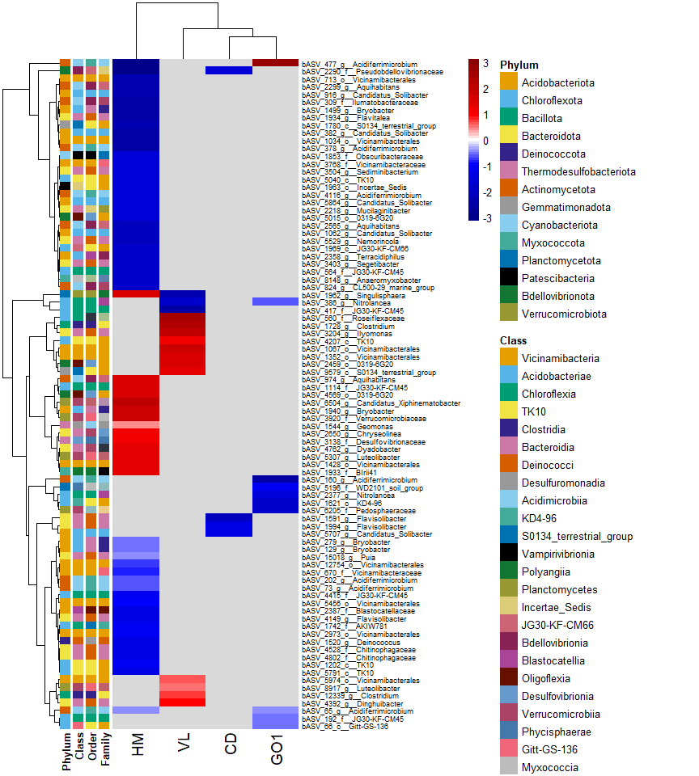<!-- -->

#### Heatmap order by taxonomy

``` r
# Create ordering index
ord <- order(tax_Other2$Phylum, tax_Other2$Class, tax_Other2$Order, tax_Other2$Family, tax_Other2$Genus)

# Reorder matrix
AllAcc_lfc_Other <- AllAcc_lfc_Other[ord, ]

# Reorder annotation accordingly
tax_Other2 <- tax_Other2[ord, , drop = FALSE]

# Make sure legend is in same direction
tax_Other2$Phylum <- factor(tax_Other2$Phylum, levels = unique(tax_Other2$Phylum))
tax_Other2$Class <- factor(tax_Other2$Class, levels = unique(tax_Other2$Class))
tax_Other2$Order <- factor(tax_Other2$Order, levels = unique(tax_Other2$Order))
tax_Other2$Family <- factor(tax_Other2$Family, levels = unique(tax_Other2$Family))
tax_Other2$Genus <- factor(tax_Other2$Genus, levels = unique(tax_Other2$Genus))

# Reorder color class vector
colors2_Other$Phylum <- colors2_Other$Phylum[levels(tax_Other2$Phylum)]
colors2_Other$Class  <- colors2_Other$Class[levels(tax_Other2$Class)]
colors2_Other$Order  <- colors2_Other$Order[levels(tax_Other2$Order)]
colors2_Other$Family <- colors2_Other$Family[levels(tax_Other2$Family)]

# Heatmap
pheatmap(AllAcc_lfc_Other,
          cluster_rows = FALSE,
          cluster_cols = FALSE,
          color = colorRampPalette(c("darkblue", "blue", "white", "red", "darkred"))(50),
          breaks = seq(-max_abs, max_abs, length.out = 51),
          #main = "Differentially abundant tax_Other2a (log2FC by Family)",
          cellwidth = 25,
          cellheight = 9.5,
          fontsize_row = 9,
          fontsize_col = 14,
          na_col = "grey90",
          angle_col = 90,
          annotation_row = tax_Other2[3:6],
          annotation_colors = colors2_Other)
```

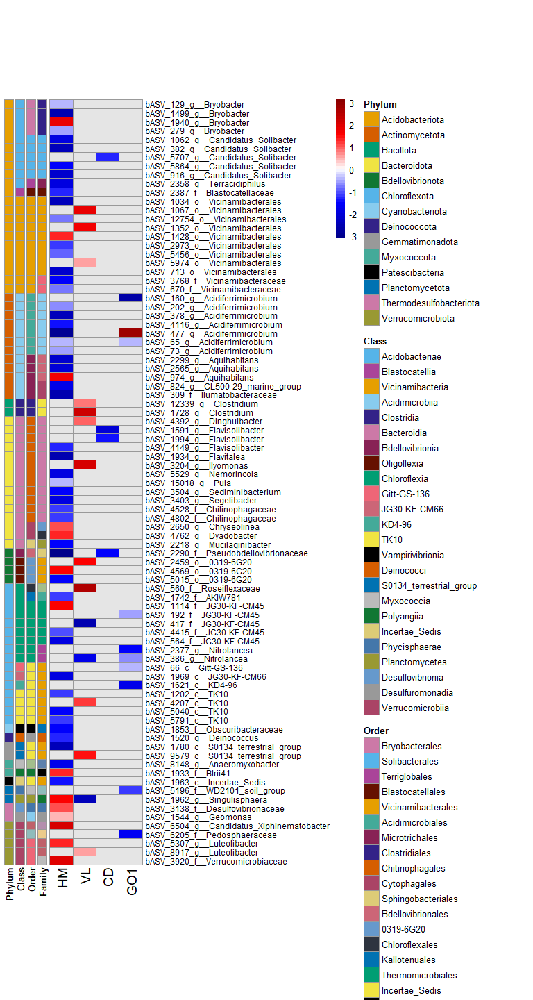<!-- -->

``` r
p <- pheatmap(AllAcc_lfc_Other,
          cluster_rows = FALSE,
          cluster_cols = FALSE,
          color = colorRampPalette(c("darkblue", "blue", "white", "red", "darkred"))(50),
          breaks = seq(-max_abs, max_abs, length.out = 51),
          #main = "Differentially abundant tax_Other2a (log2FC by Family)",
          cellwidth = 25,
          cellheight = 9.5,
          fontsize_row = 9,
          fontsize_col = 14,
          na_col = "grey90",
          angle_col = 90,
          annotation_row = tax_Other2[c(3,5)],
          annotation_colors = colors2_Other)
p 
```

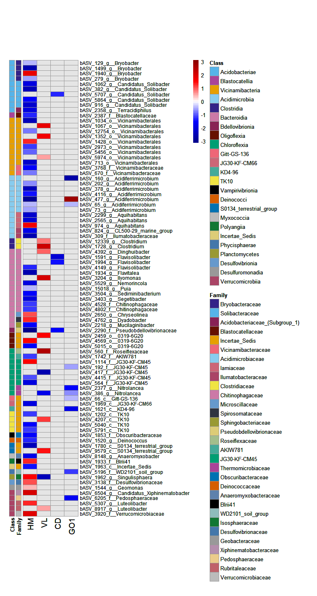<!-- -->

``` r
files <- c("FP_DAHeatmap_ASV_OtherClasses.svg", "FP_DAHeatmap_ASV_OtherClasses.png")

mapply(function(x){
  file_path <- file.path("C:/Users/kreek001/OneDrive - Wageningen University & Research/Chapters/Experimental Chapter 3/Result/Final graphs", x)

  if (grepl("svg$", x)) {
    svg(file_path, width = 20/2.54, height = 31/2.54)
  } else {
    png(file_path, width = 20, height = 31, units = "cm", res = 300)
  }
  grid::grid.draw(p$gtable)
  dev.off()
}, files)
```

```
## FP_DAHeatmap_ASV_OtherClasses.svg.png FP_DAHeatmap_ASV_OtherClasses.png.png 
##                                     2                                     2
```

``` r
rm(p)
```
