This script is adapted from a script form Melissa Uribe Acosta. Extra input comes from a script of Pedro Beschore da Costa.   
   
   
Tutorials   
- [Heatmap for final plot](http://rstudio-pubs-static.s3.amazonaws.com/288398_185f2889a5f641c6b9aa7b14fa15b635.html)
   
   
# 5.0 load libraries, improve memory use and subset objects for the desired treatment comparisons
### Load libraries

``` r
R.version$version.string # prints R version
```

```
## [1] "R version 4.5.1 (2025-06-13 ucrt)"
```

``` r
library(phyloseq)
packageVersion("phyloseq")
```

```
## [1] '1.52.0'
```

``` r
library(metamisc) #for phyloseq_sep_variable (and more?)
packageVersion("metamisc")
```

```
## [1] '0.4.0'
```

``` r
library(DESeq2)
packageVersion("DESeq2")
```

```
## [1] '1.48.2'
```

``` r
library(zinbwave)
packageVersion("zinbwave")
```

```
## [1] '1.30.0'
```

``` r
library(UpSetR)
packageVersion("UpSetR")
```

```
## [1] '1.4.0'
```

``` r
library(tuple)
packageVersion("tuple")
```

```
## [1] '0.4.2'
```

``` r
library(ggpubr)
packageVersion("ggpubr")
```

```
## [1] '0.6.2'
```

``` r
library(stringr)
packageVersion("stringr")
```

```
## [1] '1.5.2'
```

``` r
library(pheatmap)
packageVersion("pheatmap")
```

```
## [1] '1.0.13'
```

``` r
library(ggVennDiagram)
packageVersion("ggVennDiagram")
```

```
## [1] '1.5.4'
```


# 5.1 Relative abundance comparing ASVs HM and VL
## ASVs detected by two DA tests

``` r
# load phyloseq object
load("C:/Users/kreek001/OneDrive - Wageningen University & Research/Chapters/Experimental Chapter 3/RScripts/GitHub/TwelveAccessionExperiment/MicrobiomeAnalysis/Data/Phyloseq_objects/FP_unnormalized_bac_ps_ForDA_clean.RData")

# load DA ASVs
load("C:/Users/kreek001/OneDrive - Wageningen University & Research/Chapters/Experimental Chapter 3/RScripts/GitHub/TwelveAccessionExperiment/MicrobiomeAnalysis/Data/Phyloseq_objects/FP_DA_SummaryFiles/SummaryFiles_ASVLevel/Acc_Bac_TwoTimes_DA_ASV.RData")

# Extracting overlapping ASVs HM and VL
Acc_Bac_HM_VL_DA_ASV <- c(Acc_Bac_TwoTimes_DA_ASV$VL, Acc_Bac_TwoTimes_DA_ASV$HM)
Acc_Bac_NumbOcc_DA_ASV <- table(Acc_Bac_HM_VL_DA_ASV)
Acc_Bac_HMVLoverlap_DA_ASV <- names(Acc_Bac_NumbOcc_DA_ASV[Acc_Bac_NumbOcc_DA_ASV == 2])
Acc_Bac_HMVLoverlap_DA_ASV
```

```
##  [1] "bASV_1003" "bASV_109"  "bASV_1153" "bASV_126"  "bASV_1345" "bASV_1539"
##  [7] "bASV_178"  "bASV_187"  "bASV_199"  "bASV_27"   "bASV_3526" "bASV_385" 
## [13] "bASV_386"  "bASV_430"  "bASV_474"  "bASV_515"  "bASV_541"  "bASV_5682"
## [19] "bASV_664"  "bASV_7"    "bASV_8895" "bASV_910"
```

``` r
# Remove DA ASVs that are shared with GO1
Acc_Bac_HM_VL_GO1_DA_ASV <- c(Acc_Bac_TwoTimes_DA_ASV$VL, Acc_Bac_TwoTimes_DA_ASV$HM, Acc_Bac_TwoTimes_DA_ASV$GO1)
Acc_Bac_NumbOcc_DA_ASV <- table(Acc_Bac_HM_VL_GO1_DA_ASV)
Acc_Bac_HMVLGO1overlap_DA_ASV <- names(Acc_Bac_NumbOcc_DA_ASV[Acc_Bac_NumbOcc_DA_ASV == 3])
Acc_Bac_HMVLGO1overlap_DA_ASV
```

```
## [1] "bASV_385" "bASV_386"
```

``` r
Acc_Bac_HMVLoverlap_DA_ASV <- Acc_Bac_HMVLoverlap_DA_ASV[! Acc_Bac_HMVLoverlap_DA_ASV %in% Acc_Bac_HMVLGO1overlap_DA_ASV]

# Calculate relative abundance
FP_unnormalized_bac_ps_ForDA_clean_RA <- transform_sample_counts(FP_unnormalized_bac_ps_ForDA_clean, function(x) x / sum(x))

# Subset phyloseq object
ps_RA_VLHM <- prune_taxa(Acc_Bac_HMVLoverlap_DA_ASV, FP_unnormalized_bac_ps_ForDA_clean_RA)
ps_RA_VLHM <- subset_samples(ps_RA_VLHM, Accession == "HM" | Accession == "VL")
tax_table(ps_RA_VLHM)[ , 2:6]
```

```
## Taxonomy Table:     [20 taxa by 5 taxonomic ranks]:
##           Phylum               Class                   
## bASV_7    "p__Actinomycetota"  "c__Actinobacteria"     
## bASV_27   "p__Actinomycetota"  "c__Actinobacteria"     
## bASV_109  "p__Actinomycetota"  "c__Actinobacteria"     
## bASV_126  "p__Actinomycetota"  "c__Actinobacteria"     
## bASV_178  "p__Actinomycetota"  "c__Actinobacteria"     
## bASV_187  "p__Gemmatimonadota" "c__Gemmatimonadia"     
## bASV_199  "p__Pseudomonadota"  "c__Gammaproteobacteria"
## bASV_430  "p__Actinomycetota"  "c__Thermoleophilia"    
## bASV_474  "p__Gemmatimonadota" "c__Gemmatimonadia"     
## bASV_515  "p__Actinomycetota"  "c__Actinobacteria"     
## bASV_541  "p__Gemmatimonadota" "c__Gemmatimonadia"     
## bASV_664  "p__Actinomycetota"  "c__Actinobacteria"     
## bASV_910  "p__Gemmatimonadota" "c__Gemmatimonadia"     
## bASV_1003 "p__Actinomycetota"  "c__Actinobacteria"     
## bASV_1153 "p__Actinomycetota"  "c__Actinobacteria"     
## bASV_1345 "p__Pseudomonadota"  "c__Gammaproteobacteria"
## bASV_1539 "p__Actinomycetota"  "c__Actinobacteria"     
## bASV_3526 "p__Actinomycetota"  "c__Actinobacteria"     
## bASV_5682 "p__Pseudomonadota"  "c__Alphaproteobacteria"
## bASV_8895 "p__Bacillota"       "c__Bacilli"            
##           Order                    Family                  
## bASV_7    "o__Streptosporangiales" NA                      
## bASV_27   "o__Propionibacteriales" "f__Nocardioidaceae"    
## bASV_109  "o__Streptosporangiales" "f__Thermomonosporaceae"
## bASV_126  "o__Streptosporangiales" NA                      
## bASV_178  "o__Streptosporangiales" "f__Thermomonosporaceae"
## bASV_187  "o__Gemmatimonadales"    "f__Gemmatimonadaceae"  
## bASV_199  "o__Burkholderiales"     "f__SC-I-84"            
## bASV_430  "o__Gaiellales"          "f__Incertae_Sedis"     
## bASV_474  "o__Gemmatimonadales"    "f__Gemmatimonadaceae"  
## bASV_515  "o__Pseudonocardiales"   "f__Pseudonocardiaceae" 
## bASV_541  "o__Gemmatimonadales"    "f__Gemmatimonadaceae"  
## bASV_664  "o__Streptosporangiales" NA                      
## bASV_910  "o__Gemmatimonadales"    "f__Gemmatimonadaceae"  
## bASV_1003 "o__Kitasatosporales"    "f__Streptomycetaceae"  
## bASV_1153 "o__Kitasatosporales"    "f__Streptomycetaceae"  
## bASV_1345 "o__Burkholderiales"     "f__Oxalobacteraceae"   
## bASV_1539 "o__Frankiales"          "f__Acidothermaceae"    
## bASV_3526 "o__Streptosporangiales" "f__Thermomonosporaceae"
## bASV_5682 "o__Hyphomicrobiales"    "f__Labraceae"          
## bASV_8895 "o__Paenibacillales"     "f__Paenibacillaceae"   
##           Genus               
## bASV_7    NA                  
## bASV_27   "g__Nocardioides"   
## bASV_109  "g__Actinomadura"   
## bASV_126  NA                  
## bASV_178  "g__Actinoallomurus"
## bASV_187  "g__Gemmatimonas"   
## bASV_199  "g__Incertae_Sedis" 
## bASV_430  "g__Incertae_Sedis" 
## bASV_474  "g__Gemmatimonas"   
## bASV_515  "g__Pseudonocardia" 
## bASV_541  "g__Gemmatimonas"   
## bASV_664  NA                  
## bASV_910  "g__Gemmatirosa"    
## bASV_1003 "g__Streptomyces"   
## bASV_1153 "g__Peterkaempfera" 
## bASV_1345 "g__Incertae_Sedis" 
## bASV_1539 "g__Acidothermus"   
## bASV_3526 "g__Actinoallomurus"
## bASV_5682 "g__Labrys"         
## bASV_8895 "g__Paenibacillus"
```

``` r
## Phyloseq object to data frame with relative abundance, meta data and taxonomy
ps_RA_VLHM <- psmelt(ps_RA_VLHM)

# Identify rows where Genus is NA
na_genus <- is.na(ps_RA_VLHM$Genus)

# Replace those NAs with "Unclassified_" + Class name
ps_RA_VLHM$Genus[na_genus] <- paste0("Uncl_", ps_RA_VLHM$Class[na_genus])
ps_RA_VLHM$ASV_Genus <- paste(ps_RA_VLHM$OTU, ps_RA_VLHM$Genus, sep = "_")

#ps_RA_VLHM$Genus <- str_replace_all(ps_RA_VLHM$Genus, "g__", "") # remove g__
#ps_RA_VLHM$Genus <- str_replace_all(ps_RA_VLHM$Genus, "_c__", "\n") # remove c__
#ps_RA_VLHM[ps_RA_VLHM$OTU == "bASV_831", "OTU_Genus"] <- "bASV_831 Burkholderia- *"

## Change order of ASVs depending on difference between soil treatments
otu_means <- aggregate(Abundance ~ OTU + Soil_conditioning,
                       data = ps_RA_VLHM,
                       FUN = mean)
otu_means <- reshape(otu_means, # Change configuration df
                     timevar = "Soil_conditioning",
                     idvar = "OTU",
                     direction = "wide")
otu_means$difference <- otu_means$Abundance.Mb - otu_means$Abundance.Co
ps_RA_VLHM <- merge(ps_RA_VLHM,
                    otu_means[, c("OTU", "difference")],
                    by = "OTU",
                    all.x = TRUE)
ps_RA_VLHM$Genus <- with(ps_RA_VLHM, reorder(Genus, difference))
ps_RA_VLHM$OTU <- with(ps_RA_VLHM, reorder(OTU, -difference))
```


``` r
ggplot(ps_RA_VLHM, 
       aes(x = Accession, y = Abundance, fill = Soil_conditioning)) +
  facet_wrap(~ ASV_Genus, scales = "free_y"#,
             #labeller = as_labeller(otu_labels)
             ) +
  stat_boxplot(aes(y = Abundance, x = Accession), #Shows the error bars (should be added before box plots to have bars behind box plots)
               geom = "errorbar",
               position = position_dodge(0.75),
               linetype = 1,
               width = 0.2) +
  geom_boxplot(outliers = FALSE) +
  geom_jitter(position = position_jitterdodge(jitter.width = 0.3,    # horizontal jitter (x-direction)
                                              jitter.height = 0, # vertical jitter (y-direction, since flipped)
                                              dodge.width = 0.75),   # match boxplot dodge width
              color = "black",
              alpha = 0.2) + # Transparency is regulated with the alpha argument
  stat_summary(aes(group = Soil_conditioning),
               fun = mean, 
               geom = "point", 
               position = position_dodge(0.75),
               size = 1.5, 
               color = "gray30", 
               fill = "white",
               shape = 23) + #Shows the mean as a white circle
  scale_y_continuous(expand = expansion(mult = c(0, 0.05))) +   # extra space (%) below and above min and max data point
  expand_limits(y = 0) + # start y axis at 0
  scale_fill_manual(values = c("#56B4E9", "#009E73"),
                    name = "Soil treatment",
                    labels = c("CTRL", ~italic("M. brassicae"))) +
  labs(y = "Relative Abundance",
       x = "Accession") + 
  theme(panel.background = element_rect(fill = "white"), #theme of the graph
        panel.border = element_blank(), #no border around the graph (for border, use: element_rect(color = "gray30", fill = NA))
        axis.line = element_line(), #show line for x and y axis
        plot.title = element_text(size = 9, hjust = 0),
        axis.text = element_text(size = 13, color = "black"),
        axis.title = element_text(size = 16),
        axis.title.x = element_text(vjust = -0.5),
        axis.title.y = element_text(vjust = 2.5), #, hjust = -0
        strip.text = element_text(size = 13),
        legend.text = element_text(size = 13),
        legend.title = element_text(size = 15),
        legend.position = "right")
```

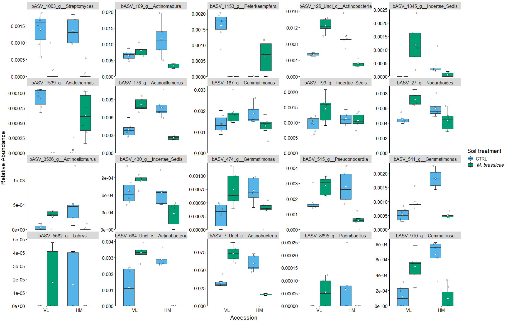<!-- -->


``` r
ggplot(ps_RA_VLHM, 
       aes(y = ASV_Genus, x = Abundance, fill = Soil_conditioning)) +
  stat_boxplot(aes(x = Abundance, y = ASV_Genus), #Shows the error bars (should be added before box plots to have bars behind box plots)
               geom = "errorbar",
               position = position_dodge(0.75),
               linetype = 1,
               width = 0.2) +
  geom_boxplot(outliers = FALSE) +
  geom_jitter(position = position_jitterdodge(jitter.width = 0,    # horizontal jitter (x-direction)
                                              #jitter.height = 0.2, # vertical jitter (y-direction, since flipped)
                                              dodge.width = 0.75),   # match boxplot dodge width
              color = "black",
              alpha = 0.2) + # Transparency is regulated with the alpha argument
  stat_summary(aes(group = Soil_conditioning),
               fun = mean, 
               geom = "point",
               position = position_dodge(0.75),
               size = 1.5, 
               color = "gray30", 
               fill = "white",
               shape = 23) + #Shows the mean as a white dimond
  scale_x_continuous(expand = expansion(mult = c(0, 0.05))) +   # extra space (%) below and above min and max data point
  expand_limits(y = 0) + # start y axis at 0
  scale_fill_manual(values = c("#56B4E9", "#009E73"),
                    name = "Soil treatment") + # Manually change the colors of the bars. You need to define fill in second line of the plot script to 
  labs(y = "Differetnial Abundant ASVs",
       x = "Relative Abundance") + 
  theme(panel.background = element_rect(fill = "white"), #theme of the graph
        panel.border = element_blank(), #no border around the graph (for border, use: element_rect(color = "gray30", fill = NA))
        axis.line = element_line(), #show line for x and y axis
        plot.title = element_text(size = 9, hjust = 0),
        axis.text = element_text(size = 13, color = "black"),
        axis.title = element_text(size = 16),
        axis.title.x = element_text(vjust = -0.5),
        axis.title.y = element_text(vjust = 2.5), #, hjust = -0
        strip.text = element_text(size = 13),
        legend.position = "right")
```

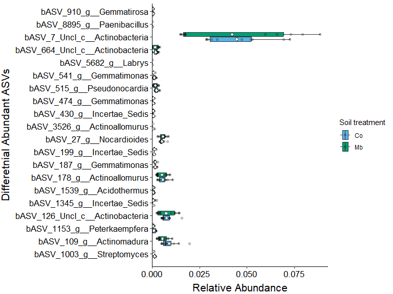<!-- -->

``` r
# Clean environment
rm(list = ls())
```


## ASVs detected by three DA tests

``` r
# load phyloseq object
load("C:/Users/kreek001/OneDrive - Wageningen University & Research/Chapters/Experimental Chapter 3/RScripts/GitHub/TwelveAccessionExperiment/MicrobiomeAnalysis/Data/Phyloseq_objects/FP_unnormalized_bac_ps_ForDA_clean.RData")

# load DA ASVs
load("C:/Users/kreek001/OneDrive - Wageningen University & Research/Chapters/Experimental Chapter 3/RScripts/GitHub/TwelveAccessionExperiment/MicrobiomeAnalysis/Data/Phyloseq_objects/FP_DA_SummaryFiles/SummaryFiles_ASVLevel/Acc_Bac_ThreeTimes_DA_ASV.RData")

# Extracting overlapping ASVs HM and VL
Acc_Bac_HM_VL_DA_ASV <- c(Acc_Bac_ThreeTimes_DA_ASV$VL, Acc_Bac_ThreeTimes_DA_ASV$HM)
Acc_Bac_NumbOcc_DA_ASV <- table(Acc_Bac_HM_VL_DA_ASV)
Acc_Bac_HMVLoverlap_DA_ASV <- names(Acc_Bac_NumbOcc_DA_ASV[Acc_Bac_NumbOcc_DA_ASV == 2])
Acc_Bac_HMVLoverlap_DA_ASV
```

```
## [1] "bASV_126" "bASV_178" "bASV_385" "bASV_7"
```

``` r
# Remove DA ASVs that are shared with GO1
Acc_Bac_HM_VL_GO1_DA_ASV <- c(Acc_Bac_ThreeTimes_DA_ASV$VL, Acc_Bac_ThreeTimes_DA_ASV$HM, Acc_Bac_ThreeTimes_DA_ASV$GO1)
Acc_Bac_NumbOcc_DA_ASV <- table(Acc_Bac_HM_VL_GO1_DA_ASV)
Acc_Bac_HMVLGO1overlap_DA_ASV <- names(Acc_Bac_NumbOcc_DA_ASV[Acc_Bac_NumbOcc_DA_ASV == 3])
Acc_Bac_HMVLGO1overlap_DA_ASV
```

```
## [1] "bASV_385"
```

``` r
Acc_Bac_HMVLoverlap_DA_ASV <- Acc_Bac_HMVLoverlap_DA_ASV[! Acc_Bac_HMVLoverlap_DA_ASV %in% Acc_Bac_HMVLGO1overlap_DA_ASV]

## Calculate relative abundance
FP_unnormalized_bac_ps_ForDA_clean_RA <- transform_sample_counts(FP_unnormalized_bac_ps_ForDA_clean, function(x) x / sum(x))

# Subset phyloseq object
ps_RA_VLHM <- prune_taxa(Acc_Bac_HMVLoverlap_DA_ASV, FP_unnormalized_bac_ps_ForDA_clean_RA)
ps_RA_VLHM <- subset_samples(ps_RA_VLHM, Accession == "HM" | Accession == "VL")
tax_table(ps_RA_VLHM)[ , 2:6]
```

```
## Taxonomy Table:     [3 taxa by 5 taxonomic ranks]:
##          Phylum              Class               Order                   
## bASV_7   "p__Actinomycetota" "c__Actinobacteria" "o__Streptosporangiales"
## bASV_126 "p__Actinomycetota" "c__Actinobacteria" "o__Streptosporangiales"
## bASV_178 "p__Actinomycetota" "c__Actinobacteria" "o__Streptosporangiales"
##          Family                   Genus               
## bASV_7   NA                       NA                  
## bASV_126 NA                       NA                  
## bASV_178 "f__Thermomonosporaceae" "g__Actinoallomurus"
```

``` r
## Phyloseq object to data frame with relative abundance, meta data and taxonomy
ps_RA_VLHM <- psmelt(ps_RA_VLHM)

# Identify rows where Genus is NA
na_genus <- is.na(ps_RA_VLHM$Genus)

# Replace those NAs with "Unclassified_" + Class name
ps_RA_VLHM$Genus[na_genus] <- paste0("Uncl_", ps_RA_VLHM$Class[na_genus])
ps_RA_VLHM$ASV_Genus <- paste(ps_RA_VLHM$OTU, ps_RA_VLHM$Genus, sep = "_")

#ps_RA_VLHM$Genus <- str_replace_all(ps_RA_VLHM$Genus, "g__", "") # remove g__
#ps_RA_VLHM$Genus <- str_replace_all(ps_RA_VLHM$Genus, "_c__", "\n") # remove c__
#ps_RA_VLHM[ps_RA_VLHM$OTU == "bASV_831", "OTU_Genus"] <- "bASV_831 Burkholderia- *"

## Change order of ASVs depending on difference between soil treatments
otu_means <- aggregate(Abundance ~ OTU + Soil_conditioning,
                       data = ps_RA_VLHM,
                       FUN = mean)
otu_means <- reshape(otu_means, # Change configuration df
                     timevar = "Soil_conditioning",
                     idvar = "OTU",
                     direction = "wide")
otu_means$difference <- otu_means$Abundance.Mb - otu_means$Abundance.Co
ps_RA_VLHM <- merge(ps_RA_VLHM,
                    otu_means[, c("OTU", "difference")],
                    by = "OTU",
                    all.x = TRUE)
ps_RA_VLHM$Genus <- with(ps_RA_VLHM, reorder(Genus, difference))
ps_RA_VLHM$OTU <- with(ps_RA_VLHM, reorder(OTU, -difference))
```


``` r
ggplot(ps_RA_VLHM, 
       aes(x = Accession, y = Abundance, fill = Soil_conditioning)) +
  facet_wrap(~ ASV_Genus, scales = "free_y"#,
             #labeller = as_labeller(otu_labels)
             ) +
  stat_boxplot(aes(y = Abundance, x = Accession), #Shows the error bars (should be added before box plots to have bars behind box plots)
               geom = "errorbar",
               position = position_dodge(0.75),
               linetype = 1,
               width = 0.2) +
  geom_boxplot(outliers = FALSE) +
  geom_jitter(position = position_jitterdodge(jitter.width = 0.3,    # horizontal jitter (x-direction)
                                              jitter.height = 0, # vertical jitter (y-direction, since flipped)
                                              dodge.width = 0.75),   # match boxplot dodge width
              color = "black",
              alpha = 0.2) + # Transparency is regulated with the alpha argument
  stat_summary(aes(group = Soil_conditioning),
               fun = mean, 
               geom = "point", 
               position = position_dodge(0.75),
               size = 1.5, 
               color = "gray30", 
               fill = "white",
               shape = 23) + #Shows the mean as a white circle
  scale_y_continuous(expand = expansion(mult = c(0, 0.05))) +   # extra space (%) below and above min and max data point
  expand_limits(y = 0) + # start y axis at 0
  scale_fill_manual(values = c("#56B4E9", "#009E73"),
                    name = "Soil treatment",
                    labels = c("CTRL", ~italic("M. brassicae"))) +
  labs(y = "Relative Abundance",
       x = "Accession") + 
  theme(panel.background = element_rect(fill = "white"), #theme of the graph
        panel.border = element_blank(), #no border around the graph (for border, use: element_rect(color = "gray30", fill = NA))
        axis.line = element_line(), #show line for x and y axis
        plot.title = element_text(size = 9, hjust = 0),
        axis.text = element_text(size = 13, color = "black"),
        axis.title = element_text(size = 16),
        axis.title.x = element_text(vjust = -0.5),
        axis.title.y = element_text(vjust = 2.5), #, hjust = -0
        strip.text = element_text(size = 10),
        legend.text = element_text(size = 13),
        legend.title = element_text(size = 15),
        legend.position = "right")
```

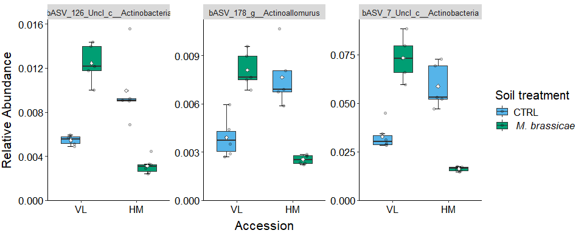<!-- -->


``` r
ggplot(ps_RA_VLHM, 
       aes(y = ASV_Genus, x = Abundance, fill = Soil_conditioning)) +
  stat_boxplot(aes(x = Abundance, y = ASV_Genus), #Shows the error bars (should be added before box plots to have bars behind box plots)
               geom = "errorbar",
               position = position_dodge(0.75),
               linetype = 1,
               width = 0.2) +
  geom_boxplot(outliers = FALSE) +
  geom_jitter(position = position_jitterdodge(jitter.width = 0,    # horizontal jitter (x-direction)
                                              #jitter.height = 0.2, # vertical jitter (y-direction, since flipped)
                                              dodge.width = 0.75),   # match boxplot dodge width
              color = "black",
              alpha = 0.2) + # Transparency is regulated with the alpha argument
  stat_summary(aes(group = Soil_conditioning),
               fun = mean, 
               geom = "point",
               position = position_dodge(0.75),
               size = 1.5, 
               color = "gray30", 
               fill = "white",
               shape = 23) + #Shows the mean as a white dimond
  scale_x_continuous(expand = expansion(mult = c(0, 0.05))) +   # extra space (%) below and above min and max data point
  expand_limits(y = 0) + # start y axis at 0
  scale_fill_manual(values = c("#56B4E9", "#009E73"),
                    name = "Soil treatment") + # Manually change the colors of the bars. You need to define fill in second line of the plot script to 
  labs(y = "Differetnial Abundant ASVs",
       x = "Relative Abundance") + 
  theme(panel.background = element_rect(fill = "white"), #theme of the graph
        panel.border = element_blank(), #no border around the graph (for border, use: element_rect(color = "gray30", fill = NA))
        axis.line = element_line(), #show line for x and y axis
        plot.title = element_text(size = 9, hjust = 0),
        axis.text = element_text(size = 13, color = "black"),
        axis.title = element_text(size = 16),
        axis.title.x = element_text(vjust = -0.5),
        axis.title.y = element_text(vjust = 2.5), #, hjust = -0
        strip.text = element_text(size = 13),
        legend.position = "right")
```

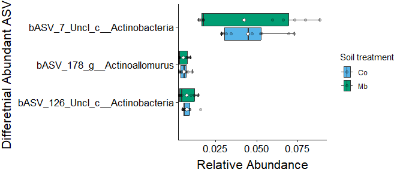<!-- -->

``` r
# Clean environment
rm(list = ls())
```


# 5.2 Relative abundance of DA ASVs all data
## ASVs detected by two DA tests

``` r
# load phyloseq object
load("C:/Users/kreek001/OneDrive - Wageningen University & Research/Chapters/Experimental Chapter 3/RScripts/GitHub/TwelveAccessionExperiment/MicrobiomeAnalysis/Data/Phyloseq_objects/FP_unnormalized_bac_ps_ForDA_clean.RData")

# load DA ASVs
load("C:/Users/kreek001/OneDrive - Wageningen University & Research/Chapters/Experimental Chapter 3/RScripts/GitHub/TwelveAccessionExperiment/MicrobiomeAnalysis/Data/Phyloseq_objects/FP_DA_SummaryFiles/SummaryFiles_ASVLevel/All_Bac_TwoTimes_DA_ASV.RData")

## Calculate relative abundance
FP_unnormalized_bac_ps_ForDA_clean_RA <- transform_sample_counts(FP_unnormalized_bac_ps_ForDA_clean, function(x) x / sum(x))

# Subset phyloseq object
ps_RA <- prune_taxa(All_Bac_TwoTimes_DA_ASV, FP_unnormalized_bac_ps_ForDA_clean_RA)
tax_table(ps_RA)[ , 2:6]
```

```
## Taxonomy Table:     [14 taxa by 5 taxonomic ranks]:
##           Phylum              Class                    Order                   
## bASV_5    "p__Actinomycetota" "c__Actinobacteria"      "o__Micrococcales"      
## bASV_41   "p__Actinomycetota" "c__Actinobacteria"      "o__Micrococcales"      
## bASV_63   "p__Pseudomonadota" "c__Gammaproteobacteria" "o__Burkholderiales"    
## bASV_141  "p__Actinomycetota" "c__Actinobacteria"      "o__Micrococcales"      
## bASV_162  "p__Actinomycetota" "c__Actinobacteria"      "o__Micrococcales"      
## bASV_288  "p__Actinomycetota" "c__Actinobacteria"      "o__Micrococcales"      
## bASV_496  "p__Actinomycetota" "c__Actinobacteria"      "o__Micrococcales"      
## bASV_517  "p__Chloroflexota"  "c__Chloroflexia"        "o__Thermomicrobiales"  
## bASV_533  "p__Chloroflexota"  "c__Ktedonobacteria"     "o__Ktedonobacterales"  
## bASV_617  "p__Pseudomonadota" "c__Alphaproteobacteria" "o__Hyphomicrobiales"   
## bASV_1515 "p__Actinomycetota" "c__Actinobacteria"      "o__Propionibacteriales"
## bASV_1904 "p__Chloroflexota"  "c__Ktedonobacteria"     "o__Ktedonobacterales"  
## bASV_6551 "p__Pseudomonadota" "c__Gammaproteobacteria" "o__Burkholderiales"    
## bASV_7137 "p__Pseudomonadota" "c__Gammaproteobacteria" "o__Burkholderiales"    
##           Family                 
## bASV_5    "f__Intrasporangiaceae"
## bASV_41   "f__Intrasporangiaceae"
## bASV_63   "f__Oxalobacteraceae"  
## bASV_141  "f__Micrococcaceae"    
## bASV_162  "f__Micrococcaceae"    
## bASV_288  "f__Micrococcaceae"    
## bASV_496  "f__Micrococcaceae"    
## bASV_517  "f__JG30-KF-CM45"      
## bASV_533  "f__JG30-KF-AS9"       
## bASV_617  "f__Rhizobiaceae"      
## bASV_1515 "f__Nocardioidaceae"   
## bASV_1904 "f__JG30-KF-AS9"       
## bASV_6551 "f__SC-I-84"           
## bASV_7137 "f__Burkholderiaceae"  
##           Genus                                          
## bASV_5    "g__Terrabacter"                               
## bASV_41   "g__Pedococcus-Phycicoccus"                    
## bASV_63   "g__Massilia"                                  
## bASV_141  "g__Pseudarthrobacter"                         
## bASV_162  "g__Pseudarthrobacter"                         
## bASV_288  "g__Pseudarthrobacter"                         
## bASV_496  "g__Pseudarthrobacter"                         
## bASV_517  "g__Incertae_Sedis"                            
## bASV_533  "g__Incertae_Sedis"                            
## bASV_617  NA                                             
## bASV_1515 "g__Nocardioides"                              
## bASV_1904 "g__Incertae_Sedis"                            
## bASV_6551 "g__Incertae_Sedis"                            
## bASV_7137 "g__Burkholderia-Caballeronia-Paraburkholderia"
```

``` r
## Phyloseq object to data frame with relative abundance, meta data and taxonomy
ps_RA <- psmelt(ps_RA)

# Identify rows where Genus is NA
na_genus <- is.na(ps_RA$Genus)

# Replace those NAs with "Unclassified_" + Class name
ps_RA$Genus[na_genus] <- paste0("Uncl_", ps_RA$Class[na_genus])
ps_RA$ASV_Genus <- paste(ps_RA$OTU, ps_RA$Genus, sep = "_")

#ps_RA_VLHM$Genus <- str_replace_all(ps_RA_VLHM$Genus, "g__", "") # remove g__
#ps_RA_VLHM$Genus <- str_replace_all(ps_RA_VLHM$Genus, "_c__", "\n") # remove c__
#ps_RA_VLHM[ps_RA_VLHM$OTU == "bASV_831", "OTU_Genus"] <- "bASV_831 Burkholderia- *"

## Change order of ASVs depending on difference between soil treatments
otu_means <- aggregate(Abundance ~ OTU + Soil_conditioning,
                       data = ps_RA,
                       FUN = mean)
otu_means <- reshape(otu_means, # Change configuration df
                     timevar = "Soil_conditioning",
                     idvar = "OTU",
                     direction = "wide")
otu_means$difference <- otu_means$Abundance.Mb - otu_means$Abundance.Co
ps_RA <- merge(ps_RA,
                otu_means[, c("OTU", "difference")],
                by = "OTU",
                all.x = TRUE)
ps_RA$Genus <- with(ps_RA, reorder(Genus, difference))
ps_RA$OTU <- with(ps_RA, reorder(OTU, -difference))
```


``` r
ggplot(ps_RA, 
       aes(x = Accession, y = Abundance, fill = Soil_conditioning)) +
  facet_wrap(~ ASV_Genus, scales = "free_y"#,
             #labeller = as_labeller(otu_labels)
             ) +
  stat_boxplot(aes(y = Abundance, x = Accession), #Shows the error bars (should be added before box plots to have bars behind box plots)
               geom = "errorbar",
               position = position_dodge(0.75),
               linetype = 1,
               width = 0.2) +
  geom_boxplot(outliers = FALSE) +
  geom_jitter(position = position_jitterdodge(jitter.width = 0.3,    # horizontal jitter (x-direction)
                                              jitter.height = 0, # vertical jitter (y-direction, since flipped)
                                              dodge.width = 0.75),   # match boxplot dodge width
              color = "black",
              alpha = 0.2) + # Transparency is regulated with the alpha argument
  stat_summary(aes(group = Soil_conditioning),
               fun = mean, 
               geom = "point", 
               position = position_dodge(0.75),
               size = 1.5, 
               color = "gray30", 
               fill = "white",
               shape = 23) + #Shows the mean as a white circle
  scale_y_continuous(expand = expansion(mult = c(0, 0.05))) +   # extra space (%) below and above min and max data point
  expand_limits(y = 0) + # start y axis at 0
  scale_fill_manual(values = c("#56B4E9", "#009E73"),
                    name = "Soil treatment",
                    labels = c("CTRL", ~italic("M. brassicae"))) +
  labs(y = "Relative Abundance",
       x = "Accession") + 
  theme(panel.background = element_rect(fill = "white"), #theme of the graph
        panel.border = element_blank(), #no border around the graph (for border, use: element_rect(color = "gray30", fill = NA))
        axis.line = element_line(), #show line for x and y axis
        plot.title = element_text(size = 9, hjust = 0),
        axis.text = element_text(size = 13, color = "black"),
        axis.title = element_text(size = 16),
        axis.title.x = element_text(vjust = -0.5),
        axis.title.y = element_text(vjust = 2.5), #, hjust = -0
        strip.text = element_text(size = 13),
        legend.text = element_text(size = 13),
        legend.title = element_text(size = 15),
        legend.position = c(0.9, 0.1))
```

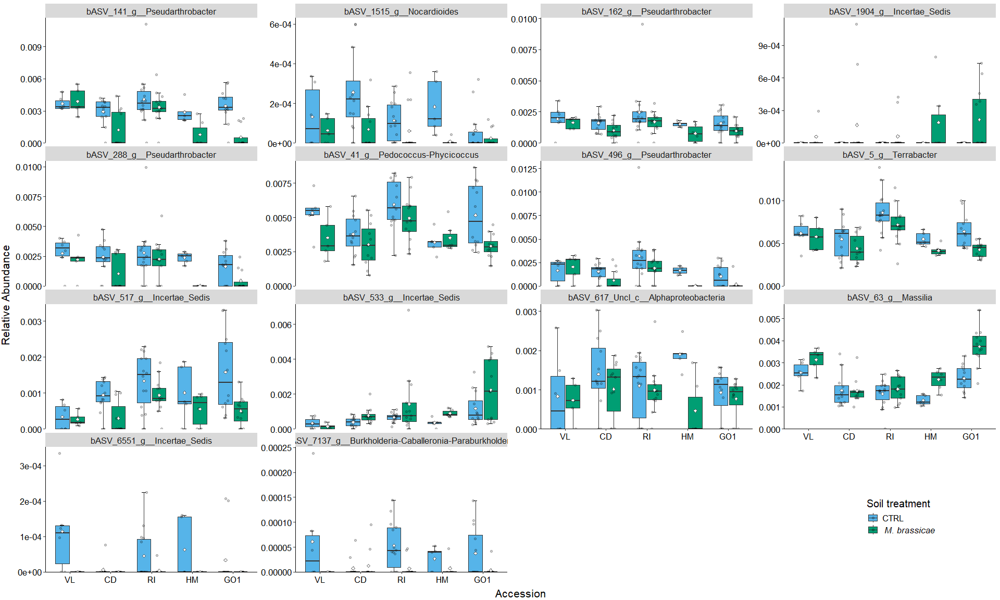<!-- -->


``` r
ggplot(ps_RA, 
       aes(x = Soil_conditioning, y = Abundance, fill = Soil_conditioning)) +
  facet_wrap(~ ASV_Genus, scales = "free_y"#,
             #labeller = as_labeller(otu_labels)
             ) +
  stat_boxplot(aes(y = Abundance, x = Soil_conditioning), #Shows the error bars (should be added before box plots to have bars behind box plots)
               geom = "errorbar",
               position = position_dodge(0.75),
               linetype = 1,
               width = 0.2) +
  geom_boxplot(outliers = FALSE) +
  geom_jitter(position = position_jitterdodge(jitter.width = 0.3,    # horizontal jitter (x-direction)
                                              jitter.height = 0, # vertical jitter (y-direction, since flipped)
                                              dodge.width = 0.75),   # match boxplot dodge width
              color = "black",
              alpha = 0.2) + # Transparency is regulated with the alpha argument
  stat_summary(aes(group = Soil_conditioning),
               fun = mean, 
               geom = "point", 
               position = position_dodge(0.75),
               size = 1.5, 
               color = "gray30", 
               fill = "white",
               shape = 23) + #Shows the mean as a white circle
  scale_y_continuous(expand = expansion(mult = c(0, 0.05))) +   # extra space (%) below and above min and max data point
  expand_limits(y = 0) + # start y axis at 0
  scale_fill_manual(values = c("#56B4E9", "#009E73"),
                    name = "Soil treatment",
                    labels = c("CTRL", ~italic("M. brassicae"))) +
  labs(y = "Relative Abundance",
       x = "Soil Conditioning") + 
  theme(panel.background = element_rect(fill = "white"), #theme of the graph
        panel.border = element_blank(), #no border around the graph (for border, use: element_rect(color = "gray30", fill = NA))
        axis.line = element_line(), #show line for x and y axis
        plot.title = element_text(size = 9, hjust = 0),
        axis.text = element_text(size = 13, color = "black"),
        axis.title = element_text(size = 16),
        axis.title.x = element_text(vjust = -0.5),
        axis.title.y = element_text(vjust = 2.5), #, hjust = -0
        strip.text = element_text(size = 13),
        legend.text = element_text(size = 13),
        legend.title = element_text(size = 15),
        legend.position = "none")
```

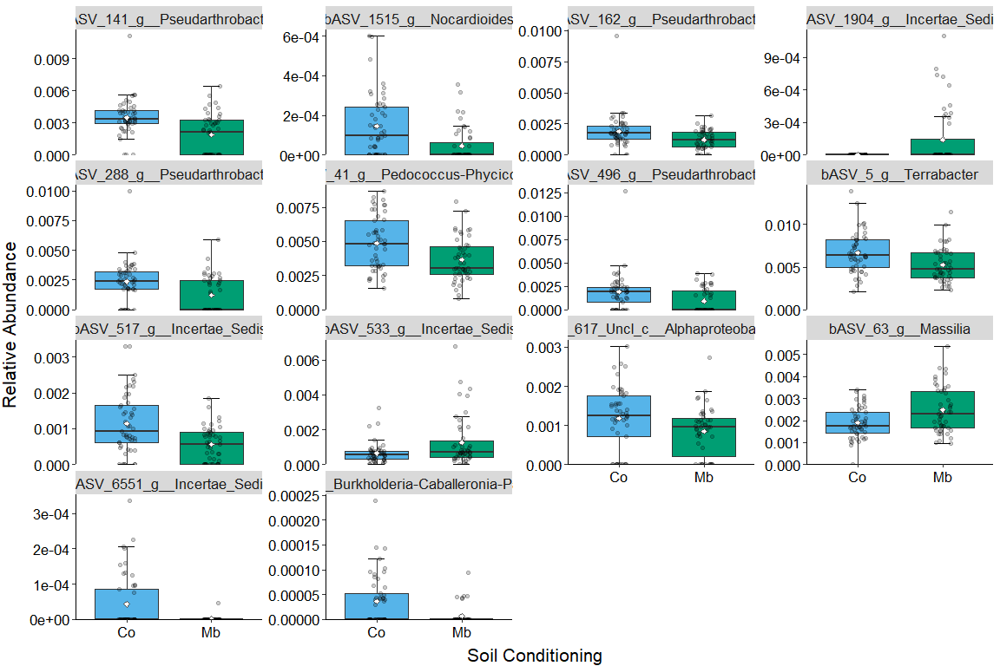<!-- -->


``` r
ggplot(ps_RA, 
       aes(y = ASV_Genus, x = Abundance, fill = Soil_conditioning)) +
  stat_boxplot(aes(x = Abundance, y = ASV_Genus), #Shows the error bars (should be added before box plots to have bars behind box plots)
               geom = "errorbar",
               position = position_dodge(0.75),
               linetype = 1,
               width = 0.2) +
  geom_boxplot(outliers = FALSE) +
  geom_jitter(position = position_jitterdodge(jitter.width = 0,    # horizontal jitter (x-direction)
                                              #jitter.height = 0.2, # vertical jitter (y-direction, since flipped)
                                              dodge.width = 0.75),   # match boxplot dodge width
              color = "black",
              alpha = 0.2) + # Transparency is regulated with the alpha argument
  stat_summary(aes(group = Soil_conditioning),
               fun = mean, 
               geom = "point",
               position = position_dodge(0.75),
               size = 1.5, 
               color = "gray30", 
               fill = "white",
               shape = 23) + #Shows the mean as a white dimond
  scale_x_continuous(expand = expansion(mult = c(0, 0.05))) +   # extra space (%) below and above min and max data point
  expand_limits(y = 0) + # start y axis at 0
  scale_fill_manual(values = c("#56B4E9", "#009E73"),
                    name = "Soil treatment") + # Manually change the colors of the bars. You need to define fill in second line of the plot script to 
  labs(y = "Differetnial Abundant ASVs",
       x = "Relative Abundance") + 
  theme(panel.background = element_rect(fill = "white"), #theme of the graph
        panel.border = element_blank(), #no border around the graph (for border, use: element_rect(color = "gray30", fill = NA))
        axis.line = element_line(), #show line for x and y axis
        plot.title = element_text(size = 9, hjust = 0),
        axis.text = element_text(size = 13, color = "black"),
        axis.title = element_text(size = 16),
        axis.title.x = element_text(vjust = -0.5),
        axis.title.y = element_text(vjust = 2.5), #, hjust = -0
        strip.text = element_text(size = 13),
        legend.position = "right")
```

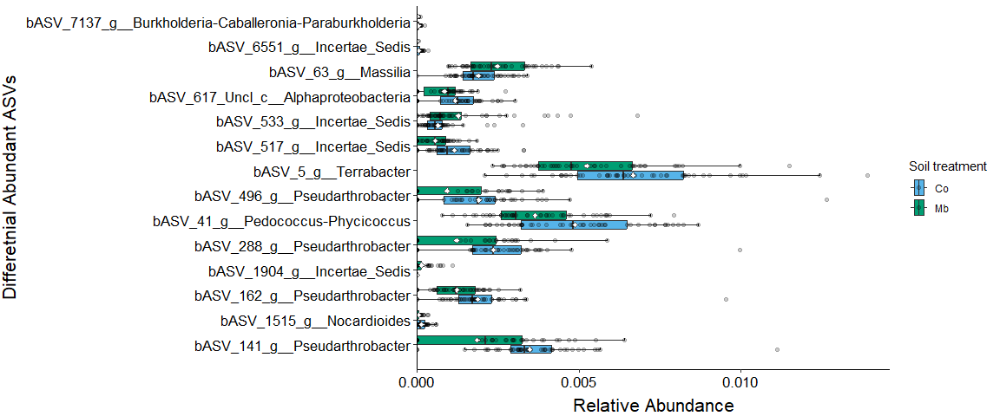<!-- -->

``` r
# Clean environment
rm(list = ls())
```


## ASVs detected by three DA tests

``` r
# load phyloseq object
load("C:/Users/kreek001/OneDrive - Wageningen University & Research/Chapters/Experimental Chapter 3/RScripts/GitHub/TwelveAccessionExperiment/MicrobiomeAnalysis/Data/Phyloseq_objects/FP_unnormalized_bac_ps_ForDA_clean.RData")

# load DA ASVs
load("C:/Users/kreek001/OneDrive - Wageningen University & Research/Chapters/Experimental Chapter 3/RScripts/GitHub/TwelveAccessionExperiment/MicrobiomeAnalysis/Data/Phyloseq_objects/FP_DA_SummaryFiles/SummaryFiles_ASVLevel/All_Bac_ThreeTimes_DA_ASV.RData")

## Calculate relative abundance
FP_unnormalized_bac_ps_ForDA_clean_RA <- transform_sample_counts(FP_unnormalized_bac_ps_ForDA_clean, function(x) x / sum(x))

# Subset phyloseq object
ps_RA <- prune_taxa(All_Bac_ThreeTimes_DA_ASV, FP_unnormalized_bac_ps_ForDA_clean_RA)
tax_table(ps_RA)[ , 2:6]
```

```
## Taxonomy Table:     [4 taxa by 5 taxonomic ranks]:
##          Phylum              Class                    Order                 
## bASV_5   "p__Actinomycetota" "c__Actinobacteria"      "o__Micrococcales"    
## bASV_63  "p__Pseudomonadota" "c__Gammaproteobacteria" "o__Burkholderiales"  
## bASV_517 "p__Chloroflexota"  "c__Chloroflexia"        "o__Thermomicrobiales"
## bASV_533 "p__Chloroflexota"  "c__Ktedonobacteria"     "o__Ktedonobacterales"
##          Family                  Genus              
## bASV_5   "f__Intrasporangiaceae" "g__Terrabacter"   
## bASV_63  "f__Oxalobacteraceae"   "g__Massilia"      
## bASV_517 "f__JG30-KF-CM45"       "g__Incertae_Sedis"
## bASV_533 "f__JG30-KF-AS9"        "g__Incertae_Sedis"
```

``` r
## Phyloseq object to data frame with relative abundance, meta data and taxonomy
ps_RA <- psmelt(ps_RA)

# Identify rows where Genus is NA
na_genus <- is.na(ps_RA$Genus)

# Replace those NAs with "Unclassified_" + Class name
ps_RA$Genus[na_genus] <- paste0("Uncl_", ps_RA$Class[na_genus])
ps_RA$ASV_Genus <- paste(ps_RA$OTU, ps_RA$Genus, sep = "_")

#ps_RA_VLHM$Genus <- str_replace_all(ps_RA_VLHM$Genus, "g__", "") # remove g__
#ps_RA_VLHM$Genus <- str_replace_all(ps_RA_VLHM$Genus, "_c__", "\n") # remove c__
#ps_RA_VLHM[ps_RA_VLHM$OTU == "bASV_831", "OTU_Genus"] <- "bASV_831 Burkholderia- *"

## Change order of ASVs depending on difference between soil treatments
otu_means <- aggregate(Abundance ~ OTU + Soil_conditioning,
                       data = ps_RA,
                       FUN = mean)
otu_means <- reshape(otu_means, # Change configuration df
                     timevar = "Soil_conditioning",
                     idvar = "OTU",
                     direction = "wide")
otu_means$difference <- otu_means$Abundance.Mb - otu_means$Abundance.Co
ps_RA <- merge(ps_RA,
                otu_means[, c("OTU", "difference")],
                by = "OTU",
                all.x = TRUE)
ps_RA$Genus <- with(ps_RA, reorder(Genus, difference))
ps_RA$OTU <- with(ps_RA, reorder(OTU, -difference))
```


``` r
ggplot(ps_RA, 
       aes(x = Accession, y = Abundance, fill = Soil_conditioning)) +
  facet_wrap(~ ASV_Genus, scales = "free_y"#,
             #labeller = as_labeller(otu_labels)
             ) +
  stat_boxplot(aes(y = Abundance, x = Accession), #Shows the error bars (should be added before box plots to have bars behind box plots)
               geom = "errorbar",
               position = position_dodge(0.75),
               linetype = 1,
               width = 0.2) +
  geom_boxplot(outliers = FALSE) +
  geom_jitter(position = position_jitterdodge(jitter.width = 0.3,    # horizontal jitter (x-direction)
                                              jitter.height = 0, # vertical jitter (y-direction, since flipped)
                                              dodge.width = 0.75),   # match boxplot dodge width
              color = "black",
              alpha = 0.2) + # Transparency is regulated with the alpha argument
  stat_summary(aes(group = Soil_conditioning),
               fun = mean, 
               geom = "point", 
               position = position_dodge(0.75),
               size = 1.5, 
               color = "gray30", 
               fill = "white",
               shape = 23) + #Shows the mean as a white circle
  scale_y_continuous(expand = expansion(mult = c(0, 0.05))) +   # extra space (%) below and above min and max data point
  expand_limits(y = 0) + # start y axis at 0
  scale_fill_manual(values = c("#56B4E9", "#009E73"),
                    name = "Soil treatment",
                    labels = c("CTRL", ~italic("M. brassicae"))) +
  labs(y = "Relative Abundance",
       x = "Accession") + 
  theme(panel.background = element_rect(fill = "white"), #theme of the graph
        panel.border = element_blank(), #no border around the graph (for border, use: element_rect(color = "gray30", fill = NA))
        axis.line = element_line(), #show line for x and y axis
        plot.title = element_text(size = 9, hjust = 0),
        axis.text = element_text(size = 13, color = "black"),
        axis.title = element_text(size = 16),
        axis.title.x = element_text(vjust = -0.5),
        axis.title.y = element_text(vjust = 2.5), #, hjust = -0
        strip.text = element_text(size = 13),
        legend.text = element_text(size = 13),
        legend.title = element_text(size = 15),
        legend.position = "right")
```

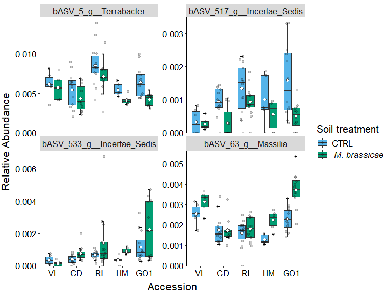<!-- -->


``` r
ggplot(ps_RA, 
       aes(x = Soil_conditioning, y = Abundance, fill = Soil_conditioning)) +
  facet_wrap(~ ASV_Genus, scales = "free_y"#,
             #labeller = as_labeller(otu_labels)
             ) +
  stat_boxplot(aes(y = Abundance, x = Soil_conditioning), #Shows the error bars (should be added before box plots to have bars behind box plots)
               geom = "errorbar",
               position = position_dodge(0.75),
               linetype = 1,
               width = 0.2) +
  geom_boxplot(outliers = FALSE) +
  geom_jitter(position = position_jitterdodge(jitter.width = 0.3,    # horizontal jitter (x-direction)
                                              jitter.height = 0, # vertical jitter (y-direction, since flipped)
                                              dodge.width = 0.75),   # match boxplot dodge width
              color = "black",
              alpha = 0.2) + # Transparency is regulated with the alpha argument
  stat_summary(aes(group = Soil_conditioning),
               fun = mean, 
               geom = "point", 
               position = position_dodge(0.75),
               size = 1.5, 
               color = "gray30", 
               fill = "white",
               shape = 23) + #Shows the mean as a white circle
  scale_y_continuous(expand = expansion(mult = c(0, 0.05))) +   # extra space (%) below and above min and max data point
  expand_limits(y = 0) + # start y axis at 0
  scale_fill_manual(values = c("#56B4E9", "#009E73"),
                    name = "Soil treatment",
                    labels = c("CTRL", ~italic("M. brassicae"))) +
  labs(y = "Relative Abundance",
       x = "Soil Conditioning") + 
  theme(panel.background = element_rect(fill = "white"), #theme of the graph
        panel.border = element_blank(), #no border around the graph (for border, use: element_rect(color = "gray30", fill = NA))
        axis.line = element_line(), #show line for x and y axis
        plot.title = element_text(size = 9, hjust = 0),
        axis.text = element_text(size = 13, color = "black"),
        axis.title = element_text(size = 16),
        axis.title.x = element_text(vjust = -0.5),
        axis.title.y = element_text(vjust = 2.5), #, hjust = -0
        strip.text = element_text(size = 10),
        legend.text = element_text(size = 13),
        legend.title = element_text(size = 15),
        legend.position = "none")
```

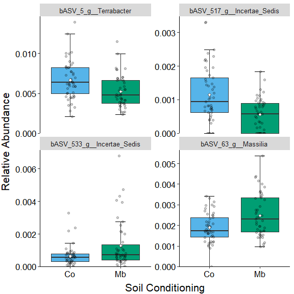<!-- -->


``` r
ggplot(ps_RA, 
       aes(y = ASV_Genus, x = Abundance, fill = Soil_conditioning)) +
  stat_boxplot(aes(x = Abundance, y = ASV_Genus), #Shows the error bars (should be added before box plots to have bars behind box plots)
               geom = "errorbar",
               position = position_dodge(0.75),
               linetype = 1,
               width = 0.2) +
  geom_boxplot(outliers = FALSE) +
  geom_jitter(position = position_jitterdodge(jitter.width = 0,    # horizontal jitter (x-direction)
                                              #jitter.height = 0.2, # vertical jitter (y-direction, since flipped)
                                              dodge.width = 0.75),   # match boxplot dodge width
              color = "black",
              alpha = 0.2) + # Transparency is regulated with the alpha argument
  stat_summary(aes(group = Soil_conditioning),
               fun = mean, 
               geom = "point",
               position = position_dodge(0.75),
               size = 1.5, 
               color = "gray30", 
               fill = "white",
               shape = 23) + #Shows the mean as a white dimond
  scale_x_continuous(expand = expansion(mult = c(0, 0.05))) +   # extra space (%) below and above min and max data point
  expand_limits(y = 0) + # start y axis at 0
  scale_fill_manual(values = c("#56B4E9", "#009E73"),
                    name = "Soil treatment") + # Manually change the colors of the bars. You need to define fill in second line of the plot script to 
  labs(y = "Differetnial Abundant ASVs",
       x = "Relative Abundance") + 
  theme(panel.background = element_rect(fill = "white"), #theme of the graph
        panel.border = element_blank(), #no border around the graph (for border, use: element_rect(color = "gray30", fill = NA))
        axis.line = element_line(), #show line for x and y axis
        plot.title = element_text(size = 9, hjust = 0),
        axis.text = element_text(size = 13, color = "black"),
        axis.title = element_text(size = 16),
        axis.title.x = element_text(vjust = -0.5),
        axis.title.y = element_text(vjust = 2.5), #, hjust = -0
        strip.text = element_text(size = 13),
        legend.position = "right")
```

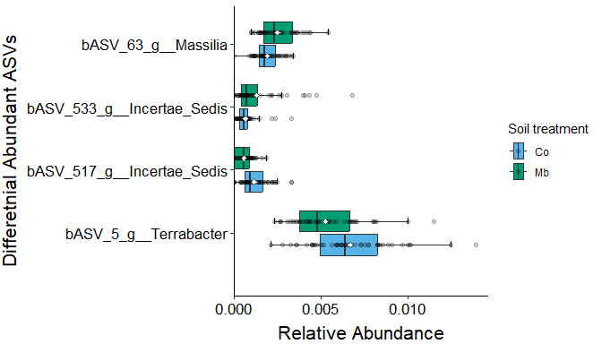<!-- -->


``` r
# Clean environment
rm(list = ls())
```


# 5.3 Relative abundance of DA ASVs HM
## ASVs detected by two DA tests

``` r
# load phyloseq object
load("C:/Users/kreek001/OneDrive - Wageningen University & Research/Chapters/Experimental Chapter 3/RScripts/GitHub/TwelveAccessionExperiment/MicrobiomeAnalysis/Data/Phyloseq_objects/FP_unnormalized_bac_ps_ForDA_clean.RData")

# load DA ASVs
load("C:/Users/kreek001/OneDrive - Wageningen University & Research/Chapters/Experimental Chapter 3/RScripts/GitHub/TwelveAccessionExperiment/MicrobiomeAnalysis/Data/Phyloseq_objects/FP_DA_SummaryFiles/SummaryFiles_ASVLevel/Acc_Bac_TwoTimes_DA_ASV.RData")

## Calculate relative abundance
FP_unnormalized_bac_ps_ForDA_clean_RA <- transform_sample_counts(FP_unnormalized_bac_ps_ForDA_clean, function(x) x / sum(x))

# Subset phyloseq object
ps_RA <- prune_taxa(Acc_Bac_TwoTimes_DA_ASV$HM, FP_unnormalized_bac_ps_ForDA_clean_RA)
ps_RA <- subset_samples(ps_RA, Accession == "HM")
tax_table(ps_RA)[ , 2:6]
```

```
## Taxonomy Table:     [309 taxa by 5 taxonomic ranks]:
##            Phylum                       Class                       
## bASV_1     "p__Actinomycetota"          "c__Actinobacteria"         
## bASV_3     "p__Actinomycetota"          "c__Actinobacteria"         
## bASV_5     "p__Actinomycetota"          "c__Actinobacteria"         
## bASV_7     "p__Actinomycetota"          "c__Actinobacteria"         
## bASV_27    "p__Actinomycetota"          "c__Actinobacteria"         
## bASV_42    "p__Pseudomonadota"          "c__Alphaproteobacteria"    
## bASV_45    "p__Actinomycetota"          "c__Actinobacteria"         
## bASV_62    "p__Gemmatimonadota"         "c__Gemmatimonadia"         
## bASV_65    "p__Actinomycetota"          "c__Acidimicrobiia"         
## bASV_69    "p__Actinomycetota"          "c__Actinobacteria"         
## bASV_73    "p__Actinomycetota"          "c__Acidimicrobiia"         
## bASV_107   "p__Actinomycetota"          "c__Actinobacteria"         
## bASV_109   "p__Actinomycetota"          "c__Actinobacteria"         
## bASV_126   "p__Actinomycetota"          "c__Actinobacteria"         
## bASV_129   "p__Acidobacteriota"         "c__Acidobacteriae"         
## bASV_141   "p__Actinomycetota"          "c__Actinobacteria"         
## bASV_149   "p__Pseudomonadota"          "c__Alphaproteobacteria"    
## bASV_176   "p__Pseudomonadota"          "c__Alphaproteobacteria"    
## bASV_178   "p__Actinomycetota"          "c__Actinobacteria"         
## bASV_179   "p__Gemmatimonadota"         "c__Gemmatimonadia"         
## bASV_182   "p__Pseudomonadota"          "c__Alphaproteobacteria"    
## bASV_183   "p__Pseudomonadota"          "c__Alphaproteobacteria"    
## bASV_187   "p__Gemmatimonadota"         "c__Gemmatimonadia"         
## bASV_190   "p__Gemmatimonadota"         "c__Gemmatimonadia"         
## bASV_199   "p__Pseudomonadota"          "c__Gammaproteobacteria"    
## bASV_227   "p__Pseudomonadota"          "c__Alphaproteobacteria"    
## bASV_228   "p__Pseudomonadota"          "c__Alphaproteobacteria"    
## bASV_234   "p__Pseudomonadota"          "c__Alphaproteobacteria"    
## bASV_243   "p__Actinomycetota"          "c__Actinobacteria"         
## bASV_254   "p__Actinomycetota"          "c__Actinobacteria"         
## bASV_261   "p__Actinomycetota"          "c__Actinobacteria"         
## bASV_268   "p__Pseudomonadota"          "c__Alphaproteobacteria"    
## bASV_279   "p__Acidobacteriota"         "c__Acidobacteriae"         
## bASV_288   "p__Actinomycetota"          "c__Actinobacteria"         
## bASV_292   "p__Gemmatimonadota"         "c__Gemmatimonadia"         
## bASV_309   "p__Actinomycetota"          "c__Acidimicrobiia"         
## bASV_326   "p__Pseudomonadota"          "c__Gammaproteobacteria"    
## bASV_330   "p__Pseudomonadota"          "c__Gammaproteobacteria"    
## bASV_335   "p__Pseudomonadota"          "c__Alphaproteobacteria"    
## bASV_339   "p__Gemmatimonadota"         "c__Gemmatimonadia"         
## bASV_345   "p__Gemmatimonadota"         "c__Gemmatimonadia"         
## bASV_356   "p__Pseudomonadota"          "c__Gammaproteobacteria"    
## bASV_363   "p__Pseudomonadota"          "c__Gammaproteobacteria"    
## bASV_376   "p__Actinomycetota"          "c__Actinobacteria"         
## bASV_378   "p__Actinomycetota"          "c__Acidimicrobiia"         
## bASV_382   "p__Acidobacteriota"         "c__Acidobacteriae"         
## bASV_385   "p__Actinomycetota"          "c__Actinobacteria"         
## bASV_386   "p__Chloroflexota"           "c__Chloroflexia"           
## bASV_394   "p__Gemmatimonadota"         "c__Gemmatimonadia"         
## bASV_395   "p__Actinomycetota"          "c__Actinobacteria"         
## bASV_397   "p__Gemmatimonadota"         "c__Gemmatimonadia"         
## bASV_410   "p__Actinomycetota"          "c__Actinobacteria"         
## bASV_411   "p__Pseudomonadota"          "c__Alphaproteobacteria"    
## bASV_412   "p__Pseudomonadota"          "c__Alphaproteobacteria"    
## bASV_416   "p__Gemmatimonadota"         "c__Gemmatimonadia"         
## bASV_423   "p__Gemmatimonadota"         "c__Gemmatimonadia"         
## bASV_430   "p__Actinomycetota"          "c__Thermoleophilia"        
## bASV_464   "p__Pseudomonadota"          "c__Alphaproteobacteria"    
## bASV_474   "p__Gemmatimonadota"         "c__Gemmatimonadia"         
## bASV_477   "p__Actinomycetota"          "c__Acidimicrobiia"         
## bASV_483   "p__Pseudomonadota"          "c__Alphaproteobacteria"    
## bASV_491   "p__Pseudomonadota"          "c__Gammaproteobacteria"    
## bASV_496   "p__Actinomycetota"          "c__Actinobacteria"         
## bASV_499   "p__Pseudomonadota"          "c__Alphaproteobacteria"    
## bASV_510   "p__Actinomycetota"          "c__Thermoleophilia"        
## bASV_511   "p__Pseudomonadota"          "c__Alphaproteobacteria"    
## bASV_515   "p__Actinomycetota"          "c__Actinobacteria"         
## bASV_541   "p__Gemmatimonadota"         "c__Gemmatimonadia"         
## bASV_542   "p__Pseudomonadota"          "c__Alphaproteobacteria"    
## bASV_557   "p__Pseudomonadota"          "c__Gammaproteobacteria"    
## bASV_561   "p__Pseudomonadota"          "c__Alphaproteobacteria"    
## bASV_564   "p__Chloroflexota"           "c__Chloroflexia"           
## bASV_566   "p__Pseudomonadota"          "c__Alphaproteobacteria"    
## bASV_610   "p__Bacillota"               "c__Bacilli"                
## bASV_664   "p__Actinomycetota"          "c__Actinobacteria"         
## bASV_670   "p__Acidobacteriota"         "c__Vicinamibacteria"       
## bASV_673   "p__Pseudomonadota"          "c__Alphaproteobacteria"    
## bASV_682   "p__Myxococcota"             "c__Myxococcia"             
## bASV_690   "p__Acidobacteriota"         "c__Acidobacteriae"         
## bASV_697   "p__Pseudomonadota"          "c__Alphaproteobacteria"    
## bASV_713   "p__Acidobacteriota"         "c__Vicinamibacteria"       
## bASV_753   "p__Gemmatimonadota"         "c__Gemmatimonadia"         
## bASV_812   "p__Pseudomonadota"          "c__Alphaproteobacteria"    
## bASV_824   "p__Actinomycetota"          "c__Acidimicrobiia"         
## bASV_831   "p__Pseudomonadota"          "c__Gammaproteobacteria"    
## bASV_840   "p__Pseudomonadota"          "c__Alphaproteobacteria"    
## bASV_855   "p__Pseudomonadota"          "c__Gammaproteobacteria"    
## bASV_910   "p__Gemmatimonadota"         "c__Gemmatimonadia"         
## bASV_916   "p__Acidobacteriota"         "c__Acidobacteriae"         
## bASV_928   "p__Actinomycetota"          "c__Actinobacteria"         
## bASV_930   "p__Pseudomonadota"          "c__Gammaproteobacteria"    
## bASV_961   "p__Actinomycetota"          "c__Thermoleophilia"        
## bASV_974   "p__Actinomycetota"          "c__Acidimicrobiia"         
## bASV_991   "p__Actinomycetota"          "c__Thermoleophilia"        
## bASV_995   "p__Pseudomonadota"          "c__Gammaproteobacteria"    
## bASV_1002  "p__Pseudomonadota"          "c__Gammaproteobacteria"    
## bASV_1003  "p__Actinomycetota"          "c__Actinobacteria"         
## bASV_1015  "p__Bacteroidota"            "c__Bacteroidia"            
## bASV_1034  "p__Acidobacteriota"         "c__Vicinamibacteria"       
## bASV_1062  "p__Acidobacteriota"         "c__Acidobacteriae"         
## bASV_1071  "p__Pseudomonadota"          "c__Gammaproteobacteria"    
## bASV_1092  "p__Pseudomonadota"          "c__Alphaproteobacteria"    
## bASV_1107  "p__Gemmatimonadota"         "c__Gemmatimonadia"         
## bASV_1108  "p__Pseudomonadota"          "c__Gammaproteobacteria"    
## bASV_1114  "p__Chloroflexota"           "c__Chloroflexia"           
## bASV_1139  "p__Gemmatimonadota"         "c__Gemmatimonadia"         
## bASV_1152  "p__Pseudomonadota"          "c__Gammaproteobacteria"    
## bASV_1153  "p__Actinomycetota"          "c__Actinobacteria"         
## bASV_1163  "p__Gemmatimonadota"         "c__Gemmatimonadia"         
## bASV_1164  "p__Bacillota"               "c__Bacilli"                
## bASV_1177  "p__Pseudomonadota"          "c__Alphaproteobacteria"    
## bASV_1231  "p__Pseudomonadota"          "c__Gammaproteobacteria"    
## bASV_1247  "p__Pseudomonadota"          "c__Gammaproteobacteria"    
## bASV_1259  "p__Actinomycetota"          "c__Actinobacteria"         
## bASV_1293  "p__Pseudomonadota"          "c__Alphaproteobacteria"    
## bASV_1295  "p__Gemmatimonadota"         "c__Gemmatimonadia"         
## bASV_1325  "p__Pseudomonadota"          "c__Alphaproteobacteria"    
## bASV_1345  "p__Pseudomonadota"          "c__Gammaproteobacteria"    
## bASV_1354  "p__Pseudomonadota"          "c__Alphaproteobacteria"    
## bASV_1366  "p__Gemmatimonadota"         "c__Gemmatimonadia"         
## bASV_1405  "p__Pseudomonadota"          "c__Alphaproteobacteria"    
## bASV_1418  "p__Chloroflexota"           "c__Ktedonobacteria"        
## bASV_1446  "p__Pseudomonadota"          "c__Alphaproteobacteria"    
## bASV_1463  "p__Pseudomonadota"          "c__Gammaproteobacteria"    
## bASV_1499  "p__Acidobacteriota"         "c__Acidobacteriae"         
## bASV_1515  "p__Actinomycetota"          "c__Actinobacteria"         
## bASV_1520  "p__Deinococcota"            "c__Deinococci"             
## bASV_1522  "p__Gemmatimonadota"         "c__Gemmatimonadia"         
## bASV_1539  "p__Actinomycetota"          "c__Actinobacteria"         
## bASV_1575  "p__Pseudomonadota"          "c__Gammaproteobacteria"    
## bASV_1584  "p__Pseudomonadota"          "c__Alphaproteobacteria"    
## bASV_1593  "p__Pseudomonadota"          "c__Alphaproteobacteria"    
## bASV_1602  "p__Gemmatimonadota"         "c__Gemmatimonadia"         
## bASV_1603  "p__Pseudomonadota"          "c__Alphaproteobacteria"    
## bASV_1618  "p__Pseudomonadota"          "c__Alphaproteobacteria"    
## bASV_1665  "p__Pseudomonadota"          "c__Alphaproteobacteria"    
## bASV_1712  "p__Pseudomonadota"          "c__Gammaproteobacteria"    
## bASV_1730  "p__Pseudomonadota"          "c__Alphaproteobacteria"    
## bASV_1742  "p__Chloroflexota"           "c__Chloroflexia"           
## bASV_1780  "p__Gemmatimonadota"         "c__S0134_terrestrial_group"
## bASV_1818  "p__Chloroflexota"           "c__Chloroflexia"           
## bASV_1853  "p__Cyanobacteriota"         "c__Vampirivibrionia"       
## bASV_1881  "p__Acidobacteriota"         "c__Blastocatellia"         
## bASV_1899  "p__Pseudomonadota"          "c__Gammaproteobacteria"    
## bASV_1908  "p__Gemmatimonadota"         "c__Gemmatimonadia"         
## bASV_1934  "p__Bacteroidota"            "c__Bacteroidia"            
## bASV_1940  "p__Acidobacteriota"         "c__Acidobacteriae"         
## bASV_1963  "p__Patescibacteria"         "c__Incertae_Sedis"         
## bASV_1969  "p__Chloroflexota"           "c__JG30-KF-CM66"           
## bASV_1974  "p__Pseudomonadota"          "c__Alphaproteobacteria"    
## bASV_1988  "p__Actinomycetota"          "c__Actinobacteria"         
## bASV_1992  "p__Acidobacteriota"         "c__Acidobacteriae"         
## bASV_2038  "p__Actinomycetota"          "c__Actinobacteria"         
## bASV_2062  "p__Pseudomonadota"          "c__Gammaproteobacteria"    
## bASV_2132  "p__Pseudomonadota"          "c__Alphaproteobacteria"    
## bASV_2141  "p__Actinomycetota"          "c__Thermoleophilia"        
## bASV_2145  "p__Gemmatimonadota"         "c__Gemmatimonadia"         
## bASV_2163  "p__Actinomycetota"          "c__Actinobacteria"         
## bASV_2188  "p__Pseudomonadota"          "c__Gammaproteobacteria"    
## bASV_2195  "p__Pseudomonadota"          "c__Alphaproteobacteria"    
## bASV_2218  "p__Bacteroidota"            "c__Bacteroidia"            
## bASV_2229  "p__Actinomycetota"          "c__Thermoleophilia"        
## bASV_2258  "p__Pseudomonadota"          "c__Alphaproteobacteria"    
## bASV_2277  "p__Pseudomonadota"          "c__Gammaproteobacteria"    
## bASV_2290  "p__Bdellovibrionota"        "c__Bdellovibrionia"        
## bASV_2298  "p__Pseudomonadota"          "c__Alphaproteobacteria"    
## bASV_2299  "p__Actinomycetota"          "c__Acidimicrobiia"         
## bASV_2352  "p__Pseudomonadota"          "c__Gammaproteobacteria"    
## bASV_2358  "p__Acidobacteriota"         "c__Acidobacteriae"         
## bASV_2368  "p__Pseudomonadota"          "c__Gammaproteobacteria"    
## bASV_2378  "p__Pseudomonadota"          "c__Alphaproteobacteria"    
## bASV_2385  "p__Pseudomonadota"          "c__Gammaproteobacteria"    
## bASV_2387  "p__Acidobacteriota"         "c__Blastocatellia"         
## bASV_2393  "p__Pseudomonadota"          "c__Gammaproteobacteria"    
## bASV_2419  "p__Acidobacteriota"         "c__Acidobacteriae"         
## bASV_2425  "p__Pseudomonadota"          "c__Gammaproteobacteria"    
## bASV_2502  "p__Pseudomonadota"          "c__Alphaproteobacteria"    
## bASV_2507  "p__Chloroflexota"           "c__Chloroflexia"           
## bASV_2565  "p__Actinomycetota"          "c__Acidimicrobiia"         
## bASV_2577  "p__Pseudomonadota"          "c__Alphaproteobacteria"    
## bASV_2655  "p__Pseudomonadota"          "c__Gammaproteobacteria"    
## bASV_2717  "p__Pseudomonadota"          "c__Alphaproteobacteria"    
## bASV_2737  "p__Pseudomonadota"          "c__Alphaproteobacteria"    
## bASV_2767  "p__Actinomycetota"          "c__Actinobacteria"         
## bASV_2861  "p__Actinomycetota"          "c__Thermoleophilia"        
## bASV_2867  "p__Pseudomonadota"          "c__Gammaproteobacteria"    
## bASV_2949  "p__Pseudomonadota"          "c__Alphaproteobacteria"    
## bASV_2955  "p__Pseudomonadota"          "c__Alphaproteobacteria"    
## bASV_2973  "p__Acidobacteriota"         "c__Vicinamibacteria"       
## bASV_3012  "p__Pseudomonadota"          "c__Gammaproteobacteria"    
## bASV_3046  "p__Gemmatimonadota"         "c__Gemmatimonadia"         
## bASV_3052  "p__Bacteroidota"            "c__Bacteroidia"            
## bASV_3088  "p__Gemmatimonadota"         "c__Gemmatimonadia"         
## bASV_3138  "p__Thermodesulfobacteriota" "c__Desulfovibrionia"       
## bASV_3158  "p__Pseudomonadota"          "c__Gammaproteobacteria"    
## bASV_3279  "p__Bacillota"               "c__Desulfotomaculia"       
## bASV_3348  "p__Pseudomonadota"          "c__Gammaproteobacteria"    
## bASV_3393  "p__Pseudomonadota"          "c__Gammaproteobacteria"    
## bASV_3403  "p__Bacteroidota"            "c__Bacteroidia"            
## bASV_3408  "p__Pseudomonadota"          "c__Alphaproteobacteria"    
## bASV_3469  "p__Pseudomonadota"          "c__Gammaproteobacteria"    
## bASV_3504  "p__Bacteroidota"            "c__Bacteroidia"            
## bASV_3526  "p__Actinomycetota"          "c__Actinobacteria"         
## bASV_3533  "p__Actinomycetota"          "c__Actinobacteria"         
## bASV_3537  "p__Gemmatimonadota"         "c__Gemmatimonadia"         
## bASV_3546  "p__Gemmatimonadota"         "c__Gemmatimonadia"         
## bASV_3547  "p__Pseudomonadota"          "c__Gammaproteobacteria"    
## bASV_3726  "p__Pseudomonadota"          "c__Gammaproteobacteria"    
## bASV_3768  "p__Acidobacteriota"         "c__Vicinamibacteria"       
## bASV_3823  "p__Gemmatimonadota"         "c__Gemmatimonadia"         
## bASV_3862  "p__Pseudomonadota"          "c__Gammaproteobacteria"    
## bASV_3920  "p__Verrucomicrobiota"       "c__Verrucomicrobiia"       
## bASV_3962  "p__Gemmatimonadota"         "c__Gemmatimonadia"         
## bASV_4001  "p__Pseudomonadota"          "c__Gammaproteobacteria"    
## bASV_4036  "p__Chloroflexota"           "c__Ktedonobacteria"        
## bASV_4048  "p__Gemmatimonadota"         "c__Gemmatimonadia"         
## bASV_4079  "p__Pseudomonadota"          "c__Gammaproteobacteria"    
## bASV_4116  "p__Actinomycetota"          "c__Acidimicrobiia"         
## bASV_4149  "p__Bacteroidota"            "c__Bacteroidia"            
## bASV_4181  "p__Actinomycetota"          "c__Actinobacteria"         
## bASV_4314  "p__Pseudomonadota"          "c__Gammaproteobacteria"    
## bASV_4339  "p__Gemmatimonadota"         "c__Gemmatimonadia"         
## bASV_4395  "p__Actinomycetota"          "c__Actinobacteria"         
## bASV_4397  "p__Bacillota"               "c__Bacilli"                
## bASV_4415  "p__Chloroflexota"           "c__Chloroflexia"           
## bASV_4528  "p__Bacteroidota"            "c__Bacteroidia"            
## bASV_4655  "p__Bacillota"               "c__Bacilli"                
## bASV_4664  "p__Pseudomonadota"          "c__Gammaproteobacteria"    
## bASV_4733  "p__Bacillota"               "c__Desulfotomaculia"       
## bASV_4779  "p__Pseudomonadota"          "c__Alphaproteobacteria"    
## bASV_4802  "p__Bacteroidota"            "c__Bacteroidia"            
## bASV_4829  "p__Actinomycetota"          "c__Thermoleophilia"        
## bASV_4847  "p__Bacillota"               "c__Bacilli"                
## bASV_4871  "p__Pseudomonadota"          "c__Gammaproteobacteria"    
## bASV_4872  "p__Pseudomonadota"          "c__Gammaproteobacteria"    
## bASV_4912  "p__Pseudomonadota"          "c__Alphaproteobacteria"    
## bASV_5015  "p__Bdellovibrionota"        "c__Oligoflexia"            
## bASV_5040  "p__Chloroflexota"           "c__TK10"                   
## bASV_5086  "p__Bdellovibrionota"        "c__Oligoflexia"            
## bASV_5260  "p__Pseudomonadota"          "c__Alphaproteobacteria"    
## bASV_5307  "p__Verrucomicrobiota"       "c__Verrucomicrobiia"       
## bASV_5339  "p__Pseudomonadota"          "c__Gammaproteobacteria"    
## bASV_5456  "p__Acidobacteriota"         "c__Vicinamibacteria"       
## bASV_5529  "p__Bacteroidota"            "c__Bacteroidia"            
## bASV_5584  "p__Actinomycetota"          "c__Actinobacteria"         
## bASV_5638  "p__Bacillota"               "c__Bacilli"                
## bASV_5682  "p__Pseudomonadota"          "c__Alphaproteobacteria"    
## bASV_5762  "p__Pseudomonadota"          "c__Gammaproteobacteria"    
## bASV_5779  "p__Gemmatimonadota"         "c__Gemmatimonadia"         
## bASV_5791  "p__Chloroflexota"           "c__TK10"                   
## bASV_5795  "p__Pseudomonadota"          "c__Gammaproteobacteria"    
## bASV_5853  "p__Acidobacteriota"         "c__Vicinamibacteria"       
## bASV_5862  "p__Actinomycetota"          "c__Actinobacteria"         
## bASV_5864  "p__Acidobacteriota"         "c__Acidobacteriae"         
## bASV_5893  "p__Bacillota"               "c__Bacilli"                
## bASV_5907  "p__Bacillota"               "c__Bacilli"                
## bASV_5935  "p__Actinomycetota"          "c__Thermoleophilia"        
## bASV_5950  "p__Acidobacteriota"         "c__Vicinamibacteria"       
## bASV_6062  "p__Bacillota"               "c__Bacilli"                
## bASV_6343  "p__Pseudomonadota"          "c__Alphaproteobacteria"    
## bASV_6380  "p__Pseudomonadota"          "c__Gammaproteobacteria"    
## bASV_6504  "p__Verrucomicrobiota"       "c__Verrucomicrobiia"       
## bASV_6749  "p__Pseudomonadota"          "c__Gammaproteobacteria"    
## bASV_7040  "p__Pseudomonadota"          "c__Gammaproteobacteria"    
## bASV_7274  "p__Pseudomonadota"          "c__Gammaproteobacteria"    
## bASV_7439  "p__Pseudomonadota"          "c__Gammaproteobacteria"    
## bASV_7730  "p__Pseudomonadota"          "c__Gammaproteobacteria"    
## bASV_7881  "p__Pseudomonadota"          "c__Gammaproteobacteria"    
## bASV_7967  "p__Acidobacteriota"         "c__Acidobacteriae"         
## bASV_8134  "p__Pseudomonadota"          "c__Gammaproteobacteria"    
## bASV_8136  "p__Pseudomonadota"          "c__Alphaproteobacteria"    
## bASV_8148  "p__Myxococcota"             "c__Myxococcia"             
## bASV_8223  "p__Pseudomonadota"          "c__Gammaproteobacteria"    
## bASV_8250  "p__Bacillota"               "c__Bacilli"                
## bASV_8409  "p__Pseudomonadota"          "c__Gammaproteobacteria"    
## bASV_8703  "p__Gemmatimonadota"         "c__Gemmatimonadia"         
## bASV_8714  "p__Actinomycetota"          "c__Actinobacteria"         
## bASV_8819  "p__Pseudomonadota"          "c__Gammaproteobacteria"    
## bASV_8895  "p__Bacillota"               "c__Bacilli"                
## bASV_8908  "p__Pseudomonadota"          "c__Gammaproteobacteria"    
## bASV_9349  "p__Bdellovibrionota"        "c__Oligoflexia"            
## bASV_9493  "p__Actinomycetota"          "c__Actinobacteria"         
## bASV_9605  "p__Pseudomonadota"          "c__Gammaproteobacteria"    
## bASV_9699  "p__Pseudomonadota"          "c__Alphaproteobacteria"    
## bASV_9839  "p__Elusimicrobiota"         "c__Elusimicrobia"          
## bASV_9867  "p__Pseudomonadota"          "c__Gammaproteobacteria"    
## bASV_9884  "p__Pseudomonadota"          "c__Gammaproteobacteria"    
## bASV_10150 "p__Pseudomonadota"          "c__Gammaproteobacteria"    
## bASV_10830 "p__Pseudomonadota"          "c__Gammaproteobacteria"    
## bASV_11046 "p__Bacillota"               "c__Bacilli"                
## bASV_11668 "p__Pseudomonadota"          "c__Gammaproteobacteria"    
## bASV_12754 "p__Acidobacteriota"         "c__Vicinamibacteria"       
## bASV_13076 "p__Pseudomonadota"          "c__Gammaproteobacteria"    
## bASV_13121 "p__Pseudomonadota"          "c__Gammaproteobacteria"    
## bASV_13740 "p__Pseudomonadota"          "c__Gammaproteobacteria"    
## bASV_14302 "p__Pseudomonadota"          "c__Alphaproteobacteria"    
## bASV_15018 "p__Bacteroidota"            "c__Bacteroidia"            
## bASV_15043 "p__Pseudomonadota"          "c__Gammaproteobacteria"    
## bASV_15967 "p__Pseudomonadota"          "c__Alphaproteobacteria"    
## bASV_19029 "p__Pseudomonadota"          "c__Gammaproteobacteria"    
## bASV_19120 "p__Gemmatimonadota"         "c__Gemmatimonadia"         
## bASV_19177 "p__Bdellovibrionota"        "c__Bdellovibrionia"        
## bASV_20878 "p__Bdellovibrionota"        "c__Oligoflexia"            
## bASV_22926 "p__Actinomycetota"          "c__Actinobacteria"         
## bASV_22948 "p__Pseudomonadota"          "c__Gammaproteobacteria"    
## bASV_24821 "p__Pseudomonadota"          "c__Alphaproteobacteria"    
## bASV_24969 "p__Bdellovibrionota"        "c__Oligoflexia"            
## bASV_34117 "p__Pseudomonadota"          "c__Gammaproteobacteria"    
## bASV_51736 "p__Bacillota"               "c__Bacilli"                
##            Order                      Family                                
## bASV_1     "o__Micrococcales"         "f__Micrococcaceae"                   
## bASV_3     "o__Micrococcales"         "f__Micrococcaceae"                   
## bASV_5     "o__Micrococcales"         "f__Intrasporangiaceae"               
## bASV_7     "o__Streptosporangiales"   NA                                    
## bASV_27    "o__Propionibacteriales"   "f__Nocardioidaceae"                  
## bASV_42    "o__Hyphomicrobiales"      "f__Beijerinckiaceae"                 
## bASV_45    "o__Micrococcales"         "f__Intrasporangiaceae"               
## bASV_62    "o__Gemmatimonadales"      "f__Gemmatimonadaceae"                
## bASV_65    "o__Acidimicrobiales"      "f__Acidimicrobiaceae"                
## bASV_69    "o__Propionibacteriales"   "f__Nocardioidaceae"                  
## bASV_73    "o__Acidimicrobiales"      "f__Acidimicrobiaceae"                
## bASV_107   "o__Propionibacteriales"   "f__Nocardioidaceae"                  
## bASV_109   "o__Streptosporangiales"   "f__Thermomonosporaceae"              
## bASV_126   "o__Streptosporangiales"   NA                                    
## bASV_129   "o__Bryobacterales"        "f__Bryobacteraceae"                  
## bASV_141   "o__Micrococcales"         "f__Micrococcaceae"                   
## bASV_149   "o__Hyphomicrobiales"      "f__Beijerinckiaceae"                 
## bASV_176   "o__Hyphomicrobiales"      "f__Xanthobacteraceae"                
## bASV_178   "o__Streptosporangiales"   "f__Thermomonosporaceae"              
## bASV_179   "o__Gemmatimonadales"      "f__Gemmatimonadaceae"                
## bASV_182   "o__Azospirillales"        "f__Azospirillaceae"                  
## bASV_183   "o__Hyphomicrobiales"      "f__Rhizobiaceae"                     
## bASV_187   "o__Gemmatimonadales"      "f__Gemmatimonadaceae"                
## bASV_190   "o__Gemmatimonadales"      "f__Gemmatimonadaceae"                
## bASV_199   "o__Burkholderiales"       "f__SC-I-84"                          
## bASV_227   "o__Sphingomonadales"      "f__Sphingomonadaceae"                
## bASV_228   "o__Hyphomicrobiales"      "f__Beijerinckiaceae"                 
## bASV_234   "o__Hyphomicrobiales"      "f__Rhizobiaceae"                     
## bASV_243   "o__Kitasatosporales"      "f__Streptomycetaceae"                
## bASV_254   "o__Kineosporiales"        "f__Kineosporiaceae"                  
## bASV_261   "o__Micromonosporales"     "f__Micromonosporaceae"               
## bASV_268   "o__Hyphomicrobiales"      "f__Beijerinckiaceae"                 
## bASV_279   "o__Bryobacterales"        "f__Bryobacteraceae"                  
## bASV_288   "o__Micrococcales"         "f__Micrococcaceae"                   
## bASV_292   "o__Gemmatimonadales"      "f__Gemmatimonadaceae"                
## bASV_309   "o__Microtrichales"        "f__Ilumatobacteraceae"               
## bASV_326   "o__Burkholderiales"       "f__Oxalobacteraceae"                 
## bASV_330   "o__Burkholderiales"       "f__Burkholderiaceae"                 
## bASV_335   "o__Caulobacterales"       "f__Caulobacteraceae"                 
## bASV_339   "o__Gemmatimonadales"      "f__Gemmatimonadaceae"                
## bASV_345   "o__Gemmatimonadales"      "f__Gemmatimonadaceae"                
## bASV_356   "o__Burkholderiales"       "f__Nitrosomonadaceae"                
## bASV_363   "o__Lysobacterales"        "f__Rhodanobacteraceae"               
## bASV_376   "o__Micromonosporales"     "f__Micromonosporaceae"               
## bASV_378   "o__Acidimicrobiales"      "f__Acidimicrobiaceae"                
## bASV_382   "o__Solibacterales"        "f__Solibacteraceae"                  
## bASV_385   "o__Frankiales"            "f__Acidothermaceae"                  
## bASV_386   "o__Thermomicrobiales"     "f__Thermomicrobiaceae"               
## bASV_394   "o__Gemmatimonadales"      "f__Gemmatimonadaceae"                
## bASV_395   "o__Mycobacteriales"       "f__Nocardiaceae"                     
## bASV_397   "o__Gemmatimonadales"      "f__Gemmatimonadaceae"                
## bASV_410   "o__Propionibacteriales"   "f__Nocardioidaceae"                  
## bASV_411   "o__Hyphomicrobiales"      "f__Hyphomicrobiales_Incertae_Sedis"  
## bASV_412   "o__Hyphomicrobiales"      "f__Xanthobacteraceae"                
## bASV_416   "o__Gemmatimonadales"      "f__Gemmatimonadaceae"                
## bASV_423   "o__Gemmatimonadales"      "f__Gemmatimonadaceae"                
## bASV_430   "o__Gaiellales"            "f__Incertae_Sedis"                   
## bASV_464   "o__Hyphomicrobiales"      "f__Xanthobacteraceae"                
## bASV_474   "o__Gemmatimonadales"      "f__Gemmatimonadaceae"                
## bASV_477   "o__Acidimicrobiales"      "f__Acidimicrobiaceae"                
## bASV_483   "o__Hyphomicrobiales"      "f__Rhizobiaceae"                     
## bASV_491   "o__Burkholderiales"       "f__Oxalobacteraceae"                 
## bASV_496   "o__Micrococcales"         "f__Micrococcaceae"                   
## bASV_499   "o__Sphingomonadales"      "f__Sphingomonadaceae"                
## bASV_510   "o__Gaiellales"            "f__Gaiellaceae"                      
## bASV_511   "o__Caulobacterales"       "f__Caulobacteraceae"                 
## bASV_515   "o__Pseudonocardiales"     "f__Pseudonocardiaceae"               
## bASV_541   "o__Gemmatimonadales"      "f__Gemmatimonadaceae"                
## bASV_542   "o__Sphingomonadales"      "f__Sphingomonadaceae"                
## bASV_557   "o__Burkholderiales"       "f__Comamonadaceae"                   
## bASV_561   "o__Hyphomicrobiales"      "f__Xanthobacteraceae"                
## bASV_564   "o__Thermomicrobiales"     "f__JG30-KF-CM45"                     
## bASV_566   "o__Hyphomicrobiales"      "f__Beijerinckiaceae"                 
## bASV_610   "o__Paenibacillales"       "f__Paenibacillaceae"                 
## bASV_664   "o__Streptosporangiales"   NA                                    
## bASV_670   "o__Vicinamibacterales"    "f__Vicinamibacteraceae"              
## bASV_673   "o__Sphingomonadales"      "f__Sphingomonadaceae"                
## bASV_682   "o__Myxococcales"          "f__Anaeromyxobacteraceae"            
## bASV_690   "o__Solibacterales"        "f__Solibacteraceae"                  
## bASV_697   "o__Hyphomicrobiales"      "f__Xanthobacteraceae"                
## bASV_713   "o__Vicinamibacterales"    "f__Incertae_Sedis"                   
## bASV_753   "o__Gemmatimonadales"      "f__Gemmatimonadaceae"                
## bASV_812   "o__Micropepsales"         "f__Micropepsaceae"                   
## bASV_824   "o__Microtrichales"        "f__Ilumatobacteraceae"               
## bASV_831   "o__Burkholderiales"       "f__Burkholderiaceae"                 
## bASV_840   "o__Micropepsales"         "f__Micropepsaceae"                   
## bASV_855   "o__Burkholderiales"       "f__Oxalobacteraceae"                 
## bASV_910   "o__Gemmatimonadales"      "f__Gemmatimonadaceae"                
## bASV_916   "o__Solibacterales"        "f__Solibacteraceae"                  
## bASV_928   "o__Streptosporangiales"   NA                                    
## bASV_930   "o__Burkholderiales"       "f__Oxalobacteraceae"                 
## bASV_961   "o__Solirubrobacterales"   "f__Solirubrobacteraceae"             
## bASV_974   "o__Microtrichales"        "f__Iamiaceae"                        
## bASV_991   "o__Gaiellales"            "f__Incertae_Sedis"                   
## bASV_995   "o__Burkholderiales"       "f__Comamonadaceae"                   
## bASV_1002  "o__Burkholderiales"       "f__Comamonadaceae"                   
## bASV_1003  "o__Kitasatosporales"      "f__Streptomycetaceae"                
## bASV_1015  "o__Chitinophagales"       "f__Chitinophagaceae"                 
## bASV_1034  "o__Vicinamibacterales"    "f__Incertae_Sedis"                   
## bASV_1062  "o__Solibacterales"        "f__Solibacteraceae"                  
## bASV_1071  "o__Lysobacterales"        "f__Lysobacteraceae"                  
## bASV_1092  "o__Hyphomicrobiales"      "f__Hyphomicrobiales_Incertae_Sedis"  
## bASV_1107  "o__Gemmatimonadales"      "f__Gemmatimonadaceae"                
## bASV_1108  "o__Burkholderiales"       "f__Comamonadaceae"                   
## bASV_1114  "o__Thermomicrobiales"     "f__JG30-KF-CM45"                     
## bASV_1139  "o__Gemmatimonadales"      "f__Gemmatimonadaceae"                
## bASV_1152  "o__Burkholderiales"       "f__Burkholderiaceae"                 
## bASV_1153  "o__Kitasatosporales"      "f__Streptomycetaceae"                
## bASV_1163  "o__Gemmatimonadales"      "f__Gemmatimonadaceae"                
## bASV_1164  "o__Paenibacillales"       "f__Paenibacillaceae"                 
## bASV_1177  "o__Hyphomicrobiales"      "f__Beijerinckiaceae"                 
## bASV_1231  "o__Burkholderiales"       "f__Oxalobacteraceae"                 
## bASV_1247  "o__Burkholderiales"       "f__Comamonadaceae"                   
## bASV_1259  "o__Micromonosporales"     "f__Micromonosporaceae"               
## bASV_1293  "o__Hyphomicrobiales"      "f__Xanthobacteraceae"                
## bASV_1295  "o__Gemmatimonadales"      "f__Gemmatimonadaceae"                
## bASV_1325  "o__Hyphomicrobiales"      "f__Rhizobiaceae"                     
## bASV_1345  "o__Burkholderiales"       "f__Oxalobacteraceae"                 
## bASV_1354  "o__Acetobacterales"       "f__Acetobacteraceae"                 
## bASV_1366  "o__Gemmatimonadales"      "f__Gemmatimonadaceae"                
## bASV_1405  "o__Hyphomicrobiales"      "f__Beijerinckiaceae"                 
## bASV_1418  "o__Ktedonobacterales"     "f__JG30-KF-AS9"                      
## bASV_1446  "o__Hyphomicrobiales"      "f__Rhizobiaceae"                     
## bASV_1463  "o__Burkholderiales"       "f__Oxalobacteraceae"                 
## bASV_1499  "o__Bryobacterales"        "f__Bryobacteraceae"                  
## bASV_1515  "o__Propionibacteriales"   "f__Nocardioidaceae"                  
## bASV_1520  "o__Deinococcales"         "f__Deinococcaceae"                   
## bASV_1522  "o__Gemmatimonadales"      "f__Gemmatimonadaceae"                
## bASV_1539  "o__Frankiales"            "f__Acidothermaceae"                  
## bASV_1575  "o__Burkholderiales"       "f__Oxalobacteraceae"                 
## bASV_1584  "o__Hyphomicrobiales"      "f__Xanthobacteraceae"                
## bASV_1593  "o__Acetobacterales"       "f__Acetobacteraceae"                 
## bASV_1602  "o__Gemmatimonadales"      "f__Gemmatimonadaceae"                
## bASV_1603  "o__Hyphomicrobiales"      "f__Xanthobacteraceae"                
## bASV_1618  "o__Hyphomicrobiales"      "f__Beijerinckiaceae"                 
## bASV_1665  "o__Hyphomicrobiales"      "f__KF-JG30-B3"                       
## bASV_1712  "o__Burkholderiales"       "f__SC-I-84"                          
## bASV_1730  "o__Hyphomicrobiales"      "f__Xanthobacteraceae"                
## bASV_1742  "o__Kallotenuales"         "f__AKIW781"                          
## bASV_1780  "o__Incertae_Sedis"        "f__Incertae_Sedis"                   
## bASV_1818  "o__Thermomicrobiales"     "f__JG30-KF-CM45"                     
## bASV_1853  "o__Obscuribacterales"     "f__Obscuribacteraceae"               
## bASV_1881  "o__Blastocatellales"      "f__Blastocatellaceae"                
## bASV_1899  "o__Burkholderiales"       "f__SC-I-84"                          
## bASV_1908  "o__Gemmatimonadales"      "f__Gemmatimonadaceae"                
## bASV_1934  "o__Chitinophagales"       "f__Chitinophagaceae"                 
## bASV_1940  "o__Bryobacterales"        "f__Bryobacteraceae"                  
## bASV_1963  "o__Incertae_Sedis"        "f__Incertae_Sedis"                   
## bASV_1969  "o__Incertae_Sedis"        "f__Incertae_Sedis"                   
## bASV_1974  "o__Micavibrionales"       "f__Micavibrionaceae"                 
## bASV_1988  "o__Propionibacteriales"   "f__Nocardioidaceae"                  
## bASV_1992  "o__Bryobacterales"        "f__Bryobacteraceae"                  
## bASV_2038  "o__Propionibacteriales"   "f__Nocardioidaceae"                  
## bASV_2062  "o__Burkholderiales"       "f__Comamonadaceae"                   
## bASV_2132  "o__Incertae_Sedis"        "f__Incertae_Sedis"                   
## bASV_2141  "o__Gaiellales"            "f__Incertae_Sedis"                   
## bASV_2145  "o__Gemmatimonadales"      "f__Gemmatimonadaceae"                
## bASV_2163  "o__Propionibacteriales"   "f__Nocardioidaceae"                  
## bASV_2188  "o__Burkholderiales"       "f__Alcaligenaceae"                   
## bASV_2195  "o__Azospirillales"        "f__Azospirillaceae"                  
## bASV_2218  "o__Sphingobacteriales"    "f__Sphingobacteriaceae"              
## bASV_2229  "o__Gaiellales"            "f__Incertae_Sedis"                   
## bASV_2258  "o__Hyphomicrobiales"      "f__Hyphomicrobiales_Incertae_Sedis"  
## bASV_2277  "o__Burkholderiales"       "f__Comamonadaceae"                   
## bASV_2290  "o__Bdellovibrionales"     "f__Pseudobdellovibrionaceae"         
## bASV_2298  "o__Acetobacterales"       "f__Acetobacteraceae"                 
## bASV_2299  "o__Microtrichales"        "f__Iamiaceae"                        
## bASV_2352  "o__Burkholderiales"       "f__Burkholderiaceae"                 
## bASV_2358  "o__Terriglobales"         "f__Acidobacteriaceae_(Subgroup_1)"   
## bASV_2368  "o__Burkholderiales"       "f__Nitrosomonadaceae"                
## bASV_2378  "o__Hyphomicrobiales"      "f__Rhizobiaceae"                     
## bASV_2385  "o__Burkholderiales"       "f__Comamonadaceae"                   
## bASV_2387  "o__Blastocatellales"      "f__Blastocatellaceae"                
## bASV_2393  "o__Burkholderiales"       "f__Comamonadaceae"                   
## bASV_2419  "o__Bryobacterales"        "f__Bryobacteraceae"                  
## bASV_2425  "o__Burkholderiales"       "f__Oxalobacteraceae"                 
## bASV_2502  "o__Hyphomicrobiales"      "f__Rhizobiaceae"                     
## bASV_2507  "o__Thermomicrobiales"     "f__JG30-KF-CM45"                     
## bASV_2565  "o__Microtrichales"        "f__Iamiaceae"                        
## bASV_2577  "o__Hyphomicrobiales"      "f__Hyphomicrobiales_Incertae_Sedis"  
## bASV_2655  "o__Burkholderiales"       "f__Oxalobacteraceae"                 
## bASV_2717  "o__Rhodospirillales"      "f__Magnetospiraceae"                 
## bASV_2737  "o__Elsterales"            "f__URHD0088"                         
## bASV_2767  "o__Propionibacteriales"   "f__Nocardioidaceae"                  
## bASV_2861  "o__Solirubrobacterales"   "f__67-14"                            
## bASV_2867  "o__Burkholderiales"       "f__Comamonadaceae"                   
## bASV_2949  "o__Caulobacterales"       "f__Caulobacteraceae"                 
## bASV_2955  "o__Tistrellales"          "f__Geminicoccaceae"                  
## bASV_2973  "o__Vicinamibacterales"    "f__Incertae_Sedis"                   
## bASV_3012  "o__Burkholderiales"       "f__Oxalobacteraceae"                 
## bASV_3046  "o__Gemmatimonadales"      "f__Gemmatimonadaceae"                
## bASV_3052  "o__Chitinophagales"       "f__Chitinophagaceae"                 
## bASV_3088  "o__Gemmatimonadales"      "f__Gemmatimonadaceae"                
## bASV_3138  "o__Desulfovibrionales"    "f__Desulfovibrionaceae"              
## bASV_3158  "o__Burkholderiales"       "f__Oxalobacteraceae"                 
## bASV_3279  "o__Desulfotomaculales"    "f__Desulfotomaculaceae"              
## bASV_3348  "o__Burkholderiales"       "f__Rhodocyclaceae"                   
## bASV_3393  "o__Burkholderiales"       "f__Comamonadaceae"                   
## bASV_3403  "o__Chitinophagales"       "f__Chitinophagaceae"                 
## bASV_3408  "o__Sphingomonadales"      "f__Sphingomonadaceae"                
## bASV_3469  "o__Burkholderiales"       "f__Oxalobacteraceae"                 
## bASV_3504  "o__Chitinophagales"       "f__Chitinophagaceae"                 
## bASV_3526  "o__Streptosporangiales"   "f__Thermomonosporaceae"              
## bASV_3533  "o__Propionibacteriales"   "f__Nocardioidaceae"                  
## bASV_3537  "o__Gemmatimonadales"      "f__Gemmatimonadaceae"                
## bASV_3546  "o__Gemmatimonadales"      "f__Gemmatimonadaceae"                
## bASV_3547  "o__Burkholderiales"       "f__Burkholderiaceae"                 
## bASV_3726  "o__Burkholderiales"       "f__SC-I-84"                          
## bASV_3768  "o__Vicinamibacterales"    "f__Vicinamibacteraceae"              
## bASV_3823  "o__Gemmatimonadales"      "f__Gemmatimonadaceae"                
## bASV_3862  "o__Burkholderiales"       "f__Oxalobacteraceae"                 
## bASV_3920  "o__Verrucomicrobiales"    "f__Verrucomicrobiaceae"              
## bASV_3962  "o__Gemmatimonadales"      "f__Gemmatimonadaceae"                
## bASV_4001  "o__Burkholderiales"       "f__Comamonadaceae"                   
## bASV_4036  "o__Ktedonobacterales"     "f__Ktedonobacteraceae"               
## bASV_4048  "o__Gemmatimonadales"      "f__Gemmatimonadaceae"                
## bASV_4079  "o__Burkholderiales"       "f__Oxalobacteraceae"                 
## bASV_4116  "o__Acidimicrobiales"      "f__Acidimicrobiaceae"                
## bASV_4149  "o__Chitinophagales"       "f__Chitinophagaceae"                 
## bASV_4181  "o__Micrococcales"         "f__Micrococcaceae"                   
## bASV_4314  "o__Burkholderiales"       "f__Comamonadaceae"                   
## bASV_4339  "o__Gemmatimonadales"      "f__Gemmatimonadaceae"                
## bASV_4395  "o__Micrococcales"         "f__Cellulomonadaceae"                
## bASV_4397  "o__Bacillales"            "f__Bacillaceae"                      
## bASV_4415  "o__Thermomicrobiales"     "f__JG30-KF-CM45"                     
## bASV_4528  "o__Chitinophagales"       "f__Chitinophagaceae"                 
## bASV_4655  "o__Thermoactinomycetales" "f__Thermoactinomycetaceae"           
## bASV_4664  "o__Burkholderiales"       "f__Oxalobacteraceae"                 
## bASV_4733  "o__Desulfotomaculales"    "f__Desulfotomaculales_Incertae_Sedis"
## bASV_4779  "o__Micropepsales"         "f__Micropepsaceae"                   
## bASV_4802  "o__Chitinophagales"       "f__Chitinophagaceae"                 
## bASV_4829  "o__Solirubrobacterales"   "f__Solirubrobacteraceae"             
## bASV_4847  "o__Paenibacillales"       "f__Paenibacillaceae"                 
## bASV_4871  "o__Burkholderiales"       "f__Comamonadaceae"                   
## bASV_4872  "o__Burkholderiales"       "f__Oxalobacteraceae"                 
## bASV_4912  "o__Hyphomicrobiales"      "f__Beijerinckiaceae"                 
## bASV_5015  "o__0319-6G20"             "f__Incertae_Sedis"                   
## bASV_5040  "o__Incertae_Sedis"        "f__Incertae_Sedis"                   
## bASV_5086  "o__0319-6G20"             "f__Incertae_Sedis"                   
## bASV_5260  "o__Hyphomicrobiales"      "f__Xanthobacteraceae"                
## bASV_5307  "o__Verrucomicrobiales"    "f__Rubritaleaceae"                   
## bASV_5339  "o__Burkholderiales"       "f__Oxalobacteraceae"                 
## bASV_5456  "o__Vicinamibacterales"    "f__Incertae_Sedis"                   
## bASV_5529  "o__Chitinophagales"       "f__Chitinophagaceae"                 
## bASV_5584  "o__Propionibacteriales"   "f__Nocardioidaceae"                  
## bASV_5638  "o__Bacillales"            "f__Bacillaceae"                      
## bASV_5682  "o__Hyphomicrobiales"      "f__Labraceae"                        
## bASV_5762  "o__Burkholderiales"       "f__Burkholderiaceae"                 
## bASV_5779  "o__Gemmatimonadales"      "f__Gemmatimonadaceae"                
## bASV_5791  "o__Incertae_Sedis"        "f__Incertae_Sedis"                   
## bASV_5795  "o__Burkholderiales"       "f__Comamonadaceae"                   
## bASV_5853  "o__Vicinamibacterales"    "f__Vicinamibacteraceae"              
## bASV_5862  "o__Micrococcales"         "f__Micrococcaceae"                   
## bASV_5864  "o__Solibacterales"        "f__Solibacteraceae"                  
## bASV_5893  "o__Brevibacillales"       "f__Brevibacillaceae"                 
## bASV_5907  "o__Paenibacillales"       "f__Paenibacillaceae"                 
## bASV_5935  "o__Gaiellales"            "f__Incertae_Sedis"                   
## bASV_5950  "o__Vicinamibacterales"    "f__Vicinamibacteraceae"              
## bASV_6062  "o__Bacillales"            "f__Bacillaceae"                      
## bASV_6343  "o__Acetobacterales"       "f__Acetobacteraceae"                 
## bASV_6380  "o__Burkholderiales"       "f__Oxalobacteraceae"                 
## bASV_6504  "o__Chthoniobacterales"    "f__Xiphinematobacteraceae"           
## bASV_6749  "o__Burkholderiales"       "f__SC-I-84"                          
## bASV_7040  "o__Burkholderiales"       "f__Comamonadaceae"                   
## bASV_7274  "o__Burkholderiales"       "f__Comamonadaceae"                   
## bASV_7439  "o__Burkholderiales"       "f__Oxalobacteraceae"                 
## bASV_7730  "o__Burkholderiales"       "f__Burkholderiaceae"                 
## bASV_7881  "o__Burkholderiales"       "f__Comamonadaceae"                   
## bASV_7967  "o__Solibacterales"        "f__Solibacteraceae"                  
## bASV_8134  "o__Burkholderiales"       "f__Comamonadaceae"                   
## bASV_8136  "o__Hyphomicrobiales"      "f__Xanthobacteraceae"                
## bASV_8148  "o__Myxococcales"          "f__Anaeromyxobacteraceae"            
## bASV_8223  "o__Burkholderiales"       "f__Burkholderiaceae"                 
## bASV_8250  "o__Paenibacillales"       "f__Paenibacillaceae"                 
## bASV_8409  "o__Burkholderiales"       "f__Comamonadaceae"                   
## bASV_8703  "o__Gemmatimonadales"      "f__Gemmatimonadaceae"                
## bASV_8714  "o__Micrococcales"         "f__Micrococcaceae"                   
## bASV_8819  "o__Burkholderiales"       "f__Oxalobacteraceae"                 
## bASV_8895  "o__Paenibacillales"       "f__Paenibacillaceae"                 
## bASV_8908  "o__Burkholderiales"       "f__Burkholderiaceae"                 
## bASV_9349  "o__0319-6G20"             "f__Incertae_Sedis"                   
## bASV_9493  "o__Micrococcales"         "f__Cellulomonadaceae"                
## bASV_9605  "o__Burkholderiales"       "f__Oxalobacteraceae"                 
## bASV_9699  "o__Sphingomonadales"      "f__Sphingomonadaceae"                
## bASV_9839  "o__Lineage_IV"            "f__Incertae_Sedis"                   
## bASV_9867  "o__Burkholderiales"       "f__Oxalobacteraceae"                 
## bASV_9884  "o__Burkholderiales"       "f__Oxalobacteraceae"                 
## bASV_10150 "o__Burkholderiales"       "f__Burkholderiaceae"                 
## bASV_10830 "o__Burkholderiales"       "f__Oxalobacteraceae"                 
## bASV_11046 "o__Paenibacillales"       "f__Paenibacillaceae"                 
## bASV_11668 "o__Burkholderiales"       "f__Burkholderiaceae"                 
## bASV_12754 "o__Vicinamibacterales"    "f__Incertae_Sedis"                   
## bASV_13076 "o__Burkholderiales"       "f__TRA3-20"                          
## bASV_13121 "o__Burkholderiales"       "f__Oxalobacteraceae"                 
## bASV_13740 "o__Burkholderiales"       "f__Oxalobacteraceae"                 
## bASV_14302 "o__Azospirillales"        "f__Inquilinaceae"                    
## bASV_15018 "o__Chitinophagales"       "f__Chitinophagaceae"                 
## bASV_15043 "o__Burkholderiales"       "f__Comamonadaceae"                   
## bASV_15967 "o__Rhodospirillales"      "f__Incertae_Sedis"                   
## bASV_19029 "o__Burkholderiales"       "f__Oxalobacteraceae"                 
## bASV_19120 "o__Gemmatimonadales"      "f__Gemmatimonadaceae"                
## bASV_19177 "o__Bdellovibrionales"     "f__Pseudobdellovibrionaceae"         
## bASV_20878 "o__0319-6G20"             "f__Incertae_Sedis"                   
## bASV_22926 "o__Propionibacteriales"   "f__Nocardioidaceae"                  
## bASV_22948 "o__Burkholderiales"       "f__Burkholderiaceae"                 
## bASV_24821 "o__Hyphomicrobiales"      "f__Xanthobacteraceae"                
## bASV_24969 "o__0319-6G20"             "f__Incertae_Sedis"                   
## bASV_34117 "o__Burkholderiales"       "f__Comamonadaceae"                   
## bASV_51736 "o__Bacillales"            "f__Bacillaceae"                      
##            Genus                                          
## bASV_1     "g__Pseudarthrobacter"                         
## bASV_3     NA                                             
## bASV_5     "g__Terrabacter"                               
## bASV_7     NA                                             
## bASV_27    "g__Nocardioides"                              
## bASV_42    NA                                             
## bASV_45    "g__Pedococcus-Phycicoccus"                    
## bASV_62    "g__Incertae_Sedis"                            
## bASV_65    "g__Acidiferrimicrobium"                       
## bASV_69    "g__Nocardioides"                              
## bASV_73    "g__Acidiferrimicrobium"                       
## bASV_107   "g__Kribbella"                                 
## bASV_109   "g__Actinomadura"                              
## bASV_126   NA                                             
## bASV_129   "g__Bryobacter"                                
## bASV_141   "g__Pseudarthrobacter"                         
## bASV_149   NA                                             
## bASV_176   "g__Incertae_Sedis"                            
## bASV_178   "g__Actinoallomurus"                           
## bASV_179   "g__Gemmatimonas"                              
## bASV_182   "g__Azospirillum"                              
## bASV_183   NA                                             
## bASV_187   "g__Gemmatimonas"                              
## bASV_190   "g__Gemmatimonas"                              
## bASV_199   "g__Incertae_Sedis"                            
## bASV_227   "g__Sphingomonas"                              
## bASV_228   "g__Methylobacterium"                          
## bASV_234   NA                                             
## bASV_243   NA                                             
## bASV_254   "g__Angustibacter"                             
## bASV_261   "g__Dactylosporangium"                         
## bASV_268   "g__Methylobacterium"                          
## bASV_279   "g__Bryobacter"                                
## bASV_288   "g__Pseudarthrobacter"                         
## bASV_292   "g__Incertae_Sedis"                            
## bASV_309   "g__Incertae_Sedis"                            
## bASV_326   "g__Massilia"                                  
## bASV_330   "g__Burkholderia-Caballeronia-Paraburkholderia"
## bASV_335   "g__Phenylobacterium"                          
## bASV_339   "g__Gemmatimonas"                              
## bASV_345   "g__Gemmatimonas"                              
## bASV_356   "g__Ellin6067"                                 
## bASV_363   "g__Tahibacter"                                
## bASV_376   NA                                             
## bASV_378   "g__Acidiferrimicrobium"                       
## bASV_382   "g__Candidatus_Solibacter"                     
## bASV_385   "g__Acidothermus"                              
## bASV_386   "g__Nitrolancea"                               
## bASV_394   "g__Gemmatimonas"                              
## bASV_395   "g__Rhodococcus"                               
## bASV_397   "g__Roseisolibacter"                           
## bASV_410   "g__Aeromicrobium"                             
## bASV_411   "g__Bauldia"                                   
## bASV_412   "g__Rhodoplanes"                               
## bASV_416   "g__Incertae_Sedis"                            
## bASV_423   "g__Gemmatimonas"                              
## bASV_430   "g__Incertae_Sedis"                            
## bASV_464   "g__Rhodopseudomonas"                          
## bASV_474   "g__Gemmatimonas"                              
## bASV_477   "g__Acidiferrimicrobium"                       
## bASV_483   "g__Rhizobium"                                 
## bASV_491   "g__Noviherbaspirillum"                        
## bASV_496   "g__Pseudarthrobacter"                         
## bASV_499   "g__Sphingomonas"                              
## bASV_510   "g__Gaiella"                                   
## bASV_511   "g__Incertae_Sedis"                            
## bASV_515   "g__Pseudonocardia"                            
## bASV_541   "g__Gemmatimonas"                              
## bASV_542   "g__Ellin6055"                                 
## bASV_557   NA                                             
## bASV_561   "g__Pseudolabrys"                              
## bASV_564   "g__Incertae_Sedis"                            
## bASV_566   "g__Methylorosula"                             
## bASV_610   "g__Paenibacillus"                             
## bASV_664   NA                                             
## bASV_670   "g__Incertae_Sedis"                            
## bASV_673   "g__Ellin6055"                                 
## bASV_682   "g__Anaeromyxobacter"                          
## bASV_690   "g__Candidatus_Solibacter"                     
## bASV_697   "g__Rhodoplanes"                               
## bASV_713   "g__Incertae_Sedis"                            
## bASV_753   "g__Gemmatirosa"                               
## bASV_812   "g__Incertae_Sedis"                            
## bASV_824   "g__CL500-29_marine_group"                     
## bASV_831   "g__Burkholderia-Caballeronia-Paraburkholderia"
## bASV_840   "g__Incertae_Sedis"                            
## bASV_855   "g__Noviherbaspirillum"                        
## bASV_910   "g__Gemmatirosa"                               
## bASV_916   "g__Candidatus_Solibacter"                     
## bASV_928   NA                                             
## bASV_930   "g__Massilia"                                  
## bASV_961   "g__Baekduia"                                  
## bASV_974   "g__Aquihabitans"                              
## bASV_991   "g__Incertae_Sedis"                            
## bASV_995   "g__Acidovorax"                                
## bASV_1002  NA                                             
## bASV_1003  "g__Streptomyces"                              
## bASV_1015  "g__Flavisolibacter"                           
## bASV_1034  "g__Incertae_Sedis"                            
## bASV_1062  "g__Candidatus_Solibacter"                     
## bASV_1071  "g__Lysobacter"                                
## bASV_1092  "g__Bauldia"                                   
## bASV_1107  "g__Gemmatimonas"                              
## bASV_1108  NA                                             
## bASV_1114  "g__Incertae_Sedis"                            
## bASV_1139  "g__Gemmatimonas"                              
## bASV_1152  "g__Burkholderia-Caballeronia-Paraburkholderia"
## bASV_1153  "g__Peterkaempfera"                            
## bASV_1163  "g__Gemmatimonas"                              
## bASV_1164  "g__Paenibacillus"                             
## bASV_1177  "g__Incertae_Sedis"                            
## bASV_1231  NA                                             
## bASV_1247  "g__Caenimonas"                                
## bASV_1259  "g__Actinoplanes"                              
## bASV_1293  "g__Rhodoplanes"                               
## bASV_1295  "g__Gemmatimonas"                              
## bASV_1325  NA                                             
## bASV_1345  "g__Incertae_Sedis"                            
## bASV_1354  "g__Dankookia"                                 
## bASV_1366  "g__Gemmatimonas"                              
## bASV_1405  "g__Methylobacterium"                          
## bASV_1418  "g__Incertae_Sedis"                            
## bASV_1446  NA                                             
## bASV_1463  "g__Noviherbaspirillum"                        
## bASV_1499  "g__Bryobacter"                                
## bASV_1515  "g__Nocardioides"                              
## bASV_1520  "g__Deinococcus"                               
## bASV_1522  "g__Gemmatimonas"                              
## bASV_1539  "g__Acidothermus"                              
## bASV_1575  "g__Duganella"                                 
## bASV_1584  "g__Rhodoplanes"                               
## bASV_1593  "g__Rhodovastum"                               
## bASV_1602  "g__Gemmatimonas"                              
## bASV_1603  "g__Pseudolabrys"                              
## bASV_1618  "g__Microvirga"                                
## bASV_1665  "g__Incertae_Sedis"                            
## bASV_1712  "g__Incertae_Sedis"                            
## bASV_1730  "g__Rhodoplanes"                               
## bASV_1742  "g__Incertae_Sedis"                            
## bASV_1780  "g__Incertae_Sedis"                            
## bASV_1818  "g__Incertae_Sedis"                            
## bASV_1853  "g__Incertae_Sedis"                            
## bASV_1881  NA                                             
## bASV_1899  "g__Incertae_Sedis"                            
## bASV_1908  "g__Gemmatimonas"                              
## bASV_1934  "g__Flavitalea"                                
## bASV_1940  "g__Bryobacter"                                
## bASV_1963  "g__Incertae_Sedis"                            
## bASV_1969  "g__Incertae_Sedis"                            
## bASV_1974  "g__Incertae_Sedis"                            
## bASV_1988  "g__Nocardioides"                              
## bASV_1992  "g__Bryobacter"                                
## bASV_2038  "g__Nocardioides"                              
## bASV_2062  "g__Azohydromonas"                             
## bASV_2132  "g__Incertae_Sedis"                            
## bASV_2141  "g__Incertae_Sedis"                            
## bASV_2145  "g__Roseisolibacter"                           
## bASV_2163  "g__Nocardioides"                              
## bASV_2188  "g__Bordetella"                                
## bASV_2195  "g__Azospirillum"                              
## bASV_2218  "g__Mucilaginibacter"                          
## bASV_2229  "g__Incertae_Sedis"                            
## bASV_2258  "g__Bauldia"                                   
## bASV_2277  "g__Rhizobacter"                               
## bASV_2290  "g__Incertae_Sedis"                            
## bASV_2298  "g__Incertae_Sedis"                            
## bASV_2299  "g__Aquihabitans"                              
## bASV_2352  "g__Burkholderia-Caballeronia-Paraburkholderia"
## bASV_2358  "g__Terracidiphilus"                           
## bASV_2368  "g__Ellin6067"                                 
## bASV_2378  NA                                             
## bASV_2385  "g__Caenimonas"                                
## bASV_2387  "g__Incertae_Sedis"                            
## bASV_2393  "g__Caenimonas"                                
## bASV_2419  "g__Bryobacter"                                
## bASV_2425  "g__Massilia"                                  
## bASV_2502  NA                                             
## bASV_2507  "g__Incertae_Sedis"                            
## bASV_2565  "g__Aquihabitans"                              
## bASV_2577  "g__Incertae_Sedis"                            
## bASV_2655  "g__Herminiimonas"                             
## bASV_2717  "g__Incertae_Sedis"                            
## bASV_2737  "g__Incertae_Sedis"                            
## bASV_2767  "g__Nocardioides"                              
## bASV_2861  "g__Incertae_Sedis"                            
## bASV_2867  "g__Rhizobacter"                               
## bASV_2949  "g__Phenylobacterium"                          
## bASV_2955  "g__Candidatus_Alysiosphaera"                  
## bASV_2973  "g__Incertae_Sedis"                            
## bASV_3012  "g__Massilia"                                  
## bASV_3046  "g__Gemmatimonas"                              
## bASV_3052  "g__Puia"                                      
## bASV_3088  "g__Gemmatimonas"                              
## bASV_3138  NA                                             
## bASV_3158  "g__Massilia"                                  
## bASV_3279  "g__Desulfofarcimen"                           
## bASV_3348  "g__Azospira"                                  
## bASV_3393  "g__Caenimonas"                                
## bASV_3403  "g__Segetibacter"                              
## bASV_3408  "g__Rhizorhabdus"                              
## bASV_3469  NA                                             
## bASV_3504  "g__Sediminibacterium"                         
## bASV_3526  "g__Actinoallomurus"                           
## bASV_3533  "g__Nocardioides"                              
## bASV_3537  "g__Gemmatimonas"                              
## bASV_3546  "g__Gemmatimonas"                              
## bASV_3547  "g__Cupriavidus"                               
## bASV_3726  "g__Incertae_Sedis"                            
## bASV_3768  "g__Incertae_Sedis"                            
## bASV_3823  "g__Gemmatimonas"                              
## bASV_3862  "g__Noviherbaspirillum"                        
## bASV_3920  "g__Incertae_Sedis"                            
## bASV_3962  "g__Gemmatimonas"                              
## bASV_4001  "g__Xenophilus"                                
## bASV_4036  "g__Incertae_Sedis"                            
## bASV_4048  "g__Gemmatimonas"                              
## bASV_4079  "g__Lacisediminimonas"                         
## bASV_4116  "g__Acidiferrimicrobium"                       
## bASV_4149  "g__Flavisolibacter"                           
## bASV_4181  NA                                             
## bASV_4314  "g__Ramlibacter"                               
## bASV_4339  "g__Gemmatimonas"                              
## bASV_4395  NA                                             
## bASV_4397  NA                                             
## bASV_4415  "g__Incertae_Sedis"                            
## bASV_4528  NA                                             
## bASV_4655  "g__Kroppenstedtia"                            
## bASV_4664  "g__Noviherbaspirillum"                        
## bASV_4733  "g__Incertae_Sedis"                            
## bASV_4779  "g__Incertae_Sedis"                            
## bASV_4802  NA                                             
## bASV_4829  NA                                             
## bASV_4847  "g__Paenibacillus"                             
## bASV_4871  "g__Caenimonas"                                
## bASV_4872  "g__Noviherbaspirillum"                        
## bASV_4912  "g__Lichenibacterium"                          
## bASV_5015  "g__Incertae_Sedis"                            
## bASV_5040  "g__Incertae_Sedis"                            
## bASV_5086  "g__Incertae_Sedis"                            
## bASV_5260  "g__Incertae_Sedis"                            
## bASV_5307  "g__Luteolibacter"                             
## bASV_5339  "g__Noviherbaspirillum"                        
## bASV_5456  "g__Incertae_Sedis"                            
## bASV_5529  "g__Nemorincola"                               
## bASV_5584  "g__Nocardioides"                              
## bASV_5638  NA                                             
## bASV_5682  "g__Labrys"                                    
## bASV_5762  "g__Burkholderia-Caballeronia-Paraburkholderia"
## bASV_5779  "g__Gemmatimonas"                              
## bASV_5791  "g__Incertae_Sedis"                            
## bASV_5795  NA                                             
## bASV_5853  "g__Incertae_Sedis"                            
## bASV_5862  "g__Arthrobacter"                              
## bASV_5864  "g__Candidatus_Solibacter"                     
## bASV_5893  "g__Brevibacillus"                             
## bASV_5907  "g__Paenibacillus"                             
## bASV_5935  "g__Incertae_Sedis"                            
## bASV_5950  "g__Incertae_Sedis"                            
## bASV_6062  "g__Incertae_Sedis"                            
## bASV_6343  "g__Roseomonas"                                
## bASV_6380  NA                                             
## bASV_6504  "g__Candidatus_Xiphinematobacter"              
## bASV_6749  "g__Incertae_Sedis"                            
## bASV_7040  "g__Caenimonas"                                
## bASV_7274  NA                                             
## bASV_7439  "g__Duganella"                                 
## bASV_7730  "g__Cupriavidus"                               
## bASV_7881  "g__Ramlibacter"                               
## bASV_7967  "g__Candidatus_Solibacter"                     
## bASV_8134  "g__Caenimonas"                                
## bASV_8136  "g__Incertae_Sedis"                            
## bASV_8148  "g__Anaeromyxobacter"                          
## bASV_8223  "g__Burkholderia-Caballeronia-Paraburkholderia"
## bASV_8250  "g__Paenibacillus"                             
## bASV_8409  "g__Caenimonas"                                
## bASV_8703  "g__Gemmatimonas"                              
## bASV_8714  "g__Arthrobacter"                              
## bASV_8819  NA                                             
## bASV_8895  "g__Paenibacillus"                             
## bASV_8908  "g__Burkholderia-Caballeronia-Paraburkholderia"
## bASV_9349  "g__Incertae_Sedis"                            
## bASV_9493  NA                                             
## bASV_9605  "g__Massilia"                                  
## bASV_9699  "g__Sphingomonas"                              
## bASV_9839  "g__Incertae_Sedis"                            
## bASV_9867  NA                                             
## bASV_9884  "g__Noviherbaspirillum"                        
## bASV_10150 "g__Burkholderia-Caballeronia-Paraburkholderia"
## bASV_10830 NA                                             
## bASV_11046 "g__Paenibacillus"                             
## bASV_11668 "g__Burkholderia-Caballeronia-Paraburkholderia"
## bASV_12754 "g__Incertae_Sedis"                            
## bASV_13076 "g__Incertae_Sedis"                            
## bASV_13121 "g__Noviherbaspirillum"                        
## bASV_13740 NA                                             
## bASV_14302 "g__Inquilinus"                                
## bASV_15018 "g__Puia"                                      
## bASV_15043 NA                                             
## bASV_15967 "g__Incertae_Sedis"                            
## bASV_19029 "g__Duganella"                                 
## bASV_19120 "g__Gemmatimonas"                              
## bASV_19177 NA                                             
## bASV_20878 "g__Incertae_Sedis"                            
## bASV_22926 "g__Nocardioides"                              
## bASV_22948 "g__Burkholderia-Caballeronia-Paraburkholderia"
## bASV_24821 "g__Incertae_Sedis"                            
## bASV_24969 "g__Incertae_Sedis"                            
## bASV_34117 "g__Incertae_Sedis"                            
## bASV_51736 NA
```

``` r
## Phyloseq object to data frame with relative abundance, meta data and taxonomy
ps_RA <- psmelt(ps_RA)

# Identify rows where Genus is NA
na_genus <- is.na(ps_RA$Genus)

# Replace those NAs with "Unclassified_" + Class name
ps_RA$Genus[na_genus] <- paste0("Uncl_", ps_RA$Class[na_genus])
ps_RA$ASV_Genus <- paste(ps_RA$OTU, ps_RA$Genus, sep = "_")

#ps_RA_VLHM$Genus <- str_replace_all(ps_RA_VLHM$Genus, "g__", "") # remove g__
#ps_RA_VLHM$Genus <- str_replace_all(ps_RA_VLHM$Genus, "_c__", "\n") # remove c__
#ps_RA_VLHM[ps_RA_VLHM$OTU == "bASV_831", "OTU_Genus"] <- "bASV_831 Burkholderia- *"

## Change order of ASVs depending on difference between soil treatments
otu_means <- aggregate(Abundance ~ OTU + Soil_conditioning,
                       data = ps_RA,
                       FUN = mean)
otu_means <- reshape(otu_means, # Change configuration df
                     timevar = "Soil_conditioning",
                     idvar = "OTU",
                     direction = "wide")
otu_means$difference <- otu_means$Abundance.Mb - otu_means$Abundance.Co
ps_RA <- merge(ps_RA,
                otu_means[, c("OTU", "difference")],
                by = "OTU",
                all.x = TRUE)
ps_RA$Genus <- with(ps_RA, reorder(Genus, difference))
ps_RA$OTU <- with(ps_RA, reorder(OTU, -difference))
```


``` r
ggplot(ps_RA, 
       aes(x = Soil_conditioning, y = Abundance, fill = Soil_conditioning)) +
  facet_wrap(~ ASV_Genus, scales = "free_y"#,
             #labeller = as_labeller(otu_labels)
             ) +
  stat_boxplot(aes(y = Abundance, x = Soil_conditioning), #Shows the error bars (should be added before box plots to have bars behind box plots)
               geom = "errorbar",
               position = position_dodge(0.75),
               linetype = 1,
               width = 0.2) +
  geom_boxplot(outliers = FALSE) +
  geom_jitter(position = position_jitterdodge(jitter.width = 0.3,    # horizontal jitter (x-direction)
                                              jitter.height = 0, # vertical jitter (y-direction, since flipped)
                                              dodge.width = 0.75),   # match boxplot dodge width
              color = "black",
              alpha = 0.2) + # Transparency is regulated with the alpha argument
  stat_summary(aes(group = Soil_conditioning),
               fun = mean, 
               geom = "point", 
               position = position_dodge(0.75),
               size = 1.5, 
               color = "gray30", 
               fill = "white",
               shape = 23) + #Shows the mean as a white circle
  scale_y_continuous(expand = expansion(mult = c(0, 0.05))) +   # extra space (%) below and above min and max data point
  expand_limits(y = 0) + # start y axis at 0
  scale_fill_manual(values = c("#56B4E9", "#009E73"),
                    name = "Soil treatment",
                    labels = c("CTRL", ~italic("M. brassicae"))) +
  labs(y = "Relative Abundance",
       x = "Soil Conditioning") + 
  theme(panel.background = element_rect(fill = "white"), #theme of the graph
        panel.border = element_blank(), #no border around the graph (for border, use: element_rect(color = "gray30", fill = NA))
        axis.line = element_line(), #show line for x and y axis
        plot.title = element_text(size = 5, hjust = 0),
        axis.text = element_text(size = 1, color = "black"),
        axis.title = element_text(size = 3),
        axis.title.x = element_text(vjust = -0.5),
        axis.title.y = element_text(vjust = 2.5), #, hjust = -0
        strip.text = element_text(size = 5),
        legend.text = element_text(size = 13),
        legend.title = element_text(size = 15),
        legend.position = "none")
```

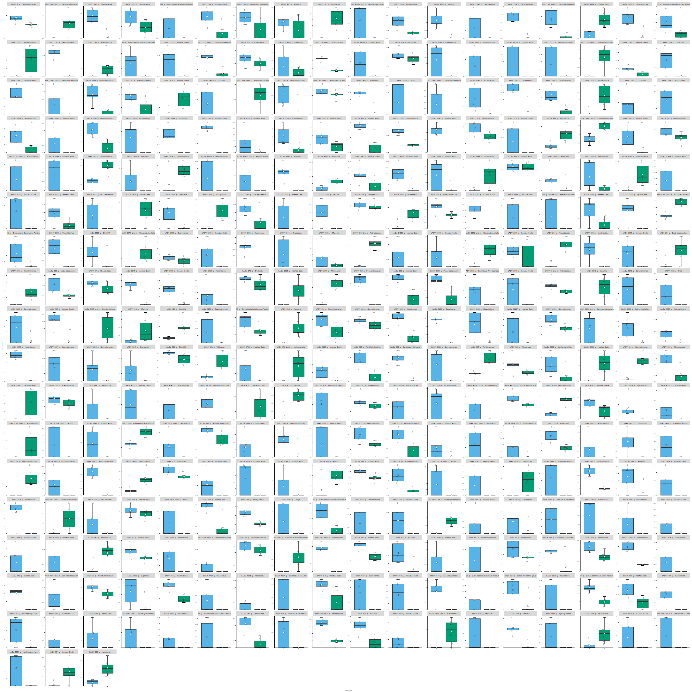<!-- -->


``` r
ggplot(ps_RA, 
       aes(y = ASV_Genus, x = Abundance, fill = Soil_conditioning)) +
  stat_boxplot(aes(x = Abundance, y = ASV_Genus), #Shows the error bars (should be added before box plots to have bars behind box plots)
               geom = "errorbar",
               position = position_dodge(0.75),
               linetype = 1,
               width = 0.2) +
  geom_boxplot(outliers = FALSE) +
  geom_jitter(position = position_jitterdodge(jitter.width = 0,    # horizontal jitter (x-direction)
                                              #jitter.height = 0.2, # vertical jitter (y-direction, since flipped)
                                              dodge.width = 0.75),   # match boxplot dodge width
              color = "black",
              alpha = 0.2) + # Transparency is regulated with the alpha argument
  stat_summary(aes(group = Soil_conditioning),
               fun = mean, 
               geom = "point",
               position = position_dodge(0.75),
               size = 1.5, 
               color = "gray30", 
               fill = "white",
               shape = 23) + #Shows the mean as a white dimond
  scale_x_continuous(expand = expansion(mult = c(0, 0.05))) +   # extra space (%) below and above min and max data point
  expand_limits(y = 0) + # start y axis at 0
  scale_fill_manual(values = c("#56B4E9", "#009E73"),
                    name = "Soil treatment") + # Manually change the colors of the bars. You need to define fill in second line of the plot script to 
  labs(y = "Differetnial Abundant ASVs",
       x = "Relative Abundance") + 
  theme(panel.background = element_rect(fill = "white"), #theme of the graph
        panel.border = element_blank(), #no border around the graph (for border, use: element_rect(color = "gray30", fill = NA))
        axis.line = element_line(), #show line for x and y axis
        plot.title = element_text(size = 9, hjust = 0),
        axis.text = element_text(size = 13, color = "black"),
        axis.title = element_text(size = 16),
        axis.title.x = element_text(vjust = -0.5),
        axis.title.y = element_text(vjust = 2.5), #, hjust = -0
        strip.text = element_text(size = 13),
        legend.position = "right")
```

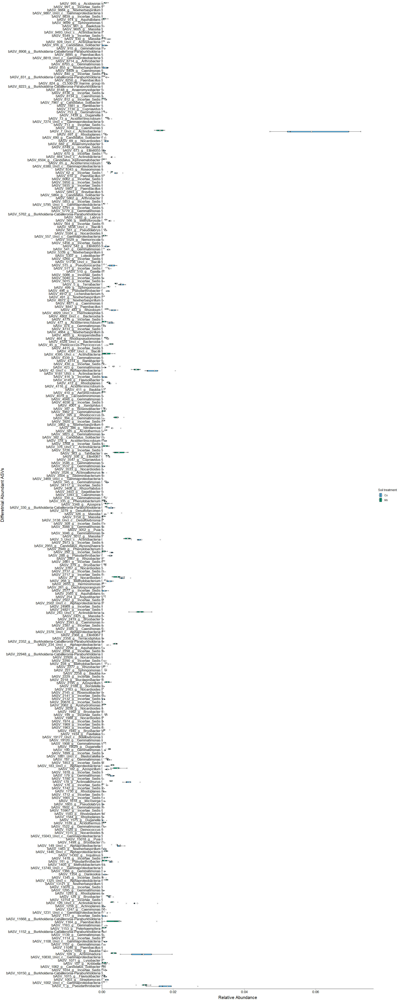<!-- -->

``` r
# Clean environment
rm(list = ls())
```


## ASVs detected by three DA tests

``` r
# load phyloseq object
load("C:/Users/kreek001/OneDrive - Wageningen University & Research/Chapters/Experimental Chapter 3/RScripts/GitHub/TwelveAccessionExperiment/MicrobiomeAnalysis/Data/Phyloseq_objects/FP_unnormalized_bac_ps_ForDA_clean.RData")

# load DA ASVs
load("C:/Users/kreek001/OneDrive - Wageningen University & Research/Chapters/Experimental Chapter 3/RScripts/GitHub/TwelveAccessionExperiment/MicrobiomeAnalysis/Data/Phyloseq_objects/FP_DA_SummaryFiles/SummaryFiles_ASVLevel/Acc_Bac_ThreeTimes_DA_ASV.RData")

## Calculate relative abundance
FP_unnormalized_bac_ps_ForDA_clean_RA <- transform_sample_counts(FP_unnormalized_bac_ps_ForDA_clean, function(x) x / sum(x))

# Subset phyloseq object
ps_RA <- prune_taxa(Acc_Bac_ThreeTimes_DA_ASV$HM, FP_unnormalized_bac_ps_ForDA_clean_RA)
ps_RA <- subset_samples(ps_RA, Accession == "HM")
tax_table(ps_RA)[ , 2:6]
```

```
## Taxonomy Table:     [62 taxa by 5 taxonomic ranks]:
##           Phylum                 Class                   
## bASV_1    "p__Actinomycetota"    "c__Actinobacteria"     
## bASV_3    "p__Actinomycetota"    "c__Actinobacteria"     
## bASV_5    "p__Actinomycetota"    "c__Actinobacteria"     
## bASV_7    "p__Actinomycetota"    "c__Actinobacteria"     
## bASV_42   "p__Pseudomonadota"    "c__Alphaproteobacteria"
## bASV_45   "p__Actinomycetota"    "c__Actinobacteria"     
## bASV_62   "p__Gemmatimonadota"   "c__Gemmatimonadia"     
## bASV_109  "p__Actinomycetota"    "c__Actinobacteria"     
## bASV_126  "p__Actinomycetota"    "c__Actinobacteria"     
## bASV_178  "p__Actinomycetota"    "c__Actinobacteria"     
## bASV_182  "p__Pseudomonadota"    "c__Alphaproteobacteria"
## bASV_183  "p__Pseudomonadota"    "c__Alphaproteobacteria"
## bASV_234  "p__Pseudomonadota"    "c__Alphaproteobacteria"
## bASV_243  "p__Actinomycetota"    "c__Actinobacteria"     
## bASV_268  "p__Pseudomonadota"    "c__Alphaproteobacteria"
## bASV_288  "p__Actinomycetota"    "c__Actinobacteria"     
## bASV_326  "p__Pseudomonadota"    "c__Gammaproteobacteria"
## bASV_363  "p__Pseudomonadota"    "c__Gammaproteobacteria"
## bASV_376  "p__Actinomycetota"    "c__Actinobacteria"     
## bASV_385  "p__Actinomycetota"    "c__Actinobacteria"     
## bASV_394  "p__Gemmatimonadota"   "c__Gemmatimonadia"     
## bASV_423  "p__Gemmatimonadota"   "c__Gemmatimonadia"     
## bASV_483  "p__Pseudomonadota"    "c__Alphaproteobacteria"
## bASV_491  "p__Pseudomonadota"    "c__Gammaproteobacteria"
## bASV_496  "p__Actinomycetota"    "c__Actinobacteria"     
## bASV_499  "p__Pseudomonadota"    "c__Alphaproteobacteria"
## bASV_511  "p__Pseudomonadota"    "c__Alphaproteobacteria"
## bASV_515  "p__Actinomycetota"    "c__Actinobacteria"     
## bASV_541  "p__Gemmatimonadota"   "c__Gemmatimonadia"     
## bASV_566  "p__Pseudomonadota"    "c__Alphaproteobacteria"
## bASV_664  "p__Actinomycetota"    "c__Actinobacteria"     
## bASV_670  "p__Acidobacteriota"   "c__Vicinamibacteria"   
## bASV_697  "p__Pseudomonadota"    "c__Alphaproteobacteria"
## bASV_753  "p__Gemmatimonadota"   "c__Gemmatimonadia"     
## bASV_831  "p__Pseudomonadota"    "c__Gammaproteobacteria"
## bASV_916  "p__Acidobacteriota"   "c__Acidobacteriae"     
## bASV_928  "p__Actinomycetota"    "c__Actinobacteria"     
## bASV_930  "p__Pseudomonadota"    "c__Gammaproteobacteria"
## bASV_995  "p__Pseudomonadota"    "c__Gammaproteobacteria"
## bASV_1002 "p__Pseudomonadota"    "c__Gammaproteobacteria"
## bASV_1107 "p__Gemmatimonadota"   "c__Gemmatimonadia"     
## bASV_1108 "p__Pseudomonadota"    "c__Gammaproteobacteria"
## bASV_1163 "p__Gemmatimonadota"   "c__Gemmatimonadia"     
## bASV_1164 "p__Bacillota"         "c__Bacilli"            
## bASV_1231 "p__Pseudomonadota"    "c__Gammaproteobacteria"
## bASV_1325 "p__Pseudomonadota"    "c__Alphaproteobacteria"
## bASV_1354 "p__Pseudomonadota"    "c__Alphaproteobacteria"
## bASV_1366 "p__Gemmatimonadota"   "c__Gemmatimonadia"     
## bASV_1446 "p__Pseudomonadota"    "c__Alphaproteobacteria"
## bASV_1618 "p__Pseudomonadota"    "c__Alphaproteobacteria"
## bASV_1934 "p__Bacteroidota"      "c__Bacteroidia"        
## bASV_2141 "p__Actinomycetota"    "c__Thermoleophilia"    
## bASV_2195 "p__Pseudomonadota"    "c__Alphaproteobacteria"
## bASV_2290 "p__Bdellovibrionota"  "c__Bdellovibrionia"    
## bASV_2299 "p__Actinomycetota"    "c__Acidimicrobiia"     
## bASV_2655 "p__Pseudomonadota"    "c__Gammaproteobacteria"
## bASV_3348 "p__Pseudomonadota"    "c__Gammaproteobacteria"
## bASV_3920 "p__Verrucomicrobiota" "c__Verrucomicrobiia"   
## bASV_3962 "p__Gemmatimonadota"   "c__Gemmatimonadia"     
## bASV_4395 "p__Actinomycetota"    "c__Actinobacteria"     
## bASV_5795 "p__Pseudomonadota"    "c__Gammaproteobacteria"
## bASV_6504 "p__Verrucomicrobiota" "c__Verrucomicrobiia"   
##           Order                    Family                       
## bASV_1    "o__Micrococcales"       "f__Micrococcaceae"          
## bASV_3    "o__Micrococcales"       "f__Micrococcaceae"          
## bASV_5    "o__Micrococcales"       "f__Intrasporangiaceae"      
## bASV_7    "o__Streptosporangiales" NA                           
## bASV_42   "o__Hyphomicrobiales"    "f__Beijerinckiaceae"        
## bASV_45   "o__Micrococcales"       "f__Intrasporangiaceae"      
## bASV_62   "o__Gemmatimonadales"    "f__Gemmatimonadaceae"       
## bASV_109  "o__Streptosporangiales" "f__Thermomonosporaceae"     
## bASV_126  "o__Streptosporangiales" NA                           
## bASV_178  "o__Streptosporangiales" "f__Thermomonosporaceae"     
## bASV_182  "o__Azospirillales"      "f__Azospirillaceae"         
## bASV_183  "o__Hyphomicrobiales"    "f__Rhizobiaceae"            
## bASV_234  "o__Hyphomicrobiales"    "f__Rhizobiaceae"            
## bASV_243  "o__Kitasatosporales"    "f__Streptomycetaceae"       
## bASV_268  "o__Hyphomicrobiales"    "f__Beijerinckiaceae"        
## bASV_288  "o__Micrococcales"       "f__Micrococcaceae"          
## bASV_326  "o__Burkholderiales"     "f__Oxalobacteraceae"        
## bASV_363  "o__Lysobacterales"      "f__Rhodanobacteraceae"      
## bASV_376  "o__Micromonosporales"   "f__Micromonosporaceae"      
## bASV_385  "o__Frankiales"          "f__Acidothermaceae"         
## bASV_394  "o__Gemmatimonadales"    "f__Gemmatimonadaceae"       
## bASV_423  "o__Gemmatimonadales"    "f__Gemmatimonadaceae"       
## bASV_483  "o__Hyphomicrobiales"    "f__Rhizobiaceae"            
## bASV_491  "o__Burkholderiales"     "f__Oxalobacteraceae"        
## bASV_496  "o__Micrococcales"       "f__Micrococcaceae"          
## bASV_499  "o__Sphingomonadales"    "f__Sphingomonadaceae"       
## bASV_511  "o__Caulobacterales"     "f__Caulobacteraceae"        
## bASV_515  "o__Pseudonocardiales"   "f__Pseudonocardiaceae"      
## bASV_541  "o__Gemmatimonadales"    "f__Gemmatimonadaceae"       
## bASV_566  "o__Hyphomicrobiales"    "f__Beijerinckiaceae"        
## bASV_664  "o__Streptosporangiales" NA                           
## bASV_670  "o__Vicinamibacterales"  "f__Vicinamibacteraceae"     
## bASV_697  "o__Hyphomicrobiales"    "f__Xanthobacteraceae"       
## bASV_753  "o__Gemmatimonadales"    "f__Gemmatimonadaceae"       
## bASV_831  "o__Burkholderiales"     "f__Burkholderiaceae"        
## bASV_916  "o__Solibacterales"      "f__Solibacteraceae"         
## bASV_928  "o__Streptosporangiales" NA                           
## bASV_930  "o__Burkholderiales"     "f__Oxalobacteraceae"        
## bASV_995  "o__Burkholderiales"     "f__Comamonadaceae"          
## bASV_1002 "o__Burkholderiales"     "f__Comamonadaceae"          
## bASV_1107 "o__Gemmatimonadales"    "f__Gemmatimonadaceae"       
## bASV_1108 "o__Burkholderiales"     "f__Comamonadaceae"          
## bASV_1163 "o__Gemmatimonadales"    "f__Gemmatimonadaceae"       
## bASV_1164 "o__Paenibacillales"     "f__Paenibacillaceae"        
## bASV_1231 "o__Burkholderiales"     "f__Oxalobacteraceae"        
## bASV_1325 "o__Hyphomicrobiales"    "f__Rhizobiaceae"            
## bASV_1354 "o__Acetobacterales"     "f__Acetobacteraceae"        
## bASV_1366 "o__Gemmatimonadales"    "f__Gemmatimonadaceae"       
## bASV_1446 "o__Hyphomicrobiales"    "f__Rhizobiaceae"            
## bASV_1618 "o__Hyphomicrobiales"    "f__Beijerinckiaceae"        
## bASV_1934 "o__Chitinophagales"     "f__Chitinophagaceae"        
## bASV_2141 "o__Gaiellales"          "f__Incertae_Sedis"          
## bASV_2195 "o__Azospirillales"      "f__Azospirillaceae"         
## bASV_2290 "o__Bdellovibrionales"   "f__Pseudobdellovibrionaceae"
## bASV_2299 "o__Microtrichales"      "f__Iamiaceae"               
## bASV_2655 "o__Burkholderiales"     "f__Oxalobacteraceae"        
## bASV_3348 "o__Burkholderiales"     "f__Rhodocyclaceae"          
## bASV_3920 "o__Verrucomicrobiales"  "f__Verrucomicrobiaceae"     
## bASV_3962 "o__Gemmatimonadales"    "f__Gemmatimonadaceae"       
## bASV_4395 "o__Micrococcales"       "f__Cellulomonadaceae"       
## bASV_5795 "o__Burkholderiales"     "f__Comamonadaceae"          
## bASV_6504 "o__Chthoniobacterales"  "f__Xiphinematobacteraceae"  
##           Genus                                          
## bASV_1    "g__Pseudarthrobacter"                         
## bASV_3    NA                                             
## bASV_5    "g__Terrabacter"                               
## bASV_7    NA                                             
## bASV_42   NA                                             
## bASV_45   "g__Pedococcus-Phycicoccus"                    
## bASV_62   "g__Incertae_Sedis"                            
## bASV_109  "g__Actinomadura"                              
## bASV_126  NA                                             
## bASV_178  "g__Actinoallomurus"                           
## bASV_182  "g__Azospirillum"                              
## bASV_183  NA                                             
## bASV_234  NA                                             
## bASV_243  NA                                             
## bASV_268  "g__Methylobacterium"                          
## bASV_288  "g__Pseudarthrobacter"                         
## bASV_326  "g__Massilia"                                  
## bASV_363  "g__Tahibacter"                                
## bASV_376  NA                                             
## bASV_385  "g__Acidothermus"                              
## bASV_394  "g__Gemmatimonas"                              
## bASV_423  "g__Gemmatimonas"                              
## bASV_483  "g__Rhizobium"                                 
## bASV_491  "g__Noviherbaspirillum"                        
## bASV_496  "g__Pseudarthrobacter"                         
## bASV_499  "g__Sphingomonas"                              
## bASV_511  "g__Incertae_Sedis"                            
## bASV_515  "g__Pseudonocardia"                            
## bASV_541  "g__Gemmatimonas"                              
## bASV_566  "g__Methylorosula"                             
## bASV_664  NA                                             
## bASV_670  "g__Incertae_Sedis"                            
## bASV_697  "g__Rhodoplanes"                               
## bASV_753  "g__Gemmatirosa"                               
## bASV_831  "g__Burkholderia-Caballeronia-Paraburkholderia"
## bASV_916  "g__Candidatus_Solibacter"                     
## bASV_928  NA                                             
## bASV_930  "g__Massilia"                                  
## bASV_995  "g__Acidovorax"                                
## bASV_1002 NA                                             
## bASV_1107 "g__Gemmatimonas"                              
## bASV_1108 NA                                             
## bASV_1163 "g__Gemmatimonas"                              
## bASV_1164 "g__Paenibacillus"                             
## bASV_1231 NA                                             
## bASV_1325 NA                                             
## bASV_1354 "g__Dankookia"                                 
## bASV_1366 "g__Gemmatimonas"                              
## bASV_1446 NA                                             
## bASV_1618 "g__Microvirga"                                
## bASV_1934 "g__Flavitalea"                                
## bASV_2141 "g__Incertae_Sedis"                            
## bASV_2195 "g__Azospirillum"                              
## bASV_2290 "g__Incertae_Sedis"                            
## bASV_2299 "g__Aquihabitans"                              
## bASV_2655 "g__Herminiimonas"                             
## bASV_3348 "g__Azospira"                                  
## bASV_3920 "g__Incertae_Sedis"                            
## bASV_3962 "g__Gemmatimonas"                              
## bASV_4395 NA                                             
## bASV_5795 NA                                             
## bASV_6504 "g__Candidatus_Xiphinematobacter"
```

``` r
## Phyloseq object to data frame with relative abundance, meta data and taxonomy
ps_RA <- psmelt(ps_RA)

# Identify rows where Genus is NA
na_genus <- is.na(ps_RA$Genus)

# Replace those NAs with "Unclassified_" + Class name
ps_RA$Genus[na_genus] <- paste0("Uncl_", ps_RA$Class[na_genus])
ps_RA$ASV_Genus <- paste(ps_RA$OTU, ps_RA$Genus, sep = "_")

#ps_RA_VLHM$Genus <- str_replace_all(ps_RA_VLHM$Genus, "g__", "") # remove g__
#ps_RA_VLHM$Genus <- str_replace_all(ps_RA_VLHM$Genus, "_c__", "\n") # remove c__
#ps_RA_VLHM[ps_RA_VLHM$OTU == "bASV_831", "OTU_Genus"] <- "bASV_831 Burkholderia- *"

## Change order of ASVs depending on difference between soil treatments
otu_means <- aggregate(Abundance ~ OTU + Soil_conditioning,
                       data = ps_RA,
                       FUN = mean)
otu_means <- reshape(otu_means, # Change configuration df
                     timevar = "Soil_conditioning",
                     idvar = "OTU",
                     direction = "wide")
otu_means$difference <- otu_means$Abundance.Mb - otu_means$Abundance.Co
ps_RA <- merge(ps_RA,
                otu_means[, c("OTU", "difference")],
                by = "OTU",
                all.x = TRUE)
ps_RA$Genus <- with(ps_RA, reorder(Genus, difference))
ps_RA$OTU <- with(ps_RA, reorder(OTU, -difference))
```


``` r
ggplot(ps_RA, 
       aes(x = Soil_conditioning, y = Abundance, fill = Soil_conditioning)) +
  facet_wrap(~ ASV_Genus, scales = "free_y"#,
             #labeller = as_labeller(otu_labels)
             ) +
  stat_boxplot(aes(y = Abundance, x = Soil_conditioning), #Shows the error bars (should be added before box plots to have bars behind box plots)
               geom = "errorbar",
               position = position_dodge(0.75),
               linetype = 1,
               width = 0.2) +
  geom_boxplot(outliers = FALSE) +
  geom_jitter(position = position_jitterdodge(jitter.width = 0.3,    # horizontal jitter (x-direction)
                                              jitter.height = 0, # vertical jitter (y-direction, since flipped)
                                              dodge.width = 0.75),   # match boxplot dodge width
              color = "black",
              alpha = 0.2) + # Transparency is regulated with the alpha argument
  stat_summary(aes(group = Soil_conditioning),
               fun = mean, 
               geom = "point", 
               position = position_dodge(0.75),
               size = 1.5, 
               color = "gray30", 
               fill = "white",
               shape = 23) + #Shows the mean as a white circle
  scale_y_continuous(expand = expansion(mult = c(0, 0.05))) +   # extra space (%) below and above min and max data point
  expand_limits(y = 0) + # start y axis at 0
  scale_fill_manual(values = c("#56B4E9", "#009E73"),
                    name = "Soil treatment",
                    labels = c("CTRL", ~italic("M. brassicae"))) +
  labs(y = "Relative Abundance",
       x = "Soil Conditioning") + 
  theme(panel.background = element_rect(fill = "white"), #theme of the graph
        panel.border = element_blank(), #no border around the graph (for border, use: element_rect(color = "gray30", fill = NA))
        axis.line = element_line(), #show line for x and y axis
        plot.title = element_text(size = 5, hjust = 0),
        axis.text = element_text(size = 4, color = "black"),
        axis.title = element_text(size = 15),
        axis.title.x = element_text(vjust = -0.5),
        axis.title.y = element_text(vjust = 2.5), #, hjust = -0
        strip.text = element_text(size = 5),
        legend.text = element_text(size = 13),
        legend.title = element_text(size = 15),
        legend.position = "none")
```

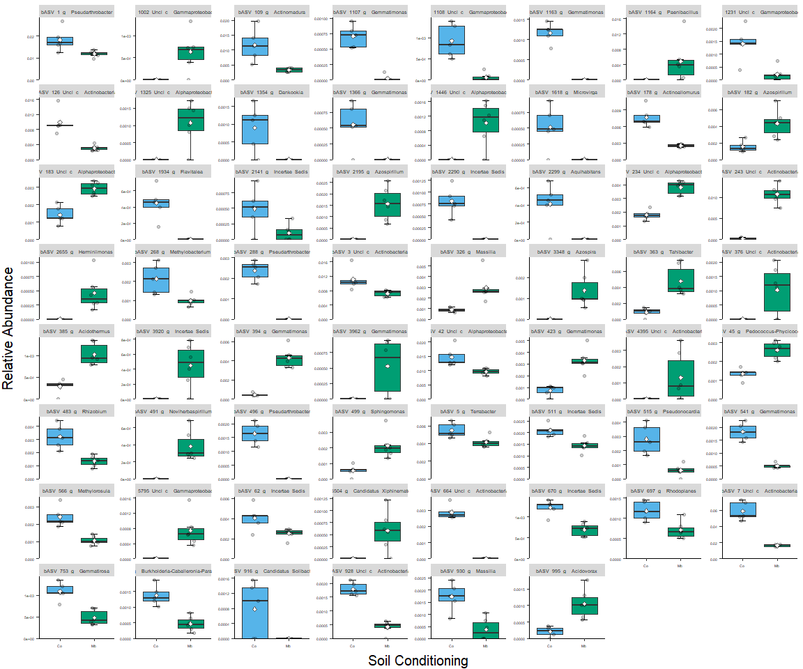<!-- -->


``` r
ggplot(ps_RA, 
       aes(y = ASV_Genus, x = Abundance, fill = Soil_conditioning)) +
  stat_boxplot(aes(x = Abundance, y = ASV_Genus), #Shows the error bars (should be added before box plots to have bars behind box plots)
               geom = "errorbar",
               position = position_dodge(0.75),
               linetype = 1,
               width = 0.2) +
  geom_boxplot(outliers = FALSE) +
  geom_jitter(position = position_jitterdodge(jitter.width = 0,    # horizontal jitter (x-direction)
                                              #jitter.height = 0.2, # vertical jitter (y-direction, since flipped)
                                              dodge.width = 0.75),   # match boxplot dodge width
              color = "black",
              alpha = 0.2) + # Transparency is regulated with the alpha argument
  stat_summary(aes(group = Soil_conditioning),
               fun = mean, 
               geom = "point",
               position = position_dodge(0.75),
               size = 1.5, 
               color = "gray30", 
               fill = "white",
               shape = 23) + #Shows the mean as a white dimond
  scale_x_continuous(expand = expansion(mult = c(0, 0.05))) +   # extra space (%) below and above min and max data point
  expand_limits(y = 0) + # start y axis at 0
  scale_fill_manual(values = c("#56B4E9", "#009E73"),
                    name = "Soil treatment") + # Manually change the colors of the bars. You need to define fill in second line of the plot script to 
  labs(y = "Differetnial Abundant ASVs",
       x = "Relative Abundance") + 
  theme(panel.background = element_rect(fill = "white"), #theme of the graph
        panel.border = element_blank(), #no border around the graph (for border, use: element_rect(color = "gray30", fill = NA))
        axis.line = element_line(), #show line for x and y axis
        plot.title = element_text(size = 9, hjust = 0),
        axis.text = element_text(size = 13, color = "black"),
        axis.title = element_text(size = 16),
        axis.title.x = element_text(vjust = -0.5),
        axis.title.y = element_text(vjust = 2.5), #, hjust = -0
        strip.text = element_text(size = 13),
        legend.position = "right")
```

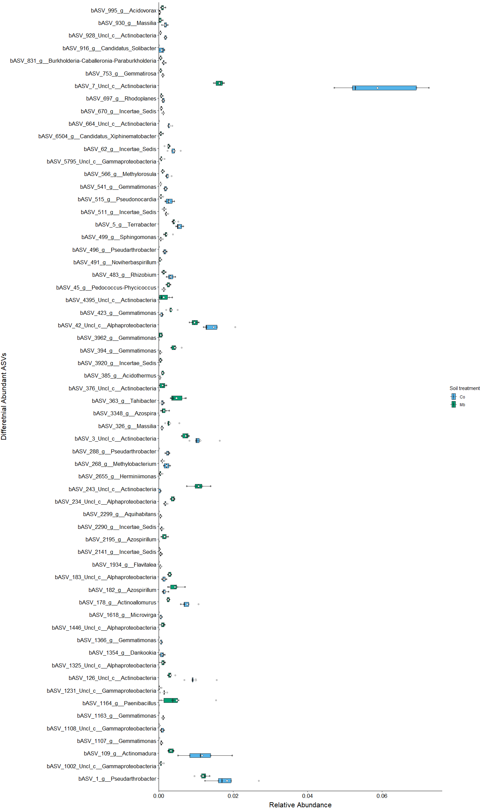<!-- -->

``` r
# Clean environment
rm(list = ls())
```


## ASVs detected filtered based on log2fold change
ASVs detected by two tests and ancomWZ used for log2fold change

### Data preperation

``` r
# load phyloseq object
load("C:/Users/kreek001/OneDrive - Wageningen University & Research/Chapters/Experimental Chapter 3/RScripts/GitHub/TwelveAccessionExperiment/MicrobiomeAnalysis/Data/Phyloseq_objects/FP_unnormalized_bac_ps_ForDA_clean.RData")

# load DA ASVs
load("C:/Users/kreek001/OneDrive - Wageningen University & Research/Chapters/Experimental Chapter 3/RScripts/GitHub/TwelveAccessionExperiment/MicrobiomeAnalysis/Data/Phyloseq_objects/FP_DA_SummaryFiles/SummaryFiles_ASVLevel/Acc_Bac_TwoTimes_DA_ASV.RData")

# load log2fold change values
load(file = "C:/Users/kreek001/OneDrive - Wageningen University & Research/Chapters/Experimental Chapter 3/RScripts/GitHub/TwelveAccessionExperiment/MicrobiomeAnalysis/Data/Phyloseq_objects/FP_DA_Ancom_ASVLevel/ancomWZ_Bac_Acc.RData")

# Calculate relative abundance
FP_unnormalized_bac_ps_ForDA_clean_RA <- transform_sample_counts(FP_unnormalized_bac_ps_ForDA_clean, function(x) x / sum(x))

# number of ASVs with large log2Fold change
summary(ancomWZ_Bac_Acc$HM$res$lfc$Soil_conditioningMb)
```

```
##    Min. 1st Qu.  Median    Mean 3rd Qu.    Max. 
## -4.4273 -0.6114 -0.2212 -0.1947  0.2302  4.3794
```

``` r
length(ancomWZ_Bac_Acc$HM$res$lfc[abs(ancomWZ_Bac_Acc$HM$res$lfc$Soil_conditioningMb) > 1, "Soil_conditioningMb" ])
```

```
## [1] 452
```

``` r
length(ancomWZ_Bac_Acc$HM$res$lfc[(ancomWZ_Bac_Acc$HM$res$lfc$Soil_conditioningMb) > 2, "Soil_conditioningMb" ])
```

```
## [1] 13
```

``` r
length(ancomWZ_Bac_Acc$HM$res$lfc[(ancomWZ_Bac_Acc$HM$res$lfc$Soil_conditioningMb) < -2, "Soil_conditioningMb" ])
```

```
## [1] 50
```

``` r
length(ancomWZ_Bac_Acc$HM$res$lfc[(ancomWZ_Bac_Acc$HM$res$lfc$Soil_conditioningMb) > 2.5, "Soil_conditioningMb" ])
```

```
## [1] 5
```

``` r
length(ancomWZ_Bac_Acc$HM$res$lfc[(ancomWZ_Bac_Acc$HM$res$lfc$Soil_conditioningMb) < -2.5, "Soil_conditioningMb" ])
```

```
## [1] 16
```

``` r
length(ancomWZ_Bac_Acc$HM$res$lfc[(ancomWZ_Bac_Acc$HM$res$lfc$Soil_conditioningMb) > 3, "Soil_conditioningMb" ])
```

```
## [1] 4
```

``` r
length(ancomWZ_Bac_Acc$HM$res$lfc[(ancomWZ_Bac_Acc$HM$res$lfc$Soil_conditioningMb) < -3, "Soil_conditioningMb" ])
```

```
## [1] 6
```

``` r
# ASVs with a log2fold change larger than 2.5 or smaller than -2.5
ancomWZ_Bac_Acc_lfc_2.5 <- ancomWZ_Bac_Acc$HM$res$lfc[abs(ancomWZ_Bac_Acc$HM$res$lfc$Soil_conditioningMb) > 2.5, ]
HM_lfc_2.5_ancomWZ_DA_ASV <- ancomWZ_Bac_Acc_lfc_2.5$taxon
save(HM_lfc_2.5_ancomWZ_DA_ASV, file = "C:/Users/kreek001/OneDrive - Wageningen University & Research/Chapters/Experimental Chapter 3/RScripts/GitHub/TwelveAccessionExperiment/MicrobiomeAnalysis/Data/Phyloseq_objects/FP_DA_SummaryFiles/SummaryFiles_ASVLevel/HM_lfc_2.5_ancomWZ_DA_ASV.RData")

# ASVs with a log2fold change larger than 3 or smaller than -3
ancomWZ_Bac_Acc_lfc_3 <- ancomWZ_Bac_Acc$HM$res$lfc[abs(ancomWZ_Bac_Acc$HM$res$lfc$Soil_conditioningMb) > 3, ]
HM_lfc_3_ancomWZ_DA_ASV <- ancomWZ_Bac_Acc_lfc_3$taxon
save(HM_lfc_3_ancomWZ_DA_ASV, file = "C:/Users/kreek001/OneDrive - Wageningen University & Research/Chapters/Experimental Chapter 3/RScripts/GitHub/TwelveAccessionExperiment/MicrobiomeAnalysis/Data/Phyloseq_objects/FP_DA_SummaryFiles/SummaryFiles_ASVLevel/HM_lfc_3_ancomWZ_DA_ASV.RData")

# Subset phyloseq object
ps_RA <- subset_samples(FP_unnormalized_bac_ps_ForDA_clean_RA, Accession == "HM")
ps_RA_lfc_2.5 <- prune_taxa(ancomWZ_Bac_Acc_lfc_2.5$taxon, ps_RA)
ps_RA_lfc_3 <- prune_taxa(ancomWZ_Bac_Acc_lfc_3$taxon, ps_RA)
tax_table(ps_RA_lfc_2.5)[ , 2:6]
```

```
## Taxonomy Table:     [21 taxa by 5 taxonomic ranks]:
##           Phylum                Class                   
## bASV_141  "p__Actinomycetota"   "c__Actinobacteria"     
## bASV_243  "p__Actinomycetota"   "c__Actinobacteria"     
## bASV_288  "p__Actinomycetota"   "c__Actinobacteria"     
## bASV_309  "p__Actinomycetota"   "c__Acidimicrobiia"     
## bASV_378  "p__Actinomycetota"   "c__Acidimicrobiia"     
## bASV_477  "p__Actinomycetota"   "c__Acidimicrobiia"     
## bASV_496  "p__Actinomycetota"   "c__Actinobacteria"     
## bASV_542  "p__Pseudomonadota"   "c__Alphaproteobacteria"
## bASV_664  "p__Actinomycetota"   "c__Actinobacteria"     
## bASV_1003 "p__Actinomycetota"   "c__Actinobacteria"     
## bASV_1092 "p__Pseudomonadota"   "c__Alphaproteobacteria"
## bASV_1108 "p__Pseudomonadota"   "c__Gammaproteobacteria"
## bASV_1163 "p__Gemmatimonadota"  "c__Gemmatimonadia"     
## bASV_1164 "p__Bacillota"        "c__Bacilli"            
## bASV_1325 "p__Pseudomonadota"   "c__Alphaproteobacteria"
## bASV_1463 "p__Pseudomonadota"   "c__Gammaproteobacteria"
## bASV_1618 "p__Pseudomonadota"   "c__Alphaproteobacteria"
## bASV_1934 "p__Bacteroidota"     "c__Bacteroidia"        
## bASV_2195 "p__Pseudomonadota"   "c__Alphaproteobacteria"
## bASV_2290 "p__Bdellovibrionota" "c__Bdellovibrionia"    
## bASV_3348 "p__Pseudomonadota"   "c__Gammaproteobacteria"
##           Order                    Family                              
## bASV_141  "o__Micrococcales"       "f__Micrococcaceae"                 
## bASV_243  "o__Kitasatosporales"    "f__Streptomycetaceae"              
## bASV_288  "o__Micrococcales"       "f__Micrococcaceae"                 
## bASV_309  "o__Microtrichales"      "f__Ilumatobacteraceae"             
## bASV_378  "o__Acidimicrobiales"    "f__Acidimicrobiaceae"              
## bASV_477  "o__Acidimicrobiales"    "f__Acidimicrobiaceae"              
## bASV_496  "o__Micrococcales"       "f__Micrococcaceae"                 
## bASV_542  "o__Sphingomonadales"    "f__Sphingomonadaceae"              
## bASV_664  "o__Streptosporangiales" NA                                  
## bASV_1003 "o__Kitasatosporales"    "f__Streptomycetaceae"              
## bASV_1092 "o__Hyphomicrobiales"    "f__Hyphomicrobiales_Incertae_Sedis"
## bASV_1108 "o__Burkholderiales"     "f__Comamonadaceae"                 
## bASV_1163 "o__Gemmatimonadales"    "f__Gemmatimonadaceae"              
## bASV_1164 "o__Paenibacillales"     "f__Paenibacillaceae"               
## bASV_1325 "o__Hyphomicrobiales"    "f__Rhizobiaceae"                   
## bASV_1463 "o__Burkholderiales"     "f__Oxalobacteraceae"               
## bASV_1618 "o__Hyphomicrobiales"    "f__Beijerinckiaceae"               
## bASV_1934 "o__Chitinophagales"     "f__Chitinophagaceae"               
## bASV_2195 "o__Azospirillales"      "f__Azospirillaceae"                
## bASV_2290 "o__Bdellovibrionales"   "f__Pseudobdellovibrionaceae"       
## bASV_3348 "o__Burkholderiales"     "f__Rhodocyclaceae"                 
##           Genus                   
## bASV_141  "g__Pseudarthrobacter"  
## bASV_243  NA                      
## bASV_288  "g__Pseudarthrobacter"  
## bASV_309  "g__Incertae_Sedis"     
## bASV_378  "g__Acidiferrimicrobium"
## bASV_477  "g__Acidiferrimicrobium"
## bASV_496  "g__Pseudarthrobacter"  
## bASV_542  "g__Ellin6055"          
## bASV_664  NA                      
## bASV_1003 "g__Streptomyces"       
## bASV_1092 "g__Bauldia"            
## bASV_1108 NA                      
## bASV_1163 "g__Gemmatimonas"       
## bASV_1164 "g__Paenibacillus"      
## bASV_1325 NA                      
## bASV_1463 "g__Noviherbaspirillum" 
## bASV_1618 "g__Microvirga"         
## bASV_1934 "g__Flavitalea"         
## bASV_2195 "g__Azospirillum"       
## bASV_2290 "g__Incertae_Sedis"     
## bASV_3348 "g__Azospira"
```

``` r
tax_table(ps_RA_lfc_3)[ , 2:6]
```

```
## Taxonomy Table:     [10 taxa by 5 taxonomic ranks]:
##           Phylum                Class                   
## bASV_141  "p__Actinomycetota"   "c__Actinobacteria"     
## bASV_243  "p__Actinomycetota"   "c__Actinobacteria"     
## bASV_288  "p__Actinomycetota"   "c__Actinobacteria"     
## bASV_496  "p__Actinomycetota"   "c__Actinobacteria"     
## bASV_664  "p__Actinomycetota"   "c__Actinobacteria"     
## bASV_1163 "p__Gemmatimonadota"  "c__Gemmatimonadia"     
## bASV_1164 "p__Bacillota"        "c__Bacilli"            
## bASV_2195 "p__Pseudomonadota"   "c__Alphaproteobacteria"
## bASV_2290 "p__Bdellovibrionota" "c__Bdellovibrionia"    
## bASV_3348 "p__Pseudomonadota"   "c__Gammaproteobacteria"
##           Order                    Family                       
## bASV_141  "o__Micrococcales"       "f__Micrococcaceae"          
## bASV_243  "o__Kitasatosporales"    "f__Streptomycetaceae"       
## bASV_288  "o__Micrococcales"       "f__Micrococcaceae"          
## bASV_496  "o__Micrococcales"       "f__Micrococcaceae"          
## bASV_664  "o__Streptosporangiales" NA                           
## bASV_1163 "o__Gemmatimonadales"    "f__Gemmatimonadaceae"       
## bASV_1164 "o__Paenibacillales"     "f__Paenibacillaceae"        
## bASV_2195 "o__Azospirillales"      "f__Azospirillaceae"         
## bASV_2290 "o__Bdellovibrionales"   "f__Pseudobdellovibrionaceae"
## bASV_3348 "o__Burkholderiales"     "f__Rhodocyclaceae"          
##           Genus                 
## bASV_141  "g__Pseudarthrobacter"
## bASV_243  NA                    
## bASV_288  "g__Pseudarthrobacter"
## bASV_496  "g__Pseudarthrobacter"
## bASV_664  NA                    
## bASV_1163 "g__Gemmatimonas"     
## bASV_1164 "g__Paenibacillus"    
## bASV_2195 "g__Azospirillum"     
## bASV_2290 "g__Incertae_Sedis"   
## bASV_3348 "g__Azospira"
```

``` r
## Phyloseq object to data frame with relative abundance, meta data and taxonomy
ps_RA_lfc_2.5 <- psmelt(ps_RA_lfc_2.5)
ps_RA_lfc_3 <- psmelt(ps_RA_lfc_3)

# Identify rows where Genus is NA
na_genus_2.5 <- is.na(ps_RA_lfc_2.5$Genus)
na_genus_3 <- is.na(ps_RA_lfc_3$Genus)

# Replace those NAs with "Unclassified_" + Class name for 2.5
ps_RA_lfc_2.5$Genus[na_genus_2.5] <- paste0("Uncl_", ps_RA_lfc_2.5$Class[na_genus_2.5])
ps_RA_lfc_2.5$ASV_Genus <- paste(ps_RA_lfc_2.5$OTU, ps_RA_lfc_2.5$Genus, sep = "_")

## Change order of ASVs depending on difference between soil treatments for 2.5
otu_means <- aggregate(Abundance ~ OTU + Soil_conditioning,
                       data = ps_RA_lfc_2.5,
                       FUN = mean)
otu_means <- reshape(otu_means, # Change configuration df
                     timevar = "Soil_conditioning",
                     idvar = "OTU",
                     direction = "wide")
otu_means$difference <- otu_means$Abundance.Mb - otu_means$Abundance.Co
ps_RA_lfc_2.5 <- merge(ps_RA_lfc_2.5,
                otu_means[, c("OTU", "difference")],
                by = "OTU",
                all.x = TRUE)
ps_RA_lfc_2.5$Genus <- with(ps_RA_lfc_2.5, reorder(Genus, difference))
ps_RA_lfc_2.5$OTU <- with(ps_RA_lfc_2.5, reorder(OTU, -difference))

# Replace those NAs with "Unclassified_" + Class name for 3
ps_RA_lfc_3$Genus[na_genus_3] <- paste0("Uncl_", ps_RA_lfc_3$Class[na_genus_3])
ps_RA_lfc_3$ASV_Genus <- paste(ps_RA_lfc_3$OTU, ps_RA_lfc_3$Genus, sep = "_")

## Change order of ASVs depending on difference between soil treatments for 3
otu_means <- aggregate(Abundance ~ OTU + Soil_conditioning,
                       data = ps_RA_lfc_3,
                       FUN = mean)
otu_means <- reshape(otu_means, # Change configuration df
                     timevar = "Soil_conditioning",
                     idvar = "OTU",
                     direction = "wide")
otu_means$difference <- otu_means$Abundance.Mb - otu_means$Abundance.Co
ps_RA_lfc_3 <- merge(ps_RA_lfc_3,
                otu_means[, c("OTU", "difference")],
                by = "OTU",
                all.x = TRUE)
ps_RA_lfc_3$Genus <- with(ps_RA_lfc_3, reorder(Genus, difference))
ps_RA_lfc_3$OTU <- with(ps_RA_lfc_3, reorder(OTU, -difference))
```

### Grapth lfc of 2.5

``` r
ggplot(ps_RA_lfc_2.5, 
       aes(x = Soil_conditioning, y = Abundance, fill = Soil_conditioning)) +
  facet_wrap(~ ASV_Genus, scales = "free_y"#,
             #labeller = as_labeller(otu_labels)
             ) +
  stat_boxplot(aes(y = Abundance, x = Soil_conditioning), #Shows the error bars (should be added before box plots to have bars behind box plots)
               geom = "errorbar",
               position = position_dodge(0.75),
               linetype = 1,
               width = 0.2) +
  geom_boxplot(outliers = FALSE) +
  geom_jitter(position = position_jitterdodge(jitter.width = 0.3,    # horizontal jitter (x-direction)
                                              jitter.height = 0, # vertical jitter (y-direction, since flipped)
                                              dodge.width = 0.75),   # match boxplot dodge width
              color = "black",
              alpha = 0.2) + # Transparency is regulated with the alpha argument
  stat_summary(aes(group = Soil_conditioning),
               fun = mean, 
               geom = "point", 
               position = position_dodge(0.75),
               size = 1.5, 
               color = "gray30", 
               fill = "white",
               shape = 23) + #Shows the mean as a white circle
  scale_y_continuous(expand = expansion(mult = c(0, 0.05))) +   # extra space (%) below and above min and max data point
  expand_limits(y = 0) + # start y axis at 0
  scale_fill_manual(values = c("#56B4E9", "#009E73"),
                    name = "Soil treatment",
                    labels = c("CTRL", ~italic("M. brassicae"))) +
  labs(y = "Relative Abundance",
       x = "Soil Conditioning") + 
  theme(panel.background = element_rect(fill = "white"), #theme of the graph
        panel.border = element_blank(), #no border around the graph (for border, use: element_rect(color = "gray30", fill = NA))
        axis.line = element_line(), #show line for x and y axis
        plot.title = element_text(size = 5, hjust = 0),
        axis.text = element_text(size = 7, color = "black"),
        axis.title = element_text(size = 12),
        axis.title.x = element_text(vjust = -0.5),
        axis.title.y = element_text(vjust = 2.5), #, hjust = -0
        strip.text = element_text(size = 8),
        legend.text = element_text(size = 12),
        legend.title = element_text(size = 12),
        legend.position = c(0.9, 0.1))
```

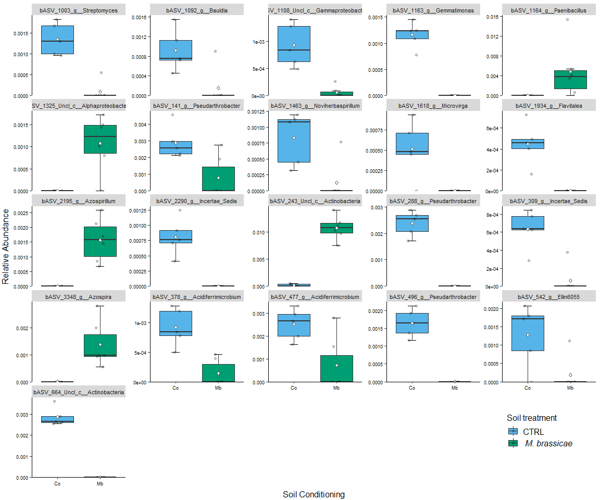<!-- -->


``` r
ggplot(ps_RA_lfc_2.5, 
       aes(y = ASV_Genus, x = Abundance, fill = Soil_conditioning)) +
  stat_boxplot(aes(x = Abundance, y = ASV_Genus), #Shows the error bars (should be added before box plots to have bars behind box plots)
               geom = "errorbar",
               position = position_dodge(0.75),
               linetype = 1,
               width = 0.2) +
  geom_boxplot(outliers = FALSE) +
  geom_jitter(position = position_jitterdodge(jitter.width = 0,    # horizontal jitter (x-direction)
                                              #jitter.height = 0.2, # vertical jitter (y-direction, since flipped)
                                              dodge.width = 0.75),   # match boxplot dodge width
              color = "black",
              alpha = 0.2) + # Transparency is regulated with the alpha argument
  stat_summary(aes(group = Soil_conditioning),
               fun = mean, 
               geom = "point",
               position = position_dodge(0.75),
               size = 1.5, 
               color = "gray30", 
               fill = "white",
               shape = 23) + #Shows the mean as a white dimond
  scale_x_continuous(expand = expansion(mult = c(0, 0.05))) +   # extra space (%) below and above min and max data point
  expand_limits(y = 0) + # start y axis at 0
  scale_fill_manual(values = c("#56B4E9", "#009E73"),
                    name = "Soil treatment") + # Manually change the colors of the bars. You need to define fill in second line of the plot script to 
  labs(y = "Differetnial Abundant ASVs",
       x = "Relative Abundance") + 
  theme(panel.background = element_rect(fill = "white"), #theme of the graph
        panel.border = element_blank(), #no border around the graph (for border, use: element_rect(color = "gray30", fill = NA))
        axis.line = element_line(), #show line for x and y axis
        plot.title = element_text(size = 9, hjust = 0),
        axis.text = element_text(size = 13, color = "black"),
        axis.title = element_text(size = 16),
        axis.title.x = element_text(vjust = -0.5),
        axis.title.y = element_text(vjust = 2.5), #, hjust = -0
        strip.text = element_text(size = 13),
        legend.position = "right")
```

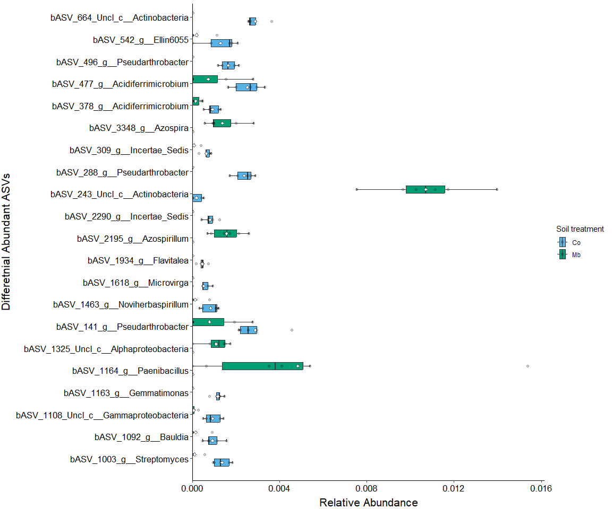<!-- -->

### Grapth lfc of 3

``` r
ggplot(ps_RA_lfc_3, 
       aes(x = Soil_conditioning, y = Abundance, fill = Soil_conditioning)) +
  facet_wrap(~ ASV_Genus, scales = "free_y"#,
             #labeller = as_labeller(otu_labels)
             ) +
  stat_boxplot(aes(y = Abundance, x = Soil_conditioning), #Shows the error bars (should be added before box plots to have bars behind box plots)
               geom = "errorbar",
               position = position_dodge(0.75),
               linetype = 1,
               width = 0.2) +
  geom_boxplot(outliers = FALSE) +
  geom_jitter(position = position_jitterdodge(jitter.width = 0.3,    # horizontal jitter (x-direction)
                                              jitter.height = 0, # vertical jitter (y-direction, since flipped)
                                              dodge.width = 0.75),   # match boxplot dodge width
              color = "black",
              alpha = 0.2) + # Transparency is regulated with the alpha argument
  stat_summary(aes(group = Soil_conditioning),
               fun = mean, 
               geom = "point", 
               position = position_dodge(0.75),
               size = 1.5, 
               color = "gray30", 
               fill = "white",
               shape = 23) + #Shows the mean as a white circle
  scale_y_continuous(expand = expansion(mult = c(0, 0.05))) +   # extra space (%) below and above min and max data point
  expand_limits(y = 0) + # start y axis at 0
  scale_fill_manual(values = c("#56B4E9", "#009E73"),
                    name = "Soil treatment",
                    labels = c("CTRL", ~italic("M. brassicae"))) +
  labs(y = "Relative Abundance",
       x = "Soil Conditioning") + 
  theme(panel.background = element_rect(fill = "white"), #theme of the graph
        panel.border = element_blank(), #no border around the graph (for border, use: element_rect(color = "gray30", fill = NA))
        axis.line = element_line(), #show line for x and y axis
        plot.title = element_text(size = 5, hjust = 0),
        axis.text = element_text(size = 7, color = "black"),
        axis.title = element_text(size = 12),
        axis.title.x = element_text(vjust = -0.5),
        axis.title.y = element_text(vjust = 2.5), #, hjust = -0
        strip.text = element_text(size = 8),
        legend.text = element_text(size = 12),
        legend.title = element_text(size = 12),
        legend.position = c(0.9, 0.1))
```

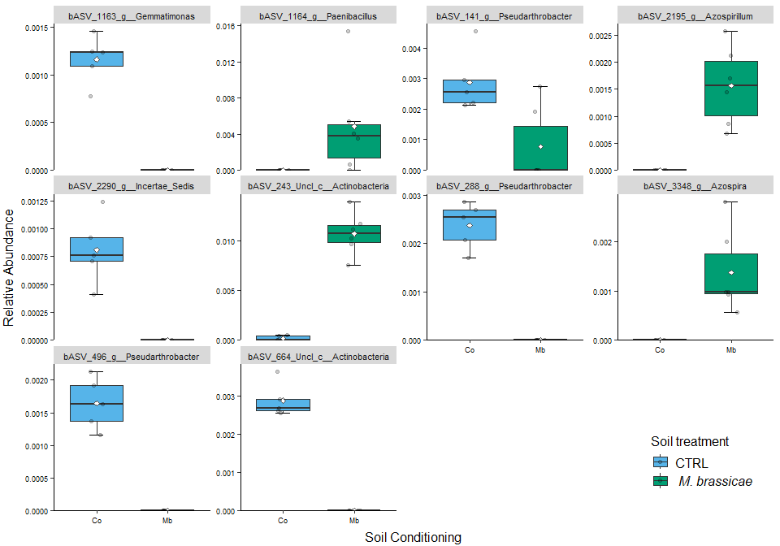<!-- -->


``` r
ggplot(ps_RA_lfc_3, 
       aes(y = ASV_Genus, x = Abundance, fill = Soil_conditioning)) +
  stat_boxplot(aes(x = Abundance, y = ASV_Genus), #Shows the error bars (should be added before box plots to have bars behind box plots)
               geom = "errorbar",
               position = position_dodge(0.75),
               linetype = 1,
               width = 0.2) +
  geom_boxplot(outliers = FALSE) +
  geom_jitter(position = position_jitterdodge(jitter.width = 0,    # horizontal jitter (x-direction)
                                              #jitter.height = 0.2, # vertical jitter (y-direction, since flipped)
                                              dodge.width = 0.75),   # match boxplot dodge width
              color = "black",
              alpha = 0.2) + # Transparency is regulated with the alpha argument
  stat_summary(aes(group = Soil_conditioning),
               fun = mean, 
               geom = "point",
               position = position_dodge(0.75),
               size = 1.5, 
               color = "gray30", 
               fill = "white",
               shape = 23) + #Shows the mean as a white dimond
  scale_x_continuous(expand = expansion(mult = c(0, 0.05))) +   # extra space (%) below and above min and max data point
  expand_limits(y = 0) + # start y axis at 0
  scale_fill_manual(values = c("#56B4E9", "#009E73"),
                    name = "Soil treatment") + # Manually change the colors of the bars. You need to define fill in second line of the plot script to 
  labs(y = "Differetnial Abundant ASVs",
       x = "Relative Abundance") + 
  theme(panel.background = element_rect(fill = "white"), #theme of the graph
        panel.border = element_blank(), #no border around the graph (for border, use: element_rect(color = "gray30", fill = NA))
        axis.line = element_line(), #show line for x and y axis
        plot.title = element_text(size = 9, hjust = 0),
        axis.text = element_text(size = 13, color = "black"),
        axis.title = element_text(size = 16),
        axis.title.x = element_text(vjust = -0.5),
        axis.title.y = element_text(vjust = 2.5), #, hjust = -0
        strip.text = element_text(size = 13),
        legend.position = "right")
```

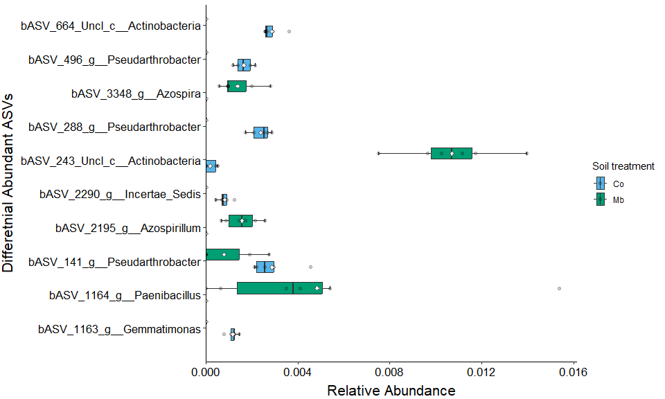<!-- -->

``` r
# Clean environment
rm(list = ls())
```


# 5.4 Relative abundance of DA ASVs VL
## ASVs detected by two DA tests

``` r
# load phyloseq object
load("C:/Users/kreek001/OneDrive - Wageningen University & Research/Chapters/Experimental Chapter 3/RScripts/GitHub/TwelveAccessionExperiment/MicrobiomeAnalysis/Data/Phyloseq_objects/FP_unnormalized_bac_ps_ForDA_clean.RData")

# load DA ASVs
load("C:/Users/kreek001/OneDrive - Wageningen University & Research/Chapters/Experimental Chapter 3/RScripts/GitHub/TwelveAccessionExperiment/MicrobiomeAnalysis/Data/Phyloseq_objects/FP_DA_SummaryFiles/SummaryFiles_ASVLevel/Acc_Bac_TwoTimes_DA_ASV.RData")

## Calculate relative abundance
FP_unnormalized_bac_ps_ForDA_clean_RA <- transform_sample_counts(FP_unnormalized_bac_ps_ForDA_clean, function(x) x / sum(x))

# Subset phyloseq object
ps_RA <- prune_taxa(Acc_Bac_TwoTimes_DA_ASV$VL, FP_unnormalized_bac_ps_ForDA_clean_RA)
ps_RA <- subset_samples(ps_RA, Accession == "VL")
tax_table(ps_RA)[ , 2:6]
```

```
## Taxonomy Table:     [114 taxa by 5 taxonomic ranks]:
##            Phylum                 Class                       
## bASV_7     "p__Actinomycetota"    "c__Actinobacteria"         
## bASV_10    "p__Bacillota"         "c__Bacilli"                
## bASV_17    "p__Actinomycetota"    "c__Actinobacteria"         
## bASV_22    "p__Actinomycetota"    "c__Thermoleophilia"        
## bASV_27    "p__Actinomycetota"    "c__Actinobacteria"         
## bASV_39    "p__Bacillota"         "c__Bacilli"                
## bASV_47    "p__Bacillota"         "c__Bacilli"                
## bASV_57    "p__Actinomycetota"    "c__Thermoleophilia"        
## bASV_60    "p__Actinomycetota"    "c__Actinobacteria"         
## bASV_63    "p__Pseudomonadota"    "c__Gammaproteobacteria"    
## bASV_85    "p__Pseudomonadota"    "c__Alphaproteobacteria"    
## bASV_91    "p__Actinomycetota"    "c__Actinobacteria"         
## bASV_103   "p__Pseudomonadota"    "c__Alphaproteobacteria"    
## bASV_109   "p__Actinomycetota"    "c__Actinobacteria"         
## bASV_124   "p__Actinomycetota"    "c__Thermoleophilia"        
## bASV_126   "p__Actinomycetota"    "c__Actinobacteria"         
## bASV_154   "p__Pseudomonadota"    "c__Alphaproteobacteria"    
## bASV_166   "p__Pseudomonadota"    "c__Alphaproteobacteria"    
## bASV_178   "p__Actinomycetota"    "c__Actinobacteria"         
## bASV_187   "p__Gemmatimonadota"   "c__Gemmatimonadia"         
## bASV_199   "p__Pseudomonadota"    "c__Gammaproteobacteria"    
## bASV_214   "p__Pseudomonadota"    "c__Gammaproteobacteria"    
## bASV_256   "p__Bacillota"         "c__Bacilli"                
## bASV_290   "p__Pseudomonadota"    "c__Gammaproteobacteria"    
## bASV_303   "p__Gemmatimonadota"   "c__Gemmatimonadia"         
## bASV_315   "p__Pseudomonadota"    "c__Gammaproteobacteria"    
## bASV_319   "p__Gemmatimonadota"   "c__Gemmatimonadia"         
## bASV_329   "p__Pseudomonadota"    "c__Alphaproteobacteria"    
## bASV_385   "p__Actinomycetota"    "c__Actinobacteria"         
## bASV_386   "p__Chloroflexota"     "c__Chloroflexia"           
## bASV_417   "p__Chloroflexota"     "c__Chloroflexia"           
## bASV_430   "p__Actinomycetota"    "c__Thermoleophilia"        
## bASV_474   "p__Gemmatimonadota"   "c__Gemmatimonadia"         
## bASV_515   "p__Actinomycetota"    "c__Actinobacteria"         
## bASV_534   "p__Bacillota"         "c__Bacilli"                
## bASV_541   "p__Gemmatimonadota"   "c__Gemmatimonadia"         
## bASV_559   "p__Pseudomonadota"    "c__Gammaproteobacteria"    
## bASV_560   "p__Chloroflexota"     "c__Chloroflexia"           
## bASV_656   "p__Actinomycetota"    "c__Thermoleophilia"        
## bASV_664   "p__Actinomycetota"    "c__Actinobacteria"         
## bASV_732   "p__Pseudomonadota"    "c__Gammaproteobacteria"    
## bASV_827   "p__Pseudomonadota"    "c__Alphaproteobacteria"    
## bASV_888   "p__Pseudomonadota"    "c__Alphaproteobacteria"    
## bASV_899   "p__Bacillota"         "c__Bacilli"                
## bASV_910   "p__Gemmatimonadota"   "c__Gemmatimonadia"         
## bASV_939   "p__Pseudomonadota"    "c__Gammaproteobacteria"    
## bASV_968   "p__Actinomycetota"    "c__Thermoleophilia"        
## bASV_969   "p__Pseudomonadota"    "c__Alphaproteobacteria"    
## bASV_1003  "p__Actinomycetota"    "c__Actinobacteria"         
## bASV_1025  "p__Actinomycetota"    "c__Thermoleophilia"        
## bASV_1028  "p__Pseudomonadota"    "c__Alphaproteobacteria"    
## bASV_1067  "p__Acidobacteriota"   "c__Vicinamibacteria"       
## bASV_1080  "p__Gemmatimonadota"   "c__Gemmatimonadia"         
## bASV_1130  "p__Pseudomonadota"    "c__Gammaproteobacteria"    
## bASV_1153  "p__Actinomycetota"    "c__Actinobacteria"         
## bASV_1155  "p__Actinomycetota"    "c__Actinobacteria"         
## bASV_1157  "p__Pseudomonadota"    "c__Gammaproteobacteria"    
## bASV_1224  "p__Actinomycetota"    "c__Thermoleophilia"        
## bASV_1285  "p__Pseudomonadota"    "c__Alphaproteobacteria"    
## bASV_1329  "p__Actinomycetota"    "c__Thermoleophilia"        
## bASV_1331  "p__Actinomycetota"    "c__Actinobacteria"         
## bASV_1345  "p__Pseudomonadota"    "c__Gammaproteobacteria"    
## bASV_1352  "p__Acidobacteriota"   "c__Vicinamibacteria"       
## bASV_1401  "p__Bacillota"         "c__Bacilli"                
## bASV_1456  "p__Pseudomonadota"    "c__Alphaproteobacteria"    
## bASV_1539  "p__Actinomycetota"    "c__Actinobacteria"         
## bASV_1728  "p__Bacillota"         "c__Clostridia"             
## bASV_1962  "p__Planctomycetota"   "c__Planctomycetes"         
## bASV_2012  "p__Gemmatimonadota"   "c__Gemmatimonadia"         
## bASV_2027  "p__Pseudomonadota"    "c__Gammaproteobacteria"    
## bASV_2120  "p__Gemmatimonadota"   "c__Gemmatimonadia"         
## bASV_2296  "p__Actinomycetota"    "c__Actinobacteria"         
## bASV_2391  "p__Gemmatimonadota"   "c__Gemmatimonadia"         
## bASV_2399  "p__Gemmatimonadota"   "c__Gemmatimonadia"         
## bASV_2459  "p__Bdellovibrionota"  "c__Oligoflexia"            
## bASV_2473  "p__Gemmatimonadota"   "c__Gemmatimonadia"         
## bASV_2487  "p__Gemmatimonadota"   "c__Gemmatimonadia"         
## bASV_2528  "p__Pseudomonadota"    "c__Alphaproteobacteria"    
## bASV_2578  "p__Pseudomonadota"    "c__Alphaproteobacteria"    
## bASV_2701  "p__Gemmatimonadota"   "c__Gemmatimonadia"         
## bASV_2709  "p__Pseudomonadota"    "c__Alphaproteobacteria"    
## bASV_2724  "p__Actinomycetota"    "c__Actinobacteria"         
## bASV_2770  "p__Pseudomonadota"    "c__Alphaproteobacteria"    
## bASV_2902  "p__Actinomycetota"    "c__Thermoleophilia"        
## bASV_3204  "p__Bacteroidota"      "c__Bacteroidia"            
## bASV_3207  "p__Pseudomonadota"    "c__Gammaproteobacteria"    
## bASV_3208  "p__Gemmatimonadota"   "c__Gemmatimonadia"         
## bASV_3276  "p__Gemmatimonadota"   "c__Gemmatimonadia"         
## bASV_3526  "p__Actinomycetota"    "c__Actinobacteria"         
## bASV_3753  "p__Pseudomonadota"    "c__Gammaproteobacteria"    
## bASV_3806  "p__Gemmatimonadota"   "c__Gemmatimonadia"         
## bASV_3873  "p__Bacillota"         "c__Bacilli"                
## bASV_4029  "p__Pseudomonadota"    "c__Gammaproteobacteria"    
## bASV_4207  "p__Chloroflexota"     "c__TK10"                   
## bASV_4392  "p__Bacteroidota"      "c__Bacteroidia"            
## bASV_4782  "p__Actinomycetota"    "c__Thermoleophilia"        
## bASV_5565  "p__Gemmatimonadota"   "c__Gemmatimonadia"         
## bASV_5682  "p__Pseudomonadota"    "c__Alphaproteobacteria"    
## bASV_5805  "p__Actinomycetota"    "c__Thermoleophilia"        
## bASV_5974  "p__Acidobacteriota"   "c__Vicinamibacteria"       
## bASV_6708  "p__Pseudomonadota"    "c__Gammaproteobacteria"    
## bASV_8335  "p__Pseudomonadota"    "c__Gammaproteobacteria"    
## bASV_8506  "p__Bacillota"         "c__Bacilli"                
## bASV_8895  "p__Bacillota"         "c__Bacilli"                
## bASV_8917  "p__Verrucomicrobiota" "c__Verrucomicrobiia"       
## bASV_9579  "p__Gemmatimonadota"   "c__S0134_terrestrial_group"
## bASV_10085 "p__Pseudomonadota"    "c__Gammaproteobacteria"    
## bASV_11178 "p__Actinomycetota"    "c__Thermoleophilia"        
## bASV_11225 "p__Pseudomonadota"    "c__Gammaproteobacteria"    
## bASV_12161 "p__Actinomycetota"    "c__Actinobacteria"         
## bASV_12339 "p__Bacillota"         "c__Clostridia"             
## bASV_14493 "p__Gemmatimonadota"   "c__Gemmatimonadia"         
## bASV_16090 "p__Actinomycetota"    "c__Thermoleophilia"        
## bASV_24934 "p__Pseudomonadota"    "c__Gammaproteobacteria"    
##            Order                    Family                                 
## bASV_7     "o__Streptosporangiales" NA                                     
## bASV_10    "o__Bacillales"          "f__Bacillaceae"                       
## bASV_17    "o__Propionibacteriales" "f__Nocardioidaceae"                   
## bASV_22    "o__Solirubrobacterales" "f__67-14"                             
## bASV_27    "o__Propionibacteriales" "f__Nocardioidaceae"                   
## bASV_39    "o__Bacillales"          "f__Bacillaceae"                       
## bASV_47    "o__Bacillales"          "f__Bacillaceae"                       
## bASV_57    "o__Gaiellales"          "f__Incertae_Sedis"                    
## bASV_60    "o__Propionibacteriales" "f__Nocardioidaceae"                   
## bASV_63    "o__Burkholderiales"     "f__Oxalobacteraceae"                  
## bASV_85    "o__Hyphomicrobiales"    "f__Rhizobiaceae"                      
## bASV_91    "o__Pseudonocardiales"   "f__Pseudonocardiaceae"                
## bASV_103   "o__Hyphomicrobiales"    "f__Methyloligellaceae"                
## bASV_109   "o__Streptosporangiales" "f__Thermomonosporaceae"               
## bASV_124   "o__Gaiellales"          "f__Incertae_Sedis"                    
## bASV_126   "o__Streptosporangiales" NA                                     
## bASV_154   "o__Hyphomicrobiales"    "f__Xanthobacteraceae"                 
## bASV_166   "o__Hyphomicrobiales"    "f__Methyloligellaceae"                
## bASV_178   "o__Streptosporangiales" "f__Thermomonosporaceae"               
## bASV_187   "o__Gemmatimonadales"    "f__Gemmatimonadaceae"                 
## bASV_199   "o__Burkholderiales"     "f__SC-I-84"                           
## bASV_214   "o__Burkholderiales"     "f__Comamonadaceae"                    
## bASV_256   "o__Bacillales"          "f__Planococcaceae"                    
## bASV_290   "o__Burkholderiales"     "f__Comamonadaceae"                    
## bASV_303   "o__Gemmatimonadales"    "f__Gemmatimonadaceae"                 
## bASV_315   "o__Burkholderiales"     "f__Comamonadaceae"                    
## bASV_319   "o__Gemmatimonadales"    "f__Gemmatimonadaceae"                 
## bASV_329   "o__Hyphomicrobiales"    "f__Rhizobiaceae"                      
## bASV_385   "o__Frankiales"          "f__Acidothermaceae"                   
## bASV_386   "o__Thermomicrobiales"   "f__Thermomicrobiaceae"                
## bASV_417   "o__Thermomicrobiales"   "f__JG30-KF-CM45"                      
## bASV_430   "o__Gaiellales"          "f__Incertae_Sedis"                    
## bASV_474   "o__Gemmatimonadales"    "f__Gemmatimonadaceae"                 
## bASV_515   "o__Pseudonocardiales"   "f__Pseudonocardiaceae"                
## bASV_534   "o__Bacillales"          "f__Bacillaceae"                       
## bASV_541   "o__Gemmatimonadales"    "f__Gemmatimonadaceae"                 
## bASV_559   "o__Burkholderiales"     "f__SC-I-84"                           
## bASV_560   "o__Chloroflexales"      "f__Roseiflexaceae"                    
## bASV_656   "o__Gaiellales"          "f__Incertae_Sedis"                    
## bASV_664   "o__Streptosporangiales" NA                                     
## bASV_732   "o__Burkholderiales"     "f__Oxalobacteraceae"                  
## bASV_827   "o__Hyphomicrobiales"    "f__Xanthobacteraceae"                 
## bASV_888   "o__Hyphomicrobiales"    "f__Devosiaceae"                       
## bASV_899   "o__Bacillales"          "f__Bacillaceae"                       
## bASV_910   "o__Gemmatimonadales"    "f__Gemmatimonadaceae"                 
## bASV_939   "o__Burkholderiales"     "f__Comamonadaceae"                    
## bASV_968   "o__Gaiellales"          "f__Incertae_Sedis"                    
## bASV_969   "o__Tistrellales"        "f__Geminicoccaceae"                   
## bASV_1003  "o__Kitasatosporales"    "f__Streptomycetaceae"                 
## bASV_1025  "o__Gaiellales"          "f__Incertae_Sedis"                    
## bASV_1028  "o__Sphingomonadales"    "f__Sphingomonadaceae"                 
## bASV_1067  "o__Vicinamibacterales"  "f__Incertae_Sedis"                    
## bASV_1080  "o__Gemmatimonadales"    "f__Gemmatimonadaceae"                 
## bASV_1130  "o__Burkholderiales"     "f__Comamonadaceae"                    
## bASV_1153  "o__Kitasatosporales"    "f__Streptomycetaceae"                 
## bASV_1155  "o__Streptosporangiales" "f__Streptosporangiales_Incertae_Sedis"
## bASV_1157  "o__Burkholderiales"     "f__Nitrosomonadaceae"                 
## bASV_1224  "o__Gaiellales"          "f__Incertae_Sedis"                    
## bASV_1285  "o__Hyphomicrobiales"    "f__Xanthobacteraceae"                 
## bASV_1329  "o__Solirubrobacterales" "f__67-14"                             
## bASV_1331  "o__Micromonosporales"   "f__Micromonosporaceae"                
## bASV_1345  "o__Burkholderiales"     "f__Oxalobacteraceae"                  
## bASV_1352  "o__Vicinamibacterales"  "f__Incertae_Sedis"                    
## bASV_1401  "o__Bacillales"          "f__Bacillaceae"                       
## bASV_1456  "o__Elsterales"          "f__Incertae_Sedis"                    
## bASV_1539  "o__Frankiales"          "f__Acidothermaceae"                   
## bASV_1728  "o__Clostridiales"       "f__Clostridiaceae"                    
## bASV_1962  "o__Isosphaerales"       "f__Isosphaeraceae"                    
## bASV_2012  "o__Gemmatimonadales"    "f__Gemmatimonadaceae"                 
## bASV_2027  "o__Burkholderiales"     "f__Comamonadaceae"                    
## bASV_2120  "o__Gemmatimonadales"    "f__Gemmatimonadaceae"                 
## bASV_2296  "o__Propionibacteriales" "f__Nocardioidaceae"                   
## bASV_2391  "o__Gemmatimonadales"    "f__Gemmatimonadaceae"                 
## bASV_2399  "o__Gemmatimonadales"    "f__Gemmatimonadaceae"                 
## bASV_2459  "o__0319-6G20"           "f__Incertae_Sedis"                    
## bASV_2473  "o__Gemmatimonadales"    "f__Gemmatimonadaceae"                 
## bASV_2487  "o__Gemmatimonadales"    "f__Gemmatimonadaceae"                 
## bASV_2528  "o__Hyphomicrobiales"    "f__Rhizobiaceae"                      
## bASV_2578  "o__Hyphomicrobiales"    "f__Beijerinckiaceae"                  
## bASV_2701  "o__Gemmatimonadales"    "f__Gemmatimonadaceae"                 
## bASV_2709  "o__Caulobacterales"     "f__Caulobacteraceae"                  
## bASV_2724  "o__Propionibacteriales" "f__Nocardioidaceae"                   
## bASV_2770  "o__Azospirillales"      "f__Azospirillaceae"                   
## bASV_2902  "o__Gaiellales"          "f__Incertae_Sedis"                    
## bASV_3204  "o__Chitinophagales"     "f__Chitinophagaceae"                  
## bASV_3207  "o__Burkholderiales"     "f__Nitrosomonadaceae"                 
## bASV_3208  "o__Gemmatimonadales"    "f__Gemmatimonadaceae"                 
## bASV_3276  "o__Gemmatimonadales"    "f__Gemmatimonadaceae"                 
## bASV_3526  "o__Streptosporangiales" "f__Thermomonosporaceae"               
## bASV_3753  "o__Burkholderiales"     "f__Comamonadaceae"                    
## bASV_3806  "o__Gemmatimonadales"    "f__Gemmatimonadaceae"                 
## bASV_3873  "o__Paenibacillales"     "f__Paenibacillaceae"                  
## bASV_4029  "o__Burkholderiales"     "f__Nitrosomonadaceae"                 
## bASV_4207  "o__Incertae_Sedis"      "f__Incertae_Sedis"                    
## bASV_4392  "o__Chitinophagales"     "f__Chitinophagaceae"                  
## bASV_4782  "o__Gaiellales"          "f__Incertae_Sedis"                    
## bASV_5565  "o__Gemmatimonadales"    "f__Gemmatimonadaceae"                 
## bASV_5682  "o__Hyphomicrobiales"    "f__Labraceae"                         
## bASV_5805  "o__Gaiellales"          "f__Gaiellaceae"                       
## bASV_5974  "o__Vicinamibacterales"  "f__Incertae_Sedis"                    
## bASV_6708  "o__Burkholderiales"     "f__Nitrosomonadaceae"                 
## bASV_8335  "o__Burkholderiales"     "f__Oxalobacteraceae"                  
## bASV_8506  "o__Paenibacillales"     "f__Paenibacillaceae"                  
## bASV_8895  "o__Paenibacillales"     "f__Paenibacillaceae"                  
## bASV_8917  "o__Verrucomicrobiales"  "f__Rubritaleaceae"                    
## bASV_9579  "o__Incertae_Sedis"      "f__Incertae_Sedis"                    
## bASV_10085 "o__Burkholderiales"     "f__Comamonadaceae"                    
## bASV_11178 "o__Solirubrobacterales" "f__Solirubrobacteraceae"              
## bASV_11225 "o__Burkholderiales"     "f__Oxalobacteraceae"                  
## bASV_12161 "o__Micrococcales"       "f__Micrococcaceae"                    
## bASV_12339 "o__Clostridiales"       "f__Clostridiaceae"                    
## bASV_14493 "o__Gemmatimonadales"    "f__Gemmatimonadaceae"                 
## bASV_16090 "o__Solirubrobacterales" "f__Solirubrobacteraceae"              
## bASV_24934 "o__Burkholderiales"     NA                                     
##            Genus                        
## bASV_7     NA                           
## bASV_10    "g__Niallia"                 
## bASV_17    "g__Nocardioides"            
## bASV_22    "g__Incertae_Sedis"          
## bASV_27    "g__Nocardioides"            
## bASV_39    "g__Niallia"                 
## bASV_47    "g__Bacillus"                
## bASV_57    "g__Incertae_Sedis"          
## bASV_60    "g__Nocardioides"            
## bASV_63    "g__Massilia"                
## bASV_85    "g__Mesorhizobium"           
## bASV_91    "g__Pseudonocardia"          
## bASV_103   "g__Incertae_Sedis"          
## bASV_109   "g__Actinomadura"            
## bASV_124   "g__Incertae_Sedis"          
## bASV_126   NA                           
## bASV_154   "g__Incertae_Sedis"          
## bASV_166   "g__Incertae_Sedis"          
## bASV_178   "g__Actinoallomurus"         
## bASV_187   "g__Gemmatimonas"            
## bASV_199   "g__Incertae_Sedis"          
## bASV_214   "g__Ramlibacter"             
## bASV_256   "g__Rummeliibacillus"        
## bASV_290   "g__Caenimonas"              
## bASV_303   "g__Gemmatimonas"            
## bASV_315   "g__Ramlibacter"             
## bASV_319   "g__Gemmatimonas"            
## bASV_329   "g__Rhizobium"               
## bASV_385   "g__Acidothermus"            
## bASV_386   "g__Nitrolancea"             
## bASV_417   "g__Incertae_Sedis"          
## bASV_430   "g__Incertae_Sedis"          
## bASV_474   "g__Gemmatimonas"            
## bASV_515   "g__Pseudonocardia"          
## bASV_534   "g__Niallia"                 
## bASV_541   "g__Gemmatimonas"            
## bASV_559   "g__Incertae_Sedis"          
## bASV_560   "g__Incertae_Sedis"          
## bASV_656   "g__Incertae_Sedis"          
## bASV_664   NA                           
## bASV_732   "g__Pseudoduganella"         
## bASV_827   "g__Rhodoplanes"             
## bASV_888   NA                           
## bASV_899   "g__Lederbergia"             
## bASV_910   "g__Gemmatirosa"             
## bASV_939   "g__Caenimonas"              
## bASV_968   "g__Incertae_Sedis"          
## bASV_969   "g__Candidatus_Alysiosphaera"
## bASV_1003  "g__Streptomyces"            
## bASV_1025  "g__Incertae_Sedis"          
## bASV_1028  "g__Sphingomonas"            
## bASV_1067  "g__Incertae_Sedis"          
## bASV_1080  "g__Gemmatimonas"            
## bASV_1130  "g__Ramlibacter"             
## bASV_1153  "g__Peterkaempfera"          
## bASV_1155  "g__Motilibacter"            
## bASV_1157  "g__Ellin6067"               
## bASV_1224  "g__Incertae_Sedis"          
## bASV_1285  "g__Incertae_Sedis"          
## bASV_1329  "g__Incertae_Sedis"          
## bASV_1331  "g__Luedemannella"           
## bASV_1345  "g__Incertae_Sedis"          
## bASV_1352  "g__Incertae_Sedis"          
## bASV_1401  "g__Niallia"                 
## bASV_1456  "g__Incertae_Sedis"          
## bASV_1539  "g__Acidothermus"            
## bASV_1728  "g__Clostridium"             
## bASV_1962  "g__Singulisphaera"          
## bASV_2012  "g__Gemmatimonas"            
## bASV_2027  NA                           
## bASV_2120  "g__Gemmatimonas"            
## bASV_2296  "g__Nocardioides"            
## bASV_2391  "g__Gemmatimonas"            
## bASV_2399  "g__Gemmatimonas"            
## bASV_2459  "g__Incertae_Sedis"          
## bASV_2473  "g__Gemmatimonas"            
## bASV_2487  "g__Gemmatimonas"            
## bASV_2528  NA                           
## bASV_2578  "g__Bosea"                   
## bASV_2701  "g__Incertae_Sedis"          
## bASV_2709  "g__Incertae_Sedis"          
## bASV_2724  "g__Nocardioides"            
## bASV_2770  "g__Incertae_Sedis"          
## bASV_2902  "g__Incertae_Sedis"          
## bASV_3204  "g__Ilyomonas"               
## bASV_3207  "g__Ellin6067"               
## bASV_3208  "g__Gemmatimonas"            
## bASV_3276  "g__Gemmatimonas"            
## bASV_3526  "g__Actinoallomurus"         
## bASV_3753  "g__Ramlibacter"             
## bASV_3806  "g__Gemmatimonas"            
## bASV_3873  "g__Paenibacillus"           
## bASV_4029  "g__MND1"                    
## bASV_4207  "g__Incertae_Sedis"          
## bASV_4392  "g__Dinghuibacter"           
## bASV_4782  "g__Incertae_Sedis"          
## bASV_5565  "g__Incertae_Sedis"          
## bASV_5682  "g__Labrys"                  
## bASV_5805  "g__Gaiella"                 
## bASV_5974  "g__Incertae_Sedis"          
## bASV_6708  "g__Ellin6067"               
## bASV_8335  "g__Duganella"               
## bASV_8506  "g__Paenibacillus"           
## bASV_8895  "g__Paenibacillus"           
## bASV_8917  "g__Luteolibacter"           
## bASV_9579  "g__Incertae_Sedis"          
## bASV_10085 NA                           
## bASV_11178 "g__Baekduia"                
## bASV_11225 NA                           
## bASV_12161 "g__Arthrobacter"            
## bASV_12339 "g__Clostridium"             
## bASV_14493 "g__Incertae_Sedis"          
## bASV_16090 "g__Baekduia"                
## bASV_24934 NA
```

``` r
## Phyloseq object to data frame with relative abundance, meta data and taxonomy
ps_RA <- psmelt(ps_RA)

# Identify rows where Genus is NA
na_genus <- is.na(ps_RA$Genus)

# Replace those NAs with "Unclassified_" + Class name
ps_RA$Genus[na_genus] <- paste0("Uncl_", ps_RA$Class[na_genus])
ps_RA$ASV_Genus <- paste(ps_RA$OTU, ps_RA$Genus, sep = "_")

#ps_RA_VLHM$Genus <- str_replace_all(ps_RA_VLHM$Genus, "g__", "") # remove g__
#ps_RA_VLHM$Genus <- str_replace_all(ps_RA_VLHM$Genus, "_c__", "\n") # remove c__
#ps_RA_VLHM[ps_RA_VLHM$OTU == "bASV_831", "OTU_Genus"] <- "bASV_831 Burkholderia- *"

## Change order of ASVs depending on difference between soil treatments
otu_means <- aggregate(Abundance ~ OTU + Soil_conditioning,
                       data = ps_RA,
                       FUN = mean)
otu_means <- reshape(otu_means, # Change configuration df
                     timevar = "Soil_conditioning",
                     idvar = "OTU",
                     direction = "wide")
otu_means$difference <- otu_means$Abundance.Mb - otu_means$Abundance.Co
ps_RA <- merge(ps_RA,
                otu_means[, c("OTU", "difference")],
                by = "OTU",
                all.x = TRUE)
ps_RA$Genus <- with(ps_RA, reorder(Genus, difference))
ps_RA$OTU <- with(ps_RA, reorder(OTU, -difference))
```


``` r
ggplot(ps_RA, 
       aes(x = Soil_conditioning, y = Abundance, fill = Soil_conditioning)) +
  facet_wrap(~ ASV_Genus, scales = "free_y"#,
             #labeller = as_labeller(otu_labels)
             ) +
  stat_boxplot(aes(y = Abundance, x = Soil_conditioning), #Shows the error bars (should be added before box plots to have bars behind box plots)
               geom = "errorbar",
               position = position_dodge(0.75),
               linetype = 1,
               width = 0.2) +
  geom_boxplot(outliers = FALSE) +
  geom_jitter(position = position_jitterdodge(jitter.width = 0.3,    # horizontal jitter (x-direction)
                                              jitter.height = 0, # vertical jitter (y-direction, since flipped)
                                              dodge.width = 0.75),   # match boxplot dodge width
              color = "black",
              alpha = 0.2) + # Transparency is regulated with the alpha argument
  stat_summary(aes(group = Soil_conditioning),
               fun = mean, 
               geom = "point", 
               position = position_dodge(0.75),
               size = 1.5, 
               color = "gray30", 
               fill = "white",
               shape = 23) + #Shows the mean as a white circle
  scale_y_continuous(expand = expansion(mult = c(0, 0.05))) +   # extra space (%) below and above min and max data point
  expand_limits(y = 0) + # start y axis at 0
  scale_fill_manual(values = c("#56B4E9", "#009E73"),
                    name = "Soil treatment",
                    labels = c("CTRL", ~italic("M. brassicae"))) +
  labs(y = "Relative Abundance",
       x = "Soil Conditioning") + 
  theme(panel.background = element_rect(fill = "white"), #theme of the graph
        panel.border = element_blank(), #no border around the graph (for border, use: element_rect(color = "gray30", fill = NA))
        axis.line = element_line(), #show line for x and y axis
        plot.title = element_text(size = 5, hjust = 0),
        axis.text = element_text(size = 1, color = "black"),
        axis.title = element_text(size = 3),
        axis.title.x = element_text(vjust = -0.5),
        axis.title.y = element_text(vjust = 2.5), #, hjust = -0
        strip.text = element_text(size = 5),
        legend.text = element_text(size = 13),
        legend.title = element_text(size = 15),
        legend.position = "none")
```

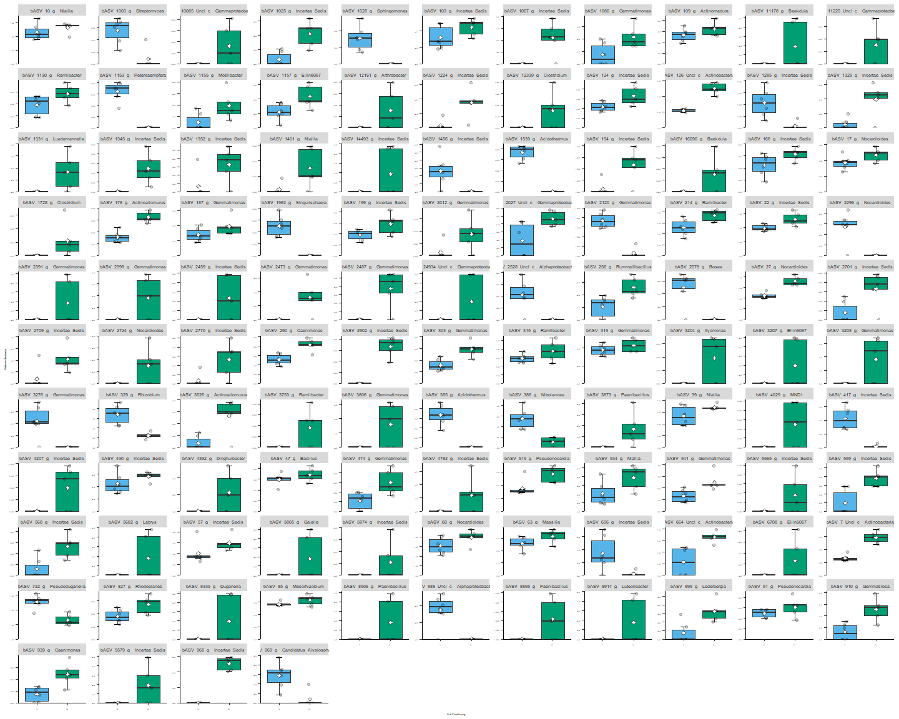<!-- -->


``` r
ggplot(ps_RA, 
       aes(y = ASV_Genus, x = Abundance, fill = Soil_conditioning)) +
  stat_boxplot(aes(x = Abundance, y = ASV_Genus), #Shows the error bars (should be added before box plots to have bars behind box plots)
               geom = "errorbar",
               position = position_dodge(0.75),
               linetype = 1,
               width = 0.2) +
  geom_boxplot(outliers = FALSE) +
  geom_jitter(position = position_jitterdodge(jitter.width = 0,    # horizontal jitter (x-direction)
                                              #jitter.height = 0.2, # vertical jitter (y-direction, since flipped)
                                              dodge.width = 0.75),   # match boxplot dodge width
              color = "black",
              alpha = 0.2) + # Transparency is regulated with the alpha argument
  stat_summary(aes(group = Soil_conditioning),
               fun = mean, 
               geom = "point",
               position = position_dodge(0.75),
               size = 1.5, 
               color = "gray30", 
               fill = "white",
               shape = 23) + #Shows the mean as a white dimond
  scale_x_continuous(expand = expansion(mult = c(0, 0.05))) +   # extra space (%) below and above min and max data point
  expand_limits(y = 0) + # start y axis at 0
  scale_fill_manual(values = c("#56B4E9", "#009E73"),
                    name = "Soil treatment") + # Manually change the colors of the bars. You need to define fill in second line of the plot script to 
  labs(y = "Differetnial Abundant ASVs",
       x = "Relative Abundance") + 
  theme(panel.background = element_rect(fill = "white"), #theme of the graph
        panel.border = element_blank(), #no border around the graph (for border, use: element_rect(color = "gray30", fill = NA))
        axis.line = element_line(), #show line for x and y axis
        plot.title = element_text(size = 9, hjust = 0),
        axis.text = element_text(size = 13, color = "black"),
        axis.title = element_text(size = 16),
        axis.title.x = element_text(vjust = -0.5),
        axis.title.y = element_text(vjust = 2.5), #, hjust = -0
        strip.text = element_text(size = 13),
        legend.position = "right")
```

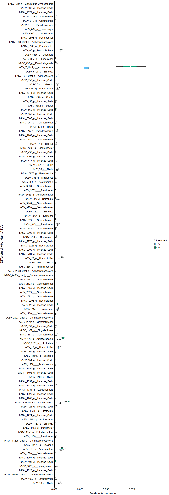<!-- -->

``` r
# Clean environment
rm(list = ls())
```

## ASVs detected by three DA tests

``` r
# load phyloseq object
load("C:/Users/kreek001/OneDrive - Wageningen University & Research/Chapters/Experimental Chapter 3/RScripts/GitHub/TwelveAccessionExperiment/MicrobiomeAnalysis/Data/Phyloseq_objects/FP_unnormalized_bac_ps_ForDA_clean.RData")

# load DA ASVs
load("C:/Users/kreek001/OneDrive - Wageningen University & Research/Chapters/Experimental Chapter 3/RScripts/GitHub/TwelveAccessionExperiment/MicrobiomeAnalysis/Data/Phyloseq_objects/FP_DA_SummaryFiles/SummaryFiles_ASVLevel/Acc_Bac_ThreeTimes_DA_ASV.RData")

## Calculate relative abundance
FP_unnormalized_bac_ps_ForDA_clean_RA <- transform_sample_counts(FP_unnormalized_bac_ps_ForDA_clean, function(x) x / sum(x))

# Subset phyloseq object
ps_RA <- prune_taxa(Acc_Bac_ThreeTimes_DA_ASV$VL, FP_unnormalized_bac_ps_ForDA_clean_RA)
ps_RA <- subset_samples(ps_RA, Accession == "VL")
tax_table(ps_RA)[ , 2:6]
```

```
## Taxonomy Table:     [20 taxa by 5 taxonomic ranks]:
##           Phylum               Class                   
## bASV_7    "p__Actinomycetota"  "c__Actinobacteria"     
## bASV_27   "p__Actinomycetota"  "c__Actinobacteria"     
## bASV_126  "p__Actinomycetota"  "c__Actinobacteria"     
## bASV_178  "p__Actinomycetota"  "c__Actinobacteria"     
## bASV_290  "p__Pseudomonadota"  "c__Gammaproteobacteria"
## bASV_303  "p__Gemmatimonadota" "c__Gemmatimonadia"     
## bASV_329  "p__Pseudomonadota"  "c__Alphaproteobacteria"
## bASV_385  "p__Actinomycetota"  "c__Actinobacteria"     
## bASV_386  "p__Chloroflexota"   "c__Chloroflexia"       
## bASV_417  "p__Chloroflexota"   "c__Chloroflexia"       
## bASV_732  "p__Pseudomonadota"  "c__Gammaproteobacteria"
## bASV_888  "p__Pseudomonadota"  "c__Alphaproteobacteria"
## bASV_968  "p__Actinomycetota"  "c__Thermoleophilia"    
## bASV_1028 "p__Pseudomonadota"  "c__Alphaproteobacteria"
## bASV_1153 "p__Actinomycetota"  "c__Actinobacteria"     
## bASV_1345 "p__Pseudomonadota"  "c__Gammaproteobacteria"
## bASV_1539 "p__Actinomycetota"  "c__Actinobacteria"     
## bASV_1962 "p__Planctomycetota" "c__Planctomycetes"     
## bASV_2120 "p__Gemmatimonadota" "c__Gemmatimonadia"     
## bASV_2578 "p__Pseudomonadota"  "c__Alphaproteobacteria"
##           Order                    Family                  
## bASV_7    "o__Streptosporangiales" NA                      
## bASV_27   "o__Propionibacteriales" "f__Nocardioidaceae"    
## bASV_126  "o__Streptosporangiales" NA                      
## bASV_178  "o__Streptosporangiales" "f__Thermomonosporaceae"
## bASV_290  "o__Burkholderiales"     "f__Comamonadaceae"     
## bASV_303  "o__Gemmatimonadales"    "f__Gemmatimonadaceae"  
## bASV_329  "o__Hyphomicrobiales"    "f__Rhizobiaceae"       
## bASV_385  "o__Frankiales"          "f__Acidothermaceae"    
## bASV_386  "o__Thermomicrobiales"   "f__Thermomicrobiaceae" 
## bASV_417  "o__Thermomicrobiales"   "f__JG30-KF-CM45"       
## bASV_732  "o__Burkholderiales"     "f__Oxalobacteraceae"   
## bASV_888  "o__Hyphomicrobiales"    "f__Devosiaceae"        
## bASV_968  "o__Gaiellales"          "f__Incertae_Sedis"     
## bASV_1028 "o__Sphingomonadales"    "f__Sphingomonadaceae"  
## bASV_1153 "o__Kitasatosporales"    "f__Streptomycetaceae"  
## bASV_1345 "o__Burkholderiales"     "f__Oxalobacteraceae"   
## bASV_1539 "o__Frankiales"          "f__Acidothermaceae"    
## bASV_1962 "o__Isosphaerales"       "f__Isosphaeraceae"     
## bASV_2120 "o__Gemmatimonadales"    "f__Gemmatimonadaceae"  
## bASV_2578 "o__Hyphomicrobiales"    "f__Beijerinckiaceae"   
##           Genus               
## bASV_7    NA                  
## bASV_27   "g__Nocardioides"   
## bASV_126  NA                  
## bASV_178  "g__Actinoallomurus"
## bASV_290  "g__Caenimonas"     
## bASV_303  "g__Gemmatimonas"   
## bASV_329  "g__Rhizobium"      
## bASV_385  "g__Acidothermus"   
## bASV_386  "g__Nitrolancea"    
## bASV_417  "g__Incertae_Sedis" 
## bASV_732  "g__Pseudoduganella"
## bASV_888  NA                  
## bASV_968  "g__Incertae_Sedis" 
## bASV_1028 "g__Sphingomonas"   
## bASV_1153 "g__Peterkaempfera" 
## bASV_1345 "g__Incertae_Sedis" 
## bASV_1539 "g__Acidothermus"   
## bASV_1962 "g__Singulisphaera" 
## bASV_2120 "g__Gemmatimonas"   
## bASV_2578 "g__Bosea"
```

``` r
## Phyloseq object to data frame with relative abundance, meta data and taxonomy
ps_RA <- psmelt(ps_RA)

# Identify rows where Genus is NA
na_genus <- is.na(ps_RA$Genus)

# Replace those NAs with "Unclassified_" + Class name
ps_RA$Genus[na_genus] <- paste0("Uncl_", ps_RA$Class[na_genus])
ps_RA$ASV_Genus <- paste(ps_RA$OTU, ps_RA$Genus, sep = "_")

#ps_RA_VLHM$Genus <- str_replace_all(ps_RA_VLHM$Genus, "g__", "") # remove g__
#ps_RA_VLHM$Genus <- str_replace_all(ps_RA_VLHM$Genus, "_c__", "\n") # remove c__
#ps_RA_VLHM[ps_RA_VLHM$OTU == "bASV_831", "OTU_Genus"] <- "bASV_831 Burkholderia- *"

## Change order of ASVs depending on difference between soil treatments
otu_means <- aggregate(Abundance ~ OTU + Soil_conditioning,
                       data = ps_RA,
                       FUN = mean)
otu_means <- reshape(otu_means, # Change configuration df
                     timevar = "Soil_conditioning",
                     idvar = "OTU",
                     direction = "wide")
otu_means$difference <- otu_means$Abundance.Mb - otu_means$Abundance.Co
ps_RA <- merge(ps_RA,
                otu_means[, c("OTU", "difference")],
                by = "OTU",
                all.x = TRUE)
ps_RA$Genus <- with(ps_RA, reorder(Genus, difference))
ps_RA$OTU <- with(ps_RA, reorder(OTU, -difference))
```


``` r
ggplot(ps_RA, 
       aes(x = Soil_conditioning, y = Abundance, fill = Soil_conditioning)) +
  facet_wrap(~ ASV_Genus, scales = "free_y"#,
             #labeller = as_labeller(otu_labels)
             ) +
  stat_boxplot(aes(y = Abundance, x = Soil_conditioning), #Shows the error bars (should be added before box plots to have bars behind box plots)
               geom = "errorbar",
               position = position_dodge(0.75),
               linetype = 1,
               width = 0.2) +
  geom_boxplot(outliers = FALSE) +
  geom_jitter(position = position_jitterdodge(jitter.width = 0.3,    # horizontal jitter (x-direction)
                                              jitter.height = 0, # vertical jitter (y-direction, since flipped)
                                              dodge.width = 0.75),   # match boxplot dodge width
              color = "black",
              alpha = 0.2) + # Transparency is regulated with the alpha argument
  stat_summary(aes(group = Soil_conditioning),
               fun = mean, 
               geom = "point", 
               position = position_dodge(0.75),
               size = 1.5, 
               color = "gray30", 
               fill = "white",
               shape = 23) + #Shows the mean as a white circle
  scale_y_continuous(expand = expansion(mult = c(0, 0.05))) +   # extra space (%) below and above min and max data point
  expand_limits(y = 0) + # start y axis at 0
  scale_fill_manual(values = c("#56B4E9", "#009E73"),
                    name = "Soil treatment",
                    labels = c("CTRL", ~italic("M. brassicae"))) +
  labs(y = "Relative Abundance",
       x = "Soil Conditioning") + 
  theme(panel.background = element_rect(fill = "white"), #theme of the graph
        panel.border = element_blank(), #no border around the graph (for border, use: element_rect(color = "gray30", fill = NA))
        axis.line = element_line(), #show line for x and y axis
        plot.title = element_text(size = 5, hjust = 0),
        axis.text = element_text(size = 5, color = "black"),
        axis.title = element_text(size = 10),
        axis.title.x = element_text(vjust = -0.5),
        axis.title.y = element_text(vjust = 2.5), #, hjust = -0
        strip.text = element_text(size = 8),
        legend.text = element_text(size = 13),
        legend.title = element_text(size = 15),
        legend.position = "none")
```

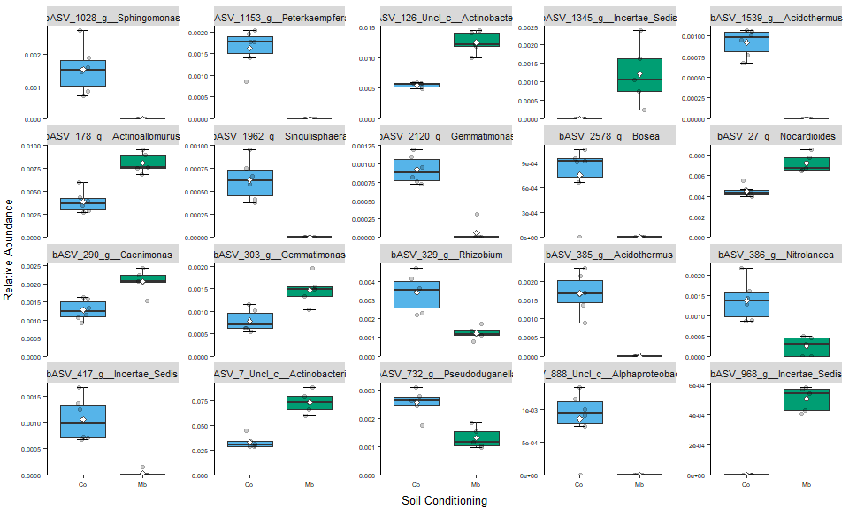<!-- -->


``` r
ggplot(ps_RA, 
       aes(y = ASV_Genus, x = Abundance, fill = Soil_conditioning)) +
  stat_boxplot(aes(x = Abundance, y = ASV_Genus), #Shows the error bars (should be added before box plots to have bars behind box plots)
               geom = "errorbar",
               position = position_dodge(0.75),
               linetype = 1,
               width = 0.2) +
  geom_boxplot(outliers = FALSE) +
  geom_jitter(position = position_jitterdodge(jitter.width = 0,    # horizontal jitter (x-direction)
                                              #jitter.height = 0.2, # vertical jitter (y-direction, since flipped)
                                              dodge.width = 0.75),   # match boxplot dodge width
              color = "black",
              alpha = 0.2) + # Transparency is regulated with the alpha argument
  stat_summary(aes(group = Soil_conditioning),
               fun = mean, 
               geom = "point",
               position = position_dodge(0.75),
               size = 1.5, 
               color = "gray30", 
               fill = "white",
               shape = 23) + #Shows the mean as a white dimond
  scale_x_continuous(expand = expansion(mult = c(0, 0.05))) +   # extra space (%) below and above min and max data point
  expand_limits(y = 0) + # start y axis at 0
  scale_fill_manual(values = c("#56B4E9", "#009E73"),
                    name = "Soil treatment") + # Manually change the colors of the bars. You need to define fill in second line of the plot script to 
  labs(y = "Differetnial Abundant ASVs",
       x = "Relative Abundance") + 
  theme(panel.background = element_rect(fill = "white"), #theme of the graph
        panel.border = element_blank(), #no border around the graph (for border, use: element_rect(color = "gray30", fill = NA))
        axis.line = element_line(), #show line for x and y axis
        plot.title = element_text(size = 9, hjust = 0),
        axis.text = element_text(size = 13, color = "black"),
        axis.title = element_text(size = 16),
        axis.title.x = element_text(vjust = -0.5),
        axis.title.y = element_text(vjust = 2.5), #, hjust = -0
        strip.text = element_text(size = 13),
        legend.position = "right")
```

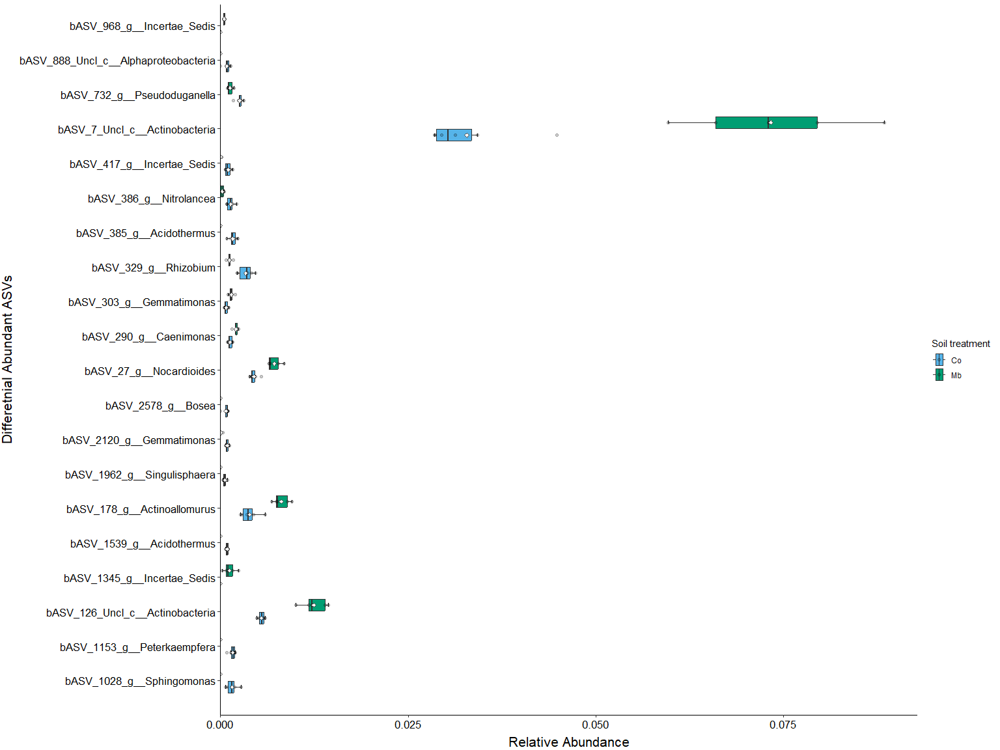<!-- -->

``` r
# Clean environment
rm(list = ls())
```


## ASVs detected filtered based on log2fold change
ASVs detected by two tests and ancomWZ used for log2fold change

### Data preperation

``` r
# load phyloseq object
load("C:/Users/kreek001/OneDrive - Wageningen University & Research/Chapters/Experimental Chapter 3/RScripts/GitHub/TwelveAccessionExperiment/MicrobiomeAnalysis/Data/Phyloseq_objects/FP_unnormalized_bac_ps_ForDA_clean.RData")

# load DA ASVs
load("C:/Users/kreek001/OneDrive - Wageningen University & Research/Chapters/Experimental Chapter 3/RScripts/GitHub/TwelveAccessionExperiment/MicrobiomeAnalysis/Data/Phyloseq_objects/FP_DA_SummaryFiles/SummaryFiles_ASVLevel/Acc_Bac_TwoTimes_DA_ASV.RData")

# load log2fold change values
load(file = "C:/Users/kreek001/OneDrive - Wageningen University & Research/Chapters/Experimental Chapter 3/RScripts/GitHub/TwelveAccessionExperiment/MicrobiomeAnalysis/Data/Phyloseq_objects/FP_DA_Ancom_ASVLevel/ancomWZ_Bac_Acc.RData")

# Calculate relative abundance
FP_unnormalized_bac_ps_ForDA_clean_RA <- transform_sample_counts(FP_unnormalized_bac_ps_ForDA_clean, function(x) x / sum(x))

# number of ASVs with large log2Fold change
summary(ancomWZ_Bac_Acc$VL$res$lfc$Soil_conditioningMb)
```

```
##    Min. 1st Qu.  Median    Mean 3rd Qu.    Max. 
## -3.3313 -0.1444  0.2597  0.2104  0.5512  3.3427
```

``` r
length(ancomWZ_Bac_Acc$VL$res$lfc[abs(ancomWZ_Bac_Acc$VL$res$lfc$Soil_conditioningMb) > 1, "Soil_conditioningMb" ])
```

```
## [1] 346
```

``` r
length(ancomWZ_Bac_Acc$VL$res$lfc[(ancomWZ_Bac_Acc$VL$res$lfc$Soil_conditioningMb) > 2, "Soil_conditioningMb" ])
```

```
## [1] 14
```

``` r
length(ancomWZ_Bac_Acc$VL$res$lfc[(ancomWZ_Bac_Acc$VL$res$lfc$Soil_conditioningMb) < -2, "Soil_conditioningMb" ])
```

```
## [1] 11
```

``` r
length(ancomWZ_Bac_Acc$VL$res$lfc[(ancomWZ_Bac_Acc$VL$res$lfc$Soil_conditioningMb) > 2.5, "Soil_conditioningMb" ])
```

```
## [1] 4
```

``` r
length(ancomWZ_Bac_Acc$VL$res$lfc[(ancomWZ_Bac_Acc$VL$res$lfc$Soil_conditioningMb) < -2.5, "Soil_conditioningMb" ])
```

```
## [1] 6
```

``` r
length(ancomWZ_Bac_Acc$VL$res$lfc[(ancomWZ_Bac_Acc$VL$res$lfc$Soil_conditioningMb) > 3, "Soil_conditioningMb" ])
```

```
## [1] 1
```

``` r
length(ancomWZ_Bac_Acc$VL$res$lfc[(ancomWZ_Bac_Acc$VL$res$lfc$Soil_conditioningMb) < -3, "Soil_conditioningMb" ])
```

```
## [1] 3
```

``` r
# ASVs with a log2fold change larger than 2.5 or smaller than -2.5
ancomWZ_Bac_Acc_lfc_2.5 <- ancomWZ_Bac_Acc$VL$res$lfc[abs(ancomWZ_Bac_Acc$VL$res$lfc$Soil_conditioningMb) > 2.5, ]
VL_lfc_2.5_ancomWZ_DA_ASV <- ancomWZ_Bac_Acc_lfc_2.5$taxon
save(VL_lfc_2.5_ancomWZ_DA_ASV, file = "C:/Users/kreek001/OneDrive - Wageningen University & Research/Chapters/Experimental Chapter 3/RScripts/GitHub/TwelveAccessionExperiment/MicrobiomeAnalysis/Data/Phyloseq_objects/FP_DA_SummaryFiles/SummaryFiles_ASVLevel/VL_lfc_2.5_ancomWZ_DA_ASV.RData")


# ASVs with a log2fold change larger than 3 or smaller than -3
ancomWZ_Bac_Acc_lfc_3 <- ancomWZ_Bac_Acc$VL$res$lfc[abs(ancomWZ_Bac_Acc$VL$res$lfc$Soil_conditioningMb) > 3, ]
VL_lfc_3_ancomWZ_DA_ASV <- ancomWZ_Bac_Acc_lfc_3$taxon
save(VL_lfc_3_ancomWZ_DA_ASV, file = "C:/Users/kreek001/OneDrive - Wageningen University & Research/Chapters/Experimental Chapter 3/RScripts/GitHub/TwelveAccessionExperiment/MicrobiomeAnalysis/Data/Phyloseq_objects/FP_DA_SummaryFiles/SummaryFiles_ASVLevel/VL_lfc_3_ancomWZ_DA_ASV.RData")

# Subset phyloseq object
ps_RA <- subset_samples(FP_unnormalized_bac_ps_ForDA_clean_RA, Accession == "VL")
ps_RA_lfc_2.5 <- prune_taxa(ancomWZ_Bac_Acc_lfc_2.5$taxon, ps_RA)
ps_RA_lfc_3 <- prune_taxa(ancomWZ_Bac_Acc_lfc_3$taxon, ps_RA)
tax_table(ps_RA_lfc_2.5)[ , 2:6]
```

```
## Taxonomy Table:     [10 taxa by 5 taxonomic ranks]:
##           Phylum              Class                    Order                   
## bASV_385  "p__Actinomycetota" "c__Actinobacteria"      "o__Frankiales"         
## bASV_417  "p__Chloroflexota"  "c__Chloroflexia"        "o__Thermomicrobiales"  
## bASV_560  "p__Chloroflexota"  "c__Chloroflexia"        "o__Chloroflexales"     
## bASV_664  "p__Actinomycetota" "c__Actinobacteria"      "o__Streptosporangiales"
## bASV_968  "p__Actinomycetota" "c__Thermoleophilia"     "o__Gaiellales"         
## bASV_1003 "p__Actinomycetota" "c__Actinobacteria"      "o__Kitasatosporales"   
## bASV_1028 "p__Pseudomonadota" "c__Alphaproteobacteria" "o__Sphingomonadales"   
## bASV_1153 "p__Actinomycetota" "c__Actinobacteria"      "o__Kitasatosporales"   
## bASV_1345 "p__Pseudomonadota" "c__Gammaproteobacteria" "o__Burkholderiales"    
## bASV_1539 "p__Actinomycetota" "c__Actinobacteria"      "o__Frankiales"         
##           Family                 Genus              
## bASV_385  "f__Acidothermaceae"   "g__Acidothermus"  
## bASV_417  "f__JG30-KF-CM45"      "g__Incertae_Sedis"
## bASV_560  "f__Roseiflexaceae"    "g__Incertae_Sedis"
## bASV_664  NA                     NA                 
## bASV_968  "f__Incertae_Sedis"    "g__Incertae_Sedis"
## bASV_1003 "f__Streptomycetaceae" "g__Streptomyces"  
## bASV_1028 "f__Sphingomonadaceae" "g__Sphingomonas"  
## bASV_1153 "f__Streptomycetaceae" "g__Peterkaempfera"
## bASV_1345 "f__Oxalobacteraceae"  "g__Incertae_Sedis"
## bASV_1539 "f__Acidothermaceae"   "g__Acidothermus"
```

``` r
tax_table(ps_RA_lfc_3)[ , 2:6]
```

```
## Taxonomy Table:     [4 taxa by 5 taxonomic ranks]:
##           Phylum              Class                    Order                
## bASV_385  "p__Actinomycetota" "c__Actinobacteria"      "o__Frankiales"      
## bASV_1028 "p__Pseudomonadota" "c__Alphaproteobacteria" "o__Sphingomonadales"
## bASV_1153 "p__Actinomycetota" "c__Actinobacteria"      "o__Kitasatosporales"
## bASV_1345 "p__Pseudomonadota" "c__Gammaproteobacteria" "o__Burkholderiales" 
##           Family                 Genus              
## bASV_385  "f__Acidothermaceae"   "g__Acidothermus"  
## bASV_1028 "f__Sphingomonadaceae" "g__Sphingomonas"  
## bASV_1153 "f__Streptomycetaceae" "g__Peterkaempfera"
## bASV_1345 "f__Oxalobacteraceae"  "g__Incertae_Sedis"
```

``` r
## Phyloseq object to data frame with relative abundance, meta data and taxonomy
ps_RA_lfc_2.5 <- psmelt(ps_RA_lfc_2.5)
ps_RA_lfc_3 <- psmelt(ps_RA_lfc_3)

# Identify rows where Genus is NA
na_genus_2.5 <- is.na(ps_RA_lfc_2.5$Genus)
na_genus_3 <- is.na(ps_RA_lfc_3$Genus)

# Replace those NAs with "Unclassified_" + Class name for 2.5
ps_RA_lfc_2.5$Genus[na_genus_2.5] <- paste0("Uncl_", ps_RA_lfc_2.5$Class[na_genus_2.5])
ps_RA_lfc_2.5$ASV_Genus <- paste(ps_RA_lfc_2.5$OTU, ps_RA_lfc_2.5$Genus, sep = "_")

## Change order of ASVs depending on difference between soil treatments for 2.5
otu_means <- aggregate(Abundance ~ OTU + Soil_conditioning,
                       data = ps_RA_lfc_2.5,
                       FUN = mean)
otu_means <- reshape(otu_means, # Change configuration df
                     timevar = "Soil_conditioning",
                     idvar = "OTU",
                     direction = "wide")
otu_means$difference <- otu_means$Abundance.Mb - otu_means$Abundance.Co
ps_RA_lfc_2.5 <- merge(ps_RA_lfc_2.5,
                otu_means[, c("OTU", "difference")],
                by = "OTU",
                all.x = TRUE)
ps_RA_lfc_2.5$Genus <- with(ps_RA_lfc_2.5, reorder(Genus, difference))
ps_RA_lfc_2.5$OTU <- with(ps_RA_lfc_2.5, reorder(OTU, -difference))

# Replace those NAs with "Unclassified_" + Class name for 3
ps_RA_lfc_3$Genus[na_genus_3] <- paste0("Uncl_", ps_RA_lfc_3$Class[na_genus_3])
ps_RA_lfc_3$ASV_Genus <- paste(ps_RA_lfc_3$OTU, ps_RA_lfc_3$Genus, sep = "_")

## Change order of ASVs depending on difference between soil treatments for 3
otu_means <- aggregate(Abundance ~ OTU + Soil_conditioning,
                       data = ps_RA_lfc_3,
                       FUN = mean)
otu_means <- reshape(otu_means, # Change configuration df
                     timevar = "Soil_conditioning",
                     idvar = "OTU",
                     direction = "wide")
otu_means$difference <- otu_means$Abundance.Mb - otu_means$Abundance.Co
ps_RA_lfc_3 <- merge(ps_RA_lfc_3,
                otu_means[, c("OTU", "difference")],
                by = "OTU",
                all.x = TRUE)
ps_RA_lfc_3$Genus <- with(ps_RA_lfc_3, reorder(Genus, difference))
ps_RA_lfc_3$OTU <- with(ps_RA_lfc_3, reorder(OTU, -difference))
```

### Grapth lfc of 2.5

``` r
ggplot(ps_RA_lfc_2.5,
       aes(x = Soil_conditioning, y = Abundance, fill = Soil_conditioning)) +
  facet_wrap(~ ASV_Genus, scales = "free_y"#,
             #labeller = as_labeller(otu_labels)
             ) +
  stat_boxplot(aes(y = Abundance, x = Soil_conditioning), #Shows the error bars (should be added before box plots to have bars behind box plots)
               geom = "errorbar",
               position = position_dodge(0.75),
               linetype = 1,
               width = 0.2) +
  geom_boxplot(outliers = FALSE) +
  geom_jitter(position = position_jitterdodge(jitter.width = 0.3,    # horizontal jitter (x-direction)
                                              jitter.height = 0, # vertical jitter (y-direction, since flipped)
                                              dodge.width = 0.75),   # match boxplot dodge width
              color = "black",
              alpha = 0.2) + # Transparency is regulated with the alpha argument
  stat_summary(aes(group = Soil_conditioning),
               fun = mean, 
               geom = "point", 
               position = position_dodge(0.75),
               size = 1.5, 
               color = "gray30", 
               fill = "white",
               shape = 23) + #Shows the mean as a white circle
  scale_y_continuous(expand = expansion(mult = c(0, 0.05))) +   # extra space (%) below and above min and max data point
  expand_limits(y = 0) + # start y axis at 0
  scale_fill_manual(values = c("#56B4E9", "#009E73"),
                    name = "Soil treatment",
                    labels = c("CTRL", ~italic("M. brassicae"))) +
  labs(y = "Relative Abundance",
       x = "Soil Conditioning") + 
  theme(panel.background = element_rect(fill = "white"), #theme of the graph
        panel.border = element_blank(), #no border around the graph (for border, use: element_rect(color = "gray30", fill = NA))
        axis.line = element_line(), #show line for x and y axis
        plot.title = element_text(size = 5, hjust = 0),
        axis.text = element_text(size = 7, color = "black"),
        axis.title = element_text(size = 12),
        axis.title.x = element_text(vjust = -0.5),
        axis.title.y = element_text(vjust = 2.5), #, hjust = -0
        strip.text = element_text(size = 8),
        legend.text = element_text(size = 12),
        legend.title = element_text(size = 12),
        legend.position = c(0.9, 0.1))
```

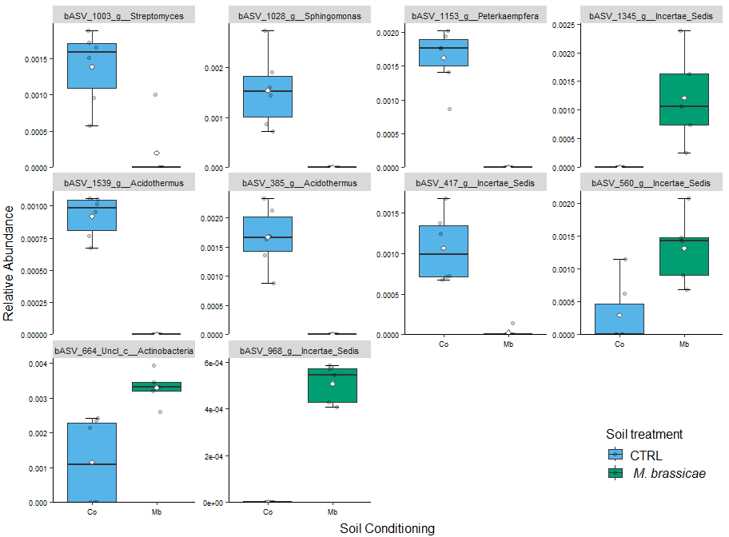<!-- -->


``` r
ggplot(ps_RA_lfc_2.5, 
       aes(y = ASV_Genus, x = Abundance, fill = Soil_conditioning)) +
  stat_boxplot(aes(x = Abundance, y = ASV_Genus), #Shows the error bars (should be added before box plots to have bars behind box plots)
               geom = "errorbar",
               position = position_dodge(0.75),
               linetype = 1,
               width = 0.2) +
  geom_boxplot(outliers = FALSE) +
  geom_jitter(position = position_jitterdodge(jitter.width = 0,    # horizontal jitter (x-direction)
                                              #jitter.height = 0.2, # vertical jitter (y-direction, since flipped)
                                              dodge.width = 0.75),   # match boxplot dodge width
              color = "black",
              alpha = 0.2) + # Transparency is regulated with the alpha argument
  stat_summary(aes(group = Soil_conditioning),
               fun = mean, 
               geom = "point",
               position = position_dodge(0.75),
               size = 1.5, 
               color = "gray30", 
               fill = "white",
               shape = 23) + #Shows the mean as a white dimond
  scale_x_continuous(expand = expansion(mult = c(0, 0.05))) +   # extra space (%) below and above min and max data point
  expand_limits(y = 0) + # start y axis at 0
  scale_fill_manual(values = c("#56B4E9", "#009E73"),
                    name = "Soil treatment") + # Manually change the colors of the bars. You need to define fill in second line of the plot script to 
  labs(y = "Differetnial Abundant ASVs",
       x = "Relative Abundance") + 
  theme(panel.background = element_rect(fill = "white"), #theme of the graph
        panel.border = element_blank(), #no border around the graph (for border, use: element_rect(color = "gray30", fill = NA))
        axis.line = element_line(), #show line for x and y axis
        plot.title = element_text(size = 9, hjust = 0),
        axis.text = element_text(size = 13, color = "black"),
        axis.title = element_text(size = 16),
        axis.title.x = element_text(vjust = -0.5),
        axis.title.y = element_text(vjust = 2.5), #, hjust = -0
        strip.text = element_text(size = 13),
        legend.position = "right")
```

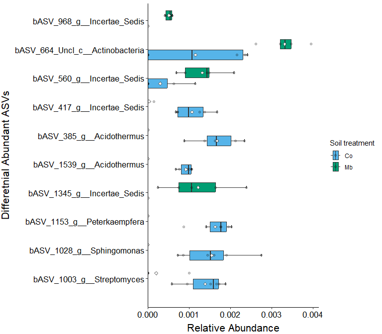<!-- -->

### Grapth lfc of 3

``` r
ggplot(ps_RA_lfc_3,
       aes(x = Soil_conditioning, y = Abundance, fill = Soil_conditioning)) +
  facet_wrap(~ ASV_Genus, scales = "free_y"#,
             #labeller = as_labeller(otu_labels)
             ) +
  stat_boxplot(aes(y = Abundance, x = Soil_conditioning), #Shows the error bars (should be added before box plots to have bars behind box plots)
               geom = "errorbar",
               position = position_dodge(0.75),
               linetype = 1,
               width = 0.2) +
  geom_boxplot(outliers = FALSE) +
  geom_jitter(position = position_jitterdodge(jitter.width = 0.3,    # horizontal jitter (x-direction)
                                              jitter.height = 0, # vertical jitter (y-direction, since flipped)
                                              dodge.width = 0.75),   # match boxplot dodge width
              color = "black",
              alpha = 0.2) + # Transparency is regulated with the alpha argument
  stat_summary(aes(group = Soil_conditioning),
               fun = mean, 
               geom = "point", 
               position = position_dodge(0.75),
               size = 1.5, 
               color = "gray30", 
               fill = "white",
               shape = 23) + #Shows the mean as a white circle
  scale_y_continuous(expand = expansion(mult = c(0, 0.05))) +   # extra space (%) below and above min and max data point
  expand_limits(y = 0) + # start y axis at 0
  scale_fill_manual(values = c("#56B4E9", "#009E73"),
                    name = "Soil treatment",
                    labels = c("CTRL", ~italic("M. brassicae"))) +
  labs(y = "Relative Abundance",
       x = "Soil Conditioning") + 
  theme(panel.background = element_rect(fill = "white"), #theme of the graph
        panel.border = element_blank(), #no border around the graph (for border, use: element_rect(color = "gray30", fill = NA))
        axis.line = element_line(), #show line for x and y axis
        plot.title = element_text(size = 5, hjust = 0),
        axis.text = element_text(size = 10, color = "black"),
        axis.title = element_text(size = 12),
        axis.title.x = element_text(vjust = -0.5),
        axis.title.y = element_text(vjust = 2.5), #, hjust = -0
        strip.text = element_text(size = 8),
        legend.text = element_text(size = 12),
        legend.title = element_text(size = 12),
        legend.position = "right")
```

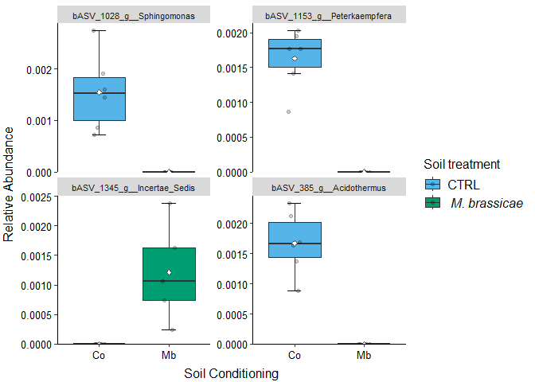<!-- -->


``` r
ggplot(ps_RA_lfc_3, 
       aes(y = ASV_Genus, x = Abundance, fill = Soil_conditioning)) +
  stat_boxplot(aes(x = Abundance, y = ASV_Genus), #Shows the error bars (should be added before box plots to have bars behind box plots)
               geom = "errorbar",
               position = position_dodge(0.75),
               linetype = 1,
               width = 0.2) +
  geom_boxplot(outliers = FALSE) +
  geom_jitter(position = position_jitterdodge(jitter.width = 0,    # horizontal jitter (x-direction)
                                              #jitter.height = 0.2, # vertical jitter (y-direction, since flipped)
                                              dodge.width = 0.75),   # match boxplot dodge width
              color = "black",
              alpha = 0.2) + # Transparency is regulated with the alpha argument
  stat_summary(aes(group = Soil_conditioning),
               fun = mean, 
               geom = "point",
               position = position_dodge(0.75),
               size = 1.5, 
               color = "gray30", 
               fill = "white",
               shape = 23) + #Shows the mean as a white dimond
  scale_x_continuous(expand = expansion(mult = c(0, 0.05))) +   # extra space (%) below and above min and max data point
  expand_limits(y = 0) + # start y axis at 0
  scale_fill_manual(values = c("#56B4E9", "#009E73"),
                    name = "Soil treatment") + # Manually change the colors of the bars. You need to define fill in second line of the plot script to 
  labs(y = "Differetnial Abundant ASVs",
       x = "Relative Abundance") + 
  theme(panel.background = element_rect(fill = "white"), #theme of the graph
        panel.border = element_blank(), #no border around the graph (for border, use: element_rect(color = "gray30", fill = NA))
        axis.line = element_line(), #show line for x and y axis
        plot.title = element_text(size = 9, hjust = 0),
        axis.text = element_text(size = 13, color = "black"),
        axis.title = element_text(size = 16),
        axis.title.x = element_text(vjust = -0.5),
        axis.title.y = element_text(vjust = 2.5), #, hjust = -0
        strip.text = element_text(size = 13),
        legend.position = "right")
```

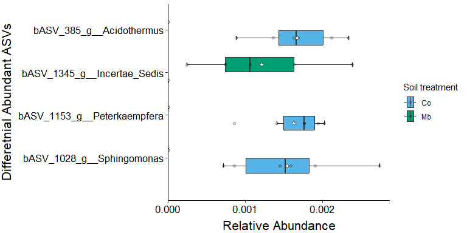<!-- -->

``` r
# Clean environment
rm(list = ls())
```
