This script is adapted from a script form Melissa Uribe Acosta. Extra input comes from a script of Pedro Beschore da Costa.   
   
   
Tutorials   
- [Heatmap for final plot](http://rstudio-pubs-static.s3.amazonaws.com/288398_185f2889a5f641c6b9aa7b14fa15b635.html)
- [Excamples of pheatmap package](https://davetang.github.io/muse/pheatmap.html)   
   
   
# 6.0 load libraries, improve memory use and subset objects for the desired treatment comparisons
### Load libraries

``` r
R.version$version.string # prints R version
```

```
## [1] "R version 4.5.1 (2025-06-13 ucrt)"
```

``` r
library(phyloseq)
packageVersion("phyloseq")
```

```
## [1] '1.52.0'
```

``` r
library(pheatmap)
packageVersion("pheatmap")
```

```
## [1] '1.0.13'
```


# 6.1 ASVs correlating with Cat weight HM only negative correlations
DA ASVs of HM that correlate with caterpillar weight on the accession HM.

## 6.1.1 Correlation p value < 0.05
### Load data

``` r
# load phyloseq object
load("C:/Users/kreek001/OneDrive - Wageningen University & Research/Chapters/Experimental Chapter 3/RScripts/GitHub/TwelveAccessionExperiment/MicrobiomeAnalysis/Data/Phyloseq_objects/FP_unnormalized_bac_ps_ForDA_clean.RData")

# load correlating DA ASVs
load(file = "C:/Users/kreek001/OneDrive - Wageningen University & Research/Chapters/Experimental Chapter 3/RScripts/GitHub/TwelveAccessionExperiment/MicrobiomeAnalysis/Data/Phyloseq_objects/FP_DA_CorrAnlysis/DAASVs_SpCorr_ASVCatPerf_HM.RData")

# load log2fold change values
load(file = "C:/Users/kreek001/OneDrive - Wageningen University & Research/Chapters/Experimental Chapter 3/RScripts/GitHub/TwelveAccessionExperiment/MicrobiomeAnalysis/Data/Phyloseq_objects/FP_DA_Ancom_ASVLevel/ancomWZ_Bac_Acc.RData")
```

### Combine DA ASVs per accession

``` r
ASVs <- DAASVs_SpCorr_ASVCatPerf_HM$ASVs_0.05_neg

# Filter log2fold change for DA ASVs per accession
lfc_table <- ancomWZ_Bac_Acc$HM$res$lfc
rownames(lfc_table) <- lfc_table$taxon
lfc_table <- lfc_table[lfc_table$taxon %in% ASVs, "Soil_conditioningMb", drop = FALSE]
lfc_table$ASV <- rownames(lfc_table)
colnames(lfc_table)[1] <- paste0("HM")
lfc_table
```

```
##                  HM       ASV
## bASV_45   0.4079824   bASV_45
## bASV_254  1.9640465  bASV_254
## bASV_363  1.7803907  bASV_363
## bASV_410  1.5591702  bASV_410
## bASV_557  1.8182156  bASV_557
## bASV_1071 1.7974984 bASV_1071
## bASV_1908 1.9577054 bASV_1908
## bASV_2378 1.8193746 bASV_2378
## bASV_2650 1.0996968 bASV_2650
## bASV_2867 1.6633499 bASV_2867
## bASV_3348 3.1164098 bASV_3348
```

``` r
#rownames(AllAcc_lfc) <- AllAcc_lfc$ASV
#AllAcc_lfc$ASV <- NULL
```

### Prepare taxonomy column class and phylum

``` r
# Only keep DA in ps object
FP_unnormalized_bac_ps_ForDA_clean <- prune_taxa(ASVs, FP_unnormalized_bac_ps_ForDA_clean)

# Phyloseq object to data frame with relative abundance, meta data and taxonomy. Each row is a ASV-sample combination
df_clean <- psmelt(FP_unnormalized_bac_ps_ForDA_clean)
head(df_clean[, c(1:9, 95:101)], 12)
```

```
##           OTU Sample Abundance Phase_PSF SampleNr Accession Domestication
## 964  bASV_557   F026       463        FP       26        CD    Cultivated
## 992  bASV_557   F006       245        FP        6        CD    Cultivated
## 688  bASV_363   F197       181        FP      197        HM    Cultivated
## 1003 bASV_557   F007       172        FP        7        CD    Cultivated
## 961  bASV_557   F010       171        FP       10        CD    Cultivated
## 981  bASV_557   F005       169        FP        5        CD    Cultivated
## 695  bASV_363   F193       164        FP      193        HM    Cultivated
## 691  bASV_363   F009       163        FP        9        CD    Cultivated
## 985  bASV_557   F009       148        FP        9        CD    Cultivated
## 1000 bASV_557   F018       129        FP       18        CD    Cultivated
## 739  bASV_363   F456       126        FP      456        VL          Wild
## 689  bASV_363   F040       121        FP       40        CD    Cultivated
##      Cat_treatment Soil_conditioning     Kingdom            Phylum
## 964             Mb                Mb k__Bacteria p__Pseudomonadota
## 992             Mb                Co k__Bacteria p__Pseudomonadota
## 688             Mb                Mb k__Bacteria p__Pseudomonadota
## 1003            Mb                Co k__Bacteria p__Pseudomonadota
## 961             Mb                Co k__Bacteria p__Pseudomonadota
## 981             Mb                Co k__Bacteria p__Pseudomonadota
## 695             Mb                Mb k__Bacteria p__Pseudomonadota
## 691             Mb                Co k__Bacteria p__Pseudomonadota
## 985             Mb                Co k__Bacteria p__Pseudomonadota
## 1000            Mb                Co k__Bacteria p__Pseudomonadota
## 739             Mb                Co k__Bacteria p__Pseudomonadota
## 689             Mb                Mb k__Bacteria p__Pseudomonadota
##                       Class              Order                Family
## 964  c__Gammaproteobacteria o__Burkholderiales     f__Comamonadaceae
## 992  c__Gammaproteobacteria o__Burkholderiales     f__Comamonadaceae
## 688  c__Gammaproteobacteria  o__Lysobacterales f__Rhodanobacteraceae
## 1003 c__Gammaproteobacteria o__Burkholderiales     f__Comamonadaceae
## 961  c__Gammaproteobacteria o__Burkholderiales     f__Comamonadaceae
## 981  c__Gammaproteobacteria o__Burkholderiales     f__Comamonadaceae
## 695  c__Gammaproteobacteria  o__Lysobacterales f__Rhodanobacteraceae
## 691  c__Gammaproteobacteria  o__Lysobacterales f__Rhodanobacteraceae
## 985  c__Gammaproteobacteria o__Burkholderiales     f__Comamonadaceae
## 1000 c__Gammaproteobacteria o__Burkholderiales     f__Comamonadaceae
## 739  c__Gammaproteobacteria  o__Lysobacterales f__Rhodanobacteraceae
## 689  c__Gammaproteobacteria  o__Lysobacterales f__Rhodanobacteraceae
##                Genus Species
## 964  g__Unclassified    <NA>
## 992  g__Unclassified    <NA>
## 688    g__Tahibacter     s__
## 1003 g__Unclassified    <NA>
## 961  g__Unclassified    <NA>
## 981  g__Unclassified    <NA>
## 695    g__Tahibacter     s__
## 691    g__Tahibacter     s__
## 985  g__Unclassified    <NA>
## 1000 g__Unclassified    <NA>
## 739    g__Tahibacter     s__
## 689    g__Tahibacter     s__
```

``` r
# Extract unique ASV–Class-Phylum mapping
tax <- df_clean[!duplicated(df_clean$OTU), c("OTU", "Genus", "Family", "Order",  "Class", "Phylum")]

# Row names must match heat map rows
rownames(tax) <- tax$OTU
tax$OTU <- NULL
head(tax)
```

```
##                               Genus                Family               Order
## bASV_557            g__Unclassified     f__Comamonadaceae  o__Burkholderiales
## bASV_363              g__Tahibacter f__Rhodanobacteraceae   o__Lysobacterales
## bASV_45   g__Pedococcus-Phycicoccus f__Intrasporangiaceae    o__Micrococcales
## bASV_3348               g__Azospira     f__Rhodocyclaceae  o__Burkholderiales
## bASV_254           g__Angustibacter    f__Kineosporiaceae   o__Kineosporiales
## bASV_1908           g__Gemmatimonas  f__Gemmatimonadaceae o__Gemmatimonadales
##                            Class             Phylum
## bASV_557  c__Gammaproteobacteria  p__Pseudomonadota
## bASV_363  c__Gammaproteobacteria  p__Pseudomonadota
## bASV_45        c__Actinobacteria  p__Actinomycetota
## bASV_3348 c__Gammaproteobacteria  p__Pseudomonadota
## bASV_254       c__Actinobacteria  p__Actinomycetota
## bASV_1908      c__Gemmatimonadia p__Gemmatimonadota
```

``` r
# Add genus to matrix
AllAcc_lfc2 <- lfc_table
AllAcc_lfc2$ASV <- rownames(AllAcc_lfc2)
tax$ASV <- rownames(tax)
AllAcc_lfc2 <- merge(tax, AllAcc_lfc2, ID = "ASV")

# Replace NAs and Incertae Sedis by higher taxonomic levels
taxon <- AllAcc_lfc2$Genus
taxon[is.na(taxon)] <- AllAcc_lfc2$Family[is.na(taxon)]
taxon[is.na(taxon)] <- AllAcc_lfc2$Order[is.na(taxon)]

taxon[taxon == "g__Incertae_Sedis"] <- AllAcc_lfc2$Family[taxon == "g__Incertae_Sedis"]
taxon[taxon == "f__Incertae_Sedis"] <- AllAcc_lfc2$Order[taxon == "f__Incertae_Sedis"]
taxon[taxon == "o__Incertae_Sedis"] <- AllAcc_lfc2$Class[taxon == "o__Incertae_Sedis"]

taxon[taxon == "g__Unclassified"] <- AllAcc_lfc2$Family[taxon == "g__Unclassified"]
taxon[taxon == "f__Unclassified"] <- AllAcc_lfc2$Order[taxon == "f__Unclassified"]
taxon[taxon == "o__Unclassified"] <- AllAcc_lfc2$Class[taxon == "o__Unclassified"]


rownames(AllAcc_lfc2) <- paste(AllAcc_lfc2$ASV, taxon, sep = "_")

# Subset data
tax <- AllAcc_lfc2[1:6]
AllAcc_lfc2 <- AllAcc_lfc2[7]
head(AllAcc_lfc2)
```

```
##                                 HM
## bASV_1071_g__Lysobacter   1.797498
## bASV_1908_g__Gemmatimonas 1.957705
## bASV_2378_f__Rhizobiaceae 1.819375
## bASV_254_g__Angustibacter 1.964047
## bASV_2650_g__Chryseolinea 1.099697
## bASV_2867_g__Rhizobacter  1.663350
```

``` r
# Make color pallet for class
classes <- unique(tax$Class)
class_colors <- setNames(rainbow(length(classes)), classes)
class_colors <- list(Class = class_colors)

# Make color pallet for class
phylums <- unique(tax$Phylum)
phylums_colors <- setNames(rainbow(length(phylums)), phylums)
phylums_colors <- list(Phylum = phylums_colors)

# Make color pallet for Phylum for genus in plot
tax2 <- tax
phylums2 <- unique(tax2$Phylum)
phylums_colors2 <- setNames(rainbow(length(phylums2)), phylums2)
phylums_colors2 <- list(Phylum = phylums_colors2)

# Make color pallet for class for genus in plot
class2 <- unique(tax2$Class)
class_colors2 <- setNames(rainbow(length(class2)), class2)
class_colors2 <- list(Class = class_colors2)

# Turn data frame into a matrix
lfc_table$ASV <- NULL
AllAcc_lfc <- as.matrix(lfc_table)
AllAcc_lfc2 <- as.matrix(AllAcc_lfc2)

# replace NAs by 0s
AllAcc_lfc_clu <- lfc_table
AllAcc_lfc2_clu <- AllAcc_lfc2
AllAcc_lfc_clu[is.na(AllAcc_lfc_clu)] <- 0
AllAcc_lfc2_clu[is.na(AllAcc_lfc2_clu)] <- 0
```

### Heatmap 

``` r
#6
max_abs <- max(abs(AllAcc_lfc), na.rm = TRUE)
pheatmap(AllAcc_lfc2,
          clustering_distance_rows = dist(AllAcc_lfc2_clu),
          cluster_cols = FALSE,
          color = colorRampPalette(c("blue", "white", "red"))(50),
          breaks = seq(-max_abs, max_abs, length.out = 51),
          #main = "Differentially abundant taxa (log2FC by Family)",
          fontsize_row = 10,
          fontsize_col = 14,
          na_col = "grey90",
          angle_col = 90, 
          annotation_row = tax2["Phylum"],
          annotation_colors = phylums_colors2)
```

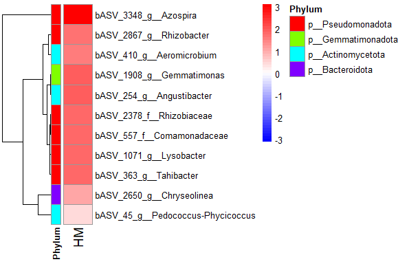<!-- -->

``` r
#6
pheatmap(AllAcc_lfc2,
          clustering_distance_rows = dist(AllAcc_lfc2_clu),
          cluster_cols = FALSE,
          color = colorRampPalette(c("blue", "white", "red"))(50),
          breaks = seq(-max_abs, max_abs, length.out = 51),
          #main = "Differentially abundant taxa (log2FC by Family)",
          fontsize_row = 10,
          fontsize_col = 14,
          na_col = "grey90",
          angle_col = 90, 
          annotation_row = tax2["Class"],
          annotation_colors = class_colors2)
```

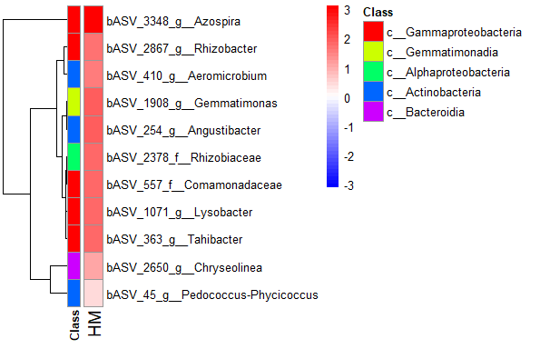<!-- -->

``` r
#6
pheatmap(AllAcc_lfc2,
          clustering_distance_rows = dist(AllAcc_lfc2_clu),
          cluster_cols = FALSE,
          color = colorRampPalette(c("blue", "white", "red"))(50),
          breaks = seq(-max_abs, max_abs, length.out = 51),
          #main = "Differentially abundant taxa (log2FC by Family)",
          fontsize_row = 10,
          fontsize_col = 14,
          na_col = "grey90",
          angle_col = 90, 
          annotation_row = tax2[5:6],
          annotation_colors = phylums_colors2)
```

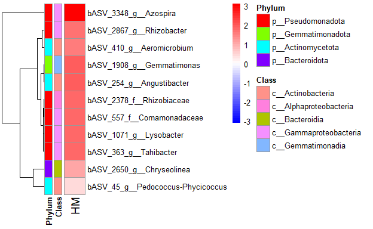<!-- -->

``` r
#6
pheatmap(AllAcc_lfc2,
          clustering_distance_rows = dist(AllAcc_lfc2_clu),
          cluster_cols = FALSE,
          color = colorRampPalette(c("blue", "white", "red"))(50),
          breaks = seq(-max_abs, max_abs, length.out = 51),
          #main = "Differentially abundant taxa (log2FC by Family)",
          fontsize_row = 10,
          fontsize_col = 14,
          na_col = "grey90",
          angle_col = 90, 
          annotation_row = tax2[3:6],
          annotation_colors = phylums_colors2)
```

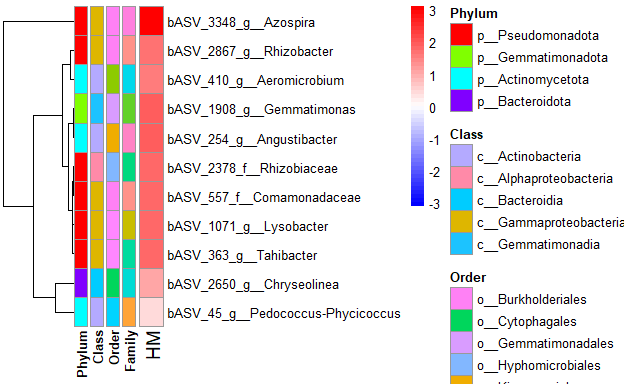<!-- -->

``` r
#6
pheatmap(AllAcc_lfc2,
          clustering_distance_rows = dist(AllAcc_lfc2_clu),
          cluster_cols = FALSE,
          color = colorRampPalette(c("blue", "white", "red"))(50),
          breaks = seq(-max_abs, max_abs, length.out = 51),
          #main = "Differentially abundant taxa (log2FC by Family)",
          fontsize_row = 10,
          fontsize_col = 14,
          na_col = "grey90",
          angle_col = 90, 
          annotation_row = tax2[3:6],
          annotation_colors = phylums_colors2)
```

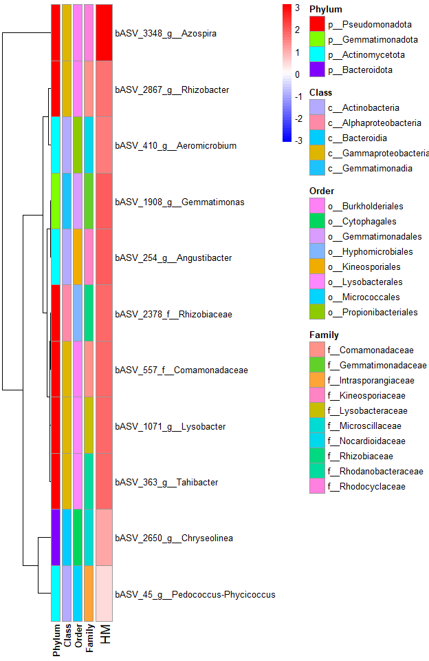<!-- -->

``` r
#6

# Create ordering index
ord <- order(tax2$Phylum, tax2$Class, tax2$Order, tax2$Family, tax2$Genus)

# Reorder matrix
AllAcc_lfc2 <- as.matrix(AllAcc_lfc2[ord, ])
colnames(AllAcc_lfc2) <- "HM"

# Reorder annotation accordingly
tax2 <- tax2[ord, , drop = FALSE]

# Reorder color class vector
#phylums_colors2 <- phylums_colors2[levels(tax2$Phylum)]

# Make sure legend is in same direction
tax2$Phylum <- factor(tax2$Phylum, levels = unique(tax2$Phylum))
tax2$Class <- factor(tax2$Class, levels = unique(tax2$Class))
tax2$Order <- factor(tax2$Order, levels = unique(tax2$Order))
tax2$Family <- factor(tax2$Family, levels = unique(tax2$Family))
tax2$Genus <- factor(tax2$Genus, levels = unique(tax2$Genus))

# Heatmap
pheatmap(AllAcc_lfc2,
          cluster_rows = FALSE,
          cluster_cols = FALSE,
          color = colorRampPalette(c("blue", "white", "red"))(50),
          breaks = seq(-max_abs, max_abs, length.out = 51),
          #main = "Differentially abundant taxa (log2FC by Family)",
         show_rownames = TRUE,
          fontsize_row = 10,
          fontsize_col = 14,
          na_col = "grey90",
          angle_col = 90, 
          annotation_row = tax2[3:6],
          annotation_colors = phylums_colors2)
```

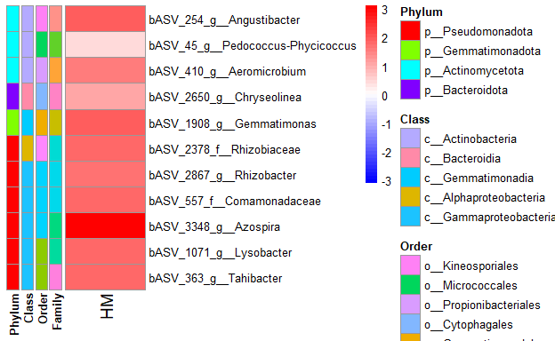<!-- -->

``` r
# Heatmap
pheatmap(AllAcc_lfc2,
          cluster_rows = FALSE,
          cluster_cols = FALSE,
          color = colorRampPalette(c("blue", "white", "red"))(50),
          breaks = seq(-max_abs, max_abs, length.out = 51),
          #main = "Differentially abundant taxa (log2FC by Family)",
          fontsize_row = 10,
          fontsize_col = 14,
          na_col = "grey90",
          angle_col = 90, 
          annotation_row = tax2[3:6],
          annotation_colors = phylums_colors2)
```

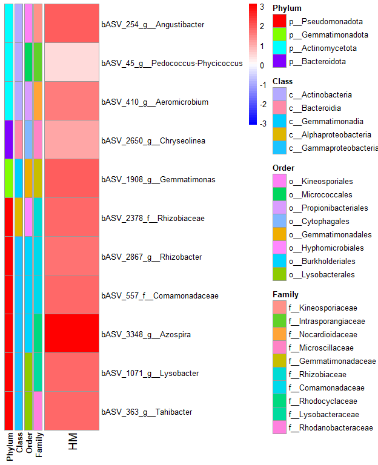<!-- -->

``` r
# Clean environment
rm(list = ls())
```


## 6.1.2 Correlation p value < 0.05 plotting all accessions
### Load data

``` r
# load phyloseq object
load("C:/Users/kreek001/OneDrive - Wageningen University & Research/Chapters/Experimental Chapter 3/RScripts/GitHub/TwelveAccessionExperiment/MicrobiomeAnalysis/Data/Phyloseq_objects/FP_unnormalized_bac_ps_ForDA_clean.RData")

# load correlating DA ASVs
load(file = "C:/Users/kreek001/OneDrive - Wageningen University & Research/Chapters/Experimental Chapter 3/RScripts/GitHub/TwelveAccessionExperiment/MicrobiomeAnalysis/Data/Phyloseq_objects/FP_DA_CorrAnlysis/DAASVs_SpCorr_ASVCatPerf_HM.RData")

# load log2fold change values
load(file = "C:/Users/kreek001/OneDrive - Wageningen University & Research/Chapters/Experimental Chapter 3/RScripts/GitHub/TwelveAccessionExperiment/MicrobiomeAnalysis/Data/Phyloseq_objects/FP_DA_Ancom_ASVLevel/ancomWZ_Bac_Acc.RData")

# load DA ASVs
load("C:/Users/kreek001/OneDrive - Wageningen University & Research/Chapters/Experimental Chapter 3/RScripts/GitHub/TwelveAccessionExperiment/MicrobiomeAnalysis/Data/Phyloseq_objects/FP_DA_SummaryFiles/SummaryFiles_ASVLevel/Acc_Bac_TwoTimes_DA_ASV.RData")
```

### Selecting ASVs
ASVs that negatively correlate for HM. Only plot lfc for other accession if they are DA for at leat two tests.

``` r
CD <- intersect(DAASVs_SpCorr_ASVCatPerf_HM$ASVs_0.05_neg, Acc_Bac_TwoTimes_DA_ASV$CD)
VL <- intersect(DAASVs_SpCorr_ASVCatPerf_HM$ASVs_0.05_neg, Acc_Bac_TwoTimes_DA_ASV$VL)
GO1 <- intersect(DAASVs_SpCorr_ASVCatPerf_HM$ASVs_0.05_neg, Acc_Bac_TwoTimes_DA_ASV$GO1)
ASVs <- list(HM = DAASVs_SpCorr_ASVCatPerf_HM$ASVs_0.05_neg, VL = VL, CD = CD, GO1 = GO1)
```

### Combine DA ASVs per accession

``` r
lfc_DA_specific <- lapply(names(ASVs), function(name) {
  da_asvs <- ASVs[[name]]
  lfc_table <- ancomWZ_Bac_Acc[[name]]$res$lfc
  rownames(lfc_table) <- lfc_table$taxon
  lfc_table <- lfc_table[lfc_table$taxon %in% da_asvs, "Soil_conditioningMb", drop = FALSE]
  lfc_table$ASV <- rownames(lfc_table)
  colnames(lfc_table)[1] <- paste0(name)
  lfc_table
})

names(lfc_DA_specific) <- names(ASVs)

# merge all accessions together
lfc_table <- Reduce(function(x, y) merge(x, y, by = "ASV", all = TRUE), lfc_DA_specific)
rownames(lfc_table) <- lfc_table$ASV
```

### Prepare taxonomy column class and phylum

``` r
# Only keep DA in ps object
FP_unnormalized_bac_ps_ForDA_clean <- prune_taxa(unlist(ASVs), FP_unnormalized_bac_ps_ForDA_clean)

# Phyloseq object to data frame with relative abundance, meta data and taxonomy. Each row is a ASV-sample combination
df_clean <- psmelt(FP_unnormalized_bac_ps_ForDA_clean)
head(df_clean[, c(1:9, 95:101)], 12)
```

```
##           OTU Sample Abundance Phase_PSF SampleNr Accession Domestication
## 964  bASV_557   F026       463        FP       26        CD    Cultivated
## 992  bASV_557   F006       245        FP        6        CD    Cultivated
## 688  bASV_363   F197       181        FP      197        HM    Cultivated
## 1003 bASV_557   F007       172        FP        7        CD    Cultivated
## 961  bASV_557   F010       171        FP       10        CD    Cultivated
## 981  bASV_557   F005       169        FP        5        CD    Cultivated
## 695  bASV_363   F193       164        FP      193        HM    Cultivated
## 691  bASV_363   F009       163        FP        9        CD    Cultivated
## 985  bASV_557   F009       148        FP        9        CD    Cultivated
## 1000 bASV_557   F018       129        FP       18        CD    Cultivated
## 739  bASV_363   F456       126        FP      456        VL          Wild
## 689  bASV_363   F040       121        FP       40        CD    Cultivated
##      Cat_treatment Soil_conditioning     Kingdom            Phylum
## 964             Mb                Mb k__Bacteria p__Pseudomonadota
## 992             Mb                Co k__Bacteria p__Pseudomonadota
## 688             Mb                Mb k__Bacteria p__Pseudomonadota
## 1003            Mb                Co k__Bacteria p__Pseudomonadota
## 961             Mb                Co k__Bacteria p__Pseudomonadota
## 981             Mb                Co k__Bacteria p__Pseudomonadota
## 695             Mb                Mb k__Bacteria p__Pseudomonadota
## 691             Mb                Co k__Bacteria p__Pseudomonadota
## 985             Mb                Co k__Bacteria p__Pseudomonadota
## 1000            Mb                Co k__Bacteria p__Pseudomonadota
## 739             Mb                Co k__Bacteria p__Pseudomonadota
## 689             Mb                Mb k__Bacteria p__Pseudomonadota
##                       Class              Order                Family
## 964  c__Gammaproteobacteria o__Burkholderiales     f__Comamonadaceae
## 992  c__Gammaproteobacteria o__Burkholderiales     f__Comamonadaceae
## 688  c__Gammaproteobacteria  o__Lysobacterales f__Rhodanobacteraceae
## 1003 c__Gammaproteobacteria o__Burkholderiales     f__Comamonadaceae
## 961  c__Gammaproteobacteria o__Burkholderiales     f__Comamonadaceae
## 981  c__Gammaproteobacteria o__Burkholderiales     f__Comamonadaceae
## 695  c__Gammaproteobacteria  o__Lysobacterales f__Rhodanobacteraceae
## 691  c__Gammaproteobacteria  o__Lysobacterales f__Rhodanobacteraceae
## 985  c__Gammaproteobacteria o__Burkholderiales     f__Comamonadaceae
## 1000 c__Gammaproteobacteria o__Burkholderiales     f__Comamonadaceae
## 739  c__Gammaproteobacteria  o__Lysobacterales f__Rhodanobacteraceae
## 689  c__Gammaproteobacteria  o__Lysobacterales f__Rhodanobacteraceae
##                Genus Species
## 964  g__Unclassified    <NA>
## 992  g__Unclassified    <NA>
## 688    g__Tahibacter     s__
## 1003 g__Unclassified    <NA>
## 961  g__Unclassified    <NA>
## 981  g__Unclassified    <NA>
## 695    g__Tahibacter     s__
## 691    g__Tahibacter     s__
## 985  g__Unclassified    <NA>
## 1000 g__Unclassified    <NA>
## 739    g__Tahibacter     s__
## 689    g__Tahibacter     s__
```

``` r
# Extract unique ASV–Class-Phylum mapping
tax <- df_clean[!duplicated(df_clean$OTU), c("OTU", "Genus", "Family", "Order",  "Class", "Phylum")]

# Row names must match heat map rows
rownames(tax) <- tax$OTU
tax$OTU <- NULL
head(tax)
```

```
##                               Genus                Family               Order
## bASV_557            g__Unclassified     f__Comamonadaceae  o__Burkholderiales
## bASV_363              g__Tahibacter f__Rhodanobacteraceae   o__Lysobacterales
## bASV_45   g__Pedococcus-Phycicoccus f__Intrasporangiaceae    o__Micrococcales
## bASV_3348               g__Azospira     f__Rhodocyclaceae  o__Burkholderiales
## bASV_254           g__Angustibacter    f__Kineosporiaceae   o__Kineosporiales
## bASV_1908           g__Gemmatimonas  f__Gemmatimonadaceae o__Gemmatimonadales
##                            Class             Phylum
## bASV_557  c__Gammaproteobacteria  p__Pseudomonadota
## bASV_363  c__Gammaproteobacteria  p__Pseudomonadota
## bASV_45        c__Actinobacteria  p__Actinomycetota
## bASV_3348 c__Gammaproteobacteria  p__Pseudomonadota
## bASV_254       c__Actinobacteria  p__Actinomycetota
## bASV_1908      c__Gemmatimonadia p__Gemmatimonadota
```

``` r
# Add genus to matrix
AllAcc_lfc2 <- lfc_table
tax$ASV <- rownames(tax)
AllAcc_lfc2 <- merge(tax, AllAcc_lfc2, ID = "ASV")

# Replace NAs and Incertae Sedis by higher taxonomic levels
taxon <- AllAcc_lfc2$Genus
taxon[is.na(taxon)] <- AllAcc_lfc2$Family[is.na(taxon)]
taxon[is.na(taxon)] <- AllAcc_lfc2$Order[is.na(taxon)]

taxon[taxon == "g__Incertae_Sedis"] <- AllAcc_lfc2$Family[taxon == "g__Incertae_Sedis"]
taxon[taxon == "f__Incertae_Sedis"] <- AllAcc_lfc2$Order[taxon == "f__Incertae_Sedis"]
taxon[taxon == "o__Incertae_Sedis"] <- AllAcc_lfc2$Class[taxon == "o__Incertae_Sedis"]

taxon[taxon == "g__Unclassified"] <- AllAcc_lfc2$Family[taxon == "g__Unclassified"]
taxon[taxon == "f__Unclassified"] <- AllAcc_lfc2$Order[taxon == "f__Unclassified"]
taxon[taxon == "o__Unclassified"] <- AllAcc_lfc2$Class[taxon == "o__Unclassified"]

rownames(AllAcc_lfc2) <- paste(AllAcc_lfc2$ASV, taxon, sep = "_")

# Subset data
tax <- AllAcc_lfc2[1:6]
AllAcc_lfc2 <- AllAcc_lfc2[7:10]
head(AllAcc_lfc2)
```

```
##                                 HM VL CD GO1
## bASV_1071_g__Lysobacter   1.797498 NA NA  NA
## bASV_1908_g__Gemmatimonas 1.957705 NA NA  NA
## bASV_2378_f__Rhizobiaceae 1.819375 NA NA  NA
## bASV_254_g__Angustibacter 1.964047 NA NA  NA
## bASV_2650_g__Chryseolinea 1.099697 NA NA  NA
## bASV_2867_g__Rhizobacter  1.663350 NA NA  NA
```

``` r
# Make color pallet for class
classes <- unique(tax$Class)
class_colors <- setNames(rainbow(length(classes)), classes)
class_colors <- list(Class = class_colors)

# Make color pallet for class
phylums <- unique(tax$Phylum)
phylums_colors <- setNames(rainbow(length(phylums)), phylums)
phylums_colors <- list(Phylum = phylums_colors)

# Make color pallet for Phylum for genus in plot
tax2 <- tax
phylums2 <- unique(tax2$Phylum)
phylums_colors2 <- setNames(rainbow(length(phylums2)), phylums2)
phylums_colors2 <- list(Phylum = phylums_colors2)

# Make color pallet for class for genus in plot
class2 <- unique(tax2$Class)
class_colors2 <- setNames(rainbow(length(class2)), class2)
class_colors2 <- list(Class = class_colors2)

# Turn data frame into a matrix
lfc_table$ASV <- NULL
AllAcc_lfc <- as.matrix(lfc_table)
AllAcc_lfc2 <- as.matrix(AllAcc_lfc2)

# replace NAs by 0s
AllAcc_lfc_clu <- lfc_table
AllAcc_lfc2_clu <- AllAcc_lfc2
AllAcc_lfc_clu[is.na(AllAcc_lfc_clu)] <- 0
AllAcc_lfc2_clu[is.na(AllAcc_lfc2_clu)] <- 0
```

### Heatmap 

``` r
#6
max_abs <- max(abs(AllAcc_lfc), na.rm = TRUE)
pheatmap(AllAcc_lfc2,
          clustering_distance_rows = dist(AllAcc_lfc2_clu),
          cluster_cols = FALSE,
          color = colorRampPalette(c("blue", "white", "red"))(50),
          breaks = seq(-max_abs, max_abs, length.out = 51),
          #main = "Differentially abundant taxa (log2FC by Family)",
          fontsize_row = 10,
          fontsize_col = 14,
          na_col = "grey90",
          angle_col = 90, 
          annotation_row = tax2["Phylum"],
          annotation_colors = phylums_colors2)
```

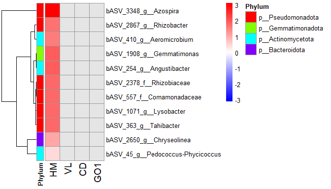<!-- -->

``` r
#6
pheatmap(AllAcc_lfc2,
          clustering_distance_rows = dist(AllAcc_lfc2_clu),
          cluster_cols = FALSE,
          color = colorRampPalette(c("blue", "white", "red"))(50),
          breaks = seq(-max_abs, max_abs, length.out = 51),
          #main = "Differentially abundant taxa (log2FC by Family)",
          fontsize_row = 10,
          fontsize_col = 14,
          na_col = "grey90",
          angle_col = 90, 
          annotation_row = tax2["Class"],
          annotation_colors = class_colors2)
```

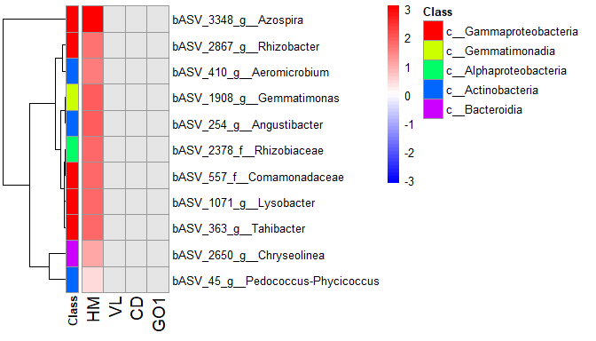<!-- -->

``` r
#6
pheatmap(AllAcc_lfc2,
          clustering_distance_rows = dist(AllAcc_lfc2_clu),
          cluster_cols = FALSE,
          color = colorRampPalette(c("blue", "white", "red"))(50),
          breaks = seq(-max_abs, max_abs, length.out = 51),
          #main = "Differentially abundant taxa (log2FC by Family)",
          fontsize_row = 10,
          fontsize_col = 14,
          na_col = "grey90",
          angle_col = 90, 
          annotation_row = tax2[5:6],
          annotation_colors = phylums_colors2)
```

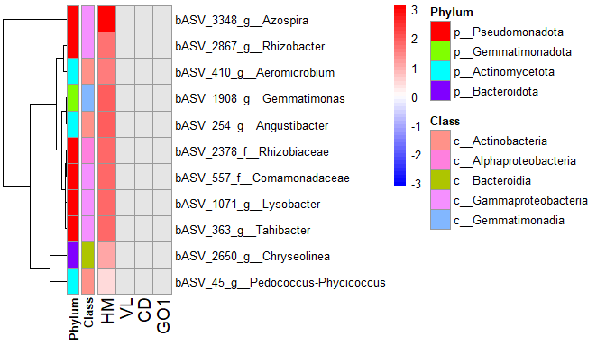<!-- -->

``` r
#6
pheatmap(AllAcc_lfc2,
          clustering_distance_rows = dist(AllAcc_lfc2_clu),
          cluster_cols = FALSE,
          color = colorRampPalette(c("blue", "white", "red"))(50),
          breaks = seq(-max_abs, max_abs, length.out = 51),
          #main = "Differentially abundant taxa (log2FC by Family)",
          fontsize_row = 10,
          fontsize_col = 14,
          na_col = "grey90",
          angle_col = 90, 
          annotation_row = tax2[3:6],
          annotation_colors = phylums_colors2)
```

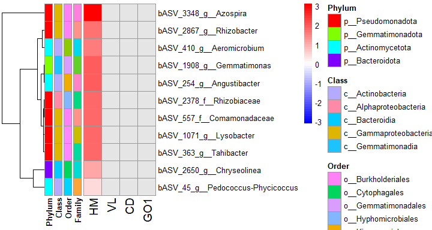<!-- -->

``` r
#6
pheatmap(AllAcc_lfc2,
          clustering_distance_rows = dist(AllAcc_lfc2_clu),
          cluster_cols = FALSE,
          color = colorRampPalette(c("blue", "white", "red"))(50),
          breaks = seq(-max_abs, max_abs, length.out = 51),
          #main = "Differentially abundant taxa (log2FC by Family)",
          fontsize_row = 10,
          fontsize_col = 14,
          na_col = "grey90",
          angle_col = 90, 
          annotation_row = tax2[3:6],
          annotation_colors = phylums_colors2)
```

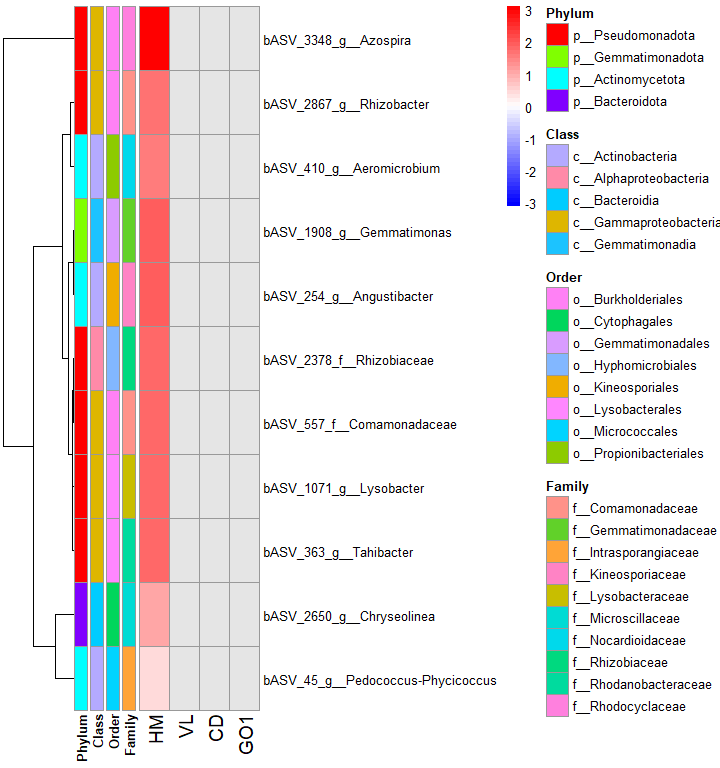<!-- -->

``` r
#6

# Create ordering index
ord <- order(tax2$Phylum, tax2$Class, tax2$Order, tax2$Family, tax2$Genus)

# Reorder matrix
AllAcc_lfc2 <- AllAcc_lfc2[ord, ]

# Reorder annotation accordingly
tax2 <- tax2[ord, , drop = FALSE]

# Reorder color class vector
phylums_colors2 <- phylums_colors2[levels(tax2$Class)]

# Make sure legend is in same direction
tax2$Phylum <- factor(tax2$Phylum, levels = unique(tax2$Phylum))
tax2$Class <- factor(tax2$Class, levels = unique(tax2$Class))
tax2$Order <- factor(tax2$Order, levels = unique(tax2$Order))
tax2$Family <- factor(tax2$Family, levels = unique(tax2$Family))
tax2$Genus <- factor(tax2$Genus, levels = unique(tax2$Genus))

# Heatmap
pheatmap(AllAcc_lfc2,
          cluster_rows = FALSE,
          cluster_cols = FALSE,
          color = colorRampPalette(c("blue", "white", "red"))(50),
          breaks = seq(-max_abs, max_abs, length.out = 51),
          #main = "Differentially abundant taxa (log2FC by Family)",
          fontsize_row = 10,
          fontsize_col = 14,
          na_col = "grey90",
          angle_col = 90, 
          annotation_row = tax2[3:6],
          annotation_colors = phylums_colors2)
```

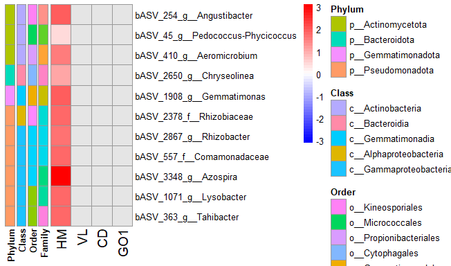<!-- -->

``` r
# Heatmap
pheatmap(AllAcc_lfc2,
          cluster_rows = FALSE,
          cluster_cols = FALSE,
          color = colorRampPalette(c("blue", "white", "red"))(50),
          breaks = seq(-max_abs, max_abs, length.out = 51),
          #main = "Differentially abundant taxa (log2FC by Family)",
          fontsize_row = 10,
          fontsize_col = 14,
          na_col = "grey90",
          angle_col = 90, 
          annotation_row = tax2[3:6],
          annotation_colors = phylums_colors2)
```

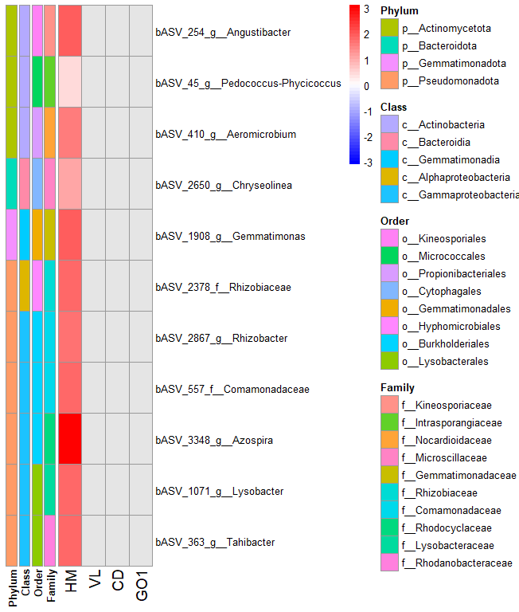<!-- -->

``` r
# Clean environment
rm(list = ls())
```


## 6.1.3 Correlation p value < 0.01
### Load data

``` r
# load phyloseq object
load("C:/Users/kreek001/OneDrive - Wageningen University & Research/Chapters/Experimental Chapter 3/RScripts/GitHub/TwelveAccessionExperiment/MicrobiomeAnalysis/Data/Phyloseq_objects/FP_unnormalized_bac_ps_ForDA_clean.RData")

# load correlating DA ASVs
load(file = "C:/Users/kreek001/OneDrive - Wageningen University & Research/Chapters/Experimental Chapter 3/RScripts/GitHub/TwelveAccessionExperiment/MicrobiomeAnalysis/Data/Phyloseq_objects/FP_DA_CorrAnlysis/DAASVs_SpCorr_ASVCatPerf_HM.RData")

# load log2fold change values
load(file = "C:/Users/kreek001/OneDrive - Wageningen University & Research/Chapters/Experimental Chapter 3/RScripts/GitHub/TwelveAccessionExperiment/MicrobiomeAnalysis/Data/Phyloseq_objects/FP_DA_Ancom_ASVLevel/ancomWZ_Bac_Acc.RData")
```

### Combine DA ASVs per accession

``` r
ASVs <- DAASVs_SpCorr_ASVCatPerf_HM$ASVs_0.01_neg

# Filter log2fold change for DA ASVs per accession
lfc_table <- ancomWZ_Bac_Acc$HM$res$lfc
rownames(lfc_table) <- lfc_table$taxon
lfc_table <- lfc_table[lfc_table$taxon %in% ASVs, "Soil_conditioningMb", drop = FALSE]
lfc_table$ASV <- rownames(lfc_table)
colnames(lfc_table)[1] <- paste0("HM")
lfc_table
```

```
##                HM      ASV
## bASV_254 1.964047 bASV_254
## bASV_410 1.559170 bASV_410
## bASV_557 1.818216 bASV_557
```

``` r
#rownames(AllAcc_lfc) <- AllAcc_lfc$ASV
#AllAcc_lfc$ASV <- NULL
```

### Prepare taxonomy column class and phylum

``` r
# Only keep DA in ps object
FP_unnormalized_bac_ps_ForDA_clean <- prune_taxa(ASVs, FP_unnormalized_bac_ps_ForDA_clean)

# Phyloseq object to data frame with relative abundance, meta data and taxonomy. Each row is a ASV-sample combination
df_clean <- psmelt(FP_unnormalized_bac_ps_ForDA_clean)
head(df_clean[, c(1:9, 95:101)], 12)
```

```
##          OTU Sample Abundance Phase_PSF SampleNr Accession Domestication
## 202 bASV_557   F026       463        FP       26        CD    Cultivated
## 206 bASV_557   F006       245        FP        6        CD    Cultivated
## 195 bASV_557   F007       172        FP        7        CD    Cultivated
## 204 bASV_557   F010       171        FP       10        CD    Cultivated
## 203 bASV_557   F005       169        FP        5        CD    Cultivated
## 201 bASV_557   F009       148        FP        9        CD    Cultivated
## 194 bASV_557   F018       129        FP       18        CD    Cultivated
## 278 bASV_557   F378       115        FP      378        RI    Cultivated
## 205 bASV_557   F027        98        FP       27        CD    Cultivated
## 198 bASV_557   F008        97        FP        8        CD    Cultivated
## 200 bASV_557   F017        89        FP       17        CD    Cultivated
## 199 bASV_557   F025        73        FP       25        CD    Cultivated
##     Cat_treatment Soil_conditioning     Kingdom            Phylum
## 202            Mb                Mb k__Bacteria p__Pseudomonadota
## 206            Mb                Co k__Bacteria p__Pseudomonadota
## 195            Mb                Co k__Bacteria p__Pseudomonadota
## 204            Mb                Co k__Bacteria p__Pseudomonadota
## 203            Mb                Co k__Bacteria p__Pseudomonadota
## 201            Mb                Co k__Bacteria p__Pseudomonadota
## 194            Mb                Co k__Bacteria p__Pseudomonadota
## 278            Mb                Co k__Bacteria p__Pseudomonadota
## 205            Mb                Mb k__Bacteria p__Pseudomonadota
## 198            Mb                Co k__Bacteria p__Pseudomonadota
## 200            Mb                Co k__Bacteria p__Pseudomonadota
## 199            Mb                Mb k__Bacteria p__Pseudomonadota
##                      Class              Order            Family           Genus
## 202 c__Gammaproteobacteria o__Burkholderiales f__Comamonadaceae g__Unclassified
## 206 c__Gammaproteobacteria o__Burkholderiales f__Comamonadaceae g__Unclassified
## 195 c__Gammaproteobacteria o__Burkholderiales f__Comamonadaceae g__Unclassified
## 204 c__Gammaproteobacteria o__Burkholderiales f__Comamonadaceae g__Unclassified
## 203 c__Gammaproteobacteria o__Burkholderiales f__Comamonadaceae g__Unclassified
## 201 c__Gammaproteobacteria o__Burkholderiales f__Comamonadaceae g__Unclassified
## 194 c__Gammaproteobacteria o__Burkholderiales f__Comamonadaceae g__Unclassified
## 278 c__Gammaproteobacteria o__Burkholderiales f__Comamonadaceae g__Unclassified
## 205 c__Gammaproteobacteria o__Burkholderiales f__Comamonadaceae g__Unclassified
## 198 c__Gammaproteobacteria o__Burkholderiales f__Comamonadaceae g__Unclassified
## 200 c__Gammaproteobacteria o__Burkholderiales f__Comamonadaceae g__Unclassified
## 199 c__Gammaproteobacteria o__Burkholderiales f__Comamonadaceae g__Unclassified
##     Species
## 202    <NA>
## 206    <NA>
## 195    <NA>
## 204    <NA>
## 203    <NA>
## 201    <NA>
## 194    <NA>
## 278    <NA>
## 205    <NA>
## 198    <NA>
## 200    <NA>
## 199    <NA>
```

``` r
# Extract unique ASV–Class-Phylum mapping
tax <- df_clean[!duplicated(df_clean$OTU), c("OTU", "Genus", "Family", "Order", "Class", "Phylum")]

# Row names must match heat map rows
rownames(tax) <- tax$OTU
tax$OTU <- NULL
head(tax)
```

```
##                     Genus             Family                  Order
## bASV_557  g__Unclassified  f__Comamonadaceae     o__Burkholderiales
## bASV_254 g__Angustibacter f__Kineosporiaceae      o__Kineosporiales
## bASV_410 g__Aeromicrobium f__Nocardioidaceae o__Propionibacteriales
##                           Class            Phylum
## bASV_557 c__Gammaproteobacteria p__Pseudomonadota
## bASV_254      c__Actinobacteria p__Actinomycetota
## bASV_410      c__Actinobacteria p__Actinomycetota
```

``` r
# Add genus to matrix
AllAcc_lfc2 <- lfc_table
AllAcc_lfc2$ASV <- rownames(AllAcc_lfc2)
tax$ASV <- rownames(tax)
AllAcc_lfc2 <- merge(tax, AllAcc_lfc2, ID = "ASV")

# Replace NAs and Incertae Sedis by higher taxonomic levels
taxon <- AllAcc_lfc2$Genus
taxon[is.na(taxon)] <- AllAcc_lfc2$Family[is.na(taxon)]
taxon[is.na(taxon)] <- AllAcc_lfc2$Order[is.na(taxon)]

taxon[taxon == "g__Incertae_Sedis"] <- AllAcc_lfc2$Family[taxon == "g__Incertae_Sedis"]
taxon[taxon == "f__Incertae_Sedis"] <- AllAcc_lfc2$Order[taxon == "f__Incertae_Sedis"]

rownames(AllAcc_lfc2) <- paste(AllAcc_lfc2$ASV, taxon, sep = "_")

# Subset data
tax <- AllAcc_lfc2[1:6]
AllAcc_lfc2 <- AllAcc_lfc2[7]
head(AllAcc_lfc2)
```

```
##                                 HM
## bASV_254_g__Angustibacter 1.964047
## bASV_410_g__Aeromicrobium 1.559170
## bASV_557_g__Unclassified  1.818216
```

``` r
# Make color pallet for class
classes <- unique(tax$Class)
class_colors <- setNames(rainbow(length(classes)), classes)
class_colors <- list(Class = class_colors)

# Make color pallet for class
phylums <- unique(tax$Phylum)
phylums_colors <- setNames(rainbow(length(phylums)), phylums)
phylums_colors <- list(Phylum = phylums_colors)

# Make color pallet for Phylum for genus in plot
tax2 <- tax
phylums2 <- unique(tax2$Phylum)
phylums_colors2 <- setNames(rainbow(length(phylums2)), phylums2)
phylums_colors2 <- list(Phylum = phylums_colors2)

# Turn data frame into a matrix
lfc_table$ASV <- NULL
AllAcc_lfc <- as.matrix(lfc_table)
AllAcc_lfc2 <- as.matrix(AllAcc_lfc2)

# replace NAs by 0s
AllAcc_lfc_clu <- lfc_table
AllAcc_lfc2_clu <- AllAcc_lfc2
AllAcc_lfc_clu[is.na(AllAcc_lfc_clu)] <- 0
AllAcc_lfc2_clu[is.na(AllAcc_lfc2_clu)] <- 0
```

### Heatmap 

``` r
#5
max_abs <- max(abs(AllAcc_lfc), na.rm = TRUE)
pheatmap(AllAcc_lfc,
          clustering_distance_rows = dist(AllAcc_lfc_clu),
          cluster_cols = FALSE,
          color = colorRampPalette(c("blue", "white", "red"))(50),
          breaks = seq(-max_abs, max_abs, length.out = 51),
          #main = "Differentially abundant taxa (log2FC by Family)",
          fontsize_row = 10,
          fontsize_col = 14,
          na_col = "grey90",
          angle_col = 90, 
          annotation_row = tax["Phylum"],
          annotation_colors = phylums_colors)
```

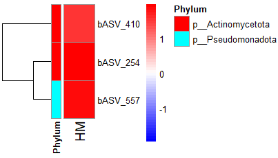<!-- -->

``` r
#6
pheatmap(AllAcc_lfc2,
          clustering_distance_rows = dist(AllAcc_lfc2_clu),
          cluster_cols = FALSE,
          color = colorRampPalette(c("blue", "white", "red"))(50),
          breaks = seq(-max_abs, max_abs, length.out = 51),
          #main = "Differentially abundant taxa (log2FC by Family)",
          fontsize_row = 10,
          fontsize_col = 14,
          na_col = "grey90",
          angle_col = 90, 
          annotation_row = tax2["Phylum"],
          annotation_colors = phylums_colors2)
```

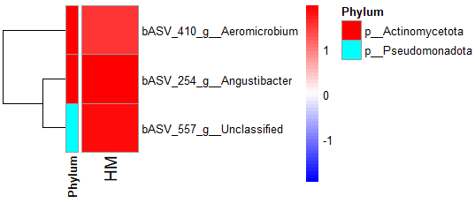<!-- -->

``` r
#6
pheatmap(AllAcc_lfc,
          clustering_distance_rows = dist(AllAcc_lfc_clu),
          cluster_cols = FALSE,
          color = colorRampPalette(c("blue", "white", "red"))(50),
          breaks = seq(-max_abs, max_abs, length.out = 51),
          #main = "Differentially abundant taxa (log2FC by Family)",
          fontsize_row = 10,
          fontsize_col = 14,
          na_col = "grey90",
          angle_col = 90, 
          annotation_row = tax["Class"],
          annotation_colors = phylums_colors)
```

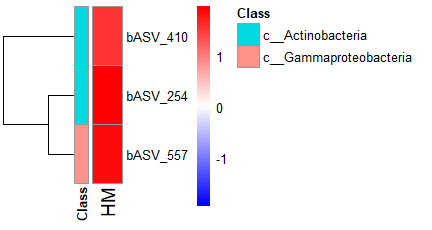<!-- -->

``` r
#6
pheatmap(AllAcc_lfc2,
          clustering_distance_rows = dist(AllAcc_lfc2_clu),
          cluster_cols = FALSE,
          color = colorRampPalette(c("blue", "white", "red"))(50),
          breaks = seq(-max_abs, max_abs, length.out = 51),
          #main = "Differentially abundant taxa (log2FC by Family)",
          fontsize_row = 10,
          fontsize_col = 14,
          na_col = "grey90",
          angle_col = 90, 
          annotation_row = tax2[5:6],
          annotation_colors = phylums_colors2)
```

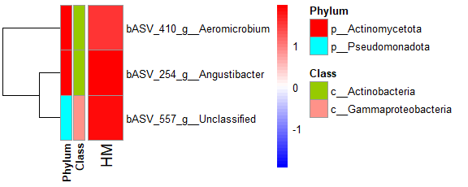<!-- -->

``` r
# Clean environment
rm(list = ls())
```


# 6.2 ASVs correlating with Cat weight all 5 accession Only negative correlations
DA ASVs of all 5 accessions that correlate with caterpillar weight of all these accessions together.

## 6.2.1 Correlation p value < 0.05
### Load data

``` r
# load phyloseq object
load("C:/Users/kreek001/OneDrive - Wageningen University & Research/Chapters/Experimental Chapter 3/RScripts/GitHub/TwelveAccessionExperiment/MicrobiomeAnalysis/Data/Phyloseq_objects/FP_unnormalized_bac_ps_ForDA_clean.RData")

# load DA ASVs
load("C:/Users/kreek001/OneDrive - Wageningen University & Research/Chapters/Experimental Chapter 3/RScripts/GitHub/TwelveAccessionExperiment/MicrobiomeAnalysis/Data/Phyloseq_objects/FP_DA_SummaryFiles/SummaryFiles_ASVLevel/Acc_Bac_TwoTimes_DA_ASV.RData")

# load correlating DA ASVs
load(file = "C:/Users/kreek001/OneDrive - Wageningen University & Research/Chapters/Experimental Chapter 3/RScripts/GitHub/TwelveAccessionExperiment/MicrobiomeAnalysis/Data/Phyloseq_objects/FP_DA_CorrAnlysis/DAASVs_SpCorr_ASVCatPerf_All.RData")

# load log2fold change values
load(file = "C:/Users/kreek001/OneDrive - Wageningen University & Research/Chapters/Experimental Chapter 3/RScripts/GitHub/TwelveAccessionExperiment/MicrobiomeAnalysis/Data/Phyloseq_objects/FP_DA_Ancom_ASVLevel/ancomWZ_Bac_Acc.RData")
```

### Combine DA ASVs per accession

``` r
ASVs <- DAASVs_SpCorr_ASVCatPerf_All$ASVs_0.05_neg
DA_ASvs <- lapply(Acc_Bac_TwoTimes_DA_ASV, function(x) x[x %in% ASVs])

lfc_DA_specific <- lapply(names(DA_ASvs), function(name) {
  da_asvs <- DA_ASvs[[name]]
  lfc_table <- ancomWZ_Bac_Acc[[name]]$res$lfc
  rownames(lfc_table) <- lfc_table$taxon
  lfc_table <- lfc_table[lfc_table$taxon %in% da_asvs, "Soil_conditioningMb", drop = FALSE]
  lfc_table$ASV <- rownames(lfc_table)
  colnames(lfc_table)[1] <- paste0(name)
  lfc_table
})

names(lfc_DA_specific) <- names(DA_ASvs)

# merge all accessions together
AllAcc_lfc <- Reduce(function(x, y) merge(x, y, by = "ASV", all = TRUE), lfc_DA_specific)
rownames(AllAcc_lfc) <- AllAcc_lfc$ASV
```

### Prepare taxonomy column class and phylum

``` r
# Only keep DA in ps object
FP_unnormalized_bac_ps_ForDA_clean <- prune_taxa(ASVs, FP_unnormalized_bac_ps_ForDA_clean)

# Phyloseq object to data frame with relative abundance, meta data and taxonomy. Each row is a ASV-sample combination
df_clean <- psmelt(FP_unnormalized_bac_ps_ForDA_clean)
head(df_clean[, c(1:9, 95:101)], 12)
```

```
##         OTU Sample Abundance Phase_PSF SampleNr Accession Domestication
## 3099 bASV_7   F475      1951        FP      475        VL          Wild
## 3149 bASV_7   F176      1773        FP      176        HM    Cultivated
## 3134 bASV_7   F476      1613        FP      476        VL          Wild
## 3083 bASV_7   F478      1605        FP      478        VL          Wild
## 3118 bASV_7   F479      1496        FP      479        VL          Wild
## 3140 bASV_7   F175      1338        FP      175        HM    Cultivated
## 3089 bASV_7   F177      1320        FP      177        HM    Cultivated
## 3121 bASV_7   F117      1320        FP      117       GO1    Cultivated
## 3124 bASV_7   F179      1251        FP      179        HM    Cultivated
## 3152 bASV_7   F477      1251        FP      477        VL          Wild
## 3086 bASV_7   F116      1238        FP      116       GO1    Cultivated
## 3164 bASV_7   F095      1224        FP       95       GO1    Cultivated
##      Cat_treatment Soil_conditioning     Kingdom            Phylum
## 3099            Mb                Mb k__Bacteria p__Actinomycetota
## 3149            Mb                Co k__Bacteria p__Actinomycetota
## 3134            Mb                Mb k__Bacteria p__Actinomycetota
## 3083            Mb                Mb k__Bacteria p__Actinomycetota
## 3118            Mb                Mb k__Bacteria p__Actinomycetota
## 3140            Mb                Co k__Bacteria p__Actinomycetota
## 3089            Mb                Co k__Bacteria p__Actinomycetota
## 3121            Mb                Mb k__Bacteria p__Actinomycetota
## 3124            Mb                Co k__Bacteria p__Actinomycetota
## 3152            Mb                Mb k__Bacteria p__Actinomycetota
## 3086            Mb                Mb k__Bacteria p__Actinomycetota
## 3164            Mb                Co k__Bacteria p__Actinomycetota
##                  Class                  Order          Family           Genus
## 3099 c__Actinobacteria o__Streptosporangiales f__Unclassified g__Unclassified
## 3149 c__Actinobacteria o__Streptosporangiales f__Unclassified g__Unclassified
## 3134 c__Actinobacteria o__Streptosporangiales f__Unclassified g__Unclassified
## 3083 c__Actinobacteria o__Streptosporangiales f__Unclassified g__Unclassified
## 3118 c__Actinobacteria o__Streptosporangiales f__Unclassified g__Unclassified
## 3140 c__Actinobacteria o__Streptosporangiales f__Unclassified g__Unclassified
## 3089 c__Actinobacteria o__Streptosporangiales f__Unclassified g__Unclassified
## 3121 c__Actinobacteria o__Streptosporangiales f__Unclassified g__Unclassified
## 3124 c__Actinobacteria o__Streptosporangiales f__Unclassified g__Unclassified
## 3152 c__Actinobacteria o__Streptosporangiales f__Unclassified g__Unclassified
## 3086 c__Actinobacteria o__Streptosporangiales f__Unclassified g__Unclassified
## 3164 c__Actinobacteria o__Streptosporangiales f__Unclassified g__Unclassified
##      Species
## 3099    <NA>
## 3149    <NA>
## 3134    <NA>
## 3083    <NA>
## 3118    <NA>
## 3140    <NA>
## 3089    <NA>
## 3121    <NA>
## 3124    <NA>
## 3152    <NA>
## 3086    <NA>
## 3164    <NA>
```

``` r
# Extract unique ASV–Class-Phylum mapping
tax <- df_clean[!duplicated(df_clean$OTU), c("OTU", "Genus", "Family", "Order", "Class", "Phylum")]

# Row names must match heat map rows
rownames(tax) <- tax$OTU
tax$OTU <- NULL
head(tax)
```

```
##                       Genus                 Family                  Order
## bASV_7      g__Unclassified        f__Unclassified o__Streptosporangiales
## bASV_178 g__Actinoallomurus f__Thermomonosporaceae o__Streptosporangiales
## bASV_243    g__Unclassified   f__Streptomycetaceae    o__Kitasatosporales
## bASV_27     g__Nocardioides     f__Nocardioidaceae o__Propionibacteriales
## bASV_182    g__Azospirillum     f__Azospirillaceae      o__Azospirillales
## bASV_126    g__Unclassified        f__Unclassified o__Streptosporangiales
##                           Class            Phylum
## bASV_7        c__Actinobacteria p__Actinomycetota
## bASV_178      c__Actinobacteria p__Actinomycetota
## bASV_243      c__Actinobacteria p__Actinomycetota
## bASV_27       c__Actinobacteria p__Actinomycetota
## bASV_182 c__Alphaproteobacteria p__Pseudomonadota
## bASV_126      c__Actinobacteria p__Actinomycetota
```

``` r
# Add genus to matrix
AllAcc_lfc2 <- AllAcc_lfc
tax$ASV <- rownames(tax)
AllAcc_lfc2 <- merge(tax, AllAcc_lfc2, ID = "ASV")

# Add higher taxonomic level if genus is NA or Incertae Sedis
taxon <- AllAcc_lfc2$Genus
taxon[is.na(taxon)] <- AllAcc_lfc2$Family[is.na(taxon)]
taxon[is.na(taxon)] <- AllAcc_lfc2$Order[is.na(taxon)]

taxon[taxon == "g__Incertae_Sedis"] <- AllAcc_lfc2$Family[taxon == "g__Incertae_Sedis"]
taxon[taxon == "f__Incertae_Sedis"] <- AllAcc_lfc2$Order[taxon == "f__Incertae_Sedis"]
rownames(AllAcc_lfc2) <- paste(AllAcc_lfc2$ASV, taxon, sep = "_")

# Subset data columns
tax <- AllAcc_lfc2[1:6]
AllAcc_lfc2 <- AllAcc_lfc2[7:11]
head(AllAcc_lfc2)
```

```
##                                     VL        CD RI         HM      GO1
## bASV_1003_g__Streptomyces   -2.5051032 -2.431535 NA -3.2067409 2.976802
## bASV_12339_g__Clostridium    0.7589564        NA NA         NA       NA
## bASV_126_g__Unclassified     1.0477663        NA NA -1.3776449       NA
## bASV_178_g__Actinoallomurus  0.9888516        NA NA -1.3206861       NA
## bASV_182_g__Azospirillum            NA        NA NA  0.7591103       NA
## bASV_183_g__Unclassified            NA        NA NA  0.5128882       NA
```

``` r
# Make color pallet for class
classes <- unique(tax$Class)
class_colors <- setNames(rainbow(length(classes)), classes)
class_colors <- list(Class = class_colors)

# Make color pallet for class
phylums <- unique(tax$Phylum)
phylums_colors <- setNames(rainbow(length(phylums)), phylums)
phylums_colors <- list(Phylum = phylums_colors)

# Make color pallet for Phylum for genus in plot
tax2 <- tax
#rownames(tax2) <- paste(tax2$ASV, tax2$Genus, sep = "_")
phylums2 <- unique(tax2$Phylum)
phylums_colors2 <- setNames(rainbow(length(phylums2)), phylums2)
phylums_colors2 <- list(Phylum = phylums_colors2)

# Turn data frame into a matrix
AllAcc_lfc$ASV <- NULL
AllAcc_lfc <- as.matrix(AllAcc_lfc)
AllAcc_lfc2 <- as.matrix(AllAcc_lfc2)

# replace NAs by 0s
AllAcc_lfc_clu <- AllAcc_lfc
AllAcc_lfc2_clu <- AllAcc_lfc2
AllAcc_lfc_clu[is.na(AllAcc_lfc_clu)] <- 0
AllAcc_lfc2_clu[is.na(AllAcc_lfc2_clu)] <- 0
```

### Heatmap 

``` r
#4.5
max_abs <- max(abs(AllAcc_lfc), na.rm = TRUE)
pheatmap(AllAcc_lfc,
          clustering_distance_rows = dist(AllAcc_lfc_clu),
          clustering_distance_cols = dist(t(AllAcc_lfc_clu)),
          color = colorRampPalette(c("blue", "white", "red"))(50),
          breaks = seq(-max_abs, max_abs, length.out = 51),
          #main = "Differentially abundant taxa (log2FC by Family)",
          fontsize_row = 10,
          fontsize_col = 14,
          na_col = "grey90",
          angle_col = 90, 
          annotation_row = tax["Phylum"],
          annotation_colors = phylums_colors)
```

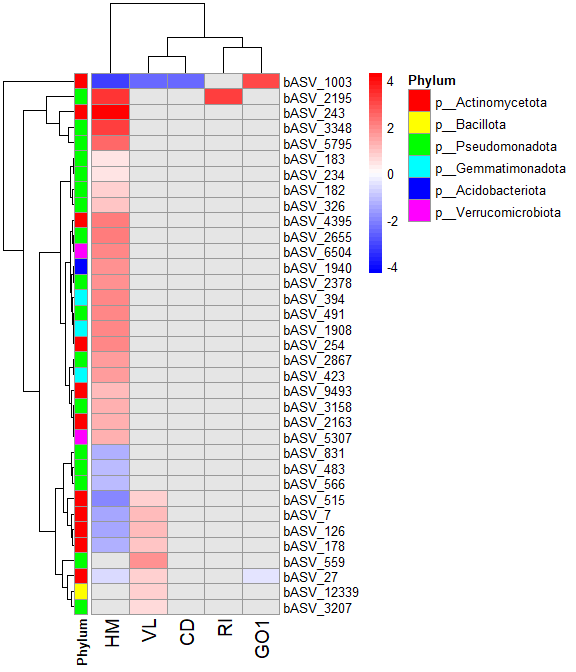<!-- -->

``` r
#6.2
pheatmap(AllAcc_lfc2,
          clustering_distance_rows = dist(AllAcc_lfc2_clu),
          clustering_distance_cols = dist(t(AllAcc_lfc_clu)),
          color = colorRampPalette(c("blue", "white", "red"))(50),
          breaks = seq(-max_abs, max_abs, length.out = 51),
          #main = "Differentially abundant taxa (log2FC by Family)",
          fontsize_row = 10,
          fontsize_col = 14,
          na_col = "grey90",
          angle_col = 90, 
          annotation_row = tax2["Phylum"],
          annotation_colors = phylums_colors2)
```

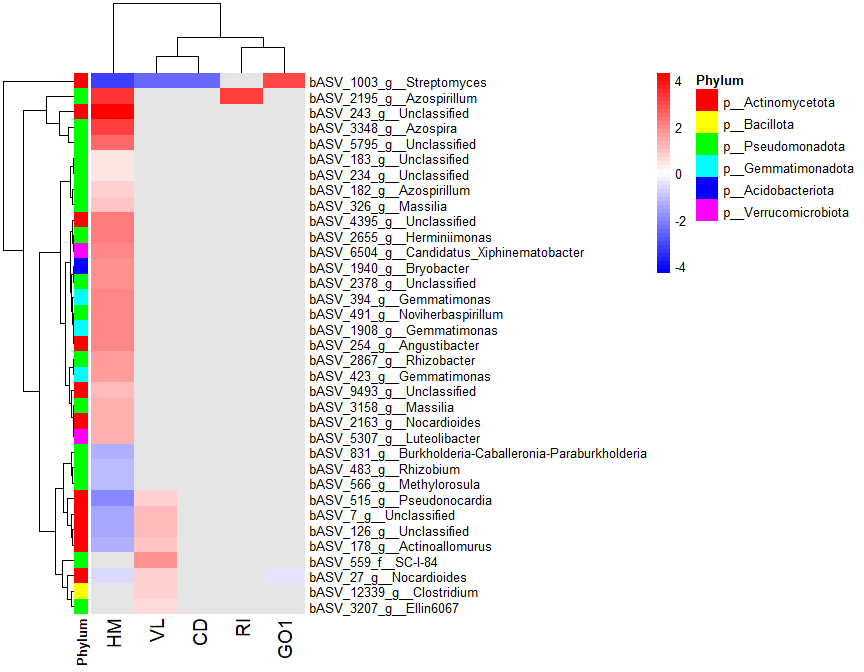<!-- -->

``` r
#4.8
pheatmap(AllAcc_lfc,
          clustering_distance_rows = dist(AllAcc_lfc_clu),
          clustering_distance_cols = dist(t(AllAcc_lfc_clu)),
          color = colorRampPalette(c("blue", "white", "red"))(50),
          breaks = seq(-max_abs, max_abs, length.out = 51),
          #main = "Differentially abundant taxa (log2FC by Family)",
          fontsize_row = 10,
          fontsize_col = 14,
          na_col = "grey90",
          angle_col = 90, 
          annotation_row = tax["Class"],
          annotation_colors = phylums_colors)
```

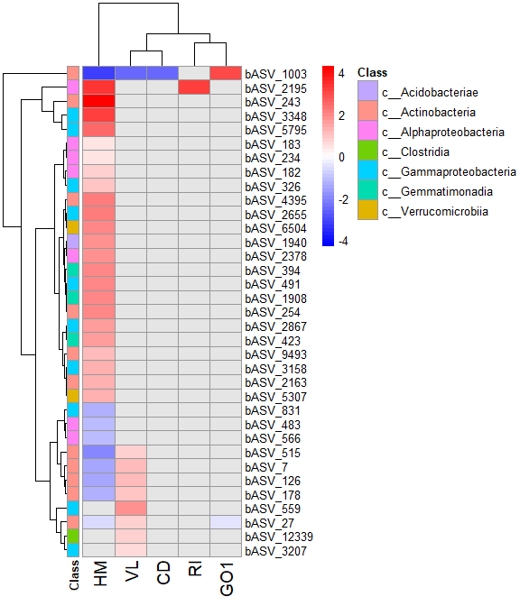<!-- -->

``` r
#6.5
pheatmap(AllAcc_lfc2,
          clustering_distance_rows = dist(AllAcc_lfc2_clu),
          clustering_distance_cols = dist(t(AllAcc_lfc_clu)),
          color = colorRampPalette(c("blue", "white", "red"))(50),
          breaks = seq(-max_abs, max_abs, length.out = 51),
          #main = "Differentially abundant taxa (log2FC by Family)",
          fontsize_row = 10,
          fontsize_col = 14,
          na_col = "grey90",
          angle_col = 90, 
          annotation_row = tax2[5:6],
          annotation_colors = phylums_colors2)
```

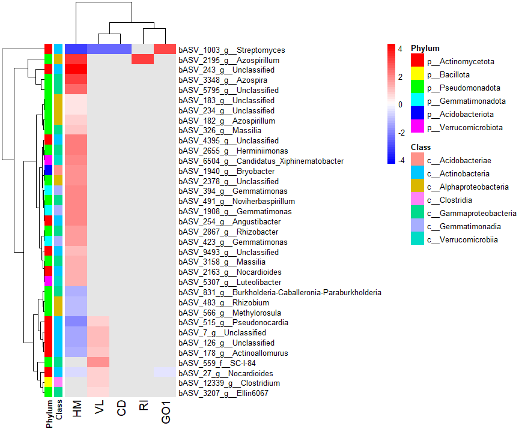<!-- -->

``` r
# Clean environment
rm(list = ls())
```


## 6.2.2 Correlation p value < 0.01
### Load data

``` r
# load phyloseq object
load("C:/Users/kreek001/OneDrive - Wageningen University & Research/Chapters/Experimental Chapter 3/RScripts/GitHub/TwelveAccessionExperiment/MicrobiomeAnalysis/Data/Phyloseq_objects/FP_unnormalized_bac_ps_ForDA_clean.RData")

# load DA ASVs
load("C:/Users/kreek001/OneDrive - Wageningen University & Research/Chapters/Experimental Chapter 3/RScripts/GitHub/TwelveAccessionExperiment/MicrobiomeAnalysis/Data/Phyloseq_objects/FP_DA_SummaryFiles/SummaryFiles_ASVLevel/Acc_Bac_TwoTimes_DA_ASV.RData")

# load correlating DA ASVs
load(file = "C:/Users/kreek001/OneDrive - Wageningen University & Research/Chapters/Experimental Chapter 3/RScripts/GitHub/TwelveAccessionExperiment/MicrobiomeAnalysis/Data/Phyloseq_objects/FP_DA_CorrAnlysis/DAASVs_SpCorr_ASVCatPerf_All.RData")

# load log2fold change values
load(file = "C:/Users/kreek001/OneDrive - Wageningen University & Research/Chapters/Experimental Chapter 3/RScripts/GitHub/TwelveAccessionExperiment/MicrobiomeAnalysis/Data/Phyloseq_objects/FP_DA_Ancom_ASVLevel/ancomWZ_Bac_Acc.RData")
```

### Combine DA ASVs per accession

``` r
ASVs <- DAASVs_SpCorr_ASVCatPerf_All$ASVs_0.01_neg
DA_ASvs <- lapply(Acc_Bac_TwoTimes_DA_ASV, function(x) x[x %in% ASVs])

lfc_DA_specific <- lapply(names(DA_ASvs), function(name) {
  da_asvs <- DA_ASvs[[name]]
  lfc_table <- ancomWZ_Bac_Acc[[name]]$res$lfc
  rownames(lfc_table) <- lfc_table$taxon
  lfc_table <- lfc_table[lfc_table$taxon %in% da_asvs, "Soil_conditioningMb", drop = FALSE]
  lfc_table$ASV <- rownames(lfc_table)
  colnames(lfc_table)[1] <- paste0(name)
  lfc_table
})

names(lfc_DA_specific) <- names(DA_ASvs)

# merge all accessions together
AllAcc_lfc <- Reduce(function(x, y) merge(x, y, by = "ASV", all = TRUE), lfc_DA_specific)
rownames(AllAcc_lfc) <- AllAcc_lfc$ASV
```

### Prepare taxonomy column class and phylum

``` r
# Only keep DA in ps object
FP_unnormalized_bac_ps_ForDA_clean <- prune_taxa(ASVs, FP_unnormalized_bac_ps_ForDA_clean)

# Phyloseq object to data frame with relative abundance, meta data and taxonomy. Each row is a ASV-sample combination
df_clean <- psmelt(FP_unnormalized_bac_ps_ForDA_clean)
head(df_clean[, c(1:9, 95:101)], 12)
```

```
##          OTU Sample Abundance Phase_PSF SampleNr Accession Domestication
## 822 bASV_243   F479       438        FP      479        VL          Wild
## 853 bASV_243   F193       325        FP      193        HM    Cultivated
## 184 bASV_126   F475       308        FP      475        VL          Wild
## 101 bASV_126   F175       301        FP      175        HM    Cultivated
## 192 bASV_126   F476       298        FP      476        VL          Wild
## 191 bASV_126   F478       290        FP      478        VL          Wild
## 858 bASV_243   F197       289        FP      197        HM    Cultivated
## 771 bASV_243   F475       262        FP      475        VL          Wild
## 180 bASV_126   F479       241        FP      479        VL          Wild
## 850 bASV_243   F199       239        FP      199        HM    Cultivated
## 146 bASV_126   F117       238        FP      117       GO1    Cultivated
## 846 bASV_243   F194       229        FP      194        HM    Cultivated
##     Cat_treatment Soil_conditioning     Kingdom            Phylum
## 822            Mb                Mb k__Bacteria p__Actinomycetota
## 853            Mb                Mb k__Bacteria p__Actinomycetota
## 184            Mb                Mb k__Bacteria p__Actinomycetota
## 101            Mb                Co k__Bacteria p__Actinomycetota
## 192            Mb                Mb k__Bacteria p__Actinomycetota
## 191            Mb                Mb k__Bacteria p__Actinomycetota
## 858            Mb                Mb k__Bacteria p__Actinomycetota
## 771            Mb                Mb k__Bacteria p__Actinomycetota
## 180            Mb                Mb k__Bacteria p__Actinomycetota
## 850            Mb                Mb k__Bacteria p__Actinomycetota
## 146            Mb                Mb k__Bacteria p__Actinomycetota
## 846            Mb                Mb k__Bacteria p__Actinomycetota
##                 Class                  Order               Family
## 822 c__Actinobacteria    o__Kitasatosporales f__Streptomycetaceae
## 853 c__Actinobacteria    o__Kitasatosporales f__Streptomycetaceae
## 184 c__Actinobacteria o__Streptosporangiales      f__Unclassified
## 101 c__Actinobacteria o__Streptosporangiales      f__Unclassified
## 192 c__Actinobacteria o__Streptosporangiales      f__Unclassified
## 191 c__Actinobacteria o__Streptosporangiales      f__Unclassified
## 858 c__Actinobacteria    o__Kitasatosporales f__Streptomycetaceae
## 771 c__Actinobacteria    o__Kitasatosporales f__Streptomycetaceae
## 180 c__Actinobacteria o__Streptosporangiales      f__Unclassified
## 850 c__Actinobacteria    o__Kitasatosporales f__Streptomycetaceae
## 146 c__Actinobacteria o__Streptosporangiales      f__Unclassified
## 846 c__Actinobacteria    o__Kitasatosporales f__Streptomycetaceae
##               Genus Species
## 822 g__Unclassified    <NA>
## 853 g__Unclassified    <NA>
## 184 g__Unclassified    <NA>
## 101 g__Unclassified    <NA>
## 192 g__Unclassified    <NA>
## 191 g__Unclassified    <NA>
## 858 g__Unclassified    <NA>
## 771 g__Unclassified    <NA>
## 180 g__Unclassified    <NA>
## 850 g__Unclassified    <NA>
## 146 g__Unclassified    <NA>
## 846 g__Unclassified    <NA>
```

``` r
# Extract unique ASV–Class-Phylum mapping
tax <- df_clean[!duplicated(df_clean$OTU), c("OTU", "Genus", "Family", "Order", "Class", "Phylum")]

# Row names must match heat map rows
rownames(tax) <- tax$OTU
tax$OTU <- NULL
head(tax)
```

```
##                      Genus                Family                  Order
## bASV_243   g__Unclassified  f__Streptomycetaceae    o__Kitasatosporales
## bASV_126   g__Unclassified       f__Unclassified o__Streptosporangiales
## bASV_234   g__Unclassified       f__Rhizobiaceae    o__Hyphomicrobiales
## bASV_326       g__Massilia   f__Oxalobacteraceae     o__Burkholderiales
## bASV_515 g__Pseudonocardia f__Pseudonocardiaceae   o__Pseudonocardiales
## bASV_483      g__Rhizobium       f__Rhizobiaceae    o__Hyphomicrobiales
##                           Class            Phylum
## bASV_243      c__Actinobacteria p__Actinomycetota
## bASV_126      c__Actinobacteria p__Actinomycetota
## bASV_234 c__Alphaproteobacteria p__Pseudomonadota
## bASV_326 c__Gammaproteobacteria p__Pseudomonadota
## bASV_515      c__Actinobacteria p__Actinomycetota
## bASV_483 c__Alphaproteobacteria p__Pseudomonadota
```

``` r
# Add genus to matrix
AllAcc_lfc2 <- AllAcc_lfc
tax$ASV <- rownames(tax)
AllAcc_lfc2 <- merge(tax, AllAcc_lfc2, ID = "ASV")

# Add higher taxonomic level if genus is NA or Incertae Sedis
taxon <- AllAcc_lfc2$Genus
taxon[is.na(taxon)] <- AllAcc_lfc2$Family[is.na(taxon)]
taxon[is.na(taxon)] <- AllAcc_lfc2$Order[is.na(taxon)]

taxon[taxon == "g__Incertae_Sedis"] <- AllAcc_lfc2$Family[taxon == "g__Incertae_Sedis"]
taxon[taxon == "f__Incertae_Sedis"] <- AllAcc_lfc2$Order[taxon == "f__Incertae_Sedis"]

rownames(AllAcc_lfc2) <- paste(AllAcc_lfc2$ASV, taxon, sep = "_")

# Subset data columns
tax <- AllAcc_lfc2[1:6]
AllAcc_lfc2 <- AllAcc_lfc2[7:11]
head(AllAcc_lfc2)
```

```
##                                  VL CD      RI         HM GO1
## bASV_12339_g__Clostridium 0.7589564 NA      NA         NA  NA
## bASV_126_g__Unclassified  1.0477663 NA      NA -1.3776449  NA
## bASV_183_g__Unclassified         NA NA      NA  0.5128882  NA
## bASV_1908_g__Gemmatimonas        NA NA      NA  1.9577054  NA
## bASV_1940_g__Bryobacter          NA NA      NA  1.8140467  NA
## bASV_2195_g__Azospirillum        NA NA 3.24783  3.2835192  NA
```

``` r
# Make color pallet for class
classes <- unique(tax$Class)
class_colors <- setNames(rainbow(length(classes)), classes)
class_colors <- list(Class = class_colors)

# Make color pallet for class
phylums <- unique(tax$Phylum)
phylums_colors <- setNames(rainbow(length(phylums)), phylums)
phylums_colors <- list(Phylum = phylums_colors)

# Make color pallet for Phylum for genus in plot
tax2 <- tax
#rownames(tax2) <- paste(tax2$ASV, tax2$Genus, sep = "_")
phylums2 <- unique(tax2$Phylum)
phylums_colors2 <- setNames(rainbow(length(phylums2)), phylums2)
phylums_colors2 <- list(Phylum = phylums_colors2)

# Turn data frame into a matrix
AllAcc_lfc$ASV <- NULL
AllAcc_lfc <- as.matrix(AllAcc_lfc)
AllAcc_lfc2 <- as.matrix(AllAcc_lfc2)

# replace NAs by 0s
AllAcc_lfc_clu <- AllAcc_lfc
AllAcc_lfc2_clu <- AllAcc_lfc2
AllAcc_lfc_clu[is.na(AllAcc_lfc_clu)] <- 0
AllAcc_lfc2_clu[is.na(AllAcc_lfc2_clu)] <- 0
```

### Heatmap 

``` r
#4.5
max_abs <- max(abs(AllAcc_lfc), na.rm = TRUE)
pheatmap(AllAcc_lfc,
          clustering_distance_rows = dist(AllAcc_lfc_clu),
          clustering_distance_cols = dist(t(AllAcc_lfc_clu)),
          color = colorRampPalette(c("blue", "white", "red"))(50),
          breaks = seq(-max_abs, max_abs, length.out = 51),
          #main = "Differentially abundant taxa (log2FC by Family)",
          fontsize_row = 10,
          fontsize_col = 14,
          na_col = "grey90",
          angle_col = 90, 
          annotation_row = tax["Phylum"],
          annotation_colors = phylums_colors)
```

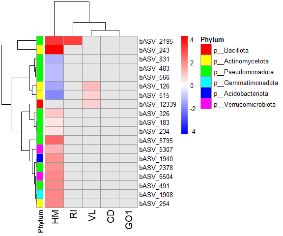<!-- -->

``` r
#6.2
pheatmap(AllAcc_lfc2,
          clustering_distance_rows = dist(AllAcc_lfc2_clu),
          clustering_distance_cols = dist(t(AllAcc_lfc_clu)),
          color = colorRampPalette(c("blue", "white", "red"))(50),
          breaks = seq(-max_abs, max_abs, length.out = 51),
          #main = "Differentially abundant taxa (log2FC by Family)",
          fontsize_row = 10,
          fontsize_col = 14,
          na_col = "grey90",
          angle_col = 90, 
          annotation_row = tax2["Phylum"],
          annotation_colors = phylums_colors2)
```

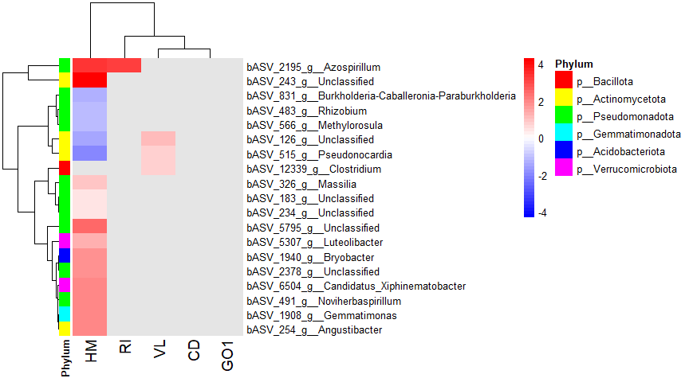<!-- -->

``` r
#4.8
pheatmap(AllAcc_lfc,
          clustering_distance_rows = dist(AllAcc_lfc_clu),
          clustering_distance_cols = dist(t(AllAcc_lfc_clu)),
          color = colorRampPalette(c("blue", "white", "red"))(50),
          breaks = seq(-max_abs, max_abs, length.out = 51),
          #main = "Differentially abundant taxa (log2FC by Family)",
          fontsize_row = 10,
          fontsize_col = 14,
          na_col = "grey90",
          angle_col = 90, 
          annotation_row = tax["Class"],
          annotation_colors = phylums_colors)
```

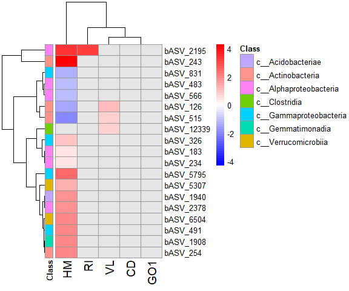<!-- -->

``` r
#6.5
pheatmap(AllAcc_lfc2,
          clustering_distance_rows = dist(AllAcc_lfc2_clu),
          clustering_distance_cols = dist(t(AllAcc_lfc_clu)),
          color = colorRampPalette(c("blue", "white", "red"))(50),
          breaks = seq(-max_abs, max_abs, length.out = 51),
          #main = "Differentially abundant taxa (log2FC by Family)",
          fontsize_row = 10,
          fontsize_col = 14,
          na_col = "grey90",
          angle_col = 90, 
          annotation_row = tax2[5:6],
          annotation_colors = phylums_colors2)
```

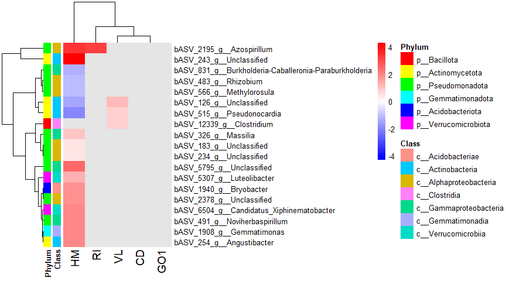<!-- -->

``` r
# Clean environment
rm(list = ls())
```


# 6.3 ASVs correlating with Cat weight all 4 accession Only negative correlations without RI
DA ASVs of 4 accessions that correlate with caterpillar weight of all these accessions together. RI is left out.   
   
## 6.3.1 Correlation p value < 0.05
### Load data

``` r
# load phyloseq object
load("C:/Users/kreek001/OneDrive - Wageningen University & Research/Chapters/Experimental Chapter 3/RScripts/GitHub/TwelveAccessionExperiment/MicrobiomeAnalysis/Data/Phyloseq_objects/FP_unnormalized_bac_ps_ForDA_clean.RData")

# load DA ASVs
load("C:/Users/kreek001/OneDrive - Wageningen University & Research/Chapters/Experimental Chapter 3/RScripts/GitHub/TwelveAccessionExperiment/MicrobiomeAnalysis/Data/Phyloseq_objects/FP_DA_SummaryFiles/SummaryFiles_ASVLevel/Acc_Bac_TwoTimes_DA_ASV.RData")

# load correlating DA ASVs
load(file = "C:/Users/kreek001/OneDrive - Wageningen University & Research/Chapters/Experimental Chapter 3/RScripts/GitHub/TwelveAccessionExperiment/MicrobiomeAnalysis/Data/Phyloseq_objects/FP_DA_CorrAnlysis/DAASVs_SpCorr_ASVCatPerf_HM.RData")

# load log2fold change values
load(file = "C:/Users/kreek001/OneDrive - Wageningen University & Research/Chapters/Experimental Chapter 3/RScripts/GitHub/TwelveAccessionExperiment/MicrobiomeAnalysis/Data/Phyloseq_objects/FP_DA_Ancom_ASVLevel/ancomWZ_Bac_Acc.RData")
```

### Remove RI

``` r
FP_unnormalized_bac_ps_ForDA_clean <- subset_samples(FP_unnormalized_bac_ps_ForDA_clean, Accession != "RI")
Acc_Bac_TwoTimes_DA_ASV <- Acc_Bac_TwoTimes_DA_ASV[names(Acc_Bac_TwoTimes_DA_ASV) != "RI"]
```

### Combine DA ASVs per accession

``` r
ASVs <- DAASVs_SpCorr_ASVCatPerf_HM$ASVs_0.05_neg
DA_ASvs <- lapply(Acc_Bac_TwoTimes_DA_ASV, function(x) x[x %in% ASVs])

lfc_DA_specific <- lapply(names(DA_ASvs), function(name) {
  da_asvs <- DA_ASvs[[name]]
  lfc_table <- ancomWZ_Bac_Acc[[name]]$res$lfc
  rownames(lfc_table) <- lfc_table$taxon
  lfc_table <- lfc_table[lfc_table$taxon %in% da_asvs, "Soil_conditioningMb", drop = FALSE]
  lfc_table$ASV <- rownames(lfc_table)
  colnames(lfc_table)[1] <- paste0(name)
  lfc_table
})

names(lfc_DA_specific) <- names(DA_ASvs)

# merge all accessions together
AllAcc_lfc <- Reduce(function(x, y) merge(x, y, by = "ASV", all = TRUE), lfc_DA_specific)
rownames(AllAcc_lfc) <- AllAcc_lfc$ASV

# Change order accessions
AllAcc_lfc <- AllAcc_lfc[c(1,4,2,3,5)]
```

### Prepare taxonomy column class and phylum

``` r
# Only keep DA in ps object
FP_unnormalized_bac_ps_ForDA_clean <- prune_taxa(ASVs, FP_unnormalized_bac_ps_ForDA_clean)

# Phyloseq object to data frame with relative abundance, meta data and taxonomy. Each row is a ASV-sample combination
df_clean <- psmelt(FP_unnormalized_bac_ps_ForDA_clean)
head(df_clean[, c(1:9, 95:101)], 12)
```

```
##          OTU Sample Abundance Phase_PSF SampleNr Accession Domestication
## 722 bASV_557   F026       463        FP       26        CD    Cultivated
## 710 bASV_557   F006       245        FP        6        CD    Cultivated
## 513 bASV_363   F197       181        FP      197        HM    Cultivated
## 721 bASV_557   F007       172        FP        7        CD    Cultivated
## 714 bASV_557   F010       171        FP       10        CD    Cultivated
## 699 bASV_557   F005       169        FP        5        CD    Cultivated
## 520 bASV_363   F193       164        FP      193        HM    Cultivated
## 512 bASV_363   F009       163        FP        9        CD    Cultivated
## 703 bASV_557   F009       148        FP        9        CD    Cultivated
## 718 bASV_557   F018       129        FP       18        CD    Cultivated
## 517 bASV_363   F456       126        FP      456        VL          Wild
## 488 bASV_363   F040       121        FP       40        CD    Cultivated
##     Cat_treatment Soil_conditioning     Kingdom            Phylum
## 722            Mb                Mb k__Bacteria p__Pseudomonadota
## 710            Mb                Co k__Bacteria p__Pseudomonadota
## 513            Mb                Mb k__Bacteria p__Pseudomonadota
## 721            Mb                Co k__Bacteria p__Pseudomonadota
## 714            Mb                Co k__Bacteria p__Pseudomonadota
## 699            Mb                Co k__Bacteria p__Pseudomonadota
## 520            Mb                Mb k__Bacteria p__Pseudomonadota
## 512            Mb                Co k__Bacteria p__Pseudomonadota
## 703            Mb                Co k__Bacteria p__Pseudomonadota
## 718            Mb                Co k__Bacteria p__Pseudomonadota
## 517            Mb                Co k__Bacteria p__Pseudomonadota
## 488            Mb                Mb k__Bacteria p__Pseudomonadota
##                      Class              Order                Family
## 722 c__Gammaproteobacteria o__Burkholderiales     f__Comamonadaceae
## 710 c__Gammaproteobacteria o__Burkholderiales     f__Comamonadaceae
## 513 c__Gammaproteobacteria  o__Lysobacterales f__Rhodanobacteraceae
## 721 c__Gammaproteobacteria o__Burkholderiales     f__Comamonadaceae
## 714 c__Gammaproteobacteria o__Burkholderiales     f__Comamonadaceae
## 699 c__Gammaproteobacteria o__Burkholderiales     f__Comamonadaceae
## 520 c__Gammaproteobacteria  o__Lysobacterales f__Rhodanobacteraceae
## 512 c__Gammaproteobacteria  o__Lysobacterales f__Rhodanobacteraceae
## 703 c__Gammaproteobacteria o__Burkholderiales     f__Comamonadaceae
## 718 c__Gammaproteobacteria o__Burkholderiales     f__Comamonadaceae
## 517 c__Gammaproteobacteria  o__Lysobacterales f__Rhodanobacteraceae
## 488 c__Gammaproteobacteria  o__Lysobacterales f__Rhodanobacteraceae
##               Genus Species
## 722 g__Unclassified    <NA>
## 710 g__Unclassified    <NA>
## 513   g__Tahibacter     s__
## 721 g__Unclassified    <NA>
## 714 g__Unclassified    <NA>
## 699 g__Unclassified    <NA>
## 520   g__Tahibacter     s__
## 512   g__Tahibacter     s__
## 703 g__Unclassified    <NA>
## 718 g__Unclassified    <NA>
## 517   g__Tahibacter     s__
## 488   g__Tahibacter     s__
```

``` r
# Extract unique ASV–Class-Phylum mapping
tax <- df_clean[!duplicated(df_clean$OTU), c("OTU", "Genus", "Family", "Order", "Class", "Phylum")]

# Row names must match heat map rows
rownames(tax) <- tax$OTU
tax$OTU <- NULL
head(tax)
```

```
##                               Genus                Family               Order
## bASV_557            g__Unclassified     f__Comamonadaceae  o__Burkholderiales
## bASV_363              g__Tahibacter f__Rhodanobacteraceae   o__Lysobacterales
## bASV_45   g__Pedococcus-Phycicoccus f__Intrasporangiaceae    o__Micrococcales
## bASV_3348               g__Azospira     f__Rhodocyclaceae  o__Burkholderiales
## bASV_254           g__Angustibacter    f__Kineosporiaceae   o__Kineosporiales
## bASV_1908           g__Gemmatimonas  f__Gemmatimonadaceae o__Gemmatimonadales
##                            Class             Phylum
## bASV_557  c__Gammaproteobacteria  p__Pseudomonadota
## bASV_363  c__Gammaproteobacteria  p__Pseudomonadota
## bASV_45        c__Actinobacteria  p__Actinomycetota
## bASV_3348 c__Gammaproteobacteria  p__Pseudomonadota
## bASV_254       c__Actinobacteria  p__Actinomycetota
## bASV_1908      c__Gemmatimonadia p__Gemmatimonadota
```

``` r
# Add genus to matrix
AllAcc_lfc2 <- AllAcc_lfc
tax$ASV <- rownames(tax)
AllAcc_lfc2 <- merge(tax, AllAcc_lfc2, ID = "ASV")

# Add higher taxonomic level if genus is NA or Incertae Sedis
taxon <- AllAcc_lfc2$Genus
taxon[is.na(taxon)] <- AllAcc_lfc2$Family[is.na(taxon)]
taxon[is.na(taxon)] <- AllAcc_lfc2$Order[is.na(taxon)]

taxon[taxon == "g__Incertae_Sedis"] <- AllAcc_lfc2$Family[taxon == "g__Incertae_Sedis"]
taxon[taxon == "f__Incertae_Sedis"] <- AllAcc_lfc2$Order[taxon == "f__Incertae_Sedis"]
taxon[taxon == "o__Incertae_Sedis"] <- AllAcc_lfc2$Class[taxon == "o__Incertae_Sedis"]
taxon[taxon == "c__Incertae_Sedis"] <- AllAcc_lfc2$Phylum[taxon == "c__Incertae_Sedis"]

taxon[taxon == "g__Unclassified"] <- AllAcc_lfc2$Family[taxon == "g__Unclassified"]
taxon[taxon == "f__Unclassified"] <- AllAcc_lfc2$Order[taxon == "f__Unclassified"]
taxon[taxon == "o__Unclassified"] <- AllAcc_lfc2$Class[taxon == "o__Unclassified"]
taxon[taxon == "c__Unclassified"] <- AllAcc_lfc2$Phylum[taxon == "c__Unclassified"]

rownames(AllAcc_lfc2) <- paste(AllAcc_lfc2$ASV, taxon, sep = "_")

AllAcc_lfc2$Phylum <- sub("p__", "", AllAcc_lfc2$Phylum)
AllAcc_lfc2$Class <- sub("c__", "", AllAcc_lfc2$Class)

# Subset data columns
tax <- AllAcc_lfc2[1:6]
AllAcc_lfc2 <- AllAcc_lfc2[7:10]
head(AllAcc_lfc2)
```

```
##                                 HM VL CD GO1
## bASV_1071_g__Lysobacter   1.797498 NA NA  NA
## bASV_1908_g__Gemmatimonas 1.957705 NA NA  NA
## bASV_2378_f__Rhizobiaceae 1.819375 NA NA  NA
## bASV_254_g__Angustibacter 1.964047 NA NA  NA
## bASV_2650_g__Chryseolinea 1.099697 NA NA  NA
## bASV_2867_g__Rhizobacter  1.663350 NA NA  NA
```

``` r
# Make color pallet for class
colors35 <- c("#E69F00", "#56B4E9", "#009E73", "#F0E442", "#332288", "#CC79A7", 
              "#D55E00", "#0072B2", "#000000", "#999933",
              "#117733", "#88CCEE", "#44AA99", "#DDCC77", "#CC6677", "#882255", "#AA4499",
              "#661100", "#6699CC", "#AA4466", "#4477AA", "#EE6677", "#BBBBBB", 
              "#2E3440", "#8FBCBB", "#BF616A", "#A3BE8C", "#EBCB8B", "#B48EAD", 
              "#5E81AC", "#D08770", "#3B4252", "#7B9E87", "#999999")

# Make color pallet for Phylum for genus in plot
tax2 <- tax
phylums2 <- unique(tax2$Phylum)
phylums_colors2 <- setNames(colors35[1:length(phylums2)], phylums2)
phylums_colors2 <- list(Phylum = phylums_colors2)

classes2 <- unique(tax2$Class)
class_colors2 <- setNames(colors35[1:length(classes2)], classes2)
class_colors2 <- list(Class = class_colors2)

phylum_class_colors <- c(phylums_colors2, class_colors2)

# Turn data frame into a matrix
AllAcc_lfc$ASV <- NULL
AllAcc_lfc <- as.matrix(AllAcc_lfc)
AllAcc_lfc2 <- as.matrix(AllAcc_lfc2)

# replace NAs by 0s
AllAcc_lfc_clu <- AllAcc_lfc
AllAcc_lfc2_clu <- AllAcc_lfc2
AllAcc_lfc_clu[is.na(AllAcc_lfc_clu)] <- 0
AllAcc_lfc2_clu[is.na(AllAcc_lfc2_clu)] <- 0

# breaks in heatmap
max_abs <- max(abs(AllAcc_lfc), na.rm = TRUE)
breaks <- unique(c(seq(-max_abs, -2, length.out = 15), 
                   seq(-2, 2, length.out = 40), # More breaks in this range for sensitivity
                   seq(2, max_abs, length.out = 15)))
```

### Heatmap 

``` r
#6.2
pheatmap(AllAcc_lfc2,
          clustering_distance_rows = dist(AllAcc_lfc2_clu),
          clustering_distance_cols = dist(t(AllAcc_lfc_clu)),
          color = colorRampPalette(c("darkblue", "blue", "white", "red", "darkred"))(length(breaks) - 1),
          breaks = breaks,
          #main = "Differentially abundant taxa (log2FC by Family)",
          fontsize_row = 10,
          fontsize_col = 14,
          na_col = "grey90",
          angle_col = 90, 
          annotation_row = tax2["Phylum"],
          annotation_colors = phylum_class_colors)
```

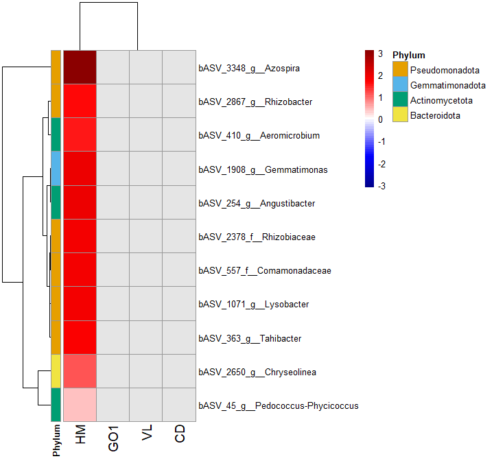<!-- -->

``` r
#4.8
p <- pheatmap(AllAcc_lfc2,
          clustering_distance_rows = dist(AllAcc_lfc2_clu),
          #clustering_distance_cols = dist(t(AllAcc_lfc2_clu)),
          cluster_cols = FALSE,
          color = colorRampPalette(c("darkblue", "blue", "white", "red", "darkred"))(length(breaks) - 1),
          breaks = breaks,
          #main = "Differentially abundant taxa (log2FC by Family)",
          fontsize_row = 10,
          fontsize_col = 14,
          na_col = "grey90",
          angle_col = 90, 
          annotation_row = tax2["Class"],
          annotation_colors = phylum_class_colors)
p 
```

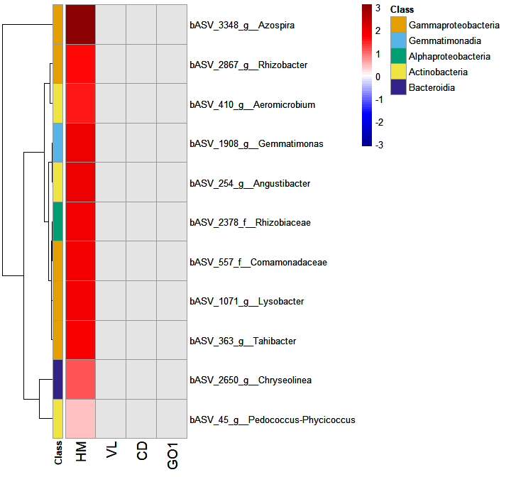<!-- -->

``` r
files <- c("FP_SpearCorr_Heatmap_ASV.svg", "FP_SpearCorr_Heatmap_ASV.png")

mapply(function(x){
  file_path <- file.path("C:/Users/kreek001/OneDrive - Wageningen University & Research/Chapters/Experimental Chapter 3/Result/Final graphs", x)

  if (grepl("svg$", x)) {
    svg(file_path, width = 19/2.54, height = 9/2.54)
  } else {
    png(file_path, width = 19, height = 9, units = "cm", res = 300)
  }
  grid::grid.draw(p$gtable)
  dev.off()
}, files)
```

```
## FP_SpearCorr_Heatmap_ASV.svg.png FP_SpearCorr_Heatmap_ASV.png.png 
##                                2                                2
```

``` r
#6.5
pheatmap(AllAcc_lfc2,
          clustering_distance_rows = dist(AllAcc_lfc2_clu),
          clustering_distance_cols = dist(t(AllAcc_lfc_clu)),
          color = colorRampPalette(c("darkblue", "blue", "white", "red", "darkred"))(length(breaks) - 1),
          breaks = breaks,
          #main = "Differentially abundant taxa (log2FC by Family)",
          fontsize_row = 10,
          fontsize_col = 14,
          na_col = "grey90",
          angle_col = 90, 
          annotation_row = tax2[5:6],
          annotation_colors = phylum_class_colors)
```

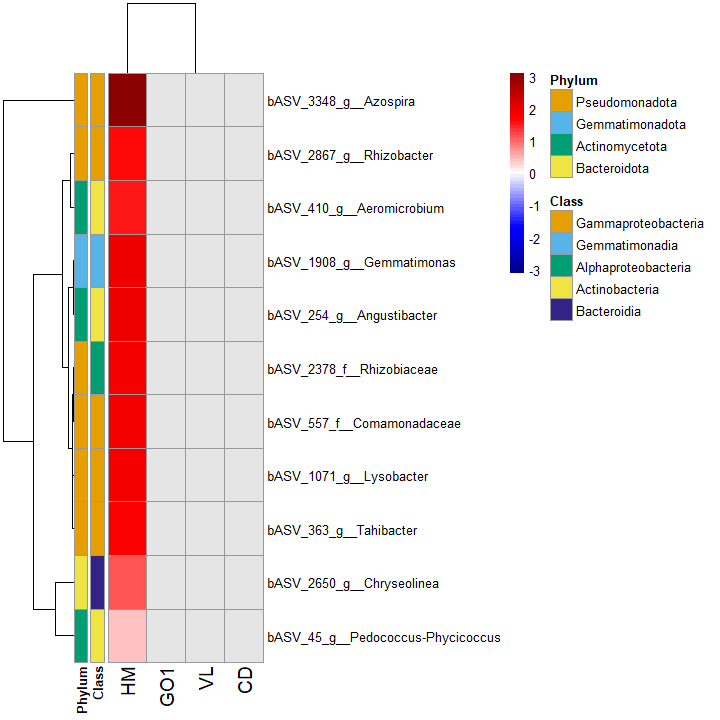<!-- -->

``` r
# Clean environment
rm(list = ls())
```


## 6.2.2 Correlation p value < 0.01
### Load data

``` r
# load phyloseq object
load("C:/Users/kreek001/OneDrive - Wageningen University & Research/Chapters/Experimental Chapter 3/RScripts/GitHub/TwelveAccessionExperiment/MicrobiomeAnalysis/Data/Phyloseq_objects/FP_unnormalized_bac_ps_ForDA_clean.RData")

# load DA ASVs
load("C:/Users/kreek001/OneDrive - Wageningen University & Research/Chapters/Experimental Chapter 3/RScripts/GitHub/TwelveAccessionExperiment/MicrobiomeAnalysis/Data/Phyloseq_objects/FP_DA_SummaryFiles/SummaryFiles_ASVLevel/Acc_Bac_TwoTimes_DA_ASV.RData")

# load correlating DA ASVs
load(file = "C:/Users/kreek001/OneDrive - Wageningen University & Research/Chapters/Experimental Chapter 3/RScripts/GitHub/TwelveAccessionExperiment/MicrobiomeAnalysis/Data/Phyloseq_objects/FP_DA_CorrAnlysis/DAASVs_SpCorr_ASVCatPerf_All_NoRI.RData")

# load log2fold change values
load(file = "C:/Users/kreek001/OneDrive - Wageningen University & Research/Chapters/Experimental Chapter 3/RScripts/GitHub/TwelveAccessionExperiment/MicrobiomeAnalysis/Data/Phyloseq_objects/FP_DA_Ancom_ASVLevel/ancomWZ_Bac_Acc.RData")
```

### Remove RI

``` r
FP_unnormalized_bac_ps_ForDA_clean <- subset_samples(FP_unnormalized_bac_ps_ForDA_clean, Accession != "RI")
Acc_Bac_TwoTimes_DA_ASV <- Acc_Bac_TwoTimes_DA_ASV[names(Acc_Bac_TwoTimes_DA_ASV) != "RI"]
```

### Combine DA ASVs per accession

``` r
ASVs <- DAASVs_SpCorr_ASVCatPerf_All_NoRI$ASVs_0.01_neg
DA_ASvs <- lapply(Acc_Bac_TwoTimes_DA_ASV, function(x) x[x %in% ASVs])

lfc_DA_specific <- lapply(names(DA_ASvs), function(name) {
  da_asvs <- DA_ASvs[[name]]
  lfc_table <- ancomWZ_Bac_Acc[[name]]$res$lfc
  rownames(lfc_table) <- lfc_table$taxon
  lfc_table <- lfc_table[lfc_table$taxon %in% da_asvs, "Soil_conditioningMb", drop = FALSE]
  lfc_table$ASV <- rownames(lfc_table)
  colnames(lfc_table)[1] <- paste0(name)
  lfc_table
})

names(lfc_DA_specific) <- names(DA_ASvs)

# merge all accessions together
AllAcc_lfc <- Reduce(function(x, y) merge(x, y, by = "ASV", all = TRUE), lfc_DA_specific)
rownames(AllAcc_lfc) <- AllAcc_lfc$ASV
```

### Prepare taxonomy column class and phylum

``` r
# Only keep DA in ps object
FP_unnormalized_bac_ps_ForDA_clean <- prune_taxa(ASVs, FP_unnormalized_bac_ps_ForDA_clean)

# Phyloseq object to data frame with relative abundance, meta data and taxonomy. Each row is a ASV-sample combination
df_clean <- psmelt(FP_unnormalized_bac_ps_ForDA_clean)
head(df_clean[, c(1:9, 95:101)], 12)
```

```
##           OTU Sample Abundance Phase_PSF SampleNr Accession Domestication
## 259  bASV_326   F193       128        FP      193        HM    Cultivated
## 313  bASV_423   F193       117        FP      193        HM    Cultivated
## 71   bASV_183   F020        94        FP       20        CD    Cultivated
## 306  bASV_423   F197        87        FP      197        HM    Cultivated
## 533  bASV_566   F180        85        FP      180        HM    Cultivated
## 115  bASV_183   F197        77        FP      197        HM    Cultivated
## 89   bASV_183   F018        76        FP       18        CD    Cultivated
## 131  bASV_183   F195        75        FP      195        HM    Cultivated
## 324  bASV_423   F194        73        FP      194        HM    Cultivated
## 395 bASV_4395   F197        70        FP      197        HM    Cultivated
## 119  bASV_183   F456        69        FP      456        VL          Wild
## 258  bASV_326   F455        69        FP      455        VL          Wild
##     Cat_treatment Soil_conditioning     Kingdom             Phylum
## 259            Mb                Mb k__Bacteria  p__Pseudomonadota
## 313            Mb                Mb k__Bacteria p__Gemmatimonadota
## 71             Mb                Co k__Bacteria  p__Pseudomonadota
## 306            Mb                Mb k__Bacteria p__Gemmatimonadota
## 533            Mb                Co k__Bacteria  p__Pseudomonadota
## 115            Mb                Mb k__Bacteria  p__Pseudomonadota
## 89             Mb                Co k__Bacteria  p__Pseudomonadota
## 131            Mb                Mb k__Bacteria  p__Pseudomonadota
## 324            Mb                Mb k__Bacteria p__Gemmatimonadota
## 395            Mb                Mb k__Bacteria  p__Actinomycetota
## 119            Mb                Co k__Bacteria  p__Pseudomonadota
## 258            Mb                Co k__Bacteria  p__Pseudomonadota
##                      Class               Order               Family
## 259 c__Gammaproteobacteria  o__Burkholderiales  f__Oxalobacteraceae
## 313      c__Gemmatimonadia o__Gemmatimonadales f__Gemmatimonadaceae
## 71  c__Alphaproteobacteria o__Hyphomicrobiales      f__Rhizobiaceae
## 306      c__Gemmatimonadia o__Gemmatimonadales f__Gemmatimonadaceae
## 533 c__Alphaproteobacteria o__Hyphomicrobiales  f__Beijerinckiaceae
## 115 c__Alphaproteobacteria o__Hyphomicrobiales      f__Rhizobiaceae
## 89  c__Alphaproteobacteria o__Hyphomicrobiales      f__Rhizobiaceae
## 131 c__Alphaproteobacteria o__Hyphomicrobiales      f__Rhizobiaceae
## 324      c__Gemmatimonadia o__Gemmatimonadales f__Gemmatimonadaceae
## 395      c__Actinobacteria    o__Micrococcales f__Cellulomonadaceae
## 119 c__Alphaproteobacteria o__Hyphomicrobiales      f__Rhizobiaceae
## 258 c__Gammaproteobacteria  o__Burkholderiales  f__Oxalobacteraceae
##                Genus Species
## 259      g__Massilia     s__
## 313  g__Gemmatimonas     s__
## 71   g__Unclassified    <NA>
## 306  g__Gemmatimonas     s__
## 533 g__Methylorosula     s__
## 115  g__Unclassified    <NA>
## 89   g__Unclassified    <NA>
## 131  g__Unclassified    <NA>
## 324  g__Gemmatimonas     s__
## 395  g__Unclassified    <NA>
## 119  g__Unclassified    <NA>
## 258      g__Massilia     s__
```

``` r
# Extract unique ASV–Class-Phylum mapping
tax <- df_clean[!duplicated(df_clean$OTU), c("OTU", "Genus", "Family", "Order", "Class", "Phylum")]

# Row names must match heat map rows
rownames(tax) <- tax$OTU
tax$OTU <- NULL
head(tax)
```

```
##                        Genus               Family               Order
## bASV_326         g__Massilia  f__Oxalobacteraceae  o__Burkholderiales
## bASV_423     g__Gemmatimonas f__Gemmatimonadaceae o__Gemmatimonadales
## bASV_183     g__Unclassified      f__Rhizobiaceae o__Hyphomicrobiales
## bASV_566    g__Methylorosula  f__Beijerinckiaceae o__Hyphomicrobiales
## bASV_4395    g__Unclassified f__Cellulomonadaceae    o__Micrococcales
## bASV_1371 g__Pseudoduganella  f__Oxalobacteraceae  o__Burkholderiales
##                            Class             Phylum
## bASV_326  c__Gammaproteobacteria  p__Pseudomonadota
## bASV_423       c__Gemmatimonadia p__Gemmatimonadota
## bASV_183  c__Alphaproteobacteria  p__Pseudomonadota
## bASV_566  c__Alphaproteobacteria  p__Pseudomonadota
## bASV_4395      c__Actinobacteria  p__Actinomycetota
## bASV_1371 c__Gammaproteobacteria  p__Pseudomonadota
```

``` r
# Add genus to matrix
AllAcc_lfc2 <- AllAcc_lfc
tax$ASV <- rownames(tax)
AllAcc_lfc2 <- merge(tax, AllAcc_lfc2, ID = "ASV")

# Add higher taxonomic level if genus is NA or Incertae Sedis
taxon <- AllAcc_lfc2$Genus
taxon[is.na(taxon)] <- AllAcc_lfc2$Family[is.na(taxon)]
taxon[is.na(taxon)] <- AllAcc_lfc2$Order[is.na(taxon)]

taxon[taxon == "g__Incertae_Sedis"] <- AllAcc_lfc2$Family[taxon == "g__Incertae_Sedis"]
taxon[taxon == "f__Incertae_Sedis"] <- AllAcc_lfc2$Order[taxon == "f__Incertae_Sedis"]

rownames(AllAcc_lfc2) <- paste(AllAcc_lfc2$ASV, taxon, sep = "_")

# Subset data columns
tax <- AllAcc_lfc2[1:6]
AllAcc_lfc2 <- AllAcc_lfc2[7:10]
head(AllAcc_lfc2)
```

```
##                              VL        CD         HM GO1
## bASV_1371_g__Pseudoduganella NA -2.903278 -1.7149201  NA
## bASV_183_g__Unclassified     NA        NA  0.5128882  NA
## bASV_2195_g__Azospirillum    NA        NA  3.2835192  NA
## bASV_326_g__Massilia         NA        NA  0.8856569  NA
## bASV_423_g__Gemmatimonas     NA        NA  1.6217584  NA
## bASV_4395_g__Unclassified    NA        NA  2.1716524  NA
```

``` r
# Make color pallet for class
classes <- unique(tax$Class)
class_colors <- setNames(rainbow(length(classes)), classes)
class_colors <- list(Class = class_colors)

# Make color pallet for class
phylums <- unique(tax$Phylum)
phylums_colors <- setNames(rainbow(length(phylums)), phylums)
phylums_colors <- list(Phylum = phylums_colors)

# Make color pallet for Phylum for genus in plot
tax2 <- tax
#rownames(tax2) <- paste(tax2$ASV, tax2$Genus, sep = "_")
phylums2 <- unique(tax2$Phylum)
phylums_colors2 <- setNames(rainbow(length(phylums2)), phylums2)
phylums_colors2 <- list(Phylum = phylums_colors2)

# Turn data frame into a matrix
AllAcc_lfc$ASV <- NULL
AllAcc_lfc <- as.matrix(AllAcc_lfc)
AllAcc_lfc2 <- as.matrix(AllAcc_lfc2)

# replace NAs by 0s
AllAcc_lfc_clu <- AllAcc_lfc
AllAcc_lfc2_clu <- AllAcc_lfc2
AllAcc_lfc_clu[is.na(AllAcc_lfc_clu)] <- 0
AllAcc_lfc2_clu[is.na(AllAcc_lfc2_clu)] <- 0
```

### Heatmap 

``` r
#4.5
max_abs <- max(abs(AllAcc_lfc), na.rm = TRUE)
pheatmap(AllAcc_lfc,
          clustering_distance_rows = dist(AllAcc_lfc_clu),
          clustering_distance_cols = dist(t(AllAcc_lfc_clu)),
          color = colorRampPalette(c("blue", "white", "red"))(50),
          breaks = seq(-max_abs, max_abs, length.out = 51),
          #main = "Differentially abundant taxa (log2FC by Family)",
          fontsize_row = 10,
          fontsize_col = 14,
          na_col = "grey90",
          angle_col = 90, 
          annotation_row = tax["Phylum"],
          annotation_colors = phylums_colors)
```

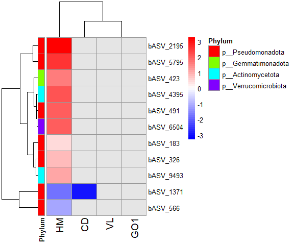<!-- -->

``` r
#6.2
pheatmap(AllAcc_lfc2,
          clustering_distance_rows = dist(AllAcc_lfc2_clu),
          clustering_distance_cols = dist(t(AllAcc_lfc_clu)),
          color = colorRampPalette(c("blue", "white", "red"))(50),
          breaks = seq(-max_abs, max_abs, length.out = 51),
          #main = "Differentially abundant taxa (log2FC by Family)",
          fontsize_row = 10,
          fontsize_col = 14,
          na_col = "grey90",
          angle_col = 90, 
          annotation_row = tax2["Phylum"],
          annotation_colors = phylums_colors2)
```

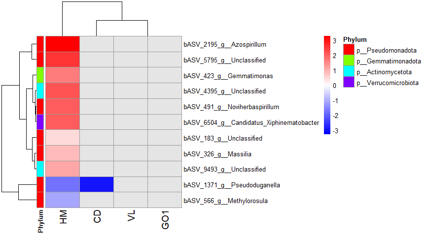<!-- -->

``` r
#4.8
pheatmap(AllAcc_lfc,
          clustering_distance_rows = dist(AllAcc_lfc_clu),
          clustering_distance_cols = dist(t(AllAcc_lfc_clu)),
          color = colorRampPalette(c("blue", "white", "red"))(50),
          breaks = seq(-max_abs, max_abs, length.out = 51),
          #main = "Differentially abundant taxa (log2FC by Family)",
          fontsize_row = 10,
          fontsize_col = 14,
          na_col = "grey90",
          angle_col = 90, 
          annotation_row = tax["Class"],
          annotation_colors = phylums_colors)
```

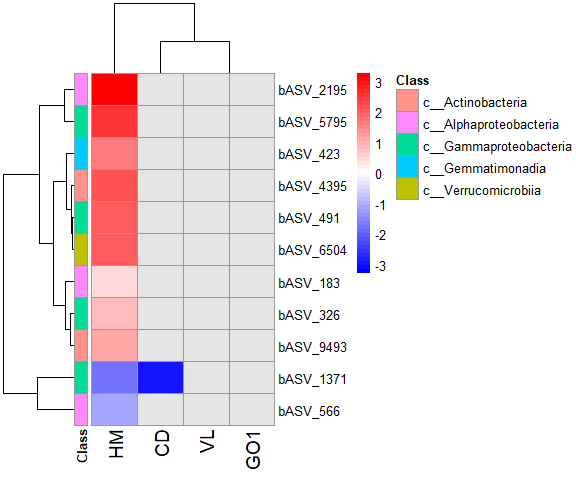<!-- -->

``` r
#6.5
pheatmap(AllAcc_lfc2,
          clustering_distance_rows = dist(AllAcc_lfc2_clu),
          clustering_distance_cols = dist(t(AllAcc_lfc_clu)),
          color = colorRampPalette(c("blue", "white", "red"))(50),
          breaks = seq(-max_abs, max_abs, length.out = 51),
          #main = "Differentially abundant taxa (log2FC by Family)",
          fontsize_row = 10,
          fontsize_col = 14,
          na_col = "grey90",
          angle_col = 90, 
          annotation_row = tax2[5:6],
          annotation_colors = phylums_colors2)
```

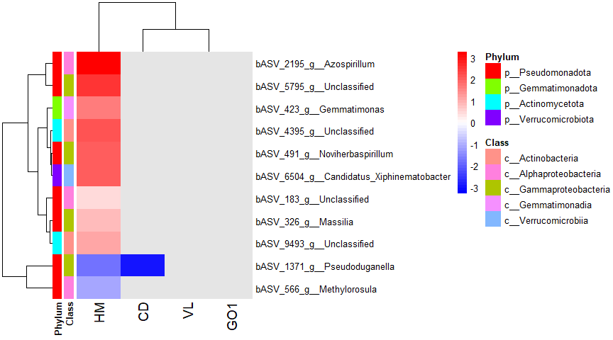<!-- -->

``` r
# Clean environment
rm(list = ls())
```
