# 6.0 load libraries
### Load libraries

``` r
R.version$version.string # prints R version
```

```
## [1] "R version 4.5.1 (2025-06-13 ucrt)"
```

``` r
library(phyloseq)
packageVersion("phyloseq")
```

```
## [1] '1.52.0'
```

``` r
library(vegan)
packageVersion("vegan")
```

```
## [1] '2.7.2'
```

``` r
library(ggplot2)
packageVersion("ggplot2")
```

```
## [1] '4.0.0'
```

``` r
library(patchwork) # for wrap_plot
packageVersion("patchwork")
```

```
## [1] '1.3.2'
```

``` r
library(scales)
packageVersion("scales")
```

```
## [1] '1.4.0'
```

# 6.3 ASV - Caterpillar performance correlations HM
## Load data

``` r
# Selection of DA ASVs of VL, HM, overlap VL and HM and DA in All data. Object made in upset plot file
load(file = "C:/Users/kreek001/OneDrive - Wageningen University & Research/Chapters/Experimental Chapter 3/RScripts/GitHub/Data/R_objects/FP_DA_SummaryFiles/SummaryFiles_ASVLevel/Selction_DA_ASVs.RData")

# load ps object
load("C:/Users/kreek001/OneDrive - Wageningen University & Research/Chapters/Experimental Chapter 3/RScripts/GitHub/Data/R_objects/FP_unnormalized_bac_ps_ForDA_clean.RData")
```

## Set relative abundance

``` r
# Calculate relative abundance
FP_ps <- transform_sample_counts(FP_unnormalized_bac_ps_ForDA_clean, function(x) x / sum(x))
```

## Prepare data set

``` r
# make one vector with unique ASVs
ASVs <- Selction_DA_ASVs$HM_twoDAtests

# Only select HM
FP_ps <- subset_samples(FP_ps, Accession == "HM")

# prune ps object
FP_ps <- prune_taxa(ASVs, FP_ps) #only keep taxa that are in ASVs vector
#length(intersect(ASVs, taxa_names(FP_unnormalized_bac_ps_ForDA_clean))) # check overlap
#setdiff(ASVs, taxa_names(FP_unnormalized_bac_ps_ForDA_clean)) # check difference

# Phyloseq object to data frame with relative abundance, meta data and taxonomy
FP_ps <- psmelt(FP_ps)

# remove NAs cat weight
FP_ps[is.na(FP_ps$Mean_Weight_Cat), 1:10]
```

```
##  [1] OTU               Sample            Abundance         Phase_PSF        
##  [5] SampleNr          Accession         Domestication     Cat_treatment    
##  [9] Soil_conditioning TreatmentNr      
## <0 rows> (or 0-length row.names)
```

``` r
FP_ps <- FP_ps[!is.na(FP_ps$Mean_Weight_Cat), ]
```

### Remove ASVs with only 0s

``` r
# identify ASVs with zero abundance
Abund_sum <- aggregate(FP_ps$Abundance, by = list(FP_ps$OTU), FUN = sum)
Abund_sum[Abund_sum$x == 0, ]
```

```
## [1] Group.1 x      
## <0 rows> (or 0-length row.names)
```

``` r
Abund_zero <- Abund_sum[Abund_sum$x == 0, "Group.1"]

# Remove ASVs
FP_ps <- FP_ps[!(FP_ps$OTU %in% Abund_zero), ]
ASVs <- ASVs[!ASVs %in% Abund_zero]
```

## Plot
### Function for plot

``` r
Plot1 <- function(x, title) {
  ggplot(data = FP_ps[FP_ps$OTU == x, ], aes(x = Abundance, y = Mean_Weight_Cat)) +
    geom_point() +
    geom_smooth(method = lm, se = FALSE) +
    # coord_cartesian(xlim = c(0, NA), ylim = c(0, NA)) +
    # scale_y_continuous(expand = c(0, 0)) +
    # scale_x_continuous(expand = c(0, 0)) +
    ggtitle(title) +
    xlab("ASV abundance") +
    ylab("Caterpillar weight") +
    theme(panel.background = element_rect(fill = "white"), #theme of the graph
          panel.border = element_blank(),
          axis.line = element_line(), #show line for x and y axis
          plot.title = element_text(size = 12, hjust = 0),
          axis.text = element_text(size = 8, color = "black"),
          axis.title = element_text(size = 12),
          axis.title.x = element_text(vjust = -0.5),
          axis.title.y = element_text(vjust = 2.5), #, hjust = -0
          strip.text = element_text(size = 13),
          legend.position = "right")
}
```

## Model assumptions
### Assumptions with graphs

``` r
NormTest <- function(dat, title) {
  hist(dat, prob = TRUE, col = "grey", main = title) #distribution histogram
  lines(density(dat), col = "blue", lwd = 2)
  
  qqnorm(dat)
  qqline(dat)
  
  print(shapiro.test(dat))
}

# Caterpillar performance
par(mfrow = c(1, 2))
NormTest(dat = FP_ps[FP_ps$OTU == "bASV_42", "Mean_Weight_Cat"], title = "b")
```

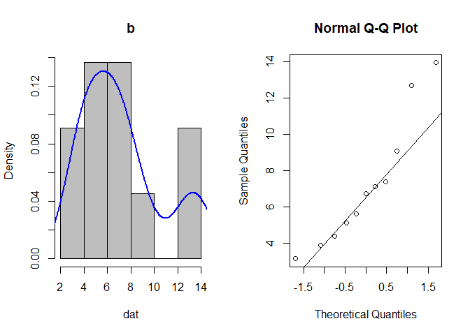<!-- -->

```
## 
## 	Shapiro-Wilk normality test
## 
## data:  dat
## W = 0.89935, p-value = 0.1815
```

``` r
par(mfrow = c(1, 1))
```

### Assumptions only Shapriro Wilk test

``` r
# Abundance
Shap_res_ab <- list()
for(i in 1:length(ASVs)) {
  Shap_res_ab[[i]] <- shapiro.test(FP_ps[FP_ps$OTU == ASVs[i], "Abundance"])
}
names(Shap_res_ab) <- ASVs
Shap_res_ab
```

```
## $bASV_1
## 
## 	Shapiro-Wilk normality test
## 
## data:  FP_ps[FP_ps$OTU == ASVs[i], "Abundance"]
## W = 0.83474, p-value = 0.02694
## 
## 
## $bASV_1002
## 
## 	Shapiro-Wilk normality test
## 
## data:  FP_ps[FP_ps$OTU == ASVs[i], "Abundance"]
## W = 0.78206, p-value = 0.005464
## 
## 
## $bASV_1003
## 
## 	Shapiro-Wilk normality test
## 
## data:  FP_ps[FP_ps$OTU == ASVs[i], "Abundance"]
## W = 0.83465, p-value = 0.02687
## 
## 
## $bASV_1034
## 
## 	Shapiro-Wilk normality test
## 
## data:  FP_ps[FP_ps$OTU == ASVs[i], "Abundance"]
## W = 0.87862, p-value = 0.09993
## 
## 
## $bASV_1062
## 
## 	Shapiro-Wilk normality test
## 
## data:  FP_ps[FP_ps$OTU == ASVs[i], "Abundance"]
## W = 0.85821, p-value = 0.05458
## 
## 
## $bASV_107
## 
## 	Shapiro-Wilk normality test
## 
## data:  FP_ps[FP_ps$OTU == ASVs[i], "Abundance"]
## W = 0.88319, p-value = 0.1142
## 
## 
## $bASV_1071
## 
## 	Shapiro-Wilk normality test
## 
## data:  FP_ps[FP_ps$OTU == ASVs[i], "Abundance"]
## W = 0.82919, p-value = 0.02278
## 
## 
## $bASV_1077
## 
## 	Shapiro-Wilk normality test
## 
## data:  FP_ps[FP_ps$OTU == ASVs[i], "Abundance"]
## W = 0.93357, p-value = 0.4481
## 
## 
## $bASV_10830
## 
## 	Shapiro-Wilk normality test
## 
## data:  FP_ps[FP_ps$OTU == ASVs[i], "Abundance"]
## W = 0.57752, p-value = 1.338e-05
## 
## 
## $bASV_109
## 
## 	Shapiro-Wilk normality test
## 
## data:  FP_ps[FP_ps$OTU == ASVs[i], "Abundance"]
## W = 0.80587, p-value = 0.01124
## 
## 
## $bASV_1092
## 
## 	Shapiro-Wilk normality test
## 
## data:  FP_ps[FP_ps$OTU == ASVs[i], "Abundance"]
## W = 0.85103, p-value = 0.04402
## 
## 
## $bASV_1107
## 
## 	Shapiro-Wilk normality test
## 
## data:  FP_ps[FP_ps$OTU == ASVs[i], "Abundance"]
## W = 0.8115, p-value = 0.01333
## 
## 
## $bASV_1108
## 
## 	Shapiro-Wilk normality test
## 
## data:  FP_ps[FP_ps$OTU == ASVs[i], "Abundance"]
## W = 0.83419, p-value = 0.0265
## 
## 
## $bASV_1114
## 
## 	Shapiro-Wilk normality test
## 
## data:  FP_ps[FP_ps$OTU == ASVs[i], "Abundance"]
## W = 0.92469, p-value = 0.3597
## 
## 
## $bASV_11148
## 
## 	Shapiro-Wilk normality test
## 
## data:  FP_ps[FP_ps$OTU == ASVs[i], "Abundance"]
## W = 0.49041, p-value = 1.162e-06
## 
## 
## $bASV_1139
## 
## 	Shapiro-Wilk normality test
## 
## data:  FP_ps[FP_ps$OTU == ASVs[i], "Abundance"]
## W = 0.84005, p-value = 0.03163
## 
## 
## $bASV_1153
## 
## 	Shapiro-Wilk normality test
## 
## data:  FP_ps[FP_ps$OTU == ASVs[i], "Abundance"]
## W = 0.69388, p-value = 0.0003904
## 
## 
## $bASV_1163
## 
## 	Shapiro-Wilk normality test
## 
## data:  FP_ps[FP_ps$OTU == ASVs[i], "Abundance"]
## W = 0.75171, p-value = 0.002188
## 
## 
## $bASV_1164
## 
## 	Shapiro-Wilk normality test
## 
## data:  FP_ps[FP_ps$OTU == ASVs[i], "Abundance"]
## W = 0.64401, p-value = 9.052e-05
## 
## 
## $bASV_11668
## 
## 	Shapiro-Wilk normality test
## 
## data:  FP_ps[FP_ps$OTU == ASVs[i], "Abundance"]
## W = 0.63045, p-value = 6.109e-05
## 
## 
## $bASV_1177
## 
## 	Shapiro-Wilk normality test
## 
## data:  FP_ps[FP_ps$OTU == ASVs[i], "Abundance"]
## W = 0.62996, p-value = 6.022e-05
## 
## 
## $bASV_1202
## 
## 	Shapiro-Wilk normality test
## 
## data:  FP_ps[FP_ps$OTU == ASVs[i], "Abundance"]
## W = 0.91818, p-value = 0.3038
## 
## 
## $bASV_1231
## 
## 	Shapiro-Wilk normality test
## 
## data:  FP_ps[FP_ps$OTU == ASVs[i], "Abundance"]
## W = 0.8605, p-value = 0.05844
## 
## 
## $bASV_1259
## 
## 	Shapiro-Wilk normality test
## 
## data:  FP_ps[FP_ps$OTU == ASVs[i], "Abundance"]
## W = 0.70419, p-value = 0.0005296
## 
## 
## $bASV_126
## 
## 	Shapiro-Wilk normality test
## 
## data:  FP_ps[FP_ps$OTU == ASVs[i], "Abundance"]
## W = 0.84283, p-value = 0.03439
## 
## 
## $bASV_12754
## 
## 	Shapiro-Wilk normality test
## 
## data:  FP_ps[FP_ps$OTU == ASVs[i], "Abundance"]
## W = 0.61429, p-value = 3.831e-05
## 
## 
## $bASV_1289
## 
## 	Shapiro-Wilk normality test
## 
## data:  FP_ps[FP_ps$OTU == ASVs[i], "Abundance"]
## W = 0.7809, p-value = 0.005276
## 
## 
## $bASV_129
## 
## 	Shapiro-Wilk normality test
## 
## data:  FP_ps[FP_ps$OTU == ASVs[i], "Abundance"]
## W = 0.9486, p-value = 0.6261
## 
## 
## $bASV_1293
## 
## 	Shapiro-Wilk normality test
## 
## data:  FP_ps[FP_ps$OTU == ASVs[i], "Abundance"]
## W = 0.60638, p-value = 3.053e-05
## 
## 
## $bASV_13076
## 
## 	Shapiro-Wilk normality test
## 
## data:  FP_ps[FP_ps$OTU == ASVs[i], "Abundance"]
## W = 0.48907, p-value = 1.12e-06
## 
## 
## $bASV_13121
## 
## 	Shapiro-Wilk normality test
## 
## data:  FP_ps[FP_ps$OTU == ASVs[i], "Abundance"]
## W = 0.49041, p-value = 1.162e-06
## 
## 
## $bASV_1315
## 
## 	Shapiro-Wilk normality test
## 
## data:  FP_ps[FP_ps$OTU == ASVs[i], "Abundance"]
## W = 0.91617, p-value = 0.288
## 
## 
## $bASV_1325
## 
## 	Shapiro-Wilk normality test
## 
## data:  FP_ps[FP_ps$OTU == ASVs[i], "Abundance"]
## W = 0.76816, p-value = 0.003591
## 
## 
## $bASV_1345
## 
## 	Shapiro-Wilk normality test
## 
## data:  FP_ps[FP_ps$OTU == ASVs[i], "Abundance"]
## W = 0.6607, p-value = 0.0001472
## 
## 
## $bASV_1354
## 
## 	Shapiro-Wilk normality test
## 
## data:  FP_ps[FP_ps$OTU == ASVs[i], "Abundance"]
## W = 0.69758, p-value = 0.0004354
## 
## 
## $bASV_1366
## 
## 	Shapiro-Wilk normality test
## 
## data:  FP_ps[FP_ps$OTU == ASVs[i], "Abundance"]
## W = 0.71037, p-value = 0.0006362
## 
## 
## $bASV_1371
## 
## 	Shapiro-Wilk normality test
## 
## data:  FP_ps[FP_ps$OTU == ASVs[i], "Abundance"]
## W = 0.94153, p-value = 0.5387
## 
## 
## $bASV_1385
## 
## 	Shapiro-Wilk normality test
## 
## data:  FP_ps[FP_ps$OTU == ASVs[i], "Abundance"]
## W = 0.7847, p-value = 0.005919
## 
## 
## $bASV_1405
## 
## 	Shapiro-Wilk normality test
## 
## data:  FP_ps[FP_ps$OTU == ASVs[i], "Abundance"]
## W = 0.83968, p-value = 0.03128
## 
## 
## $bASV_141
## 
## 	Shapiro-Wilk normality test
## 
## data:  FP_ps[FP_ps$OTU == ASVs[i], "Abundance"]
## W = 0.87282, p-value = 0.08426
## 
## 
## $bASV_1428
## 
## 	Shapiro-Wilk normality test
## 
## data:  FP_ps[FP_ps$OTU == ASVs[i], "Abundance"]
## W = 0.7076, p-value = 0.0005859
## 
## 
## $bASV_1446
## 
## 	Shapiro-Wilk normality test
## 
## data:  FP_ps[FP_ps$OTU == ASVs[i], "Abundance"]
## W = 0.76745, p-value = 0.003515
## 
## 
## $bASV_1463
## 
## 	Shapiro-Wilk normality test
## 
## data:  FP_ps[FP_ps$OTU == ASVs[i], "Abundance"]
## W = 0.80237, p-value = 0.01011
## 
## 
## $bASV_148
## 
## 	Shapiro-Wilk normality test
## 
## data:  FP_ps[FP_ps$OTU == ASVs[i], "Abundance"]
## W = 0.93602, p-value = 0.4749
## 
## 
## $bASV_149
## 
## 	Shapiro-Wilk normality test
## 
## data:  FP_ps[FP_ps$OTU == ASVs[i], "Abundance"]
## W = 0.92558, p-value = 0.3679
## 
## 
## $bASV_1499
## 
## 	Shapiro-Wilk normality test
## 
## data:  FP_ps[FP_ps$OTU == ASVs[i], "Abundance"]
## W = 0.82719, p-value = 0.02144
## 
## 
## $bASV_15018
## 
## 	Shapiro-Wilk normality test
## 
## data:  FP_ps[FP_ps$OTU == ASVs[i], "Abundance"]
## W = 0.48753, p-value = 1.073e-06
## 
## 
## $bASV_1515
## 
## 	Shapiro-Wilk normality test
## 
## data:  FP_ps[FP_ps$OTU == ASVs[i], "Abundance"]
## W = 0.71778, p-value = 0.0007929
## 
## 
## $bASV_1520
## 
## 	Shapiro-Wilk normality test
## 
## data:  FP_ps[FP_ps$OTU == ASVs[i], "Abundance"]
## W = 0.74602, p-value = 0.001844
## 
## 
## $bASV_1522
## 
## 	Shapiro-Wilk normality test
## 
## data:  FP_ps[FP_ps$OTU == ASVs[i], "Abundance"]
## W = 0.88738, p-value = 0.1289
## 
## 
## $bASV_1538
## 
## 	Shapiro-Wilk normality test
## 
## data:  FP_ps[FP_ps$OTU == ASVs[i], "Abundance"]
## W = 0.69322, p-value = 0.0003827
## 
## 
## $bASV_1539
## 
## 	Shapiro-Wilk normality test
## 
## data:  FP_ps[FP_ps$OTU == ASVs[i], "Abundance"]
## W = 0.83643, p-value = 0.02835
## 
## 
## $bASV_1544
## 
## 	Shapiro-Wilk normality test
## 
## data:  FP_ps[FP_ps$OTU == ASVs[i], "Abundance"]
## W = 0.77085, p-value = 0.003894
## 
## 
## $bASV_1564
## 
## 	Shapiro-Wilk normality test
## 
## data:  FP_ps[FP_ps$OTU == ASVs[i], "Abundance"]
## W = 0.87761, p-value = 0.09701
## 
## 
## $bASV_1575
## 
## 	Shapiro-Wilk normality test
## 
## data:  FP_ps[FP_ps$OTU == ASVs[i], "Abundance"]
## W = 0.57793, p-value = 1.354e-05
## 
## 
## $bASV_1584
## 
## 	Shapiro-Wilk normality test
## 
## data:  FP_ps[FP_ps$OTU == ASVs[i], "Abundance"]
## W = 0.62802, p-value = 5.695e-05
## 
## 
## $bASV_1593
## 
## 	Shapiro-Wilk normality test
## 
## data:  FP_ps[FP_ps$OTU == ASVs[i], "Abundance"]
## W = 0.87368, p-value = 0.08642
## 
## 
## $bASV_1602
## 
## 	Shapiro-Wilk normality test
## 
## data:  FP_ps[FP_ps$OTU == ASVs[i], "Abundance"]
## W = 0.8772, p-value = 0.09585
## 
## 
## $bASV_1603
## 
## 	Shapiro-Wilk normality test
## 
## data:  FP_ps[FP_ps$OTU == ASVs[i], "Abundance"]
## W = 0.61421, p-value = 3.823e-05
## 
## 
## $bASV_1618
## 
## 	Shapiro-Wilk normality test
## 
## data:  FP_ps[FP_ps$OTU == ASVs[i], "Abundance"]
## W = 0.7187, p-value = 0.000815
## 
## 
## $bASV_1665
## 
## 	Shapiro-Wilk normality test
## 
## data:  FP_ps[FP_ps$OTU == ASVs[i], "Abundance"]
## W = 0.67159, p-value = 0.0002025
## 
## 
## $bASV_1730
## 
## 	Shapiro-Wilk normality test
## 
## data:  FP_ps[FP_ps$OTU == ASVs[i], "Abundance"]
## W = 0.83789, p-value = 0.02963
## 
## 
## $bASV_1742
## 
## 	Shapiro-Wilk normality test
## 
## data:  FP_ps[FP_ps$OTU == ASVs[i], "Abundance"]
## W = 0.88288, p-value = 0.1132
## 
## 
## $bASV_176
## 
## 	Shapiro-Wilk normality test
## 
## data:  FP_ps[FP_ps$OTU == ASVs[i], "Abundance"]
## W = 0.80118, p-value = 0.009751
## 
## 
## $bASV_1762
## 
## 	Shapiro-Wilk normality test
## 
## data:  FP_ps[FP_ps$OTU == ASVs[i], "Abundance"]
## W = 0.68693, p-value = 0.0003179
## 
## 
## $bASV_178
## 
## 	Shapiro-Wilk normality test
## 
## data:  FP_ps[FP_ps$OTU == ASVs[i], "Abundance"]
## W = 0.83815, p-value = 0.02987
## 
## 
## $bASV_1780
## 
## 	Shapiro-Wilk normality test
## 
## data:  FP_ps[FP_ps$OTU == ASVs[i], "Abundance"]
## W = 0.76744, p-value = 0.003514
## 
## 
## $bASV_179
## 
## 	Shapiro-Wilk normality test
## 
## data:  FP_ps[FP_ps$OTU == ASVs[i], "Abundance"]
## W = 0.92201, p-value = 0.3357
## 
## 
## $bASV_1801
## 
## 	Shapiro-Wilk normality test
## 
## data:  FP_ps[FP_ps$OTU == ASVs[i], "Abundance"]
## W = 0.91239, p-value = 0.2603
## 
## 
## $bASV_182
## 
## 	Shapiro-Wilk normality test
## 
## data:  FP_ps[FP_ps$OTU == ASVs[i], "Abundance"]
## W = 0.91252, p-value = 0.2612
## 
## 
## $bASV_183
## 
## 	Shapiro-Wilk normality test
## 
## data:  FP_ps[FP_ps$OTU == ASVs[i], "Abundance"]
## W = 0.93256, p-value = 0.4373
## 
## 
## $bASV_1853
## 
## 	Shapiro-Wilk normality test
## 
## data:  FP_ps[FP_ps$OTU == ASVs[i], "Abundance"]
## W = 0.78794, p-value = 0.006528
## 
## 
## $bASV_187
## 
## 	Shapiro-Wilk normality test
## 
## data:  FP_ps[FP_ps$OTU == ASVs[i], "Abundance"]
## W = 0.94853, p-value = 0.6253
## 
## 
## $bASV_1899
## 
## 	Shapiro-Wilk normality test
## 
## data:  FP_ps[FP_ps$OTU == ASVs[i], "Abundance"]
## W = 0.60208, p-value = 2.698e-05
## 
## 
## $bASV_190
## 
## 	Shapiro-Wilk normality test
## 
## data:  FP_ps[FP_ps$OTU == ASVs[i], "Abundance"]
## W = 0.91916, p-value = 0.3117
## 
## 
## $bASV_1908
## 
## 	Shapiro-Wilk normality test
## 
## data:  FP_ps[FP_ps$OTU == ASVs[i], "Abundance"]
## W = 0.86174, p-value = 0.06065
## 
## 
## $bASV_19120
## 
## 	Shapiro-Wilk normality test
## 
## data:  FP_ps[FP_ps$OTU == ASVs[i], "Abundance"]
## W = 0.49041, p-value = 1.162e-06
## 
## 
## $bASV_1933
## 
## 	Shapiro-Wilk normality test
## 
## data:  FP_ps[FP_ps$OTU == ASVs[i], "Abundance"]
## W = 0.78744, p-value = 0.006431
## 
## 
## $bASV_1934
## 
## 	Shapiro-Wilk normality test
## 
## data:  FP_ps[FP_ps$OTU == ASVs[i], "Abundance"]
## W = 0.7746, p-value = 0.004362
## 
## 
## $bASV_1940
## 
## 	Shapiro-Wilk normality test
## 
## data:  FP_ps[FP_ps$OTU == ASVs[i], "Abundance"]
## W = 0.75757, p-value = 0.00261
## 
## 
## $bASV_1962
## 
## 	Shapiro-Wilk normality test
## 
## data:  FP_ps[FP_ps$OTU == ASVs[i], "Abundance"]
## W = 0.69605, p-value = 0.0004161
## 
## 
## $bASV_1963
## 
## 	Shapiro-Wilk normality test
## 
## data:  FP_ps[FP_ps$OTU == ASVs[i], "Abundance"]
## W = 0.8645, p-value = 0.06585
## 
## 
## $bASV_1969
## 
## 	Shapiro-Wilk normality test
## 
## data:  FP_ps[FP_ps$OTU == ASVs[i], "Abundance"]
## W = 0.84794, p-value = 0.04012
## 
## 
## $bASV_1988
## 
## 	Shapiro-Wilk normality test
## 
## data:  FP_ps[FP_ps$OTU == ASVs[i], "Abundance"]
## W = 0.77364, p-value = 0.004237
## 
## 
## $bASV_202
## 
## 	Shapiro-Wilk normality test
## 
## data:  FP_ps[FP_ps$OTU == ASVs[i], "Abundance"]
## W = 0.8127, p-value = 0.01382
## 
## 
## $bASV_203
## 
## 	Shapiro-Wilk normality test
## 
## data:  FP_ps[FP_ps$OTU == ASVs[i], "Abundance"]
## W = 0.89265, p-value = 0.15
## 
## 
## $bASV_2062
## 
## 	Shapiro-Wilk normality test
## 
## data:  FP_ps[FP_ps$OTU == ASVs[i], "Abundance"]
## W = 0.79887, p-value = 0.009092
## 
## 
## $bASV_2105
## 
## 	Shapiro-Wilk normality test
## 
## data:  FP_ps[FP_ps$OTU == ASVs[i], "Abundance"]
## W = 0.78559, p-value = 0.006081
## 
## 
## $bASV_2132
## 
## 	Shapiro-Wilk normality test
## 
## data:  FP_ps[FP_ps$OTU == ASVs[i], "Abundance"]
## W = 0.58602, p-value = 1.705e-05
## 
## 
## $bASV_2145
## 
## 	Shapiro-Wilk normality test
## 
## data:  FP_ps[FP_ps$OTU == ASVs[i], "Abundance"]
## W = 0.61076, p-value = 3.462e-05
## 
## 
## $bASV_2163
## 
## 	Shapiro-Wilk normality test
## 
## data:  FP_ps[FP_ps$OTU == ASVs[i], "Abundance"]
## W = 0.76922, p-value = 0.003707
## 
## 
## $bASV_2188
## 
## 	Shapiro-Wilk normality test
## 
## data:  FP_ps[FP_ps$OTU == ASVs[i], "Abundance"]
## W = 0.74581, p-value = 0.001833
## 
## 
## $bASV_2195
## 
## 	Shapiro-Wilk normality test
## 
## data:  FP_ps[FP_ps$OTU == ASVs[i], "Abundance"]
## W = 0.83946, p-value = 0.03107
## 
## 
## $bASV_2218
## 
## 	Shapiro-Wilk normality test
## 
## data:  FP_ps[FP_ps$OTU == ASVs[i], "Abundance"]
## W = 0.88686, p-value = 0.127
## 
## 
## $bASV_2258
## 
## 	Shapiro-Wilk normality test
## 
## data:  FP_ps[FP_ps$OTU == ASVs[i], "Abundance"]
## W = 0.7182, p-value = 0.000803
## 
## 
## $bASV_227
## 
## 	Shapiro-Wilk normality test
## 
## data:  FP_ps[FP_ps$OTU == ASVs[i], "Abundance"]
## W = 0.83835, p-value = 0.03005
## 
## 
## $bASV_2277
## 
## 	Shapiro-Wilk normality test
## 
## data:  FP_ps[FP_ps$OTU == ASVs[i], "Abundance"]
## W = 0.88872, p-value = 0.134
## 
## 
## $bASV_228
## 
## 	Shapiro-Wilk normality test
## 
## data:  FP_ps[FP_ps$OTU == ASVs[i], "Abundance"]
## W = 0.91605, p-value = 0.2871
## 
## 
## $bASV_2290
## 
## 	Shapiro-Wilk normality test
## 
## data:  FP_ps[FP_ps$OTU == ASVs[i], "Abundance"]
## W = 0.78812, p-value = 0.006565
## 
## 
## $bASV_22948
## 
## 	Shapiro-Wilk normality test
## 
## data:  FP_ps[FP_ps$OTU == ASVs[i], "Abundance"]
## W = 0.49076, p-value = 1.174e-06
## 
## 
## $bASV_2299
## 
## 	Shapiro-Wilk normality test
## 
## data:  FP_ps[FP_ps$OTU == ASVs[i], "Abundance"]
## W = 0.71128, p-value = 0.0006536
## 
## 
## $bASV_234
## 
## 	Shapiro-Wilk normality test
## 
## data:  FP_ps[FP_ps$OTU == ASVs[i], "Abundance"]
## W = 0.88394, p-value = 0.1167
## 
## 
## $bASV_2352
## 
## 	Shapiro-Wilk normality test
## 
## data:  FP_ps[FP_ps$OTU == ASVs[i], "Abundance"]
## W = 0.69417, p-value = 0.0003937
## 
## 
## $bASV_2358
## 
## 	Shapiro-Wilk normality test
## 
## data:  FP_ps[FP_ps$OTU == ASVs[i], "Abundance"]
## W = 0.70466, p-value = 0.0005371
## 
## 
## $bASV_2368
## 
## 	Shapiro-Wilk normality test
## 
## data:  FP_ps[FP_ps$OTU == ASVs[i], "Abundance"]
## W = 0.78078, p-value = 0.005256
## 
## 
## $bASV_2378
## 
## 	Shapiro-Wilk normality test
## 
## data:  FP_ps[FP_ps$OTU == ASVs[i], "Abundance"]
## W = 0.79098, p-value = 0.007158
## 
## 
## $bASV_2387
## 
## 	Shapiro-Wilk normality test
## 
## data:  FP_ps[FP_ps$OTU == ASVs[i], "Abundance"]
## W = 0.62227, p-value = 4.822e-05
## 
## 
## $bASV_2393
## 
## 	Shapiro-Wilk normality test
## 
## data:  FP_ps[FP_ps$OTU == ASVs[i], "Abundance"]
## W = 0.77731, p-value = 0.004734
## 
## 
## $bASV_2425
## 
## 	Shapiro-Wilk normality test
## 
## data:  FP_ps[FP_ps$OTU == ASVs[i], "Abundance"]
## W = 0.55694, p-value = 7.469e-06
## 
## 
## $bASV_243
## 
## 	Shapiro-Wilk normality test
## 
## data:  FP_ps[FP_ps$OTU == ASVs[i], "Abundance"]
## W = 0.81275, p-value = 0.01384
## 
## 
## $bASV_2502
## 
## 	Shapiro-Wilk normality test
## 
## data:  FP_ps[FP_ps$OTU == ASVs[i], "Abundance"]
## W = 0.88388, p-value = 0.1165
## 
## 
## $bASV_254
## 
## 	Shapiro-Wilk normality test
## 
## data:  FP_ps[FP_ps$OTU == ASVs[i], "Abundance"]
## W = 0.83535, p-value = 0.02745
## 
## 
## $bASV_2540
## 
## 	Shapiro-Wilk normality test
## 
## data:  FP_ps[FP_ps$OTU == ASVs[i], "Abundance"]
## W = 0.7579, p-value = 0.002636
## 
## 
## $bASV_2565
## 
## 	Shapiro-Wilk normality test
## 
## data:  FP_ps[FP_ps$OTU == ASVs[i], "Abundance"]
## W = 0.71767, p-value = 0.0007903
## 
## 
## $bASV_2577
## 
## 	Shapiro-Wilk normality test
## 
## data:  FP_ps[FP_ps$OTU == ASVs[i], "Abundance"]
## W = 0.63006, p-value = 6.04e-05
## 
## 
## $bASV_2650
## 
## 	Shapiro-Wilk normality test
## 
## data:  FP_ps[FP_ps$OTU == ASVs[i], "Abundance"]
## W = 0.69635, p-value = 0.0004198
## 
## 
## $bASV_2655
## 
## 	Shapiro-Wilk normality test
## 
## data:  FP_ps[FP_ps$OTU == ASVs[i], "Abundance"]
## W = 0.79962, p-value = 0.0093
## 
## 
## $bASV_268
## 
## 	Shapiro-Wilk normality test
## 
## data:  FP_ps[FP_ps$OTU == ASVs[i], "Abundance"]
## W = 0.86643, p-value = 0.06973
## 
## 
## $bASV_27
## 
## 	Shapiro-Wilk normality test
## 
## data:  FP_ps[FP_ps$OTU == ASVs[i], "Abundance"]
## W = 0.95817, p-value = 0.7486
## 
## 
## $bASV_2717
## 
## 	Shapiro-Wilk normality test
## 
## data:  FP_ps[FP_ps$OTU == ASVs[i], "Abundance"]
## W = 0.83797, p-value = 0.0297
## 
## 
## $bASV_2727
## 
## 	Shapiro-Wilk normality test
## 
## data:  FP_ps[FP_ps$OTU == ASVs[i], "Abundance"]
## W = 0.78068, p-value = 0.005242
## 
## 
## $bASV_2737
## 
## 	Shapiro-Wilk normality test
## 
## data:  FP_ps[FP_ps$OTU == ASVs[i], "Abundance"]
## W = 0.84329, p-value = 0.03488
## 
## 
## $bASV_2767
## 
## 	Shapiro-Wilk normality test
## 
## data:  FP_ps[FP_ps$OTU == ASVs[i], "Abundance"]
## W = 0.53672, p-value = 4.227e-06
## 
## 
## $bASV_2770
## 
## 	Shapiro-Wilk normality test
## 
## data:  FP_ps[FP_ps$OTU == ASVs[i], "Abundance"]
## W = 0.63045, p-value = 6.109e-05
## 
## 
## $bASV_279
## 
## 	Shapiro-Wilk normality test
## 
## data:  FP_ps[FP_ps$OTU == ASVs[i], "Abundance"]
## W = 0.89628, p-value = 0.1664
## 
## 
## $bASV_2861
## 
## 	Shapiro-Wilk normality test
## 
## data:  FP_ps[FP_ps$OTU == ASVs[i], "Abundance"]
## W = 0.78199, p-value = 0.005452
## 
## 
## $bASV_2867
## 
## 	Shapiro-Wilk normality test
## 
## data:  FP_ps[FP_ps$OTU == ASVs[i], "Abundance"]
## W = 0.87835, p-value = 0.09913
## 
## 
## $bASV_288
## 
## 	Shapiro-Wilk normality test
## 
## data:  FP_ps[FP_ps$OTU == ASVs[i], "Abundance"]
## W = 0.74677, p-value = 0.001887
## 
## 
## $bASV_292
## 
## 	Shapiro-Wilk normality test
## 
## data:  FP_ps[FP_ps$OTU == ASVs[i], "Abundance"]
## W = 0.83494, p-value = 0.02711
## 
## 
## $bASV_2949
## 
## 	Shapiro-Wilk normality test
## 
## data:  FP_ps[FP_ps$OTU == ASVs[i], "Abundance"]
## W = 0.85984, p-value = 0.05731
## 
## 
## $bASV_2955
## 
## 	Shapiro-Wilk normality test
## 
## data:  FP_ps[FP_ps$OTU == ASVs[i], "Abundance"]
## W = 0.62757, p-value = 5.62e-05
## 
## 
## $bASV_2973
## 
## 	Shapiro-Wilk normality test
## 
## data:  FP_ps[FP_ps$OTU == ASVs[i], "Abundance"]
## W = 0.61649, p-value = 4.083e-05
## 
## 
## $bASV_3
## 
## 	Shapiro-Wilk normality test
## 
## data:  FP_ps[FP_ps$OTU == ASVs[i], "Abundance"]
## W = 0.82272, p-value = 0.01873
## 
## 
## $bASV_3012
## 
## 	Shapiro-Wilk normality test
## 
## data:  FP_ps[FP_ps$OTU == ASVs[i], "Abundance"]
## W = 0.76916, p-value = 0.003701
## 
## 
## $bASV_3046
## 
## 	Shapiro-Wilk normality test
## 
## data:  FP_ps[FP_ps$OTU == ASVs[i], "Abundance"]
## W = 0.61703, p-value = 4.146e-05
## 
## 
## $bASV_309
## 
## 	Shapiro-Wilk normality test
## 
## data:  FP_ps[FP_ps$OTU == ASVs[i], "Abundance"]
## W = 0.82098, p-value = 0.01777
## 
## 
## $bASV_3138
## 
## 	Shapiro-Wilk normality test
## 
## data:  FP_ps[FP_ps$OTU == ASVs[i], "Abundance"]
## W = 0.71391, p-value = 0.0007067
## 
## 
## $bASV_3158
## 
## 	Shapiro-Wilk normality test
## 
## data:  FP_ps[FP_ps$OTU == ASVs[i], "Abundance"]
## W = 0.7415, p-value = 0.001611
## 
## 
## $bASV_326
## 
## 	Shapiro-Wilk normality test
## 
## data:  FP_ps[FP_ps$OTU == ASVs[i], "Abundance"]
## W = 0.83505, p-value = 0.0272
## 
## 
## $bASV_330
## 
## 	Shapiro-Wilk normality test
## 
## data:  FP_ps[FP_ps$OTU == ASVs[i], "Abundance"]
## W = 0.9081, p-value = 0.2315
## 
## 
## $bASV_3348
## 
## 	Shapiro-Wilk normality test
## 
## data:  FP_ps[FP_ps$OTU == ASVs[i], "Abundance"]
## W = 0.80569, p-value = 0.01118
## 
## 
## $bASV_335
## 
## 	Shapiro-Wilk normality test
## 
## data:  FP_ps[FP_ps$OTU == ASVs[i], "Abundance"]
## W = 0.96615, p-value = 0.8452
## 
## 
## $bASV_339
## 
## 	Shapiro-Wilk normality test
## 
## data:  FP_ps[FP_ps$OTU == ASVs[i], "Abundance"]
## W = 0.97539, p-value = 0.9352
## 
## 
## $bASV_3393
## 
## 	Shapiro-Wilk normality test
## 
## data:  FP_ps[FP_ps$OTU == ASVs[i], "Abundance"]
## W = 0.90373, p-value = 0.2052
## 
## 
## $bASV_3403
## 
## 	Shapiro-Wilk normality test
## 
## data:  FP_ps[FP_ps$OTU == ASVs[i], "Abundance"]
## W = 0.68237, p-value = 0.000278
## 
## 
## $bASV_3408
## 
## 	Shapiro-Wilk normality test
## 
## data:  FP_ps[FP_ps$OTU == ASVs[i], "Abundance"]
## W = 0.75214, p-value = 0.002216
## 
## 
## $bASV_345
## 
## 	Shapiro-Wilk normality test
## 
## data:  FP_ps[FP_ps$OTU == ASVs[i], "Abundance"]
## W = 0.91227, p-value = 0.2594
## 
## 
## $bASV_3469
## 
## 	Shapiro-Wilk normality test
## 
## data:  FP_ps[FP_ps$OTU == ASVs[i], "Abundance"]
## W = 0.62545, p-value = 5.286e-05
## 
## 
## $bASV_3504
## 
## 	Shapiro-Wilk normality test
## 
## data:  FP_ps[FP_ps$OTU == ASVs[i], "Abundance"]
## W = 0.7785, p-value = 0.004908
## 
## 
## $bASV_3526
## 
## 	Shapiro-Wilk normality test
## 
## data:  FP_ps[FP_ps$OTU == ASVs[i], "Abundance"]
## W = 0.69326, p-value = 0.0003832
## 
## 
## $bASV_3533
## 
## 	Shapiro-Wilk normality test
## 
## data:  FP_ps[FP_ps$OTU == ASVs[i], "Abundance"]
## W = 0.67277, p-value = 0.0002096
## 
## 
## $bASV_3537
## 
## 	Shapiro-Wilk normality test
## 
## data:  FP_ps[FP_ps$OTU == ASVs[i], "Abundance"]
## W = 0.62747, p-value = 5.604e-05
## 
## 
## $bASV_3546
## 
## 	Shapiro-Wilk normality test
## 
## data:  FP_ps[FP_ps$OTU == ASVs[i], "Abundance"]
## W = 0.61921, p-value = 4.415e-05
## 
## 
## $bASV_3547
## 
## 	Shapiro-Wilk normality test
## 
## data:  FP_ps[FP_ps$OTU == ASVs[i], "Abundance"]
## W = 0.59308, p-value = 2.085e-05
## 
## 
## $bASV_356
## 
## 	Shapiro-Wilk normality test
## 
## data:  FP_ps[FP_ps$OTU == ASVs[i], "Abundance"]
## W = 0.90153, p-value = 0.193
## 
## 
## $bASV_363
## 
## 	Shapiro-Wilk normality test
## 
## data:  FP_ps[FP_ps$OTU == ASVs[i], "Abundance"]
## W = 0.89625, p-value = 0.1663
## 
## 
## $bASV_3660
## 
## 	Shapiro-Wilk normality test
## 
## data:  FP_ps[FP_ps$OTU == ASVs[i], "Abundance"]
## W = 0.70023, p-value = 0.000471
## 
## 
## $bASV_3726
## 
## 	Shapiro-Wilk normality test
## 
## data:  FP_ps[FP_ps$OTU == ASVs[i], "Abundance"]
## W = 0.62102, p-value = 4.652e-05
## 
## 
## $bASV_376
## 
## 	Shapiro-Wilk normality test
## 
## data:  FP_ps[FP_ps$OTU == ASVs[i], "Abundance"]
## W = 0.71318, p-value = 0.0006915
## 
## 
## $bASV_3768
## 
## 	Shapiro-Wilk normality test
## 
## data:  FP_ps[FP_ps$OTU == ASVs[i], "Abundance"]
## W = 0.67469, p-value = 0.0002218
## 
## 
## $bASV_378
## 
## 	Shapiro-Wilk normality test
## 
## data:  FP_ps[FP_ps$OTU == ASVs[i], "Abundance"]
## W = 0.8807, p-value = 0.1062
## 
## 
## $bASV_382
## 
## 	Shapiro-Wilk normality test
## 
## data:  FP_ps[FP_ps$OTU == ASVs[i], "Abundance"]
## W = 0.81655, p-value = 0.01553
## 
## 
## $bASV_3823
## 
## 	Shapiro-Wilk normality test
## 
## data:  FP_ps[FP_ps$OTU == ASVs[i], "Abundance"]
## W = 0.59668, p-value = 2.312e-05
## 
## 
## $bASV_385
## 
## 	Shapiro-Wilk normality test
## 
## data:  FP_ps[FP_ps$OTU == ASVs[i], "Abundance"]
## W = 0.93942, p-value = 0.5137
## 
## 
## $bASV_3862
## 
## 	Shapiro-Wilk normality test
## 
## data:  FP_ps[FP_ps$OTU == ASVs[i], "Abundance"]
## W = 0.86204, p-value = 0.06119
## 
## 
## $bASV_3920
## 
## 	Shapiro-Wilk normality test
## 
## data:  FP_ps[FP_ps$OTU == ASVs[i], "Abundance"]
## W = 0.77815, p-value = 0.004855
## 
## 
## $bASV_394
## 
## 	Shapiro-Wilk normality test
## 
## data:  FP_ps[FP_ps$OTU == ASVs[i], "Abundance"]
## W = 0.84881, p-value = 0.04118
## 
## 
## $bASV_3962
## 
## 	Shapiro-Wilk normality test
## 
## data:  FP_ps[FP_ps$OTU == ASVs[i], "Abundance"]
## W = 0.68829, p-value = 0.000331
## 
## 
## $bASV_397
## 
## 	Shapiro-Wilk normality test
## 
## data:  FP_ps[FP_ps$OTU == ASVs[i], "Abundance"]
## W = 0.94181, p-value = 0.542
## 
## 
## $bASV_4036
## 
## 	Shapiro-Wilk normality test
## 
## data:  FP_ps[FP_ps$OTU == ASVs[i], "Abundance"]
## W = 0.5925, p-value = 2.051e-05
## 
## 
## $bASV_4079
## 
## 	Shapiro-Wilk normality test
## 
## data:  FP_ps[FP_ps$OTU == ASVs[i], "Abundance"]
## W = 0.72024, p-value = 0.0008533
## 
## 
## $bASV_410
## 
## 	Shapiro-Wilk normality test
## 
## data:  FP_ps[FP_ps$OTU == ASVs[i], "Abundance"]
## W = 0.70523, p-value = 0.0005461
## 
## 
## $bASV_411
## 
## 	Shapiro-Wilk normality test
## 
## data:  FP_ps[FP_ps$OTU == ASVs[i], "Abundance"]
## W = 0.83188, p-value = 0.02471
## 
## 
## $bASV_4116
## 
## 	Shapiro-Wilk normality test
## 
## data:  FP_ps[FP_ps$OTU == ASVs[i], "Abundance"]
## W = 0.61982, p-value = 4.493e-05
## 
## 
## $bASV_412
## 
## 	Shapiro-Wilk normality test
## 
## data:  FP_ps[FP_ps$OTU == ASVs[i], "Abundance"]
## W = 0.75508, p-value = 0.002421
## 
## 
## $bASV_4149
## 
## 	Shapiro-Wilk normality test
## 
## data:  FP_ps[FP_ps$OTU == ASVs[i], "Abundance"]
## W = 0.62316, p-value = 4.948e-05
## 
## 
## $bASV_416
## 
## 	Shapiro-Wilk normality test
## 
## data:  FP_ps[FP_ps$OTU == ASVs[i], "Abundance"]
## W = 0.61313, p-value = 3.707e-05
## 
## 
## $bASV_42
## 
## 	Shapiro-Wilk normality test
## 
## data:  FP_ps[FP_ps$OTU == ASVs[i], "Abundance"]
## W = 0.85826, p-value = 0.05466
## 
## 
## $bASV_423
## 
## 	Shapiro-Wilk normality test
## 
## data:  FP_ps[FP_ps$OTU == ASVs[i], "Abundance"]
## W = 0.93743, p-value = 0.4908
## 
## 
## $bASV_430
## 
## 	Shapiro-Wilk normality test
## 
## data:  FP_ps[FP_ps$OTU == ASVs[i], "Abundance"]
## W = 0.90437, p-value = 0.2089
## 
## 
## $bASV_4314
## 
## 	Shapiro-Wilk normality test
## 
## data:  FP_ps[FP_ps$OTU == ASVs[i], "Abundance"]
## W = 0.63137, p-value = 6.273e-05
## 
## 
## $bASV_4395
## 
## 	Shapiro-Wilk normality test
## 
## data:  FP_ps[FP_ps$OTU == ASVs[i], "Abundance"]
## W = 0.64167, p-value = 8.456e-05
## 
## 
## $bASV_4415
## 
## 	Shapiro-Wilk normality test
## 
## data:  FP_ps[FP_ps$OTU == ASVs[i], "Abundance"]
## W = 0.61415, p-value = 3.817e-05
## 
## 
## $bASV_45
## 
## 	Shapiro-Wilk normality test
## 
## data:  FP_ps[FP_ps$OTU == ASVs[i], "Abundance"]
## W = 0.95029, p-value = 0.6477
## 
## 
## $bASV_4528
## 
## 	Shapiro-Wilk normality test
## 
## data:  FP_ps[FP_ps$OTU == ASVs[i], "Abundance"]
## W = 0.5964, p-value = 2.294e-05
## 
## 
## $bASV_4569
## 
## 	Shapiro-Wilk normality test
## 
## data:  FP_ps[FP_ps$OTU == ASVs[i], "Abundance"]
## W = 0.71119, p-value = 0.0006518
## 
## 
## $bASV_464
## 
## 	Shapiro-Wilk normality test
## 
## data:  FP_ps[FP_ps$OTU == ASVs[i], "Abundance"]
## W = 0.90454, p-value = 0.2099
## 
## 
## $bASV_4655
## 
## 	Shapiro-Wilk normality test
## 
## data:  FP_ps[FP_ps$OTU == ASVs[i], "Abundance"]
## W = 0.56587, p-value = 9.616e-06
## 
## 
## $bASV_4664
## 
## 	Shapiro-Wilk normality test
## 
## data:  FP_ps[FP_ps$OTU == ASVs[i], "Abundance"]
## W = 0.77831, p-value = 0.004879
## 
## 
## $bASV_474
## 
## 	Shapiro-Wilk normality test
## 
## data:  FP_ps[FP_ps$OTU == ASVs[i], "Abundance"]
## W = 0.93076, p-value = 0.4186
## 
## 
## $bASV_4762
## 
## 	Shapiro-Wilk normality test
## 
## data:  FP_ps[FP_ps$OTU == ASVs[i], "Abundance"]
## W = 0.7033, p-value = 0.0005159
## 
## 
## $bASV_477
## 
## 	Shapiro-Wilk normality test
## 
## data:  FP_ps[FP_ps$OTU == ASVs[i], "Abundance"]
## W = 0.85203, p-value = 0.04536
## 
## 
## $bASV_4802
## 
## 	Shapiro-Wilk normality test
## 
## data:  FP_ps[FP_ps$OTU == ASVs[i], "Abundance"]
## W = 0.61429, p-value = 3.831e-05
## 
## 
## $bASV_483
## 
## 	Shapiro-Wilk normality test
## 
## data:  FP_ps[FP_ps$OTU == ASVs[i], "Abundance"]
## W = 0.92569, p-value = 0.3689
## 
## 
## $bASV_4871
## 
## 	Shapiro-Wilk normality test
## 
## data:  FP_ps[FP_ps$OTU == ASVs[i], "Abundance"]
## W = 0.71018, p-value = 0.0006327
## 
## 
## $bASV_4872
## 
## 	Shapiro-Wilk normality test
## 
## data:  FP_ps[FP_ps$OTU == ASVs[i], "Abundance"]
## W = 0.61205, p-value = 3.593e-05
## 
## 
## $bASV_491
## 
## 	Shapiro-Wilk normality test
## 
## data:  FP_ps[FP_ps$OTU == ASVs[i], "Abundance"]
## W = 0.83522, p-value = 0.02734
## 
## 
## $bASV_4912
## 
## 	Shapiro-Wilk normality test
## 
## data:  FP_ps[FP_ps$OTU == ASVs[i], "Abundance"]
## W = 0.60083, p-value = 2.603e-05
## 
## 
## $bASV_496
## 
## 	Shapiro-Wilk normality test
## 
## data:  FP_ps[FP_ps$OTU == ASVs[i], "Abundance"]
## W = 0.76812, p-value = 0.003587
## 
## 
## $bASV_499
## 
## 	Shapiro-Wilk normality test
## 
## data:  FP_ps[FP_ps$OTU == ASVs[i], "Abundance"]
## W = 0.93543, p-value = 0.4683
## 
## 
## $bASV_5
## 
## 	Shapiro-Wilk normality test
## 
## data:  FP_ps[FP_ps$OTU == ASVs[i], "Abundance"]
## W = 0.93046, p-value = 0.4155
## 
## 
## $bASV_5015
## 
## 	Shapiro-Wilk normality test
## 
## data:  FP_ps[FP_ps$OTU == ASVs[i], "Abundance"]
## W = 0.60327, p-value = 2.792e-05
## 
## 
## $bASV_5040
## 
## 	Shapiro-Wilk normality test
## 
## data:  FP_ps[FP_ps$OTU == ASVs[i], "Abundance"]
## W = 0.58797, p-value = 1.802e-05
## 
## 
## $bASV_510
## 
## 	Shapiro-Wilk normality test
## 
## data:  FP_ps[FP_ps$OTU == ASVs[i], "Abundance"]
## W = 0.86962, p-value = 0.07665
## 
## 
## $bASV_511
## 
## 	Shapiro-Wilk normality test
## 
## data:  FP_ps[FP_ps$OTU == ASVs[i], "Abundance"]
## W = 0.97815, p-value = 0.955
## 
## 
## $bASV_515
## 
## 	Shapiro-Wilk normality test
## 
## data:  FP_ps[FP_ps$OTU == ASVs[i], "Abundance"]
## W = 0.90326, p-value = 0.2025
## 
## 
## $bASV_5307
## 
## 	Shapiro-Wilk normality test
## 
## data:  FP_ps[FP_ps$OTU == ASVs[i], "Abundance"]
## W = 0.71429, p-value = 0.0007148
## 
## 
## $bASV_5339
## 
## 	Shapiro-Wilk normality test
## 
## data:  FP_ps[FP_ps$OTU == ASVs[i], "Abundance"]
## W = 0.57752, p-value = 1.338e-05
## 
## 
## $bASV_541
## 
## 	Shapiro-Wilk normality test
## 
## data:  FP_ps[FP_ps$OTU == ASVs[i], "Abundance"]
## W = 0.82991, p-value = 0.02328
## 
## 
## $bASV_542
## 
## 	Shapiro-Wilk normality test
## 
## data:  FP_ps[FP_ps$OTU == ASVs[i], "Abundance"]
## W = 0.77047, p-value = 0.003851
## 
## 
## $bASV_5456
## 
## 	Shapiro-Wilk normality test
## 
## data:  FP_ps[FP_ps$OTU == ASVs[i], "Abundance"]
## W = 0.6177, p-value = 4.227e-05
## 
## 
## $bASV_5497
## 
## 	Shapiro-Wilk normality test
## 
## data:  FP_ps[FP_ps$OTU == ASVs[i], "Abundance"]
## W = 0.757, p-value = 0.002566
## 
## 
## $bASV_5529
## 
## 	Shapiro-Wilk normality test
## 
## data:  FP_ps[FP_ps$OTU == ASVs[i], "Abundance"]
## W = 0.67596, p-value = 0.0002302
## 
## 
## $bASV_557
## 
## 	Shapiro-Wilk normality test
## 
## data:  FP_ps[FP_ps$OTU == ASVs[i], "Abundance"]
## W = 0.79688, p-value = 0.00856
## 
## 
## $bASV_561
## 
## 	Shapiro-Wilk normality test
## 
## data:  FP_ps[FP_ps$OTU == ASVs[i], "Abundance"]
## W = 0.95455, p-value = 0.7024
## 
## 
## $bASV_564
## 
## 	Shapiro-Wilk normality test
## 
## data:  FP_ps[FP_ps$OTU == ASVs[i], "Abundance"]
## W = 0.79335, p-value = 0.00769
## 
## 
## $bASV_566
## 
## 	Shapiro-Wilk normality test
## 
## data:  FP_ps[FP_ps$OTU == ASVs[i], "Abundance"]
## W = 0.91179, p-value = 0.2561
## 
## 
## $bASV_5682
## 
## 	Shapiro-Wilk normality test
## 
## data:  FP_ps[FP_ps$OTU == ASVs[i], "Abundance"]
## W = 0.48871, p-value = 1.109e-06
## 
## 
## $bASV_5762
## 
## 	Shapiro-Wilk normality test
## 
## data:  FP_ps[FP_ps$OTU == ASVs[i], "Abundance"]
## W = 0.80683, p-value = 0.01157
## 
## 
## $bASV_5791
## 
## 	Shapiro-Wilk normality test
## 
## data:  FP_ps[FP_ps$OTU == ASVs[i], "Abundance"]
## W = 0.62551, p-value = 5.296e-05
## 
## 
## $bASV_5795
## 
## 	Shapiro-Wilk normality test
## 
## data:  FP_ps[FP_ps$OTU == ASVs[i], "Abundance"]
## W = 0.82256, p-value = 0.01864
## 
## 
## $bASV_5864
## 
## 	Shapiro-Wilk normality test
## 
## data:  FP_ps[FP_ps$OTU == ASVs[i], "Abundance"]
## W = 0.62096, p-value = 4.644e-05
## 
## 
## $bASV_5893
## 
## 	Shapiro-Wilk normality test
## 
## data:  FP_ps[FP_ps$OTU == ASVs[i], "Abundance"]
## W = 0.57875, p-value = 1.386e-05
## 
## 
## $bASV_617
## 
## 	Shapiro-Wilk normality test
## 
## data:  FP_ps[FP_ps$OTU == ASVs[i], "Abundance"]
## W = 0.84417, p-value = 0.03581
## 
## 
## $bASV_62
## 
## 	Shapiro-Wilk normality test
## 
## data:  FP_ps[FP_ps$OTU == ASVs[i], "Abundance"]
## W = 0.91482, p-value = 0.2778
## 
## 
## $bASV_6343
## 
## 	Shapiro-Wilk normality test
## 
## data:  FP_ps[FP_ps$OTU == ASVs[i], "Abundance"]
## W = 0.63049, p-value = 6.116e-05
## 
## 
## $bASV_6380
## 
## 	Shapiro-Wilk normality test
## 
## data:  FP_ps[FP_ps$OTU == ASVs[i], "Abundance"]
## W = 0.52768, p-value = 3.28e-06
## 
## 
## $bASV_65
## 
## 	Shapiro-Wilk normality test
## 
## data:  FP_ps[FP_ps$OTU == ASVs[i], "Abundance"]
## W = 0.9131, p-value = 0.2653
## 
## 
## $bASV_650
## 
## 	Shapiro-Wilk normality test
## 
## data:  FP_ps[FP_ps$OTU == ASVs[i], "Abundance"]
## W = 0.62435, p-value = 5.121e-05
## 
## 
## $bASV_6504
## 
## 	Shapiro-Wilk normality test
## 
## data:  FP_ps[FP_ps$OTU == ASVs[i], "Abundance"]
## W = 0.78458, p-value = 0.005898
## 
## 
## $bASV_664
## 
## 	Shapiro-Wilk normality test
## 
## data:  FP_ps[FP_ps$OTU == ASVs[i], "Abundance"]
## W = 0.73939, p-value = 0.001512
## 
## 
## $bASV_670
## 
## 	Shapiro-Wilk normality test
## 
## data:  FP_ps[FP_ps$OTU == ASVs[i], "Abundance"]
## W = 0.91937, p-value = 0.3134
## 
## 
## $bASV_673
## 
## 	Shapiro-Wilk normality test
## 
## data:  FP_ps[FP_ps$OTU == ASVs[i], "Abundance"]
## W = 0.82308, p-value = 0.01894
## 
## 
## $bASV_69
## 
## 	Shapiro-Wilk normality test
## 
## data:  FP_ps[FP_ps$OTU == ASVs[i], "Abundance"]
## W = 0.80994, p-value = 0.01272
## 
## 
## $bASV_697
## 
## 	Shapiro-Wilk normality test
## 
## data:  FP_ps[FP_ps$OTU == ASVs[i], "Abundance"]
## W = 0.93773, p-value = 0.4941
## 
## 
## $bASV_7
## 
## 	Shapiro-Wilk normality test
## 
## data:  FP_ps[FP_ps$OTU == ASVs[i], "Abundance"]
## W = 0.79511, p-value = 0.008111
## 
## 
## $bASV_713
## 
## 	Shapiro-Wilk normality test
## 
## data:  FP_ps[FP_ps$OTU == ASVs[i], "Abundance"]
## W = 0.71129, p-value = 0.0006538
## 
## 
## $bASV_7274
## 
## 	Shapiro-Wilk normality test
## 
## data:  FP_ps[FP_ps$OTU == ASVs[i], "Abundance"]
## W = 0.57781, p-value = 1.35e-05
## 
## 
## $bASV_73
## 
## 	Shapiro-Wilk normality test
## 
## data:  FP_ps[FP_ps$OTU == ASVs[i], "Abundance"]
## W = 0.97057, p-value = 0.8922
## 
## 
## $bASV_7439
## 
## 	Shapiro-Wilk normality test
## 
## data:  FP_ps[FP_ps$OTU == ASVs[i], "Abundance"]
## W = 0.75023, p-value = 0.002093
## 
## 
## $bASV_753
## 
## 	Shapiro-Wilk normality test
## 
## data:  FP_ps[FP_ps$OTU == ASVs[i], "Abundance"]
## W = 0.91889, p-value = 0.3095
## 
## 
## $bASV_812
## 
## 	Shapiro-Wilk normality test
## 
## data:  FP_ps[FP_ps$OTU == ASVs[i], "Abundance"]
## W = 0.80904, p-value = 0.01237
## 
## 
## $bASV_8134
## 
## 	Shapiro-Wilk normality test
## 
## data:  FP_ps[FP_ps$OTU == ASVs[i], "Abundance"]
## W = 0.59964, p-value = 2.517e-05
## 
## 
## $bASV_8136
## 
## 	Shapiro-Wilk normality test
## 
## data:  FP_ps[FP_ps$OTU == ASVs[i], "Abundance"]
## W = 0.62224, p-value = 4.819e-05
## 
## 
## $bASV_8148
## 
## 	Shapiro-Wilk normality test
## 
## data:  FP_ps[FP_ps$OTU == ASVs[i], "Abundance"]
## W = 0.70973, p-value = 0.0006241
## 
## 
## $bASV_8223
## 
## 	Shapiro-Wilk normality test
## 
## data:  FP_ps[FP_ps$OTU == ASVs[i], "Abundance"]
## W = 0.56788, p-value = 1.018e-05
## 
## 
## $bASV_824
## 
## 	Shapiro-Wilk normality test
## 
## data:  FP_ps[FP_ps$OTU == ASVs[i], "Abundance"]
## W = 0.75867, p-value = 0.002698
## 
## 
## $bASV_831
## 
## 	Shapiro-Wilk normality test
## 
## data:  FP_ps[FP_ps$OTU == ASVs[i], "Abundance"]
## W = 0.95959, p-value = 0.7666
## 
## 
## $bASV_840
## 
## 	Shapiro-Wilk normality test
## 
## data:  FP_ps[FP_ps$OTU == ASVs[i], "Abundance"]
## W = 0.93351, p-value = 0.4474
## 
## 
## $bASV_8409
## 
## 	Shapiro-Wilk normality test
## 
## data:  FP_ps[FP_ps$OTU == ASVs[i], "Abundance"]
## W = 0.71641, p-value = 0.0007612
## 
## 
## $bASV_855
## 
## 	Shapiro-Wilk normality test
## 
## data:  FP_ps[FP_ps$OTU == ASVs[i], "Abundance"]
## W = 0.70619, p-value = 0.0005619
## 
## 
## $bASV_88
## 
## 	Shapiro-Wilk normality test
## 
## data:  FP_ps[FP_ps$OTU == ASVs[i], "Abundance"]
## W = 0.73883, p-value = 0.001487
## 
## 
## $bASV_8819
## 
## 	Shapiro-Wilk normality test
## 
## data:  FP_ps[FP_ps$OTU == ASVs[i], "Abundance"]
## W = 0.62883, p-value = 5.828e-05
## 
## 
## $bASV_910
## 
## 	Shapiro-Wilk normality test
## 
## data:  FP_ps[FP_ps$OTU == ASVs[i], "Abundance"]
## W = 0.84498, p-value = 0.0367
## 
## 
## $bASV_916
## 
## 	Shapiro-Wilk normality test
## 
## data:  FP_ps[FP_ps$OTU == ASVs[i], "Abundance"]
## W = 0.61917, p-value = 4.41e-05
## 
## 
## $bASV_928
## 
## 	Shapiro-Wilk normality test
## 
## data:  FP_ps[FP_ps$OTU == ASVs[i], "Abundance"]
## W = 0.88308, p-value = 0.1138
## 
## 
## $bASV_930
## 
## 	Shapiro-Wilk normality test
## 
## data:  FP_ps[FP_ps$OTU == ASVs[i], "Abundance"]
## W = 0.92301, p-value = 0.3445
## 
## 
## $bASV_9493
## 
## 	Shapiro-Wilk normality test
## 
## data:  FP_ps[FP_ps$OTU == ASVs[i], "Abundance"]
## W = 0.73864, p-value = 0.001479
## 
## 
## $bASV_9605
## 
## 	Shapiro-Wilk normality test
## 
## data:  FP_ps[FP_ps$OTU == ASVs[i], "Abundance"]
## W = 0.49076, p-value = 1.174e-06
## 
## 
## $bASV_961
## 
## 	Shapiro-Wilk normality test
## 
## data:  FP_ps[FP_ps$OTU == ASVs[i], "Abundance"]
## W = 0.8428, p-value = 0.03436
## 
## 
## $bASV_974
## 
## 	Shapiro-Wilk normality test
## 
## data:  FP_ps[FP_ps$OTU == ASVs[i], "Abundance"]
## W = 0.87388, p-value = 0.08694
## 
## 
## $bASV_9867
## 
## 	Shapiro-Wilk normality test
## 
## data:  FP_ps[FP_ps$OTU == ASVs[i], "Abundance"]
## W = 0.48907, p-value = 1.12e-06
## 
## 
## $bASV_9884
## 
## 	Shapiro-Wilk normality test
## 
## data:  FP_ps[FP_ps$OTU == ASVs[i], "Abundance"]
## W = 0.57918, p-value = 1.403e-05
## 
## 
## $bASV_991
## 
## 	Shapiro-Wilk normality test
## 
## data:  FP_ps[FP_ps$OTU == ASVs[i], "Abundance"]
## W = 0.82929, p-value = 0.02285
## 
## 
## $bASV_995
## 
## 	Shapiro-Wilk normality test
## 
## data:  FP_ps[FP_ps$OTU == ASVs[i], "Abundance"]
## W = 0.93442, p-value = 0.4573
```

## Correlation tests
### Run tests

``` r
CorTest2 <- function(x) {
  sub_data <- FP_ps[FP_ps$OTU == x, ]
  cs0 <- cor.test(sub_data$Abundance, sub_data$Mean_Weight_Cat, method = c("pearson")) # parametric
  cs1 <- cor.test(sub_data$Abundance, sub_data$Mean_Weight_Cat, method = c("spearman")) # non parametric
  cs2 <- cor.test(sub_data$Abundance, sub_data$Mean_Weight_Cat, method = c("kendall")) # non parametric
  rm(sub_data)
  
  # Make data frame with results
  Sum1 <- data.frame(Pearson_est = cs0$estimate, Pearson_stat = cs0$statistic, Pearson_pv = cs0$p.value,
                     Spearman_est = cs1$estimate, Spearman_stat = cs1$statistic, Spearman_pv = cs1$p.value, 
                     Kendall_est = cs2$estimate, Kendall_stat = cs2$statistic, Kendall_pv = cs2$p.value)
  rownames(Sum1) <- x
  return(Sum1)
}

# Run function
List_CorTest2 <- list() # make an empty list to store the plots

for (i in 1:length(ASVs)) {
  List_CorTest2[[i]] <- CorTest2(x = ASVs[i])
}
```

```
## Warning in cor.test.default(sub_data$Abundance, sub_data$Mean_Weight_Cat, :
## Cannot compute exact p-value with ties
```

```
## Warning in cor.test.default(sub_data$Abundance, sub_data$Mean_Weight_Cat, :
## Cannot compute exact p-value with ties
```

```
## Warning in cor.test.default(sub_data$Abundance, sub_data$Mean_Weight_Cat, :
## Cannot compute exact p-value with ties
```

```
## Warning in cor.test.default(sub_data$Abundance, sub_data$Mean_Weight_Cat, :
## Cannot compute exact p-value with ties
```

```
## Warning in cor.test.default(sub_data$Abundance, sub_data$Mean_Weight_Cat, :
## Cannot compute exact p-value with ties
```

```
## Warning in cor.test.default(sub_data$Abundance, sub_data$Mean_Weight_Cat, :
## Cannot compute exact p-value with ties
```

```
## Warning in cor.test.default(sub_data$Abundance, sub_data$Mean_Weight_Cat, :
## Cannot compute exact p-value with ties
```

```
## Warning in cor.test.default(sub_data$Abundance, sub_data$Mean_Weight_Cat, :
## Cannot compute exact p-value with ties
```

```
## Warning in cor.test.default(sub_data$Abundance, sub_data$Mean_Weight_Cat, :
## Cannot compute exact p-value with ties
```

```
## Warning in cor.test.default(sub_data$Abundance, sub_data$Mean_Weight_Cat, :
## Cannot compute exact p-value with ties
```

```
## Warning in cor.test.default(sub_data$Abundance, sub_data$Mean_Weight_Cat, :
## Cannot compute exact p-value with ties
```

```
## Warning in cor.test.default(sub_data$Abundance, sub_data$Mean_Weight_Cat, :
## Cannot compute exact p-value with ties
```

```
## Warning in cor.test.default(sub_data$Abundance, sub_data$Mean_Weight_Cat, :
## Cannot compute exact p-value with ties
```

```
## Warning in cor.test.default(sub_data$Abundance, sub_data$Mean_Weight_Cat, :
## Cannot compute exact p-value with ties
```

```
## Warning in cor.test.default(sub_data$Abundance, sub_data$Mean_Weight_Cat, :
## Cannot compute exact p-value with ties
```

```
## Warning in cor.test.default(sub_data$Abundance, sub_data$Mean_Weight_Cat, :
## Cannot compute exact p-value with ties
```

```
## Warning in cor.test.default(sub_data$Abundance, sub_data$Mean_Weight_Cat, :
## Cannot compute exact p-value with ties
```

```
## Warning in cor.test.default(sub_data$Abundance, sub_data$Mean_Weight_Cat, :
## Cannot compute exact p-value with ties
```

```
## Warning in cor.test.default(sub_data$Abundance, sub_data$Mean_Weight_Cat, :
## Cannot compute exact p-value with ties
```

```
## Warning in cor.test.default(sub_data$Abundance, sub_data$Mean_Weight_Cat, :
## Cannot compute exact p-value with ties
```

```
## Warning in cor.test.default(sub_data$Abundance, sub_data$Mean_Weight_Cat, :
## Cannot compute exact p-value with ties
```

```
## Warning in cor.test.default(sub_data$Abundance, sub_data$Mean_Weight_Cat, :
## Cannot compute exact p-value with ties
```

```
## Warning in cor.test.default(sub_data$Abundance, sub_data$Mean_Weight_Cat, :
## Cannot compute exact p-value with ties
```

```
## Warning in cor.test.default(sub_data$Abundance, sub_data$Mean_Weight_Cat, :
## Cannot compute exact p-value with ties
```

```
## Warning in cor.test.default(sub_data$Abundance, sub_data$Mean_Weight_Cat, :
## Cannot compute exact p-value with ties
```

```
## Warning in cor.test.default(sub_data$Abundance, sub_data$Mean_Weight_Cat, :
## Cannot compute exact p-value with ties
```

```
## Warning in cor.test.default(sub_data$Abundance, sub_data$Mean_Weight_Cat, :
## Cannot compute exact p-value with ties
```

```
## Warning in cor.test.default(sub_data$Abundance, sub_data$Mean_Weight_Cat, :
## Cannot compute exact p-value with ties
```

```
## Warning in cor.test.default(sub_data$Abundance, sub_data$Mean_Weight_Cat, :
## Cannot compute exact p-value with ties
```

```
## Warning in cor.test.default(sub_data$Abundance, sub_data$Mean_Weight_Cat, :
## Cannot compute exact p-value with ties
```

```
## Warning in cor.test.default(sub_data$Abundance, sub_data$Mean_Weight_Cat, :
## Cannot compute exact p-value with ties
```

```
## Warning in cor.test.default(sub_data$Abundance, sub_data$Mean_Weight_Cat, :
## Cannot compute exact p-value with ties
```

```
## Warning in cor.test.default(sub_data$Abundance, sub_data$Mean_Weight_Cat, :
## Cannot compute exact p-value with ties
```

```
## Warning in cor.test.default(sub_data$Abundance, sub_data$Mean_Weight_Cat, :
## Cannot compute exact p-value with ties
```

```
## Warning in cor.test.default(sub_data$Abundance, sub_data$Mean_Weight_Cat, :
## Cannot compute exact p-value with ties
```

```
## Warning in cor.test.default(sub_data$Abundance, sub_data$Mean_Weight_Cat, :
## Cannot compute exact p-value with ties
```

```
## Warning in cor.test.default(sub_data$Abundance, sub_data$Mean_Weight_Cat, :
## Cannot compute exact p-value with ties
```

```
## Warning in cor.test.default(sub_data$Abundance, sub_data$Mean_Weight_Cat, :
## Cannot compute exact p-value with ties
```

```
## Warning in cor.test.default(sub_data$Abundance, sub_data$Mean_Weight_Cat, :
## Cannot compute exact p-value with ties
```

```
## Warning in cor.test.default(sub_data$Abundance, sub_data$Mean_Weight_Cat, :
## Cannot compute exact p-value with ties
```

```
## Warning in cor.test.default(sub_data$Abundance, sub_data$Mean_Weight_Cat, :
## Cannot compute exact p-value with ties
```

```
## Warning in cor.test.default(sub_data$Abundance, sub_data$Mean_Weight_Cat, :
## Cannot compute exact p-value with ties
```

```
## Warning in cor.test.default(sub_data$Abundance, sub_data$Mean_Weight_Cat, :
## Cannot compute exact p-value with ties
```

```
## Warning in cor.test.default(sub_data$Abundance, sub_data$Mean_Weight_Cat, :
## Cannot compute exact p-value with ties
```

```
## Warning in cor.test.default(sub_data$Abundance, sub_data$Mean_Weight_Cat, :
## Cannot compute exact p-value with ties
```

```
## Warning in cor.test.default(sub_data$Abundance, sub_data$Mean_Weight_Cat, :
## Cannot compute exact p-value with ties
```

```
## Warning in cor.test.default(sub_data$Abundance, sub_data$Mean_Weight_Cat, :
## Cannot compute exact p-value with ties
```

```
## Warning in cor.test.default(sub_data$Abundance, sub_data$Mean_Weight_Cat, :
## Cannot compute exact p-value with ties
```

```
## Warning in cor.test.default(sub_data$Abundance, sub_data$Mean_Weight_Cat, :
## Cannot compute exact p-value with ties
```

```
## Warning in cor.test.default(sub_data$Abundance, sub_data$Mean_Weight_Cat, :
## Cannot compute exact p-value with ties
```

```
## Warning in cor.test.default(sub_data$Abundance, sub_data$Mean_Weight_Cat, :
## Cannot compute exact p-value with ties
```

```
## Warning in cor.test.default(sub_data$Abundance, sub_data$Mean_Weight_Cat, :
## Cannot compute exact p-value with ties
```

```
## Warning in cor.test.default(sub_data$Abundance, sub_data$Mean_Weight_Cat, :
## Cannot compute exact p-value with ties
```

```
## Warning in cor.test.default(sub_data$Abundance, sub_data$Mean_Weight_Cat, :
## Cannot compute exact p-value with ties
```

```
## Warning in cor.test.default(sub_data$Abundance, sub_data$Mean_Weight_Cat, :
## Cannot compute exact p-value with ties
```

```
## Warning in cor.test.default(sub_data$Abundance, sub_data$Mean_Weight_Cat, :
## Cannot compute exact p-value with ties
```

```
## Warning in cor.test.default(sub_data$Abundance, sub_data$Mean_Weight_Cat, :
## Cannot compute exact p-value with ties
```

```
## Warning in cor.test.default(sub_data$Abundance, sub_data$Mean_Weight_Cat, :
## Cannot compute exact p-value with ties
```

```
## Warning in cor.test.default(sub_data$Abundance, sub_data$Mean_Weight_Cat, :
## Cannot compute exact p-value with ties
```

```
## Warning in cor.test.default(sub_data$Abundance, sub_data$Mean_Weight_Cat, :
## Cannot compute exact p-value with ties
```

```
## Warning in cor.test.default(sub_data$Abundance, sub_data$Mean_Weight_Cat, :
## Cannot compute exact p-value with ties
```

```
## Warning in cor.test.default(sub_data$Abundance, sub_data$Mean_Weight_Cat, :
## Cannot compute exact p-value with ties
```

```
## Warning in cor.test.default(sub_data$Abundance, sub_data$Mean_Weight_Cat, :
## Cannot compute exact p-value with ties
```

```
## Warning in cor.test.default(sub_data$Abundance, sub_data$Mean_Weight_Cat, :
## Cannot compute exact p-value with ties
```

```
## Warning in cor.test.default(sub_data$Abundance, sub_data$Mean_Weight_Cat, :
## Cannot compute exact p-value with ties
```

```
## Warning in cor.test.default(sub_data$Abundance, sub_data$Mean_Weight_Cat, :
## Cannot compute exact p-value with ties
```

```
## Warning in cor.test.default(sub_data$Abundance, sub_data$Mean_Weight_Cat, :
## Cannot compute exact p-value with ties
```

```
## Warning in cor.test.default(sub_data$Abundance, sub_data$Mean_Weight_Cat, :
## Cannot compute exact p-value with ties
```

```
## Warning in cor.test.default(sub_data$Abundance, sub_data$Mean_Weight_Cat, :
## Cannot compute exact p-value with ties
```

```
## Warning in cor.test.default(sub_data$Abundance, sub_data$Mean_Weight_Cat, :
## Cannot compute exact p-value with ties
```

```
## Warning in cor.test.default(sub_data$Abundance, sub_data$Mean_Weight_Cat, :
## Cannot compute exact p-value with ties
```

```
## Warning in cor.test.default(sub_data$Abundance, sub_data$Mean_Weight_Cat, :
## Cannot compute exact p-value with ties
```

```
## Warning in cor.test.default(sub_data$Abundance, sub_data$Mean_Weight_Cat, :
## Cannot compute exact p-value with ties
```

```
## Warning in cor.test.default(sub_data$Abundance, sub_data$Mean_Weight_Cat, :
## Cannot compute exact p-value with ties
```

```
## Warning in cor.test.default(sub_data$Abundance, sub_data$Mean_Weight_Cat, :
## Cannot compute exact p-value with ties
```

```
## Warning in cor.test.default(sub_data$Abundance, sub_data$Mean_Weight_Cat, :
## Cannot compute exact p-value with ties
```

```
## Warning in cor.test.default(sub_data$Abundance, sub_data$Mean_Weight_Cat, :
## Cannot compute exact p-value with ties
```

```
## Warning in cor.test.default(sub_data$Abundance, sub_data$Mean_Weight_Cat, :
## Cannot compute exact p-value with ties
```

```
## Warning in cor.test.default(sub_data$Abundance, sub_data$Mean_Weight_Cat, :
## Cannot compute exact p-value with ties
```

```
## Warning in cor.test.default(sub_data$Abundance, sub_data$Mean_Weight_Cat, :
## Cannot compute exact p-value with ties
```

```
## Warning in cor.test.default(sub_data$Abundance, sub_data$Mean_Weight_Cat, :
## Cannot compute exact p-value with ties
```

```
## Warning in cor.test.default(sub_data$Abundance, sub_data$Mean_Weight_Cat, :
## Cannot compute exact p-value with ties
```

```
## Warning in cor.test.default(sub_data$Abundance, sub_data$Mean_Weight_Cat, :
## Cannot compute exact p-value with ties
```

```
## Warning in cor.test.default(sub_data$Abundance, sub_data$Mean_Weight_Cat, :
## Cannot compute exact p-value with ties
```

```
## Warning in cor.test.default(sub_data$Abundance, sub_data$Mean_Weight_Cat, :
## Cannot compute exact p-value with ties
```

```
## Warning in cor.test.default(sub_data$Abundance, sub_data$Mean_Weight_Cat, :
## Cannot compute exact p-value with ties
```

```
## Warning in cor.test.default(sub_data$Abundance, sub_data$Mean_Weight_Cat, :
## Cannot compute exact p-value with ties
```

```
## Warning in cor.test.default(sub_data$Abundance, sub_data$Mean_Weight_Cat, :
## Cannot compute exact p-value with ties
```

```
## Warning in cor.test.default(sub_data$Abundance, sub_data$Mean_Weight_Cat, :
## Cannot compute exact p-value with ties
```

```
## Warning in cor.test.default(sub_data$Abundance, sub_data$Mean_Weight_Cat, :
## Cannot compute exact p-value with ties
```

```
## Warning in cor.test.default(sub_data$Abundance, sub_data$Mean_Weight_Cat, :
## Cannot compute exact p-value with ties
```

```
## Warning in cor.test.default(sub_data$Abundance, sub_data$Mean_Weight_Cat, :
## Cannot compute exact p-value with ties
```

```
## Warning in cor.test.default(sub_data$Abundance, sub_data$Mean_Weight_Cat, :
## Cannot compute exact p-value with ties
```

```
## Warning in cor.test.default(sub_data$Abundance, sub_data$Mean_Weight_Cat, :
## Cannot compute exact p-value with ties
```

```
## Warning in cor.test.default(sub_data$Abundance, sub_data$Mean_Weight_Cat, :
## Cannot compute exact p-value with ties
```

```
## Warning in cor.test.default(sub_data$Abundance, sub_data$Mean_Weight_Cat, :
## Cannot compute exact p-value with ties
```

```
## Warning in cor.test.default(sub_data$Abundance, sub_data$Mean_Weight_Cat, :
## Cannot compute exact p-value with ties
```

```
## Warning in cor.test.default(sub_data$Abundance, sub_data$Mean_Weight_Cat, :
## Cannot compute exact p-value with ties
```

```
## Warning in cor.test.default(sub_data$Abundance, sub_data$Mean_Weight_Cat, :
## Cannot compute exact p-value with ties
```

```
## Warning in cor.test.default(sub_data$Abundance, sub_data$Mean_Weight_Cat, :
## Cannot compute exact p-value with ties
```

```
## Warning in cor.test.default(sub_data$Abundance, sub_data$Mean_Weight_Cat, :
## Cannot compute exact p-value with ties
```

```
## Warning in cor.test.default(sub_data$Abundance, sub_data$Mean_Weight_Cat, :
## Cannot compute exact p-value with ties
```

```
## Warning in cor.test.default(sub_data$Abundance, sub_data$Mean_Weight_Cat, :
## Cannot compute exact p-value with ties
```

```
## Warning in cor.test.default(sub_data$Abundance, sub_data$Mean_Weight_Cat, :
## Cannot compute exact p-value with ties
```

```
## Warning in cor.test.default(sub_data$Abundance, sub_data$Mean_Weight_Cat, :
## Cannot compute exact p-value with ties
```

```
## Warning in cor.test.default(sub_data$Abundance, sub_data$Mean_Weight_Cat, :
## Cannot compute exact p-value with ties
```

```
## Warning in cor.test.default(sub_data$Abundance, sub_data$Mean_Weight_Cat, :
## Cannot compute exact p-value with ties
```

```
## Warning in cor.test.default(sub_data$Abundance, sub_data$Mean_Weight_Cat, :
## Cannot compute exact p-value with ties
```

```
## Warning in cor.test.default(sub_data$Abundance, sub_data$Mean_Weight_Cat, :
## Cannot compute exact p-value with ties
```

```
## Warning in cor.test.default(sub_data$Abundance, sub_data$Mean_Weight_Cat, :
## Cannot compute exact p-value with ties
```

```
## Warning in cor.test.default(sub_data$Abundance, sub_data$Mean_Weight_Cat, :
## Cannot compute exact p-value with ties
```

```
## Warning in cor.test.default(sub_data$Abundance, sub_data$Mean_Weight_Cat, :
## Cannot compute exact p-value with ties
```

```
## Warning in cor.test.default(sub_data$Abundance, sub_data$Mean_Weight_Cat, :
## Cannot compute exact p-value with ties
```

```
## Warning in cor.test.default(sub_data$Abundance, sub_data$Mean_Weight_Cat, :
## Cannot compute exact p-value with ties
```

```
## Warning in cor.test.default(sub_data$Abundance, sub_data$Mean_Weight_Cat, :
## Cannot compute exact p-value with ties
```

```
## Warning in cor.test.default(sub_data$Abundance, sub_data$Mean_Weight_Cat, :
## Cannot compute exact p-value with ties
```

```
## Warning in cor.test.default(sub_data$Abundance, sub_data$Mean_Weight_Cat, :
## Cannot compute exact p-value with ties
```

```
## Warning in cor.test.default(sub_data$Abundance, sub_data$Mean_Weight_Cat, :
## Cannot compute exact p-value with ties
```

```
## Warning in cor.test.default(sub_data$Abundance, sub_data$Mean_Weight_Cat, :
## Cannot compute exact p-value with ties
```

```
## Warning in cor.test.default(sub_data$Abundance, sub_data$Mean_Weight_Cat, :
## Cannot compute exact p-value with ties
```

```
## Warning in cor.test.default(sub_data$Abundance, sub_data$Mean_Weight_Cat, :
## Cannot compute exact p-value with ties
```

```
## Warning in cor.test.default(sub_data$Abundance, sub_data$Mean_Weight_Cat, :
## Cannot compute exact p-value with ties
```

```
## Warning in cor.test.default(sub_data$Abundance, sub_data$Mean_Weight_Cat, :
## Cannot compute exact p-value with ties
```

```
## Warning in cor.test.default(sub_data$Abundance, sub_data$Mean_Weight_Cat, :
## Cannot compute exact p-value with ties
```

```
## Warning in cor.test.default(sub_data$Abundance, sub_data$Mean_Weight_Cat, :
## Cannot compute exact p-value with ties
```

```
## Warning in cor.test.default(sub_data$Abundance, sub_data$Mean_Weight_Cat, :
## Cannot compute exact p-value with ties
```

```
## Warning in cor.test.default(sub_data$Abundance, sub_data$Mean_Weight_Cat, :
## Cannot compute exact p-value with ties
```

```
## Warning in cor.test.default(sub_data$Abundance, sub_data$Mean_Weight_Cat, :
## Cannot compute exact p-value with ties
```

```
## Warning in cor.test.default(sub_data$Abundance, sub_data$Mean_Weight_Cat, :
## Cannot compute exact p-value with ties
```

```
## Warning in cor.test.default(sub_data$Abundance, sub_data$Mean_Weight_Cat, :
## Cannot compute exact p-value with ties
```

```
## Warning in cor.test.default(sub_data$Abundance, sub_data$Mean_Weight_Cat, :
## Cannot compute exact p-value with ties
```

```
## Warning in cor.test.default(sub_data$Abundance, sub_data$Mean_Weight_Cat, :
## Cannot compute exact p-value with ties
```

```
## Warning in cor.test.default(sub_data$Abundance, sub_data$Mean_Weight_Cat, :
## Cannot compute exact p-value with ties
```

```
## Warning in cor.test.default(sub_data$Abundance, sub_data$Mean_Weight_Cat, :
## Cannot compute exact p-value with ties
```

```
## Warning in cor.test.default(sub_data$Abundance, sub_data$Mean_Weight_Cat, :
## Cannot compute exact p-value with ties
```

```
## Warning in cor.test.default(sub_data$Abundance, sub_data$Mean_Weight_Cat, :
## Cannot compute exact p-value with ties
```

```
## Warning in cor.test.default(sub_data$Abundance, sub_data$Mean_Weight_Cat, :
## Cannot compute exact p-value with ties
```

```
## Warning in cor.test.default(sub_data$Abundance, sub_data$Mean_Weight_Cat, :
## Cannot compute exact p-value with ties
```

```
## Warning in cor.test.default(sub_data$Abundance, sub_data$Mean_Weight_Cat, :
## Cannot compute exact p-value with ties
```

```
## Warning in cor.test.default(sub_data$Abundance, sub_data$Mean_Weight_Cat, :
## Cannot compute exact p-value with ties
```

```
## Warning in cor.test.default(sub_data$Abundance, sub_data$Mean_Weight_Cat, :
## Cannot compute exact p-value with ties
```

```
## Warning in cor.test.default(sub_data$Abundance, sub_data$Mean_Weight_Cat, :
## Cannot compute exact p-value with ties
```

```
## Warning in cor.test.default(sub_data$Abundance, sub_data$Mean_Weight_Cat, :
## Cannot compute exact p-value with ties
```

```
## Warning in cor.test.default(sub_data$Abundance, sub_data$Mean_Weight_Cat, :
## Cannot compute exact p-value with ties
```

```
## Warning in cor.test.default(sub_data$Abundance, sub_data$Mean_Weight_Cat, :
## Cannot compute exact p-value with ties
```

```
## Warning in cor.test.default(sub_data$Abundance, sub_data$Mean_Weight_Cat, :
## Cannot compute exact p-value with ties
```

```
## Warning in cor.test.default(sub_data$Abundance, sub_data$Mean_Weight_Cat, :
## Cannot compute exact p-value with ties
```

```
## Warning in cor.test.default(sub_data$Abundance, sub_data$Mean_Weight_Cat, :
## Cannot compute exact p-value with ties
```

```
## Warning in cor.test.default(sub_data$Abundance, sub_data$Mean_Weight_Cat, :
## Cannot compute exact p-value with ties
```

```
## Warning in cor.test.default(sub_data$Abundance, sub_data$Mean_Weight_Cat, :
## Cannot compute exact p-value with ties
```

```
## Warning in cor.test.default(sub_data$Abundance, sub_data$Mean_Weight_Cat, :
## Cannot compute exact p-value with ties
```

```
## Warning in cor.test.default(sub_data$Abundance, sub_data$Mean_Weight_Cat, :
## Cannot compute exact p-value with ties
```

```
## Warning in cor.test.default(sub_data$Abundance, sub_data$Mean_Weight_Cat, :
## Cannot compute exact p-value with ties
```

```
## Warning in cor.test.default(sub_data$Abundance, sub_data$Mean_Weight_Cat, :
## Cannot compute exact p-value with ties
```

```
## Warning in cor.test.default(sub_data$Abundance, sub_data$Mean_Weight_Cat, :
## Cannot compute exact p-value with ties
```

```
## Warning in cor.test.default(sub_data$Abundance, sub_data$Mean_Weight_Cat, :
## Cannot compute exact p-value with ties
```

```
## Warning in cor.test.default(sub_data$Abundance, sub_data$Mean_Weight_Cat, :
## Cannot compute exact p-value with ties
```

```
## Warning in cor.test.default(sub_data$Abundance, sub_data$Mean_Weight_Cat, :
## Cannot compute exact p-value with ties
```

```
## Warning in cor.test.default(sub_data$Abundance, sub_data$Mean_Weight_Cat, :
## Cannot compute exact p-value with ties
```

```
## Warning in cor.test.default(sub_data$Abundance, sub_data$Mean_Weight_Cat, :
## Cannot compute exact p-value with ties
```

```
## Warning in cor.test.default(sub_data$Abundance, sub_data$Mean_Weight_Cat, :
## Cannot compute exact p-value with ties
```

```
## Warning in cor.test.default(sub_data$Abundance, sub_data$Mean_Weight_Cat, :
## Cannot compute exact p-value with ties
```

```
## Warning in cor.test.default(sub_data$Abundance, sub_data$Mean_Weight_Cat, :
## Cannot compute exact p-value with ties
```

```
## Warning in cor.test.default(sub_data$Abundance, sub_data$Mean_Weight_Cat, :
## Cannot compute exact p-value with ties
```

```
## Warning in cor.test.default(sub_data$Abundance, sub_data$Mean_Weight_Cat, :
## Cannot compute exact p-value with ties
```

```
## Warning in cor.test.default(sub_data$Abundance, sub_data$Mean_Weight_Cat, :
## Cannot compute exact p-value with ties
```

```
## Warning in cor.test.default(sub_data$Abundance, sub_data$Mean_Weight_Cat, :
## Cannot compute exact p-value with ties
```

```
## Warning in cor.test.default(sub_data$Abundance, sub_data$Mean_Weight_Cat, :
## Cannot compute exact p-value with ties
```

```
## Warning in cor.test.default(sub_data$Abundance, sub_data$Mean_Weight_Cat, :
## Cannot compute exact p-value with ties
```

```
## Warning in cor.test.default(sub_data$Abundance, sub_data$Mean_Weight_Cat, :
## Cannot compute exact p-value with ties
```

```
## Warning in cor.test.default(sub_data$Abundance, sub_data$Mean_Weight_Cat, :
## Cannot compute exact p-value with ties
```

```
## Warning in cor.test.default(sub_data$Abundance, sub_data$Mean_Weight_Cat, :
## Cannot compute exact p-value with ties
```

```
## Warning in cor.test.default(sub_data$Abundance, sub_data$Mean_Weight_Cat, :
## Cannot compute exact p-value with ties
```

```
## Warning in cor.test.default(sub_data$Abundance, sub_data$Mean_Weight_Cat, :
## Cannot compute exact p-value with ties
```

```
## Warning in cor.test.default(sub_data$Abundance, sub_data$Mean_Weight_Cat, :
## Cannot compute exact p-value with ties
```

```
## Warning in cor.test.default(sub_data$Abundance, sub_data$Mean_Weight_Cat, :
## Cannot compute exact p-value with ties
```

```
## Warning in cor.test.default(sub_data$Abundance, sub_data$Mean_Weight_Cat, :
## Cannot compute exact p-value with ties
```

```
## Warning in cor.test.default(sub_data$Abundance, sub_data$Mean_Weight_Cat, :
## Cannot compute exact p-value with ties
```

```
## Warning in cor.test.default(sub_data$Abundance, sub_data$Mean_Weight_Cat, :
## Cannot compute exact p-value with ties
```

```
## Warning in cor.test.default(sub_data$Abundance, sub_data$Mean_Weight_Cat, :
## Cannot compute exact p-value with ties
```

```
## Warning in cor.test.default(sub_data$Abundance, sub_data$Mean_Weight_Cat, :
## Cannot compute exact p-value with ties
```

```
## Warning in cor.test.default(sub_data$Abundance, sub_data$Mean_Weight_Cat, :
## Cannot compute exact p-value with ties
```

```
## Warning in cor.test.default(sub_data$Abundance, sub_data$Mean_Weight_Cat, :
## Cannot compute exact p-value with ties
```

```
## Warning in cor.test.default(sub_data$Abundance, sub_data$Mean_Weight_Cat, :
## Cannot compute exact p-value with ties
```

```
## Warning in cor.test.default(sub_data$Abundance, sub_data$Mean_Weight_Cat, :
## Cannot compute exact p-value with ties
```

```
## Warning in cor.test.default(sub_data$Abundance, sub_data$Mean_Weight_Cat, :
## Cannot compute exact p-value with ties
```

```
## Warning in cor.test.default(sub_data$Abundance, sub_data$Mean_Weight_Cat, :
## Cannot compute exact p-value with ties
```

```
## Warning in cor.test.default(sub_data$Abundance, sub_data$Mean_Weight_Cat, :
## Cannot compute exact p-value with ties
```

```
## Warning in cor.test.default(sub_data$Abundance, sub_data$Mean_Weight_Cat, :
## Cannot compute exact p-value with ties
```

```
## Warning in cor.test.default(sub_data$Abundance, sub_data$Mean_Weight_Cat, :
## Cannot compute exact p-value with ties
```

```
## Warning in cor.test.default(sub_data$Abundance, sub_data$Mean_Weight_Cat, :
## Cannot compute exact p-value with ties
```

```
## Warning in cor.test.default(sub_data$Abundance, sub_data$Mean_Weight_Cat, :
## Cannot compute exact p-value with ties
```

```
## Warning in cor.test.default(sub_data$Abundance, sub_data$Mean_Weight_Cat, :
## Cannot compute exact p-value with ties
```

```
## Warning in cor.test.default(sub_data$Abundance, sub_data$Mean_Weight_Cat, :
## Cannot compute exact p-value with ties
```

```
## Warning in cor.test.default(sub_data$Abundance, sub_data$Mean_Weight_Cat, :
## Cannot compute exact p-value with ties
```

```
## Warning in cor.test.default(sub_data$Abundance, sub_data$Mean_Weight_Cat, :
## Cannot compute exact p-value with ties
```

```
## Warning in cor.test.default(sub_data$Abundance, sub_data$Mean_Weight_Cat, :
## Cannot compute exact p-value with ties
```

```
## Warning in cor.test.default(sub_data$Abundance, sub_data$Mean_Weight_Cat, :
## Cannot compute exact p-value with ties
```

```
## Warning in cor.test.default(sub_data$Abundance, sub_data$Mean_Weight_Cat, :
## Cannot compute exact p-value with ties
```

```
## Warning in cor.test.default(sub_data$Abundance, sub_data$Mean_Weight_Cat, :
## Cannot compute exact p-value with ties
```

```
## Warning in cor.test.default(sub_data$Abundance, sub_data$Mean_Weight_Cat, :
## Cannot compute exact p-value with ties
```

```
## Warning in cor.test.default(sub_data$Abundance, sub_data$Mean_Weight_Cat, :
## Cannot compute exact p-value with ties
```

```
## Warning in cor.test.default(sub_data$Abundance, sub_data$Mean_Weight_Cat, :
## Cannot compute exact p-value with ties
```

```
## Warning in cor.test.default(sub_data$Abundance, sub_data$Mean_Weight_Cat, :
## Cannot compute exact p-value with ties
```

```
## Warning in cor.test.default(sub_data$Abundance, sub_data$Mean_Weight_Cat, :
## Cannot compute exact p-value with ties
```

```
## Warning in cor.test.default(sub_data$Abundance, sub_data$Mean_Weight_Cat, :
## Cannot compute exact p-value with ties
```

```
## Warning in cor.test.default(sub_data$Abundance, sub_data$Mean_Weight_Cat, :
## Cannot compute exact p-value with ties
```

```
## Warning in cor.test.default(sub_data$Abundance, sub_data$Mean_Weight_Cat, :
## Cannot compute exact p-value with ties
```

```
## Warning in cor.test.default(sub_data$Abundance, sub_data$Mean_Weight_Cat, :
## Cannot compute exact p-value with ties
```

```
## Warning in cor.test.default(sub_data$Abundance, sub_data$Mean_Weight_Cat, :
## Cannot compute exact p-value with ties
```

```
## Warning in cor.test.default(sub_data$Abundance, sub_data$Mean_Weight_Cat, :
## Cannot compute exact p-value with ties
```

```
## Warning in cor.test.default(sub_data$Abundance, sub_data$Mean_Weight_Cat, :
## Cannot compute exact p-value with ties
```

```
## Warning in cor.test.default(sub_data$Abundance, sub_data$Mean_Weight_Cat, :
## Cannot compute exact p-value with ties
```

```
## Warning in cor.test.default(sub_data$Abundance, sub_data$Mean_Weight_Cat, :
## Cannot compute exact p-value with ties
```

```
## Warning in cor.test.default(sub_data$Abundance, sub_data$Mean_Weight_Cat, :
## Cannot compute exact p-value with ties
```

```
## Warning in cor.test.default(sub_data$Abundance, sub_data$Mean_Weight_Cat, :
## Cannot compute exact p-value with ties
```

```
## Warning in cor.test.default(sub_data$Abundance, sub_data$Mean_Weight_Cat, :
## Cannot compute exact p-value with ties
```

```
## Warning in cor.test.default(sub_data$Abundance, sub_data$Mean_Weight_Cat, :
## Cannot compute exact p-value with ties
```

```
## Warning in cor.test.default(sub_data$Abundance, sub_data$Mean_Weight_Cat, :
## Cannot compute exact p-value with ties
```

```
## Warning in cor.test.default(sub_data$Abundance, sub_data$Mean_Weight_Cat, :
## Cannot compute exact p-value with ties
```

```
## Warning in cor.test.default(sub_data$Abundance, sub_data$Mean_Weight_Cat, :
## Cannot compute exact p-value with ties
```

```
## Warning in cor.test.default(sub_data$Abundance, sub_data$Mean_Weight_Cat, :
## Cannot compute exact p-value with ties
```

```
## Warning in cor.test.default(sub_data$Abundance, sub_data$Mean_Weight_Cat, :
## Cannot compute exact p-value with ties
```

```
## Warning in cor.test.default(sub_data$Abundance, sub_data$Mean_Weight_Cat, :
## Cannot compute exact p-value with ties
```

```
## Warning in cor.test.default(sub_data$Abundance, sub_data$Mean_Weight_Cat, :
## Cannot compute exact p-value with ties
```

```
## Warning in cor.test.default(sub_data$Abundance, sub_data$Mean_Weight_Cat, :
## Cannot compute exact p-value with ties
```

```
## Warning in cor.test.default(sub_data$Abundance, sub_data$Mean_Weight_Cat, :
## Cannot compute exact p-value with ties
```

```
## Warning in cor.test.default(sub_data$Abundance, sub_data$Mean_Weight_Cat, :
## Cannot compute exact p-value with ties
```

```
## Warning in cor.test.default(sub_data$Abundance, sub_data$Mean_Weight_Cat, :
## Cannot compute exact p-value with ties
```

```
## Warning in cor.test.default(sub_data$Abundance, sub_data$Mean_Weight_Cat, :
## Cannot compute exact p-value with ties
```

```
## Warning in cor.test.default(sub_data$Abundance, sub_data$Mean_Weight_Cat, :
## Cannot compute exact p-value with ties
```

```
## Warning in cor.test.default(sub_data$Abundance, sub_data$Mean_Weight_Cat, :
## Cannot compute exact p-value with ties
```

```
## Warning in cor.test.default(sub_data$Abundance, sub_data$Mean_Weight_Cat, :
## Cannot compute exact p-value with ties
```

```
## Warning in cor.test.default(sub_data$Abundance, sub_data$Mean_Weight_Cat, :
## Cannot compute exact p-value with ties
```

```
## Warning in cor.test.default(sub_data$Abundance, sub_data$Mean_Weight_Cat, :
## Cannot compute exact p-value with ties
```

```
## Warning in cor.test.default(sub_data$Abundance, sub_data$Mean_Weight_Cat, :
## Cannot compute exact p-value with ties
```

```
## Warning in cor.test.default(sub_data$Abundance, sub_data$Mean_Weight_Cat, :
## Cannot compute exact p-value with ties
```

```
## Warning in cor.test.default(sub_data$Abundance, sub_data$Mean_Weight_Cat, :
## Cannot compute exact p-value with ties
```

```
## Warning in cor.test.default(sub_data$Abundance, sub_data$Mean_Weight_Cat, :
## Cannot compute exact p-value with ties
```

```
## Warning in cor.test.default(sub_data$Abundance, sub_data$Mean_Weight_Cat, :
## Cannot compute exact p-value with ties
```

```
## Warning in cor.test.default(sub_data$Abundance, sub_data$Mean_Weight_Cat, :
## Cannot compute exact p-value with ties
```

```
## Warning in cor.test.default(sub_data$Abundance, sub_data$Mean_Weight_Cat, :
## Cannot compute exact p-value with ties
```

```
## Warning in cor.test.default(sub_data$Abundance, sub_data$Mean_Weight_Cat, :
## Cannot compute exact p-value with ties
```

```
## Warning in cor.test.default(sub_data$Abundance, sub_data$Mean_Weight_Cat, :
## Cannot compute exact p-value with ties
```

```
## Warning in cor.test.default(sub_data$Abundance, sub_data$Mean_Weight_Cat, :
## Cannot compute exact p-value with ties
```

```
## Warning in cor.test.default(sub_data$Abundance, sub_data$Mean_Weight_Cat, :
## Cannot compute exact p-value with ties
```

```
## Warning in cor.test.default(sub_data$Abundance, sub_data$Mean_Weight_Cat, :
## Cannot compute exact p-value with ties
```

```
## Warning in cor.test.default(sub_data$Abundance, sub_data$Mean_Weight_Cat, :
## Cannot compute exact p-value with ties
```

```
## Warning in cor.test.default(sub_data$Abundance, sub_data$Mean_Weight_Cat, :
## Cannot compute exact p-value with ties
```

```
## Warning in cor.test.default(sub_data$Abundance, sub_data$Mean_Weight_Cat, :
## Cannot compute exact p-value with ties
```

```
## Warning in cor.test.default(sub_data$Abundance, sub_data$Mean_Weight_Cat, :
## Cannot compute exact p-value with ties
```

```
## Warning in cor.test.default(sub_data$Abundance, sub_data$Mean_Weight_Cat, :
## Cannot compute exact p-value with ties
```

```
## Warning in cor.test.default(sub_data$Abundance, sub_data$Mean_Weight_Cat, :
## Cannot compute exact p-value with ties
```

```
## Warning in cor.test.default(sub_data$Abundance, sub_data$Mean_Weight_Cat, :
## Cannot compute exact p-value with ties
```

```
## Warning in cor.test.default(sub_data$Abundance, sub_data$Mean_Weight_Cat, :
## Cannot compute exact p-value with ties
```

```
## Warning in cor.test.default(sub_data$Abundance, sub_data$Mean_Weight_Cat, :
## Cannot compute exact p-value with ties
```

```
## Warning in cor.test.default(sub_data$Abundance, sub_data$Mean_Weight_Cat, :
## Cannot compute exact p-value with ties
```

```
## Warning in cor.test.default(sub_data$Abundance, sub_data$Mean_Weight_Cat, :
## Cannot compute exact p-value with ties
```

```
## Warning in cor.test.default(sub_data$Abundance, sub_data$Mean_Weight_Cat, :
## Cannot compute exact p-value with ties
```

```
## Warning in cor.test.default(sub_data$Abundance, sub_data$Mean_Weight_Cat, :
## Cannot compute exact p-value with ties
```

```
## Warning in cor.test.default(sub_data$Abundance, sub_data$Mean_Weight_Cat, :
## Cannot compute exact p-value with ties
```

```
## Warning in cor.test.default(sub_data$Abundance, sub_data$Mean_Weight_Cat, :
## Cannot compute exact p-value with ties
```

```
## Warning in cor.test.default(sub_data$Abundance, sub_data$Mean_Weight_Cat, :
## Cannot compute exact p-value with ties
```

```
## Warning in cor.test.default(sub_data$Abundance, sub_data$Mean_Weight_Cat, :
## Cannot compute exact p-value with ties
```

```
## Warning in cor.test.default(sub_data$Abundance, sub_data$Mean_Weight_Cat, :
## Cannot compute exact p-value with ties
```

```
## Warning in cor.test.default(sub_data$Abundance, sub_data$Mean_Weight_Cat, :
## Cannot compute exact p-value with ties
```

```
## Warning in cor.test.default(sub_data$Abundance, sub_data$Mean_Weight_Cat, :
## Cannot compute exact p-value with ties
```

```
## Warning in cor.test.default(sub_data$Abundance, sub_data$Mean_Weight_Cat, :
## Cannot compute exact p-value with ties
```

```
## Warning in cor.test.default(sub_data$Abundance, sub_data$Mean_Weight_Cat, :
## Cannot compute exact p-value with ties
```

```
## Warning in cor.test.default(sub_data$Abundance, sub_data$Mean_Weight_Cat, :
## Cannot compute exact p-value with ties
```

```
## Warning in cor.test.default(sub_data$Abundance, sub_data$Mean_Weight_Cat, :
## Cannot compute exact p-value with ties
```

```
## Warning in cor.test.default(sub_data$Abundance, sub_data$Mean_Weight_Cat, :
## Cannot compute exact p-value with ties
```

```
## Warning in cor.test.default(sub_data$Abundance, sub_data$Mean_Weight_Cat, :
## Cannot compute exact p-value with ties
```

```
## Warning in cor.test.default(sub_data$Abundance, sub_data$Mean_Weight_Cat, :
## Cannot compute exact p-value with ties
```

```
## Warning in cor.test.default(sub_data$Abundance, sub_data$Mean_Weight_Cat, :
## Cannot compute exact p-value with ties
```

```
## Warning in cor.test.default(sub_data$Abundance, sub_data$Mean_Weight_Cat, :
## Cannot compute exact p-value with ties
```

```
## Warning in cor.test.default(sub_data$Abundance, sub_data$Mean_Weight_Cat, :
## Cannot compute exact p-value with ties
```

```
## Warning in cor.test.default(sub_data$Abundance, sub_data$Mean_Weight_Cat, :
## Cannot compute exact p-value with ties
```

```
## Warning in cor.test.default(sub_data$Abundance, sub_data$Mean_Weight_Cat, :
## Cannot compute exact p-value with ties
```

```
## Warning in cor.test.default(sub_data$Abundance, sub_data$Mean_Weight_Cat, :
## Cannot compute exact p-value with ties
```

```
## Warning in cor.test.default(sub_data$Abundance, sub_data$Mean_Weight_Cat, :
## Cannot compute exact p-value with ties
```

```
## Warning in cor.test.default(sub_data$Abundance, sub_data$Mean_Weight_Cat, :
## Cannot compute exact p-value with ties
```

```
## Warning in cor.test.default(sub_data$Abundance, sub_data$Mean_Weight_Cat, :
## Cannot compute exact p-value with ties
```

```
## Warning in cor.test.default(sub_data$Abundance, sub_data$Mean_Weight_Cat, :
## Cannot compute exact p-value with ties
```

```
## Warning in cor.test.default(sub_data$Abundance, sub_data$Mean_Weight_Cat, :
## Cannot compute exact p-value with ties
```

```
## Warning in cor.test.default(sub_data$Abundance, sub_data$Mean_Weight_Cat, :
## Cannot compute exact p-value with ties
```

```
## Warning in cor.test.default(sub_data$Abundance, sub_data$Mean_Weight_Cat, :
## Cannot compute exact p-value with ties
```

```
## Warning in cor.test.default(sub_data$Abundance, sub_data$Mean_Weight_Cat, :
## Cannot compute exact p-value with ties
```

```
## Warning in cor.test.default(sub_data$Abundance, sub_data$Mean_Weight_Cat, :
## Cannot compute exact p-value with ties
```

```
## Warning in cor.test.default(sub_data$Abundance, sub_data$Mean_Weight_Cat, :
## Cannot compute exact p-value with ties
```

```
## Warning in cor.test.default(sub_data$Abundance, sub_data$Mean_Weight_Cat, :
## Cannot compute exact p-value with ties
```

```
## Warning in cor.test.default(sub_data$Abundance, sub_data$Mean_Weight_Cat, :
## Cannot compute exact p-value with ties
```

```
## Warning in cor.test.default(sub_data$Abundance, sub_data$Mean_Weight_Cat, :
## Cannot compute exact p-value with ties
```

```
## Warning in cor.test.default(sub_data$Abundance, sub_data$Mean_Weight_Cat, :
## Cannot compute exact p-value with ties
```

```
## Warning in cor.test.default(sub_data$Abundance, sub_data$Mean_Weight_Cat, :
## Cannot compute exact p-value with ties
```

```
## Warning in cor.test.default(sub_data$Abundance, sub_data$Mean_Weight_Cat, :
## Cannot compute exact p-value with ties
```

```
## Warning in cor.test.default(sub_data$Abundance, sub_data$Mean_Weight_Cat, :
## Cannot compute exact p-value with ties
```

```
## Warning in cor.test.default(sub_data$Abundance, sub_data$Mean_Weight_Cat, :
## Cannot compute exact p-value with ties
```

```
## Warning in cor.test.default(sub_data$Abundance, sub_data$Mean_Weight_Cat, :
## Cannot compute exact p-value with ties
```

```
## Warning in cor.test.default(sub_data$Abundance, sub_data$Mean_Weight_Cat, :
## Cannot compute exact p-value with ties
```

```
## Warning in cor.test.default(sub_data$Abundance, sub_data$Mean_Weight_Cat, :
## Cannot compute exact p-value with ties
```

```
## Warning in cor.test.default(sub_data$Abundance, sub_data$Mean_Weight_Cat, :
## Cannot compute exact p-value with ties
```

```
## Warning in cor.test.default(sub_data$Abundance, sub_data$Mean_Weight_Cat, :
## Cannot compute exact p-value with ties
```

```
## Warning in cor.test.default(sub_data$Abundance, sub_data$Mean_Weight_Cat, :
## Cannot compute exact p-value with ties
```

```
## Warning in cor.test.default(sub_data$Abundance, sub_data$Mean_Weight_Cat, :
## Cannot compute exact p-value with ties
```

```
## Warning in cor.test.default(sub_data$Abundance, sub_data$Mean_Weight_Cat, :
## Cannot compute exact p-value with ties
```

```
## Warning in cor.test.default(sub_data$Abundance, sub_data$Mean_Weight_Cat, :
## Cannot compute exact p-value with ties
```

```
## Warning in cor.test.default(sub_data$Abundance, sub_data$Mean_Weight_Cat, :
## Cannot compute exact p-value with ties
```

```
## Warning in cor.test.default(sub_data$Abundance, sub_data$Mean_Weight_Cat, :
## Cannot compute exact p-value with ties
```

```
## Warning in cor.test.default(sub_data$Abundance, sub_data$Mean_Weight_Cat, :
## Cannot compute exact p-value with ties
```

```
## Warning in cor.test.default(sub_data$Abundance, sub_data$Mean_Weight_Cat, :
## Cannot compute exact p-value with ties
```

```
## Warning in cor.test.default(sub_data$Abundance, sub_data$Mean_Weight_Cat, :
## Cannot compute exact p-value with ties
```

```
## Warning in cor.test.default(sub_data$Abundance, sub_data$Mean_Weight_Cat, :
## Cannot compute exact p-value with ties
```

```
## Warning in cor.test.default(sub_data$Abundance, sub_data$Mean_Weight_Cat, :
## Cannot compute exact p-value with ties
```

```
## Warning in cor.test.default(sub_data$Abundance, sub_data$Mean_Weight_Cat, :
## Cannot compute exact p-value with ties
```

```
## Warning in cor.test.default(sub_data$Abundance, sub_data$Mean_Weight_Cat, :
## Cannot compute exact p-value with ties
```

```
## Warning in cor.test.default(sub_data$Abundance, sub_data$Mean_Weight_Cat, :
## Cannot compute exact p-value with ties
```

```
## Warning in cor.test.default(sub_data$Abundance, sub_data$Mean_Weight_Cat, :
## Cannot compute exact p-value with ties
```

```
## Warning in cor.test.default(sub_data$Abundance, sub_data$Mean_Weight_Cat, :
## Cannot compute exact p-value with ties
```

```
## Warning in cor.test.default(sub_data$Abundance, sub_data$Mean_Weight_Cat, :
## Cannot compute exact p-value with ties
```

```
## Warning in cor.test.default(sub_data$Abundance, sub_data$Mean_Weight_Cat, :
## Cannot compute exact p-value with ties
```

```
## Warning in cor.test.default(sub_data$Abundance, sub_data$Mean_Weight_Cat, :
## Cannot compute exact p-value with ties
```

```
## Warning in cor.test.default(sub_data$Abundance, sub_data$Mean_Weight_Cat, :
## Cannot compute exact p-value with ties
```

```
## Warning in cor.test.default(sub_data$Abundance, sub_data$Mean_Weight_Cat, :
## Cannot compute exact p-value with ties
```

```
## Warning in cor.test.default(sub_data$Abundance, sub_data$Mean_Weight_Cat, :
## Cannot compute exact p-value with ties
```

```
## Warning in cor.test.default(sub_data$Abundance, sub_data$Mean_Weight_Cat, :
## Cannot compute exact p-value with ties
```

```
## Warning in cor.test.default(sub_data$Abundance, sub_data$Mean_Weight_Cat, :
## Cannot compute exact p-value with ties
```

```
## Warning in cor.test.default(sub_data$Abundance, sub_data$Mean_Weight_Cat, :
## Cannot compute exact p-value with ties
```

```
## Warning in cor.test.default(sub_data$Abundance, sub_data$Mean_Weight_Cat, :
## Cannot compute exact p-value with ties
```

```
## Warning in cor.test.default(sub_data$Abundance, sub_data$Mean_Weight_Cat, :
## Cannot compute exact p-value with ties
```

```
## Warning in cor.test.default(sub_data$Abundance, sub_data$Mean_Weight_Cat, :
## Cannot compute exact p-value with ties
```

```
## Warning in cor.test.default(sub_data$Abundance, sub_data$Mean_Weight_Cat, :
## Cannot compute exact p-value with ties
```

```
## Warning in cor.test.default(sub_data$Abundance, sub_data$Mean_Weight_Cat, :
## Cannot compute exact p-value with ties
```

```
## Warning in cor.test.default(sub_data$Abundance, sub_data$Mean_Weight_Cat, :
## Cannot compute exact p-value with ties
```

```
## Warning in cor.test.default(sub_data$Abundance, sub_data$Mean_Weight_Cat, :
## Cannot compute exact p-value with ties
```

```
## Warning in cor.test.default(sub_data$Abundance, sub_data$Mean_Weight_Cat, :
## Cannot compute exact p-value with ties
```

```
## Warning in cor.test.default(sub_data$Abundance, sub_data$Mean_Weight_Cat, :
## Cannot compute exact p-value with ties
```

```
## Warning in cor.test.default(sub_data$Abundance, sub_data$Mean_Weight_Cat, :
## Cannot compute exact p-value with ties
```

```
## Warning in cor.test.default(sub_data$Abundance, sub_data$Mean_Weight_Cat, :
## Cannot compute exact p-value with ties
```

```
## Warning in cor.test.default(sub_data$Abundance, sub_data$Mean_Weight_Cat, :
## Cannot compute exact p-value with ties
```

```
## Warning in cor.test.default(sub_data$Abundance, sub_data$Mean_Weight_Cat, :
## Cannot compute exact p-value with ties
```

```
## Warning in cor.test.default(sub_data$Abundance, sub_data$Mean_Weight_Cat, :
## Cannot compute exact p-value with ties
```

```
## Warning in cor.test.default(sub_data$Abundance, sub_data$Mean_Weight_Cat, :
## Cannot compute exact p-value with ties
```

```
## Warning in cor.test.default(sub_data$Abundance, sub_data$Mean_Weight_Cat, :
## Cannot compute exact p-value with ties
```

```
## Warning in cor.test.default(sub_data$Abundance, sub_data$Mean_Weight_Cat, :
## Cannot compute exact p-value with ties
```

```
## Warning in cor.test.default(sub_data$Abundance, sub_data$Mean_Weight_Cat, :
## Cannot compute exact p-value with ties
```

```
## Warning in cor.test.default(sub_data$Abundance, sub_data$Mean_Weight_Cat, :
## Cannot compute exact p-value with ties
```

```
## Warning in cor.test.default(sub_data$Abundance, sub_data$Mean_Weight_Cat, :
## Cannot compute exact p-value with ties
```

```
## Warning in cor.test.default(sub_data$Abundance, sub_data$Mean_Weight_Cat, :
## Cannot compute exact p-value with ties
```

```
## Warning in cor.test.default(sub_data$Abundance, sub_data$Mean_Weight_Cat, :
## Cannot compute exact p-value with ties
```

```
## Warning in cor.test.default(sub_data$Abundance, sub_data$Mean_Weight_Cat, :
## Cannot compute exact p-value with ties
```

```
## Warning in cor.test.default(sub_data$Abundance, sub_data$Mean_Weight_Cat, :
## Cannot compute exact p-value with ties
```

```
## Warning in cor.test.default(sub_data$Abundance, sub_data$Mean_Weight_Cat, :
## Cannot compute exact p-value with ties
```

```
## Warning in cor.test.default(sub_data$Abundance, sub_data$Mean_Weight_Cat, :
## Cannot compute exact p-value with ties
```

```
## Warning in cor.test.default(sub_data$Abundance, sub_data$Mean_Weight_Cat, :
## Cannot compute exact p-value with ties
```

```
## Warning in cor.test.default(sub_data$Abundance, sub_data$Mean_Weight_Cat, :
## Cannot compute exact p-value with ties
```

```
## Warning in cor.test.default(sub_data$Abundance, sub_data$Mean_Weight_Cat, :
## Cannot compute exact p-value with ties
```

```
## Warning in cor.test.default(sub_data$Abundance, sub_data$Mean_Weight_Cat, :
## Cannot compute exact p-value with ties
```

```
## Warning in cor.test.default(sub_data$Abundance, sub_data$Mean_Weight_Cat, :
## Cannot compute exact p-value with ties
```

```
## Warning in cor.test.default(sub_data$Abundance, sub_data$Mean_Weight_Cat, :
## Cannot compute exact p-value with ties
```

```
## Warning in cor.test.default(sub_data$Abundance, sub_data$Mean_Weight_Cat, :
## Cannot compute exact p-value with ties
```

```
## Warning in cor.test.default(sub_data$Abundance, sub_data$Mean_Weight_Cat, :
## Cannot compute exact p-value with ties
```

```
## Warning in cor.test.default(sub_data$Abundance, sub_data$Mean_Weight_Cat, :
## Cannot compute exact p-value with ties
```

```
## Warning in cor.test.default(sub_data$Abundance, sub_data$Mean_Weight_Cat, :
## Cannot compute exact p-value with ties
```

```
## Warning in cor.test.default(sub_data$Abundance, sub_data$Mean_Weight_Cat, :
## Cannot compute exact p-value with ties
```

```
## Warning in cor.test.default(sub_data$Abundance, sub_data$Mean_Weight_Cat, :
## Cannot compute exact p-value with ties
```

```
## Warning in cor.test.default(sub_data$Abundance, sub_data$Mean_Weight_Cat, :
## Cannot compute exact p-value with ties
```

```
## Warning in cor.test.default(sub_data$Abundance, sub_data$Mean_Weight_Cat, :
## Cannot compute exact p-value with ties
```

```
## Warning in cor.test.default(sub_data$Abundance, sub_data$Mean_Weight_Cat, :
## Cannot compute exact p-value with ties
```

```
## Warning in cor.test.default(sub_data$Abundance, sub_data$Mean_Weight_Cat, :
## Cannot compute exact p-value with ties
```

```
## Warning in cor.test.default(sub_data$Abundance, sub_data$Mean_Weight_Cat, :
## Cannot compute exact p-value with ties
```

```
## Warning in cor.test.default(sub_data$Abundance, sub_data$Mean_Weight_Cat, :
## Cannot compute exact p-value with ties
```

```
## Warning in cor.test.default(sub_data$Abundance, sub_data$Mean_Weight_Cat, :
## Cannot compute exact p-value with ties
```

```
## Warning in cor.test.default(sub_data$Abundance, sub_data$Mean_Weight_Cat, :
## Cannot compute exact p-value with ties
```

```
## Warning in cor.test.default(sub_data$Abundance, sub_data$Mean_Weight_Cat, :
## Cannot compute exact p-value with ties
```

```
## Warning in cor.test.default(sub_data$Abundance, sub_data$Mean_Weight_Cat, :
## Cannot compute exact p-value with ties
```

```
## Warning in cor.test.default(sub_data$Abundance, sub_data$Mean_Weight_Cat, :
## Cannot compute exact p-value with ties
```

```
## Warning in cor.test.default(sub_data$Abundance, sub_data$Mean_Weight_Cat, :
## Cannot compute exact p-value with ties
```

```
## Warning in cor.test.default(sub_data$Abundance, sub_data$Mean_Weight_Cat, :
## Cannot compute exact p-value with ties
```

```
## Warning in cor.test.default(sub_data$Abundance, sub_data$Mean_Weight_Cat, :
## Cannot compute exact p-value with ties
```

```
## Warning in cor.test.default(sub_data$Abundance, sub_data$Mean_Weight_Cat, :
## Cannot compute exact p-value with ties
```

```
## Warning in cor.test.default(sub_data$Abundance, sub_data$Mean_Weight_Cat, :
## Cannot compute exact p-value with ties
```

```
## Warning in cor.test.default(sub_data$Abundance, sub_data$Mean_Weight_Cat, :
## Cannot compute exact p-value with ties
```

```
## Warning in cor.test.default(sub_data$Abundance, sub_data$Mean_Weight_Cat, :
## Cannot compute exact p-value with ties
```

```
## Warning in cor.test.default(sub_data$Abundance, sub_data$Mean_Weight_Cat, :
## Cannot compute exact p-value with ties
```

```
## Warning in cor.test.default(sub_data$Abundance, sub_data$Mean_Weight_Cat, :
## Cannot compute exact p-value with ties
```

```
## Warning in cor.test.default(sub_data$Abundance, sub_data$Mean_Weight_Cat, :
## Cannot compute exact p-value with ties
```

```
## Warning in cor.test.default(sub_data$Abundance, sub_data$Mean_Weight_Cat, :
## Cannot compute exact p-value with ties
```

```
## Warning in cor.test.default(sub_data$Abundance, sub_data$Mean_Weight_Cat, :
## Cannot compute exact p-value with ties
```

```
## Warning in cor.test.default(sub_data$Abundance, sub_data$Mean_Weight_Cat, :
## Cannot compute exact p-value with ties
```

```
## Warning in cor.test.default(sub_data$Abundance, sub_data$Mean_Weight_Cat, :
## Cannot compute exact p-value with ties
```

```
## Warning in cor.test.default(sub_data$Abundance, sub_data$Mean_Weight_Cat, :
## Cannot compute exact p-value with ties
```

```
## Warning in cor.test.default(sub_data$Abundance, sub_data$Mean_Weight_Cat, :
## Cannot compute exact p-value with ties
```

```
## Warning in cor.test.default(sub_data$Abundance, sub_data$Mean_Weight_Cat, :
## Cannot compute exact p-value with ties
```

```
## Warning in cor.test.default(sub_data$Abundance, sub_data$Mean_Weight_Cat, :
## Cannot compute exact p-value with ties
```

```
## Warning in cor.test.default(sub_data$Abundance, sub_data$Mean_Weight_Cat, :
## Cannot compute exact p-value with ties
```

```
## Warning in cor.test.default(sub_data$Abundance, sub_data$Mean_Weight_Cat, :
## Cannot compute exact p-value with ties
```

```
## Warning in cor.test.default(sub_data$Abundance, sub_data$Mean_Weight_Cat, :
## Cannot compute exact p-value with ties
```

```
## Warning in cor.test.default(sub_data$Abundance, sub_data$Mean_Weight_Cat, :
## Cannot compute exact p-value with ties
```

```
## Warning in cor.test.default(sub_data$Abundance, sub_data$Mean_Weight_Cat, :
## Cannot compute exact p-value with ties
```

```
## Warning in cor.test.default(sub_data$Abundance, sub_data$Mean_Weight_Cat, :
## Cannot compute exact p-value with ties
```

```
## Warning in cor.test.default(sub_data$Abundance, sub_data$Mean_Weight_Cat, :
## Cannot compute exact p-value with ties
```

```
## Warning in cor.test.default(sub_data$Abundance, sub_data$Mean_Weight_Cat, :
## Cannot compute exact p-value with ties
```

```
## Warning in cor.test.default(sub_data$Abundance, sub_data$Mean_Weight_Cat, :
## Cannot compute exact p-value with ties
```

```
## Warning in cor.test.default(sub_data$Abundance, sub_data$Mean_Weight_Cat, :
## Cannot compute exact p-value with ties
```

```
## Warning in cor.test.default(sub_data$Abundance, sub_data$Mean_Weight_Cat, :
## Cannot compute exact p-value with ties
```

```
## Warning in cor.test.default(sub_data$Abundance, sub_data$Mean_Weight_Cat, :
## Cannot compute exact p-value with ties
```

```
## Warning in cor.test.default(sub_data$Abundance, sub_data$Mean_Weight_Cat, :
## Cannot compute exact p-value with ties
```

```
## Warning in cor.test.default(sub_data$Abundance, sub_data$Mean_Weight_Cat, :
## Cannot compute exact p-value with ties
```

```
## Warning in cor.test.default(sub_data$Abundance, sub_data$Mean_Weight_Cat, :
## Cannot compute exact p-value with ties
```

```
## Warning in cor.test.default(sub_data$Abundance, sub_data$Mean_Weight_Cat, :
## Cannot compute exact p-value with ties
```

```
## Warning in cor.test.default(sub_data$Abundance, sub_data$Mean_Weight_Cat, :
## Cannot compute exact p-value with ties
```

```
## Warning in cor.test.default(sub_data$Abundance, sub_data$Mean_Weight_Cat, :
## Cannot compute exact p-value with ties
```

```
## Warning in cor.test.default(sub_data$Abundance, sub_data$Mean_Weight_Cat, :
## Cannot compute exact p-value with ties
```

```
## Warning in cor.test.default(sub_data$Abundance, sub_data$Mean_Weight_Cat, :
## Cannot compute exact p-value with ties
```

```
## Warning in cor.test.default(sub_data$Abundance, sub_data$Mean_Weight_Cat, :
## Cannot compute exact p-value with ties
```

```
## Warning in cor.test.default(sub_data$Abundance, sub_data$Mean_Weight_Cat, :
## Cannot compute exact p-value with ties
```

```
## Warning in cor.test.default(sub_data$Abundance, sub_data$Mean_Weight_Cat, :
## Cannot compute exact p-value with ties
```

``` r
names(List_CorTest2) <- ASVs
df_CorTest2 <- do.call(rbind.data.frame, List_CorTest2)
df_CorTest2$ASV <- row.names(df_CorTest2)

# Add taxonomy to correlation results
## Extract unique ASVs
FP_ps_ASV_unique <- FP_ps[!duplicated(FP_ps$OTU), c("OTU", "Genus", "Family", "Order", "Class", "Phylum")]
colnames(FP_ps_ASV_unique)[1] <- "ASV"

## Merge two data frames
df_CorTest2 <- merge(df_CorTest2, FP_ps_ASV_unique, by = "ASV")

# p value correction
df_CorTest2$Pearson_pv_pc <- p.adjust(df_CorTest2$Pearson_pv, method = "fdr")
df_CorTest2$Spearman_pv_pc <- p.adjust(df_CorTest2$Spearman_pv, method = "fdr")
df_CorTest2$Kendall_pv_pc <- p.adjust(df_CorTest2$Kendall_pv, method = "fdr")

# print head data frame
df_CorTest2[1:10, ]
```

```
##           ASV Pearson_est Pearson_stat  Pearson_pv Spearman_est Spearman_stat
## 1      bASV_1   0.1540584    0.4677593 0.651076289    0.1636364     184.00000
## 2   bASV_1002  -0.3639092   -1.1720929 0.271251001   -0.3965453     307.23996
## 3   bASV_1003   0.3406209    1.0868558 0.305350270    0.3432465     144.48576
## 4   bASV_1034   0.6853985    2.8237917 0.019923292    0.5675954      95.12902
## 5   bASV_1062   0.1965480    0.6013743 0.562429805    0.2326211     168.82337
## 6    bASV_107   0.4333296    1.4424520 0.183056748    0.5303760     103.31728
## 7   bASV_1071  -0.5518023   -1.9849598 0.078430751   -0.6102161     354.24753
## 8   bASV_1077   0.8048734    4.0688079 0.002804653    0.7608220      52.61916
## 9  bASV_10830   0.5373083    1.9112542 0.088284206    0.6243713      82.63830
## 10   bASV_109   0.3028332    0.9532613 0.365356868    0.4272727     126.00000
##    Spearman_pv Kendall_est Kendall_stat Kendall_pv                    Genus
## 1  0.633869588  0.01818182   28.0000000 1.00000000     g__Pseudarthrobacter
## 2  0.227262813 -0.25584086   -1.0264787 0.30466600          g__Unclassified
## 3  0.301394197  0.22110832    0.9031779 0.36643148          g__Streptomyces
## 4  0.068560792  0.44304562    1.8395095 0.06584028        g__Incertae_Sedis
## 5  0.491239829  0.13483997    0.5598507 0.57558126 g__Candidatus_Solibacter
## 6  0.093273110  0.36599421    1.5195948 0.12861284             g__Kribbella
## 7  0.046180633 -0.50251891   -2.0526771 0.04010391            g__Lysobacter
## 8  0.006545083  0.58718067    2.4987802 0.01246216     g__Lacisediminimonas
## 9  0.040031461  0.49304933    1.9031746 0.05701777          g__Unclassified
## 10 0.192624998  0.34545455   37.0000000 0.16457331          g__Actinomadura
##                    Family                  Order                  Class
## 1       f__Micrococcaceae       o__Micrococcales      c__Actinobacteria
## 2       f__Comamonadaceae     o__Burkholderiales c__Gammaproteobacteria
## 3    f__Streptomycetaceae    o__Kitasatosporales      c__Actinobacteria
## 4       f__Incertae_Sedis  o__Vicinamibacterales    c__Vicinamibacteria
## 5      f__Solibacteraceae      o__Solibacterales      c__Acidobacteriae
## 6      f__Nocardioidaceae o__Propionibacteriales      c__Actinobacteria
## 7      f__Lysobacteraceae      o__Lysobacterales c__Gammaproteobacteria
## 8     f__Oxalobacteraceae     o__Burkholderiales c__Gammaproteobacteria
## 9     f__Oxalobacteraceae     o__Burkholderiales c__Gammaproteobacteria
## 10 f__Thermomonosporaceae o__Streptosporangiales      c__Actinobacteria
##                Phylum Pearson_pv_pc Spearman_pv_pc Kendall_pv_pc
## 1   p__Actinomycetota    0.72493789      0.7093729     1.0000000
## 2   p__Pseudomonadota    0.41075152      0.3627991     0.4077600
## 3   p__Actinomycetota    0.42813662      0.4116983     0.4679805
## 4  p__Acidobacteriota    0.13893875      0.2529490     0.2595451
## 5  p__Acidobacteriota    0.64521168      0.5807804     0.6660657
## 6   p__Actinomycetota    0.32866143      0.2686671     0.2864067
## 7   p__Pseudomonadota    0.23618351      0.2189384     0.2505859
## 8   p__Pseudomonadota    0.06006895      0.1523809     0.2428658
## 9   p__Pseudomonadota    0.24874151      0.2189384     0.2595451
## 10  p__Actinomycetota    0.47694370      0.3358265     0.3269173
```

``` r
nrow(df_CorTest2)
```

```
## [1] 265
```

### Select low p values of not corrected p values

``` r
#Pearson_0.05 <- df_CorTest2[df_CorTest2$Pearson_pv_pc <= 0.05, ]
Spearman_0.05 <- df_CorTest2[df_CorTest2$Spearman_pv <= 0.05, ]
nrow(Spearman_0.05)
```

```
## [1] 58
```

``` r
Kendall_0.05 <- df_CorTest2[df_CorTest2$Kendall_pv <= 0.05, ]

#Pearson_0.01 <- df_CorTest2[df_CorTest2$Pearson_pv_pc <= 0.01, ]
Spearman_0.01 <- df_CorTest2[df_CorTest2$Spearman_pv <= 0.01, ]
nrow(Spearman_0.01)
```

```
## [1] 15
```

``` r
Kendall_0.01 <- df_CorTest2[df_CorTest2$Kendall_pv <= 0.01, ]

SpearmanCorr_0.05_HM <- Spearman_0.05[ , c("ASV", "Spearman_est", "Spearman_stat", "Spearman_pv", "Genus", "Family", "Class", "Phylum")]
SpearmanCorr_0.05_HM
```

```
##            ASV Spearman_est Spearman_stat  Spearman_pv
## 7    bASV_1071   -0.6102161     354.24753 0.0461806329
## 8    bASV_1077    0.7608220      52.61916 0.0065450828
## 9   bASV_10830    0.6243713      82.63830 0.0400314611
## 11   bASV_1092    0.7246316      60.58106 0.0116524932
## 13   bASV_1108    0.6280768      81.82309 0.0385208724
## 23   bASV_1231    0.6560381      75.67161 0.0283769180
## 29   bASV_1293    0.6590586      75.00710 0.0274078949
## 36   bASV_1366    0.8002217      43.95123 0.0030960040
## 37   bASV_1371    0.6059241      86.69669 0.0481666321
## 38   bASV_1385    0.7336088      58.60607 0.0101823112
## 40    bASV_141    0.6699486      72.61130 0.0241077494
## 56   bASV_1584    0.6706211      72.46336 0.0239136929
## 61   bASV_1665    0.6422832      78.69769 0.0330963481
## 69   bASV_1801    0.7248011      60.54375 0.0116233771
## 76   bASV_1908   -0.6234244     357.15337 0.0404239811
## 88   bASV_2105    0.7038679      65.14907 0.0156336397
## 99   bASV_2290    0.6989111      66.23957 0.0167124111
## 101  bASV_2299    0.8528679      32.36907 0.0008472394
## 106  bASV_2378   -0.6388199     360.54039 0.0343660670
## 107  bASV_2387    0.6879647      68.64776 0.0192822387
## 108  bASV_2393    0.7484792      55.33457 0.0080503108
## 112   bASV_254   -0.7350825     381.71816 0.0099545202
## 113  bASV_2540    0.7038679      65.14907 0.0156336397
## 115  bASV_2577    0.7515581      54.65722 0.0076533420
## 116  bASV_2650   -0.6422832     361.30231 0.0330963481
## 124  bASV_2770    0.6106955      85.64699 0.0459623425
## 127  bASV_2867   -0.6420341     361.24750 0.0331865605
## 131  bASV_2955    0.7226520      61.01656 0.0119962977
## 133     bASV_3    0.6181818      84.00000 0.0478169054
## 140   bASV_330    0.6272727      82.00000 0.0439890872
## 141  bASV_3348   -0.6292853     358.44277 0.0380369247
## 144  bASV_3393    0.6104799      85.69441 0.0460603988
## 152  bASV_3537    0.7342144      58.47282 0.0100882406
## 154  bASV_3547    0.6706211      72.46336 0.0239136929
## 155   bASV_356    0.6181818      84.00000 0.0478169054
## 156   bASV_363   -0.6181818     356.00000 0.0478169054
## 158  bASV_3726    0.6128089      85.18204 0.0450085992
## 162   bASV_382    0.7627701      52.19058 0.0063279150
## 163  bASV_3823    0.6590586      75.00710 0.0274078949
## 170  bASV_4036    0.7746830      49.56975 0.0051129455
## 171  bASV_4079    0.6528124      76.38126 0.0294381628
## 172   bASV_410   -0.7581048     386.78305 0.0068570650
## 177   bASV_416    0.6706211      72.46336 0.0239136929
## 184    bASV_45   -0.7090909     376.00000 0.0187283868
## 194   bASV_483    0.7000000      66.00000 0.0208123844
## 199   bASV_496    0.6096884      85.86856 0.0464217129
## 208  bASV_5339    0.6243713      82.63830 0.0400314611
## 211  bASV_5456    0.7862454      47.02601 0.0041071710
## 214   bASV_557   -0.8390471     404.59036 0.0012426582
## 217   bASV_566    0.8090909      42.00000 0.0044280169
## 219  bASV_5762    0.6578892      75.26438 0.0277802601
## 222  bASV_5864    0.6474962      77.55083 0.0312476115
## 225    bASV_62    0.6545455      76.00000 0.0338251608
## 227  bASV_6380    0.6243713      82.63830 0.0400314611
## 243  bASV_8134    0.6879647      68.64776 0.0192822387
## 245  bASV_8148    0.8318094      37.00193 0.0014980329
## 250  bASV_8409    0.7896925      46.26766 0.0038379188
## 253  bASV_8819    0.7515581      54.65722 0.0076533420
##                                             Genus
## 7                                   g__Lysobacter
## 8                            g__Lacisediminimonas
## 9                                 g__Unclassified
## 11                                     g__Bauldia
## 13                                g__Unclassified
## 23                                g__Unclassified
## 29                                 g__Rhodoplanes
## 36                                g__Gemmatimonas
## 37                             g__Pseudoduganella
## 38                              g__Incertae_Sedis
## 40                           g__Pseudarthrobacter
## 56                                 g__Rhodoplanes
## 61                              g__Incertae_Sedis
## 69                                g__Streptomyces
## 76                                g__Gemmatimonas
## 88                              g__Incertae_Sedis
## 99                              g__Incertae_Sedis
## 101                               g__Aquihabitans
## 106                               g__Unclassified
## 107                             g__Incertae_Sedis
## 108                                 g__Caenimonas
## 112                              g__Angustibacter
## 113                                g__Ramlibacter
## 115                             g__Incertae_Sedis
## 116                               g__Chryseolinea
## 124                             g__Incertae_Sedis
## 127                                g__Rhizobacter
## 131                   g__Candidatus_Alysiosphaera
## 133                               g__Unclassified
## 140 g__Burkholderia-Caballeronia-Paraburkholderia
## 141                                   g__Azospira
## 144                                 g__Caenimonas
## 152                               g__Gemmatimonas
## 154                                g__Cupriavidus
## 155                                  g__Ellin6067
## 156                                 g__Tahibacter
## 158                             g__Incertae_Sedis
## 162                      g__Candidatus_Solibacter
## 163                               g__Gemmatimonas
## 170                             g__Incertae_Sedis
## 171                          g__Lacisediminimonas
## 172                              g__Aeromicrobium
## 177                             g__Incertae_Sedis
## 184                     g__Pedococcus-Phycicoccus
## 194                                  g__Rhizobium
## 199                          g__Pseudarthrobacter
## 208                         g__Noviherbaspirillum
## 211                             g__Incertae_Sedis
## 214                               g__Unclassified
## 217                              g__Methylorosula
## 219 g__Burkholderia-Caballeronia-Paraburkholderia
## 222                      g__Candidatus_Solibacter
## 225                             g__Incertae_Sedis
## 227                               g__Unclassified
## 243                                 g__Caenimonas
## 245                           g__Anaeromyxobacter
## 250                                 g__Caenimonas
## 253                               g__Unclassified
##                                 Family                  Class
## 7                   f__Lysobacteraceae c__Gammaproteobacteria
## 8                  f__Oxalobacteraceae c__Gammaproteobacteria
## 9                  f__Oxalobacteraceae c__Gammaproteobacteria
## 11  f__Hyphomicrobiales_Incertae_Sedis c__Alphaproteobacteria
## 13                   f__Comamonadaceae c__Gammaproteobacteria
## 23                 f__Oxalobacteraceae c__Gammaproteobacteria
## 29                f__Xanthobacteraceae c__Alphaproteobacteria
## 36                f__Gemmatimonadaceae      c__Gemmatimonadia
## 37                 f__Oxalobacteraceae c__Gammaproteobacteria
## 38                          f__SC-I-84 c__Gammaproteobacteria
## 40                   f__Micrococcaceae      c__Actinobacteria
## 56                f__Xanthobacteraceae c__Alphaproteobacteria
## 61                       f__KF-JG30-B3 c__Alphaproteobacteria
## 69                f__Streptomycetaceae      c__Actinobacteria
## 76                f__Gemmatimonadaceae      c__Gemmatimonadia
## 88                f__Xanthobacteraceae c__Alphaproteobacteria
## 99         f__Pseudobdellovibrionaceae     c__Bdellovibrionia
## 101                       f__Iamiaceae      c__Acidimicrobiia
## 106                    f__Rhizobiaceae c__Alphaproteobacteria
## 107               f__Blastocatellaceae      c__Blastocatellia
## 108                  f__Comamonadaceae c__Gammaproteobacteria
## 112                 f__Kineosporiaceae      c__Actinobacteria
## 113                  f__Comamonadaceae c__Gammaproteobacteria
## 115 f__Hyphomicrobiales_Incertae_Sedis c__Alphaproteobacteria
## 116                 f__Microscillaceae         c__Bacteroidia
## 124                 f__Azospirillaceae c__Alphaproteobacteria
## 127                  f__Comamonadaceae c__Gammaproteobacteria
## 131                 f__Geminicoccaceae c__Alphaproteobacteria
## 133                  f__Micrococcaceae      c__Actinobacteria
## 140                f__Burkholderiaceae c__Gammaproteobacteria
## 141                  f__Rhodocyclaceae c__Gammaproteobacteria
## 144                  f__Comamonadaceae c__Gammaproteobacteria
## 152               f__Gemmatimonadaceae      c__Gemmatimonadia
## 154                f__Burkholderiaceae c__Gammaproteobacteria
## 155               f__Nitrosomonadaceae c__Gammaproteobacteria
## 156              f__Rhodanobacteraceae c__Gammaproteobacteria
## 158                         f__SC-I-84 c__Gammaproteobacteria
## 162                 f__Solibacteraceae      c__Acidobacteriae
## 163               f__Gemmatimonadaceae      c__Gemmatimonadia
## 170              f__Ktedonobacteraceae     c__Ktedonobacteria
## 171                f__Oxalobacteraceae c__Gammaproteobacteria
## 172                 f__Nocardioidaceae      c__Actinobacteria
## 177               f__Gemmatimonadaceae      c__Gemmatimonadia
## 184              f__Intrasporangiaceae      c__Actinobacteria
## 194                    f__Rhizobiaceae c__Alphaproteobacteria
## 199                  f__Micrococcaceae      c__Actinobacteria
## 208                f__Oxalobacteraceae c__Gammaproteobacteria
## 211                  f__Incertae_Sedis    c__Vicinamibacteria
## 214                  f__Comamonadaceae c__Gammaproteobacteria
## 217                f__Beijerinckiaceae c__Alphaproteobacteria
## 219                f__Burkholderiaceae c__Gammaproteobacteria
## 222                 f__Solibacteraceae      c__Acidobacteriae
## 225               f__Gemmatimonadaceae      c__Gemmatimonadia
## 227                f__Oxalobacteraceae c__Gammaproteobacteria
## 243                  f__Comamonadaceae c__Gammaproteobacteria
## 245           f__Anaeromyxobacteraceae          c__Myxococcia
## 250                  f__Comamonadaceae c__Gammaproteobacteria
## 253                f__Oxalobacteraceae c__Gammaproteobacteria
##                  Phylum
## 7     p__Pseudomonadota
## 8     p__Pseudomonadota
## 9     p__Pseudomonadota
## 11    p__Pseudomonadota
## 13    p__Pseudomonadota
## 23    p__Pseudomonadota
## 29    p__Pseudomonadota
## 36   p__Gemmatimonadota
## 37    p__Pseudomonadota
## 38    p__Pseudomonadota
## 40    p__Actinomycetota
## 56    p__Pseudomonadota
## 61    p__Pseudomonadota
## 69    p__Actinomycetota
## 76   p__Gemmatimonadota
## 88    p__Pseudomonadota
## 99  p__Bdellovibrionota
## 101   p__Actinomycetota
## 106   p__Pseudomonadota
## 107  p__Acidobacteriota
## 108   p__Pseudomonadota
## 112   p__Actinomycetota
## 113   p__Pseudomonadota
## 115   p__Pseudomonadota
## 116     p__Bacteroidota
## 124   p__Pseudomonadota
## 127   p__Pseudomonadota
## 131   p__Pseudomonadota
## 133   p__Actinomycetota
## 140   p__Pseudomonadota
## 141   p__Pseudomonadota
## 144   p__Pseudomonadota
## 152  p__Gemmatimonadota
## 154   p__Pseudomonadota
## 155   p__Pseudomonadota
## 156   p__Pseudomonadota
## 158   p__Pseudomonadota
## 162  p__Acidobacteriota
## 163  p__Gemmatimonadota
## 170    p__Chloroflexota
## 171   p__Pseudomonadota
## 172   p__Actinomycetota
## 177  p__Gemmatimonadota
## 184   p__Actinomycetota
## 194   p__Pseudomonadota
## 199   p__Actinomycetota
## 208   p__Pseudomonadota
## 211  p__Acidobacteriota
## 214   p__Pseudomonadota
## 217   p__Pseudomonadota
## 219   p__Pseudomonadota
## 222  p__Acidobacteriota
## 225  p__Gemmatimonadota
## 227   p__Pseudomonadota
## 243   p__Pseudomonadota
## 245      p__Myxococcota
## 250   p__Pseudomonadota
## 253   p__Pseudomonadota
```

``` r
SpearmanCorr_0.05_neg_HM <- Spearman_0.05[Spearman_0.05$Spearman_est <= 0, c("ASV", "Spearman_est", "Spearman_stat",  "Spearman_pv", "Genus", "Family", "Class", "Phylum")]
SpearmanCorr_0.05_neg_HM
```

```
##           ASV Spearman_est Spearman_stat Spearman_pv                     Genus
## 7   bASV_1071   -0.6102161      354.2475 0.046180633             g__Lysobacter
## 76  bASV_1908   -0.6234244      357.1534 0.040423981           g__Gemmatimonas
## 106 bASV_2378   -0.6388199      360.5404 0.034366067           g__Unclassified
## 112  bASV_254   -0.7350825      381.7182 0.009954520          g__Angustibacter
## 116 bASV_2650   -0.6422832      361.3023 0.033096348           g__Chryseolinea
## 127 bASV_2867   -0.6420341      361.2475 0.033186561            g__Rhizobacter
## 141 bASV_3348   -0.6292853      358.4428 0.038036925               g__Azospira
## 156  bASV_363   -0.6181818      356.0000 0.047816905             g__Tahibacter
## 172  bASV_410   -0.7581048      386.7830 0.006857065          g__Aeromicrobium
## 184   bASV_45   -0.7090909      376.0000 0.018728387 g__Pedococcus-Phycicoccus
## 214  bASV_557   -0.8390471      404.5904 0.001242658           g__Unclassified
##                    Family                  Class             Phylum
## 7      f__Lysobacteraceae c__Gammaproteobacteria  p__Pseudomonadota
## 76   f__Gemmatimonadaceae      c__Gemmatimonadia p__Gemmatimonadota
## 106       f__Rhizobiaceae c__Alphaproteobacteria  p__Pseudomonadota
## 112    f__Kineosporiaceae      c__Actinobacteria  p__Actinomycetota
## 116    f__Microscillaceae         c__Bacteroidia    p__Bacteroidota
## 127     f__Comamonadaceae c__Gammaproteobacteria  p__Pseudomonadota
## 141     f__Rhodocyclaceae c__Gammaproteobacteria  p__Pseudomonadota
## 156 f__Rhodanobacteraceae c__Gammaproteobacteria  p__Pseudomonadota
## 172    f__Nocardioidaceae      c__Actinobacteria  p__Actinomycetota
## 184 f__Intrasporangiaceae      c__Actinobacteria  p__Actinomycetota
## 214     f__Comamonadaceae c__Gammaproteobacteria  p__Pseudomonadota
```

``` r
Spearman_0.01[ , c("ASV", "Spearman_est", "Spearman_pv", "Genus", "Family", "Class", "Phylum")]
```

```
##           ASV Spearman_est  Spearman_pv                    Genus
## 8   bASV_1077    0.7608220 0.0065450828     g__Lacisediminimonas
## 36  bASV_1366    0.8002217 0.0030960040          g__Gemmatimonas
## 101 bASV_2299    0.8528679 0.0008472394          g__Aquihabitans
## 108 bASV_2393    0.7484792 0.0080503108            g__Caenimonas
## 112  bASV_254   -0.7350825 0.0099545202         g__Angustibacter
## 115 bASV_2577    0.7515581 0.0076533420        g__Incertae_Sedis
## 162  bASV_382    0.7627701 0.0063279150 g__Candidatus_Solibacter
## 170 bASV_4036    0.7746830 0.0051129455        g__Incertae_Sedis
## 172  bASV_410   -0.7581048 0.0068570650         g__Aeromicrobium
## 211 bASV_5456    0.7862454 0.0041071710        g__Incertae_Sedis
## 214  bASV_557   -0.8390471 0.0012426582          g__Unclassified
## 217  bASV_566    0.8090909 0.0044280169         g__Methylorosula
## 245 bASV_8148    0.8318094 0.0014980329      g__Anaeromyxobacter
## 250 bASV_8409    0.7896925 0.0038379188            g__Caenimonas
## 253 bASV_8819    0.7515581 0.0076533420          g__Unclassified
##                                 Family                  Class
## 8                  f__Oxalobacteraceae c__Gammaproteobacteria
## 36                f__Gemmatimonadaceae      c__Gemmatimonadia
## 101                       f__Iamiaceae      c__Acidimicrobiia
## 108                  f__Comamonadaceae c__Gammaproteobacteria
## 112                 f__Kineosporiaceae      c__Actinobacteria
## 115 f__Hyphomicrobiales_Incertae_Sedis c__Alphaproteobacteria
## 162                 f__Solibacteraceae      c__Acidobacteriae
## 170              f__Ktedonobacteraceae     c__Ktedonobacteria
## 172                 f__Nocardioidaceae      c__Actinobacteria
## 211                  f__Incertae_Sedis    c__Vicinamibacteria
## 214                  f__Comamonadaceae c__Gammaproteobacteria
## 217                f__Beijerinckiaceae c__Alphaproteobacteria
## 245           f__Anaeromyxobacteraceae          c__Myxococcia
## 250                  f__Comamonadaceae c__Gammaproteobacteria
## 253                f__Oxalobacteraceae c__Gammaproteobacteria
##                 Phylum
## 8    p__Pseudomonadota
## 36  p__Gemmatimonadota
## 101  p__Actinomycetota
## 108  p__Pseudomonadota
## 112  p__Actinomycetota
## 115  p__Pseudomonadota
## 162 p__Acidobacteriota
## 170   p__Chloroflexota
## 172  p__Actinomycetota
## 211 p__Acidobacteriota
## 214  p__Pseudomonadota
## 217  p__Pseudomonadota
## 245     p__Myxococcota
## 250  p__Pseudomonadota
## 253  p__Pseudomonadota
```

``` r
Spearman_0.01[Spearman_0.01$Spearman_est <= 0, c("ASV", "Spearman_est", "Spearman_pv", "Genus", "Family", "Class", "Phylum")]
```

```
##          ASV Spearman_est Spearman_pv            Genus             Family
## 112 bASV_254   -0.7350825 0.009954520 g__Angustibacter f__Kineosporiaceae
## 172 bASV_410   -0.7581048 0.006857065 g__Aeromicrobium f__Nocardioidaceae
## 214 bASV_557   -0.8390471 0.001242658  g__Unclassified  f__Comamonadaceae
##                      Class            Phylum
## 112      c__Actinobacteria p__Actinomycetota
## 172      c__Actinobacteria p__Actinomycetota
## 214 c__Gammaproteobacteria p__Pseudomonadota
```

``` r
# ASVs with low p values
# No pearson as data is not normally distributed !
table(c(Spearman_0.05$ASV, Kendall_0.05$ASV))
```

```
## 
##  bASV_1071  bASV_1077 bASV_10830  bASV_1092  bASV_1108  bASV_1231  bASV_1293 
##          2          2          1          2          2          1          2 
##  bASV_1366  bASV_1371  bASV_1385   bASV_141  bASV_1584  bASV_1665  bASV_1801 
##          2          1          2          1          2          2          2 
##  bASV_1908  bASV_1940  bASV_2105  bASV_2290  bASV_2299  bASV_2378  bASV_2387 
##          1          1          2          2          2          2          2 
##  bASV_2393   bASV_254  bASV_2540  bASV_2577  bASV_2650  bASV_2770  bASV_2867 
##          2          2          2          2          1          1          2 
##  bASV_2955     bASV_3   bASV_330  bASV_3348  bASV_3393  bASV_3537  bASV_3547 
##          2          1          1          2          2          2          2 
##   bASV_356   bASV_363  bASV_3726   bASV_382  bASV_3823  bASV_4036  bASV_4079 
##          1          1          1          2          2          2          2 
##   bASV_410   bASV_416    bASV_42    bASV_45   bASV_483   bASV_496  bASV_5339 
##          2          2          1          2          2          1          1 
##  bASV_5456   bASV_557   bASV_566  bASV_5762  bASV_5864    bASV_62  bASV_6380 
##          2          2          2          2          2          2          1 
##  bASV_8134  bASV_8148  bASV_8409  bASV_8819 
##          2          2          2          2
```

``` r
table(c(Spearman_0.01$ASV, Kendall_0.01$ASV))
```

```
## 
## bASV_1077 bASV_1366 bASV_2299 bASV_2393  bASV_254 bASV_2577  bASV_382 bASV_4036 
##         1         1         2         1         1         1         1         1 
##  bASV_410 bASV_5456  bASV_557  bASV_566 bASV_8148 bASV_8409 bASV_8819 
##         1         2         2         2         2         1         1
```

``` r
# Store ASVs
ASVs_0.05 <- unique(c(Spearman_0.05$ASV))
ASVs_0.05_neg <- unique(c(Spearman_0.05[Spearman_0.05$Spearman_est <= 0, "ASV"]))
ASVs_0.01 <- unique(c(Spearman_0.01$ASV))
ASVs_0.01_neg <- unique(c(Spearman_0.01[Spearman_0.01$Spearman_est <= 0, "ASV"]))
ASVs_0.01_neg <- ASVs_0.01_neg[!is.na(ASVs_0.01_neg)]

length(ASVs_0.05_neg)
```

```
## [1] 11
```

``` r
length(ASVs_0.01_neg)
```

```
## [1] 3
```

``` r
#write.csv(SpearmanCorr_0.05_HM, "C:/Users/kreek001/OneDrive - Wageningen University & Research/Chapters/Experimental Chapter 3/RScripts/GitHub/TwelveAccessionExperiment/MicrobiomeAnalysis/Data/Statistical_output/FP/SpearmanCorr_0.05_HM.csv")
#write.csv(SpearmanCorr_0.05_neg_HM, "C:/Users/kreek001/OneDrive - Wageningen University & Research/Chapters/Experimental Chapter 3/RScripts/GitHub/TwelveAccessionExperiment/MicrobiomeAnalysis/Data/Statistical_output/FP/SpearmanCorr_0.05_neg_HM.csv")
```

### Select low p values of corrected p values

``` r
#Pearson_0.05c <- df_CorTest2[df_CorTest2$Pearson_pv_pc <= 0.05, ]
Spearman_0.05c <- df_CorTest2[df_CorTest2$Spearman_pv_pc <= 0.05, ]
Kendall_0.05c <- df_CorTest2[df_CorTest2$Kendall_pv_pc <= 0.05, ]

#Pearson_0.01c <- df_CorTest2[df_CorTest2$Pearson_pv_pc <= 0.01, ]
Spearman_0.01c <- df_CorTest2[df_CorTest2$Spearman_pv_pc <= 0.01, ]
Kendall_0.01c <- df_CorTest2[df_CorTest2$Kendall_pv_pc <= 0.01, ]

Spearman_0.05c[ , c("ASV", "Spearman_est", "Spearman_pv_pc", "Genus", "Family", "Class", "Phylum")]
```

```
## [1] ASV            Spearman_est   Spearman_pv_pc Genus          Family        
## [6] Class          Phylum        
## <0 rows> (or 0-length row.names)
```

``` r
Spearman_0.01c[ , c("ASV", "Spearman_est", "Spearman_pv_pc", "Genus", "Family", "Class", "Phylum")]
```

```
## [1] ASV            Spearman_est   Spearman_pv_pc Genus          Family        
## [6] Class          Phylum        
## <0 rows> (or 0-length row.names)
```

``` r
# ASVs with low p values
# No pearson as data is not normally distributed !
table(c(Spearman_0.05c$ASV, Kendall_0.05c$ASV))
```

```
## < table of extent 0 >
```

``` r
table(c(Spearman_0.01c$ASV, Kendall_0.01c$ASV))
```

```
## < table of extent 0 >
```

``` r
table(c(Spearman_0.05c$ASV, Kendall_0.05c$ASV, Spearman_0.01c$ASV, Kendall_0.01c$ASV))
```

```
## < table of extent 0 >
```

``` r
# Store ASVs
ASVs_0.05c <- unique(c(Spearman_0.05c$ASV))
ASVs_0.01c <- unique(c(Spearman_0.01c$ASV))

DAASVs_SpCorr_ASVCatPerf_HM <- list(ASVs_0.05 = ASVs_0.05, ASVs_0.01 = ASVs_0.01, ASVs_0.05_pc = ASVs_0.05c, ASVs_0.01_pc = ASVs_0.01c, ASVs_0.05_neg = ASVs_0.05_neg, ASVs_0.01_neg = ASVs_0.01_neg)

#save(DAASVs_SpCorr_ASVCatPerf_HM, file = "C:/Users/kreek001/OneDrive - Wageningen University & Research/Chapters/Experimental Chapter 3/RScripts/GitHub/TwelveAccessionExperiment/MicrobiomeAnalysis/Data/Phyloseq_objects/FP_DA_CorrAnlysis/DAASVs_SpCorr_ASVCatPerf_HM.RData")
```

## Plot highly correlating ASVs
No p value correction used.

``` r
# P value < 0.05
List_Graph_0.05 <- list()
for (i in 1:length(ASVs_0.05)) {
  List_Graph_0.05[[i]] <- Plot1(x = ASVs_0.05[i], title = ASVs_0.05[i])
}

# P value < 0.01
List_Graph_0.01 <- list()
for (i in 1:length(ASVs_0.01)) {
  List_Graph_0.01[[i]] <- Plot1(x = ASVs_0.01[i], title = ASVs_0.01[i])
}

# P value < 0.05  only negative correlations
List_Graph_0.05_neg <- list()
for (i in 1:length(ASVs_0.05_neg)) {
  List_Graph_0.05_neg[[i]] <- Plot1(x = ASVs_0.05_neg[i], title = ASVs_0.05_neg[i])
}

# P value < 0.01 only negative correlations
List_Graph_0.01_neg <- list()
for (i in 1:length(ASVs_0.01_neg)) {
  List_Graph_0.01_neg[[i]] <- Plot1(x = ASVs_0.01_neg[i], title = ASVs_0.01_neg[i])
}

#Plot1(x = "bASV_2431", title = "bASV_2431")
```

### Print plots

``` r
# Print plots p value < 0.05
wrap_plots(List_Graph_0.05)
```

```
## `geom_smooth()` using formula = 'y ~ x'
## `geom_smooth()` using formula = 'y ~ x'
## `geom_smooth()` using formula = 'y ~ x'
## `geom_smooth()` using formula = 'y ~ x'
## `geom_smooth()` using formula = 'y ~ x'
## `geom_smooth()` using formula = 'y ~ x'
## `geom_smooth()` using formula = 'y ~ x'
## `geom_smooth()` using formula = 'y ~ x'
## `geom_smooth()` using formula = 'y ~ x'
## `geom_smooth()` using formula = 'y ~ x'
## `geom_smooth()` using formula = 'y ~ x'
## `geom_smooth()` using formula = 'y ~ x'
## `geom_smooth()` using formula = 'y ~ x'
## `geom_smooth()` using formula = 'y ~ x'
## `geom_smooth()` using formula = 'y ~ x'
## `geom_smooth()` using formula = 'y ~ x'
## `geom_smooth()` using formula = 'y ~ x'
## `geom_smooth()` using formula = 'y ~ x'
## `geom_smooth()` using formula = 'y ~ x'
## `geom_smooth()` using formula = 'y ~ x'
## `geom_smooth()` using formula = 'y ~ x'
## `geom_smooth()` using formula = 'y ~ x'
## `geom_smooth()` using formula = 'y ~ x'
## `geom_smooth()` using formula = 'y ~ x'
## `geom_smooth()` using formula = 'y ~ x'
## `geom_smooth()` using formula = 'y ~ x'
## `geom_smooth()` using formula = 'y ~ x'
## `geom_smooth()` using formula = 'y ~ x'
## `geom_smooth()` using formula = 'y ~ x'
## `geom_smooth()` using formula = 'y ~ x'
## `geom_smooth()` using formula = 'y ~ x'
## `geom_smooth()` using formula = 'y ~ x'
## `geom_smooth()` using formula = 'y ~ x'
## `geom_smooth()` using formula = 'y ~ x'
## `geom_smooth()` using formula = 'y ~ x'
## `geom_smooth()` using formula = 'y ~ x'
## `geom_smooth()` using formula = 'y ~ x'
## `geom_smooth()` using formula = 'y ~ x'
## `geom_smooth()` using formula = 'y ~ x'
## `geom_smooth()` using formula = 'y ~ x'
## `geom_smooth()` using formula = 'y ~ x'
## `geom_smooth()` using formula = 'y ~ x'
## `geom_smooth()` using formula = 'y ~ x'
## `geom_smooth()` using formula = 'y ~ x'
## `geom_smooth()` using formula = 'y ~ x'
## `geom_smooth()` using formula = 'y ~ x'
## `geom_smooth()` using formula = 'y ~ x'
## `geom_smooth()` using formula = 'y ~ x'
## `geom_smooth()` using formula = 'y ~ x'
## `geom_smooth()` using formula = 'y ~ x'
## `geom_smooth()` using formula = 'y ~ x'
## `geom_smooth()` using formula = 'y ~ x'
## `geom_smooth()` using formula = 'y ~ x'
## `geom_smooth()` using formula = 'y ~ x'
## `geom_smooth()` using formula = 'y ~ x'
## `geom_smooth()` using formula = 'y ~ x'
## `geom_smooth()` using formula = 'y ~ x'
## `geom_smooth()` using formula = 'y ~ x'
```

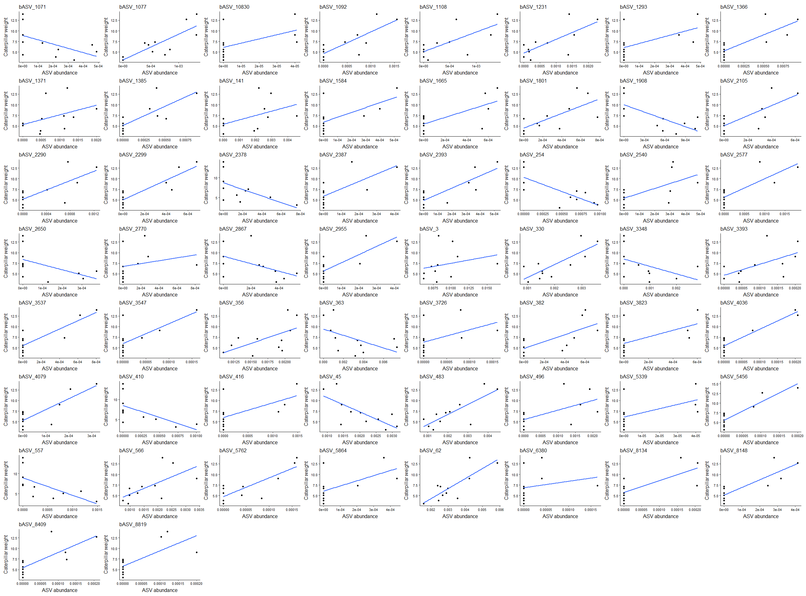<!-- -->

``` r
# Print plots p value < 0.01
wrap_plots(List_Graph_0.01, ncol = 5)
```

```
## `geom_smooth()` using formula = 'y ~ x'
## `geom_smooth()` using formula = 'y ~ x'
## `geom_smooth()` using formula = 'y ~ x'
## `geom_smooth()` using formula = 'y ~ x'
## `geom_smooth()` using formula = 'y ~ x'
## `geom_smooth()` using formula = 'y ~ x'
## `geom_smooth()` using formula = 'y ~ x'
## `geom_smooth()` using formula = 'y ~ x'
## `geom_smooth()` using formula = 'y ~ x'
## `geom_smooth()` using formula = 'y ~ x'
## `geom_smooth()` using formula = 'y ~ x'
## `geom_smooth()` using formula = 'y ~ x'
## `geom_smooth()` using formula = 'y ~ x'
## `geom_smooth()` using formula = 'y ~ x'
## `geom_smooth()` using formula = 'y ~ x'
```

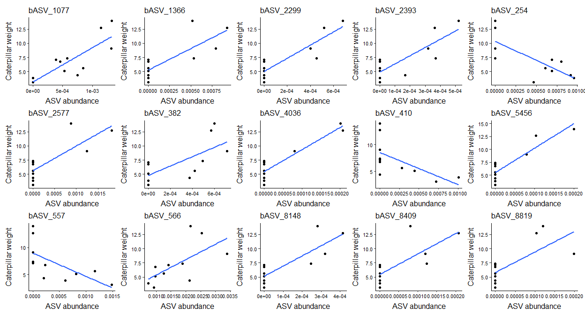<!-- -->

``` r
# Print plots p value < 0.05 only negative correlations
wrap_plots(List_Graph_0.05_neg)
```

```
## `geom_smooth()` using formula = 'y ~ x'
## `geom_smooth()` using formula = 'y ~ x'
## `geom_smooth()` using formula = 'y ~ x'
## `geom_smooth()` using formula = 'y ~ x'
## `geom_smooth()` using formula = 'y ~ x'
## `geom_smooth()` using formula = 'y ~ x'
## `geom_smooth()` using formula = 'y ~ x'
## `geom_smooth()` using formula = 'y ~ x'
## `geom_smooth()` using formula = 'y ~ x'
## `geom_smooth()` using formula = 'y ~ x'
## `geom_smooth()` using formula = 'y ~ x'
```

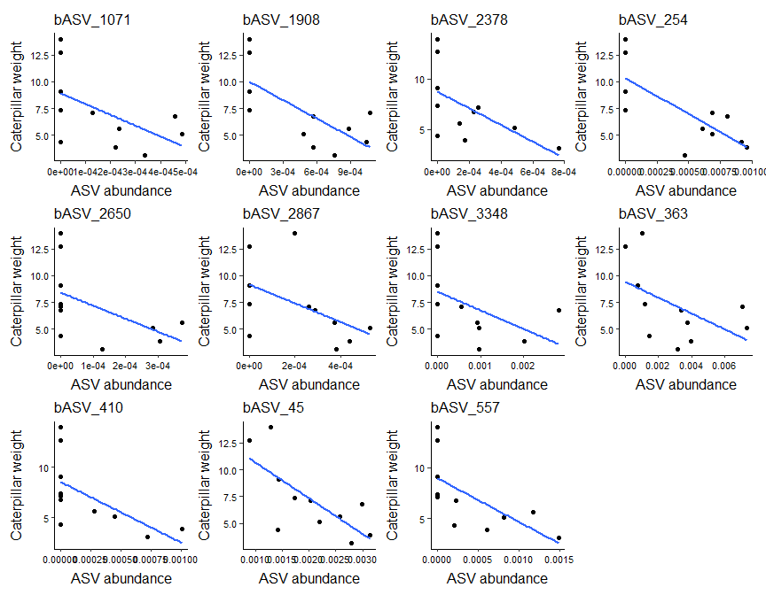<!-- -->

``` r
# Print plots p value < 0.01 only negative correlations
wrap_plots(List_Graph_0.01_neg)
```

```
## `geom_smooth()` using formula = 'y ~ x'
## `geom_smooth()` using formula = 'y ~ x'
## `geom_smooth()` using formula = 'y ~ x'
```

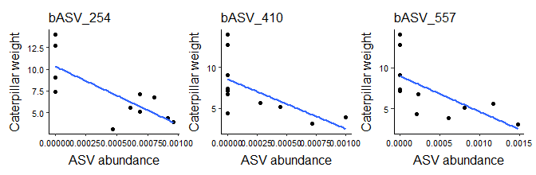<!-- -->

### Plot for publication
#### Prepare data

``` r
# Remove Unclassified and Incertae Sedis
taxon <- SpearmanCorr_0.05_neg_HM$Genus

taxon[taxon == "g__Incertae_Sedis"] <- SpearmanCorr_0.05_neg_HM$Family[taxon == "g__Incertae_Sedis"]
taxon[taxon == "f__Incertae_Sedis"] <- SpearmanCorr_0.05_neg_HM$Order[taxon == "f__Incertae_Sedis"]
taxon[taxon == "o__Incertae_Sedis"] <- SpearmanCorr_0.05_neg_HM$Class[taxon == "o__Incertae_Sedis"]
taxon[taxon == "c__Incertae_Sedis"] <- SpearmanCorr_0.05_neg_HM$Phylum[taxon == "c__Incertae_Sedis"]

taxon[taxon == "g__Unclassified"] <- SpearmanCorr_0.05_neg_HM$Family[taxon == "g__Unclassified"]
taxon[taxon == "f__Unclassified"] <- SpearmanCorr_0.05_neg_HM$Order[taxon == "f__Unclassified"]
taxon[taxon == "o__Unclassified"] <- SpearmanCorr_0.05_neg_HM$Class[taxon == "o__Unclassified"]
taxon[taxon == "c__Unclassified"] <- SpearmanCorr_0.05_neg_HM$Phylum[taxon == "c__Unclassified"]

taxon <- sub("g__", "", taxon)
taxon <- sub("f__", "", taxon)
SpearmanCorr_0.05_neg_HM$ASV2 <- sub("bASV_", "ASV ", SpearmanCorr_0.05_neg_HM$ASV)

SpearmanCorr_0.05_neg_HM$Name <- paste0(taxon)
```

#### Function for plot

``` r
Plot2 <- function(x, title, stats, xstep, italic_title = FALSE) {
  # Make title italic if requested
  if (italic_title) {
    title <- bquote(italic(.(title)))
  }
  
  # Plot
  ggplot(data = FP_ps[FP_ps$OTU == x, ], aes(x = Abundance, y = Mean_Weight_Cat)) +
    geom_point() +
    geom_smooth(method = lm, se = FALSE) +
    # coord_cartesian(xlim = c(0, NA), ylim = c(0, NA)) +
    scale_x_continuous(#expand = c(0, 0),
                       labels = scales::label_scientific(),
                       breaks = seq(0, max(FP_ps[FP_ps$OTU == x, "Abundance"]), xstep), #steps on the y-axis
                       limits = c(0, max(FP_ps[FP_ps$OTU == x, "Abundance"]))) +
    scale_y_continuous(#expand = c(0, 0),        #start graph at y = min and x = min
                       breaks = seq(0, 15, 5), #steps on the y-axis
                       limits = c(0, 15)) +   #y limits
    labs(title = title,
         subtitle = stats) +
    #xlab("ASV abundance") +
    #ylab("Caterpillar weight (mg)") +
    xlab(NULL) +
    ylab(NULL) +
    theme(panel.background = element_rect(fill = "white"), #theme of the graph
        panel.border = element_blank(),
        axis.line = element_line(), #show line for x and y axis
        plot.title = element_text(size = 14, hjust = 0),
        plot.subtitle = element_text(size = 11),
        axis.text = element_text(size = 10, color = "black"),
        axis.title = element_text(size = 14),
        axis.title.x = element_text(vjust = -0.5),
        axis.title.y = element_text(vjust = 2.5), #, hjust = -0
        strip.text = element_text(size = 13),
        plot.margin = margin(10, 15, 10, 15, "points"),
        legend.position = "none")
}


# plot.title = element_text(size = 12, hjust = 0),
#           axis.text = element_text(size = 8, color = "black"),
#           axis.title = element_text(size = 12),
#           axis.title.x = element_text(vjust = -0.5),
#           axis.title.y = element_text(vjust = 2.5), #, hjust = -0
#           strip.text = element_text(size = 13),
# 
# panel.border = element_blank(), 
#           axis.line = element_line(), #show line for x and y axis
#           plot.title = element_text(size = 18, hjust = 0),
#           plot.subtitle = element_text(size = 12),
#           axis.text = element_text(size = 12, color = "black"),
#           axis.title = element_text(size = 19),
#           axis.title.x = element_text(vjust = -0.5),
#           axis.title.y = element_text(vjust = 2.5), #, hjust = -0
#           legend.title = element_text(size = 16),
#           legend.text = element_text(size = 14),
#           #strip.text = element_text(size = 13),
#           #plot.margin = margin(5.5, 12, 5.5, 5.5, "points"),
#           plot.margin = margin(10, 20, 10, 20, "points"), # top . bottom .
#           legend.position = "right")
```

#### Run function

``` r
# Breaks x axis
Steps <- c(2e-4, 5e-4, 3e-4, 4e-4, 1.5e-4, 2e-4, 1e-3, 3e-3, 5e-4, 1.5e-3, 5e-4)

# Graph correlationns P value < 0.05  only negative correlations
List_Graph_0.05_neg2 <- list()
italic_plots <- c(1:2, 4:10) # plot number of which titles need to be in italic

for (i in 1:nrow(SpearmanCorr_0.05_neg_HM)) {
  title <- SpearmanCorr_0.05_neg_HM$Name[[i]]
  stats <- paste0("(b", 
                  SpearmanCorr_0.05_neg_HM$ASV2[[i]], 
                  ")", "\nρ = ", 
                  round(SpearmanCorr_0.05_neg_HM$Spearman_est[[i]], 3), 
                  " ; p = ",
                  round(SpearmanCorr_0.05_neg_HM$Spearman_pv[[i]], 3))
  List_Graph_0.05_neg2[[i]] <- Plot2(x = SpearmanCorr_0.05_neg_HM$ASV[i], 
                                     title = title, 
                                     stats = stats, 
                                     xstep = Steps[[i]],
                                     italic_title = i %in% italic_plots)
}
```

#### Only axis titles on outer plots

``` r
ncol <- 4
n <- length(List_Graph_0.05_neg2)

# identify positions
left_plots   <- seq(1, n, by = ncol)
bottom_plots <- (n - ncol + 1):n

# add axis titles conditionally
List_Graph_0.05_neg2_mod <- lapply(seq_along(List_Graph_0.05_neg2), function(i) {
  p <- List_Graph_0.05_neg2[[i]]
  
  if (i %in% left_plots) {
    p <- p + ylab("Caterpillar weight (mg)")
  }
  
  if (i %in% bottom_plots) {
    p <- p + xlab("ASV abundance")
  }
  return(p)
})
```

#### Print and save plot

``` r
# Print plots p value < 0.05 only negative correlations
wrap_plots(List_Graph_0.05_neg2_mod, ncol = 4) &
  theme(panel.spacing = unit(8, "lines")) #Allow larger margins ggplot
```

```
## `geom_smooth()` using formula = 'y ~ x'
## `geom_smooth()` using formula = 'y ~ x'
## `geom_smooth()` using formula = 'y ~ x'
## `geom_smooth()` using formula = 'y ~ x'
## `geom_smooth()` using formula = 'y ~ x'
## `geom_smooth()` using formula = 'y ~ x'
## `geom_smooth()` using formula = 'y ~ x'
## `geom_smooth()` using formula = 'y ~ x'
## `geom_smooth()` using formula = 'y ~ x'
## `geom_smooth()` using formula = 'y ~ x'
## `geom_smooth()` using formula = 'y ~ x'
```

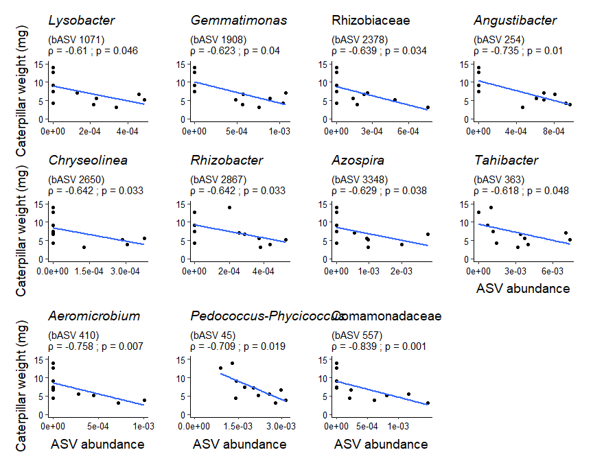<!-- -->

``` r
mapply(function(x)
  ggsave(plot = last_plot(), 
         filename = x,
         path = "C:/Users/kreek001/OneDrive - Wageningen University & Research/Chapters/Experimental Chapter 3/Result/Final graphs",
         scale = 2.2,
         width = 11.3,
         height = 10.5,
         units = "cm",
         dpi = 300),
  x = c("FP_SpearCorr_HM_0.05_neg4.svg", "FP_SpearCorr_HM_0.05_neg4.png"))
```

```
## `geom_smooth()` using formula = 'y ~ x'
## `geom_smooth()` using formula = 'y ~ x'
## `geom_smooth()` using formula = 'y ~ x'
## `geom_smooth()` using formula = 'y ~ x'
## `geom_smooth()` using formula = 'y ~ x'
## `geom_smooth()` using formula = 'y ~ x'
## `geom_smooth()` using formula = 'y ~ x'
## `geom_smooth()` using formula = 'y ~ x'
## `geom_smooth()` using formula = 'y ~ x'
## `geom_smooth()` using formula = 'y ~ x'
## `geom_smooth()` using formula = 'y ~ x'
## `geom_smooth()` using formula = 'y ~ x'
## `geom_smooth()` using formula = 'y ~ x'
## `geom_smooth()` using formula = 'y ~ x'
## `geom_smooth()` using formula = 'y ~ x'
## `geom_smooth()` using formula = 'y ~ x'
## `geom_smooth()` using formula = 'y ~ x'
## `geom_smooth()` using formula = 'y ~ x'
## `geom_smooth()` using formula = 'y ~ x'
## `geom_smooth()` using formula = 'y ~ x'
## `geom_smooth()` using formula = 'y ~ x'
## `geom_smooth()` using formula = 'y ~ x'
```

```
##                                                                                                                     FP_SpearCorr_HM_0.05_neg4.svg 
## "C:/Users/kreek001/OneDrive - Wageningen University & Research/Chapters/Experimental Chapter 3/Result/Final graphs/FP_SpearCorr_HM_0.05_neg4.svg" 
##                                                                                                                     FP_SpearCorr_HM_0.05_neg4.png 
## "C:/Users/kreek001/OneDrive - Wageningen University & Research/Chapters/Experimental Chapter 3/Result/Final graphs/FP_SpearCorr_HM_0.05_neg4.png"
```

``` r
# ncol = 3: width = 8.5 and highet = 13.7
```


## Extract sequences correlating ASVs

``` r
# Sequences_HM_DAASVs_SpCorrCatPerf_0.05_neg <- refseq(FP_unnormalized_bac_ps_ForDA_clean)[names(refseq(FP_unnormalized_bac_ps_ForDA_clean)) %in% ASVs_0.05_neg]
# Sequences_HM_DAASVs_SpCorrCatPerf_0.05_neg
# 
# Biostrings::writeXStringSet(Sequences_HM_DAASVs_SpCorrCatPerf_0.05_neg, file = "C:/Users/kreek001/OneDrive - Wageningen University & Research/Chapters/Experimental Chapter 3/RScripts/GitHub/TwelveAccessionExperiment/MicrobiomeAnalysis/Data/Phyloseq_objects/FP_DA_CorrAnlysis/Sequences_HM_DAASVs_SpCorrCatPerf_0.05_neg.fasta")
```

``` r
# Clean environment
rm(list = ls())
```


# 6.4 ASV - Caterpillar performance correlations VL
## Load data

``` r
# Selection of DA ASVs of VL, HM, overlap VL and HM and DA in All data. Object made in upset plot file
load(file = "C:/Users/kreek001/OneDrive - Wageningen University & Research/Chapters/Experimental Chapter 3/RScripts/GitHub/Data/R_objects/FP_DA_SummaryFiles/SummaryFiles_ASVLevel/Selction_DA_ASVs.RData")

# load ps object
load("C:/Users/kreek001/OneDrive - Wageningen University & Research/Chapters/Experimental Chapter 3/RScripts/GitHub/Data/R_objects/FP_unnormalized_bac_ps_ForDA_clean.RData")
```

## Set relative abundance

``` r
# Calculate relative abundance
FP_ps <- transform_sample_counts(FP_unnormalized_bac_ps_ForDA_clean, function(x) x / sum(x))
```

## Prepare data set

``` r
# make one vector with unique ASVs
ASVs <- Selction_DA_ASVs$VL_twoDAtests

# Only select HM
FP_ps <- subset_samples(FP_ps, Accession == "VL")

# prune ps object
FP_ps <- prune_taxa(ASVs, FP_ps) #only keep taxa that are in ASVs vector
#length(intersect(ASVs, taxa_names(FP_unnormalized_bac_ps_ForDA_clean))) # check overlap
#setdiff(ASVs, taxa_names(FP_unnormalized_bac_ps_ForDA_clean)) # check difference

# Phyloseq object to data frame with relative abundance, meta data and taxonomy
FP_ps <- psmelt(FP_ps)

# remove NAs cat weight
FP_ps[is.na(FP_ps$Mean_Weight_Cat), 1:10]
```

```
##  [1] OTU               Sample            Abundance         Phase_PSF        
##  [5] SampleNr          Accession         Domestication     Cat_treatment    
##  [9] Soil_conditioning TreatmentNr      
## <0 rows> (or 0-length row.names)
```

``` r
FP_ps <- FP_ps[!is.na(FP_ps$Mean_Weight_Cat), ]
```

### Remove ASVs with only 0s

``` r
# identify ASVs with zero abundance
Abund_sum <- aggregate(FP_ps$Abundance, by = list(FP_ps$OTU), FUN = sum)
Abund_sum[Abund_sum$x == 0, ]
```

```
## [1] Group.1 x      
## <0 rows> (or 0-length row.names)
```

``` r
Abund_zero <- Abund_sum[Abund_sum$x == 0, "Group.1"]

# Remove ASVs
FP_ps <- FP_ps[!(FP_ps$OTU %in% Abund_zero), ]
ASVs <- ASVs[!ASVs %in% Abund_zero]
```

## Plot
### Function for plot

``` r
Plot1 <- function(x, title) {
  ggplot(data = FP_ps[FP_ps$OTU == x, ], aes(x = Abundance, y = Mean_Weight_Cat)) +
    geom_point() +
    geom_smooth(method = lm, se = FALSE) +
    # coord_cartesian(xlim = c(0, NA), ylim = c(0, NA)) +
    # scale_y_continuous(expand = c(0, 0)) +
    # scale_x_continuous(expand = c(0, 0)) +
    ggtitle(title) +
    xlab("ASV abundance") +
    ylab("Caterpillar weight") +
    theme(panel.background = element_rect(fill = "white"), #theme of the graph
          panel.border = element_blank(),
          axis.line = element_line(), #show line for x and y axis
          plot.title = element_text(size = 12, hjust = 0),
          axis.text = element_text(size = 8, color = "black"),
          axis.title = element_text(size = 12),
          axis.title.x = element_text(vjust = -0.5),
          axis.title.y = element_text(vjust = 2.5), #, hjust = -0
          strip.text = element_text(size = 13),
          legend.position = "right")
}
```

### Run function

``` r
#Plot1(x = "bASV_42", title = "bASV_42")

List_Graph1 <- list()
for (i in 1:length(ASVs)) {
  List_Graph1[[i]] <- Plot1(x = ASVs[i], title = ASVs[i])
}
```

### Print plots

``` r
# Print plots
wrap_plots(List_Graph1[1:20])
```

```
## `geom_smooth()` using formula = 'y ~ x'
## `geom_smooth()` using formula = 'y ~ x'
## `geom_smooth()` using formula = 'y ~ x'
## `geom_smooth()` using formula = 'y ~ x'
## `geom_smooth()` using formula = 'y ~ x'
## `geom_smooth()` using formula = 'y ~ x'
## `geom_smooth()` using formula = 'y ~ x'
## `geom_smooth()` using formula = 'y ~ x'
## `geom_smooth()` using formula = 'y ~ x'
## `geom_smooth()` using formula = 'y ~ x'
## `geom_smooth()` using formula = 'y ~ x'
## `geom_smooth()` using formula = 'y ~ x'
## `geom_smooth()` using formula = 'y ~ x'
## `geom_smooth()` using formula = 'y ~ x'
## `geom_smooth()` using formula = 'y ~ x'
## `geom_smooth()` using formula = 'y ~ x'
## `geom_smooth()` using formula = 'y ~ x'
## `geom_smooth()` using formula = 'y ~ x'
## `geom_smooth()` using formula = 'y ~ x'
## `geom_smooth()` using formula = 'y ~ x'
```

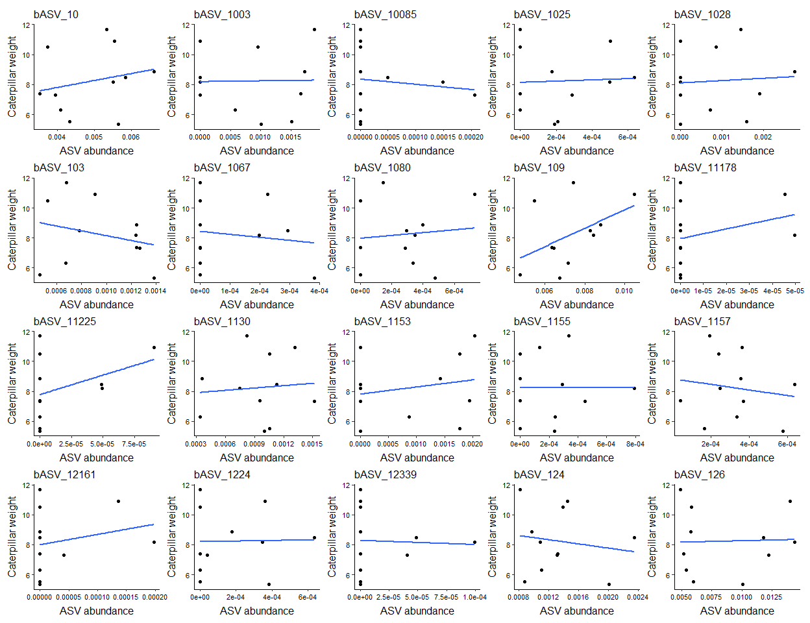<!-- -->

## Model assumptions
### Assumptions with graphs

``` r
NormTest <- function(dat, title) {
  hist(dat, prob = TRUE, col = "grey", main = title) #distribution histogram
  lines(density(dat), col = "blue", lwd = 2)
  
  qqnorm(dat)
  qqline(dat)
  
  print(shapiro.test(dat))
}

# Caterpillar performance
par(mfrow = c(1, 2))
#NormTest(dat = FP_ps[FP_ps$OTU == "bASV_42", "Mean_Weight_Cat"], title = "b")
par(mfrow = c(1, 1))
```

### Assumptions only Shapriro Wilk test

``` r
# Abundance
Shap_res_ab <- list()
for(i in 1:length(ASVs)) {
  Shap_res_ab[[i]] <- shapiro.test(FP_ps[FP_ps$OTU == ASVs[i], "Abundance"])
}
names(Shap_res_ab) <- ASVs
Shap_res_ab
```

```
## $bASV_10
## 
## 	Shapiro-Wilk normality test
## 
## data:  FP_ps[FP_ps$OTU == ASVs[i], "Abundance"]
## W = 0.91842, p-value = 0.3057
## 
## 
## $bASV_1003
## 
## 	Shapiro-Wilk normality test
## 
## data:  FP_ps[FP_ps$OTU == ASVs[i], "Abundance"]
## W = 0.85306, p-value = 0.04679
## 
## 
## $bASV_10085
## 
## 	Shapiro-Wilk normality test
## 
## data:  FP_ps[FP_ps$OTU == ASVs[i], "Abundance"]
## W = 0.59236, p-value = 2.043e-05
## 
## 
## $bASV_1025
## 
## 	Shapiro-Wilk normality test
## 
## data:  FP_ps[FP_ps$OTU == ASVs[i], "Abundance"]
## W = 0.86944, p-value = 0.07625
## 
## 
## $bASV_1028
## 
## 	Shapiro-Wilk normality test
## 
## data:  FP_ps[FP_ps$OTU == ASVs[i], "Abundance"]
## W = 0.84599, p-value = 0.03783
## 
## 
## $bASV_103
## 
## 	Shapiro-Wilk normality test
## 
## data:  FP_ps[FP_ps$OTU == ASVs[i], "Abundance"]
## W = 0.88281, p-value = 0.1129
## 
## 
## $bASV_1067
## 
## 	Shapiro-Wilk normality test
## 
## data:  FP_ps[FP_ps$OTU == ASVs[i], "Abundance"]
## W = 0.71842, p-value = 0.0008083
## 
## 
## $bASV_1080
## 
## 	Shapiro-Wilk normality test
## 
## data:  FP_ps[FP_ps$OTU == ASVs[i], "Abundance"]
## W = 0.9213, p-value = 0.3297
## 
## 
## $bASV_109
## 
## 	Shapiro-Wilk normality test
## 
## data:  FP_ps[FP_ps$OTU == ASVs[i], "Abundance"]
## W = 0.9808, p-value = 0.9704
## 
## 
## $bASV_11178
## 
## 	Shapiro-Wilk normality test
## 
## data:  FP_ps[FP_ps$OTU == ASVs[i], "Abundance"]
## W = 0.49556, p-value = 1.341e-06
## 
## 
## $bASV_11225
## 
## 	Shapiro-Wilk normality test
## 
## data:  FP_ps[FP_ps$OTU == ASVs[i], "Abundance"]
## W = 0.62383, p-value = 5.045e-05
## 
## 
## $bASV_1130
## 
## 	Shapiro-Wilk normality test
## 
## data:  FP_ps[FP_ps$OTU == ASVs[i], "Abundance"]
## W = 0.94331, p-value = 0.5602
## 
## 
## $bASV_1153
## 
## 	Shapiro-Wilk normality test
## 
## data:  FP_ps[FP_ps$OTU == ASVs[i], "Abundance"]
## W = 0.78339, p-value = 0.005689
## 
## 
## $bASV_1155
## 
## 	Shapiro-Wilk normality test
## 
## data:  FP_ps[FP_ps$OTU == ASVs[i], "Abundance"]
## W = 0.85961, p-value = 0.05692
## 
## 
## $bASV_1157
## 
## 	Shapiro-Wilk normality test
## 
## data:  FP_ps[FP_ps$OTU == ASVs[i], "Abundance"]
## W = 0.94965, p-value = 0.6395
## 
## 
## $bASV_12161
## 
## 	Shapiro-Wilk normality test
## 
## data:  FP_ps[FP_ps$OTU == ASVs[i], "Abundance"]
## W = 0.58584, p-value = 1.696e-05
## 
## 
## $bASV_1224
## 
## 	Shapiro-Wilk normality test
## 
## data:  FP_ps[FP_ps$OTU == ASVs[i], "Abundance"]
## W = 0.80004, p-value = 0.009417
## 
## 
## $bASV_12339
## 
## 	Shapiro-Wilk normality test
## 
## data:  FP_ps[FP_ps$OTU == ASVs[i], "Abundance"]
## W = 0.61593, p-value = 4.017e-05
## 
## 
## $bASV_124
## 
## 	Shapiro-Wilk normality test
## 
## data:  FP_ps[FP_ps$OTU == ASVs[i], "Abundance"]
## W = 0.8803, p-value = 0.105
## 
## 
## $bASV_126
## 
## 	Shapiro-Wilk normality test
## 
## data:  FP_ps[FP_ps$OTU == ASVs[i], "Abundance"]
## W = 0.81827, p-value = 0.01637
## 
## 
## $bASV_1285
## 
## 	Shapiro-Wilk normality test
## 
## data:  FP_ps[FP_ps$OTU == ASVs[i], "Abundance"]
## W = 0.86413, p-value = 0.06513
## 
## 
## $bASV_1329
## 
## 	Shapiro-Wilk normality test
## 
## data:  FP_ps[FP_ps$OTU == ASVs[i], "Abundance"]
## W = 0.80682, p-value = 0.01157
## 
## 
## $bASV_1331
## 
## 	Shapiro-Wilk normality test
## 
## data:  FP_ps[FP_ps$OTU == ASVs[i], "Abundance"]
## W = 0.66963, p-value = 0.0001912
## 
## 
## $bASV_1345
## 
## 	Shapiro-Wilk normality test
## 
## data:  FP_ps[FP_ps$OTU == ASVs[i], "Abundance"]
## W = 0.74395, p-value = 0.001733
## 
## 
## $bASV_1352
## 
## 	Shapiro-Wilk normality test
## 
## data:  FP_ps[FP_ps$OTU == ASVs[i], "Abundance"]
## W = 0.77119, p-value = 0.003935
## 
## 
## $bASV_1401
## 
## 	Shapiro-Wilk normality test
## 
## data:  FP_ps[FP_ps$OTU == ASVs[i], "Abundance"]
## W = 0.72526, p-value = 0.0009909
## 
## 
## $bASV_14493
## 
## 	Shapiro-Wilk normality test
## 
## data:  FP_ps[FP_ps$OTU == ASVs[i], "Abundance"]
## W = 0.49178, p-value = 1.207e-06
## 
## 
## $bASV_1456
## 
## 	Shapiro-Wilk normality test
## 
## data:  FP_ps[FP_ps$OTU == ASVs[i], "Abundance"]
## W = 0.78289, p-value = 0.005603
## 
## 
## $bASV_1539
## 
## 	Shapiro-Wilk normality test
## 
## data:  FP_ps[FP_ps$OTU == ASVs[i], "Abundance"]
## W = 0.76156, p-value = 0.002943
## 
## 
## $bASV_154
## 
## 	Shapiro-Wilk normality test
## 
## data:  FP_ps[FP_ps$OTU == ASVs[i], "Abundance"]
## W = 0.78735, p-value = 0.006413
## 
## 
## $bASV_16090
## 
## 	Shapiro-Wilk normality test
## 
## data:  FP_ps[FP_ps$OTU == ASVs[i], "Abundance"]
## W = 0.61432, p-value = 3.835e-05
## 
## 
## $bASV_166
## 
## 	Shapiro-Wilk normality test
## 
## data:  FP_ps[FP_ps$OTU == ASVs[i], "Abundance"]
## W = 0.9423, p-value = 0.5479
## 
## 
## $bASV_17
## 
## 	Shapiro-Wilk normality test
## 
## data:  FP_ps[FP_ps$OTU == ASVs[i], "Abundance"]
## W = 0.95772, p-value = 0.743
## 
## 
## $bASV_1728
## 
## 	Shapiro-Wilk normality test
## 
## data:  FP_ps[FP_ps$OTU == ASVs[i], "Abundance"]
## W = 0.58172, p-value = 1.509e-05
## 
## 
## $bASV_178
## 
## 	Shapiro-Wilk normality test
## 
## data:  FP_ps[FP_ps$OTU == ASVs[i], "Abundance"]
## W = 0.92402, p-value = 0.3535
## 
## 
## $bASV_187
## 
## 	Shapiro-Wilk normality test
## 
## data:  FP_ps[FP_ps$OTU == ASVs[i], "Abundance"]
## W = 0.91375, p-value = 0.2699
## 
## 
## $bASV_1962
## 
## 	Shapiro-Wilk normality test
## 
## data:  FP_ps[FP_ps$OTU == ASVs[i], "Abundance"]
## W = 0.84506, p-value = 0.03678
## 
## 
## $bASV_199
## 
## 	Shapiro-Wilk normality test
## 
## data:  FP_ps[FP_ps$OTU == ASVs[i], "Abundance"]
## W = 0.93595, p-value = 0.4741
## 
## 
## $bASV_2012
## 
## 	Shapiro-Wilk normality test
## 
## data:  FP_ps[FP_ps$OTU == ASVs[i], "Abundance"]
## W = 0.78526, p-value = 0.006021
## 
## 
## $bASV_2027
## 
## 	Shapiro-Wilk normality test
## 
## data:  FP_ps[FP_ps$OTU == ASVs[i], "Abundance"]
## W = 0.83861, p-value = 0.03029
## 
## 
## $bASV_2120
## 
## 	Shapiro-Wilk normality test
## 
## data:  FP_ps[FP_ps$OTU == ASVs[i], "Abundance"]
## W = 0.85325, p-value = 0.04705
## 
## 
## $bASV_214
## 
## 	Shapiro-Wilk normality test
## 
## data:  FP_ps[FP_ps$OTU == ASVs[i], "Abundance"]
## W = 0.9571, p-value = 0.7351
## 
## 
## $bASV_22
## 
## 	Shapiro-Wilk normality test
## 
## data:  FP_ps[FP_ps$OTU == ASVs[i], "Abundance"]
## W = 0.9035, p-value = 0.2039
## 
## 
## $bASV_2296
## 
## 	Shapiro-Wilk normality test
## 
## data:  FP_ps[FP_ps$OTU == ASVs[i], "Abundance"]
## W = 0.75106, p-value = 0.002146
## 
## 
## $bASV_2391
## 
## 	Shapiro-Wilk normality test
## 
## data:  FP_ps[FP_ps$OTU == ASVs[i], "Abundance"]
## W = 0.50407, p-value = 1.698e-06
## 
## 
## $bASV_2399
## 
## 	Shapiro-Wilk normality test
## 
## data:  FP_ps[FP_ps$OTU == ASVs[i], "Abundance"]
## W = 0.61976, p-value = 4.486e-05
## 
## 
## $bASV_2459
## 
## 	Shapiro-Wilk normality test
## 
## data:  FP_ps[FP_ps$OTU == ASVs[i], "Abundance"]
## W = 0.59421, p-value = 2.154e-05
## 
## 
## $bASV_2473
## 
## 	Shapiro-Wilk normality test
## 
## data:  FP_ps[FP_ps$OTU == ASVs[i], "Abundance"]
## W = 0.71609, p-value = 0.000754
## 
## 
## $bASV_2487
## 
## 	Shapiro-Wilk normality test
## 
## data:  FP_ps[FP_ps$OTU == ASVs[i], "Abundance"]
## W = 0.68766, p-value = 0.0003249
## 
## 
## $bASV_24934
## 
## 	Shapiro-Wilk normality test
## 
## data:  FP_ps[FP_ps$OTU == ASVs[i], "Abundance"]
## W = 0.48731, p-value = 1.067e-06
## 
## 
## $bASV_2528
## 
## 	Shapiro-Wilk normality test
## 
## data:  FP_ps[FP_ps$OTU == ASVs[i], "Abundance"]
## W = 0.79144, p-value = 0.007258
## 
## 
## $bASV_256
## 
## 	Shapiro-Wilk normality test
## 
## data:  FP_ps[FP_ps$OTU == ASVs[i], "Abundance"]
## W = 0.94571, p-value = 0.5897
## 
## 
## $bASV_2578
## 
## 	Shapiro-Wilk normality test
## 
## data:  FP_ps[FP_ps$OTU == ASVs[i], "Abundance"]
## W = 0.72806, p-value = 0.001077
## 
## 
## $bASV_27
## 
## 	Shapiro-Wilk normality test
## 
## data:  FP_ps[FP_ps$OTU == ASVs[i], "Abundance"]
## W = 0.90484, p-value = 0.2116
## 
## 
## $bASV_2701
## 
## 	Shapiro-Wilk normality test
## 
## data:  FP_ps[FP_ps$OTU == ASVs[i], "Abundance"]
## W = 0.82892, p-value = 0.0226
## 
## 
## $bASV_2709
## 
## 	Shapiro-Wilk normality test
## 
## data:  FP_ps[FP_ps$OTU == ASVs[i], "Abundance"]
## W = 0.84403, p-value = 0.03566
## 
## 
## $bASV_2724
## 
## 	Shapiro-Wilk normality test
## 
## data:  FP_ps[FP_ps$OTU == ASVs[i], "Abundance"]
## W = 0.61999, p-value = 4.515e-05
## 
## 
## $bASV_2770
## 
## 	Shapiro-Wilk normality test
## 
## data:  FP_ps[FP_ps$OTU == ASVs[i], "Abundance"]
## W = 0.77134, p-value = 0.003953
## 
## 
## $bASV_290
## 
## 	Shapiro-Wilk normality test
## 
## data:  FP_ps[FP_ps$OTU == ASVs[i], "Abundance"]
## W = 0.95161, p-value = 0.6646
## 
## 
## $bASV_2902
## 
## 	Shapiro-Wilk normality test
## 
## data:  FP_ps[FP_ps$OTU == ASVs[i], "Abundance"]
## W = 0.75023, p-value = 0.002093
## 
## 
## $bASV_303
## 
## 	Shapiro-Wilk normality test
## 
## data:  FP_ps[FP_ps$OTU == ASVs[i], "Abundance"]
## W = 0.94572, p-value = 0.5899
## 
## 
## $bASV_315
## 
## 	Shapiro-Wilk normality test
## 
## data:  FP_ps[FP_ps$OTU == ASVs[i], "Abundance"]
## W = 0.89303, p-value = 0.1517
## 
## 
## $bASV_319
## 
## 	Shapiro-Wilk normality test
## 
## data:  FP_ps[FP_ps$OTU == ASVs[i], "Abundance"]
## W = 0.96058, p-value = 0.7789
## 
## 
## $bASV_3204
## 
## 	Shapiro-Wilk normality test
## 
## data:  FP_ps[FP_ps$OTU == ASVs[i], "Abundance"]
## W = 0.59758, p-value = 2.372e-05
## 
## 
## $bASV_3207
## 
## 	Shapiro-Wilk normality test
## 
## data:  FP_ps[FP_ps$OTU == ASVs[i], "Abundance"]
## W = 0.49005, p-value = 1.151e-06
## 
## 
## $bASV_3208
## 
## 	Shapiro-Wilk normality test
## 
## data:  FP_ps[FP_ps$OTU == ASVs[i], "Abundance"]
## W = 0.60958, p-value = 3.347e-05
## 
## 
## $bASV_3276
## 
## 	Shapiro-Wilk normality test
## 
## data:  FP_ps[FP_ps$OTU == ASVs[i], "Abundance"]
## W = 0.77774, p-value = 0.004795
## 
## 
## $bASV_329
## 
## 	Shapiro-Wilk normality test
## 
## data:  FP_ps[FP_ps$OTU == ASVs[i], "Abundance"]
## W = 0.91396, p-value = 0.2715
## 
## 
## $bASV_3526
## 
## 	Shapiro-Wilk normality test
## 
## data:  FP_ps[FP_ps$OTU == ASVs[i], "Abundance"]
## W = 0.79921, p-value = 0.009184
## 
## 
## $bASV_3753
## 
## 	Shapiro-Wilk normality test
## 
## data:  FP_ps[FP_ps$OTU == ASVs[i], "Abundance"]
## W = 0.62559, p-value = 5.307e-05
## 
## 
## $bASV_3806
## 
## 	Shapiro-Wilk normality test
## 
## data:  FP_ps[FP_ps$OTU == ASVs[i], "Abundance"]
## W = 0.61619, p-value = 4.047e-05
## 
## 
## $bASV_385
## 
## 	Shapiro-Wilk normality test
## 
## data:  FP_ps[FP_ps$OTU == ASVs[i], "Abundance"]
## W = 0.826, p-value = 0.02068
## 
## 
## $bASV_386
## 
## 	Shapiro-Wilk normality test
## 
## data:  FP_ps[FP_ps$OTU == ASVs[i], "Abundance"]
## W = 0.94834, p-value = 0.6229
## 
## 
## $bASV_3873
## 
## 	Shapiro-Wilk normality test
## 
## data:  FP_ps[FP_ps$OTU == ASVs[i], "Abundance"]
## W = 0.66146, p-value = 0.0001505
## 
## 
## $bASV_39
## 
## 	Shapiro-Wilk normality test
## 
## data:  FP_ps[FP_ps$OTU == ASVs[i], "Abundance"]
## W = 0.85925, p-value = 0.0563
## 
## 
## $bASV_4029
## 
## 	Shapiro-Wilk normality test
## 
## data:  FP_ps[FP_ps$OTU == ASVs[i], "Abundance"]
## W = 0.60657, p-value = 3.069e-05
## 
## 
## $bASV_417
## 
## 	Shapiro-Wilk normality test
## 
## data:  FP_ps[FP_ps$OTU == ASVs[i], "Abundance"]
## W = 0.85886, p-value = 0.05566
## 
## 
## $bASV_4207
## 
## 	Shapiro-Wilk normality test
## 
## data:  FP_ps[FP_ps$OTU == ASVs[i], "Abundance"]
## W = 0.61535, p-value = 3.95e-05
## 
## 
## $bASV_430
## 
## 	Shapiro-Wilk normality test
## 
## data:  FP_ps[FP_ps$OTU == ASVs[i], "Abundance"]
## W = 0.96192, p-value = 0.7954
## 
## 
## $bASV_4392
## 
## 	Shapiro-Wilk normality test
## 
## data:  FP_ps[FP_ps$OTU == ASVs[i], "Abundance"]
## W = 0.61601, p-value = 4.026e-05
## 
## 
## $bASV_47
## 
## 	Shapiro-Wilk normality test
## 
## data:  FP_ps[FP_ps$OTU == ASVs[i], "Abundance"]
## W = 0.97438, p-value = 0.927
## 
## 
## $bASV_474
## 
## 	Shapiro-Wilk normality test
## 
## data:  FP_ps[FP_ps$OTU == ASVs[i], "Abundance"]
## W = 0.92896, p-value = 0.4005
## 
## 
## $bASV_4782
## 
## 	Shapiro-Wilk normality test
## 
## data:  FP_ps[FP_ps$OTU == ASVs[i], "Abundance"]
## W = 0.59823, p-value = 2.417e-05
## 
## 
## $bASV_515
## 
## 	Shapiro-Wilk normality test
## 
## data:  FP_ps[FP_ps$OTU == ASVs[i], "Abundance"]
## W = 0.84768, p-value = 0.0398
## 
## 
## $bASV_534
## 
## 	Shapiro-Wilk normality test
## 
## data:  FP_ps[FP_ps$OTU == ASVs[i], "Abundance"]
## W = 0.90773, p-value = 0.2292
## 
## 
## $bASV_541
## 
## 	Shapiro-Wilk normality test
## 
## data:  FP_ps[FP_ps$OTU == ASVs[i], "Abundance"]
## W = 0.89373, p-value = 0.1548
## 
## 
## $bASV_5565
## 
## 	Shapiro-Wilk normality test
## 
## data:  FP_ps[FP_ps$OTU == ASVs[i], "Abundance"]
## W = 0.57989, p-value = 1.432e-05
## 
## 
## $bASV_559
## 
## 	Shapiro-Wilk normality test
## 
## data:  FP_ps[FP_ps$OTU == ASVs[i], "Abundance"]
## W = 0.84692, p-value = 0.0389
## 
## 
## $bASV_560
## 
## 	Shapiro-Wilk normality test
## 
## data:  FP_ps[FP_ps$OTU == ASVs[i], "Abundance"]
## W = 0.89655, p-value = 0.1677
## 
## 
## $bASV_5682
## 
## 	Shapiro-Wilk normality test
## 
## data:  FP_ps[FP_ps$OTU == ASVs[i], "Abundance"]
## W = 0.50141, p-value = 1.577e-06
## 
## 
## $bASV_57
## 
## 	Shapiro-Wilk normality test
## 
## data:  FP_ps[FP_ps$OTU == ASVs[i], "Abundance"]
## W = 0.89431, p-value = 0.1573
## 
## 
## $bASV_5805
## 
## 	Shapiro-Wilk normality test
## 
## data:  FP_ps[FP_ps$OTU == ASVs[i], "Abundance"]
## W = 0.50407, p-value = 1.698e-06
## 
## 
## $bASV_5974
## 
## 	Shapiro-Wilk normality test
## 
## data:  FP_ps[FP_ps$OTU == ASVs[i], "Abundance"]
## W = 0.49388, p-value = 1.28e-06
## 
## 
## $bASV_60
## 
## 	Shapiro-Wilk normality test
## 
## data:  FP_ps[FP_ps$OTU == ASVs[i], "Abundance"]
## W = 0.92153, p-value = 0.3316
## 
## 
## $bASV_63
## 
## 	Shapiro-Wilk normality test
## 
## data:  FP_ps[FP_ps$OTU == ASVs[i], "Abundance"]
## W = 0.9722, p-value = 0.9078
## 
## 
## $bASV_656
## 
## 	Shapiro-Wilk normality test
## 
## data:  FP_ps[FP_ps$OTU == ASVs[i], "Abundance"]
## W = 0.78221, p-value = 0.005489
## 
## 
## $bASV_664
## 
## 	Shapiro-Wilk normality test
## 
## data:  FP_ps[FP_ps$OTU == ASVs[i], "Abundance"]
## W = 0.84648, p-value = 0.0384
## 
## 
## $bASV_6708
## 
## 	Shapiro-Wilk normality test
## 
## data:  FP_ps[FP_ps$OTU == ASVs[i], "Abundance"]
## W = 0.51026, p-value = 2.017e-06
## 
## 
## $bASV_7
## 
## 	Shapiro-Wilk normality test
## 
## data:  FP_ps[FP_ps$OTU == ASVs[i], "Abundance"]
## W = 0.86752, p-value = 0.07202
## 
## 
## $bASV_732
## 
## 	Shapiro-Wilk normality test
## 
## data:  FP_ps[FP_ps$OTU == ASVs[i], "Abundance"]
## W = 0.92102, p-value = 0.3272
## 
## 
## $bASV_827
## 
## 	Shapiro-Wilk normality test
## 
## data:  FP_ps[FP_ps$OTU == ASVs[i], "Abundance"]
## W = 0.96046, p-value = 0.7774
## 
## 
## $bASV_8335
## 
## 	Shapiro-Wilk normality test
## 
## data:  FP_ps[FP_ps$OTU == ASVs[i], "Abundance"]
## W = 0.49005, p-value = 1.151e-06
## 
## 
## $bASV_85
## 
## 	Shapiro-Wilk normality test
## 
## data:  FP_ps[FP_ps$OTU == ASVs[i], "Abundance"]
## W = 0.88094, p-value = 0.1069
## 
## 
## $bASV_8506
## 
## 	Shapiro-Wilk normality test
## 
## data:  FP_ps[FP_ps$OTU == ASVs[i], "Abundance"]
## W = 0.50317, p-value = 1.656e-06
## 
## 
## $bASV_888
## 
## 	Shapiro-Wilk normality test
## 
## data:  FP_ps[FP_ps$OTU == ASVs[i], "Abundance"]
## W = 0.76685, p-value = 0.003451
## 
## 
## $bASV_8895
## 
## 	Shapiro-Wilk normality test
## 
## data:  FP_ps[FP_ps$OTU == ASVs[i], "Abundance"]
## W = 0.61558, p-value = 3.976e-05
## 
## 
## $bASV_8917
## 
## 	Shapiro-Wilk normality test
## 
## data:  FP_ps[FP_ps$OTU == ASVs[i], "Abundance"]
## W = 0.50141, p-value = 1.577e-06
## 
## 
## $bASV_899
## 
## 	Shapiro-Wilk normality test
## 
## data:  FP_ps[FP_ps$OTU == ASVs[i], "Abundance"]
## W = 0.89312, p-value = 0.1521
## 
## 
## $bASV_91
## 
## 	Shapiro-Wilk normality test
## 
## data:  FP_ps[FP_ps$OTU == ASVs[i], "Abundance"]
## W = 0.92317, p-value = 0.346
## 
## 
## $bASV_910
## 
## 	Shapiro-Wilk normality test
## 
## data:  FP_ps[FP_ps$OTU == ASVs[i], "Abundance"]
## W = 0.92754, p-value = 0.3865
## 
## 
## $bASV_939
## 
## 	Shapiro-Wilk normality test
## 
## data:  FP_ps[FP_ps$OTU == ASVs[i], "Abundance"]
## W = 0.94987, p-value = 0.6422
## 
## 
## $bASV_9579
## 
## 	Shapiro-Wilk normality test
## 
## data:  FP_ps[FP_ps$OTU == ASVs[i], "Abundance"]
## W = 0.61568, p-value = 3.988e-05
## 
## 
## $bASV_968
## 
## 	Shapiro-Wilk normality test
## 
## data:  FP_ps[FP_ps$OTU == ASVs[i], "Abundance"]
## W = 0.73036, p-value = 0.001154
## 
## 
## $bASV_969
## 
## 	Shapiro-Wilk normality test
## 
## data:  FP_ps[FP_ps$OTU == ASVs[i], "Abundance"]
## W = 0.8844, p-value = 0.1183
```

## Correlation tests
### Run tests

``` r
CorTest2 <- function(x) {
  sub_data <- FP_ps[FP_ps$OTU == x, ]
  cs0 <- cor.test(sub_data$Abundance, sub_data$Mean_Weight_Cat, method = c("pearson")) # parametric
  cs1 <- cor.test(sub_data$Abundance, sub_data$Mean_Weight_Cat, method = c("spearman")) # non parametric
  cs2 <- cor.test(sub_data$Abundance, sub_data$Mean_Weight_Cat, method = c("kendall")) # non parametric
  rm(sub_data)
  
  # Make data frame with results
  Sum1 <- data.frame(Pearson_est = cs0$estimate, Pearson_stat = cs0$statistic, Pearson_pv = cs0$p.value,
                     Spearman_est = cs1$estimate, Spearman_stat = cs1$statistic, Spearman_pv = cs1$p.value, 
                     Kendall_est = cs2$estimate, Kendall_stat = cs2$statistic, Kendall_pv = cs2$p.value)
  rownames(Sum1) <- x
  return(Sum1)
}

# Run function
List_CorTest2 <- list() # make an empty list to store the plots

for (i in 1:length(ASVs)) {
  List_CorTest2[[i]] <- CorTest2(x = ASVs[i])
}
```

```
## Warning in cor.test.default(sub_data$Abundance, sub_data$Mean_Weight_Cat, :
## Cannot compute exact p-value with ties
```

```
## Warning in cor.test.default(sub_data$Abundance, sub_data$Mean_Weight_Cat, :
## Cannot compute exact p-value with ties
```

```
## Warning in cor.test.default(sub_data$Abundance, sub_data$Mean_Weight_Cat, :
## Cannot compute exact p-value with ties
```

```
## Warning in cor.test.default(sub_data$Abundance, sub_data$Mean_Weight_Cat, :
## Cannot compute exact p-value with ties
```

```
## Warning in cor.test.default(sub_data$Abundance, sub_data$Mean_Weight_Cat, :
## Cannot compute exact p-value with ties
```

```
## Warning in cor.test.default(sub_data$Abundance, sub_data$Mean_Weight_Cat, :
## Cannot compute exact p-value with ties
```

```
## Warning in cor.test.default(sub_data$Abundance, sub_data$Mean_Weight_Cat, :
## Cannot compute exact p-value with ties
```

```
## Warning in cor.test.default(sub_data$Abundance, sub_data$Mean_Weight_Cat, :
## Cannot compute exact p-value with ties
```

```
## Warning in cor.test.default(sub_data$Abundance, sub_data$Mean_Weight_Cat, :
## Cannot compute exact p-value with ties
```

```
## Warning in cor.test.default(sub_data$Abundance, sub_data$Mean_Weight_Cat, :
## Cannot compute exact p-value with ties
```

```
## Warning in cor.test.default(sub_data$Abundance, sub_data$Mean_Weight_Cat, :
## Cannot compute exact p-value with ties
```

```
## Warning in cor.test.default(sub_data$Abundance, sub_data$Mean_Weight_Cat, :
## Cannot compute exact p-value with ties
```

```
## Warning in cor.test.default(sub_data$Abundance, sub_data$Mean_Weight_Cat, :
## Cannot compute exact p-value with ties
```

```
## Warning in cor.test.default(sub_data$Abundance, sub_data$Mean_Weight_Cat, :
## Cannot compute exact p-value with ties
```

```
## Warning in cor.test.default(sub_data$Abundance, sub_data$Mean_Weight_Cat, :
## Cannot compute exact p-value with ties
```

```
## Warning in cor.test.default(sub_data$Abundance, sub_data$Mean_Weight_Cat, :
## Cannot compute exact p-value with ties
```

```
## Warning in cor.test.default(sub_data$Abundance, sub_data$Mean_Weight_Cat, :
## Cannot compute exact p-value with ties
```

```
## Warning in cor.test.default(sub_data$Abundance, sub_data$Mean_Weight_Cat, :
## Cannot compute exact p-value with ties
```

```
## Warning in cor.test.default(sub_data$Abundance, sub_data$Mean_Weight_Cat, :
## Cannot compute exact p-value with ties
```

```
## Warning in cor.test.default(sub_data$Abundance, sub_data$Mean_Weight_Cat, :
## Cannot compute exact p-value with ties
```

```
## Warning in cor.test.default(sub_data$Abundance, sub_data$Mean_Weight_Cat, :
## Cannot compute exact p-value with ties
```

```
## Warning in cor.test.default(sub_data$Abundance, sub_data$Mean_Weight_Cat, :
## Cannot compute exact p-value with ties
```

```
## Warning in cor.test.default(sub_data$Abundance, sub_data$Mean_Weight_Cat, :
## Cannot compute exact p-value with ties
```

```
## Warning in cor.test.default(sub_data$Abundance, sub_data$Mean_Weight_Cat, :
## Cannot compute exact p-value with ties
```

```
## Warning in cor.test.default(sub_data$Abundance, sub_data$Mean_Weight_Cat, :
## Cannot compute exact p-value with ties
```

```
## Warning in cor.test.default(sub_data$Abundance, sub_data$Mean_Weight_Cat, :
## Cannot compute exact p-value with ties
```

```
## Warning in cor.test.default(sub_data$Abundance, sub_data$Mean_Weight_Cat, :
## Cannot compute exact p-value with ties
```

```
## Warning in cor.test.default(sub_data$Abundance, sub_data$Mean_Weight_Cat, :
## Cannot compute exact p-value with ties
```

```
## Warning in cor.test.default(sub_data$Abundance, sub_data$Mean_Weight_Cat, :
## Cannot compute exact p-value with ties
```

```
## Warning in cor.test.default(sub_data$Abundance, sub_data$Mean_Weight_Cat, :
## Cannot compute exact p-value with ties
```

```
## Warning in cor.test.default(sub_data$Abundance, sub_data$Mean_Weight_Cat, :
## Cannot compute exact p-value with ties
```

```
## Warning in cor.test.default(sub_data$Abundance, sub_data$Mean_Weight_Cat, :
## Cannot compute exact p-value with ties
```

```
## Warning in cor.test.default(sub_data$Abundance, sub_data$Mean_Weight_Cat, :
## Cannot compute exact p-value with ties
```

```
## Warning in cor.test.default(sub_data$Abundance, sub_data$Mean_Weight_Cat, :
## Cannot compute exact p-value with ties
```

```
## Warning in cor.test.default(sub_data$Abundance, sub_data$Mean_Weight_Cat, :
## Cannot compute exact p-value with ties
```

```
## Warning in cor.test.default(sub_data$Abundance, sub_data$Mean_Weight_Cat, :
## Cannot compute exact p-value with ties
```

```
## Warning in cor.test.default(sub_data$Abundance, sub_data$Mean_Weight_Cat, :
## Cannot compute exact p-value with ties
```

```
## Warning in cor.test.default(sub_data$Abundance, sub_data$Mean_Weight_Cat, :
## Cannot compute exact p-value with ties
```

```
## Warning in cor.test.default(sub_data$Abundance, sub_data$Mean_Weight_Cat, :
## Cannot compute exact p-value with ties
```

```
## Warning in cor.test.default(sub_data$Abundance, sub_data$Mean_Weight_Cat, :
## Cannot compute exact p-value with ties
```

```
## Warning in cor.test.default(sub_data$Abundance, sub_data$Mean_Weight_Cat, :
## Cannot compute exact p-value with ties
```

```
## Warning in cor.test.default(sub_data$Abundance, sub_data$Mean_Weight_Cat, :
## Cannot compute exact p-value with ties
```

```
## Warning in cor.test.default(sub_data$Abundance, sub_data$Mean_Weight_Cat, :
## Cannot compute exact p-value with ties
```

```
## Warning in cor.test.default(sub_data$Abundance, sub_data$Mean_Weight_Cat, :
## Cannot compute exact p-value with ties
```

```
## Warning in cor.test.default(sub_data$Abundance, sub_data$Mean_Weight_Cat, :
## Cannot compute exact p-value with ties
```

```
## Warning in cor.test.default(sub_data$Abundance, sub_data$Mean_Weight_Cat, :
## Cannot compute exact p-value with ties
```

```
## Warning in cor.test.default(sub_data$Abundance, sub_data$Mean_Weight_Cat, :
## Cannot compute exact p-value with ties
```

```
## Warning in cor.test.default(sub_data$Abundance, sub_data$Mean_Weight_Cat, :
## Cannot compute exact p-value with ties
```

```
## Warning in cor.test.default(sub_data$Abundance, sub_data$Mean_Weight_Cat, :
## Cannot compute exact p-value with ties
```

```
## Warning in cor.test.default(sub_data$Abundance, sub_data$Mean_Weight_Cat, :
## Cannot compute exact p-value with ties
```

```
## Warning in cor.test.default(sub_data$Abundance, sub_data$Mean_Weight_Cat, :
## Cannot compute exact p-value with ties
```

```
## Warning in cor.test.default(sub_data$Abundance, sub_data$Mean_Weight_Cat, :
## Cannot compute exact p-value with ties
```

```
## Warning in cor.test.default(sub_data$Abundance, sub_data$Mean_Weight_Cat, :
## Cannot compute exact p-value with ties
```

```
## Warning in cor.test.default(sub_data$Abundance, sub_data$Mean_Weight_Cat, :
## Cannot compute exact p-value with ties
```

```
## Warning in cor.test.default(sub_data$Abundance, sub_data$Mean_Weight_Cat, :
## Cannot compute exact p-value with ties
```

```
## Warning in cor.test.default(sub_data$Abundance, sub_data$Mean_Weight_Cat, :
## Cannot compute exact p-value with ties
```

```
## Warning in cor.test.default(sub_data$Abundance, sub_data$Mean_Weight_Cat, :
## Cannot compute exact p-value with ties
```

```
## Warning in cor.test.default(sub_data$Abundance, sub_data$Mean_Weight_Cat, :
## Cannot compute exact p-value with ties
```

```
## Warning in cor.test.default(sub_data$Abundance, sub_data$Mean_Weight_Cat, :
## Cannot compute exact p-value with ties
```

```
## Warning in cor.test.default(sub_data$Abundance, sub_data$Mean_Weight_Cat, :
## Cannot compute exact p-value with ties
```

```
## Warning in cor.test.default(sub_data$Abundance, sub_data$Mean_Weight_Cat, :
## Cannot compute exact p-value with ties
```

```
## Warning in cor.test.default(sub_data$Abundance, sub_data$Mean_Weight_Cat, :
## Cannot compute exact p-value with ties
```

```
## Warning in cor.test.default(sub_data$Abundance, sub_data$Mean_Weight_Cat, :
## Cannot compute exact p-value with ties
```

```
## Warning in cor.test.default(sub_data$Abundance, sub_data$Mean_Weight_Cat, :
## Cannot compute exact p-value with ties
```

```
## Warning in cor.test.default(sub_data$Abundance, sub_data$Mean_Weight_Cat, :
## Cannot compute exact p-value with ties
```

```
## Warning in cor.test.default(sub_data$Abundance, sub_data$Mean_Weight_Cat, :
## Cannot compute exact p-value with ties
```

```
## Warning in cor.test.default(sub_data$Abundance, sub_data$Mean_Weight_Cat, :
## Cannot compute exact p-value with ties
```

```
## Warning in cor.test.default(sub_data$Abundance, sub_data$Mean_Weight_Cat, :
## Cannot compute exact p-value with ties
```

```
## Warning in cor.test.default(sub_data$Abundance, sub_data$Mean_Weight_Cat, :
## Cannot compute exact p-value with ties
```

```
## Warning in cor.test.default(sub_data$Abundance, sub_data$Mean_Weight_Cat, :
## Cannot compute exact p-value with ties
```

```
## Warning in cor.test.default(sub_data$Abundance, sub_data$Mean_Weight_Cat, :
## Cannot compute exact p-value with ties
```

```
## Warning in cor.test.default(sub_data$Abundance, sub_data$Mean_Weight_Cat, :
## Cannot compute exact p-value with ties
```

```
## Warning in cor.test.default(sub_data$Abundance, sub_data$Mean_Weight_Cat, :
## Cannot compute exact p-value with ties
```

```
## Warning in cor.test.default(sub_data$Abundance, sub_data$Mean_Weight_Cat, :
## Cannot compute exact p-value with ties
```

```
## Warning in cor.test.default(sub_data$Abundance, sub_data$Mean_Weight_Cat, :
## Cannot compute exact p-value with ties
```

```
## Warning in cor.test.default(sub_data$Abundance, sub_data$Mean_Weight_Cat, :
## Cannot compute exact p-value with ties
```

```
## Warning in cor.test.default(sub_data$Abundance, sub_data$Mean_Weight_Cat, :
## Cannot compute exact p-value with ties
```

```
## Warning in cor.test.default(sub_data$Abundance, sub_data$Mean_Weight_Cat, :
## Cannot compute exact p-value with ties
```

```
## Warning in cor.test.default(sub_data$Abundance, sub_data$Mean_Weight_Cat, :
## Cannot compute exact p-value with ties
```

```
## Warning in cor.test.default(sub_data$Abundance, sub_data$Mean_Weight_Cat, :
## Cannot compute exact p-value with ties
```

```
## Warning in cor.test.default(sub_data$Abundance, sub_data$Mean_Weight_Cat, :
## Cannot compute exact p-value with ties
```

```
## Warning in cor.test.default(sub_data$Abundance, sub_data$Mean_Weight_Cat, :
## Cannot compute exact p-value with ties
```

```
## Warning in cor.test.default(sub_data$Abundance, sub_data$Mean_Weight_Cat, :
## Cannot compute exact p-value with ties
```

```
## Warning in cor.test.default(sub_data$Abundance, sub_data$Mean_Weight_Cat, :
## Cannot compute exact p-value with ties
```

```
## Warning in cor.test.default(sub_data$Abundance, sub_data$Mean_Weight_Cat, :
## Cannot compute exact p-value with ties
```

```
## Warning in cor.test.default(sub_data$Abundance, sub_data$Mean_Weight_Cat, :
## Cannot compute exact p-value with ties
```

```
## Warning in cor.test.default(sub_data$Abundance, sub_data$Mean_Weight_Cat, :
## Cannot compute exact p-value with ties
```

```
## Warning in cor.test.default(sub_data$Abundance, sub_data$Mean_Weight_Cat, :
## Cannot compute exact p-value with ties
```

```
## Warning in cor.test.default(sub_data$Abundance, sub_data$Mean_Weight_Cat, :
## Cannot compute exact p-value with ties
```

```
## Warning in cor.test.default(sub_data$Abundance, sub_data$Mean_Weight_Cat, :
## Cannot compute exact p-value with ties
```

```
## Warning in cor.test.default(sub_data$Abundance, sub_data$Mean_Weight_Cat, :
## Cannot compute exact p-value with ties
```

```
## Warning in cor.test.default(sub_data$Abundance, sub_data$Mean_Weight_Cat, :
## Cannot compute exact p-value with ties
```

```
## Warning in cor.test.default(sub_data$Abundance, sub_data$Mean_Weight_Cat, :
## Cannot compute exact p-value with ties
```

```
## Warning in cor.test.default(sub_data$Abundance, sub_data$Mean_Weight_Cat, :
## Cannot compute exact p-value with ties
```

```
## Warning in cor.test.default(sub_data$Abundance, sub_data$Mean_Weight_Cat, :
## Cannot compute exact p-value with ties
```

```
## Warning in cor.test.default(sub_data$Abundance, sub_data$Mean_Weight_Cat, :
## Cannot compute exact p-value with ties
```

```
## Warning in cor.test.default(sub_data$Abundance, sub_data$Mean_Weight_Cat, :
## Cannot compute exact p-value with ties
```

```
## Warning in cor.test.default(sub_data$Abundance, sub_data$Mean_Weight_Cat, :
## Cannot compute exact p-value with ties
```

```
## Warning in cor.test.default(sub_data$Abundance, sub_data$Mean_Weight_Cat, :
## Cannot compute exact p-value with ties
```

```
## Warning in cor.test.default(sub_data$Abundance, sub_data$Mean_Weight_Cat, :
## Cannot compute exact p-value with ties
```

```
## Warning in cor.test.default(sub_data$Abundance, sub_data$Mean_Weight_Cat, :
## Cannot compute exact p-value with ties
```

```
## Warning in cor.test.default(sub_data$Abundance, sub_data$Mean_Weight_Cat, :
## Cannot compute exact p-value with ties
```

```
## Warning in cor.test.default(sub_data$Abundance, sub_data$Mean_Weight_Cat, :
## Cannot compute exact p-value with ties
```

```
## Warning in cor.test.default(sub_data$Abundance, sub_data$Mean_Weight_Cat, :
## Cannot compute exact p-value with ties
```

```
## Warning in cor.test.default(sub_data$Abundance, sub_data$Mean_Weight_Cat, :
## Cannot compute exact p-value with ties
```

```
## Warning in cor.test.default(sub_data$Abundance, sub_data$Mean_Weight_Cat, :
## Cannot compute exact p-value with ties
```

```
## Warning in cor.test.default(sub_data$Abundance, sub_data$Mean_Weight_Cat, :
## Cannot compute exact p-value with ties
```

```
## Warning in cor.test.default(sub_data$Abundance, sub_data$Mean_Weight_Cat, :
## Cannot compute exact p-value with ties
```

```
## Warning in cor.test.default(sub_data$Abundance, sub_data$Mean_Weight_Cat, :
## Cannot compute exact p-value with ties
```

```
## Warning in cor.test.default(sub_data$Abundance, sub_data$Mean_Weight_Cat, :
## Cannot compute exact p-value with ties
```

```
## Warning in cor.test.default(sub_data$Abundance, sub_data$Mean_Weight_Cat, :
## Cannot compute exact p-value with ties
```

```
## Warning in cor.test.default(sub_data$Abundance, sub_data$Mean_Weight_Cat, :
## Cannot compute exact p-value with ties
```

```
## Warning in cor.test.default(sub_data$Abundance, sub_data$Mean_Weight_Cat, :
## Cannot compute exact p-value with ties
```

```
## Warning in cor.test.default(sub_data$Abundance, sub_data$Mean_Weight_Cat, :
## Cannot compute exact p-value with ties
```

```
## Warning in cor.test.default(sub_data$Abundance, sub_data$Mean_Weight_Cat, :
## Cannot compute exact p-value with ties
```

```
## Warning in cor.test.default(sub_data$Abundance, sub_data$Mean_Weight_Cat, :
## Cannot compute exact p-value with ties
```

```
## Warning in cor.test.default(sub_data$Abundance, sub_data$Mean_Weight_Cat, :
## Cannot compute exact p-value with ties
```

```
## Warning in cor.test.default(sub_data$Abundance, sub_data$Mean_Weight_Cat, :
## Cannot compute exact p-value with ties
```

```
## Warning in cor.test.default(sub_data$Abundance, sub_data$Mean_Weight_Cat, :
## Cannot compute exact p-value with ties
```

```
## Warning in cor.test.default(sub_data$Abundance, sub_data$Mean_Weight_Cat, :
## Cannot compute exact p-value with ties
```

```
## Warning in cor.test.default(sub_data$Abundance, sub_data$Mean_Weight_Cat, :
## Cannot compute exact p-value with ties
```

```
## Warning in cor.test.default(sub_data$Abundance, sub_data$Mean_Weight_Cat, :
## Cannot compute exact p-value with ties
```

```
## Warning in cor.test.default(sub_data$Abundance, sub_data$Mean_Weight_Cat, :
## Cannot compute exact p-value with ties
```

```
## Warning in cor.test.default(sub_data$Abundance, sub_data$Mean_Weight_Cat, :
## Cannot compute exact p-value with ties
```

```
## Warning in cor.test.default(sub_data$Abundance, sub_data$Mean_Weight_Cat, :
## Cannot compute exact p-value with ties
```

```
## Warning in cor.test.default(sub_data$Abundance, sub_data$Mean_Weight_Cat, :
## Cannot compute exact p-value with ties
```

```
## Warning in cor.test.default(sub_data$Abundance, sub_data$Mean_Weight_Cat, :
## Cannot compute exact p-value with ties
```

```
## Warning in cor.test.default(sub_data$Abundance, sub_data$Mean_Weight_Cat, :
## Cannot compute exact p-value with ties
```

```
## Warning in cor.test.default(sub_data$Abundance, sub_data$Mean_Weight_Cat, :
## Cannot compute exact p-value with ties
```

```
## Warning in cor.test.default(sub_data$Abundance, sub_data$Mean_Weight_Cat, :
## Cannot compute exact p-value with ties
```

```
## Warning in cor.test.default(sub_data$Abundance, sub_data$Mean_Weight_Cat, :
## Cannot compute exact p-value with ties
```

```
## Warning in cor.test.default(sub_data$Abundance, sub_data$Mean_Weight_Cat, :
## Cannot compute exact p-value with ties
```

```
## Warning in cor.test.default(sub_data$Abundance, sub_data$Mean_Weight_Cat, :
## Cannot compute exact p-value with ties
```

```
## Warning in cor.test.default(sub_data$Abundance, sub_data$Mean_Weight_Cat, :
## Cannot compute exact p-value with ties
```

```
## Warning in cor.test.default(sub_data$Abundance, sub_data$Mean_Weight_Cat, :
## Cannot compute exact p-value with ties
```

```
## Warning in cor.test.default(sub_data$Abundance, sub_data$Mean_Weight_Cat, :
## Cannot compute exact p-value with ties
```

```
## Warning in cor.test.default(sub_data$Abundance, sub_data$Mean_Weight_Cat, :
## Cannot compute exact p-value with ties
```

```
## Warning in cor.test.default(sub_data$Abundance, sub_data$Mean_Weight_Cat, :
## Cannot compute exact p-value with ties
```

```
## Warning in cor.test.default(sub_data$Abundance, sub_data$Mean_Weight_Cat, :
## Cannot compute exact p-value with ties
```

```
## Warning in cor.test.default(sub_data$Abundance, sub_data$Mean_Weight_Cat, :
## Cannot compute exact p-value with ties
```

```
## Warning in cor.test.default(sub_data$Abundance, sub_data$Mean_Weight_Cat, :
## Cannot compute exact p-value with ties
```

```
## Warning in cor.test.default(sub_data$Abundance, sub_data$Mean_Weight_Cat, :
## Cannot compute exact p-value with ties
```

```
## Warning in cor.test.default(sub_data$Abundance, sub_data$Mean_Weight_Cat, :
## Cannot compute exact p-value with ties
```

```
## Warning in cor.test.default(sub_data$Abundance, sub_data$Mean_Weight_Cat, :
## Cannot compute exact p-value with ties
```

```
## Warning in cor.test.default(sub_data$Abundance, sub_data$Mean_Weight_Cat, :
## Cannot compute exact p-value with ties
```

```
## Warning in cor.test.default(sub_data$Abundance, sub_data$Mean_Weight_Cat, :
## Cannot compute exact p-value with ties
```

```
## Warning in cor.test.default(sub_data$Abundance, sub_data$Mean_Weight_Cat, :
## Cannot compute exact p-value with ties
```

```
## Warning in cor.test.default(sub_data$Abundance, sub_data$Mean_Weight_Cat, :
## Cannot compute exact p-value with ties
```

```
## Warning in cor.test.default(sub_data$Abundance, sub_data$Mean_Weight_Cat, :
## Cannot compute exact p-value with ties
```

```
## Warning in cor.test.default(sub_data$Abundance, sub_data$Mean_Weight_Cat, :
## Cannot compute exact p-value with ties
```

```
## Warning in cor.test.default(sub_data$Abundance, sub_data$Mean_Weight_Cat, :
## Cannot compute exact p-value with ties
```

```
## Warning in cor.test.default(sub_data$Abundance, sub_data$Mean_Weight_Cat, :
## Cannot compute exact p-value with ties
```

```
## Warning in cor.test.default(sub_data$Abundance, sub_data$Mean_Weight_Cat, :
## Cannot compute exact p-value with ties
```

```
## Warning in cor.test.default(sub_data$Abundance, sub_data$Mean_Weight_Cat, :
## Cannot compute exact p-value with ties
```

```
## Warning in cor.test.default(sub_data$Abundance, sub_data$Mean_Weight_Cat, :
## Cannot compute exact p-value with ties
```

```
## Warning in cor.test.default(sub_data$Abundance, sub_data$Mean_Weight_Cat, :
## Cannot compute exact p-value with ties
```

```
## Warning in cor.test.default(sub_data$Abundance, sub_data$Mean_Weight_Cat, :
## Cannot compute exact p-value with ties
```

```
## Warning in cor.test.default(sub_data$Abundance, sub_data$Mean_Weight_Cat, :
## Cannot compute exact p-value with ties
```

```
## Warning in cor.test.default(sub_data$Abundance, sub_data$Mean_Weight_Cat, :
## Cannot compute exact p-value with ties
```

```
## Warning in cor.test.default(sub_data$Abundance, sub_data$Mean_Weight_Cat, :
## Cannot compute exact p-value with ties
```

``` r
names(List_CorTest2) <- ASVs
df_CorTest2 <- do.call(rbind.data.frame, List_CorTest2)
df_CorTest2$ASV <- row.names(df_CorTest2)

# Add taxonomy to correlation results
## Extract unique ASVs
FP_ps_ASV_unique <- FP_ps[!duplicated(FP_ps$OTU), c("OTU", "Genus", "Family", "Order", "Class", "Phylum")]
colnames(FP_ps_ASV_unique)[1] <- "ASV"

## Merge two data frames
df_CorTest2 <- merge(df_CorTest2, FP_ps_ASV_unique, by = "ASV")

# p value correction
df_CorTest2$Pearson_pv_pc <- p.adjust(df_CorTest2$Pearson_pv, method = "fdr")
df_CorTest2$Spearman_pv_pc <- p.adjust(df_CorTest2$Spearman_pv, method = "fdr")
df_CorTest2$Kendall_pv_pc <- p.adjust(df_CorTest2$Kendall_pv, method = "fdr")

# print head data frame
df_CorTest2[1:10, ]
```

```
##           ASV Pearson_est Pearson_stat Pearson_pv Spearman_est Spearman_stat
## 1     bASV_10  0.22213622    0.6834851  0.5115111   0.14545455      188.0000
## 2   bASV_1003  0.01859905    0.0558068  0.9567150   0.08839600      200.5529
## 3  bASV_10085 -0.11794927   -0.3563352  0.7298002  -0.09828067      241.6217
## 4   bASV_1025  0.04369146    0.1311997  0.8985034  -0.02791453      226.1412
## 5   bASV_1028  0.06893640    0.2073024  0.8403883   0.12395014      192.7310
## 6    bASV_103 -0.25461831   -0.7898884  0.4499024  -0.23636364      272.0000
## 7   bASV_1067 -0.13702191   -0.4149798  0.6878743  -0.09476310      240.8479
## 8   bASV_1080  0.09985198    0.3010605  0.7702077   0.02752409      213.9447
## 9    bASV_109  0.46732533    1.5857924  0.1472478   0.50000000      110.0000
## 10 bASV_11178  0.29180560    0.9152507  0.3839268   0.26967994      160.6704
##    Spearman_pv Kendall_est Kendall_stat Kendall_pv             Genus
## 1    0.6734232  0.05454545  29.00000000  0.8792698        g__Niallia
## 2    0.7960608  0.05778856   0.23993603  0.8103799   g__Streptomyces
## 3    0.7737419 -0.12974982  -0.50083542  0.6164870   g__Unclassified
## 4    0.9350682  0.01926285   0.07997868  0.9362542 g__Incertae_Sedis
## 5    0.7165315  0.10050378   0.41053541  0.6814132   g__Sphingomonas
## 6    0.4854759 -0.23636364  21.00000000  0.3587115 g__Incertae_Sedis
## 7    0.7816676 -0.04624973  -0.18206914  0.8555285 g__Incertae_Sedis
## 8    0.9359747  0.03739788   0.15745916  0.8748830   g__Gemmatimonas
## 9    0.1214292  0.34545455  37.00000000  0.1645733   g__Actinomadura
## 10   0.4225716  0.21654088   0.81928803  0.4126221       g__Baekduia
##                     Family                  Order                  Class
## 1           f__Bacillaceae          o__Bacillales             c__Bacilli
## 2     f__Streptomycetaceae    o__Kitasatosporales      c__Actinobacteria
## 3        f__Comamonadaceae     o__Burkholderiales c__Gammaproteobacteria
## 4        f__Incertae_Sedis          o__Gaiellales     c__Thermoleophilia
## 5     f__Sphingomonadaceae    o__Sphingomonadales c__Alphaproteobacteria
## 6    f__Methyloligellaceae    o__Hyphomicrobiales c__Alphaproteobacteria
## 7        f__Incertae_Sedis  o__Vicinamibacterales    c__Vicinamibacteria
## 8     f__Gemmatimonadaceae    o__Gemmatimonadales      c__Gemmatimonadia
## 9   f__Thermomonosporaceae o__Streptosporangiales      c__Actinobacteria
## 10 f__Solirubrobacteraceae o__Solirubrobacterales     c__Thermoleophilia
##                Phylum Pearson_pv_pc Spearman_pv_pc Kendall_pv_pc
## 1        p__Bacillota     0.9930015      0.9891897             1
## 2   p__Actinomycetota     0.9930015      0.9891897             1
## 3   p__Pseudomonadota     0.9930015      0.9891897             1
## 4   p__Actinomycetota     0.9930015      0.9891897             1
## 5   p__Pseudomonadota     0.9930015      0.9891897             1
## 6   p__Pseudomonadota     0.9930015      0.9891897             1
## 7  p__Acidobacteriota     0.9930015      0.9891897             1
## 8  p__Gemmatimonadota     0.9930015      0.9891897             1
## 9   p__Actinomycetota     0.9930015      0.9891897             1
## 10  p__Actinomycetota     0.9930015      0.9891897             1
```

### Select low p values of not corrected p values

``` r
#Pearson_0.05 <- df_CorTest2[df_CorTest2$Pearson_pv_pc <= 0.05, ]
Spearman_0.05 <- df_CorTest2[df_CorTest2$Spearman_pv <= 0.05, ]
Kendall_0.05 <- df_CorTest2[df_CorTest2$Kendall_pv <= 0.05, ]

#Pearson_0.01 <- df_CorTest2[df_CorTest2$Pearson_pv_pc <= 0.01, ]
Spearman_0.01 <- df_CorTest2[df_CorTest2$Spearman_pv <= 0.01, ]
Kendall_0.01 <- df_CorTest2[df_CorTest2$Kendall_pv <= 0.01, ]

Spearman_0.1 <- df_CorTest2[df_CorTest2$Spearman_pv <= 0.1, ]

Spearman_0.01[ , c("ASV", "Spearman_est", "Spearman_pv", "Genus", "Class", "Phylum")]
```

```
## [1] ASV          Spearman_est Spearman_pv  Genus        Class       
## [6] Phylum      
## <0 rows> (or 0-length row.names)
```

``` r
Spearman_0.05[ , c("ASV", "Spearman_est", "Spearman_pv", "Genus", "Class", "Phylum")]
```

```
## [1] ASV          Spearman_est Spearman_pv  Genus        Class       
## [6] Phylum      
## <0 rows> (or 0-length row.names)
```

``` r
# Nearly significant ASVs
Spearman_0.1[ , c("ASV", "Spearman_est", "Spearman_pv", "Genus", "Class", "Phylum")]
```

```
##           ASV Spearman_est Spearman_pv             Genus                  Class
## 59   bASV_290   -0.6090909  0.05187761     g__Caenimonas c__Gammaproteobacteria
## 75    bASV_39    0.6000000  0.05617887        g__Niallia             c__Bacilli
## 90  bASV_5682   -0.5393599  0.08684229         g__Labrys c__Alphaproteobacteria
## 93  bASV_5974   -0.5393599  0.08684229 g__Incertae_Sedis    c__Vicinamibacteria
## 107 bASV_8917   -0.5393599  0.08684229  g__Luteolibacter    c__Verrucomicrobiia
##                   Phylum
## 59     p__Pseudomonadota
## 75          p__Bacillota
## 90     p__Pseudomonadota
## 93    p__Acidobacteriota
## 107 p__Verrucomicrobiota
```

``` r
summary(df_CorTest2$Spearman_pv)
```

```
##    Min. 1st Qu.  Median    Mean 3rd Qu.    Max. 
## 0.05188 0.39382 0.68833 0.61117 0.84503 0.98919
```

``` r
# ASVs with low p values
# No pearson as data is not normally distributed !
table(c(Spearman_0.05$ASV, Kendall_0.05$ASV))
```

```
## < table of extent 0 >
```

``` r
table(c(Spearman_0.01$ASV, Kendall_0.01$ASV))
```

```
## < table of extent 0 >
```

``` r
# Store ASVs
ASVs_0.05 <- unique(c(Spearman_0.05$ASV))
ASVs_0.01 <- unique(c(Spearman_0.01$ASV))
ASVs_0.1 <- unique(c(Spearman_0.1$ASV))
```

## Plot nearly correlating ASVs
No p value correction used.

``` r
# P value < 0.05
List_Graph_0.1 <- list()
for (i in 1:length(ASVs_0.1)) {
  List_Graph_0.1[[i]] <- Plot1(x = ASVs_0.1[i], title = ASVs_0.1[i])
}
```

### Print plots

``` r
# Print plots p value < 0.05
wrap_plots(List_Graph_0.1)
```

```
## `geom_smooth()` using formula = 'y ~ x'
## `geom_smooth()` using formula = 'y ~ x'
## `geom_smooth()` using formula = 'y ~ x'
## `geom_smooth()` using formula = 'y ~ x'
## `geom_smooth()` using formula = 'y ~ x'
```

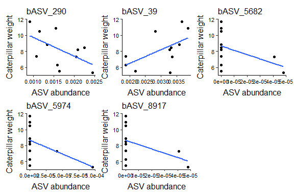<!-- -->

``` r
# Clean environment
rm(list = ls())
```


# 6.5 ASV - Caterpillar performance correlations CD
## Load data

``` r
# Selection of DA ASVs of VL, HM, overlap VL and HM and DA in All data. Object made in upset plot file
load(file = "C:/Users/kreek001/OneDrive - Wageningen University & Research/Chapters/Experimental Chapter 3/RScripts/GitHub/Data/R_objects/FP_DA_SummaryFiles/SummaryFiles_ASVLevel/Acc_Bac_TwoTimes_DA_ASV.RData")

# load ps object
load("C:/Users/kreek001/OneDrive - Wageningen University & Research/Chapters/Experimental Chapter 3/RScripts/GitHub/Data/R_objects/FP_unnormalized_bac_ps_ForDA_clean.RData")
```

## Remove Batch 1

``` r
FP_unnormalized_bac_ps_ForDA_clean <- subset_samples(FP_unnormalized_bac_ps_ForDA_clean, Batch != 1)
```

## Set relative abundance

``` r
# Calculate relative abundance
FP_ps <- transform_sample_counts(FP_unnormalized_bac_ps_ForDA_clean, function(x) x / sum(x))
```

## Prepare data set

``` r
# make one vector with unique ASVs
ASVs <- Acc_Bac_TwoTimes_DA_ASV$CD

# Only select CD
FP_ps <- subset_samples(FP_ps, Accession == "CD")

# prune ps object
FP_ps <- prune_taxa(ASVs, FP_ps) #only keep taxa that are in ASVs vector
#length(intersect(ASVs, taxa_names(FP_unnormalized_bac_ps_ForDA_clean))) # check overlap
#setdiff(ASVs, taxa_names(FP_unnormalized_bac_ps_ForDA_clean)) # check difference

# Phyloseq object to data frame with relative abundance, meta data and taxonomy
FP_ps <- psmelt(FP_ps)

# remove NAs cat weight
FP_ps[is.na(FP_ps$Mean_Weight_Cat), 1:10]
```

```
##  [1] OTU               Sample            Abundance         Phase_PSF        
##  [5] SampleNr          Accession         Domestication     Cat_treatment    
##  [9] Soil_conditioning TreatmentNr      
## <0 rows> (or 0-length row.names)
```

``` r
FP_ps <- FP_ps[!is.na(FP_ps$Mean_Weight_Cat), ]
```

### Remove ASVs with only 0s

``` r
# identify ASVs with zero abundance
Abund_sum <- aggregate(FP_ps$Abundance, by = list(FP_ps$OTU), FUN = sum)
Abund_sum[Abund_sum$x == 0, ]
```

```
## [1] Group.1 x      
## <0 rows> (or 0-length row.names)
```

``` r
Abund_zero <- Abund_sum[Abund_sum$x == 0, "Group.1"]

# Remove ASVs
FP_ps <- FP_ps[!(FP_ps$OTU %in% Abund_zero), ]
ASVs <- ASVs[!ASVs %in% Abund_zero]
```

## Plot
### Function for plot

``` r
Plot1 <- function(x, title) {
  ggplot(data = FP_ps[FP_ps$OTU == x, ], aes(x = Abundance, y = Mean_Weight_Cat)) +
    geom_point() +
    geom_smooth(method = lm, se = FALSE) +
    # coord_cartesian(xlim = c(0, NA), ylim = c(0, NA)) +
    # scale_y_continuous(expand = c(0, 0)) +
    # scale_x_continuous(expand = c(0, 0)) +
    ggtitle(title) +
    xlab("ASV abundance") +
    ylab("Caterpillar weight") +
    theme(panel.background = element_rect(fill = "white"), #theme of the graph
          panel.border = element_blank(),
          axis.line = element_line(), #show line for x and y axis
          plot.title = element_text(size = 12, hjust = 0),
          axis.text = element_text(size = 8, color = "black"),
          axis.title = element_text(size = 12),
          axis.title.x = element_text(vjust = -0.5),
          axis.title.y = element_text(vjust = 2.5), #, hjust = -0
          strip.text = element_text(size = 13),
          legend.position = "right")
}
```

### Run function

``` r
#Plot1(x = "bASV_42", title = "bASV_42")

List_Graph1 <- list()
for (i in 1:length(ASVs)) {
  List_Graph1[[i]] <- Plot1(x = ASVs[i], title = ASVs[i])
}
```

### Print plots

``` r
# Print plots
wrap_plots(List_Graph1[1:20])
```

```
## `geom_smooth()` using formula = 'y ~ x'
## `geom_smooth()` using formula = 'y ~ x'
## `geom_smooth()` using formula = 'y ~ x'
## `geom_smooth()` using formula = 'y ~ x'
## `geom_smooth()` using formula = 'y ~ x'
## `geom_smooth()` using formula = 'y ~ x'
## `geom_smooth()` using formula = 'y ~ x'
## `geom_smooth()` using formula = 'y ~ x'
## `geom_smooth()` using formula = 'y ~ x'
## `geom_smooth()` using formula = 'y ~ x'
## `geom_smooth()` using formula = 'y ~ x'
## `geom_smooth()` using formula = 'y ~ x'
## `geom_smooth()` using formula = 'y ~ x'
## `geom_smooth()` using formula = 'y ~ x'
## `geom_smooth()` using formula = 'y ~ x'
## `geom_smooth()` using formula = 'y ~ x'
## `geom_smooth()` using formula = 'y ~ x'
## `geom_smooth()` using formula = 'y ~ x'
## `geom_smooth()` using formula = 'y ~ x'
## `geom_smooth()` using formula = 'y ~ x'
```

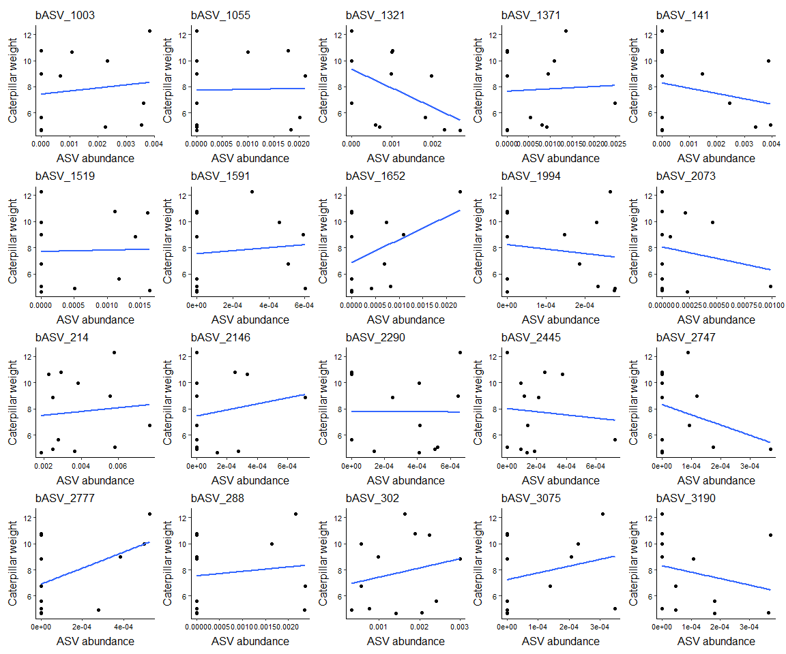<!-- -->

## Model assumptions
### Assumptions with graphs

``` r
NormTest <- function(dat, title) {
  hist(dat, prob = TRUE, col = "grey", main = title) #distribution histogram
  lines(density(dat), col = "blue", lwd = 2)
  
  qqnorm(dat)
  qqline(dat)
  
  print(shapiro.test(dat))
}

# Caterpillar performance
par(mfrow = c(1, 2))
NormTest(dat = FP_ps[FP_ps$OTU == "bASV_61", "Mean_Weight_Cat"], title = "b")
```

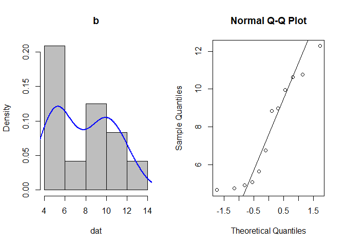<!-- -->

```
## 
## 	Shapiro-Wilk normality test
## 
## data:  dat
## W = 0.88504, p-value = 0.1017
```

``` r
par(mfrow = c(1, 1))
```

### Assumptions only Shapriro Wilk test

``` r
# Abundance
Shap_res_ab <- list()
for(i in 1:length(ASVs)) {
  Shap_res_ab[[i]] <- shapiro.test(FP_ps[FP_ps$OTU == ASVs[i], "Abundance"])
}
names(Shap_res_ab) <- ASVs
Shap_res_ab
```

```
## $bASV_1003
## 
## 	Shapiro-Wilk normality test
## 
## data:  FP_ps[FP_ps$OTU == ASVs[i], "Abundance"]
## W = 0.81313, p-value = 0.01326
## 
## 
## $bASV_1055
## 
## 	Shapiro-Wilk normality test
## 
## data:  FP_ps[FP_ps$OTU == ASVs[i], "Abundance"]
## W = 0.71496, p-value = 0.001179
## 
## 
## $bASV_1321
## 
## 	Shapiro-Wilk normality test
## 
## data:  FP_ps[FP_ps$OTU == ASVs[i], "Abundance"]
## W = 0.91752, p-value = 0.266
## 
## 
## $bASV_1371
## 
## 	Shapiro-Wilk normality test
## 
## data:  FP_ps[FP_ps$OTU == ASVs[i], "Abundance"]
## W = 0.83931, p-value = 0.02716
## 
## 
## $bASV_141
## 
## 	Shapiro-Wilk normality test
## 
## data:  FP_ps[FP_ps$OTU == ASVs[i], "Abundance"]
## W = 0.72933, p-value = 0.00164
## 
## 
## $bASV_1519
## 
## 	Shapiro-Wilk normality test
## 
## data:  FP_ps[FP_ps$OTU == ASVs[i], "Abundance"]
## W = 0.77517, p-value = 0.004958
## 
## 
## $bASV_1591
## 
## 	Shapiro-Wilk normality test
## 
## data:  FP_ps[FP_ps$OTU == ASVs[i], "Abundance"]
## W = 0.72587, p-value = 0.001513
## 
## 
## $bASV_1652
## 
## 	Shapiro-Wilk normality test
## 
## data:  FP_ps[FP_ps$OTU == ASVs[i], "Abundance"]
## W = 0.76234, p-value = 0.003606
## 
## 
## $bASV_1994
## 
## 	Shapiro-Wilk normality test
## 
## data:  FP_ps[FP_ps$OTU == ASVs[i], "Abundance"]
## W = 0.78747, p-value = 0.006773
## 
## 
## $bASV_2073
## 
## 	Shapiro-Wilk normality test
## 
## data:  FP_ps[FP_ps$OTU == ASVs[i], "Abundance"]
## W = 0.63804, p-value = 0.000227
## 
## 
## $bASV_214
## 
## 	Shapiro-Wilk normality test
## 
## data:  FP_ps[FP_ps$OTU == ASVs[i], "Abundance"]
## W = 0.88482, p-value = 0.1011
## 
## 
## $bASV_2146
## 
## 	Shapiro-Wilk normality test
## 
## data:  FP_ps[FP_ps$OTU == ASVs[i], "Abundance"]
## W = 0.71579, p-value = 0.001201
## 
## 
## $bASV_2290
## 
## 	Shapiro-Wilk normality test
## 
## data:  FP_ps[FP_ps$OTU == ASVs[i], "Abundance"]
## W = 0.89433, p-value = 0.134
## 
## 
## $bASV_2445
## 
## 	Shapiro-Wilk normality test
## 
## data:  FP_ps[FP_ps$OTU == ASVs[i], "Abundance"]
## W = 0.80005, p-value = 0.009381
## 
## 
## $bASV_2747
## 
## 	Shapiro-Wilk normality test
## 
## data:  FP_ps[FP_ps$OTU == ASVs[i], "Abundance"]
## W = 0.69987, p-value = 0.0008401
## 
## 
## $bASV_2777
## 
## 	Shapiro-Wilk normality test
## 
## data:  FP_ps[FP_ps$OTU == ASVs[i], "Abundance"]
## W = 0.67381, p-value = 0.0004769
## 
## 
## $bASV_288
## 
## 	Shapiro-Wilk normality test
## 
## data:  FP_ps[FP_ps$OTU == ASVs[i], "Abundance"]
## W = 0.64994, p-value = 0.0002893
## 
## 
## $bASV_302
## 
## 	Shapiro-Wilk normality test
## 
## data:  FP_ps[FP_ps$OTU == ASVs[i], "Abundance"]
## W = 0.95006, p-value = 0.6378
## 
## 
## $bASV_3075
## 
## 	Shapiro-Wilk normality test
## 
## data:  FP_ps[FP_ps$OTU == ASVs[i], "Abundance"]
## W = 0.75391, p-value = 0.002937
## 
## 
## $bASV_3190
## 
## 	Shapiro-Wilk normality test
## 
## data:  FP_ps[FP_ps$OTU == ASVs[i], "Abundance"]
## W = 0.77688, p-value = 0.005176
## 
## 
## $bASV_340
## 
## 	Shapiro-Wilk normality test
## 
## data:  FP_ps[FP_ps$OTU == ASVs[i], "Abundance"]
## W = 0.91749, p-value = 0.2658
## 
## 
## $bASV_345
## 
## 	Shapiro-Wilk normality test
## 
## data:  FP_ps[FP_ps$OTU == ASVs[i], "Abundance"]
## W = 0.93887, p-value = 0.4836
## 
## 
## $bASV_426
## 
## 	Shapiro-Wilk normality test
## 
## data:  FP_ps[FP_ps$OTU == ASVs[i], "Abundance"]
## W = 0.89839, p-value = 0.1512
## 
## 
## $bASV_444
## 
## 	Shapiro-Wilk normality test
## 
## data:  FP_ps[FP_ps$OTU == ASVs[i], "Abundance"]
## W = 0.84741, p-value = 0.03412
## 
## 
## $bASV_446
## 
## 	Shapiro-Wilk normality test
## 
## data:  FP_ps[FP_ps$OTU == ASVs[i], "Abundance"]
## W = 0.6704, p-value = 0.0004435
## 
## 
## $bASV_496
## 
## 	Shapiro-Wilk normality test
## 
## data:  FP_ps[FP_ps$OTU == ASVs[i], "Abundance"]
## W = 0.66912, p-value = 0.0004317
## 
## 
## $bASV_5157
## 
## 	Shapiro-Wilk normality test
## 
## data:  FP_ps[FP_ps$OTU == ASVs[i], "Abundance"]
## W = 0.77336, p-value = 0.004739
## 
## 
## $bASV_528
## 
## 	Shapiro-Wilk normality test
## 
## data:  FP_ps[FP_ps$OTU == ASVs[i], "Abundance"]
## W = 0.8716, p-value = 0.06847
## 
## 
## $bASV_5707
## 
## 	Shapiro-Wilk normality test
## 
## data:  FP_ps[FP_ps$OTU == ASVs[i], "Abundance"]
## W = 0.64749, p-value = 0.0002751
## 
## 
## $bASV_578
## 
## 	Shapiro-Wilk normality test
## 
## data:  FP_ps[FP_ps$OTU == ASVs[i], "Abundance"]
## W = 0.86478, p-value = 0.05614
## 
## 
## $bASV_594
## 
## 	Shapiro-Wilk normality test
## 
## data:  FP_ps[FP_ps$OTU == ASVs[i], "Abundance"]
## W = 0.8582, p-value = 0.04642
## 
## 
## $bASV_61
## 
## 	Shapiro-Wilk normality test
## 
## data:  FP_ps[FP_ps$OTU == ASVs[i], "Abundance"]
## W = 0.92036, p-value = 0.2889
## 
## 
## $bASV_650
## 
## 	Shapiro-Wilk normality test
## 
## data:  FP_ps[FP_ps$OTU == ASVs[i], "Abundance"]
## W = 0.87688, p-value = 0.07996
## 
## 
## $bASV_660
## 
## 	Shapiro-Wilk normality test
## 
## data:  FP_ps[FP_ps$OTU == ASVs[i], "Abundance"]
## W = 0.90197, p-value = 0.1682
## 
## 
## $bASV_729
## 
## 	Shapiro-Wilk normality test
## 
## data:  FP_ps[FP_ps$OTU == ASVs[i], "Abundance"]
## W = 0.74607, p-value = 0.002432
## 
## 
## $bASV_900
## 
## 	Shapiro-Wilk normality test
## 
## data:  FP_ps[FP_ps$OTU == ASVs[i], "Abundance"]
## W = 0.79628, p-value = 0.008503
## 
## 
## $bASV_917
## 
## 	Shapiro-Wilk normality test
## 
## data:  FP_ps[FP_ps$OTU == ASVs[i], "Abundance"]
## W = 0.67032, p-value = 0.0004428
```

## Correlation tests
### Run tests

``` r
CorTest2 <- function(x) {
  sub_data <- FP_ps[FP_ps$OTU == x, ]
  cs0 <- cor.test(sub_data$Abundance, sub_data$Mean_Weight_Cat, method = c("pearson")) # parametric
  cs1 <- cor.test(sub_data$Abundance, sub_data$Mean_Weight_Cat, method = c("spearman")) # non parametric
  cs2 <- cor.test(sub_data$Abundance, sub_data$Mean_Weight_Cat, method = c("kendall")) # non parametric
  rm(sub_data)
  
  # Make data frame with results
  Sum1 <- data.frame(Pearson_est = cs0$estimate, Pearson_stat = cs0$statistic, Pearson_pv = cs0$p.value,
                     Spearman_est = cs1$estimate, Spearman_stat = cs1$statistic, Spearman_pv = cs1$p.value, 
                     Kendall_est = cs2$estimate, Kendall_stat = cs2$statistic, Kendall_pv = cs2$p.value)
  rownames(Sum1) <- x
  return(Sum1)
}

# Run function
List_CorTest2 <- list() # make an empty list to store the plots

for (i in 1:length(ASVs)) {
  List_CorTest2[[i]] <- CorTest2(x = ASVs[i])
}
```

```
## Warning in cor.test.default(sub_data$Abundance, sub_data$Mean_Weight_Cat, :
## Cannot compute exact p-value with ties
```

```
## Warning in cor.test.default(sub_data$Abundance, sub_data$Mean_Weight_Cat, :
## Cannot compute exact p-value with ties
```

```
## Warning in cor.test.default(sub_data$Abundance, sub_data$Mean_Weight_Cat, :
## Cannot compute exact p-value with ties
```

```
## Warning in cor.test.default(sub_data$Abundance, sub_data$Mean_Weight_Cat, :
## Cannot compute exact p-value with ties
```

```
## Warning in cor.test.default(sub_data$Abundance, sub_data$Mean_Weight_Cat, :
## Cannot compute exact p-value with ties
```

```
## Warning in cor.test.default(sub_data$Abundance, sub_data$Mean_Weight_Cat, :
## Cannot compute exact p-value with ties
```

```
## Warning in cor.test.default(sub_data$Abundance, sub_data$Mean_Weight_Cat, :
## Cannot compute exact p-value with ties
```

```
## Warning in cor.test.default(sub_data$Abundance, sub_data$Mean_Weight_Cat, :
## Cannot compute exact p-value with ties
```

```
## Warning in cor.test.default(sub_data$Abundance, sub_data$Mean_Weight_Cat, :
## Cannot compute exact p-value with ties
```

```
## Warning in cor.test.default(sub_data$Abundance, sub_data$Mean_Weight_Cat, :
## Cannot compute exact p-value with ties
```

```
## Warning in cor.test.default(sub_data$Abundance, sub_data$Mean_Weight_Cat, :
## Cannot compute exact p-value with ties
```

```
## Warning in cor.test.default(sub_data$Abundance, sub_data$Mean_Weight_Cat, :
## Cannot compute exact p-value with ties
```

```
## Warning in cor.test.default(sub_data$Abundance, sub_data$Mean_Weight_Cat, :
## Cannot compute exact p-value with ties
```

```
## Warning in cor.test.default(sub_data$Abundance, sub_data$Mean_Weight_Cat, :
## Cannot compute exact p-value with ties
```

```
## Warning in cor.test.default(sub_data$Abundance, sub_data$Mean_Weight_Cat, :
## Cannot compute exact p-value with ties
```

```
## Warning in cor.test.default(sub_data$Abundance, sub_data$Mean_Weight_Cat, :
## Cannot compute exact p-value with ties
```

```
## Warning in cor.test.default(sub_data$Abundance, sub_data$Mean_Weight_Cat, :
## Cannot compute exact p-value with ties
```

```
## Warning in cor.test.default(sub_data$Abundance, sub_data$Mean_Weight_Cat, :
## Cannot compute exact p-value with ties
```

```
## Warning in cor.test.default(sub_data$Abundance, sub_data$Mean_Weight_Cat, :
## Cannot compute exact p-value with ties
```

```
## Warning in cor.test.default(sub_data$Abundance, sub_data$Mean_Weight_Cat, :
## Cannot compute exact p-value with ties
```

```
## Warning in cor.test.default(sub_data$Abundance, sub_data$Mean_Weight_Cat, :
## Cannot compute exact p-value with ties
```

```
## Warning in cor.test.default(sub_data$Abundance, sub_data$Mean_Weight_Cat, :
## Cannot compute exact p-value with ties
```

```
## Warning in cor.test.default(sub_data$Abundance, sub_data$Mean_Weight_Cat, :
## Cannot compute exact p-value with ties
```

```
## Warning in cor.test.default(sub_data$Abundance, sub_data$Mean_Weight_Cat, :
## Cannot compute exact p-value with ties
```

```
## Warning in cor.test.default(sub_data$Abundance, sub_data$Mean_Weight_Cat, :
## Cannot compute exact p-value with ties
```

```
## Warning in cor.test.default(sub_data$Abundance, sub_data$Mean_Weight_Cat, :
## Cannot compute exact p-value with ties
```

```
## Warning in cor.test.default(sub_data$Abundance, sub_data$Mean_Weight_Cat, :
## Cannot compute exact p-value with ties
```

```
## Warning in cor.test.default(sub_data$Abundance, sub_data$Mean_Weight_Cat, :
## Cannot compute exact p-value with ties
```

```
## Warning in cor.test.default(sub_data$Abundance, sub_data$Mean_Weight_Cat, :
## Cannot compute exact p-value with ties
```

```
## Warning in cor.test.default(sub_data$Abundance, sub_data$Mean_Weight_Cat, :
## Cannot compute exact p-value with ties
```

```
## Warning in cor.test.default(sub_data$Abundance, sub_data$Mean_Weight_Cat, :
## Cannot compute exact p-value with ties
```

```
## Warning in cor.test.default(sub_data$Abundance, sub_data$Mean_Weight_Cat, :
## Cannot compute exact p-value with ties
```

```
## Warning in cor.test.default(sub_data$Abundance, sub_data$Mean_Weight_Cat, :
## Cannot compute exact p-value with ties
```

```
## Warning in cor.test.default(sub_data$Abundance, sub_data$Mean_Weight_Cat, :
## Cannot compute exact p-value with ties
```

```
## Warning in cor.test.default(sub_data$Abundance, sub_data$Mean_Weight_Cat, :
## Cannot compute exact p-value with ties
```

```
## Warning in cor.test.default(sub_data$Abundance, sub_data$Mean_Weight_Cat, :
## Cannot compute exact p-value with ties
```

```
## Warning in cor.test.default(sub_data$Abundance, sub_data$Mean_Weight_Cat, :
## Cannot compute exact p-value with ties
```

```
## Warning in cor.test.default(sub_data$Abundance, sub_data$Mean_Weight_Cat, :
## Cannot compute exact p-value with ties
```

```
## Warning in cor.test.default(sub_data$Abundance, sub_data$Mean_Weight_Cat, :
## Cannot compute exact p-value with ties
```

```
## Warning in cor.test.default(sub_data$Abundance, sub_data$Mean_Weight_Cat, :
## Cannot compute exact p-value with ties
```

```
## Warning in cor.test.default(sub_data$Abundance, sub_data$Mean_Weight_Cat, :
## Cannot compute exact p-value with ties
```

```
## Warning in cor.test.default(sub_data$Abundance, sub_data$Mean_Weight_Cat, :
## Cannot compute exact p-value with ties
```

```
## Warning in cor.test.default(sub_data$Abundance, sub_data$Mean_Weight_Cat, :
## Cannot compute exact p-value with ties
```

```
## Warning in cor.test.default(sub_data$Abundance, sub_data$Mean_Weight_Cat, :
## Cannot compute exact p-value with ties
```

```
## Warning in cor.test.default(sub_data$Abundance, sub_data$Mean_Weight_Cat, :
## Cannot compute exact p-value with ties
```

```
## Warning in cor.test.default(sub_data$Abundance, sub_data$Mean_Weight_Cat, :
## Cannot compute exact p-value with ties
```

```
## Warning in cor.test.default(sub_data$Abundance, sub_data$Mean_Weight_Cat, :
## Cannot compute exact p-value with ties
```

```
## Warning in cor.test.default(sub_data$Abundance, sub_data$Mean_Weight_Cat, :
## Cannot compute exact p-value with ties
```

```
## Warning in cor.test.default(sub_data$Abundance, sub_data$Mean_Weight_Cat, :
## Cannot compute exact p-value with ties
```

```
## Warning in cor.test.default(sub_data$Abundance, sub_data$Mean_Weight_Cat, :
## Cannot compute exact p-value with ties
```

```
## Warning in cor.test.default(sub_data$Abundance, sub_data$Mean_Weight_Cat, :
## Cannot compute exact p-value with ties
```

```
## Warning in cor.test.default(sub_data$Abundance, sub_data$Mean_Weight_Cat, :
## Cannot compute exact p-value with ties
```

```
## Warning in cor.test.default(sub_data$Abundance, sub_data$Mean_Weight_Cat, :
## Cannot compute exact p-value with ties
```

```
## Warning in cor.test.default(sub_data$Abundance, sub_data$Mean_Weight_Cat, :
## Cannot compute exact p-value with ties
```

```
## Warning in cor.test.default(sub_data$Abundance, sub_data$Mean_Weight_Cat, :
## Cannot compute exact p-value with ties
```

```
## Warning in cor.test.default(sub_data$Abundance, sub_data$Mean_Weight_Cat, :
## Cannot compute exact p-value with ties
```

```
## Warning in cor.test.default(sub_data$Abundance, sub_data$Mean_Weight_Cat, :
## Cannot compute exact p-value with ties
```

```
## Warning in cor.test.default(sub_data$Abundance, sub_data$Mean_Weight_Cat, :
## Cannot compute exact p-value with ties
```

```
## Warning in cor.test.default(sub_data$Abundance, sub_data$Mean_Weight_Cat, :
## Cannot compute exact p-value with ties
```

```
## Warning in cor.test.default(sub_data$Abundance, sub_data$Mean_Weight_Cat, :
## Cannot compute exact p-value with ties
```

``` r
names(List_CorTest2) <- ASVs
df_CorTest2 <- do.call(rbind.data.frame, List_CorTest2)
df_CorTest2$ASV <- row.names(df_CorTest2)

# Add taxonomy to correlation results
## Extract unique ASVs
FP_ps_ASV_unique <- FP_ps[!duplicated(FP_ps$OTU), c("OTU", "Genus", "Family", "Order", "Class", "Phylum")]
colnames(FP_ps_ASV_unique)[1] <- "ASV"

## Merge two data frames
df_CorTest2 <- merge(df_CorTest2, FP_ps_ASV_unique, by = "ASV")

# p value correction
df_CorTest2$Pearson_pv_pc <- p.adjust(df_CorTest2$Pearson_pv, method = "fdr")
df_CorTest2$Spearman_pv_pc <- p.adjust(df_CorTest2$Spearman_pv, method = "fdr")
df_CorTest2$Kendall_pv_pc <- p.adjust(df_CorTest2$Kendall_pv, method = "fdr")

# print head data frame
df_CorTest2[1:10, ]
```

```
##          ASV Pearson_est Pearson_stat Pearson_pv Spearman_est Spearman_stat
## 1  bASV_1003  0.13367456   0.42654419  0.6787479   0.29729665      200.9732
## 2  bASV_1055  0.02321878   0.07344402  0.9429011   0.02339399      279.3093
## 3  bASV_1321 -0.48073157  -1.73367829  0.1136386  -0.47184269      420.9470
## 4  bASV_1371  0.04865480   0.15404243  0.8806407   0.24653869      215.4899
## 5   bASV_141 -0.24555378  -0.80103452  0.4417283  -0.15595994      330.6045
## 6  bASV_1519  0.02702289   0.08548511  0.9335631  -0.06718195      305.2140
## 7  bASV_1591  0.10765454   0.34242360  0.7391203   0.10917196      254.7768
## 8  bASV_1652  0.43260858   1.51736467  0.1601327   0.30605112      198.4694
## 9  bASV_1994 -0.15191738  -0.48604639  0.6374088  -0.21028300      346.1409
## 10 bASV_2073 -0.18822372  -0.60604805  0.5579880  -0.12476795      321.6836
##    Spearman_pv Kendall_est Kendall_stat Kendall_pv                Genus
## 1    0.3480170  0.23028309    1.0000000  0.3173105      g__Streptomyces
## 2    0.9424708  0.05504819    0.2312257  0.8171394    g__Incertae_Sedis
## 3    0.1214551 -0.35668561   -1.5909433  0.1116223      g__Dictyobacter
## 4    0.4398403  0.19738551    0.8571429  0.3913659   g__Pseudoduganella
## 5    0.6283704 -0.12844577   -0.5395267  0.5895234 g__Pseudarthrobacter
## 6    0.8356603 -0.05170877   -0.2209629  0.8251213    g__Incertae_Sedis
## 7    0.7355586  0.05504819    0.2312257  0.8171394   g__Flavisolibacter
## 8    0.3333085  0.25854384    1.1048144  0.2692400       g__Cupriavidus
## 9    0.5118285 -0.16448792   -0.7142857  0.4750505   g__Flavisolibacter
## 10   0.6992383 -0.09174698   -0.3853762  0.6999587    g__Rhodomicrobium
##                   Family                Order                  Class
## 1   f__Streptomycetaceae  o__Kitasatosporales      c__Actinobacteria
## 2  f__Ktedonobacteraceae o__Ktedonobacterales     c__Ktedonobacteria
## 3  f__Ktedonobacteraceae o__Ktedonobacterales     c__Ktedonobacteria
## 4    f__Oxalobacteraceae   o__Burkholderiales c__Gammaproteobacteria
## 5      f__Micrococcaceae     o__Micrococcales      c__Actinobacteria
## 6  f__Ktedonobacteraceae o__Ktedonobacterales     c__Ktedonobacteria
## 7    f__Chitinophagaceae   o__Chitinophagales         c__Bacteroidia
## 8    f__Burkholderiaceae   o__Burkholderiales c__Gammaproteobacteria
## 9    f__Chitinophagaceae   o__Chitinophagales         c__Bacteroidia
## 10  f__Rhodomicrobiaceae  o__Hyphomicrobiales c__Alphaproteobacteria
##               Phylum Pearson_pv_pc Spearman_pv_pc Kendall_pv_pc
## 1  p__Actinomycetota     0.9967812      0.9883437             1
## 2   p__Chloroflexota     0.9967812      0.9883437             1
## 3   p__Chloroflexota     0.9967812      0.9883437             1
## 4  p__Pseudomonadota     0.9967812      0.9883437             1
## 5  p__Actinomycetota     0.9967812      0.9883437             1
## 6   p__Chloroflexota     0.9967812      0.9883437             1
## 7    p__Bacteroidota     0.9967812      0.9883437             1
## 8  p__Pseudomonadota     0.9967812      0.9883437             1
## 9    p__Bacteroidota     0.9967812      0.9883437             1
## 10 p__Pseudomonadota     0.9967812      0.9883437             1
```

### Select low p values of not corrected p values

``` r
#Pearson_0.05 <- df_CorTest2[df_CorTest2$Pearson_pv_pc <= 0.05, ]
Spearman_0.05 <- df_CorTest2[df_CorTest2$Spearman_pv <= 0.05, ]
Kendall_0.05 <- df_CorTest2[df_CorTest2$Kendall_pv <= 0.05, ]

#Pearson_0.01 <- df_CorTest2[df_CorTest2$Pearson_pv_pc <= 0.01, ]
Spearman_0.01 <- df_CorTest2[df_CorTest2$Spearman_pv <= 0.01, ]
Kendall_0.01 <- df_CorTest2[df_CorTest2$Kendall_pv <= 0.01, ]

Spearman_0.05[ , c("ASV", "Spearman_est", "Spearman_pv", "Genus", "Family", "Class", "Phylum")]
```

```
## [1] ASV          Spearman_est Spearman_pv  Genus        Family      
## [6] Class        Phylum      
## <0 rows> (or 0-length row.names)
```

``` r
Spearman_0.05[Spearman_0.05$Spearman_est <= 0, c("ASV", "Spearman_est", "Spearman_pv", "Genus", "Family", "Class", "Phylum")]
```

```
## [1] ASV          Spearman_est Spearman_pv  Genus        Family      
## [6] Class        Phylum      
## <0 rows> (or 0-length row.names)
```

``` r
Spearman_0.01[ , c("ASV", "Spearman_est", "Spearman_pv", "Genus", "Family", "Class", "Phylum")]
```

```
## [1] ASV          Spearman_est Spearman_pv  Genus        Family      
## [6] Class        Phylum      
## <0 rows> (or 0-length row.names)
```

``` r
Spearman_0.01[Spearman_0.01$Spearman_est <= 0, c("ASV", "Spearman_est", "Spearman_pv", "Genus", "Family", "Class", "Phylum")]
```

```
## [1] ASV          Spearman_est Spearman_pv  Genus        Family      
## [6] Class        Phylum      
## <0 rows> (or 0-length row.names)
```

``` r
summary(df_CorTest2$Spearman_pv)
```

```
##    Min. 1st Qu.  Median    Mean 3rd Qu.    Max. 
##  0.1215  0.4398  0.6813  0.6336  0.8690  0.9908
```

``` r
# ASVs with low p values
# No pearson as data is not normally distributed !
table(c(Spearman_0.05$ASV, Kendall_0.05$ASV))
```

```
## < table of extent 0 >
```

``` r
table(c(Spearman_0.01$ASV, Kendall_0.01$ASV))
```

```
## < table of extent 0 >
```

``` r
# Store ASVs
ASVs_0.05 <- unique(c(Spearman_0.05$ASV))
ASVs_0.05_neg <- unique(c(Spearman_0.05[Spearman_0.05$Spearman_est <= 0, "ASV"]))
ASVs_0.01 <- unique(c(Spearman_0.01$ASV))
ASVs_0.01_neg <- unique(c(Spearman_0.01[Spearman_0.01$Spearman_est <= 0, "ASV"]))
ASVs_0.01_neg <- ASVs_0.01_neg[!is.na(ASVs_0.01_neg)]
```

<!-- ### Select low p values of corrected p values -->
<!-- ```{r} -->
<!-- #Pearson_0.05c <- df_CorTest2[df_CorTest2$Pearson_pv_pc <= 0.05, ] -->
<!-- Spearman_0.05c <- df_CorTest2[df_CorTest2$Spearman_pv_pc <= 0.05, ] -->
<!-- Kendall_0.05c <- df_CorTest2[df_CorTest2$Kendall_pv_pc <= 0.05, ] -->

<!-- #Pearson_0.01c <- df_CorTest2[df_CorTest2$Pearson_pv_pc <= 0.01, ] -->
<!-- Spearman_0.01c <- df_CorTest2[df_CorTest2$Spearman_pv_pc <= 0.01, ] -->
<!-- Kendall_0.01c <- df_CorTest2[df_CorTest2$Kendall_pv_pc <= 0.01, ] -->

<!-- Spearman_0.05c[ , c("ASV", "Spearman_est", "Spearman_pv_pc", "Genus", "Family", "Class", "Phylum")] -->
<!-- Spearman_0.01c[ , c("ASV", "Spearman_est", "Spearman_pv_pc", "Genus", "Family", "Class", "Phylum")] -->

<!-- # ASVs with low p values -->
<!-- # No pearson as data is not normally distributed ! -->
<!-- table(c(Spearman_0.05c$ASV, Kendall_0.05c$ASV)) -->
<!-- table(c(Spearman_0.01c$ASV, Kendall_0.01c$ASV)) -->
<!-- table(c(Spearman_0.05c$ASV, Kendall_0.05c$ASV, Spearman_0.01c$ASV, Kendall_0.01c$ASV)) -->

<!-- # Store ASVs -->
<!-- ASVs_0.05c <- unique(c(Spearman_0.05c$ASV)) -->
<!-- ASVs_0.01c <- unique(c(Spearman_0.01c$ASV)) -->

<!-- DAASVs_SpCorr_ASVCatPerf_CD <- list(ASVs_0.05 = ASVs_0.05, ASVs_0.01 = ASVs_0.01, ASVs_0.05_pc = ASVs_0.05c, ASVs_0.01_pc = ASVs_0.01c, ASVs_0.05_neg = ASVs_0.05_neg, ASVs_0.01_neg = ASVs_0.01_neg) -->

<!-- save(DAASVs_SpCorr_ASVCatPerf_CD, file = "C:/Users/kreek001/OneDrive - Wageningen University & Research/Chapters/Experimental Chapter 3/RScripts/GitHub/TwelveAccessionExperiment/MicrobiomeAnalysis/Data/Phyloseq_objects/FP_DA_CorrAnlysis/DAASVs_SpCorr_ASVCatPerf_CD.RData") -->
<!-- ``` -->

<!-- ## Plot highly correlating ASVs -->
<!-- No p value correction used. -->
<!-- ```{r} -->
<!-- # P value < 0.05 -->
<!-- List_Graph_0.05 <- list() -->
<!-- for (i in 1:length(ASVs_0.05)) { -->
<!--   List_Graph_0.05[[i]] <- Plot1(x = ASVs_0.05[i], title = ASVs_0.05[i]) -->
<!-- } -->

<!-- # P value < 0.01 -->
<!-- List_Graph_0.01 <- list() -->
<!-- for (i in 1:length(ASVs_0.01)) { -->
<!--   List_Graph_0.01[[i]] <- Plot1(x = ASVs_0.01[i], title = ASVs_0.01[i]) -->
<!-- } -->

<!-- # P value < 0.05  only negative correlations -->
<!-- List_Graph_0.05_neg <- list() -->
<!-- for (i in 1:length(ASVs_0.05_neg)) { -->
<!--   List_Graph_0.05_neg[[i]] <- Plot1(x = ASVs_0.05_neg[i], title = ASVs_0.05_neg[i]) -->
<!-- } -->

<!-- # # P value < 0.01 only negative correlations -->
<!-- # List_Graph_0.01_neg <- list() -->
<!-- # for (i in 1:length(ASVs_0.01_neg)) { -->
<!-- #   List_Graph_0.01_neg[[i]] <- Plot1(x = ASVs_0.01_neg[i], title = ASVs_0.01_neg[i]) -->
<!-- # } -->
<!-- #  -->
<!-- #Plot1(x = "bASV_2431", title = "bASV_2431") -->
<!-- ``` -->

<!-- ### Print plots -->
<!-- ```{r, fig.height=4, fig.width=6} -->
<!-- # Print plots p value < 0.05 -->
<!-- wrap_plots(List_Graph_0.05) -->
<!-- ``` -->
<!-- ```{r, fig.height=2, fig.width=2} -->
<!-- # Print plots p value < 0.01 -->
<!-- wrap_plots(List_Graph_0.01) -->
<!-- ``` -->
<!-- ```{r, fig.height=2, fig.width=6} -->
<!-- # Print plots p value < 0.05 only negative correlations -->
<!-- wrap_plots(List_Graph_0.05_neg) -->
<!-- ``` -->
<!-- ```{r, fig.height=2.3, fig.width=7} -->
<!-- # Print plots p value < 0.01 only negative correlations -->
<!-- #wrap_plots(List_Graph_0.01_neg) -->
<!-- ``` -->


# 6.6 ASV - Caterpillar performance correlations GO1
## Load data

``` r
# Selection of DA ASVs GO1
load(file = "C:/Users/kreek001/OneDrive - Wageningen University & Research/Chapters/Experimental Chapter 3/RScripts/GitHub/Data/R_objects/FP_DA_SummaryFiles/SummaryFiles_ASVLevel/Acc_Bac_TwoTimes_DA_ASV.RData")

# load ps object
load("C:/Users/kreek001/OneDrive - Wageningen University & Research/Chapters/Experimental Chapter 3/RScripts/GitHub/Data/R_objects/FP_unnormalized_bac_ps_ForDA_clean.RData")
```

## Remove Batch 1

``` r
FP_unnormalized_bac_ps_ForDA_clean <- subset_samples(FP_unnormalized_bac_ps_ForDA_clean, Batch != 1)
```

## Set relative abundance

``` r
# Calculate relative abundance
FP_ps <- transform_sample_counts(FP_unnormalized_bac_ps_ForDA_clean, function(x) x / sum(x))
```

## Prepare data set

``` r
# make one vector with unique ASVs
ASVs <- Acc_Bac_TwoTimes_DA_ASV$GO1

# Only select GO1
FP_ps <- subset_samples(FP_ps, Accession == "GO1")

# prune ps object
FP_ps <- prune_taxa(ASVs, FP_ps) #only keep taxa that are in ASVs vector
#length(intersect(ASVs, taxa_names(FP_unnormalized_bac_ps_ForDA_clean))) # check overlap
#setdiff(ASVs, taxa_names(FP_unnormalized_bac_ps_ForDA_clean)) # check difference

# Phyloseq object to data frame with relative abundance, meta data and taxonomy
FP_ps <- psmelt(FP_ps)

# remove NAs cat weight
FP_ps[is.na(FP_ps$Mean_Weight_Cat), 1:10]
```

```
##            OTU Sample    Abundance Phase_PSF SampleNr Accession Domestication
## 273    bASV_27   F099 6.384601e-03        FP       99       GO1    Cultivated
## 242    bASV_26   F099 3.764056e-03        FP       99       GO1    Cultivated
## 376   bASV_426   F099 3.001715e-03        FP       99       GO1    Cultivated
## 470   bASV_650   F099 2.954069e-03        FP       99       GO1    Cultivated
## 436    bASV_60   F099 2.763484e-03        FP       99       GO1    Cultivated
## 91     bASV_14   F099 2.668191e-03        FP       99       GO1    Cultivated
## 315   bASV_340   F099 2.620545e-03        FP       99       GO1    Cultivated
## 349   bASV_386   F099 2.620545e-03        FP       99       GO1    Cultivated
## 372    bASV_41   F099 2.620545e-03        FP       99       GO1    Cultivated
## 139    bASV_17   F099 2.572899e-03        FP       99       GO1    Cultivated
## 393    bASV_46   F099 2.239375e-03        FP       99       GO1    Cultivated
## 492    bASV_66   F099 2.191729e-03        FP       99       GO1    Cultivated
## 115   bASV_160   F099 2.144082e-03        FP       99       GO1    Cultivated
## 457    bASV_65   F099 2.144082e-03        FP       99       GO1    Cultivated
## 106    bASV_15   F099 1.905851e-03        FP       99       GO1    Cultivated
## 152   bASV_176   F099 1.810558e-03        FP       99       GO1    Cultivated
## 167   bASV_177   F099 1.810558e-03        FP       99       GO1    Cultivated
## 498    bASV_79   F099 1.810558e-03        FP       99       GO1    Cultivated
## 224    bASV_25   F099 1.619973e-03        FP       99       GO1    Cultivated
## 264  bASV_2612   F099 1.381742e-03        FP       99       GO1    Cultivated
## 191   bASV_192   F099 1.238803e-03        FP       99       GO1    Cultivated
## 71   bASV_1203   F099 1.143511e-03        FP       99       GO1    Cultivated
## 287   bASV_271   F099 1.000572e-03        FP       99       GO1    Cultivated
## 200  bASV_2152   F099 7.623404e-04        FP       99       GO1    Cultivated
## 343   bASV_385   F099 7.146941e-04        FP       99       GO1    Cultivated
## 453  bASV_6205   F099 5.717553e-04        FP       99       GO1    Cultivated
## 78   bASV_1355   F099 5.241090e-04        FP       99       GO1    Cultivated
## 25   bASV_1146   F099 4.288165e-04        FP       99       GO1    Cultivated
## 210  bASV_2377   F099 4.288165e-04        FP       99       GO1    Cultivated
## 123  bASV_1621   F099 3.335239e-04        FP       99       GO1    Cultivated
## 232  bASV_2540   F099 3.335239e-04        FP       99       GO1    Cultivated
## 59   bASV_1196   F099 2.382314e-04        FP       99       GO1    Cultivated
## 298  bASV_2979   F099 1.905851e-04        FP       99       GO1    Cultivated
## 539  bASV_9867   F099 1.429388e-04        FP       99       GO1    Cultivated
## 179  bASV_1798   F099 9.529255e-05        FP       99       GO1    Cultivated
## 418  bASV_5196   F099 9.529255e-05        FP       99       GO1    Cultivated
## 528  bASV_9540   F099 4.764627e-05        FP       99       GO1    Cultivated
## 3    bASV_1003   F099 0.000000e+00        FP       99       GO1    Cultivated
## 20   bASV_1060   F099 0.000000e+00        FP       99       GO1    Cultivated
## 40  bASV_11729   F099 0.000000e+00        FP       99       GO1    Cultivated
## 305  bASV_3249   F099 0.000000e+00        FP       99       GO1    Cultivated
## 326  bASV_3744   F099 0.000000e+00        FP       99       GO1    Cultivated
## 398   bASV_477   F099 0.000000e+00        FP       99       GO1    Cultivated
## 424   bASV_549   F099 0.000000e+00        FP       99       GO1    Cultivated
## 505   bASV_794   F099 0.000000e+00        FP       99       GO1    Cultivated
##     Cat_treatment Soil_conditioning TreatmentNr
## 273            Mb                Co           5
## 242            Mb                Co           5
## 376            Mb                Co           5
## 470            Mb                Co           5
## 436            Mb                Co           5
## 91             Mb                Co           5
## 315            Mb                Co           5
## 349            Mb                Co           5
## 372            Mb                Co           5
## 139            Mb                Co           5
## 393            Mb                Co           5
## 492            Mb                Co           5
## 115            Mb                Co           5
## 457            Mb                Co           5
## 106            Mb                Co           5
## 152            Mb                Co           5
## 167            Mb                Co           5
## 498            Mb                Co           5
## 224            Mb                Co           5
## 264            Mb                Co           5
## 191            Mb                Co           5
## 71             Mb                Co           5
## 287            Mb                Co           5
## 200            Mb                Co           5
## 343            Mb                Co           5
## 453            Mb                Co           5
## 78             Mb                Co           5
## 25             Mb                Co           5
## 210            Mb                Co           5
## 123            Mb                Co           5
## 232            Mb                Co           5
## 59             Mb                Co           5
## 298            Mb                Co           5
## 539            Mb                Co           5
## 179            Mb                Co           5
## 418            Mb                Co           5
## 528            Mb                Co           5
## 3              Mb                Co           5
## 20             Mb                Co           5
## 40             Mb                Co           5
## 305            Mb                Co           5
## 326            Mb                Co           5
## 398            Mb                Co           5
## 424            Mb                Co           5
## 505            Mb                Co           5
```

``` r
FP_ps <- FP_ps[!is.na(FP_ps$Mean_Weight_Cat), ]
```

### Remove ASVs with only 0s

``` r
# identify ASVs with zero abundance
Abund_sum <- aggregate(FP_ps$Abundance, by = list(FP_ps$OTU), FUN = sum)
Abund_sum[Abund_sum$x == 0, ]
```

```
## [1] Group.1 x      
## <0 rows> (or 0-length row.names)
```

``` r
Abund_zero <- Abund_sum[Abund_sum$x == 0, "Group.1"]

# Remove ASVs
FP_ps <- FP_ps[!(FP_ps$OTU %in% Abund_zero), ]
ASVs <- ASVs[!ASVs %in% Abund_zero]
```

## Plot
### Function for plot

``` r
Plot1 <- function(x, title) {
  ggplot(data = FP_ps[FP_ps$OTU == x, ], aes(x = Abundance, y = Mean_Weight_Cat)) +
    geom_point() +
    geom_smooth(method = lm, se = FALSE) +
    # coord_cartesian(xlim = c(0, NA), ylim = c(0, NA)) +
    # scale_y_continuous(expand = c(0, 0)) +
    # scale_x_continuous(expand = c(0, 0)) +
    ggtitle(title) +
    xlab("ASV abundance") +
    ylab("Caterpillar weight") +
    theme(panel.background = element_rect(fill = "white"), #theme of the graph
          panel.border = element_blank(),
          axis.line = element_line(), #show line for x and y axis
          plot.title = element_text(size = 12, hjust = 0),
          axis.text = element_text(size = 8, color = "black"),
          axis.title = element_text(size = 12),
          axis.title.x = element_text(vjust = -0.5),
          axis.title.y = element_text(vjust = 2.5), #, hjust = -0
          strip.text = element_text(size = 13),
          legend.position = "right")
}
```

### Run function

``` r
#Plot1(x = "bASV_42", title = "bASV_42")

List_Graph1 <- list()
for (i in 1:length(ASVs)) {
  List_Graph1[[i]] <- Plot1(x = ASVs[i], title = ASVs[i])
}
```

### Print plots

``` r
# Print plots
wrap_plots(List_Graph1[1:20])
```

```
## `geom_smooth()` using formula = 'y ~ x'
## `geom_smooth()` using formula = 'y ~ x'
## `geom_smooth()` using formula = 'y ~ x'
## `geom_smooth()` using formula = 'y ~ x'
## `geom_smooth()` using formula = 'y ~ x'
## `geom_smooth()` using formula = 'y ~ x'
## `geom_smooth()` using formula = 'y ~ x'
## `geom_smooth()` using formula = 'y ~ x'
## `geom_smooth()` using formula = 'y ~ x'
## `geom_smooth()` using formula = 'y ~ x'
## `geom_smooth()` using formula = 'y ~ x'
## `geom_smooth()` using formula = 'y ~ x'
## `geom_smooth()` using formula = 'y ~ x'
## `geom_smooth()` using formula = 'y ~ x'
## `geom_smooth()` using formula = 'y ~ x'
## `geom_smooth()` using formula = 'y ~ x'
## `geom_smooth()` using formula = 'y ~ x'
## `geom_smooth()` using formula = 'y ~ x'
## `geom_smooth()` using formula = 'y ~ x'
## `geom_smooth()` using formula = 'y ~ x'
```

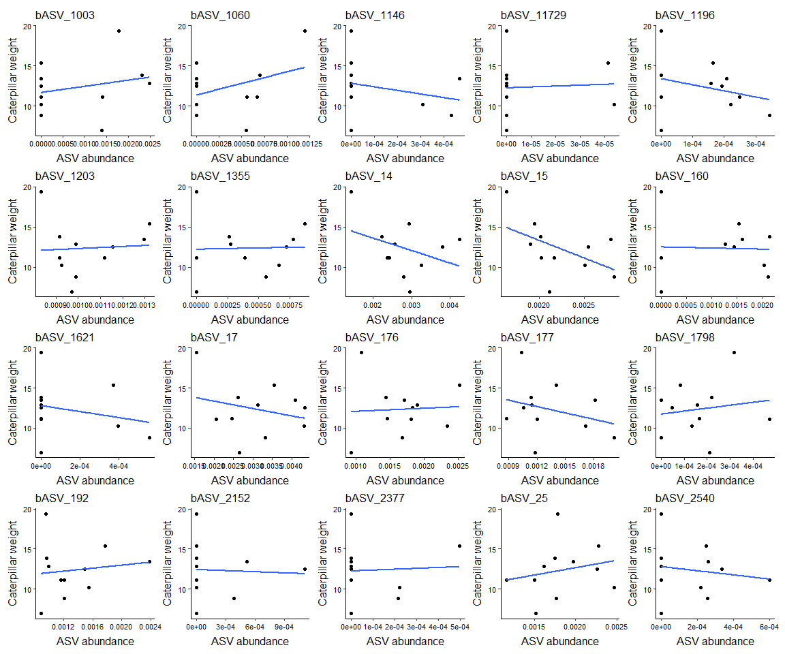<!-- -->

## Model assumptions
### Assumptions with graphs

``` r
NormTest <- function(dat, title) {
  hist(dat, prob = TRUE, col = "grey", main = title) #distribution histogram
  lines(density(dat), col = "blue", lwd = 2)
  
  qqnorm(dat)
  qqline(dat)
  
  print(shapiro.test(dat))
}

# Caterpillar performance
par(mfrow = c(1, 2))
NormTest(dat = FP_ps[FP_ps$OTU == "bASV_27", "Mean_Weight_Cat"], title = "b")
```

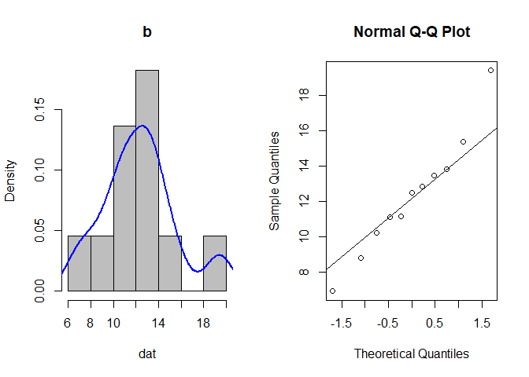<!-- -->

```
## 
## 	Shapiro-Wilk normality test
## 
## data:  dat
## W = 0.97128, p-value = 0.8991
```

``` r
par(mfrow = c(1, 1))
```

### Assumptions only Shapriro Wilk test

``` r
# Abundance
Shap_res_ab <- list()
for(i in 1:length(ASVs)) {
  Shap_res_ab[[i]] <- shapiro.test(FP_ps[FP_ps$OTU == ASVs[i], "Abundance"])
}
names(Shap_res_ab) <- ASVs
Shap_res_ab
```

```
## $bASV_1003
## 
## 	Shapiro-Wilk normality test
## 
## data:  FP_ps[FP_ps$OTU == ASVs[i], "Abundance"]
## W = 0.7703, p-value = 0.003831
## 
## 
## $bASV_1060
## 
## 	Shapiro-Wilk normality test
## 
## data:  FP_ps[FP_ps$OTU == ASVs[i], "Abundance"]
## W = 0.7817, p-value = 0.005406
## 
## 
## $bASV_1146
## 
## 	Shapiro-Wilk normality test
## 
## data:  FP_ps[FP_ps$OTU == ASVs[i], "Abundance"]
## W = 0.61309, p-value = 3.702e-05
## 
## 
## $bASV_11729
## 
## 	Shapiro-Wilk normality test
## 
## data:  FP_ps[FP_ps$OTU == ASVs[i], "Abundance"]
## W = 0.49319, p-value = 1.255e-06
## 
## 
## $bASV_1196
## 
## 	Shapiro-Wilk normality test
## 
## data:  FP_ps[FP_ps$OTU == ASVs[i], "Abundance"]
## W = 0.87015, p-value = 0.07786
## 
## 
## $bASV_1203
## 
## 	Shapiro-Wilk normality test
## 
## data:  FP_ps[FP_ps$OTU == ASVs[i], "Abundance"]
## W = 0.89244, p-value = 0.1492
## 
## 
## $bASV_1355
## 
## 	Shapiro-Wilk normality test
## 
## data:  FP_ps[FP_ps$OTU == ASVs[i], "Abundance"]
## W = 0.90293, p-value = 0.2007
## 
## 
## $bASV_14
## 
## 	Shapiro-Wilk normality test
## 
## data:  FP_ps[FP_ps$OTU == ASVs[i], "Abundance"]
## W = 0.97312, p-value = 0.9162
## 
## 
## $bASV_15
## 
## 	Shapiro-Wilk normality test
## 
## data:  FP_ps[FP_ps$OTU == ASVs[i], "Abundance"]
## W = 0.92772, p-value = 0.3882
## 
## 
## $bASV_160
## 
## 	Shapiro-Wilk normality test
## 
## data:  FP_ps[FP_ps$OTU == ASVs[i], "Abundance"]
## W = 0.80895, p-value = 0.01234
## 
## 
## $bASV_1621
## 
## 	Shapiro-Wilk normality test
## 
## data:  FP_ps[FP_ps$OTU == ASVs[i], "Abundance"]
## W = 0.62392, p-value = 5.058e-05
## 
## 
## $bASV_17
## 
## 	Shapiro-Wilk normality test
## 
## data:  FP_ps[FP_ps$OTU == ASVs[i], "Abundance"]
## W = 0.95207, p-value = 0.6706
## 
## 
## $bASV_176
## 
## 	Shapiro-Wilk normality test
## 
## data:  FP_ps[FP_ps$OTU == ASVs[i], "Abundance"]
## W = 0.9635, p-value = 0.8145
## 
## 
## $bASV_177
## 
## 	Shapiro-Wilk normality test
## 
## data:  FP_ps[FP_ps$OTU == ASVs[i], "Abundance"]
## W = 0.88655, p-value = 0.1259
## 
## 
## $bASV_1798
## 
## 	Shapiro-Wilk normality test
## 
## data:  FP_ps[FP_ps$OTU == ASVs[i], "Abundance"]
## W = 0.92628, p-value = 0.3744
## 
## 
## $bASV_192
## 
## 	Shapiro-Wilk normality test
## 
## data:  FP_ps[FP_ps$OTU == ASVs[i], "Abundance"]
## W = 0.85507, p-value = 0.04968
## 
## 
## $bASV_2152
## 
## 	Shapiro-Wilk normality test
## 
## data:  FP_ps[FP_ps$OTU == ASVs[i], "Abundance"]
## W = 0.60612, p-value = 3.03e-05
## 
## 
## $bASV_2377
## 
## 	Shapiro-Wilk normality test
## 
## data:  FP_ps[FP_ps$OTU == ASVs[i], "Abundance"]
## W = 0.60913, p-value = 3.303e-05
## 
## 
## $bASV_25
## 
## 	Shapiro-Wilk normality test
## 
## data:  FP_ps[FP_ps$OTU == ASVs[i], "Abundance"]
## W = 0.9617, p-value = 0.7927
## 
## 
## $bASV_2540
## 
## 	Shapiro-Wilk normality test
## 
## data:  FP_ps[FP_ps$OTU == ASVs[i], "Abundance"]
## W = 0.8237, p-value = 0.01929
## 
## 
## $bASV_26
## 
## 	Shapiro-Wilk normality test
## 
## data:  FP_ps[FP_ps$OTU == ASVs[i], "Abundance"]
## W = 0.86557, p-value = 0.06798
## 
## 
## $bASV_2612
## 
## 	Shapiro-Wilk normality test
## 
## data:  FP_ps[FP_ps$OTU == ASVs[i], "Abundance"]
## W = 0.95054, p-value = 0.6509
## 
## 
## $bASV_27
## 
## 	Shapiro-Wilk normality test
## 
## data:  FP_ps[FP_ps$OTU == ASVs[i], "Abundance"]
## W = 0.96222, p-value = 0.799
## 
## 
## $bASV_271
## 
## 	Shapiro-Wilk normality test
## 
## data:  FP_ps[FP_ps$OTU == ASVs[i], "Abundance"]
## W = 0.7421, p-value = 0.00164
## 
## 
## $bASV_2979
## 
## 	Shapiro-Wilk normality test
## 
## data:  FP_ps[FP_ps$OTU == ASVs[i], "Abundance"]
## W = 0.86275, p-value = 0.0625
## 
## 
## $bASV_3249
## 
## 	Shapiro-Wilk normality test
## 
## data:  FP_ps[FP_ps$OTU == ASVs[i], "Abundance"]
## W = 0.82832, p-value = 0.02219
## 
## 
## $bASV_340
## 
## 	Shapiro-Wilk normality test
## 
## data:  FP_ps[FP_ps$OTU == ASVs[i], "Abundance"]
## W = 0.9171, p-value = 0.2952
## 
## 
## $bASV_3744
## 
## 	Shapiro-Wilk normality test
## 
## data:  FP_ps[FP_ps$OTU == ASVs[i], "Abundance"]
## W = 0.8309, p-value = 0.02399
## 
## 
## $bASV_385
## 
## 	Shapiro-Wilk normality test
## 
## data:  FP_ps[FP_ps$OTU == ASVs[i], "Abundance"]
## W = 0.86033, p-value = 0.05816
## 
## 
## $bASV_386
## 
## 	Shapiro-Wilk normality test
## 
## data:  FP_ps[FP_ps$OTU == ASVs[i], "Abundance"]
## W = 0.95093, p-value = 0.6559
## 
## 
## $bASV_41
## 
## 	Shapiro-Wilk normality test
## 
## data:  FP_ps[FP_ps$OTU == ASVs[i], "Abundance"]
## W = 0.9672, p-value = 0.8569
## 
## 
## $bASV_426
## 
## 	Shapiro-Wilk normality test
## 
## data:  FP_ps[FP_ps$OTU == ASVs[i], "Abundance"]
## W = 0.89535, p-value = 0.1621
## 
## 
## $bASV_46
## 
## 	Shapiro-Wilk normality test
## 
## data:  FP_ps[FP_ps$OTU == ASVs[i], "Abundance"]
## W = 0.86279, p-value = 0.06259
## 
## 
## $bASV_477
## 
## 	Shapiro-Wilk normality test
## 
## data:  FP_ps[FP_ps$OTU == ASVs[i], "Abundance"]
## W = 0.77841, p-value = 0.004894
## 
## 
## $bASV_5196
## 
## 	Shapiro-Wilk normality test
## 
## data:  FP_ps[FP_ps$OTU == ASVs[i], "Abundance"]
## W = 0.60277, p-value = 2.753e-05
## 
## 
## $bASV_549
## 
## 	Shapiro-Wilk normality test
## 
## data:  FP_ps[FP_ps$OTU == ASVs[i], "Abundance"]
## W = 0.57323, p-value = 1.185e-05
## 
## 
## $bASV_60
## 
## 	Shapiro-Wilk normality test
## 
## data:  FP_ps[FP_ps$OTU == ASVs[i], "Abundance"]
## W = 0.88269, p-value = 0.1125
## 
## 
## $bASV_6205
## 
## 	Shapiro-Wilk normality test
## 
## data:  FP_ps[FP_ps$OTU == ASVs[i], "Abundance"]
## W = 0.61514, p-value = 3.927e-05
## 
## 
## $bASV_65
## 
## 	Shapiro-Wilk normality test
## 
## data:  FP_ps[FP_ps$OTU == ASVs[i], "Abundance"]
## W = 0.95744, p-value = 0.7394
## 
## 
## $bASV_650
## 
## 	Shapiro-Wilk normality test
## 
## data:  FP_ps[FP_ps$OTU == ASVs[i], "Abundance"]
## W = 0.84632, p-value = 0.0382
## 
## 
## $bASV_66
## 
## 	Shapiro-Wilk normality test
## 
## data:  FP_ps[FP_ps$OTU == ASVs[i], "Abundance"]
## W = 0.91803, p-value = 0.3026
## 
## 
## $bASV_79
## 
## 	Shapiro-Wilk normality test
## 
## data:  FP_ps[FP_ps$OTU == ASVs[i], "Abundance"]
## W = 0.90866, p-value = 0.2351
## 
## 
## $bASV_794
## 
## 	Shapiro-Wilk normality test
## 
## data:  FP_ps[FP_ps$OTU == ASVs[i], "Abundance"]
## W = 0.72905, p-value = 0.00111
## 
## 
## $bASV_9540
## 
## 	Shapiro-Wilk normality test
## 
## data:  FP_ps[FP_ps$OTU == ASVs[i], "Abundance"]
## W = 0.7148, p-value = 0.0007258
## 
## 
## $bASV_9867
## 
## 	Shapiro-Wilk normality test
## 
## data:  FP_ps[FP_ps$OTU == ASVs[i], "Abundance"]
## W = 0.6289, p-value = 5.841e-05
```

## Correlation tests
### Run tests

``` r
CorTest2 <- function(x) {
  sub_data <- FP_ps[FP_ps$OTU == x, ]
  cs0 <- cor.test(sub_data$Abundance, sub_data$Mean_Weight_Cat, method = c("pearson")) # parametric
  cs1 <- cor.test(sub_data$Abundance, sub_data$Mean_Weight_Cat, method = c("spearman")) # non parametric
  cs2 <- cor.test(sub_data$Abundance, sub_data$Mean_Weight_Cat, method = c("kendall")) # non parametric
  rm(sub_data)
  
  # Make data frame with results
  Sum1 <- data.frame(Pearson_est = cs0$estimate, Pearson_stat = cs0$statistic, Pearson_pv = cs0$p.value,
                     Spearman_est = cs1$estimate, Spearman_stat = cs1$statistic, Spearman_pv = cs1$p.value, 
                     Kendall_est = cs2$estimate, Kendall_stat = cs2$statistic, Kendall_pv = cs2$p.value)
  rownames(Sum1) <- x
  return(Sum1)
}

# Run function
List_CorTest2 <- list() # make an empty list to store the plots

for (i in 1:length(ASVs)) {
  List_CorTest2[[i]] <- CorTest2(x = ASVs[i])
}
```

```
## Warning in cor.test.default(sub_data$Abundance, sub_data$Mean_Weight_Cat, :
## Cannot compute exact p-value with ties
```

```
## Warning in cor.test.default(sub_data$Abundance, sub_data$Mean_Weight_Cat, :
## Cannot compute exact p-value with ties
```

```
## Warning in cor.test.default(sub_data$Abundance, sub_data$Mean_Weight_Cat, :
## Cannot compute exact p-value with ties
```

```
## Warning in cor.test.default(sub_data$Abundance, sub_data$Mean_Weight_Cat, :
## Cannot compute exact p-value with ties
```

```
## Warning in cor.test.default(sub_data$Abundance, sub_data$Mean_Weight_Cat, :
## Cannot compute exact p-value with ties
```

```
## Warning in cor.test.default(sub_data$Abundance, sub_data$Mean_Weight_Cat, :
## Cannot compute exact p-value with ties
```

```
## Warning in cor.test.default(sub_data$Abundance, sub_data$Mean_Weight_Cat, :
## Cannot compute exact p-value with ties
```

```
## Warning in cor.test.default(sub_data$Abundance, sub_data$Mean_Weight_Cat, :
## Cannot compute exact p-value with ties
```

```
## Warning in cor.test.default(sub_data$Abundance, sub_data$Mean_Weight_Cat, :
## Cannot compute exact p-value with ties
```

```
## Warning in cor.test.default(sub_data$Abundance, sub_data$Mean_Weight_Cat, :
## Cannot compute exact p-value with ties
```

```
## Warning in cor.test.default(sub_data$Abundance, sub_data$Mean_Weight_Cat, :
## Cannot compute exact p-value with ties
```

```
## Warning in cor.test.default(sub_data$Abundance, sub_data$Mean_Weight_Cat, :
## Cannot compute exact p-value with ties
```

```
## Warning in cor.test.default(sub_data$Abundance, sub_data$Mean_Weight_Cat, :
## Cannot compute exact p-value with ties
```

```
## Warning in cor.test.default(sub_data$Abundance, sub_data$Mean_Weight_Cat, :
## Cannot compute exact p-value with ties
```

```
## Warning in cor.test.default(sub_data$Abundance, sub_data$Mean_Weight_Cat, :
## Cannot compute exact p-value with ties
```

```
## Warning in cor.test.default(sub_data$Abundance, sub_data$Mean_Weight_Cat, :
## Cannot compute exact p-value with ties
```

```
## Warning in cor.test.default(sub_data$Abundance, sub_data$Mean_Weight_Cat, :
## Cannot compute exact p-value with ties
```

```
## Warning in cor.test.default(sub_data$Abundance, sub_data$Mean_Weight_Cat, :
## Cannot compute exact p-value with ties
```

```
## Warning in cor.test.default(sub_data$Abundance, sub_data$Mean_Weight_Cat, :
## Cannot compute exact p-value with ties
```

```
## Warning in cor.test.default(sub_data$Abundance, sub_data$Mean_Weight_Cat, :
## Cannot compute exact p-value with ties
```

```
## Warning in cor.test.default(sub_data$Abundance, sub_data$Mean_Weight_Cat, :
## Cannot compute exact p-value with ties
```

```
## Warning in cor.test.default(sub_data$Abundance, sub_data$Mean_Weight_Cat, :
## Cannot compute exact p-value with ties
```

```
## Warning in cor.test.default(sub_data$Abundance, sub_data$Mean_Weight_Cat, :
## Cannot compute exact p-value with ties
```

```
## Warning in cor.test.default(sub_data$Abundance, sub_data$Mean_Weight_Cat, :
## Cannot compute exact p-value with ties
```

```
## Warning in cor.test.default(sub_data$Abundance, sub_data$Mean_Weight_Cat, :
## Cannot compute exact p-value with ties
```

```
## Warning in cor.test.default(sub_data$Abundance, sub_data$Mean_Weight_Cat, :
## Cannot compute exact p-value with ties
```

```
## Warning in cor.test.default(sub_data$Abundance, sub_data$Mean_Weight_Cat, :
## Cannot compute exact p-value with ties
```

```
## Warning in cor.test.default(sub_data$Abundance, sub_data$Mean_Weight_Cat, :
## Cannot compute exact p-value with ties
```

```
## Warning in cor.test.default(sub_data$Abundance, sub_data$Mean_Weight_Cat, :
## Cannot compute exact p-value with ties
```

```
## Warning in cor.test.default(sub_data$Abundance, sub_data$Mean_Weight_Cat, :
## Cannot compute exact p-value with ties
```

```
## Warning in cor.test.default(sub_data$Abundance, sub_data$Mean_Weight_Cat, :
## Cannot compute exact p-value with ties
```

```
## Warning in cor.test.default(sub_data$Abundance, sub_data$Mean_Weight_Cat, :
## Cannot compute exact p-value with ties
```

```
## Warning in cor.test.default(sub_data$Abundance, sub_data$Mean_Weight_Cat, :
## Cannot compute exact p-value with ties
```

```
## Warning in cor.test.default(sub_data$Abundance, sub_data$Mean_Weight_Cat, :
## Cannot compute exact p-value with ties
```

```
## Warning in cor.test.default(sub_data$Abundance, sub_data$Mean_Weight_Cat, :
## Cannot compute exact p-value with ties
```

```
## Warning in cor.test.default(sub_data$Abundance, sub_data$Mean_Weight_Cat, :
## Cannot compute exact p-value with ties
```

```
## Warning in cor.test.default(sub_data$Abundance, sub_data$Mean_Weight_Cat, :
## Cannot compute exact p-value with ties
```

```
## Warning in cor.test.default(sub_data$Abundance, sub_data$Mean_Weight_Cat, :
## Cannot compute exact p-value with ties
```

```
## Warning in cor.test.default(sub_data$Abundance, sub_data$Mean_Weight_Cat, :
## Cannot compute exact p-value with ties
```

```
## Warning in cor.test.default(sub_data$Abundance, sub_data$Mean_Weight_Cat, :
## Cannot compute exact p-value with ties
```

```
## Warning in cor.test.default(sub_data$Abundance, sub_data$Mean_Weight_Cat, :
## Cannot compute exact p-value with ties
```

```
## Warning in cor.test.default(sub_data$Abundance, sub_data$Mean_Weight_Cat, :
## Cannot compute exact p-value with ties
```

```
## Warning in cor.test.default(sub_data$Abundance, sub_data$Mean_Weight_Cat, :
## Cannot compute exact p-value with ties
```

```
## Warning in cor.test.default(sub_data$Abundance, sub_data$Mean_Weight_Cat, :
## Cannot compute exact p-value with ties
```

```
## Warning in cor.test.default(sub_data$Abundance, sub_data$Mean_Weight_Cat, :
## Cannot compute exact p-value with ties
```

```
## Warning in cor.test.default(sub_data$Abundance, sub_data$Mean_Weight_Cat, :
## Cannot compute exact p-value with ties
```

```
## Warning in cor.test.default(sub_data$Abundance, sub_data$Mean_Weight_Cat, :
## Cannot compute exact p-value with ties
```

```
## Warning in cor.test.default(sub_data$Abundance, sub_data$Mean_Weight_Cat, :
## Cannot compute exact p-value with ties
```

``` r
names(List_CorTest2) <- ASVs
df_CorTest2 <- do.call(rbind.data.frame, List_CorTest2)
df_CorTest2$ASV <- row.names(df_CorTest2)

# Add taxonomy to correlation results
## Extract unique ASVs
FP_ps_ASV_unique <- FP_ps[!duplicated(FP_ps$OTU), c("OTU", "Genus", "Family", "Order", "Class", "Phylum")]
colnames(FP_ps_ASV_unique)[1] <- "ASV"

## Merge two data frames
df_CorTest2 <- merge(df_CorTest2, FP_ps_ASV_unique, by = "ASV")

# p value correction
df_CorTest2$Pearson_pv_pc <- p.adjust(df_CorTest2$Pearson_pv, method = "fdr")
df_CorTest2$Spearman_pv_pc <- p.adjust(df_CorTest2$Spearman_pv, method = "fdr")
df_CorTest2$Kendall_pv_pc <- p.adjust(df_CorTest2$Kendall_pv, method = "fdr")

# print head data frame
df_CorTest2[1:10, ]
```

```
##           ASV Pearson_est Pearson_stat Pearson_pv Spearman_est Spearman_stat
## 1   bASV_1003  0.23674125   0.73100421  0.4833725  0.322193038      149.1175
## 2   bASV_1060  0.36063460   1.15996082  0.2759104  0.247840799      165.4750
## 3   bASV_1146 -0.25698881  -0.79775967  0.4455474 -0.260154726      277.2340
## 4  bASV_11729  0.05670935   0.17040227  0.8684629  0.026967994      214.0670
## 5   bASV_1196 -0.27711978  -0.86524639  0.4093741 -0.311712210      288.5767
## 6   bASV_1203  0.06260026   0.18816984  0.8549179  0.009090909      218.0000
## 7   bASV_1355  0.03112949   0.09343374  0.9276059  0.137620471      189.7235
## 8     bASV_14 -0.35930935  -1.15506502  0.2778087 -0.318181818      290.0000
## 9     bASV_15 -0.51063949  -1.78172544  0.1084802 -0.581818182      348.0000
## 10   bASV_160 -0.03756155  -0.11276421  0.9126926  0.069786316      204.6470
##    Spearman_pv Kendall_est Kendall_stat Kendall_pv                  Genus
## 1   0.33390197  0.21320072    0.8553989 0.39233034        g__Streptomyces
## 2   0.46246237  0.21320072    0.8553989 0.39233034            g__Massilia
## 3   0.43976193 -0.23354968   -0.9015038 0.36732054          g__Dokdonella
## 4   0.93726611  0.03093441    0.1170411 0.90682745           g__Ellin6067
## 5   0.35074748 -0.28894280   -1.1996801 0.23026359         g__Lederbergia
## 6   0.98918971  0.05454545   29.0000000 0.87926983      g__Incertae_Sedis
## 7   0.68657058  0.11219364    0.4723775 0.63665737      g__Hypericibacter
## 8   0.34135487 -0.20000000   22.0000000 0.44538214         g__Marmoricola
## 9   0.06553323 -0.41818182   16.0000000 0.08656125        g__Nocardioides
## 10  0.83844264  0.05778856    0.2399360 0.81037985 g__Acidiferrimicrobium
##                   Family                  Order                  Class
## 1   f__Streptomycetaceae    o__Kitasatosporales      c__Actinobacteria
## 2    f__Oxalobacteraceae     o__Burkholderiales c__Gammaproteobacteria
## 3  f__Rhodanobacteraceae      o__Lysobacterales c__Gammaproteobacteria
## 4   f__Nitrosomonadaceae     o__Burkholderiales c__Gammaproteobacteria
## 5         f__Bacillaceae          o__Bacillales             c__Bacilli
## 6      f__Incertae_Sedis    o__Rhodospirillales c__Alphaproteobacteria
## 7      f__Incertae_Sedis      o__Incertae_Sedis c__Alphaproteobacteria
## 8     f__Nocardioidaceae o__Propionibacteriales      c__Actinobacteria
## 9     f__Nocardioidaceae o__Propionibacteriales      c__Actinobacteria
## 10  f__Acidimicrobiaceae    o__Acidimicrobiales      c__Acidimicrobiia
##               Phylum Pearson_pv_pc Spearman_pv_pc Kendall_pv_pc
## 1  p__Actinomycetota     0.9472643      0.9891897     0.9411256
## 2  p__Pseudomonadota     0.9472643      0.9891897     0.9411256
## 3  p__Pseudomonadota     0.9472643      0.9891897     0.9411256
## 4  p__Pseudomonadota     0.9472643      0.9891897     0.9411256
## 5       p__Bacillota     0.9472643      0.9891897     0.9411256
## 6  p__Pseudomonadota     0.9472643      0.9891897     0.9411256
## 7  p__Pseudomonadota     0.9472643      0.9891897     0.9411256
## 8  p__Actinomycetota     0.9472643      0.9891897     0.9411256
## 9  p__Actinomycetota     0.9472643      0.9891897     0.9411256
## 10 p__Actinomycetota     0.9472643      0.9891897     0.9411256
```

### Select low p values of not corrected p values

``` r
#Pearson_0.05 <- df_CorTest2[df_CorTest2$Pearson_pv_pc <= 0.05, ]
Spearman_0.05 <- df_CorTest2[df_CorTest2$Spearman_pv <= 0.05, ]
Kendall_0.05 <- df_CorTest2[df_CorTest2$Kendall_pv <= 0.05, ]

#Pearson_0.01 <- df_CorTest2[df_CorTest2$Pearson_pv_pc <= 0.01, ]
Spearman_0.01 <- df_CorTest2[df_CorTest2$Spearman_pv <= 0.01, ]
Kendall_0.01 <- df_CorTest2[df_CorTest2$Kendall_pv <= 0.01, ]

Spearman_0.05[ , c("ASV", "Spearman_est", "Spearman_pv", "Genus", "Family", "Class", "Phylum")]
```

```
## [1] ASV          Spearman_est Spearman_pv  Genus        Family      
## [6] Class        Phylum      
## <0 rows> (or 0-length row.names)
```

``` r
Spearman_0.05[Spearman_0.05$Spearman_est <= 0, c("ASV", "Spearman_est", "Spearman_pv", "Genus", "Family", "Class", "Phylum")]
```

```
## [1] ASV          Spearman_est Spearman_pv  Genus        Family      
## [6] Class        Phylum      
## <0 rows> (or 0-length row.names)
```

``` r
Spearman_0.01[ , c("ASV", "Spearman_est", "Spearman_pv", "Genus", "Family", "Class", "Phylum")]
```

```
## [1] ASV          Spearman_est Spearman_pv  Genus        Family      
## [6] Class        Phylum      
## <0 rows> (or 0-length row.names)
```

``` r
Spearman_0.01[Spearman_0.01$Spearman_est <= 0, c("ASV", "Spearman_est", "Spearman_pv", "Genus", "Family", "Class", "Phylum")]
```

```
## [1] ASV          Spearman_est Spearman_pv  Genus        Family      
## [6] Class        Phylum      
## <0 rows> (or 0-length row.names)
```

``` r
summary(df_CorTest2$Spearman_pv)
```

```
##    Min. 1st Qu.  Median    Mean 3rd Qu.    Max. 
## 0.06553 0.38643 0.55755 0.59274 0.77566 0.98919
```

``` r
# ASVs with low p values
# No pearson as data is not normally distributed !
table(c(Spearman_0.05$ASV, Kendall_0.05$ASV))
```

```
## < table of extent 0 >
```

``` r
table(c(Spearman_0.01$ASV, Kendall_0.01$ASV))
```

```
## < table of extent 0 >
```

``` r
# Store ASVs
ASVs_0.05 <- unique(c(Spearman_0.05$ASV))
ASVs_0.05_neg <- unique(c(Spearman_0.05[Spearman_0.05$Spearman_est <= 0, "ASV"]))
ASVs_0.01 <- unique(c(Spearman_0.01$ASV))
ASVs_0.01_neg <- unique(c(Spearman_0.01[Spearman_0.01$Spearman_est <= 0, "ASV"]))
ASVs_0.01_neg <- ASVs_0.01_neg[!is.na(ASVs_0.01_neg)]
```

### Select low p values of corrected p values

``` r
#Pearson_0.05c <- df_CorTest2[df_CorTest2$Pearson_pv_pc <= 0.05, ]
Spearman_0.05c <- df_CorTest2[df_CorTest2$Spearman_pv_pc <= 0.05, ]
Kendall_0.05c <- df_CorTest2[df_CorTest2$Kendall_pv_pc <= 0.05, ]

#Pearson_0.01c <- df_CorTest2[df_CorTest2$Pearson_pv_pc <= 0.01, ]
Spearman_0.01c <- df_CorTest2[df_CorTest2$Spearman_pv_pc <= 0.01, ]
Kendall_0.01c <- df_CorTest2[df_CorTest2$Kendall_pv_pc <= 0.01, ]

Spearman_0.05c[ , c("ASV", "Spearman_est", "Spearman_pv_pc", "Genus", "Family", "Class", "Phylum")]
```

```
## [1] ASV            Spearman_est   Spearman_pv_pc Genus          Family        
## [6] Class          Phylum        
## <0 rows> (or 0-length row.names)
```

``` r
Spearman_0.01c[ , c("ASV", "Spearman_est", "Spearman_pv_pc", "Genus", "Family", "Class", "Phylum")]
```

```
## [1] ASV            Spearman_est   Spearman_pv_pc Genus          Family        
## [6] Class          Phylum        
## <0 rows> (or 0-length row.names)
```

``` r
# ASVs with low p values
# No pearson as data is not normally distributed !
table(c(Spearman_0.05c$ASV, Kendall_0.05c$ASV))
```

```
## < table of extent 0 >
```

``` r
table(c(Spearman_0.01c$ASV, Kendall_0.01c$ASV))
```

```
## < table of extent 0 >
```

``` r
table(c(Spearman_0.05c$ASV, Kendall_0.05c$ASV, Spearman_0.01c$ASV, Kendall_0.01c$ASV))
```

```
## < table of extent 0 >
```

``` r
# Store ASVs
ASVs_0.05c <- unique(c(Spearman_0.05c$ASV))
ASVs_0.01c <- unique(c(Spearman_0.01c$ASV))

DAASVs_SpCorr_ASVCatPerf_GO1 <- list(ASVs_0.05 = ASVs_0.05, ASVs_0.01 = ASVs_0.01, ASVs_0.05_pc = ASVs_0.05c, ASVs_0.01_pc = ASVs_0.01c, ASVs_0.05_neg = ASVs_0.05_neg, ASVs_0.01_neg = ASVs_0.01_neg)

#save(DAASVs_SpCorr_ASVCatPerf_GO1, file = "C:/Users/kreek001/OneDrive - Wageningen University & Research/Chapters/Experimental Chapter 3/RScripts/GitHub/TwelveAccessionExperiment/MicrobiomeAnalysis/Data/Phyloseq_objects/FP_DA_CorrAnlysis/DAASVs_SpCorr_ASVCatPerf_GO1.RData")
```

## Plot highly correlating ASVs
No p value correction used.

``` r
# # P value < 0.05
# List_Graph_0.05 <- list()
# for (i in 1:length(ASVs_0.05)) {
#   List_Graph_0.05[[i]] <- Plot1(x = ASVs_0.05[i], title = ASVs_0.05[i])
# }
# 
# # P value < 0.01
# List_Graph_0.01 <- list()
# for (i in 1:length(ASVs_0.01)) {
#   List_Graph_0.01[[i]] <- Plot1(x = ASVs_0.01[i], title = ASVs_0.01[i])
# }
# 
# # P value < 0.05  only negative correlations
# List_Graph_0.05_neg <- list()
# for (i in 1:length(ASVs_0.05_neg)) {
#   List_Graph_0.05_neg[[i]] <- Plot1(x = ASVs_0.05_neg[i], title = ASVs_0.05_neg[i])
# }
# 
# # P value < 0.01 only negative correlations
# List_Graph_0.01_neg <- list()
# for (i in 1:length(ASVs_0.01_neg)) {
#   List_Graph_0.01_neg[[i]] <- Plot1(x = ASVs_0.01_neg[i], title = ASVs_0.01_neg[i])
# }
# 
# #Plot1(x = "bASV_2431", title = "bASV_2431")
```

### Print plots

``` r
# Print plots p value < 0.05
#wrap_plots(List_Graph_0.05)
```

``` r
# Print plots p value < 0.01
#wrap_plots(List_Graph_0.01, ncol = 5)
```

``` r
# Print plots p value < 0.05 only negative correlations
#wrap_plots(List_Graph_0.05_neg)
```

``` r
# Print plots p value < 0.01 only negative correlations
#wrap_plots(List_Graph_0.01_neg)
```
